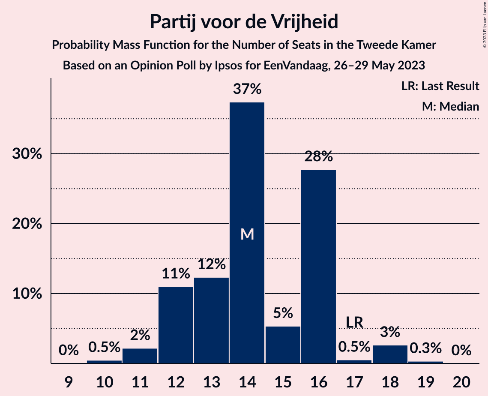

# Opinion Poll by Ipsos for EenVandaag, 26–29 May 2023

<a href="#voting-intentions">Voting Intentions</a> | <a href="#seats">Seats</a> | <a href="#coalitions">Coalitions</a> | <a href="#technical-information">Technical Information</a>

## Voting Intentions

### Confidence Intervals

| Party | Last Result | Poll Result | 80% Confidence Interval | 90% Confidence Interval | 95% Confidence Interval | 99% Confidence Interval |
|:-----:|:-----------:|:-----------:|:-----------------------:|:-----------------------:|:-----------------------:|:-----------------------:|
| Volkspartij voor Vrijheid en Democratie | 21.9% | 18.9% | 17.4–20.6% |17.0–21.1% |16.6–21.5% |15.9–22.3% |
| BoerBurgerBeweging | 1.0% | 16.2% | 14.8–17.8% |14.4–18.2% |14.1–18.6% |13.4–19.4% |
| Partij voor de Vrijheid | 10.8% | 9.1% | 8.1–10.4% |7.8–10.7% |7.5–11.1% |7.0–11.7% |
| GroenLinks | 5.2% | 8.2% | 7.2–9.4% |7.0–9.8% |6.7–10.1% |6.2–10.7% |
| Democraten 66 | 15.0% | 7.3% | 6.3–8.4% |6.1–8.7% |5.8–9.0% |5.4–9.6% |
| Partij voor de Dieren | 3.8% | 6.3% | 5.4–7.4% |5.2–7.7% |4.9–8.0% |4.6–8.5% |
| Partij van de Arbeid | 5.7% | 6.0% | 5.1–7.1% |4.9–7.4% |4.7–7.6% |4.3–8.2% |
| Christen-Democratisch Appèl | 9.5% | 4.1% | 3.4–5.0% |3.2–5.3% |3.1–5.5% |2.8–6.0% |
| Socialistische Partij | 6.0% | 4.1% | 3.4–5.0% |3.2–5.3% |3.1–5.5% |2.8–6.0% |
| Juiste Antwoord 2021 | 2.4% | 3.8% | 3.2–4.7% |3.0–5.0% |2.8–5.2% |2.5–5.7% |
| ChristenUnie | 3.4% | 3.3% | 2.7–4.2% |2.5–4.4% |2.4–4.6% |2.1–5.1% |
| Forum voor Democratie | 5.0% | 2.6% | 2.1–3.4% |2.0–3.6% |1.8–3.8% |1.6–4.2% |
| Volt Europa | 2.4% | 2.6% | 2.0–3.3% |1.9–3.5% |1.7–3.7% |1.5–4.1% |
| Staatkundig Gereformeerde Partij | 2.1% | 2.2% | 1.7–2.9% |1.5–3.1% |1.4–3.3% |1.2–3.6% |
| DENK | 2.0% | 2.1% | 1.6–2.8% |1.5–3.0% |1.4–3.1% |1.2–3.5% |
| Bij1 | 0.8% | 1.2% | 0.8–1.8% |0.7–1.9% |0.7–2.1% |0.5–2.4% |
| 50Plus | 1.0% | 0.7% | 0.4–1.2% |0.4–1.3% |0.3–1.4% |0.2–1.7% |

*Note:* The poll result column reflects the actual value used in the calculations. Published results may vary slightly, and in addition be rounded to fewer digits.

## Seats

### Confidence Intervals

| Party | Last Result | Median | 80% Confidence Interval | 90% Confidence Interval | 95% Confidence Interval | 99% Confidence Interval |
|:-----:|:-----------:|:------:|:-----------------------:|:-----------------------:|:-----------------------:|:-----------------------:|
| <a href="#volkspartij-voor-vrijheid-en-democratie">Volkspartij voor Vrijheid en Democratie</a> | 34 | 27 | 25–32 |25–32 |25–32 |25–37 |
| <a href="#boerburgerbeweging">BoerBurgerBeweging</a> | 1 | 24 | 22–26 |22–26 |22–28 |21–29 |
| <a href="#partij-voor-de-vrijheid">Partij voor de Vrijheid</a> | 17 | 14 | 12–16 |12–16 |11–18 |11–18 |
| <a href="#groenlinks">GroenLinks</a> | 8 | 13 | 10–14 |10–16 |10–16 |9–17 |
| <a href="#democraten-66">Democraten 66</a> | 24 | 11 | 9–14 |9–14 |9–14 |7–15 |
| <a href="#partij-voor-de-dieren">Partij voor de Dieren</a> | 6 | 9 | 7–12 |7–12 |7–12 |7–12 |
| <a href="#partij-van-de-arbeid">Partij van de Arbeid</a> | 9 | 8 | 7–10 |7–11 |7–13 |7–13 |
| <a href="#christen-democratisch-appèl">Christen-Democratisch Appèl</a> | 15 | 7 | 5–8 |5–8 |4–8 |4–10 |
| <a href="#socialistische-partij">Socialistische Partij</a> | 9 | 6 | 5–9 |4–9 |4–9 |4–9 |
| <a href="#juiste-antwoord-2021">Juiste Antwoord 2021</a> | 3 | 6 | 5–7 |4–7 |3–7 |3–8 |
| <a href="#christenunie">ChristenUnie</a> | 5 | 5 | 3–7 |3–7 |3–7 |3–8 |
| <a href="#forum-voor-democratie">Forum voor Democratie</a> | 8 | 4 | 3–5 |3–5 |3–5 |2–5 |
| <a href="#volt-europa">Volt Europa</a> | 3 | 4 | 3–6 |2–6 |2–6 |2–6 |
| <a href="#staatkundig-gereformeerde-partij">Staatkundig Gereformeerde Partij</a> | 3 | 3 | 2–4 |2–4 |2–5 |1–5 |
| <a href="#denk">DENK</a> | 3 | 2 | 2–4 |1–4 |1–5 |1–5 |
| <a href="#bij1">Bij1</a> | 1 | 2 | 1–3 |1–3 |1–3 |1–3 |
| <a href="#50plus">50Plus</a> | 1 | 1 | 0–1 |0–1 |0–2 |0–2 |

### Volkspartij voor Vrijheid en Democratie

*For a full overview of the results for this party, see the [Volkspartij voor Vrijheid en Democratie](party-volkspartijvoorvrijheidendemocratie.html) page.*

| Number of Seats | Probability | Accumulated | Special Marks |
|:---------------:|:-----------:|:-----------:|:-------------:|
| 21 | 0.1% | 100% |  |
| 22 | 0% | 99.9% |  |
| 23 | 0% | 99.9% |  |
| 24 | 0% | 99.9% |  |
| 25 | 28% | 99.9% |  |
| 26 | 12% | 72% |  |
| 27 | 17% | 60% | Median |
| 28 | 9% | 43% |  |
| 29 | 14% | 33% |  |
| 30 | 0.7% | 20% |  |
| 31 | 1.2% | 19% |  |
| 32 | 16% | 18% |  |
| 33 | 0.7% | 2% |  |
| 34 | 0.3% | 1.1% | Last Result |
| 35 | 0.1% | 0.8% |  |
| 36 | 0% | 0.8% |  |
| 37 | 0.8% | 0.8% |  |
| 38 | 0% | 0% |  |

### BoerBurgerBeweging

*For a full overview of the results for this party, see the [BoerBurgerBeweging](party-boerburgerbeweging.html) page.*

| Number of Seats | Probability | Accumulated | Special Marks |
|:---------------:|:-----------:|:-----------:|:-------------:|
| 1 | 0% | 100% | Last Result |
| 2 | 0% | 100% |  |
| 3 | 0% | 100% |  |
| 4 | 0% | 100% |  |
| 5 | 0% | 100% |  |
| 6 | 0% | 100% |  |
| 7 | 0% | 100% |  |
| 8 | 0% | 100% |  |
| 9 | 0% | 100% |  |
| 10 | 0% | 100% |  |
| 11 | 0% | 100% |  |
| 12 | 0% | 100% |  |
| 13 | 0% | 100% |  |
| 14 | 0% | 100% |  |
| 15 | 0% | 100% |  |
| 16 | 0% | 100% |  |
| 17 | 0% | 100% |  |
| 18 | 0% | 100% |  |
| 19 | 0.1% | 100% |  |
| 20 | 0.4% | 99.9% |  |
| 21 | 0.4% | 99.5% |  |
| 22 | 11% | 99.1% |  |
| 23 | 19% | 88% |  |
| 24 | 30% | 69% | Median |
| 25 | 16% | 39% |  |
| 26 | 20% | 23% |  |
| 27 | 0.4% | 3% |  |
| 28 | 2% | 3% |  |
| 29 | 0.4% | 0.9% |  |
| 30 | 0.2% | 0.5% |  |
| 31 | 0.3% | 0.3% |  |
| 32 | 0% | 0% |  |

### Partij voor de Vrijheid

*For a full overview of the results for this party, see the [Partij voor de Vrijheid](party-partijvoordevrijheid.html) page.*

| Number of Seats | Probability | Accumulated | Special Marks |
|:---------------:|:-----------:|:-----------:|:-------------:|
| 10 | 0.5% | 100% |  |
| 11 | 2% | 99.5% |  |
| 12 | 11% | 97% |  |
| 13 | 12% | 86% |  |
| 14 | 37% | 74% | Median |
| 15 | 5% | 37% |  |
| 16 | 28% | 31% |  |
| 17 | 0.5% | 3% | Last Result |
| 18 | 3% | 3% |  |
| 19 | 0.3% | 0.3% |  |
| 20 | 0% | 0% |  |

### GroenLinks

*For a full overview of the results for this party, see the [GroenLinks](party-groenlinks.html) page.*

| Number of Seats | Probability | Accumulated | Special Marks |
|:---------------:|:-----------:|:-----------:|:-------------:|
| 8 | 0.4% | 100% | Last Result |
| 9 | 0.8% | 99.6% |  |
| 10 | 14% | 98.8% |  |
| 11 | 17% | 85% |  |
| 12 | 8% | 68% |  |
| 13 | 34% | 60% | Median |
| 14 | 17% | 26% |  |
| 15 | 4% | 9% |  |
| 16 | 4% | 5% |  |
| 17 | 0.3% | 0.7% |  |
| 18 | 0.4% | 0.4% |  |
| 19 | 0% | 0% |  |

### Democraten 66

*For a full overview of the results for this party, see the [Democraten 66](party-democraten66.html) page.*

| Number of Seats | Probability | Accumulated | Special Marks |
|:---------------:|:-----------:|:-----------:|:-------------:|
| 7 | 1.0% | 100% |  |
| 8 | 1.4% | 98.9% |  |
| 9 | 9% | 98% |  |
| 10 | 18% | 89% |  |
| 11 | 31% | 70% | Median |
| 12 | 6% | 39% |  |
| 13 | 22% | 33% |  |
| 14 | 11% | 12% |  |
| 15 | 0.9% | 1.0% |  |
| 16 | 0% | 0.1% |  |
| 17 | 0.1% | 0.1% |  |
| 18 | 0% | 0% |  |
| 19 | 0% | 0% |  |
| 20 | 0% | 0% |  |
| 21 | 0% | 0% |  |
| 22 | 0% | 0% |  |
| 23 | 0% | 0% |  |
| 24 | 0% | 0% | Last Result |

### Partij voor de Dieren

*For a full overview of the results for this party, see the [Partij voor de Dieren](party-partijvoordedieren.html) page.*

| Number of Seats | Probability | Accumulated | Special Marks |
|:---------------:|:-----------:|:-----------:|:-------------:|
| 6 | 0.4% | 100% | Last Result |
| 7 | 15% | 99.5% |  |
| 8 | 17% | 85% |  |
| 9 | 32% | 68% | Median |
| 10 | 17% | 36% |  |
| 11 | 7% | 19% |  |
| 12 | 11% | 12% |  |
| 13 | 0.4% | 0.5% |  |
| 14 | 0% | 0% |  |

### Partij van de Arbeid

*For a full overview of the results for this party, see the [Partij van de Arbeid](party-partijvandearbeid.html) page.*

| Number of Seats | Probability | Accumulated | Special Marks |
|:---------------:|:-----------:|:-----------:|:-------------:|
| 6 | 0.2% | 100% |  |
| 7 | 32% | 99.8% |  |
| 8 | 27% | 67% | Median |
| 9 | 25% | 41% | Last Result |
| 10 | 9% | 16% |  |
| 11 | 4% | 7% |  |
| 12 | 0.2% | 3% |  |
| 13 | 3% | 3% |  |
| 14 | 0.1% | 0.1% |  |
| 15 | 0% | 0% |  |

### Christen-Democratisch Appèl

*For a full overview of the results for this party, see the [Christen-Democratisch Appèl](party-christen-democratischappèl.html) page.*

| Number of Seats | Probability | Accumulated | Special Marks |
|:---------------:|:-----------:|:-----------:|:-------------:|
| 3 | 0.1% | 100% |  |
| 4 | 4% | 99.9% |  |
| 5 | 14% | 96% |  |
| 6 | 24% | 83% |  |
| 7 | 23% | 58% | Median |
| 8 | 34% | 35% |  |
| 9 | 0.4% | 1.1% |  |
| 10 | 0.7% | 0.7% |  |
| 11 | 0% | 0% |  |
| 12 | 0% | 0% |  |
| 13 | 0% | 0% |  |
| 14 | 0% | 0% |  |
| 15 | 0% | 0% | Last Result |

### Socialistische Partij

*For a full overview of the results for this party, see the [Socialistische Partij](party-socialistischepartij.html) page.*

| Number of Seats | Probability | Accumulated | Special Marks |
|:---------------:|:-----------:|:-----------:|:-------------:|
| 3 | 0.1% | 100% |  |
| 4 | 6% | 99.9% |  |
| 5 | 8% | 94% |  |
| 6 | 46% | 86% | Median |
| 7 | 9% | 40% |  |
| 8 | 20% | 31% |  |
| 9 | 11% | 11% | Last Result |
| 10 | 0% | 0% |  |

### Juiste Antwoord 2021

*For a full overview of the results for this party, see the [Juiste Antwoord 2021](party-juisteantwoord2021.html) page.*

| Number of Seats | Probability | Accumulated | Special Marks |
|:---------------:|:-----------:|:-----------:|:-------------:|
| 3 | 3% | 100% | Last Result |
| 4 | 2% | 97% |  |
| 5 | 18% | 94% |  |
| 6 | 51% | 77% | Median |
| 7 | 24% | 26% |  |
| 8 | 2% | 2% |  |
| 9 | 0.1% | 0.1% |  |
| 10 | 0% | 0% |  |

### ChristenUnie

*For a full overview of the results for this party, see the [ChristenUnie](party-christenunie.html) page.*

| Number of Seats | Probability | Accumulated | Special Marks |
|:---------------:|:-----------:|:-----------:|:-------------:|
| 2 | 0.2% | 100% |  |
| 3 | 18% | 99.8% |  |
| 4 | 16% | 81% |  |
| 5 | 20% | 65% | Last Result, Median |
| 6 | 15% | 45% |  |
| 7 | 29% | 30% |  |
| 8 | 1.0% | 1.0% |  |
| 9 | 0% | 0% |  |

### Forum voor Democratie

*For a full overview of the results for this party, see the [Forum voor Democratie](party-forumvoordemocratie.html) page.*

| Number of Seats | Probability | Accumulated | Special Marks |
|:---------------:|:-----------:|:-----------:|:-------------:|
| 2 | 2% | 100% |  |
| 3 | 40% | 98% |  |
| 4 | 41% | 59% | Median |
| 5 | 17% | 17% |  |
| 6 | 0.4% | 0.5% |  |
| 7 | 0.1% | 0.1% |  |
| 8 | 0% | 0% | Last Result |

### Volt Europa

*For a full overview of the results for this party, see the [Volt Europa](party-volteuropa.html) page.*

| Number of Seats | Probability | Accumulated | Special Marks |
|:---------------:|:-----------:|:-----------:|:-------------:|
| 2 | 7% | 100% |  |
| 3 | 21% | 93% | Last Result |
| 4 | 27% | 72% | Median |
| 5 | 32% | 46% |  |
| 6 | 13% | 14% |  |
| 7 | 0.4% | 0.4% |  |
| 8 | 0% | 0% |  |

### Staatkundig Gereformeerde Partij

*For a full overview of the results for this party, see the [Staatkundig Gereformeerde Partij](party-staatkundiggereformeerdepartij.html) page.*

| Number of Seats | Probability | Accumulated | Special Marks |
|:---------------:|:-----------:|:-----------:|:-------------:|
| 1 | 0.7% | 100% |  |
| 2 | 23% | 99.3% |  |
| 3 | 43% | 76% | Last Result, Median |
| 4 | 29% | 33% |  |
| 5 | 4% | 4% |  |
| 6 | 0.1% | 0.1% |  |
| 7 | 0% | 0% |  |

### DENK

*For a full overview of the results for this party, see the [DENK](party-denk.html) page.*

| Number of Seats | Probability | Accumulated | Special Marks |
|:---------------:|:-----------:|:-----------:|:-------------:|
| 1 | 5% | 100% |  |
| 2 | 57% | 95% | Median |
| 3 | 12% | 38% | Last Result |
| 4 | 23% | 26% |  |
| 5 | 2% | 3% |  |
| 6 | 0.2% | 0.2% |  |
| 7 | 0% | 0% |  |

### Bij1

*For a full overview of the results for this party, see the [Bij1](party-bij1.html) page.*

| Number of Seats | Probability | Accumulated | Special Marks |
|:---------------:|:-----------:|:-----------:|:-------------:|
| 0 | 0.2% | 100% |  |
| 1 | 44% | 99.8% | Last Result |
| 2 | 34% | 56% | Median |
| 3 | 22% | 22% |  |
| 4 | 0.2% | 0.2% |  |
| 5 | 0% | 0% |  |

### 50Plus

*For a full overview of the results for this party, see the [50Plus](party-50plus.html) page.*

| Number of Seats | Probability | Accumulated | Special Marks |
|:---------------:|:-----------:|:-----------:|:-------------:|
| 0 | 39% | 100% |  |
| 1 | 58% | 61% | Last Result, Median |
| 2 | 3% | 3% |  |
| 3 | 0.3% | 0.3% |  |
| 4 | 0% | 0% |  |

## Coalitions

### Confidence Intervals

| Coalition | Last Result | Median | Majority? | 80% Confidence Interval | 90% Confidence Interval | 95% Confidence Interval | 99% Confidence Interval |
|:---------:|:-----------:|:------:|:---------:|:-----------------------:|:-----------------------:|:-----------------------:|:-----------------------:|
| Volkspartij voor Vrijheid en Democratie – GroenLinks – Democraten 66 – Christen-Democratisch Appèl – ChristenUnie | 86 | 63 | 0% | 61–66 | 60–67 | 60–68 | 56–70 |
| Volkspartij voor Vrijheid en Democratie – Democraten 66 – Partij van de Arbeid – Christen-Democratisch Appèl – ChristenUnie | 87 | 59 | 0% | 56–63 | 56–64 | 56–64 | 54–67 |
| Volkspartij voor Vrijheid en Democratie – Partij voor de Vrijheid – Christen-Democratisch Appèl – Forum voor Democratie – Staatkundig Gereformeerde Partij | 77 | 55 | 0% | 53–59 | 53–60 | 51–61 | 49–62 |
| Volkspartij voor Vrijheid en Democratie – Partij voor de Vrijheid – Christen-Democratisch Appèl – Forum voor Democratie | 74 | 52 | 0% | 50–56 | 50–56 | 48–59 | 45–59 |
| Volkspartij voor Vrijheid en Democratie – Democraten 66 – Christen-Democratisch Appèl – ChristenUnie | 78 | 50 | 0% | 49–53 | 48–55 | 47–56 | 45–57 |
| GroenLinks – Democraten 66 – Partij van de Arbeid – Christen-Democratisch Appèl – Socialistische Partij – ChristenUnie | 70 | 51 | 0% | 47–56 | 46–56 | 45–56 | 44–56 |
| Volkspartij voor Vrijheid en Democratie – Partij voor de Vrijheid – Christen-Democratisch Appèl | 66 | 49 | 0% | 46–52 | 46–52 | 45–55 | 42–55 |
| Volkspartij voor Vrijheid en Democratie – Democraten 66 – Partij van de Arbeid | 67 | 48 | 0% | 44–52 | 44–52 | 44–54 | 44–56 |
| Volkspartij voor Vrijheid en Democratie – Democraten 66 – Christen-Democratisch Appèl | 73 | 46 | 0% | 43–49 | 43–51 | 43–51 | 41–53 |
| Volkspartij voor Vrijheid en Democratie – Partij van de Arbeid – Christen-Democratisch Appèl | 58 | 42 | 0% | 40–45 | 40–49 | 39–49 | 39–52 |
| Volkspartij voor Vrijheid en Democratie – Christen-Democratisch Appèl – Forum voor Democratie – Staatkundig Gereformeerde Partij – 50Plus | 61 | 42 | 0% | 39–46 | 39–48 | 37–48 | 37–49 |
| Volkspartij voor Vrijheid en Democratie – Christen-Democratisch Appèl – Forum voor Democratie – Staatkundig Gereformeerde Partij | 60 | 41 | 0% | 38–45 | 38–47 | 37–48 | 37–48 |
| GroenLinks – Democraten 66 – Partij van de Arbeid – Christen-Democratisch Appèl – ChristenUnie | 61 | 45 | 0% | 41–47 | 40–47 | 39–47 | 37–50 |
| Volkspartij voor Vrijheid en Democratie – Christen-Democratisch Appèl – Forum voor Democratie – 50Plus | 58 | 38 | 0% | 36–42 | 36–44 | 34–44 | 34–46 |
| Volkspartij voor Vrijheid en Democratie – Christen-Democratisch Appèl – Forum voor Democratie | 57 | 37 | 0% | 35–41 | 35–44 | 34–44 | 33–45 |
| Volkspartij voor Vrijheid en Democratie – Partij van de Arbeid | 43 | 35 | 0% | 33–39 | 33–41 | 33–43 | 33–46 |
| Volkspartij voor Vrijheid en Democratie – Christen-Democratisch Appèl | 49 | 34 | 0% | 32–37 | 32–40 | 31–40 | 30–43 |
| Democraten 66 – Partij van de Arbeid – Christen-Democratisch Appèl | 48 | 27 | 0% | 24–31 | 21–31 | 21–31 | 21–32 |
| Partij van de Arbeid – Christen-Democratisch Appèl – ChristenUnie | 29 | 20 | 0% | 16–24 | 16–24 | 16–24 | 14–26 |
| Democraten 66 – Christen-Democratisch Appèl | 39 | 18 | 0% | 16–21 | 14–21 | 14–21 | 13–21 |
| Partij van de Arbeid – Christen-Democratisch Appèl | 24 | 15 | 0% | 12–17 | 12–18 | 12–18 | 11–21 |

### Volkspartij voor Vrijheid en Democratie – GroenLinks – Democraten 66 – Christen-Democratisch Appèl – ChristenUnie

| Number of Seats | Probability | Accumulated | Special Marks |
|:---------------:|:-----------:|:-----------:|:-------------:|
| 55 | 0% | 100% |  |
| 56 | 0.7% | 99.9% |  |
| 57 | 0.1% | 99.2% |  |
| 58 | 0.4% | 99.1% |  |
| 59 | 0.6% | 98.7% |  |
| 60 | 4% | 98% |  |
| 61 | 14% | 94% |  |
| 62 | 2% | 80% |  |
| 63 | 41% | 79% | Median |
| 64 | 4% | 37% |  |
| 65 | 8% | 33% |  |
| 66 | 18% | 25% |  |
| 67 | 4% | 7% |  |
| 68 | 1.0% | 3% |  |
| 69 | 1.2% | 2% |  |
| 70 | 0.9% | 1.2% |  |
| 71 | 0.2% | 0.2% |  |
| 72 | 0.1% | 0.1% |  |
| 73 | 0% | 0% |  |
| 74 | 0% | 0% |  |
| 75 | 0% | 0% |  |
| 76 | 0% | 0% | Majority |
| 77 | 0% | 0% |  |
| 78 | 0% | 0% |  |
| 79 | 0% | 0% |  |
| 80 | 0% | 0% |  |
| 81 | 0% | 0% |  |
| 82 | 0% | 0% |  |
| 83 | 0% | 0% |  |
| 84 | 0% | 0% |  |
| 85 | 0% | 0% |  |
| 86 | 0% | 0% | Last Result |

### Volkspartij voor Vrijheid en Democratie – Democraten 66 – Partij van de Arbeid – Christen-Democratisch Appèl – ChristenUnie

| Number of Seats | Probability | Accumulated | Special Marks |
|:---------------:|:-----------:|:-----------:|:-------------:|
| 52 | 0.2% | 100% |  |
| 53 | 0.2% | 99.8% |  |
| 54 | 0.1% | 99.5% |  |
| 55 | 0.9% | 99.4% |  |
| 56 | 13% | 98.5% |  |
| 57 | 10% | 86% |  |
| 58 | 15% | 75% | Median |
| 59 | 19% | 60% |  |
| 60 | 9% | 42% |  |
| 61 | 14% | 33% |  |
| 62 | 1.0% | 19% |  |
| 63 | 9% | 18% |  |
| 64 | 6% | 9% |  |
| 65 | 0.8% | 2% |  |
| 66 | 0.9% | 2% |  |
| 67 | 0.2% | 0.7% |  |
| 68 | 0.1% | 0.4% |  |
| 69 | 0% | 0.4% |  |
| 70 | 0% | 0.4% |  |
| 71 | 0% | 0.3% |  |
| 72 | 0.3% | 0.3% |  |
| 73 | 0% | 0% |  |
| 74 | 0% | 0% |  |
| 75 | 0% | 0% |  |
| 76 | 0% | 0% | Majority |
| 77 | 0% | 0% |  |
| 78 | 0% | 0% |  |
| 79 | 0% | 0% |  |
| 80 | 0% | 0% |  |
| 81 | 0% | 0% |  |
| 82 | 0% | 0% |  |
| 83 | 0% | 0% |  |
| 84 | 0% | 0% |  |
| 85 | 0% | 0% |  |
| 86 | 0% | 0% |  |
| 87 | 0% | 0% | Last Result |

### Volkspartij voor Vrijheid en Democratie – Partij voor de Vrijheid – Christen-Democratisch Appèl – Forum voor Democratie – Staatkundig Gereformeerde Partij

| Number of Seats | Probability | Accumulated | Special Marks |
|:---------------:|:-----------:|:-----------:|:-------------:|
| 49 | 1.0% | 100% |  |
| 50 | 0.2% | 99.0% |  |
| 51 | 2% | 98.8% |  |
| 52 | 1.0% | 97% |  |
| 53 | 9% | 96% |  |
| 54 | 32% | 86% |  |
| 55 | 19% | 54% | Median |
| 56 | 0.6% | 36% |  |
| 57 | 8% | 35% |  |
| 58 | 5% | 27% |  |
| 59 | 14% | 22% |  |
| 60 | 5% | 9% |  |
| 61 | 3% | 3% |  |
| 62 | 0.1% | 0.6% |  |
| 63 | 0.1% | 0.4% |  |
| 64 | 0.3% | 0.4% |  |
| 65 | 0.1% | 0.1% |  |
| 66 | 0% | 0% |  |
| 67 | 0% | 0% |  |
| 68 | 0% | 0% |  |
| 69 | 0% | 0% |  |
| 70 | 0% | 0% |  |
| 71 | 0% | 0% |  |
| 72 | 0% | 0% |  |
| 73 | 0% | 0% |  |
| 74 | 0% | 0% |  |
| 75 | 0% | 0% |  |
| 76 | 0% | 0% | Majority |
| 77 | 0% | 0% | Last Result |

### Volkspartij voor Vrijheid en Democratie – Partij voor de Vrijheid – Christen-Democratisch Appèl – Forum voor Democratie

| Number of Seats | Probability | Accumulated | Special Marks |
|:---------------:|:-----------:|:-----------:|:-------------:|
| 45 | 0.8% | 100% |  |
| 46 | 0.2% | 99.2% |  |
| 47 | 0.2% | 98.9% |  |
| 48 | 2% | 98.7% |  |
| 49 | 1.1% | 96% |  |
| 50 | 25% | 95% |  |
| 51 | 15% | 71% |  |
| 52 | 6% | 56% | Median |
| 53 | 24% | 49% |  |
| 54 | 0.9% | 26% |  |
| 55 | 2% | 25% |  |
| 56 | 19% | 23% |  |
| 57 | 1.3% | 5% |  |
| 58 | 0.1% | 4% |  |
| 59 | 3% | 3% |  |
| 60 | 0.1% | 0.2% |  |
| 61 | 0% | 0.1% |  |
| 62 | 0.1% | 0.1% |  |
| 63 | 0% | 0% |  |
| 64 | 0% | 0% |  |
| 65 | 0% | 0% |  |
| 66 | 0% | 0% |  |
| 67 | 0% | 0% |  |
| 68 | 0% | 0% |  |
| 69 | 0% | 0% |  |
| 70 | 0% | 0% |  |
| 71 | 0% | 0% |  |
| 72 | 0% | 0% |  |
| 73 | 0% | 0% |  |
| 74 | 0% | 0% | Last Result |

### Volkspartij voor Vrijheid en Democratie – Democraten 66 – Christen-Democratisch Appèl – ChristenUnie

| Number of Seats | Probability | Accumulated | Special Marks |
|:---------------:|:-----------:|:-----------:|:-------------:|
| 44 | 0.4% | 100% |  |
| 45 | 0.2% | 99.6% |  |
| 46 | 0.3% | 99.3% |  |
| 47 | 3% | 99.0% |  |
| 48 | 2% | 96% |  |
| 49 | 16% | 95% |  |
| 50 | 36% | 79% | Median |
| 51 | 4% | 43% |  |
| 52 | 4% | 39% |  |
| 53 | 26% | 35% |  |
| 54 | 1.3% | 9% |  |
| 55 | 6% | 8% |  |
| 56 | 0.1% | 3% |  |
| 57 | 2% | 2% |  |
| 58 | 0% | 0.5% |  |
| 59 | 0.4% | 0.4% |  |
| 60 | 0% | 0% |  |
| 61 | 0% | 0% |  |
| 62 | 0% | 0% |  |
| 63 | 0% | 0% |  |
| 64 | 0% | 0% |  |
| 65 | 0% | 0% |  |
| 66 | 0% | 0% |  |
| 67 | 0% | 0% |  |
| 68 | 0% | 0% |  |
| 69 | 0% | 0% |  |
| 70 | 0% | 0% |  |
| 71 | 0% | 0% |  |
| 72 | 0% | 0% |  |
| 73 | 0% | 0% |  |
| 74 | 0% | 0% |  |
| 75 | 0% | 0% |  |
| 76 | 0% | 0% | Majority |
| 77 | 0% | 0% |  |
| 78 | 0% | 0% | Last Result |

### GroenLinks – Democraten 66 – Partij van de Arbeid – Christen-Democratisch Appèl – Socialistische Partij – ChristenUnie

| Number of Seats | Probability | Accumulated | Special Marks |
|:---------------:|:-----------:|:-----------:|:-------------:|
| 41 | 0.3% | 100% |  |
| 42 | 0% | 99.7% |  |
| 43 | 0.1% | 99.7% |  |
| 44 | 0.9% | 99.6% |  |
| 45 | 3% | 98.7% |  |
| 46 | 6% | 96% |  |
| 47 | 5% | 90% |  |
| 48 | 5% | 85% |  |
| 49 | 18% | 80% |  |
| 50 | 0.5% | 62% | Median |
| 51 | 15% | 62% |  |
| 52 | 13% | 46% |  |
| 53 | 20% | 33% |  |
| 54 | 2% | 13% |  |
| 55 | 0.4% | 11% |  |
| 56 | 11% | 11% |  |
| 57 | 0% | 0.1% |  |
| 58 | 0% | 0% |  |
| 59 | 0% | 0% |  |
| 60 | 0% | 0% |  |
| 61 | 0% | 0% |  |
| 62 | 0% | 0% |  |
| 63 | 0% | 0% |  |
| 64 | 0% | 0% |  |
| 65 | 0% | 0% |  |
| 66 | 0% | 0% |  |
| 67 | 0% | 0% |  |
| 68 | 0% | 0% |  |
| 69 | 0% | 0% |  |
| 70 | 0% | 0% | Last Result |

### Volkspartij voor Vrijheid en Democratie – Partij voor de Vrijheid – Christen-Democratisch Appèl

| Number of Seats | Probability | Accumulated | Special Marks |
|:---------------:|:-----------:|:-----------:|:-------------:|
| 42 | 1.1% | 100% |  |
| 43 | 0.2% | 98.9% |  |
| 44 | 0.4% | 98.7% |  |
| 45 | 3% | 98% |  |
| 46 | 11% | 96% |  |
| 47 | 16% | 85% |  |
| 48 | 14% | 68% | Median |
| 49 | 25% | 54% |  |
| 50 | 4% | 29% |  |
| 51 | 14% | 25% |  |
| 52 | 6% | 11% |  |
| 53 | 0.4% | 5% |  |
| 54 | 0.5% | 4% |  |
| 55 | 4% | 4% |  |
| 56 | 0% | 0.2% |  |
| 57 | 0.1% | 0.1% |  |
| 58 | 0% | 0.1% |  |
| 59 | 0% | 0% |  |
| 60 | 0% | 0% |  |
| 61 | 0% | 0% |  |
| 62 | 0% | 0% |  |
| 63 | 0% | 0% |  |
| 64 | 0% | 0% |  |
| 65 | 0% | 0% |  |
| 66 | 0% | 0% | Last Result |

### Volkspartij voor Vrijheid en Democratie – Democraten 66 – Partij van de Arbeid

| Number of Seats | Probability | Accumulated | Special Marks |
|:---------------:|:-----------:|:-----------:|:-------------:|
| 41 | 0.1% | 100% |  |
| 42 | 0.1% | 99.9% |  |
| 43 | 0.3% | 99.8% |  |
| 44 | 27% | 99.5% |  |
| 45 | 13% | 72% |  |
| 46 | 1.3% | 59% | Median |
| 47 | 6% | 57% |  |
| 48 | 14% | 52% |  |
| 49 | 2% | 38% |  |
| 50 | 22% | 36% |  |
| 51 | 0.5% | 13% |  |
| 52 | 10% | 13% |  |
| 53 | 0.6% | 3% |  |
| 54 | 1.4% | 3% |  |
| 55 | 0.1% | 1.4% |  |
| 56 | 1.0% | 1.3% |  |
| 57 | 0% | 0.4% |  |
| 58 | 0% | 0.4% |  |
| 59 | 0.3% | 0.3% |  |
| 60 | 0% | 0% |  |
| 61 | 0% | 0% |  |
| 62 | 0% | 0% |  |
| 63 | 0% | 0% |  |
| 64 | 0% | 0% |  |
| 65 | 0% | 0% |  |
| 66 | 0% | 0% |  |
| 67 | 0% | 0% | Last Result |

### Volkspartij voor Vrijheid en Democratie – Democraten 66 – Christen-Democratisch Appèl

| Number of Seats | Probability | Accumulated | Special Marks |
|:---------------:|:-----------:|:-----------:|:-------------:|
| 39 | 0.1% | 100% |  |
| 40 | 0.2% | 99.9% |  |
| 41 | 0.3% | 99.6% |  |
| 42 | 0.7% | 99.4% |  |
| 43 | 31% | 98.6% |  |
| 44 | 3% | 68% |  |
| 45 | 2% | 65% | Median |
| 46 | 25% | 63% |  |
| 47 | 13% | 38% |  |
| 48 | 14% | 25% |  |
| 49 | 4% | 11% |  |
| 50 | 0.6% | 7% |  |
| 51 | 4% | 7% |  |
| 52 | 0.1% | 2% |  |
| 53 | 2% | 2% |  |
| 54 | 0.4% | 0.4% |  |
| 55 | 0% | 0% |  |
| 56 | 0% | 0% |  |
| 57 | 0% | 0% |  |
| 58 | 0% | 0% |  |
| 59 | 0% | 0% |  |
| 60 | 0% | 0% |  |
| 61 | 0% | 0% |  |
| 62 | 0% | 0% |  |
| 63 | 0% | 0% |  |
| 64 | 0% | 0% |  |
| 65 | 0% | 0% |  |
| 66 | 0% | 0% |  |
| 67 | 0% | 0% |  |
| 68 | 0% | 0% |  |
| 69 | 0% | 0% |  |
| 70 | 0% | 0% |  |
| 71 | 0% | 0% |  |
| 72 | 0% | 0% |  |
| 73 | 0% | 0% | Last Result |

### Volkspartij voor Vrijheid en Democratie – Partij van de Arbeid – Christen-Democratisch Appèl

| Number of Seats | Probability | Accumulated | Special Marks |
|:---------------:|:-----------:|:-----------:|:-------------:|
| 35 | 0.1% | 100% |  |
| 36 | 0% | 99.9% |  |
| 37 | 0% | 99.9% |  |
| 38 | 0.2% | 99.9% |  |
| 39 | 2% | 99.7% |  |
| 40 | 12% | 97% |  |
| 41 | 8% | 86% |  |
| 42 | 31% | 78% | Median |
| 43 | 24% | 47% |  |
| 44 | 11% | 23% |  |
| 45 | 4% | 13% |  |
| 46 | 0.2% | 9% |  |
| 47 | 0.2% | 9% |  |
| 48 | 0.5% | 8% |  |
| 49 | 6% | 8% |  |
| 50 | 0.6% | 2% |  |
| 51 | 0.1% | 1.2% |  |
| 52 | 0.8% | 1.2% |  |
| 53 | 0.4% | 0.4% |  |
| 54 | 0% | 0% |  |
| 55 | 0% | 0% |  |
| 56 | 0% | 0% |  |
| 57 | 0% | 0% |  |
| 58 | 0% | 0% | Last Result |

### Volkspartij voor Vrijheid en Democratie – Christen-Democratisch Appèl – Forum voor Democratie – Staatkundig Gereformeerde Partij – 50Plus

| Number of Seats | Probability | Accumulated | Special Marks |
|:---------------:|:-----------:|:-----------:|:-------------:|
| 35 | 0.1% | 100% |  |
| 36 | 0.3% | 99.9% |  |
| 37 | 2% | 99.6% |  |
| 38 | 0.2% | 97% |  |
| 39 | 12% | 97% |  |
| 40 | 18% | 85% |  |
| 41 | 17% | 67% |  |
| 42 | 13% | 51% | Median |
| 43 | 17% | 37% |  |
| 44 | 4% | 20% |  |
| 45 | 4% | 16% |  |
| 46 | 6% | 12% |  |
| 47 | 0.4% | 6% |  |
| 48 | 5% | 6% |  |
| 49 | 0.1% | 0.5% |  |
| 50 | 0.1% | 0.4% |  |
| 51 | 0.3% | 0.3% |  |
| 52 | 0% | 0% |  |
| 53 | 0% | 0% |  |
| 54 | 0% | 0% |  |
| 55 | 0% | 0% |  |
| 56 | 0% | 0% |  |
| 57 | 0% | 0% |  |
| 58 | 0% | 0% |  |
| 59 | 0% | 0% |  |
| 60 | 0% | 0% |  |
| 61 | 0% | 0% | Last Result |

### Volkspartij voor Vrijheid en Democratie – Christen-Democratisch Appèl – Forum voor Democratie – Staatkundig Gereformeerde Partij

| Number of Seats | Probability | Accumulated | Special Marks |
|:---------------:|:-----------:|:-----------:|:-------------:|
| 34 | 0.1% | 100% |  |
| 35 | 0% | 99.9% |  |
| 36 | 0.4% | 99.9% |  |
| 37 | 3% | 99.5% |  |
| 38 | 13% | 97% |  |
| 39 | 2% | 84% |  |
| 40 | 32% | 83% |  |
| 41 | 13% | 51% | Median |
| 42 | 5% | 38% |  |
| 43 | 16% | 33% |  |
| 44 | 5% | 17% |  |
| 45 | 5% | 12% |  |
| 46 | 0.7% | 7% |  |
| 47 | 1.1% | 6% |  |
| 48 | 5% | 5% |  |
| 49 | 0.1% | 0.4% |  |
| 50 | 0.3% | 0.3% |  |
| 51 | 0% | 0% |  |
| 52 | 0% | 0% |  |
| 53 | 0% | 0% |  |
| 54 | 0% | 0% |  |
| 55 | 0% | 0% |  |
| 56 | 0% | 0% |  |
| 57 | 0% | 0% |  |
| 58 | 0% | 0% |  |
| 59 | 0% | 0% |  |
| 60 | 0% | 0% | Last Result |

### GroenLinks – Democraten 66 – Partij van de Arbeid – Christen-Democratisch Appèl – ChristenUnie

| Number of Seats | Probability | Accumulated | Special Marks |
|:---------------:|:-----------:|:-----------:|:-------------:|
| 36 | 0.1% | 100% |  |
| 37 | 0.6% | 99.9% |  |
| 38 | 0.4% | 99.3% |  |
| 39 | 3% | 98.9% |  |
| 40 | 3% | 96% |  |
| 41 | 8% | 92% |  |
| 42 | 9% | 85% |  |
| 43 | 13% | 76% |  |
| 44 | 13% | 63% | Median |
| 45 | 15% | 50% |  |
| 46 | 7% | 35% |  |
| 47 | 28% | 29% |  |
| 48 | 0.2% | 1.1% |  |
| 49 | 0.3% | 0.9% |  |
| 50 | 0.6% | 0.6% |  |
| 51 | 0% | 0.1% |  |
| 52 | 0% | 0% |  |
| 53 | 0% | 0% |  |
| 54 | 0% | 0% |  |
| 55 | 0% | 0% |  |
| 56 | 0% | 0% |  |
| 57 | 0% | 0% |  |
| 58 | 0% | 0% |  |
| 59 | 0% | 0% |  |
| 60 | 0% | 0% |  |
| 61 | 0% | 0% | Last Result |

### Volkspartij voor Vrijheid en Democratie – Christen-Democratisch Appèl – Forum voor Democratie – 50Plus

| Number of Seats | Probability | Accumulated | Special Marks |
|:---------------:|:-----------:|:-----------:|:-------------:|
| 31 | 0.1% | 100% |  |
| 32 | 0% | 99.9% |  |
| 33 | 0.4% | 99.9% |  |
| 34 | 2% | 99.6% |  |
| 35 | 0.3% | 97% |  |
| 36 | 29% | 97% |  |
| 37 | 0.2% | 68% |  |
| 38 | 19% | 68% |  |
| 39 | 3% | 49% | Median |
| 40 | 25% | 46% |  |
| 41 | 4% | 21% |  |
| 42 | 8% | 17% |  |
| 43 | 2% | 9% |  |
| 44 | 6% | 7% |  |
| 45 | 0.5% | 2% |  |
| 46 | 1.2% | 1.2% |  |
| 47 | 0.1% | 0.1% |  |
| 48 | 0% | 0% |  |
| 49 | 0% | 0% |  |
| 50 | 0% | 0% |  |
| 51 | 0% | 0% |  |
| 52 | 0% | 0% |  |
| 53 | 0% | 0% |  |
| 54 | 0% | 0% |  |
| 55 | 0% | 0% |  |
| 56 | 0% | 0% |  |
| 57 | 0% | 0% |  |
| 58 | 0% | 0% | Last Result |

### Volkspartij voor Vrijheid en Democratie – Christen-Democratisch Appèl – Forum voor Democratie

| Number of Seats | Probability | Accumulated | Special Marks |
|:---------------:|:-----------:|:-----------:|:-------------:|
| 30 | 0.1% | 100% |  |
| 31 | 0% | 99.9% |  |
| 32 | 0% | 99.9% |  |
| 33 | 0.4% | 99.9% |  |
| 34 | 3% | 99.5% |  |
| 35 | 12% | 96% |  |
| 36 | 16% | 84% |  |
| 37 | 19% | 68% |  |
| 38 | 2% | 49% | Median |
| 39 | 14% | 47% |  |
| 40 | 16% | 33% |  |
| 41 | 8% | 17% |  |
| 42 | 2% | 10% |  |
| 43 | 1.2% | 7% |  |
| 44 | 5% | 6% |  |
| 45 | 1.1% | 1.3% |  |
| 46 | 0.1% | 0.1% |  |
| 47 | 0% | 0% |  |
| 48 | 0% | 0% |  |
| 49 | 0% | 0% |  |
| 50 | 0% | 0% |  |
| 51 | 0% | 0% |  |
| 52 | 0% | 0% |  |
| 53 | 0% | 0% |  |
| 54 | 0% | 0% |  |
| 55 | 0% | 0% |  |
| 56 | 0% | 0% |  |
| 57 | 0% | 0% | Last Result |

### Volkspartij voor Vrijheid en Democratie – Partij van de Arbeid

| Number of Seats | Probability | Accumulated | Special Marks |
|:---------------:|:-----------:|:-----------:|:-------------:|
| 29 | 0.1% | 100% |  |
| 30 | 0% | 99.9% |  |
| 31 | 0% | 99.9% |  |
| 32 | 0% | 99.9% |  |
| 33 | 12% | 99.9% |  |
| 34 | 31% | 88% |  |
| 35 | 8% | 57% | Median |
| 36 | 9% | 49% |  |
| 37 | 16% | 40% |  |
| 38 | 2% | 24% |  |
| 39 | 13% | 22% |  |
| 40 | 1.5% | 9% |  |
| 41 | 5% | 8% |  |
| 42 | 0.3% | 3% |  |
| 43 | 1.2% | 3% | Last Result |
| 44 | 0.6% | 2% |  |
| 45 | 0.4% | 1.1% |  |
| 46 | 0.8% | 0.8% |  |
| 47 | 0% | 0% |  |

### Volkspartij voor Vrijheid en Democratie – Christen-Democratisch Appèl

| Number of Seats | Probability | Accumulated | Special Marks |
|:---------------:|:-----------:|:-----------:|:-------------:|
| 27 | 0.1% | 100% |  |
| 28 | 0% | 99.9% |  |
| 29 | 0% | 99.9% |  |
| 30 | 0.6% | 99.9% |  |
| 31 | 3% | 99.3% |  |
| 32 | 14% | 96% |  |
| 33 | 25% | 82% |  |
| 34 | 10% | 57% | Median |
| 35 | 27% | 47% |  |
| 36 | 3% | 20% |  |
| 37 | 8% | 17% |  |
| 38 | 3% | 10% |  |
| 39 | 0.7% | 7% |  |
| 40 | 5% | 6% |  |
| 41 | 0.6% | 1.4% |  |
| 42 | 0% | 0.8% |  |
| 43 | 0.8% | 0.8% |  |
| 44 | 0% | 0% |  |
| 45 | 0% | 0% |  |
| 46 | 0% | 0% |  |
| 47 | 0% | 0% |  |
| 48 | 0% | 0% |  |
| 49 | 0% | 0% | Last Result |

### Democraten 66 – Partij van de Arbeid – Christen-Democratisch Appèl

| Number of Seats | Probability | Accumulated | Special Marks |
|:---------------:|:-----------:|:-----------:|:-------------:|
| 21 | 7% | 100% |  |
| 22 | 0.3% | 93% |  |
| 23 | 1.2% | 92% |  |
| 24 | 4% | 91% |  |
| 25 | 5% | 87% |  |
| 26 | 32% | 82% | Median |
| 27 | 30% | 50% |  |
| 28 | 7% | 20% |  |
| 29 | 1.0% | 13% |  |
| 30 | 0.3% | 12% |  |
| 31 | 11% | 11% |  |
| 32 | 0.3% | 0.7% |  |
| 33 | 0% | 0.4% |  |
| 34 | 0% | 0.4% |  |
| 35 | 0.4% | 0.4% |  |
| 36 | 0% | 0% |  |
| 37 | 0% | 0% |  |
| 38 | 0% | 0% |  |
| 39 | 0% | 0% |  |
| 40 | 0% | 0% |  |
| 41 | 0% | 0% |  |
| 42 | 0% | 0% |  |
| 43 | 0% | 0% |  |
| 44 | 0% | 0% |  |
| 45 | 0% | 0% |  |
| 46 | 0% | 0% |  |
| 47 | 0% | 0% |  |
| 48 | 0% | 0% | Last Result |

### Partij van de Arbeid – Christen-Democratisch Appèl – ChristenUnie

| Number of Seats | Probability | Accumulated | Special Marks |
|:---------------:|:-----------:|:-----------:|:-------------:|
| 14 | 2% | 100% |  |
| 15 | 0.1% | 98% |  |
| 16 | 9% | 98% |  |
| 17 | 2% | 89% |  |
| 18 | 18% | 87% |  |
| 19 | 19% | 69% |  |
| 20 | 0.8% | 50% | Median |
| 21 | 7% | 49% |  |
| 22 | 13% | 42% |  |
| 23 | 9% | 29% |  |
| 24 | 19% | 20% |  |
| 25 | 0.4% | 0.9% |  |
| 26 | 0.4% | 0.5% |  |
| 27 | 0% | 0.1% |  |
| 28 | 0% | 0% |  |
| 29 | 0% | 0% | Last Result |

### Democraten 66 – Christen-Democratisch Appèl

| Number of Seats | Probability | Accumulated | Special Marks |
|:---------------:|:-----------:|:-----------:|:-------------:|
| 12 | 0.1% | 100% |  |
| 13 | 1.3% | 99.9% |  |
| 14 | 7% | 98.6% |  |
| 15 | 1.0% | 91% |  |
| 16 | 4% | 90% |  |
| 17 | 5% | 86% |  |
| 18 | 34% | 81% | Median |
| 19 | 37% | 47% |  |
| 20 | 0.2% | 10% |  |
| 21 | 10% | 10% |  |
| 22 | 0.4% | 0.5% |  |
| 23 | 0.1% | 0.1% |  |
| 24 | 0% | 0% |  |
| 25 | 0% | 0% |  |
| 26 | 0% | 0% |  |
| 27 | 0% | 0% |  |
| 28 | 0% | 0% |  |
| 29 | 0% | 0% |  |
| 30 | 0% | 0% |  |
| 31 | 0% | 0% |  |
| 32 | 0% | 0% |  |
| 33 | 0% | 0% |  |
| 34 | 0% | 0% |  |
| 35 | 0% | 0% |  |
| 36 | 0% | 0% |  |
| 37 | 0% | 0% |  |
| 38 | 0% | 0% |  |
| 39 | 0% | 0% | Last Result |

### Partij van de Arbeid – Christen-Democratisch Appèl

| Number of Seats | Probability | Accumulated | Special Marks |
|:---------------:|:-----------:|:-----------:|:-------------:|
| 11 | 2% | 100% |  |
| 12 | 9% | 98% |  |
| 13 | 11% | 89% |  |
| 14 | 13% | 78% |  |
| 15 | 27% | 65% | Median |
| 16 | 2% | 38% |  |
| 17 | 30% | 36% |  |
| 18 | 4% | 6% |  |
| 19 | 0.9% | 1.4% |  |
| 20 | 0% | 0.6% |  |
| 21 | 0.4% | 0.5% |  |
| 22 | 0.1% | 0.1% |  |
| 23 | 0% | 0% |  |
| 24 | 0% | 0% | Last Result |

## Technical Information

### Opinion Poll

+ **Polling firm:** Ipsos
+ **Commissioner(s):** EenVandaag
+ **Fieldwork period:** 26–29 May 2023

### Calculations

+ **Sample size:** 1019
+ **Simulations done:** 1,048,576
+ **Error estimate:** 1.52%

