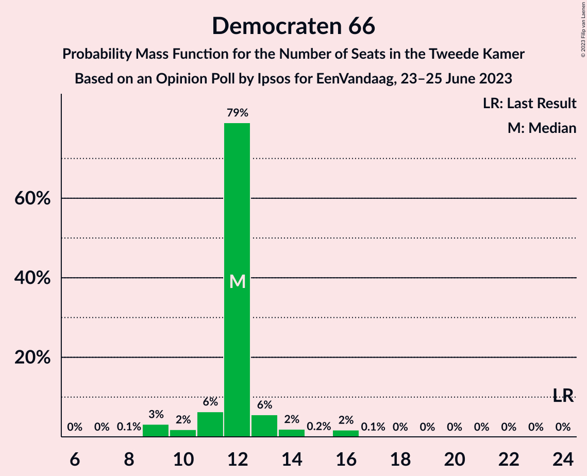

# Opinion Poll by Ipsos for EenVandaag, 23–25 June 2023

<a href="#voting-intentions">Voting Intentions</a> | <a href="#seats">Seats</a> | <a href="#coalitions">Coalitions</a> | <a href="#technical-information">Technical Information</a>

## Voting Intentions

### Confidence Intervals

| Party | Last Result | Poll Result | 80% Confidence Interval | 90% Confidence Interval | 95% Confidence Interval | 99% Confidence Interval |
|:-----:|:-----------:|:-----------:|:-----------------------:|:-----------------------:|:-----------------------:|:-----------------------:|
| Volkspartij voor Vrijheid en Democratie | 21.9% | 18.1% | 16.6–19.7% |16.2–20.2% |15.9–20.6% |15.2–21.4% |
| BoerBurgerBeweging | 1.0% | 14.5% | 13.2–16.0% |12.8–16.4% |12.5–16.8% |11.8–17.5% |
| Partij voor de Vrijheid | 10.8% | 9.6% | 8.5–10.9% |8.2–11.2% |7.9–11.6% |7.4–12.2% |
| Democraten 66 | 15.0% | 7.7% | 6.8–8.9% |6.5–9.3% |6.2–9.5% |5.8–10.1% |
| GroenLinks | 5.2% | 7.0% | 6.1–8.2% |5.9–8.5% |5.6–8.8% |5.2–9.4% |
| Partij voor de Dieren | 3.8% | 6.3% | 5.4–7.3% |5.1–7.7% |4.9–7.9% |4.5–8.5% |
| Partij van de Arbeid | 5.7% | 5.7% | 4.8–6.7% |4.6–7.0% |4.4–7.3% |4.0–7.8% |
| Christen-Democratisch Appèl | 9.5% | 5.1% | 4.3–6.1% |4.1–6.4% |3.9–6.6% |3.6–7.1% |
| Socialistische Partij | 6.0% | 4.8% | 4.0–5.8% |3.8–6.1% |3.6–6.3% |3.3–6.8% |
| Juiste Antwoord 2021 | 2.4% | 4.0% | 3.3–4.9% |3.1–5.2% |3.0–5.4% |2.7–5.9% |
| ChristenUnie | 3.4% | 3.7% | 3.1–4.6% |2.9–4.8% |2.7–5.1% |2.4–5.5% |
| Volt Europa | 2.4% | 3.6% | 3.0–4.5% |2.8–4.7% |2.6–5.0% |2.3–5.4% |
| DENK | 2.0% | 2.3% | 1.8–3.0% |1.6–3.2% |1.5–3.4% |1.3–3.7% |
| Forum voor Democratie | 5.0% | 2.3% | 1.8–3.0% |1.6–3.2% |1.5–3.4% |1.3–3.7% |
| Staatkundig Gereformeerde Partij | 2.1% | 1.9% | 1.4–2.5% |1.3–2.7% |1.2–2.9% |1.0–3.2% |
| Bij1 | 0.8% | 1.2% | 0.8–1.7% |0.7–1.9% |0.7–2.0% |0.5–2.3% |
| 50Plus | 1.0% | 0.7% | 0.4–1.2% |0.4–1.3% |0.3–1.4% |0.2–1.7% |

*Note:* The poll result column reflects the actual value used in the calculations. Published results may vary slightly, and in addition be rounded to fewer digits.

## Seats

### Confidence Intervals

| Party | Last Result | Median | 80% Confidence Interval | 90% Confidence Interval | 95% Confidence Interval | 99% Confidence Interval |
|:-----:|:-----------:|:------:|:-----------------------:|:-----------------------:|:-----------------------:|:-----------------------:|
| <a href="#volkspartij-voor-vrijheid-en-democratie">Volkspartij voor Vrijheid en Democratie</a> | 34 | 28 | 27–28 |25–30 |24–30 |24–31 |
| <a href="#boerburgerbeweging">BoerBurgerBeweging</a> | 1 | 26 | 20–26 |19–26 |19–26 |18–26 |
| <a href="#partij-voor-de-vrijheid">Partij voor de Vrijheid</a> | 17 | 13 | 13–16 |13–17 |13–18 |12–18 |
| <a href="#democraten-66">Democraten 66</a> | 24 | 12 | 11–12 |10–13 |9–14 |9–16 |
| <a href="#groenlinks">GroenLinks</a> | 8 | 13 | 11–13 |9–13 |9–13 |7–13 |
| <a href="#partij-voor-de-dieren">Partij voor de Dieren</a> | 6 | 9 | 9–11 |9–12 |8–13 |7–13 |
| <a href="#partij-van-de-arbeid">Partij van de Arbeid</a> | 9 | 7 | 7–9 |7–10 |7–12 |7–12 |
| <a href="#christen-democratisch-appèl">Christen-Democratisch Appèl</a> | 15 | 7 | 7–8 |7–9 |6–10 |5–11 |
| <a href="#socialistische-partij">Socialistische Partij</a> | 9 | 7 | 7 |6–8 |5–8 |5–10 |
| <a href="#juiste-antwoord-2021">Juiste Antwoord 2021</a> | 3 | 7 | 5–7 |4–7 |4–8 |4–8 |
| <a href="#christenunie">ChristenUnie</a> | 5 | 5 | 5–6 |5–7 |4–7 |3–8 |
| <a href="#volt-europa">Volt Europa</a> | 3 | 3 | 3–5 |3–7 |3–7 |3–8 |
| <a href="#denk">DENK</a> | 3 | 3 | 3–4 |2–4 |2–5 |2–5 |
| <a href="#forum-voor-democratie">Forum voor Democratie</a> | 8 | 2 | 2–4 |2–4 |2–5 |1–6 |
| <a href="#staatkundig-gereformeerde-partij">Staatkundig Gereformeerde Partij</a> | 3 | 3 | 2–3 |2–3 |2–4 |1–4 |
| <a href="#bij1">Bij1</a> | 1 | 2 | 1–2 |1–2 |0–3 |0–3 |
| <a href="#50plus">50Plus</a> | 1 | 1 | 0–1 |0–1 |0–2 |0–2 |

### Volkspartij voor Vrijheid en Democratie

*For a full overview of the results for this party, see the [Volkspartij voor Vrijheid en Democratie](party-volkspartijvoorvrijheidendemocratie.html) page.*

| Number of Seats | Probability | Accumulated | Special Marks |
|:---------------:|:-----------:|:-----------:|:-------------:|
| 23 | 0% | 100% |  |
| 24 | 4% | 99.9% |  |
| 25 | 3% | 96% |  |
| 26 | 1.2% | 93% |  |
| 27 | 5% | 92% |  |
| 28 | 80% | 87% | Median |
| 29 | 2% | 7% |  |
| 30 | 4% | 5% |  |
| 31 | 0.3% | 0.6% |  |
| 32 | 0% | 0.3% |  |
| 33 | 0% | 0.2% |  |
| 34 | 0.2% | 0.2% | Last Result |
| 35 | 0% | 0% |  |

### BoerBurgerBeweging

*For a full overview of the results for this party, see the [BoerBurgerBeweging](party-boerburgerbeweging.html) page.*

| Number of Seats | Probability | Accumulated | Special Marks |
|:---------------:|:-----------:|:-----------:|:-------------:|
| 1 | 0% | 100% | Last Result |
| 2 | 0% | 100% |  |
| 3 | 0% | 100% |  |
| 4 | 0% | 100% |  |
| 5 | 0% | 100% |  |
| 6 | 0% | 100% |  |
| 7 | 0% | 100% |  |
| 8 | 0% | 100% |  |
| 9 | 0% | 100% |  |
| 10 | 0% | 100% |  |
| 11 | 0% | 100% |  |
| 12 | 0% | 100% |  |
| 13 | 0% | 100% |  |
| 14 | 0% | 100% |  |
| 15 | 0% | 100% |  |
| 16 | 0% | 100% |  |
| 17 | 0.1% | 99.9% |  |
| 18 | 1.0% | 99.9% |  |
| 19 | 4% | 98.9% |  |
| 20 | 5% | 95% |  |
| 21 | 10% | 90% |  |
| 22 | 3% | 80% |  |
| 23 | 0.9% | 76% |  |
| 24 | 2% | 76% |  |
| 25 | 0.4% | 74% |  |
| 26 | 73% | 73% | Median |
| 27 | 0.3% | 0.3% |  |
| 28 | 0% | 0% |  |

### Partij voor de Vrijheid

*For a full overview of the results for this party, see the [Partij voor de Vrijheid](party-partijvoordevrijheid.html) page.*

| Number of Seats | Probability | Accumulated | Special Marks |
|:---------------:|:-----------:|:-----------:|:-------------:|
| 10 | 0.1% | 100% |  |
| 11 | 0.3% | 99.9% |  |
| 12 | 2% | 99.6% |  |
| 13 | 78% | 98% | Median |
| 14 | 4% | 20% |  |
| 15 | 4% | 16% |  |
| 16 | 2% | 11% |  |
| 17 | 6% | 9% | Last Result |
| 18 | 3% | 4% |  |
| 19 | 0.1% | 0.1% |  |
| 20 | 0% | 0% |  |

### Democraten 66

*For a full overview of the results for this party, see the [Democraten 66](party-democraten66.html) page.*

| Number of Seats | Probability | Accumulated | Special Marks |
|:---------------:|:-----------:|:-----------:|:-------------:|
| 8 | 0.1% | 100% |  |
| 9 | 3% | 99.9% |  |
| 10 | 2% | 97% |  |
| 11 | 6% | 95% |  |
| 12 | 79% | 89% | Median |
| 13 | 6% | 9% |  |
| 14 | 2% | 4% |  |
| 15 | 0.2% | 2% |  |
| 16 | 2% | 2% |  |
| 17 | 0.1% | 0.1% |  |
| 18 | 0% | 0% |  |
| 19 | 0% | 0% |  |
| 20 | 0% | 0% |  |
| 21 | 0% | 0% |  |
| 22 | 0% | 0% |  |
| 23 | 0% | 0% |  |
| 24 | 0% | 0% | Last Result |

### GroenLinks

*For a full overview of the results for this party, see the [GroenLinks](party-groenlinks.html) page.*

| Number of Seats | Probability | Accumulated | Special Marks |
|:---------------:|:-----------:|:-----------:|:-------------:|
| 7 | 0.9% | 100% |  |
| 8 | 1.4% | 99.1% | Last Result |
| 9 | 3% | 98% |  |
| 10 | 2% | 94% |  |
| 11 | 11% | 93% |  |
| 12 | 7% | 81% |  |
| 13 | 74% | 74% | Median |
| 14 | 0.3% | 0.4% |  |
| 15 | 0% | 0.1% |  |
| 16 | 0.1% | 0.1% |  |
| 17 | 0% | 0% |  |

### Partij voor de Dieren

*For a full overview of the results for this party, see the [Partij voor de Dieren](party-partijvoordedieren.html) page.*

| Number of Seats | Probability | Accumulated | Special Marks |
|:---------------:|:-----------:|:-----------:|:-------------:|
| 6 | 0% | 100% | Last Result |
| 7 | 2% | 100% |  |
| 8 | 0.5% | 98% |  |
| 9 | 77% | 97% | Median |
| 10 | 7% | 21% |  |
| 11 | 5% | 14% |  |
| 12 | 4% | 8% |  |
| 13 | 4% | 4% |  |
| 14 | 0% | 0% |  |

### Partij van de Arbeid

*For a full overview of the results for this party, see the [Partij van de Arbeid](party-partijvandearbeid.html) page.*

| Number of Seats | Probability | Accumulated | Special Marks |
|:---------------:|:-----------:|:-----------:|:-------------:|
| 6 | 0.3% | 100% |  |
| 7 | 75% | 99.6% | Median |
| 8 | 7% | 24% |  |
| 9 | 12% | 18% | Last Result |
| 10 | 2% | 5% |  |
| 11 | 0.7% | 4% |  |
| 12 | 3% | 3% |  |
| 13 | 0% | 0% |  |

### Christen-Democratisch Appèl

*For a full overview of the results for this party, see the [Christen-Democratisch Appèl](party-christen-democratischappèl.html) page.*

| Number of Seats | Probability | Accumulated | Special Marks |
|:---------------:|:-----------:|:-----------:|:-------------:|
| 5 | 1.1% | 100% |  |
| 6 | 3% | 98.9% |  |
| 7 | 84% | 96% | Median |
| 8 | 6% | 12% |  |
| 9 | 3% | 6% |  |
| 10 | 2% | 3% |  |
| 11 | 1.1% | 1.1% |  |
| 12 | 0% | 0% |  |
| 13 | 0% | 0% |  |
| 14 | 0% | 0% |  |
| 15 | 0% | 0% | Last Result |

### Socialistische Partij

*For a full overview of the results for this party, see the [Socialistische Partij](party-socialistischepartij.html) page.*

| Number of Seats | Probability | Accumulated | Special Marks |
|:---------------:|:-----------:|:-----------:|:-------------:|
| 5 | 3% | 100% |  |
| 6 | 7% | 97% |  |
| 7 | 81% | 90% | Median |
| 8 | 7% | 9% |  |
| 9 | 1.1% | 2% | Last Result |
| 10 | 0.8% | 0.9% |  |
| 11 | 0.1% | 0.1% |  |
| 12 | 0% | 0% |  |

### Juiste Antwoord 2021

*For a full overview of the results for this party, see the [Juiste Antwoord 2021](party-juisteantwoord2021.html) page.*

| Number of Seats | Probability | Accumulated | Special Marks |
|:---------------:|:-----------:|:-----------:|:-------------:|
| 3 | 0% | 100% | Last Result |
| 4 | 5% | 100% |  |
| 5 | 7% | 95% |  |
| 6 | 6% | 88% |  |
| 7 | 78% | 82% | Median |
| 8 | 4% | 4% |  |
| 9 | 0.2% | 0.2% |  |
| 10 | 0% | 0.1% |  |
| 11 | 0% | 0% |  |

### ChristenUnie

*For a full overview of the results for this party, see the [ChristenUnie](party-christenunie.html) page.*

| Number of Seats | Probability | Accumulated | Special Marks |
|:---------------:|:-----------:|:-----------:|:-------------:|
| 3 | 1.1% | 100% |  |
| 4 | 1.4% | 98.9% |  |
| 5 | 81% | 97% | Last Result, Median |
| 6 | 11% | 16% |  |
| 7 | 3% | 5% |  |
| 8 | 2% | 2% |  |
| 9 | 0.1% | 0.1% |  |
| 10 | 0% | 0% |  |

### Volt Europa

*For a full overview of the results for this party, see the [Volt Europa](party-volteuropa.html) page.*

| Number of Seats | Probability | Accumulated | Special Marks |
|:---------------:|:-----------:|:-----------:|:-------------:|
| 3 | 76% | 100% | Last Result, Median |
| 4 | 11% | 24% |  |
| 5 | 3% | 13% |  |
| 6 | 3% | 10% |  |
| 7 | 6% | 7% |  |
| 8 | 0.5% | 0.5% |  |
| 9 | 0% | 0% |  |

### DENK

*For a full overview of the results for this party, see the [DENK](party-denk.html) page.*

| Number of Seats | Probability | Accumulated | Special Marks |
|:---------------:|:-----------:|:-----------:|:-------------:|
| 1 | 0.1% | 100% |  |
| 2 | 7% | 99.9% |  |
| 3 | 80% | 93% | Last Result, Median |
| 4 | 9% | 13% |  |
| 5 | 4% | 4% |  |
| 6 | 0% | 0.1% |  |
| 7 | 0% | 0% |  |

### Forum voor Democratie

*For a full overview of the results for this party, see the [Forum voor Democratie](party-forumvoordemocratie.html) page.*

| Number of Seats | Probability | Accumulated | Special Marks |
|:---------------:|:-----------:|:-----------:|:-------------:|
| 1 | 0.6% | 100% |  |
| 2 | 80% | 99.4% | Median |
| 3 | 7% | 19% |  |
| 4 | 8% | 12% |  |
| 5 | 2% | 3% |  |
| 6 | 1.2% | 1.2% |  |
| 7 | 0% | 0% |  |
| 8 | 0% | 0% | Last Result |

### Staatkundig Gereformeerde Partij

*For a full overview of the results for this party, see the [Staatkundig Gereformeerde Partij](party-staatkundiggereformeerdepartij.html) page.*

| Number of Seats | Probability | Accumulated | Special Marks |
|:---------------:|:-----------:|:-----------:|:-------------:|
| 1 | 1.0% | 100% |  |
| 2 | 14% | 99.0% |  |
| 3 | 82% | 85% | Last Result, Median |
| 4 | 2% | 3% |  |
| 5 | 0.3% | 0.3% |  |
| 6 | 0% | 0% |  |

### Bij1

*For a full overview of the results for this party, see the [Bij1](party-bij1.html) page.*

| Number of Seats | Probability | Accumulated | Special Marks |
|:---------------:|:-----------:|:-----------:|:-------------:|
| 0 | 4% | 100% |  |
| 1 | 11% | 96% | Last Result |
| 2 | 82% | 85% | Median |
| 3 | 3% | 3% |  |
| 4 | 0% | 0% |  |

### 50Plus

*For a full overview of the results for this party, see the [50Plus](party-50plus.html) page.*

| Number of Seats | Probability | Accumulated | Special Marks |
|:---------------:|:-----------:|:-----------:|:-------------:|
| 0 | 16% | 100% |  |
| 1 | 81% | 84% | Last Result, Median |
| 2 | 3% | 3% |  |
| 3 | 0.1% | 0.1% |  |
| 4 | 0% | 0% |  |

## Coalitions

### Confidence Intervals

| Coalition | Last Result | Median | Majority? | 80% Confidence Interval | 90% Confidence Interval | 95% Confidence Interval | 99% Confidence Interval |
|:---------:|:-----------:|:------:|:---------:|:-----------------------:|:-----------------------:|:-----------------------:|:-----------------------:|
| Volkspartij voor Vrijheid en Democratie – BoerBurgerBeweging – GroenLinks – Partij van de Arbeid – Christen-Democratisch Appèl | 67 | 81 | 88% | 74–81 | 73–81 | 72–81 | 71–83 |
| Volkspartij voor Vrijheid en Democratie – BoerBurgerBeweging – GroenLinks – Partij van de Arbeid | 52 | 74 | 0.3% | 67–74 | 67–74 | 65–74 | 64–74 |
| Volkspartij voor Vrijheid en Democratie – Democraten 66 – GroenLinks – Partij van de Arbeid | 75 | 60 | 0% | 59–60 | 56–62 | 54–63 | 53–63 |
| Volkspartij voor Vrijheid en Democratie – BoerBurgerBeweging – Christen-Democratisch Appèl | 50 | 61 | 0% | 55–61 | 53–61 | 50–61 | 50–63 |
| Volkspartij voor Vrijheid en Democratie – Partij voor de Vrijheid – Christen-Democratisch Appèl – Forum voor Democratie – Staatkundig Gereformeerde Partij | 77 | 53 | 0% | 53–56 | 53–58 | 53–59 | 51–65 |
| Volkspartij voor Vrijheid en Democratie – Democraten 66 – Christen-Democratisch Appèl – ChristenUnie | 78 | 52 | 0% | 52–54 | 48–56 | 48–58 | 45–58 |
| Volkspartij voor Vrijheid en Democratie – GroenLinks – Partij van de Arbeid – Christen-Democratisch Appèl | 66 | 55 | 0% | 54–56 | 52–57 | 51–57 | 49–60 |
| Volkspartij voor Vrijheid en Democratie – Partij voor de Vrijheid – Christen-Democratisch Appèl – Forum voor Democratie | 74 | 50 | 0% | 50–54 | 50–55 | 50–57 | 48–63 |
| Democraten 66 – GroenLinks – Partij van de Arbeid – Christen-Democratisch Appèl – Socialistische Partij – ChristenUnie | 70 | 51 | 0% | 51–52 | 50–54 | 48–56 | 47–56 |
| Volkspartij voor Vrijheid en Democratie – Partij voor de Vrijheid – Christen-Democratisch Appèl | 66 | 48 | 0% | 48–50 | 48–52 | 47–53 | 45–58 |
| Volkspartij voor Vrijheid en Democratie – Democraten 66 – Christen-Democratisch Appèl | 73 | 47 | 0% | 47–49 | 43–50 | 42–51 | 40–52 |
| Volkspartij voor Vrijheid en Democratie – GroenLinks – Partij van de Arbeid | 51 | 48 | 0% | 46–48 | 45–49 | 44–50 | 42–51 |
| Democraten 66 – GroenLinks – Partij van de Arbeid – Christen-Democratisch Appèl – ChristenUnie | 61 | 44 | 0% | 44–46 | 43–47 | 41–48 | 39–49 |
| BoerBurgerBeweging – GroenLinks – Partij van de Arbeid | 18 | 46 | 0% | 41–46 | 38–46 | 37–46 | 36–46 |
| Volkspartij voor Vrijheid en Democratie – Christen-Democratisch Appèl – Forum voor Democratie – Staatkundig Gereformeerde Partij – 50Plus | 61 | 41 | 0% | 41–42 | 38–43 | 38–44 | 36–48 |
| Volkspartij voor Vrijheid en Democratie – Christen-Democratisch Appèl – Forum voor Democratie – Staatkundig Gereformeerde Partij | 60 | 40 | 0% | 40–42 | 37–43 | 37–44 | 35–47 |
| Democraten 66 – GroenLinks – Partij van de Arbeid – Christen-Democratisch Appèl | 56 | 39 | 0% | 39–40 | 38–41 | 36–43 | 34–43 |
| Volkspartij voor Vrijheid en Democratie – Christen-Democratisch Appèl – Forum voor Democratie – 50Plus | 58 | 38 | 0% | 38–39 | 36–40 | 35–41 | 34–46 |
| Volkspartij voor Vrijheid en Democratie – Christen-Democratisch Appèl – Forum voor Democratie | 57 | 37 | 0% | 37–39 | 35–40 | 34–41 | 34–45 |
| Volkspartij voor Vrijheid en Democratie – Christen-Democratisch Appèl | 49 | 35 | 0% | 34–36 | 32–37 | 31–38 | 31–40 |
| GroenLinks – Partij van de Arbeid – Christen-Democratisch Appèl – ChristenUnie | 37 | 32 | 0% | 32–34 | 31–35 | 30–36 | 27–37 |
| GroenLinks – Partij van de Arbeid – Christen-Democratisch Appèl | 32 | 27 | 0% | 27–28 | 26–30 | 24–31 | 23–31 |
| Democraten 66 – Christen-Democratisch Appèl | 39 | 19 | 0% | 19–20 | 18–21 | 16–22 | 14–23 |

### Volkspartij voor Vrijheid en Democratie – BoerBurgerBeweging – GroenLinks – Partij van de Arbeid – Christen-Democratisch Appèl

| Number of Seats | Probability | Accumulated | Special Marks |
|:---------------:|:-----------:|:-----------:|:-------------:|
| 67 | 0% | 100% | Last Result |
| 68 | 0% | 100% |  |
| 69 | 0% | 100% |  |
| 70 | 0.4% | 100% |  |
| 71 | 0.3% | 99.5% |  |
| 72 | 2% | 99.2% |  |
| 73 | 3% | 97% |  |
| 74 | 6% | 94% |  |
| 75 | 0.2% | 88% |  |
| 76 | 2% | 88% | Majority |
| 77 | 5% | 86% |  |
| 78 | 6% | 81% |  |
| 79 | 0.7% | 75% |  |
| 80 | 1.2% | 74% |  |
| 81 | 72% | 73% | Median |
| 82 | 0% | 0.6% |  |
| 83 | 0.3% | 0.5% |  |
| 84 | 0% | 0.2% |  |
| 85 | 0% | 0.2% |  |
| 86 | 0% | 0.2% |  |
| 87 | 0% | 0.2% |  |
| 88 | 0% | 0.2% |  |
| 89 | 0.2% | 0.2% |  |
| 90 | 0% | 0% |  |

### Volkspartij voor Vrijheid en Democratie – BoerBurgerBeweging – GroenLinks – Partij van de Arbeid

| Number of Seats | Probability | Accumulated | Special Marks |
|:---------------:|:-----------:|:-----------:|:-------------:|
| 52 | 0% | 100% | Last Result |
| 53 | 0% | 100% |  |
| 54 | 0% | 100% |  |
| 55 | 0% | 100% |  |
| 56 | 0% | 100% |  |
| 57 | 0% | 100% |  |
| 58 | 0% | 100% |  |
| 59 | 0% | 100% |  |
| 60 | 0.1% | 100% |  |
| 61 | 0% | 99.9% |  |
| 62 | 0.3% | 99.9% |  |
| 63 | 0.1% | 99.6% |  |
| 64 | 1.3% | 99.5% |  |
| 65 | 2% | 98% |  |
| 66 | 0.8% | 96% |  |
| 67 | 7% | 95% |  |
| 68 | 2% | 88% |  |
| 69 | 8% | 86% |  |
| 70 | 0.5% | 78% |  |
| 71 | 4% | 77% |  |
| 72 | 0.2% | 73% |  |
| 73 | 0.3% | 73% |  |
| 74 | 72% | 73% | Median |
| 75 | 0% | 0.3% |  |
| 76 | 0% | 0.3% | Majority |
| 77 | 0% | 0.2% |  |
| 78 | 0% | 0.2% |  |
| 79 | 0% | 0.2% |  |
| 80 | 0% | 0.2% |  |
| 81 | 0.2% | 0.2% |  |
| 82 | 0% | 0% |  |

### Volkspartij voor Vrijheid en Democratie – Democraten 66 – GroenLinks – Partij van de Arbeid

| Number of Seats | Probability | Accumulated | Special Marks |
|:---------------:|:-----------:|:-----------:|:-------------:|
| 50 | 0.1% | 100% |  |
| 51 | 0% | 99.9% |  |
| 52 | 0.1% | 99.9% |  |
| 53 | 1.3% | 99.8% |  |
| 54 | 2% | 98% |  |
| 55 | 0.7% | 97% |  |
| 56 | 2% | 96% |  |
| 57 | 0.6% | 94% |  |
| 58 | 1.2% | 93% |  |
| 59 | 7% | 92% |  |
| 60 | 78% | 85% | Median |
| 61 | 2% | 7% |  |
| 62 | 0.3% | 5% |  |
| 63 | 4% | 5% |  |
| 64 | 0.1% | 0.3% |  |
| 65 | 0.1% | 0.3% |  |
| 66 | 0% | 0.2% |  |
| 67 | 0% | 0.2% |  |
| 68 | 0% | 0.2% |  |
| 69 | 0.2% | 0.2% |  |
| 70 | 0% | 0% |  |
| 71 | 0% | 0% |  |
| 72 | 0% | 0% |  |
| 73 | 0% | 0% |  |
| 74 | 0% | 0% |  |
| 75 | 0% | 0% | Last Result |

### Volkspartij voor Vrijheid en Democratie – BoerBurgerBeweging – Christen-Democratisch Appèl

| Number of Seats | Probability | Accumulated | Special Marks |
|:---------------:|:-----------:|:-----------:|:-------------:|
| 50 | 3% | 100% | Last Result |
| 51 | 0.3% | 97% |  |
| 52 | 2% | 97% |  |
| 53 | 1.0% | 95% |  |
| 54 | 3% | 94% |  |
| 55 | 2% | 91% |  |
| 56 | 0.7% | 89% |  |
| 57 | 7% | 89% |  |
| 58 | 5% | 81% |  |
| 59 | 0.3% | 76% |  |
| 60 | 2% | 76% |  |
| 61 | 72% | 74% | Median |
| 62 | 0.8% | 1.5% |  |
| 63 | 0.3% | 0.7% |  |
| 64 | 0.2% | 0.4% |  |
| 65 | 0.2% | 0.2% |  |
| 66 | 0% | 0% |  |

### Volkspartij voor Vrijheid en Democratie – Partij voor de Vrijheid – Christen-Democratisch Appèl – Forum voor Democratie – Staatkundig Gereformeerde Partij

| Number of Seats | Probability | Accumulated | Special Marks |
|:---------------:|:-----------:|:-----------:|:-------------:|
| 49 | 0% | 100% |  |
| 50 | 0.1% | 99.9% |  |
| 51 | 2% | 99.8% |  |
| 52 | 0.4% | 98% |  |
| 53 | 74% | 98% | Median |
| 54 | 6% | 24% |  |
| 55 | 3% | 18% |  |
| 56 | 8% | 15% |  |
| 57 | 0.4% | 7% |  |
| 58 | 2% | 7% |  |
| 59 | 2% | 4% |  |
| 60 | 0.2% | 2% |  |
| 61 | 1.2% | 2% |  |
| 62 | 0% | 0.8% |  |
| 63 | 0% | 0.8% |  |
| 64 | 0% | 0.7% |  |
| 65 | 0.7% | 0.7% |  |
| 66 | 0% | 0% |  |
| 67 | 0% | 0% |  |
| 68 | 0% | 0% |  |
| 69 | 0% | 0% |  |
| 70 | 0% | 0% |  |
| 71 | 0% | 0% |  |
| 72 | 0% | 0% |  |
| 73 | 0% | 0% |  |
| 74 | 0% | 0% |  |
| 75 | 0% | 0% |  |
| 76 | 0% | 0% | Majority |
| 77 | 0% | 0% | Last Result |

### Volkspartij voor Vrijheid en Democratie – Democraten 66 – Christen-Democratisch Appèl – ChristenUnie

| Number of Seats | Probability | Accumulated | Special Marks |
|:---------------:|:-----------:|:-----------:|:-------------:|
| 45 | 0.5% | 100% |  |
| 46 | 0.4% | 99.4% |  |
| 47 | 1.1% | 99.0% |  |
| 48 | 5% | 98% |  |
| 49 | 0.2% | 93% |  |
| 50 | 1.5% | 93% |  |
| 51 | 1.2% | 92% |  |
| 52 | 74% | 91% | Median |
| 53 | 5% | 16% |  |
| 54 | 2% | 11% |  |
| 55 | 1.4% | 9% |  |
| 56 | 3% | 8% |  |
| 57 | 0.2% | 4% |  |
| 58 | 4% | 4% |  |
| 59 | 0.2% | 0.3% |  |
| 60 | 0% | 0% |  |
| 61 | 0% | 0% |  |
| 62 | 0% | 0% |  |
| 63 | 0% | 0% |  |
| 64 | 0% | 0% |  |
| 65 | 0% | 0% |  |
| 66 | 0% | 0% |  |
| 67 | 0% | 0% |  |
| 68 | 0% | 0% |  |
| 69 | 0% | 0% |  |
| 70 | 0% | 0% |  |
| 71 | 0% | 0% |  |
| 72 | 0% | 0% |  |
| 73 | 0% | 0% |  |
| 74 | 0% | 0% |  |
| 75 | 0% | 0% |  |
| 76 | 0% | 0% | Majority |
| 77 | 0% | 0% |  |
| 78 | 0% | 0% | Last Result |

### Volkspartij voor Vrijheid en Democratie – GroenLinks – Partij van de Arbeid – Christen-Democratisch Appèl

| Number of Seats | Probability | Accumulated | Special Marks |
|:---------------:|:-----------:|:-----------:|:-------------:|
| 47 | 0% | 100% |  |
| 48 | 0.4% | 99.9% |  |
| 49 | 0.1% | 99.5% |  |
| 50 | 1.2% | 99.4% |  |
| 51 | 0.9% | 98% |  |
| 52 | 4% | 97% |  |
| 53 | 0.8% | 93% |  |
| 54 | 3% | 92% |  |
| 55 | 77% | 90% | Median |
| 56 | 5% | 12% |  |
| 57 | 5% | 7% |  |
| 58 | 0.3% | 2% |  |
| 59 | 0.1% | 1.4% |  |
| 60 | 1.1% | 1.3% |  |
| 61 | 0% | 0.2% |  |
| 62 | 0% | 0.2% |  |
| 63 | 0% | 0.2% |  |
| 64 | 0% | 0.2% |  |
| 65 | 0% | 0.2% |  |
| 66 | 0.2% | 0.2% | Last Result |
| 67 | 0% | 0% |  |

### Volkspartij voor Vrijheid en Democratie – Partij voor de Vrijheid – Christen-Democratisch Appèl – Forum voor Democratie

| Number of Seats | Probability | Accumulated | Special Marks |
|:---------------:|:-----------:|:-----------:|:-------------:|
| 47 | 0.1% | 100% |  |
| 48 | 0.5% | 99.9% |  |
| 49 | 1.1% | 99.3% |  |
| 50 | 73% | 98% | Median |
| 51 | 1.1% | 25% |  |
| 52 | 8% | 24% |  |
| 53 | 6% | 16% |  |
| 54 | 5% | 10% |  |
| 55 | 2% | 6% |  |
| 56 | 0.1% | 4% |  |
| 57 | 1.3% | 3% |  |
| 58 | 1.2% | 2% |  |
| 59 | 0.1% | 0.9% |  |
| 60 | 0% | 0.8% |  |
| 61 | 0% | 0.8% |  |
| 62 | 0% | 0.7% |  |
| 63 | 0.7% | 0.7% |  |
| 64 | 0% | 0% |  |
| 65 | 0% | 0% |  |
| 66 | 0% | 0% |  |
| 67 | 0% | 0% |  |
| 68 | 0% | 0% |  |
| 69 | 0% | 0% |  |
| 70 | 0% | 0% |  |
| 71 | 0% | 0% |  |
| 72 | 0% | 0% |  |
| 73 | 0% | 0% |  |
| 74 | 0% | 0% | Last Result |

### Democraten 66 – GroenLinks – Partij van de Arbeid – Christen-Democratisch Appèl – Socialistische Partij – ChristenUnie

| Number of Seats | Probability | Accumulated | Special Marks |
|:---------------:|:-----------:|:-----------:|:-------------:|
| 44 | 0.2% | 100% |  |
| 45 | 0% | 99.8% |  |
| 46 | 0.1% | 99.8% |  |
| 47 | 1.1% | 99.7% |  |
| 48 | 1.3% | 98.6% |  |
| 49 | 0.7% | 97% |  |
| 50 | 3% | 97% |  |
| 51 | 73% | 94% | Median |
| 52 | 12% | 21% |  |
| 53 | 3% | 9% |  |
| 54 | 2% | 5% |  |
| 55 | 0.1% | 3% |  |
| 56 | 3% | 3% |  |
| 57 | 0.1% | 0.4% |  |
| 58 | 0.1% | 0.3% |  |
| 59 | 0% | 0.2% |  |
| 60 | 0.2% | 0.2% |  |
| 61 | 0% | 0% |  |
| 62 | 0% | 0% |  |
| 63 | 0% | 0% |  |
| 64 | 0% | 0% |  |
| 65 | 0% | 0% |  |
| 66 | 0% | 0% |  |
| 67 | 0% | 0% |  |
| 68 | 0% | 0% |  |
| 69 | 0% | 0% |  |
| 70 | 0% | 0% | Last Result |

### Volkspartij voor Vrijheid en Democratie – Partij voor de Vrijheid – Christen-Democratisch Appèl

| Number of Seats | Probability | Accumulated | Special Marks |
|:---------------:|:-----------:|:-----------:|:-------------:|
| 44 | 0.1% | 100% |  |
| 45 | 0.5% | 99.9% |  |
| 46 | 0.6% | 99.4% |  |
| 47 | 2% | 98.8% |  |
| 48 | 76% | 97% | Median |
| 49 | 7% | 21% |  |
| 50 | 4% | 14% |  |
| 51 | 2% | 10% |  |
| 52 | 6% | 8% |  |
| 53 | 0.3% | 3% |  |
| 54 | 0.2% | 2% |  |
| 55 | 1.2% | 2% |  |
| 56 | 0.1% | 0.9% |  |
| 57 | 0% | 0.8% |  |
| 58 | 0.7% | 0.7% |  |
| 59 | 0% | 0% |  |
| 60 | 0% | 0% |  |
| 61 | 0% | 0% |  |
| 62 | 0% | 0% |  |
| 63 | 0% | 0% |  |
| 64 | 0% | 0% |  |
| 65 | 0% | 0% |  |
| 66 | 0% | 0% | Last Result |

### Volkspartij voor Vrijheid en Democratie – Democraten 66 – Christen-Democratisch Appèl

| Number of Seats | Probability | Accumulated | Special Marks |
|:---------------:|:-----------:|:-----------:|:-------------:|
| 40 | 0.7% | 100% |  |
| 41 | 2% | 99.3% |  |
| 42 | 1.1% | 98% |  |
| 43 | 3% | 97% |  |
| 44 | 0.5% | 93% |  |
| 45 | 2% | 93% |  |
| 46 | 0.4% | 91% |  |
| 47 | 79% | 91% | Median |
| 48 | 0.7% | 11% |  |
| 49 | 2% | 11% |  |
| 50 | 6% | 9% |  |
| 51 | 2% | 3% |  |
| 52 | 0.8% | 1.0% |  |
| 53 | 0.2% | 0.3% |  |
| 54 | 0% | 0.1% |  |
| 55 | 0% | 0% |  |
| 56 | 0% | 0% |  |
| 57 | 0% | 0% |  |
| 58 | 0% | 0% |  |
| 59 | 0% | 0% |  |
| 60 | 0% | 0% |  |
| 61 | 0% | 0% |  |
| 62 | 0% | 0% |  |
| 63 | 0% | 0% |  |
| 64 | 0% | 0% |  |
| 65 | 0% | 0% |  |
| 66 | 0% | 0% |  |
| 67 | 0% | 0% |  |
| 68 | 0% | 0% |  |
| 69 | 0% | 0% |  |
| 70 | 0% | 0% |  |
| 71 | 0% | 0% |  |
| 72 | 0% | 0% |  |
| 73 | 0% | 0% | Last Result |

### Volkspartij voor Vrijheid en Democratie – GroenLinks – Partij van de Arbeid

| Number of Seats | Probability | Accumulated | Special Marks |
|:---------------:|:-----------:|:-----------:|:-------------:|
| 40 | 0% | 100% |  |
| 41 | 0.4% | 99.9% |  |
| 42 | 0.2% | 99.5% |  |
| 43 | 1.2% | 99.3% |  |
| 44 | 2% | 98% |  |
| 45 | 3% | 96% |  |
| 46 | 3% | 92% |  |
| 47 | 1.2% | 90% |  |
| 48 | 82% | 88% | Median |
| 49 | 2% | 6% |  |
| 50 | 3% | 4% |  |
| 51 | 0.2% | 0.6% | Last Result |
| 52 | 0.1% | 0.4% |  |
| 53 | 0% | 0.3% |  |
| 54 | 0% | 0.2% |  |
| 55 | 0% | 0.2% |  |
| 56 | 0% | 0.2% |  |
| 57 | 0% | 0.2% |  |
| 58 | 0.2% | 0.2% |  |
| 59 | 0% | 0% |  |

### Democraten 66 – GroenLinks – Partij van de Arbeid – Christen-Democratisch Appèl – ChristenUnie

| Number of Seats | Probability | Accumulated | Special Marks |
|:---------------:|:-----------:|:-----------:|:-------------:|
| 38 | 0.1% | 100% |  |
| 39 | 0.8% | 99.9% |  |
| 40 | 0.2% | 99.1% |  |
| 41 | 2% | 98.9% |  |
| 42 | 0.9% | 97% |  |
| 43 | 2% | 96% |  |
| 44 | 74% | 94% | Median |
| 45 | 6% | 20% |  |
| 46 | 8% | 13% |  |
| 47 | 2% | 6% |  |
| 48 | 3% | 4% |  |
| 49 | 0.4% | 0.7% |  |
| 50 | 0% | 0.2% |  |
| 51 | 0% | 0.2% |  |
| 52 | 0.2% | 0.2% |  |
| 53 | 0% | 0% |  |
| 54 | 0% | 0% |  |
| 55 | 0% | 0% |  |
| 56 | 0% | 0% |  |
| 57 | 0% | 0% |  |
| 58 | 0% | 0% |  |
| 59 | 0% | 0% |  |
| 60 | 0% | 0% |  |
| 61 | 0% | 0% | Last Result |

### BoerBurgerBeweging – GroenLinks – Partij van de Arbeid

| Number of Seats | Probability | Accumulated | Special Marks |
|:---------------:|:-----------:|:-----------:|:-------------:|
| 18 | 0% | 100% | Last Result |
| 19 | 0% | 100% |  |
| 20 | 0% | 100% |  |
| 21 | 0% | 100% |  |
| 22 | 0% | 100% |  |
| 23 | 0% | 100% |  |
| 24 | 0% | 100% |  |
| 25 | 0% | 100% |  |
| 26 | 0% | 100% |  |
| 27 | 0% | 100% |  |
| 28 | 0% | 100% |  |
| 29 | 0% | 100% |  |
| 30 | 0% | 100% |  |
| 31 | 0% | 100% |  |
| 32 | 0% | 100% |  |
| 33 | 0% | 100% |  |
| 34 | 0.1% | 100% |  |
| 35 | 0% | 99.9% |  |
| 36 | 1.3% | 99.8% |  |
| 37 | 2% | 98.5% |  |
| 38 | 2% | 97% |  |
| 39 | 1.0% | 95% |  |
| 40 | 2% | 94% |  |
| 41 | 9% | 92% |  |
| 42 | 5% | 83% |  |
| 43 | 5% | 78% |  |
| 44 | 0.3% | 74% |  |
| 45 | 0.5% | 73% |  |
| 46 | 72% | 73% | Median |
| 47 | 0.5% | 0.5% |  |
| 48 | 0% | 0% |  |

### Volkspartij voor Vrijheid en Democratie – Christen-Democratisch Appèl – Forum voor Democratie – Staatkundig Gereformeerde Partij – 50Plus

| Number of Seats | Probability | Accumulated | Special Marks |
|:---------------:|:-----------:|:-----------:|:-------------:|
| 36 | 2% | 100% |  |
| 37 | 0.2% | 98% |  |
| 38 | 3% | 98% |  |
| 39 | 2% | 95% |  |
| 40 | 2% | 93% |  |
| 41 | 77% | 91% | Median |
| 42 | 5% | 14% |  |
| 43 | 5% | 9% |  |
| 44 | 1.3% | 4% |  |
| 45 | 0.1% | 2% |  |
| 46 | 0.3% | 2% |  |
| 47 | 0.2% | 2% |  |
| 48 | 2% | 2% |  |
| 49 | 0% | 0% |  |
| 50 | 0% | 0% |  |
| 51 | 0% | 0% |  |
| 52 | 0% | 0% |  |
| 53 | 0% | 0% |  |
| 54 | 0% | 0% |  |
| 55 | 0% | 0% |  |
| 56 | 0% | 0% |  |
| 57 | 0% | 0% |  |
| 58 | 0% | 0% |  |
| 59 | 0% | 0% |  |
| 60 | 0% | 0% |  |
| 61 | 0% | 0% | Last Result |

### Volkspartij voor Vrijheid en Democratie – Christen-Democratisch Appèl – Forum voor Democratie – Staatkundig Gereformeerde Partij

| Number of Seats | Probability | Accumulated | Special Marks |
|:---------------:|:-----------:|:-----------:|:-------------:|
| 35 | 0.9% | 100% |  |
| 36 | 2% | 99.1% |  |
| 37 | 3% | 98% |  |
| 38 | 0.5% | 95% |  |
| 39 | 2% | 94% |  |
| 40 | 76% | 92% | Median |
| 41 | 7% | 17% |  |
| 42 | 2% | 10% |  |
| 43 | 4% | 8% |  |
| 44 | 1.2% | 4% |  |
| 45 | 0.2% | 2% |  |
| 46 | 1.2% | 2% |  |
| 47 | 0.9% | 0.9% |  |
| 48 | 0% | 0% |  |
| 49 | 0% | 0% |  |
| 50 | 0% | 0% |  |
| 51 | 0% | 0% |  |
| 52 | 0% | 0% |  |
| 53 | 0% | 0% |  |
| 54 | 0% | 0% |  |
| 55 | 0% | 0% |  |
| 56 | 0% | 0% |  |
| 57 | 0% | 0% |  |
| 58 | 0% | 0% |  |
| 59 | 0% | 0% |  |
| 60 | 0% | 0% | Last Result |

### Democraten 66 – GroenLinks – Partij van de Arbeid – Christen-Democratisch Appèl

| Number of Seats | Probability | Accumulated | Special Marks |
|:---------------:|:-----------:|:-----------:|:-------------:|
| 32 | 0.1% | 100% |  |
| 33 | 0.3% | 99.9% |  |
| 34 | 0.6% | 99.6% |  |
| 35 | 0.2% | 99.0% |  |
| 36 | 3% | 98.8% |  |
| 37 | 0.2% | 95% |  |
| 38 | 3% | 95% |  |
| 39 | 78% | 92% | Median |
| 40 | 8% | 15% |  |
| 41 | 3% | 7% |  |
| 42 | 0.3% | 4% |  |
| 43 | 3% | 3% |  |
| 44 | 0.1% | 0.4% |  |
| 45 | 0% | 0.2% |  |
| 46 | 0.2% | 0.2% |  |
| 47 | 0% | 0% |  |
| 48 | 0% | 0% |  |
| 49 | 0% | 0% |  |
| 50 | 0% | 0% |  |
| 51 | 0% | 0% |  |
| 52 | 0% | 0% |  |
| 53 | 0% | 0% |  |
| 54 | 0% | 0% |  |
| 55 | 0% | 0% |  |
| 56 | 0% | 0% | Last Result |

### Volkspartij voor Vrijheid en Democratie – Christen-Democratisch Appèl – Forum voor Democratie – 50Plus

| Number of Seats | Probability | Accumulated | Special Marks |
|:---------------:|:-----------:|:-----------:|:-------------:|
| 33 | 0.3% | 100% |  |
| 34 | 2% | 99.7% |  |
| 35 | 0.7% | 98% |  |
| 36 | 4% | 97% |  |
| 37 | 0.8% | 94% |  |
| 38 | 75% | 93% | Median |
| 39 | 8% | 18% |  |
| 40 | 6% | 10% |  |
| 41 | 1.4% | 4% |  |
| 42 | 0.1% | 2% |  |
| 43 | 0.1% | 2% |  |
| 44 | 0.4% | 2% |  |
| 45 | 1.1% | 2% |  |
| 46 | 0.8% | 0.8% |  |
| 47 | 0% | 0% |  |
| 48 | 0% | 0% |  |
| 49 | 0% | 0% |  |
| 50 | 0% | 0% |  |
| 51 | 0% | 0% |  |
| 52 | 0% | 0% |  |
| 53 | 0% | 0% |  |
| 54 | 0% | 0% |  |
| 55 | 0% | 0% |  |
| 56 | 0% | 0% |  |
| 57 | 0% | 0% |  |
| 58 | 0% | 0% | Last Result |

### Volkspartij voor Vrijheid en Democratie – Christen-Democratisch Appèl – Forum voor Democratie

| Number of Seats | Probability | Accumulated | Special Marks |
|:---------------:|:-----------:|:-----------:|:-------------:|
| 32 | 0.3% | 100% |  |
| 33 | 0.1% | 99.7% |  |
| 34 | 2% | 99.5% |  |
| 35 | 3% | 97% |  |
| 36 | 1.0% | 94% |  |
| 37 | 73% | 93% | Median |
| 38 | 7% | 20% |  |
| 39 | 5% | 13% |  |
| 40 | 4% | 8% |  |
| 41 | 1.2% | 4% |  |
| 42 | 0.1% | 2% |  |
| 43 | 1.1% | 2% |  |
| 44 | 0.4% | 1.1% |  |
| 45 | 0.7% | 0.8% |  |
| 46 | 0% | 0% |  |
| 47 | 0% | 0% |  |
| 48 | 0% | 0% |  |
| 49 | 0% | 0% |  |
| 50 | 0% | 0% |  |
| 51 | 0% | 0% |  |
| 52 | 0% | 0% |  |
| 53 | 0% | 0% |  |
| 54 | 0% | 0% |  |
| 55 | 0% | 0% |  |
| 56 | 0% | 0% |  |
| 57 | 0% | 0% | Last Result |

### Volkspartij voor Vrijheid en Democratie – Christen-Democratisch Appèl

| Number of Seats | Probability | Accumulated | Special Marks |
|:---------------:|:-----------:|:-----------:|:-------------:|
| 29 | 0.3% | 100% |  |
| 30 | 0% | 99.7% |  |
| 31 | 4% | 99.7% |  |
| 32 | 2% | 96% |  |
| 33 | 3% | 94% |  |
| 34 | 2% | 92% |  |
| 35 | 75% | 89% | Median |
| 36 | 7% | 14% |  |
| 37 | 4% | 7% |  |
| 38 | 1.2% | 3% |  |
| 39 | 0.2% | 2% |  |
| 40 | 2% | 2% |  |
| 41 | 0.1% | 0.3% |  |
| 42 | 0.2% | 0.2% |  |
| 43 | 0% | 0% |  |
| 44 | 0% | 0% |  |
| 45 | 0% | 0% |  |
| 46 | 0% | 0% |  |
| 47 | 0% | 0% |  |
| 48 | 0% | 0% |  |
| 49 | 0% | 0% | Last Result |

### GroenLinks – Partij van de Arbeid – Christen-Democratisch Appèl – ChristenUnie

| Number of Seats | Probability | Accumulated | Special Marks |
|:---------------:|:-----------:|:-----------:|:-------------:|
| 26 | 0.2% | 100% |  |
| 27 | 0.3% | 99.8% |  |
| 28 | 0.1% | 99.5% |  |
| 29 | 2% | 99.3% |  |
| 30 | 0.8% | 98% |  |
| 31 | 2% | 97% |  |
| 32 | 77% | 95% | Median |
| 33 | 4% | 18% |  |
| 34 | 7% | 14% |  |
| 35 | 3% | 7% |  |
| 36 | 3% | 4% |  |
| 37 | 0.2% | 0.7% | Last Result |
| 38 | 0.3% | 0.5% |  |
| 39 | 0.2% | 0.2% |  |
| 40 | 0% | 0% |  |

### GroenLinks – Partij van de Arbeid – Christen-Democratisch Appèl

| Number of Seats | Probability | Accumulated | Special Marks |
|:---------------:|:-----------:|:-----------:|:-------------:|
| 20 | 0.2% | 100% |  |
| 21 | 0% | 99.8% |  |
| 22 | 0.2% | 99.8% |  |
| 23 | 0.9% | 99.7% |  |
| 24 | 2% | 98.7% |  |
| 25 | 0.9% | 96% |  |
| 26 | 4% | 96% |  |
| 27 | 80% | 92% | Median |
| 28 | 5% | 12% |  |
| 29 | 0.7% | 7% |  |
| 30 | 2% | 7% |  |
| 31 | 4% | 5% |  |
| 32 | 0.2% | 0.4% | Last Result |
| 33 | 0.2% | 0.2% |  |
| 34 | 0% | 0% |  |

### Democraten 66 – Christen-Democratisch Appèl

| Number of Seats | Probability | Accumulated | Special Marks |
|:---------------:|:-----------:|:-----------:|:-------------:|
| 14 | 0.6% | 100% |  |
| 15 | 0.1% | 99.4% |  |
| 16 | 2% | 99.3% |  |
| 17 | 1.2% | 97% |  |
| 18 | 2% | 96% |  |
| 19 | 80% | 95% | Median |
| 20 | 8% | 15% |  |
| 21 | 3% | 7% |  |
| 22 | 2% | 4% |  |
| 23 | 2% | 2% |  |
| 24 | 0.1% | 0.1% |  |
| 25 | 0% | 0% |  |
| 26 | 0% | 0% |  |
| 27 | 0% | 0% |  |
| 28 | 0% | 0% |  |
| 29 | 0% | 0% |  |
| 30 | 0% | 0% |  |
| 31 | 0% | 0% |  |
| 32 | 0% | 0% |  |
| 33 | 0% | 0% |  |
| 34 | 0% | 0% |  |
| 35 | 0% | 0% |  |
| 36 | 0% | 0% |  |
| 37 | 0% | 0% |  |
| 38 | 0% | 0% |  |
| 39 | 0% | 0% | Last Result |

## Technical Information

### Opinion Poll

+ **Polling firm:** Ipsos
+ **Commissioner(s):** EenVandaag
+ **Fieldwork period:** 23–25 June 2023

### Calculations

+ **Sample size:** 1022
+ **Simulations done:** 1,048,576
+ **Error estimate:** 2.93%

