# Opinion Poll by Peil.nl, 14–15 July 2023

<a href="#voting-intentions">Voting Intentions</a> | <a href="#seats">Seats</a> | <a href="#coalitions">Coalitions</a> | <a href="#technical-information">Technical Information</a>

## Voting Intentions

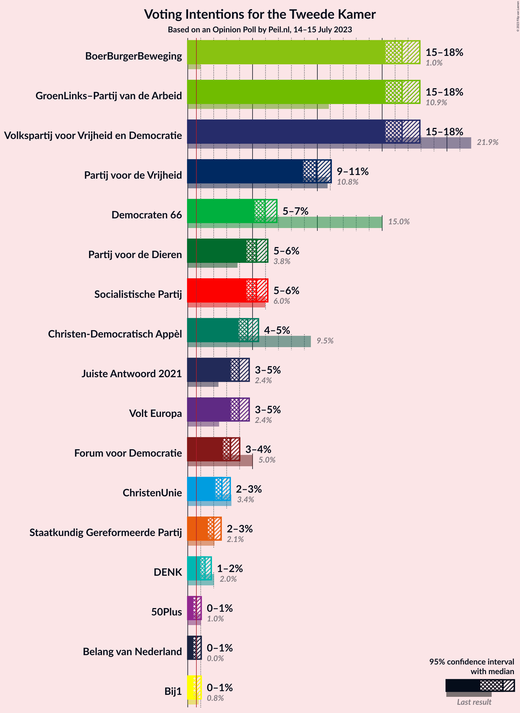

### Confidence Intervals

| Party | Last Result | Poll Result | 80% Confidence Interval | 90% Confidence Interval | 95% Confidence Interval | 99% Confidence Interval |
|:-----:|:-----------:|:-----------:|:-----------------------:|:-----------------------:|:-----------------------:|:-----------------------:|
| Volkspartij voor Vrijheid en Democratie | 21.9% | 16.5% | 15.7–17.4% |15.4–17.7% |15.2–17.9% |14.8–18.4% |
| BoerBurgerBeweging | 1.0% | 16.5% | 15.7–17.4% |15.4–17.7% |15.2–17.9% |14.8–18.4% |
| GroenLinks–Partij van de Arbeid | 10.9% | 16.5% | 15.7–17.4% |15.4–17.7% |15.2–17.9% |14.8–18.4% |
| Partij voor de Vrijheid | 10.8% | 9.9% | 9.3–10.7% |9.1–10.9% |8.9–11.1% |8.6–11.4% |
| Democraten 66 | 15.0% | 6.0% | 5.4–6.6% |5.3–6.7% |5.2–6.9% |4.9–7.2% |
| Socialistische Partij | 6.0% | 5.3% | 4.8–5.9% |4.7–6.0% |4.5–6.2% |4.3–6.4% |
| Partij voor de Dieren | 3.8% | 5.3% | 4.8–5.9% |4.7–6.0% |4.5–6.2% |4.3–6.4% |
| Christen-Democratisch Appèl | 9.5% | 4.6% | 4.2–5.2% |4.0–5.3% |3.9–5.5% |3.7–5.7% |
| Juiste Antwoord 2021 | 2.4% | 4.0% | 3.5–4.5% |3.4–4.6% |3.3–4.7% |3.1–5.0% |
| Volt Europa | 2.4% | 4.0% | 3.5–4.5% |3.4–4.6% |3.3–4.7% |3.1–5.0% |
| Forum voor Democratie | 5.0% | 3.3% | 2.9–3.8% |2.8–3.9% |2.7–4.0% |2.5–4.2% |
| ChristenUnie | 3.4% | 2.6% | 2.3–3.0% |2.2–3.2% |2.1–3.3% |2.0–3.5% |
| Staatkundig Gereformeerde Partij | 2.1% | 2.0% | 1.7–2.4% |1.6–2.5% |1.6–2.6% |1.4–2.8% |
| DENK | 2.0% | 1.3% | 1.1–1.6% |1.0–1.7% |1.0–1.8% |0.9–2.0% |
| 50Plus | 1.0% | 0.7% | 0.5–0.9% |0.5–1.0% |0.4–1.0% |0.4–1.2% |
| Bij1 | 0.8% | 0.7% | 0.5–0.9% |0.5–1.0% |0.4–1.0% |0.4–1.2% |
| Belang van Nederland | 0.0% | 0.7% | 0.5–0.9% |0.5–1.0% |0.4–1.0% |0.4–1.2% |

*Note:* The poll result column reflects the actual value used in the calculations. Published results may vary slightly, and in addition be rounded to fewer digits.

## Seats

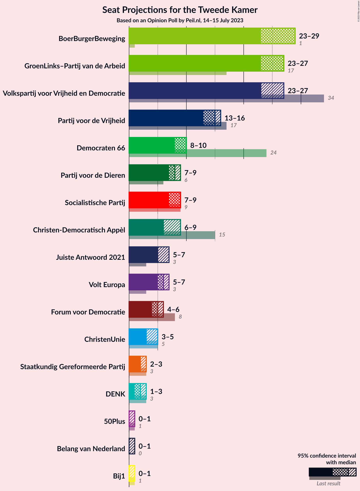

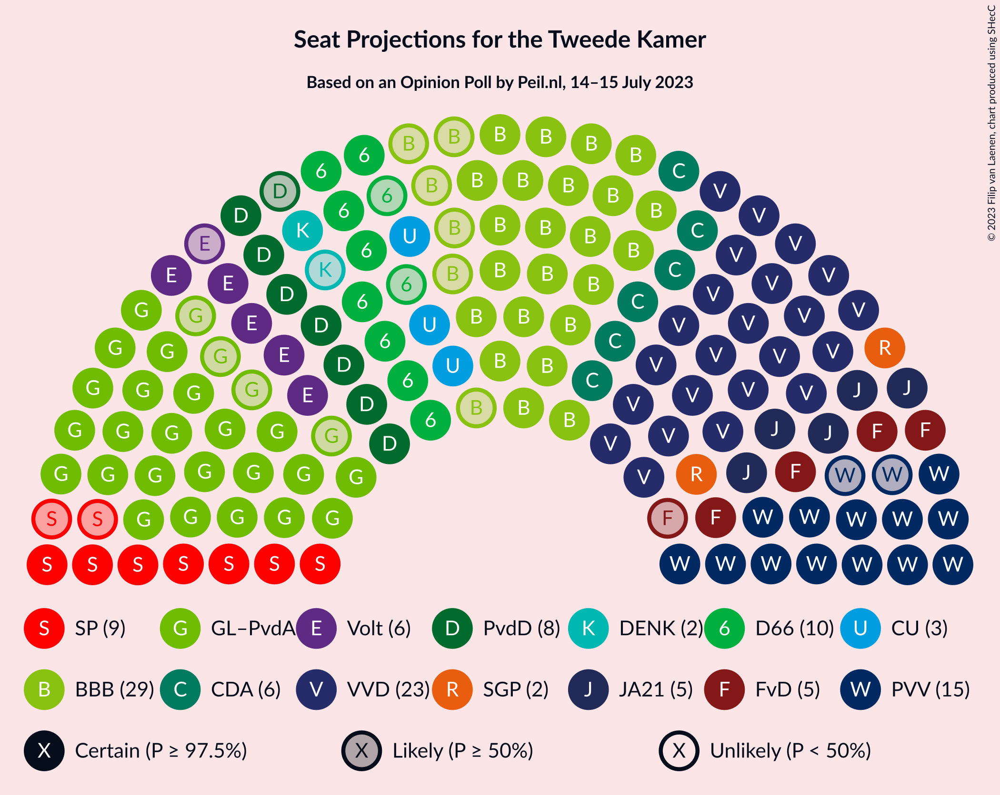

### Confidence Intervals

| Party | Last Result | Median | 80% Confidence Interval | 90% Confidence Interval | 95% Confidence Interval | 99% Confidence Interval |
|:-----:|:-----------:|:------:|:-----------------------:|:-----------------------:|:-----------------------:|:-----------------------:|
| <a href="#volkspartij-voor-vrijheid-en-democratie">Volkspartij voor Vrijheid en Democratie</a> | 34 | 23 | 23–27 |23–27 |23–27 |22–29 |
| <a href="#boerburgerbeweging">BoerBurgerBeweging</a> | 1 | 29 | 24–29 |24–29 |23–29 |23–29 |
| <a href="#groenlinks–partij-van-de-arbeid">GroenLinks–Partij van de Arbeid</a> | 17 | 27 | 24–27 |24–27 |23–27 |23–28 |
| <a href="#partij-voor-de-vrijheid">Partij voor de Vrijheid</a> | 17 | 15 | 15–16 |14–16 |13–16 |13–17 |
| <a href="#democraten-66">Democraten 66</a> | 24 | 10 | 10 |9–10 |8–10 |8–11 |
| <a href="#socialistische-partij">Socialistische Partij</a> | 9 | 9 | 7–9 |7–9 |7–9 |7–10 |
| <a href="#partij-voor-de-dieren">Partij voor de Dieren</a> | 6 | 8 | 8–9 |7–9 |7–9 |6–10 |
| <a href="#christen-democratisch-appèl">Christen-Democratisch Appèl</a> | 15 | 6 | 6–8 |6–8 |6–9 |5–10 |
| <a href="#juiste-antwoord-2021">Juiste Antwoord 2021</a> | 3 | 5 | 5–6 |5–7 |5–7 |5–8 |
| <a href="#volt-europa">Volt Europa</a> | 3 | 6 | 6 |5–6 |5–7 |4–7 |
| <a href="#forum-voor-democratie">Forum voor Democratie</a> | 8 | 5 | 4–5 |4–6 |4–6 |4–7 |
| <a href="#christenunie">ChristenUnie</a> | 5 | 3 | 3–4 |3–4 |3–5 |2–5 |
| <a href="#staatkundig-gereformeerde-partij">Staatkundig Gereformeerde Partij</a> | 3 | 2 | 2 |2–3 |2–3 |2–4 |
| <a href="#denk">DENK</a> | 3 | 2 | 1–2 |1–2 |1–3 |1–3 |
| <a href="#50plus">50Plus</a> | 1 | 0 | 0–1 |0–1 |0–1 |0–1 |
| <a href="#bij1">Bij1</a> | 1 | 0 | 0 |0–1 |0–1 |0–2 |
| <a href="#belang-van-nederland">Belang van Nederland</a> | 0 | 0 | 0–1 |0–1 |0–1 |0–1 |

### Volkspartij voor Vrijheid en Democratie

*For a full overview of the results for this party, see the [Volkspartij voor Vrijheid en Democratie](party-volkspartijvoorvrijheidendemocratie.html) page.*

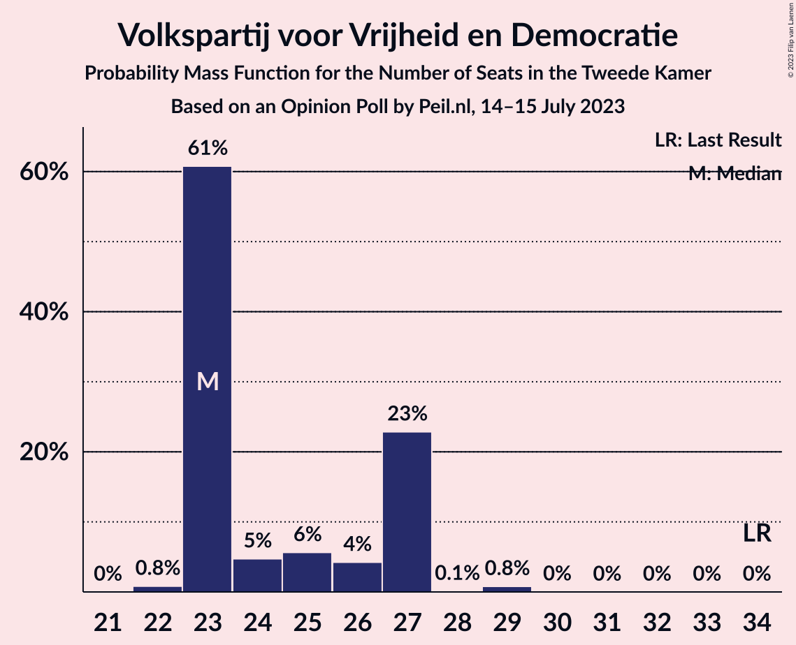

| Number of Seats | Probability | Accumulated | Special Marks |
|:---------------:|:-----------:|:-----------:|:-------------:|
| 22 | 0.8% | 100% |  |
| 23 | 61% | 99.2% | Median |
| 24 | 5% | 38% |  |
| 25 | 6% | 34% |  |
| 26 | 4% | 28% |  |
| 27 | 23% | 24% |  |
| 28 | 0.1% | 0.9% |  |
| 29 | 0.8% | 0.8% |  |
| 30 | 0% | 0% |  |
| 31 | 0% | 0% |  |
| 32 | 0% | 0% |  |
| 33 | 0% | 0% |  |
| 34 | 0% | 0% | Last Result |

### BoerBurgerBeweging

*For a full overview of the results for this party, see the [BoerBurgerBeweging](party-boerburgerbeweging.html) page.*

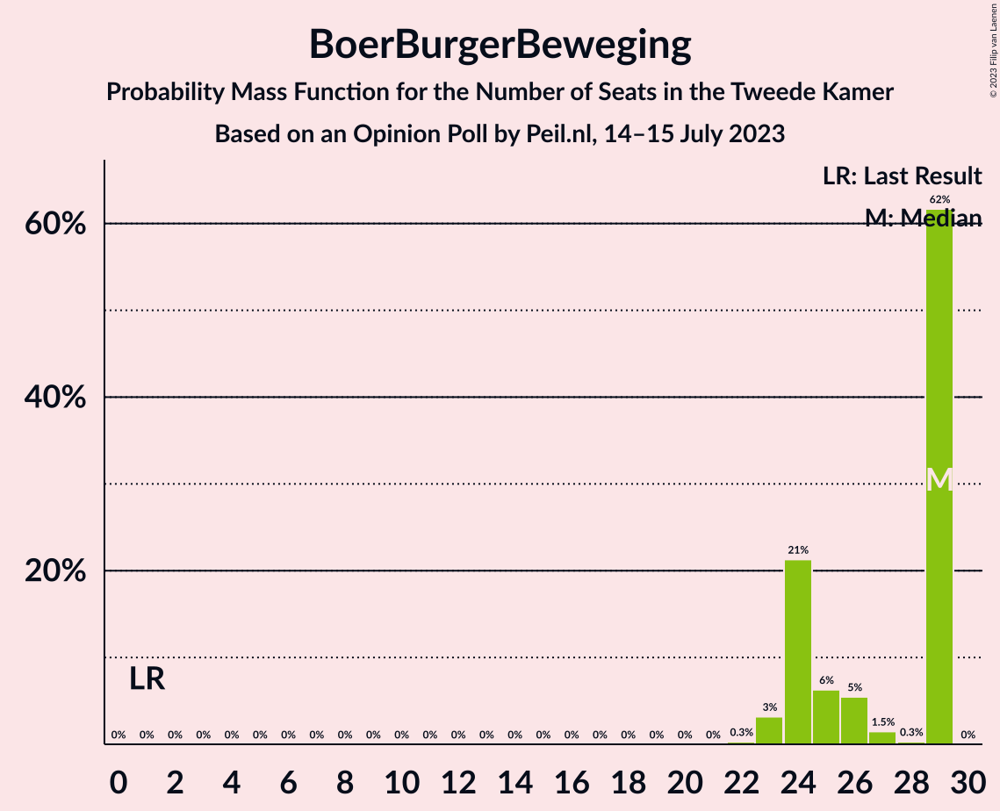

| Number of Seats | Probability | Accumulated | Special Marks |
|:---------------:|:-----------:|:-----------:|:-------------:|
| 1 | 0% | 100% | Last Result |
| 2 | 0% | 100% |  |
| 3 | 0% | 100% |  |
| 4 | 0% | 100% |  |
| 5 | 0% | 100% |  |
| 6 | 0% | 100% |  |
| 7 | 0% | 100% |  |
| 8 | 0% | 100% |  |
| 9 | 0% | 100% |  |
| 10 | 0% | 100% |  |
| 11 | 0% | 100% |  |
| 12 | 0% | 100% |  |
| 13 | 0% | 100% |  |
| 14 | 0% | 100% |  |
| 15 | 0% | 100% |  |
| 16 | 0% | 100% |  |
| 17 | 0% | 100% |  |
| 18 | 0% | 100% |  |
| 19 | 0% | 100% |  |
| 20 | 0% | 100% |  |
| 21 | 0% | 100% |  |
| 22 | 0.3% | 100% |  |
| 23 | 3% | 99.7% |  |
| 24 | 21% | 97% |  |
| 25 | 6% | 75% |  |
| 26 | 5% | 69% |  |
| 27 | 1.5% | 63% |  |
| 28 | 0.3% | 62% |  |
| 29 | 62% | 62% | Median |
| 30 | 0% | 0% |  |

### GroenLinks–Partij van de Arbeid

*For a full overview of the results for this party, see the [GroenLinks–Partij van de Arbeid](party-groenlinks–partijvandearbeid.html) page.*

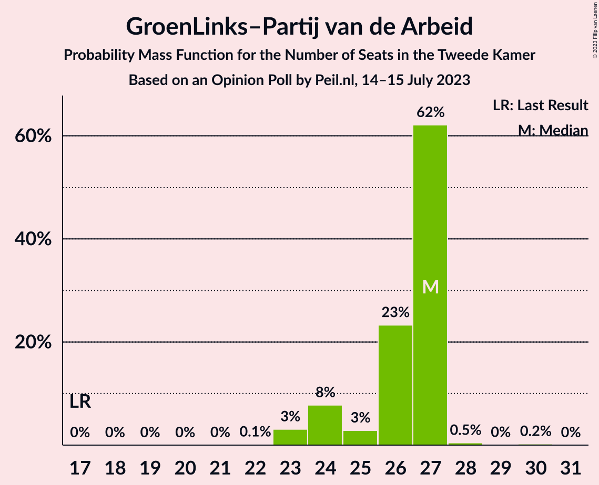

| Number of Seats | Probability | Accumulated | Special Marks |
|:---------------:|:-----------:|:-----------:|:-------------:|
| 17 | 0% | 100% | Last Result |
| 18 | 0% | 100% |  |
| 19 | 0% | 100% |  |
| 20 | 0% | 100% |  |
| 21 | 0% | 100% |  |
| 22 | 0.1% | 100% |  |
| 23 | 3% | 99.9% |  |
| 24 | 8% | 97% |  |
| 25 | 3% | 89% |  |
| 26 | 23% | 86% |  |
| 27 | 62% | 63% | Median |
| 28 | 0.5% | 0.7% |  |
| 29 | 0% | 0.3% |  |
| 30 | 0.2% | 0.2% |  |
| 31 | 0% | 0% |  |

### Partij voor de Vrijheid

*For a full overview of the results for this party, see the [Partij voor de Vrijheid](party-partijvoordevrijheid.html) page.*

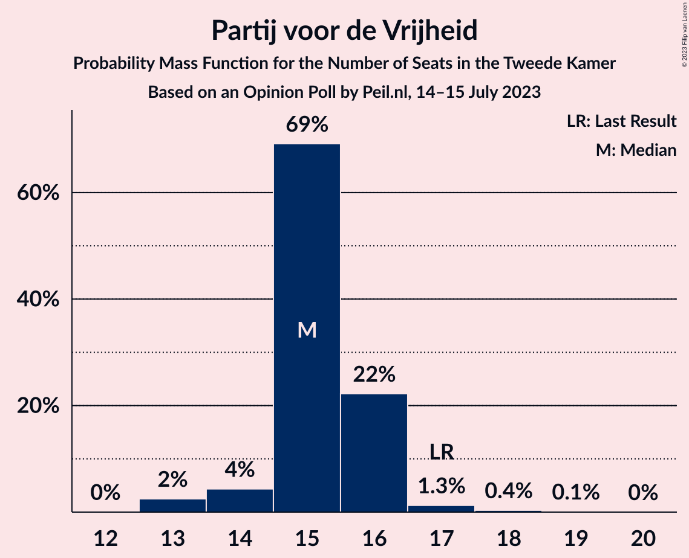

| Number of Seats | Probability | Accumulated | Special Marks |
|:---------------:|:-----------:|:-----------:|:-------------:|
| 13 | 2% | 100% |  |
| 14 | 4% | 97% |  |
| 15 | 69% | 93% | Median |
| 16 | 22% | 24% |  |
| 17 | 1.3% | 2% | Last Result |
| 18 | 0.4% | 0.5% |  |
| 19 | 0.1% | 0.1% |  |
| 20 | 0% | 0% |  |

### Democraten 66

*For a full overview of the results for this party, see the [Democraten 66](party-democraten66.html) page.*

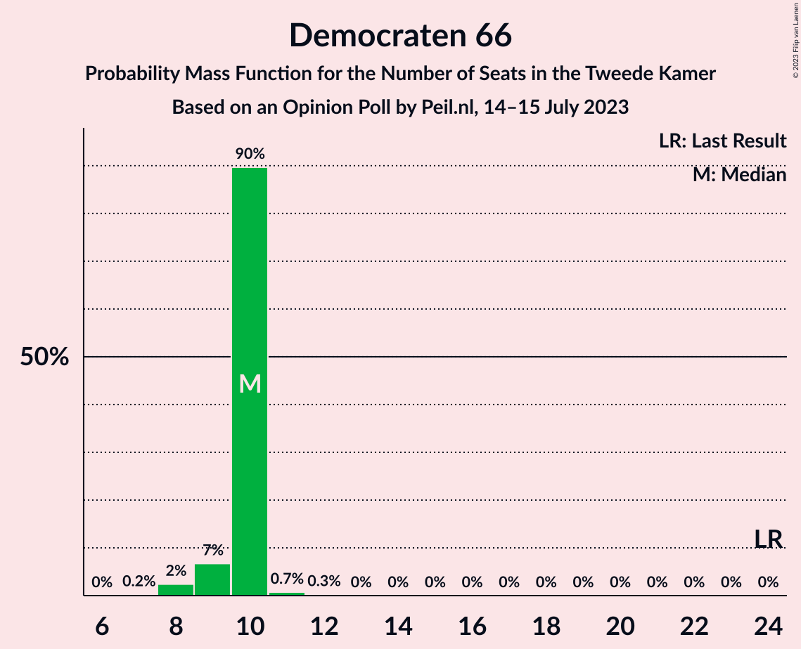

| Number of Seats | Probability | Accumulated | Special Marks |
|:---------------:|:-----------:|:-----------:|:-------------:|
| 7 | 0.2% | 100% |  |
| 8 | 2% | 99.8% |  |
| 9 | 7% | 97% |  |
| 10 | 90% | 91% | Median |
| 11 | 0.7% | 1.0% |  |
| 12 | 0.3% | 0.3% |  |
| 13 | 0% | 0% |  |
| 14 | 0% | 0% |  |
| 15 | 0% | 0% |  |
| 16 | 0% | 0% |  |
| 17 | 0% | 0% |  |
| 18 | 0% | 0% |  |
| 19 | 0% | 0% |  |
| 20 | 0% | 0% |  |
| 21 | 0% | 0% |  |
| 22 | 0% | 0% |  |
| 23 | 0% | 0% |  |
| 24 | 0% | 0% | Last Result |

### Socialistische Partij

*For a full overview of the results for this party, see the [Socialistische Partij](party-socialistischepartij.html) page.*

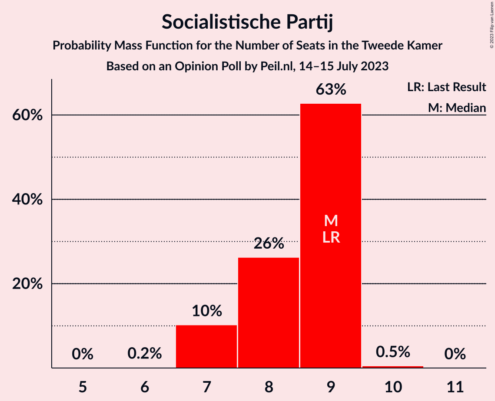

| Number of Seats | Probability | Accumulated | Special Marks |
|:---------------:|:-----------:|:-----------:|:-------------:|
| 6 | 0.2% | 100% |  |
| 7 | 10% | 99.8% |  |
| 8 | 26% | 90% |  |
| 9 | 63% | 63% | Last Result, Median |
| 10 | 0.5% | 0.5% |  |
| 11 | 0% | 0% |  |

### Partij voor de Dieren

*For a full overview of the results for this party, see the [Partij voor de Dieren](party-partijvoordedieren.html) page.*

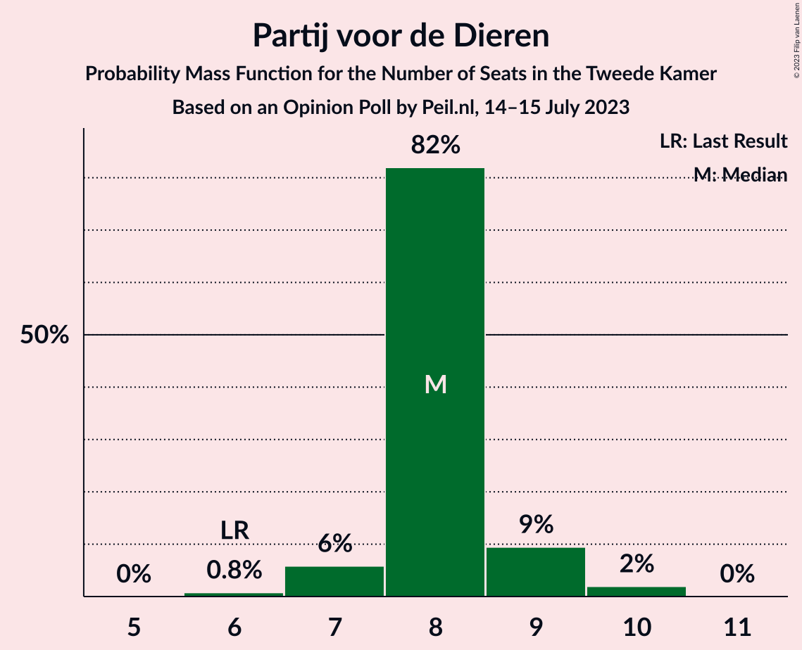

| Number of Seats | Probability | Accumulated | Special Marks |
|:---------------:|:-----------:|:-----------:|:-------------:|
| 6 | 0.8% | 100% | Last Result |
| 7 | 6% | 99.2% |  |
| 8 | 82% | 93% | Median |
| 9 | 9% | 11% |  |
| 10 | 2% | 2% |  |
| 11 | 0% | 0% |  |

### Christen-Democratisch Appèl

*For a full overview of the results for this party, see the [Christen-Democratisch Appèl](party-christen-democratischappèl.html) page.*

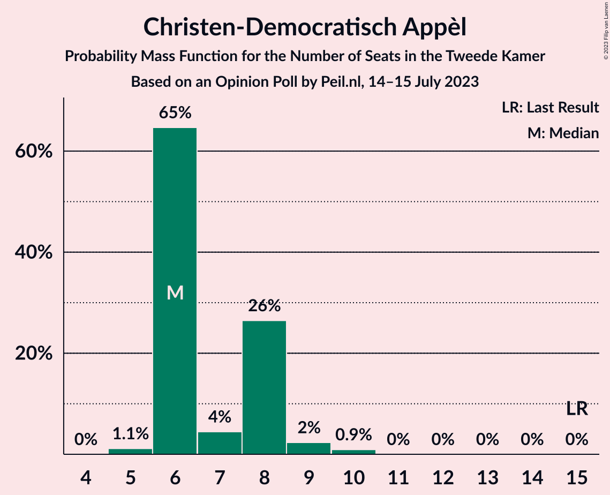

| Number of Seats | Probability | Accumulated | Special Marks |
|:---------------:|:-----------:|:-----------:|:-------------:|
| 5 | 1.1% | 100% |  |
| 6 | 65% | 98.9% | Median |
| 7 | 4% | 34% |  |
| 8 | 26% | 30% |  |
| 9 | 2% | 3% |  |
| 10 | 0.9% | 0.9% |  |
| 11 | 0% | 0% |  |
| 12 | 0% | 0% |  |
| 13 | 0% | 0% |  |
| 14 | 0% | 0% |  |
| 15 | 0% | 0% | Last Result |

### Juiste Antwoord 2021

*For a full overview of the results for this party, see the [Juiste Antwoord 2021](party-juisteantwoord2021.html) page.*

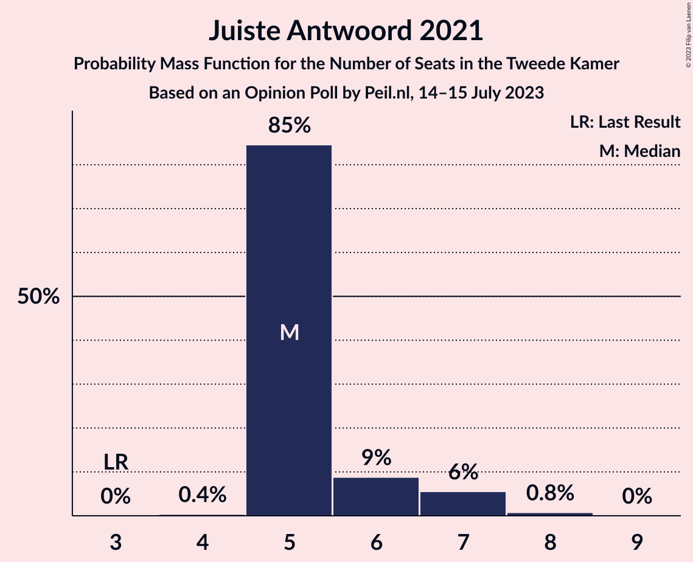

| Number of Seats | Probability | Accumulated | Special Marks |
|:---------------:|:-----------:|:-----------:|:-------------:|
| 3 | 0% | 100% | Last Result |
| 4 | 0.4% | 100% |  |
| 5 | 85% | 99.6% | Median |
| 6 | 9% | 15% |  |
| 7 | 6% | 6% |  |
| 8 | 0.8% | 0.8% |  |
| 9 | 0% | 0% |  |

### Volt Europa

*For a full overview of the results for this party, see the [Volt Europa](party-volteuropa.html) page.*

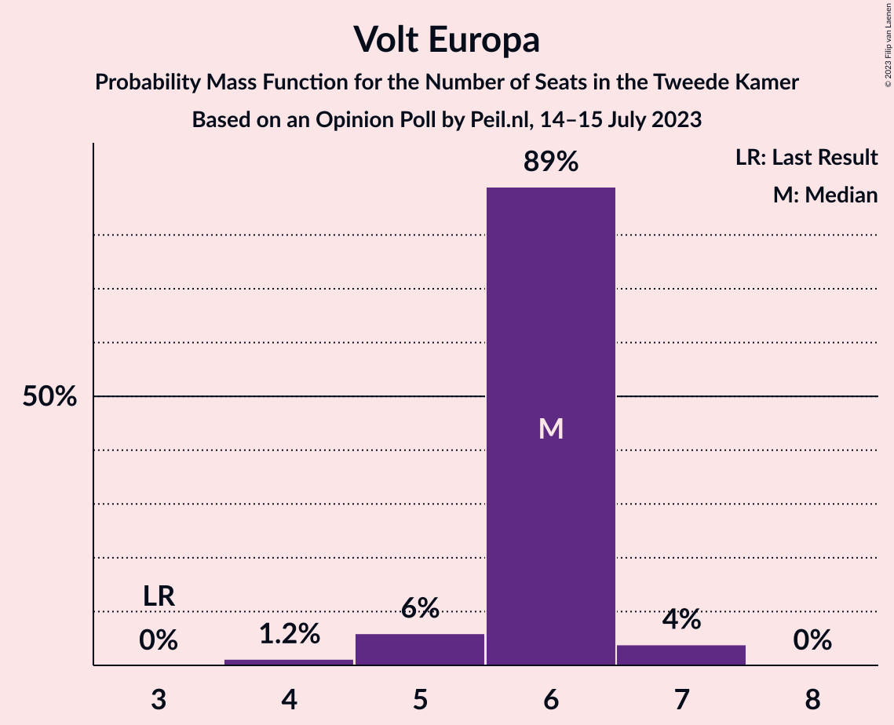

| Number of Seats | Probability | Accumulated | Special Marks |
|:---------------:|:-----------:|:-----------:|:-------------:|
| 3 | 0% | 100% | Last Result |
| 4 | 1.2% | 100% |  |
| 5 | 6% | 98.8% |  |
| 6 | 89% | 93% | Median |
| 7 | 4% | 4% |  |
| 8 | 0% | 0% |  |

### Forum voor Democratie

*For a full overview of the results for this party, see the [Forum voor Democratie](party-forumvoordemocratie.html) page.*

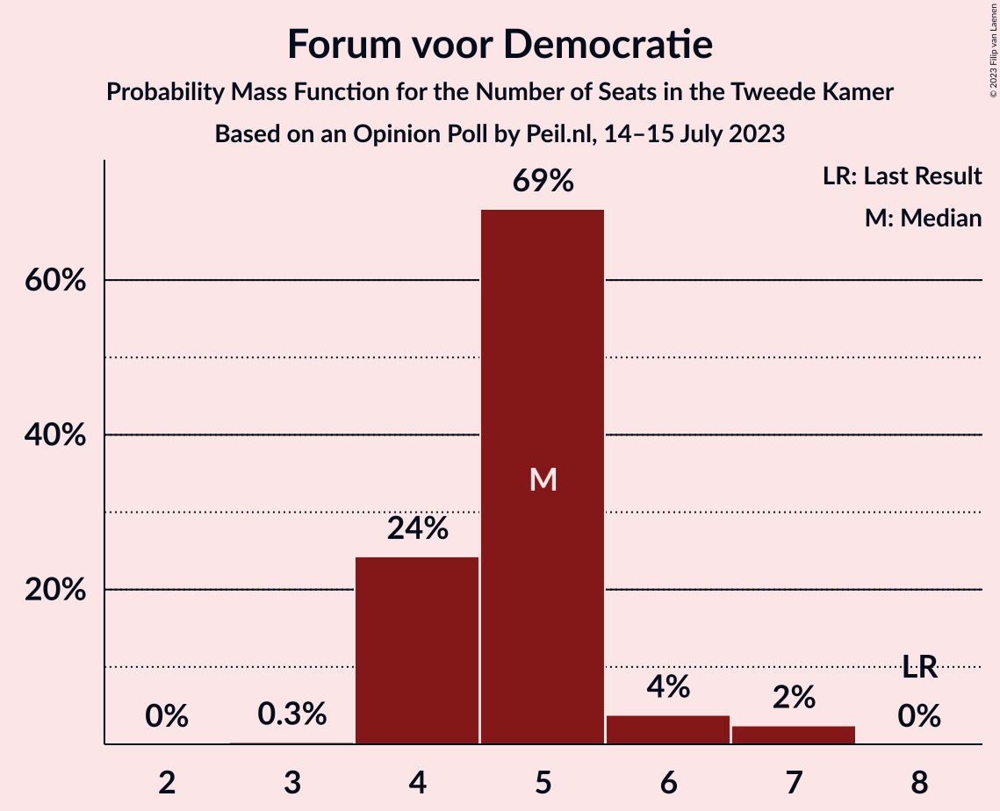

| Number of Seats | Probability | Accumulated | Special Marks |
|:---------------:|:-----------:|:-----------:|:-------------:|
| 3 | 0.3% | 100% |  |
| 4 | 24% | 99.7% |  |
| 5 | 69% | 75% | Median |
| 6 | 4% | 6% |  |
| 7 | 2% | 2% |  |
| 8 | 0% | 0% | Last Result |

### ChristenUnie

*For a full overview of the results for this party, see the [ChristenUnie](party-christenunie.html) page.*

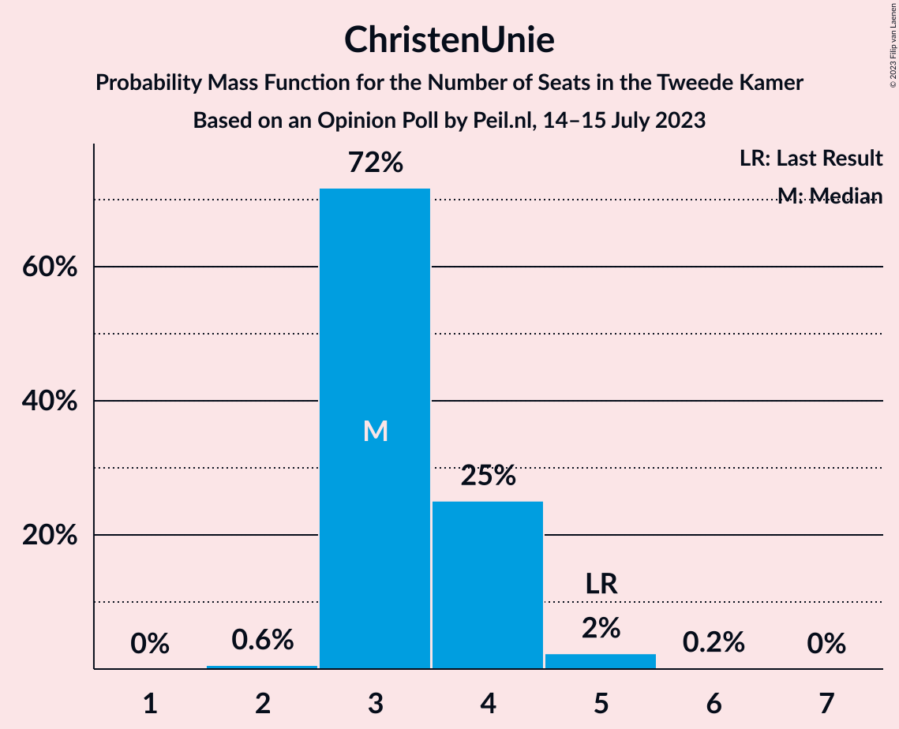

| Number of Seats | Probability | Accumulated | Special Marks |
|:---------------:|:-----------:|:-----------:|:-------------:|
| 2 | 0.6% | 100% |  |
| 3 | 72% | 99.4% | Median |
| 4 | 25% | 28% |  |
| 5 | 2% | 3% | Last Result |
| 6 | 0.2% | 0.2% |  |
| 7 | 0% | 0% |  |

### Staatkundig Gereformeerde Partij

*For a full overview of the results for this party, see the [Staatkundig Gereformeerde Partij](party-staatkundiggereformeerdepartij.html) page.*

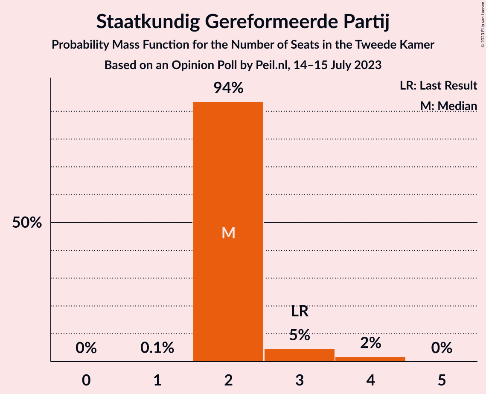

| Number of Seats | Probability | Accumulated | Special Marks |
|:---------------:|:-----------:|:-----------:|:-------------:|
| 1 | 0.1% | 100% |  |
| 2 | 94% | 99.9% | Median |
| 3 | 5% | 6% | Last Result |
| 4 | 2% | 2% |  |
| 5 | 0% | 0% |  |

### DENK

*For a full overview of the results for this party, see the [DENK](party-denk.html) page.*

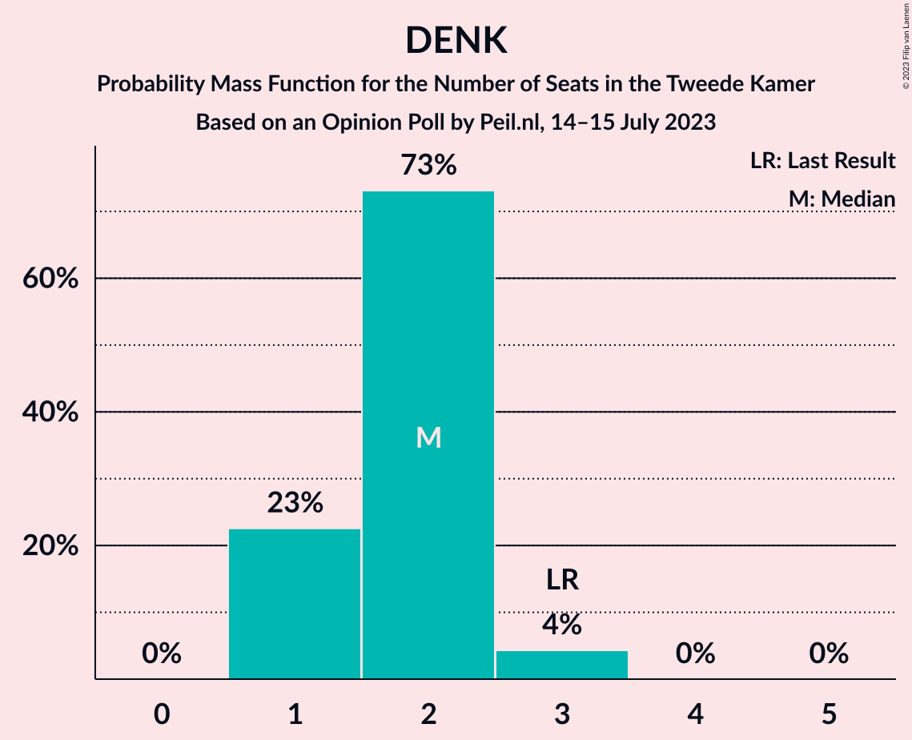

| Number of Seats | Probability | Accumulated | Special Marks |
|:---------------:|:-----------:|:-----------:|:-------------:|
| 1 | 23% | 100% |  |
| 2 | 73% | 77% | Median |
| 3 | 4% | 4% | Last Result |
| 4 | 0% | 0% |  |

### 50Plus

*For a full overview of the results for this party, see the [50Plus](party-50plus.html) page.*

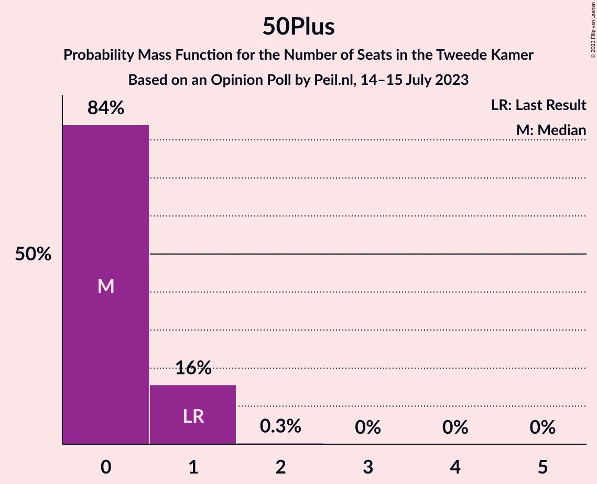

| Number of Seats | Probability | Accumulated | Special Marks |
|:---------------:|:-----------:|:-----------:|:-------------:|
| 0 | 84% | 100% | Median |
| 1 | 16% | 16% | Last Result |
| 2 | 0.3% | 0.3% |  |
| 3 | 0% | 0% |  |

### Bij1

*For a full overview of the results for this party, see the [Bij1](party-bij1.html) page.*

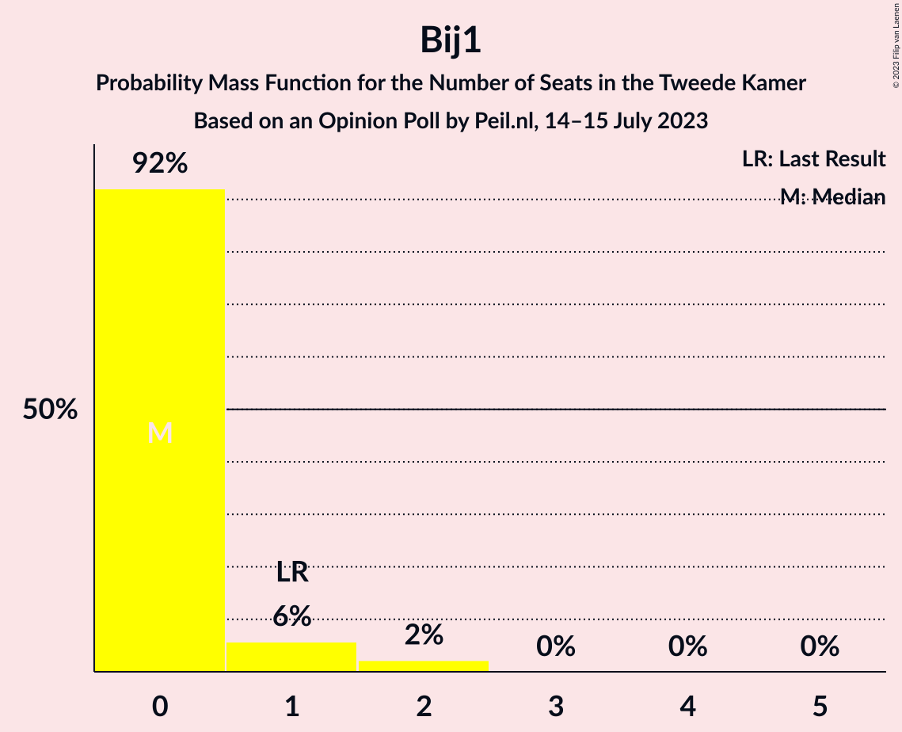

| Number of Seats | Probability | Accumulated | Special Marks |
|:---------------:|:-----------:|:-----------:|:-------------:|
| 0 | 92% | 100% | Median |
| 1 | 6% | 8% | Last Result |
| 2 | 2% | 2% |  |
| 3 | 0% | 0% |  |

### Belang van Nederland

*For a full overview of the results for this party, see the [Belang van Nederland](party-belangvannederland.html) page.*

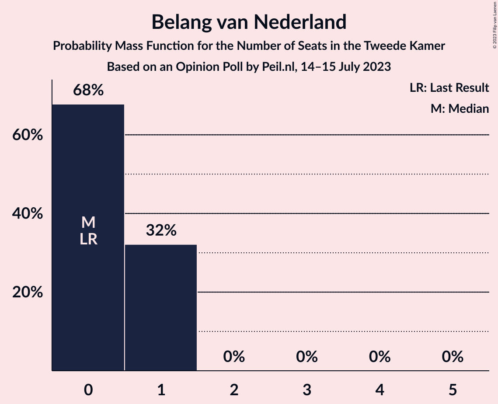

| Number of Seats | Probability | Accumulated | Special Marks |
|:---------------:|:-----------:|:-----------:|:-------------:|
| 0 | 68% | 100% | Last Result, Median |
| 1 | 32% | 32% |  |
| 2 | 0% | 0% |  |

## Coalitions

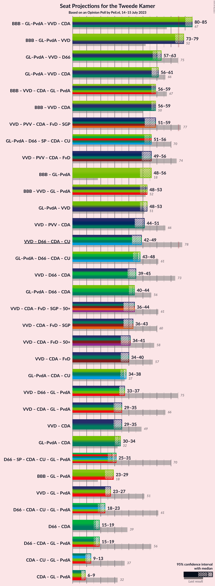

### Confidence Intervals

| Coalition | Last Result | Median | Majority? | 80% Confidence Interval | 90% Confidence Interval | 95% Confidence Interval | 99% Confidence Interval |
|:---------:|:-----------:|:------:|:---------:|:-----------------------:|:-----------------------:|:-----------------------:|:-----------------------:|
| BoerBurgerBeweging – GroenLinks–Partij van de Arbeid – Volkspartij voor Vrijheid en Democratie – Christen-Democratisch Appèl | 67 | 85 | 100% | 82–85 | 82–85 | 80–85 | 80–90 |
| BoerBurgerBeweging – GroenLinks–Partij van de Arbeid – Volkspartij voor Vrijheid en Democratie | 52 | 79 | 86% | 74–79 | 73–79 | 73–79 | 73–85 |
| GroenLinks–Partij van de Arbeid – Volkspartij voor Vrijheid en Democratie – Democraten 66 | 75 | 60 | 0% | 59–63 | 59–63 | 57–63 | 57–65 |
| GroenLinks–Partij van de Arbeid – Volkspartij voor Vrijheid en Democratie – Christen-Democratisch Appèl | 66 | 56 | 0% | 56–61 | 56–61 | 56–61 | 54–61 |
| BoerBurgerBeweging – Volkspartij voor Vrijheid en Democratie – Christen-Democratisch Appèl | 50 | 58 | 0% | 58–59 | 57–59 | 56–59 | 55–63 |
| Volkspartij voor Vrijheid en Democratie – Partij voor de Vrijheid – Christen-Democratisch Appèl – Forum voor Democratie – Staatkundig Gereformeerde Partij | 77 | 51 | 0% | 51–57 | 51–57 | 51–59 | 51–59 |
| GroenLinks–Partij van de Arbeid – Democraten 66 – Socialistische Partij – Christen-Democratisch Appèl – ChristenUnie | 70 | 55 | 0% | 52–56 | 51–56 | 51–56 | 50–56 |
| Volkspartij voor Vrijheid en Democratie – Partij voor de Vrijheid – Christen-Democratisch Appèl – Forum voor Democratie | 74 | 49 | 0% | 49–55 | 49–55 | 49–56 | 49–56 |
| BoerBurgerBeweging – GroenLinks–Partij van de Arbeid | 18 | 56 | 0% | 49–56 | 49–56 | 48–56 | 47–56 |
| GroenLinks–Partij van de Arbeid – Volkspartij voor Vrijheid en Democratie | 51 | 50 | 0% | 50–53 | 49–53 | 48–53 | 47–56 |
| Volkspartij voor Vrijheid en Democratie – Partij voor de Vrijheid – Christen-Democratisch Appèl | 66 | 44 | 0% | 44–51 | 44–51 | 44–51 | 44–51 |
| Volkspartij voor Vrijheid en Democratie – Democraten 66 – Christen-Democratisch Appèl – ChristenUnie | 78 | 42 | 0% | 42–49 | 42–49 | 42–49 | 42–49 |
| GroenLinks–Partij van de Arbeid – Democraten 66 – Christen-Democratisch Appèl – ChristenUnie | 61 | 46 | 0% | 45–48 | 44–48 | 43–48 | 42–48 |
| Volkspartij voor Vrijheid en Democratie – Democraten 66 – Christen-Democratisch Appèl | 73 | 39 | 0% | 39–45 | 39–45 | 39–45 | 39–45 |
| GroenLinks–Partij van de Arbeid – Democraten 66 – Christen-Democratisch Appèl | 56 | 43 | 0% | 42–44 | 41–44 | 40–44 | 38–44 |
| Volkspartij voor Vrijheid en Democratie – Christen-Democratisch Appèl – Forum voor Democratie – Staatkundig Gereformeerde Partij – 50Plus | 61 | 36 | 0% | 36–41 | 36–42 | 36–44 | 36–46 |
| Volkspartij voor Vrijheid en Democratie – Christen-Democratisch Appèl – Forum voor Democratie – Staatkundig Gereformeerde Partij | 60 | 36 | 0% | 36–41 | 36–42 | 36–43 | 36–45 |
| Volkspartij voor Vrijheid en Democratie – Christen-Democratisch Appèl – Forum voor Democratie – 50Plus | 58 | 34 | 0% | 34–39 | 34–40 | 34–41 | 34–43 |
| Volkspartij voor Vrijheid en Democratie – Christen-Democratisch Appèl – Forum voor Democratie | 57 | 34 | 0% | 34–39 | 34–39 | 34–40 | 34–42 |
| GroenLinks–Partij van de Arbeid – Christen-Democratisch Appèl – ChristenUnie | 37 | 36 | 0% | 35–38 | 35–38 | 34–38 | 33–38 |
| Volkspartij voor Vrijheid en Democratie – Christen-Democratisch Appèl | 49 | 29 | 0% | 29–35 | 29–35 | 29–35 | 29–35 |
| GroenLinks–Partij van de Arbeid – Christen-Democratisch Appèl | 32 | 33 | 0% | 32–34 | 32–34 | 30–34 | 30–35 |
| Democraten 66 – Christen-Democratisch Appèl | 39 | 16 | 0% | 16–18 | 15–18 | 15–19 | 14–19 |

### BoerBurgerBeweging – GroenLinks–Partij van de Arbeid – Volkspartij voor Vrijheid en Democratie – Christen-Democratisch Appèl

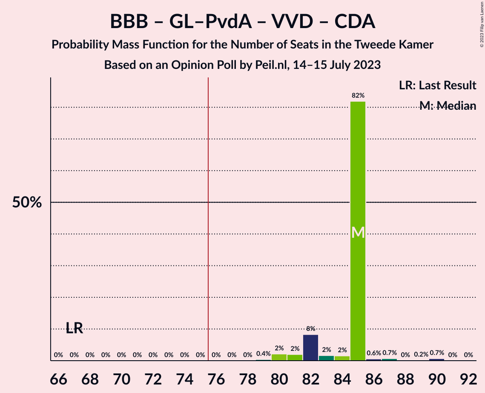

| Number of Seats | Probability | Accumulated | Special Marks |
|:---------------:|:-----------:|:-----------:|:-------------:|
| 67 | 0% | 100% | Last Result |
| 68 | 0% | 100% |  |
| 69 | 0% | 100% |  |
| 70 | 0% | 100% |  |
| 71 | 0% | 100% |  |
| 72 | 0% | 100% |  |
| 73 | 0% | 100% |  |
| 74 | 0% | 100% |  |
| 75 | 0% | 100% |  |
| 76 | 0% | 100% | Majority |
| 77 | 0% | 100% |  |
| 78 | 0% | 100% |  |
| 79 | 0.4% | 100% |  |
| 80 | 2% | 99.6% |  |
| 81 | 2% | 97% |  |
| 82 | 8% | 95% |  |
| 83 | 2% | 87% |  |
| 84 | 2% | 86% |  |
| 85 | 82% | 84% | Median |
| 86 | 0.6% | 2% |  |
| 87 | 0.7% | 2% |  |
| 88 | 0% | 0.9% |  |
| 89 | 0.2% | 0.8% |  |
| 90 | 0.7% | 0.7% |  |
| 91 | 0% | 0% |  |

### BoerBurgerBeweging – GroenLinks–Partij van de Arbeid – Volkspartij voor Vrijheid en Democratie

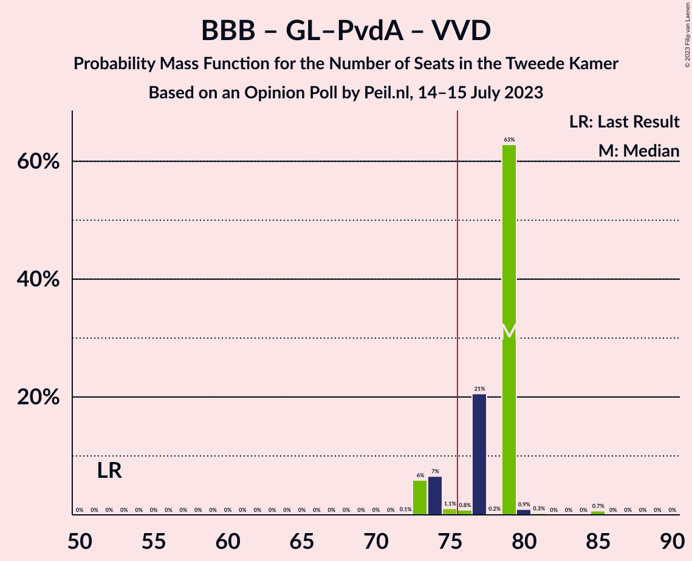

| Number of Seats | Probability | Accumulated | Special Marks |
|:---------------:|:-----------:|:-----------:|:-------------:|
| 52 | 0% | 100% | Last Result |
| 53 | 0% | 100% |  |
| 54 | 0% | 100% |  |
| 55 | 0% | 100% |  |
| 56 | 0% | 100% |  |
| 57 | 0% | 100% |  |
| 58 | 0% | 100% |  |
| 59 | 0% | 100% |  |
| 60 | 0% | 100% |  |
| 61 | 0% | 100% |  |
| 62 | 0% | 100% |  |
| 63 | 0% | 100% |  |
| 64 | 0% | 100% |  |
| 65 | 0% | 100% |  |
| 66 | 0% | 100% |  |
| 67 | 0% | 100% |  |
| 68 | 0% | 100% |  |
| 69 | 0% | 100% |  |
| 70 | 0% | 100% |  |
| 71 | 0% | 100% |  |
| 72 | 0.1% | 100% |  |
| 73 | 6% | 99.9% |  |
| 74 | 7% | 94% |  |
| 75 | 1.1% | 87% |  |
| 76 | 0.8% | 86% | Majority |
| 77 | 21% | 86% |  |
| 78 | 0.2% | 65% |  |
| 79 | 63% | 65% | Median |
| 80 | 0.9% | 2% |  |
| 81 | 0.3% | 0.9% |  |
| 82 | 0% | 0.7% |  |
| 83 | 0% | 0.7% |  |
| 84 | 0% | 0.7% |  |
| 85 | 0.7% | 0.7% |  |
| 86 | 0% | 0% |  |

### GroenLinks–Partij van de Arbeid – Volkspartij voor Vrijheid en Democratie – Democraten 66

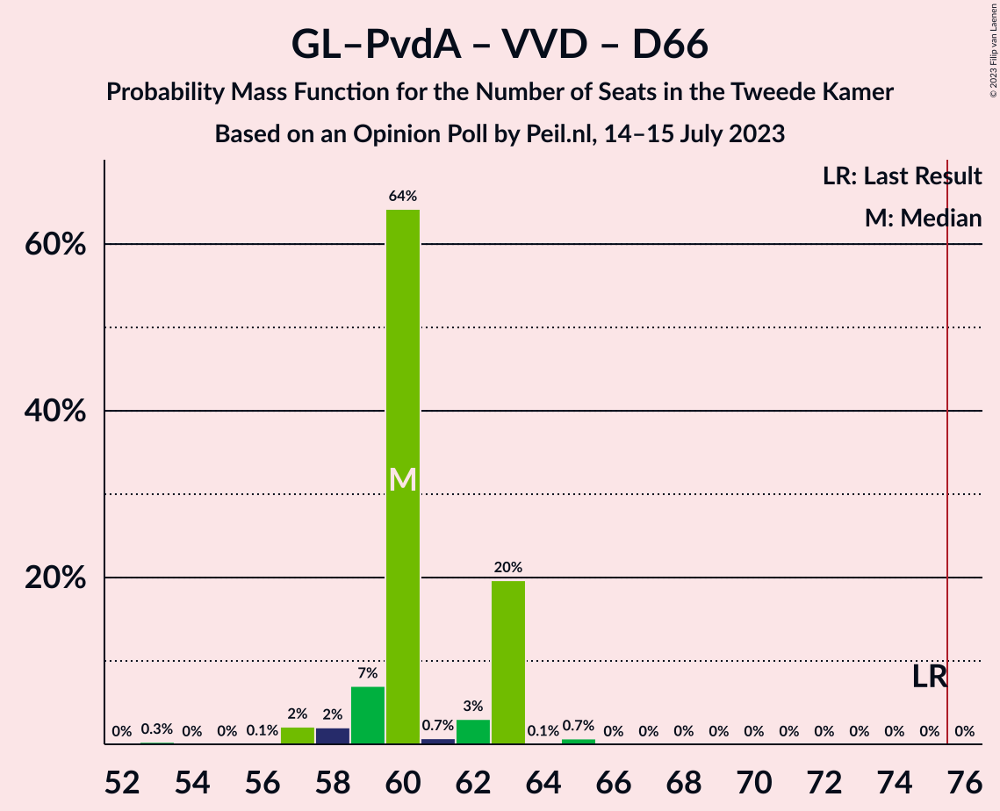

| Number of Seats | Probability | Accumulated | Special Marks |
|:---------------:|:-----------:|:-----------:|:-------------:|
| 53 | 0.3% | 100% |  |
| 54 | 0% | 99.7% |  |
| 55 | 0% | 99.7% |  |
| 56 | 0.1% | 99.7% |  |
| 57 | 2% | 99.6% |  |
| 58 | 2% | 97% |  |
| 59 | 7% | 95% |  |
| 60 | 64% | 88% | Median |
| 61 | 0.7% | 24% |  |
| 62 | 3% | 23% |  |
| 63 | 20% | 20% |  |
| 64 | 0.1% | 0.8% |  |
| 65 | 0.7% | 0.7% |  |
| 66 | 0% | 0% |  |
| 67 | 0% | 0% |  |
| 68 | 0% | 0% |  |
| 69 | 0% | 0% |  |
| 70 | 0% | 0% |  |
| 71 | 0% | 0% |  |
| 72 | 0% | 0% |  |
| 73 | 0% | 0% |  |
| 74 | 0% | 0% |  |
| 75 | 0% | 0% | Last Result |

### GroenLinks–Partij van de Arbeid – Volkspartij voor Vrijheid en Democratie – Christen-Democratisch Appèl

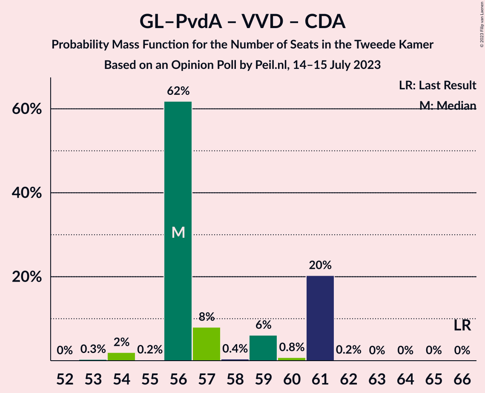

| Number of Seats | Probability | Accumulated | Special Marks |
|:---------------:|:-----------:|:-----------:|:-------------:|
| 53 | 0.3% | 100% |  |
| 54 | 2% | 99.7% |  |
| 55 | 0.2% | 98% |  |
| 56 | 62% | 98% | Median |
| 57 | 8% | 36% |  |
| 58 | 0.4% | 28% |  |
| 59 | 6% | 27% |  |
| 60 | 0.8% | 21% |  |
| 61 | 20% | 20% |  |
| 62 | 0.2% | 0.2% |  |
| 63 | 0% | 0% |  |
| 64 | 0% | 0% |  |
| 65 | 0% | 0% |  |
| 66 | 0% | 0% | Last Result |

### BoerBurgerBeweging – Volkspartij voor Vrijheid en Democratie – Christen-Democratisch Appèl

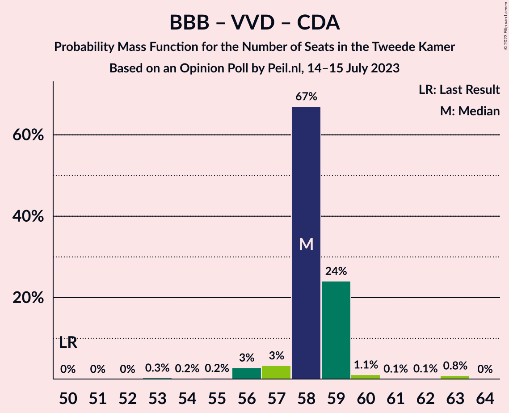

| Number of Seats | Probability | Accumulated | Special Marks |
|:---------------:|:-----------:|:-----------:|:-------------:|
| 50 | 0% | 100% | Last Result |
| 51 | 0% | 100% |  |
| 52 | 0% | 100% |  |
| 53 | 0.3% | 100% |  |
| 54 | 0.2% | 99.7% |  |
| 55 | 0.2% | 99.5% |  |
| 56 | 3% | 99.3% |  |
| 57 | 3% | 97% |  |
| 58 | 67% | 93% | Median |
| 59 | 24% | 26% |  |
| 60 | 1.1% | 2% |  |
| 61 | 0.1% | 1.0% |  |
| 62 | 0.1% | 1.0% |  |
| 63 | 0.8% | 0.8% |  |
| 64 | 0% | 0% |  |

### Volkspartij voor Vrijheid en Democratie – Partij voor de Vrijheid – Christen-Democratisch Appèl – Forum voor Democratie – Staatkundig Gereformeerde Partij

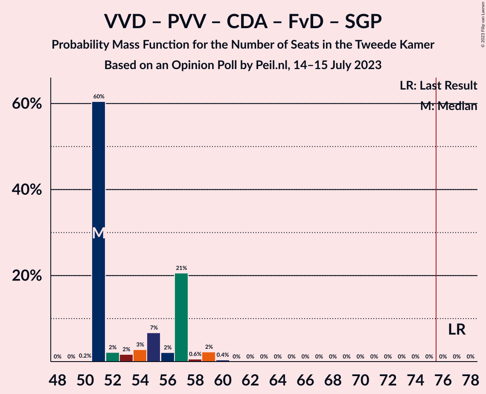

| Number of Seats | Probability | Accumulated | Special Marks |
|:---------------:|:-----------:|:-----------:|:-------------:|
| 50 | 0.2% | 100% |  |
| 51 | 60% | 99.8% | Median |
| 52 | 2% | 39% |  |
| 53 | 2% | 37% |  |
| 54 | 3% | 35% |  |
| 55 | 7% | 33% |  |
| 56 | 2% | 26% |  |
| 57 | 21% | 24% |  |
| 58 | 0.6% | 3% |  |
| 59 | 2% | 3% |  |
| 60 | 0.4% | 0.4% |  |
| 61 | 0% | 0% |  |
| 62 | 0% | 0% |  |
| 63 | 0% | 0% |  |
| 64 | 0% | 0% |  |
| 65 | 0% | 0% |  |
| 66 | 0% | 0% |  |
| 67 | 0% | 0% |  |
| 68 | 0% | 0% |  |
| 69 | 0% | 0% |  |
| 70 | 0% | 0% |  |
| 71 | 0% | 0% |  |
| 72 | 0% | 0% |  |
| 73 | 0% | 0% |  |
| 74 | 0% | 0% |  |
| 75 | 0% | 0% |  |
| 76 | 0% | 0% | Majority |
| 77 | 0% | 0% | Last Result |

### GroenLinks–Partij van de Arbeid – Democraten 66 – Socialistische Partij – Christen-Democratisch Appèl – ChristenUnie

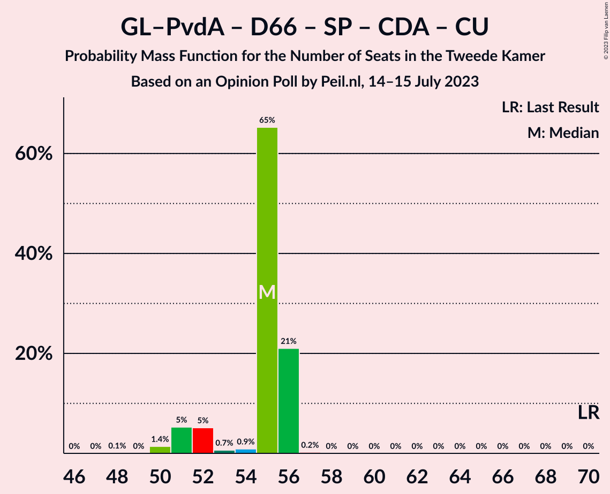

| Number of Seats | Probability | Accumulated | Special Marks |
|:---------------:|:-----------:|:-----------:|:-------------:|
| 48 | 0.1% | 100% |  |
| 49 | 0% | 99.9% |  |
| 50 | 1.4% | 99.9% |  |
| 51 | 5% | 98% |  |
| 52 | 5% | 93% |  |
| 53 | 0.7% | 88% |  |
| 54 | 0.9% | 87% |  |
| 55 | 65% | 87% | Median |
| 56 | 21% | 21% |  |
| 57 | 0.2% | 0.2% |  |
| 58 | 0% | 0% |  |
| 59 | 0% | 0% |  |
| 60 | 0% | 0% |  |
| 61 | 0% | 0% |  |
| 62 | 0% | 0% |  |
| 63 | 0% | 0% |  |
| 64 | 0% | 0% |  |
| 65 | 0% | 0% |  |
| 66 | 0% | 0% |  |
| 67 | 0% | 0% |  |
| 68 | 0% | 0% |  |
| 69 | 0% | 0% |  |
| 70 | 0% | 0% | Last Result |

### Volkspartij voor Vrijheid en Democratie – Partij voor de Vrijheid – Christen-Democratisch Appèl – Forum voor Democratie

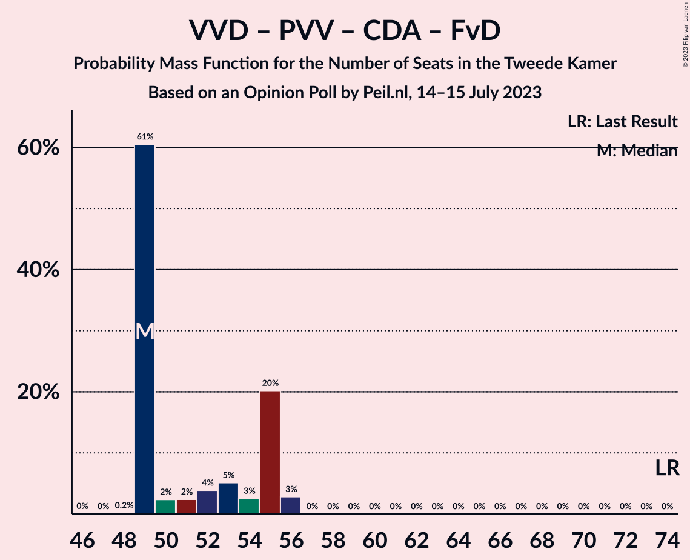

| Number of Seats | Probability | Accumulated | Special Marks |
|:---------------:|:-----------:|:-----------:|:-------------:|
| 47 | 0% | 100% |  |
| 48 | 0.2% | 99.9% |  |
| 49 | 61% | 99.8% | Median |
| 50 | 2% | 39% |  |
| 51 | 2% | 37% |  |
| 52 | 4% | 35% |  |
| 53 | 5% | 31% |  |
| 54 | 3% | 26% |  |
| 55 | 20% | 23% |  |
| 56 | 3% | 3% |  |
| 57 | 0% | 0% |  |
| 58 | 0% | 0% |  |
| 59 | 0% | 0% |  |
| 60 | 0% | 0% |  |
| 61 | 0% | 0% |  |
| 62 | 0% | 0% |  |
| 63 | 0% | 0% |  |
| 64 | 0% | 0% |  |
| 65 | 0% | 0% |  |
| 66 | 0% | 0% |  |
| 67 | 0% | 0% |  |
| 68 | 0% | 0% |  |
| 69 | 0% | 0% |  |
| 70 | 0% | 0% |  |
| 71 | 0% | 0% |  |
| 72 | 0% | 0% |  |
| 73 | 0% | 0% |  |
| 74 | 0% | 0% | Last Result |

### BoerBurgerBeweging – GroenLinks–Partij van de Arbeid

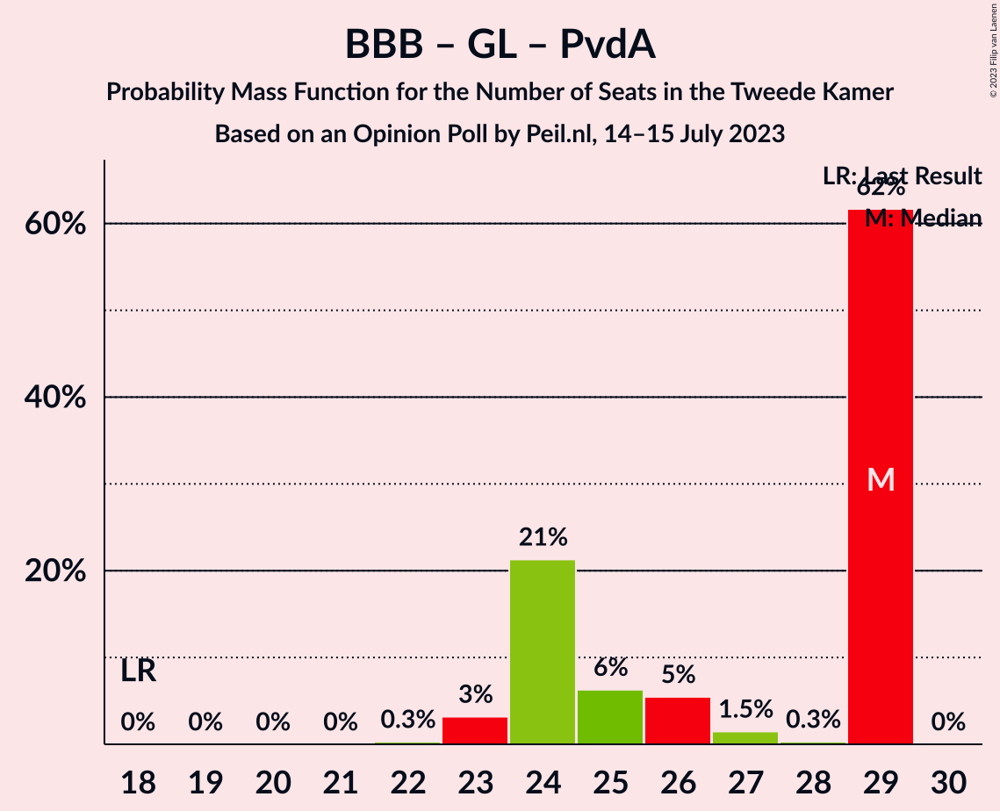

| Number of Seats | Probability | Accumulated | Special Marks |
|:---------------:|:-----------:|:-----------:|:-------------:|
| 18 | 0% | 100% | Last Result |
| 19 | 0% | 100% |  |
| 20 | 0% | 100% |  |
| 21 | 0% | 100% |  |
| 22 | 0% | 100% |  |
| 23 | 0% | 100% |  |
| 24 | 0% | 100% |  |
| 25 | 0% | 100% |  |
| 26 | 0% | 100% |  |
| 27 | 0% | 100% |  |
| 28 | 0% | 100% |  |
| 29 | 0% | 100% |  |
| 30 | 0% | 100% |  |
| 31 | 0% | 100% |  |
| 32 | 0% | 100% |  |
| 33 | 0% | 100% |  |
| 34 | 0% | 100% |  |
| 35 | 0% | 100% |  |
| 36 | 0% | 100% |  |
| 37 | 0% | 100% |  |
| 38 | 0% | 100% |  |
| 39 | 0% | 100% |  |
| 40 | 0% | 100% |  |
| 41 | 0% | 100% |  |
| 42 | 0% | 100% |  |
| 43 | 0% | 100% |  |
| 44 | 0% | 100% |  |
| 45 | 0% | 100% |  |
| 46 | 0.1% | 100% |  |
| 47 | 2% | 99.9% |  |
| 48 | 2% | 98% |  |
| 49 | 9% | 96% |  |
| 50 | 20% | 87% |  |
| 51 | 0.9% | 67% |  |
| 52 | 3% | 66% |  |
| 53 | 0.7% | 63% |  |
| 54 | 0.6% | 62% |  |
| 55 | 0.1% | 62% |  |
| 56 | 61% | 62% | Median |
| 57 | 0.3% | 0.3% |  |
| 58 | 0% | 0% |  |

### GroenLinks–Partij van de Arbeid – Volkspartij voor Vrijheid en Democratie

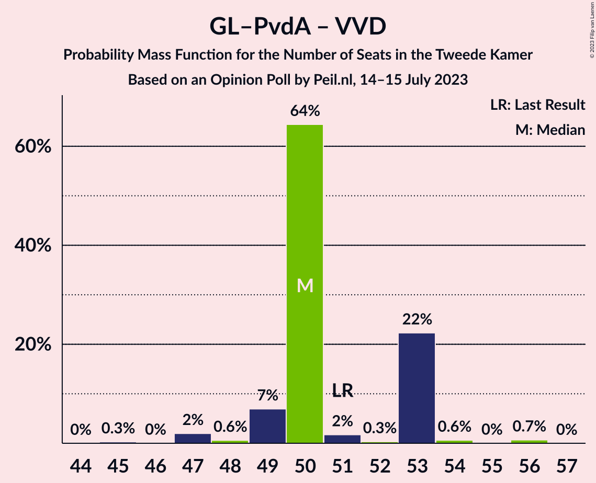

| Number of Seats | Probability | Accumulated | Special Marks |
|:---------------:|:-----------:|:-----------:|:-------------:|
| 45 | 0.3% | 100% |  |
| 46 | 0% | 99.7% |  |
| 47 | 2% | 99.7% |  |
| 48 | 0.6% | 98% |  |
| 49 | 7% | 97% |  |
| 50 | 64% | 90% | Median |
| 51 | 2% | 26% | Last Result |
| 52 | 0.3% | 24% |  |
| 53 | 22% | 24% |  |
| 54 | 0.6% | 1.4% |  |
| 55 | 0% | 0.7% |  |
| 56 | 0.7% | 0.7% |  |
| 57 | 0% | 0% |  |

### Volkspartij voor Vrijheid en Democratie – Partij voor de Vrijheid – Christen-Democratisch Appèl

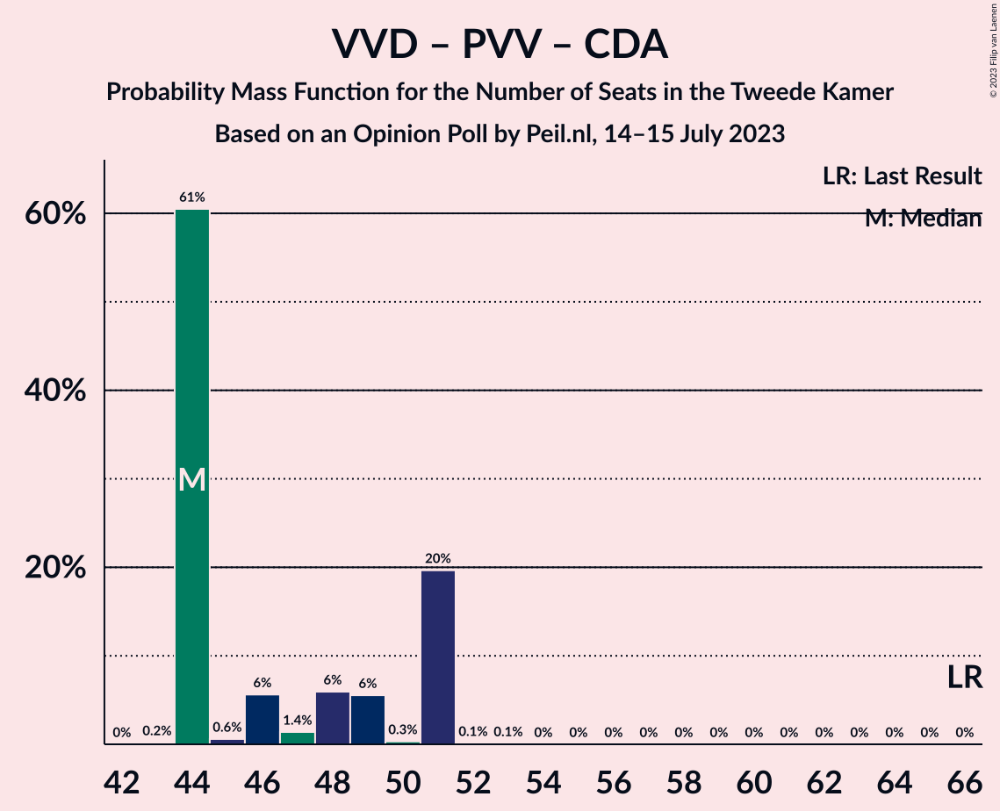

| Number of Seats | Probability | Accumulated | Special Marks |
|:---------------:|:-----------:|:-----------:|:-------------:|
| 43 | 0.2% | 100% |  |
| 44 | 61% | 99.8% | Median |
| 45 | 0.6% | 39% |  |
| 46 | 6% | 39% |  |
| 47 | 1.4% | 33% |  |
| 48 | 6% | 32% |  |
| 49 | 6% | 26% |  |
| 50 | 0.3% | 20% |  |
| 51 | 20% | 20% |  |
| 52 | 0.1% | 0.2% |  |
| 53 | 0.1% | 0.1% |  |
| 54 | 0% | 0% |  |
| 55 | 0% | 0% |  |
| 56 | 0% | 0% |  |
| 57 | 0% | 0% |  |
| 58 | 0% | 0% |  |
| 59 | 0% | 0% |  |
| 60 | 0% | 0% |  |
| 61 | 0% | 0% |  |
| 62 | 0% | 0% |  |
| 63 | 0% | 0% |  |
| 64 | 0% | 0% |  |
| 65 | 0% | 0% |  |
| 66 | 0% | 0% | Last Result |

### Volkspartij voor Vrijheid en Democratie – Democraten 66 – Christen-Democratisch Appèl – ChristenUnie

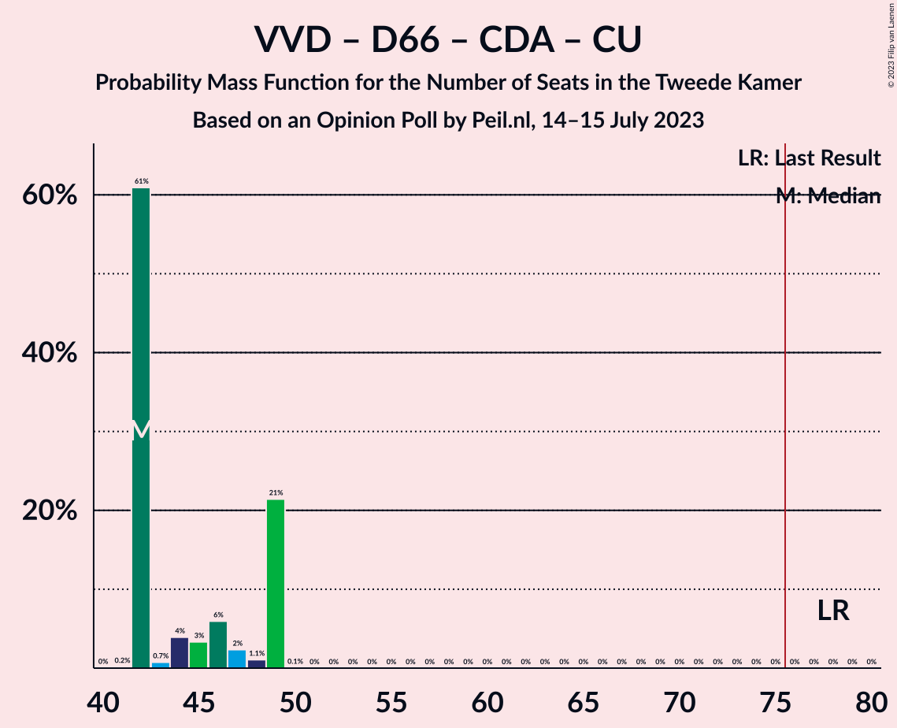

| Number of Seats | Probability | Accumulated | Special Marks |
|:---------------:|:-----------:|:-----------:|:-------------:|
| 41 | 0.2% | 100% |  |
| 42 | 61% | 99.8% | Median |
| 43 | 0.7% | 39% |  |
| 44 | 4% | 38% |  |
| 45 | 3% | 34% |  |
| 46 | 6% | 31% |  |
| 47 | 2% | 25% |  |
| 48 | 1.1% | 23% |  |
| 49 | 21% | 21% |  |
| 50 | 0.1% | 0.1% |  |
| 51 | 0% | 0% |  |
| 52 | 0% | 0% |  |
| 53 | 0% | 0% |  |
| 54 | 0% | 0% |  |
| 55 | 0% | 0% |  |
| 56 | 0% | 0% |  |
| 57 | 0% | 0% |  |
| 58 | 0% | 0% |  |
| 59 | 0% | 0% |  |
| 60 | 0% | 0% |  |
| 61 | 0% | 0% |  |
| 62 | 0% | 0% |  |
| 63 | 0% | 0% |  |
| 64 | 0% | 0% |  |
| 65 | 0% | 0% |  |
| 66 | 0% | 0% |  |
| 67 | 0% | 0% |  |
| 68 | 0% | 0% |  |
| 69 | 0% | 0% |  |
| 70 | 0% | 0% |  |
| 71 | 0% | 0% |  |
| 72 | 0% | 0% |  |
| 73 | 0% | 0% |  |
| 74 | 0% | 0% |  |
| 75 | 0% | 0% |  |
| 76 | 0% | 0% | Majority |
| 77 | 0% | 0% |  |
| 78 | 0% | 0% | Last Result |

### GroenLinks–Partij van de Arbeid – Democraten 66 – Christen-Democratisch Appèl – ChristenUnie

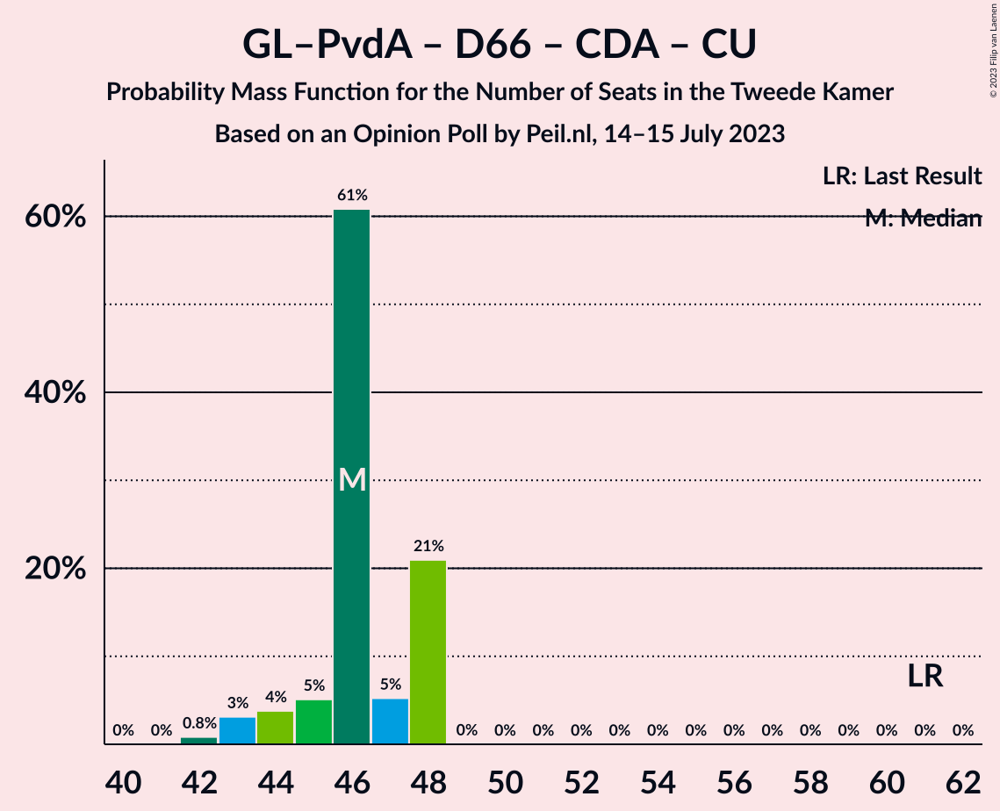

| Number of Seats | Probability | Accumulated | Special Marks |
|:---------------:|:-----------:|:-----------:|:-------------:|
| 42 | 0.8% | 100% |  |
| 43 | 3% | 99.1% |  |
| 44 | 4% | 96% |  |
| 45 | 5% | 92% |  |
| 46 | 61% | 87% | Median |
| 47 | 5% | 26% |  |
| 48 | 21% | 21% |  |
| 49 | 0% | 0% |  |
| 50 | 0% | 0% |  |
| 51 | 0% | 0% |  |
| 52 | 0% | 0% |  |
| 53 | 0% | 0% |  |
| 54 | 0% | 0% |  |
| 55 | 0% | 0% |  |
| 56 | 0% | 0% |  |
| 57 | 0% | 0% |  |
| 58 | 0% | 0% |  |
| 59 | 0% | 0% |  |
| 60 | 0% | 0% |  |
| 61 | 0% | 0% | Last Result |

### Volkspartij voor Vrijheid en Democratie – Democraten 66 – Christen-Democratisch Appèl

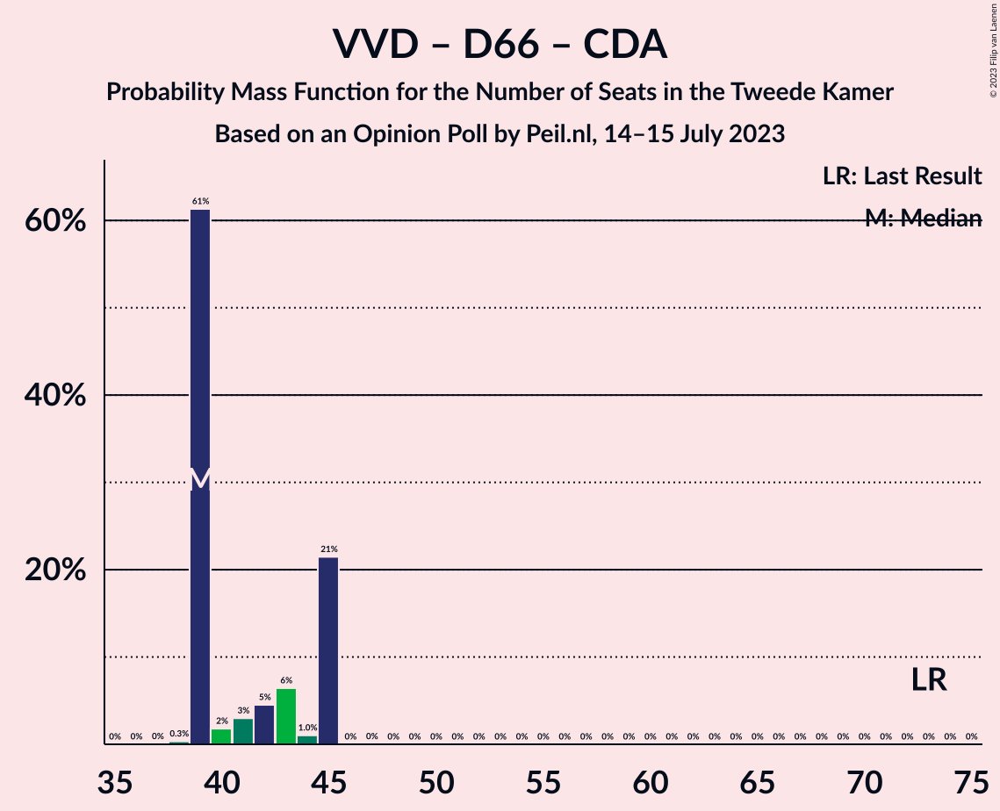

| Number of Seats | Probability | Accumulated | Special Marks |
|:---------------:|:-----------:|:-----------:|:-------------:|
| 37 | 0% | 100% |  |
| 38 | 0.3% | 99.9% |  |
| 39 | 61% | 99.6% | Median |
| 40 | 2% | 38% |  |
| 41 | 3% | 36% |  |
| 42 | 5% | 33% |  |
| 43 | 6% | 29% |  |
| 44 | 1.0% | 23% |  |
| 45 | 21% | 22% |  |
| 46 | 0% | 0% |  |
| 47 | 0% | 0% |  |
| 48 | 0% | 0% |  |
| 49 | 0% | 0% |  |
| 50 | 0% | 0% |  |
| 51 | 0% | 0% |  |
| 52 | 0% | 0% |  |
| 53 | 0% | 0% |  |
| 54 | 0% | 0% |  |
| 55 | 0% | 0% |  |
| 56 | 0% | 0% |  |
| 57 | 0% | 0% |  |
| 58 | 0% | 0% |  |
| 59 | 0% | 0% |  |
| 60 | 0% | 0% |  |
| 61 | 0% | 0% |  |
| 62 | 0% | 0% |  |
| 63 | 0% | 0% |  |
| 64 | 0% | 0% |  |
| 65 | 0% | 0% |  |
| 66 | 0% | 0% |  |
| 67 | 0% | 0% |  |
| 68 | 0% | 0% |  |
| 69 | 0% | 0% |  |
| 70 | 0% | 0% |  |
| 71 | 0% | 0% |  |
| 72 | 0% | 0% |  |
| 73 | 0% | 0% | Last Result |

### GroenLinks–Partij van de Arbeid – Democraten 66 – Christen-Democratisch Appèl

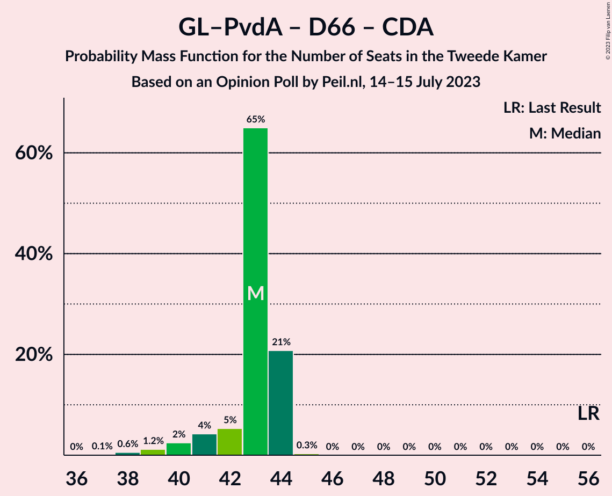

| Number of Seats | Probability | Accumulated | Special Marks |
|:---------------:|:-----------:|:-----------:|:-------------:|
| 37 | 0.1% | 100% |  |
| 38 | 0.6% | 99.9% |  |
| 39 | 1.2% | 99.3% |  |
| 40 | 2% | 98% |  |
| 41 | 4% | 96% |  |
| 42 | 5% | 91% |  |
| 43 | 65% | 86% | Median |
| 44 | 21% | 21% |  |
| 45 | 0.3% | 0.3% |  |
| 46 | 0% | 0% |  |
| 47 | 0% | 0% |  |
| 48 | 0% | 0% |  |
| 49 | 0% | 0% |  |
| 50 | 0% | 0% |  |
| 51 | 0% | 0% |  |
| 52 | 0% | 0% |  |
| 53 | 0% | 0% |  |
| 54 | 0% | 0% |  |
| 55 | 0% | 0% |  |
| 56 | 0% | 0% | Last Result |

### Volkspartij voor Vrijheid en Democratie – Christen-Democratisch Appèl – Forum voor Democratie – Staatkundig Gereformeerde Partij – 50Plus

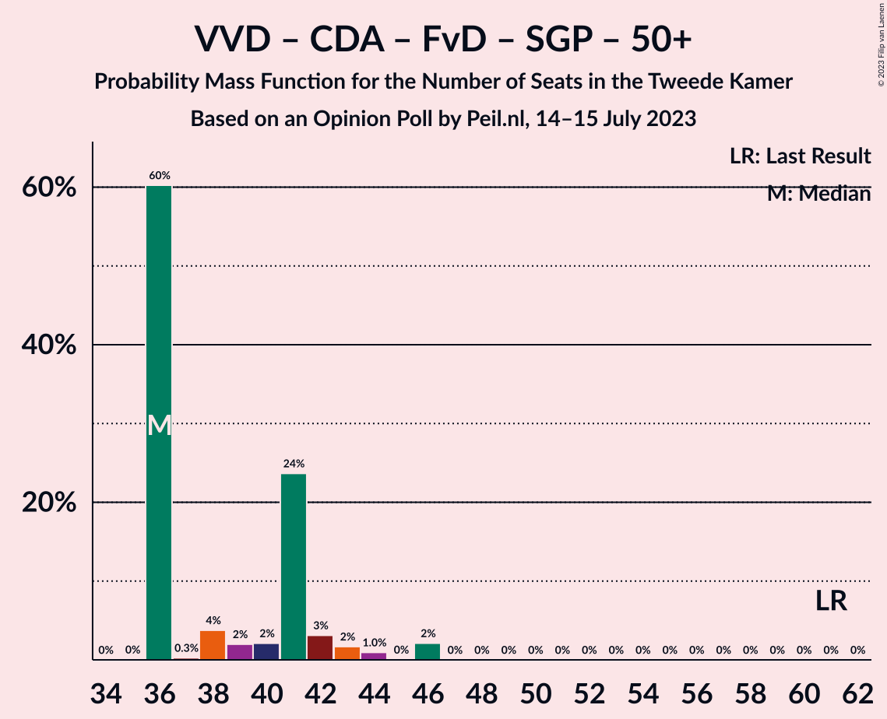

| Number of Seats | Probability | Accumulated | Special Marks |
|:---------------:|:-----------:|:-----------:|:-------------:|
| 36 | 60% | 100% | Median |
| 37 | 0.3% | 40% |  |
| 38 | 4% | 39% |  |
| 39 | 2% | 36% |  |
| 40 | 2% | 34% |  |
| 41 | 24% | 32% |  |
| 42 | 3% | 8% |  |
| 43 | 2% | 5% |  |
| 44 | 1.0% | 3% |  |
| 45 | 0% | 2% |  |
| 46 | 2% | 2% |  |
| 47 | 0% | 0% |  |
| 48 | 0% | 0% |  |
| 49 | 0% | 0% |  |
| 50 | 0% | 0% |  |
| 51 | 0% | 0% |  |
| 52 | 0% | 0% |  |
| 53 | 0% | 0% |  |
| 54 | 0% | 0% |  |
| 55 | 0% | 0% |  |
| 56 | 0% | 0% |  |
| 57 | 0% | 0% |  |
| 58 | 0% | 0% |  |
| 59 | 0% | 0% |  |
| 60 | 0% | 0% |  |
| 61 | 0% | 0% | Last Result |

### Volkspartij voor Vrijheid en Democratie – Christen-Democratisch Appèl – Forum voor Democratie – Staatkundig Gereformeerde Partij

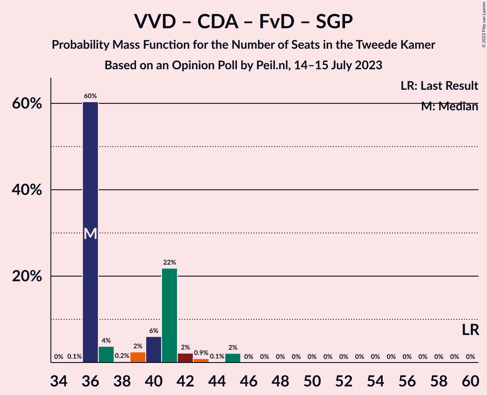

| Number of Seats | Probability | Accumulated | Special Marks |
|:---------------:|:-----------:|:-----------:|:-------------:|
| 35 | 0.1% | 100% |  |
| 36 | 60% | 99.9% | Median |
| 37 | 4% | 40% |  |
| 38 | 0.2% | 36% |  |
| 39 | 2% | 36% |  |
| 40 | 6% | 33% |  |
| 41 | 22% | 27% |  |
| 42 | 2% | 5% |  |
| 43 | 0.9% | 3% |  |
| 44 | 0.1% | 2% |  |
| 45 | 2% | 2% |  |
| 46 | 0% | 0% |  |
| 47 | 0% | 0% |  |
| 48 | 0% | 0% |  |
| 49 | 0% | 0% |  |
| 50 | 0% | 0% |  |
| 51 | 0% | 0% |  |
| 52 | 0% | 0% |  |
| 53 | 0% | 0% |  |
| 54 | 0% | 0% |  |
| 55 | 0% | 0% |  |
| 56 | 0% | 0% |  |
| 57 | 0% | 0% |  |
| 58 | 0% | 0% |  |
| 59 | 0% | 0% |  |
| 60 | 0% | 0% | Last Result |

### Volkspartij voor Vrijheid en Democratie – Christen-Democratisch Appèl – Forum voor Democratie – 50Plus

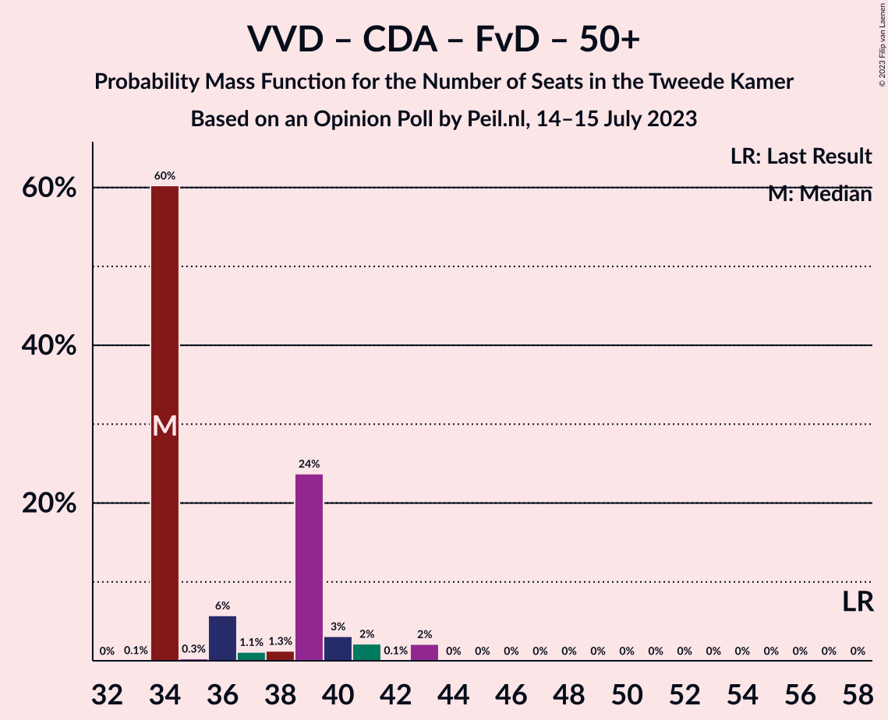

| Number of Seats | Probability | Accumulated | Special Marks |
|:---------------:|:-----------:|:-----------:|:-------------:|
| 33 | 0.1% | 100% |  |
| 34 | 60% | 99.9% | Median |
| 35 | 0.3% | 40% |  |
| 36 | 6% | 39% |  |
| 37 | 1.1% | 34% |  |
| 38 | 1.3% | 32% |  |
| 39 | 24% | 31% |  |
| 40 | 3% | 7% |  |
| 41 | 2% | 4% |  |
| 42 | 0.1% | 2% |  |
| 43 | 2% | 2% |  |
| 44 | 0% | 0% |  |
| 45 | 0% | 0% |  |
| 46 | 0% | 0% |  |
| 47 | 0% | 0% |  |
| 48 | 0% | 0% |  |
| 49 | 0% | 0% |  |
| 50 | 0% | 0% |  |
| 51 | 0% | 0% |  |
| 52 | 0% | 0% |  |
| 53 | 0% | 0% |  |
| 54 | 0% | 0% |  |
| 55 | 0% | 0% |  |
| 56 | 0% | 0% |  |
| 57 | 0% | 0% |  |
| 58 | 0% | 0% | Last Result |

### Volkspartij voor Vrijheid en Democratie – Christen-Democratisch Appèl – Forum voor Democratie

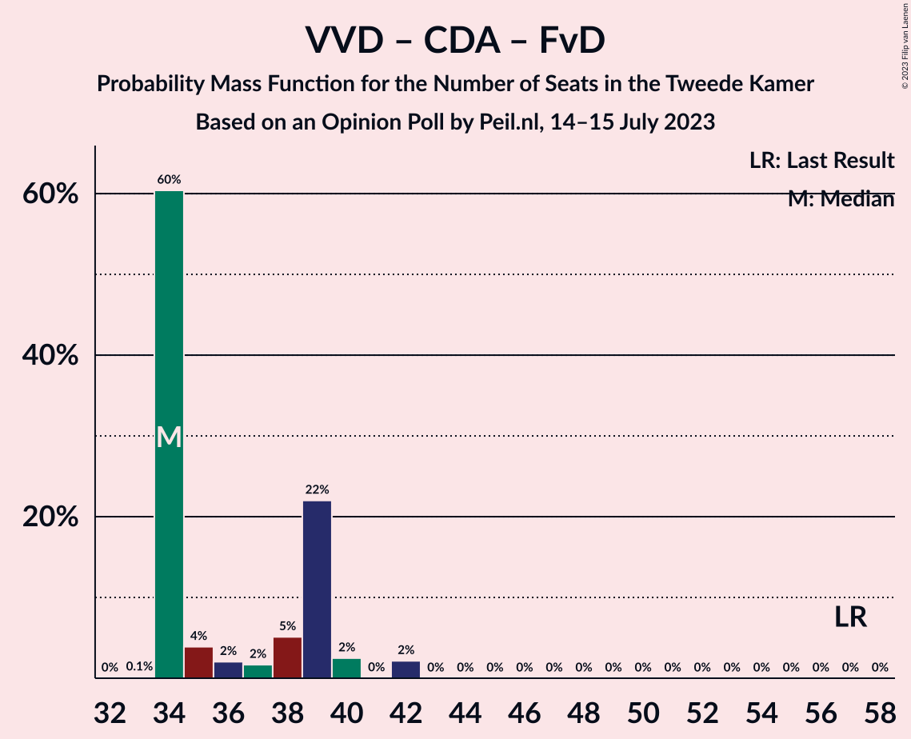

| Number of Seats | Probability | Accumulated | Special Marks |
|:---------------:|:-----------:|:-----------:|:-------------:|
| 33 | 0.1% | 100% |  |
| 34 | 60% | 99.8% | Median |
| 35 | 4% | 39% |  |
| 36 | 2% | 36% |  |
| 37 | 2% | 33% |  |
| 38 | 5% | 32% |  |
| 39 | 22% | 27% |  |
| 40 | 2% | 5% |  |
| 41 | 0% | 2% |  |
| 42 | 2% | 2% |  |
| 43 | 0% | 0% |  |
| 44 | 0% | 0% |  |
| 45 | 0% | 0% |  |
| 46 | 0% | 0% |  |
| 47 | 0% | 0% |  |
| 48 | 0% | 0% |  |
| 49 | 0% | 0% |  |
| 50 | 0% | 0% |  |
| 51 | 0% | 0% |  |
| 52 | 0% | 0% |  |
| 53 | 0% | 0% |  |
| 54 | 0% | 0% |  |
| 55 | 0% | 0% |  |
| 56 | 0% | 0% |  |
| 57 | 0% | 0% | Last Result |

### GroenLinks–Partij van de Arbeid – Christen-Democratisch Appèl – ChristenUnie

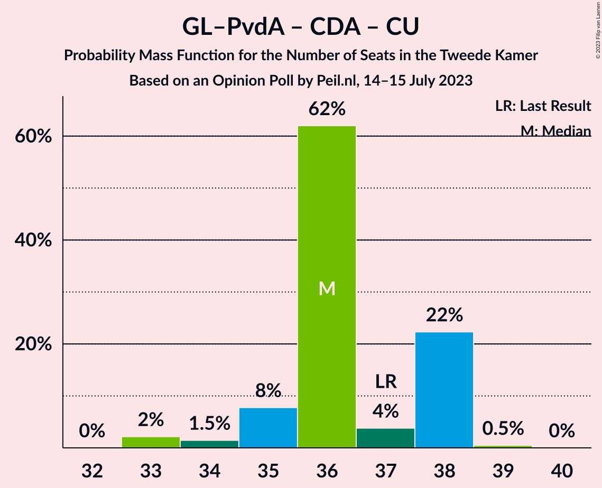

| Number of Seats | Probability | Accumulated | Special Marks |
|:---------------:|:-----------:|:-----------:|:-------------:|
| 33 | 2% | 100% |  |
| 34 | 1.5% | 98% |  |
| 35 | 8% | 96% |  |
| 36 | 62% | 89% | Median |
| 37 | 4% | 27% | Last Result |
| 38 | 22% | 23% |  |
| 39 | 0.5% | 0.5% |  |
| 40 | 0% | 0% |  |

### Volkspartij voor Vrijheid en Democratie – Christen-Democratisch Appèl

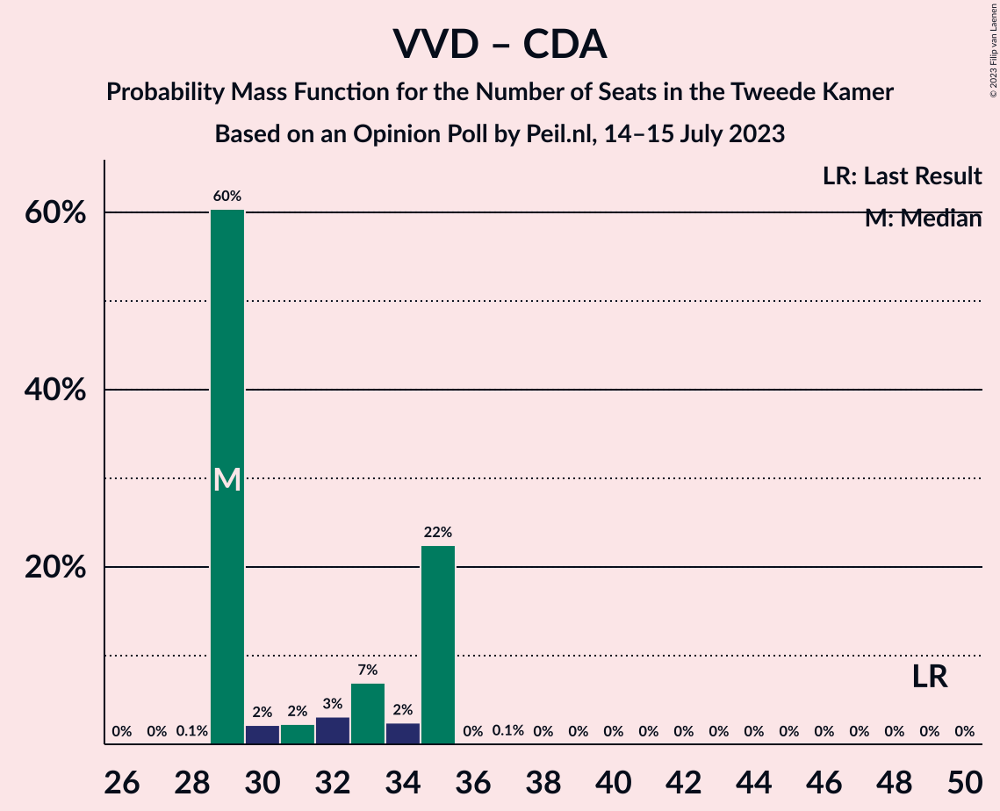

| Number of Seats | Probability | Accumulated | Special Marks |
|:---------------:|:-----------:|:-----------:|:-------------:|
| 28 | 0.1% | 100% |  |
| 29 | 60% | 99.9% | Median |
| 30 | 2% | 40% |  |
| 31 | 2% | 37% |  |
| 32 | 3% | 35% |  |
| 33 | 7% | 32% |  |
| 34 | 2% | 25% |  |
| 35 | 22% | 23% |  |
| 36 | 0% | 0.1% |  |
| 37 | 0.1% | 0.1% |  |
| 38 | 0% | 0% |  |
| 39 | 0% | 0% |  |
| 40 | 0% | 0% |  |
| 41 | 0% | 0% |  |
| 42 | 0% | 0% |  |
| 43 | 0% | 0% |  |
| 44 | 0% | 0% |  |
| 45 | 0% | 0% |  |
| 46 | 0% | 0% |  |
| 47 | 0% | 0% |  |
| 48 | 0% | 0% |  |
| 49 | 0% | 0% | Last Result |

### GroenLinks–Partij van de Arbeid – Christen-Democratisch Appèl

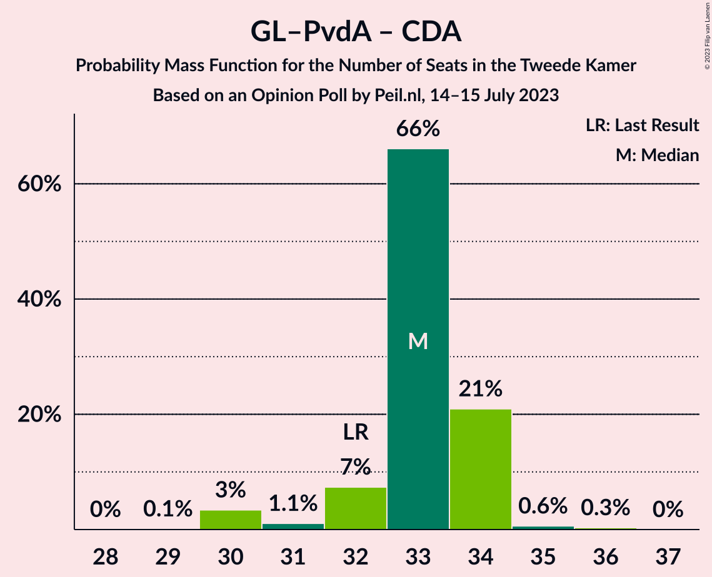

| Number of Seats | Probability | Accumulated | Special Marks |
|:---------------:|:-----------:|:-----------:|:-------------:|
| 29 | 0.1% | 100% |  |
| 30 | 3% | 99.9% |  |
| 31 | 1.1% | 96% |  |
| 32 | 7% | 95% | Last Result |
| 33 | 66% | 88% | Median |
| 34 | 21% | 22% |  |
| 35 | 0.6% | 0.9% |  |
| 36 | 0.3% | 0.3% |  |
| 37 | 0% | 0% |  |

### Democraten 66 – Christen-Democratisch Appèl

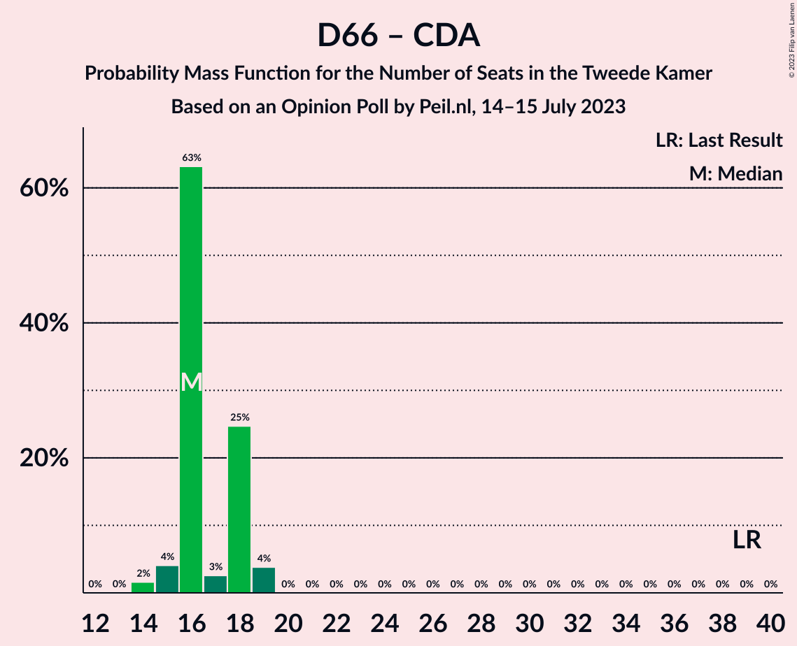

| Number of Seats | Probability | Accumulated | Special Marks |
|:---------------:|:-----------:|:-----------:|:-------------:|
| 14 | 2% | 100% |  |
| 15 | 4% | 98% |  |
| 16 | 63% | 94% | Median |
| 17 | 3% | 31% |  |
| 18 | 25% | 29% |  |
| 19 | 4% | 4% |  |
| 20 | 0% | 0% |  |
| 21 | 0% | 0% |  |
| 22 | 0% | 0% |  |
| 23 | 0% | 0% |  |
| 24 | 0% | 0% |  |
| 25 | 0% | 0% |  |
| 26 | 0% | 0% |  |
| 27 | 0% | 0% |  |
| 28 | 0% | 0% |  |
| 29 | 0% | 0% |  |
| 30 | 0% | 0% |  |
| 31 | 0% | 0% |  |
| 32 | 0% | 0% |  |
| 33 | 0% | 0% |  |
| 34 | 0% | 0% |  |
| 35 | 0% | 0% |  |
| 36 | 0% | 0% |  |
| 37 | 0% | 0% |  |
| 38 | 0% | 0% |  |
| 39 | 0% | 0% | Last Result |

## Technical Information

### Opinion Poll

+ **Polling firm:** Peil.nl
+ **Commissioner(s):** —
+ **Fieldwork period:** 14–15 July 2023

### Calculations

+ **Sample size:** 3000
+ **Simulations done:** 1,048,576
+ **Error estimate:** 2.48%

