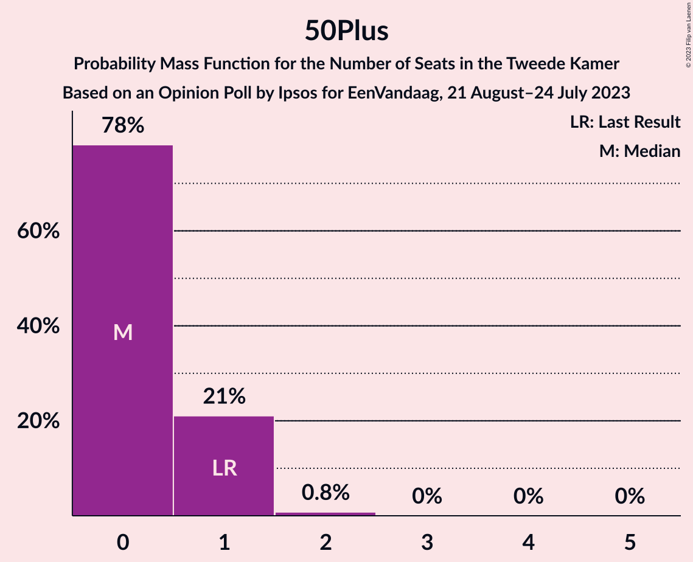
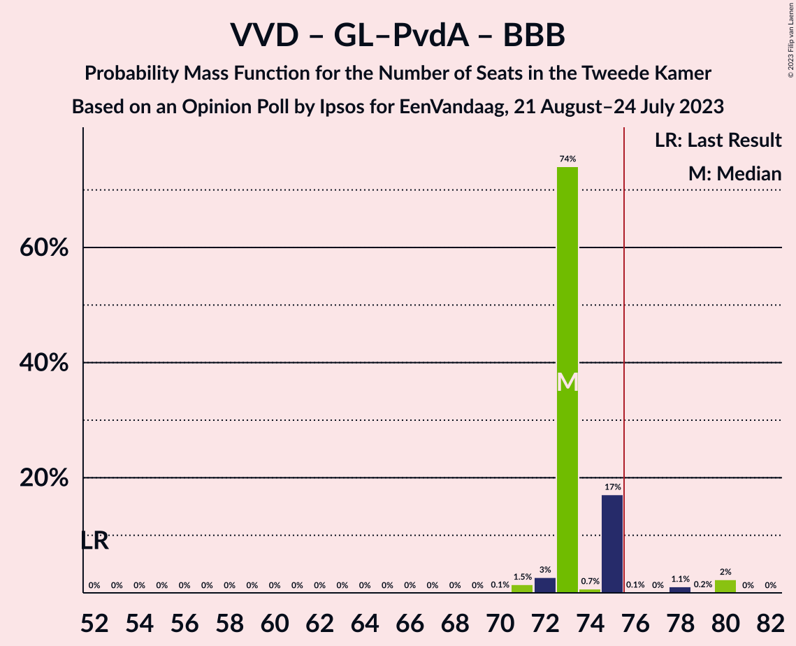
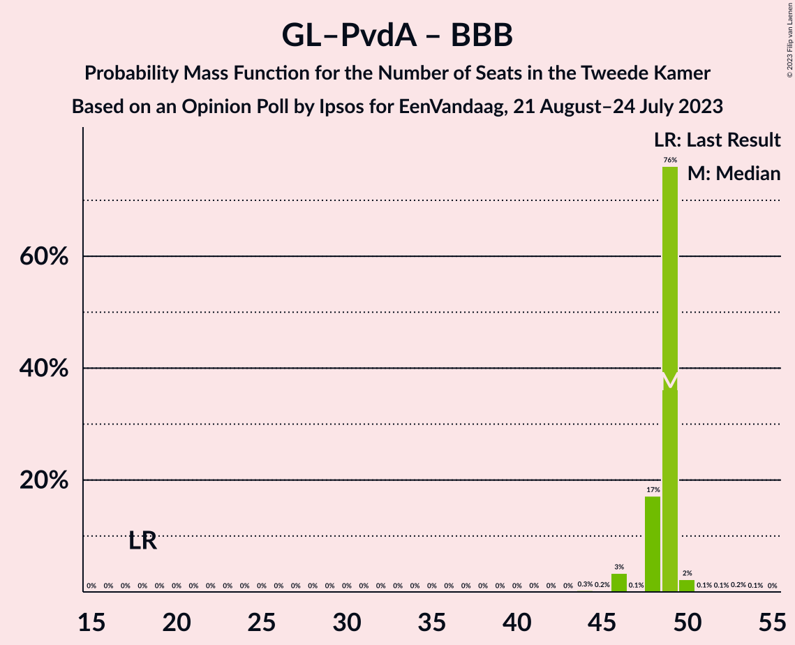

# Opinion Poll by Ipsos for EenVandaag, 21 August–24 July 2023

<a href="#voting-intentions">Voting Intentions</a> | <a href="#seats">Seats</a> | <a href="#coalitions">Coalitions</a> | <a href="#technical-information">Technical Information</a>

## Voting Intentions

### Confidence Intervals

| Party | Last Result | Poll Result | 80% Confidence Interval | 90% Confidence Interval | 95% Confidence Interval | 99% Confidence Interval |
|:-----:|:-----------:|:-----------:|:-----------------------:|:-----------------------:|:-----------------------:|:-----------------------:|
| Volkspartij voor Vrijheid en Democratie | 21.9% | 17.5% | 16.0–19.1% |15.6–19.6% |15.3–20.0% |14.6–20.8% |
| GroenLinks–Partij van de Arbeid | 10.9% | 16.6% | 15.2–18.2% |14.8–18.6% |14.4–19.0% |13.8–19.8% |
| BoerBurgerBeweging | 1.0% | 15.3% | 13.9–16.9% |13.5–17.3% |13.2–17.7% |12.6–18.4% |
| Partij voor de Vrijheid | 10.8% | 12.1% | 10.9–13.5% |10.5–13.9% |10.2–14.3% |9.6–15.0% |
| Democraten 66 | 15.0% | 6.5% | 5.6–7.6% |5.3–7.9% |5.1–8.2% |4.7–8.8% |
| Partij voor de Dieren | 3.8% | 4.9% | 4.1–5.9% |3.9–6.2% |3.7–6.4% |3.4–6.9% |
| Christen-Democratisch Appèl | 9.5% | 3.9% | 3.2–4.8% |3.0–5.1% |2.9–5.3% |2.6–5.8% |
| Socialistische Partij | 6.0% | 3.9% | 3.2–4.8% |3.0–5.1% |2.9–5.3% |2.6–5.8% |
| ChristenUnie | 3.4% | 3.6% | 2.9–4.5% |2.8–4.7% |2.6–5.0% |2.3–5.4% |
| Juiste Antwoord 2021 | 2.4% | 2.9% | 2.3–3.7% |2.2–3.9% |2.0–4.1% |1.8–4.6% |
| Volt Europa | 2.4% | 2.7% | 2.1–3.5% |2.0–3.7% |1.9–3.9% |1.6–4.3% |
| Forum voor Democratie | 5.0% | 2.5% | 2.0–3.3% |1.8–3.5% |1.7–3.7% |1.5–4.1% |
| DENK | 2.0% | 2.4% | 1.9–3.2% |1.7–3.4% |1.6–3.6% |1.4–3.9% |
| Staatkundig Gereformeerde Partij | 2.1% | 2.0% | 1.5–2.7% |1.4–2.9% |1.3–3.1% |1.1–3.4% |
| 50Plus | 1.0% | 0.6% | 0.4–1.1% |0.3–1.2% |0.3–1.3% |0.2–1.6% |
| Bij1 | 0.8% | 0.3% | 0.2–0.7% |0.1–0.8% |0.1–0.9% |0.1–1.1% |

*Note:* The poll result column reflects the actual value used in the calculations. Published results may vary slightly, and in addition be rounded to fewer digits.

## Seats

### Confidence Intervals

| Party | Last Result | Median | 80% Confidence Interval | 90% Confidence Interval | 95% Confidence Interval | 99% Confidence Interval |
|:-----:|:-----------:|:------:|:-----------------------:|:-----------------------:|:-----------------------:|:-----------------------:|
| <a href="#volkspartij-voor-vrijheid-en-democratie">Volkspartij voor Vrijheid en Democratie</a> | 34 | 24 | 24–27 |24–27 |24–30 |22–30 |
| <a href="#groenlinks–partij-van-de-arbeid">GroenLinks–Partij van de Arbeid</a> | 17 | 27 | 24–27 |24–27 |23–27 |22–28 |
| <a href="#boerburgerbeweging">BoerBurgerBeweging</a> | 1 | 22 | 22–24 |22–24 |22–27 |21–27 |
| <a href="#partij-voor-de-vrijheid">Partij voor de Vrijheid</a> | 17 | 19 | 18–19 |18–19 |17–19 |17–21 |
| <a href="#democraten-66">Democraten 66</a> | 24 | 10 | 10 |10–11 |9–11 |8–12 |
| <a href="#partij-voor-de-dieren">Partij voor de Dieren</a> | 6 | 7 | 7 |7 |6–8 |5–8 |
| <a href="#christen-democratisch-appèl">Christen-Democratisch Appèl</a> | 15 | 8 | 5–8 |5–8 |5–8 |4–8 |
| <a href="#socialistische-partij">Socialistische Partij</a> | 9 | 6 | 6–8 |6–8 |6–8 |5–8 |
| <a href="#christenunie">ChristenUnie</a> | 5 | 6 | 5–6 |5–6 |5–6 |3–7 |
| <a href="#juiste-antwoord-2021">Juiste Antwoord 2021</a> | 3 | 5 | 3–5 |3–5 |3–5 |3–6 |
| <a href="#volt-europa">Volt Europa</a> | 3 | 3 | 3–4 |3–4 |3–4 |3–5 |
| <a href="#forum-voor-democratie">Forum voor Democratie</a> | 8 | 4 | 4–5 |3–5 |3–5 |2–5 |
| <a href="#denk">DENK</a> | 3 | 3 | 3 |3 |3 |3–4 |
| <a href="#staatkundig-gereformeerde-partij">Staatkundig Gereformeerde Partij</a> | 3 | 2 | 2 |2–3 |2–3 |2–4 |
| <a href="#50plus">50Plus</a> | 1 | 0 | 0–1 |0–1 |0–1 |0–2 |
| <a href="#bij1">Bij1</a> | 1 | 0 | 0 |0 |0–1 |0–1 |

### Volkspartij voor Vrijheid en Democratie

*For a full overview of the results for this party, see the [Volkspartij voor Vrijheid en Democratie](party-volkspartijvoorvrijheidendemocratie.html) page.*

| Number of Seats | Probability | Accumulated | Special Marks |
|:---------------:|:-----------:|:-----------:|:-------------:|
| 22 | 1.2% | 100% |  |
| 23 | 0.1% | 98.8% |  |
| 24 | 74% | 98.7% | Median |
| 25 | 0.3% | 25% |  |
| 26 | 3% | 24% |  |
| 27 | 18% | 22% |  |
| 28 | 0.7% | 4% |  |
| 29 | 1.0% | 3% |  |
| 30 | 2% | 3% |  |
| 31 | 0.1% | 0.2% |  |
| 32 | 0.1% | 0.1% |  |
| 33 | 0% | 0% |  |
| 34 | 0% | 0% | Last Result |

### GroenLinks–Partij van de Arbeid

*For a full overview of the results for this party, see the [GroenLinks–Partij van de Arbeid](party-groenlinks–partijvandearbeid.html) page.*

| Number of Seats | Probability | Accumulated | Special Marks |
|:---------------:|:-----------:|:-----------:|:-------------:|
| 17 | 0% | 100% | Last Result |
| 18 | 0% | 100% |  |
| 19 | 0% | 100% |  |
| 20 | 0% | 100% |  |
| 21 | 0.1% | 100% |  |
| 22 | 0.5% | 99.9% |  |
| 23 | 3% | 99.4% |  |
| 24 | 20% | 97% |  |
| 25 | 1.5% | 77% |  |
| 26 | 0.2% | 76% |  |
| 27 | 74% | 75% | Median |
| 28 | 0.9% | 1.0% |  |
| 29 | 0.1% | 0.1% |  |
| 30 | 0% | 0% |  |

### BoerBurgerBeweging

*For a full overview of the results for this party, see the [BoerBurgerBeweging](party-boerburgerbeweging.html) page.*

| Number of Seats | Probability | Accumulated | Special Marks |
|:---------------:|:-----------:|:-----------:|:-------------:|
| 1 | 0% | 100% | Last Result |
| 2 | 0% | 100% |  |
| 3 | 0% | 100% |  |
| 4 | 0% | 100% |  |
| 5 | 0% | 100% |  |
| 6 | 0% | 100% |  |
| 7 | 0% | 100% |  |
| 8 | 0% | 100% |  |
| 9 | 0% | 100% |  |
| 10 | 0% | 100% |  |
| 11 | 0% | 100% |  |
| 12 | 0% | 100% |  |
| 13 | 0% | 100% |  |
| 14 | 0% | 100% |  |
| 15 | 0% | 100% |  |
| 16 | 0% | 100% |  |
| 17 | 0% | 100% |  |
| 18 | 0% | 100% |  |
| 19 | 0.2% | 100% |  |
| 20 | 0.1% | 99.7% |  |
| 21 | 1.3% | 99.6% |  |
| 22 | 77% | 98% | Median |
| 23 | 0.3% | 22% |  |
| 24 | 19% | 21% |  |
| 25 | 0.2% | 3% |  |
| 26 | 0.1% | 3% |  |
| 27 | 2% | 3% |  |
| 28 | 0.2% | 0.2% |  |
| 29 | 0% | 0% |  |

### Partij voor de Vrijheid

*For a full overview of the results for this party, see the [Partij voor de Vrijheid](party-partijvoordevrijheid.html) page.*

| Number of Seats | Probability | Accumulated | Special Marks |
|:---------------:|:-----------:|:-----------:|:-------------:|
| 14 | 0% | 100% |  |
| 15 | 0.2% | 99.9% |  |
| 16 | 0.1% | 99.8% |  |
| 17 | 3% | 99.7% | Last Result |
| 18 | 18% | 97% |  |
| 19 | 76% | 79% | Median |
| 20 | 0.8% | 2% |  |
| 21 | 1.3% | 2% |  |
| 22 | 0.1% | 0.3% |  |
| 23 | 0.1% | 0.1% |  |
| 24 | 0% | 0.1% |  |
| 25 | 0% | 0% |  |

### Democraten 66

*For a full overview of the results for this party, see the [Democraten 66](party-democraten66.html) page.*

| Number of Seats | Probability | Accumulated | Special Marks |
|:---------------:|:-----------:|:-----------:|:-------------:|
| 7 | 0.1% | 100% |  |
| 8 | 0.8% | 99.9% |  |
| 9 | 3% | 99.0% |  |
| 10 | 91% | 96% | Median |
| 11 | 5% | 5% |  |
| 12 | 0.5% | 0.6% |  |
| 13 | 0.1% | 0.1% |  |
| 14 | 0% | 0% |  |
| 15 | 0% | 0% |  |
| 16 | 0% | 0% |  |
| 17 | 0% | 0% |  |
| 18 | 0% | 0% |  |
| 19 | 0% | 0% |  |
| 20 | 0% | 0% |  |
| 21 | 0% | 0% |  |
| 22 | 0% | 0% |  |
| 23 | 0% | 0% |  |
| 24 | 0% | 0% | Last Result |

### Partij voor de Dieren

*For a full overview of the results for this party, see the [Partij voor de Dieren](party-partijvoordedieren.html) page.*

| Number of Seats | Probability | Accumulated | Special Marks |
|:---------------:|:-----------:|:-----------:|:-------------:|
| 5 | 2% | 100% |  |
| 6 | 2% | 98% | Last Result |
| 7 | 93% | 96% | Median |
| 8 | 3% | 3% |  |
| 9 | 0.2% | 0.4% |  |
| 10 | 0.2% | 0.2% |  |
| 11 | 0% | 0% |  |

### Christen-Democratisch Appèl

*For a full overview of the results for this party, see the [Christen-Democratisch Appèl](party-christen-democratischappèl.html) page.*

| Number of Seats | Probability | Accumulated | Special Marks |
|:---------------:|:-----------:|:-----------:|:-------------:|
| 4 | 0.5% | 100% |  |
| 5 | 18% | 99.5% |  |
| 6 | 6% | 81% |  |
| 7 | 0.9% | 75% |  |
| 8 | 74% | 74% | Median |
| 9 | 0% | 0% |  |
| 10 | 0% | 0% |  |
| 11 | 0% | 0% |  |
| 12 | 0% | 0% |  |
| 13 | 0% | 0% |  |
| 14 | 0% | 0% |  |
| 15 | 0% | 0% | Last Result |

### Socialistische Partij

*For a full overview of the results for this party, see the [Socialistische Partij](party-socialistischepartij.html) page.*

| Number of Seats | Probability | Accumulated | Special Marks |
|:---------------:|:-----------:|:-----------:|:-------------:|
| 4 | 0.4% | 100% |  |
| 5 | 2% | 99.6% |  |
| 6 | 76% | 98% | Median |
| 7 | 3% | 21% |  |
| 8 | 18% | 18% |  |
| 9 | 0.1% | 0.1% | Last Result |
| 10 | 0% | 0% |  |

### ChristenUnie

*For a full overview of the results for this party, see the [ChristenUnie](party-christenunie.html) page.*

| Number of Seats | Probability | Accumulated | Special Marks |
|:---------------:|:-----------:|:-----------:|:-------------:|
| 3 | 0.6% | 100% |  |
| 4 | 1.3% | 99.4% |  |
| 5 | 20% | 98% | Last Result |
| 6 | 77% | 78% | Median |
| 7 | 2% | 2% |  |
| 8 | 0.1% | 0.1% |  |
| 9 | 0% | 0% |  |

### Juiste Antwoord 2021

*For a full overview of the results for this party, see the [Juiste Antwoord 2021](party-juisteantwoord2021.html) page.*

| Number of Seats | Probability | Accumulated | Special Marks |
|:---------------:|:-----------:|:-----------:|:-------------:|
| 3 | 18% | 100% | Last Result |
| 4 | 4% | 82% |  |
| 5 | 77% | 78% | Median |
| 6 | 1.4% | 1.4% |  |
| 7 | 0% | 0% |  |

### Volt Europa

*For a full overview of the results for this party, see the [Volt Europa](party-volteuropa.html) page.*

| Number of Seats | Probability | Accumulated | Special Marks |
|:---------------:|:-----------:|:-----------:|:-------------:|
| 2 | 0.4% | 100% |  |
| 3 | 77% | 99.6% | Last Result, Median |
| 4 | 20% | 22% |  |
| 5 | 2% | 2% |  |
| 6 | 0.4% | 0.4% |  |
| 7 | 0% | 0% |  |

### Forum voor Democratie

*For a full overview of the results for this party, see the [Forum voor Democratie](party-forumvoordemocratie.html) page.*

| Number of Seats | Probability | Accumulated | Special Marks |
|:---------------:|:-----------:|:-----------:|:-------------:|
| 2 | 2% | 100% |  |
| 3 | 4% | 98% |  |
| 4 | 76% | 94% | Median |
| 5 | 17% | 18% |  |
| 6 | 0.3% | 0.3% |  |
| 7 | 0% | 0% |  |
| 8 | 0% | 0% | Last Result |

### DENK

*For a full overview of the results for this party, see the [DENK](party-denk.html) page.*

| Number of Seats | Probability | Accumulated | Special Marks |
|:---------------:|:-----------:|:-----------:|:-------------:|
| 2 | 0.4% | 100% |  |
| 3 | 98% | 99.6% | Last Result, Median |
| 4 | 0.8% | 1.3% |  |
| 5 | 0.5% | 0.5% |  |
| 6 | 0% | 0% |  |

### Staatkundig Gereformeerde Partij

*For a full overview of the results for this party, see the [Staatkundig Gereformeerde Partij](party-staatkundiggereformeerdepartij.html) page.*

| Number of Seats | Probability | Accumulated | Special Marks |
|:---------------:|:-----------:|:-----------:|:-------------:|
| 1 | 0.1% | 100% |  |
| 2 | 95% | 99.9% | Median |
| 3 | 4% | 5% | Last Result |
| 4 | 0.8% | 0.9% |  |
| 5 | 0.1% | 0.1% |  |
| 6 | 0% | 0% |  |

### 50Plus

*For a full overview of the results for this party, see the [50Plus](party-50plus.html) page.*

| Number of Seats | Probability | Accumulated | Special Marks |
|:---------------:|:-----------:|:-----------:|:-------------:|
| 0 | 78% | 100% | Median |
| 1 | 21% | 22% | Last Result |
| 2 | 0.8% | 0.8% |  |
| 3 | 0% | 0% |  |

### Bij1

*For a full overview of the results for this party, see the [Bij1](party-bij1.html) page.*

| Number of Seats | Probability | Accumulated | Special Marks |
|:---------------:|:-----------:|:-----------:|:-------------:|
| 0 | 97% | 100% | Median |
| 1 | 3% | 3% | Last Result |
| 2 | 0% | 0% |  |

## Coalitions

### Confidence Intervals

| Coalition | Last Result | Median | Majority? | 80% Confidence Interval | 90% Confidence Interval | 95% Confidence Interval | 99% Confidence Interval |
|:---------:|:-----------:|:------:|:---------:|:-----------------------:|:-----------------------:|:-----------------------:|:-----------------------:|
| Volkspartij voor Vrijheid en Democratie – GroenLinks–Partij van de Arbeid – BoerBurgerBeweging – Christen-Democratisch Appèl | 67 | 81 | 99.9% | 80–81 | 80–81 | 78–84 | 77–86 |
| Volkspartij voor Vrijheid en Democratie – GroenLinks–Partij van de Arbeid – BoerBurgerBeweging | 52 | 73 | 4% | 73–75 | 73–75 | 72–79 | 71–80 |
| Volkspartij voor Vrijheid en Democratie – GroenLinks–Partij van de Arbeid – Democraten 66 | 75 | 61 | 0% | 61 | 61 | 60–64 | 56–66 |
| Volkspartij voor Vrijheid en Democratie – Partij voor de Vrijheid – Christen-Democratisch Appèl – Forum voor Democratie – Staatkundig Gereformeerde Partij | 77 | 57 | 0% | 57 | 57 | 55–60 | 54–63 |
| Volkspartij voor Vrijheid en Democratie – BoerBurgerBeweging – Christen-Democratisch Appèl | 50 | 54 | 0% | 54–56 | 54–56 | 54–60 | 52–63 |
| Volkspartij voor Vrijheid en Democratie – GroenLinks–Partij van de Arbeid – Christen-Democratisch Appèl | 66 | 59 | 0% | 56–59 | 56–59 | 56–59 | 53–62 |
| Volkspartij voor Vrijheid en Democratie – Partij voor de Vrijheid – Christen-Democratisch Appèl – Forum voor Democratie | 74 | 55 | 0% | 55 | 55 | 52–57 | 52–59 |
| GroenLinks–Partij van de Arbeid – Democraten 66 – Christen-Democratisch Appèl – Socialistische Partij – ChristenUnie | 70 | 57 | 0% | 52–57 | 52–57 | 51–57 | 48–57 |
| Volkspartij voor Vrijheid en Democratie – Partij voor de Vrijheid – Christen-Democratisch Appèl | 66 | 51 | 0% | 50–51 | 50–51 | 49–55 | 47–55 |
| Volkspartij voor Vrijheid en Democratie – GroenLinks–Partij van de Arbeid | 51 | 51 | 0% | 51 | 51 | 50–53 | 47–57 |
| Volkspartij voor Vrijheid en Democratie – Democraten 66 – Christen-Democratisch Appèl – ChristenUnie | 78 | 48 | 0% | 47–48 | 47–49 | 47–52 | 44–52 |
| GroenLinks–Partij van de Arbeid – Democraten 66 – Christen-Democratisch Appèl – ChristenUnie | 61 | 51 | 0% | 44–51 | 44–51 | 44–51 | 42–51 |
| GroenLinks–Partij van de Arbeid – BoerBurgerBeweging | 18 | 49 | 0% | 48–49 | 48–49 | 46–50 | 45–50 |
| Volkspartij voor Vrijheid en Democratie – Democraten 66 – Christen-Democratisch Appèl | 73 | 42 | 0% | 42 | 42–43 | 42–46 | 37–47 |
| GroenLinks–Partij van de Arbeid – Democraten 66 – Christen-Democratisch Appèl | 56 | 45 | 0% | 39–45 | 39–45 | 39–45 | 37–45 |
| Volkspartij voor Vrijheid en Democratie – Christen-Democratisch Appèl – Forum voor Democratie – Staatkundig Gereformeerde Partij – 50Plus | 61 | 38 | 0% | 38–40 | 38–40 | 38–41 | 34–45 |
| Volkspartij voor Vrijheid en Democratie – Christen-Democratisch Appèl – Forum voor Democratie – Staatkundig Gereformeerde Partij | 60 | 38 | 0% | 38–39 | 38–39 | 37–41 | 34–43 |
| GroenLinks–Partij van de Arbeid – Christen-Democratisch Appèl – ChristenUnie | 37 | 41 | 0% | 34–41 | 34–41 | 34–41 | 33–41 |
| Volkspartij voor Vrijheid en Democratie – Christen-Democratisch Appèl – Forum voor Democratie – 50Plus | 58 | 36 | 0% | 36–38 | 36–38 | 36–38 | 31–41 |
| Volkspartij voor Vrijheid en Democratie – Christen-Democratisch Appèl – Forum voor Democratie | 57 | 36 | 0% | 36–37 | 36–37 | 35–38 | 31–40 |
| Volkspartij voor Vrijheid en Democratie – Christen-Democratisch Appèl | 49 | 32 | 0% | 32 | 32 | 32–35 | 28–36 |
| GroenLinks–Partij van de Arbeid – Christen-Democratisch Appèl | 32 | 35 | 0% | 29–35 | 29–35 | 29–35 | 28–35 |
| Democraten 66 – Christen-Democratisch Appèl | 39 | 18 | 0% | 15–18 | 15–18 | 15–18 | 14–18 |

### Volkspartij voor Vrijheid en Democratie – GroenLinks–Partij van de Arbeid – BoerBurgerBeweging – Christen-Democratisch Appèl

| Number of Seats | Probability | Accumulated | Special Marks |
|:---------------:|:-----------:|:-----------:|:-------------:|
| 67 | 0% | 100% | Last Result |
| 68 | 0% | 100% |  |
| 69 | 0% | 100% |  |
| 70 | 0% | 100% |  |
| 71 | 0% | 100% |  |
| 72 | 0% | 100% |  |
| 73 | 0% | 100% |  |
| 74 | 0% | 100% |  |
| 75 | 0% | 100% |  |
| 76 | 0.3% | 99.9% | Majority |
| 77 | 1.4% | 99.7% |  |
| 78 | 2% | 98% |  |
| 79 | 0.4% | 96% |  |
| 80 | 17% | 96% |  |
| 81 | 75% | 78% | Median |
| 82 | 0.1% | 4% |  |
| 83 | 1.1% | 4% |  |
| 84 | 0.1% | 3% |  |
| 85 | 0.1% | 2% |  |
| 86 | 2% | 2% |  |
| 87 | 0% | 0% |  |

### Volkspartij voor Vrijheid en Democratie – GroenLinks–Partij van de Arbeid – BoerBurgerBeweging

| Number of Seats | Probability | Accumulated | Special Marks |
|:---------------:|:-----------:|:-----------:|:-------------:|
| 52 | 0% | 100% | Last Result |
| 53 | 0% | 100% |  |
| 54 | 0% | 100% |  |
| 55 | 0% | 100% |  |
| 56 | 0% | 100% |  |
| 57 | 0% | 100% |  |
| 58 | 0% | 100% |  |
| 59 | 0% | 100% |  |
| 60 | 0% | 100% |  |
| 61 | 0% | 100% |  |
| 62 | 0% | 100% |  |
| 63 | 0% | 100% |  |
| 64 | 0% | 100% |  |
| 65 | 0% | 100% |  |
| 66 | 0% | 100% |  |
| 67 | 0% | 100% |  |
| 68 | 0% | 100% |  |
| 69 | 0% | 100% |  |
| 70 | 0.1% | 100% |  |
| 71 | 1.5% | 99.9% |  |
| 72 | 3% | 98% |  |
| 73 | 74% | 96% | Median |
| 74 | 0.7% | 22% |  |
| 75 | 17% | 21% |  |
| 76 | 0.1% | 4% | Majority |
| 77 | 0% | 4% |  |
| 78 | 1.1% | 4% |  |
| 79 | 0.2% | 3% |  |
| 80 | 2% | 2% |  |
| 81 | 0% | 0% |  |

### Volkspartij voor Vrijheid en Democratie – GroenLinks–Partij van de Arbeid – Democraten 66

| Number of Seats | Probability | Accumulated | Special Marks |
|:---------------:|:-----------:|:-----------:|:-------------:|
| 55 | 0.1% | 100% |  |
| 56 | 1.2% | 99.9% |  |
| 57 | 0.1% | 98.7% |  |
| 58 | 0.1% | 98.6% |  |
| 59 | 0.4% | 98% |  |
| 60 | 0.7% | 98% |  |
| 61 | 93% | 97% | Median |
| 62 | 0.5% | 4% |  |
| 63 | 0.2% | 4% |  |
| 64 | 2% | 4% |  |
| 65 | 0% | 1.0% |  |
| 66 | 0.9% | 1.0% |  |
| 67 | 0% | 0.1% |  |
| 68 | 0% | 0.1% |  |
| 69 | 0% | 0% |  |
| 70 | 0% | 0% |  |
| 71 | 0% | 0% |  |
| 72 | 0% | 0% |  |
| 73 | 0% | 0% |  |
| 74 | 0% | 0% |  |
| 75 | 0% | 0% | Last Result |

### Volkspartij voor Vrijheid en Democratie – Partij voor de Vrijheid – Christen-Democratisch Appèl – Forum voor Democratie – Staatkundig Gereformeerde Partij

| Number of Seats | Probability | Accumulated | Special Marks |
|:---------------:|:-----------:|:-----------:|:-------------:|
| 50 | 0.1% | 100% |  |
| 51 | 0.1% | 99.9% |  |
| 52 | 0% | 99.9% |  |
| 53 | 0.1% | 99.8% |  |
| 54 | 2% | 99.8% |  |
| 55 | 1.3% | 98% |  |
| 56 | 0.5% | 96% |  |
| 57 | 91% | 96% | Median |
| 58 | 1.1% | 5% |  |
| 59 | 0.4% | 4% |  |
| 60 | 2% | 3% |  |
| 61 | 0.1% | 0.9% |  |
| 62 | 0.1% | 0.8% |  |
| 63 | 0.6% | 0.7% |  |
| 64 | 0% | 0.1% |  |
| 65 | 0% | 0.1% |  |
| 66 | 0% | 0% |  |
| 67 | 0% | 0% |  |
| 68 | 0% | 0% |  |
| 69 | 0% | 0% |  |
| 70 | 0% | 0% |  |
| 71 | 0% | 0% |  |
| 72 | 0% | 0% |  |
| 73 | 0% | 0% |  |
| 74 | 0% | 0% |  |
| 75 | 0% | 0% |  |
| 76 | 0% | 0% | Majority |
| 77 | 0% | 0% | Last Result |

### Volkspartij voor Vrijheid en Democratie – BoerBurgerBeweging – Christen-Democratisch Appèl

| Number of Seats | Probability | Accumulated | Special Marks |
|:---------------:|:-----------:|:-----------:|:-------------:|
| 49 | 0.1% | 100% |  |
| 50 | 0% | 99.9% | Last Result |
| 51 | 0.3% | 99.9% |  |
| 52 | 1.2% | 99.6% |  |
| 53 | 0.2% | 98% |  |
| 54 | 76% | 98% | Median |
| 55 | 1.0% | 22% |  |
| 56 | 17% | 21% |  |
| 57 | 0.8% | 4% |  |
| 58 | 0.2% | 3% |  |
| 59 | 0.1% | 3% |  |
| 60 | 0% | 3% |  |
| 61 | 0.3% | 2% |  |
| 62 | 0% | 2% |  |
| 63 | 2% | 2% |  |
| 64 | 0% | 0% |  |

### Volkspartij voor Vrijheid en Democratie – GroenLinks–Partij van de Arbeid – Christen-Democratisch Appèl

| Number of Seats | Probability | Accumulated | Special Marks |
|:---------------:|:-----------:|:-----------:|:-------------:|
| 52 | 0.2% | 100% |  |
| 53 | 1.3% | 99.8% |  |
| 54 | 0.2% | 98% |  |
| 55 | 0.2% | 98% |  |
| 56 | 19% | 98% |  |
| 57 | 0.3% | 79% |  |
| 58 | 0.6% | 79% |  |
| 59 | 77% | 78% | Median |
| 60 | 0% | 1.2% |  |
| 61 | 0.1% | 1.1% |  |
| 62 | 0.9% | 1.0% |  |
| 63 | 0% | 0.1% |  |
| 64 | 0% | 0% |  |
| 65 | 0% | 0% |  |
| 66 | 0% | 0% | Last Result |

### Volkspartij voor Vrijheid en Democratie – Partij voor de Vrijheid – Christen-Democratisch Appèl – Forum voor Democratie

| Number of Seats | Probability | Accumulated | Special Marks |
|:---------------:|:-----------:|:-----------:|:-------------:|
| 48 | 0.1% | 100% |  |
| 49 | 0.1% | 99.9% |  |
| 50 | 0.1% | 99.9% |  |
| 51 | 0.1% | 99.8% |  |
| 52 | 3% | 99.7% |  |
| 53 | 0.3% | 96% |  |
| 54 | 0.6% | 96% |  |
| 55 | 91% | 95% | Median |
| 56 | 1.0% | 5% |  |
| 57 | 3% | 4% |  |
| 58 | 0.2% | 1.0% |  |
| 59 | 0.7% | 0.8% |  |
| 60 | 0% | 0.1% |  |
| 61 | 0% | 0.1% |  |
| 62 | 0% | 0.1% |  |
| 63 | 0% | 0% |  |
| 64 | 0% | 0% |  |
| 65 | 0% | 0% |  |
| 66 | 0% | 0% |  |
| 67 | 0% | 0% |  |
| 68 | 0% | 0% |  |
| 69 | 0% | 0% |  |
| 70 | 0% | 0% |  |
| 71 | 0% | 0% |  |
| 72 | 0% | 0% |  |
| 73 | 0% | 0% |  |
| 74 | 0% | 0% | Last Result |

### GroenLinks–Partij van de Arbeid – Democraten 66 – Christen-Democratisch Appèl – Socialistische Partij – ChristenUnie

| Number of Seats | Probability | Accumulated | Special Marks |
|:---------------:|:-----------:|:-----------:|:-------------:|
| 45 | 0% | 100% |  |
| 46 | 0.1% | 99.9% |  |
| 47 | 0.3% | 99.9% |  |
| 48 | 0.1% | 99.5% |  |
| 49 | 0.8% | 99.4% |  |
| 50 | 0.1% | 98.6% |  |
| 51 | 2% | 98.6% |  |
| 52 | 18% | 96% |  |
| 53 | 0.1% | 78% |  |
| 54 | 3% | 78% |  |
| 55 | 0.3% | 75% |  |
| 56 | 0% | 74% |  |
| 57 | 74% | 74% | Median |
| 58 | 0.3% | 0.3% |  |
| 59 | 0% | 0.1% |  |
| 60 | 0% | 0% |  |
| 61 | 0% | 0% |  |
| 62 | 0% | 0% |  |
| 63 | 0% | 0% |  |
| 64 | 0% | 0% |  |
| 65 | 0% | 0% |  |
| 66 | 0% | 0% |  |
| 67 | 0% | 0% |  |
| 68 | 0% | 0% |  |
| 69 | 0% | 0% |  |
| 70 | 0% | 0% | Last Result |

### Volkspartij voor Vrijheid en Democratie – Partij voor de Vrijheid – Christen-Democratisch Appèl

| Number of Seats | Probability | Accumulated | Special Marks |
|:---------------:|:-----------:|:-----------:|:-------------:|
| 44 | 0.1% | 100% |  |
| 45 | 0% | 99.9% |  |
| 46 | 0.1% | 99.9% |  |
| 47 | 0.3% | 99.8% |  |
| 48 | 0.1% | 99.5% |  |
| 49 | 3% | 99.4% |  |
| 50 | 17% | 96% |  |
| 51 | 74% | 79% | Median |
| 52 | 1.3% | 5% |  |
| 53 | 0.3% | 3% |  |
| 54 | 0% | 3% |  |
| 55 | 3% | 3% |  |
| 56 | 0% | 0.2% |  |
| 57 | 0.1% | 0.1% |  |
| 58 | 0% | 0.1% |  |
| 59 | 0.1% | 0.1% |  |
| 60 | 0% | 0% |  |
| 61 | 0% | 0% |  |
| 62 | 0% | 0% |  |
| 63 | 0% | 0% |  |
| 64 | 0% | 0% |  |
| 65 | 0% | 0% |  |
| 66 | 0% | 0% | Last Result |

### Volkspartij voor Vrijheid en Democratie – GroenLinks–Partij van de Arbeid

| Number of Seats | Probability | Accumulated | Special Marks |
|:---------------:|:-----------:|:-----------:|:-------------:|
| 46 | 0.1% | 100% |  |
| 47 | 1.2% | 99.9% |  |
| 48 | 0.3% | 98.7% |  |
| 49 | 0.1% | 98% |  |
| 50 | 3% | 98% |  |
| 51 | 91% | 96% | Last Result, Median |
| 52 | 1.0% | 5% |  |
| 53 | 2% | 4% |  |
| 54 | 0.1% | 1.2% |  |
| 55 | 0.1% | 1.1% |  |
| 56 | 0% | 1.0% |  |
| 57 | 0.9% | 1.0% |  |
| 58 | 0% | 0.1% |  |
| 59 | 0% | 0% |  |

### Volkspartij voor Vrijheid en Democratie – Democraten 66 – Christen-Democratisch Appèl – ChristenUnie

| Number of Seats | Probability | Accumulated | Special Marks |
|:---------------:|:-----------:|:-----------:|:-------------:|
| 41 | 0.1% | 100% |  |
| 42 | 0.1% | 99.9% |  |
| 43 | 0.1% | 99.8% |  |
| 44 | 1.2% | 99.8% |  |
| 45 | 0% | 98.5% |  |
| 46 | 0.8% | 98.5% |  |
| 47 | 18% | 98% |  |
| 48 | 74% | 79% | Median |
| 49 | 3% | 5% |  |
| 50 | 0.3% | 3% |  |
| 51 | 0.1% | 3% |  |
| 52 | 2% | 3% |  |
| 53 | 0% | 0.3% |  |
| 54 | 0.3% | 0.3% |  |
| 55 | 0% | 0% |  |
| 56 | 0% | 0% |  |
| 57 | 0% | 0% |  |
| 58 | 0% | 0% |  |
| 59 | 0% | 0% |  |
| 60 | 0% | 0% |  |
| 61 | 0% | 0% |  |
| 62 | 0% | 0% |  |
| 63 | 0% | 0% |  |
| 64 | 0% | 0% |  |
| 65 | 0% | 0% |  |
| 66 | 0% | 0% |  |
| 67 | 0% | 0% |  |
| 68 | 0% | 0% |  |
| 69 | 0% | 0% |  |
| 70 | 0% | 0% |  |
| 71 | 0% | 0% |  |
| 72 | 0% | 0% |  |
| 73 | 0% | 0% |  |
| 74 | 0% | 0% |  |
| 75 | 0% | 0% |  |
| 76 | 0% | 0% | Majority |
| 77 | 0% | 0% |  |
| 78 | 0% | 0% | Last Result |

### GroenLinks–Partij van de Arbeid – Democraten 66 – Christen-Democratisch Appèl – ChristenUnie

| Number of Seats | Probability | Accumulated | Special Marks |
|:---------------:|:-----------:|:-----------:|:-------------:|
| 40 | 0.1% | 100% |  |
| 41 | 0.1% | 99.9% |  |
| 42 | 0.8% | 99.8% |  |
| 43 | 0.3% | 99.0% |  |
| 44 | 17% | 98.7% |  |
| 45 | 3% | 82% |  |
| 46 | 1.1% | 79% |  |
| 47 | 3% | 78% |  |
| 48 | 0% | 75% |  |
| 49 | 0.1% | 75% |  |
| 50 | 0.7% | 75% |  |
| 51 | 74% | 74% | Median |
| 52 | 0% | 0.1% |  |
| 53 | 0% | 0% |  |
| 54 | 0% | 0% |  |
| 55 | 0% | 0% |  |
| 56 | 0% | 0% |  |
| 57 | 0% | 0% |  |
| 58 | 0% | 0% |  |
| 59 | 0% | 0% |  |
| 60 | 0% | 0% |  |
| 61 | 0% | 0% | Last Result |

### GroenLinks–Partij van de Arbeid – BoerBurgerBeweging

| Number of Seats | Probability | Accumulated | Special Marks |
|:---------------:|:-----------:|:-----------:|:-------------:|
| 18 | 0% | 100% | Last Result |
| 19 | 0% | 100% |  |
| 20 | 0% | 100% |  |
| 21 | 0% | 100% |  |
| 22 | 0% | 100% |  |
| 23 | 0% | 100% |  |
| 24 | 0% | 100% |  |
| 25 | 0% | 100% |  |
| 26 | 0% | 100% |  |
| 27 | 0% | 100% |  |
| 28 | 0% | 100% |  |
| 29 | 0% | 100% |  |
| 30 | 0% | 100% |  |
| 31 | 0% | 100% |  |
| 32 | 0% | 100% |  |
| 33 | 0% | 100% |  |
| 34 | 0% | 100% |  |
| 35 | 0% | 100% |  |
| 36 | 0% | 100% |  |
| 37 | 0% | 100% |  |
| 38 | 0% | 100% |  |
| 39 | 0% | 100% |  |
| 40 | 0% | 100% |  |
| 41 | 0% | 100% |  |
| 42 | 0% | 100% |  |
| 43 | 0% | 99.9% |  |
| 44 | 0.3% | 99.9% |  |
| 45 | 0.2% | 99.7% |  |
| 46 | 3% | 99.5% |  |
| 47 | 0.1% | 96% |  |
| 48 | 17% | 96% |  |
| 49 | 76% | 79% | Median |
| 50 | 2% | 3% |  |
| 51 | 0.1% | 0.5% |  |
| 52 | 0.1% | 0.3% |  |
| 53 | 0.2% | 0.3% |  |
| 54 | 0.1% | 0.1% |  |
| 55 | 0% | 0% |  |

### Volkspartij voor Vrijheid en Democratie – Democraten 66 – Christen-Democratisch Appèl

| Number of Seats | Probability | Accumulated | Special Marks |
|:---------------:|:-----------:|:-----------:|:-------------:|
| 36 | 0.1% | 100% |  |
| 37 | 1.2% | 99.9% |  |
| 38 | 0.2% | 98.7% |  |
| 39 | 0% | 98.6% |  |
| 40 | 0.1% | 98.5% |  |
| 41 | 0.4% | 98% |  |
| 42 | 91% | 98% | Median |
| 43 | 4% | 7% |  |
| 44 | 0.3% | 3% |  |
| 45 | 0.2% | 3% |  |
| 46 | 0.1% | 3% |  |
| 47 | 2% | 2% |  |
| 48 | 0% | 0% |  |
| 49 | 0% | 0% |  |
| 50 | 0% | 0% |  |
| 51 | 0% | 0% |  |
| 52 | 0% | 0% |  |
| 53 | 0% | 0% |  |
| 54 | 0% | 0% |  |
| 55 | 0% | 0% |  |
| 56 | 0% | 0% |  |
| 57 | 0% | 0% |  |
| 58 | 0% | 0% |  |
| 59 | 0% | 0% |  |
| 60 | 0% | 0% |  |
| 61 | 0% | 0% |  |
| 62 | 0% | 0% |  |
| 63 | 0% | 0% |  |
| 64 | 0% | 0% |  |
| 65 | 0% | 0% |  |
| 66 | 0% | 0% |  |
| 67 | 0% | 0% |  |
| 68 | 0% | 0% |  |
| 69 | 0% | 0% |  |
| 70 | 0% | 0% |  |
| 71 | 0% | 0% |  |
| 72 | 0% | 0% |  |
| 73 | 0% | 0% | Last Result |

### GroenLinks–Partij van de Arbeid – Democraten 66 – Christen-Democratisch Appèl

| Number of Seats | Probability | Accumulated | Special Marks |
|:---------------:|:-----------:|:-----------:|:-------------:|
| 35 | 0% | 100% |  |
| 36 | 0.1% | 99.9% |  |
| 37 | 0.3% | 99.8% |  |
| 38 | 0.3% | 99.5% |  |
| 39 | 18% | 99.2% |  |
| 40 | 4% | 82% |  |
| 41 | 2% | 78% |  |
| 42 | 1.0% | 76% |  |
| 43 | 0.4% | 75% |  |
| 44 | 0.3% | 74% |  |
| 45 | 74% | 74% | Median |
| 46 | 0% | 0.1% |  |
| 47 | 0% | 0.1% |  |
| 48 | 0% | 0% |  |
| 49 | 0% | 0% |  |
| 50 | 0% | 0% |  |
| 51 | 0% | 0% |  |
| 52 | 0% | 0% |  |
| 53 | 0% | 0% |  |
| 54 | 0% | 0% |  |
| 55 | 0% | 0% |  |
| 56 | 0% | 0% | Last Result |

### Volkspartij voor Vrijheid en Democratie – Christen-Democratisch Appèl – Forum voor Democratie – Staatkundig Gereformeerde Partij – 50Plus

| Number of Seats | Probability | Accumulated | Special Marks |
|:---------------:|:-----------:|:-----------:|:-------------:|
| 34 | 1.2% | 100% |  |
| 35 | 0.1% | 98.7% |  |
| 36 | 0.2% | 98.7% |  |
| 37 | 0.1% | 98% |  |
| 38 | 76% | 98% | Median |
| 39 | 0.1% | 22% |  |
| 40 | 18% | 22% |  |
| 41 | 3% | 5% |  |
| 42 | 0.5% | 1.4% |  |
| 43 | 0.2% | 0.9% |  |
| 44 | 0.1% | 0.7% |  |
| 45 | 0.6% | 0.7% |  |
| 46 | 0% | 0% |  |
| 47 | 0% | 0% |  |
| 48 | 0% | 0% |  |
| 49 | 0% | 0% |  |
| 50 | 0% | 0% |  |
| 51 | 0% | 0% |  |
| 52 | 0% | 0% |  |
| 53 | 0% | 0% |  |
| 54 | 0% | 0% |  |
| 55 | 0% | 0% |  |
| 56 | 0% | 0% |  |
| 57 | 0% | 0% |  |
| 58 | 0% | 0% |  |
| 59 | 0% | 0% |  |
| 60 | 0% | 0% |  |
| 61 | 0% | 0% | Last Result |

### Volkspartij voor Vrijheid en Democratie – Christen-Democratisch Appèl – Forum voor Democratie – Staatkundig Gereformeerde Partij

| Number of Seats | Probability | Accumulated | Special Marks |
|:---------------:|:-----------:|:-----------:|:-------------:|
| 34 | 1.3% | 100% |  |
| 35 | 0.2% | 98.7% |  |
| 36 | 0.2% | 98.5% |  |
| 37 | 2% | 98% |  |
| 38 | 74% | 96% | Median |
| 39 | 18% | 22% |  |
| 40 | 1.0% | 5% |  |
| 41 | 2% | 4% |  |
| 42 | 0.4% | 1.2% |  |
| 43 | 0.7% | 0.7% |  |
| 44 | 0% | 0.1% |  |
| 45 | 0% | 0% |  |
| 46 | 0% | 0% |  |
| 47 | 0% | 0% |  |
| 48 | 0% | 0% |  |
| 49 | 0% | 0% |  |
| 50 | 0% | 0% |  |
| 51 | 0% | 0% |  |
| 52 | 0% | 0% |  |
| 53 | 0% | 0% |  |
| 54 | 0% | 0% |  |
| 55 | 0% | 0% |  |
| 56 | 0% | 0% |  |
| 57 | 0% | 0% |  |
| 58 | 0% | 0% |  |
| 59 | 0% | 0% |  |
| 60 | 0% | 0% | Last Result |

### GroenLinks–Partij van de Arbeid – Christen-Democratisch Appèl – ChristenUnie

| Number of Seats | Probability | Accumulated | Special Marks |
|:---------------:|:-----------:|:-----------:|:-------------:|
| 31 | 0.1% | 100% |  |
| 32 | 0.2% | 99.9% |  |
| 33 | 0.3% | 99.7% |  |
| 34 | 20% | 99.4% |  |
| 35 | 0.2% | 80% |  |
| 36 | 2% | 79% |  |
| 37 | 1.1% | 77% | Last Result |
| 38 | 2% | 76% |  |
| 39 | 0.3% | 74% |  |
| 40 | 0.1% | 74% |  |
| 41 | 74% | 74% | Median |
| 42 | 0% | 0% |  |

### Volkspartij voor Vrijheid en Democratie – Christen-Democratisch Appèl – Forum voor Democratie – 50Plus

| Number of Seats | Probability | Accumulated | Special Marks |
|:---------------:|:-----------:|:-----------:|:-------------:|
| 31 | 1.2% | 100% |  |
| 32 | 0.1% | 98.8% |  |
| 33 | 0.2% | 98.7% |  |
| 34 | 0.2% | 98.5% |  |
| 35 | 0.1% | 98% |  |
| 36 | 76% | 98% | Median |
| 37 | 0.5% | 22% |  |
| 38 | 19% | 21% |  |
| 39 | 1.0% | 2% |  |
| 40 | 0.5% | 1.3% |  |
| 41 | 0.7% | 0.8% |  |
| 42 | 0% | 0% |  |
| 43 | 0% | 0% |  |
| 44 | 0% | 0% |  |
| 45 | 0% | 0% |  |
| 46 | 0% | 0% |  |
| 47 | 0% | 0% |  |
| 48 | 0% | 0% |  |
| 49 | 0% | 0% |  |
| 50 | 0% | 0% |  |
| 51 | 0% | 0% |  |
| 52 | 0% | 0% |  |
| 53 | 0% | 0% |  |
| 54 | 0% | 0% |  |
| 55 | 0% | 0% |  |
| 56 | 0% | 0% |  |
| 57 | 0% | 0% |  |
| 58 | 0% | 0% | Last Result |

### Volkspartij voor Vrijheid en Democratie – Christen-Democratisch Appèl – Forum voor Democratie

| Number of Seats | Probability | Accumulated | Special Marks |
|:---------------:|:-----------:|:-----------:|:-------------:|
| 31 | 1.2% | 100% |  |
| 32 | 0.1% | 98.7% |  |
| 33 | 0.2% | 98.7% |  |
| 34 | 0.2% | 98% |  |
| 35 | 2% | 98% |  |
| 36 | 74% | 96% | Median |
| 37 | 17% | 21% |  |
| 38 | 3% | 4% |  |
| 39 | 0.8% | 1.3% |  |
| 40 | 0.4% | 0.5% |  |
| 41 | 0.1% | 0.1% |  |
| 42 | 0% | 0% |  |
| 43 | 0% | 0% |  |
| 44 | 0% | 0% |  |
| 45 | 0% | 0% |  |
| 46 | 0% | 0% |  |
| 47 | 0% | 0% |  |
| 48 | 0% | 0% |  |
| 49 | 0% | 0% |  |
| 50 | 0% | 0% |  |
| 51 | 0% | 0% |  |
| 52 | 0% | 0% |  |
| 53 | 0% | 0% |  |
| 54 | 0% | 0% |  |
| 55 | 0% | 0% |  |
| 56 | 0% | 0% |  |
| 57 | 0% | 0% | Last Result |

### Volkspartij voor Vrijheid en Democratie – Christen-Democratisch Appèl

| Number of Seats | Probability | Accumulated | Special Marks |
|:---------------:|:-----------:|:-----------:|:-------------:|
| 28 | 1.3% | 100% |  |
| 29 | 0.2% | 98.7% |  |
| 30 | 0.4% | 98.5% |  |
| 31 | 0.1% | 98% |  |
| 32 | 93% | 98% | Median |
| 33 | 0.3% | 5% |  |
| 34 | 1.0% | 4% |  |
| 35 | 1.1% | 3% |  |
| 36 | 2% | 2% |  |
| 37 | 0.1% | 0.2% |  |
| 38 | 0% | 0% |  |
| 39 | 0% | 0% |  |
| 40 | 0% | 0% |  |
| 41 | 0% | 0% |  |
| 42 | 0% | 0% |  |
| 43 | 0% | 0% |  |
| 44 | 0% | 0% |  |
| 45 | 0% | 0% |  |
| 46 | 0% | 0% |  |
| 47 | 0% | 0% |  |
| 48 | 0% | 0% |  |
| 49 | 0% | 0% | Last Result |

### GroenLinks–Partij van de Arbeid – Christen-Democratisch Appèl

| Number of Seats | Probability | Accumulated | Special Marks |
|:---------------:|:-----------:|:-----------:|:-------------:|
| 26 | 0.3% | 100% |  |
| 27 | 0.2% | 99.7% |  |
| 28 | 0.1% | 99.6% |  |
| 29 | 19% | 99.5% |  |
| 30 | 2% | 80% |  |
| 31 | 2% | 78% |  |
| 32 | 0.1% | 75% | Last Result |
| 33 | 1.2% | 75% |  |
| 34 | 0% | 74% |  |
| 35 | 74% | 74% | Median |
| 36 | 0% | 0% |  |

### Democraten 66 – Christen-Democratisch Appèl

| Number of Seats | Probability | Accumulated | Special Marks |
|:---------------:|:-----------:|:-----------:|:-------------:|
| 11 | 0.1% | 100% |  |
| 12 | 0% | 99.9% |  |
| 13 | 0.1% | 99.9% |  |
| 14 | 1.3% | 99.8% |  |
| 15 | 19% | 98% |  |
| 16 | 0.2% | 79% |  |
| 17 | 5% | 79% |  |
| 18 | 74% | 74% | Median |
| 19 | 0.1% | 0.4% |  |
| 20 | 0.3% | 0.3% |  |
| 21 | 0% | 0% |  |
| 22 | 0% | 0% |  |
| 23 | 0% | 0% |  |
| 24 | 0% | 0% |  |
| 25 | 0% | 0% |  |
| 26 | 0% | 0% |  |
| 27 | 0% | 0% |  |
| 28 | 0% | 0% |  |
| 29 | 0% | 0% |  |
| 30 | 0% | 0% |  |
| 31 | 0% | 0% |  |
| 32 | 0% | 0% |  |
| 33 | 0% | 0% |  |
| 34 | 0% | 0% |  |
| 35 | 0% | 0% |  |
| 36 | 0% | 0% |  |
| 37 | 0% | 0% |  |
| 38 | 0% | 0% |  |
| 39 | 0% | 0% | Last Result |

## Technical Information

### Opinion Poll

+ **Polling firm:** Ipsos
+ **Commissioner(s):** EenVandaag
+ **Fieldwork period:** 21 August–24 July 2023

### Calculations

+ **Sample size:** 1000
+ **Simulations done:** 1,048,576
+ **Error estimate:** 4.36%

