# Opinion Poll by I&O Research, 23–24 August 2023

<a href="#voting-intentions">Voting Intentions</a> | <a href="#seats">Seats</a> | <a href="#coalitions">Coalitions</a> | <a href="#technical-information">Technical Information</a>

## Voting Intentions

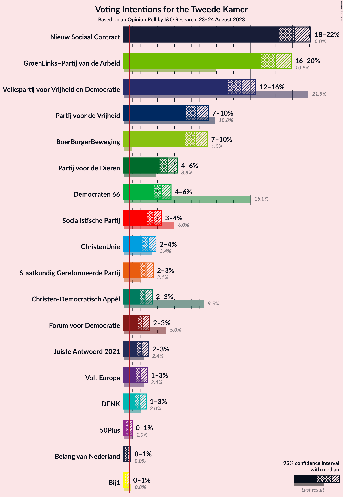

### Confidence Intervals

| Party | Last Result | Poll Result | 80% Confidence Interval | 90% Confidence Interval | 95% Confidence Interval | 99% Confidence Interval |
|:-----:|:-----------:|:-----------:|:-----------------------:|:-----------------------:|:-----------------------:|:-----------------------:|
| Nieuw Sociaal Contract | 0.0% | 20.2% | 19.0–21.5% |18.7–21.8% |18.4–22.2% |17.8–22.8% |
| GroenLinks–Partij van de Arbeid | 10.9% | 18.0% | 16.8–19.2% |16.5–19.6% |16.2–19.9% |15.7–20.5% |
| Volkspartij voor Vrijheid en Democratie | 21.9% | 13.9% | 12.9–15.0% |12.6–15.4% |12.4–15.6% |11.9–16.2% |
| Partij voor de Vrijheid | 10.8% | 8.6% | 7.8–9.5% |7.6–9.8% |7.4–10.0% |7.0–10.5% |
| BoerBurgerBeweging | 1.0% | 8.5% | 7.7–9.4% |7.5–9.7% |7.3–9.9% |6.9–10.4% |
| Partij voor de Dieren | 3.8% | 5.2% | 4.6–5.9% |4.4–6.2% |4.2–6.3% |4.0–6.7% |
| Democraten 66 | 15.0% | 4.5% | 3.9–5.2% |3.8–5.4% |3.6–5.6% |3.4–5.9% |
| Socialistische Partij | 6.0% | 3.5% | 3.0–4.1% |2.8–4.3% |2.7–4.5% |2.5–4.8% |
| ChristenUnie | 3.4% | 2.9% | 2.5–3.5% |2.3–3.7% |2.2–3.8% |2.0–4.1% |
| Staatkundig Gereformeerde Partij | 2.1% | 2.6% | 2.2–3.2% |2.1–3.4% |2.0–3.5% |1.8–3.8% |
| Christen-Democratisch Appèl | 9.5% | 2.5% | 2.1–3.1% |2.0–3.2% |1.9–3.4% |1.7–3.6% |
| Forum voor Democratie | 5.0% | 2.2% | 1.8–2.8% |1.7–2.9% |1.6–3.0% |1.5–3.3% |
| Juiste Antwoord 2021 | 2.4% | 2.1% | 1.7–2.6% |1.6–2.8% |1.5–2.9% |1.4–3.2% |
| Volt Europa | 2.4% | 2.0% | 1.6–2.5% |1.5–2.7% |1.4–2.8% |1.3–3.0% |
| DENK | 2.0% | 1.9% | 1.5–2.4% |1.4–2.5% |1.3–2.6% |1.2–2.9% |
| 50Plus | 1.0% | 0.5% | 0.4–0.8% |0.3–0.9% |0.3–1.0% |0.2–1.1% |
| Belang van Nederland | 0.0% | 0.4% | 0.3–0.7% |0.2–0.8% |0.2–0.8% |0.1–1.0% |
| Bij1 | 0.8% | 0.3% | 0.2–0.5% |0.1–0.6% |0.1–0.7% |0.1–0.8% |

*Note:* The poll result column reflects the actual value used in the calculations. Published results may vary slightly, and in addition be rounded to fewer digits.

## Seats

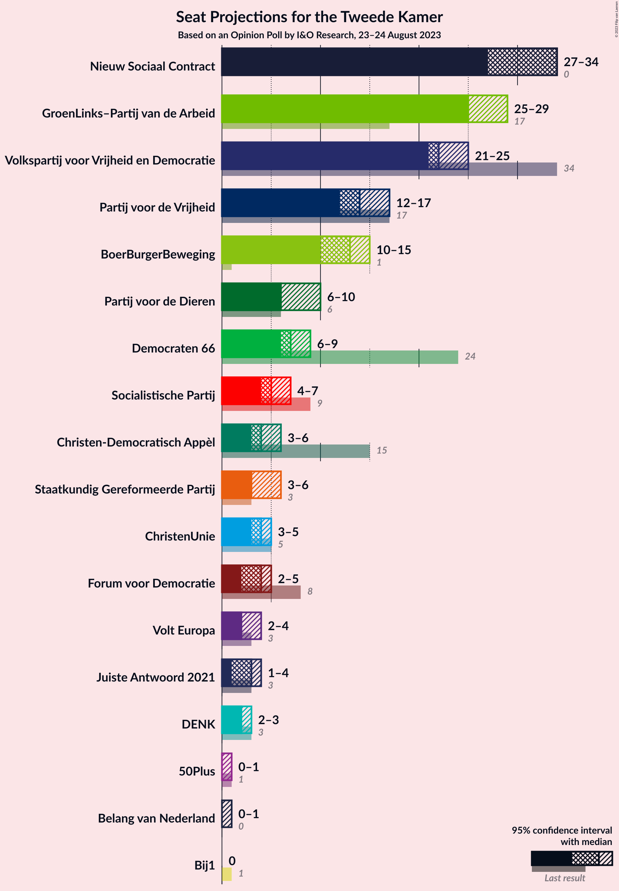

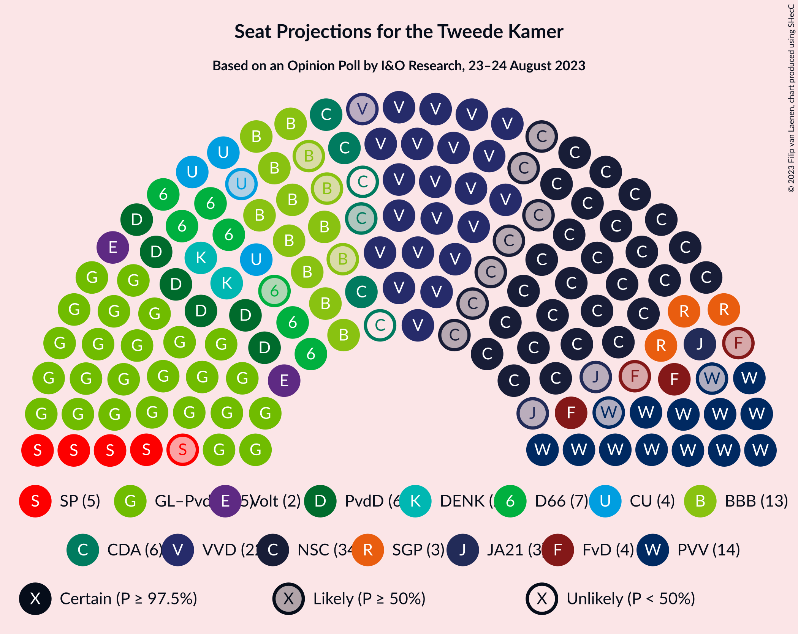

### Confidence Intervals

| Party | Last Result | Median | 80% Confidence Interval | 90% Confidence Interval | 95% Confidence Interval | 99% Confidence Interval |
|:-----:|:-----------:|:------:|:-----------------------:|:-----------------------:|:-----------------------:|:-----------------------:|
| <a href="#nieuw-sociaal-contract">Nieuw Sociaal Contract</a> | 0 | 34 | 28–34 |28–34 |27–34 |27–36 |
| <a href="#groenlinks–partij-van-de-arbeid">GroenLinks–Partij van de Arbeid</a> | 17 | 25 | 25–28 |25–29 |25–29 |24–31 |
| <a href="#volkspartij-voor-vrijheid-en-democratie">Volkspartij voor Vrijheid en Democratie</a> | 34 | 22 | 21–25 |21–25 |21–25 |18–25 |
| <a href="#partij-voor-de-vrijheid">Partij voor de Vrijheid</a> | 17 | 14 | 12–15 |12–17 |12–17 |11–17 |
| <a href="#boerburgerbeweging">BoerBurgerBeweging</a> | 1 | 13 | 11–14 |10–15 |10–15 |10–15 |
| <a href="#partij-voor-de-dieren">Partij voor de Dieren</a> | 6 | 6 | 6–8 |6–8 |6–10 |6–11 |
| <a href="#democraten-66">Democraten 66</a> | 24 | 7 | 6–8 |6–9 |6–9 |5–10 |
| <a href="#socialistische-partij">Socialistische Partij</a> | 9 | 5 | 4–6 |4–7 |4–7 |3–7 |
| <a href="#christenunie">ChristenUnie</a> | 5 | 4 | 3–5 |3–5 |3–5 |3–6 |
| <a href="#staatkundig-gereformeerde-partij">Staatkundig Gereformeerde Partij</a> | 3 | 3 | 3–5 |3–6 |3–6 |2–7 |
| <a href="#christen-democratisch-appèl">Christen-Democratisch Appèl</a> | 15 | 4 | 3–6 |3–6 |3–6 |2–6 |
| <a href="#forum-voor-democratie">Forum voor Democratie</a> | 8 | 4 | 2–5 |2–5 |2–5 |2–5 |
| <a href="#juiste-antwoord-2021">Juiste Antwoord 2021</a> | 3 | 3 | 1–3 |1–4 |1–4 |1–4 |
| <a href="#volt-europa">Volt Europa</a> | 3 | 2 | 2–3 |2–4 |2–4 |2–4 |
| <a href="#denk">DENK</a> | 3 | 2 | 2–3 |2–3 |2–3 |1–4 |
| <a href="#50plus">50Plus</a> | 1 | 0 | 0–1 |0–1 |0–1 |0–1 |
| <a href="#belang-van-nederland">Belang van Nederland</a> | 0 | 0 | 0–1 |0–1 |0–1 |0–1 |
| <a href="#bij1">Bij1</a> | 1 | 0 | 0 |0 |0 |0 |

### Nieuw Sociaal Contract

*For a full overview of the results for this party, see the [Nieuw Sociaal Contract](party-nieuwsociaalcontract.html) page.*

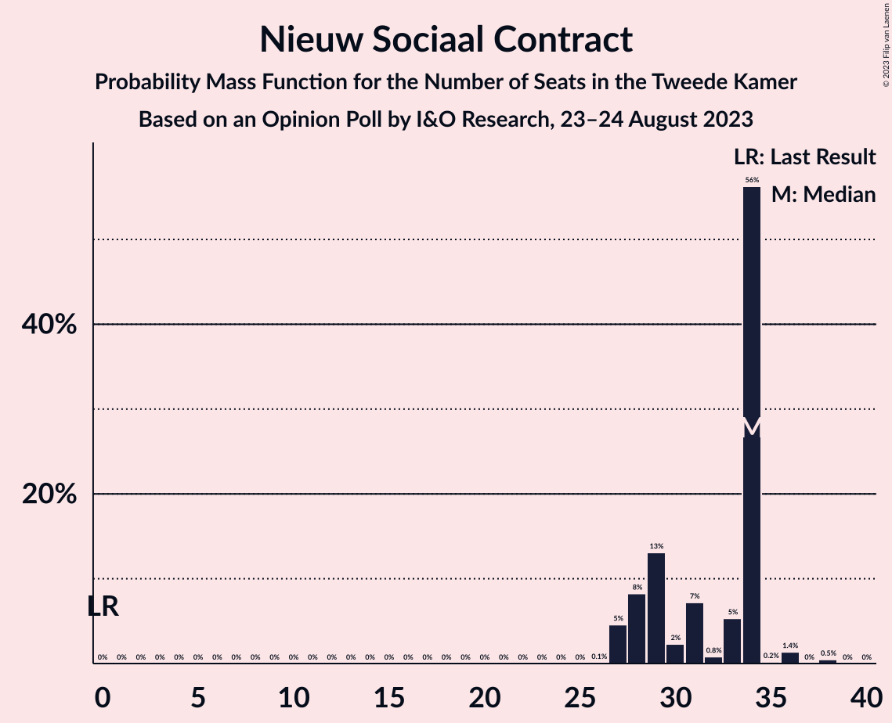

| Number of Seats | Probability | Accumulated | Special Marks |
|:---------------:|:-----------:|:-----------:|:-------------:|
| 0 | 0% | 100% | Last Result |
| 1 | 0% | 100% |  |
| 2 | 0% | 100% |  |
| 3 | 0% | 100% |  |
| 4 | 0% | 100% |  |
| 5 | 0% | 100% |  |
| 6 | 0% | 100% |  |
| 7 | 0% | 100% |  |
| 8 | 0% | 100% |  |
| 9 | 0% | 100% |  |
| 10 | 0% | 100% |  |
| 11 | 0% | 100% |  |
| 12 | 0% | 100% |  |
| 13 | 0% | 100% |  |
| 14 | 0% | 100% |  |
| 15 | 0% | 100% |  |
| 16 | 0% | 100% |  |
| 17 | 0% | 100% |  |
| 18 | 0% | 100% |  |
| 19 | 0% | 100% |  |
| 20 | 0% | 100% |  |
| 21 | 0% | 100% |  |
| 22 | 0% | 100% |  |
| 23 | 0% | 100% |  |
| 24 | 0% | 100% |  |
| 25 | 0% | 100% |  |
| 26 | 0.1% | 100% |  |
| 27 | 5% | 99.9% |  |
| 28 | 8% | 95% |  |
| 29 | 13% | 87% |  |
| 30 | 2% | 74% |  |
| 31 | 7% | 72% |  |
| 32 | 0.8% | 64% |  |
| 33 | 5% | 64% |  |
| 34 | 56% | 58% | Median |
| 35 | 0.2% | 2% |  |
| 36 | 1.4% | 2% |  |
| 37 | 0% | 0.5% |  |
| 38 | 0.5% | 0.5% |  |
| 39 | 0% | 0% |  |

### GroenLinks–Partij van de Arbeid

*For a full overview of the results for this party, see the [GroenLinks–Partij van de Arbeid](party-groenlinks–partijvandearbeid.html) page.*

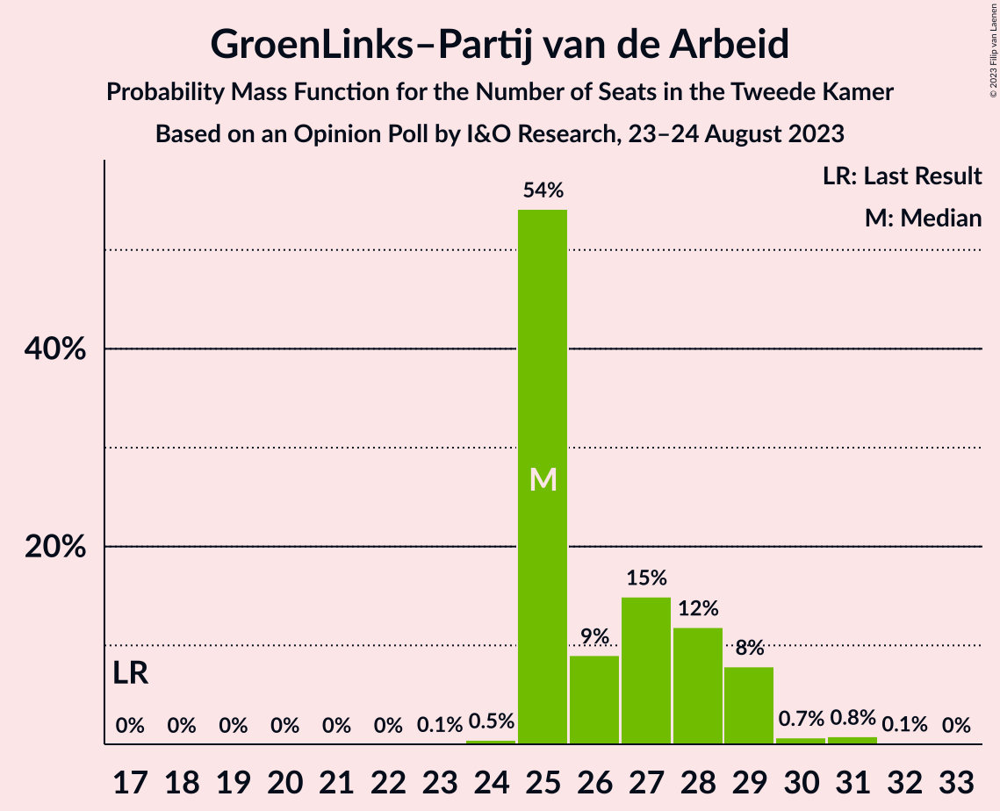

| Number of Seats | Probability | Accumulated | Special Marks |
|:---------------:|:-----------:|:-----------:|:-------------:|
| 17 | 0% | 100% | Last Result |
| 18 | 0% | 100% |  |
| 19 | 0% | 100% |  |
| 20 | 0% | 100% |  |
| 21 | 0% | 100% |  |
| 22 | 0% | 100% |  |
| 23 | 0.1% | 100% |  |
| 24 | 0.5% | 99.9% |  |
| 25 | 54% | 99.5% | Median |
| 26 | 9% | 45% |  |
| 27 | 15% | 36% |  |
| 28 | 12% | 21% |  |
| 29 | 8% | 10% |  |
| 30 | 0.7% | 2% |  |
| 31 | 0.8% | 1.0% |  |
| 32 | 0.1% | 0.1% |  |
| 33 | 0% | 0% |  |

### Volkspartij voor Vrijheid en Democratie

*For a full overview of the results for this party, see the [Volkspartij voor Vrijheid en Democratie](party-volkspartijvoorvrijheidendemocratie.html) page.*

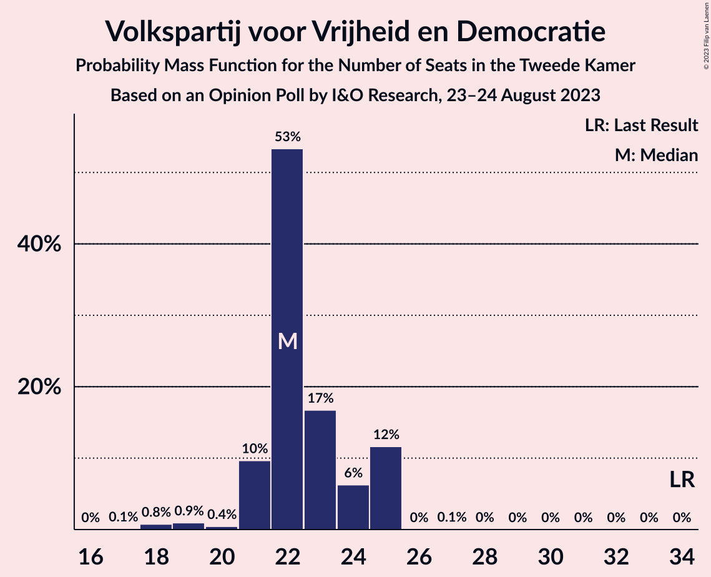

| Number of Seats | Probability | Accumulated | Special Marks |
|:---------------:|:-----------:|:-----------:|:-------------:|
| 17 | 0.1% | 100% |  |
| 18 | 0.8% | 99.9% |  |
| 19 | 0.9% | 99.1% |  |
| 20 | 0.4% | 98% |  |
| 21 | 10% | 98% |  |
| 22 | 53% | 88% | Median |
| 23 | 17% | 35% |  |
| 24 | 6% | 18% |  |
| 25 | 12% | 12% |  |
| 26 | 0% | 0.1% |  |
| 27 | 0.1% | 0.1% |  |
| 28 | 0% | 0% |  |
| 29 | 0% | 0% |  |
| 30 | 0% | 0% |  |
| 31 | 0% | 0% |  |
| 32 | 0% | 0% |  |
| 33 | 0% | 0% |  |
| 34 | 0% | 0% | Last Result |

### Partij voor de Vrijheid

*For a full overview of the results for this party, see the [Partij voor de Vrijheid](party-partijvoordevrijheid.html) page.*

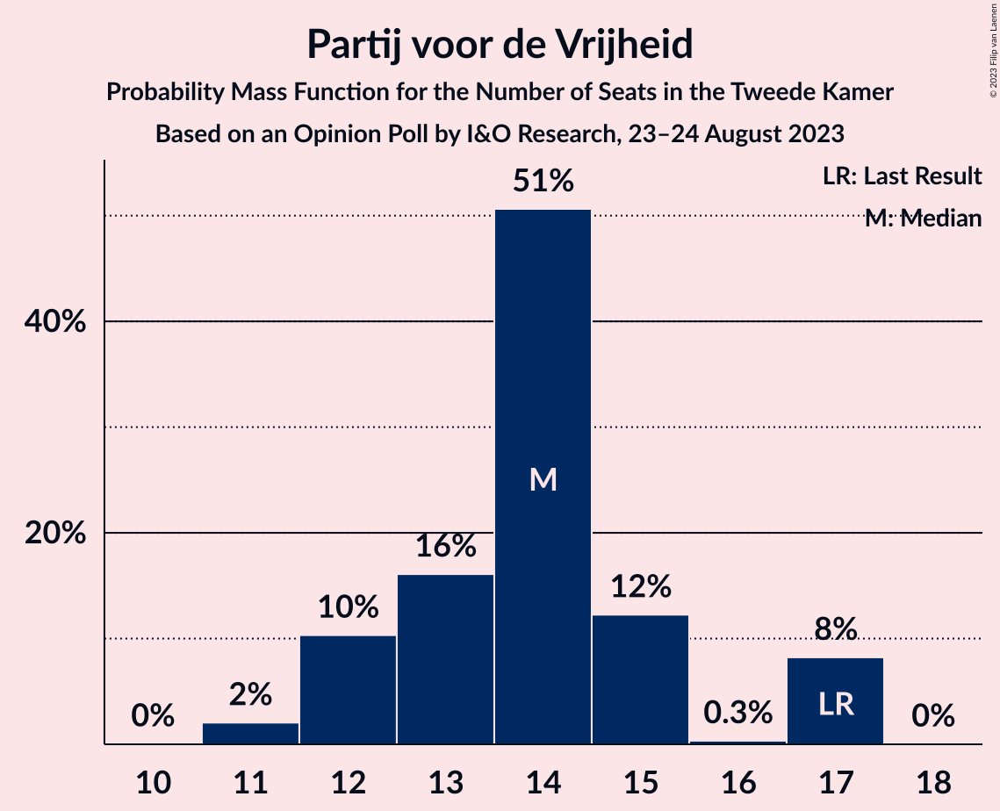

| Number of Seats | Probability | Accumulated | Special Marks |
|:---------------:|:-----------:|:-----------:|:-------------:|
| 11 | 2% | 100% |  |
| 12 | 10% | 98% |  |
| 13 | 16% | 88% |  |
| 14 | 51% | 71% | Median |
| 15 | 12% | 21% |  |
| 16 | 0.3% | 9% |  |
| 17 | 8% | 8% | Last Result |
| 18 | 0% | 0% |  |

### BoerBurgerBeweging

*For a full overview of the results for this party, see the [BoerBurgerBeweging](party-boerburgerbeweging.html) page.*

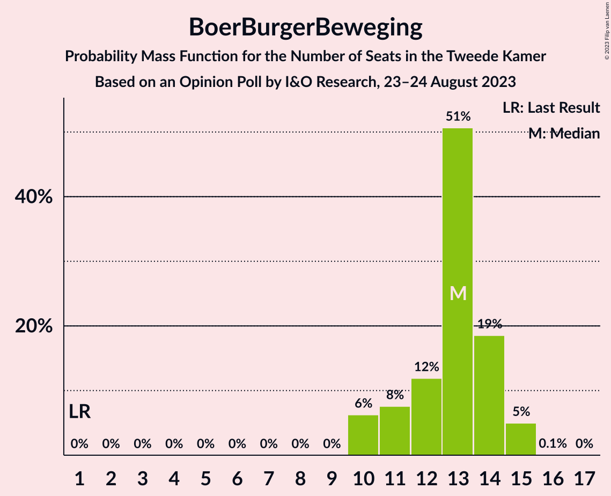

| Number of Seats | Probability | Accumulated | Special Marks |
|:---------------:|:-----------:|:-----------:|:-------------:|
| 1 | 0% | 100% | Last Result |
| 2 | 0% | 100% |  |
| 3 | 0% | 100% |  |
| 4 | 0% | 100% |  |
| 5 | 0% | 100% |  |
| 6 | 0% | 100% |  |
| 7 | 0% | 100% |  |
| 8 | 0% | 100% |  |
| 9 | 0% | 100% |  |
| 10 | 6% | 100% |  |
| 11 | 8% | 94% |  |
| 12 | 12% | 86% |  |
| 13 | 51% | 74% | Median |
| 14 | 19% | 24% |  |
| 15 | 5% | 5% |  |
| 16 | 0.1% | 0.1% |  |
| 17 | 0% | 0% |  |

### Partij voor de Dieren

*For a full overview of the results for this party, see the [Partij voor de Dieren](party-partijvoordedieren.html) page.*

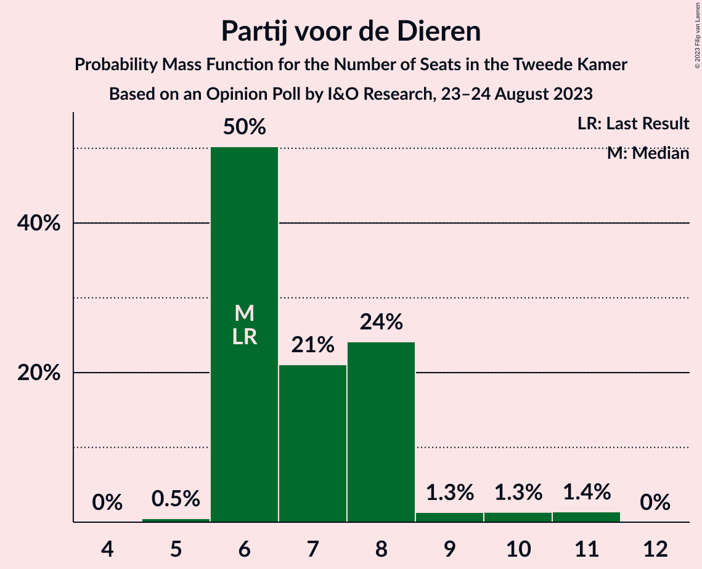

| Number of Seats | Probability | Accumulated | Special Marks |
|:---------------:|:-----------:|:-----------:|:-------------:|
| 5 | 0.5% | 100% |  |
| 6 | 50% | 99.5% | Last Result, Median |
| 7 | 21% | 49% |  |
| 8 | 24% | 28% |  |
| 9 | 1.3% | 4% |  |
| 10 | 1.3% | 3% |  |
| 11 | 1.4% | 1.4% |  |
| 12 | 0% | 0% |  |

### Democraten 66

*For a full overview of the results for this party, see the [Democraten 66](party-democraten66.html) page.*

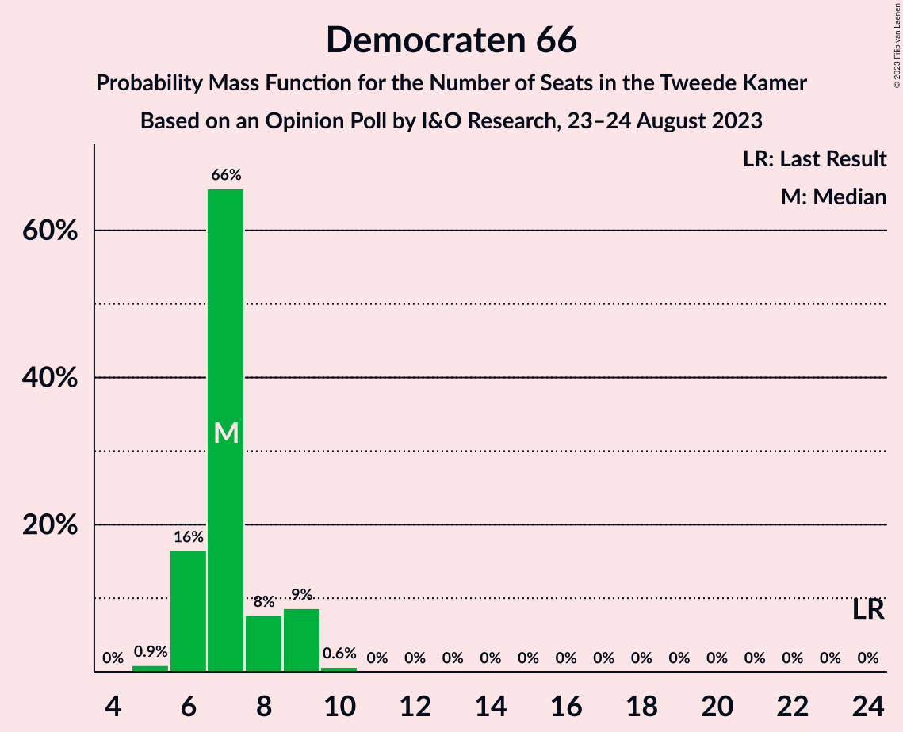

| Number of Seats | Probability | Accumulated | Special Marks |
|:---------------:|:-----------:|:-----------:|:-------------:|
| 5 | 0.9% | 100% |  |
| 6 | 16% | 99.1% |  |
| 7 | 66% | 83% | Median |
| 8 | 8% | 17% |  |
| 9 | 9% | 9% |  |
| 10 | 0.6% | 0.6% |  |
| 11 | 0% | 0% |  |
| 12 | 0% | 0% |  |
| 13 | 0% | 0% |  |
| 14 | 0% | 0% |  |
| 15 | 0% | 0% |  |
| 16 | 0% | 0% |  |
| 17 | 0% | 0% |  |
| 18 | 0% | 0% |  |
| 19 | 0% | 0% |  |
| 20 | 0% | 0% |  |
| 21 | 0% | 0% |  |
| 22 | 0% | 0% |  |
| 23 | 0% | 0% |  |
| 24 | 0% | 0% | Last Result |

### Socialistische Partij

*For a full overview of the results for this party, see the [Socialistische Partij](party-socialistischepartij.html) page.*

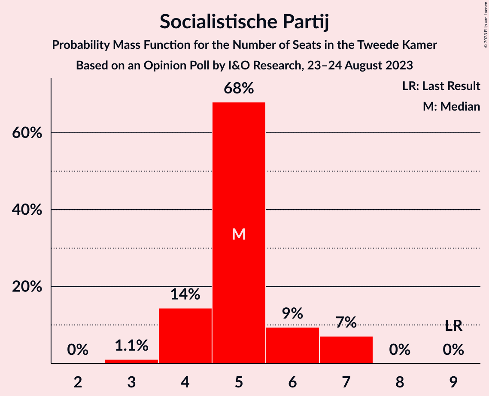

| Number of Seats | Probability | Accumulated | Special Marks |
|:---------------:|:-----------:|:-----------:|:-------------:|
| 3 | 1.1% | 100% |  |
| 4 | 14% | 98.9% |  |
| 5 | 68% | 85% | Median |
| 6 | 9% | 17% |  |
| 7 | 7% | 7% |  |
| 8 | 0% | 0% |  |
| 9 | 0% | 0% | Last Result |

### ChristenUnie

*For a full overview of the results for this party, see the [ChristenUnie](party-christenunie.html) page.*

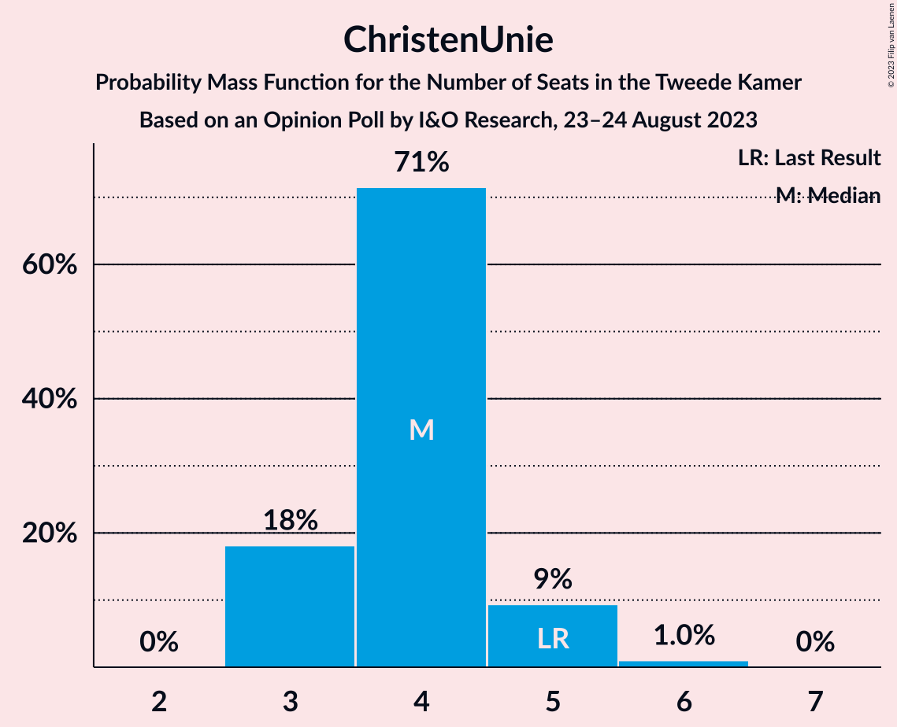

| Number of Seats | Probability | Accumulated | Special Marks |
|:---------------:|:-----------:|:-----------:|:-------------:|
| 3 | 18% | 100% |  |
| 4 | 71% | 82% | Median |
| 5 | 9% | 10% | Last Result |
| 6 | 1.0% | 1.0% |  |
| 7 | 0% | 0% |  |

### Staatkundig Gereformeerde Partij

*For a full overview of the results for this party, see the [Staatkundig Gereformeerde Partij](party-staatkundiggereformeerdepartij.html) page.*

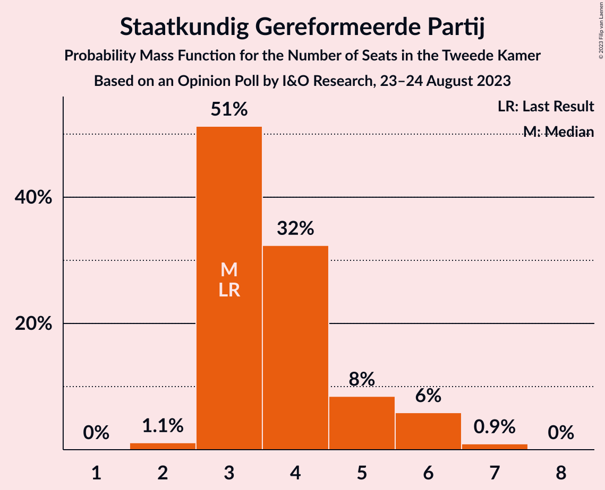

| Number of Seats | Probability | Accumulated | Special Marks |
|:---------------:|:-----------:|:-----------:|:-------------:|
| 2 | 1.1% | 100% |  |
| 3 | 51% | 98.9% | Last Result, Median |
| 4 | 32% | 48% |  |
| 5 | 8% | 15% |  |
| 6 | 6% | 7% |  |
| 7 | 0.9% | 0.9% |  |
| 8 | 0% | 0% |  |

### Christen-Democratisch Appèl

*For a full overview of the results for this party, see the [Christen-Democratisch Appèl](party-christen-democratischappèl.html) page.*

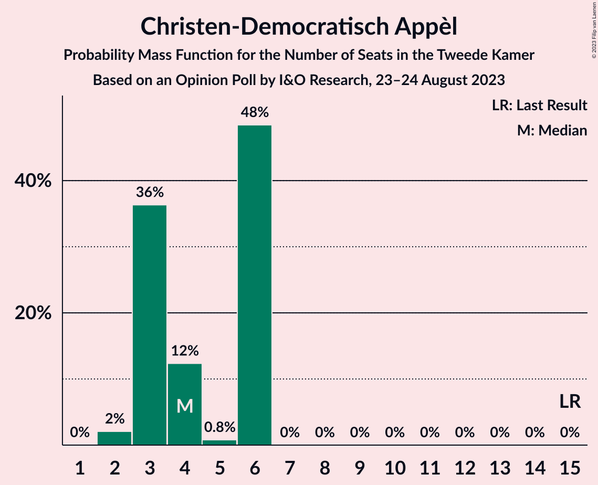

| Number of Seats | Probability | Accumulated | Special Marks |
|:---------------:|:-----------:|:-----------:|:-------------:|
| 2 | 2% | 100% |  |
| 3 | 36% | 98% |  |
| 4 | 12% | 62% | Median |
| 5 | 0.8% | 49% |  |
| 6 | 48% | 48% |  |
| 7 | 0% | 0% |  |
| 8 | 0% | 0% |  |
| 9 | 0% | 0% |  |
| 10 | 0% | 0% |  |
| 11 | 0% | 0% |  |
| 12 | 0% | 0% |  |
| 13 | 0% | 0% |  |
| 14 | 0% | 0% |  |
| 15 | 0% | 0% | Last Result |

### Forum voor Democratie

*For a full overview of the results for this party, see the [Forum voor Democratie](party-forumvoordemocratie.html) page.*

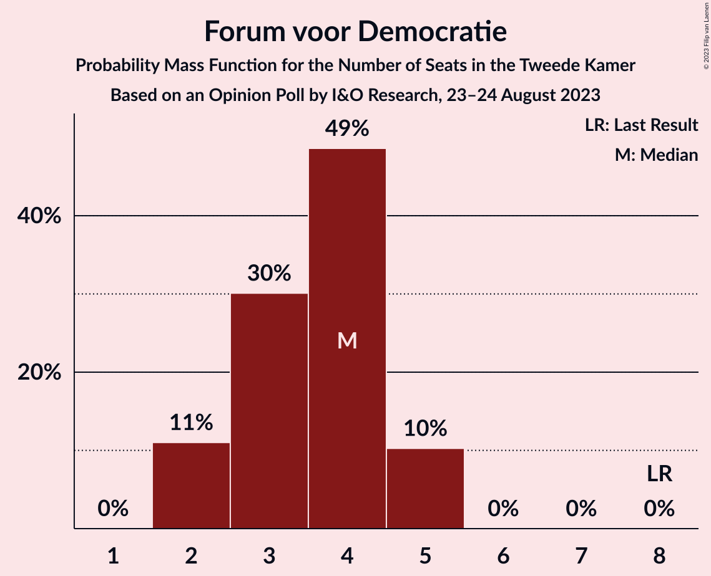

| Number of Seats | Probability | Accumulated | Special Marks |
|:---------------:|:-----------:|:-----------:|:-------------:|
| 2 | 11% | 100% |  |
| 3 | 30% | 89% |  |
| 4 | 49% | 59% | Median |
| 5 | 10% | 10% |  |
| 6 | 0% | 0% |  |
| 7 | 0% | 0% |  |
| 8 | 0% | 0% | Last Result |

### Juiste Antwoord 2021

*For a full overview of the results for this party, see the [Juiste Antwoord 2021](party-juisteantwoord2021.html) page.*

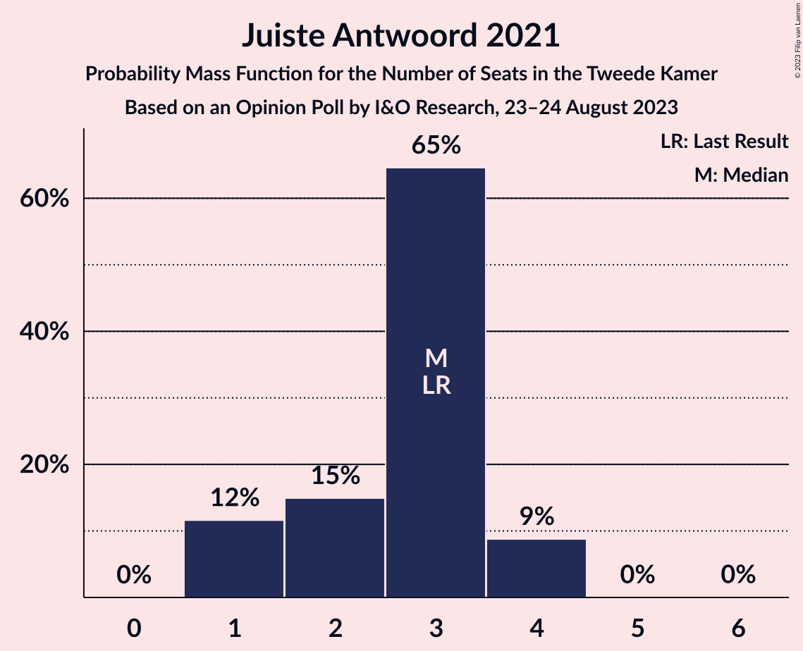

| Number of Seats | Probability | Accumulated | Special Marks |
|:---------------:|:-----------:|:-----------:|:-------------:|
| 1 | 12% | 100% |  |
| 2 | 15% | 88% |  |
| 3 | 65% | 73% | Last Result, Median |
| 4 | 9% | 9% |  |
| 5 | 0% | 0.1% |  |
| 6 | 0% | 0% |  |

### Volt Europa

*For a full overview of the results for this party, see the [Volt Europa](party-volteuropa.html) page.*

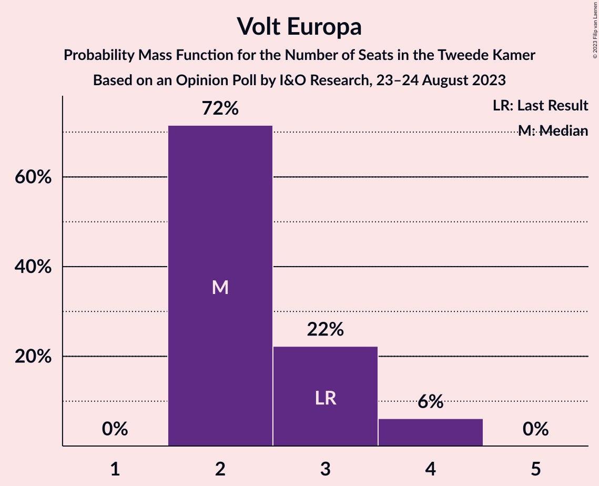

| Number of Seats | Probability | Accumulated | Special Marks |
|:---------------:|:-----------:|:-----------:|:-------------:|
| 2 | 72% | 100% | Median |
| 3 | 22% | 28% | Last Result |
| 4 | 6% | 6% |  |
| 5 | 0% | 0% |  |

### DENK

*For a full overview of the results for this party, see the [DENK](party-denk.html) page.*

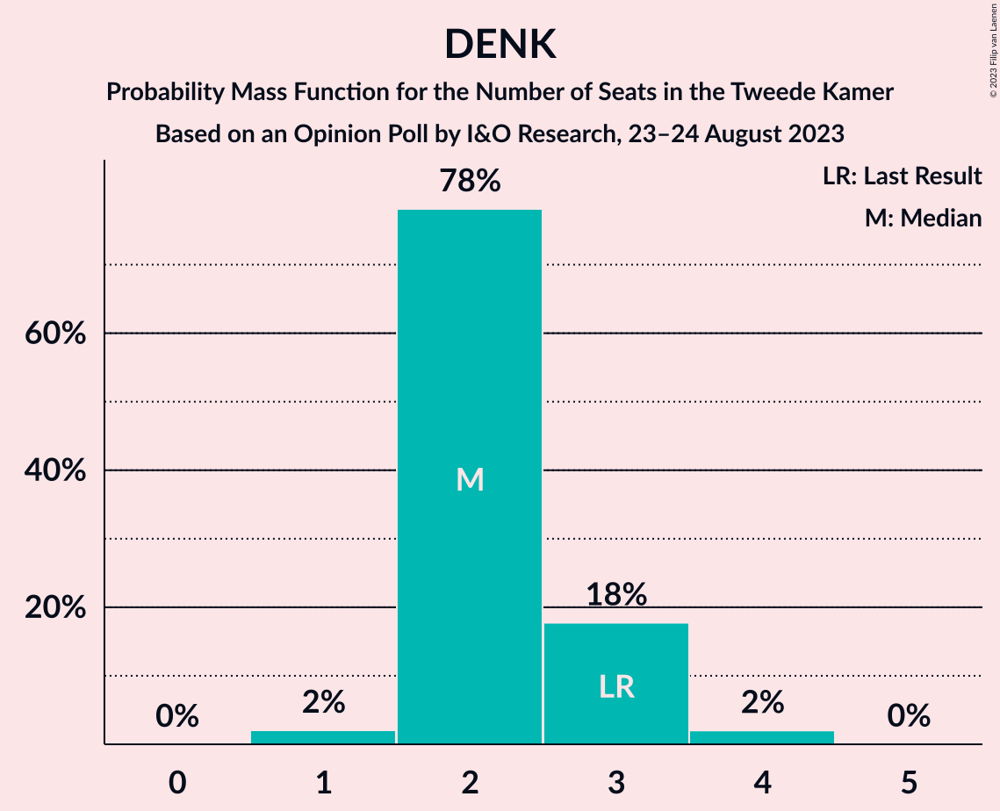

| Number of Seats | Probability | Accumulated | Special Marks |
|:---------------:|:-----------:|:-----------:|:-------------:|
| 1 | 2% | 100% |  |
| 2 | 78% | 98% | Median |
| 3 | 18% | 20% | Last Result |
| 4 | 2% | 2% |  |
| 5 | 0% | 0% |  |

### 50Plus

*For a full overview of the results for this party, see the [50Plus](party-50plus.html) page.*

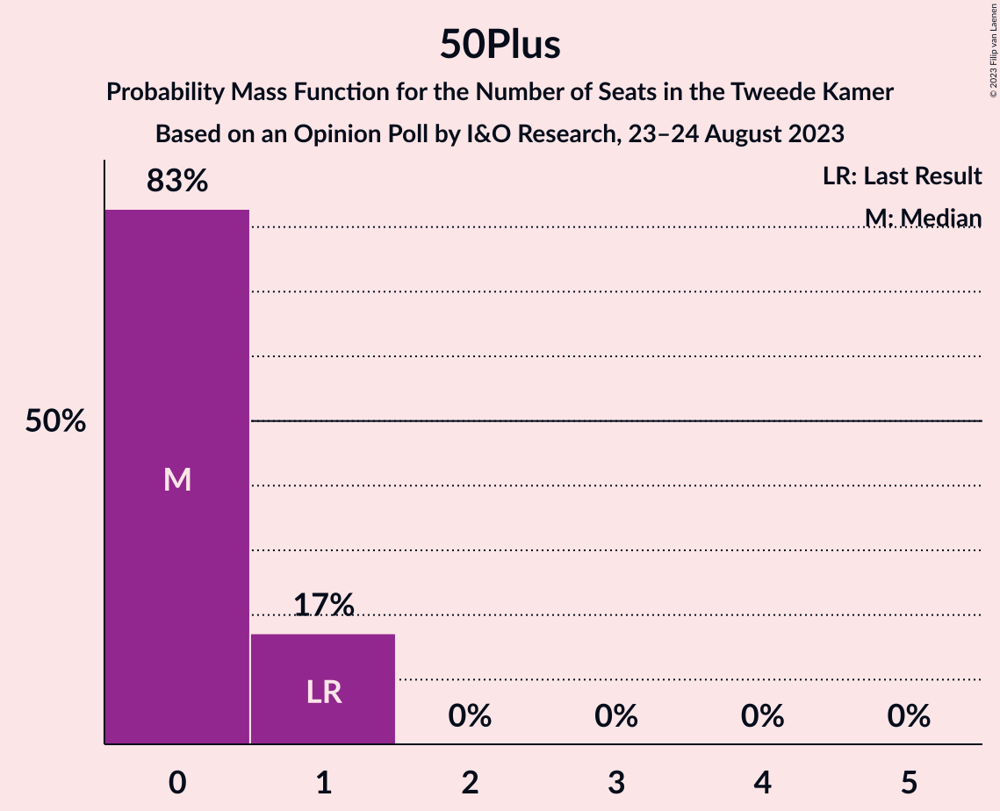

| Number of Seats | Probability | Accumulated | Special Marks |
|:---------------:|:-----------:|:-----------:|:-------------:|
| 0 | 83% | 100% | Median |
| 1 | 17% | 17% | Last Result |
| 2 | 0% | 0% |  |

### Belang van Nederland

*For a full overview of the results for this party, see the [Belang van Nederland](party-belangvannederland.html) page.*

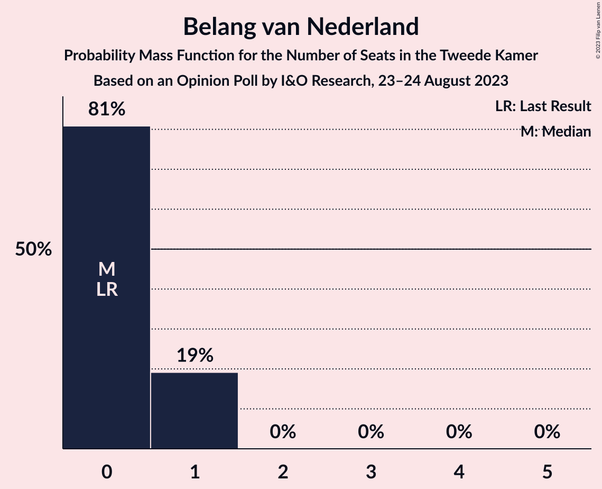

| Number of Seats | Probability | Accumulated | Special Marks |
|:---------------:|:-----------:|:-----------:|:-------------:|
| 0 | 81% | 100% | Last Result, Median |
| 1 | 19% | 19% |  |
| 2 | 0% | 0% |  |

### Bij1

*For a full overview of the results for this party, see the [Bij1](party-bij1.html) page.*

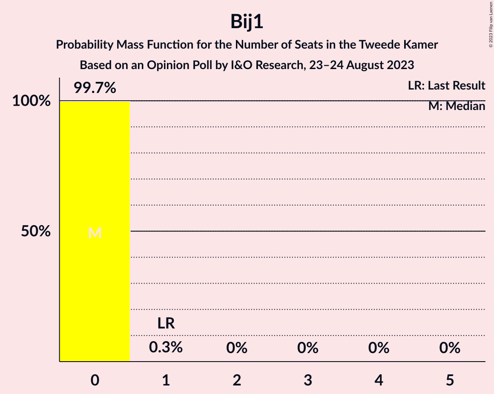

| Number of Seats | Probability | Accumulated | Special Marks |
|:---------------:|:-----------:|:-----------:|:-------------:|
| 0 | 99.7% | 100% | Median |
| 1 | 0.3% | 0.3% | Last Result |
| 2 | 0% | 0% |  |

## Coalitions

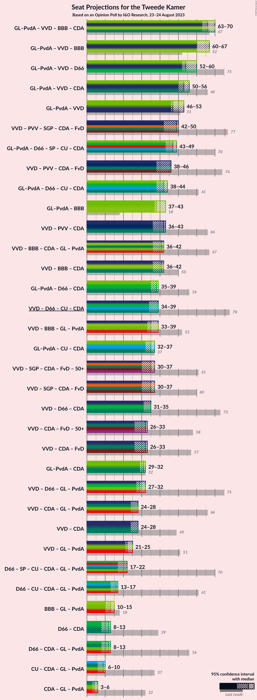

### Confidence Intervals

| Coalition | Last Result | Median | Majority? | 80% Confidence Interval | 90% Confidence Interval | 95% Confidence Interval | 99% Confidence Interval |
|:---------:|:-----------:|:------:|:---------:|:-----------------------:|:-----------------------:|:-----------------------:|:-----------------------:|
| GroenLinks–Partij van de Arbeid – Volkspartij voor Vrijheid en Democratie – BoerBurgerBeweging – Christen-Democratisch Appèl | 67 | 66 | 0% | 63–70 | 63–70 | 63–70 | 62–70 |
| GroenLinks–Partij van de Arbeid – Volkspartij voor Vrijheid en Democratie – BoerBurgerBeweging | 52 | 60 | 0% | 60–67 | 60–67 | 60–67 | 59–67 |
| GroenLinks–Partij van de Arbeid – Volkspartij voor Vrijheid en Democratie – Democraten 66 | 75 | 54 | 0% | 54–60 | 52–60 | 52–60 | 50–60 |
| GroenLinks–Partij van de Arbeid – Volkspartij voor Vrijheid en Democratie – Christen-Democratisch Appèl | 66 | 53 | 0% | 51–56 | 50–56 | 50–56 | 48–56 |
| GroenLinks–Partij van de Arbeid – Volkspartij voor Vrijheid en Democratie | 51 | 47 | 0% | 47–53 | 46–53 | 46–53 | 45–53 |
| Volkspartij voor Vrijheid en Democratie – Partij voor de Vrijheid – Staatkundig Gereformeerde Partij – Christen-Democratisch Appèl – Forum voor Democratie | 77 | 49 | 0% | 46–50 | 45–50 | 42–50 | 41–50 |
| GroenLinks–Partij van de Arbeid – Democraten 66 – Socialistische Partij – ChristenUnie – Christen-Democratisch Appèl | 70 | 47 | 0% | 45–48 | 43–48 | 43–49 | 43–52 |
| Volkspartij voor Vrijheid en Democratie – Partij voor de Vrijheid – Christen-Democratisch Appèl – Forum voor Democratie | 74 | 46 | 0% | 40–46 | 40–46 | 38–46 | 36–46 |
| GroenLinks–Partij van de Arbeid – Democraten 66 – ChristenUnie – Christen-Democratisch Appèl | 61 | 42 | 0% | 40–43 | 39–43 | 38–44 | 38–47 |
| GroenLinks–Partij van de Arbeid – BoerBurgerBeweging | 18 | 38 | 0% | 37–42 | 37–43 | 37–43 | 37–43 |
| Volkspartij voor Vrijheid en Democratie – Partij voor de Vrijheid – Christen-Democratisch Appèl | 66 | 42 | 0% | 37–43 | 37–43 | 36–43 | 33–43 |
| Volkspartij voor Vrijheid en Democratie – BoerBurgerBeweging – Christen-Democratisch Appèl | 50 | 41 | 0% | 37–42 | 37–42 | 36–42 | 32–42 |
| GroenLinks–Partij van de Arbeid – Democraten 66 – Christen-Democratisch Appèl | 56 | 38 | 0% | 37–39 | 35–39 | 35–39 | 34–42 |
| Volkspartij voor Vrijheid en Democratie – Democraten 66 – ChristenUnie – Christen-Democratisch Appèl | 78 | 39 | 0% | 36–39 | 34–39 | 34–39 | 31–39 |
| GroenLinks–Partij van de Arbeid – ChristenUnie – Christen-Democratisch Appèl | 37 | 35 | 0% | 33–36 | 33–36 | 32–37 | 32–39 |
| Volkspartij voor Vrijheid en Democratie – Staatkundig Gereformeerde Partij – Christen-Democratisch Appèl – Forum voor Democratie – 50Plus | 61 | 35 | 0% | 33–35 | 32–37 | 30–37 | 27–37 |
| Volkspartij voor Vrijheid en Democratie – Staatkundig Gereformeerde Partij – Christen-Democratisch Appèl – Forum voor Democratie | 60 | 35 | 0% | 33–35 | 32–37 | 30–37 | 27–37 |
| Volkspartij voor Vrijheid en Democratie – Democraten 66 – Christen-Democratisch Appèl | 73 | 35 | 0% | 32–35 | 31–35 | 31–35 | 26–35 |
| Volkspartij voor Vrijheid en Democratie – Christen-Democratisch Appèl – Forum voor Democratie – 50Plus | 58 | 32 | 0% | 28–32 | 28–33 | 26–33 | 23–33 |
| Volkspartij voor Vrijheid en Democratie – Christen-Democratisch Appèl – Forum voor Democratie | 57 | 32 | 0% | 28–32 | 27–33 | 26–33 | 23–33 |
| GroenLinks–Partij van de Arbeid – Christen-Democratisch Appèl | 32 | 31 | 0% | 29–31 | 29–32 | 29–32 | 28–34 |
| Volkspartij voor Vrijheid en Democratie – Christen-Democratisch Appèl | 49 | 28 | 0% | 25–28 | 25–28 | 24–28 | 20–28 |
| Democraten 66 – Christen-Democratisch Appèl | 39 | 12 | 0% | 10–13 | 10–13 | 8–13 | 8–13 |

### GroenLinks–Partij van de Arbeid – Volkspartij voor Vrijheid en Democratie – BoerBurgerBeweging – Christen-Democratisch Appèl

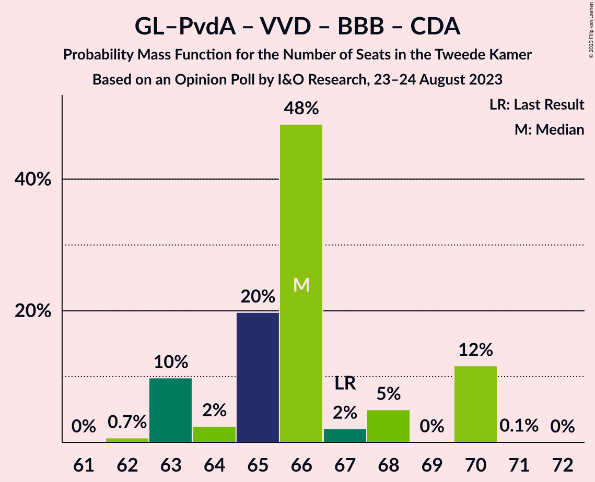

| Number of Seats | Probability | Accumulated | Special Marks |
|:---------------:|:-----------:|:-----------:|:-------------:|
| 62 | 0.7% | 100% |  |
| 63 | 10% | 99.3% |  |
| 64 | 2% | 89% | Median |
| 65 | 20% | 87% |  |
| 66 | 48% | 67% |  |
| 67 | 2% | 19% | Last Result |
| 68 | 5% | 17% |  |
| 69 | 0% | 12% |  |
| 70 | 12% | 12% |  |
| 71 | 0.1% | 0.1% |  |
| 72 | 0% | 0% |  |

### GroenLinks–Partij van de Arbeid – Volkspartij voor Vrijheid en Democratie – BoerBurgerBeweging

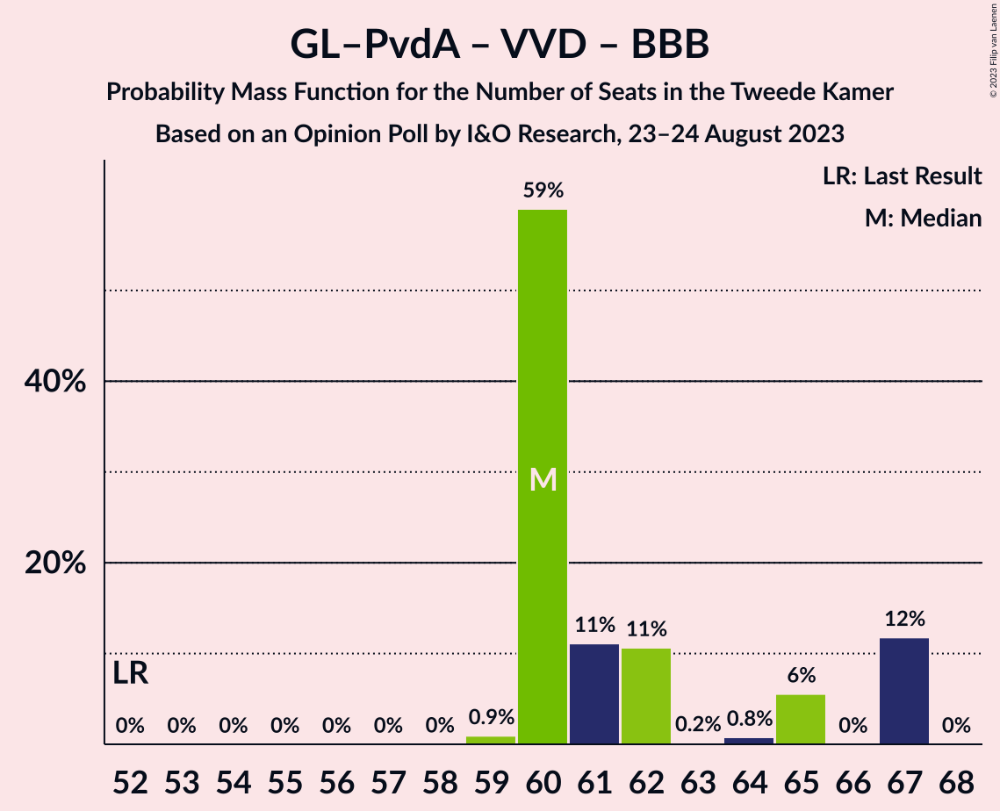

| Number of Seats | Probability | Accumulated | Special Marks |
|:---------------:|:-----------:|:-----------:|:-------------:|
| 52 | 0% | 100% | Last Result |
| 53 | 0% | 100% |  |
| 54 | 0% | 100% |  |
| 55 | 0% | 100% |  |
| 56 | 0% | 100% |  |
| 57 | 0% | 100% |  |
| 58 | 0% | 100% |  |
| 59 | 0.9% | 100% |  |
| 60 | 59% | 99.0% | Median |
| 61 | 11% | 40% |  |
| 62 | 11% | 29% |  |
| 63 | 0.2% | 18% |  |
| 64 | 0.8% | 18% |  |
| 65 | 6% | 17% |  |
| 66 | 0% | 12% |  |
| 67 | 12% | 12% |  |
| 68 | 0% | 0% |  |

### GroenLinks–Partij van de Arbeid – Volkspartij voor Vrijheid en Democratie – Democraten 66

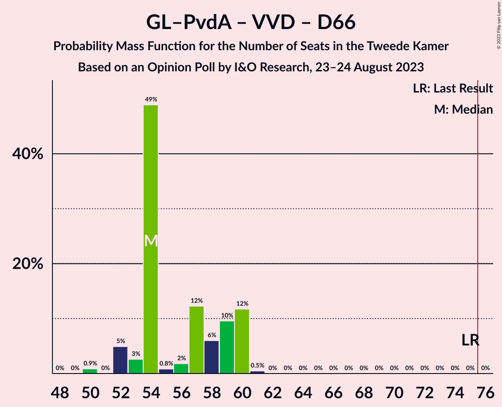

| Number of Seats | Probability | Accumulated | Special Marks |
|:---------------:|:-----------:|:-----------:|:-------------:|
| 50 | 0.9% | 100% |  |
| 51 | 0% | 99.1% |  |
| 52 | 5% | 99.1% |  |
| 53 | 3% | 94% |  |
| 54 | 49% | 92% | Median |
| 55 | 0.8% | 43% |  |
| 56 | 2% | 42% |  |
| 57 | 12% | 40% |  |
| 58 | 6% | 28% |  |
| 59 | 10% | 22% |  |
| 60 | 12% | 12% |  |
| 61 | 0.5% | 0.5% |  |
| 62 | 0% | 0% |  |
| 63 | 0% | 0% |  |
| 64 | 0% | 0% |  |
| 65 | 0% | 0% |  |
| 66 | 0% | 0% |  |
| 67 | 0% | 0% |  |
| 68 | 0% | 0% |  |
| 69 | 0% | 0% |  |
| 70 | 0% | 0% |  |
| 71 | 0% | 0% |  |
| 72 | 0% | 0% |  |
| 73 | 0% | 0% |  |
| 74 | 0% | 0% |  |
| 75 | 0% | 0% | Last Result |

### GroenLinks–Partij van de Arbeid – Volkspartij voor Vrijheid en Democratie – Christen-Democratisch Appèl

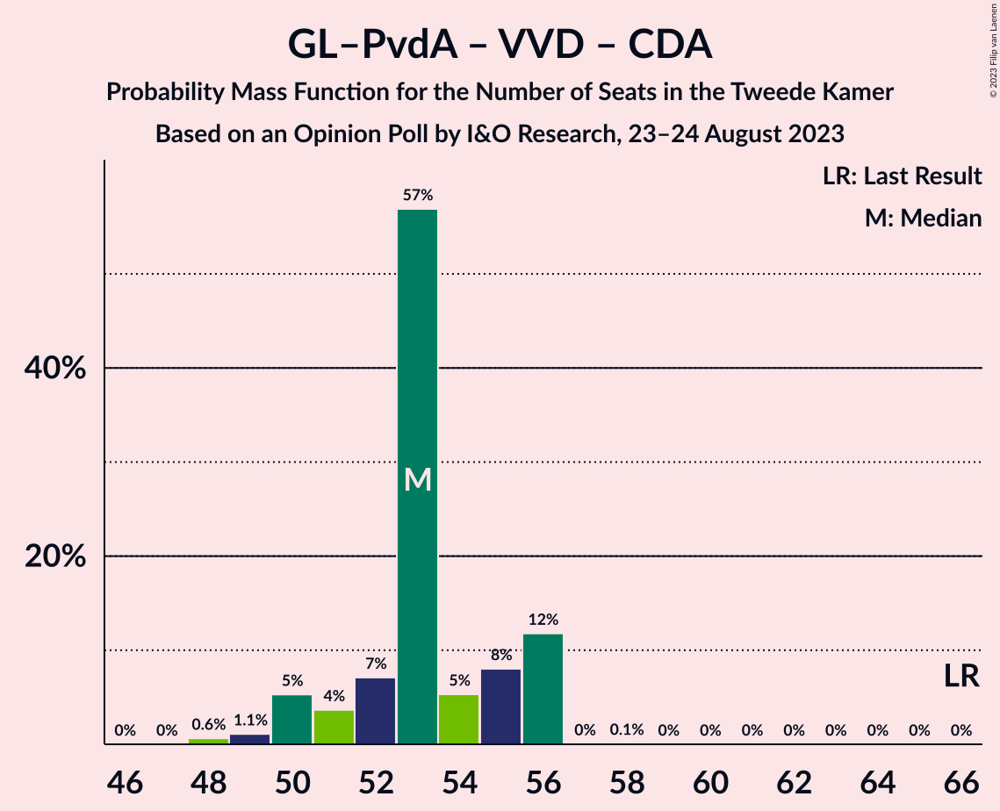

| Number of Seats | Probability | Accumulated | Special Marks |
|:---------------:|:-----------:|:-----------:|:-------------:|
| 48 | 0.6% | 100% |  |
| 49 | 1.1% | 99.4% |  |
| 50 | 5% | 98% |  |
| 51 | 4% | 93% | Median |
| 52 | 7% | 89% |  |
| 53 | 57% | 82% |  |
| 54 | 5% | 25% |  |
| 55 | 8% | 20% |  |
| 56 | 12% | 12% |  |
| 57 | 0% | 0.1% |  |
| 58 | 0.1% | 0.1% |  |
| 59 | 0% | 0% |  |
| 60 | 0% | 0% |  |
| 61 | 0% | 0% |  |
| 62 | 0% | 0% |  |
| 63 | 0% | 0% |  |
| 64 | 0% | 0% |  |
| 65 | 0% | 0% |  |
| 66 | 0% | 0% | Last Result |

### GroenLinks–Partij van de Arbeid – Volkspartij voor Vrijheid en Democratie

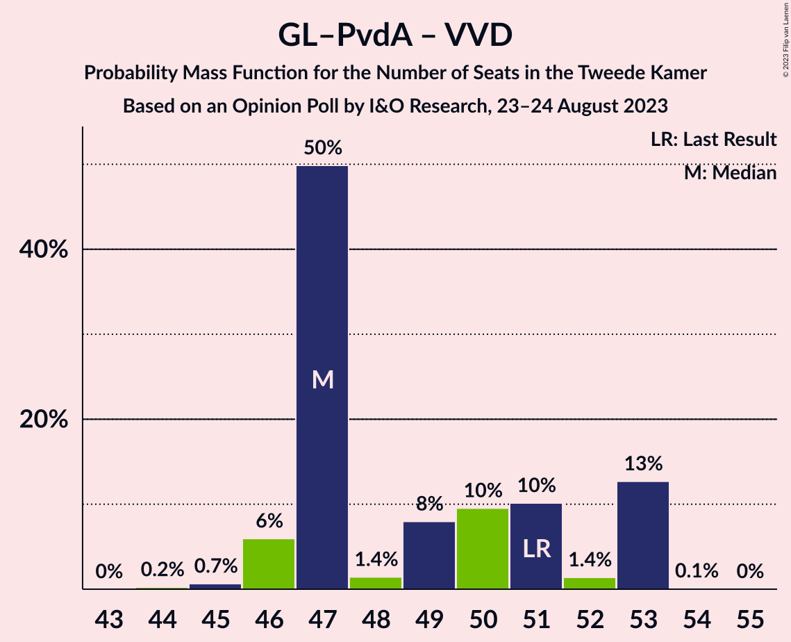

| Number of Seats | Probability | Accumulated | Special Marks |
|:---------------:|:-----------:|:-----------:|:-------------:|
| 44 | 0.2% | 100% |  |
| 45 | 0.7% | 99.8% |  |
| 46 | 6% | 99.1% |  |
| 47 | 50% | 93% | Median |
| 48 | 1.4% | 43% |  |
| 49 | 8% | 42% |  |
| 50 | 10% | 34% |  |
| 51 | 10% | 24% | Last Result |
| 52 | 1.4% | 14% |  |
| 53 | 13% | 13% |  |
| 54 | 0.1% | 0.1% |  |
| 55 | 0% | 0% |  |

### Volkspartij voor Vrijheid en Democratie – Partij voor de Vrijheid – Staatkundig Gereformeerde Partij – Christen-Democratisch Appèl – Forum voor Democratie

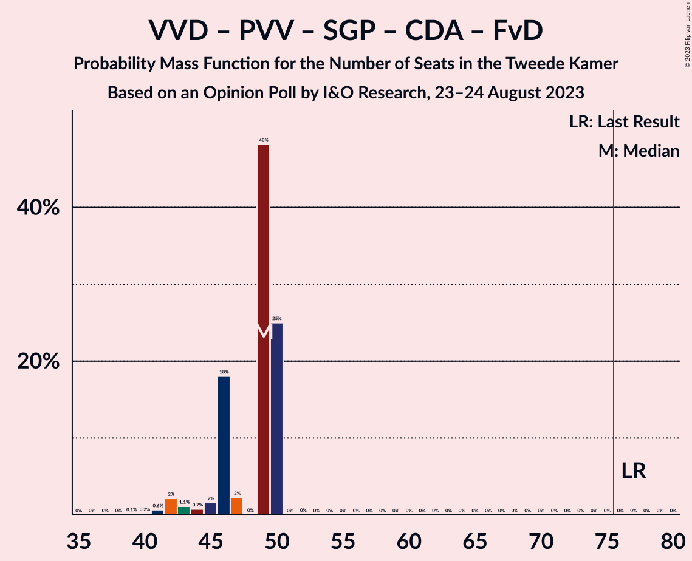

| Number of Seats | Probability | Accumulated | Special Marks |
|:---------------:|:-----------:|:-----------:|:-------------:|
| 39 | 0.1% | 100% |  |
| 40 | 0.2% | 99.9% |  |
| 41 | 0.6% | 99.7% |  |
| 42 | 2% | 99.1% |  |
| 43 | 1.1% | 97% |  |
| 44 | 0.7% | 96% |  |
| 45 | 2% | 95% |  |
| 46 | 18% | 94% |  |
| 47 | 2% | 75% | Median |
| 48 | 0% | 73% |  |
| 49 | 48% | 73% |  |
| 50 | 25% | 25% |  |
| 51 | 0% | 0% |  |
| 52 | 0% | 0% |  |
| 53 | 0% | 0% |  |
| 54 | 0% | 0% |  |
| 55 | 0% | 0% |  |
| 56 | 0% | 0% |  |
| 57 | 0% | 0% |  |
| 58 | 0% | 0% |  |
| 59 | 0% | 0% |  |
| 60 | 0% | 0% |  |
| 61 | 0% | 0% |  |
| 62 | 0% | 0% |  |
| 63 | 0% | 0% |  |
| 64 | 0% | 0% |  |
| 65 | 0% | 0% |  |
| 66 | 0% | 0% |  |
| 67 | 0% | 0% |  |
| 68 | 0% | 0% |  |
| 69 | 0% | 0% |  |
| 70 | 0% | 0% |  |
| 71 | 0% | 0% |  |
| 72 | 0% | 0% |  |
| 73 | 0% | 0% |  |
| 74 | 0% | 0% |  |
| 75 | 0% | 0% |  |
| 76 | 0% | 0% | Majority |
| 77 | 0% | 0% | Last Result |

### GroenLinks–Partij van de Arbeid – Democraten 66 – Socialistische Partij – ChristenUnie – Christen-Democratisch Appèl

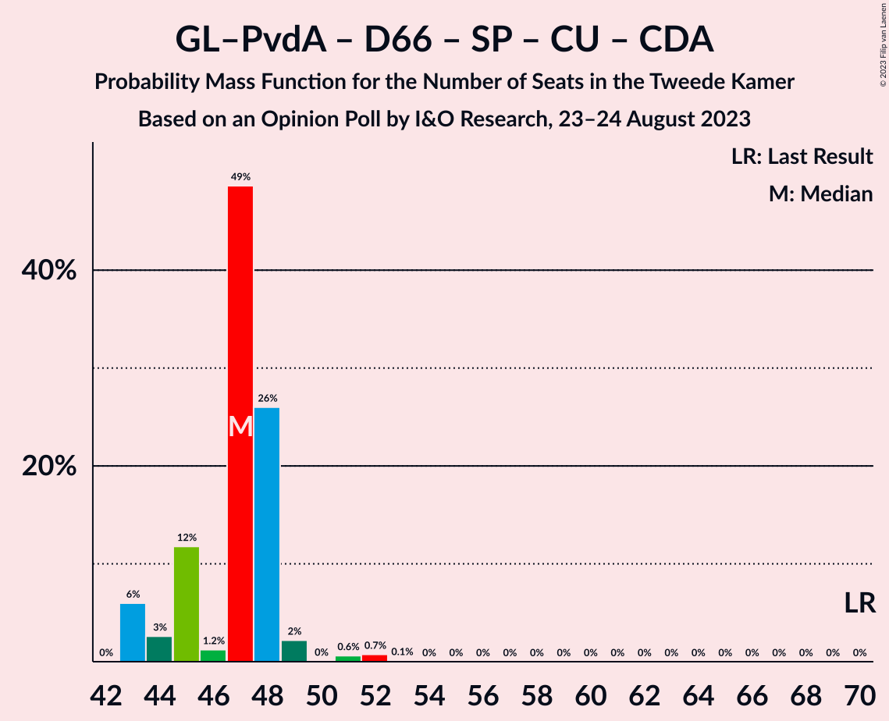

| Number of Seats | Probability | Accumulated | Special Marks |
|:---------------:|:-----------:|:-----------:|:-------------:|
| 43 | 6% | 100% |  |
| 44 | 3% | 94% |  |
| 45 | 12% | 91% | Median |
| 46 | 1.2% | 80% |  |
| 47 | 49% | 78% |  |
| 48 | 26% | 30% |  |
| 49 | 2% | 4% |  |
| 50 | 0% | 2% |  |
| 51 | 0.6% | 1.5% |  |
| 52 | 0.7% | 0.9% |  |
| 53 | 0.1% | 0.1% |  |
| 54 | 0% | 0% |  |
| 55 | 0% | 0% |  |
| 56 | 0% | 0% |  |
| 57 | 0% | 0% |  |
| 58 | 0% | 0% |  |
| 59 | 0% | 0% |  |
| 60 | 0% | 0% |  |
| 61 | 0% | 0% |  |
| 62 | 0% | 0% |  |
| 63 | 0% | 0% |  |
| 64 | 0% | 0% |  |
| 65 | 0% | 0% |  |
| 66 | 0% | 0% |  |
| 67 | 0% | 0% |  |
| 68 | 0% | 0% |  |
| 69 | 0% | 0% |  |
| 70 | 0% | 0% | Last Result |

### Volkspartij voor Vrijheid en Democratie – Partij voor de Vrijheid – Christen-Democratisch Appèl – Forum voor Democratie

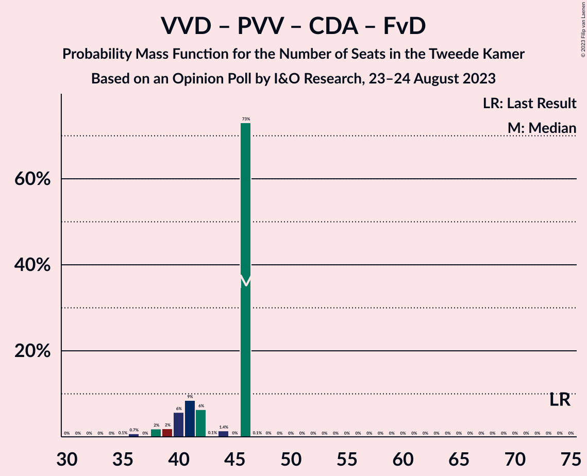

| Number of Seats | Probability | Accumulated | Special Marks |
|:---------------:|:-----------:|:-----------:|:-------------:|
| 35 | 0.1% | 100% |  |
| 36 | 0.7% | 99.9% |  |
| 37 | 0% | 99.2% |  |
| 38 | 2% | 99.1% |  |
| 39 | 2% | 97% |  |
| 40 | 6% | 95% |  |
| 41 | 9% | 90% |  |
| 42 | 6% | 81% |  |
| 43 | 0.1% | 75% |  |
| 44 | 1.4% | 75% | Median |
| 45 | 0% | 73% |  |
| 46 | 73% | 73% |  |
| 47 | 0.1% | 0.1% |  |
| 48 | 0% | 0% |  |
| 49 | 0% | 0% |  |
| 50 | 0% | 0% |  |
| 51 | 0% | 0% |  |
| 52 | 0% | 0% |  |
| 53 | 0% | 0% |  |
| 54 | 0% | 0% |  |
| 55 | 0% | 0% |  |
| 56 | 0% | 0% |  |
| 57 | 0% | 0% |  |
| 58 | 0% | 0% |  |
| 59 | 0% | 0% |  |
| 60 | 0% | 0% |  |
| 61 | 0% | 0% |  |
| 62 | 0% | 0% |  |
| 63 | 0% | 0% |  |
| 64 | 0% | 0% |  |
| 65 | 0% | 0% |  |
| 66 | 0% | 0% |  |
| 67 | 0% | 0% |  |
| 68 | 0% | 0% |  |
| 69 | 0% | 0% |  |
| 70 | 0% | 0% |  |
| 71 | 0% | 0% |  |
| 72 | 0% | 0% |  |
| 73 | 0% | 0% |  |
| 74 | 0% | 0% | Last Result |

### GroenLinks–Partij van de Arbeid – Democraten 66 – ChristenUnie – Christen-Democratisch Appèl

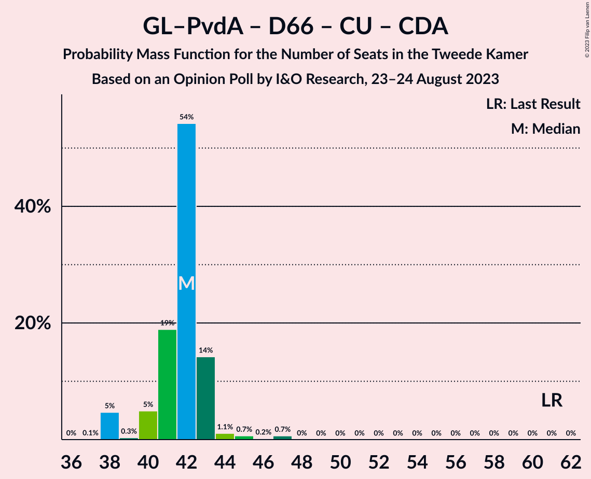

| Number of Seats | Probability | Accumulated | Special Marks |
|:---------------:|:-----------:|:-----------:|:-------------:|
| 37 | 0.1% | 100% |  |
| 38 | 5% | 99.9% |  |
| 39 | 0.3% | 95% |  |
| 40 | 5% | 95% | Median |
| 41 | 19% | 90% |  |
| 42 | 54% | 71% |  |
| 43 | 14% | 17% |  |
| 44 | 1.1% | 3% |  |
| 45 | 0.7% | 2% |  |
| 46 | 0.2% | 0.9% |  |
| 47 | 0.7% | 0.7% |  |
| 48 | 0% | 0% |  |
| 49 | 0% | 0% |  |
| 50 | 0% | 0% |  |
| 51 | 0% | 0% |  |
| 52 | 0% | 0% |  |
| 53 | 0% | 0% |  |
| 54 | 0% | 0% |  |
| 55 | 0% | 0% |  |
| 56 | 0% | 0% |  |
| 57 | 0% | 0% |  |
| 58 | 0% | 0% |  |
| 59 | 0% | 0% |  |
| 60 | 0% | 0% |  |
| 61 | 0% | 0% | Last Result |

### GroenLinks–Partij van de Arbeid – BoerBurgerBeweging

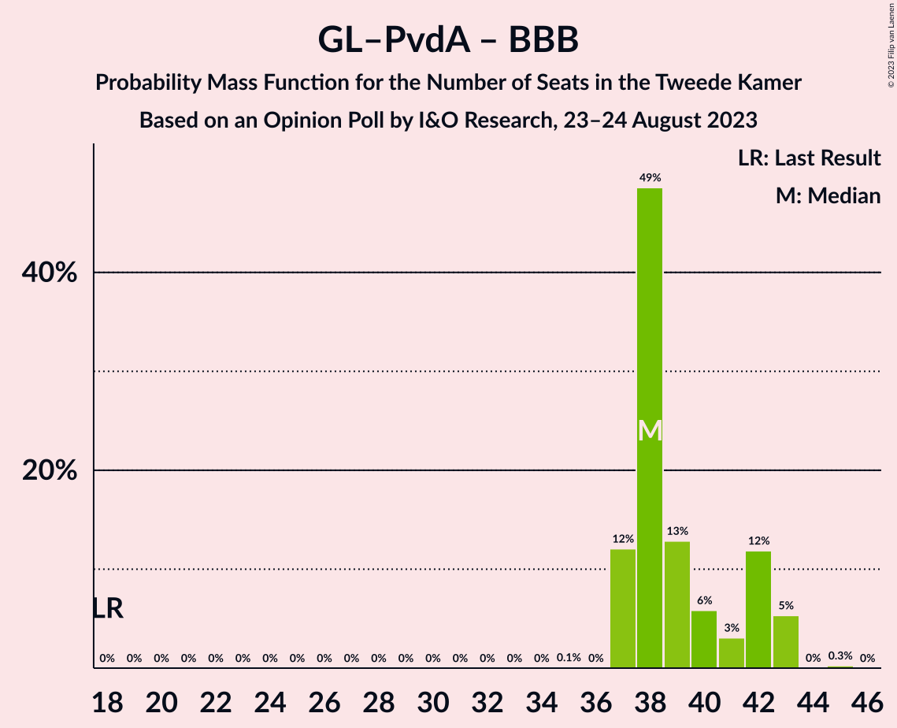

| Number of Seats | Probability | Accumulated | Special Marks |
|:---------------:|:-----------:|:-----------:|:-------------:|
| 18 | 0% | 100% | Last Result |
| 19 | 0% | 100% |  |
| 20 | 0% | 100% |  |
| 21 | 0% | 100% |  |
| 22 | 0% | 100% |  |
| 23 | 0% | 100% |  |
| 24 | 0% | 100% |  |
| 25 | 0% | 100% |  |
| 26 | 0% | 100% |  |
| 27 | 0% | 100% |  |
| 28 | 0% | 100% |  |
| 29 | 0% | 100% |  |
| 30 | 0% | 100% |  |
| 31 | 0% | 100% |  |
| 32 | 0% | 100% |  |
| 33 | 0% | 100% |  |
| 34 | 0% | 100% |  |
| 35 | 0.1% | 100% |  |
| 36 | 0% | 99.9% |  |
| 37 | 12% | 99.9% |  |
| 38 | 49% | 88% | Median |
| 39 | 13% | 39% |  |
| 40 | 6% | 26% |  |
| 41 | 3% | 21% |  |
| 42 | 12% | 17% |  |
| 43 | 5% | 6% |  |
| 44 | 0% | 0.3% |  |
| 45 | 0.3% | 0.3% |  |
| 46 | 0% | 0% |  |

### Volkspartij voor Vrijheid en Democratie – Partij voor de Vrijheid – Christen-Democratisch Appèl

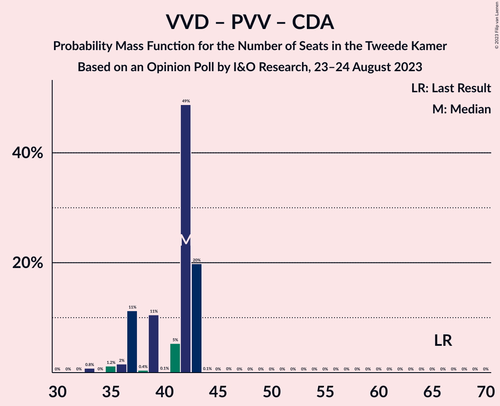

| Number of Seats | Probability | Accumulated | Special Marks |
|:---------------:|:-----------:|:-----------:|:-------------:|
| 33 | 0.8% | 100% |  |
| 34 | 0% | 99.2% |  |
| 35 | 1.2% | 99.2% |  |
| 36 | 2% | 98% |  |
| 37 | 11% | 96% |  |
| 38 | 0.4% | 85% |  |
| 39 | 11% | 85% |  |
| 40 | 0.1% | 74% | Median |
| 41 | 5% | 74% |  |
| 42 | 49% | 69% |  |
| 43 | 20% | 20% |  |
| 44 | 0.1% | 0.1% |  |
| 45 | 0% | 0% |  |
| 46 | 0% | 0% |  |
| 47 | 0% | 0% |  |
| 48 | 0% | 0% |  |
| 49 | 0% | 0% |  |
| 50 | 0% | 0% |  |
| 51 | 0% | 0% |  |
| 52 | 0% | 0% |  |
| 53 | 0% | 0% |  |
| 54 | 0% | 0% |  |
| 55 | 0% | 0% |  |
| 56 | 0% | 0% |  |
| 57 | 0% | 0% |  |
| 58 | 0% | 0% |  |
| 59 | 0% | 0% |  |
| 60 | 0% | 0% |  |
| 61 | 0% | 0% |  |
| 62 | 0% | 0% |  |
| 63 | 0% | 0% |  |
| 64 | 0% | 0% |  |
| 65 | 0% | 0% |  |
| 66 | 0% | 0% | Last Result |

### Volkspartij voor Vrijheid en Democratie – BoerBurgerBeweging – Christen-Democratisch Appèl

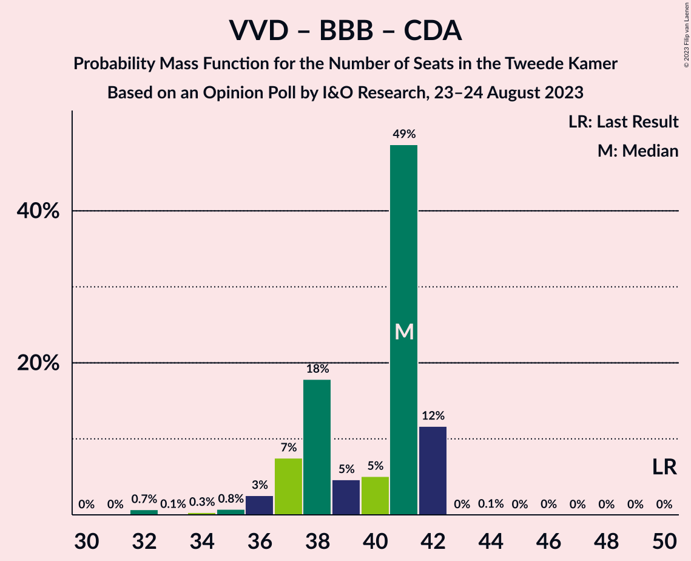

| Number of Seats | Probability | Accumulated | Special Marks |
|:---------------:|:-----------:|:-----------:|:-------------:|
| 32 | 0.7% | 100% |  |
| 33 | 0.1% | 99.3% |  |
| 34 | 0.3% | 99.2% |  |
| 35 | 0.8% | 98.9% |  |
| 36 | 3% | 98% |  |
| 37 | 7% | 96% |  |
| 38 | 18% | 88% |  |
| 39 | 5% | 70% | Median |
| 40 | 5% | 66% |  |
| 41 | 49% | 61% |  |
| 42 | 12% | 12% |  |
| 43 | 0% | 0.1% |  |
| 44 | 0.1% | 0.1% |  |
| 45 | 0% | 0% |  |
| 46 | 0% | 0% |  |
| 47 | 0% | 0% |  |
| 48 | 0% | 0% |  |
| 49 | 0% | 0% |  |
| 50 | 0% | 0% | Last Result |

### GroenLinks–Partij van de Arbeid – Democraten 66 – Christen-Democratisch Appèl

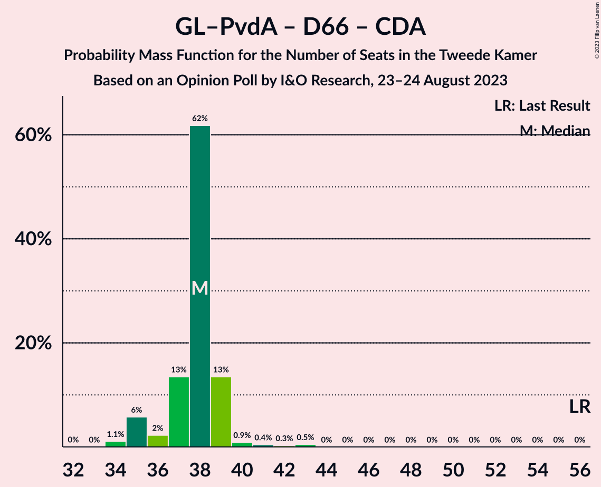

| Number of Seats | Probability | Accumulated | Special Marks |
|:---------------:|:-----------:|:-----------:|:-------------:|
| 34 | 1.1% | 100% |  |
| 35 | 6% | 98.9% |  |
| 36 | 2% | 93% | Median |
| 37 | 13% | 91% |  |
| 38 | 62% | 77% |  |
| 39 | 13% | 16% |  |
| 40 | 0.9% | 2% |  |
| 41 | 0.4% | 1.2% |  |
| 42 | 0.3% | 0.8% |  |
| 43 | 0.5% | 0.5% |  |
| 44 | 0% | 0% |  |
| 45 | 0% | 0% |  |
| 46 | 0% | 0% |  |
| 47 | 0% | 0% |  |
| 48 | 0% | 0% |  |
| 49 | 0% | 0% |  |
| 50 | 0% | 0% |  |
| 51 | 0% | 0% |  |
| 52 | 0% | 0% |  |
| 53 | 0% | 0% |  |
| 54 | 0% | 0% |  |
| 55 | 0% | 0% |  |
| 56 | 0% | 0% | Last Result |

### Volkspartij voor Vrijheid en Democratie – Democraten 66 – ChristenUnie – Christen-Democratisch Appèl

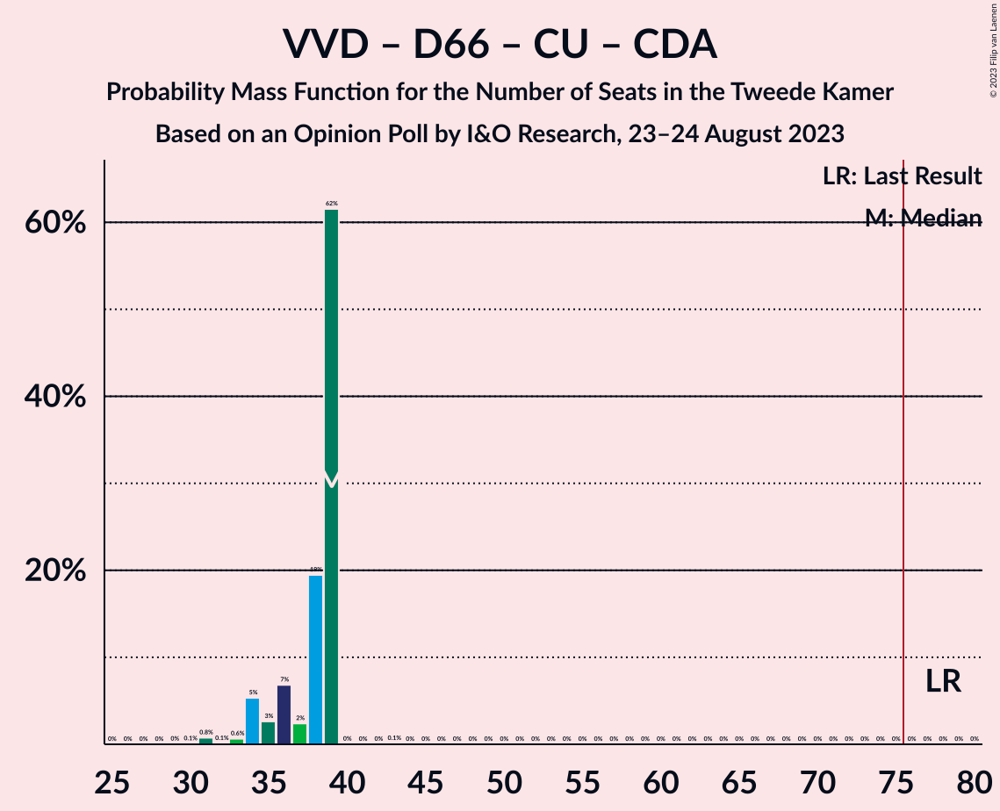

| Number of Seats | Probability | Accumulated | Special Marks |
|:---------------:|:-----------:|:-----------:|:-------------:|
| 30 | 0.1% | 100% |  |
| 31 | 0.8% | 99.9% |  |
| 32 | 0.1% | 99.1% |  |
| 33 | 0.6% | 99.0% |  |
| 34 | 5% | 98% |  |
| 35 | 3% | 93% |  |
| 36 | 7% | 90% |  |
| 37 | 2% | 84% | Median |
| 38 | 19% | 81% |  |
| 39 | 62% | 62% |  |
| 40 | 0% | 0.2% |  |
| 41 | 0% | 0.1% |  |
| 42 | 0% | 0.1% |  |
| 43 | 0.1% | 0.1% |  |
| 44 | 0% | 0% |  |
| 45 | 0% | 0% |  |
| 46 | 0% | 0% |  |
| 47 | 0% | 0% |  |
| 48 | 0% | 0% |  |
| 49 | 0% | 0% |  |
| 50 | 0% | 0% |  |
| 51 | 0% | 0% |  |
| 52 | 0% | 0% |  |
| 53 | 0% | 0% |  |
| 54 | 0% | 0% |  |
| 55 | 0% | 0% |  |
| 56 | 0% | 0% |  |
| 57 | 0% | 0% |  |
| 58 | 0% | 0% |  |
| 59 | 0% | 0% |  |
| 60 | 0% | 0% |  |
| 61 | 0% | 0% |  |
| 62 | 0% | 0% |  |
| 63 | 0% | 0% |  |
| 64 | 0% | 0% |  |
| 65 | 0% | 0% |  |
| 66 | 0% | 0% |  |
| 67 | 0% | 0% |  |
| 68 | 0% | 0% |  |
| 69 | 0% | 0% |  |
| 70 | 0% | 0% |  |
| 71 | 0% | 0% |  |
| 72 | 0% | 0% |  |
| 73 | 0% | 0% |  |
| 74 | 0% | 0% |  |
| 75 | 0% | 0% |  |
| 76 | 0% | 0% | Majority |
| 77 | 0% | 0% |  |
| 78 | 0% | 0% | Last Result |

### GroenLinks–Partij van de Arbeid – ChristenUnie – Christen-Democratisch Appèl

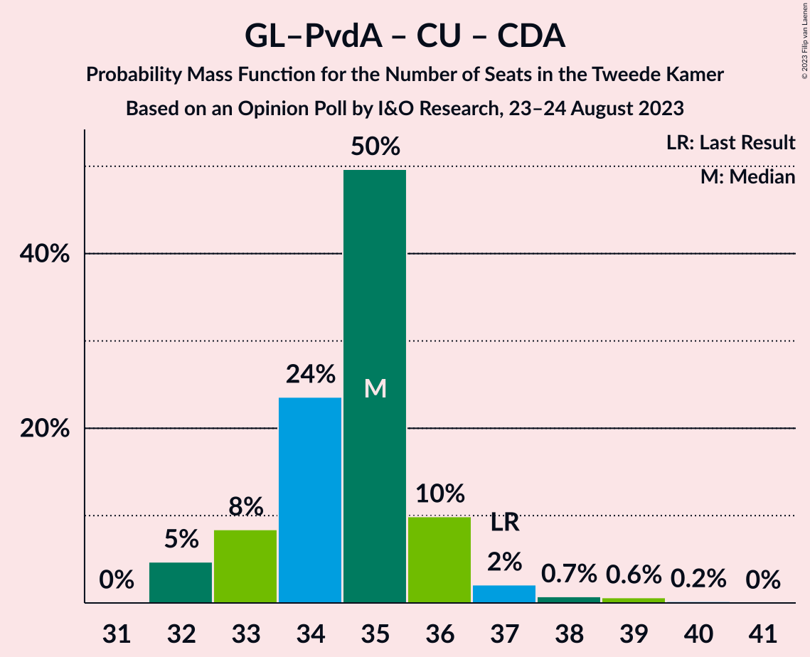

| Number of Seats | Probability | Accumulated | Special Marks |
|:---------------:|:-----------:|:-----------:|:-------------:|
| 31 | 0% | 100% |  |
| 32 | 5% | 99.9% |  |
| 33 | 8% | 95% | Median |
| 34 | 24% | 87% |  |
| 35 | 50% | 63% |  |
| 36 | 10% | 14% |  |
| 37 | 2% | 4% | Last Result |
| 38 | 0.7% | 2% |  |
| 39 | 0.6% | 0.8% |  |
| 40 | 0.2% | 0.2% |  |
| 41 | 0% | 0% |  |

### Volkspartij voor Vrijheid en Democratie – Staatkundig Gereformeerde Partij – Christen-Democratisch Appèl – Forum voor Democratie – 50Plus

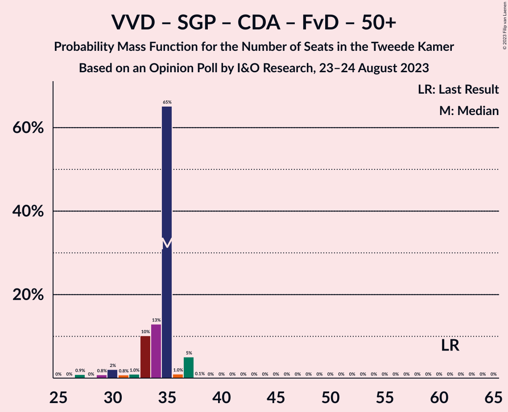

| Number of Seats | Probability | Accumulated | Special Marks |
|:---------------:|:-----------:|:-----------:|:-------------:|
| 27 | 0.9% | 100% |  |
| 28 | 0% | 99.1% |  |
| 29 | 0.8% | 99.1% |  |
| 30 | 2% | 98% |  |
| 31 | 0.8% | 96% |  |
| 32 | 1.0% | 95% |  |
| 33 | 10% | 94% | Median |
| 34 | 13% | 84% |  |
| 35 | 65% | 71% |  |
| 36 | 1.0% | 6% |  |
| 37 | 5% | 5% |  |
| 38 | 0.1% | 0.1% |  |
| 39 | 0% | 0% |  |
| 40 | 0% | 0% |  |
| 41 | 0% | 0% |  |
| 42 | 0% | 0% |  |
| 43 | 0% | 0% |  |
| 44 | 0% | 0% |  |
| 45 | 0% | 0% |  |
| 46 | 0% | 0% |  |
| 47 | 0% | 0% |  |
| 48 | 0% | 0% |  |
| 49 | 0% | 0% |  |
| 50 | 0% | 0% |  |
| 51 | 0% | 0% |  |
| 52 | 0% | 0% |  |
| 53 | 0% | 0% |  |
| 54 | 0% | 0% |  |
| 55 | 0% | 0% |  |
| 56 | 0% | 0% |  |
| 57 | 0% | 0% |  |
| 58 | 0% | 0% |  |
| 59 | 0% | 0% |  |
| 60 | 0% | 0% |  |
| 61 | 0% | 0% | Last Result |

### Volkspartij voor Vrijheid en Democratie – Staatkundig Gereformeerde Partij – Christen-Democratisch Appèl – Forum voor Democratie

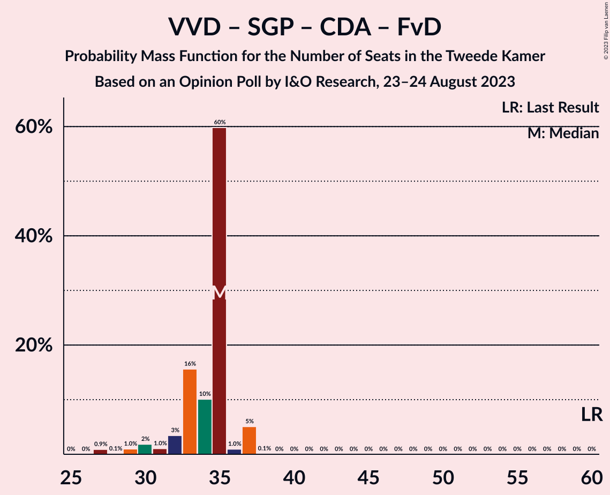

| Number of Seats | Probability | Accumulated | Special Marks |
|:---------------:|:-----------:|:-----------:|:-------------:|
| 27 | 0.9% | 100% |  |
| 28 | 0.1% | 99.1% |  |
| 29 | 1.0% | 99.0% |  |
| 30 | 2% | 98% |  |
| 31 | 1.0% | 96% |  |
| 32 | 3% | 95% |  |
| 33 | 16% | 92% | Median |
| 34 | 10% | 76% |  |
| 35 | 60% | 66% |  |
| 36 | 1.0% | 6% |  |
| 37 | 5% | 5% |  |
| 38 | 0.1% | 0.1% |  |
| 39 | 0% | 0% |  |
| 40 | 0% | 0% |  |
| 41 | 0% | 0% |  |
| 42 | 0% | 0% |  |
| 43 | 0% | 0% |  |
| 44 | 0% | 0% |  |
| 45 | 0% | 0% |  |
| 46 | 0% | 0% |  |
| 47 | 0% | 0% |  |
| 48 | 0% | 0% |  |
| 49 | 0% | 0% |  |
| 50 | 0% | 0% |  |
| 51 | 0% | 0% |  |
| 52 | 0% | 0% |  |
| 53 | 0% | 0% |  |
| 54 | 0% | 0% |  |
| 55 | 0% | 0% |  |
| 56 | 0% | 0% |  |
| 57 | 0% | 0% |  |
| 58 | 0% | 0% |  |
| 59 | 0% | 0% |  |
| 60 | 0% | 0% | Last Result |

### Volkspartij voor Vrijheid en Democratie – Democraten 66 – Christen-Democratisch Appèl

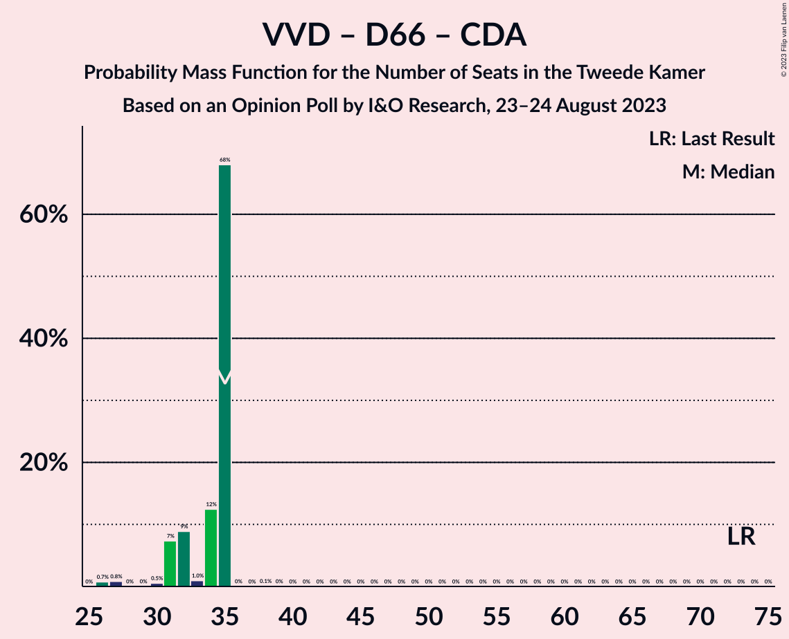

| Number of Seats | Probability | Accumulated | Special Marks |
|:---------------:|:-----------:|:-----------:|:-------------:|
| 26 | 0.7% | 100% |  |
| 27 | 0.8% | 99.2% |  |
| 28 | 0% | 98% |  |
| 29 | 0% | 98% |  |
| 30 | 0.5% | 98% |  |
| 31 | 7% | 98% |  |
| 32 | 9% | 90% |  |
| 33 | 1.0% | 82% | Median |
| 34 | 12% | 81% |  |
| 35 | 68% | 68% |  |
| 36 | 0% | 0.1% |  |
| 37 | 0% | 0.1% |  |
| 38 | 0.1% | 0.1% |  |
| 39 | 0% | 0% |  |
| 40 | 0% | 0% |  |
| 41 | 0% | 0% |  |
| 42 | 0% | 0% |  |
| 43 | 0% | 0% |  |
| 44 | 0% | 0% |  |
| 45 | 0% | 0% |  |
| 46 | 0% | 0% |  |
| 47 | 0% | 0% |  |
| 48 | 0% | 0% |  |
| 49 | 0% | 0% |  |
| 50 | 0% | 0% |  |
| 51 | 0% | 0% |  |
| 52 | 0% | 0% |  |
| 53 | 0% | 0% |  |
| 54 | 0% | 0% |  |
| 55 | 0% | 0% |  |
| 56 | 0% | 0% |  |
| 57 | 0% | 0% |  |
| 58 | 0% | 0% |  |
| 59 | 0% | 0% |  |
| 60 | 0% | 0% |  |
| 61 | 0% | 0% |  |
| 62 | 0% | 0% |  |
| 63 | 0% | 0% |  |
| 64 | 0% | 0% |  |
| 65 | 0% | 0% |  |
| 66 | 0% | 0% |  |
| 67 | 0% | 0% |  |
| 68 | 0% | 0% |  |
| 69 | 0% | 0% |  |
| 70 | 0% | 0% |  |
| 71 | 0% | 0% |  |
| 72 | 0% | 0% |  |
| 73 | 0% | 0% | Last Result |

### Volkspartij voor Vrijheid en Democratie – Christen-Democratisch Appèl – Forum voor Democratie – 50Plus

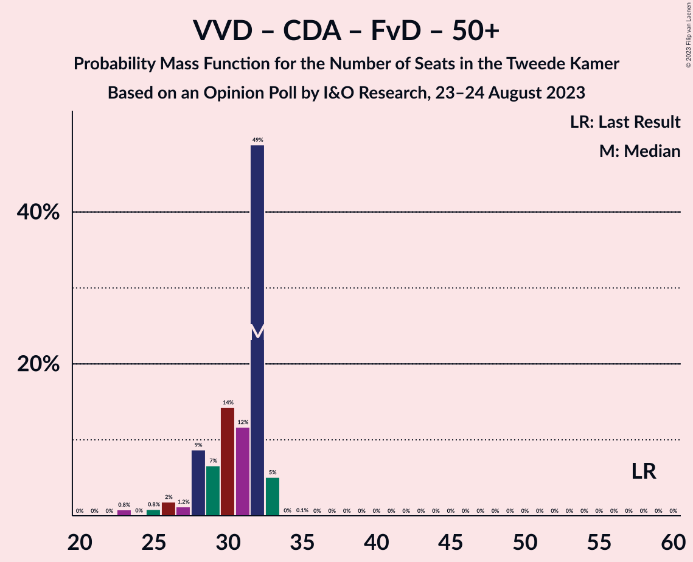

| Number of Seats | Probability | Accumulated | Special Marks |
|:---------------:|:-----------:|:-----------:|:-------------:|
| 23 | 0.8% | 100% |  |
| 24 | 0% | 99.2% |  |
| 25 | 0.8% | 99.2% |  |
| 26 | 2% | 98% |  |
| 27 | 1.2% | 96% |  |
| 28 | 9% | 95% |  |
| 29 | 7% | 87% |  |
| 30 | 14% | 80% | Median |
| 31 | 12% | 66% |  |
| 32 | 49% | 54% |  |
| 33 | 5% | 5% |  |
| 34 | 0% | 0.1% |  |
| 35 | 0.1% | 0.1% |  |
| 36 | 0% | 0% |  |
| 37 | 0% | 0% |  |
| 38 | 0% | 0% |  |
| 39 | 0% | 0% |  |
| 40 | 0% | 0% |  |
| 41 | 0% | 0% |  |
| 42 | 0% | 0% |  |
| 43 | 0% | 0% |  |
| 44 | 0% | 0% |  |
| 45 | 0% | 0% |  |
| 46 | 0% | 0% |  |
| 47 | 0% | 0% |  |
| 48 | 0% | 0% |  |
| 49 | 0% | 0% |  |
| 50 | 0% | 0% |  |
| 51 | 0% | 0% |  |
| 52 | 0% | 0% |  |
| 53 | 0% | 0% |  |
| 54 | 0% | 0% |  |
| 55 | 0% | 0% |  |
| 56 | 0% | 0% |  |
| 57 | 0% | 0% |  |
| 58 | 0% | 0% | Last Result |

### Volkspartij voor Vrijheid en Democratie – Christen-Democratisch Appèl – Forum voor Democratie

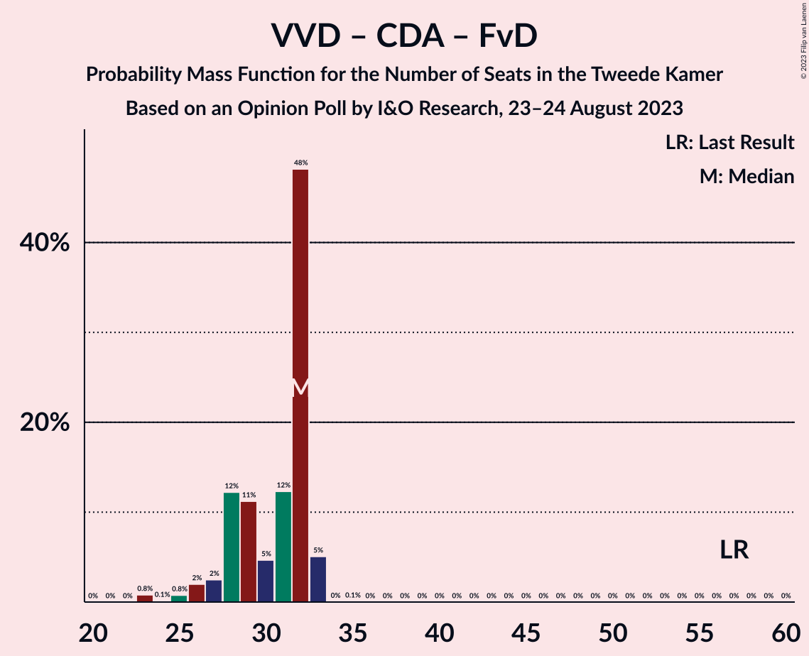

| Number of Seats | Probability | Accumulated | Special Marks |
|:---------------:|:-----------:|:-----------:|:-------------:|
| 23 | 0.8% | 100% |  |
| 24 | 0.1% | 99.2% |  |
| 25 | 0.8% | 99.1% |  |
| 26 | 2% | 98% |  |
| 27 | 2% | 96% |  |
| 28 | 12% | 94% |  |
| 29 | 11% | 82% |  |
| 30 | 5% | 70% | Median |
| 31 | 12% | 66% |  |
| 32 | 48% | 53% |  |
| 33 | 5% | 5% |  |
| 34 | 0% | 0.1% |  |
| 35 | 0.1% | 0.1% |  |
| 36 | 0% | 0% |  |
| 37 | 0% | 0% |  |
| 38 | 0% | 0% |  |
| 39 | 0% | 0% |  |
| 40 | 0% | 0% |  |
| 41 | 0% | 0% |  |
| 42 | 0% | 0% |  |
| 43 | 0% | 0% |  |
| 44 | 0% | 0% |  |
| 45 | 0% | 0% |  |
| 46 | 0% | 0% |  |
| 47 | 0% | 0% |  |
| 48 | 0% | 0% |  |
| 49 | 0% | 0% |  |
| 50 | 0% | 0% |  |
| 51 | 0% | 0% |  |
| 52 | 0% | 0% |  |
| 53 | 0% | 0% |  |
| 54 | 0% | 0% |  |
| 55 | 0% | 0% |  |
| 56 | 0% | 0% |  |
| 57 | 0% | 0% | Last Result |

### GroenLinks–Partij van de Arbeid – Christen-Democratisch Appèl

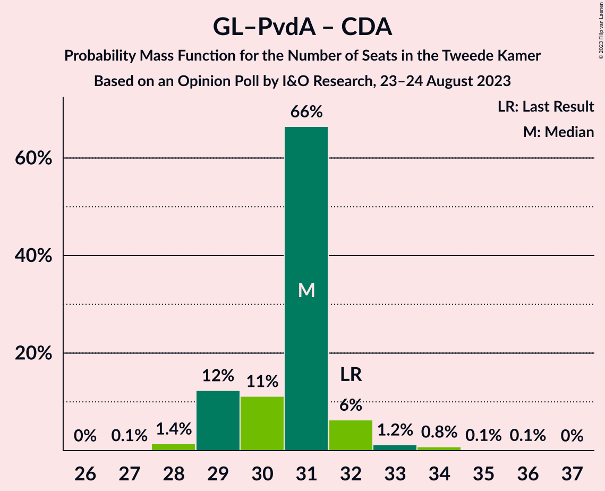

| Number of Seats | Probability | Accumulated | Special Marks |
|:---------------:|:-----------:|:-----------:|:-------------:|
| 27 | 0.1% | 100% |  |
| 28 | 1.4% | 99.9% |  |
| 29 | 12% | 98.5% | Median |
| 30 | 11% | 86% |  |
| 31 | 66% | 75% |  |
| 32 | 6% | 9% | Last Result |
| 33 | 1.2% | 2% |  |
| 34 | 0.8% | 1.0% |  |
| 35 | 0.1% | 0.2% |  |
| 36 | 0.1% | 0.1% |  |
| 37 | 0% | 0% |  |

### Volkspartij voor Vrijheid en Democratie – Christen-Democratisch Appèl

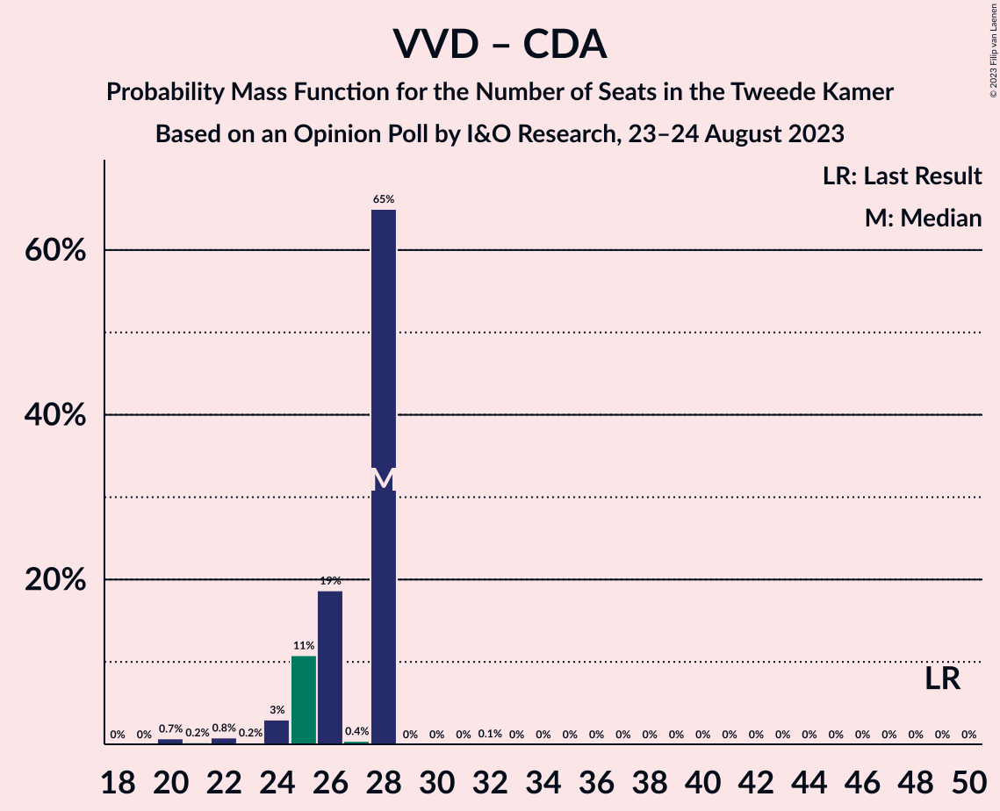

| Number of Seats | Probability | Accumulated | Special Marks |
|:---------------:|:-----------:|:-----------:|:-------------:|
| 20 | 0.7% | 100% |  |
| 21 | 0.2% | 99.3% |  |
| 22 | 0.8% | 99.1% |  |
| 23 | 0.2% | 98% |  |
| 24 | 3% | 98% |  |
| 25 | 11% | 95% |  |
| 26 | 19% | 84% | Median |
| 27 | 0.4% | 66% |  |
| 28 | 65% | 65% |  |
| 29 | 0% | 0.1% |  |
| 30 | 0% | 0.1% |  |
| 31 | 0% | 0.1% |  |
| 32 | 0.1% | 0.1% |  |
| 33 | 0% | 0% |  |
| 34 | 0% | 0% |  |
| 35 | 0% | 0% |  |
| 36 | 0% | 0% |  |
| 37 | 0% | 0% |  |
| 38 | 0% | 0% |  |
| 39 | 0% | 0% |  |
| 40 | 0% | 0% |  |
| 41 | 0% | 0% |  |
| 42 | 0% | 0% |  |
| 43 | 0% | 0% |  |
| 44 | 0% | 0% |  |
| 45 | 0% | 0% |  |
| 46 | 0% | 0% |  |
| 47 | 0% | 0% |  |
| 48 | 0% | 0% |  |
| 49 | 0% | 0% | Last Result |

### Democraten 66 – Christen-Democratisch Appèl

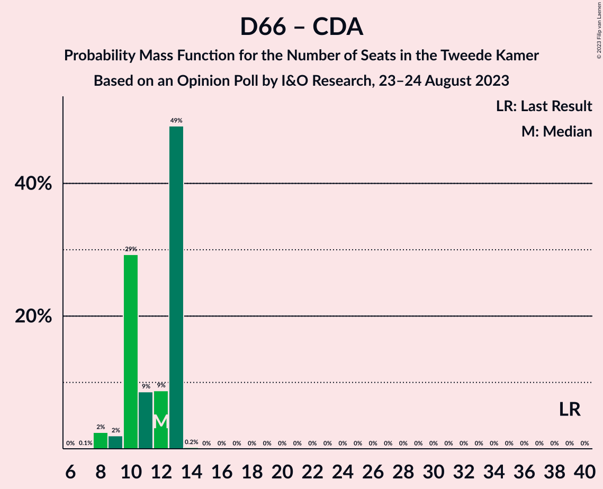

| Number of Seats | Probability | Accumulated | Special Marks |
|:---------------:|:-----------:|:-----------:|:-------------:|
| 7 | 0.1% | 100% |  |
| 8 | 2% | 99.9% |  |
| 9 | 2% | 97% |  |
| 10 | 29% | 95% |  |
| 11 | 9% | 66% | Median |
| 12 | 9% | 58% |  |
| 13 | 49% | 49% |  |
| 14 | 0.2% | 0.2% |  |
| 15 | 0% | 0% |  |
| 16 | 0% | 0% |  |
| 17 | 0% | 0% |  |
| 18 | 0% | 0% |  |
| 19 | 0% | 0% |  |
| 20 | 0% | 0% |  |
| 21 | 0% | 0% |  |
| 22 | 0% | 0% |  |
| 23 | 0% | 0% |  |
| 24 | 0% | 0% |  |
| 25 | 0% | 0% |  |
| 26 | 0% | 0% |  |
| 27 | 0% | 0% |  |
| 28 | 0% | 0% |  |
| 29 | 0% | 0% |  |
| 30 | 0% | 0% |  |
| 31 | 0% | 0% |  |
| 32 | 0% | 0% |  |
| 33 | 0% | 0% |  |
| 34 | 0% | 0% |  |
| 35 | 0% | 0% |  |
| 36 | 0% | 0% |  |
| 37 | 0% | 0% |  |
| 38 | 0% | 0% |  |
| 39 | 0% | 0% | Last Result |

## Technical Information

### Opinion Poll

+ **Polling firm:** I&O Research
+ **Commissioner(s):** —
+ **Fieldwork period:** 23–24 August 2023

### Calculations

+ **Sample size:** 1752
+ **Simulations done:** 1,048,576
+ **Error estimate:** 2.77%

