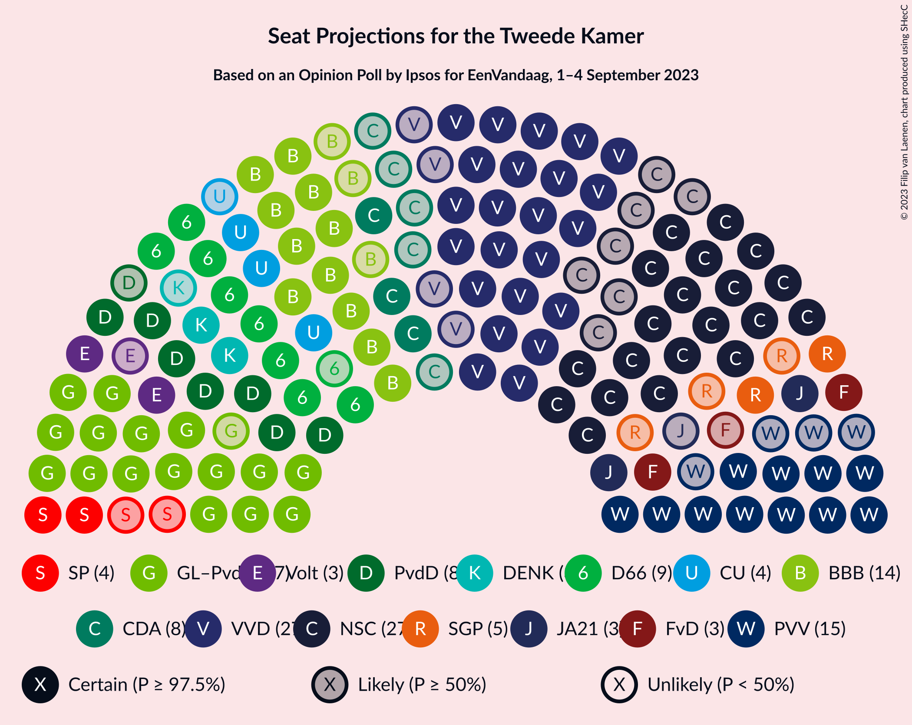
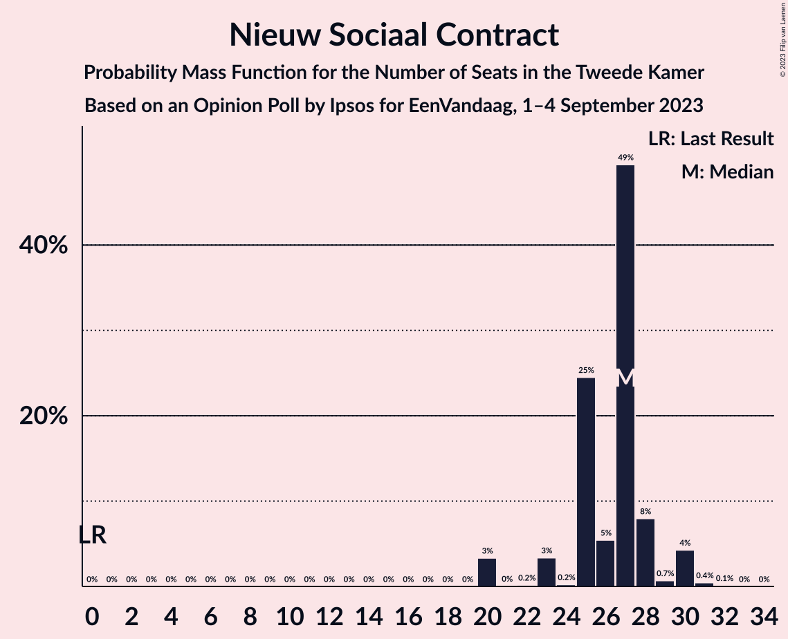
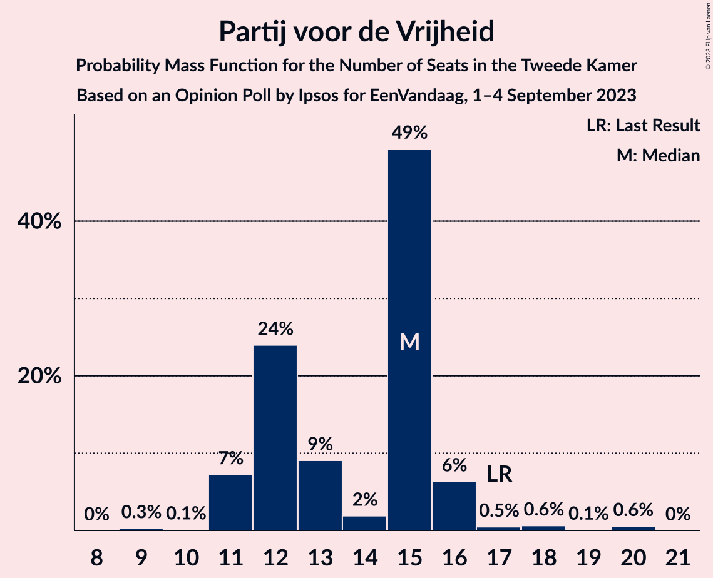
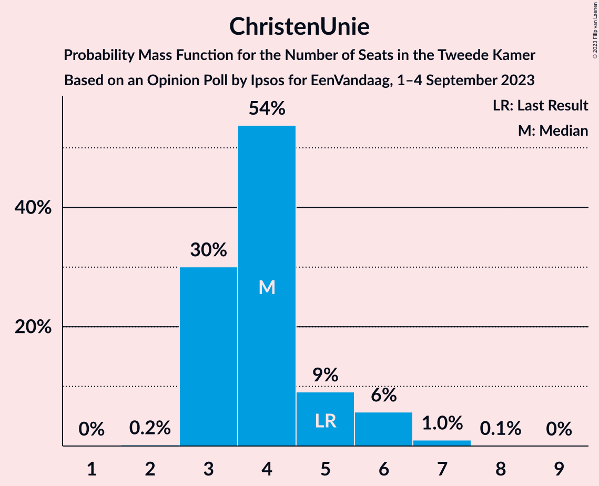
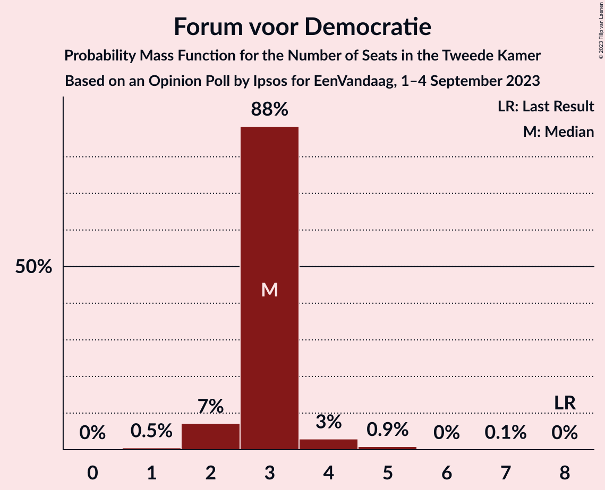
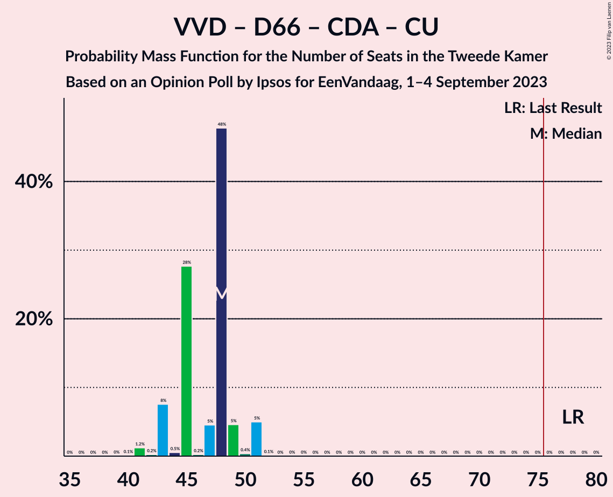
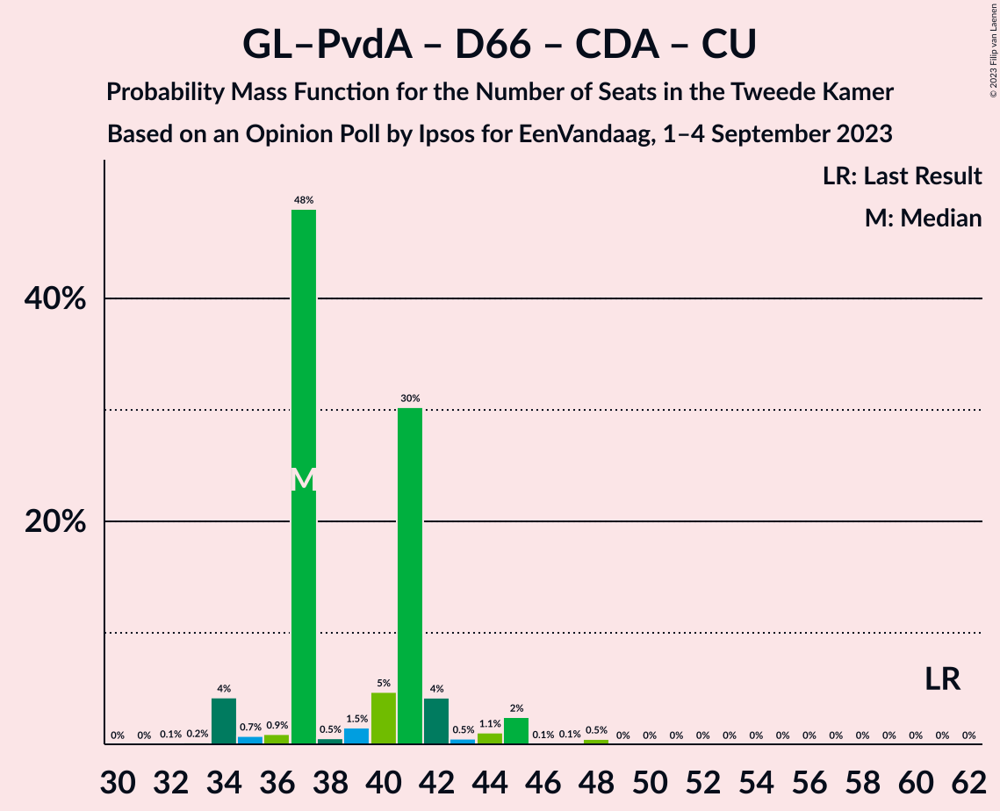
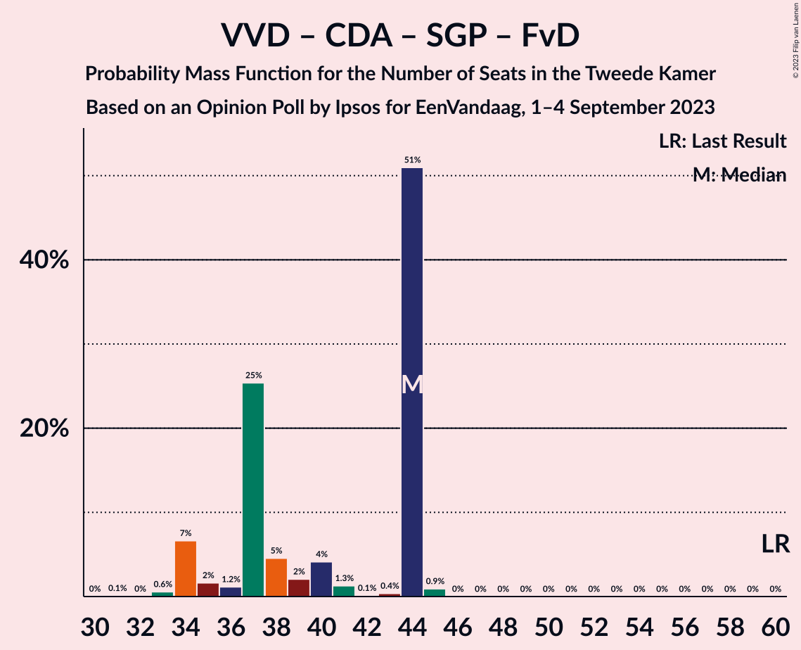

# Opinion Poll by Ipsos for EenVandaag, 1–4 September 2023

<a href="#voting-intentions">Voting Intentions</a> | <a href="#seats">Seats</a> | <a href="#coalitions">Coalitions</a> | <a href="#technical-information">Technical Information</a>

## Voting Intentions

### Confidence Intervals

| Party | Last Result | Poll Result | 80% Confidence Interval | 90% Confidence Interval | 95% Confidence Interval | 99% Confidence Interval |
|:-----:|:-----------:|:-----------:|:-----------------------:|:-----------------------:|:-----------------------:|:-----------------------:|
| Nieuw Sociaal Contract | 0.0% | 17.3% | 15.8–19.0% |15.4–19.5% |15.0–19.9% |14.3–20.7% |
| Volkspartij voor Vrijheid en Democratie | 21.9% | 17.1% | 15.6–18.8% |15.2–19.3% |14.8–19.7% |14.1–20.5% |
| GroenLinks–Partij van de Arbeid | 10.9% | 12.8% | 11.4–14.3% |11.1–14.7% |10.8–15.0% |10.2–15.8% |
| Partij voor de Vrijheid | 10.8% | 9.5% | 8.3–10.8% |8.0–11.2% |7.7–11.5% |7.2–12.2% |
| BoerBurgerBeweging | 1.0% | 9.5% | 8.3–10.8% |8.0–11.2% |7.7–11.5% |7.2–12.2% |
| Democraten 66 | 15.0% | 6.7% | 5.7–7.9% |5.5–8.2% |5.3–8.5% |4.8–9.1% |
| Partij voor de Dieren | 3.8% | 6.2% | 5.3–7.3% |5.0–7.6% |4.8–7.9% |4.4–8.5% |
| Christen-Democratisch Appèl | 9.5% | 3.7% | 3.0–4.6% |2.9–4.9% |2.7–5.1% |2.4–5.6% |
| ChristenUnie | 3.4% | 3.3% | 2.7–4.2% |2.5–4.4% |2.3–4.6% |2.1–5.1% |
| Staatkundig Gereformeerde Partij | 2.1% | 2.3% | 1.8–3.1% |1.7–3.3% |1.5–3.5% |1.3–3.9% |
| Socialistische Partij | 6.0% | 2.2% | 1.7–3.0% |1.6–3.2% |1.5–3.4% |1.2–3.8% |
| Volt Europa | 2.4% | 2.2% | 1.7–3.0% |1.6–3.2% |1.5–3.4% |1.2–3.8% |
| Forum voor Democratie | 5.0% | 2.1% | 1.6–2.9% |1.5–3.1% |1.4–3.3% |1.2–3.7% |
| Juiste Antwoord 2021 | 2.4% | 2.1% | 1.6–2.9% |1.5–3.1% |1.4–3.3% |1.2–3.7% |
| DENK | 2.0% | 2.0% | 1.5–2.7% |1.4–3.0% |1.3–3.1% |1.1–3.5% |
| Bij1 | 0.8% | 0.5% | 0.3–1.0% |0.3–1.1% |0.2–1.2% |0.2–1.5% |
| 50Plus | 1.0% | 0.3% | 0.2–0.7% |0.1–0.8% |0.1–0.9% |0.1–1.2% |

*Note:* The poll result column reflects the actual value used in the calculations. Published results may vary slightly, and in addition be rounded to fewer digits.

## Seats

### Confidence Intervals

| Party | Last Result | Median | 80% Confidence Interval | 90% Confidence Interval | 95% Confidence Interval | 99% Confidence Interval |
|:-----:|:-----------:|:------:|:-----------------------:|:-----------------------:|:-----------------------:|:-----------------------:|
| <a href="#nieuw-sociaal-contract">Nieuw Sociaal Contract</a> | 0 | 27 | 25–28 |23–29 |20–30 |20–31 |
| <a href="#volkspartij-voor-vrijheid-en-democratie">Volkspartij voor Vrijheid en Democratie</a> | 34 | 27 | 25–28 |24–31 |23–31 |22–31 |
| <a href="#groenlinks–partij-van-de-arbeid">GroenLinks–Partij van de Arbeid</a> | 17 | 17 | 16–22 |16–23 |16–23 |14–25 |
| <a href="#partij-voor-de-vrijheid">Partij voor de Vrijheid</a> | 17 | 15 | 12–15 |11–16 |11–16 |11–20 |
| <a href="#boerburgerbeweging">BoerBurgerBeweging</a> | 1 | 14 | 13–14 |12–16 |11–16 |11–19 |
| <a href="#democraten-66">Democraten 66</a> | 24 | 9 | 9–11 |9–11 |8–11 |7–15 |
| <a href="#partij-voor-de-dieren">Partij voor de Dieren</a> | 6 | 8 | 8–11 |8–11 |7–11 |7–13 |
| <a href="#christen-democratisch-appèl">Christen-Democratisch Appèl</a> | 15 | 8 | 4–8 |4–8 |3–8 |3–8 |
| <a href="#christenunie">ChristenUnie</a> | 5 | 4 | 3–5 |3–6 |3–6 |3–7 |
| <a href="#staatkundig-gereformeerde-partij">Staatkundig Gereformeerde Partij</a> | 3 | 5 | 2–6 |2–6 |2–6 |1–6 |
| <a href="#socialistische-partij">Socialistische Partij</a> | 9 | 4 | 3–4 |2–5 |2–5 |1–5 |
| <a href="#volt-europa">Volt Europa</a> | 3 | 3 | 3 |2–4 |2–5 |2–5 |
| <a href="#forum-voor-democratie">Forum voor Democratie</a> | 8 | 3 | 3 |2–3 |2–4 |1–5 |
| <a href="#juiste-antwoord-2021">Juiste Antwoord 2021</a> | 3 | 3 | 3–5 |3–5 |2–5 |2–5 |
| <a href="#denk">DENK</a> | 3 | 3 | 2–3 |2–3 |2–4 |1–5 |
| <a href="#bij1">Bij1</a> | 1 | 0 | 0–1 |0–2 |0–2 |0–3 |
| <a href="#50plus">50Plus</a> | 1 | 0 | 0–2 |0–2 |0–2 |0–2 |

### Nieuw Sociaal Contract

*For a full overview of the results for this party, see the [Nieuw Sociaal Contract](party-nieuwsociaalcontract.html) page.*

| Number of Seats | Probability | Accumulated | Special Marks |
|:---------------:|:-----------:|:-----------:|:-------------:|
| 0 | 0% | 100% | Last Result |
| 1 | 0% | 100% |  |
| 2 | 0% | 100% |  |
| 3 | 0% | 100% |  |
| 4 | 0% | 100% |  |
| 5 | 0% | 100% |  |
| 6 | 0% | 100% |  |
| 7 | 0% | 100% |  |
| 8 | 0% | 100% |  |
| 9 | 0% | 100% |  |
| 10 | 0% | 100% |  |
| 11 | 0% | 100% |  |
| 12 | 0% | 100% |  |
| 13 | 0% | 100% |  |
| 14 | 0% | 100% |  |
| 15 | 0% | 100% |  |
| 16 | 0% | 100% |  |
| 17 | 0% | 100% |  |
| 18 | 0% | 100% |  |
| 19 | 0% | 100% |  |
| 20 | 3% | 100% |  |
| 21 | 0% | 97% |  |
| 22 | 0.2% | 97% |  |
| 23 | 3% | 96% |  |
| 24 | 0.2% | 93% |  |
| 25 | 25% | 93% |  |
| 26 | 5% | 68% |  |
| 27 | 49% | 63% | Median |
| 28 | 8% | 13% |  |
| 29 | 0.7% | 6% |  |
| 30 | 4% | 5% |  |
| 31 | 0.4% | 0.6% |  |
| 32 | 0.1% | 0.1% |  |
| 33 | 0% | 0% |  |

### Volkspartij voor Vrijheid en Democratie

*For a full overview of the results for this party, see the [Volkspartij voor Vrijheid en Democratie](party-volkspartijvoorvrijheidendemocratie.html) page.*

| Number of Seats | Probability | Accumulated | Special Marks |
|:---------------:|:-----------:|:-----------:|:-------------:|
| 19 | 0.1% | 100% |  |
| 20 | 0.2% | 99.9% |  |
| 21 | 0.1% | 99.7% |  |
| 22 | 1.2% | 99.6% |  |
| 23 | 3% | 98% |  |
| 24 | 1.0% | 96% |  |
| 25 | 30% | 95% |  |
| 26 | 2% | 64% |  |
| 27 | 50% | 63% | Median |
| 28 | 4% | 13% |  |
| 29 | 0.5% | 9% |  |
| 30 | 3% | 8% |  |
| 31 | 5% | 5% |  |
| 32 | 0.4% | 0.4% |  |
| 33 | 0% | 0% |  |
| 34 | 0% | 0% | Last Result |

### GroenLinks–Partij van de Arbeid

*For a full overview of the results for this party, see the [GroenLinks–Partij van de Arbeid](party-groenlinks–partijvandearbeid.html) page.*

| Number of Seats | Probability | Accumulated | Special Marks |
|:---------------:|:-----------:|:-----------:|:-------------:|
| 13 | 0.1% | 100% |  |
| 14 | 1.0% | 99.9% |  |
| 15 | 0.2% | 98.8% |  |
| 16 | 48% | 98.7% |  |
| 17 | 1.3% | 51% | Last Result, Median |
| 18 | 1.4% | 49% |  |
| 19 | 8% | 48% |  |
| 20 | 0.5% | 40% |  |
| 21 | 27% | 39% |  |
| 22 | 5% | 13% |  |
| 23 | 7% | 8% |  |
| 24 | 1.0% | 2% |  |
| 25 | 0.7% | 0.7% |  |
| 26 | 0% | 0% |  |

### Partij voor de Vrijheid

*For a full overview of the results for this party, see the [Partij voor de Vrijheid](party-partijvoordevrijheid.html) page.*

| Number of Seats | Probability | Accumulated | Special Marks |
|:---------------:|:-----------:|:-----------:|:-------------:|
| 9 | 0.3% | 100% |  |
| 10 | 0.1% | 99.7% |  |
| 11 | 7% | 99.6% |  |
| 12 | 24% | 92% |  |
| 13 | 9% | 68% |  |
| 14 | 2% | 59% |  |
| 15 | 49% | 57% | Median |
| 16 | 6% | 8% |  |
| 17 | 0.5% | 2% | Last Result |
| 18 | 0.6% | 1.3% |  |
| 19 | 0.1% | 0.7% |  |
| 20 | 0.6% | 0.6% |  |
| 21 | 0% | 0% |  |

### BoerBurgerBeweging

*For a full overview of the results for this party, see the [BoerBurgerBeweging](party-boerburgerbeweging.html) page.*

| Number of Seats | Probability | Accumulated | Special Marks |
|:---------------:|:-----------:|:-----------:|:-------------:|
| 1 | 0% | 100% | Last Result |
| 2 | 0% | 100% |  |
| 3 | 0% | 100% |  |
| 4 | 0% | 100% |  |
| 5 | 0% | 100% |  |
| 6 | 0% | 100% |  |
| 7 | 0% | 100% |  |
| 8 | 0% | 100% |  |
| 9 | 0% | 100% |  |
| 10 | 0% | 100% |  |
| 11 | 5% | 99.9% |  |
| 12 | 3% | 95% |  |
| 13 | 8% | 92% |  |
| 14 | 75% | 85% | Median |
| 15 | 4% | 10% |  |
| 16 | 4% | 6% |  |
| 17 | 0.4% | 2% |  |
| 18 | 0.7% | 1.2% |  |
| 19 | 0.3% | 0.5% |  |
| 20 | 0% | 0.2% |  |
| 21 | 0.2% | 0.2% |  |
| 22 | 0% | 0% |  |

### Democraten 66

*For a full overview of the results for this party, see the [Democraten 66](party-democraten66.html) page.*

| Number of Seats | Probability | Accumulated | Special Marks |
|:---------------:|:-----------:|:-----------:|:-------------:|
| 6 | 0.1% | 100% |  |
| 7 | 0.4% | 99.9% |  |
| 8 | 4% | 99.5% |  |
| 9 | 61% | 96% | Median |
| 10 | 6% | 35% |  |
| 11 | 28% | 29% |  |
| 12 | 0.4% | 1.3% |  |
| 13 | 0.2% | 0.9% |  |
| 14 | 0% | 0.6% |  |
| 15 | 0.6% | 0.6% |  |
| 16 | 0% | 0% |  |
| 17 | 0% | 0% |  |
| 18 | 0% | 0% |  |
| 19 | 0% | 0% |  |
| 20 | 0% | 0% |  |
| 21 | 0% | 0% |  |
| 22 | 0% | 0% |  |
| 23 | 0% | 0% |  |
| 24 | 0% | 0% | Last Result |

### Partij voor de Dieren

*For a full overview of the results for this party, see the [Partij voor de Dieren](party-partijvoordedieren.html) page.*

| Number of Seats | Probability | Accumulated | Special Marks |
|:---------------:|:-----------:|:-----------:|:-------------:|
| 5 | 0.1% | 100% |  |
| 6 | 0.1% | 99.9% | Last Result |
| 7 | 5% | 99.9% |  |
| 8 | 50% | 95% | Median |
| 9 | 29% | 45% |  |
| 10 | 2% | 16% |  |
| 11 | 12% | 14% |  |
| 12 | 0.7% | 2% |  |
| 13 | 1.0% | 1.4% |  |
| 14 | 0.4% | 0.4% |  |
| 15 | 0% | 0% |  |

### Christen-Democratisch Appèl

*For a full overview of the results for this party, see the [Christen-Democratisch Appèl](party-christen-democratischappèl.html) page.*

| Number of Seats | Probability | Accumulated | Special Marks |
|:---------------:|:-----------:|:-----------:|:-------------:|
| 3 | 4% | 100% |  |
| 4 | 7% | 96% |  |
| 5 | 6% | 89% |  |
| 6 | 28% | 82% |  |
| 7 | 2% | 55% |  |
| 8 | 53% | 53% | Median |
| 9 | 0% | 0% |  |
| 10 | 0% | 0% |  |
| 11 | 0% | 0% |  |
| 12 | 0% | 0% |  |
| 13 | 0% | 0% |  |
| 14 | 0% | 0% |  |
| 15 | 0% | 0% | Last Result |

### ChristenUnie

*For a full overview of the results for this party, see the [ChristenUnie](party-christenunie.html) page.*

| Number of Seats | Probability | Accumulated | Special Marks |
|:---------------:|:-----------:|:-----------:|:-------------:|
| 2 | 0.2% | 100% |  |
| 3 | 30% | 99.8% |  |
| 4 | 54% | 70% | Median |
| 5 | 9% | 16% | Last Result |
| 6 | 6% | 7% |  |
| 7 | 1.0% | 1.1% |  |
| 8 | 0.1% | 0.1% |  |
| 9 | 0% | 0% |  |

### Staatkundig Gereformeerde Partij

*For a full overview of the results for this party, see the [Staatkundig Gereformeerde Partij](party-staatkundiggereformeerdepartij.html) page.*

| Number of Seats | Probability | Accumulated | Special Marks |
|:---------------:|:-----------:|:-----------:|:-------------:|
| 1 | 0.6% | 100% |  |
| 2 | 14% | 99.4% |  |
| 3 | 30% | 86% | Last Result |
| 4 | 2% | 56% |  |
| 5 | 4% | 54% | Median |
| 6 | 49% | 49% |  |
| 7 | 0% | 0% |  |

### Socialistische Partij

*For a full overview of the results for this party, see the [Socialistische Partij](party-socialistischepartij.html) page.*

| Number of Seats | Probability | Accumulated | Special Marks |
|:---------------:|:-----------:|:-----------:|:-------------:|
| 1 | 2% | 100% |  |
| 2 | 4% | 98% |  |
| 3 | 7% | 94% |  |
| 4 | 82% | 87% | Median |
| 5 | 5% | 5% |  |
| 6 | 0.5% | 0.5% |  |
| 7 | 0% | 0% |  |
| 8 | 0% | 0% |  |
| 9 | 0% | 0% | Last Result |

### Volt Europa

*For a full overview of the results for this party, see the [Volt Europa](party-volteuropa.html) page.*

| Number of Seats | Probability | Accumulated | Special Marks |
|:---------------:|:-----------:|:-----------:|:-------------:|
| 1 | 0.1% | 100% |  |
| 2 | 7% | 99.9% |  |
| 3 | 85% | 93% | Last Result, Median |
| 4 | 3% | 8% |  |
| 5 | 5% | 5% |  |
| 6 | 0.3% | 0.3% |  |
| 7 | 0% | 0% |  |

### Forum voor Democratie

*For a full overview of the results for this party, see the [Forum voor Democratie](party-forumvoordemocratie.html) page.*

| Number of Seats | Probability | Accumulated | Special Marks |
|:---------------:|:-----------:|:-----------:|:-------------:|
| 1 | 0.5% | 100% |  |
| 2 | 7% | 99.5% |  |
| 3 | 88% | 92% | Median |
| 4 | 3% | 4% |  |
| 5 | 0.9% | 1.0% |  |
| 6 | 0% | 0.1% |  |
| 7 | 0.1% | 0.1% |  |
| 8 | 0% | 0% | Last Result |

### Juiste Antwoord 2021

*For a full overview of the results for this party, see the [Juiste Antwoord 2021](party-juisteantwoord2021.html) page.*

| Number of Seats | Probability | Accumulated | Special Marks |
|:---------------:|:-----------:|:-----------:|:-------------:|
| 1 | 0.5% | 100% |  |
| 2 | 4% | 99.5% |  |
| 3 | 59% | 95% | Last Result, Median |
| 4 | 6% | 36% |  |
| 5 | 30% | 30% |  |
| 6 | 0.2% | 0.3% |  |
| 7 | 0% | 0% |  |

### DENK

*For a full overview of the results for this party, see the [DENK](party-denk.html) page.*

| Number of Seats | Probability | Accumulated | Special Marks |
|:---------------:|:-----------:|:-----------:|:-------------:|
| 1 | 2% | 100% |  |
| 2 | 13% | 98% |  |
| 3 | 82% | 85% | Last Result, Median |
| 4 | 2% | 3% |  |
| 5 | 0.6% | 0.7% |  |
| 6 | 0.1% | 0.1% |  |
| 7 | 0% | 0% |  |

### Bij1

*For a full overview of the results for this party, see the [Bij1](party-bij1.html) page.*

| Number of Seats | Probability | Accumulated | Special Marks |
|:---------------:|:-----------:|:-----------:|:-------------:|
| 0 | 62% | 100% | Median |
| 1 | 29% | 38% | Last Result |
| 2 | 8% | 9% |  |
| 3 | 0.5% | 0.5% |  |
| 4 | 0% | 0% |  |

### 50Plus

*For a full overview of the results for this party, see the [50Plus](party-50plus.html) page.*

| Number of Seats | Probability | Accumulated | Special Marks |
|:---------------:|:-----------:|:-----------:|:-------------:|
| 0 | 70% | 100% | Median |
| 1 | 7% | 30% | Last Result |
| 2 | 24% | 24% |  |
| 3 | 0% | 0% |  |

## Coalitions

### Confidence Intervals

| Coalition | Last Result | Median | Majority? | 80% Confidence Interval | 90% Confidence Interval | 95% Confidence Interval | 99% Confidence Interval |
|:---------:|:-----------:|:------:|:---------:|:-----------------------:|:-----------------------:|:-----------------------:|:-----------------------:|
| Volkspartij voor Vrijheid en Democratie – GroenLinks–Partij van de Arbeid – BoerBurgerBeweging – Christen-Democratisch Appèl | 67 | 65 | 0% | 65–68 | 64–70 | 62–71 | 58–73 |
| Volkspartij voor Vrijheid en Democratie – GroenLinks–Partij van de Arbeid – BoerBurgerBeweging | 52 | 57 | 0% | 57–63 | 57–64 | 55–64 | 52–66 |
| Volkspartij voor Vrijheid en Democratie – GroenLinks–Partij van de Arbeid – Democraten 66 | 75 | 52 | 0% | 52–57 | 52–61 | 51–62 | 50–63 |
| Volkspartij voor Vrijheid en Democratie – Partij voor de Vrijheid – Christen-Democratisch Appèl – Staatkundig Gereformeerde Partij – Forum voor Democratie | 77 | 59 | 0% | 49–59 | 45–59 | 45–60 | 45–60 |
| Volkspartij voor Vrijheid en Democratie – GroenLinks–Partij van de Arbeid – Christen-Democratisch Appèl | 66 | 51 | 0% | 51–54 | 50–56 | 47–58 | 46–58 |
| Volkspartij voor Vrijheid en Democratie – Partij voor de Vrijheid – Christen-Democratisch Appèl – Forum voor Democratie | 74 | 53 | 0% | 46–53 | 43–53 | 43–55 | 43–55 |
| Volkspartij voor Vrijheid en Democratie – GroenLinks–Partij van de Arbeid | 51 | 43 | 0% | 43–48 | 43–50 | 42–53 | 40–53 |
| Volkspartij voor Vrijheid en Democratie – BoerBurgerBeweging – Christen-Democratisch Appèl | 50 | 49 | 0% | 44–49 | 42–49 | 42–52 | 40–52 |
| Volkspartij voor Vrijheid en Democratie – Partij voor de Vrijheid – Christen-Democratisch Appèl | 66 | 50 | 0% | 43–50 | 40–50 | 40–52 | 40–52 |
| Volkspartij voor Vrijheid en Democratie – Democraten 66 – Christen-Democratisch Appèl – ChristenUnie | 78 | 48 | 0% | 45–49 | 43–51 | 43–51 | 41–51 |
| GroenLinks–Partij van de Arbeid – Democraten 66 – Christen-Democratisch Appèl – ChristenUnie – Socialistische Partij | 70 | 41 | 0% | 41–45 | 39–46 | 39–46 | 37–50 |
| Volkspartij voor Vrijheid en Democratie – Democraten 66 – Christen-Democratisch Appèl | 73 | 44 | 0% | 40–44 | 38–45 | 38–46 | 37–48 |
| GroenLinks–Partij van de Arbeid – Democraten 66 – Christen-Democratisch Appèl – ChristenUnie | 61 | 37 | 0% | 37–41 | 35–42 | 34–45 | 34–47 |
| Volkspartij voor Vrijheid en Democratie – Christen-Democratisch Appèl – Staatkundig Gereformeerde Partij – Forum voor Democratie – 50Plus | 61 | 44 | 0% | 37–44 | 34–44 | 34–44 | 33–46 |
| Volkspartij voor Vrijheid en Democratie – Christen-Democratisch Appèl – Staatkundig Gereformeerde Partij – Forum voor Democratie | 60 | 44 | 0% | 36–44 | 34–44 | 34–44 | 33–45 |
| GroenLinks–Partij van de Arbeid – Democraten 66 – Christen-Democratisch Appèl | 56 | 33 | 0% | 33–38 | 30–38 | 30–40 | 29–42 |
| Volkspartij voor Vrijheid en Democratie – Christen-Democratisch Appèl – Forum voor Democratie – 50Plus | 58 | 38 | 0% | 33–38 | 32–39 | 32–39 | 31–40 |
| Volkspartij voor Vrijheid en Democratie – Christen-Democratisch Appèl – Forum voor Democratie | 57 | 38 | 0% | 33–38 | 32–38 | 32–39 | 31–39 |
| GroenLinks–Partij van de Arbeid – BoerBurgerBeweging | 18 | 30 | 0% | 30–36 | 30–36 | 30–37 | 25–40 |
| Volkspartij voor Vrijheid en Democratie – Christen-Democratisch Appèl | 49 | 35 | 0% | 30–35 | 29–36 | 29–36 | 28–37 |
| GroenLinks–Partij van de Arbeid – Christen-Democratisch Appèl – ChristenUnie | 37 | 28 | 0% | 28–32 | 26–33 | 26–34 | 25–37 |
| GroenLinks–Partij van de Arbeid – Christen-Democratisch Appèl | 32 | 24 | 0% | 24–27 | 22–27 | 22–29 | 20–31 |
| Democraten 66 – Christen-Democratisch Appèl | 39 | 17 | 0% | 13–17 | 13–18 | 11–18 | 11–19 |

### Volkspartij voor Vrijheid en Democratie – GroenLinks–Partij van de Arbeid – BoerBurgerBeweging – Christen-Democratisch Appèl

| Number of Seats | Probability | Accumulated | Special Marks |
|:---------------:|:-----------:|:-----------:|:-------------:|
| 58 | 1.4% | 100% |  |
| 59 | 0.1% | 98.6% |  |
| 60 | 0.7% | 98.5% |  |
| 61 | 0.4% | 98% |  |
| 62 | 1.2% | 98% |  |
| 63 | 0.8% | 96% |  |
| 64 | 0.6% | 95% |  |
| 65 | 55% | 95% |  |
| 66 | 27% | 39% | Median |
| 67 | 2% | 13% | Last Result |
| 68 | 1.3% | 11% |  |
| 69 | 4% | 10% |  |
| 70 | 1.1% | 6% |  |
| 71 | 3% | 5% |  |
| 72 | 0% | 1.3% |  |
| 73 | 1.0% | 1.2% |  |
| 74 | 0.2% | 0.2% |  |
| 75 | 0% | 0% |  |

### Volkspartij voor Vrijheid en Democratie – GroenLinks–Partij van de Arbeid – BoerBurgerBeweging

| Number of Seats | Probability | Accumulated | Special Marks |
|:---------------:|:-----------:|:-----------:|:-------------:|
| 52 | 1.0% | 100% | Last Result |
| 53 | 0.6% | 99.0% |  |
| 54 | 0% | 98% |  |
| 55 | 1.2% | 98% |  |
| 56 | 0.7% | 97% |  |
| 57 | 48% | 96% |  |
| 58 | 0.7% | 48% | Median |
| 59 | 1.5% | 47% |  |
| 60 | 24% | 46% |  |
| 61 | 7% | 22% |  |
| 62 | 1.3% | 14% |  |
| 63 | 7% | 13% |  |
| 64 | 4% | 6% |  |
| 65 | 0.4% | 2% |  |
| 66 | 1.0% | 1.2% |  |
| 67 | 0% | 0.2% |  |
| 68 | 0% | 0.2% |  |
| 69 | 0% | 0.2% |  |
| 70 | 0% | 0.2% |  |
| 71 | 0.2% | 0.2% |  |
| 72 | 0% | 0% |  |

### Volkspartij voor Vrijheid en Democratie – GroenLinks–Partij van de Arbeid – Democraten 66

| Number of Seats | Probability | Accumulated | Special Marks |
|:---------------:|:-----------:|:-----------:|:-------------:|
| 48 | 0.2% | 100% |  |
| 49 | 0.2% | 99.8% |  |
| 50 | 1.2% | 99.6% |  |
| 51 | 1.1% | 98% |  |
| 52 | 49% | 97% |  |
| 53 | 0.1% | 49% | Median |
| 54 | 0.7% | 48% |  |
| 55 | 2% | 48% |  |
| 56 | 2% | 45% |  |
| 57 | 36% | 44% |  |
| 58 | 0.5% | 8% |  |
| 59 | 0.5% | 7% |  |
| 60 | 2% | 7% |  |
| 61 | 0.9% | 5% |  |
| 62 | 4% | 4% |  |
| 63 | 0.5% | 0.7% |  |
| 64 | 0% | 0.2% |  |
| 65 | 0% | 0.2% |  |
| 66 | 0% | 0.2% |  |
| 67 | 0% | 0.2% |  |
| 68 | 0% | 0.2% |  |
| 69 | 0.2% | 0.2% |  |
| 70 | 0% | 0% |  |
| 71 | 0% | 0% |  |
| 72 | 0% | 0% |  |
| 73 | 0% | 0% |  |
| 74 | 0% | 0% |  |
| 75 | 0% | 0% | Last Result |

### Volkspartij voor Vrijheid en Democratie – Partij voor de Vrijheid – Christen-Democratisch Appèl – Staatkundig Gereformeerde Partij – Forum voor Democratie

| Number of Seats | Probability | Accumulated | Special Marks |
|:---------------:|:-----------:|:-----------:|:-------------:|
| 44 | 0% | 100% |  |
| 45 | 6% | 99.9% |  |
| 46 | 0.5% | 94% |  |
| 47 | 0.8% | 93% |  |
| 48 | 0.5% | 92% |  |
| 49 | 24% | 92% |  |
| 50 | 0.6% | 68% |  |
| 51 | 4% | 67% |  |
| 52 | 1.3% | 63% |  |
| 53 | 6% | 62% |  |
| 54 | 0.4% | 56% |  |
| 55 | 2% | 55% |  |
| 56 | 1.1% | 54% |  |
| 57 | 0.3% | 53% |  |
| 58 | 0.9% | 52% | Median |
| 59 | 48% | 51% |  |
| 60 | 3% | 4% |  |
| 61 | 0.3% | 0.3% |  |
| 62 | 0% | 0% |  |
| 63 | 0% | 0% |  |
| 64 | 0% | 0% |  |
| 65 | 0% | 0% |  |
| 66 | 0% | 0% |  |
| 67 | 0% | 0% |  |
| 68 | 0% | 0% |  |
| 69 | 0% | 0% |  |
| 70 | 0% | 0% |  |
| 71 | 0% | 0% |  |
| 72 | 0% | 0% |  |
| 73 | 0% | 0% |  |
| 74 | 0% | 0% |  |
| 75 | 0% | 0% |  |
| 76 | 0% | 0% | Majority |
| 77 | 0% | 0% | Last Result |

### Volkspartij voor Vrijheid en Democratie – GroenLinks–Partij van de Arbeid – Christen-Democratisch Appèl

| Number of Seats | Probability | Accumulated | Special Marks |
|:---------------:|:-----------:|:-----------:|:-------------:|
| 43 | 0.1% | 100% |  |
| 44 | 0% | 99.9% |  |
| 45 | 0.2% | 99.8% |  |
| 46 | 1.1% | 99.6% |  |
| 47 | 1.3% | 98.6% |  |
| 48 | 0.4% | 97% |  |
| 49 | 2% | 97% |  |
| 50 | 1.2% | 95% |  |
| 51 | 48% | 94% |  |
| 52 | 35% | 46% | Median |
| 53 | 0.6% | 11% |  |
| 54 | 0.1% | 10% |  |
| 55 | 4% | 10% |  |
| 56 | 1.0% | 6% |  |
| 57 | 0% | 5% |  |
| 58 | 5% | 5% |  |
| 59 | 0.2% | 0.2% |  |
| 60 | 0% | 0% |  |
| 61 | 0% | 0% |  |
| 62 | 0% | 0% |  |
| 63 | 0% | 0% |  |
| 64 | 0% | 0% |  |
| 65 | 0% | 0% |  |
| 66 | 0% | 0% | Last Result |

### Volkspartij voor Vrijheid en Democratie – Partij voor de Vrijheid – Christen-Democratisch Appèl – Forum voor Democratie

| Number of Seats | Probability | Accumulated | Special Marks |
|:---------------:|:-----------:|:-----------:|:-------------:|
| 41 | 0.2% | 100% |  |
| 42 | 0.1% | 99.8% |  |
| 43 | 7% | 99.7% |  |
| 44 | 1.1% | 93% |  |
| 45 | 0.8% | 92% |  |
| 46 | 24% | 91% |  |
| 47 | 1.1% | 67% |  |
| 48 | 1.1% | 66% |  |
| 49 | 4% | 65% |  |
| 50 | 2% | 61% |  |
| 51 | 4% | 59% |  |
| 52 | 2% | 55% |  |
| 53 | 49% | 53% | Median |
| 54 | 0.2% | 4% |  |
| 55 | 3% | 4% |  |
| 56 | 0% | 0.4% |  |
| 57 | 0% | 0.3% |  |
| 58 | 0% | 0.3% |  |
| 59 | 0.3% | 0.3% |  |
| 60 | 0% | 0% |  |
| 61 | 0% | 0% |  |
| 62 | 0% | 0% |  |
| 63 | 0% | 0% |  |
| 64 | 0% | 0% |  |
| 65 | 0% | 0% |  |
| 66 | 0% | 0% |  |
| 67 | 0% | 0% |  |
| 68 | 0% | 0% |  |
| 69 | 0% | 0% |  |
| 70 | 0% | 0% |  |
| 71 | 0% | 0% |  |
| 72 | 0% | 0% |  |
| 73 | 0% | 0% |  |
| 74 | 0% | 0% | Last Result |

### Volkspartij voor Vrijheid en Democratie – GroenLinks–Partij van de Arbeid

| Number of Seats | Probability | Accumulated | Special Marks |
|:---------------:|:-----------:|:-----------:|:-------------:|
| 38 | 0.2% | 100% |  |
| 39 | 0.1% | 99.8% |  |
| 40 | 0.3% | 99.7% |  |
| 41 | 2% | 99.3% |  |
| 42 | 0.4% | 98% |  |
| 43 | 49% | 97% |  |
| 44 | 3% | 49% | Median |
| 45 | 1.0% | 46% |  |
| 46 | 24% | 45% |  |
| 47 | 4% | 21% |  |
| 48 | 7% | 17% |  |
| 49 | 4% | 10% |  |
| 50 | 1.0% | 6% |  |
| 51 | 1.0% | 5% | Last Result |
| 52 | 0% | 4% |  |
| 53 | 4% | 4% |  |
| 54 | 0% | 0.2% |  |
| 55 | 0% | 0.2% |  |
| 56 | 0.2% | 0.2% |  |
| 57 | 0% | 0% |  |

### Volkspartij voor Vrijheid en Democratie – BoerBurgerBeweging – Christen-Democratisch Appèl

| Number of Seats | Probability | Accumulated | Special Marks |
|:---------------:|:-----------:|:-----------:|:-------------:|
| 38 | 0.1% | 100% |  |
| 39 | 0% | 99.9% |  |
| 40 | 0.4% | 99.8% |  |
| 41 | 1.1% | 99.5% |  |
| 42 | 7% | 98% |  |
| 43 | 1.0% | 92% |  |
| 44 | 2% | 91% |  |
| 45 | 25% | 89% |  |
| 46 | 2% | 64% |  |
| 47 | 7% | 62% |  |
| 48 | 0.7% | 55% |  |
| 49 | 50% | 55% | Median |
| 50 | 0.7% | 5% | Last Result |
| 51 | 0.4% | 4% |  |
| 52 | 3% | 3% |  |
| 53 | 0% | 0% |  |

### Volkspartij voor Vrijheid en Democratie – Partij voor de Vrijheid – Christen-Democratisch Appèl

| Number of Seats | Probability | Accumulated | Special Marks |
|:---------------:|:-----------:|:-----------:|:-------------:|
| 38 | 0.1% | 100% |  |
| 39 | 0.1% | 99.9% |  |
| 40 | 7% | 99.8% |  |
| 41 | 0.9% | 93% |  |
| 42 | 2% | 92% |  |
| 43 | 24% | 91% |  |
| 44 | 0.2% | 66% |  |
| 45 | 0.7% | 66% |  |
| 46 | 4% | 65% |  |
| 47 | 2% | 61% |  |
| 48 | 0.4% | 59% |  |
| 49 | 6% | 59% |  |
| 50 | 49% | 53% | Median |
| 51 | 0% | 4% |  |
| 52 | 3% | 4% |  |
| 53 | 0% | 0.3% |  |
| 54 | 0% | 0.3% |  |
| 55 | 0% | 0.3% |  |
| 56 | 0.3% | 0.3% |  |
| 57 | 0% | 0% |  |
| 58 | 0% | 0% |  |
| 59 | 0% | 0% |  |
| 60 | 0% | 0% |  |
| 61 | 0% | 0% |  |
| 62 | 0% | 0% |  |
| 63 | 0% | 0% |  |
| 64 | 0% | 0% |  |
| 65 | 0% | 0% |  |
| 66 | 0% | 0% | Last Result |

### Volkspartij voor Vrijheid en Democratie – Democraten 66 – Christen-Democratisch Appèl – ChristenUnie

| Number of Seats | Probability | Accumulated | Special Marks |
|:---------------:|:-----------:|:-----------:|:-------------:|
| 40 | 0.1% | 100% |  |
| 41 | 1.2% | 99.9% |  |
| 42 | 0.2% | 98.7% |  |
| 43 | 8% | 98% |  |
| 44 | 0.5% | 91% |  |
| 45 | 28% | 90% |  |
| 46 | 0.2% | 63% |  |
| 47 | 5% | 62% |  |
| 48 | 48% | 58% | Median |
| 49 | 5% | 10% |  |
| 50 | 0.4% | 5% |  |
| 51 | 5% | 5% |  |
| 52 | 0.1% | 0.1% |  |
| 53 | 0% | 0% |  |
| 54 | 0% | 0% |  |
| 55 | 0% | 0% |  |
| 56 | 0% | 0% |  |
| 57 | 0% | 0% |  |
| 58 | 0% | 0% |  |
| 59 | 0% | 0% |  |
| 60 | 0% | 0% |  |
| 61 | 0% | 0% |  |
| 62 | 0% | 0% |  |
| 63 | 0% | 0% |  |
| 64 | 0% | 0% |  |
| 65 | 0% | 0% |  |
| 66 | 0% | 0% |  |
| 67 | 0% | 0% |  |
| 68 | 0% | 0% |  |
| 69 | 0% | 0% |  |
| 70 | 0% | 0% |  |
| 71 | 0% | 0% |  |
| 72 | 0% | 0% |  |
| 73 | 0% | 0% |  |
| 74 | 0% | 0% |  |
| 75 | 0% | 0% |  |
| 76 | 0% | 0% | Majority |
| 77 | 0% | 0% |  |
| 78 | 0% | 0% | Last Result |

### GroenLinks–Partij van de Arbeid – Democraten 66 – Christen-Democratisch Appèl – ChristenUnie – Socialistische Partij

| Number of Seats | Probability | Accumulated | Special Marks |
|:---------------:|:-----------:|:-----------:|:-------------:|
| 35 | 0.2% | 100% |  |
| 36 | 0.1% | 99.7% |  |
| 37 | 0.4% | 99.6% |  |
| 38 | 0.4% | 99.3% |  |
| 39 | 4% | 98.9% |  |
| 40 | 0.9% | 94% |  |
| 41 | 48% | 93% |  |
| 42 | 2% | 46% | Median |
| 43 | 4% | 43% |  |
| 44 | 0.7% | 39% |  |
| 45 | 30% | 39% |  |
| 46 | 6% | 9% |  |
| 47 | 0.7% | 2% |  |
| 48 | 0.9% | 2% |  |
| 49 | 0% | 0.6% |  |
| 50 | 0.6% | 0.6% |  |
| 51 | 0% | 0% |  |
| 52 | 0% | 0% |  |
| 53 | 0% | 0% |  |
| 54 | 0% | 0% |  |
| 55 | 0% | 0% |  |
| 56 | 0% | 0% |  |
| 57 | 0% | 0% |  |
| 58 | 0% | 0% |  |
| 59 | 0% | 0% |  |
| 60 | 0% | 0% |  |
| 61 | 0% | 0% |  |
| 62 | 0% | 0% |  |
| 63 | 0% | 0% |  |
| 64 | 0% | 0% |  |
| 65 | 0% | 0% |  |
| 66 | 0% | 0% |  |
| 67 | 0% | 0% |  |
| 68 | 0% | 0% |  |
| 69 | 0% | 0% |  |
| 70 | 0% | 0% | Last Result |

### Volkspartij voor Vrijheid en Democratie – Democraten 66 – Christen-Democratisch Appèl

| Number of Seats | Probability | Accumulated | Special Marks |
|:---------------:|:-----------:|:-----------:|:-------------:|
| 35 | 0.1% | 100% |  |
| 36 | 0.3% | 99.9% |  |
| 37 | 0.2% | 99.6% |  |
| 38 | 8% | 99.4% |  |
| 39 | 1.0% | 92% |  |
| 40 | 1.0% | 91% |  |
| 41 | 5% | 90% |  |
| 42 | 27% | 85% |  |
| 43 | 2% | 58% |  |
| 44 | 48% | 57% | Median |
| 45 | 4% | 9% |  |
| 46 | 3% | 5% |  |
| 47 | 0.3% | 2% |  |
| 48 | 1.3% | 1.3% |  |
| 49 | 0% | 0% |  |
| 50 | 0% | 0% |  |
| 51 | 0% | 0% |  |
| 52 | 0% | 0% |  |
| 53 | 0% | 0% |  |
| 54 | 0% | 0% |  |
| 55 | 0% | 0% |  |
| 56 | 0% | 0% |  |
| 57 | 0% | 0% |  |
| 58 | 0% | 0% |  |
| 59 | 0% | 0% |  |
| 60 | 0% | 0% |  |
| 61 | 0% | 0% |  |
| 62 | 0% | 0% |  |
| 63 | 0% | 0% |  |
| 64 | 0% | 0% |  |
| 65 | 0% | 0% |  |
| 66 | 0% | 0% |  |
| 67 | 0% | 0% |  |
| 68 | 0% | 0% |  |
| 69 | 0% | 0% |  |
| 70 | 0% | 0% |  |
| 71 | 0% | 0% |  |
| 72 | 0% | 0% |  |
| 73 | 0% | 0% | Last Result |

### GroenLinks–Partij van de Arbeid – Democraten 66 – Christen-Democratisch Appèl – ChristenUnie

| Number of Seats | Probability | Accumulated | Special Marks |
|:---------------:|:-----------:|:-----------:|:-------------:|
| 32 | 0.1% | 100% |  |
| 33 | 0.2% | 99.9% |  |
| 34 | 4% | 99.7% |  |
| 35 | 0.7% | 96% |  |
| 36 | 0.9% | 95% |  |
| 37 | 48% | 94% |  |
| 38 | 0.5% | 46% | Median |
| 39 | 1.5% | 45% |  |
| 40 | 5% | 44% |  |
| 41 | 30% | 39% |  |
| 42 | 4% | 9% |  |
| 43 | 0.5% | 5% |  |
| 44 | 1.1% | 4% |  |
| 45 | 2% | 3% |  |
| 46 | 0.1% | 0.7% |  |
| 47 | 0.1% | 0.6% |  |
| 48 | 0.5% | 0.5% |  |
| 49 | 0% | 0% |  |
| 50 | 0% | 0% |  |
| 51 | 0% | 0% |  |
| 52 | 0% | 0% |  |
| 53 | 0% | 0% |  |
| 54 | 0% | 0% |  |
| 55 | 0% | 0% |  |
| 56 | 0% | 0% |  |
| 57 | 0% | 0% |  |
| 58 | 0% | 0% |  |
| 59 | 0% | 0% |  |
| 60 | 0% | 0% |  |
| 61 | 0% | 0% | Last Result |

### Volkspartij voor Vrijheid en Democratie – Christen-Democratisch Appèl – Staatkundig Gereformeerde Partij – Forum voor Democratie – 50Plus

| Number of Seats | Probability | Accumulated | Special Marks |
|:---------------:|:-----------:|:-----------:|:-------------:|
| 30 | 0% | 100% |  |
| 31 | 0.1% | 99.9% |  |
| 32 | 0% | 99.8% |  |
| 33 | 0.6% | 99.8% |  |
| 34 | 6% | 99.3% |  |
| 35 | 1.1% | 93% |  |
| 36 | 1.3% | 92% |  |
| 37 | 2% | 90% |  |
| 38 | 5% | 88% |  |
| 39 | 25% | 83% |  |
| 40 | 0.7% | 58% |  |
| 41 | 4% | 57% |  |
| 42 | 1.1% | 53% |  |
| 43 | 0.4% | 52% | Median |
| 44 | 51% | 52% |  |
| 45 | 0% | 0.9% |  |
| 46 | 0.9% | 0.9% |  |
| 47 | 0% | 0% |  |
| 48 | 0% | 0% |  |
| 49 | 0% | 0% |  |
| 50 | 0% | 0% |  |
| 51 | 0% | 0% |  |
| 52 | 0% | 0% |  |
| 53 | 0% | 0% |  |
| 54 | 0% | 0% |  |
| 55 | 0% | 0% |  |
| 56 | 0% | 0% |  |
| 57 | 0% | 0% |  |
| 58 | 0% | 0% |  |
| 59 | 0% | 0% |  |
| 60 | 0% | 0% |  |
| 61 | 0% | 0% | Last Result |

### Volkspartij voor Vrijheid en Democratie – Christen-Democratisch Appèl – Staatkundig Gereformeerde Partij – Forum voor Democratie

| Number of Seats | Probability | Accumulated | Special Marks |
|:---------------:|:-----------:|:-----------:|:-------------:|
| 30 | 0% | 100% |  |
| 31 | 0.1% | 99.9% |  |
| 32 | 0% | 99.8% |  |
| 33 | 0.6% | 99.8% |  |
| 34 | 7% | 99.2% |  |
| 35 | 2% | 93% |  |
| 36 | 1.2% | 91% |  |
| 37 | 25% | 90% |  |
| 38 | 5% | 64% |  |
| 39 | 2% | 60% |  |
| 40 | 4% | 58% |  |
| 41 | 1.3% | 54% |  |
| 42 | 0.1% | 52% |  |
| 43 | 0.4% | 52% | Median |
| 44 | 51% | 52% |  |
| 45 | 0.9% | 0.9% |  |
| 46 | 0% | 0% |  |
| 47 | 0% | 0% |  |
| 48 | 0% | 0% |  |
| 49 | 0% | 0% |  |
| 50 | 0% | 0% |  |
| 51 | 0% | 0% |  |
| 52 | 0% | 0% |  |
| 53 | 0% | 0% |  |
| 54 | 0% | 0% |  |
| 55 | 0% | 0% |  |
| 56 | 0% | 0% |  |
| 57 | 0% | 0% |  |
| 58 | 0% | 0% |  |
| 59 | 0% | 0% |  |
| 60 | 0% | 0% | Last Result |

### GroenLinks–Partij van de Arbeid – Democraten 66 – Christen-Democratisch Appèl

| Number of Seats | Probability | Accumulated | Special Marks |
|:---------------:|:-----------:|:-----------:|:-------------:|
| 27 | 0.1% | 100% |  |
| 28 | 0% | 99.9% |  |
| 29 | 1.5% | 99.9% |  |
| 30 | 4% | 98% |  |
| 31 | 0.2% | 95% |  |
| 32 | 0.2% | 95% |  |
| 33 | 50% | 95% |  |
| 34 | 0.5% | 45% | Median |
| 35 | 0.6% | 44% |  |
| 36 | 11% | 44% |  |
| 37 | 4% | 32% |  |
| 38 | 24% | 28% |  |
| 39 | 0.4% | 5% |  |
| 40 | 3% | 4% |  |
| 41 | 0.8% | 1.3% |  |
| 42 | 0.5% | 0.5% |  |
| 43 | 0% | 0% |  |
| 44 | 0% | 0% |  |
| 45 | 0% | 0% |  |
| 46 | 0% | 0% |  |
| 47 | 0% | 0% |  |
| 48 | 0% | 0% |  |
| 49 | 0% | 0% |  |
| 50 | 0% | 0% |  |
| 51 | 0% | 0% |  |
| 52 | 0% | 0% |  |
| 53 | 0% | 0% |  |
| 54 | 0% | 0% |  |
| 55 | 0% | 0% |  |
| 56 | 0% | 0% | Last Result |

### Volkspartij voor Vrijheid en Democratie – Christen-Democratisch Appèl – Forum voor Democratie – 50Plus

| Number of Seats | Probability | Accumulated | Special Marks |
|:---------------:|:-----------:|:-----------:|:-------------:|
| 27 | 0.1% | 100% |  |
| 28 | 0% | 99.8% |  |
| 29 | 0% | 99.8% |  |
| 30 | 0.1% | 99.8% |  |
| 31 | 0.9% | 99.7% |  |
| 32 | 8% | 98.8% |  |
| 33 | 0.9% | 91% |  |
| 34 | 3% | 90% |  |
| 35 | 0.9% | 86% |  |
| 36 | 28% | 86% |  |
| 37 | 0.4% | 57% |  |
| 38 | 48% | 57% | Median |
| 39 | 8% | 9% |  |
| 40 | 0.9% | 1.3% |  |
| 41 | 0.3% | 0.4% |  |
| 42 | 0% | 0% |  |
| 43 | 0% | 0% |  |
| 44 | 0% | 0% |  |
| 45 | 0% | 0% |  |
| 46 | 0% | 0% |  |
| 47 | 0% | 0% |  |
| 48 | 0% | 0% |  |
| 49 | 0% | 0% |  |
| 50 | 0% | 0% |  |
| 51 | 0% | 0% |  |
| 52 | 0% | 0% |  |
| 53 | 0% | 0% |  |
| 54 | 0% | 0% |  |
| 55 | 0% | 0% |  |
| 56 | 0% | 0% |  |
| 57 | 0% | 0% |  |
| 58 | 0% | 0% | Last Result |

### Volkspartij voor Vrijheid en Democratie – Christen-Democratisch Appèl – Forum voor Democratie

| Number of Seats | Probability | Accumulated | Special Marks |
|:---------------:|:-----------:|:-----------:|:-------------:|
| 27 | 0.1% | 100% |  |
| 28 | 0% | 99.8% |  |
| 29 | 0.1% | 99.8% |  |
| 30 | 0.1% | 99.8% |  |
| 31 | 1.4% | 99.6% |  |
| 32 | 8% | 98% |  |
| 33 | 1.2% | 90% |  |
| 34 | 26% | 89% |  |
| 35 | 0.9% | 63% |  |
| 36 | 5% | 62% |  |
| 37 | 0.4% | 57% |  |
| 38 | 52% | 57% | Median |
| 39 | 4% | 5% |  |
| 40 | 0% | 0.4% |  |
| 41 | 0.3% | 0.4% |  |
| 42 | 0% | 0% |  |
| 43 | 0% | 0% |  |
| 44 | 0% | 0% |  |
| 45 | 0% | 0% |  |
| 46 | 0% | 0% |  |
| 47 | 0% | 0% |  |
| 48 | 0% | 0% |  |
| 49 | 0% | 0% |  |
| 50 | 0% | 0% |  |
| 51 | 0% | 0% |  |
| 52 | 0% | 0% |  |
| 53 | 0% | 0% |  |
| 54 | 0% | 0% |  |
| 55 | 0% | 0% |  |
| 56 | 0% | 0% |  |
| 57 | 0% | 0% | Last Result |

### GroenLinks–Partij van de Arbeid – BoerBurgerBeweging

| Number of Seats | Probability | Accumulated | Special Marks |
|:---------------:|:-----------:|:-----------:|:-------------:|
| 18 | 0% | 100% | Last Result |
| 19 | 0% | 100% |  |
| 20 | 0% | 100% |  |
| 21 | 0% | 100% |  |
| 22 | 0% | 100% |  |
| 23 | 0% | 100% |  |
| 24 | 0% | 100% |  |
| 25 | 1.0% | 100% |  |
| 26 | 0% | 99.0% |  |
| 27 | 0% | 99.0% |  |
| 28 | 0.1% | 98.9% |  |
| 29 | 0.5% | 98.8% |  |
| 30 | 48% | 98% |  |
| 31 | 1.2% | 50% | Median |
| 32 | 0.8% | 49% |  |
| 33 | 8% | 48% |  |
| 34 | 0.9% | 40% |  |
| 35 | 28% | 39% |  |
| 36 | 8% | 11% |  |
| 37 | 1.3% | 3% |  |
| 38 | 0.1% | 2% |  |
| 39 | 1.1% | 2% |  |
| 40 | 0.7% | 0.9% |  |
| 41 | 0% | 0.2% |  |
| 42 | 0.2% | 0.2% |  |
| 43 | 0% | 0% |  |

### Volkspartij voor Vrijheid en Democratie – Christen-Democratisch Appèl

| Number of Seats | Probability | Accumulated | Special Marks |
|:---------------:|:-----------:|:-----------:|:-------------:|
| 24 | 0.1% | 100% |  |
| 25 | 0.1% | 99.9% |  |
| 26 | 0% | 99.8% |  |
| 27 | 0.1% | 99.8% |  |
| 28 | 2% | 99.7% |  |
| 29 | 7% | 98% |  |
| 30 | 2% | 91% |  |
| 31 | 26% | 89% |  |
| 32 | 1.2% | 63% |  |
| 33 | 5% | 62% |  |
| 34 | 1.3% | 57% |  |
| 35 | 48% | 56% | Median |
| 36 | 7% | 8% |  |
| 37 | 1.0% | 1.4% |  |
| 38 | 0.4% | 0.4% |  |
| 39 | 0% | 0% |  |
| 40 | 0% | 0% |  |
| 41 | 0% | 0% |  |
| 42 | 0% | 0% |  |
| 43 | 0% | 0% |  |
| 44 | 0% | 0% |  |
| 45 | 0% | 0% |  |
| 46 | 0% | 0% |  |
| 47 | 0% | 0% |  |
| 48 | 0% | 0% |  |
| 49 | 0% | 0% | Last Result |

### GroenLinks–Partij van de Arbeid – Christen-Democratisch Appèl – ChristenUnie

| Number of Seats | Probability | Accumulated | Special Marks |
|:---------------:|:-----------:|:-----------:|:-------------:|
| 22 | 0.1% | 100% |  |
| 23 | 0.2% | 99.9% |  |
| 24 | 0.2% | 99.7% |  |
| 25 | 1.1% | 99.5% |  |
| 26 | 4% | 98% |  |
| 27 | 1.0% | 94% |  |
| 28 | 49% | 93% |  |
| 29 | 0.8% | 44% | Median |
| 30 | 27% | 43% |  |
| 31 | 2% | 16% |  |
| 32 | 7% | 14% |  |
| 33 | 4% | 7% |  |
| 34 | 2% | 4% |  |
| 35 | 1.2% | 2% |  |
| 36 | 0% | 0.5% |  |
| 37 | 0.5% | 0.5% | Last Result |
| 38 | 0% | 0% |  |

### GroenLinks–Partij van de Arbeid – Christen-Democratisch Appèl

| Number of Seats | Probability | Accumulated | Special Marks |
|:---------------:|:-----------:|:-----------:|:-------------:|
| 17 | 0.1% | 100% |  |
| 18 | 0% | 99.9% |  |
| 19 | 0% | 99.9% |  |
| 20 | 1.4% | 99.8% |  |
| 21 | 0.4% | 98% |  |
| 22 | 4% | 98% |  |
| 23 | 1.4% | 94% |  |
| 24 | 48% | 93% |  |
| 25 | 2% | 44% | Median |
| 26 | 0.8% | 43% |  |
| 27 | 37% | 42% |  |
| 28 | 1.0% | 5% |  |
| 29 | 2% | 4% |  |
| 30 | 0% | 2% |  |
| 31 | 2% | 2% |  |
| 32 | 0% | 0% | Last Result |

### Democraten 66 – Christen-Democratisch Appèl

| Number of Seats | Probability | Accumulated | Special Marks |
|:---------------:|:-----------:|:-----------:|:-------------:|
| 11 | 3% | 100% |  |
| 12 | 0.4% | 97% |  |
| 13 | 7% | 96% |  |
| 14 | 5% | 90% |  |
| 15 | 2% | 85% |  |
| 16 | 3% | 83% |  |
| 17 | 73% | 79% | Median |
| 18 | 4% | 6% |  |
| 19 | 2% | 2% |  |
| 20 | 0% | 0.1% |  |
| 21 | 0.1% | 0.1% |  |
| 22 | 0% | 0% |  |
| 23 | 0% | 0% |  |
| 24 | 0% | 0% |  |
| 25 | 0% | 0% |  |
| 26 | 0% | 0% |  |
| 27 | 0% | 0% |  |
| 28 | 0% | 0% |  |
| 29 | 0% | 0% |  |
| 30 | 0% | 0% |  |
| 31 | 0% | 0% |  |
| 32 | 0% | 0% |  |
| 33 | 0% | 0% |  |
| 34 | 0% | 0% |  |
| 35 | 0% | 0% |  |
| 36 | 0% | 0% |  |
| 37 | 0% | 0% |  |
| 38 | 0% | 0% |  |
| 39 | 0% | 0% | Last Result |

## Technical Information

### Opinion Poll

+ **Polling firm:** Ipsos
+ **Commissioner(s):** EenVandaag
+ **Fieldwork period:** 1–4 September 2023

### Calculations

+ **Sample size:** 941
+ **Simulations done:** 1,048,576
+ **Error estimate:** 3.31%

