# Opinion Poll by Ipsos for EenVandaag, 1–4 September 2023

<a href="#voting-intentions">Voting Intentions</a> | <a href="#seats">Seats</a> | <a href="#coalitions">Coalitions</a> | <a href="#technical-information">Technical Information</a>

## Voting Intentions

### Confidence Intervals

| Party | Last Result | Poll Result | 80% Confidence Interval | 90% Confidence Interval | 95% Confidence Interval | 99% Confidence Interval |
|:-----:|:-----------:|:-----------:|:-----------------------:|:-----------------------:|:-----------------------:|:-----------------------:|
| Nieuw Sociaal Contract | 0.0% | 17.3% | 15.8–19.0% |15.4–19.5% |15.0–19.9% |14.3–20.7% |
| Volkspartij voor Vrijheid en Democratie | 21.9% | 17.1% | 15.6–18.8% |15.2–19.3% |14.8–19.7% |14.1–20.5% |
| GroenLinks–Partij van de Arbeid | 10.9% | 12.8% | 11.4–14.3% |11.1–14.7% |10.8–15.0% |10.2–15.8% |
| Partij voor de Vrijheid | 10.8% | 9.5% | 8.3–10.8% |8.0–11.2% |7.7–11.5% |7.2–12.2% |
| BoerBurgerBeweging | 1.0% | 9.5% | 8.3–10.8% |8.0–11.2% |7.7–11.5% |7.2–12.2% |
| Democraten 66 | 15.0% | 6.7% | 5.7–7.9% |5.5–8.2% |5.3–8.5% |4.8–9.1% |
| Partij voor de Dieren | 3.8% | 6.2% | 5.3–7.3% |5.0–7.6% |4.8–7.9% |4.4–8.5% |
| Christen-Democratisch Appèl | 9.5% | 3.7% | 3.0–4.6% |2.9–4.9% |2.7–5.1% |2.4–5.6% |
| ChristenUnie | 3.4% | 3.3% | 2.7–4.2% |2.5–4.4% |2.3–4.6% |2.1–5.1% |
| Staatkundig Gereformeerde Partij | 2.1% | 2.3% | 1.8–3.1% |1.7–3.3% |1.5–3.5% |1.3–3.9% |
| Socialistische Partij | 6.0% | 2.2% | 1.7–3.0% |1.6–3.2% |1.5–3.4% |1.2–3.8% |
| Volt Europa | 2.4% | 2.2% | 1.7–3.0% |1.6–3.2% |1.5–3.4% |1.2–3.8% |
| Forum voor Democratie | 5.0% | 2.1% | 1.6–2.9% |1.5–3.1% |1.4–3.3% |1.2–3.7% |
| Juiste Antwoord 2021 | 2.4% | 2.1% | 1.6–2.9% |1.5–3.1% |1.4–3.3% |1.2–3.7% |
| DENK | 2.0% | 2.0% | 1.5–2.7% |1.4–3.0% |1.3–3.1% |1.1–3.5% |
| Bij1 | 0.8% | 0.5% | 0.3–1.0% |0.3–1.1% |0.2–1.2% |0.2–1.5% |
| 50Plus | 1.0% | 0.3% | 0.2–0.7% |0.1–0.8% |0.1–0.9% |0.1–1.2% |

*Note:* The poll result column reflects the actual value used in the calculations. Published results may vary slightly, and in addition be rounded to fewer digits.

## Seats

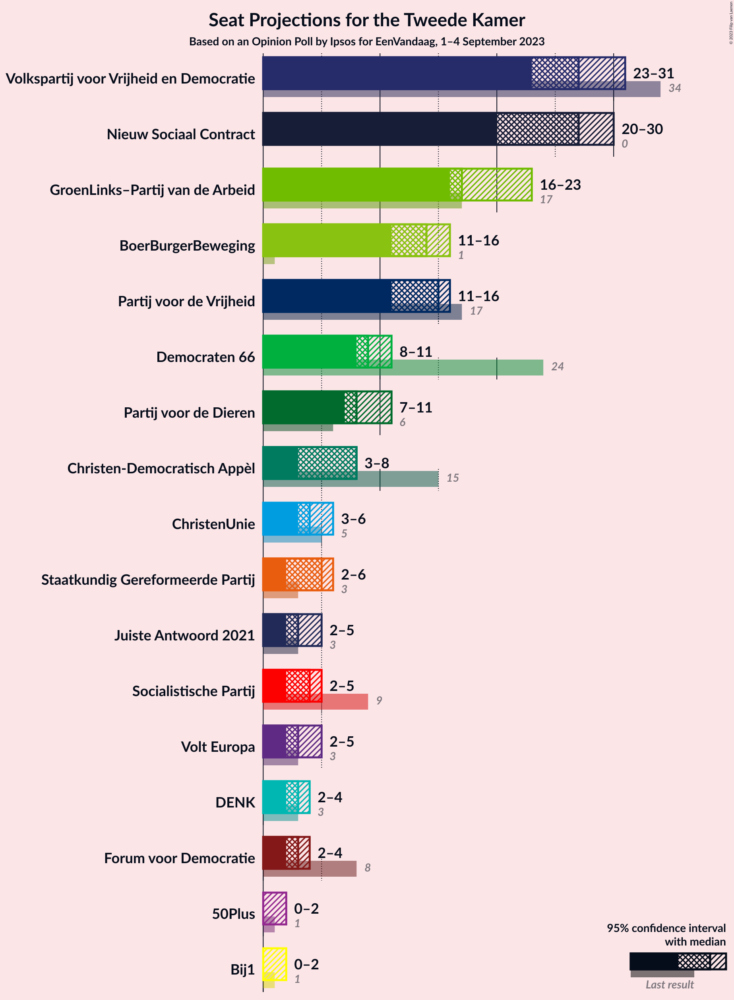

### Confidence Intervals

| Party | Last Result | Median | 80% Confidence Interval | 90% Confidence Interval | 95% Confidence Interval | 99% Confidence Interval |
|:-----:|:-----------:|:------:|:-----------------------:|:-----------------------:|:-----------------------:|:-----------------------:|
| <a href="#nieuw-sociaal-contract">Nieuw Sociaal Contract</a> | 0 | 25 | 25 |23–28 |23–30 |23–31 |
| <a href="#volkspartij-voor-vrijheid-en-democratie">Volkspartij voor Vrijheid en Democratie</a> | 34 | 25 | 25–26 |24–27 |24–31 |20–31 |
| <a href="#groenlinks–partij-van-de-arbeid">GroenLinks–Partij van de Arbeid</a> | 17 | 21 | 19–21 |17–21 |14–24 |14–25 |
| <a href="#partij-voor-de-vrijheid">Partij voor de Vrijheid</a> | 17 | 12 | 12–13 |12–16 |12–16 |11–18 |
| <a href="#boerburgerbeweging">BoerBurgerBeweging</a> | 1 | 14 | 13–14 |12–15 |11–16 |11–18 |
| <a href="#democraten-66">Democraten 66</a> | 24 | 11 | 11 |9–11 |9–11 |7–13 |
| <a href="#partij-voor-de-dieren">Partij voor de Dieren</a> | 6 | 9 | 9–10 |9–11 |9–13 |7–13 |
| <a href="#christen-democratisch-appèl">Christen-Democratisch Appèl</a> | 15 | 6 | 6 |5–6 |4–6 |3–8 |
| <a href="#christenunie">ChristenUnie</a> | 5 | 3 | 3–5 |3–6 |3–6 |2–7 |
| <a href="#staatkundig-gereformeerde-partij">Staatkundig Gereformeerde Partij</a> | 3 | 3 | 3 |3–6 |3–6 |2–6 |
| <a href="#socialistische-partij">Socialistische Partij</a> | 9 | 4 | 3–4 |3–4 |2–5 |2–5 |
| <a href="#volt-europa">Volt Europa</a> | 3 | 3 | 3 |3–4 |2–4 |2–5 |
| <a href="#forum-voor-democratie">Forum voor Democratie</a> | 8 | 3 | 3 |2–3 |2–4 |2–4 |
| <a href="#juiste-antwoord-2021">Juiste Antwoord 2021</a> | 3 | 5 | 3–5 |2–5 |2–5 |1–5 |
| <a href="#denk">DENK</a> | 3 | 3 | 3 |3 |2–4 |1–5 |
| <a href="#bij1">Bij1</a> | 1 | 1 | 0–1 |0–1 |0–1 |0–3 |
| <a href="#50plus">50Plus</a> | 1 | 2 | 0–2 |0–2 |0–2 |0–2 |

### Nieuw Sociaal Contract

*For a full overview of the results for this party, see the [Nieuw Sociaal Contract](party-nieuwsociaalcontract.html) page.*

| Number of Seats | Probability | Accumulated | Special Marks |
|:---------------:|:-----------:|:-----------:|:-------------:|
| 0 | 0% | 100% | Last Result |
| 1 | 0% | 100% |  |
| 2 | 0% | 100% |  |
| 3 | 0% | 100% |  |
| 4 | 0% | 100% |  |
| 5 | 0% | 100% |  |
| 6 | 0% | 100% |  |
| 7 | 0% | 100% |  |
| 8 | 0% | 100% |  |
| 9 | 0% | 100% |  |
| 10 | 0% | 100% |  |
| 11 | 0% | 100% |  |
| 12 | 0% | 100% |  |
| 13 | 0% | 100% |  |
| 14 | 0% | 100% |  |
| 15 | 0% | 100% |  |
| 16 | 0% | 100% |  |
| 17 | 0% | 100% |  |
| 18 | 0% | 100% |  |
| 19 | 0% | 100% |  |
| 20 | 0% | 100% |  |
| 21 | 0% | 100% |  |
| 22 | 0.4% | 99.9% |  |
| 23 | 7% | 99.6% |  |
| 24 | 0.1% | 93% |  |
| 25 | 83% | 93% | Median |
| 26 | 0.3% | 10% |  |
| 27 | 1.2% | 9% |  |
| 28 | 4% | 8% |  |
| 29 | 1.1% | 4% |  |
| 30 | 1.1% | 3% |  |
| 31 | 1.2% | 2% |  |
| 32 | 0.4% | 0.4% |  |
| 33 | 0% | 0% |  |

### Volkspartij voor Vrijheid en Democratie

*For a full overview of the results for this party, see the [Volkspartij voor Vrijheid en Democratie](party-volkspartijvoorvrijheidendemocratie.html) page.*

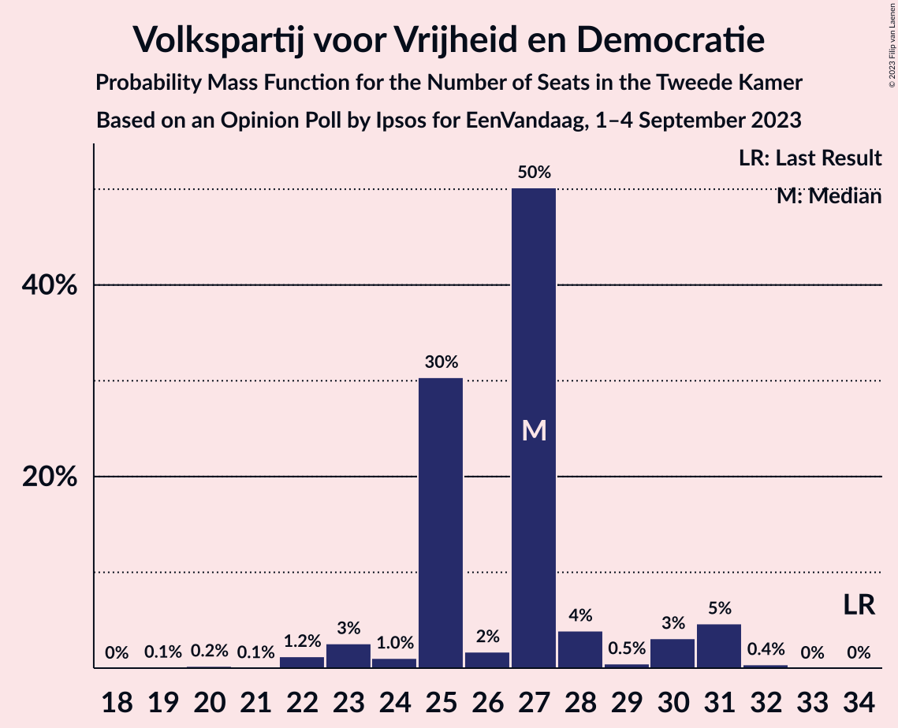

| Number of Seats | Probability | Accumulated | Special Marks |
|:---------------:|:-----------:|:-----------:|:-------------:|
| 20 | 0.6% | 100% |  |
| 21 | 0.2% | 99.4% |  |
| 22 | 0.2% | 99.2% |  |
| 23 | 1.4% | 99.0% |  |
| 24 | 3% | 98% |  |
| 25 | 83% | 94% | Median |
| 26 | 1.1% | 11% |  |
| 27 | 5% | 9% |  |
| 28 | 0.3% | 4% |  |
| 29 | 0% | 4% |  |
| 30 | 0.1% | 4% |  |
| 31 | 4% | 4% |  |
| 32 | 0% | 0.1% |  |
| 33 | 0% | 0.1% |  |
| 34 | 0% | 0% | Last Result |

### GroenLinks–Partij van de Arbeid

*For a full overview of the results for this party, see the [GroenLinks–Partij van de Arbeid](party-groenlinks–partijvandearbeid.html) page.*

| Number of Seats | Probability | Accumulated | Special Marks |
|:---------------:|:-----------:|:-----------:|:-------------:|
| 13 | 0.4% | 100% |  |
| 14 | 4% | 99.6% |  |
| 15 | 0.4% | 96% |  |
| 16 | 0.3% | 96% |  |
| 17 | 2% | 95% | Last Result |
| 18 | 1.2% | 93% |  |
| 19 | 4% | 92% |  |
| 20 | 0.3% | 88% |  |
| 21 | 84% | 88% | Median |
| 22 | 0.9% | 4% |  |
| 23 | 0.5% | 3% |  |
| 24 | 0.1% | 3% |  |
| 25 | 2% | 2% |  |
| 26 | 0% | 0% |  |

### Partij voor de Vrijheid

*For a full overview of the results for this party, see the [Partij voor de Vrijheid](party-partijvoordevrijheid.html) page.*

| Number of Seats | Probability | Accumulated | Special Marks |
|:---------------:|:-----------:|:-----------:|:-------------:|
| 10 | 0.2% | 100% |  |
| 11 | 0.7% | 99.8% |  |
| 12 | 85% | 99.0% | Median |
| 13 | 5% | 14% |  |
| 14 | 2% | 9% |  |
| 15 | 1.4% | 7% |  |
| 16 | 4% | 5% |  |
| 17 | 0.2% | 0.8% | Last Result |
| 18 | 0.5% | 0.6% |  |
| 19 | 0.1% | 0.1% |  |
| 20 | 0% | 0.1% |  |
| 21 | 0% | 0.1% |  |
| 22 | 0.1% | 0.1% |  |
| 23 | 0% | 0% |  |

### BoerBurgerBeweging

*For a full overview of the results for this party, see the [BoerBurgerBeweging](party-boerburgerbeweging.html) page.*

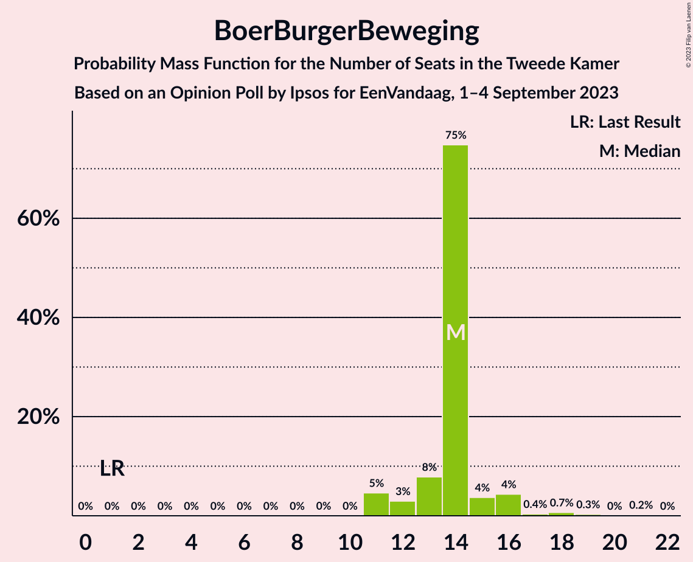

| Number of Seats | Probability | Accumulated | Special Marks |
|:---------------:|:-----------:|:-----------:|:-------------:|
| 1 | 0% | 100% | Last Result |
| 2 | 0% | 100% |  |
| 3 | 0% | 100% |  |
| 4 | 0% | 100% |  |
| 5 | 0% | 100% |  |
| 6 | 0% | 100% |  |
| 7 | 0% | 100% |  |
| 8 | 0% | 100% |  |
| 9 | 0% | 100% |  |
| 10 | 0.1% | 100% |  |
| 11 | 4% | 99.9% |  |
| 12 | 4% | 96% |  |
| 13 | 3% | 92% |  |
| 14 | 83% | 90% | Median |
| 15 | 3% | 6% |  |
| 16 | 2% | 3% |  |
| 17 | 1.1% | 2% |  |
| 18 | 0.5% | 0.6% |  |
| 19 | 0% | 0% |  |

### Democraten 66

*For a full overview of the results for this party, see the [Democraten 66](party-democraten66.html) page.*

| Number of Seats | Probability | Accumulated | Special Marks |
|:---------------:|:-----------:|:-----------:|:-------------:|
| 6 | 0.1% | 100% |  |
| 7 | 1.2% | 99.9% |  |
| 8 | 0.5% | 98.6% |  |
| 9 | 5% | 98% |  |
| 10 | 2% | 93% |  |
| 11 | 89% | 91% | Median |
| 12 | 0.8% | 2% |  |
| 13 | 0.7% | 1.1% |  |
| 14 | 0.1% | 0.4% |  |
| 15 | 0.3% | 0.3% |  |
| 16 | 0% | 0% |  |
| 17 | 0% | 0% |  |
| 18 | 0% | 0% |  |
| 19 | 0% | 0% |  |
| 20 | 0% | 0% |  |
| 21 | 0% | 0% |  |
| 22 | 0% | 0% |  |
| 23 | 0% | 0% |  |
| 24 | 0% | 0% | Last Result |

### Partij voor de Dieren

*For a full overview of the results for this party, see the [Partij voor de Dieren](party-partijvoordedieren.html) page.*

| Number of Seats | Probability | Accumulated | Special Marks |
|:---------------:|:-----------:|:-----------:|:-------------:|
| 5 | 0.2% | 100% |  |
| 6 | 0.2% | 99.8% | Last Result |
| 7 | 1.0% | 99.6% |  |
| 8 | 1.0% | 98.6% |  |
| 9 | 86% | 98% | Median |
| 10 | 5% | 11% |  |
| 11 | 1.1% | 6% |  |
| 12 | 1.1% | 5% |  |
| 13 | 4% | 4% |  |
| 14 | 0% | 0.2% |  |
| 15 | 0.1% | 0.1% |  |
| 16 | 0.1% | 0.1% |  |
| 17 | 0% | 0% |  |

### Christen-Democratisch Appèl

*For a full overview of the results for this party, see the [Christen-Democratisch Appèl](party-christen-democratischappèl.html) page.*

| Number of Seats | Probability | Accumulated | Special Marks |
|:---------------:|:-----------:|:-----------:|:-------------:|
| 3 | 1.0% | 100% |  |
| 4 | 2% | 99.0% |  |
| 5 | 3% | 97% |  |
| 6 | 93% | 95% | Median |
| 7 | 0.4% | 1.4% |  |
| 8 | 1.0% | 1.1% |  |
| 9 | 0.1% | 0.1% |  |
| 10 | 0% | 0% |  |
| 11 | 0% | 0% |  |
| 12 | 0% | 0% |  |
| 13 | 0% | 0% |  |
| 14 | 0% | 0% |  |
| 15 | 0% | 0% | Last Result |

### ChristenUnie

*For a full overview of the results for this party, see the [ChristenUnie](party-christenunie.html) page.*

| Number of Seats | Probability | Accumulated | Special Marks |
|:---------------:|:-----------:|:-----------:|:-------------:|
| 2 | 0.6% | 100% |  |
| 3 | 88% | 99.4% | Median |
| 4 | 1.2% | 11% |  |
| 5 | 5% | 10% | Last Result |
| 6 | 5% | 6% |  |
| 7 | 0.3% | 0.7% |  |
| 8 | 0.3% | 0.3% |  |
| 9 | 0% | 0% |  |

### Staatkundig Gereformeerde Partij

*For a full overview of the results for this party, see the [Staatkundig Gereformeerde Partij](party-staatkundiggereformeerdepartij.html) page.*

| Number of Seats | Probability | Accumulated | Special Marks |
|:---------------:|:-----------:|:-----------:|:-------------:|
| 1 | 0.2% | 100% |  |
| 2 | 2% | 99.8% |  |
| 3 | 89% | 98% | Last Result, Median |
| 4 | 2% | 10% |  |
| 5 | 2% | 8% |  |
| 6 | 6% | 6% |  |
| 7 | 0% | 0% |  |

### Socialistische Partij

*For a full overview of the results for this party, see the [Socialistische Partij](party-socialistischepartij.html) page.*

| Number of Seats | Probability | Accumulated | Special Marks |
|:---------------:|:-----------:|:-----------:|:-------------:|
| 2 | 4% | 100% |  |
| 3 | 6% | 95% |  |
| 4 | 85% | 90% | Median |
| 5 | 4% | 4% |  |
| 6 | 0.4% | 0.4% |  |
| 7 | 0% | 0% |  |
| 8 | 0% | 0% |  |
| 9 | 0% | 0% | Last Result |

### Volt Europa

*For a full overview of the results for this party, see the [Volt Europa](party-volteuropa.html) page.*

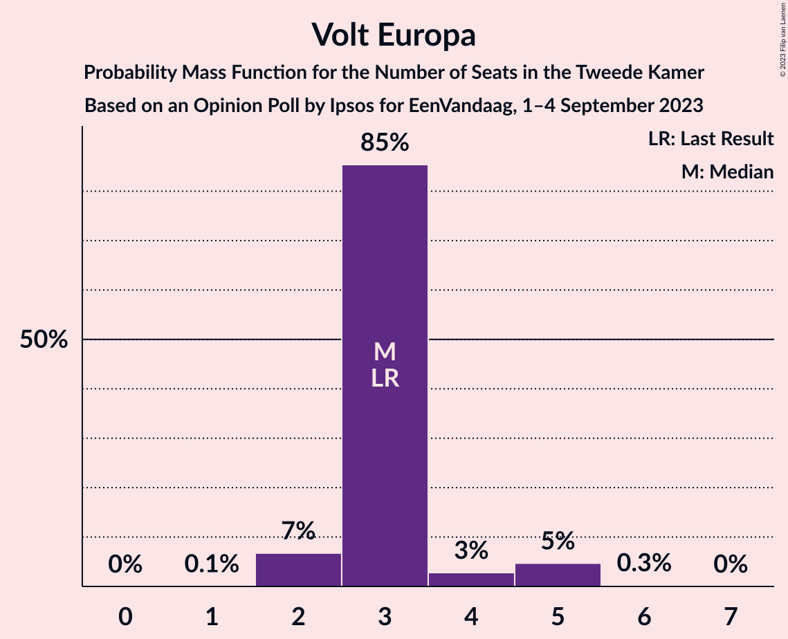

| Number of Seats | Probability | Accumulated | Special Marks |
|:---------------:|:-----------:|:-----------:|:-------------:|
| 1 | 0.1% | 100% |  |
| 2 | 3% | 99.9% |  |
| 3 | 91% | 97% | Last Result, Median |
| 4 | 5% | 6% |  |
| 5 | 0.9% | 1.1% |  |
| 6 | 0.2% | 0.2% |  |
| 7 | 0% | 0% |  |

### Forum voor Democratie

*For a full overview of the results for this party, see the [Forum voor Democratie](party-forumvoordemocratie.html) page.*

| Number of Seats | Probability | Accumulated | Special Marks |
|:---------------:|:-----------:|:-----------:|:-------------:|
| 1 | 0.2% | 100% |  |
| 2 | 7% | 99.8% |  |
| 3 | 89% | 93% | Median |
| 4 | 4% | 4% |  |
| 5 | 0.2% | 0.3% |  |
| 6 | 0.1% | 0.1% |  |
| 7 | 0% | 0% |  |
| 8 | 0% | 0% | Last Result |

### Juiste Antwoord 2021

*For a full overview of the results for this party, see the [Juiste Antwoord 2021](party-juisteantwoord2021.html) page.*

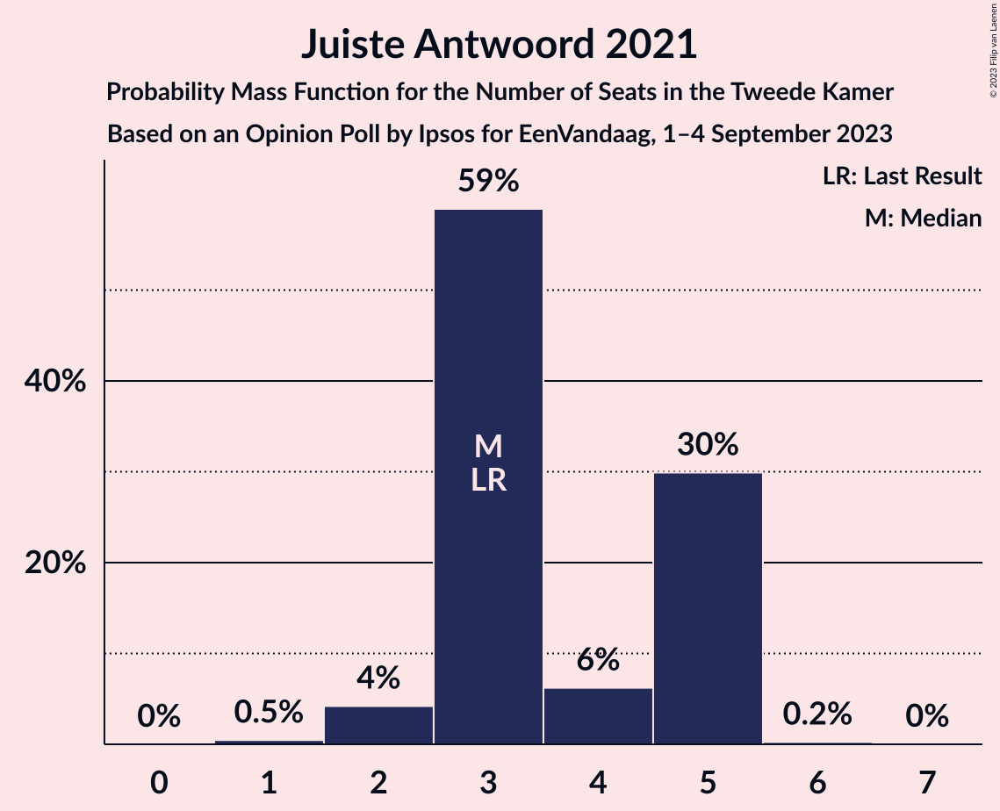

| Number of Seats | Probability | Accumulated | Special Marks |
|:---------------:|:-----------:|:-----------:|:-------------:|
| 1 | 0.9% | 100% |  |
| 2 | 5% | 99.1% |  |
| 3 | 5% | 94% | Last Result |
| 4 | 5% | 89% |  |
| 5 | 84% | 84% | Median |
| 6 | 0.1% | 0.1% |  |
| 7 | 0% | 0% |  |

### DENK

*For a full overview of the results for this party, see the [DENK](party-denk.html) page.*

| Number of Seats | Probability | Accumulated | Special Marks |
|:---------------:|:-----------:|:-----------:|:-------------:|
| 1 | 2% | 100% |  |
| 2 | 3% | 98% |  |
| 3 | 92% | 96% | Last Result, Median |
| 4 | 2% | 3% |  |
| 5 | 1.5% | 2% |  |
| 6 | 0.2% | 0.3% |  |
| 7 | 0% | 0% |  |

### Bij1

*For a full overview of the results for this party, see the [Bij1](party-bij1.html) page.*

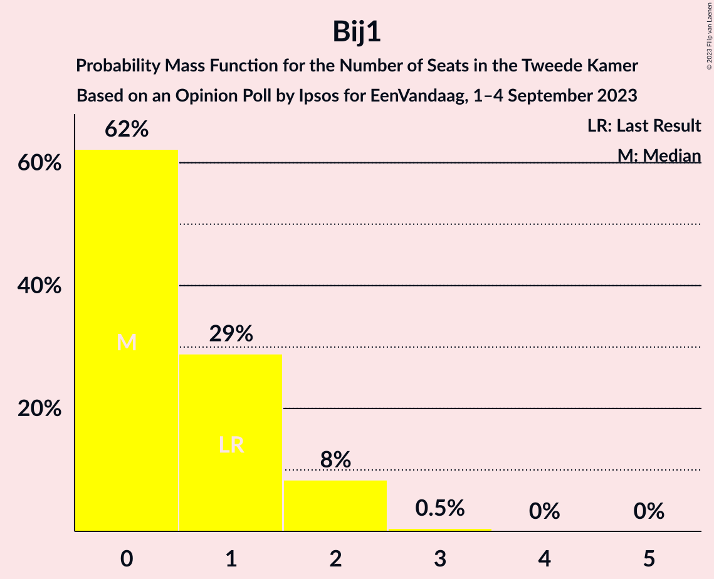

| Number of Seats | Probability | Accumulated | Special Marks |
|:---------------:|:-----------:|:-----------:|:-------------:|
| 0 | 13% | 100% |  |
| 1 | 86% | 87% | Last Result, Median |
| 2 | 0.2% | 0.8% |  |
| 3 | 0.5% | 0.5% |  |
| 4 | 0% | 0% |  |

### 50Plus

*For a full overview of the results for this party, see the [50Plus](party-50plus.html) page.*

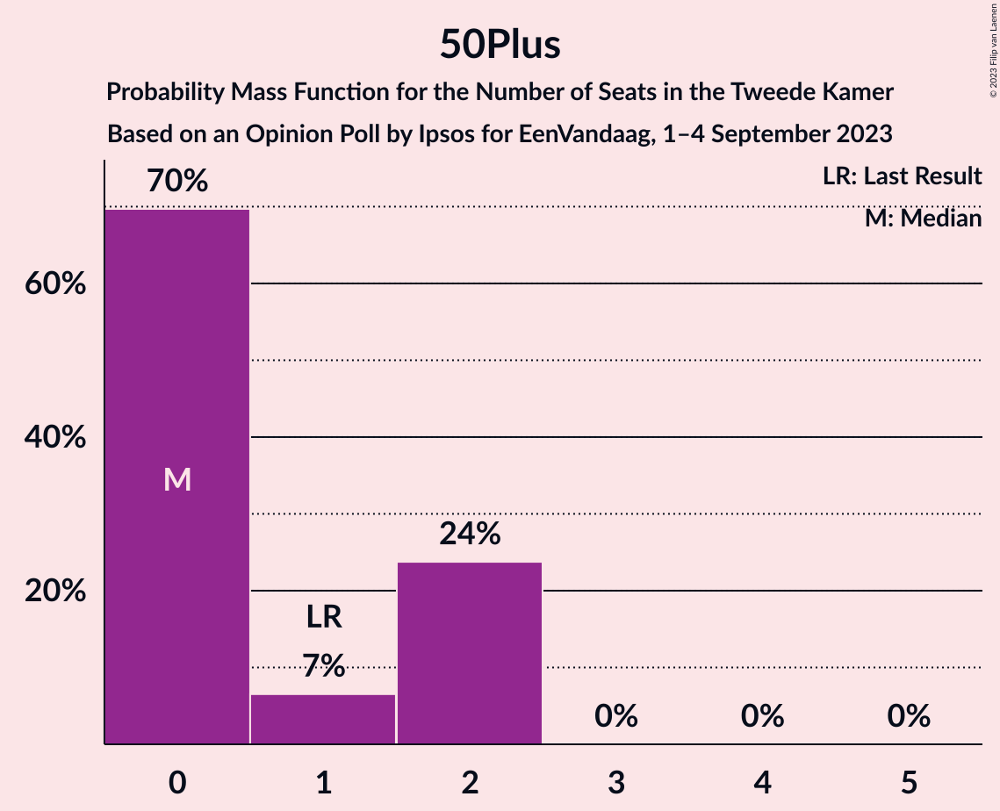

| Number of Seats | Probability | Accumulated | Special Marks |
|:---------------:|:-----------:|:-----------:|:-------------:|
| 0 | 12% | 100% |  |
| 1 | 4% | 88% | Last Result |
| 2 | 84% | 84% | Median |
| 3 | 0% | 0% |  |

## Coalitions

### Confidence Intervals

| Coalition | Last Result | Median | Majority? | 80% Confidence Interval | 90% Confidence Interval | 95% Confidence Interval | 99% Confidence Interval |
|:---------:|:-----------:|:------:|:---------:|:-----------------------:|:-----------------------:|:-----------------------:|:-----------------------:|
| Volkspartij voor Vrijheid en Democratie – GroenLinks–Partij van de Arbeid – BoerBurgerBeweging – Christen-Democratisch Appèl | 67 | 66 | 0% | 65–66 | 61–68 | 58–70 | 58–74 |
| Volkspartij voor Vrijheid en Democratie – GroenLinks–Partij van de Arbeid – BoerBurgerBeweging | 52 | 60 | 0% | 60 | 56–62 | 52–64 | 52–71 |
| Volkspartij voor Vrijheid en Democratie – GroenLinks–Partij van de Arbeid – Democraten 66 | 75 | 57 | 0% | 56–57 | 50–60 | 50–61 | 48–69 |
| Volkspartij voor Vrijheid en Democratie – Partij voor de Vrijheid – Christen-Democratisch Appèl – Staatkundig Gereformeerde Partij – Forum voor Democratie | 77 | 49 | 0% | 49–52 | 49–55 | 49–58 | 47–58 |
| Volkspartij voor Vrijheid en Democratie – GroenLinks–Partij van de Arbeid – Christen-Democratisch Appèl | 66 | 52 | 0% | 51–52 | 47–55 | 47–56 | 44–59 |
| Volkspartij voor Vrijheid en Democratie – Partij voor de Vrijheid – Christen-Democratisch Appèl – Forum voor Democratie | 74 | 46 | 0% | 46–48 | 46–52 | 45–52 | 44–52 |
| Volkspartij voor Vrijheid en Democratie – Democraten 66 – Christen-Democratisch Appèl – ChristenUnie | 78 | 45 | 0% | 45–47 | 45–48 | 43–51 | 41–51 |
| Volkspartij voor Vrijheid en Democratie – Partij voor de Vrijheid – Christen-Democratisch Appèl | 66 | 43 | 0% | 43–46 | 43–49 | 42–50 | 41–50 |
| Volkspartij voor Vrijheid en Democratie – GroenLinks–Partij van de Arbeid | 51 | 46 | 0% | 45–46 | 41–49 | 41–50 | 38–56 |
| Volkspartij voor Vrijheid en Democratie – BoerBurgerBeweging – Christen-Democratisch Appèl | 50 | 45 | 0% | 45 | 44–48 | 44–49 | 42–49 |
| Volkspartij voor Vrijheid en Democratie – Democraten 66 – Christen-Democratisch Appèl | 73 | 42 | 0% | 42 | 40–43 | 38–48 | 37–48 |
| GroenLinks–Partij van de Arbeid – Democraten 66 – Christen-Democratisch Appèl – ChristenUnie – Socialistische Partij | 70 | 45 | 0% | 42–45 | 39–45 | 39–47 | 37–50 |
| Volkspartij voor Vrijheid en Democratie – Christen-Democratisch Appèl – Staatkundig Gereformeerde Partij – Forum voor Democratie – 50Plus | 61 | 39 | 0% | 39 | 38–40 | 36–46 | 34–46 |
| Volkspartij voor Vrijheid en Democratie – Christen-Democratisch Appèl – Staatkundig Gereformeerde Partij – Forum voor Democratie | 60 | 37 | 0% | 37–39 | 37–40 | 35–45 | 34–45 |
| GroenLinks–Partij van de Arbeid – Democraten 66 – Christen-Democratisch Appèl – ChristenUnie | 61 | 41 | 0% | 39–41 | 35–42 | 34–45 | 34–48 |
| Volkspartij voor Vrijheid en Democratie – Christen-Democratisch Appèl – Forum voor Democratie – 50Plus | 58 | 36 | 0% | 36 | 34–36 | 33–40 | 31–40 |
| GroenLinks–Partij van de Arbeid – Democraten 66 – Christen-Democratisch Appèl | 56 | 38 | 0% | 36–38 | 29–38 | 29–40 | 29–42 |
| Volkspartij voor Vrijheid en Democratie – Christen-Democratisch Appèl – Forum voor Democratie | 57 | 34 | 0% | 34 | 34–36 | 32–39 | 30–39 |
| GroenLinks–Partij van de Arbeid – BoerBurgerBeweging | 18 | 35 | 0% | 32–35 | 30–35 | 25–39 | 25–40 |
| Volkspartij voor Vrijheid en Democratie – Christen-Democratisch Appèl | 49 | 31 | 0% | 31 | 30–33 | 28–37 | 28–37 |
| GroenLinks–Partij van de Arbeid – Christen-Democratisch Appèl – ChristenUnie | 37 | 30 | 0% | 28–30 | 26–31 | 25–33 | 24–37 |
| GroenLinks–Partij van de Arbeid – Christen-Democratisch Appèl | 32 | 27 | 0% | 25–27 | 22–27 | 20–28 | 20–31 |
| Democraten 66 – Christen-Democratisch Appèl | 39 | 17 | 0% | 17 | 15–17 | 14–17 | 12–19 |

### Volkspartij voor Vrijheid en Democratie – GroenLinks–Partij van de Arbeid – BoerBurgerBeweging – Christen-Democratisch Appèl

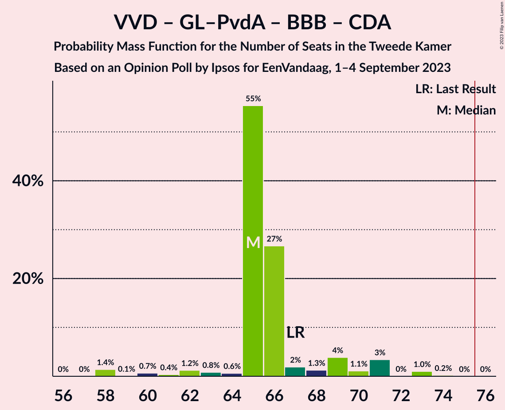

| Number of Seats | Probability | Accumulated | Special Marks |
|:---------------:|:-----------:|:-----------:|:-------------:|
| 58 | 4% | 100% |  |
| 59 | 0.1% | 96% |  |
| 60 | 0.6% | 96% |  |
| 61 | 0.8% | 96% |  |
| 62 | 2% | 95% |  |
| 63 | 0.7% | 93% |  |
| 64 | 1.3% | 92% |  |
| 65 | 1.2% | 91% |  |
| 66 | 83% | 89% | Median |
| 67 | 0.2% | 7% | Last Result |
| 68 | 3% | 6% |  |
| 69 | 0.1% | 3% |  |
| 70 | 2% | 3% |  |
| 71 | 0.3% | 1.0% |  |
| 72 | 0.1% | 0.8% |  |
| 73 | 0% | 0.7% |  |
| 74 | 0.6% | 0.6% |  |
| 75 | 0% | 0% |  |

### Volkspartij voor Vrijheid en Democratie – GroenLinks–Partij van de Arbeid – BoerBurgerBeweging

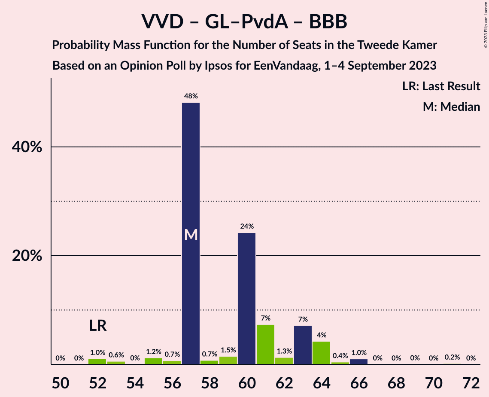

| Number of Seats | Probability | Accumulated | Special Marks |
|:---------------:|:-----------:|:-----------:|:-------------:|
| 52 | 4% | 100% | Last Result |
| 53 | 0.7% | 96% |  |
| 54 | 0% | 96% |  |
| 55 | 0.6% | 96% |  |
| 56 | 0.8% | 95% |  |
| 57 | 2% | 94% |  |
| 58 | 2% | 92% |  |
| 59 | 0% | 91% |  |
| 60 | 83% | 91% | Median |
| 61 | 1.1% | 8% |  |
| 62 | 3% | 6% |  |
| 63 | 0.4% | 3% |  |
| 64 | 2% | 3% |  |
| 65 | 0.1% | 0.9% |  |
| 66 | 0.1% | 0.8% |  |
| 67 | 0% | 0.7% |  |
| 68 | 0% | 0.7% |  |
| 69 | 0% | 0.6% |  |
| 70 | 0% | 0.6% |  |
| 71 | 0.6% | 0.6% |  |
| 72 | 0% | 0% |  |

### Volkspartij voor Vrijheid en Democratie – GroenLinks–Partij van de Arbeid – Democraten 66

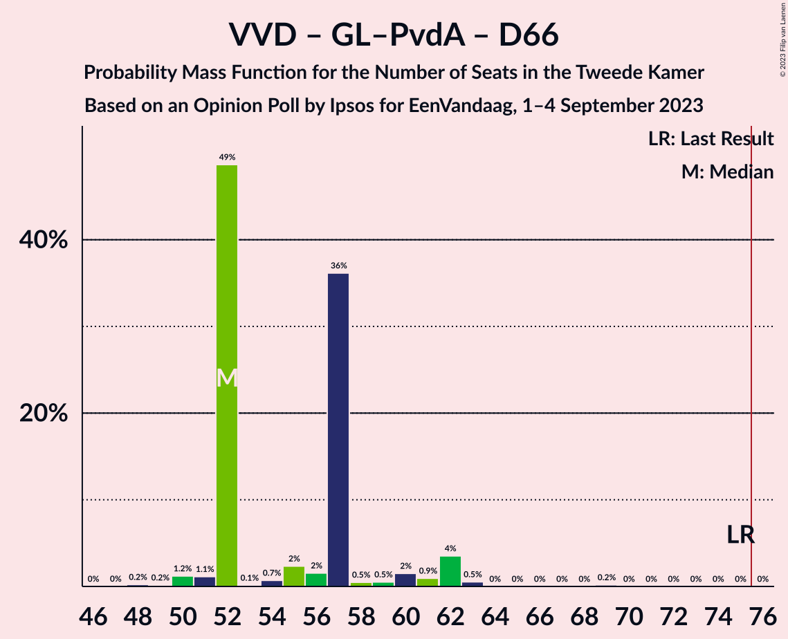

| Number of Seats | Probability | Accumulated | Special Marks |
|:---------------:|:-----------:|:-----------:|:-------------:|
| 47 | 0% | 100% |  |
| 48 | 0.7% | 99.9% |  |
| 49 | 0.5% | 99.2% |  |
| 50 | 4% | 98.7% |  |
| 51 | 2% | 95% |  |
| 52 | 0.4% | 93% |  |
| 53 | 0.2% | 93% |  |
| 54 | 0.7% | 92% |  |
| 55 | 2% | 92% |  |
| 56 | 0.8% | 90% |  |
| 57 | 83% | 89% | Median |
| 58 | 0.2% | 6% |  |
| 59 | 0.2% | 6% |  |
| 60 | 2% | 6% |  |
| 61 | 3% | 4% |  |
| 62 | 0.1% | 0.8% |  |
| 63 | 0.1% | 0.8% |  |
| 64 | 0% | 0.7% |  |
| 65 | 0% | 0.7% |  |
| 66 | 0% | 0.7% |  |
| 67 | 0% | 0.6% |  |
| 68 | 0% | 0.6% |  |
| 69 | 0.6% | 0.6% |  |
| 70 | 0% | 0% |  |
| 71 | 0% | 0% |  |
| 72 | 0% | 0% |  |
| 73 | 0% | 0% |  |
| 74 | 0% | 0% |  |
| 75 | 0% | 0% | Last Result |

### Volkspartij voor Vrijheid en Democratie – Partij voor de Vrijheid – Christen-Democratisch Appèl – Staatkundig Gereformeerde Partij – Forum voor Democratie

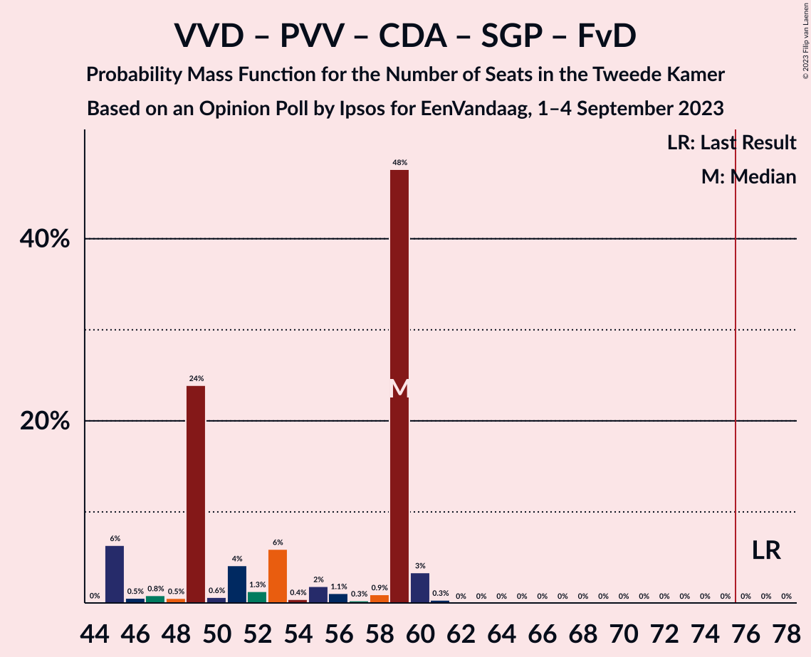

| Number of Seats | Probability | Accumulated | Special Marks |
|:---------------:|:-----------:|:-----------:|:-------------:|
| 44 | 0.2% | 100% |  |
| 45 | 0% | 99.8% |  |
| 46 | 0.1% | 99.8% |  |
| 47 | 0.6% | 99.7% |  |
| 48 | 0.5% | 99.1% |  |
| 49 | 84% | 98.6% | Median |
| 50 | 0.8% | 15% |  |
| 51 | 2% | 14% |  |
| 52 | 2% | 12% |  |
| 53 | 1.3% | 10% |  |
| 54 | 0.7% | 8% |  |
| 55 | 4% | 8% |  |
| 56 | 0.1% | 4% |  |
| 57 | 0.1% | 3% |  |
| 58 | 3% | 3% |  |
| 59 | 0% | 0% |  |
| 60 | 0% | 0% |  |
| 61 | 0% | 0% |  |
| 62 | 0% | 0% |  |
| 63 | 0% | 0% |  |
| 64 | 0% | 0% |  |
| 65 | 0% | 0% |  |
| 66 | 0% | 0% |  |
| 67 | 0% | 0% |  |
| 68 | 0% | 0% |  |
| 69 | 0% | 0% |  |
| 70 | 0% | 0% |  |
| 71 | 0% | 0% |  |
| 72 | 0% | 0% |  |
| 73 | 0% | 0% |  |
| 74 | 0% | 0% |  |
| 75 | 0% | 0% |  |
| 76 | 0% | 0% | Majority |
| 77 | 0% | 0% | Last Result |

### Volkspartij voor Vrijheid en Democratie – GroenLinks–Partij van de Arbeid – Christen-Democratisch Appèl

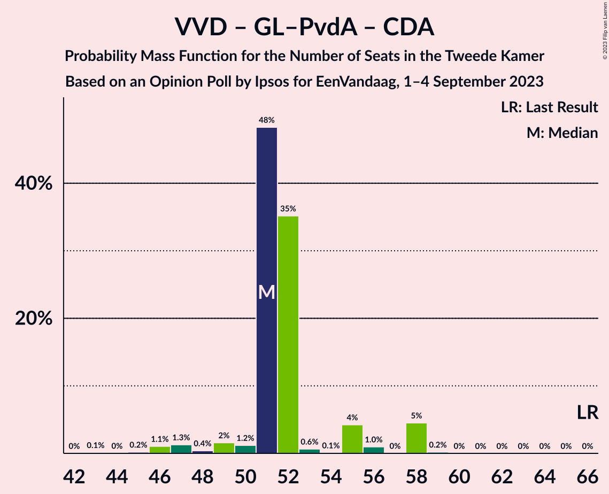

| Number of Seats | Probability | Accumulated | Special Marks |
|:---------------:|:-----------:|:-----------:|:-------------:|
| 43 | 0.4% | 100% |  |
| 44 | 0% | 99.5% |  |
| 45 | 0.6% | 99.5% |  |
| 46 | 1.0% | 98.9% |  |
| 47 | 4% | 98% |  |
| 48 | 0.9% | 94% |  |
| 49 | 2% | 93% |  |
| 50 | 0.8% | 91% |  |
| 51 | 0.7% | 90% |  |
| 52 | 83% | 89% | Median |
| 53 | 0.3% | 7% |  |
| 54 | 0.3% | 6% |  |
| 55 | 2% | 6% |  |
| 56 | 3% | 4% |  |
| 57 | 0% | 0.8% |  |
| 58 | 0.1% | 0.8% |  |
| 59 | 0.7% | 0.7% |  |
| 60 | 0% | 0% |  |
| 61 | 0% | 0% |  |
| 62 | 0% | 0% |  |
| 63 | 0% | 0% |  |
| 64 | 0% | 0% |  |
| 65 | 0% | 0% |  |
| 66 | 0% | 0% | Last Result |

### Volkspartij voor Vrijheid en Democratie – Partij voor de Vrijheid – Christen-Democratisch Appèl – Forum voor Democratie

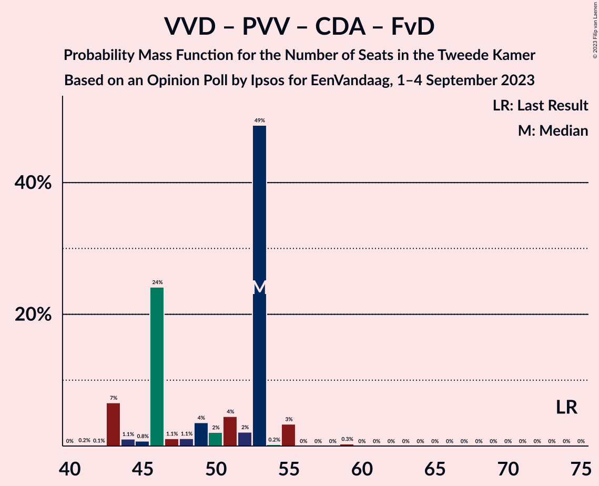

| Number of Seats | Probability | Accumulated | Special Marks |
|:---------------:|:-----------:|:-----------:|:-------------:|
| 41 | 0.1% | 100% |  |
| 42 | 0.1% | 99.8% |  |
| 43 | 0% | 99.7% |  |
| 44 | 2% | 99.7% |  |
| 45 | 0.8% | 98% |  |
| 46 | 85% | 97% | Median |
| 47 | 1.0% | 13% |  |
| 48 | 2% | 11% |  |
| 49 | 1.0% | 9% |  |
| 50 | 0.2% | 8% |  |
| 51 | 0.7% | 8% |  |
| 52 | 7% | 7% |  |
| 53 | 0.2% | 0.4% |  |
| 54 | 0.1% | 0.1% |  |
| 55 | 0% | 0.1% |  |
| 56 | 0% | 0% |  |
| 57 | 0% | 0% |  |
| 58 | 0% | 0% |  |
| 59 | 0% | 0% |  |
| 60 | 0% | 0% |  |
| 61 | 0% | 0% |  |
| 62 | 0% | 0% |  |
| 63 | 0% | 0% |  |
| 64 | 0% | 0% |  |
| 65 | 0% | 0% |  |
| 66 | 0% | 0% |  |
| 67 | 0% | 0% |  |
| 68 | 0% | 0% |  |
| 69 | 0% | 0% |  |
| 70 | 0% | 0% |  |
| 71 | 0% | 0% |  |
| 72 | 0% | 0% |  |
| 73 | 0% | 0% |  |
| 74 | 0% | 0% | Last Result |

### Volkspartij voor Vrijheid en Democratie – Democraten 66 – Christen-Democratisch Appèl – ChristenUnie

| Number of Seats | Probability | Accumulated | Special Marks |
|:---------------:|:-----------:|:-----------:|:-------------:|
| 40 | 0.2% | 100% |  |
| 41 | 0.9% | 99.8% |  |
| 42 | 0.1% | 98.9% |  |
| 43 | 1.4% | 98.8% |  |
| 44 | 2% | 97% |  |
| 45 | 84% | 96% | Median |
| 46 | 0.3% | 12% |  |
| 47 | 6% | 11% |  |
| 48 | 0.5% | 5% |  |
| 49 | 0.5% | 5% |  |
| 50 | 0.1% | 4% |  |
| 51 | 4% | 4% |  |
| 52 | 0.1% | 0.2% |  |
| 53 | 0% | 0.1% |  |
| 54 | 0.1% | 0.1% |  |
| 55 | 0% | 0% |  |
| 56 | 0% | 0% |  |
| 57 | 0% | 0% |  |
| 58 | 0% | 0% |  |
| 59 | 0% | 0% |  |
| 60 | 0% | 0% |  |
| 61 | 0% | 0% |  |
| 62 | 0% | 0% |  |
| 63 | 0% | 0% |  |
| 64 | 0% | 0% |  |
| 65 | 0% | 0% |  |
| 66 | 0% | 0% |  |
| 67 | 0% | 0% |  |
| 68 | 0% | 0% |  |
| 69 | 0% | 0% |  |
| 70 | 0% | 0% |  |
| 71 | 0% | 0% |  |
| 72 | 0% | 0% |  |
| 73 | 0% | 0% |  |
| 74 | 0% | 0% |  |
| 75 | 0% | 0% |  |
| 76 | 0% | 0% | Majority |
| 77 | 0% | 0% |  |
| 78 | 0% | 0% | Last Result |

### Volkspartij voor Vrijheid en Democratie – Partij voor de Vrijheid – Christen-Democratisch Appèl

| Number of Seats | Probability | Accumulated | Special Marks |
|:---------------:|:-----------:|:-----------:|:-------------:|
| 38 | 0.1% | 100% |  |
| 39 | 0.1% | 99.8% |  |
| 40 | 0.1% | 99.7% |  |
| 41 | 1.5% | 99.7% |  |
| 42 | 2% | 98% |  |
| 43 | 84% | 96% | Median |
| 44 | 0.8% | 12% |  |
| 45 | 0.9% | 11% |  |
| 46 | 2% | 10% |  |
| 47 | 0.6% | 9% |  |
| 48 | 0.3% | 8% |  |
| 49 | 4% | 8% |  |
| 50 | 3% | 3% |  |
| 51 | 0.1% | 0.1% |  |
| 52 | 0% | 0.1% |  |
| 53 | 0% | 0% |  |
| 54 | 0% | 0% |  |
| 55 | 0% | 0% |  |
| 56 | 0% | 0% |  |
| 57 | 0% | 0% |  |
| 58 | 0% | 0% |  |
| 59 | 0% | 0% |  |
| 60 | 0% | 0% |  |
| 61 | 0% | 0% |  |
| 62 | 0% | 0% |  |
| 63 | 0% | 0% |  |
| 64 | 0% | 0% |  |
| 65 | 0% | 0% |  |
| 66 | 0% | 0% | Last Result |

### Volkspartij voor Vrijheid en Democratie – GroenLinks–Partij van de Arbeid

| Number of Seats | Probability | Accumulated | Special Marks |
|:---------------:|:-----------:|:-----------:|:-------------:|
| 38 | 0.6% | 100% |  |
| 39 | 0.4% | 99.3% |  |
| 40 | 1.1% | 98.9% |  |
| 41 | 4% | 98% |  |
| 42 | 0.5% | 94% |  |
| 43 | 0.6% | 94% |  |
| 44 | 1.2% | 93% |  |
| 45 | 2% | 92% |  |
| 46 | 83% | 90% | Median |
| 47 | 0.7% | 7% |  |
| 48 | 0.3% | 6% |  |
| 49 | 2% | 6% |  |
| 50 | 3% | 4% |  |
| 51 | 0% | 0.8% | Last Result |
| 52 | 0.1% | 0.8% |  |
| 53 | 0% | 0.7% |  |
| 54 | 0% | 0.7% |  |
| 55 | 0% | 0.6% |  |
| 56 | 0.6% | 0.6% |  |
| 57 | 0% | 0% |  |

### Volkspartij voor Vrijheid en Democratie – BoerBurgerBeweging – Christen-Democratisch Appèl

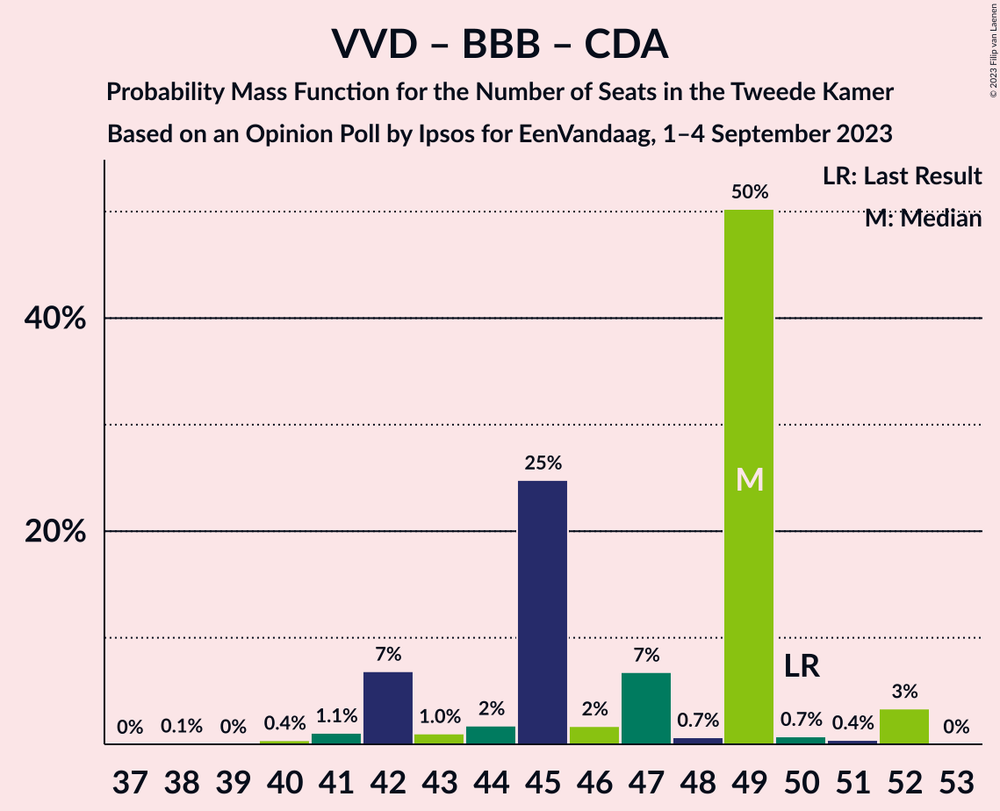

| Number of Seats | Probability | Accumulated | Special Marks |
|:---------------:|:-----------:|:-----------:|:-------------:|
| 38 | 0.1% | 100% |  |
| 39 | 0.1% | 99.9% |  |
| 40 | 0.1% | 99.8% |  |
| 41 | 0.1% | 99.7% |  |
| 42 | 0.7% | 99.6% |  |
| 43 | 1.1% | 98.9% |  |
| 44 | 6% | 98% |  |
| 45 | 86% | 92% | Median |
| 46 | 0.3% | 6% |  |
| 47 | 0.5% | 6% |  |
| 48 | 0.4% | 5% |  |
| 49 | 5% | 5% |  |
| 50 | 0.1% | 0.2% | Last Result |
| 51 | 0.1% | 0.1% |  |
| 52 | 0% | 0.1% |  |
| 53 | 0% | 0% |  |

### Volkspartij voor Vrijheid en Democratie – Democraten 66 – Christen-Democratisch Appèl

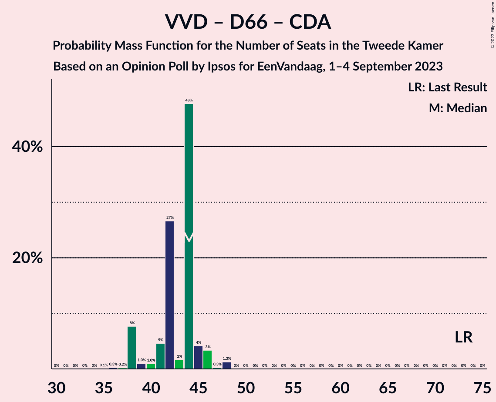

| Number of Seats | Probability | Accumulated | Special Marks |
|:---------------:|:-----------:|:-----------:|:-------------:|
| 35 | 0.2% | 100% |  |
| 36 | 0.2% | 99.8% |  |
| 37 | 0.4% | 99.6% |  |
| 38 | 2% | 99.3% |  |
| 39 | 2% | 97% |  |
| 40 | 2% | 96% |  |
| 41 | 2% | 94% |  |
| 42 | 86% | 92% | Median |
| 43 | 0.7% | 6% |  |
| 44 | 0.3% | 5% |  |
| 45 | 0.4% | 5% |  |
| 46 | 0.1% | 4% |  |
| 47 | 0.7% | 4% |  |
| 48 | 3% | 3% |  |
| 49 | 0% | 0.1% |  |
| 50 | 0% | 0% |  |
| 51 | 0% | 0% |  |
| 52 | 0% | 0% |  |
| 53 | 0% | 0% |  |
| 54 | 0% | 0% |  |
| 55 | 0% | 0% |  |
| 56 | 0% | 0% |  |
| 57 | 0% | 0% |  |
| 58 | 0% | 0% |  |
| 59 | 0% | 0% |  |
| 60 | 0% | 0% |  |
| 61 | 0% | 0% |  |
| 62 | 0% | 0% |  |
| 63 | 0% | 0% |  |
| 64 | 0% | 0% |  |
| 65 | 0% | 0% |  |
| 66 | 0% | 0% |  |
| 67 | 0% | 0% |  |
| 68 | 0% | 0% |  |
| 69 | 0% | 0% |  |
| 70 | 0% | 0% |  |
| 71 | 0% | 0% |  |
| 72 | 0% | 0% |  |
| 73 | 0% | 0% | Last Result |

### GroenLinks–Partij van de Arbeid – Democraten 66 – Christen-Democratisch Appèl – ChristenUnie – Socialistische Partij

| Number of Seats | Probability | Accumulated | Special Marks |
|:---------------:|:-----------:|:-----------:|:-------------:|
| 35 | 0.4% | 100% |  |
| 36 | 0.1% | 99.6% |  |
| 37 | 1.1% | 99.5% |  |
| 38 | 0.1% | 98% |  |
| 39 | 5% | 98% |  |
| 40 | 0.5% | 94% |  |
| 41 | 0.6% | 93% |  |
| 42 | 4% | 93% |  |
| 43 | 0.3% | 89% |  |
| 44 | 0.3% | 89% |  |
| 45 | 84% | 88% | Median |
| 46 | 0.9% | 4% |  |
| 47 | 0.9% | 3% |  |
| 48 | 0.5% | 2% |  |
| 49 | 0% | 2% |  |
| 50 | 2% | 2% |  |
| 51 | 0.1% | 0.1% |  |
| 52 | 0% | 0% |  |
| 53 | 0% | 0% |  |
| 54 | 0% | 0% |  |
| 55 | 0% | 0% |  |
| 56 | 0% | 0% |  |
| 57 | 0% | 0% |  |
| 58 | 0% | 0% |  |
| 59 | 0% | 0% |  |
| 60 | 0% | 0% |  |
| 61 | 0% | 0% |  |
| 62 | 0% | 0% |  |
| 63 | 0% | 0% |  |
| 64 | 0% | 0% |  |
| 65 | 0% | 0% |  |
| 66 | 0% | 0% |  |
| 67 | 0% | 0% |  |
| 68 | 0% | 0% |  |
| 69 | 0% | 0% |  |
| 70 | 0% | 0% | Last Result |

### Volkspartij voor Vrijheid en Democratie – Christen-Democratisch Appèl – Staatkundig Gereformeerde Partij – Forum voor Democratie – 50Plus

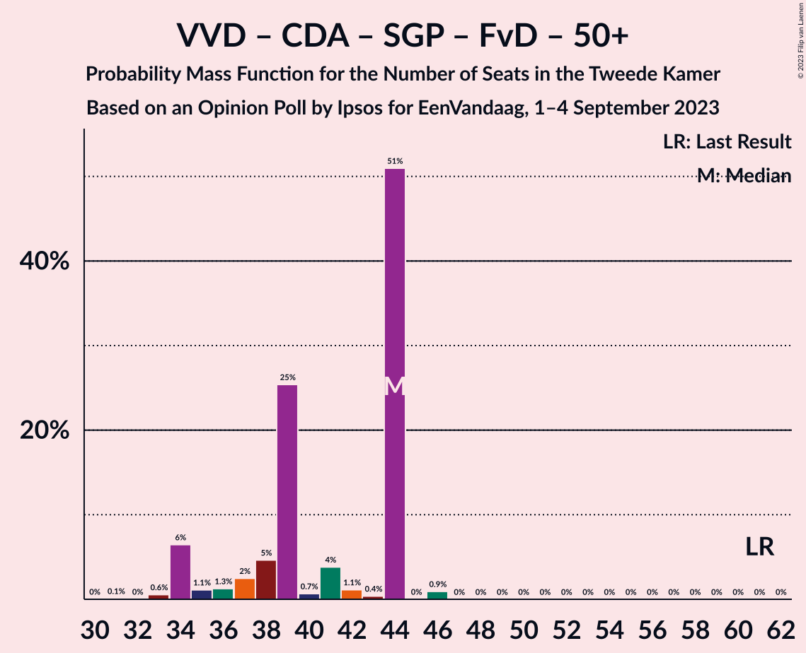

| Number of Seats | Probability | Accumulated | Special Marks |
|:---------------:|:-----------:|:-----------:|:-------------:|
| 30 | 0.1% | 100% |  |
| 31 | 0% | 99.9% |  |
| 32 | 0.1% | 99.9% |  |
| 33 | 0.1% | 99.8% |  |
| 34 | 0.7% | 99.8% |  |
| 35 | 0.8% | 99.1% |  |
| 36 | 2% | 98% |  |
| 37 | 1.1% | 97% |  |
| 38 | 1.4% | 96% |  |
| 39 | 88% | 94% | Median |
| 40 | 2% | 6% |  |
| 41 | 0.8% | 4% |  |
| 42 | 0.2% | 4% |  |
| 43 | 0.2% | 3% |  |
| 44 | 0% | 3% |  |
| 45 | 0% | 3% |  |
| 46 | 3% | 3% |  |
| 47 | 0% | 0% |  |
| 48 | 0% | 0% |  |
| 49 | 0% | 0% |  |
| 50 | 0% | 0% |  |
| 51 | 0% | 0% |  |
| 52 | 0% | 0% |  |
| 53 | 0% | 0% |  |
| 54 | 0% | 0% |  |
| 55 | 0% | 0% |  |
| 56 | 0% | 0% |  |
| 57 | 0% | 0% |  |
| 58 | 0% | 0% |  |
| 59 | 0% | 0% |  |
| 60 | 0% | 0% |  |
| 61 | 0% | 0% | Last Result |

### Volkspartij voor Vrijheid en Democratie – Christen-Democratisch Appèl – Staatkundig Gereformeerde Partij – Forum voor Democratie

| Number of Seats | Probability | Accumulated | Special Marks |
|:---------------:|:-----------:|:-----------:|:-------------:|
| 30 | 0.1% | 100% |  |
| 31 | 0% | 99.9% |  |
| 32 | 0.1% | 99.9% |  |
| 33 | 0.1% | 99.8% |  |
| 34 | 1.3% | 99.7% |  |
| 35 | 1.4% | 98% |  |
| 36 | 1.1% | 97% |  |
| 37 | 83% | 96% | Median |
| 38 | 1.0% | 12% |  |
| 39 | 5% | 11% |  |
| 40 | 2% | 6% |  |
| 41 | 0.8% | 4% |  |
| 42 | 0.1% | 4% |  |
| 43 | 0.2% | 3% |  |
| 44 | 0% | 3% |  |
| 45 | 3% | 3% |  |
| 46 | 0% | 0% |  |
| 47 | 0% | 0% |  |
| 48 | 0% | 0% |  |
| 49 | 0% | 0% |  |
| 50 | 0% | 0% |  |
| 51 | 0% | 0% |  |
| 52 | 0% | 0% |  |
| 53 | 0% | 0% |  |
| 54 | 0% | 0% |  |
| 55 | 0% | 0% |  |
| 56 | 0% | 0% |  |
| 57 | 0% | 0% |  |
| 58 | 0% | 0% |  |
| 59 | 0% | 0% |  |
| 60 | 0% | 0% | Last Result |

### GroenLinks–Partij van de Arbeid – Democraten 66 – Christen-Democratisch Appèl – ChristenUnie

| Number of Seats | Probability | Accumulated | Special Marks |
|:---------------:|:-----------:|:-----------:|:-------------:|
| 32 | 0.4% | 100% |  |
| 33 | 0.1% | 99.6% |  |
| 34 | 4% | 99.5% |  |
| 35 | 2% | 96% |  |
| 36 | 0.6% | 94% |  |
| 37 | 0.2% | 94% |  |
| 38 | 0.6% | 93% |  |
| 39 | 4% | 93% |  |
| 40 | 0.1% | 89% |  |
| 41 | 84% | 89% | Median |
| 42 | 2% | 5% |  |
| 43 | 0.1% | 3% |  |
| 44 | 0.1% | 3% |  |
| 45 | 0.7% | 3% |  |
| 46 | 0.2% | 2% |  |
| 47 | 0.1% | 2% |  |
| 48 | 2% | 2% |  |
| 49 | 0% | 0% |  |
| 50 | 0% | 0% |  |
| 51 | 0% | 0% |  |
| 52 | 0% | 0% |  |
| 53 | 0% | 0% |  |
| 54 | 0% | 0% |  |
| 55 | 0% | 0% |  |
| 56 | 0% | 0% |  |
| 57 | 0% | 0% |  |
| 58 | 0% | 0% |  |
| 59 | 0% | 0% |  |
| 60 | 0% | 0% |  |
| 61 | 0% | 0% | Last Result |

### Volkspartij voor Vrijheid en Democratie – Christen-Democratisch Appèl – Forum voor Democratie – 50Plus

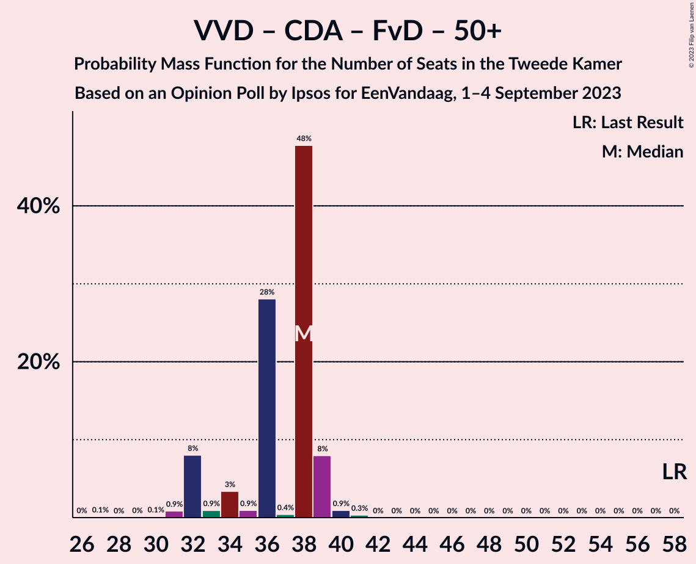

| Number of Seats | Probability | Accumulated | Special Marks |
|:---------------:|:-----------:|:-----------:|:-------------:|
| 27 | 0.1% | 100% |  |
| 28 | 0% | 99.9% |  |
| 29 | 0.1% | 99.9% |  |
| 30 | 0.3% | 99.8% |  |
| 31 | 0.9% | 99.5% |  |
| 32 | 1.1% | 98.6% |  |
| 33 | 1.4% | 98% |  |
| 34 | 4% | 96% |  |
| 35 | 0.3% | 92% |  |
| 36 | 87% | 91% | Median |
| 37 | 1.0% | 5% |  |
| 38 | 0.2% | 4% |  |
| 39 | 0.2% | 4% |  |
| 40 | 3% | 3% |  |
| 41 | 0% | 0% |  |
| 42 | 0% | 0% |  |
| 43 | 0% | 0% |  |
| 44 | 0% | 0% |  |
| 45 | 0% | 0% |  |
| 46 | 0% | 0% |  |
| 47 | 0% | 0% |  |
| 48 | 0% | 0% |  |
| 49 | 0% | 0% |  |
| 50 | 0% | 0% |  |
| 51 | 0% | 0% |  |
| 52 | 0% | 0% |  |
| 53 | 0% | 0% |  |
| 54 | 0% | 0% |  |
| 55 | 0% | 0% |  |
| 56 | 0% | 0% |  |
| 57 | 0% | 0% |  |
| 58 | 0% | 0% | Last Result |

### GroenLinks–Partij van de Arbeid – Democraten 66 – Christen-Democratisch Appèl

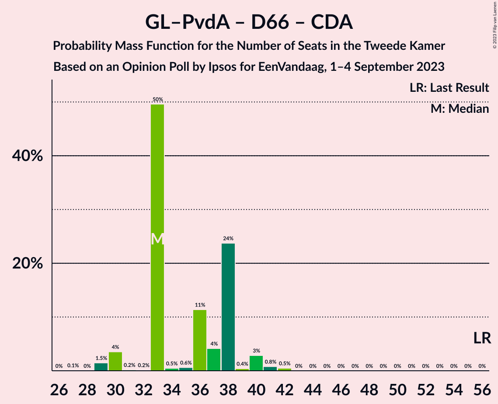

| Number of Seats | Probability | Accumulated | Special Marks |
|:---------------:|:-----------:|:-----------:|:-------------:|
| 27 | 0.4% | 100% |  |
| 28 | 0% | 99.6% |  |
| 29 | 5% | 99.6% |  |
| 30 | 0.2% | 95% |  |
| 31 | 0.2% | 95% |  |
| 32 | 0.2% | 94% |  |
| 33 | 2% | 94% |  |
| 34 | 0.3% | 93% |  |
| 35 | 1.1% | 92% |  |
| 36 | 4% | 91% |  |
| 37 | 0.2% | 87% |  |
| 38 | 83% | 87% | Median |
| 39 | 1.4% | 4% |  |
| 40 | 0.1% | 3% |  |
| 41 | 0.7% | 2% |  |
| 42 | 2% | 2% |  |
| 43 | 0.1% | 0.1% |  |
| 44 | 0% | 0% |  |
| 45 | 0% | 0% |  |
| 46 | 0% | 0% |  |
| 47 | 0% | 0% |  |
| 48 | 0% | 0% |  |
| 49 | 0% | 0% |  |
| 50 | 0% | 0% |  |
| 51 | 0% | 0% |  |
| 52 | 0% | 0% |  |
| 53 | 0% | 0% |  |
| 54 | 0% | 0% |  |
| 55 | 0% | 0% |  |
| 56 | 0% | 0% | Last Result |

### Volkspartij voor Vrijheid en Democratie – Christen-Democratisch Appèl – Forum voor Democratie

| Number of Seats | Probability | Accumulated | Special Marks |
|:---------------:|:-----------:|:-----------:|:-------------:|
| 27 | 0.1% | 100% |  |
| 28 | 0% | 99.9% |  |
| 29 | 0.1% | 99.9% |  |
| 30 | 0.3% | 99.8% |  |
| 31 | 1.5% | 99.5% |  |
| 32 | 2% | 98% |  |
| 33 | 1.2% | 96% |  |
| 34 | 86% | 95% | Median |
| 35 | 0.3% | 9% |  |
| 36 | 4% | 9% |  |
| 37 | 0.8% | 4% |  |
| 38 | 0.2% | 4% |  |
| 39 | 3% | 3% |  |
| 40 | 0% | 0.1% |  |
| 41 | 0% | 0% |  |
| 42 | 0% | 0% |  |
| 43 | 0% | 0% |  |
| 44 | 0% | 0% |  |
| 45 | 0% | 0% |  |
| 46 | 0% | 0% |  |
| 47 | 0% | 0% |  |
| 48 | 0% | 0% |  |
| 49 | 0% | 0% |  |
| 50 | 0% | 0% |  |
| 51 | 0% | 0% |  |
| 52 | 0% | 0% |  |
| 53 | 0% | 0% |  |
| 54 | 0% | 0% |  |
| 55 | 0% | 0% |  |
| 56 | 0% | 0% |  |
| 57 | 0% | 0% | Last Result |

### GroenLinks–Partij van de Arbeid – BoerBurgerBeweging

| Number of Seats | Probability | Accumulated | Special Marks |
|:---------------:|:-----------:|:-----------:|:-------------:|
| 18 | 0% | 100% | Last Result |
| 19 | 0% | 100% |  |
| 20 | 0% | 100% |  |
| 21 | 0% | 100% |  |
| 22 | 0% | 100% |  |
| 23 | 0% | 100% |  |
| 24 | 0% | 100% |  |
| 25 | 4% | 100% |  |
| 26 | 0% | 96% |  |
| 27 | 0% | 96% |  |
| 28 | 0.2% | 96% |  |
| 29 | 0.3% | 96% |  |
| 30 | 1.4% | 96% |  |
| 31 | 3% | 95% |  |
| 32 | 1.1% | 91% |  |
| 33 | 1.3% | 90% |  |
| 34 | 0.9% | 89% |  |
| 35 | 83% | 88% | Median |
| 36 | 0.4% | 4% |  |
| 37 | 1.0% | 4% |  |
| 38 | 0.1% | 3% |  |
| 39 | 0.4% | 3% |  |
| 40 | 2% | 2% |  |
| 41 | 0% | 0.1% |  |
| 42 | 0% | 0% |  |

### Volkspartij voor Vrijheid en Democratie – Christen-Democratisch Appèl

| Number of Seats | Probability | Accumulated | Special Marks |
|:---------------:|:-----------:|:-----------:|:-------------:|
| 24 | 0.1% | 100% |  |
| 25 | 0% | 99.9% |  |
| 26 | 0.1% | 99.9% |  |
| 27 | 0.2% | 99.8% |  |
| 28 | 2% | 99.6% |  |
| 29 | 0.8% | 97% |  |
| 30 | 3% | 97% |  |
| 31 | 84% | 94% | Median |
| 32 | 2% | 10% |  |
| 33 | 4% | 8% |  |
| 34 | 0.8% | 4% |  |
| 35 | 0.2% | 4% |  |
| 36 | 0% | 3% |  |
| 37 | 3% | 3% |  |
| 38 | 0% | 0.1% |  |
| 39 | 0% | 0% |  |
| 40 | 0% | 0% |  |
| 41 | 0% | 0% |  |
| 42 | 0% | 0% |  |
| 43 | 0% | 0% |  |
| 44 | 0% | 0% |  |
| 45 | 0% | 0% |  |
| 46 | 0% | 0% |  |
| 47 | 0% | 0% |  |
| 48 | 0% | 0% |  |
| 49 | 0% | 0% | Last Result |

### GroenLinks–Partij van de Arbeid – Christen-Democratisch Appèl – ChristenUnie

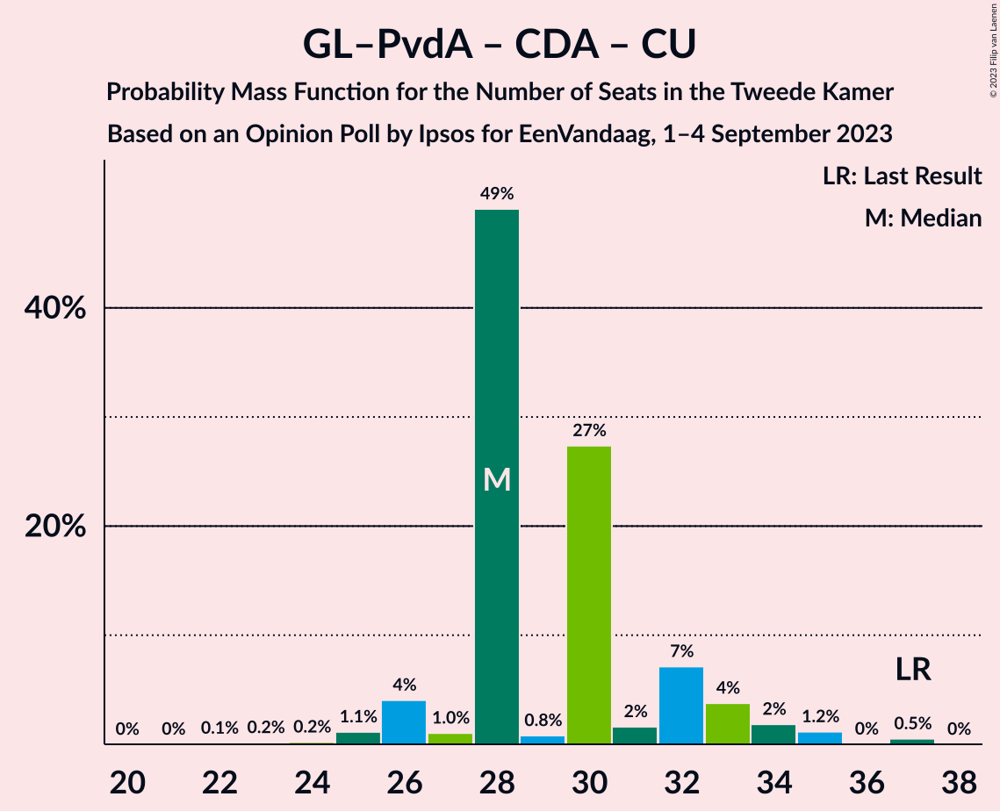

| Number of Seats | Probability | Accumulated | Special Marks |
|:---------------:|:-----------:|:-----------:|:-------------:|
| 22 | 0.3% | 100% |  |
| 23 | 0% | 99.6% |  |
| 24 | 0.7% | 99.6% |  |
| 25 | 4% | 98.9% |  |
| 26 | 0.5% | 95% |  |
| 27 | 1.1% | 95% |  |
| 28 | 4% | 94% |  |
| 29 | 0.2% | 89% |  |
| 30 | 83% | 89% | Median |
| 31 | 2% | 6% |  |
| 32 | 2% | 4% |  |
| 33 | 0.2% | 3% |  |
| 34 | 0.3% | 2% |  |
| 35 | 0.2% | 2% |  |
| 36 | 0.1% | 2% |  |
| 37 | 2% | 2% | Last Result |
| 38 | 0% | 0% |  |

### GroenLinks–Partij van de Arbeid – Christen-Democratisch Appèl

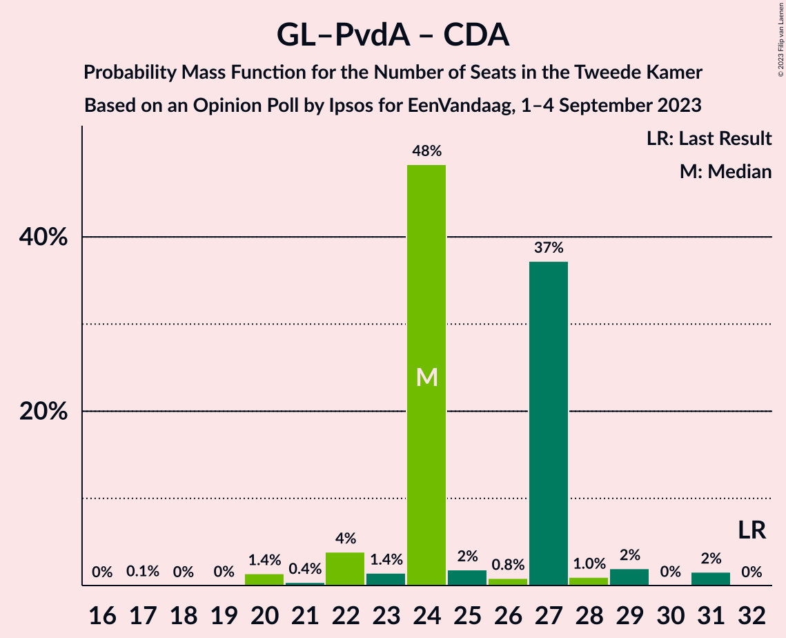

| Number of Seats | Probability | Accumulated | Special Marks |
|:---------------:|:-----------:|:-----------:|:-------------:|
| 17 | 0.4% | 100% |  |
| 18 | 0% | 99.6% |  |
| 19 | 0.1% | 99.6% |  |
| 20 | 4% | 99.5% |  |
| 21 | 0.5% | 96% |  |
| 22 | 2% | 95% |  |
| 23 | 0.2% | 93% |  |
| 24 | 0.8% | 93% |  |
| 25 | 4% | 92% |  |
| 26 | 1.0% | 88% |  |
| 27 | 83% | 87% | Median |
| 28 | 1.4% | 4% |  |
| 29 | 0.2% | 2% |  |
| 30 | 0.1% | 2% |  |
| 31 | 2% | 2% |  |
| 32 | 0% | 0.1% | Last Result |
| 33 | 0.1% | 0.1% |  |
| 34 | 0% | 0% |  |

### Democraten 66 – Christen-Democratisch Appèl

| Number of Seats | Probability | Accumulated | Special Marks |
|:---------------:|:-----------:|:-----------:|:-------------:|
| 10 | 0.1% | 100% |  |
| 11 | 0.1% | 99.9% |  |
| 12 | 1.2% | 99.8% |  |
| 13 | 0.3% | 98.7% |  |
| 14 | 2% | 98% |  |
| 15 | 4% | 96% |  |
| 16 | 2% | 92% |  |
| 17 | 89% | 90% | Median |
| 18 | 1.2% | 2% |  |
| 19 | 0.2% | 0.6% |  |
| 20 | 0.1% | 0.4% |  |
| 21 | 0.3% | 0.3% |  |
| 22 | 0% | 0% |  |
| 23 | 0% | 0% |  |
| 24 | 0% | 0% |  |
| 25 | 0% | 0% |  |
| 26 | 0% | 0% |  |
| 27 | 0% | 0% |  |
| 28 | 0% | 0% |  |
| 29 | 0% | 0% |  |
| 30 | 0% | 0% |  |
| 31 | 0% | 0% |  |
| 32 | 0% | 0% |  |
| 33 | 0% | 0% |  |
| 34 | 0% | 0% |  |
| 35 | 0% | 0% |  |
| 36 | 0% | 0% |  |
| 37 | 0% | 0% |  |
| 38 | 0% | 0% |  |
| 39 | 0% | 0% | Last Result |

## Technical Information

### Opinion Poll

+ **Polling firm:** Ipsos
+ **Commissioner(s):** EenVandaag
+ **Fieldwork period:** 1–4 September 2023

### Calculations

+ **Sample size:** 941
+ **Simulations done:** 524,288
+ **Error estimate:** 3.78%

