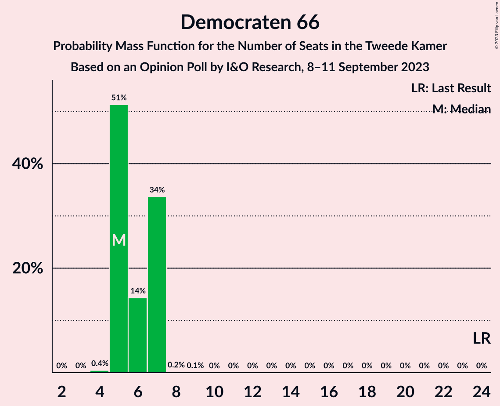
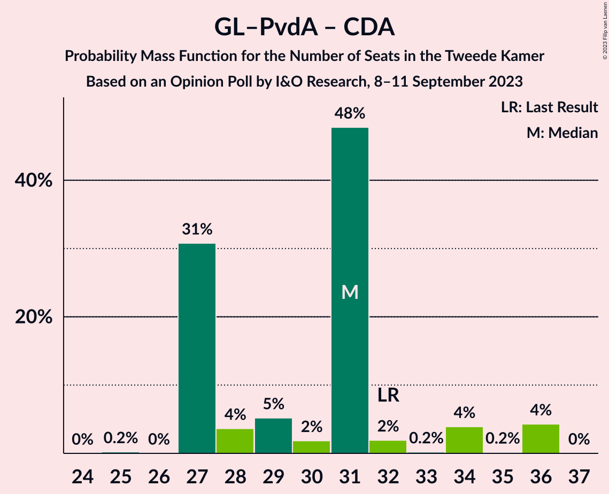

# Opinion Poll by I&O Research, 8–11 September 2023

<a href="#voting-intentions">Voting Intentions</a> | <a href="#seats">Seats</a> | <a href="#coalitions">Coalitions</a> | <a href="#technical-information">Technical Information</a>

## Voting Intentions

### Confidence Intervals

| Party | Last Result | Poll Result | 80% Confidence Interval | 90% Confidence Interval | 95% Confidence Interval | 99% Confidence Interval |
|:-----:|:-----------:|:-----------:|:-----------------------:|:-----------------------:|:-----------------------:|:-----------------------:|
| Nieuw Sociaal Contract | 0.0% | 18.0% | 16.8–19.3% |16.5–19.6% |16.2–20.0% |15.7–20.6% |
| GroenLinks–Partij van de Arbeid | 10.9% | 17.6% | 16.4–18.8% |16.1–19.2% |15.8–19.5% |15.3–20.1% |
| Volkspartij voor Vrijheid en Democratie | 21.9% | 16.5% | 15.4–17.7% |15.0–18.1% |14.8–18.4% |14.3–19.0% |
| Partij voor de Vrijheid | 10.8% | 9.1% | 8.2–10.1% |8.0–10.3% |7.8–10.6% |7.4–11.1% |
| BoerBurgerBeweging | 1.0% | 9.0% | 8.1–10.0% |7.9–10.2% |7.7–10.5% |7.3–10.9% |
| Partij voor de Dieren | 3.8% | 4.9% | 4.3–5.7% |4.1–5.9% |4.0–6.1% |3.7–6.4% |
| Democraten 66 | 15.0% | 4.1% | 3.6–4.8% |3.4–5.0% |3.3–5.2% |3.0–5.6% |
| Socialistische Partij | 6.0% | 3.3% | 2.8–3.9% |2.6–4.1% |2.5–4.3% |2.3–4.6% |
| Volt Europa | 2.4% | 2.7% | 2.3–3.3% |2.1–3.5% |2.0–3.6% |1.8–3.9% |
| ChristenUnie | 3.4% | 2.6% | 2.2–3.2% |2.0–3.4% |1.9–3.5% |1.7–3.8% |
| Christen-Democratisch Appèl | 9.5% | 2.6% | 2.2–3.2% |2.0–3.4% |1.9–3.5% |1.7–3.8% |
| Forum voor Democratie | 5.0% | 2.6% | 2.2–3.2% |2.0–3.4% |1.9–3.5% |1.7–3.8% |
| Staatkundig Gereformeerde Partij | 2.1% | 2.6% | 2.2–3.2% |2.0–3.4% |1.9–3.5% |1.7–3.8% |
| Juiste Antwoord 2021 | 2.4% | 1.3% | 1.0–1.7% |0.9–1.8% |0.8–2.0% |0.7–2.2% |
| DENK | 2.0% | 1.3% | 1.0–1.7% |0.9–1.8% |0.8–2.0% |0.7–2.2% |
| 50Plus | 1.0% | 0.7% | 0.5–1.1% |0.5–1.2% |0.4–1.3% |0.3–1.5% |
| Belang van Nederland | 0.0% | 0.5% | 0.3–0.8% |0.3–0.9% |0.2–1.0% |0.2–1.1% |
| Bij1 | 0.8% | 0.3% | 0.2–0.6% |0.2–0.6% |0.1–0.7% |0.1–0.9% |

*Note:* The poll result column reflects the actual value used in the calculations. Published results may vary slightly, and in addition be rounded to fewer digits.

## Seats

### Confidence Intervals

| Party | Last Result | Median | 80% Confidence Interval | 90% Confidence Interval | 95% Confidence Interval | 99% Confidence Interval |
|:-----:|:-----------:|:------:|:-----------------------:|:-----------------------:|:-----------------------:|:-----------------------:|
| <a href="#nieuw-sociaal-contract">Nieuw Sociaal Contract</a> | 0 | 28 | 27–30 |26–31 |26–31 |26–33 |
| <a href="#groenlinks–partij-van-de-arbeid">GroenLinks–Partij van de Arbeid</a> | 17 | 25 | 24–29 |24–31 |24–32 |24–32 |
| <a href="#volkspartij-voor-vrijheid-en-democratie">Volkspartij voor Vrijheid en Democratie</a> | 34 | 25 | 24–26 |22–27 |22–27 |22–28 |
| <a href="#partij-voor-de-vrijheid">Partij voor de Vrijheid</a> | 17 | 14 | 13–17 |12–17 |12–17 |11–17 |
| <a href="#boerburgerbeweging">BoerBurgerBeweging</a> | 1 | 15 | 13–15 |13–15 |12–16 |11–16 |
| <a href="#partij-voor-de-dieren">Partij voor de Dieren</a> | 6 | 8 | 6–8 |6–8 |5–8 |5–9 |
| <a href="#democraten-66">Democraten 66</a> | 24 | 5 | 5–7 |5–7 |5–7 |5–7 |
| <a href="#socialistische-partij">Socialistische Partij</a> | 9 | 5 | 4–5 |4–5 |4–5 |3–6 |
| <a href="#volt-europa">Volt Europa</a> | 3 | 4 | 4–5 |4–6 |3–6 |3–6 |
| <a href="#christenunie">ChristenUnie</a> | 5 | 2 | 2–4 |2–4 |2–4 |2–6 |
| <a href="#christen-democratisch-appèl">Christen-Democratisch Appèl</a> | 15 | 4 | 3–6 |3–6 |3–6 |2–6 |
| <a href="#forum-voor-democratie">Forum voor Democratie</a> | 8 | 4 | 3–4 |3–4 |3–5 |3–5 |
| <a href="#staatkundig-gereformeerde-partij">Staatkundig Gereformeerde Partij</a> | 3 | 4 | 3–5 |3–5 |3–5 |2–5 |
| <a href="#juiste-antwoord-2021">Juiste Antwoord 2021</a> | 3 | 1 | 1–2 |1–3 |1–3 |1–3 |
| <a href="#denk">DENK</a> | 3 | 2 | 2 |2 |1–2 |0–3 |
| <a href="#50plus">50Plus</a> | 1 | 1 | 0–1 |0–1 |0–1 |0–2 |
| <a href="#belang-van-nederland">Belang van Nederland</a> | 0 | 0 | 0–1 |0–1 |0–1 |0–1 |
| <a href="#bij1">Bij1</a> | 1 | 0 | 0–1 |0–1 |0–1 |0–1 |

### Nieuw Sociaal Contract

*For a full overview of the results for this party, see the [Nieuw Sociaal Contract](party-nieuwsociaalcontract.html) page.*

| Number of Seats | Probability | Accumulated | Special Marks |
|:---------------:|:-----------:|:-----------:|:-------------:|
| 0 | 0% | 100% | Last Result |
| 1 | 0% | 100% |  |
| 2 | 0% | 100% |  |
| 3 | 0% | 100% |  |
| 4 | 0% | 100% |  |
| 5 | 0% | 100% |  |
| 6 | 0% | 100% |  |
| 7 | 0% | 100% |  |
| 8 | 0% | 100% |  |
| 9 | 0% | 100% |  |
| 10 | 0% | 100% |  |
| 11 | 0% | 100% |  |
| 12 | 0% | 100% |  |
| 13 | 0% | 100% |  |
| 14 | 0% | 100% |  |
| 15 | 0% | 100% |  |
| 16 | 0% | 100% |  |
| 17 | 0% | 100% |  |
| 18 | 0% | 100% |  |
| 19 | 0% | 100% |  |
| 20 | 0% | 100% |  |
| 21 | 0% | 100% |  |
| 22 | 0% | 100% |  |
| 23 | 0.1% | 100% |  |
| 24 | 0.1% | 99.9% |  |
| 25 | 0.3% | 99.8% |  |
| 26 | 5% | 99.5% |  |
| 27 | 31% | 95% |  |
| 28 | 48% | 63% | Median |
| 29 | 3% | 16% |  |
| 30 | 5% | 13% |  |
| 31 | 5% | 7% |  |
| 32 | 0.8% | 2% |  |
| 33 | 1.5% | 1.5% |  |
| 34 | 0% | 0% |  |

### GroenLinks–Partij van de Arbeid

*For a full overview of the results for this party, see the [GroenLinks–Partij van de Arbeid](party-groenlinks–partijvandearbeid.html) page.*

| Number of Seats | Probability | Accumulated | Special Marks |
|:---------------:|:-----------:|:-----------:|:-------------:|
| 17 | 0% | 100% | Last Result |
| 18 | 0% | 100% |  |
| 19 | 0% | 100% |  |
| 20 | 0% | 100% |  |
| 21 | 0% | 100% |  |
| 22 | 0.2% | 100% |  |
| 23 | 0% | 99.8% |  |
| 24 | 33% | 99.7% |  |
| 25 | 52% | 67% | Median |
| 26 | 1.2% | 14% |  |
| 27 | 0.9% | 13% |  |
| 28 | 2% | 12% |  |
| 29 | 5% | 11% |  |
| 30 | 0.6% | 6% |  |
| 31 | 1.0% | 5% |  |
| 32 | 4% | 4% |  |
| 33 | 0% | 0% |  |

### Volkspartij voor Vrijheid en Democratie

*For a full overview of the results for this party, see the [Volkspartij voor Vrijheid en Democratie](party-volkspartijvoorvrijheidendemocratie.html) page.*

| Number of Seats | Probability | Accumulated | Special Marks |
|:---------------:|:-----------:|:-----------:|:-------------:|
| 21 | 0.1% | 100% |  |
| 22 | 5% | 99.8% |  |
| 23 | 5% | 95% |  |
| 24 | 5% | 90% |  |
| 25 | 48% | 86% | Median |
| 26 | 29% | 37% |  |
| 27 | 7% | 8% |  |
| 28 | 0.8% | 1.3% |  |
| 29 | 0% | 0.5% |  |
| 30 | 0% | 0.5% |  |
| 31 | 0.4% | 0.4% |  |
| 32 | 0% | 0% |  |
| 33 | 0% | 0% |  |
| 34 | 0% | 0% | Last Result |

### Partij voor de Vrijheid

*For a full overview of the results for this party, see the [Partij voor de Vrijheid](party-partijvoordevrijheid.html) page.*

| Number of Seats | Probability | Accumulated | Special Marks |
|:---------------:|:-----------:|:-----------:|:-------------:|
| 11 | 2% | 100% |  |
| 12 | 6% | 98% |  |
| 13 | 11% | 93% |  |
| 14 | 49% | 82% | Median |
| 15 | 1.0% | 33% |  |
| 16 | 0.3% | 32% |  |
| 17 | 32% | 32% | Last Result |
| 18 | 0% | 0% |  |

### BoerBurgerBeweging

*For a full overview of the results for this party, see the [BoerBurgerBeweging](party-boerburgerbeweging.html) page.*

| Number of Seats | Probability | Accumulated | Special Marks |
|:---------------:|:-----------:|:-----------:|:-------------:|
| 1 | 0% | 100% | Last Result |
| 2 | 0% | 100% |  |
| 3 | 0% | 100% |  |
| 4 | 0% | 100% |  |
| 5 | 0% | 100% |  |
| 6 | 0% | 100% |  |
| 7 | 0% | 100% |  |
| 8 | 0% | 100% |  |
| 9 | 0% | 100% |  |
| 10 | 0% | 100% |  |
| 11 | 0.7% | 100% |  |
| 12 | 4% | 99.3% |  |
| 13 | 10% | 96% |  |
| 14 | 1.0% | 86% |  |
| 15 | 81% | 85% | Median |
| 16 | 4% | 4% |  |
| 17 | 0.3% | 0.3% |  |
| 18 | 0% | 0% |  |

### Partij voor de Dieren

*For a full overview of the results for this party, see the [Partij voor de Dieren](party-partijvoordedieren.html) page.*

| Number of Seats | Probability | Accumulated | Special Marks |
|:---------------:|:-----------:|:-----------:|:-------------:|
| 5 | 3% | 100% |  |
| 6 | 32% | 97% | Last Result |
| 7 | 11% | 66% |  |
| 8 | 52% | 54% | Median |
| 9 | 2% | 2% |  |
| 10 | 0% | 0% |  |

### Democraten 66

*For a full overview of the results for this party, see the [Democraten 66](party-democraten66.html) page.*

| Number of Seats | Probability | Accumulated | Special Marks |
|:---------------:|:-----------:|:-----------:|:-------------:|
| 4 | 0.4% | 100% |  |
| 5 | 51% | 99.5% | Median |
| 6 | 14% | 48% |  |
| 7 | 34% | 34% |  |
| 8 | 0.2% | 0.2% |  |
| 9 | 0.1% | 0.1% |  |
| 10 | 0% | 0% |  |
| 11 | 0% | 0% |  |
| 12 | 0% | 0% |  |
| 13 | 0% | 0% |  |
| 14 | 0% | 0% |  |
| 15 | 0% | 0% |  |
| 16 | 0% | 0% |  |
| 17 | 0% | 0% |  |
| 18 | 0% | 0% |  |
| 19 | 0% | 0% |  |
| 20 | 0% | 0% |  |
| 21 | 0% | 0% |  |
| 22 | 0% | 0% |  |
| 23 | 0% | 0% |  |
| 24 | 0% | 0% | Last Result |

### Socialistische Partij

*For a full overview of the results for this party, see the [Socialistische Partij](party-socialistischepartij.html) page.*

| Number of Seats | Probability | Accumulated | Special Marks |
|:---------------:|:-----------:|:-----------:|:-------------:|
| 3 | 0.6% | 100% |  |
| 4 | 37% | 99.4% |  |
| 5 | 61% | 62% | Median |
| 6 | 0.9% | 1.3% |  |
| 7 | 0.4% | 0.5% |  |
| 8 | 0% | 0% |  |
| 9 | 0% | 0% | Last Result |

### Volt Europa

*For a full overview of the results for this party, see the [Volt Europa](party-volteuropa.html) page.*

| Number of Seats | Probability | Accumulated | Special Marks |
|:---------------:|:-----------:|:-----------:|:-------------:|
| 2 | 0.2% | 100% |  |
| 3 | 3% | 99.8% | Last Result |
| 4 | 84% | 97% | Median |
| 5 | 8% | 13% |  |
| 6 | 5% | 5% |  |
| 7 | 0.2% | 0.2% |  |
| 8 | 0% | 0% |  |

### ChristenUnie

*For a full overview of the results for this party, see the [ChristenUnie](party-christenunie.html) page.*

| Number of Seats | Probability | Accumulated | Special Marks |
|:---------------:|:-----------:|:-----------:|:-------------:|
| 2 | 50% | 100% | Median |
| 3 | 33% | 50% |  |
| 4 | 16% | 17% |  |
| 5 | 0.4% | 1.0% | Last Result |
| 6 | 0.6% | 0.6% |  |
| 7 | 0% | 0% |  |

### Christen-Democratisch Appèl

*For a full overview of the results for this party, see the [Christen-Democratisch Appèl](party-christen-democratischappèl.html) page.*

| Number of Seats | Probability | Accumulated | Special Marks |
|:---------------:|:-----------:|:-----------:|:-------------:|
| 2 | 2% | 100% |  |
| 3 | 34% | 98% |  |
| 4 | 15% | 64% | Median |
| 5 | 3% | 49% |  |
| 6 | 46% | 46% |  |
| 7 | 0% | 0% |  |
| 8 | 0% | 0% |  |
| 9 | 0% | 0% |  |
| 10 | 0% | 0% |  |
| 11 | 0% | 0% |  |
| 12 | 0% | 0% |  |
| 13 | 0% | 0% |  |
| 14 | 0% | 0% |  |
| 15 | 0% | 0% | Last Result |

### Forum voor Democratie

*For a full overview of the results for this party, see the [Forum voor Democratie](party-forumvoordemocratie.html) page.*

| Number of Seats | Probability | Accumulated | Special Marks |
|:---------------:|:-----------:|:-----------:|:-------------:|
| 2 | 0% | 100% |  |
| 3 | 13% | 99.9% |  |
| 4 | 84% | 87% | Median |
| 5 | 3% | 3% |  |
| 6 | 0.2% | 0.2% |  |
| 7 | 0% | 0% |  |
| 8 | 0% | 0% | Last Result |

### Staatkundig Gereformeerde Partij

*For a full overview of the results for this party, see the [Staatkundig Gereformeerde Partij](party-staatkundiggereformeerdepartij.html) page.*

| Number of Seats | Probability | Accumulated | Special Marks |
|:---------------:|:-----------:|:-----------:|:-------------:|
| 2 | 2% | 100% |  |
| 3 | 12% | 98% | Last Result |
| 4 | 39% | 87% | Median |
| 5 | 48% | 48% |  |
| 6 | 0.1% | 0.1% |  |
| 7 | 0% | 0% |  |

### Juiste Antwoord 2021

*For a full overview of the results for this party, see the [Juiste Antwoord 2021](party-juisteantwoord2021.html) page.*

| Number of Seats | Probability | Accumulated | Special Marks |
|:---------------:|:-----------:|:-----------:|:-------------:|
| 0 | 0.2% | 100% |  |
| 1 | 55% | 99.8% | Median |
| 2 | 39% | 45% |  |
| 3 | 5% | 5% | Last Result |
| 4 | 0% | 0% |  |

### DENK

*For a full overview of the results for this party, see the [DENK](party-denk.html) page.*

| Number of Seats | Probability | Accumulated | Special Marks |
|:---------------:|:-----------:|:-----------:|:-------------:|
| 0 | 0.9% | 100% |  |
| 1 | 3% | 99.1% |  |
| 2 | 96% | 97% | Median |
| 3 | 0.7% | 0.7% | Last Result |
| 4 | 0% | 0% |  |

### 50Plus

*For a full overview of the results for this party, see the [50Plus](party-50plus.html) page.*

| Number of Seats | Probability | Accumulated | Special Marks |
|:---------------:|:-----------:|:-----------:|:-------------:|
| 0 | 39% | 100% |  |
| 1 | 60% | 61% | Last Result, Median |
| 2 | 0.8% | 1.2% |  |
| 3 | 0.3% | 0.3% |  |
| 4 | 0% | 0% |  |

### Belang van Nederland

*For a full overview of the results for this party, see the [Belang van Nederland](party-belangvannederland.html) page.*

| Number of Seats | Probability | Accumulated | Special Marks |
|:---------------:|:-----------:|:-----------:|:-------------:|
| 0 | 90% | 100% | Last Result, Median |
| 1 | 10% | 10% |  |
| 2 | 0.1% | 0.1% |  |
| 3 | 0% | 0% |  |

### Bij1

*For a full overview of the results for this party, see the [Bij1](party-bij1.html) page.*

| Number of Seats | Probability | Accumulated | Special Marks |
|:---------------:|:-----------:|:-----------:|:-------------:|
| 0 | 68% | 100% | Median |
| 1 | 32% | 32% | Last Result |
| 2 | 0% | 0% |  |

## Coalitions

### Confidence Intervals

| Coalition | Last Result | Median | Majority? | 80% Confidence Interval | 90% Confidence Interval | 95% Confidence Interval | 99% Confidence Interval |
|:---------:|:-----------:|:------:|:---------:|:-----------------------:|:-----------------------:|:-----------------------:|:-----------------------:|
| GroenLinks–Partij van de Arbeid – Volkspartij voor Vrijheid en Democratie – BoerBurgerBeweging – Christen-Democratisch Appèl | 67 | 71 | 0% | 68–71 | 65–74 | 64–74 | 64–74 |
| GroenLinks–Partij van de Arbeid – Volkspartij voor Vrijheid en Democratie – BoerBurgerBeweging | 52 | 65 | 0% | 65–68 | 61–70 | 60–70 | 60–71 |
| GroenLinks–Partij van de Arbeid – Volkspartij voor Vrijheid en Democratie – Democraten 66 | 75 | 55 | 0% | 55–61 | 54–61 | 53–63 | 53–63 |
| GroenLinks–Partij van de Arbeid – Volkspartij voor Vrijheid en Democratie – Christen-Democratisch Appèl | 66 | 56 | 0% | 53–58 | 51–59 | 51–61 | 51–61 |
| GroenLinks–Partij van de Arbeid – Volkspartij voor Vrijheid en Democratie | 51 | 50 | 0% | 50–55 | 48–56 | 47–56 | 47–58 |
| Volkspartij voor Vrijheid en Democratie – Partij voor de Vrijheid – Christen-Democratisch Appèl – Forum voor Democratie – Staatkundig Gereformeerde Partij | 77 | 54 | 0% | 48–54 | 47–54 | 46–54 | 46–54 |
| GroenLinks–Partij van de Arbeid – Democraten 66 – Socialistische Partij – Christen-Democratisch Appèl – ChristenUnie | 70 | 43 | 0% | 41–45 | 41–48 | 41–51 | 41–51 |
| Volkspartij voor Vrijheid en Democratie – Partij voor de Vrijheid – Christen-Democratisch Appèl – Forum voor Democratie | 74 | 49 | 0% | 43–50 | 43–50 | 43–50 | 43–51 |
| GroenLinks–Partij van de Arbeid – BoerBurgerBeweging | 18 | 40 | 0% | 39–41 | 38–44 | 38–47 | 37–47 |
| Volkspartij voor Vrijheid en Democratie – BoerBurgerBeweging – Christen-Democratisch Appèl | 50 | 44 | 0% | 42–46 | 39–46 | 39–46 | 39–47 |
| Volkspartij voor Vrijheid en Democratie – Partij voor de Vrijheid – Christen-Democratisch Appèl | 66 | 45 | 0% | 40–46 | 39–46 | 39–46 | 39–46 |
| GroenLinks–Partij van de Arbeid – Democraten 66 – Christen-Democratisch Appèl – ChristenUnie | 61 | 38 | 0% | 37–41 | 37–43 | 37–46 | 36–46 |
| GroenLinks–Partij van de Arbeid – Democraten 66 – Christen-Democratisch Appèl | 56 | 36 | 0% | 34–37 | 34–41 | 34–42 | 33–42 |
| Volkspartij voor Vrijheid en Democratie – Democraten 66 – Christen-Democratisch Appèl – ChristenUnie | 78 | 38 | 0% | 37–39 | 36–40 | 36–41 | 35–43 |
| Volkspartij voor Vrijheid en Democratie – Christen-Democratisch Appèl – Forum voor Democratie – Staatkundig Gereformeerde Partij – 50Plus | 61 | 38 | 0% | 35–41 | 35–41 | 33–41 | 33–43 |
| Volkspartij voor Vrijheid en Democratie – Christen-Democratisch Appèl – Forum voor Democratie – Staatkundig Gereformeerde Partij | 60 | 38 | 0% | 34–40 | 34–40 | 33–40 | 33–42 |
| GroenLinks–Partij van de Arbeid – Christen-Democratisch Appèl – ChristenUnie | 37 | 33 | 0% | 30–36 | 30–37 | 30–40 | 30–40 |
| Volkspartij voor Vrijheid en Democratie – Democraten 66 – Christen-Democratisch Appèl | 73 | 36 | 0% | 33–36 | 32–36 | 32–39 | 32–39 |
| Volkspartij voor Vrijheid en Democratie – Christen-Democratisch Appèl – Forum voor Democratie – 50Plus | 58 | 35 | 0% | 32–36 | 31–36 | 30–36 | 30–39 |
| GroenLinks–Partij van de Arbeid – Christen-Democratisch Appèl | 32 | 31 | 0% | 27–32 | 27–34 | 27–36 | 27–36 |
| Volkspartij voor Vrijheid en Democratie – Christen-Democratisch Appèl – Forum voor Democratie | 57 | 35 | 0% | 31–35 | 30–35 | 30–35 | 30–38 |
| Volkspartij voor Vrijheid en Democratie – Christen-Democratisch Appèl | 49 | 30 | 0% | 27–31 | 26–31 | 26–32 | 26–34 |
| Democraten 66 – Christen-Democratisch Appèl | 39 | 10 | 0% | 10–11 | 9–11 | 8–12 | 7–12 |

### GroenLinks–Partij van de Arbeid – Volkspartij voor Vrijheid en Democratie – BoerBurgerBeweging – Christen-Democratisch Appèl

| Number of Seats | Probability | Accumulated | Special Marks |
|:---------------:|:-----------:|:-----------:|:-------------:|
| 64 | 5% | 100% |  |
| 65 | 0% | 95% |  |
| 66 | 0.2% | 95% |  |
| 67 | 2% | 95% | Last Result |
| 68 | 33% | 93% |  |
| 69 | 0.3% | 60% | Median |
| 70 | 3% | 60% |  |
| 71 | 48% | 57% |  |
| 72 | 1.0% | 9% |  |
| 73 | 3% | 8% |  |
| 74 | 5% | 5% |  |
| 75 | 0.2% | 0.2% |  |
| 76 | 0% | 0% | Majority |

### GroenLinks–Partij van de Arbeid – Volkspartij voor Vrijheid en Democratie – BoerBurgerBeweging

| Number of Seats | Probability | Accumulated | Special Marks |
|:---------------:|:-----------:|:-----------:|:-------------:|
| 52 | 0% | 100% | Last Result |
| 53 | 0% | 100% |  |
| 54 | 0% | 100% |  |
| 55 | 0% | 100% |  |
| 56 | 0% | 100% |  |
| 57 | 0% | 100% |  |
| 58 | 0% | 100% |  |
| 59 | 0% | 100% |  |
| 60 | 5% | 100% |  |
| 61 | 0.2% | 95% |  |
| 62 | 0.1% | 95% |  |
| 63 | 0.1% | 95% |  |
| 64 | 4% | 95% |  |
| 65 | 76% | 90% | Median |
| 66 | 2% | 15% |  |
| 67 | 2% | 13% |  |
| 68 | 4% | 11% |  |
| 69 | 2% | 7% |  |
| 70 | 4% | 5% |  |
| 71 | 0.9% | 1.0% |  |
| 72 | 0.1% | 0.1% |  |
| 73 | 0% | 0% |  |

### GroenLinks–Partij van de Arbeid – Volkspartij voor Vrijheid en Democratie – Democraten 66

| Number of Seats | Probability | Accumulated | Special Marks |
|:---------------:|:-----------:|:-----------:|:-------------:|
| 53 | 5% | 100% |  |
| 54 | 3% | 95% |  |
| 55 | 48% | 93% | Median |
| 56 | 0.3% | 45% |  |
| 57 | 30% | 44% |  |
| 58 | 3% | 15% |  |
| 59 | 0.7% | 12% |  |
| 60 | 0.6% | 11% |  |
| 61 | 6% | 10% |  |
| 62 | 0.5% | 4% |  |
| 63 | 4% | 4% |  |
| 64 | 0% | 0.1% |  |
| 65 | 0% | 0% |  |
| 66 | 0% | 0% |  |
| 67 | 0% | 0% |  |
| 68 | 0% | 0% |  |
| 69 | 0% | 0% |  |
| 70 | 0% | 0% |  |
| 71 | 0% | 0% |  |
| 72 | 0% | 0% |  |
| 73 | 0% | 0% |  |
| 74 | 0% | 0% |  |
| 75 | 0% | 0% | Last Result |

### GroenLinks–Partij van de Arbeid – Volkspartij voor Vrijheid en Democratie – Christen-Democratisch Appèl

| Number of Seats | Probability | Accumulated | Special Marks |
|:---------------:|:-----------:|:-----------:|:-------------:|
| 51 | 7% | 100% |  |
| 52 | 3% | 93% |  |
| 53 | 29% | 91% |  |
| 54 | 0.7% | 61% | Median |
| 55 | 2% | 61% |  |
| 56 | 46% | 59% |  |
| 57 | 2% | 13% |  |
| 58 | 2% | 12% |  |
| 59 | 5% | 9% |  |
| 60 | 0.3% | 4% |  |
| 61 | 4% | 4% |  |
| 62 | 0.1% | 0.1% |  |
| 63 | 0% | 0% |  |
| 64 | 0% | 0% |  |
| 65 | 0% | 0% |  |
| 66 | 0% | 0% | Last Result |

### GroenLinks–Partij van de Arbeid – Volkspartij voor Vrijheid en Democratie

| Number of Seats | Probability | Accumulated | Special Marks |
|:---------------:|:-----------:|:-----------:|:-------------:|
| 47 | 5% | 100% |  |
| 48 | 4% | 95% |  |
| 49 | 0.5% | 91% |  |
| 50 | 75% | 90% | Median |
| 51 | 0.6% | 16% | Last Result |
| 52 | 2% | 15% |  |
| 53 | 2% | 13% |  |
| 54 | 0.6% | 11% |  |
| 55 | 5% | 11% |  |
| 56 | 4% | 6% |  |
| 57 | 0.8% | 2% |  |
| 58 | 0.8% | 0.8% |  |
| 59 | 0.1% | 0.1% |  |
| 60 | 0% | 0% |  |

### Volkspartij voor Vrijheid en Democratie – Partij voor de Vrijheid – Christen-Democratisch Appèl – Forum voor Democratie – Staatkundig Gereformeerde Partij

| Number of Seats | Probability | Accumulated | Special Marks |
|:---------------:|:-----------:|:-----------:|:-------------:|
| 45 | 0.1% | 100% |  |
| 46 | 4% | 99.9% |  |
| 47 | 5% | 96% |  |
| 48 | 4% | 91% |  |
| 49 | 3% | 87% |  |
| 50 | 5% | 84% |  |
| 51 | 3% | 80% | Median |
| 52 | 0.2% | 77% |  |
| 53 | 0.4% | 77% |  |
| 54 | 76% | 76% |  |
| 55 | 0.1% | 0.4% |  |
| 56 | 0% | 0.3% |  |
| 57 | 0.3% | 0.3% |  |
| 58 | 0% | 0% |  |
| 59 | 0% | 0% |  |
| 60 | 0% | 0% |  |
| 61 | 0% | 0% |  |
| 62 | 0% | 0% |  |
| 63 | 0% | 0% |  |
| 64 | 0% | 0% |  |
| 65 | 0% | 0% |  |
| 66 | 0% | 0% |  |
| 67 | 0% | 0% |  |
| 68 | 0% | 0% |  |
| 69 | 0% | 0% |  |
| 70 | 0% | 0% |  |
| 71 | 0% | 0% |  |
| 72 | 0% | 0% |  |
| 73 | 0% | 0% |  |
| 74 | 0% | 0% |  |
| 75 | 0% | 0% |  |
| 76 | 0% | 0% | Majority |
| 77 | 0% | 0% | Last Result |

### GroenLinks–Partij van de Arbeid – Democraten 66 – Socialistische Partij – Christen-Democratisch Appèl – ChristenUnie

| Number of Seats | Probability | Accumulated | Special Marks |
|:---------------:|:-----------:|:-----------:|:-------------:|
| 39 | 0.1% | 100% |  |
| 40 | 0.2% | 99.9% |  |
| 41 | 29% | 99.7% | Median |
| 42 | 2% | 71% |  |
| 43 | 56% | 69% |  |
| 44 | 0.7% | 12% |  |
| 45 | 3% | 12% |  |
| 46 | 1.1% | 9% |  |
| 47 | 0.2% | 8% |  |
| 48 | 3% | 8% |  |
| 49 | 0.1% | 5% |  |
| 50 | 0.1% | 5% |  |
| 51 | 4% | 4% |  |
| 52 | 0% | 0% |  |
| 53 | 0% | 0% |  |
| 54 | 0% | 0% |  |
| 55 | 0% | 0% |  |
| 56 | 0% | 0% |  |
| 57 | 0% | 0% |  |
| 58 | 0% | 0% |  |
| 59 | 0% | 0% |  |
| 60 | 0% | 0% |  |
| 61 | 0% | 0% |  |
| 62 | 0% | 0% |  |
| 63 | 0% | 0% |  |
| 64 | 0% | 0% |  |
| 65 | 0% | 0% |  |
| 66 | 0% | 0% |  |
| 67 | 0% | 0% |  |
| 68 | 0% | 0% |  |
| 69 | 0% | 0% |  |
| 70 | 0% | 0% | Last Result |

### Volkspartij voor Vrijheid en Democratie – Partij voor de Vrijheid – Christen-Democratisch Appèl – Forum voor Democratie

| Number of Seats | Probability | Accumulated | Special Marks |
|:---------------:|:-----------:|:-----------:|:-------------:|
| 42 | 0% | 100% |  |
| 43 | 11% | 99.9% |  |
| 44 | 2% | 89% |  |
| 45 | 0.9% | 87% |  |
| 46 | 3% | 86% |  |
| 47 | 4% | 84% | Median |
| 48 | 3% | 80% |  |
| 49 | 46% | 77% |  |
| 50 | 30% | 31% |  |
| 51 | 0.4% | 0.8% |  |
| 52 | 0.1% | 0.4% |  |
| 53 | 0.3% | 0.3% |  |
| 54 | 0% | 0% |  |
| 55 | 0% | 0% |  |
| 56 | 0% | 0% |  |
| 57 | 0% | 0% |  |
| 58 | 0% | 0% |  |
| 59 | 0% | 0% |  |
| 60 | 0% | 0% |  |
| 61 | 0% | 0% |  |
| 62 | 0% | 0% |  |
| 63 | 0% | 0% |  |
| 64 | 0% | 0% |  |
| 65 | 0% | 0% |  |
| 66 | 0% | 0% |  |
| 67 | 0% | 0% |  |
| 68 | 0% | 0% |  |
| 69 | 0% | 0% |  |
| 70 | 0% | 0% |  |
| 71 | 0% | 0% |  |
| 72 | 0% | 0% |  |
| 73 | 0% | 0% |  |
| 74 | 0% | 0% | Last Result |

### GroenLinks–Partij van de Arbeid – BoerBurgerBeweging

| Number of Seats | Probability | Accumulated | Special Marks |
|:---------------:|:-----------:|:-----------:|:-------------:|
| 18 | 0% | 100% | Last Result |
| 19 | 0% | 100% |  |
| 20 | 0% | 100% |  |
| 21 | 0% | 100% |  |
| 22 | 0% | 100% |  |
| 23 | 0% | 100% |  |
| 24 | 0% | 100% |  |
| 25 | 0% | 100% |  |
| 26 | 0% | 100% |  |
| 27 | 0% | 100% |  |
| 28 | 0% | 100% |  |
| 29 | 0% | 100% |  |
| 30 | 0% | 100% |  |
| 31 | 0% | 100% |  |
| 32 | 0% | 100% |  |
| 33 | 0% | 100% |  |
| 34 | 0% | 100% |  |
| 35 | 0% | 100% |  |
| 36 | 0.1% | 99.9% |  |
| 37 | 0.5% | 99.8% |  |
| 38 | 5% | 99.3% |  |
| 39 | 29% | 94% |  |
| 40 | 51% | 64% | Median |
| 41 | 5% | 13% |  |
| 42 | 3% | 8% |  |
| 43 | 0.3% | 6% |  |
| 44 | 0.8% | 5% |  |
| 45 | 0.2% | 5% |  |
| 46 | 0% | 4% |  |
| 47 | 4% | 4% |  |
| 48 | 0% | 0% |  |

### Volkspartij voor Vrijheid en Democratie – BoerBurgerBeweging – Christen-Democratisch Appèl

| Number of Seats | Probability | Accumulated | Special Marks |
|:---------------:|:-----------:|:-----------:|:-------------:|
| 36 | 0.1% | 100% |  |
| 37 | 0% | 99.9% |  |
| 38 | 0% | 99.9% |  |
| 39 | 5% | 99.9% |  |
| 40 | 0.4% | 95% |  |
| 41 | 1.3% | 95% |  |
| 42 | 7% | 93% |  |
| 43 | 3% | 86% |  |
| 44 | 34% | 83% | Median |
| 45 | 1.3% | 48% |  |
| 46 | 47% | 47% |  |
| 47 | 0.1% | 0.5% |  |
| 48 | 0.4% | 0.4% |  |
| 49 | 0% | 0% |  |
| 50 | 0% | 0% | Last Result |

### Volkspartij voor Vrijheid en Democratie – Partij voor de Vrijheid – Christen-Democratisch Appèl

| Number of Seats | Probability | Accumulated | Special Marks |
|:---------------:|:-----------:|:-----------:|:-------------:|
| 37 | 0.1% | 100% |  |
| 38 | 0.1% | 99.9% |  |
| 39 | 6% | 99.8% |  |
| 40 | 6% | 94% |  |
| 41 | 0.8% | 87% |  |
| 42 | 2% | 87% |  |
| 43 | 3% | 85% | Median |
| 44 | 3% | 82% |  |
| 45 | 49% | 80% |  |
| 46 | 30% | 30% |  |
| 47 | 0% | 0.4% |  |
| 48 | 0.1% | 0.4% |  |
| 49 | 0.3% | 0.3% |  |
| 50 | 0% | 0% |  |
| 51 | 0% | 0% |  |
| 52 | 0% | 0% |  |
| 53 | 0% | 0% |  |
| 54 | 0% | 0% |  |
| 55 | 0% | 0% |  |
| 56 | 0% | 0% |  |
| 57 | 0% | 0% |  |
| 58 | 0% | 0% |  |
| 59 | 0% | 0% |  |
| 60 | 0% | 0% |  |
| 61 | 0% | 0% |  |
| 62 | 0% | 0% |  |
| 63 | 0% | 0% |  |
| 64 | 0% | 0% |  |
| 65 | 0% | 0% |  |
| 66 | 0% | 0% | Last Result |

### GroenLinks–Partij van de Arbeid – Democraten 66 – Christen-Democratisch Appèl – ChristenUnie

| Number of Seats | Probability | Accumulated | Special Marks |
|:---------------:|:-----------:|:-----------:|:-------------:|
| 34 | 0% | 100% |  |
| 35 | 0.2% | 99.9% |  |
| 36 | 0.3% | 99.8% | Median |
| 37 | 31% | 99.5% |  |
| 38 | 51% | 69% |  |
| 39 | 6% | 17% |  |
| 40 | 0.8% | 12% |  |
| 41 | 2% | 11% |  |
| 42 | 1.3% | 9% |  |
| 43 | 3% | 8% |  |
| 44 | 0.1% | 5% |  |
| 45 | 0.3% | 5% |  |
| 46 | 4% | 4% |  |
| 47 | 0% | 0% |  |
| 48 | 0% | 0% |  |
| 49 | 0% | 0% |  |
| 50 | 0% | 0% |  |
| 51 | 0% | 0% |  |
| 52 | 0% | 0% |  |
| 53 | 0% | 0% |  |
| 54 | 0% | 0% |  |
| 55 | 0% | 0% |  |
| 56 | 0% | 0% |  |
| 57 | 0% | 0% |  |
| 58 | 0% | 0% |  |
| 59 | 0% | 0% |  |
| 60 | 0% | 0% |  |
| 61 | 0% | 0% | Last Result |

### GroenLinks–Partij van de Arbeid – Democraten 66 – Christen-Democratisch Appèl

| Number of Seats | Probability | Accumulated | Special Marks |
|:---------------:|:-----------:|:-----------:|:-------------:|
| 31 | 0.2% | 100% |  |
| 32 | 0% | 99.8% |  |
| 33 | 0.4% | 99.8% |  |
| 34 | 34% | 99.4% | Median |
| 35 | 6% | 65% |  |
| 36 | 48% | 59% |  |
| 37 | 2% | 11% |  |
| 38 | 0.5% | 9% |  |
| 39 | 1.2% | 8% |  |
| 40 | 0.1% | 7% |  |
| 41 | 3% | 7% |  |
| 42 | 4% | 4% |  |
| 43 | 0% | 0% |  |
| 44 | 0% | 0% |  |
| 45 | 0% | 0% |  |
| 46 | 0% | 0% |  |
| 47 | 0% | 0% |  |
| 48 | 0% | 0% |  |
| 49 | 0% | 0% |  |
| 50 | 0% | 0% |  |
| 51 | 0% | 0% |  |
| 52 | 0% | 0% |  |
| 53 | 0% | 0% |  |
| 54 | 0% | 0% |  |
| 55 | 0% | 0% |  |
| 56 | 0% | 0% | Last Result |

### Volkspartij voor Vrijheid en Democratie – Democraten 66 – Christen-Democratisch Appèl – ChristenUnie

| Number of Seats | Probability | Accumulated | Special Marks |
|:---------------:|:-----------:|:-----------:|:-------------:|
| 35 | 0.5% | 100% |  |
| 36 | 7% | 99.5% | Median |
| 37 | 6% | 93% |  |
| 38 | 51% | 87% |  |
| 39 | 30% | 35% |  |
| 40 | 2% | 6% |  |
| 41 | 3% | 4% |  |
| 42 | 0.4% | 1.0% |  |
| 43 | 0.1% | 0.5% |  |
| 44 | 0.5% | 0.5% |  |
| 45 | 0% | 0% |  |
| 46 | 0% | 0% |  |
| 47 | 0% | 0% |  |
| 48 | 0% | 0% |  |
| 49 | 0% | 0% |  |
| 50 | 0% | 0% |  |
| 51 | 0% | 0% |  |
| 52 | 0% | 0% |  |
| 53 | 0% | 0% |  |
| 54 | 0% | 0% |  |
| 55 | 0% | 0% |  |
| 56 | 0% | 0% |  |
| 57 | 0% | 0% |  |
| 58 | 0% | 0% |  |
| 59 | 0% | 0% |  |
| 60 | 0% | 0% |  |
| 61 | 0% | 0% |  |
| 62 | 0% | 0% |  |
| 63 | 0% | 0% |  |
| 64 | 0% | 0% |  |
| 65 | 0% | 0% |  |
| 66 | 0% | 0% |  |
| 67 | 0% | 0% |  |
| 68 | 0% | 0% |  |
| 69 | 0% | 0% |  |
| 70 | 0% | 0% |  |
| 71 | 0% | 0% |  |
| 72 | 0% | 0% |  |
| 73 | 0% | 0% |  |
| 74 | 0% | 0% |  |
| 75 | 0% | 0% |  |
| 76 | 0% | 0% | Majority |
| 77 | 0% | 0% |  |
| 78 | 0% | 0% | Last Result |

### Volkspartij voor Vrijheid en Democratie – Christen-Democratisch Appèl – Forum voor Democratie – Staatkundig Gereformeerde Partij – 50Plus

| Number of Seats | Probability | Accumulated | Special Marks |
|:---------------:|:-----------:|:-----------:|:-------------:|
| 33 | 4% | 100% |  |
| 34 | 0.4% | 96% |  |
| 35 | 7% | 95% |  |
| 36 | 1.1% | 88% |  |
| 37 | 34% | 87% |  |
| 38 | 5% | 52% | Median |
| 39 | 0.1% | 47% |  |
| 40 | 0.1% | 47% |  |
| 41 | 46% | 47% |  |
| 42 | 0% | 1.1% |  |
| 43 | 0.6% | 1.1% |  |
| 44 | 0.4% | 0.4% |  |
| 45 | 0% | 0% |  |
| 46 | 0% | 0% |  |
| 47 | 0% | 0% |  |
| 48 | 0% | 0% |  |
| 49 | 0% | 0% |  |
| 50 | 0% | 0% |  |
| 51 | 0% | 0% |  |
| 52 | 0% | 0% |  |
| 53 | 0% | 0% |  |
| 54 | 0% | 0% |  |
| 55 | 0% | 0% |  |
| 56 | 0% | 0% |  |
| 57 | 0% | 0% |  |
| 58 | 0% | 0% |  |
| 59 | 0% | 0% |  |
| 60 | 0% | 0% |  |
| 61 | 0% | 0% | Last Result |

### Volkspartij voor Vrijheid en Democratie – Christen-Democratisch Appèl – Forum voor Democratie – Staatkundig Gereformeerde Partij

| Number of Seats | Probability | Accumulated | Special Marks |
|:---------------:|:-----------:|:-----------:|:-------------:|
| 32 | 0% | 100% |  |
| 33 | 4% | 99.9% |  |
| 34 | 8% | 95% |  |
| 35 | 1.0% | 88% |  |
| 36 | 4% | 87% |  |
| 37 | 32% | 82% | Median |
| 38 | 3% | 50% |  |
| 39 | 0.2% | 47% |  |
| 40 | 46% | 47% |  |
| 41 | 0% | 1.1% |  |
| 42 | 0.6% | 1.1% |  |
| 43 | 0.4% | 0.4% |  |
| 44 | 0% | 0% |  |
| 45 | 0% | 0% |  |
| 46 | 0% | 0% |  |
| 47 | 0% | 0% |  |
| 48 | 0% | 0% |  |
| 49 | 0% | 0% |  |
| 50 | 0% | 0% |  |
| 51 | 0% | 0% |  |
| 52 | 0% | 0% |  |
| 53 | 0% | 0% |  |
| 54 | 0% | 0% |  |
| 55 | 0% | 0% |  |
| 56 | 0% | 0% |  |
| 57 | 0% | 0% |  |
| 58 | 0% | 0% |  |
| 59 | 0% | 0% |  |
| 60 | 0% | 0% | Last Result |

### GroenLinks–Partij van de Arbeid – Christen-Democratisch Appèl – ChristenUnie

| Number of Seats | Probability | Accumulated | Special Marks |
|:---------------:|:-----------:|:-----------:|:-------------:|
| 28 | 0.1% | 100% |  |
| 29 | 0.2% | 99.9% |  |
| 30 | 31% | 99.8% |  |
| 31 | 0.1% | 69% | Median |
| 32 | 4% | 69% |  |
| 33 | 53% | 65% |  |
| 34 | 0.8% | 12% |  |
| 35 | 0.8% | 11% |  |
| 36 | 5% | 11% |  |
| 37 | 1.0% | 6% | Last Result |
| 38 | 0.5% | 5% |  |
| 39 | 0.2% | 5% |  |
| 40 | 4% | 4% |  |
| 41 | 0% | 0% |  |

### Volkspartij voor Vrijheid en Democratie – Democraten 66 – Christen-Democratisch Appèl

| Number of Seats | Probability | Accumulated | Special Marks |
|:---------------:|:-----------:|:-----------:|:-------------:|
| 31 | 0.1% | 100% |  |
| 32 | 5% | 99.8% |  |
| 33 | 5% | 95% |  |
| 34 | 8% | 90% | Median |
| 35 | 1.5% | 82% |  |
| 36 | 77% | 81% |  |
| 37 | 0.2% | 4% |  |
| 38 | 0.5% | 4% |  |
| 39 | 3% | 3% |  |
| 40 | 0.5% | 0.5% |  |
| 41 | 0% | 0% |  |
| 42 | 0% | 0% |  |
| 43 | 0% | 0% |  |
| 44 | 0% | 0% |  |
| 45 | 0% | 0% |  |
| 46 | 0% | 0% |  |
| 47 | 0% | 0% |  |
| 48 | 0% | 0% |  |
| 49 | 0% | 0% |  |
| 50 | 0% | 0% |  |
| 51 | 0% | 0% |  |
| 52 | 0% | 0% |  |
| 53 | 0% | 0% |  |
| 54 | 0% | 0% |  |
| 55 | 0% | 0% |  |
| 56 | 0% | 0% |  |
| 57 | 0% | 0% |  |
| 58 | 0% | 0% |  |
| 59 | 0% | 0% |  |
| 60 | 0% | 0% |  |
| 61 | 0% | 0% |  |
| 62 | 0% | 0% |  |
| 63 | 0% | 0% |  |
| 64 | 0% | 0% |  |
| 65 | 0% | 0% |  |
| 66 | 0% | 0% |  |
| 67 | 0% | 0% |  |
| 68 | 0% | 0% |  |
| 69 | 0% | 0% |  |
| 70 | 0% | 0% |  |
| 71 | 0% | 0% |  |
| 72 | 0% | 0% |  |
| 73 | 0% | 0% | Last Result |

### Volkspartij voor Vrijheid en Democratie – Christen-Democratisch Appèl – Forum voor Democratie – 50Plus

| Number of Seats | Probability | Accumulated | Special Marks |
|:---------------:|:-----------:|:-----------:|:-------------:|
| 29 | 0% | 100% |  |
| 30 | 4% | 99.9% |  |
| 31 | 5% | 95% |  |
| 32 | 4% | 90% |  |
| 33 | 32% | 86% |  |
| 34 | 2% | 54% | Median |
| 35 | 5% | 52% |  |
| 36 | 46% | 47% |  |
| 37 | 0.2% | 1.4% |  |
| 38 | 0.1% | 1.2% |  |
| 39 | 0.7% | 1.1% |  |
| 40 | 0.4% | 0.4% |  |
| 41 | 0% | 0% |  |
| 42 | 0% | 0% |  |
| 43 | 0% | 0% |  |
| 44 | 0% | 0% |  |
| 45 | 0% | 0% |  |
| 46 | 0% | 0% |  |
| 47 | 0% | 0% |  |
| 48 | 0% | 0% |  |
| 49 | 0% | 0% |  |
| 50 | 0% | 0% |  |
| 51 | 0% | 0% |  |
| 52 | 0% | 0% |  |
| 53 | 0% | 0% |  |
| 54 | 0% | 0% |  |
| 55 | 0% | 0% |  |
| 56 | 0% | 0% |  |
| 57 | 0% | 0% |  |
| 58 | 0% | 0% | Last Result |

### GroenLinks–Partij van de Arbeid – Christen-Democratisch Appèl

| Number of Seats | Probability | Accumulated | Special Marks |
|:---------------:|:-----------:|:-----------:|:-------------:|
| 25 | 0.2% | 100% |  |
| 26 | 0% | 99.8% |  |
| 27 | 31% | 99.8% |  |
| 28 | 4% | 69% |  |
| 29 | 5% | 65% | Median |
| 30 | 2% | 60% |  |
| 31 | 48% | 58% |  |
| 32 | 2% | 11% | Last Result |
| 33 | 0.2% | 9% |  |
| 34 | 4% | 8% |  |
| 35 | 0.2% | 4% |  |
| 36 | 4% | 4% |  |
| 37 | 0% | 0% |  |

### Volkspartij voor Vrijheid en Democratie – Christen-Democratisch Appèl – Forum voor Democratie

| Number of Seats | Probability | Accumulated | Special Marks |
|:---------------:|:-----------:|:-----------:|:-------------:|
| 28 | 0% | 100% |  |
| 29 | 0% | 99.9% |  |
| 30 | 10% | 99.9% |  |
| 31 | 4% | 90% |  |
| 32 | 2% | 86% |  |
| 33 | 32% | 83% | Median |
| 34 | 0.4% | 52% |  |
| 35 | 50% | 51% |  |
| 36 | 0.2% | 1.3% |  |
| 37 | 0% | 1.1% |  |
| 38 | 0.6% | 1.1% |  |
| 39 | 0.4% | 0.4% |  |
| 40 | 0% | 0% |  |
| 41 | 0% | 0% |  |
| 42 | 0% | 0% |  |
| 43 | 0% | 0% |  |
| 44 | 0% | 0% |  |
| 45 | 0% | 0% |  |
| 46 | 0% | 0% |  |
| 47 | 0% | 0% |  |
| 48 | 0% | 0% |  |
| 49 | 0% | 0% |  |
| 50 | 0% | 0% |  |
| 51 | 0% | 0% |  |
| 52 | 0% | 0% |  |
| 53 | 0% | 0% |  |
| 54 | 0% | 0% |  |
| 55 | 0% | 0% |  |
| 56 | 0% | 0% |  |
| 57 | 0% | 0% | Last Result |

### Volkspartij voor Vrijheid en Democratie – Christen-Democratisch Appèl

| Number of Seats | Probability | Accumulated | Special Marks |
|:---------------:|:-----------:|:-----------:|:-------------:|
| 24 | 0.1% | 100% |  |
| 25 | 0.1% | 99.9% |  |
| 26 | 5% | 99.8% |  |
| 27 | 6% | 95% |  |
| 28 | 3% | 88% |  |
| 29 | 33% | 85% | Median |
| 30 | 3% | 52% |  |
| 31 | 46% | 50% |  |
| 32 | 3% | 4% |  |
| 33 | 0.4% | 1.1% |  |
| 34 | 0.3% | 0.7% |  |
| 35 | 0.4% | 0.4% |  |
| 36 | 0% | 0% |  |
| 37 | 0% | 0% |  |
| 38 | 0% | 0% |  |
| 39 | 0% | 0% |  |
| 40 | 0% | 0% |  |
| 41 | 0% | 0% |  |
| 42 | 0% | 0% |  |
| 43 | 0% | 0% |  |
| 44 | 0% | 0% |  |
| 45 | 0% | 0% |  |
| 46 | 0% | 0% |  |
| 47 | 0% | 0% |  |
| 48 | 0% | 0% |  |
| 49 | 0% | 0% | Last Result |

### Democraten 66 – Christen-Democratisch Appèl

| Number of Seats | Probability | Accumulated | Special Marks |
|:---------------:|:-----------:|:-----------:|:-------------:|
| 7 | 2% | 100% |  |
| 8 | 2% | 98% |  |
| 9 | 5% | 97% | Median |
| 10 | 43% | 92% |  |
| 11 | 46% | 49% |  |
| 12 | 3% | 3% |  |
| 13 | 0.1% | 0.1% |  |
| 14 | 0% | 0% |  |
| 15 | 0% | 0% |  |
| 16 | 0% | 0% |  |
| 17 | 0% | 0% |  |
| 18 | 0% | 0% |  |
| 19 | 0% | 0% |  |
| 20 | 0% | 0% |  |
| 21 | 0% | 0% |  |
| 22 | 0% | 0% |  |
| 23 | 0% | 0% |  |
| 24 | 0% | 0% |  |
| 25 | 0% | 0% |  |
| 26 | 0% | 0% |  |
| 27 | 0% | 0% |  |
| 28 | 0% | 0% |  |
| 29 | 0% | 0% |  |
| 30 | 0% | 0% |  |
| 31 | 0% | 0% |  |
| 32 | 0% | 0% |  |
| 33 | 0% | 0% |  |
| 34 | 0% | 0% |  |
| 35 | 0% | 0% |  |
| 36 | 0% | 0% |  |
| 37 | 0% | 0% |  |
| 38 | 0% | 0% |  |
| 39 | 0% | 0% | Last Result |

## Technical Information

### Opinion Poll

+ **Polling firm:** I&O Research
+ **Commissioner(s):** —
+ **Fieldwork period:** 8–11 September 2023

### Calculations

+ **Sample size:** 1649
+ **Simulations done:** 1,048,576
+ **Error estimate:** 1.78%

