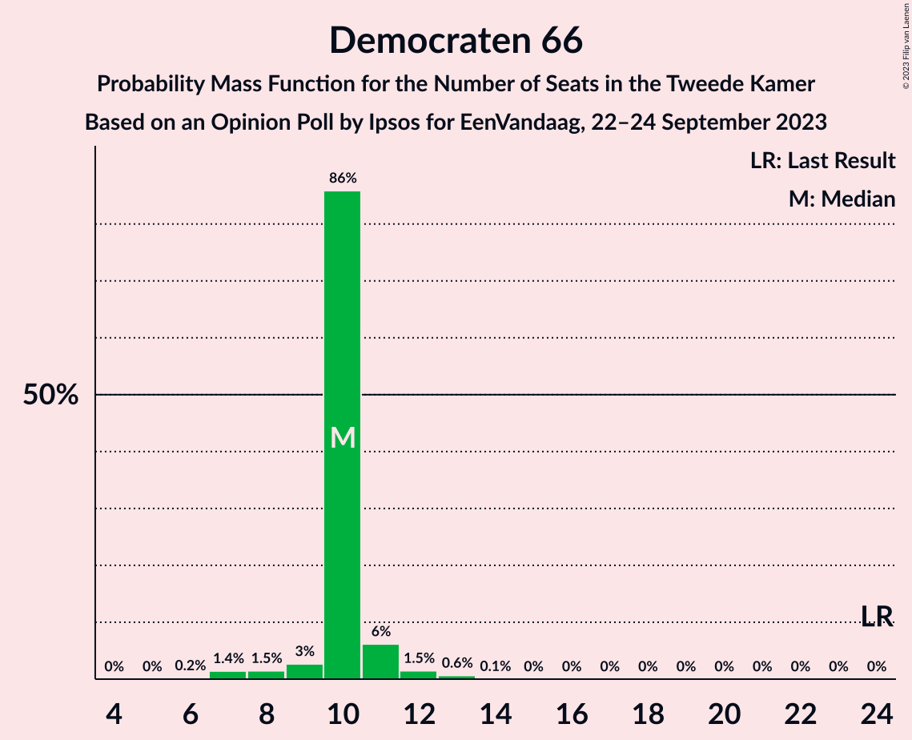
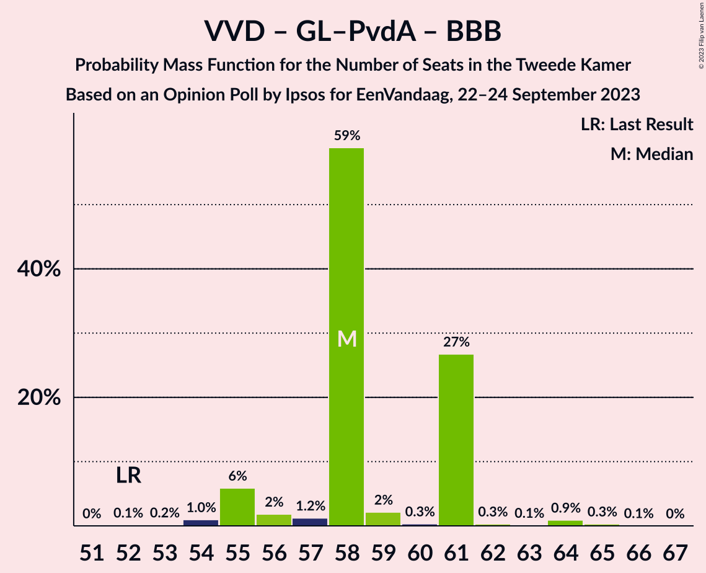
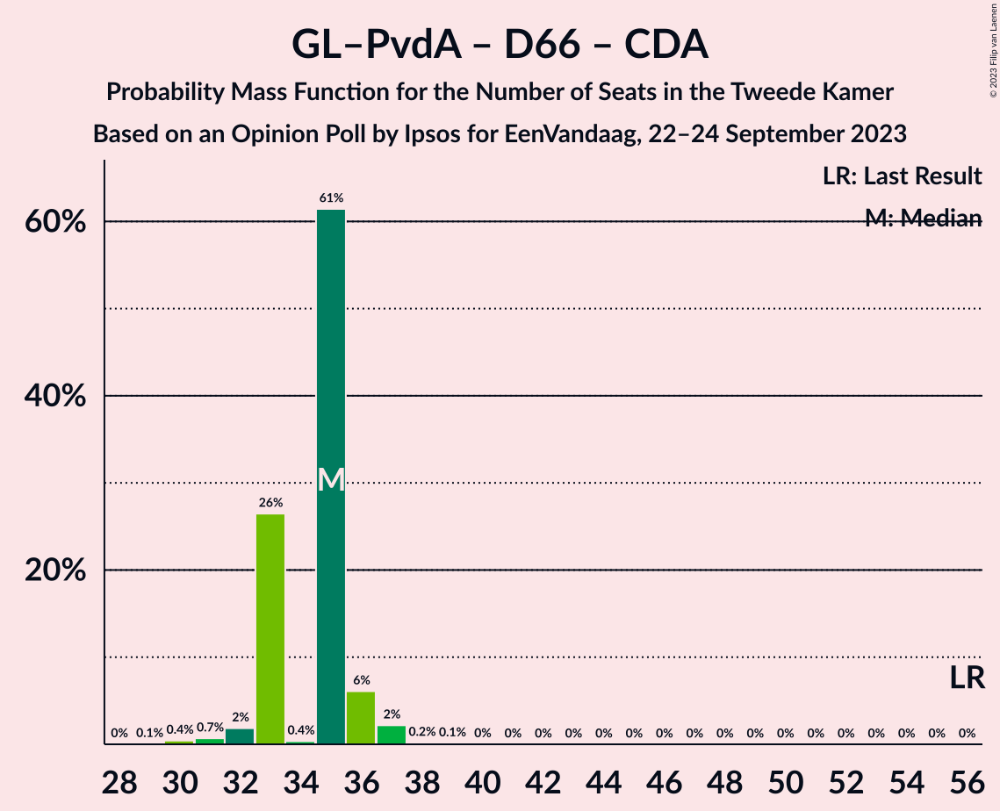
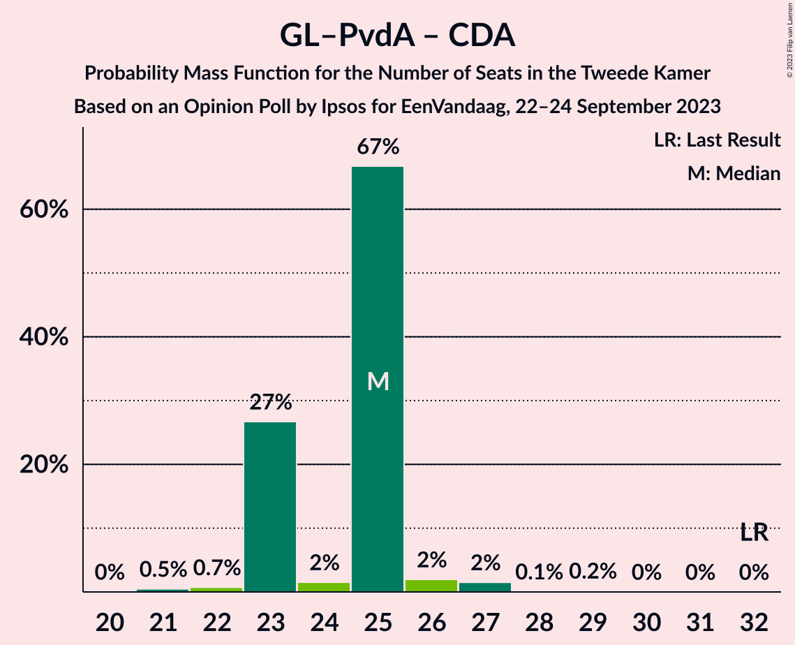

# Opinion Poll by Ipsos for EenVandaag, 22–24 September 2023

<a href="#voting-intentions">Voting Intentions</a> | <a href="#seats">Seats</a> | <a href="#coalitions">Coalitions</a> | <a href="#technical-information">Technical Information</a>

## Voting Intentions

### Confidence Intervals

| Party | Last Result | Poll Result | 80% Confidence Interval | 90% Confidence Interval | 95% Confidence Interval | 99% Confidence Interval |
|:-----:|:-----------:|:-----------:|:-----------------------:|:-----------------------:|:-----------------------:|:-----------------------:|
| Volkspartij voor Vrijheid en Democratie | 21.9% | 17.2% | 15.7–18.8% |15.3–19.2% |15.0–19.6% |14.3–20.4% |
| Nieuw Sociaal Contract | 0.0% | 15.8% | 14.4–17.3% |14.0–17.8% |13.7–18.2% |13.0–18.9% |
| GroenLinks–Partij van de Arbeid | 10.9% | 13.3% | 12.0–14.8% |11.7–15.2% |11.4–15.6% |10.8–16.3% |
| Partij voor de Vrijheid | 10.8% | 11.4% | 10.2–12.7% |9.8–13.1% |9.6–13.5% |9.0–14.2% |
| BoerBurgerBeweging | 1.0% | 8.2% | 7.2–9.4% |6.9–9.8% |6.7–10.1% |6.2–10.7% |
| Democraten 66 | 15.0% | 6.1% | 5.2–7.1% |5.0–7.5% |4.8–7.7% |4.4–8.3% |
| Partij voor de Dieren | 3.8% | 4.9% | 4.1–5.9% |3.9–6.2% |3.7–6.4% |3.4–6.9% |
| ChristenUnie | 3.4% | 3.4% | 2.8–4.3% |2.6–4.5% |2.5–4.7% |2.2–5.2% |
| Socialistische Partij | 6.0% | 3.2% | 2.6–4.1% |2.5–4.3% |2.3–4.5% |2.0–5.0% |
| Christen-Democratisch Appèl | 9.5% | 2.9% | 2.4–3.7% |2.2–4.0% |2.1–4.2% |1.8–4.6% |
| Forum voor Democratie | 5.0% | 2.4% | 1.8–3.1% |1.7–3.3% |1.6–3.5% |1.4–3.9% |
| DENK | 2.0% | 2.4% | 1.8–3.1% |1.7–3.3% |1.6–3.5% |1.4–3.9% |
| Juiste Antwoord 2021 | 2.4% | 2.2% | 1.7–2.9% |1.5–3.1% |1.4–3.2% |1.2–3.6% |
| Volt Europa | 2.4% | 2.1% | 1.6–2.8% |1.5–3.0% |1.3–3.1% |1.2–3.5% |
| Staatkundig Gereformeerde Partij | 2.1% | 2.1% | 1.6–2.8% |1.5–3.0% |1.3–3.1% |1.2–3.5% |
| Bij1 | 0.8% | 1.0% | 0.7–1.5% |0.6–1.7% |0.5–1.8% |0.4–2.1% |
| 50Plus | 1.0% | 0.5% | 0.3–0.9% |0.2–1.0% |0.2–1.1% |0.1–1.4% |

*Note:* The poll result column reflects the actual value used in the calculations. Published results may vary slightly, and in addition be rounded to fewer digits.

## Seats

### Confidence Intervals

| Party | Last Result | Median | 80% Confidence Interval | 90% Confidence Interval | 95% Confidence Interval | 99% Confidence Interval |
|:-----:|:-----------:|:------:|:-----------------------:|:-----------------------:|:-----------------------:|:-----------------------:|
| <a href="#volkspartij-voor-vrijheid-en-democratie">Volkspartij voor Vrijheid en Democratie</a> | 34 | 26 | 26–31 |24–31 |24–31 |22–32 |
| <a href="#nieuw-sociaal-contract">Nieuw Sociaal Contract</a> | 0 | 23 | 23–29 |22–29 |22–29 |21–30 |
| <a href="#groenlinks–partij-van-de-arbeid">GroenLinks–Partij van de Arbeid</a> | 17 | 20 | 19–20 |19–21 |19–21 |17–23 |
| <a href="#partij-voor-de-vrijheid">Partij voor de Vrijheid</a> | 17 | 17 | 16–17 |16–18 |15–18 |13–19 |
| <a href="#boerburgerbeweging">BoerBurgerBeweging</a> | 1 | 12 | 11–12 |11–12 |10–13 |9–15 |
| <a href="#democraten-66">Democraten 66</a> | 24 | 10 | 10 |9–11 |8–11 |7–13 |
| <a href="#partij-voor-de-dieren">Partij voor de Dieren</a> | 6 | 8 | 7–8 |7–8 |6–8 |6–9 |
| <a href="#christenunie">ChristenUnie</a> | 5 | 6 | 3–6 |3–6 |3–6 |3–8 |
| <a href="#socialistische-partij">Socialistische Partij</a> | 9 | 6 | 3–6 |3–7 |3–7 |3–7 |
| <a href="#christen-democratisch-appèl">Christen-Democratisch Appèl</a> | 15 | 5 | 4–5 |4–5 |4–5 |3–6 |
| <a href="#forum-voor-democratie">Forum voor Democratie</a> | 8 | 4 | 2–4 |2–4 |2–5 |2–5 |
| <a href="#denk">DENK</a> | 3 | 4 | 3–4 |3–4 |3–4 |2–5 |
| <a href="#juiste-antwoord-2021">Juiste Antwoord 2021</a> | 3 | 3 | 2–3 |2–3 |2–4 |1–5 |
| <a href="#volt-europa">Volt Europa</a> | 3 | 2 | 2–3 |2–3 |2–4 |1–5 |
| <a href="#staatkundig-gereformeerde-partij">Staatkundig Gereformeerde Partij</a> | 3 | 2 | 2–4 |2–6 |2–6 |2–6 |
| <a href="#bij1">Bij1</a> | 1 | 1 | 1 |1 |1–2 |1–2 |
| <a href="#50plus">50Plus</a> | 1 | 0 | 0 |0 |0–1 |0–1 |

### Volkspartij voor Vrijheid en Democratie

*For a full overview of the results for this party, see the [Volkspartij voor Vrijheid en Democratie](party-volkspartijvoorvrijheidendemocratie.html) page.*

| Number of Seats | Probability | Accumulated | Special Marks |
|:---------------:|:-----------:|:-----------:|:-------------:|
| 20 | 0.1% | 100% |  |
| 21 | 0% | 99.9% |  |
| 22 | 1.4% | 99.8% |  |
| 23 | 0.2% | 98% |  |
| 24 | 5% | 98% |  |
| 25 | 3% | 93% |  |
| 26 | 59% | 90% | Median |
| 27 | 2% | 31% |  |
| 28 | 0.6% | 30% |  |
| 29 | 2% | 29% |  |
| 30 | 0.3% | 27% |  |
| 31 | 26% | 27% |  |
| 32 | 0.9% | 0.9% |  |
| 33 | 0% | 0% |  |
| 34 | 0% | 0% | Last Result |

### Nieuw Sociaal Contract

*For a full overview of the results for this party, see the [Nieuw Sociaal Contract](party-nieuwsociaalcontract.html) page.*

| Number of Seats | Probability | Accumulated | Special Marks |
|:---------------:|:-----------:|:-----------:|:-------------:|
| 0 | 0% | 100% | Last Result |
| 1 | 0% | 100% |  |
| 2 | 0% | 100% |  |
| 3 | 0% | 100% |  |
| 4 | 0% | 100% |  |
| 5 | 0% | 100% |  |
| 6 | 0% | 100% |  |
| 7 | 0% | 100% |  |
| 8 | 0% | 100% |  |
| 9 | 0% | 100% |  |
| 10 | 0% | 100% |  |
| 11 | 0% | 100% |  |
| 12 | 0% | 100% |  |
| 13 | 0% | 100% |  |
| 14 | 0% | 100% |  |
| 15 | 0% | 100% |  |
| 16 | 0% | 100% |  |
| 17 | 0% | 100% |  |
| 18 | 0% | 100% |  |
| 19 | 0.1% | 100% |  |
| 20 | 0.3% | 99.9% |  |
| 21 | 0.8% | 99.6% |  |
| 22 | 5% | 98.8% |  |
| 23 | 62% | 93% | Median |
| 24 | 0.6% | 32% |  |
| 25 | 2% | 31% |  |
| 26 | 1.2% | 30% |  |
| 27 | 0.5% | 28% |  |
| 28 | 0.4% | 28% |  |
| 29 | 26% | 27% |  |
| 30 | 1.3% | 1.4% |  |
| 31 | 0% | 0.1% |  |
| 32 | 0.1% | 0.1% |  |
| 33 | 0% | 0% |  |

### GroenLinks–Partij van de Arbeid

*For a full overview of the results for this party, see the [GroenLinks–Partij van de Arbeid](party-groenlinks–partijvandearbeid.html) page.*

| Number of Seats | Probability | Accumulated | Special Marks |
|:---------------:|:-----------:|:-----------:|:-------------:|
| 16 | 0.3% | 100% |  |
| 17 | 0.4% | 99.7% | Last Result |
| 18 | 0.5% | 99.3% |  |
| 19 | 28% | 98.8% |  |
| 20 | 65% | 71% | Median |
| 21 | 4% | 6% |  |
| 22 | 2% | 2% |  |
| 23 | 0.5% | 0.6% |  |
| 24 | 0.1% | 0.1% |  |
| 25 | 0% | 0.1% |  |
| 26 | 0% | 0% |  |

### Partij voor de Vrijheid

*For a full overview of the results for this party, see the [Partij voor de Vrijheid](party-partijvoordevrijheid.html) page.*

| Number of Seats | Probability | Accumulated | Special Marks |
|:---------------:|:-----------:|:-----------:|:-------------:|
| 13 | 0.5% | 100% |  |
| 14 | 1.1% | 99.5% |  |
| 15 | 2% | 98% |  |
| 16 | 27% | 96% |  |
| 17 | 64% | 70% | Last Result, Median |
| 18 | 5% | 6% |  |
| 19 | 0.5% | 1.0% |  |
| 20 | 0.3% | 0.5% |  |
| 21 | 0.1% | 0.2% |  |
| 22 | 0% | 0% |  |

### BoerBurgerBeweging

*For a full overview of the results for this party, see the [BoerBurgerBeweging](party-boerburgerbeweging.html) page.*

| Number of Seats | Probability | Accumulated | Special Marks |
|:---------------:|:-----------:|:-----------:|:-------------:|
| 1 | 0% | 100% | Last Result |
| 2 | 0% | 100% |  |
| 3 | 0% | 100% |  |
| 4 | 0% | 100% |  |
| 5 | 0% | 100% |  |
| 6 | 0% | 100% |  |
| 7 | 0% | 100% |  |
| 8 | 0% | 100% |  |
| 9 | 2% | 100% |  |
| 10 | 2% | 98% |  |
| 11 | 32% | 96% |  |
| 12 | 61% | 64% | Median |
| 13 | 1.5% | 3% |  |
| 14 | 0.8% | 2% |  |
| 15 | 0.6% | 0.7% |  |
| 16 | 0.1% | 0.1% |  |
| 17 | 0% | 0% |  |

### Democraten 66

*For a full overview of the results for this party, see the [Democraten 66](party-democraten66.html) page.*

| Number of Seats | Probability | Accumulated | Special Marks |
|:---------------:|:-----------:|:-----------:|:-------------:|
| 6 | 0.2% | 100% |  |
| 7 | 1.4% | 99.8% |  |
| 8 | 1.5% | 98% |  |
| 9 | 3% | 97% |  |
| 10 | 86% | 94% | Median |
| 11 | 6% | 8% |  |
| 12 | 1.5% | 2% |  |
| 13 | 0.6% | 0.7% |  |
| 14 | 0.1% | 0.1% |  |
| 15 | 0% | 0% |  |
| 16 | 0% | 0% |  |
| 17 | 0% | 0% |  |
| 18 | 0% | 0% |  |
| 19 | 0% | 0% |  |
| 20 | 0% | 0% |  |
| 21 | 0% | 0% |  |
| 22 | 0% | 0% |  |
| 23 | 0% | 0% |  |
| 24 | 0% | 0% | Last Result |

### Partij voor de Dieren

*For a full overview of the results for this party, see the [Partij voor de Dieren](party-partijvoordedieren.html) page.*

| Number of Seats | Probability | Accumulated | Special Marks |
|:---------------:|:-----------:|:-----------:|:-------------:|
| 4 | 0.1% | 100% |  |
| 5 | 0% | 99.9% |  |
| 6 | 3% | 99.8% | Last Result |
| 7 | 33% | 97% |  |
| 8 | 62% | 64% | Median |
| 9 | 2% | 2% |  |
| 10 | 0.3% | 0.4% |  |
| 11 | 0.1% | 0.1% |  |
| 12 | 0% | 0% |  |

### ChristenUnie

*For a full overview of the results for this party, see the [ChristenUnie](party-christenunie.html) page.*

| Number of Seats | Probability | Accumulated | Special Marks |
|:---------------:|:-----------:|:-----------:|:-------------:|
| 2 | 0.1% | 100% |  |
| 3 | 27% | 99.9% |  |
| 4 | 2% | 72% |  |
| 5 | 8% | 71% | Last Result |
| 6 | 60% | 62% | Median |
| 7 | 2% | 2% |  |
| 8 | 0.5% | 0.5% |  |
| 9 | 0% | 0% |  |

### Socialistische Partij

*For a full overview of the results for this party, see the [Socialistische Partij](party-socialistischepartij.html) page.*

| Number of Seats | Probability | Accumulated | Special Marks |
|:---------------:|:-----------:|:-----------:|:-------------:|
| 3 | 28% | 100% |  |
| 4 | 5% | 72% |  |
| 5 | 2% | 67% |  |
| 6 | 59% | 65% | Median |
| 7 | 6% | 6% |  |
| 8 | 0.3% | 0.3% |  |
| 9 | 0% | 0% | Last Result |

### Christen-Democratisch Appèl

*For a full overview of the results for this party, see the [Christen-Democratisch Appèl](party-christen-democratischappèl.html) page.*

| Number of Seats | Probability | Accumulated | Special Marks |
|:---------------:|:-----------:|:-----------:|:-------------:|
| 2 | 0.1% | 100% |  |
| 3 | 2% | 99.8% |  |
| 4 | 28% | 98% |  |
| 5 | 69% | 70% | Median |
| 6 | 0.5% | 0.9% |  |
| 7 | 0.1% | 0.3% |  |
| 8 | 0.2% | 0.2% |  |
| 9 | 0% | 0% |  |
| 10 | 0% | 0% |  |
| 11 | 0% | 0% |  |
| 12 | 0% | 0% |  |
| 13 | 0% | 0% |  |
| 14 | 0% | 0% |  |
| 15 | 0% | 0% | Last Result |

### Forum voor Democratie

*For a full overview of the results for this party, see the [Forum voor Democratie](party-forumvoordemocratie.html) page.*

| Number of Seats | Probability | Accumulated | Special Marks |
|:---------------:|:-----------:|:-----------:|:-------------:|
| 1 | 0.5% | 100% |  |
| 2 | 26% | 99.5% |  |
| 3 | 8% | 73% |  |
| 4 | 62% | 65% | Median |
| 5 | 3% | 3% |  |
| 6 | 0.4% | 0.5% |  |
| 7 | 0.1% | 0.1% |  |
| 8 | 0% | 0% | Last Result |

### DENK

*For a full overview of the results for this party, see the [DENK](party-denk.html) page.*

| Number of Seats | Probability | Accumulated | Special Marks |
|:---------------:|:-----------:|:-----------:|:-------------:|
| 1 | 0.2% | 100% |  |
| 2 | 1.3% | 99.8% |  |
| 3 | 35% | 98% | Last Result |
| 4 | 62% | 63% | Median |
| 5 | 1.0% | 1.1% |  |
| 6 | 0.1% | 0.1% |  |
| 7 | 0% | 0% |  |

### Juiste Antwoord 2021

*For a full overview of the results for this party, see the [Juiste Antwoord 2021](party-juisteantwoord2021.html) page.*

| Number of Seats | Probability | Accumulated | Special Marks |
|:---------------:|:-----------:|:-----------:|:-------------:|
| 1 | 0.5% | 100% |  |
| 2 | 28% | 99.5% |  |
| 3 | 68% | 71% | Last Result, Median |
| 4 | 1.3% | 3% |  |
| 5 | 2% | 2% |  |
| 6 | 0.1% | 0.1% |  |
| 7 | 0% | 0% |  |

### Volt Europa

*For a full overview of the results for this party, see the [Volt Europa](party-volteuropa.html) page.*

| Number of Seats | Probability | Accumulated | Special Marks |
|:---------------:|:-----------:|:-----------:|:-------------:|
| 1 | 0.7% | 100% |  |
| 2 | 62% | 99.3% | Median |
| 3 | 34% | 38% | Last Result |
| 4 | 2% | 3% |  |
| 5 | 0.9% | 1.3% |  |
| 6 | 0.3% | 0.3% |  |
| 7 | 0% | 0% |  |

### Staatkundig Gereformeerde Partij

*For a full overview of the results for this party, see the [Staatkundig Gereformeerde Partij](party-staatkundiggereformeerdepartij.html) page.*

| Number of Seats | Probability | Accumulated | Special Marks |
|:---------------:|:-----------:|:-----------:|:-------------:|
| 1 | 0.2% | 100% |  |
| 2 | 62% | 99.8% | Median |
| 3 | 4% | 38% | Last Result |
| 4 | 29% | 34% |  |
| 5 | 0.3% | 6% |  |
| 6 | 5% | 5% |  |
| 7 | 0% | 0% |  |

### Bij1

*For a full overview of the results for this party, see the [Bij1](party-bij1.html) page.*

| Number of Seats | Probability | Accumulated | Special Marks |
|:---------------:|:-----------:|:-----------:|:-------------:|
| 0 | 0.4% | 100% |  |
| 1 | 97% | 99.6% | Last Result, Median |
| 2 | 3% | 3% |  |
| 3 | 0.2% | 0.2% |  |
| 4 | 0% | 0% |  |

### 50Plus

*For a full overview of the results for this party, see the [50Plus](party-50plus.html) page.*

| Number of Seats | Probability | Accumulated | Special Marks |
|:---------------:|:-----------:|:-----------:|:-------------:|
| 0 | 96% | 100% | Median |
| 1 | 4% | 4% | Last Result |
| 2 | 0.1% | 0.1% |  |
| 3 | 0.1% | 0.1% |  |
| 4 | 0% | 0% |  |

## Coalitions

### Confidence Intervals

| Coalition | Last Result | Median | Majority? | 80% Confidence Interval | 90% Confidence Interval | 95% Confidence Interval | 99% Confidence Interval |
|:---------:|:-----------:|:------:|:---------:|:-----------------------:|:-----------------------:|:-----------------------:|:-----------------------:|
| Volkspartij voor Vrijheid en Democratie – GroenLinks–Partij van de Arbeid – BoerBurgerBeweging – Christen-Democratisch Appèl | 67 | 63 | 0% | 62–65 | 60–65 | 60–65 | 58–69 |
| Volkspartij voor Vrijheid en Democratie – GroenLinks–Partij van de Arbeid – BoerBurgerBeweging | 52 | 58 | 0% | 57–61 | 55–61 | 55–61 | 54–64 |
| Volkspartij voor Vrijheid en Democratie – GroenLinks–Partij van de Arbeid – Democraten 66 | 75 | 56 | 0% | 55–60 | 55–60 | 53–60 | 50–62 |
| Volkspartij voor Vrijheid en Democratie – Partij voor de Vrijheid – Christen-Democratisch Appèl – Forum voor Democratie – Staatkundig Gereformeerde Partij | 77 | 54 | 0% | 54–57 | 54–57 | 51–57 | 49–60 |
| Volkspartij voor Vrijheid en Democratie – Partij voor de Vrijheid – Christen-Democratisch Appèl – Forum voor Democratie | 74 | 52 | 0% | 51–53 | 49–53 | 48–55 | 45–56 |
| Volkspartij voor Vrijheid en Democratie – GroenLinks–Partij van de Arbeid – Christen-Democratisch Appèl | 66 | 51 | 0% | 51–54 | 49–54 | 49–54 | 46–57 |
| Volkspartij voor Vrijheid en Democratie – Partij voor de Vrijheid – Christen-Democratisch Appèl | 66 | 48 | 0% | 48–51 | 46–51 | 45–51 | 42–53 |
| Volkspartij voor Vrijheid en Democratie – GroenLinks–Partij van de Arbeid | 51 | 46 | 0% | 46–50 | 44–50 | 44–50 | 42–52 |
| Volkspartij voor Vrijheid en Democratie – Democraten 66 – ChristenUnie – Christen-Democratisch Appèl | 78 | 47 | 0% | 45–48 | 44–48 | 42–49 | 40–52 |
| GroenLinks–Partij van de Arbeid – Democraten 66 – ChristenUnie – Socialistische Partij – Christen-Democratisch Appèl | 70 | 47 | 0% | 39–47 | 39–48 | 39–48 | 39–48 |
| Volkspartij voor Vrijheid en Democratie – BoerBurgerBeweging – Christen-Democratisch Appèl | 50 | 43 | 0% | 42–46 | 40–46 | 40–46 | 37–49 |
| Volkspartij voor Vrijheid en Democratie – Democraten 66 – Christen-Democratisch Appèl | 73 | 41 | 0% | 40–45 | 39–45 | 38–45 | 35–45 |
| GroenLinks–Partij van de Arbeid – Democraten 66 – ChristenUnie – Christen-Democratisch Appèl | 61 | 41 | 0% | 36–41 | 36–41 | 36–42 | 35–44 |
| Volkspartij voor Vrijheid en Democratie – Christen-Democratisch Appèl – Forum voor Democratie – Staatkundig Gereformeerde Partij – 50Plus | 61 | 37 | 0% | 37–41 | 37–41 | 35–41 | 33–45 |
| Volkspartij voor Vrijheid en Democratie – Christen-Democratisch Appèl – Forum voor Democratie – Staatkundig Gereformeerde Partij | 60 | 37 | 0% | 37–41 | 37–41 | 35–41 | 33–45 |
| Volkspartij voor Vrijheid en Democratie – Christen-Democratisch Appèl – Forum voor Democratie – 50Plus | 58 | 35 | 0% | 35–37 | 32–37 | 32–37 | 30–41 |
| GroenLinks–Partij van de Arbeid – Democraten 66 – Christen-Democratisch Appèl | 56 | 35 | 0% | 33–35 | 33–36 | 32–37 | 30–37 |
| Volkspartij voor Vrijheid en Democratie – Christen-Democratisch Appèl – Forum voor Democratie | 57 | 35 | 0% | 35–37 | 32–37 | 32–37 | 30–41 |
| Volkspartij voor Vrijheid en Democratie – Christen-Democratisch Appèl | 49 | 31 | 0% | 30–35 | 29–35 | 28–35 | 27–37 |
| GroenLinks–Partij van de Arbeid – BoerBurgerBeweging | 18 | 32 | 0% | 30–32 | 30–32 | 30–32 | 29–36 |
| GroenLinks–Partij van de Arbeid – ChristenUnie – Christen-Democratisch Appèl | 37 | 31 | 0% | 26–31 | 26–31 | 26–32 | 26–33 |
| GroenLinks–Partij van de Arbeid – Christen-Democratisch Appèl | 32 | 25 | 0% | 23–25 | 23–25 | 23–26 | 21–27 |
| Democraten 66 – Christen-Democratisch Appèl | 39 | 15 | 0% | 14–15 | 14–16 | 13–16 | 11–18 |

### Volkspartij voor Vrijheid en Democratie – GroenLinks–Partij van de Arbeid – BoerBurgerBeweging – Christen-Democratisch Appèl

| Number of Seats | Probability | Accumulated | Special Marks |
|:---------------:|:-----------:|:-----------:|:-------------:|
| 56 | 0% | 100% |  |
| 57 | 0% | 99.9% |  |
| 58 | 0.8% | 99.9% |  |
| 59 | 0.9% | 99.1% |  |
| 60 | 6% | 98% |  |
| 61 | 2% | 92% |  |
| 62 | 0.8% | 90% |  |
| 63 | 60% | 90% | Median |
| 64 | 0.9% | 29% |  |
| 65 | 26% | 28% |  |
| 66 | 0.6% | 2% |  |
| 67 | 0.1% | 2% | Last Result |
| 68 | 0.4% | 1.4% |  |
| 69 | 1.0% | 1.0% |  |
| 70 | 0% | 0.1% |  |
| 71 | 0% | 0% |  |

### Volkspartij voor Vrijheid en Democratie – GroenLinks–Partij van de Arbeid – BoerBurgerBeweging

| Number of Seats | Probability | Accumulated | Special Marks |
|:---------------:|:-----------:|:-----------:|:-------------:|
| 52 | 0.1% | 100% | Last Result |
| 53 | 0.2% | 99.8% |  |
| 54 | 1.0% | 99.7% |  |
| 55 | 6% | 98.7% |  |
| 56 | 2% | 93% |  |
| 57 | 1.2% | 91% |  |
| 58 | 59% | 90% | Median |
| 59 | 2% | 31% |  |
| 60 | 0.3% | 29% |  |
| 61 | 27% | 28% |  |
| 62 | 0.3% | 2% |  |
| 63 | 0.1% | 1.4% |  |
| 64 | 0.9% | 1.3% |  |
| 65 | 0.3% | 0.4% |  |
| 66 | 0.1% | 0.1% |  |
| 67 | 0% | 0% |  |

### Volkspartij voor Vrijheid en Democratie – GroenLinks–Partij van de Arbeid – Democraten 66

| Number of Seats | Probability | Accumulated | Special Marks |
|:---------------:|:-----------:|:-----------:|:-------------:|
| 48 | 0.1% | 100% |  |
| 49 | 0.1% | 99.9% |  |
| 50 | 0.6% | 99.8% |  |
| 51 | 0.2% | 99.2% |  |
| 52 | 1.3% | 99.0% |  |
| 53 | 0.3% | 98% |  |
| 54 | 0.9% | 97% |  |
| 55 | 7% | 97% |  |
| 56 | 59% | 90% | Median |
| 57 | 0.7% | 31% |  |
| 58 | 0.6% | 30% |  |
| 59 | 2% | 30% |  |
| 60 | 26% | 28% |  |
| 61 | 0.3% | 2% |  |
| 62 | 2% | 2% |  |
| 63 | 0.1% | 0.1% |  |
| 64 | 0% | 0% |  |
| 65 | 0% | 0% |  |
| 66 | 0% | 0% |  |
| 67 | 0% | 0% |  |
| 68 | 0% | 0% |  |
| 69 | 0% | 0% |  |
| 70 | 0% | 0% |  |
| 71 | 0% | 0% |  |
| 72 | 0% | 0% |  |
| 73 | 0% | 0% |  |
| 74 | 0% | 0% |  |
| 75 | 0% | 0% | Last Result |

### Volkspartij voor Vrijheid en Democratie – Partij voor de Vrijheid – Christen-Democratisch Appèl – Forum voor Democratie – Staatkundig Gereformeerde Partij

| Number of Seats | Probability | Accumulated | Special Marks |
|:---------------:|:-----------:|:-----------:|:-------------:|
| 47 | 0.1% | 100% |  |
| 48 | 0.1% | 99.9% |  |
| 49 | 0.5% | 99.8% |  |
| 50 | 0.8% | 99.3% |  |
| 51 | 1.2% | 98.5% |  |
| 52 | 0.4% | 97% |  |
| 53 | 1.5% | 97% |  |
| 54 | 59% | 95% | Median |
| 55 | 5% | 36% |  |
| 56 | 2% | 31% |  |
| 57 | 27% | 29% |  |
| 58 | 0.3% | 2% |  |
| 59 | 0.4% | 2% |  |
| 60 | 1.0% | 1.2% |  |
| 61 | 0.2% | 0.2% |  |
| 62 | 0% | 0% |  |
| 63 | 0% | 0% |  |
| 64 | 0% | 0% |  |
| 65 | 0% | 0% |  |
| 66 | 0% | 0% |  |
| 67 | 0% | 0% |  |
| 68 | 0% | 0% |  |
| 69 | 0% | 0% |  |
| 70 | 0% | 0% |  |
| 71 | 0% | 0% |  |
| 72 | 0% | 0% |  |
| 73 | 0% | 0% |  |
| 74 | 0% | 0% |  |
| 75 | 0% | 0% |  |
| 76 | 0% | 0% | Majority |
| 77 | 0% | 0% | Last Result |

### Volkspartij voor Vrijheid en Democratie – Partij voor de Vrijheid – Christen-Democratisch Appèl – Forum voor Democratie

| Number of Seats | Probability | Accumulated | Special Marks |
|:---------------:|:-----------:|:-----------:|:-------------:|
| 45 | 0.5% | 100% |  |
| 46 | 0.6% | 99.4% |  |
| 47 | 0.5% | 98.8% |  |
| 48 | 1.3% | 98% |  |
| 49 | 5% | 97% |  |
| 50 | 0.5% | 92% |  |
| 51 | 1.5% | 91% |  |
| 52 | 59% | 90% | Median |
| 53 | 27% | 31% |  |
| 54 | 0.5% | 4% |  |
| 55 | 2% | 3% |  |
| 56 | 1.2% | 2% |  |
| 57 | 0.1% | 0.3% |  |
| 58 | 0.1% | 0.2% |  |
| 59 | 0.1% | 0.1% |  |
| 60 | 0% | 0% |  |
| 61 | 0% | 0% |  |
| 62 | 0% | 0% |  |
| 63 | 0% | 0% |  |
| 64 | 0% | 0% |  |
| 65 | 0% | 0% |  |
| 66 | 0% | 0% |  |
| 67 | 0% | 0% |  |
| 68 | 0% | 0% |  |
| 69 | 0% | 0% |  |
| 70 | 0% | 0% |  |
| 71 | 0% | 0% |  |
| 72 | 0% | 0% |  |
| 73 | 0% | 0% |  |
| 74 | 0% | 0% | Last Result |

### Volkspartij voor Vrijheid en Democratie – GroenLinks–Partij van de Arbeid – Christen-Democratisch Appèl

| Number of Seats | Probability | Accumulated | Special Marks |
|:---------------:|:-----------:|:-----------:|:-------------:|
| 43 | 0% | 100% |  |
| 44 | 0% | 99.9% |  |
| 45 | 0.3% | 99.9% |  |
| 46 | 0.2% | 99.7% |  |
| 47 | 0.8% | 99.5% |  |
| 48 | 0.6% | 98.7% |  |
| 49 | 7% | 98% |  |
| 50 | 0.6% | 91% |  |
| 51 | 61% | 91% | Median |
| 52 | 0.2% | 30% |  |
| 53 | 0.2% | 30% |  |
| 54 | 28% | 30% |  |
| 55 | 0.1% | 1.2% |  |
| 56 | 0.1% | 1.1% |  |
| 57 | 0.9% | 1.0% |  |
| 58 | 0% | 0.1% |  |
| 59 | 0.1% | 0.1% |  |
| 60 | 0% | 0% |  |
| 61 | 0% | 0% |  |
| 62 | 0% | 0% |  |
| 63 | 0% | 0% |  |
| 64 | 0% | 0% |  |
| 65 | 0% | 0% |  |
| 66 | 0% | 0% | Last Result |

### Volkspartij voor Vrijheid en Democratie – Partij voor de Vrijheid – Christen-Democratisch Appèl

| Number of Seats | Probability | Accumulated | Special Marks |
|:---------------:|:-----------:|:-----------:|:-------------:|
| 42 | 0.6% | 100% |  |
| 43 | 0.8% | 99.3% |  |
| 44 | 1.0% | 98.6% |  |
| 45 | 0.9% | 98% |  |
| 46 | 6% | 97% |  |
| 47 | 0.1% | 91% |  |
| 48 | 60% | 90% | Median |
| 49 | 0.4% | 30% |  |
| 50 | 0.7% | 30% |  |
| 51 | 28% | 29% |  |
| 52 | 1.0% | 2% |  |
| 53 | 0.4% | 0.6% |  |
| 54 | 0% | 0.1% |  |
| 55 | 0.1% | 0.1% |  |
| 56 | 0% | 0% |  |
| 57 | 0% | 0% |  |
| 58 | 0% | 0% |  |
| 59 | 0% | 0% |  |
| 60 | 0% | 0% |  |
| 61 | 0% | 0% |  |
| 62 | 0% | 0% |  |
| 63 | 0% | 0% |  |
| 64 | 0% | 0% |  |
| 65 | 0% | 0% |  |
| 66 | 0% | 0% | Last Result |

### Volkspartij voor Vrijheid en Democratie – GroenLinks–Partij van de Arbeid

| Number of Seats | Probability | Accumulated | Special Marks |
|:---------------:|:-----------:|:-----------:|:-------------:|
| 39 | 0.2% | 100% |  |
| 40 | 0% | 99.8% |  |
| 41 | 0.3% | 99.8% |  |
| 42 | 0.5% | 99.5% |  |
| 43 | 0.5% | 99.0% |  |
| 44 | 7% | 98% |  |
| 45 | 0.4% | 92% |  |
| 46 | 61% | 91% | Median |
| 47 | 0.6% | 30% |  |
| 48 | 0.2% | 30% |  |
| 49 | 0.7% | 30% |  |
| 50 | 28% | 29% |  |
| 51 | 0.3% | 1.4% | Last Result |
| 52 | 0.9% | 1.0% |  |
| 53 | 0.1% | 0.1% |  |
| 54 | 0% | 0% |  |

### Volkspartij voor Vrijheid en Democratie – Democraten 66 – ChristenUnie – Christen-Democratisch Appèl

| Number of Seats | Probability | Accumulated | Special Marks |
|:---------------:|:-----------:|:-----------:|:-------------:|
| 37 | 0.1% | 100% |  |
| 38 | 0% | 99.9% |  |
| 39 | 0.3% | 99.9% |  |
| 40 | 0.9% | 99.7% |  |
| 41 | 0.3% | 98.7% |  |
| 42 | 2% | 98% |  |
| 43 | 1.1% | 97% |  |
| 44 | 0.7% | 96% |  |
| 45 | 6% | 95% |  |
| 46 | 0.6% | 89% |  |
| 47 | 59% | 89% | Median |
| 48 | 26% | 30% |  |
| 49 | 1.2% | 4% |  |
| 50 | 0.2% | 2% |  |
| 51 | 0.7% | 2% |  |
| 52 | 1.5% | 2% |  |
| 53 | 0.1% | 0.1% |  |
| 54 | 0% | 0% |  |
| 55 | 0% | 0% |  |
| 56 | 0% | 0% |  |
| 57 | 0% | 0% |  |
| 58 | 0% | 0% |  |
| 59 | 0% | 0% |  |
| 60 | 0% | 0% |  |
| 61 | 0% | 0% |  |
| 62 | 0% | 0% |  |
| 63 | 0% | 0% |  |
| 64 | 0% | 0% |  |
| 65 | 0% | 0% |  |
| 66 | 0% | 0% |  |
| 67 | 0% | 0% |  |
| 68 | 0% | 0% |  |
| 69 | 0% | 0% |  |
| 70 | 0% | 0% |  |
| 71 | 0% | 0% |  |
| 72 | 0% | 0% |  |
| 73 | 0% | 0% |  |
| 74 | 0% | 0% |  |
| 75 | 0% | 0% |  |
| 76 | 0% | 0% | Majority |
| 77 | 0% | 0% |  |
| 78 | 0% | 0% | Last Result |

### GroenLinks–Partij van de Arbeid – Democraten 66 – ChristenUnie – Socialistische Partij – Christen-Democratisch Appèl

| Number of Seats | Probability | Accumulated | Special Marks |
|:---------------:|:-----------:|:-----------:|:-------------:|
| 37 | 0.1% | 100% |  |
| 38 | 0% | 99.9% |  |
| 39 | 26% | 99.9% |  |
| 40 | 0.4% | 73% |  |
| 41 | 1.2% | 73% |  |
| 42 | 2% | 72% |  |
| 43 | 0.4% | 70% |  |
| 44 | 2% | 70% |  |
| 45 | 0.9% | 68% |  |
| 46 | 0.3% | 67% |  |
| 47 | 60% | 67% | Median |
| 48 | 6% | 6% |  |
| 49 | 0.2% | 0.2% |  |
| 50 | 0% | 0.1% |  |
| 51 | 0% | 0% |  |
| 52 | 0% | 0% |  |
| 53 | 0% | 0% |  |
| 54 | 0% | 0% |  |
| 55 | 0% | 0% |  |
| 56 | 0% | 0% |  |
| 57 | 0% | 0% |  |
| 58 | 0% | 0% |  |
| 59 | 0% | 0% |  |
| 60 | 0% | 0% |  |
| 61 | 0% | 0% |  |
| 62 | 0% | 0% |  |
| 63 | 0% | 0% |  |
| 64 | 0% | 0% |  |
| 65 | 0% | 0% |  |
| 66 | 0% | 0% |  |
| 67 | 0% | 0% |  |
| 68 | 0% | 0% |  |
| 69 | 0% | 0% |  |
| 70 | 0% | 0% | Last Result |

### Volkspartij voor Vrijheid en Democratie – BoerBurgerBeweging – Christen-Democratisch Appèl

| Number of Seats | Probability | Accumulated | Special Marks |
|:---------------:|:-----------:|:-----------:|:-------------:|
| 37 | 0.8% | 100% |  |
| 38 | 0.1% | 99.2% |  |
| 39 | 1.1% | 99.1% |  |
| 40 | 7% | 98% |  |
| 41 | 0.4% | 91% |  |
| 42 | 2% | 91% |  |
| 43 | 59% | 89% | Median |
| 44 | 0.9% | 30% |  |
| 45 | 1.2% | 29% |  |
| 46 | 26% | 28% |  |
| 47 | 0.3% | 1.3% |  |
| 48 | 0.2% | 1.1% |  |
| 49 | 0.8% | 0.9% |  |
| 50 | 0% | 0.1% | Last Result |
| 51 | 0% | 0.1% |  |
| 52 | 0% | 0% |  |

### Volkspartij voor Vrijheid en Democratie – Democraten 66 – Christen-Democratisch Appèl

| Number of Seats | Probability | Accumulated | Special Marks |
|:---------------:|:-----------:|:-----------:|:-------------:|
| 33 | 0.1% | 100% |  |
| 34 | 0.1% | 99.9% |  |
| 35 | 1.0% | 99.8% |  |
| 36 | 0.5% | 98.8% |  |
| 37 | 0.6% | 98% |  |
| 38 | 0.7% | 98% |  |
| 39 | 2% | 97% |  |
| 40 | 5% | 95% |  |
| 41 | 60% | 90% | Median |
| 42 | 0.4% | 30% |  |
| 43 | 0.3% | 30% |  |
| 44 | 1.0% | 29% |  |
| 45 | 28% | 28% |  |
| 46 | 0% | 0.2% |  |
| 47 | 0.1% | 0.1% |  |
| 48 | 0.1% | 0.1% |  |
| 49 | 0% | 0% |  |
| 50 | 0% | 0% |  |
| 51 | 0% | 0% |  |
| 52 | 0% | 0% |  |
| 53 | 0% | 0% |  |
| 54 | 0% | 0% |  |
| 55 | 0% | 0% |  |
| 56 | 0% | 0% |  |
| 57 | 0% | 0% |  |
| 58 | 0% | 0% |  |
| 59 | 0% | 0% |  |
| 60 | 0% | 0% |  |
| 61 | 0% | 0% |  |
| 62 | 0% | 0% |  |
| 63 | 0% | 0% |  |
| 64 | 0% | 0% |  |
| 65 | 0% | 0% |  |
| 66 | 0% | 0% |  |
| 67 | 0% | 0% |  |
| 68 | 0% | 0% |  |
| 69 | 0% | 0% |  |
| 70 | 0% | 0% |  |
| 71 | 0% | 0% |  |
| 72 | 0% | 0% |  |
| 73 | 0% | 0% | Last Result |

### GroenLinks–Partij van de Arbeid – Democraten 66 – ChristenUnie – Christen-Democratisch Appèl

| Number of Seats | Probability | Accumulated | Special Marks |
|:---------------:|:-----------:|:-----------:|:-------------:|
| 33 | 0.1% | 100% |  |
| 34 | 0% | 99.9% |  |
| 35 | 0.4% | 99.8% |  |
| 36 | 27% | 99.5% |  |
| 37 | 1.1% | 72% |  |
| 38 | 2% | 71% |  |
| 39 | 0.6% | 69% |  |
| 40 | 2% | 69% |  |
| 41 | 64% | 67% | Median |
| 42 | 0.2% | 3% |  |
| 43 | 0.8% | 2% |  |
| 44 | 2% | 2% |  |
| 45 | 0.1% | 0.1% |  |
| 46 | 0% | 0% |  |
| 47 | 0% | 0% |  |
| 48 | 0% | 0% |  |
| 49 | 0% | 0% |  |
| 50 | 0% | 0% |  |
| 51 | 0% | 0% |  |
| 52 | 0% | 0% |  |
| 53 | 0% | 0% |  |
| 54 | 0% | 0% |  |
| 55 | 0% | 0% |  |
| 56 | 0% | 0% |  |
| 57 | 0% | 0% |  |
| 58 | 0% | 0% |  |
| 59 | 0% | 0% |  |
| 60 | 0% | 0% |  |
| 61 | 0% | 0% | Last Result |

### Volkspartij voor Vrijheid en Democratie – Christen-Democratisch Appèl – Forum voor Democratie – Staatkundig Gereformeerde Partij – 50Plus

| Number of Seats | Probability | Accumulated | Special Marks |
|:---------------:|:-----------:|:-----------:|:-------------:|
| 30 | 0% | 100% |  |
| 31 | 0.2% | 99.9% |  |
| 32 | 0% | 99.8% |  |
| 33 | 1.0% | 99.8% |  |
| 34 | 0.6% | 98.8% |  |
| 35 | 1.1% | 98% |  |
| 36 | 0.3% | 97% |  |
| 37 | 59% | 97% | Median |
| 38 | 5% | 38% |  |
| 39 | 4% | 32% |  |
| 40 | 1.2% | 29% |  |
| 41 | 26% | 28% |  |
| 42 | 0.4% | 2% |  |
| 43 | 0.1% | 1.1% |  |
| 44 | 0.1% | 1.0% |  |
| 45 | 0.8% | 0.9% |  |
| 46 | 0% | 0% |  |
| 47 | 0% | 0% |  |
| 48 | 0% | 0% |  |
| 49 | 0% | 0% |  |
| 50 | 0% | 0% |  |
| 51 | 0% | 0% |  |
| 52 | 0% | 0% |  |
| 53 | 0% | 0% |  |
| 54 | 0% | 0% |  |
| 55 | 0% | 0% |  |
| 56 | 0% | 0% |  |
| 57 | 0% | 0% |  |
| 58 | 0% | 0% |  |
| 59 | 0% | 0% |  |
| 60 | 0% | 0% |  |
| 61 | 0% | 0% | Last Result |

### Volkspartij voor Vrijheid en Democratie – Christen-Democratisch Appèl – Forum voor Democratie – Staatkundig Gereformeerde Partij

| Number of Seats | Probability | Accumulated | Special Marks |
|:---------------:|:-----------:|:-----------:|:-------------:|
| 30 | 0.1% | 100% |  |
| 31 | 0.1% | 99.9% |  |
| 32 | 0.1% | 99.8% |  |
| 33 | 1.0% | 99.6% |  |
| 34 | 0.5% | 98.7% |  |
| 35 | 1.1% | 98% |  |
| 36 | 0.6% | 97% |  |
| 37 | 59% | 96% | Median |
| 38 | 7% | 37% |  |
| 39 | 3% | 30% |  |
| 40 | 0.3% | 28% |  |
| 41 | 26% | 28% |  |
| 42 | 0.2% | 1.2% |  |
| 43 | 0.1% | 1.0% |  |
| 44 | 0.1% | 1.0% |  |
| 45 | 0.9% | 0.9% |  |
| 46 | 0% | 0% |  |
| 47 | 0% | 0% |  |
| 48 | 0% | 0% |  |
| 49 | 0% | 0% |  |
| 50 | 0% | 0% |  |
| 51 | 0% | 0% |  |
| 52 | 0% | 0% |  |
| 53 | 0% | 0% |  |
| 54 | 0% | 0% |  |
| 55 | 0% | 0% |  |
| 56 | 0% | 0% |  |
| 57 | 0% | 0% |  |
| 58 | 0% | 0% |  |
| 59 | 0% | 0% |  |
| 60 | 0% | 0% | Last Result |

### Volkspartij voor Vrijheid en Democratie – Christen-Democratisch Appèl – Forum voor Democratie – 50Plus

| Number of Seats | Probability | Accumulated | Special Marks |
|:---------------:|:-----------:|:-----------:|:-------------:|
| 28 | 0.2% | 100% |  |
| 29 | 0% | 99.8% |  |
| 30 | 1.2% | 99.8% |  |
| 31 | 0.6% | 98.5% |  |
| 32 | 5% | 98% |  |
| 33 | 1.2% | 92% |  |
| 34 | 0.5% | 91% |  |
| 35 | 59% | 91% | Median |
| 36 | 2% | 32% |  |
| 37 | 28% | 30% |  |
| 38 | 0.8% | 2% |  |
| 39 | 0.2% | 1.4% |  |
| 40 | 0.2% | 1.2% |  |
| 41 | 0.9% | 1.0% |  |
| 42 | 0% | 0% |  |
| 43 | 0% | 0% |  |
| 44 | 0% | 0% |  |
| 45 | 0% | 0% |  |
| 46 | 0% | 0% |  |
| 47 | 0% | 0% |  |
| 48 | 0% | 0% |  |
| 49 | 0% | 0% |  |
| 50 | 0% | 0% |  |
| 51 | 0% | 0% |  |
| 52 | 0% | 0% |  |
| 53 | 0% | 0% |  |
| 54 | 0% | 0% |  |
| 55 | 0% | 0% |  |
| 56 | 0% | 0% |  |
| 57 | 0% | 0% |  |
| 58 | 0% | 0% | Last Result |

### GroenLinks–Partij van de Arbeid – Democraten 66 – Christen-Democratisch Appèl

| Number of Seats | Probability | Accumulated | Special Marks |
|:---------------:|:-----------:|:-----------:|:-------------:|
| 28 | 0% | 100% |  |
| 29 | 0.1% | 99.9% |  |
| 30 | 0.4% | 99.9% |  |
| 31 | 0.7% | 99.5% |  |
| 32 | 2% | 98.8% |  |
| 33 | 26% | 97% |  |
| 34 | 0.4% | 70% |  |
| 35 | 61% | 70% | Median |
| 36 | 6% | 9% |  |
| 37 | 2% | 3% |  |
| 38 | 0.2% | 0.4% |  |
| 39 | 0.1% | 0.2% |  |
| 40 | 0% | 0% |  |
| 41 | 0% | 0% |  |
| 42 | 0% | 0% |  |
| 43 | 0% | 0% |  |
| 44 | 0% | 0% |  |
| 45 | 0% | 0% |  |
| 46 | 0% | 0% |  |
| 47 | 0% | 0% |  |
| 48 | 0% | 0% |  |
| 49 | 0% | 0% |  |
| 50 | 0% | 0% |  |
| 51 | 0% | 0% |  |
| 52 | 0% | 0% |  |
| 53 | 0% | 0% |  |
| 54 | 0% | 0% |  |
| 55 | 0% | 0% |  |
| 56 | 0% | 0% | Last Result |

### Volkspartij voor Vrijheid en Democratie – Christen-Democratisch Appèl – Forum voor Democratie

| Number of Seats | Probability | Accumulated | Special Marks |
|:---------------:|:-----------:|:-----------:|:-------------:|
| 27 | 0.1% | 100% |  |
| 28 | 0.1% | 99.9% |  |
| 29 | 0.1% | 99.8% |  |
| 30 | 1.2% | 99.7% |  |
| 31 | 0.7% | 98% |  |
| 32 | 5% | 98% |  |
| 33 | 1.1% | 92% |  |
| 34 | 0.8% | 91% |  |
| 35 | 60% | 90% | Median |
| 36 | 0.3% | 30% |  |
| 37 | 28% | 30% |  |
| 38 | 0.3% | 2% |  |
| 39 | 0% | 1.2% |  |
| 40 | 0.3% | 1.2% |  |
| 41 | 0.9% | 0.9% |  |
| 42 | 0% | 0% |  |
| 43 | 0% | 0% |  |
| 44 | 0% | 0% |  |
| 45 | 0% | 0% |  |
| 46 | 0% | 0% |  |
| 47 | 0% | 0% |  |
| 48 | 0% | 0% |  |
| 49 | 0% | 0% |  |
| 50 | 0% | 0% |  |
| 51 | 0% | 0% |  |
| 52 | 0% | 0% |  |
| 53 | 0% | 0% |  |
| 54 | 0% | 0% |  |
| 55 | 0% | 0% |  |
| 56 | 0% | 0% |  |
| 57 | 0% | 0% | Last Result |

### Volkspartij voor Vrijheid en Democratie – Christen-Democratisch Appèl

| Number of Seats | Probability | Accumulated | Special Marks |
|:---------------:|:-----------:|:-----------:|:-------------:|
| 24 | 0.1% | 100% |  |
| 25 | 0% | 99.9% |  |
| 26 | 0.3% | 99.9% |  |
| 27 | 1.2% | 99.6% |  |
| 28 | 1.5% | 98% |  |
| 29 | 5% | 97% |  |
| 30 | 2% | 92% |  |
| 31 | 59% | 90% | Median |
| 32 | 1.4% | 31% |  |
| 33 | 2% | 29% |  |
| 34 | 0.4% | 28% |  |
| 35 | 26% | 27% |  |
| 36 | 0.1% | 1.1% |  |
| 37 | 0.9% | 0.9% |  |
| 38 | 0% | 0% |  |
| 39 | 0% | 0% |  |
| 40 | 0% | 0% |  |
| 41 | 0% | 0% |  |
| 42 | 0% | 0% |  |
| 43 | 0% | 0% |  |
| 44 | 0% | 0% |  |
| 45 | 0% | 0% |  |
| 46 | 0% | 0% |  |
| 47 | 0% | 0% |  |
| 48 | 0% | 0% |  |
| 49 | 0% | 0% | Last Result |

### GroenLinks–Partij van de Arbeid – BoerBurgerBeweging

| Number of Seats | Probability | Accumulated | Special Marks |
|:---------------:|:-----------:|:-----------:|:-------------:|
| 18 | 0% | 100% | Last Result |
| 19 | 0% | 100% |  |
| 20 | 0% | 100% |  |
| 21 | 0% | 100% |  |
| 22 | 0% | 100% |  |
| 23 | 0% | 100% |  |
| 24 | 0% | 100% |  |
| 25 | 0% | 100% |  |
| 26 | 0.1% | 100% |  |
| 27 | 0.1% | 99.9% |  |
| 28 | 0.3% | 99.8% |  |
| 29 | 0.2% | 99.6% |  |
| 30 | 28% | 99.4% |  |
| 31 | 7% | 71% |  |
| 32 | 62% | 64% | Median |
| 33 | 0.4% | 2% |  |
| 34 | 0.8% | 2% |  |
| 35 | 0.7% | 1.2% |  |
| 36 | 0.2% | 0.6% |  |
| 37 | 0.3% | 0.4% |  |
| 38 | 0% | 0.1% |  |
| 39 | 0% | 0% |  |

### GroenLinks–Partij van de Arbeid – ChristenUnie – Christen-Democratisch Appèl

| Number of Seats | Probability | Accumulated | Special Marks |
|:---------------:|:-----------:|:-----------:|:-------------:|
| 24 | 0.1% | 100% |  |
| 25 | 0% | 99.9% |  |
| 26 | 27% | 99.9% |  |
| 27 | 0.8% | 73% |  |
| 28 | 0.7% | 72% |  |
| 29 | 2% | 72% |  |
| 30 | 7% | 70% |  |
| 31 | 60% | 63% | Median |
| 32 | 3% | 3% |  |
| 33 | 0.4% | 0.6% |  |
| 34 | 0.1% | 0.2% |  |
| 35 | 0.1% | 0.1% |  |
| 36 | 0% | 0% |  |
| 37 | 0% | 0% | Last Result |

### GroenLinks–Partij van de Arbeid – Christen-Democratisch Appèl

| Number of Seats | Probability | Accumulated | Special Marks |
|:---------------:|:-----------:|:-----------:|:-------------:|
| 20 | 0% | 100% |  |
| 21 | 0.5% | 99.9% |  |
| 22 | 0.7% | 99.5% |  |
| 23 | 27% | 98.7% |  |
| 24 | 2% | 72% |  |
| 25 | 67% | 71% | Median |
| 26 | 2% | 4% |  |
| 27 | 2% | 2% |  |
| 28 | 0.1% | 0.3% |  |
| 29 | 0.2% | 0.2% |  |
| 30 | 0% | 0% |  |
| 31 | 0% | 0% |  |
| 32 | 0% | 0% | Last Result |

### Democraten 66 – Christen-Democratisch Appèl

| Number of Seats | Probability | Accumulated | Special Marks |
|:---------------:|:-----------:|:-----------:|:-------------:|
| 10 | 0.2% | 100% |  |
| 11 | 0.6% | 99.8% |  |
| 12 | 1.1% | 99.2% |  |
| 13 | 2% | 98% |  |
| 14 | 29% | 96% |  |
| 15 | 59% | 67% | Median |
| 16 | 7% | 8% |  |
| 17 | 0.3% | 1.0% |  |
| 18 | 0.6% | 0.7% |  |
| 19 | 0.1% | 0.1% |  |
| 20 | 0% | 0% |  |
| 21 | 0% | 0% |  |
| 22 | 0% | 0% |  |
| 23 | 0% | 0% |  |
| 24 | 0% | 0% |  |
| 25 | 0% | 0% |  |
| 26 | 0% | 0% |  |
| 27 | 0% | 0% |  |
| 28 | 0% | 0% |  |
| 29 | 0% | 0% |  |
| 30 | 0% | 0% |  |
| 31 | 0% | 0% |  |
| 32 | 0% | 0% |  |
| 33 | 0% | 0% |  |
| 34 | 0% | 0% |  |
| 35 | 0% | 0% |  |
| 36 | 0% | 0% |  |
| 37 | 0% | 0% |  |
| 38 | 0% | 0% |  |
| 39 | 0% | 0% | Last Result |

## Technical Information

### Opinion Poll

+ **Polling firm:** Ipsos
+ **Commissioner(s):** EenVandaag
+ **Fieldwork period:** 22–24 September 2023

### Calculations

+ **Sample size:** 1020
+ **Simulations done:** 1,048,576
+ **Error estimate:** 3.72%

