# Opinion Poll by I&O Research, 6–9 October 2023

<a href="#voting-intentions">Voting Intentions</a> | <a href="#seats">Seats</a> | <a href="#coalitions">Coalitions</a> | <a href="#technical-information">Technical Information</a>

## Voting Intentions

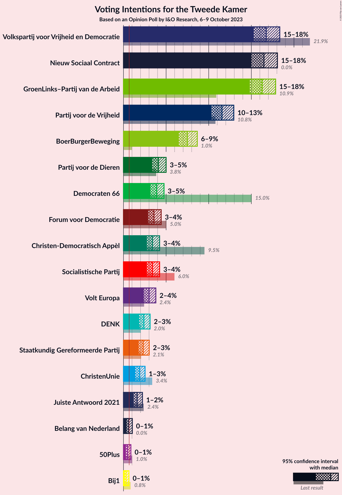

### Confidence Intervals

| Party | Last Result | Poll Result | 80% Confidence Interval | 90% Confidence Interval | 95% Confidence Interval | 99% Confidence Interval |
|:-----:|:-----------:|:-----------:|:-----------------------:|:-----------------------:|:-----------------------:|:-----------------------:|
| Volkspartij voor Vrijheid en Democratie | 21.9% | 16.7% | 15.8–17.8% |15.5–18.1% |15.3–18.3% |14.8–18.8% |
| Nieuw Sociaal Contract | 0.0% | 16.5% | 15.5–17.5% |15.2–17.8% |15.0–18.1% |14.6–18.6% |
| GroenLinks–Partij van de Arbeid | 10.9% | 16.3% | 15.3–17.3% |15.0–17.6% |14.8–17.8% |14.4–18.4% |
| Partij voor de Vrijheid | 10.8% | 11.6% | 10.7–12.5% |10.5–12.7% |10.3–12.9% |9.9–13.4% |
| BoerBurgerBeweging | 1.0% | 7.5% | 6.8–8.3% |6.6–8.5% |6.5–8.7% |6.2–9.0% |
| Partij voor de Dieren | 3.8% | 4.1% | 3.6–4.7% |3.5–4.8% |3.4–5.0% |3.1–5.3% |
| Democraten 66 | 15.0% | 3.9% | 3.4–4.5% |3.3–4.6% |3.2–4.8% |2.9–5.0% |
| Forum voor Democratie | 5.0% | 3.6% | 3.1–4.1% |3.0–4.3% |2.9–4.4% |2.7–4.7% |
| Christen-Democratisch Appèl | 9.5% | 3.4% | 3.0–3.9% |2.8–4.1% |2.7–4.2% |2.5–4.5% |
| Socialistische Partij | 6.0% | 3.4% | 3.0–3.9% |2.8–4.1% |2.7–4.2% |2.5–4.5% |
| Volt Europa | 2.4% | 3.0% | 2.6–3.5% |2.5–3.7% |2.4–3.8% |2.2–4.1% |
| DENK | 2.0% | 2.4% | 2.0–2.9% |1.9–3.0% |1.8–3.1% |1.7–3.4% |
| Staatkundig Gereformeerde Partij | 2.1% | 2.3% | 2.0–2.8% |1.8–2.9% |1.8–3.0% |1.6–3.2% |
| ChristenUnie | 3.4% | 1.9% | 1.6–2.3% |1.5–2.4% |1.4–2.5% |1.2–2.7% |
| Juiste Antwoord 2021 | 2.4% | 1.6% | 1.3–2.0% |1.2–2.1% |1.2–2.2% |1.0–2.4% |
| Belang van Nederland | 0.0% | 0.6% | 0.4–0.9% |0.4–1.0% |0.4–1.0% |0.3–1.2% |
| 50Plus | 1.0% | 0.5% | 0.3–0.7% |0.3–0.8% |0.3–0.9% |0.2–1.0% |
| Bij1 | 0.8% | 0.3% | 0.2–0.5% |0.2–0.6% |0.1–0.6% |0.1–0.7% |

*Note:* The poll result column reflects the actual value used in the calculations. Published results may vary slightly, and in addition be rounded to fewer digits.

## Seats

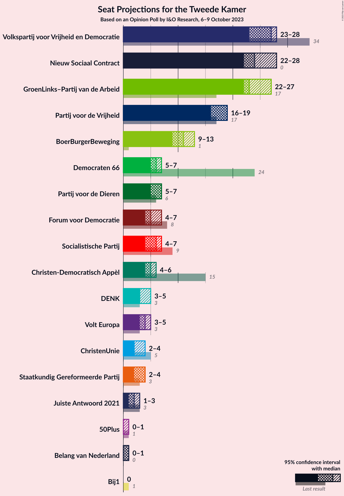

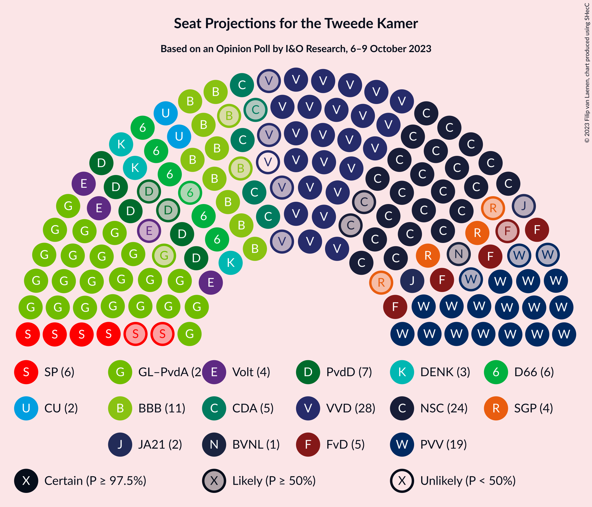

### Confidence Intervals

| Party | Last Result | Median | 80% Confidence Interval | 90% Confidence Interval | 95% Confidence Interval | 99% Confidence Interval |
|:-----:|:-----------:|:------:|:-----------------------:|:-----------------------:|:-----------------------:|:-----------------------:|
| <a href="#volkspartij-voor-vrijheid-en-democratie">Volkspartij voor Vrijheid en Democratie</a> | 34 | 27 | 23–28 |23–28 |23–28 |23–29 |
| <a href="#nieuw-sociaal-contract">Nieuw Sociaal Contract</a> | 0 | 24 | 22–27 |22–27 |22–28 |22–29 |
| <a href="#groenlinks–partij-van-de-arbeid">GroenLinks–Partij van de Arbeid</a> | 17 | 23 | 22–25 |22–27 |22–27 |22–32 |
| <a href="#partij-voor-de-vrijheid">Partij voor de Vrijheid</a> | 17 | 19 | 17–19 |16–19 |16–19 |14–21 |
| <a href="#boerburgerbeweging">BoerBurgerBeweging</a> | 1 | 11 | 9–13 |9–13 |9–13 |9–14 |
| <a href="#partij-voor-de-dieren">Partij voor de Dieren</a> | 6 | 7 | 5–7 |5–7 |5–7 |4–9 |
| <a href="#democraten-66">Democraten 66</a> | 24 | 6 | 5–7 |5–7 |5–7 |4–7 |
| <a href="#forum-voor-democratie">Forum voor Democratie</a> | 8 | 5 | 4–7 |4–7 |4–7 |4–7 |
| <a href="#christen-democratisch-appèl">Christen-Democratisch Appèl</a> | 15 | 5 | 5–6 |4–6 |4–6 |3–7 |
| <a href="#socialistische-partij">Socialistische Partij</a> | 9 | 6 | 5–7 |4–7 |4–7 |3–7 |
| <a href="#volt-europa">Volt Europa</a> | 3 | 4 | 3–5 |3–5 |3–5 |3–6 |
| <a href="#denk">DENK</a> | 3 | 3 | 3–4 |3–4 |3–5 |2–5 |
| <a href="#staatkundig-gereformeerde-partij">Staatkundig Gereformeerde Partij</a> | 3 | 4 | 2–4 |2–4 |2–4 |2–4 |
| <a href="#christenunie">ChristenUnie</a> | 5 | 2 | 2–3 |2–3 |2–4 |2–4 |
| <a href="#juiste-antwoord-2021">Juiste Antwoord 2021</a> | 3 | 2 | 2–3 |2–3 |1–3 |1–3 |
| <a href="#belang-van-nederland">Belang van Nederland</a> | 0 | 1 | 0–1 |0–1 |0–1 |0–1 |
| <a href="#50plus">50Plus</a> | 1 | 0 | 0 |0–1 |0–1 |0–1 |
| <a href="#bij1">Bij1</a> | 1 | 0 | 0 |0 |0 |0–1 |

### Volkspartij voor Vrijheid en Democratie

*For a full overview of the results for this party, see the [Volkspartij voor Vrijheid en Democratie](party-volkspartijvoorvrijheidendemocratie.html) page.*

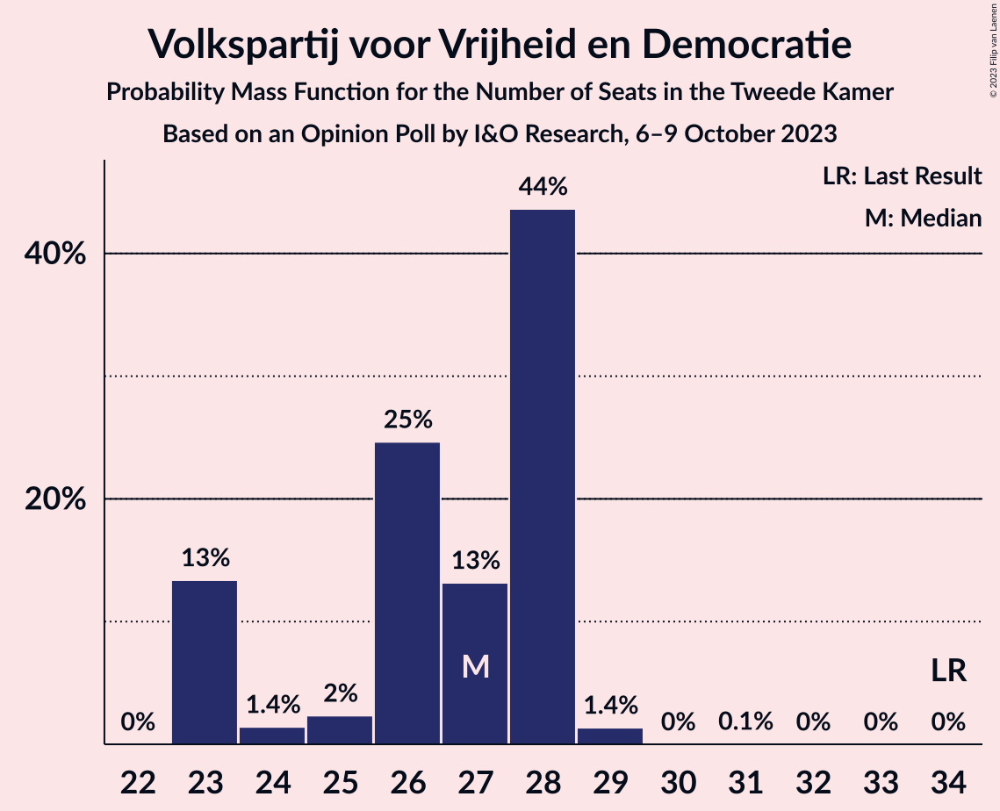

| Number of Seats | Probability | Accumulated | Special Marks |
|:---------------:|:-----------:|:-----------:|:-------------:|
| 23 | 13% | 100% |  |
| 24 | 1.4% | 87% |  |
| 25 | 2% | 85% |  |
| 26 | 25% | 83% |  |
| 27 | 13% | 58% | Median |
| 28 | 44% | 45% |  |
| 29 | 1.4% | 1.4% |  |
| 30 | 0% | 0.1% |  |
| 31 | 0.1% | 0.1% |  |
| 32 | 0% | 0% |  |
| 33 | 0% | 0% |  |
| 34 | 0% | 0% | Last Result |

### Nieuw Sociaal Contract

*For a full overview of the results for this party, see the [Nieuw Sociaal Contract](party-nieuwsociaalcontract.html) page.*

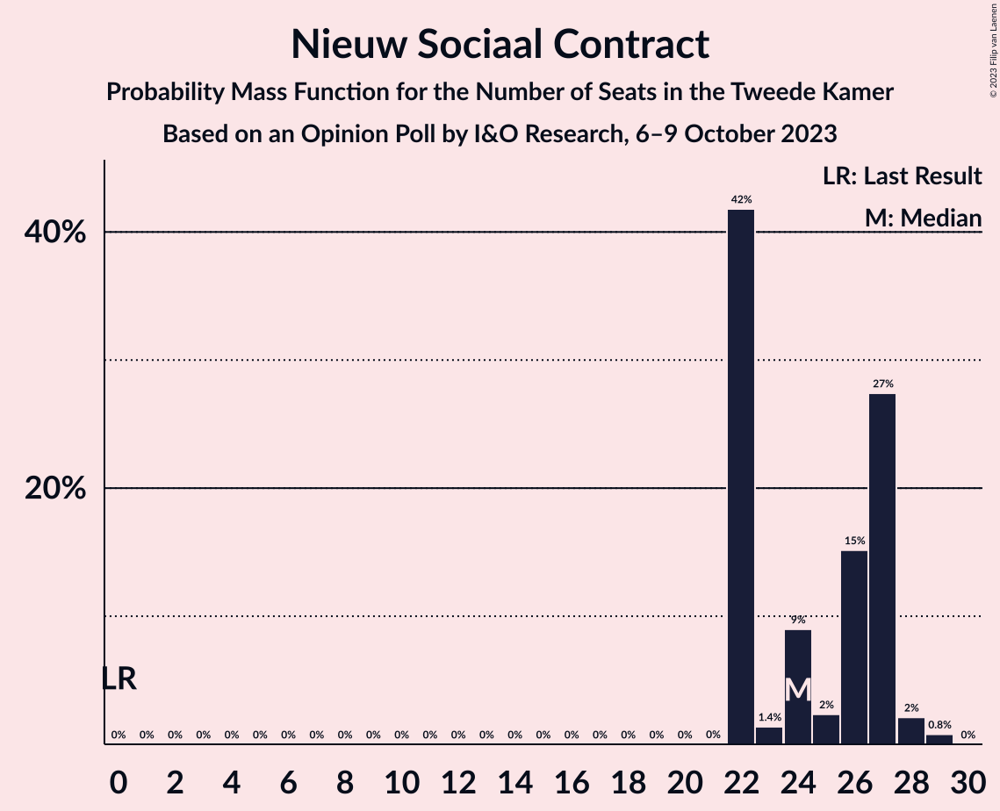

| Number of Seats | Probability | Accumulated | Special Marks |
|:---------------:|:-----------:|:-----------:|:-------------:|
| 0 | 0% | 100% | Last Result |
| 1 | 0% | 100% |  |
| 2 | 0% | 100% |  |
| 3 | 0% | 100% |  |
| 4 | 0% | 100% |  |
| 5 | 0% | 100% |  |
| 6 | 0% | 100% |  |
| 7 | 0% | 100% |  |
| 8 | 0% | 100% |  |
| 9 | 0% | 100% |  |
| 10 | 0% | 100% |  |
| 11 | 0% | 100% |  |
| 12 | 0% | 100% |  |
| 13 | 0% | 100% |  |
| 14 | 0% | 100% |  |
| 15 | 0% | 100% |  |
| 16 | 0% | 100% |  |
| 17 | 0% | 100% |  |
| 18 | 0% | 100% |  |
| 19 | 0% | 100% |  |
| 20 | 0% | 100% |  |
| 21 | 0% | 100% |  |
| 22 | 42% | 100% |  |
| 23 | 1.4% | 58% |  |
| 24 | 9% | 57% | Median |
| 25 | 2% | 48% |  |
| 26 | 15% | 45% |  |
| 27 | 27% | 30% |  |
| 28 | 2% | 3% |  |
| 29 | 0.8% | 0.8% |  |
| 30 | 0% | 0% |  |

### GroenLinks–Partij van de Arbeid

*For a full overview of the results for this party, see the [GroenLinks–Partij van de Arbeid](party-groenlinks–partijvandearbeid.html) page.*

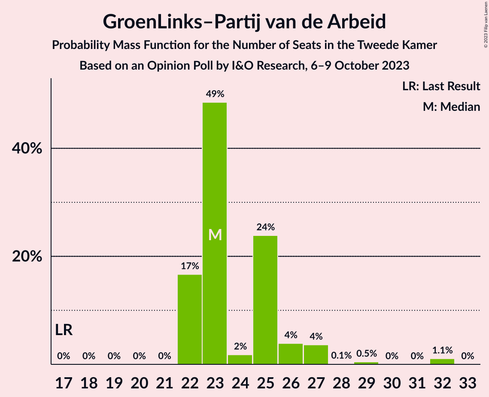

| Number of Seats | Probability | Accumulated | Special Marks |
|:---------------:|:-----------:|:-----------:|:-------------:|
| 17 | 0% | 100% | Last Result |
| 18 | 0% | 100% |  |
| 19 | 0% | 100% |  |
| 20 | 0% | 100% |  |
| 21 | 0% | 100% |  |
| 22 | 17% | 100% |  |
| 23 | 49% | 83% | Median |
| 24 | 2% | 35% |  |
| 25 | 24% | 33% |  |
| 26 | 4% | 9% |  |
| 27 | 4% | 5% |  |
| 28 | 0.1% | 2% |  |
| 29 | 0.5% | 2% |  |
| 30 | 0% | 1.1% |  |
| 31 | 0% | 1.1% |  |
| 32 | 1.1% | 1.1% |  |
| 33 | 0% | 0% |  |

### Partij voor de Vrijheid

*For a full overview of the results for this party, see the [Partij voor de Vrijheid](party-partijvoordevrijheid.html) page.*

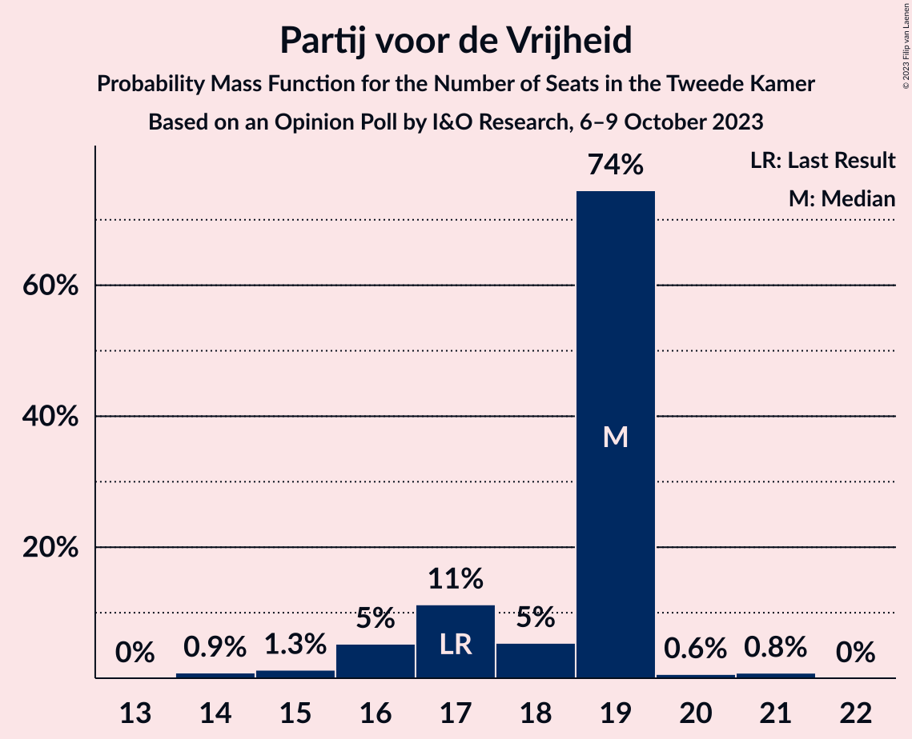

| Number of Seats | Probability | Accumulated | Special Marks |
|:---------------:|:-----------:|:-----------:|:-------------:|
| 14 | 0.9% | 100% |  |
| 15 | 1.3% | 99.1% |  |
| 16 | 5% | 98% |  |
| 17 | 11% | 93% | Last Result |
| 18 | 5% | 81% |  |
| 19 | 74% | 76% | Median |
| 20 | 0.6% | 1.5% |  |
| 21 | 0.8% | 0.8% |  |
| 22 | 0% | 0% |  |

### BoerBurgerBeweging

*For a full overview of the results for this party, see the [BoerBurgerBeweging](party-boerburgerbeweging.html) page.*

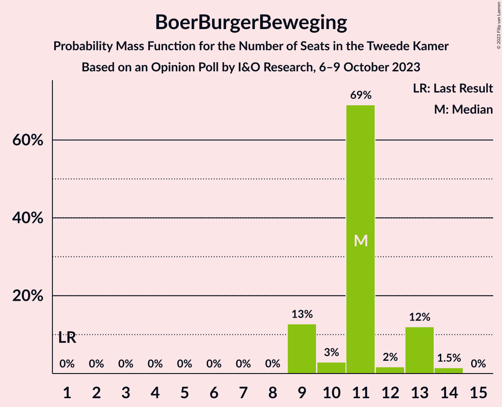

| Number of Seats | Probability | Accumulated | Special Marks |
|:---------------:|:-----------:|:-----------:|:-------------:|
| 1 | 0% | 100% | Last Result |
| 2 | 0% | 100% |  |
| 3 | 0% | 100% |  |
| 4 | 0% | 100% |  |
| 5 | 0% | 100% |  |
| 6 | 0% | 100% |  |
| 7 | 0% | 100% |  |
| 8 | 0% | 100% |  |
| 9 | 13% | 100% |  |
| 10 | 3% | 87% |  |
| 11 | 69% | 84% | Median |
| 12 | 2% | 15% |  |
| 13 | 12% | 14% |  |
| 14 | 1.5% | 2% |  |
| 15 | 0% | 0% |  |

### Partij voor de Dieren

*For a full overview of the results for this party, see the [Partij voor de Dieren](party-partijvoordedieren.html) page.*

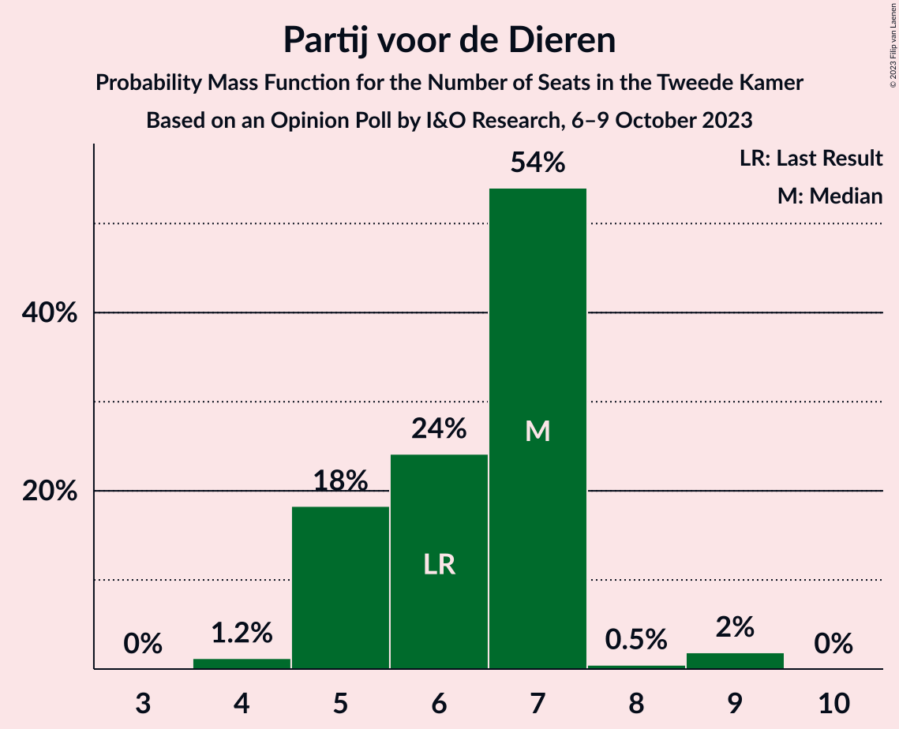

| Number of Seats | Probability | Accumulated | Special Marks |
|:---------------:|:-----------:|:-----------:|:-------------:|
| 4 | 1.2% | 100% |  |
| 5 | 18% | 98.8% |  |
| 6 | 24% | 80% | Last Result |
| 7 | 54% | 56% | Median |
| 8 | 0.5% | 2% |  |
| 9 | 2% | 2% |  |
| 10 | 0% | 0% |  |

### Democraten 66

*For a full overview of the results for this party, see the [Democraten 66](party-democraten66.html) page.*

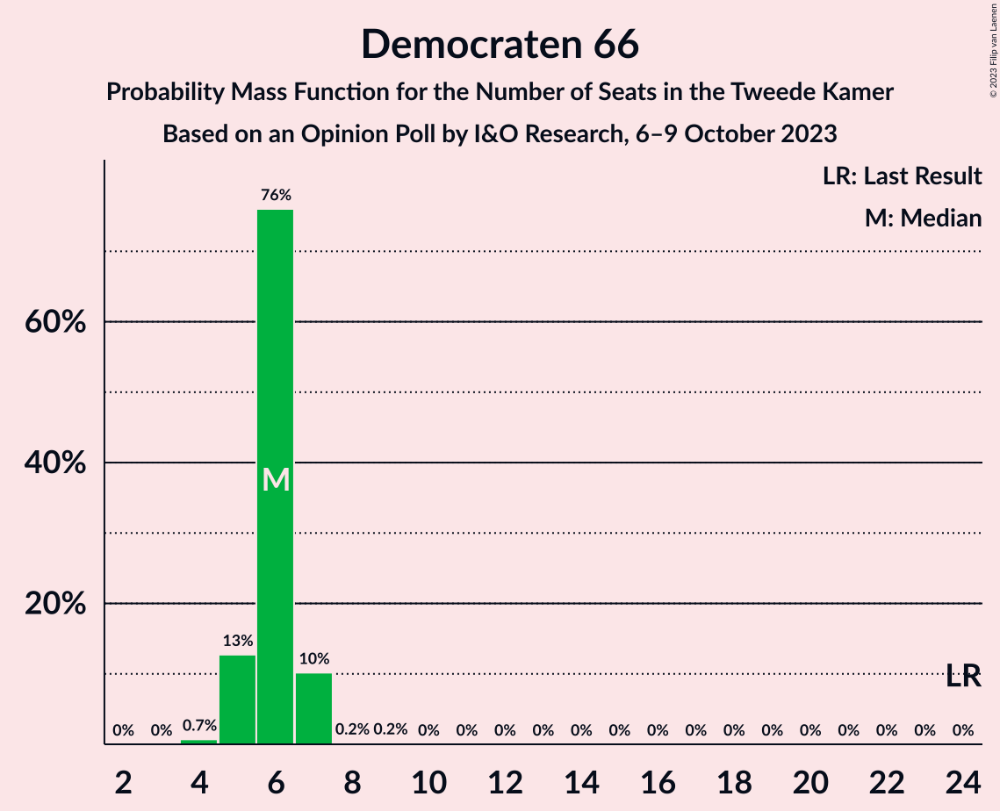

| Number of Seats | Probability | Accumulated | Special Marks |
|:---------------:|:-----------:|:-----------:|:-------------:|
| 4 | 0.7% | 100% |  |
| 5 | 13% | 99.3% |  |
| 6 | 76% | 87% | Median |
| 7 | 10% | 11% |  |
| 8 | 0.2% | 0.4% |  |
| 9 | 0.2% | 0.2% |  |
| 10 | 0% | 0% |  |
| 11 | 0% | 0% |  |
| 12 | 0% | 0% |  |
| 13 | 0% | 0% |  |
| 14 | 0% | 0% |  |
| 15 | 0% | 0% |  |
| 16 | 0% | 0% |  |
| 17 | 0% | 0% |  |
| 18 | 0% | 0% |  |
| 19 | 0% | 0% |  |
| 20 | 0% | 0% |  |
| 21 | 0% | 0% |  |
| 22 | 0% | 0% |  |
| 23 | 0% | 0% |  |
| 24 | 0% | 0% | Last Result |

### Forum voor Democratie

*For a full overview of the results for this party, see the [Forum voor Democratie](party-forumvoordemocratie.html) page.*

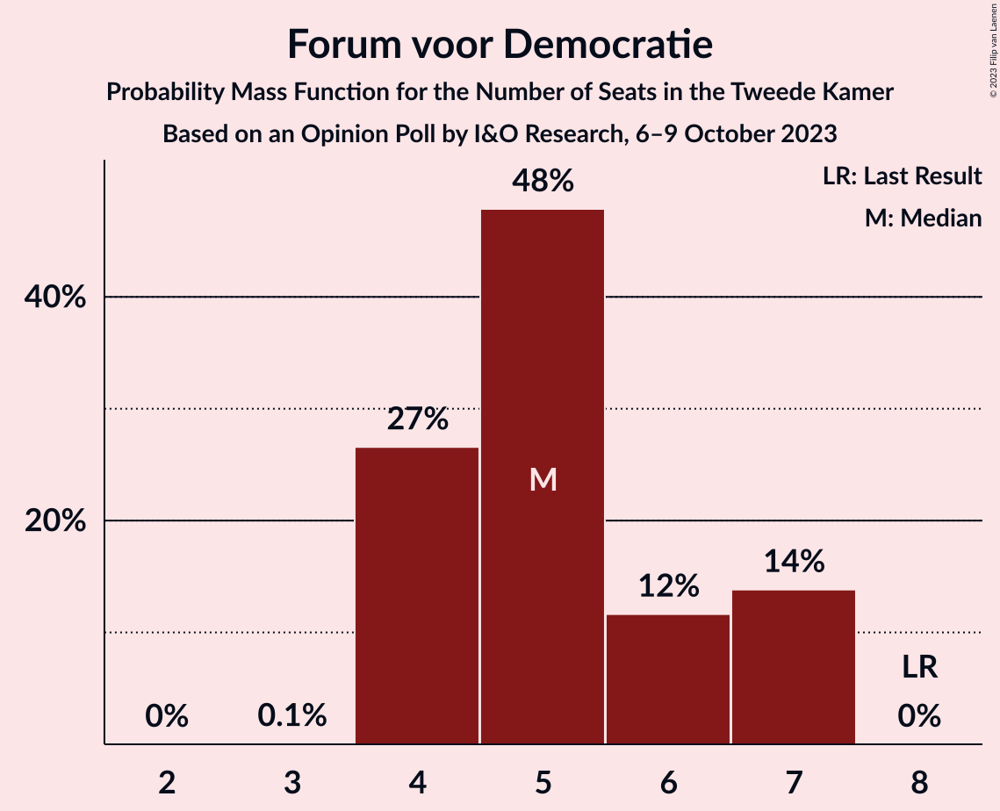

| Number of Seats | Probability | Accumulated | Special Marks |
|:---------------:|:-----------:|:-----------:|:-------------:|
| 3 | 0.1% | 100% |  |
| 4 | 27% | 99.9% |  |
| 5 | 48% | 73% | Median |
| 6 | 12% | 25% |  |
| 7 | 14% | 14% |  |
| 8 | 0% | 0% | Last Result |

### Christen-Democratisch Appèl

*For a full overview of the results for this party, see the [Christen-Democratisch Appèl](party-christen-democratischappèl.html) page.*

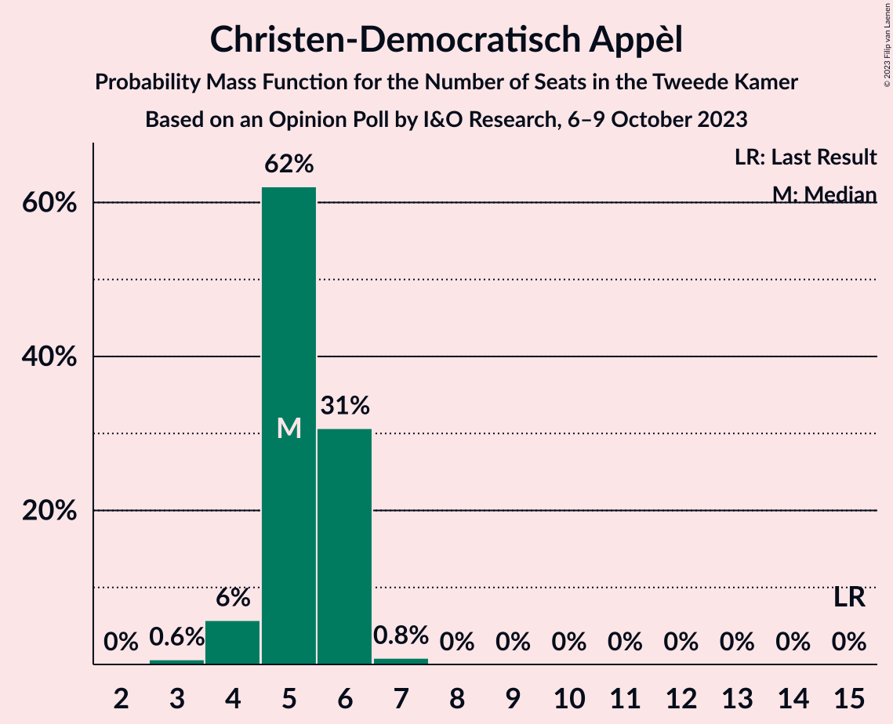

| Number of Seats | Probability | Accumulated | Special Marks |
|:---------------:|:-----------:|:-----------:|:-------------:|
| 3 | 0.6% | 100% |  |
| 4 | 6% | 99.4% |  |
| 5 | 62% | 94% | Median |
| 6 | 31% | 32% |  |
| 7 | 0.8% | 0.8% |  |
| 8 | 0% | 0% |  |
| 9 | 0% | 0% |  |
| 10 | 0% | 0% |  |
| 11 | 0% | 0% |  |
| 12 | 0% | 0% |  |
| 13 | 0% | 0% |  |
| 14 | 0% | 0% |  |
| 15 | 0% | 0% | Last Result |

### Socialistische Partij

*For a full overview of the results for this party, see the [Socialistische Partij](party-socialistischepartij.html) page.*

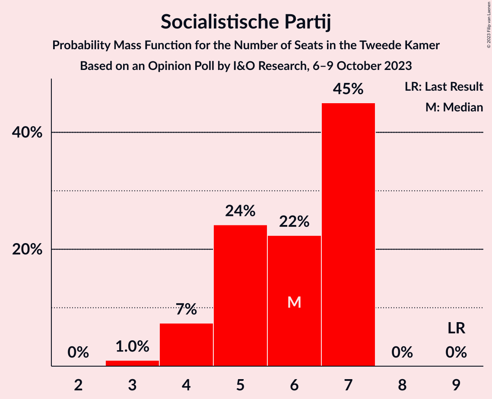

| Number of Seats | Probability | Accumulated | Special Marks |
|:---------------:|:-----------:|:-----------:|:-------------:|
| 3 | 1.0% | 100% |  |
| 4 | 7% | 99.0% |  |
| 5 | 24% | 92% |  |
| 6 | 22% | 67% | Median |
| 7 | 45% | 45% |  |
| 8 | 0% | 0% |  |
| 9 | 0% | 0% | Last Result |

### Volt Europa

*For a full overview of the results for this party, see the [Volt Europa](party-volteuropa.html) page.*

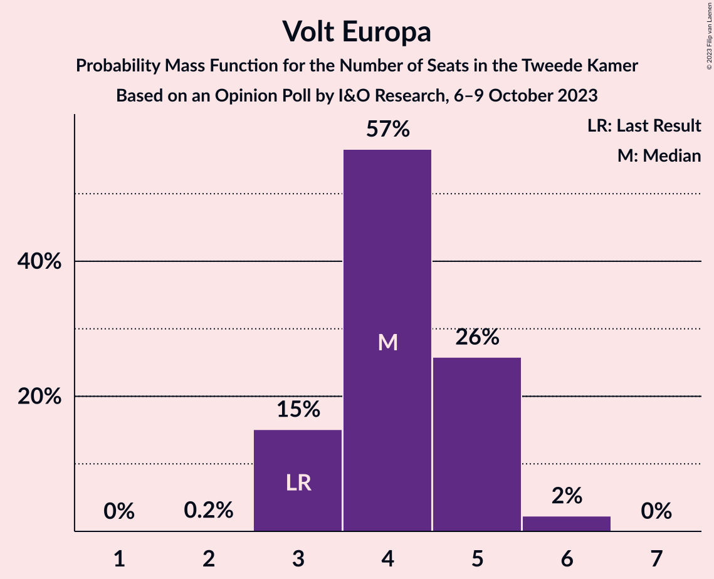

| Number of Seats | Probability | Accumulated | Special Marks |
|:---------------:|:-----------:|:-----------:|:-------------:|
| 2 | 0.2% | 100% |  |
| 3 | 15% | 99.8% | Last Result |
| 4 | 57% | 85% | Median |
| 5 | 26% | 28% |  |
| 6 | 2% | 2% |  |
| 7 | 0% | 0% |  |

### DENK

*For a full overview of the results for this party, see the [DENK](party-denk.html) page.*

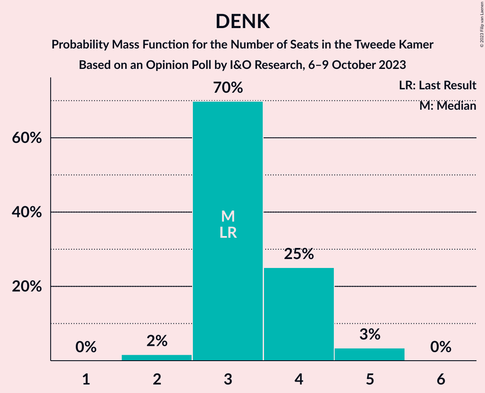

| Number of Seats | Probability | Accumulated | Special Marks |
|:---------------:|:-----------:|:-----------:|:-------------:|
| 2 | 2% | 100% |  |
| 3 | 70% | 98% | Last Result, Median |
| 4 | 25% | 29% |  |
| 5 | 3% | 3% |  |
| 6 | 0% | 0% |  |

### Staatkundig Gereformeerde Partij

*For a full overview of the results for this party, see the [Staatkundig Gereformeerde Partij](party-staatkundiggereformeerdepartij.html) page.*

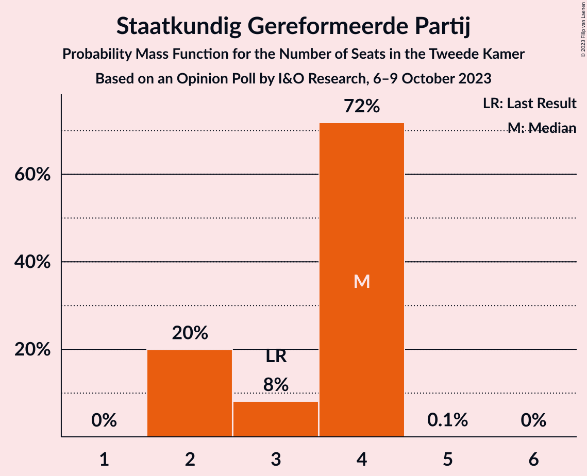

| Number of Seats | Probability | Accumulated | Special Marks |
|:---------------:|:-----------:|:-----------:|:-------------:|
| 2 | 20% | 100% |  |
| 3 | 8% | 80% | Last Result |
| 4 | 72% | 72% | Median |
| 5 | 0.1% | 0.1% |  |
| 6 | 0% | 0% |  |

### ChristenUnie

*For a full overview of the results for this party, see the [ChristenUnie](party-christenunie.html) page.*

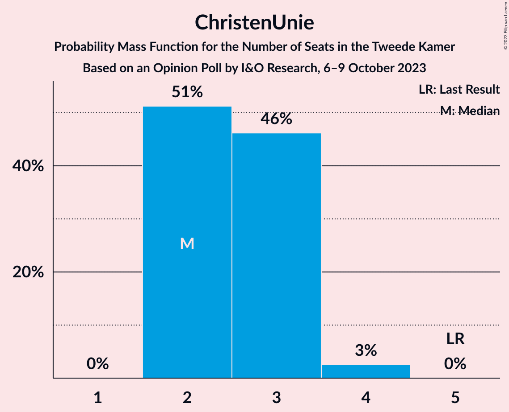

| Number of Seats | Probability | Accumulated | Special Marks |
|:---------------:|:-----------:|:-----------:|:-------------:|
| 2 | 51% | 100% | Median |
| 3 | 46% | 49% |  |
| 4 | 3% | 3% |  |
| 5 | 0% | 0% | Last Result |

### Juiste Antwoord 2021

*For a full overview of the results for this party, see the [Juiste Antwoord 2021](party-juisteantwoord2021.html) page.*

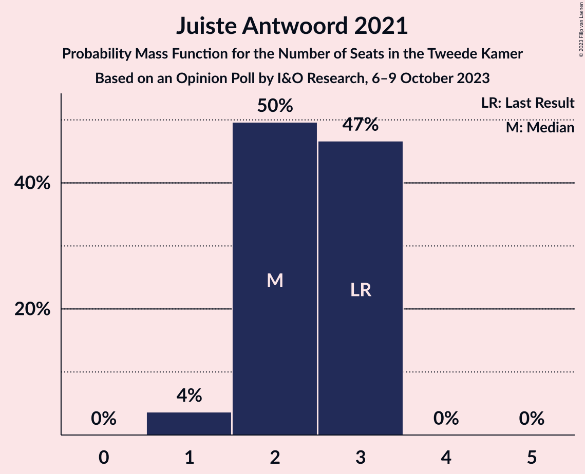

| Number of Seats | Probability | Accumulated | Special Marks |
|:---------------:|:-----------:|:-----------:|:-------------:|
| 1 | 4% | 100% |  |
| 2 | 50% | 96% | Median |
| 3 | 47% | 47% | Last Result |
| 4 | 0% | 0% |  |

### Belang van Nederland

*For a full overview of the results for this party, see the [Belang van Nederland](party-belangvannederland.html) page.*

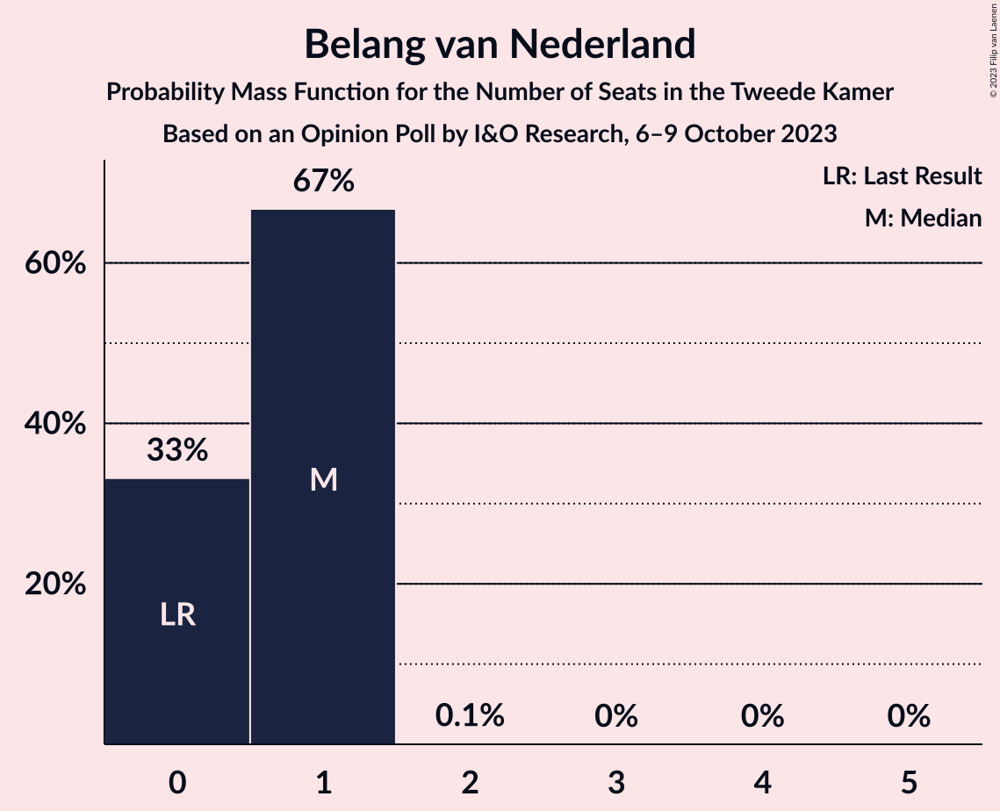

| Number of Seats | Probability | Accumulated | Special Marks |
|:---------------:|:-----------:|:-----------:|:-------------:|
| 0 | 33% | 100% | Last Result |
| 1 | 67% | 67% | Median |
| 2 | 0.1% | 0.1% |  |
| 3 | 0% | 0% |  |

### 50Plus

*For a full overview of the results for this party, see the [50Plus](party-50plus.html) page.*

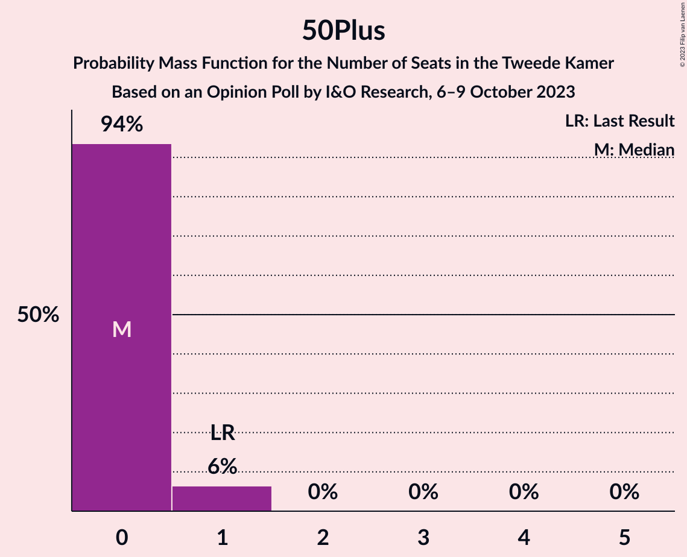

| Number of Seats | Probability | Accumulated | Special Marks |
|:---------------:|:-----------:|:-----------:|:-------------:|
| 0 | 94% | 100% | Median |
| 1 | 6% | 6% | Last Result |
| 2 | 0% | 0% |  |

### Bij1

*For a full overview of the results for this party, see the [Bij1](party-bij1.html) page.*

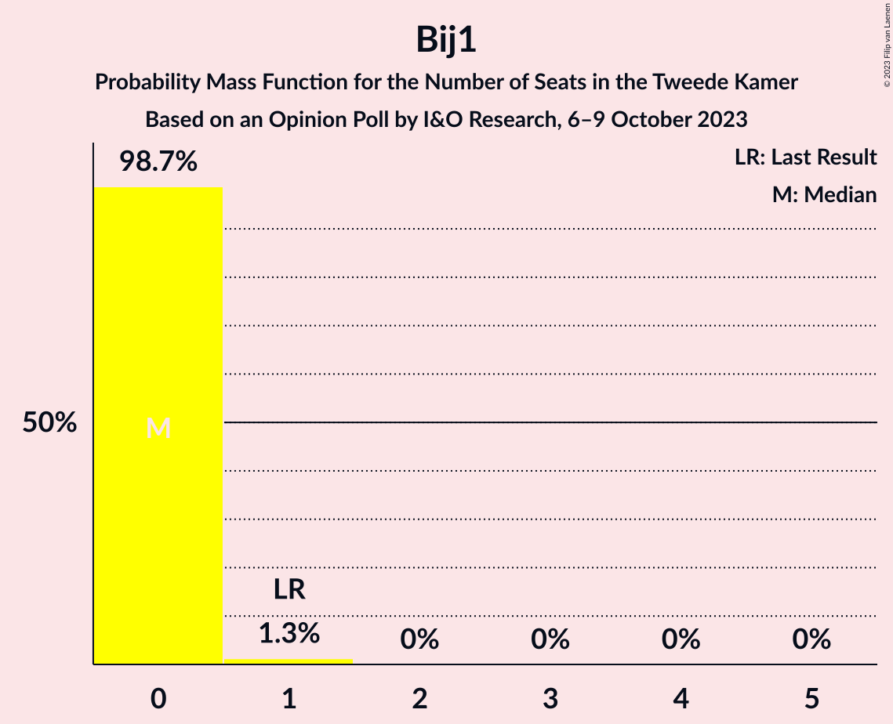

| Number of Seats | Probability | Accumulated | Special Marks |
|:---------------:|:-----------:|:-----------:|:-------------:|
| 0 | 98.7% | 100% | Median |
| 1 | 1.3% | 1.3% | Last Result |
| 2 | 0% | 0% |  |

## Coalitions

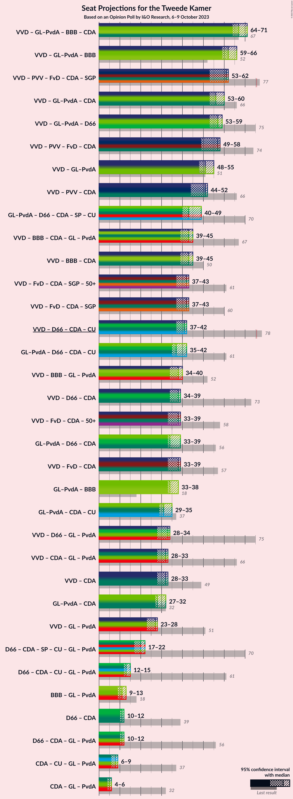

### Confidence Intervals

| Coalition | Last Result | Median | Majority? | 80% Confidence Interval | 90% Confidence Interval | 95% Confidence Interval | 99% Confidence Interval |
|:---------:|:-----------:|:------:|:---------:|:-----------------------:|:-----------------------:|:-----------------------:|:-----------------------:|
| Volkspartij voor Vrijheid en Democratie – GroenLinks–Partij van de Arbeid – BoerBurgerBeweging – Christen-Democratisch Appèl | 67 | 67 | 0% | 65–67 | 65–69 | 64–71 | 63–73 |
| Volkspartij voor Vrijheid en Democratie – GroenLinks–Partij van de Arbeid – BoerBurgerBeweging | 52 | 62 | 0% | 59–62 | 59–64 | 59–66 | 59–68 |
| Volkspartij voor Vrijheid en Democratie – Partij voor de Vrijheid – Forum voor Democratie – Christen-Democratisch Appèl – Staatkundig Gereformeerde Partij | 77 | 61 | 0% | 54–62 | 54–62 | 53–62 | 52–64 |
| Volkspartij voor Vrijheid en Democratie – GroenLinks–Partij van de Arbeid – Christen-Democratisch Appèl | 66 | 56 | 0% | 54–57 | 54–57 | 53–60 | 52–62 |
| Volkspartij voor Vrijheid en Democratie – GroenLinks–Partij van de Arbeid – Democraten 66 | 75 | 57 | 0% | 54–58 | 53–58 | 53–59 | 53–64 |
| Volkspartij voor Vrijheid en Democratie – Partij voor de Vrijheid – Forum voor Democratie – Christen-Democratisch Appèl | 74 | 57 | 0% | 50–58 | 50–58 | 49–58 | 49–60 |
| Volkspartij voor Vrijheid en Democratie – GroenLinks–Partij van de Arbeid | 51 | 51 | 0% | 48–52 | 48–52 | 48–55 | 47–57 |
| Volkspartij voor Vrijheid en Democratie – Partij voor de Vrijheid – Christen-Democratisch Appèl | 66 | 51 | 0% | 46–52 | 45–52 | 44–52 | 43–53 |
| GroenLinks–Partij van de Arbeid – Democraten 66 – Christen-Democratisch Appèl – Socialistische Partij – ChristenUnie | 70 | 43 | 0% | 42–45 | 42–46 | 40–49 | 40–52 |
| Volkspartij voor Vrijheid en Democratie – BoerBurgerBeweging – Christen-Democratisch Appèl | 50 | 43 | 0% | 41–44 | 40–44 | 39–45 | 38–46 |
| Volkspartij voor Vrijheid en Democratie – Forum voor Democratie – Christen-Democratisch Appèl – Staatkundig Gereformeerde Partij – 50Plus | 61 | 42 | 0% | 37–43 | 37–43 | 37–43 | 36–44 |
| Volkspartij voor Vrijheid en Democratie – Forum voor Democratie – Christen-Democratisch Appèl – Staatkundig Gereformeerde Partij | 60 | 42 | 0% | 37–43 | 37–43 | 37–43 | 36–44 |
| Volkspartij voor Vrijheid en Democratie – Democraten 66 – Christen-Democratisch Appèl – ChristenUnie | 78 | 41 | 0% | 37–41 | 37–41 | 37–42 | 36–43 |
| GroenLinks–Partij van de Arbeid – Democraten 66 – Christen-Democratisch Appèl – ChristenUnie | 61 | 37 | 0% | 36–39 | 36–41 | 35–42 | 35–47 |
| Volkspartij voor Vrijheid en Democratie – Democraten 66 – Christen-Democratisch Appèl | 73 | 38 | 0% | 34–39 | 34–39 | 34–39 | 34–40 |
| Volkspartij voor Vrijheid en Democratie – Forum voor Democratie – Christen-Democratisch Appèl – 50Plus | 58 | 38 | 0% | 33–39 | 33–39 | 33–39 | 33–41 |
| GroenLinks–Partij van de Arbeid – Democraten 66 – Christen-Democratisch Appèl | 56 | 34 | 0% | 34–36 | 34–37 | 33–39 | 33–44 |
| Volkspartij voor Vrijheid en Democratie – Forum voor Democratie – Christen-Democratisch Appèl | 57 | 38 | 0% | 33–39 | 33–39 | 33–39 | 33–41 |
| GroenLinks–Partij van de Arbeid – BoerBurgerBeweging | 18 | 34 | 0% | 33–38 | 33–38 | 33–38 | 33–43 |
| GroenLinks–Partij van de Arbeid – Christen-Democratisch Appèl – ChristenUnie | 37 | 31 | 0% | 30–34 | 30–35 | 29–35 | 29–40 |
| Volkspartij voor Vrijheid en Democratie – Christen-Democratisch Appèl | 49 | 32 | 0% | 29–33 | 29–33 | 28–33 | 27–34 |
| GroenLinks–Partij van de Arbeid – Christen-Democratisch Appèl | 32 | 28 | 0% | 28–31 | 28–32 | 27–32 | 27–37 |
| Democraten 66 – Christen-Democratisch Appèl | 39 | 11 | 0% | 11–12 | 10–12 | 10–12 | 9–13 |

### Volkspartij voor Vrijheid en Democratie – GroenLinks–Partij van de Arbeid – BoerBurgerBeweging – Christen-Democratisch Appèl

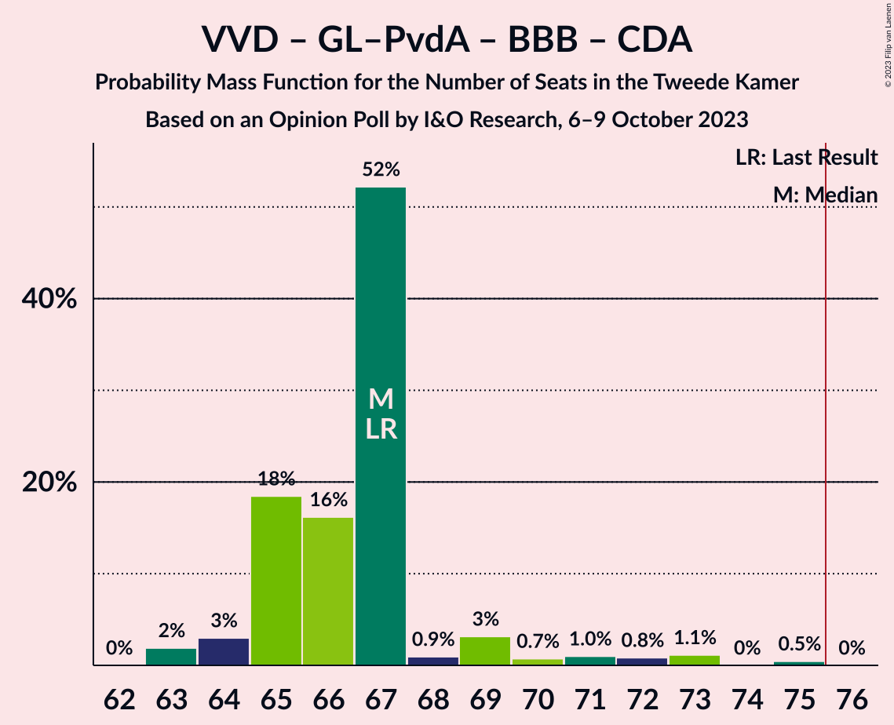

| Number of Seats | Probability | Accumulated | Special Marks |
|:---------------:|:-----------:|:-----------:|:-------------:|
| 63 | 2% | 100% |  |
| 64 | 3% | 98% |  |
| 65 | 18% | 95% |  |
| 66 | 16% | 77% | Median |
| 67 | 52% | 60% | Last Result |
| 68 | 0.9% | 8% |  |
| 69 | 3% | 7% |  |
| 70 | 0.7% | 4% |  |
| 71 | 1.0% | 3% |  |
| 72 | 0.8% | 2% |  |
| 73 | 1.1% | 2% |  |
| 74 | 0% | 0.5% |  |
| 75 | 0.5% | 0.5% |  |
| 76 | 0% | 0% | Majority |

### Volkspartij voor Vrijheid en Democratie – GroenLinks–Partij van de Arbeid – BoerBurgerBeweging

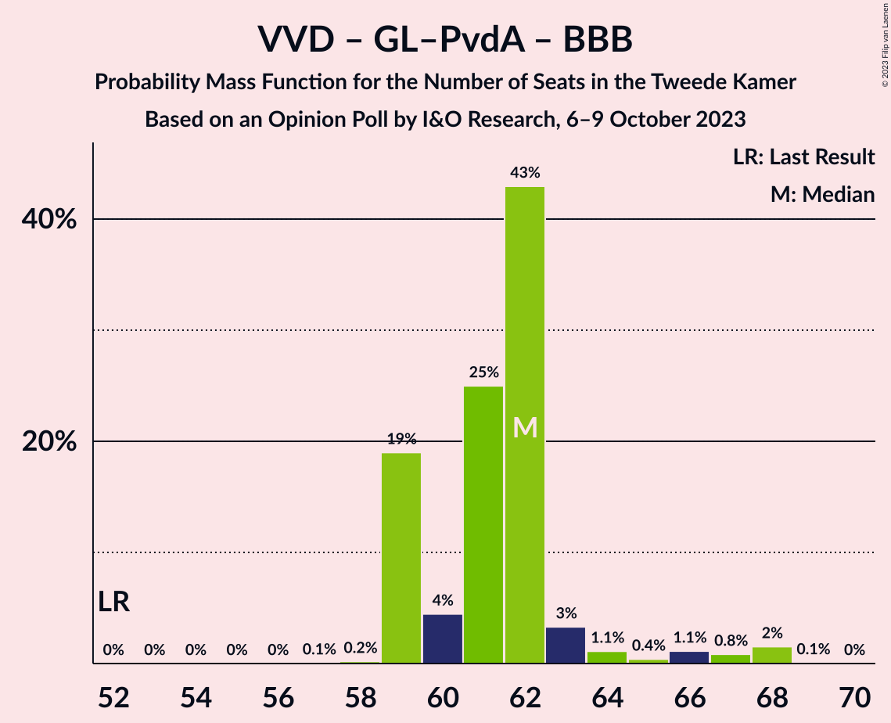

| Number of Seats | Probability | Accumulated | Special Marks |
|:---------------:|:-----------:|:-----------:|:-------------:|
| 52 | 0% | 100% | Last Result |
| 53 | 0% | 100% |  |
| 54 | 0% | 100% |  |
| 55 | 0% | 100% |  |
| 56 | 0% | 100% |  |
| 57 | 0.1% | 100% |  |
| 58 | 0.2% | 99.9% |  |
| 59 | 19% | 99.8% |  |
| 60 | 4% | 81% |  |
| 61 | 25% | 76% | Median |
| 62 | 43% | 51% |  |
| 63 | 3% | 8% |  |
| 64 | 1.1% | 5% |  |
| 65 | 0.4% | 4% |  |
| 66 | 1.1% | 4% |  |
| 67 | 0.8% | 2% |  |
| 68 | 2% | 2% |  |
| 69 | 0.1% | 0.1% |  |
| 70 | 0% | 0% |  |

### Volkspartij voor Vrijheid en Democratie – Partij voor de Vrijheid – Forum voor Democratie – Christen-Democratisch Appèl – Staatkundig Gereformeerde Partij

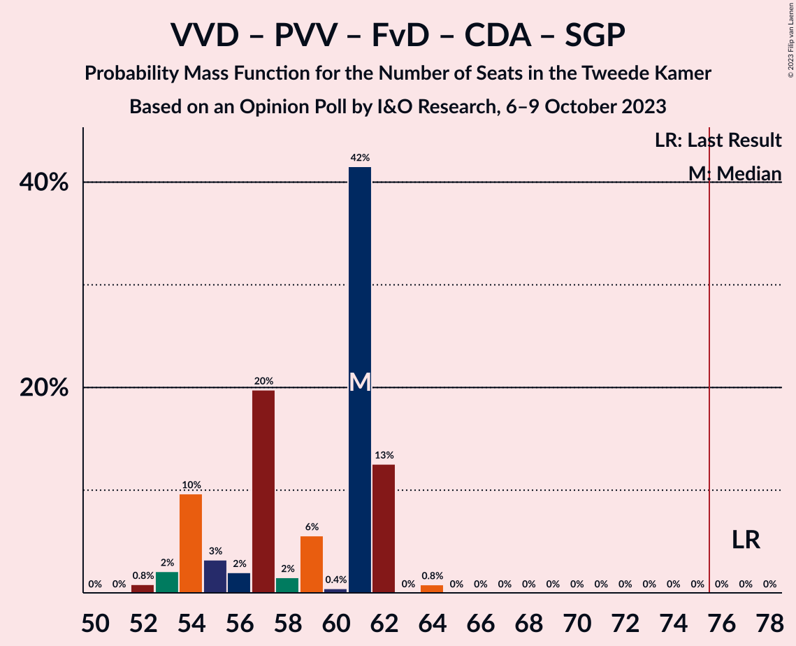

| Number of Seats | Probability | Accumulated | Special Marks |
|:---------------:|:-----------:|:-----------:|:-------------:|
| 52 | 0.8% | 100% |  |
| 53 | 2% | 99.2% |  |
| 54 | 10% | 97% |  |
| 55 | 3% | 87% |  |
| 56 | 2% | 84% |  |
| 57 | 20% | 82% |  |
| 58 | 2% | 62% |  |
| 59 | 6% | 61% |  |
| 60 | 0.4% | 55% | Median |
| 61 | 42% | 55% |  |
| 62 | 13% | 13% |  |
| 63 | 0% | 0.8% |  |
| 64 | 0.8% | 0.8% |  |
| 65 | 0% | 0% |  |
| 66 | 0% | 0% |  |
| 67 | 0% | 0% |  |
| 68 | 0% | 0% |  |
| 69 | 0% | 0% |  |
| 70 | 0% | 0% |  |
| 71 | 0% | 0% |  |
| 72 | 0% | 0% |  |
| 73 | 0% | 0% |  |
| 74 | 0% | 0% |  |
| 75 | 0% | 0% |  |
| 76 | 0% | 0% | Majority |
| 77 | 0% | 0% | Last Result |

### Volkspartij voor Vrijheid en Democratie – GroenLinks–Partij van de Arbeid – Christen-Democratisch Appèl

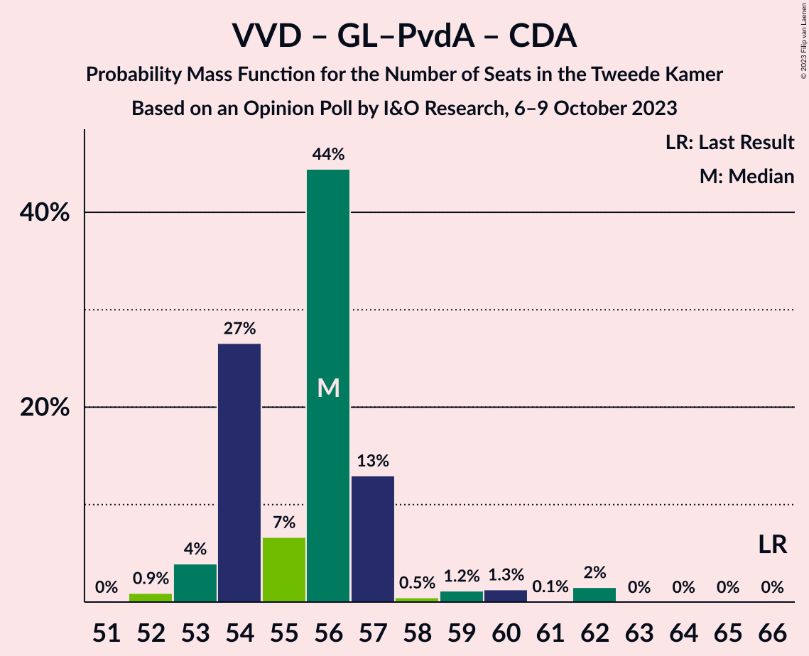

| Number of Seats | Probability | Accumulated | Special Marks |
|:---------------:|:-----------:|:-----------:|:-------------:|
| 52 | 0.9% | 100% |  |
| 53 | 4% | 99.1% |  |
| 54 | 27% | 95% |  |
| 55 | 7% | 69% | Median |
| 56 | 44% | 62% |  |
| 57 | 13% | 17% |  |
| 58 | 0.5% | 4% |  |
| 59 | 1.2% | 4% |  |
| 60 | 1.3% | 3% |  |
| 61 | 0.1% | 2% |  |
| 62 | 2% | 2% |  |
| 63 | 0% | 0% |  |
| 64 | 0% | 0% |  |
| 65 | 0% | 0% |  |
| 66 | 0% | 0% | Last Result |

### Volkspartij voor Vrijheid en Democratie – GroenLinks–Partij van de Arbeid – Democraten 66

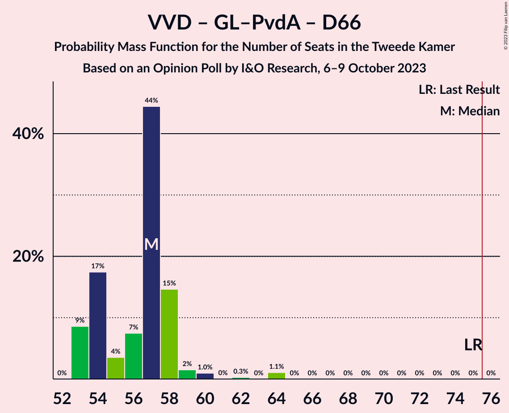

| Number of Seats | Probability | Accumulated | Special Marks |
|:---------------:|:-----------:|:-----------:|:-------------:|
| 53 | 9% | 100% |  |
| 54 | 17% | 91% |  |
| 55 | 4% | 74% |  |
| 56 | 7% | 70% | Median |
| 57 | 44% | 63% |  |
| 58 | 15% | 18% |  |
| 59 | 2% | 4% |  |
| 60 | 1.0% | 2% |  |
| 61 | 0% | 1.4% |  |
| 62 | 0.3% | 1.3% |  |
| 63 | 0% | 1.1% |  |
| 64 | 1.1% | 1.1% |  |
| 65 | 0% | 0% |  |
| 66 | 0% | 0% |  |
| 67 | 0% | 0% |  |
| 68 | 0% | 0% |  |
| 69 | 0% | 0% |  |
| 70 | 0% | 0% |  |
| 71 | 0% | 0% |  |
| 72 | 0% | 0% |  |
| 73 | 0% | 0% |  |
| 74 | 0% | 0% |  |
| 75 | 0% | 0% | Last Result |

### Volkspartij voor Vrijheid en Democratie – Partij voor de Vrijheid – Forum voor Democratie – Christen-Democratisch Appèl

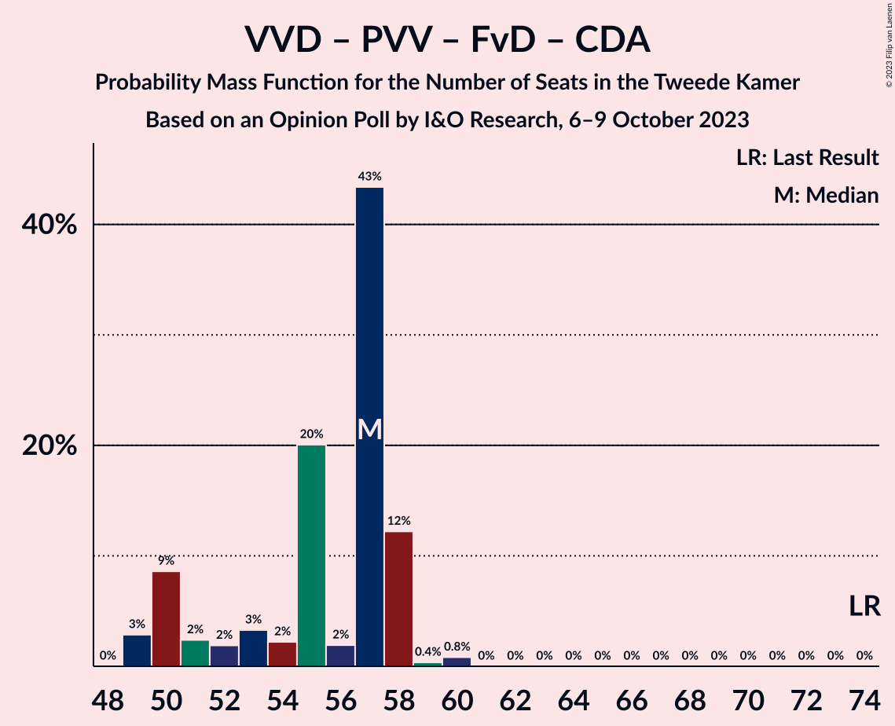

| Number of Seats | Probability | Accumulated | Special Marks |
|:---------------:|:-----------:|:-----------:|:-------------:|
| 49 | 3% | 100% |  |
| 50 | 9% | 97% |  |
| 51 | 2% | 89% |  |
| 52 | 2% | 86% |  |
| 53 | 3% | 84% |  |
| 54 | 2% | 81% |  |
| 55 | 20% | 79% |  |
| 56 | 2% | 59% | Median |
| 57 | 43% | 57% |  |
| 58 | 12% | 13% |  |
| 59 | 0.4% | 1.2% |  |
| 60 | 0.8% | 0.8% |  |
| 61 | 0% | 0% |  |
| 62 | 0% | 0% |  |
| 63 | 0% | 0% |  |
| 64 | 0% | 0% |  |
| 65 | 0% | 0% |  |
| 66 | 0% | 0% |  |
| 67 | 0% | 0% |  |
| 68 | 0% | 0% |  |
| 69 | 0% | 0% |  |
| 70 | 0% | 0% |  |
| 71 | 0% | 0% |  |
| 72 | 0% | 0% |  |
| 73 | 0% | 0% |  |
| 74 | 0% | 0% | Last Result |

### Volkspartij voor Vrijheid en Democratie – GroenLinks–Partij van de Arbeid

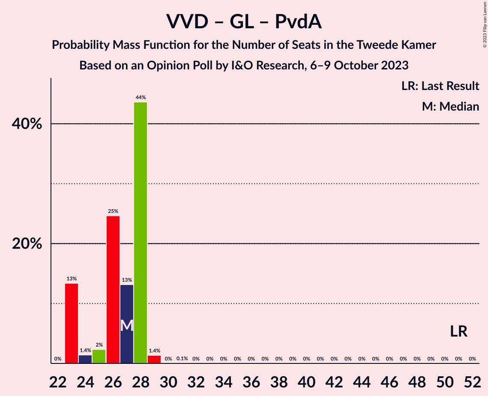

| Number of Seats | Probability | Accumulated | Special Marks |
|:---------------:|:-----------:|:-----------:|:-------------:|
| 47 | 0.5% | 100% |  |
| 48 | 25% | 99.5% |  |
| 49 | 9% | 74% |  |
| 50 | 5% | 66% | Median |
| 51 | 44% | 61% | Last Result |
| 52 | 13% | 17% |  |
| 53 | 1.0% | 4% |  |
| 54 | 0.8% | 3% |  |
| 55 | 1.3% | 3% |  |
| 56 | 0.2% | 1.3% |  |
| 57 | 1.1% | 1.1% |  |
| 58 | 0% | 0% |  |

### Volkspartij voor Vrijheid en Democratie – Partij voor de Vrijheid – Christen-Democratisch Appèl

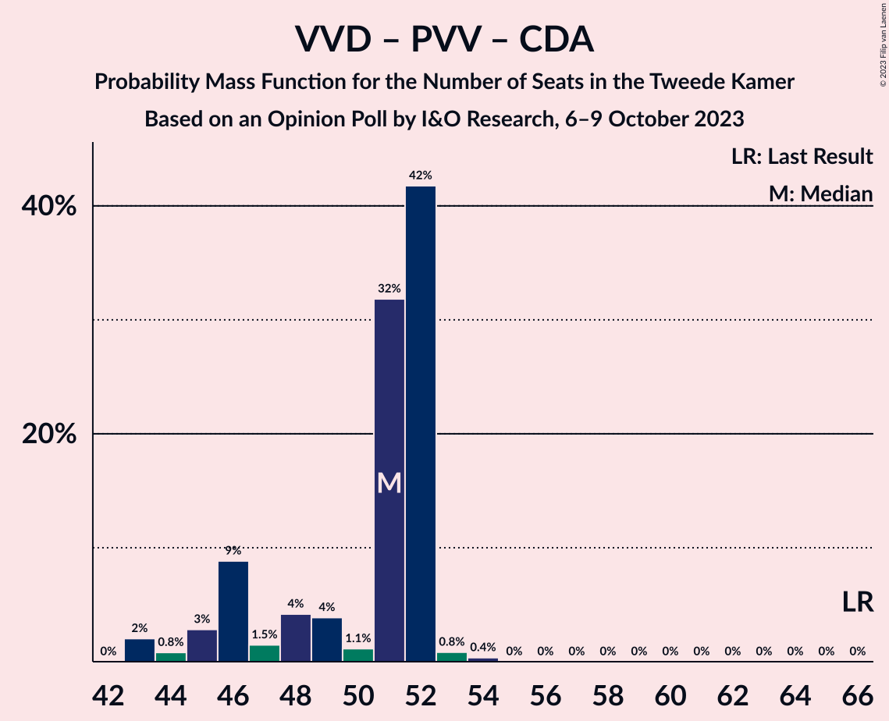

| Number of Seats | Probability | Accumulated | Special Marks |
|:---------------:|:-----------:|:-----------:|:-------------:|
| 43 | 2% | 100% |  |
| 44 | 0.8% | 98% |  |
| 45 | 3% | 97% |  |
| 46 | 9% | 94% |  |
| 47 | 1.5% | 85% |  |
| 48 | 4% | 84% |  |
| 49 | 4% | 80% |  |
| 50 | 1.1% | 76% |  |
| 51 | 32% | 75% | Median |
| 52 | 42% | 43% |  |
| 53 | 0.8% | 1.2% |  |
| 54 | 0.4% | 0.4% |  |
| 55 | 0% | 0% |  |
| 56 | 0% | 0% |  |
| 57 | 0% | 0% |  |
| 58 | 0% | 0% |  |
| 59 | 0% | 0% |  |
| 60 | 0% | 0% |  |
| 61 | 0% | 0% |  |
| 62 | 0% | 0% |  |
| 63 | 0% | 0% |  |
| 64 | 0% | 0% |  |
| 65 | 0% | 0% |  |
| 66 | 0% | 0% | Last Result |

### GroenLinks–Partij van de Arbeid – Democraten 66 – Christen-Democratisch Appèl – Socialistische Partij – ChristenUnie

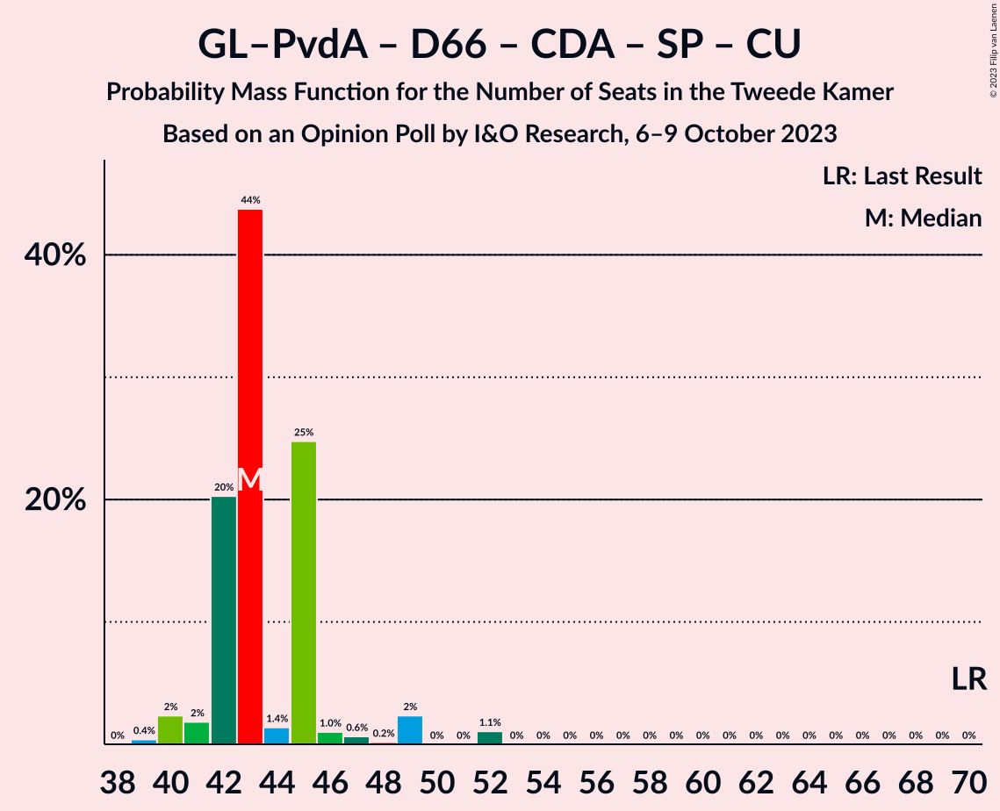

| Number of Seats | Probability | Accumulated | Special Marks |
|:---------------:|:-----------:|:-----------:|:-------------:|
| 39 | 0.4% | 100% |  |
| 40 | 2% | 99.6% |  |
| 41 | 2% | 97% |  |
| 42 | 20% | 95% | Median |
| 43 | 44% | 75% |  |
| 44 | 1.4% | 31% |  |
| 45 | 25% | 30% |  |
| 46 | 1.0% | 5% |  |
| 47 | 0.6% | 4% |  |
| 48 | 0.2% | 4% |  |
| 49 | 2% | 3% |  |
| 50 | 0% | 1.1% |  |
| 51 | 0% | 1.1% |  |
| 52 | 1.1% | 1.1% |  |
| 53 | 0% | 0% |  |
| 54 | 0% | 0% |  |
| 55 | 0% | 0% |  |
| 56 | 0% | 0% |  |
| 57 | 0% | 0% |  |
| 58 | 0% | 0% |  |
| 59 | 0% | 0% |  |
| 60 | 0% | 0% |  |
| 61 | 0% | 0% |  |
| 62 | 0% | 0% |  |
| 63 | 0% | 0% |  |
| 64 | 0% | 0% |  |
| 65 | 0% | 0% |  |
| 66 | 0% | 0% |  |
| 67 | 0% | 0% |  |
| 68 | 0% | 0% |  |
| 69 | 0% | 0% |  |
| 70 | 0% | 0% | Last Result |

### Volkspartij voor Vrijheid en Democratie – BoerBurgerBeweging – Christen-Democratisch Appèl

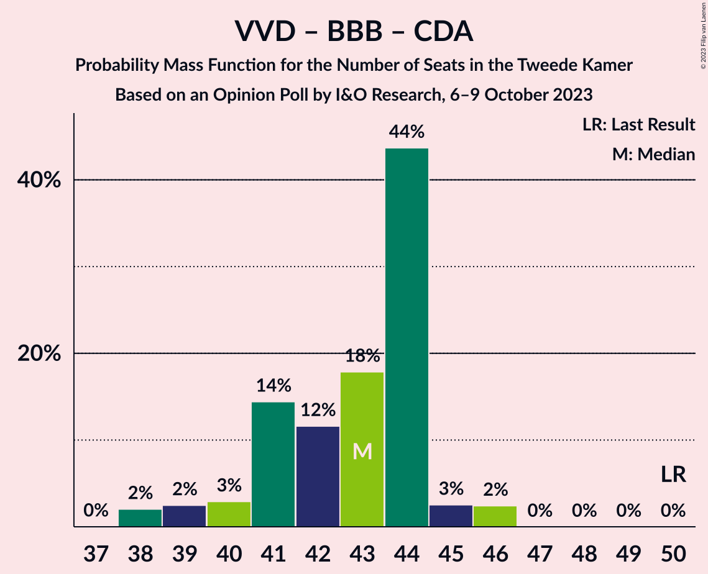

| Number of Seats | Probability | Accumulated | Special Marks |
|:---------------:|:-----------:|:-----------:|:-------------:|
| 38 | 2% | 100% |  |
| 39 | 2% | 98% |  |
| 40 | 3% | 95% |  |
| 41 | 14% | 93% |  |
| 42 | 12% | 78% |  |
| 43 | 18% | 67% | Median |
| 44 | 44% | 49% |  |
| 45 | 3% | 5% |  |
| 46 | 2% | 2% |  |
| 47 | 0% | 0% |  |
| 48 | 0% | 0% |  |
| 49 | 0% | 0% |  |
| 50 | 0% | 0% | Last Result |

### Volkspartij voor Vrijheid en Democratie – Forum voor Democratie – Christen-Democratisch Appèl – Staatkundig Gereformeerde Partij – 50Plus

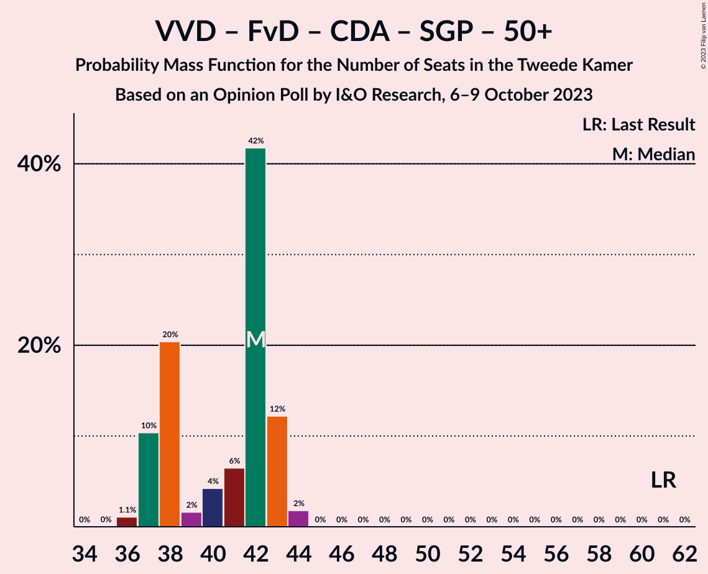

| Number of Seats | Probability | Accumulated | Special Marks |
|:---------------:|:-----------:|:-----------:|:-------------:|
| 36 | 1.1% | 100% |  |
| 37 | 10% | 98.9% |  |
| 38 | 20% | 89% |  |
| 39 | 2% | 68% |  |
| 40 | 4% | 66% |  |
| 41 | 6% | 62% | Median |
| 42 | 42% | 56% |  |
| 43 | 12% | 14% |  |
| 44 | 2% | 2% |  |
| 45 | 0% | 0% |  |
| 46 | 0% | 0% |  |
| 47 | 0% | 0% |  |
| 48 | 0% | 0% |  |
| 49 | 0% | 0% |  |
| 50 | 0% | 0% |  |
| 51 | 0% | 0% |  |
| 52 | 0% | 0% |  |
| 53 | 0% | 0% |  |
| 54 | 0% | 0% |  |
| 55 | 0% | 0% |  |
| 56 | 0% | 0% |  |
| 57 | 0% | 0% |  |
| 58 | 0% | 0% |  |
| 59 | 0% | 0% |  |
| 60 | 0% | 0% |  |
| 61 | 0% | 0% | Last Result |

### Volkspartij voor Vrijheid en Democratie – Forum voor Democratie – Christen-Democratisch Appèl – Staatkundig Gereformeerde Partij

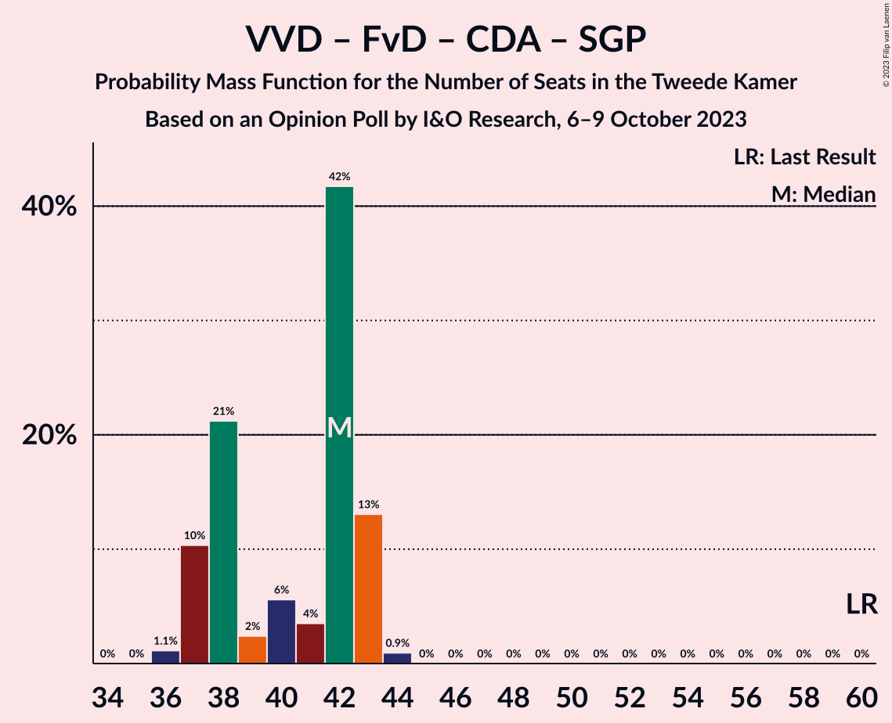

| Number of Seats | Probability | Accumulated | Special Marks |
|:---------------:|:-----------:|:-----------:|:-------------:|
| 36 | 1.1% | 100% |  |
| 37 | 10% | 98.8% |  |
| 38 | 21% | 88% |  |
| 39 | 2% | 67% |  |
| 40 | 6% | 65% |  |
| 41 | 4% | 59% | Median |
| 42 | 42% | 56% |  |
| 43 | 13% | 14% |  |
| 44 | 0.9% | 0.9% |  |
| 45 | 0% | 0% |  |
| 46 | 0% | 0% |  |
| 47 | 0% | 0% |  |
| 48 | 0% | 0% |  |
| 49 | 0% | 0% |  |
| 50 | 0% | 0% |  |
| 51 | 0% | 0% |  |
| 52 | 0% | 0% |  |
| 53 | 0% | 0% |  |
| 54 | 0% | 0% |  |
| 55 | 0% | 0% |  |
| 56 | 0% | 0% |  |
| 57 | 0% | 0% |  |
| 58 | 0% | 0% |  |
| 59 | 0% | 0% |  |
| 60 | 0% | 0% | Last Result |

### Volkspartij voor Vrijheid en Democratie – Democraten 66 – Christen-Democratisch Appèl – ChristenUnie

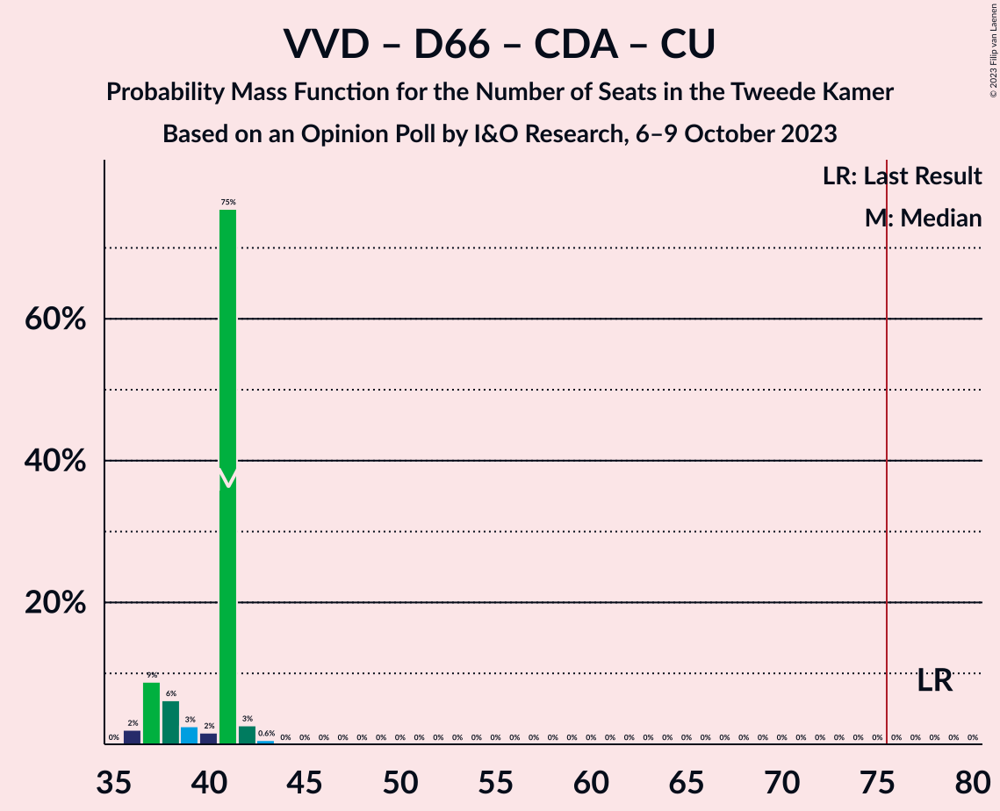

| Number of Seats | Probability | Accumulated | Special Marks |
|:---------------:|:-----------:|:-----------:|:-------------:|
| 36 | 2% | 100% |  |
| 37 | 9% | 98% |  |
| 38 | 6% | 89% |  |
| 39 | 3% | 83% |  |
| 40 | 2% | 80% | Median |
| 41 | 75% | 79% |  |
| 42 | 3% | 3% |  |
| 43 | 0.6% | 0.6% |  |
| 44 | 0% | 0% |  |
| 45 | 0% | 0% |  |
| 46 | 0% | 0% |  |
| 47 | 0% | 0% |  |
| 48 | 0% | 0% |  |
| 49 | 0% | 0% |  |
| 50 | 0% | 0% |  |
| 51 | 0% | 0% |  |
| 52 | 0% | 0% |  |
| 53 | 0% | 0% |  |
| 54 | 0% | 0% |  |
| 55 | 0% | 0% |  |
| 56 | 0% | 0% |  |
| 57 | 0% | 0% |  |
| 58 | 0% | 0% |  |
| 59 | 0% | 0% |  |
| 60 | 0% | 0% |  |
| 61 | 0% | 0% |  |
| 62 | 0% | 0% |  |
| 63 | 0% | 0% |  |
| 64 | 0% | 0% |  |
| 65 | 0% | 0% |  |
| 66 | 0% | 0% |  |
| 67 | 0% | 0% |  |
| 68 | 0% | 0% |  |
| 69 | 0% | 0% |  |
| 70 | 0% | 0% |  |
| 71 | 0% | 0% |  |
| 72 | 0% | 0% |  |
| 73 | 0% | 0% |  |
| 74 | 0% | 0% |  |
| 75 | 0% | 0% |  |
| 76 | 0% | 0% | Majority |
| 77 | 0% | 0% |  |
| 78 | 0% | 0% | Last Result |

### GroenLinks–Partij van de Arbeid – Democraten 66 – Christen-Democratisch Appèl – ChristenUnie

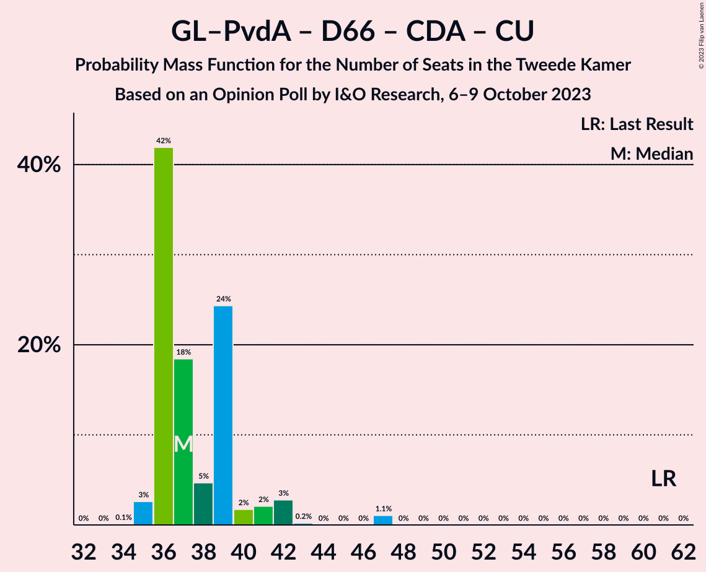

| Number of Seats | Probability | Accumulated | Special Marks |
|:---------------:|:-----------:|:-----------:|:-------------:|
| 34 | 0.1% | 100% |  |
| 35 | 3% | 99.9% |  |
| 36 | 42% | 97% | Median |
| 37 | 18% | 55% |  |
| 38 | 5% | 37% |  |
| 39 | 24% | 32% |  |
| 40 | 2% | 8% |  |
| 41 | 2% | 6% |  |
| 42 | 3% | 4% |  |
| 43 | 0.2% | 1.3% |  |
| 44 | 0% | 1.1% |  |
| 45 | 0% | 1.1% |  |
| 46 | 0% | 1.1% |  |
| 47 | 1.1% | 1.1% |  |
| 48 | 0% | 0% |  |
| 49 | 0% | 0% |  |
| 50 | 0% | 0% |  |
| 51 | 0% | 0% |  |
| 52 | 0% | 0% |  |
| 53 | 0% | 0% |  |
| 54 | 0% | 0% |  |
| 55 | 0% | 0% |  |
| 56 | 0% | 0% |  |
| 57 | 0% | 0% |  |
| 58 | 0% | 0% |  |
| 59 | 0% | 0% |  |
| 60 | 0% | 0% |  |
| 61 | 0% | 0% | Last Result |

### Volkspartij voor Vrijheid en Democratie – Democraten 66 – Christen-Democratisch Appèl

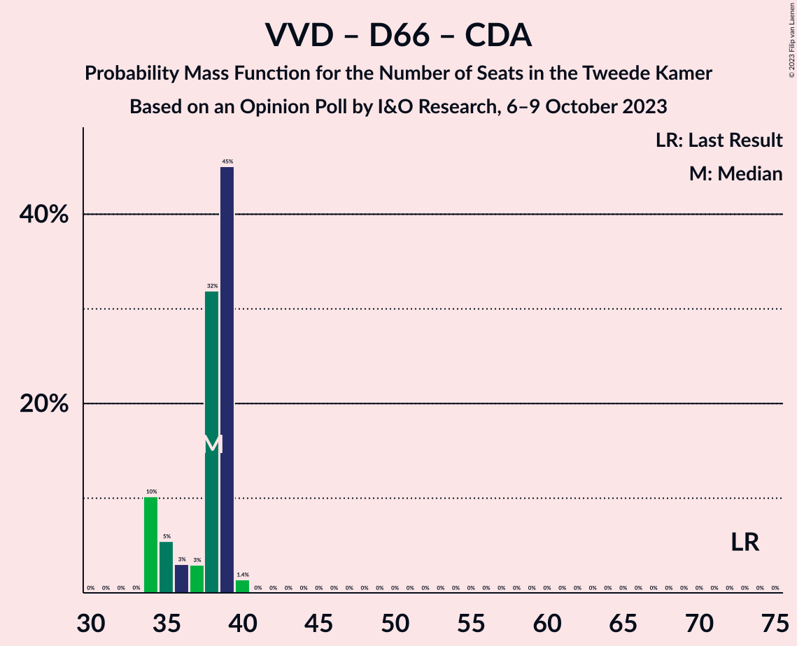

| Number of Seats | Probability | Accumulated | Special Marks |
|:---------------:|:-----------:|:-----------:|:-------------:|
| 34 | 10% | 100% |  |
| 35 | 5% | 90% |  |
| 36 | 3% | 84% |  |
| 37 | 3% | 81% |  |
| 38 | 32% | 78% | Median |
| 39 | 45% | 46% |  |
| 40 | 1.4% | 1.4% |  |
| 41 | 0% | 0% |  |
| 42 | 0% | 0% |  |
| 43 | 0% | 0% |  |
| 44 | 0% | 0% |  |
| 45 | 0% | 0% |  |
| 46 | 0% | 0% |  |
| 47 | 0% | 0% |  |
| 48 | 0% | 0% |  |
| 49 | 0% | 0% |  |
| 50 | 0% | 0% |  |
| 51 | 0% | 0% |  |
| 52 | 0% | 0% |  |
| 53 | 0% | 0% |  |
| 54 | 0% | 0% |  |
| 55 | 0% | 0% |  |
| 56 | 0% | 0% |  |
| 57 | 0% | 0% |  |
| 58 | 0% | 0% |  |
| 59 | 0% | 0% |  |
| 60 | 0% | 0% |  |
| 61 | 0% | 0% |  |
| 62 | 0% | 0% |  |
| 63 | 0% | 0% |  |
| 64 | 0% | 0% |  |
| 65 | 0% | 0% |  |
| 66 | 0% | 0% |  |
| 67 | 0% | 0% |  |
| 68 | 0% | 0% |  |
| 69 | 0% | 0% |  |
| 70 | 0% | 0% |  |
| 71 | 0% | 0% |  |
| 72 | 0% | 0% |  |
| 73 | 0% | 0% | Last Result |

### Volkspartij voor Vrijheid en Democratie – Forum voor Democratie – Christen-Democratisch Appèl – 50Plus

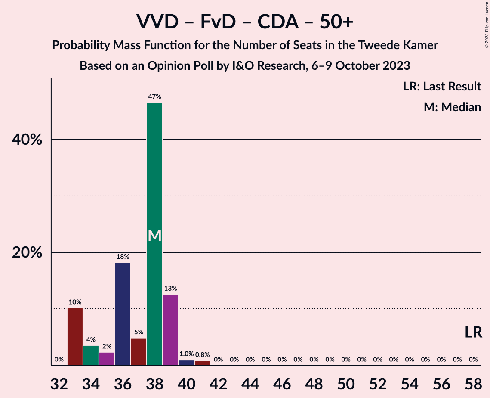

| Number of Seats | Probability | Accumulated | Special Marks |
|:---------------:|:-----------:|:-----------:|:-------------:|
| 33 | 10% | 100% |  |
| 34 | 4% | 90% |  |
| 35 | 2% | 86% |  |
| 36 | 18% | 84% |  |
| 37 | 5% | 66% | Median |
| 38 | 47% | 61% |  |
| 39 | 13% | 14% |  |
| 40 | 1.0% | 2% |  |
| 41 | 0.8% | 0.8% |  |
| 42 | 0% | 0% |  |
| 43 | 0% | 0% |  |
| 44 | 0% | 0% |  |
| 45 | 0% | 0% |  |
| 46 | 0% | 0% |  |
| 47 | 0% | 0% |  |
| 48 | 0% | 0% |  |
| 49 | 0% | 0% |  |
| 50 | 0% | 0% |  |
| 51 | 0% | 0% |  |
| 52 | 0% | 0% |  |
| 53 | 0% | 0% |  |
| 54 | 0% | 0% |  |
| 55 | 0% | 0% |  |
| 56 | 0% | 0% |  |
| 57 | 0% | 0% |  |
| 58 | 0% | 0% | Last Result |

### GroenLinks–Partij van de Arbeid – Democraten 66 – Christen-Democratisch Appèl

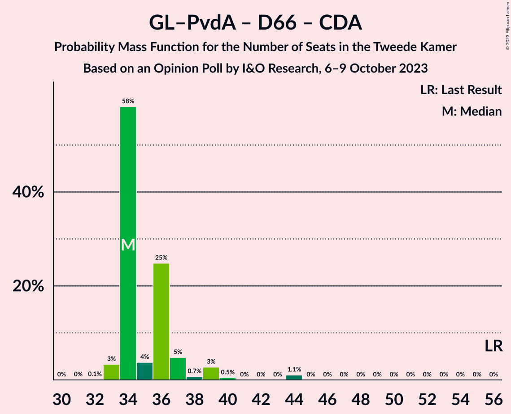

| Number of Seats | Probability | Accumulated | Special Marks |
|:---------------:|:-----------:|:-----------:|:-------------:|
| 31 | 0% | 100% |  |
| 32 | 0.1% | 99.9% |  |
| 33 | 3% | 99.9% |  |
| 34 | 58% | 97% | Median |
| 35 | 4% | 38% |  |
| 36 | 25% | 35% |  |
| 37 | 5% | 10% |  |
| 38 | 0.7% | 5% |  |
| 39 | 3% | 4% |  |
| 40 | 0.5% | 2% |  |
| 41 | 0% | 1.1% |  |
| 42 | 0% | 1.1% |  |
| 43 | 0% | 1.1% |  |
| 44 | 1.1% | 1.1% |  |
| 45 | 0% | 0% |  |
| 46 | 0% | 0% |  |
| 47 | 0% | 0% |  |
| 48 | 0% | 0% |  |
| 49 | 0% | 0% |  |
| 50 | 0% | 0% |  |
| 51 | 0% | 0% |  |
| 52 | 0% | 0% |  |
| 53 | 0% | 0% |  |
| 54 | 0% | 0% |  |
| 55 | 0% | 0% |  |
| 56 | 0% | 0% | Last Result |

### Volkspartij voor Vrijheid en Democratie – Forum voor Democratie – Christen-Democratisch Appèl

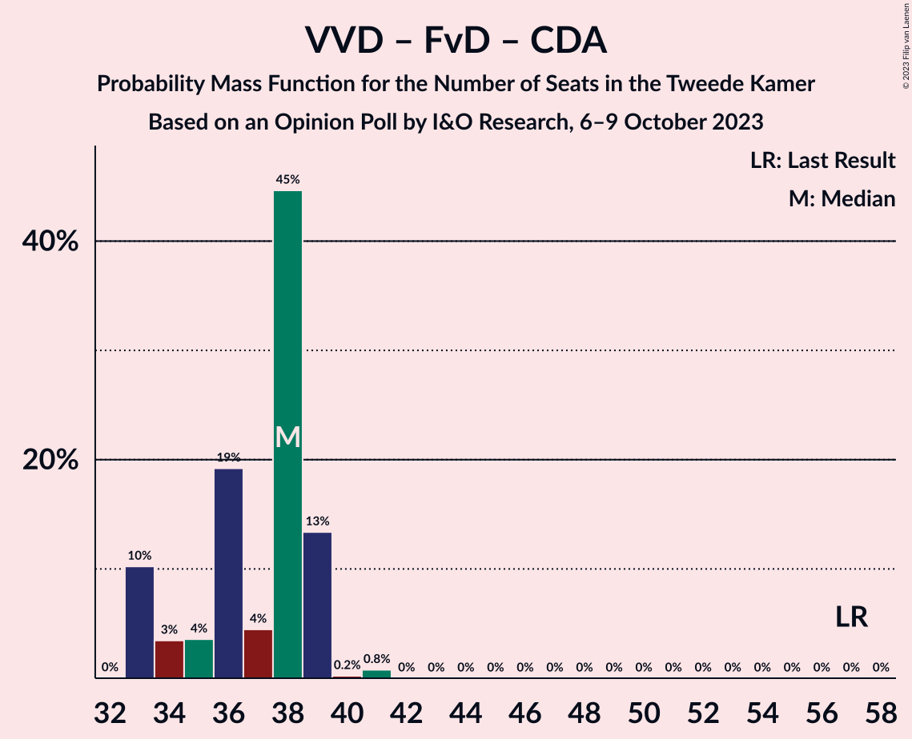

| Number of Seats | Probability | Accumulated | Special Marks |
|:---------------:|:-----------:|:-----------:|:-------------:|
| 33 | 10% | 100% |  |
| 34 | 3% | 90% |  |
| 35 | 4% | 86% |  |
| 36 | 19% | 83% |  |
| 37 | 4% | 63% | Median |
| 38 | 45% | 59% |  |
| 39 | 13% | 14% |  |
| 40 | 0.2% | 1.0% |  |
| 41 | 0.8% | 0.8% |  |
| 42 | 0% | 0% |  |
| 43 | 0% | 0% |  |
| 44 | 0% | 0% |  |
| 45 | 0% | 0% |  |
| 46 | 0% | 0% |  |
| 47 | 0% | 0% |  |
| 48 | 0% | 0% |  |
| 49 | 0% | 0% |  |
| 50 | 0% | 0% |  |
| 51 | 0% | 0% |  |
| 52 | 0% | 0% |  |
| 53 | 0% | 0% |  |
| 54 | 0% | 0% |  |
| 55 | 0% | 0% |  |
| 56 | 0% | 0% |  |
| 57 | 0% | 0% | Last Result |

### GroenLinks–Partij van de Arbeid – BoerBurgerBeweging

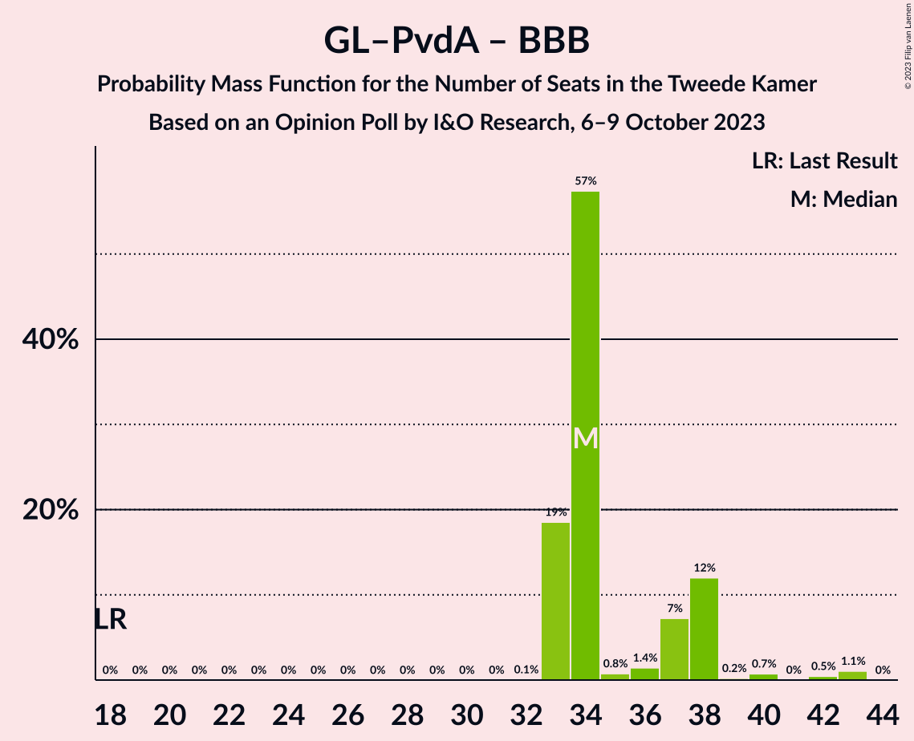

| Number of Seats | Probability | Accumulated | Special Marks |
|:---------------:|:-----------:|:-----------:|:-------------:|
| 18 | 0% | 100% | Last Result |
| 19 | 0% | 100% |  |
| 20 | 0% | 100% |  |
| 21 | 0% | 100% |  |
| 22 | 0% | 100% |  |
| 23 | 0% | 100% |  |
| 24 | 0% | 100% |  |
| 25 | 0% | 100% |  |
| 26 | 0% | 100% |  |
| 27 | 0% | 100% |  |
| 28 | 0% | 100% |  |
| 29 | 0% | 100% |  |
| 30 | 0% | 100% |  |
| 31 | 0% | 100% |  |
| 32 | 0.1% | 100% |  |
| 33 | 19% | 99.9% |  |
| 34 | 57% | 81% | Median |
| 35 | 0.8% | 24% |  |
| 36 | 1.4% | 23% |  |
| 37 | 7% | 22% |  |
| 38 | 12% | 15% |  |
| 39 | 0.2% | 2% |  |
| 40 | 0.7% | 2% |  |
| 41 | 0% | 2% |  |
| 42 | 0.5% | 2% |  |
| 43 | 1.1% | 1.1% |  |
| 44 | 0% | 0% |  |

### GroenLinks–Partij van de Arbeid – Christen-Democratisch Appèl – ChristenUnie

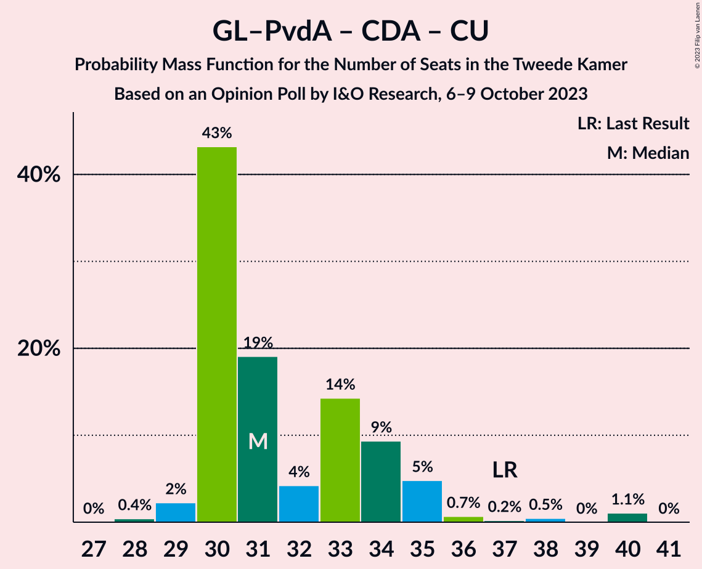

| Number of Seats | Probability | Accumulated | Special Marks |
|:---------------:|:-----------:|:-----------:|:-------------:|
| 28 | 0.4% | 100% |  |
| 29 | 2% | 99.6% |  |
| 30 | 43% | 97% | Median |
| 31 | 19% | 54% |  |
| 32 | 4% | 35% |  |
| 33 | 14% | 31% |  |
| 34 | 9% | 17% |  |
| 35 | 5% | 7% |  |
| 36 | 0.7% | 2% |  |
| 37 | 0.2% | 2% | Last Result |
| 38 | 0.5% | 2% |  |
| 39 | 0% | 1.1% |  |
| 40 | 1.1% | 1.1% |  |
| 41 | 0% | 0% |  |

### Volkspartij voor Vrijheid en Democratie – Christen-Democratisch Appèl

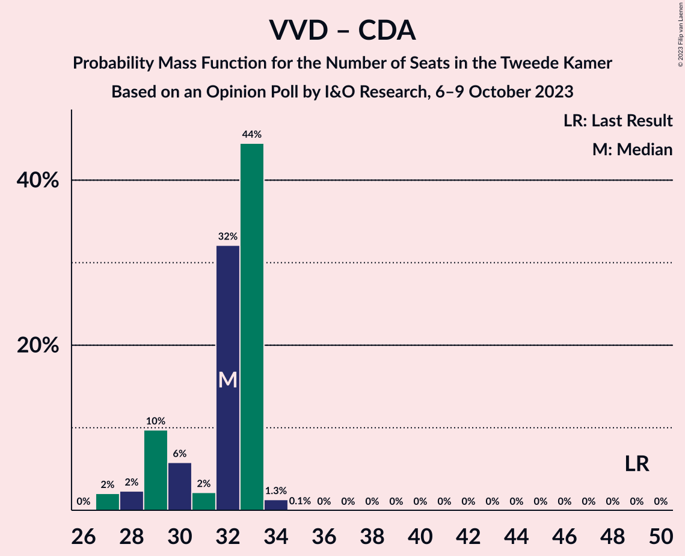

| Number of Seats | Probability | Accumulated | Special Marks |
|:---------------:|:-----------:|:-----------:|:-------------:|
| 27 | 2% | 100% |  |
| 28 | 2% | 98% |  |
| 29 | 10% | 96% |  |
| 30 | 6% | 86% |  |
| 31 | 2% | 80% |  |
| 32 | 32% | 78% | Median |
| 33 | 44% | 46% |  |
| 34 | 1.3% | 1.4% |  |
| 35 | 0.1% | 0.1% |  |
| 36 | 0% | 0% |  |
| 37 | 0% | 0% |  |
| 38 | 0% | 0% |  |
| 39 | 0% | 0% |  |
| 40 | 0% | 0% |  |
| 41 | 0% | 0% |  |
| 42 | 0% | 0% |  |
| 43 | 0% | 0% |  |
| 44 | 0% | 0% |  |
| 45 | 0% | 0% |  |
| 46 | 0% | 0% |  |
| 47 | 0% | 0% |  |
| 48 | 0% | 0% |  |
| 49 | 0% | 0% | Last Result |

### GroenLinks–Partij van de Arbeid – Christen-Democratisch Appèl

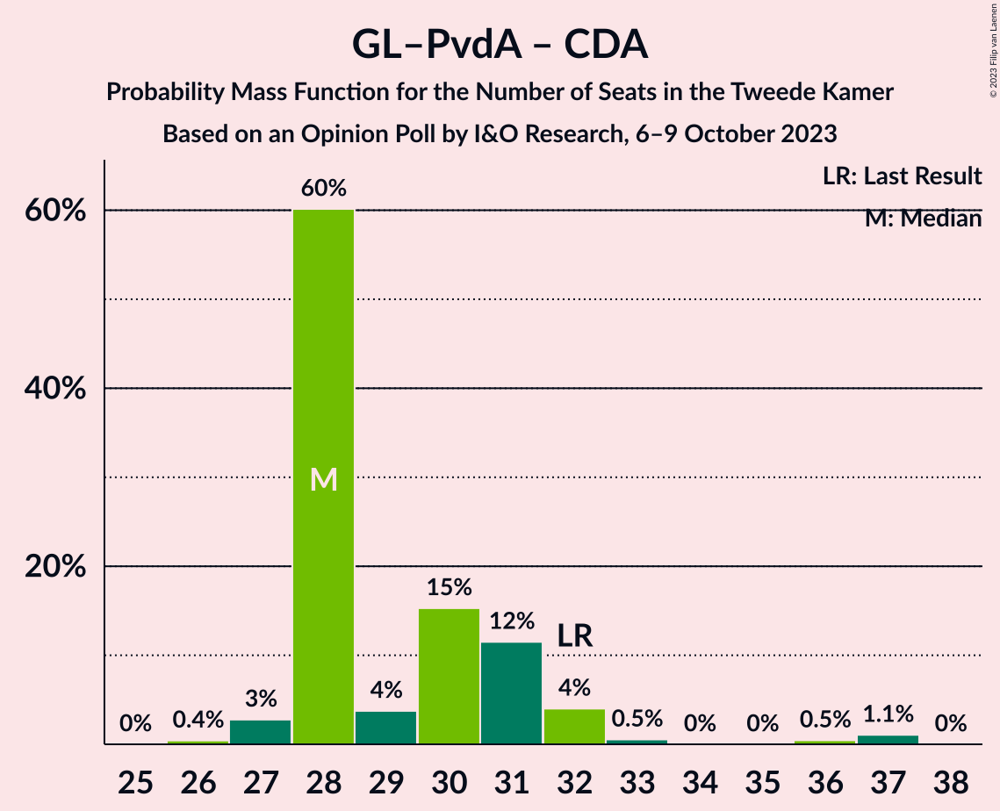

| Number of Seats | Probability | Accumulated | Special Marks |
|:---------------:|:-----------:|:-----------:|:-------------:|
| 26 | 0.4% | 100% |  |
| 27 | 3% | 99.6% |  |
| 28 | 60% | 97% | Median |
| 29 | 4% | 37% |  |
| 30 | 15% | 33% |  |
| 31 | 12% | 18% |  |
| 32 | 4% | 6% | Last Result |
| 33 | 0.5% | 2% |  |
| 34 | 0% | 2% |  |
| 35 | 0% | 2% |  |
| 36 | 0.5% | 2% |  |
| 37 | 1.1% | 1.1% |  |
| 38 | 0% | 0% |  |

### Democraten 66 – Christen-Democratisch Appèl

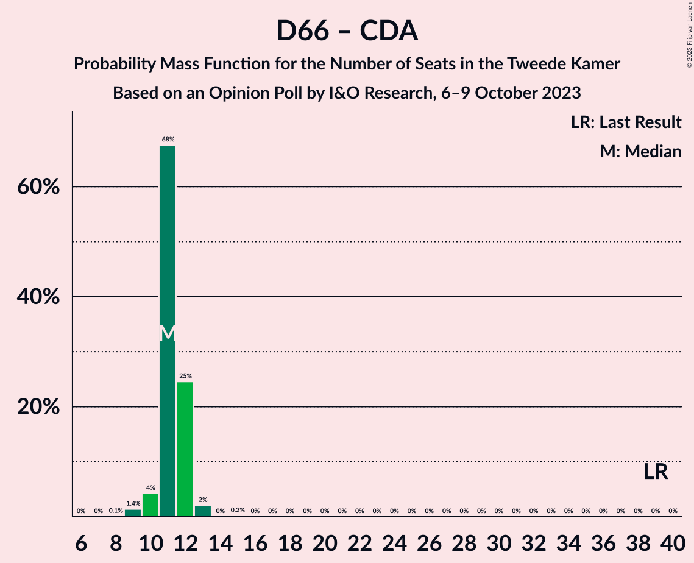

| Number of Seats | Probability | Accumulated | Special Marks |
|:---------------:|:-----------:|:-----------:|:-------------:|
| 8 | 0.1% | 100% |  |
| 9 | 1.4% | 99.9% |  |
| 10 | 4% | 98.6% |  |
| 11 | 68% | 94% | Median |
| 12 | 25% | 27% |  |
| 13 | 2% | 2% |  |
| 14 | 0% | 0.2% |  |
| 15 | 0.2% | 0.2% |  |
| 16 | 0% | 0% |  |
| 17 | 0% | 0% |  |
| 18 | 0% | 0% |  |
| 19 | 0% | 0% |  |
| 20 | 0% | 0% |  |
| 21 | 0% | 0% |  |
| 22 | 0% | 0% |  |
| 23 | 0% | 0% |  |
| 24 | 0% | 0% |  |
| 25 | 0% | 0% |  |
| 26 | 0% | 0% |  |
| 27 | 0% | 0% |  |
| 28 | 0% | 0% |  |
| 29 | 0% | 0% |  |
| 30 | 0% | 0% |  |
| 31 | 0% | 0% |  |
| 32 | 0% | 0% |  |
| 33 | 0% | 0% |  |
| 34 | 0% | 0% |  |
| 35 | 0% | 0% |  |
| 36 | 0% | 0% |  |
| 37 | 0% | 0% |  |
| 38 | 0% | 0% |  |
| 39 | 0% | 0% | Last Result |

## Technical Information

### Opinion Poll

+ **Polling firm:** I&O Research
+ **Commissioner(s):** —
+ **Fieldwork period:** 6–9 October 2023

### Calculations

+ **Sample size:** 2293
+ **Simulations done:** 1,048,576
+ **Error estimate:** 2.27%

