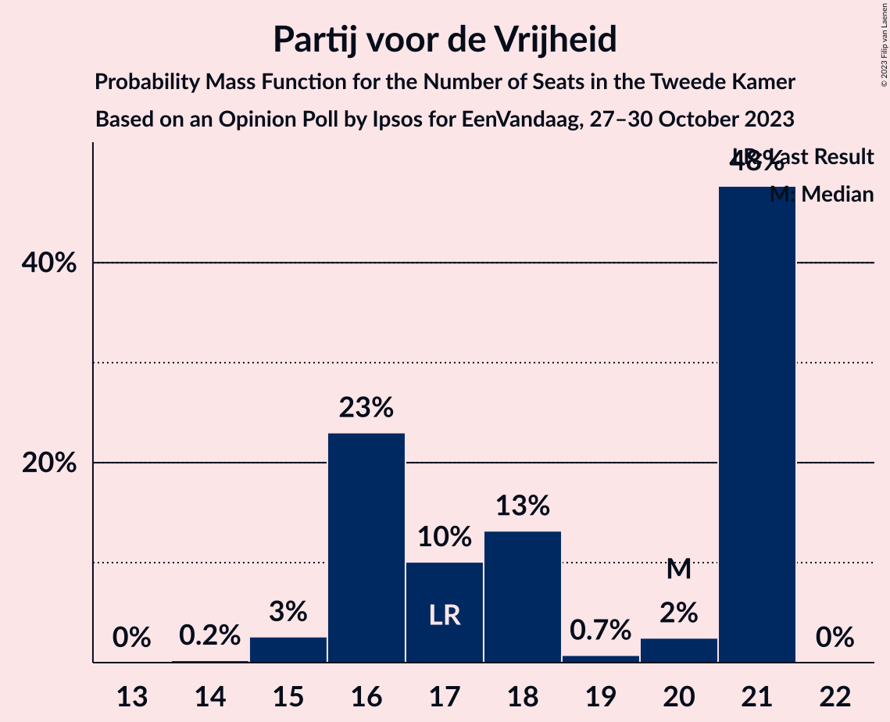
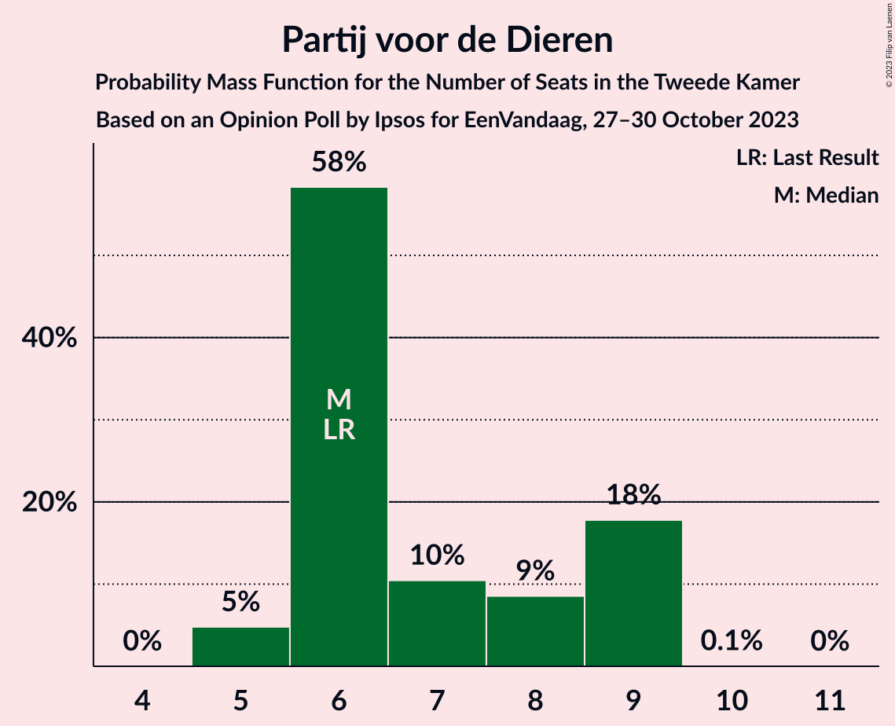
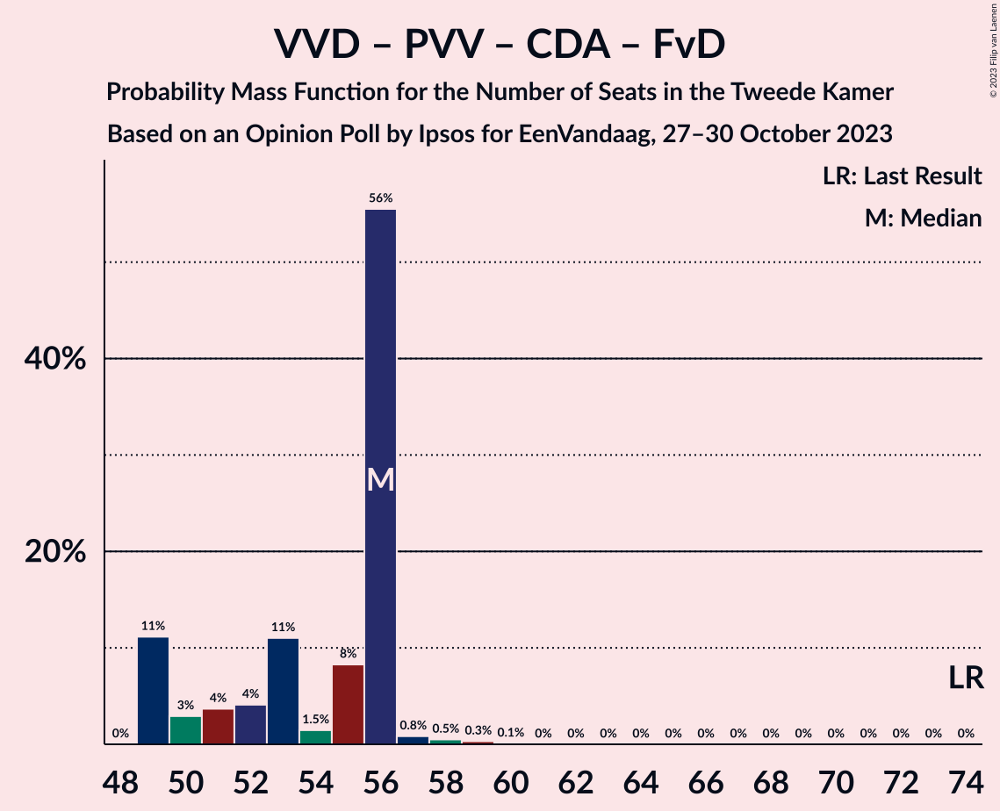

# Opinion Poll by Ipsos for EenVandaag, 27–30 October 2023

<a href="#voting-intentions">Voting Intentions</a> | <a href="#seats">Seats</a> | <a href="#coalitions">Coalitions</a> | <a href="#technical-information">Technical Information</a>

## Voting Intentions

### Confidence Intervals

| Party | Last Result | Poll Result | 80% Confidence Interval | 90% Confidence Interval | 95% Confidence Interval | 99% Confidence Interval |
|:-----:|:-----------:|:-----------:|:-----------------------:|:-----------------------:|:-----------------------:|:-----------------------:|
| Volkspartij voor Vrijheid en Democratie | 21.9% | 18.5% | 17.3–19.6% |17.0–20.0% |16.8–20.3% |16.3–20.8% |
| Nieuw Sociaal Contract | 0.0% | 17.2% | 16.1–18.3% |15.8–18.6% |15.5–18.9% |15.0–19.5% |
| GroenLinks–Partij van de Arbeid | 10.9% | 14.5% | 13.5–15.6% |13.2–15.9% |13.0–16.2% |12.5–16.7% |
| Partij voor de Vrijheid | 10.8% | 11.2% | 10.3–12.2% |10.1–12.5% |9.9–12.7% |9.5–13.2% |
| BoerBurgerBeweging | 1.0% | 7.9% | 7.2–8.7% |7.0–9.0% |6.8–9.2% |6.4–9.6% |
| Democraten 66 | 15.0% | 5.2% | 4.6–6.0% |4.5–6.2% |4.3–6.3% |4.1–6.7% |
| Partij voor de Dieren | 3.8% | 4.6% | 4.1–5.3% |3.9–5.5% |3.8–5.7% |3.5–6.0% |
| Christen-Democratisch Appèl | 9.5% | 3.3% | 2.8–3.9% |2.7–4.0% |2.6–4.2% |2.4–4.5% |
| Socialistische Partij | 6.0% | 3.3% | 2.8–3.9% |2.7–4.0% |2.6–4.2% |2.4–4.5% |
| ChristenUnie | 3.4% | 2.7% | 2.2–3.2% |2.1–3.3% |2.0–3.5% |1.8–3.7% |
| Forum voor Democratie | 5.0% | 2.7% | 2.2–3.2% |2.1–3.3% |2.0–3.5% |1.8–3.7% |
| DENK | 2.0% | 2.7% | 2.2–3.2% |2.1–3.3% |2.0–3.5% |1.8–3.7% |
| Volt Europa | 2.4% | 2.0% | 1.6–2.5% |1.5–2.6% |1.4–2.7% |1.3–3.0% |
| Staatkundig Gereformeerde Partij | 2.1% | 2.0% | 1.6–2.5% |1.5–2.6% |1.4–2.7% |1.3–3.0% |
| Juiste Antwoord 2021 | 2.4% | 1.3% | 1.0–1.7% |0.9–1.8% |0.9–1.9% |0.8–2.1% |
| Bij1 | 0.8% | 0.7% | 0.5–1.0% |0.4–1.1% |0.4–1.2% |0.3–1.3% |
| Belang van Nederland | 0.0% | 0.2% | 0.1–0.4% |0.1–0.4% |0.0–0.5% |0.0–0.6% |
| 50Plus | 1.0% | 0.2% | 0.1–0.4% |0.1–0.4% |0.0–0.5% |0.0–0.6% |

*Note:* The poll result column reflects the actual value used in the calculations. Published results may vary slightly, and in addition be rounded to fewer digits.

## Seats

### Confidence Intervals

| Party | Last Result | Median | 80% Confidence Interval | 90% Confidence Interval | 95% Confidence Interval | 99% Confidence Interval |
|:-----:|:-----------:|:------:|:-----------------------:|:-----------------------:|:-----------------------:|:-----------------------:|
| <a href="#volkspartij-voor-vrijheid-en-democratie">Volkspartij voor Vrijheid en Democratie</a> | 34 | 27 | 26–28 |26–31 |26–33 |25–33 |
| <a href="#nieuw-sociaal-contract">Nieuw Sociaal Contract</a> | 0 | 24 | 24–28 |24–29 |24–30 |23–31 |
| <a href="#groenlinks–partij-van-de-arbeid">GroenLinks–Partij van de Arbeid</a> | 17 | 24 | 21–24 |20–24 |20–24 |18–25 |
| <a href="#partij-voor-de-vrijheid">Partij voor de Vrijheid</a> | 17 | 20 | 16–21 |16–21 |15–21 |15–21 |
| <a href="#boerburgerbeweging">BoerBurgerBeweging</a> | 1 | 11 | 11–12 |11–14 |10–14 |10–15 |
| <a href="#democraten-66">Democraten 66</a> | 24 | 8 | 6–9 |6–9 |5–9 |5–10 |
| <a href="#partij-voor-de-dieren">Partij voor de Dieren</a> | 6 | 6 | 6–9 |6–9 |5–9 |5–9 |
| <a href="#christen-democratisch-appèl">Christen-Democratisch Appèl</a> | 15 | 4 | 3–5 |3–6 |3–6 |3–7 |
| <a href="#socialistische-partij">Socialistische Partij</a> | 9 | 4 | 4–5 |4–6 |4–6 |3–7 |
| <a href="#christenunie">ChristenUnie</a> | 5 | 5 | 3–5 |3–5 |3–5 |2–5 |
| <a href="#forum-voor-democratie">Forum voor Democratie</a> | 8 | 4 | 3–4 |2–5 |2–6 |2–6 |
| <a href="#denk">DENK</a> | 3 | 4 | 3–5 |3–6 |3–6 |3–6 |
| <a href="#volt-europa">Volt Europa</a> | 3 | 2 | 2–4 |2–4 |1–4 |1–4 |
| <a href="#staatkundig-gereformeerde-partij">Staatkundig Gereformeerde Partij</a> | 3 | 4 | 3–4 |2–4 |2–4 |2–5 |
| <a href="#juiste-antwoord-2021">Juiste Antwoord 2021</a> | 3 | 2 | 1–2 |1–3 |1–3 |1–4 |
| <a href="#bij1">Bij1</a> | 1 | 0 | 0–1 |0–1 |0–1 |0–1 |
| <a href="#belang-van-nederland">Belang van Nederland</a> | 0 | 0 | 0 |0 |0 |0–1 |
| <a href="#50plus">50Plus</a> | 1 | 0 | 0 |0 |0 |0–1 |

### Volkspartij voor Vrijheid en Democratie

*For a full overview of the results for this party, see the [Volkspartij voor Vrijheid en Democratie](party-volkspartijvoorvrijheidendemocratie.html) page.*

| Number of Seats | Probability | Accumulated | Special Marks |
|:---------------:|:-----------:|:-----------:|:-------------:|
| 24 | 0.2% | 100% |  |
| 25 | 0.4% | 99.8% |  |
| 26 | 17% | 99.5% |  |
| 27 | 58% | 83% | Median |
| 28 | 16% | 25% |  |
| 29 | 2% | 9% |  |
| 30 | 0.8% | 7% |  |
| 31 | 2% | 7% |  |
| 32 | 0.4% | 4% |  |
| 33 | 4% | 4% |  |
| 34 | 0% | 0% | Last Result |

### Nieuw Sociaal Contract

*For a full overview of the results for this party, see the [Nieuw Sociaal Contract](party-nieuwsociaalcontract.html) page.*

| Number of Seats | Probability | Accumulated | Special Marks |
|:---------------:|:-----------:|:-----------:|:-------------:|
| 0 | 0% | 100% | Last Result |
| 1 | 0% | 100% |  |
| 2 | 0% | 100% |  |
| 3 | 0% | 100% |  |
| 4 | 0% | 100% |  |
| 5 | 0% | 100% |  |
| 6 | 0% | 100% |  |
| 7 | 0% | 100% |  |
| 8 | 0% | 100% |  |
| 9 | 0% | 100% |  |
| 10 | 0% | 100% |  |
| 11 | 0% | 100% |  |
| 12 | 0% | 100% |  |
| 13 | 0% | 100% |  |
| 14 | 0% | 100% |  |
| 15 | 0% | 100% |  |
| 16 | 0% | 100% |  |
| 17 | 0% | 100% |  |
| 18 | 0% | 100% |  |
| 19 | 0% | 100% |  |
| 20 | 0% | 100% |  |
| 21 | 0% | 100% |  |
| 22 | 0% | 100% |  |
| 23 | 1.1% | 100% |  |
| 24 | 50% | 98.9% | Median |
| 25 | 2% | 49% |  |
| 26 | 6% | 47% |  |
| 27 | 16% | 41% |  |
| 28 | 18% | 25% |  |
| 29 | 4% | 7% |  |
| 30 | 3% | 4% |  |
| 31 | 1.0% | 1.0% |  |
| 32 | 0% | 0% |  |

### GroenLinks–Partij van de Arbeid

*For a full overview of the results for this party, see the [GroenLinks–Partij van de Arbeid](party-groenlinks–partijvandearbeid.html) page.*

| Number of Seats | Probability | Accumulated | Special Marks |
|:---------------:|:-----------:|:-----------:|:-------------:|
| 17 | 0% | 100% | Last Result |
| 18 | 1.3% | 100% |  |
| 19 | 0.8% | 98.7% |  |
| 20 | 8% | 98% |  |
| 21 | 13% | 90% |  |
| 22 | 1.5% | 77% |  |
| 23 | 21% | 76% |  |
| 24 | 53% | 55% | Median |
| 25 | 1.0% | 1.3% |  |
| 26 | 0.2% | 0.2% |  |
| 27 | 0% | 0% |  |

### Partij voor de Vrijheid

*For a full overview of the results for this party, see the [Partij voor de Vrijheid](party-partijvoordevrijheid.html) page.*

| Number of Seats | Probability | Accumulated | Special Marks |
|:---------------:|:-----------:|:-----------:|:-------------:|
| 14 | 0.2% | 100% |  |
| 15 | 3% | 99.8% |  |
| 16 | 23% | 97% |  |
| 17 | 10% | 74% | Last Result |
| 18 | 13% | 64% |  |
| 19 | 0.7% | 51% |  |
| 20 | 2% | 50% | Median |
| 21 | 48% | 48% |  |
| 22 | 0% | 0% |  |

### BoerBurgerBeweging

*For a full overview of the results for this party, see the [BoerBurgerBeweging](party-boerburgerbeweging.html) page.*

| Number of Seats | Probability | Accumulated | Special Marks |
|:---------------:|:-----------:|:-----------:|:-------------:|
| 1 | 0% | 100% | Last Result |
| 2 | 0% | 100% |  |
| 3 | 0% | 100% |  |
| 4 | 0% | 100% |  |
| 5 | 0% | 100% |  |
| 6 | 0% | 100% |  |
| 7 | 0% | 100% |  |
| 8 | 0% | 100% |  |
| 9 | 0.3% | 100% |  |
| 10 | 4% | 99.7% |  |
| 11 | 73% | 96% | Median |
| 12 | 14% | 23% |  |
| 13 | 3% | 9% |  |
| 14 | 5% | 6% |  |
| 15 | 0.8% | 0.8% |  |
| 16 | 0% | 0% |  |

### Democraten 66

*For a full overview of the results for this party, see the [Democraten 66](party-democraten66.html) page.*

| Number of Seats | Probability | Accumulated | Special Marks |
|:---------------:|:-----------:|:-----------:|:-------------:|
| 5 | 4% | 100% |  |
| 6 | 9% | 96% |  |
| 7 | 6% | 87% |  |
| 8 | 70% | 81% | Median |
| 9 | 11% | 12% |  |
| 10 | 0.7% | 1.1% |  |
| 11 | 0.4% | 0.4% |  |
| 12 | 0% | 0% |  |
| 13 | 0% | 0% |  |
| 14 | 0% | 0% |  |
| 15 | 0% | 0% |  |
| 16 | 0% | 0% |  |
| 17 | 0% | 0% |  |
| 18 | 0% | 0% |  |
| 19 | 0% | 0% |  |
| 20 | 0% | 0% |  |
| 21 | 0% | 0% |  |
| 22 | 0% | 0% |  |
| 23 | 0% | 0% |  |
| 24 | 0% | 0% | Last Result |

### Partij voor de Dieren

*For a full overview of the results for this party, see the [Partij voor de Dieren](party-partijvoordedieren.html) page.*

| Number of Seats | Probability | Accumulated | Special Marks |
|:---------------:|:-----------:|:-----------:|:-------------:|
| 5 | 5% | 100% |  |
| 6 | 58% | 95% | Last Result, Median |
| 7 | 10% | 37% |  |
| 8 | 9% | 26% |  |
| 9 | 18% | 18% |  |
| 10 | 0.1% | 0.1% |  |
| 11 | 0% | 0% |  |

### Christen-Democratisch Appèl

*For a full overview of the results for this party, see the [Christen-Democratisch Appèl](party-christen-democratischappèl.html) page.*

| Number of Seats | Probability | Accumulated | Special Marks |
|:---------------:|:-----------:|:-----------:|:-------------:|
| 3 | 13% | 100% |  |
| 4 | 64% | 87% | Median |
| 5 | 14% | 24% |  |
| 6 | 9% | 9% |  |
| 7 | 0.6% | 0.7% |  |
| 8 | 0% | 0% |  |
| 9 | 0% | 0% |  |
| 10 | 0% | 0% |  |
| 11 | 0% | 0% |  |
| 12 | 0% | 0% |  |
| 13 | 0% | 0% |  |
| 14 | 0% | 0% |  |
| 15 | 0% | 0% | Last Result |

### Socialistische Partij

*For a full overview of the results for this party, see the [Socialistische Partij](party-socialistischepartij.html) page.*

| Number of Seats | Probability | Accumulated | Special Marks |
|:---------------:|:-----------:|:-----------:|:-------------:|
| 3 | 0.5% | 100% |  |
| 4 | 64% | 99.5% | Median |
| 5 | 30% | 35% |  |
| 6 | 4% | 5% |  |
| 7 | 1.0% | 1.0% |  |
| 8 | 0% | 0% |  |
| 9 | 0% | 0% | Last Result |

### ChristenUnie

*For a full overview of the results for this party, see the [ChristenUnie](party-christenunie.html) page.*

| Number of Seats | Probability | Accumulated | Special Marks |
|:---------------:|:-----------:|:-----------:|:-------------:|
| 2 | 2% | 100% |  |
| 3 | 19% | 98% |  |
| 4 | 27% | 79% |  |
| 5 | 52% | 52% | Last Result, Median |
| 6 | 0.4% | 0.4% |  |
| 7 | 0% | 0% |  |

### Forum voor Democratie

*For a full overview of the results for this party, see the [Forum voor Democratie](party-forumvoordemocratie.html) page.*

| Number of Seats | Probability | Accumulated | Special Marks |
|:---------------:|:-----------:|:-----------:|:-------------:|
| 2 | 8% | 100% |  |
| 3 | 10% | 92% |  |
| 4 | 76% | 82% | Median |
| 5 | 2% | 6% |  |
| 6 | 5% | 5% |  |
| 7 | 0% | 0% |  |
| 8 | 0% | 0% | Last Result |

### DENK

*For a full overview of the results for this party, see the [DENK](party-denk.html) page.*

| Number of Seats | Probability | Accumulated | Special Marks |
|:---------------:|:-----------:|:-----------:|:-------------:|
| 2 | 0.2% | 100% |  |
| 3 | 13% | 99.8% | Last Result |
| 4 | 75% | 87% | Median |
| 5 | 6% | 12% |  |
| 6 | 6% | 6% |  |
| 7 | 0% | 0% |  |

### Volt Europa

*For a full overview of the results for this party, see the [Volt Europa](party-volteuropa.html) page.*

| Number of Seats | Probability | Accumulated | Special Marks |
|:---------------:|:-----------:|:-----------:|:-------------:|
| 1 | 3% | 100% |  |
| 2 | 63% | 97% | Median |
| 3 | 21% | 34% | Last Result |
| 4 | 13% | 13% |  |
| 5 | 0.1% | 0.1% |  |
| 6 | 0% | 0% |  |

### Staatkundig Gereformeerde Partij

*For a full overview of the results for this party, see the [Staatkundig Gereformeerde Partij](party-staatkundiggereformeerdepartij.html) page.*

| Number of Seats | Probability | Accumulated | Special Marks |
|:---------------:|:-----------:|:-----------:|:-------------:|
| 1 | 0.1% | 100% |  |
| 2 | 8% | 99.9% |  |
| 3 | 22% | 92% | Last Result |
| 4 | 69% | 71% | Median |
| 5 | 2% | 2% |  |
| 6 | 0% | 0% |  |

### Juiste Antwoord 2021

*For a full overview of the results for this party, see the [Juiste Antwoord 2021](party-juisteantwoord2021.html) page.*

| Number of Seats | Probability | Accumulated | Special Marks |
|:---------------:|:-----------:|:-----------:|:-------------:|
| 0 | 0.3% | 100% |  |
| 1 | 24% | 99.7% |  |
| 2 | 65% | 75% | Median |
| 3 | 9% | 10% | Last Result |
| 4 | 0.5% | 0.5% |  |
| 5 | 0% | 0% |  |

### Bij1

*For a full overview of the results for this party, see the [Bij1](party-bij1.html) page.*

| Number of Seats | Probability | Accumulated | Special Marks |
|:---------------:|:-----------:|:-----------:|:-------------:|
| 0 | 58% | 100% | Median |
| 1 | 42% | 42% | Last Result |
| 2 | 0.3% | 0.3% |  |
| 3 | 0% | 0% |  |

### Belang van Nederland

*For a full overview of the results for this party, see the [Belang van Nederland](party-belangvannederland.html) page.*

| Number of Seats | Probability | Accumulated | Special Marks |
|:---------------:|:-----------:|:-----------:|:-------------:|
| 0 | 98.7% | 100% | Last Result, Median |
| 1 | 1.3% | 1.3% |  |
| 2 | 0% | 0% |  |

### 50Plus

*For a full overview of the results for this party, see the [50Plus](party-50plus.html) page.*

| Number of Seats | Probability | Accumulated | Special Marks |
|:---------------:|:-----------:|:-----------:|:-------------:|
| 0 | 98.7% | 100% | Median |
| 1 | 1.3% | 1.3% | Last Result |
| 2 | 0% | 0% |  |

## Coalitions

### Confidence Intervals

| Coalition | Last Result | Median | Majority? | 80% Confidence Interval | 90% Confidence Interval | 95% Confidence Interval | 99% Confidence Interval |
|:---------:|:-----------:|:------:|:---------:|:-----------------------:|:-----------------------:|:-----------------------:|:-----------------------:|
| Volkspartij voor Vrijheid en Democratie – GroenLinks–Partij van de Arbeid – BoerBurgerBeweging – Christen-Democratisch Appèl | 67 | 66 | 0% | 63–68 | 63–70 | 63–71 | 63–71 |
| Volkspartij voor Vrijheid en Democratie – GroenLinks–Partij van de Arbeid – BoerBurgerBeweging | 52 | 62 | 0% | 60–62 | 59–65 | 59–67 | 59–67 |
| Volkspartij voor Vrijheid en Democratie – GroenLinks–Partij van de Arbeid – Democraten 66 | 75 | 59 | 0% | 56–59 | 53–61 | 53–65 | 53–65 |
| Volkspartij voor Vrijheid en Democratie – GroenLinks–Partij van de Arbeid – Christen-Democratisch Appèl | 66 | 55 | 0% | 52–56 | 51–57 | 51–61 | 51–61 |
| Volkspartij voor Vrijheid en Democratie – Partij voor de Vrijheid – Christen-Democratisch Appèl – Forum voor Democratie – Staatkundig Gereformeerde Partij | 77 | 59 | 0% | 53–60 | 53–60 | 53–60 | 53–61 |
| Volkspartij voor Vrijheid en Democratie – GroenLinks–Partij van de Arbeid | 51 | 51 | 0% | 48–51 | 47–52 | 47–57 | 47–57 |
| Volkspartij voor Vrijheid en Democratie – Partij voor de Vrijheid – Christen-Democratisch Appèl – Forum voor Democratie | 74 | 56 | 0% | 49–56 | 49–56 | 49–56 | 49–58 |
| Volkspartij voor Vrijheid en Democratie – Partij voor de Vrijheid – Christen-Democratisch Appèl | 66 | 52 | 0% | 45–52 | 45–53 | 45–53 | 45–53 |
| Volkspartij voor Vrijheid en Democratie – Democraten 66 – Christen-Democratisch Appèl – ChristenUnie | 78 | 44 | 0% | 41–46 | 41–48 | 41–48 | 41–49 |
| Volkspartij voor Vrijheid en Democratie – BoerBurgerBeweging – Christen-Democratisch Appèl | 50 | 42 | 0% | 40–46 | 40–47 | 40–47 | 40–49 |
| GroenLinks–Partij van de Arbeid – Democraten 66 – Christen-Democratisch Appèl – Socialistische Partij – ChristenUnie | 70 | 45 | 0% | 42–45 | 38–45 | 38–45 | 38–49 |
| Volkspartij voor Vrijheid en Democratie – Democraten 66 – Christen-Democratisch Appèl | 73 | 39 | 0% | 37–43 | 37–44 | 37–45 | 37–45 |
| Volkspartij voor Vrijheid en Democratie – Christen-Democratisch Appèl – Forum voor Democratie – Staatkundig Gereformeerde Partij – 50Plus | 61 | 39 | 0% | 37–42 | 37–42 | 37–43 | 36–43 |
| Volkspartij voor Vrijheid en Democratie – Christen-Democratisch Appèl – Forum voor Democratie – Staatkundig Gereformeerde Partij | 60 | 39 | 0% | 37–42 | 37–42 | 37–43 | 36–43 |
| GroenLinks–Partij van de Arbeid – Democraten 66 – Christen-Democratisch Appèl – ChristenUnie | 61 | 40 | 0% | 37–41 | 34–41 | 34–41 | 33–43 |
| Volkspartij voor Vrijheid en Democratie – Christen-Democratisch Appèl – Forum voor Democratie – 50Plus | 58 | 35 | 0% | 33–39 | 33–40 | 33–40 | 33–40 |
| Volkspartij voor Vrijheid en Democratie – Christen-Democratisch Appèl – Forum voor Democratie | 57 | 35 | 0% | 33–39 | 33–40 | 33–40 | 33–40 |
| GroenLinks–Partij van de Arbeid – BoerBurgerBeweging | 18 | 35 | 0% | 32–35 | 32–36 | 31–38 | 29–38 |
| GroenLinks–Partij van de Arbeid – Democraten 66 – Christen-Democratisch Appèl | 56 | 36 | 0% | 33–36 | 30–36 | 30–37 | 30–40 |
| Volkspartij voor Vrijheid en Democratie – Christen-Democratisch Appèl | 49 | 31 | 0% | 29–34 | 29–35 | 29–37 | 29–37 |
| GroenLinks–Partij van de Arbeid – Christen-Democratisch Appèl – ChristenUnie | 37 | 33 | 0% | 29–33 | 28–33 | 26–33 | 25–35 |
| GroenLinks–Partij van de Arbeid – Christen-Democratisch Appèl | 32 | 28 | 0% | 25–28 | 24–29 | 24–29 | 21–32 |
| Democraten 66 – Christen-Democratisch Appèl | 39 | 12 | 0% | 11–13 | 10–15 | 10–15 | 10–15 |

### Volkspartij voor Vrijheid en Democratie – GroenLinks–Partij van de Arbeid – BoerBurgerBeweging – Christen-Democratisch Appèl

| Number of Seats | Probability | Accumulated | Special Marks |
|:---------------:|:-----------:|:-----------:|:-------------:|
| 63 | 17% | 100% |  |
| 64 | 3% | 83% |  |
| 65 | 4% | 79% |  |
| 66 | 58% | 75% | Median |
| 67 | 3% | 17% | Last Result |
| 68 | 5% | 14% |  |
| 69 | 1.1% | 9% |  |
| 70 | 4% | 8% |  |
| 71 | 3% | 4% |  |
| 72 | 0% | 0.2% |  |
| 73 | 0.1% | 0.1% |  |
| 74 | 0% | 0% |  |

### Volkspartij voor Vrijheid en Democratie – GroenLinks–Partij van de Arbeid – BoerBurgerBeweging

| Number of Seats | Probability | Accumulated | Special Marks |
|:---------------:|:-----------:|:-----------:|:-------------:|
| 52 | 0% | 100% | Last Result |
| 53 | 0% | 100% |  |
| 54 | 0% | 100% |  |
| 55 | 0% | 100% |  |
| 56 | 0% | 100% |  |
| 57 | 0% | 100% |  |
| 58 | 0.2% | 100% |  |
| 59 | 7% | 99.8% |  |
| 60 | 20% | 93% |  |
| 61 | 7% | 73% |  |
| 62 | 55% | 65% | Median |
| 63 | 0.6% | 10% |  |
| 64 | 1.2% | 9% |  |
| 65 | 3% | 8% |  |
| 66 | 2% | 5% |  |
| 67 | 3% | 3% |  |
| 68 | 0.4% | 0.5% |  |
| 69 | 0% | 0.1% |  |
| 70 | 0% | 0% |  |

### Volkspartij voor Vrijheid en Democratie – GroenLinks–Partij van de Arbeid – Democraten 66

| Number of Seats | Probability | Accumulated | Special Marks |
|:---------------:|:-----------:|:-----------:|:-------------:|
| 52 | 0.3% | 100% |  |
| 53 | 6% | 99.7% |  |
| 54 | 0.3% | 94% |  |
| 55 | 2% | 93% |  |
| 56 | 6% | 91% |  |
| 57 | 19% | 85% |  |
| 58 | 9% | 66% |  |
| 59 | 49% | 57% | Median |
| 60 | 2% | 8% |  |
| 61 | 3% | 6% |  |
| 62 | 0.2% | 3% |  |
| 63 | 0% | 3% |  |
| 64 | 0.2% | 3% |  |
| 65 | 3% | 3% |  |
| 66 | 0% | 0% |  |
| 67 | 0% | 0% |  |
| 68 | 0% | 0% |  |
| 69 | 0% | 0% |  |
| 70 | 0% | 0% |  |
| 71 | 0% | 0% |  |
| 72 | 0% | 0% |  |
| 73 | 0% | 0% |  |
| 74 | 0% | 0% |  |
| 75 | 0% | 0% | Last Result |

### Volkspartij voor Vrijheid en Democratie – GroenLinks–Partij van de Arbeid – Christen-Democratisch Appèl

| Number of Seats | Probability | Accumulated | Special Marks |
|:---------------:|:-----------:|:-----------:|:-------------:|
| 50 | 0.3% | 100% |  |
| 51 | 8% | 99.7% |  |
| 52 | 11% | 91% |  |
| 53 | 3% | 80% |  |
| 54 | 9% | 77% |  |
| 55 | 53% | 68% | Median |
| 56 | 7% | 16% |  |
| 57 | 4% | 9% |  |
| 58 | 2% | 5% |  |
| 59 | 0.2% | 3% |  |
| 60 | 0.5% | 3% |  |
| 61 | 3% | 3% |  |
| 62 | 0% | 0% |  |
| 63 | 0% | 0% |  |
| 64 | 0% | 0% |  |
| 65 | 0% | 0% |  |
| 66 | 0% | 0% | Last Result |

### Volkspartij voor Vrijheid en Democratie – Partij voor de Vrijheid – Christen-Democratisch Appèl – Forum voor Democratie – Staatkundig Gereformeerde Partij

| Number of Seats | Probability | Accumulated | Special Marks |
|:---------------:|:-----------:|:-----------:|:-------------:|
| 51 | 0.1% | 100% |  |
| 52 | 0.2% | 99.9% |  |
| 53 | 14% | 99.8% |  |
| 54 | 0.8% | 86% |  |
| 55 | 6% | 85% |  |
| 56 | 11% | 79% |  |
| 57 | 3% | 68% |  |
| 58 | 7% | 65% |  |
| 59 | 9% | 58% | Median |
| 60 | 48% | 49% |  |
| 61 | 0.9% | 1.4% |  |
| 62 | 0.4% | 0.4% |  |
| 63 | 0% | 0% |  |
| 64 | 0% | 0% |  |
| 65 | 0% | 0% |  |
| 66 | 0% | 0% |  |
| 67 | 0% | 0% |  |
| 68 | 0% | 0% |  |
| 69 | 0% | 0% |  |
| 70 | 0% | 0% |  |
| 71 | 0% | 0% |  |
| 72 | 0% | 0% |  |
| 73 | 0% | 0% |  |
| 74 | 0% | 0% |  |
| 75 | 0% | 0% |  |
| 76 | 0% | 0% | Majority |
| 77 | 0% | 0% | Last Result |

### Volkspartij voor Vrijheid en Democratie – GroenLinks–Partij van de Arbeid

| Number of Seats | Probability | Accumulated | Special Marks |
|:---------------:|:-----------:|:-----------:|:-------------:|
| 45 | 0.3% | 100% |  |
| 46 | 0% | 99.7% |  |
| 47 | 9% | 99.7% |  |
| 48 | 1.1% | 91% |  |
| 49 | 25% | 90% |  |
| 50 | 0.6% | 65% |  |
| 51 | 59% | 65% | Last Result, Median |
| 52 | 2% | 6% |  |
| 53 | 0.5% | 4% |  |
| 54 | 0.6% | 4% |  |
| 55 | 0.1% | 3% |  |
| 56 | 0.3% | 3% |  |
| 57 | 3% | 3% |  |
| 58 | 0% | 0% |  |

### Volkspartij voor Vrijheid en Democratie – Partij voor de Vrijheid – Christen-Democratisch Appèl – Forum voor Democratie

| Number of Seats | Probability | Accumulated | Special Marks |
|:---------------:|:-----------:|:-----------:|:-------------:|
| 48 | 0% | 100% |  |
| 49 | 11% | 99.9% |  |
| 50 | 3% | 89% |  |
| 51 | 4% | 86% |  |
| 52 | 4% | 82% |  |
| 53 | 11% | 78% |  |
| 54 | 1.5% | 67% |  |
| 55 | 8% | 66% | Median |
| 56 | 56% | 57% |  |
| 57 | 0.8% | 2% |  |
| 58 | 0.5% | 0.9% |  |
| 59 | 0.3% | 0.4% |  |
| 60 | 0.1% | 0.1% |  |
| 61 | 0% | 0% |  |
| 62 | 0% | 0% |  |
| 63 | 0% | 0% |  |
| 64 | 0% | 0% |  |
| 65 | 0% | 0% |  |
| 66 | 0% | 0% |  |
| 67 | 0% | 0% |  |
| 68 | 0% | 0% |  |
| 69 | 0% | 0% |  |
| 70 | 0% | 0% |  |
| 71 | 0% | 0% |  |
| 72 | 0% | 0% |  |
| 73 | 0% | 0% |  |
| 74 | 0% | 0% | Last Result |

### Volkspartij voor Vrijheid en Democratie – Partij voor de Vrijheid – Christen-Democratisch Appèl

| Number of Seats | Probability | Accumulated | Special Marks |
|:---------------:|:-----------:|:-----------:|:-------------:|
| 44 | 0.1% | 100% |  |
| 45 | 11% | 99.9% |  |
| 46 | 0.7% | 89% |  |
| 47 | 3% | 88% |  |
| 48 | 6% | 85% |  |
| 49 | 7% | 80% |  |
| 50 | 7% | 72% |  |
| 51 | 10% | 66% | Median |
| 52 | 48% | 56% |  |
| 53 | 7% | 7% |  |
| 54 | 0.2% | 0.4% |  |
| 55 | 0.2% | 0.3% |  |
| 56 | 0.1% | 0.1% |  |
| 57 | 0% | 0% |  |
| 58 | 0% | 0% |  |
| 59 | 0% | 0% |  |
| 60 | 0% | 0% |  |
| 61 | 0% | 0% |  |
| 62 | 0% | 0% |  |
| 63 | 0% | 0% |  |
| 64 | 0% | 0% |  |
| 65 | 0% | 0% |  |
| 66 | 0% | 0% | Last Result |

### Volkspartij voor Vrijheid en Democratie – Democraten 66 – Christen-Democratisch Appèl – ChristenUnie

| Number of Seats | Probability | Accumulated | Special Marks |
|:---------------:|:-----------:|:-----------:|:-------------:|
| 40 | 0.1% | 100% |  |
| 41 | 20% | 99.9% |  |
| 42 | 2% | 80% |  |
| 43 | 8% | 77% |  |
| 44 | 56% | 69% | Median |
| 45 | 1.2% | 13% |  |
| 46 | 5% | 12% |  |
| 47 | 1.1% | 7% |  |
| 48 | 5% | 6% |  |
| 49 | 1.3% | 2% |  |
| 50 | 0.1% | 0.2% |  |
| 51 | 0% | 0% |  |
| 52 | 0% | 0% |  |
| 53 | 0% | 0% |  |
| 54 | 0% | 0% |  |
| 55 | 0% | 0% |  |
| 56 | 0% | 0% |  |
| 57 | 0% | 0% |  |
| 58 | 0% | 0% |  |
| 59 | 0% | 0% |  |
| 60 | 0% | 0% |  |
| 61 | 0% | 0% |  |
| 62 | 0% | 0% |  |
| 63 | 0% | 0% |  |
| 64 | 0% | 0% |  |
| 65 | 0% | 0% |  |
| 66 | 0% | 0% |  |
| 67 | 0% | 0% |  |
| 68 | 0% | 0% |  |
| 69 | 0% | 0% |  |
| 70 | 0% | 0% |  |
| 71 | 0% | 0% |  |
| 72 | 0% | 0% |  |
| 73 | 0% | 0% |  |
| 74 | 0% | 0% |  |
| 75 | 0% | 0% |  |
| 76 | 0% | 0% | Majority |
| 77 | 0% | 0% |  |
| 78 | 0% | 0% | Last Result |

### Volkspartij voor Vrijheid en Democratie – BoerBurgerBeweging – Christen-Democratisch Appèl

| Number of Seats | Probability | Accumulated | Special Marks |
|:---------------:|:-----------:|:-----------:|:-------------:|
| 40 | 11% | 100% |  |
| 41 | 0.4% | 89% |  |
| 42 | 49% | 89% | Median |
| 43 | 11% | 40% |  |
| 44 | 5% | 29% |  |
| 45 | 14% | 24% |  |
| 46 | 4% | 11% |  |
| 47 | 5% | 7% |  |
| 48 | 0.2% | 2% |  |
| 49 | 2% | 2% |  |
| 50 | 0.1% | 0.1% | Last Result |
| 51 | 0% | 0% |  |

### GroenLinks–Partij van de Arbeid – Democraten 66 – Christen-Democratisch Appèl – Socialistische Partij – ChristenUnie

| Number of Seats | Probability | Accumulated | Special Marks |
|:---------------:|:-----------:|:-----------:|:-------------:|
| 38 | 7% | 100% |  |
| 39 | 1.1% | 93% |  |
| 40 | 0.3% | 91% |  |
| 41 | 0.2% | 91% |  |
| 42 | 12% | 91% |  |
| 43 | 18% | 79% |  |
| 44 | 6% | 61% |  |
| 45 | 53% | 55% | Median |
| 46 | 0.7% | 2% |  |
| 47 | 0.3% | 1.3% |  |
| 48 | 0.4% | 1.0% |  |
| 49 | 0.6% | 0.6% |  |
| 50 | 0% | 0% |  |
| 51 | 0% | 0% |  |
| 52 | 0% | 0% |  |
| 53 | 0% | 0% |  |
| 54 | 0% | 0% |  |
| 55 | 0% | 0% |  |
| 56 | 0% | 0% |  |
| 57 | 0% | 0% |  |
| 58 | 0% | 0% |  |
| 59 | 0% | 0% |  |
| 60 | 0% | 0% |  |
| 61 | 0% | 0% |  |
| 62 | 0% | 0% |  |
| 63 | 0% | 0% |  |
| 64 | 0% | 0% |  |
| 65 | 0% | 0% |  |
| 66 | 0% | 0% |  |
| 67 | 0% | 0% |  |
| 68 | 0% | 0% |  |
| 69 | 0% | 0% |  |
| 70 | 0% | 0% | Last Result |

### Volkspartij voor Vrijheid en Democratie – Democraten 66 – Christen-Democratisch Appèl

| Number of Seats | Probability | Accumulated | Special Marks |
|:---------------:|:-----------:|:-----------:|:-------------:|
| 36 | 0.3% | 100% |  |
| 37 | 17% | 99.7% |  |
| 38 | 5% | 82% |  |
| 39 | 53% | 77% | Median |
| 40 | 6% | 25% |  |
| 41 | 6% | 19% |  |
| 42 | 3% | 13% |  |
| 43 | 5% | 11% |  |
| 44 | 2% | 6% |  |
| 45 | 4% | 4% |  |
| 46 | 0.1% | 0.1% |  |
| 47 | 0% | 0% |  |
| 48 | 0% | 0% |  |
| 49 | 0% | 0% |  |
| 50 | 0% | 0% |  |
| 51 | 0% | 0% |  |
| 52 | 0% | 0% |  |
| 53 | 0% | 0% |  |
| 54 | 0% | 0% |  |
| 55 | 0% | 0% |  |
| 56 | 0% | 0% |  |
| 57 | 0% | 0% |  |
| 58 | 0% | 0% |  |
| 59 | 0% | 0% |  |
| 60 | 0% | 0% |  |
| 61 | 0% | 0% |  |
| 62 | 0% | 0% |  |
| 63 | 0% | 0% |  |
| 64 | 0% | 0% |  |
| 65 | 0% | 0% |  |
| 66 | 0% | 0% |  |
| 67 | 0% | 0% |  |
| 68 | 0% | 0% |  |
| 69 | 0% | 0% |  |
| 70 | 0% | 0% |  |
| 71 | 0% | 0% |  |
| 72 | 0% | 0% |  |
| 73 | 0% | 0% | Last Result |

### Volkspartij voor Vrijheid en Democratie – Christen-Democratisch Appèl – Forum voor Democratie – Staatkundig Gereformeerde Partij – 50Plus

| Number of Seats | Probability | Accumulated | Special Marks |
|:---------------:|:-----------:|:-----------:|:-------------:|
| 36 | 2% | 100% |  |
| 37 | 12% | 98% |  |
| 38 | 11% | 85% |  |
| 39 | 54% | 74% | Median |
| 40 | 5% | 20% |  |
| 41 | 2% | 15% |  |
| 42 | 9% | 13% |  |
| 43 | 4% | 4% |  |
| 44 | 0.1% | 0.2% |  |
| 45 | 0% | 0.1% |  |
| 46 | 0% | 0% |  |
| 47 | 0% | 0% |  |
| 48 | 0% | 0% |  |
| 49 | 0% | 0% |  |
| 50 | 0% | 0% |  |
| 51 | 0% | 0% |  |
| 52 | 0% | 0% |  |
| 53 | 0% | 0% |  |
| 54 | 0% | 0% |  |
| 55 | 0% | 0% |  |
| 56 | 0% | 0% |  |
| 57 | 0% | 0% |  |
| 58 | 0% | 0% |  |
| 59 | 0% | 0% |  |
| 60 | 0% | 0% |  |
| 61 | 0% | 0% | Last Result |

### Volkspartij voor Vrijheid en Democratie – Christen-Democratisch Appèl – Forum voor Democratie – Staatkundig Gereformeerde Partij

| Number of Seats | Probability | Accumulated | Special Marks |
|:---------------:|:-----------:|:-----------:|:-------------:|
| 36 | 2% | 100% |  |
| 37 | 12% | 98% |  |
| 38 | 12% | 85% |  |
| 39 | 53% | 73% | Median |
| 40 | 5% | 20% |  |
| 41 | 2% | 15% |  |
| 42 | 9% | 13% |  |
| 43 | 4% | 4% |  |
| 44 | 0.1% | 0.1% |  |
| 45 | 0% | 0.1% |  |
| 46 | 0% | 0% |  |
| 47 | 0% | 0% |  |
| 48 | 0% | 0% |  |
| 49 | 0% | 0% |  |
| 50 | 0% | 0% |  |
| 51 | 0% | 0% |  |
| 52 | 0% | 0% |  |
| 53 | 0% | 0% |  |
| 54 | 0% | 0% |  |
| 55 | 0% | 0% |  |
| 56 | 0% | 0% |  |
| 57 | 0% | 0% |  |
| 58 | 0% | 0% |  |
| 59 | 0% | 0% |  |
| 60 | 0% | 0% | Last Result |

### GroenLinks–Partij van de Arbeid – Democraten 66 – Christen-Democratisch Appèl – ChristenUnie

| Number of Seats | Probability | Accumulated | Special Marks |
|:---------------:|:-----------:|:-----------:|:-------------:|
| 33 | 1.0% | 100% |  |
| 34 | 8% | 99.0% |  |
| 35 | 0.3% | 91% |  |
| 36 | 0.9% | 91% |  |
| 37 | 5% | 90% |  |
| 38 | 22% | 85% |  |
| 39 | 10% | 63% |  |
| 40 | 3% | 53% |  |
| 41 | 48% | 50% | Median |
| 42 | 0.2% | 1.3% |  |
| 43 | 1.1% | 1.1% |  |
| 44 | 0% | 0% |  |
| 45 | 0% | 0% |  |
| 46 | 0% | 0% |  |
| 47 | 0% | 0% |  |
| 48 | 0% | 0% |  |
| 49 | 0% | 0% |  |
| 50 | 0% | 0% |  |
| 51 | 0% | 0% |  |
| 52 | 0% | 0% |  |
| 53 | 0% | 0% |  |
| 54 | 0% | 0% |  |
| 55 | 0% | 0% |  |
| 56 | 0% | 0% |  |
| 57 | 0% | 0% |  |
| 58 | 0% | 0% |  |
| 59 | 0% | 0% |  |
| 60 | 0% | 0% |  |
| 61 | 0% | 0% | Last Result |

### Volkspartij voor Vrijheid en Democratie – Christen-Democratisch Appèl – Forum voor Democratie – 50Plus

| Number of Seats | Probability | Accumulated | Special Marks |
|:---------------:|:-----------:|:-----------:|:-------------:|
| 32 | 0.1% | 100% |  |
| 33 | 13% | 99.9% |  |
| 34 | 1.2% | 87% |  |
| 35 | 64% | 85% | Median |
| 36 | 3% | 22% |  |
| 37 | 4% | 19% |  |
| 38 | 4% | 15% |  |
| 39 | 5% | 11% |  |
| 40 | 6% | 6% |  |
| 41 | 0.2% | 0.2% |  |
| 42 | 0% | 0% |  |
| 43 | 0% | 0% |  |
| 44 | 0% | 0% |  |
| 45 | 0% | 0% |  |
| 46 | 0% | 0% |  |
| 47 | 0% | 0% |  |
| 48 | 0% | 0% |  |
| 49 | 0% | 0% |  |
| 50 | 0% | 0% |  |
| 51 | 0% | 0% |  |
| 52 | 0% | 0% |  |
| 53 | 0% | 0% |  |
| 54 | 0% | 0% |  |
| 55 | 0% | 0% |  |
| 56 | 0% | 0% |  |
| 57 | 0% | 0% |  |
| 58 | 0% | 0% | Last Result |

### Volkspartij voor Vrijheid en Democratie – Christen-Democratisch Appèl – Forum voor Democratie

| Number of Seats | Probability | Accumulated | Special Marks |
|:---------------:|:-----------:|:-----------:|:-------------:|
| 32 | 0.1% | 100% |  |
| 33 | 13% | 99.9% |  |
| 34 | 1.2% | 87% |  |
| 35 | 64% | 85% | Median |
| 36 | 4% | 22% |  |
| 37 | 3% | 18% |  |
| 38 | 4% | 15% |  |
| 39 | 5% | 11% |  |
| 40 | 5% | 6% |  |
| 41 | 0.2% | 0.2% |  |
| 42 | 0% | 0% |  |
| 43 | 0% | 0% |  |
| 44 | 0% | 0% |  |
| 45 | 0% | 0% |  |
| 46 | 0% | 0% |  |
| 47 | 0% | 0% |  |
| 48 | 0% | 0% |  |
| 49 | 0% | 0% |  |
| 50 | 0% | 0% |  |
| 51 | 0% | 0% |  |
| 52 | 0% | 0% |  |
| 53 | 0% | 0% |  |
| 54 | 0% | 0% |  |
| 55 | 0% | 0% |  |
| 56 | 0% | 0% |  |
| 57 | 0% | 0% | Last Result |

### GroenLinks–Partij van de Arbeid – BoerBurgerBeweging

| Number of Seats | Probability | Accumulated | Special Marks |
|:---------------:|:-----------:|:-----------:|:-------------:|
| 18 | 0% | 100% | Last Result |
| 19 | 0% | 100% |  |
| 20 | 0% | 100% |  |
| 21 | 0% | 100% |  |
| 22 | 0% | 100% |  |
| 23 | 0% | 100% |  |
| 24 | 0% | 100% |  |
| 25 | 0% | 100% |  |
| 26 | 0% | 100% |  |
| 27 | 0% | 100% |  |
| 28 | 0.2% | 100% |  |
| 29 | 1.2% | 99.8% |  |
| 30 | 0.1% | 98.6% |  |
| 31 | 2% | 98.5% |  |
| 32 | 12% | 97% |  |
| 33 | 5% | 85% |  |
| 34 | 22% | 80% |  |
| 35 | 52% | 58% | Median |
| 36 | 1.3% | 5% |  |
| 37 | 0.9% | 4% |  |
| 38 | 3% | 3% |  |
| 39 | 0% | 0.1% |  |
| 40 | 0% | 0% |  |

### GroenLinks–Partij van de Arbeid – Democraten 66 – Christen-Democratisch Appèl

| Number of Seats | Probability | Accumulated | Special Marks |
|:---------------:|:-----------:|:-----------:|:-------------:|
| 30 | 7% | 100% |  |
| 31 | 1.4% | 93% |  |
| 32 | 1.1% | 91% |  |
| 33 | 3% | 90% |  |
| 34 | 22% | 87% |  |
| 35 | 6% | 66% |  |
| 36 | 56% | 60% | Median |
| 37 | 3% | 4% |  |
| 38 | 0.6% | 1.3% |  |
| 39 | 0% | 0.7% |  |
| 40 | 0.6% | 0.6% |  |
| 41 | 0% | 0% |  |
| 42 | 0% | 0% |  |
| 43 | 0% | 0% |  |
| 44 | 0% | 0% |  |
| 45 | 0% | 0% |  |
| 46 | 0% | 0% |  |
| 47 | 0% | 0% |  |
| 48 | 0% | 0% |  |
| 49 | 0% | 0% |  |
| 50 | 0% | 0% |  |
| 51 | 0% | 0% |  |
| 52 | 0% | 0% |  |
| 53 | 0% | 0% |  |
| 54 | 0% | 0% |  |
| 55 | 0% | 0% |  |
| 56 | 0% | 0% | Last Result |

### Volkspartij voor Vrijheid en Democratie – Christen-Democratisch Appèl

| Number of Seats | Probability | Accumulated | Special Marks |
|:---------------:|:-----------:|:-----------:|:-------------:|
| 29 | 11% | 100% |  |
| 30 | 3% | 89% |  |
| 31 | 57% | 86% | Median |
| 32 | 4% | 29% |  |
| 33 | 9% | 25% |  |
| 34 | 9% | 16% |  |
| 35 | 2% | 7% |  |
| 36 | 2% | 5% |  |
| 37 | 3% | 3% |  |
| 38 | 0.1% | 0.1% |  |
| 39 | 0% | 0% |  |
| 40 | 0% | 0% |  |
| 41 | 0% | 0% |  |
| 42 | 0% | 0% |  |
| 43 | 0% | 0% |  |
| 44 | 0% | 0% |  |
| 45 | 0% | 0% |  |
| 46 | 0% | 0% |  |
| 47 | 0% | 0% |  |
| 48 | 0% | 0% |  |
| 49 | 0% | 0% | Last Result |

### GroenLinks–Partij van de Arbeid – Christen-Democratisch Appèl – ChristenUnie

| Number of Seats | Probability | Accumulated | Special Marks |
|:---------------:|:-----------:|:-----------:|:-------------:|
| 25 | 1.1% | 100% |  |
| 26 | 1.4% | 98.9% |  |
| 27 | 0.2% | 97% |  |
| 28 | 6% | 97% |  |
| 29 | 6% | 91% |  |
| 30 | 20% | 85% |  |
| 31 | 6% | 64% |  |
| 32 | 6% | 59% |  |
| 33 | 52% | 53% | Median |
| 34 | 0.2% | 0.9% |  |
| 35 | 0.7% | 0.7% |  |
| 36 | 0% | 0% |  |
| 37 | 0% | 0% | Last Result |

### GroenLinks–Partij van de Arbeid – Christen-Democratisch Appèl

| Number of Seats | Probability | Accumulated | Special Marks |
|:---------------:|:-----------:|:-----------:|:-------------:|
| 21 | 1.1% | 100% |  |
| 22 | 0% | 98.9% |  |
| 23 | 0.2% | 98.9% |  |
| 24 | 8% | 98.7% |  |
| 25 | 4% | 91% |  |
| 26 | 16% | 86% |  |
| 27 | 7% | 70% |  |
| 28 | 55% | 63% | Median |
| 29 | 7% | 8% |  |
| 30 | 0.3% | 0.9% |  |
| 31 | 0.1% | 0.7% |  |
| 32 | 0.6% | 0.6% | Last Result |
| 33 | 0% | 0% |  |

### Democraten 66 – Christen-Democratisch Appèl

| Number of Seats | Probability | Accumulated | Special Marks |
|:---------------:|:-----------:|:-----------:|:-------------:|
| 10 | 6% | 100% |  |
| 11 | 20% | 94% |  |
| 12 | 58% | 74% | Median |
| 13 | 7% | 16% |  |
| 14 | 4% | 9% |  |
| 15 | 5% | 6% |  |
| 16 | 0.1% | 0.1% |  |
| 17 | 0% | 0% |  |
| 18 | 0% | 0% |  |
| 19 | 0% | 0% |  |
| 20 | 0% | 0% |  |
| 21 | 0% | 0% |  |
| 22 | 0% | 0% |  |
| 23 | 0% | 0% |  |
| 24 | 0% | 0% |  |
| 25 | 0% | 0% |  |
| 26 | 0% | 0% |  |
| 27 | 0% | 0% |  |
| 28 | 0% | 0% |  |
| 29 | 0% | 0% |  |
| 30 | 0% | 0% |  |
| 31 | 0% | 0% |  |
| 32 | 0% | 0% |  |
| 33 | 0% | 0% |  |
| 34 | 0% | 0% |  |
| 35 | 0% | 0% |  |
| 36 | 0% | 0% |  |
| 37 | 0% | 0% |  |
| 38 | 0% | 0% |  |
| 39 | 0% | 0% | Last Result |

## Technical Information

### Opinion Poll

+ **Polling firm:** Ipsos
+ **Commissioner(s):** EenVandaag
+ **Fieldwork period:** 27–30 October 2023

### Calculations

+ **Sample size:** 1924
+ **Simulations done:** 1,048,576
+ **Error estimate:** 3.14%

