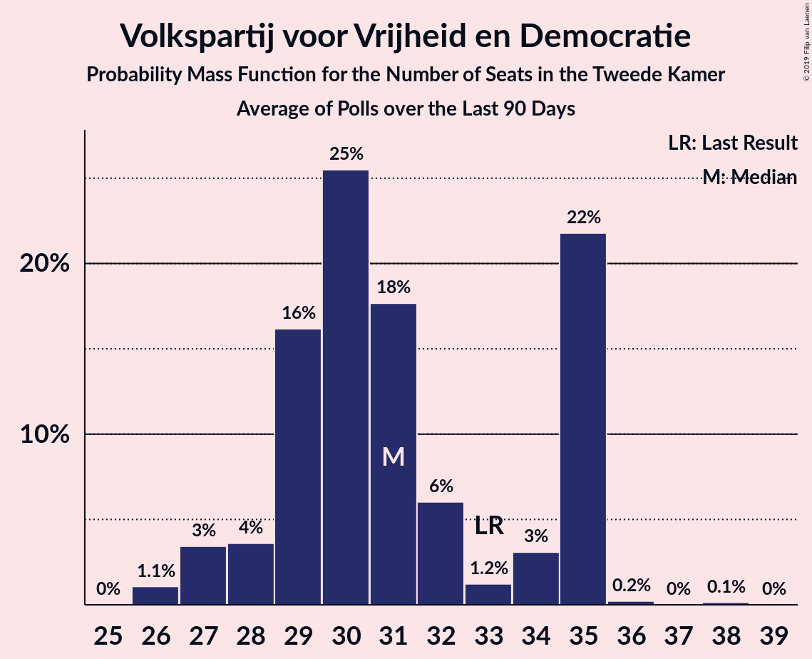
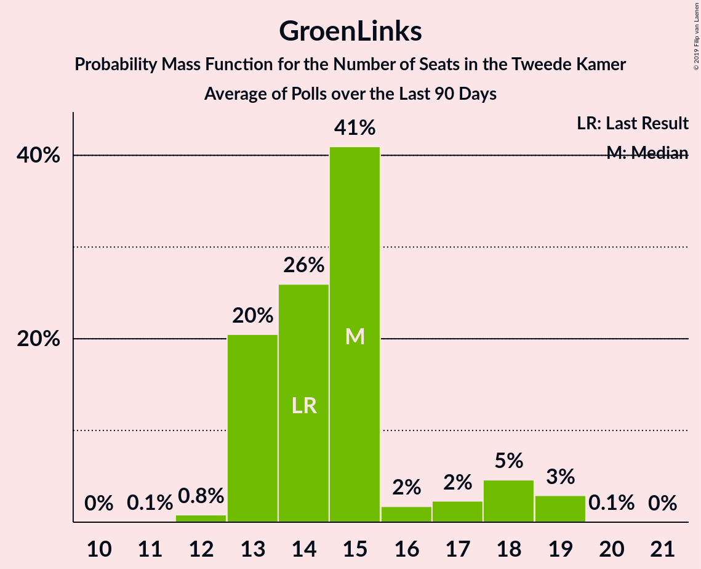
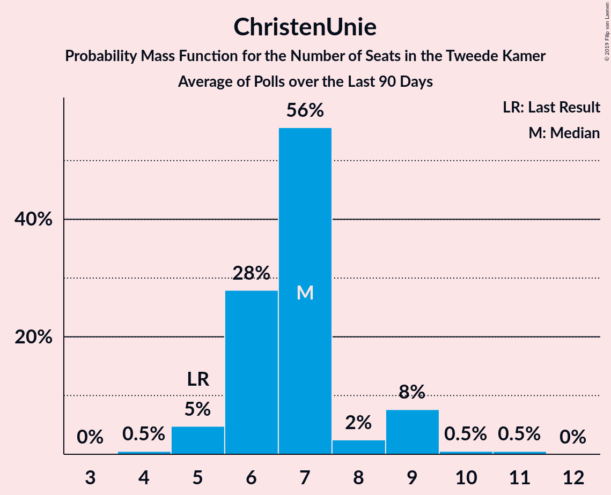
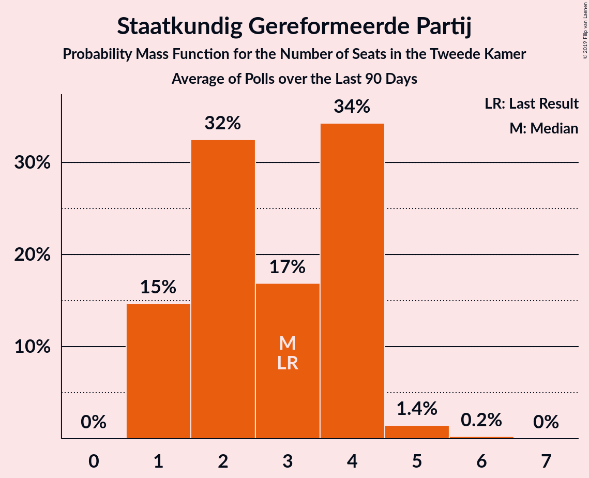
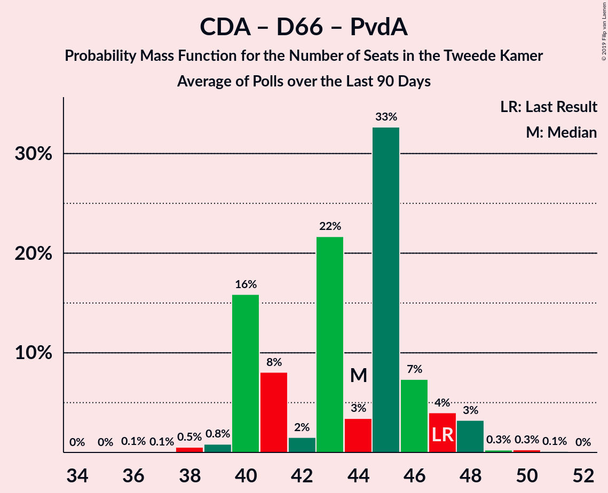

# Poll Average

<a href="#voting-intentions">Voting Intentions</a> | <a href="#seats">Seats</a> | <a href="#coalitions">Coalitions</a> | <a href="#technical-information">Technical Information</a>

## Summary

The table below lists the polls on which the average is based. They are the most recent polls (less than 90 days old) registered and analyzed so far.

| Period     | Polling firm/Commissioner(s) | VVD | PVV | CDA | D66 | GL | SP | PvdA | CU | PvdD | 50+ | SGP | DENK | FvD | PP | B1 |
|:----------:|:----------------------------:|:--:|:--:|:--:|:--:|:--:|:--:|:--:|:--:|:--:|:--:|:--:|:--:|:--:|:--:|:--:|
| 15 March 2017 | General Election | 21.3%   33 | 13.1%   20 | 12.4%   19 | 12.2%   19 | 9.1%   14 | 9.1%   14 | 5.7%   9 | 3.4%   5 | 3.2%   5 | 3.1%   4 | 2.1%   3 | 2.1%   3 | 1.8%   2 | 0.3%   0 | 0.3%   0 |
| N/A | Poll Average | 17–22%   26–32 | 5–8%   9–12 | 9–12%   14–18 | 6–10%   9–14 | 9–14%   14–20 | 4–7%   7–8 | 8–14%   14–21 | 3–6%   5–6 | 3–5%   5–8 | 3–5%   5–8 | 1–3%   1–4 | 1–2%   1–3 | 11–16%   15–24 | N/A   N/A | N/A   N/A |
| [29 July–4 August 2019](2019-08-04-Peilnl.html) | Peil.nl | 17–19%   25–29 | 6–8%   10–12 | 10–12%   15–19 | 6–8%   9–11 | 9–11%   13–17 | 4–5%   6–9 | 12–14%   17–21 | 3–5%   5–6 | 4–5%   5–8 | 3–4%   4–6 | 1–2%   1–2 | 2–3%   2–3 | 12–15%   19–22 | N/A   N/A | N/A   N/A |
| [26–29 July 2019](2019-07-29-Ipsos.html) | Ipsos   EenVandaag | 18–23%   31–32 | 6–9%   10–11 | 8–12%   14–17 | 7–10%   10–14 | 9–12%   15–16 | 4–7%   8 | 7–11%   12–15 | 3–6%   5–6 | 3–5%   5–7 | 3–5%   5–8 | 1–3%   3–4 | 1–2%   1–2 | 10–14%   15–18 | N/A   N/A | N/A   N/A |
| [5–9 July 2019](2019-07-09-IOResearch.html) | I&O Research | 18–21%   31 | 5–7%   9 | 9–11%   14 | 6–8%   9 | 11–14%   20 | 4–6%   7 | 9–11%   15 | 3–5%   6 | 3–5%   6 | 3–4%   5 | 2–3%   2 | 1–2%   2 | 14–17%   24 | N/A   N/A | N/A   N/A |
| 15 March 2017 | General Election | 21.3%   33 | 13.1%   20 | 12.4%   19 | 12.2%   19 | 9.1%   14 | 9.1%   14 | 5.7%   9 | 3.4%   5 | 3.2%   5 | 3.1%   4 | 2.1%   3 | 2.1%   3 | 1.8%   2 | 0.3%   0 | 0.3%   0 |

Only polls for which at least the sample size has been published are included in the table above.

**Legend:**
+ **Top half of each row:** Voting intentions (95% confidence interval)
+ **Bottom half of each row:** Seat projections for the Tweede Kamer (95% confidence interval)
+ **VVD:** Volkspartij voor Vrijheid en Democratie
+ **PVV:** Partij voor de Vrijheid
+ **CDA:** Christen-Democratisch Appèl
+ **D66:** Democraten 66
+ **GL:** GroenLinks
+ **SP:** Socialistische Partij
+ **PvdA:** Partij van de Arbeid
+ **CU:** ChristenUnie
+ **PvdD:** Partij voor de Dieren
+ **50+:** 50Plus
+ **SGP:** Staatkundig Gereformeerde Partij
+ **DENK:** DENK
+ **FvD:** Forum voor Democratie
+ **PP:** Piratenpartij
+ **B1:** Bij1
+ **N/A (single party):** Party not included the published results
+ **N/A (entire row):** Calculation for this opinion poll not started yet

## Voting Intentions

### Confidence Intervals

| Party | Last Result | Median | 80% Confidence Interval | 90% Confidence Interval | 95% Confidence Interval | 99% Confidence Interval |
|:-----:|:-----------:|:------:|:-----------------------:|:-----------------------:|:-----------------------:|:-----------------------:|
| <a href="#volkspartij-voor-vrijheid-en-democratie">Volkspartij voor Vrijheid en Democratie</a> | 21.3% | 19.1% | 17.6–20.9% |17.3–21.5% | 17.0–22.0% | 16.5–23.0% |
| <a href="#partij-voor-de-vrijheid">Partij voor de Vrijheid</a> | 13.1% | 6.9% | 5.7–7.9% |5.5–8.1% | 5.3–8.4% | 5.0–8.9% |
| <a href="#christen-democratisch-appèl">Christen-Democratisch Appèl</a> | 12.4% | 10.3% | 9.3–11.3% |9.0–11.5% | 8.7–11.8% | 8.1–12.3% |
| <a href="#democraten-66">Democraten 66</a> | 12.2% | 7.0% | 6.2–8.8% |6.0–9.2% | 5.8–9.6% | 5.6–10.3% |
| <a href="#groenlinks">GroenLinks</a> | 9.1% | 10.6% | 9.4–13.0% |9.1–13.4% | 8.9–13.7% | 8.3–14.2% |
| <a href="#socialistische-partij">Socialistische Partij</a> | 9.1% | 5.1% | 4.4–6.0% |4.2–6.3% | 4.1–6.6% | 3.8–7.2% |
| <a href="#partij-van-de-arbeid">Partij van de Arbeid</a> | 5.7% | 10.2% | 8.4–13.0% |8.0–13.3% | 7.7–13.6% | 7.1–14.0% |
| <a href="#christenunie">ChristenUnie</a> | 3.4% | 4.1% | 3.6–4.9% |3.4–5.3% | 3.3–5.5% | 3.1–6.1% |
| <a href="#partij-voor-de-dieren">Partij voor de Dieren</a> | 3.2% | 4.2% | 3.5–5.0% |3.3–5.2% | 3.1–5.3% | 2.8–5.7% |
| <a href="#50plus">50Plus</a> | 3.1% | 3.5% | 3.0–4.2% |2.8–4.5% | 2.7–4.8% | 2.5–5.3% |
| <a href="#staatkundig-gereformeerde-partij">Staatkundig Gereformeerde Partij</a> | 2.1% | 1.9% | 1.2–2.6% |1.2–2.8% | 1.1–3.0% | 1.0–3.5% |
| <a href="#denk">DENK</a> | 2.1% | 1.5% | 1.0–2.2% |0.9–2.3% | 0.8–2.4% | 0.6–2.6% |
| <a href="#forum-voor-democratie">Forum voor Democratie</a> | 1.8% | 13.5% | 11.5–15.7% |11.0–16.1% | 10.6–16.4% | 9.9–17.0% |
| <a href="#piratenpartij">Piratenpartij</a> | 0.3% | N/A | N/A |N/A | N/A | N/A |
| <a href="#bij1">Bij1</a> | 0.3% | N/A | N/A |N/A | N/A | N/A |

### Volkspartij voor Vrijheid en Democratie

*For a full overview of the results for this party, see the [Volkspartij voor Vrijheid en Democratie](party-volkspartijvoorvrijheidendemocratie.html) page.*

| Voting Intentions | Probability | Accumulated | Special Marks |
|:-----------------:|:-----------:|:-----------:|:-------------:|
| 14.5–15.5% | 0% | 100% |  |
| 15.5–16.5% | 0.6% | 100% |  |
| 16.5–17.5% | 9% | 99.4% |  |
| 17.5–18.5% | 25% | 91% |  |
| 18.5–19.5% | 29% | 65% | Median |
| 19.5–20.5% | 21% | 36% |  |
| 20.5–21.5% | 10% | 15% | Last Result |
| 21.5–22.5% | 4% | 5% |  |
| 22.5–23.5% | 0.9% | 1.1% |  |
| 23.5–24.5% | 0.1% | 0.2% |  |
| 24.5–25.5% | 0% | 0% |  |

### Partij voor de Vrijheid

*For a full overview of the results for this party, see the [Partij voor de Vrijheid](party-partijvoordevrijheid.html) page.*

| Voting Intentions | Probability | Accumulated | Special Marks |
|:-----------------:|:-----------:|:-----------:|:-------------:|
| 3.5–4.5% | 0% | 100% |  |
| 4.5–5.5% | 6% | 100% |  |
| 5.5–6.5% | 32% | 94% |  |
| 6.5–7.5% | 41% | 62% | Median |
| 7.5–8.5% | 19% | 21% |  |
| 8.5–9.5% | 2% | 2% |  |
| 9.5–10.5% | 0.1% | 0.1% |  |
| 10.5–11.5% | 0% | 0% |  |
| 11.5–12.5% | 0% | 0% |  |
| 12.5–13.5% | 0% | 0% | Last Result |

### Christen-Democratisch Appèl

*For a full overview of the results for this party, see the [Christen-Democratisch Appèl](party-christen-democratischappèl.html) page.*

| Voting Intentions | Probability | Accumulated | Special Marks |
|:-----------------:|:-----------:|:-----------:|:-------------:|
| 6.5–7.5% | 0.1% | 100% |  |
| 7.5–8.5% | 2% | 99.9% |  |
| 8.5–9.5% | 16% | 98% |  |
| 9.5–10.5% | 45% | 82% | Median |
| 10.5–11.5% | 32% | 37% |  |
| 11.5–12.5% | 4% | 5% | Last Result |
| 12.5–13.5% | 0.2% | 0.3% |  |
| 13.5–14.5% | 0% | 0% |  |

### Democraten 66

*For a full overview of the results for this party, see the [Democraten 66](party-democraten66.html) page.*

| Voting Intentions | Probability | Accumulated | Special Marks |
|:-----------------:|:-----------:|:-----------:|:-------------:|
| 3.5–4.5% | 0% | 100% |  |
| 4.5–5.5% | 0.5% | 100% |  |
| 5.5–6.5% | 26% | 99.5% |  |
| 6.5–7.5% | 43% | 74% | Median |
| 7.5–8.5% | 17% | 31% |  |
| 8.5–9.5% | 10% | 13% |  |
| 9.5–10.5% | 3% | 3% |  |
| 10.5–11.5% | 0.3% | 0.3% |  |
| 11.5–12.5% | 0% | 0% | Last Result |

### GroenLinks

*For a full overview of the results for this party, see the [GroenLinks](party-groenlinks.html) page.*

| Voting Intentions | Probability | Accumulated | Special Marks |
|:-----------------:|:-----------:|:-----------:|:-------------:|
| 6.5–7.5% | 0% | 100% |  |
| 7.5–8.5% | 1.0% | 100% |  |
| 8.5–9.5% | 13% | 99.0% | Last Result |
| 9.5–10.5% | 34% | 86% |  |
| 10.5–11.5% | 17% | 52% | Median |
| 11.5–12.5% | 16% | 35% |  |
| 12.5–13.5% | 16% | 19% |  |
| 13.5–14.5% | 3% | 3% |  |
| 14.5–15.5% | 0.1% | 0.1% |  |
| 15.5–16.5% | 0% | 0% |  |

### Socialistische Partij

*For a full overview of the results for this party, see the [Socialistische Partij](party-socialistischepartij.html) page.*

| Voting Intentions | Probability | Accumulated | Special Marks |
|:-----------------:|:-----------:|:-----------:|:-------------:|
| 2.5–3.5% | 0.1% | 100% |  |
| 3.5–4.5% | 16% | 99.9% |  |
| 4.5–5.5% | 56% | 84% | Median |
| 5.5–6.5% | 24% | 27% |  |
| 6.5–7.5% | 3% | 3% |  |
| 7.5–8.5% | 0.2% | 0.2% |  |
| 8.5–9.5% | 0% | 0% | Last Result |

### Partij van de Arbeid

*For a full overview of the results for this party, see the [Partij van de Arbeid](party-partijvandearbeid.html) page.*

| Voting Intentions | Probability | Accumulated | Special Marks |
|:-----------------:|:-----------:|:-----------:|:-------------:|
| 5.5–6.5% | 0.1% | 100% | Last Result |
| 6.5–7.5% | 2% | 99.9% |  |
| 7.5–8.5% | 10% | 98% |  |
| 8.5–9.5% | 21% | 88% |  |
| 9.5–10.5% | 26% | 67% | Median |
| 10.5–11.5% | 9% | 42% |  |
| 11.5–12.5% | 13% | 33% |  |
| 12.5–13.5% | 17% | 20% |  |
| 13.5–14.5% | 3% | 3% |  |
| 14.5–15.5% | 0.1% | 0.1% |  |
| 15.5–16.5% | 0% | 0% |  |

### ChristenUnie

*For a full overview of the results for this party, see the [ChristenUnie](party-christenunie.html) page.*

| Voting Intentions | Probability | Accumulated | Special Marks |
|:-----------------:|:-----------:|:-----------:|:-------------:|
| 1.5–2.5% | 0% | 100% |  |
| 2.5–3.5% | 9% | 100% | Last Result |
| 3.5–4.5% | 69% | 91% | Median |
| 4.5–5.5% | 20% | 22% |  |
| 5.5–6.5% | 2% | 2% |  |
| 6.5–7.5% | 0.1% | 0.1% |  |
| 7.5–8.5% | 0% | 0% |  |

### Partij voor de Dieren

*For a full overview of the results for this party, see the [Partij voor de Dieren](party-partijvoordedieren.html) page.*

| Voting Intentions | Probability | Accumulated | Special Marks |
|:-----------------:|:-----------:|:-----------:|:-------------:|
| 0.5–1.5% | 0% | 100% |  |
| 1.5–2.5% | 0.1% | 100% |  |
| 2.5–3.5% | 12% | 99.9% | Last Result |
| 3.5–4.5% | 58% | 88% | Median |
| 4.5–5.5% | 29% | 30% |  |
| 5.5–6.5% | 0.9% | 0.9% |  |
| 6.5–7.5% | 0% | 0% |  |

### 50Plus

*For a full overview of the results for this party, see the [50Plus](party-50plus.html) page.*

| Voting Intentions | Probability | Accumulated | Special Marks |
|:-----------------:|:-----------:|:-----------:|:-------------:|
| 0.5–1.5% | 0% | 100% |  |
| 1.5–2.5% | 0.6% | 100% |  |
| 2.5–3.5% | 57% | 99.4% | Last Result, Median |
| 3.5–4.5% | 38% | 43% |  |
| 4.5–5.5% | 4% | 5% |  |
| 5.5–6.5% | 0.2% | 0.2% |  |
| 6.5–7.5% | 0% | 0% |  |

### Staatkundig Gereformeerde Partij

*For a full overview of the results for this party, see the [Staatkundig Gereformeerde Partij](party-staatkundiggereformeerdepartij.html) page.*

| Voting Intentions | Probability | Accumulated | Special Marks |
|:-----------------:|:-----------:|:-----------:|:-------------:|
| 0.0–0.5% | 0% | 100% |  |
| 0.5–1.5% | 30% | 100% |  |
| 1.5–2.5% | 58% | 70% | Last Result, Median |
| 2.5–3.5% | 12% | 12% |  |
| 3.5–4.5% | 0.3% | 0.3% |  |
| 4.5–5.5% | 0% | 0% |  |

### DENK

*For a full overview of the results for this party, see the [DENK](party-denk.html) page.*

| Voting Intentions | Probability | Accumulated | Special Marks |
|:-----------------:|:-----------:|:-----------:|:-------------:|
| 0.0–0.5% | 0.2% | 100% |  |
| 0.5–1.5% | 54% | 99.8% | Median |
| 1.5–2.5% | 45% | 46% | Last Result |
| 2.5–3.5% | 1.0% | 1.0% |  |
| 3.5–4.5% | 0% | 0% |  |

### Forum voor Democratie

*For a full overview of the results for this party, see the [Forum voor Democratie](party-forumvoordemocratie.html) page.*

| Voting Intentions | Probability | Accumulated | Special Marks |
|:-----------------:|:-----------:|:-----------:|:-------------:|
| 1.5–2.5% | 0% | 100% | Last Result |
| 2.5–3.5% | 0% | 100% |  |
| 3.5–4.5% | 0% | 100% |  |
| 4.5–5.5% | 0% | 100% |  |
| 5.5–6.5% | 0% | 100% |  |
| 6.5–7.5% | 0% | 100% |  |
| 7.5–8.5% | 0% | 100% |  |
| 8.5–9.5% | 0.2% | 100% |  |
| 9.5–10.5% | 2% | 99.8% |  |
| 10.5–11.5% | 9% | 98% |  |
| 11.5–12.5% | 16% | 89% |  |
| 12.5–13.5% | 26% | 74% | Median |
| 13.5–14.5% | 18% | 48% |  |
| 14.5–15.5% | 17% | 30% |  |
| 15.5–16.5% | 11% | 13% |  |
| 16.5–17.5% | 2% | 2% |  |
| 17.5–18.5% | 0.1% | 0.1% |  |
| 18.5–19.5% | 0% | 0% |  |

## Seats

### Confidence Intervals

| Party | Last Result | Median | 80% Confidence Interval | 90% Confidence Interval | 95% Confidence Interval | 99% Confidence Interval |
|:-----:|:-----------:|:------:|:-----------------------:|:-----------------------:|:-----------------------:|:-----------------------:|
| <a href="#volkspartij-voor-vrijheid-en-democratie">Volkspartij voor Vrijheid en Democratie</a> | 33 | 31 | 26–32 |26–32 | 26–32 | 25–32 |
| <a href="#partij-voor-de-vrijheid">Partij voor de Vrijheid</a> | 20 | 11 | 9–11 |9–12 | 9–12 | 9–12 |
| <a href="#christen-democratisch-appèl">Christen-Democratisch Appèl</a> | 19 | 14 | 14–18 |14–18 | 14–18 | 14–19 |
| <a href="#democraten-66">Democraten 66</a> | 19 | 10 | 9–14 |9–14 | 9–14 | 9–14 |
| <a href="#groenlinks">GroenLinks</a> | 14 | 15 | 15–20 |15–20 | 14–20 | 13–20 |
| <a href="#socialistische-partij">Socialistische Partij</a> | 14 | 7 | 7–8 |7–8 | 7–8 | 6–9 |
| <a href="#partij-van-de-arbeid">Partij van de Arbeid</a> | 9 | 15 | 14–21 |14–21 | 14–21 | 11–21 |
| <a href="#christenunie">ChristenUnie</a> | 5 | 6 | 5–6 |5–6 | 5–6 | 5–7 |
| <a href="#partij-voor-de-dieren">Partij voor de Dieren</a> | 5 | 6 | 5–7 |5–7 | 5–8 | 5–8 |
| <a href="#50plus">50Plus</a> | 4 | 6 | 5–7 |5–8 | 5–8 | 4–8 |
| <a href="#staatkundig-gereformeerde-partij">Staatkundig Gereformeerde Partij</a> | 3 | 2 | 1–4 |1–4 | 1–4 | 1–4 |
| <a href="#denk">DENK</a> | 3 | 2 | 2 |1–3 | 1–3 | 1–3 |
| <a href="#forum-voor-democratie">Forum voor Democratie</a> | 2 | 20 | 16–24 |15–24 | 15–24 | 15–24 |
| <a href="#piratenpartij">Piratenpartij</a> | 0 | N/A | N/A |N/A | N/A | N/A |
| <a href="#bij1">Bij1</a> | 0 | N/A | N/A |N/A | N/A | N/A |

### Volkspartij voor Vrijheid en Democratie

*For a full overview of the results for this party, see the [Volkspartij voor Vrijheid en Democratie](party-volkspartijvoorvrijheidendemocratie.html) page.*

| Number of Seats | Probability | Accumulated | Special Marks |
|:---------------:|:-----------:|:-----------:|:-------------:|
| 25 | 2% | 100% |  |
| 26 | 9% | 98% |  |
| 27 | 18% | 89% |  |
| 28 | 3% | 71% |  |
| 29 | 2% | 68% |  |
| 30 | 0.2% | 66% |  |
| 31 | 40% | 66% | Median |
| 32 | 26% | 26% |  |
| 33 | 0.2% | 0.4% | Last Result |
| 34 | 0.1% | 0.2% |  |
| 35 | 0% | 0.1% |  |
| 36 | 0% | 0% |  |

### Partij voor de Vrijheid

*For a full overview of the results for this party, see the [Partij voor de Vrijheid](party-partijvoordevrijheid.html) page.*

| Number of Seats | Probability | Accumulated | Special Marks |
|:---------------:|:-----------:|:-----------:|:-------------:|
| 8 | 0.3% | 100% |  |
| 9 | 34% | 99.7% |  |
| 10 | 15% | 66% |  |
| 11 | 43% | 51% | Median |
| 12 | 7% | 7% |  |
| 13 | 0.2% | 0.2% |  |
| 14 | 0% | 0.1% |  |
| 15 | 0.1% | 0.1% |  |
| 16 | 0% | 0% |  |
| 17 | 0% | 0% |  |
| 18 | 0% | 0% |  |
| 19 | 0% | 0% |  |
| 20 | 0% | 0% | Last Result |

### Christen-Democratisch Appèl

*For a full overview of the results for this party, see the [Christen-Democratisch Appèl](party-christen-democratischappèl.html) page.*

| Number of Seats | Probability | Accumulated | Special Marks |
|:---------------:|:-----------:|:-----------:|:-------------:|
| 12 | 0.2% | 100% |  |
| 13 | 0.2% | 99.8% |  |
| 14 | 60% | 99.6% | Median |
| 15 | 4% | 40% |  |
| 16 | 18% | 36% |  |
| 17 | 7% | 18% |  |
| 18 | 9% | 11% |  |
| 19 | 2% | 2% | Last Result |
| 20 | 0% | 0% |  |

### Democraten 66

*For a full overview of the results for this party, see the [Democraten 66](party-democraten66.html) page.*

| Number of Seats | Probability | Accumulated | Special Marks |
|:---------------:|:-----------:|:-----------:|:-------------:|
| 8 | 0.2% | 100% |  |
| 9 | 45% | 99.8% |  |
| 10 | 11% | 55% | Median |
| 11 | 17% | 44% |  |
| 12 | 0.9% | 27% |  |
| 13 | 0.3% | 26% |  |
| 14 | 25% | 26% |  |
| 15 | 0.2% | 0.3% |  |
| 16 | 0.1% | 0.1% |  |
| 17 | 0% | 0% |  |
| 18 | 0% | 0% |  |
| 19 | 0% | 0% | Last Result |

### GroenLinks

*For a full overview of the results for this party, see the [GroenLinks](party-groenlinks.html) page.*

| Number of Seats | Probability | Accumulated | Special Marks |
|:---------------:|:-----------:|:-----------:|:-------------:|
| 11 | 0.1% | 100% |  |
| 12 | 0% | 99.9% |  |
| 13 | 2% | 99.8% |  |
| 14 | 2% | 98% | Last Result |
| 15 | 57% | 96% | Median |
| 16 | 4% | 39% |  |
| 17 | 1.1% | 35% |  |
| 18 | 0.1% | 34% |  |
| 19 | 0% | 34% |  |
| 20 | 34% | 34% |  |
| 21 | 0% | 0% |  |

### Socialistische Partij

*For a full overview of the results for this party, see the [Socialistische Partij](party-socialistischepartij.html) page.*

| Number of Seats | Probability | Accumulated | Special Marks |
|:---------------:|:-----------:|:-----------:|:-------------:|
| 5 | 0.2% | 100% |  |
| 6 | 1.1% | 99.8% |  |
| 7 | 61% | 98.7% | Median |
| 8 | 36% | 38% |  |
| 9 | 2% | 2% |  |
| 10 | 0.2% | 0.5% |  |
| 11 | 0.2% | 0.3% |  |
| 12 | 0.1% | 0.1% |  |
| 13 | 0% | 0% |  |
| 14 | 0% | 0% | Last Result |

### Partij van de Arbeid

*For a full overview of the results for this party, see the [Partij van de Arbeid](party-partijvandearbeid.html) page.*

| Number of Seats | Probability | Accumulated | Special Marks |
|:---------------:|:-----------:|:-----------:|:-------------:|
| 9 | 0% | 100% | Last Result |
| 10 | 0.1% | 100% |  |
| 11 | 0.5% | 99.9% |  |
| 12 | 0.3% | 99.4% |  |
| 13 | 0.5% | 99.1% |  |
| 14 | 25% | 98.5% |  |
| 15 | 40% | 73% | Median |
| 16 | 0.1% | 34% |  |
| 17 | 3% | 34% |  |
| 18 | 0.7% | 30% |  |
| 19 | 12% | 30% |  |
| 20 | 3% | 18% |  |
| 21 | 15% | 15% |  |
| 22 | 0% | 0% |  |

### ChristenUnie

*For a full overview of the results for this party, see the [ChristenUnie](party-christenunie.html) page.*

| Number of Seats | Probability | Accumulated | Special Marks |
|:---------------:|:-----------:|:-----------:|:-------------:|
| 4 | 0.2% | 100% |  |
| 5 | 31% | 99.8% | Last Result |
| 6 | 68% | 69% | Median |
| 7 | 0.7% | 1.1% |  |
| 8 | 0.3% | 0.5% |  |
| 9 | 0.1% | 0.1% |  |
| 10 | 0% | 0% |  |

### Partij voor de Dieren

*For a full overview of the results for this party, see the [Partij voor de Dieren](party-partijvoordedieren.html) page.*

| Number of Seats | Probability | Accumulated | Special Marks |
|:---------------:|:-----------:|:-----------:|:-------------:|
| 4 | 0.3% | 100% |  |
| 5 | 28% | 99.6% | Last Result |
| 6 | 34% | 72% | Median |
| 7 | 34% | 37% |  |
| 8 | 4% | 4% |  |
| 9 | 0% | 0% |  |

### 50Plus

*For a full overview of the results for this party, see the [50Plus](party-50plus.html) page.*

| Number of Seats | Probability | Accumulated | Special Marks |
|:---------------:|:-----------:|:-----------:|:-------------:|
| 3 | 0.1% | 100% |  |
| 4 | 2% | 99.9% | Last Result |
| 5 | 47% | 98% |  |
| 6 | 19% | 51% | Median |
| 7 | 25% | 32% |  |
| 8 | 6% | 6% |  |
| 9 | 0.1% | 0.1% |  |
| 10 | 0% | 0% |  |

### Staatkundig Gereformeerde Partij

*For a full overview of the results for this party, see the [Staatkundig Gereformeerde Partij](party-staatkundiggereformeerdepartij.html) page.*

| Number of Seats | Probability | Accumulated | Special Marks |
|:---------------:|:-----------:|:-----------:|:-------------:|
| 1 | 28% | 100% |  |
| 2 | 40% | 72% | Median |
| 3 | 7% | 33% | Last Result |
| 4 | 25% | 26% |  |
| 5 | 0.2% | 0.3% |  |
| 6 | 0% | 0% |  |

### DENK

*For a full overview of the results for this party, see the [DENK](party-denk.html) page.*

| Number of Seats | Probability | Accumulated | Special Marks |
|:---------------:|:-----------:|:-----------:|:-------------:|
| 0 | 0.1% | 100% |  |
| 1 | 7% | 99.9% |  |
| 2 | 86% | 93% | Median |
| 3 | 6% | 7% | Last Result |
| 4 | 0.2% | 0.2% |  |
| 5 | 0% | 0% |  |

### Forum voor Democratie

*For a full overview of the results for this party, see the [Forum voor Democratie](party-forumvoordemocratie.html) page.*

| Number of Seats | Probability | Accumulated | Special Marks |
|:---------------:|:-----------:|:-----------:|:-------------:|
| 2 | 0% | 100% | Last Result |
| 3 | 0% | 100% |  |
| 4 | 0% | 100% |  |
| 5 | 0% | 100% |  |
| 6 | 0% | 100% |  |
| 7 | 0% | 100% |  |
| 8 | 0% | 100% |  |
| 9 | 0% | 100% |  |
| 10 | 0% | 100% |  |
| 11 | 0% | 100% |  |
| 12 | 0% | 100% |  |
| 13 | 0% | 100% |  |
| 14 | 0.1% | 100% |  |
| 15 | 6% | 99.9% |  |
| 16 | 25% | 94% |  |
| 17 | 0.4% | 68% |  |
| 18 | 0.9% | 68% |  |
| 19 | 2% | 67% |  |
| 20 | 16% | 65% | Median |
| 21 | 3% | 49% |  |
| 22 | 12% | 46% |  |
| 23 | 0.3% | 34% |  |
| 24 | 33% | 33% |  |
| 25 | 0% | 0% |  |

## Coalitions

### Confidence Intervals

| Coalition | Last Result | Median | Majority? | 80% Confidence Interval | 90% Confidence Interval | 95% Confidence Interval | 99% Confidence Interval |
|:---------:|:-----------:|:------:|:---------:|:-----------------------:|:-----------------------:|:-----------------------:|:-----------------------:|
| Volkspartij voor Vrijheid en Democratie – Christen-Democratisch Appèl – Democraten 66 – ChristenUnie | 76 | 60 | 0% | 59–65 | 59–65 | 57–65 | 57–65 |
| Volkspartij voor Vrijheid en Democratie – Christen-Democratisch Appèl – Partij van de Arbeid | 61 | 60 | 0% | 60–64 | 60–64 | 59–64 | 57–65 |
| Volkspartij voor Vrijheid en Democratie – Democraten 66 – Partij van de Arbeid | 61 | 56 | 0% | 54–60 | 54–60 | 53–60 | 53–60 |
| Volkspartij voor Vrijheid en Democratie – Christen-Democratisch Appèl – Democraten 66 | 71 | 54 | 0% | 53–60 | 53–60 | 52–60 | 52–60 |
| Volkspartij voor Vrijheid en Democratie – Partij voor de Vrijheid – Christen-Democratisch Appèl | 72 | 54 | 0% | 53–57 | 53–59 | 53–59 | 52–59 |
| Volkspartij voor Vrijheid en Democratie – Partij van de Arbeid | 42 | 46 | 0% | 45–48 | 44–48 | 44–48 | 42–49 |
| Volkspartij voor Vrijheid en Democratie – Christen-Democratisch Appèl | 52 | 45 | 0% | 43–46 | 43–48 | 42–48 | 42–48 |
| Christen-Democratisch Appèl – Democraten 66 – Partij van de Arbeid | 47 | 42 | 0% | 38–48 | 38–48 | 38–48 | 37–48 |
| Christen-Democratisch Appèl – Partij van de Arbeid – ChristenUnie | 33 | 35 | 0% | 33–43 | 33–43 | 33–43 | 31–44 |
| Christen-Democratisch Appèl – Partij van de Arbeid | 28 | 29 | 0% | 28–37 | 28–37 | 28–37 | 25–38 |
| Christen-Democratisch Appèl – Democraten 66 | 38 | 27 | 0% | 23–28 | 23–28 | 23–28 | 23–29 |

### Volkspartij voor Vrijheid en Democratie – Christen-Democratisch Appèl – Democraten 66 – ChristenUnie

| Number of Seats | Probability | Accumulated | Special Marks |
|:---------------:|:-----------:|:-----------:|:-------------:|
| 56 | 0.3% | 100% |  |
| 57 | 3% | 99.7% |  |
| 58 | 0.5% | 96% |  |
| 59 | 11% | 96% |  |
| 60 | 49% | 85% |  |
| 61 | 2% | 35% | Median |
| 62 | 0.7% | 34% |  |
| 63 | 0.4% | 33% |  |
| 64 | 7% | 32% |  |
| 65 | 25% | 26% |  |
| 66 | 0.1% | 0.5% |  |
| 67 | 0.1% | 0.4% |  |
| 68 | 0.1% | 0.4% |  |
| 69 | 0.1% | 0.2% |  |
| 70 | 0.1% | 0.2% |  |
| 71 | 0% | 0.1% |  |
| 72 | 0% | 0.1% |  |
| 73 | 0% | 0% |  |
| 74 | 0% | 0% |  |
| 75 | 0% | 0% |  |
| 76 | 0% | 0% | Last Result, Majority |

### Volkspartij voor Vrijheid en Democratie – Christen-Democratisch Appèl – Partij van de Arbeid

| Number of Seats | Probability | Accumulated | Special Marks |
|:---------------:|:-----------:|:-----------:|:-------------:|
| 52 | 0.1% | 100% |  |
| 53 | 0.2% | 99.9% |  |
| 54 | 0% | 99.8% |  |
| 55 | 0% | 99.7% |  |
| 56 | 0% | 99.7% |  |
| 57 | 0.8% | 99.7% |  |
| 58 | 0.2% | 98.9% |  |
| 59 | 3% | 98.7% |  |
| 60 | 59% | 95% | Median |
| 61 | 0.1% | 37% | Last Result |
| 62 | 0.9% | 37% |  |
| 63 | 18% | 36% |  |
| 64 | 16% | 18% |  |
| 65 | 1.5% | 2% |  |
| 66 | 0.2% | 0.2% |  |
| 67 | 0% | 0% |  |

### Volkspartij voor Vrijheid en Democratie – Democraten 66 – Partij van de Arbeid

| Number of Seats | Probability | Accumulated | Special Marks |
|:---------------:|:-----------:|:-----------:|:-------------:|
| 52 | 0.2% | 100% |  |
| 53 | 2% | 99.8% |  |
| 54 | 12% | 97% |  |
| 55 | 34% | 85% |  |
| 56 | 7% | 51% | Median |
| 57 | 0.8% | 44% |  |
| 58 | 2% | 44% |  |
| 59 | 15% | 42% |  |
| 60 | 27% | 27% |  |
| 61 | 0.1% | 0.2% | Last Result |
| 62 | 0% | 0% |  |

### Volkspartij voor Vrijheid en Democratie – Christen-Democratisch Appèl – Democraten 66

| Number of Seats | Probability | Accumulated | Special Marks |
|:---------------:|:-----------:|:-----------:|:-------------:|
| 50 | 0.1% | 100% |  |
| 51 | 0.3% | 99.9% |  |
| 52 | 3% | 99.6% |  |
| 53 | 11% | 96% |  |
| 54 | 50% | 85% |  |
| 55 | 0.7% | 35% | Median |
| 56 | 2% | 35% |  |
| 57 | 0.2% | 33% |  |
| 58 | 7% | 32% |  |
| 59 | 0.1% | 26% |  |
| 60 | 25% | 26% |  |
| 61 | 0.2% | 0.4% |  |
| 62 | 0.1% | 0.2% |  |
| 63 | 0% | 0.1% |  |
| 64 | 0% | 0.1% |  |
| 65 | 0% | 0.1% |  |
| 66 | 0% | 0% |  |
| 67 | 0% | 0% |  |
| 68 | 0% | 0% |  |
| 69 | 0% | 0% |  |
| 70 | 0% | 0% |  |
| 71 | 0% | 0% | Last Result |

### Volkspartij voor Vrijheid en Democratie – Partij voor de Vrijheid – Christen-Democratisch Appèl

| Number of Seats | Probability | Accumulated | Special Marks |
|:---------------:|:-----------:|:-----------:|:-------------:|
| 50 | 0.1% | 100% |  |
| 51 | 0.2% | 99.9% |  |
| 52 | 0.2% | 99.6% |  |
| 53 | 15% | 99.4% |  |
| 54 | 36% | 84% |  |
| 55 | 12% | 48% |  |
| 56 | 2% | 36% | Median |
| 57 | 27% | 34% |  |
| 58 | 0.1% | 7% |  |
| 59 | 6% | 7% |  |
| 60 | 0.1% | 0.2% |  |
| 61 | 0.1% | 0.1% |  |
| 62 | 0% | 0% |  |
| 63 | 0% | 0% |  |
| 64 | 0% | 0% |  |
| 65 | 0% | 0% |  |
| 66 | 0% | 0% |  |
| 67 | 0% | 0% |  |
| 68 | 0% | 0% |  |
| 69 | 0% | 0% |  |
| 70 | 0% | 0% |  |
| 71 | 0% | 0% |  |
| 72 | 0% | 0% | Last Result |

### Volkspartij voor Vrijheid en Democratie – Partij van de Arbeid

| Number of Seats | Probability | Accumulated | Special Marks |
|:---------------:|:-----------:|:-----------:|:-------------:|
| 39 | 0.1% | 100% |  |
| 40 | 0% | 99.9% |  |
| 41 | 0.3% | 99.9% |  |
| 42 | 0.2% | 99.5% | Last Result |
| 43 | 0.7% | 99.4% |  |
| 44 | 6% | 98.6% |  |
| 45 | 9% | 93% |  |
| 46 | 65% | 84% | Median |
| 47 | 0.4% | 19% |  |
| 48 | 17% | 18% |  |
| 49 | 1.4% | 2% |  |
| 50 | 0% | 0.2% |  |
| 51 | 0.1% | 0.1% |  |
| 52 | 0% | 0% |  |

### Volkspartij voor Vrijheid en Democratie – Christen-Democratisch Appèl

| Number of Seats | Probability | Accumulated | Special Marks |
|:---------------:|:-----------:|:-----------:|:-------------:|
| 39 | 0.1% | 100% |  |
| 40 | 0.2% | 99.9% |  |
| 41 | 0.1% | 99.7% |  |
| 42 | 4% | 99.6% |  |
| 43 | 15% | 96% |  |
| 44 | 13% | 81% |  |
| 45 | 35% | 68% | Median |
| 46 | 26% | 33% |  |
| 47 | 0.2% | 7% |  |
| 48 | 6% | 7% |  |
| 49 | 0.1% | 0.2% |  |
| 50 | 0.1% | 0.1% |  |
| 51 | 0% | 0.1% |  |
| 52 | 0% | 0% | Last Result |

### Christen-Democratisch Appèl – Democraten 66 – Partij van de Arbeid

| Number of Seats | Probability | Accumulated | Special Marks |
|:---------------:|:-----------:|:-----------:|:-------------:|
| 35 | 0.1% | 100% |  |
| 36 | 0% | 99.9% |  |
| 37 | 0.6% | 99.9% |  |
| 38 | 33% | 99.3% |  |
| 39 | 0.2% | 66% | Median |
| 40 | 0.4% | 66% |  |
| 41 | 0.2% | 65% |  |
| 42 | 35% | 65% |  |
| 43 | 0.7% | 31% |  |
| 44 | 0.3% | 30% |  |
| 45 | 0.6% | 30% |  |
| 46 | 11% | 29% |  |
| 47 | 4% | 18% | Last Result |
| 48 | 15% | 15% |  |
| 49 | 0% | 0% |  |

### Christen-Democratisch Appèl – Partij van de Arbeid – ChristenUnie

| Number of Seats | Probability | Accumulated | Special Marks |
|:---------------:|:-----------:|:-----------:|:-------------:|
| 30 | 0.1% | 100% |  |
| 31 | 0.7% | 99.9% |  |
| 32 | 0.2% | 99.2% |  |
| 33 | 25% | 99.0% | Last Result |
| 34 | 0.2% | 74% |  |
| 35 | 33% | 74% | Median |
| 36 | 0.1% | 40% |  |
| 37 | 3% | 40% |  |
| 38 | 7% | 37% |  |
| 39 | 0.5% | 30% |  |
| 40 | 0.3% | 30% |  |
| 41 | 2% | 30% |  |
| 42 | 2% | 27% |  |
| 43 | 23% | 25% |  |
| 44 | 2% | 2% |  |
| 45 | 0% | 0% |  |

### Christen-Democratisch Appèl – Partij van de Arbeid

| Number of Seats | Probability | Accumulated | Special Marks |
|:---------------:|:-----------:|:-----------:|:-------------:|
| 24 | 0% | 100% |  |
| 25 | 0.7% | 99.9% |  |
| 26 | 0.2% | 99.3% |  |
| 27 | 0.3% | 99.0% |  |
| 28 | 25% | 98.8% | Last Result |
| 29 | 33% | 74% | Median |
| 30 | 0.1% | 40% |  |
| 31 | 0.2% | 40% |  |
| 32 | 10% | 40% |  |
| 33 | 0.2% | 30% |  |
| 34 | 0.8% | 30% |  |
| 35 | 0.3% | 29% |  |
| 36 | 4% | 29% |  |
| 37 | 23% | 25% |  |
| 38 | 2% | 2% |  |
| 39 | 0% | 0% |  |

### Christen-Democratisch Appèl – Democraten 66

| Number of Seats | Probability | Accumulated | Special Marks |
|:---------------:|:-----------:|:-----------:|:-------------:|
| 23 | 34% | 100% |  |
| 24 | 0.3% | 66% | Median |
| 25 | 4% | 66% |  |
| 26 | 3% | 62% |  |
| 27 | 32% | 60% |  |
| 28 | 28% | 28% |  |
| 29 | 0.2% | 0.6% |  |
| 30 | 0.2% | 0.4% |  |
| 31 | 0.1% | 0.2% |  |
| 32 | 0.1% | 0.1% |  |
| 33 | 0% | 0% |  |
| 34 | 0% | 0% |  |
| 35 | 0% | 0% |  |
| 36 | 0% | 0% |  |
| 37 | 0% | 0% |  |
| 38 | 0% | 0% | Last Result |

## Technical Information

+ **Number of polls included in this average:** 3
+ **Lowest number of simulations done in a poll included in this average:** 16,384
+ **Total number of simulations done in the polls included in this average:** 278,528
+ **Error estimate:** 2.97%
