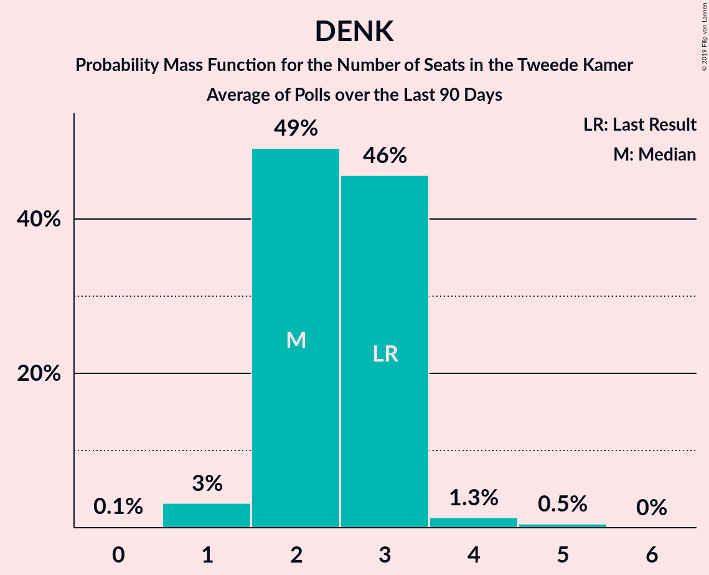

# Poll Average

<a href="#voting-intentions">Voting Intentions</a> | <a href="#seats">Seats</a> | <a href="#coalitions">Coalitions</a> | <a href="#technical-information">Technical Information</a>

## Summary

The table below lists the polls on which the average is based. They are the most recent polls (less than 90 days old) registered and analyzed so far.

| Period     | Polling firm/Commissioner(s) | VVD | PVV | CDA | D66 | GL | SP | PvdA | CU | PvdD | 50+ | SGP | DENK | FvD | PP | B1 |
|:----------:|:----------------------------:|:--:|:--:|:--:|:--:|:--:|:--:|:--:|:--:|:--:|:--:|:--:|:--:|:--:|:--:|:--:|
| 15 March 2017 | General Election | 21.3%   33 | 13.1%   20 | 12.4%   19 | 12.2%   19 | 9.1%   14 | 9.1%   14 | 5.7%   9 | 3.4%   5 | 3.2%   5 | 3.1%   4 | 2.1%   3 | 2.1%   3 | 1.8%   2 | 0.3%   0 | 0.3%   0 |
| N/A | Poll Average | 18–23%   28–35 | 8–11%   12–17 | 9–12%   13–18 | 6–10%   10–15 | 8–12%   13–19 | 5–7%   6–10 | 8–14%   13–20 | 3–6%   5–9 | 4–6%   5–9 | 3–6%   3–9 | 1–4%   1–5 | 1–3%   1–3 | 6–10%   9–16 | N/A   N/A | N/A   N/A |
| [2–7 September 2019](2019-09-07-Peilnl.html) | Peil.nl | 17–20%   27–30 | 8–10%   12–15 | 10–12%   14–17 | 6–8%   10–13 | 8–10%   13–16 | 5–7%   8–9 | 12–14%   18–21 | 3–5%   5–7 | 4–5%   5–8 | 3–5%   5–7 | 1–2%   1–2 | 2–3%   2–4 | 8–10%   12–16 | N/A   N/A | N/A   N/A |
| [29 August–3 September 2019](2019-09-03-IOResearch.html) | I&O Research | 19–23%   28–32 | 7–10%   12–15 | 9–11%   13–17 | 6–9%   10–14 | 9–13%   14–19 | 5–7%   7–11 | 9–12%   13–18 | 4–7%   7–11 | 3–5%   5–7 | 4–6%   5–9 | 2–4%   3–5 | 1–2%   1–2 | 6–9%   9–14 | N/A   N/A | N/A   N/A |
| [30 August–2 September 2019](2019-09-02-Ipsos.html) | Ipsos   EenVandaag | 18–24%   30–35 | 8–12%   12–17 | 9–13%   13–20 | 7–10%   10–15 | 8–11%   13–16 | 5–7%   6–12 | 7–11%   12–16 | 3–6%   6–7 | 4–7%   6–9 | 3–5%   3–7 | 2–4%   3–5 | 1–3%   1–5 | 6–9%   8–13 | N/A   N/A | N/A   N/A |
| 15 March 2017 | General Election | 21.3%   33 | 13.1%   20 | 12.4%   19 | 12.2%   19 | 9.1%   14 | 9.1%   14 | 5.7%   9 | 3.4%   5 | 3.2%   5 | 3.1%   4 | 2.1%   3 | 2.1%   3 | 1.8%   2 | 0.3%   0 | 0.3%   0 |

Only polls for which at least the sample size has been published are included in the table above.

**Legend:**
+ **Top half of each row:** Voting intentions (95% confidence interval)
+ **Bottom half of each row:** Seat projections for the Tweede Kamer (95% confidence interval)
+ **VVD:** Volkspartij voor Vrijheid en Democratie
+ **PVV:** Partij voor de Vrijheid
+ **CDA:** Christen-Democratisch Appèl
+ **D66:** Democraten 66
+ **GL:** GroenLinks
+ **SP:** Socialistische Partij
+ **PvdA:** Partij van de Arbeid
+ **CU:** ChristenUnie
+ **PvdD:** Partij voor de Dieren
+ **50+:** 50Plus
+ **SGP:** Staatkundig Gereformeerde Partij
+ **DENK:** DENK
+ **FvD:** Forum voor Democratie
+ **PP:** Piratenpartij
+ **B1:** Bij1
+ **N/A (single party):** Party not included the published results
+ **N/A (entire row):** Calculation for this opinion poll not started yet

## Voting Intentions

### Confidence Intervals

| Party | Last Result | Median | 80% Confidence Interval | 90% Confidence Interval | 95% Confidence Interval | 99% Confidence Interval |
|:-----:|:-----------:|:------:|:-----------------------:|:-----------------------:|:-----------------------:|:-----------------------:|
| <a href="#volkspartij-voor-vrijheid-en-democratie">Volkspartij voor Vrijheid en Democratie</a> | 21.3% | 20.0% | 18.3–22.0% |17.9–22.5% | 17.6–22.9% | 17.2–23.8% |
| <a href="#partij-voor-de-vrijheid">Partij voor de Vrijheid</a> | 13.1% | 9.3% | 8.3–10.5% |8.0–11.0% | 7.7–11.4% | 7.3–12.1% |
| <a href="#christen-democratisch-appèl">Christen-Democratisch Appèl</a> | 12.4% | 10.5% | 9.4–11.5% |9.1–11.9% | 8.8–12.2% | 8.3–13.0% |
| <a href="#democraten-66">Democraten 66</a> | 12.2% | 7.6% | 6.8–9.0% |6.6–9.4% | 6.4–9.8% | 6.1–10.5% |
| <a href="#groenlinks">GroenLinks</a> | 9.1% | 9.7% | 8.6–11.4% |8.3–11.8% | 8.0–12.1% | 7.5–12.7% |
| <a href="#socialistische-partij">Socialistische Partij</a> | 9.1% | 6.0% | 5.2–6.7% |5.0–7.0% | 4.8–7.2% | 4.4–7.7% |
| <a href="#partij-van-de-arbeid">Partij van de Arbeid</a> | 5.7% | 10.4% | 8.6–13.0% |8.2–13.3% | 7.9–13.6% | 7.3–14.0% |
| <a href="#christenunie">ChristenUnie</a> | 3.4% | 4.5% | 3.7–5.9% |3.5–6.2% | 3.4–6.4% | 3.1–6.9% |
| <a href="#partij-voor-de-dieren">Partij voor de Dieren</a> | 3.2% | 4.7% | 4.0–5.6% |3.8–5.9% | 3.6–6.2% | 3.3–6.8% |
| <a href="#50plus">50Plus</a> | 3.1% | 4.1% | 3.2–5.1% |3.0–5.4% | 2.8–5.6% | 2.4–6.1% |
| <a href="#staatkundig-gereformeerde-partij">Staatkundig Gereformeerde Partij</a> | 2.1% | 2.4% | 1.2–3.2% |1.2–3.5% | 1.1–3.6% | 1.0–4.0% |
| <a href="#denk">DENK</a> | 2.1% | 1.8% | 1.1–2.3% |1.0–2.5% | 0.9–2.6% | 0.8–2.9% |
| <a href="#forum-voor-democratie">Forum voor Democratie</a> | 1.8% | 7.8% | 6.6–9.6% |6.3–9.9% | 6.1–10.1% | 5.6–10.6% |
| <a href="#piratenpartij">Piratenpartij</a> | 0.3% | N/A | N/A |N/A | N/A | N/A |
| <a href="#bij1">Bij1</a> | 0.3% | N/A | N/A |N/A | N/A | N/A |

### Volkspartij voor Vrijheid en Democratie

*For a full overview of the results for this party, see the [Volkspartij voor Vrijheid en Democratie](party-volkspartijvoorvrijheidendemocratie.html) page.*

| Voting Intentions | Probability | Accumulated | Special Marks |
|:-----------------:|:-----------:|:-----------:|:-------------:|
| 15.5–16.5% | 0% | 100% |  |
| 16.5–17.5% | 2% | 100% |  |
| 17.5–18.5% | 14% | 98% |  |
| 18.5–19.5% | 23% | 84% |  |
| 19.5–20.5% | 23% | 61% | Median |
| 20.5–21.5% | 22% | 38% | Last Result |
| 21.5–22.5% | 12% | 16% |  |
| 22.5–23.5% | 4% | 4% |  |
| 23.5–24.5% | 0.7% | 0.8% |  |
| 24.5–25.5% | 0.1% | 0.1% |  |
| 25.5–26.5% | 0% | 0% |  |

### Partij voor de Vrijheid

*For a full overview of the results for this party, see the [Partij voor de Vrijheid](party-partijvoordevrijheid.html) page.*

| Voting Intentions | Probability | Accumulated | Special Marks |
|:-----------------:|:-----------:|:-----------:|:-------------:|
| 5.5–6.5% | 0% | 100% |  |
| 6.5–7.5% | 1.4% | 100% |  |
| 7.5–8.5% | 16% | 98.6% |  |
| 8.5–9.5% | 45% | 83% | Median |
| 9.5–10.5% | 28% | 38% |  |
| 10.5–11.5% | 8% | 10% |  |
| 11.5–12.5% | 2% | 2% |  |
| 12.5–13.5% | 0.2% | 0.2% | Last Result |
| 13.5–14.5% | 0% | 0% |  |

### Christen-Democratisch Appèl

*For a full overview of the results for this party, see the [Christen-Democratisch Appèl](party-christen-democratischappèl.html) page.*

| Voting Intentions | Probability | Accumulated | Special Marks |
|:-----------------:|:-----------:|:-----------:|:-------------:|
| 6.5–7.5% | 0% | 100% |  |
| 7.5–8.5% | 1.1% | 100% |  |
| 8.5–9.5% | 13% | 98.9% |  |
| 9.5–10.5% | 40% | 86% | Median |
| 10.5–11.5% | 37% | 46% |  |
| 11.5–12.5% | 8% | 10% | Last Result |
| 12.5–13.5% | 1.2% | 1.3% |  |
| 13.5–14.5% | 0.1% | 0.1% |  |
| 14.5–15.5% | 0% | 0% |  |

### Democraten 66

*For a full overview of the results for this party, see the [Democraten 66](party-democraten66.html) page.*

| Voting Intentions | Probability | Accumulated | Special Marks |
|:-----------------:|:-----------:|:-----------:|:-------------:|
| 4.5–5.5% | 0% | 100% |  |
| 5.5–6.5% | 4% | 100% |  |
| 6.5–7.5% | 41% | 96% |  |
| 7.5–8.5% | 38% | 55% | Median |
| 8.5–9.5% | 13% | 17% |  |
| 9.5–10.5% | 3% | 4% |  |
| 10.5–11.5% | 0.4% | 0.4% |  |
| 11.5–12.5% | 0% | 0% | Last Result |

### GroenLinks

*For a full overview of the results for this party, see the [GroenLinks](party-groenlinks.html) page.*

| Voting Intentions | Probability | Accumulated | Special Marks |
|:-----------------:|:-----------:|:-----------:|:-------------:|
| 5.5–6.5% | 0% | 100% |  |
| 6.5–7.5% | 0.6% | 100% |  |
| 7.5–8.5% | 8% | 99.4% |  |
| 8.5–9.5% | 34% | 92% | Last Result |
| 9.5–10.5% | 31% | 58% | Median |
| 10.5–11.5% | 20% | 27% |  |
| 11.5–12.5% | 7% | 8% |  |
| 12.5–13.5% | 0.7% | 0.8% |  |
| 13.5–14.5% | 0% | 0% |  |

### Socialistische Partij

*For a full overview of the results for this party, see the [Socialistische Partij](party-socialistischepartij.html) page.*

| Voting Intentions | Probability | Accumulated | Special Marks |
|:-----------------:|:-----------:|:-----------:|:-------------:|
| 2.5–3.5% | 0% | 100% |  |
| 3.5–4.5% | 1.1% | 100% |  |
| 4.5–5.5% | 21% | 98.9% |  |
| 5.5–6.5% | 61% | 78% | Median |
| 6.5–7.5% | 16% | 16% |  |
| 7.5–8.5% | 0.9% | 0.9% |  |
| 8.5–9.5% | 0% | 0% | Last Result |

### Partij van de Arbeid

*For a full overview of the results for this party, see the [Partij van de Arbeid](party-partijvandearbeid.html) page.*

| Voting Intentions | Probability | Accumulated | Special Marks |
|:-----------------:|:-----------:|:-----------:|:-------------:|
| 5.5–6.5% | 0% | 100% | Last Result |
| 6.5–7.5% | 1.0% | 100% |  |
| 7.5–8.5% | 8% | 99.0% |  |
| 8.5–9.5% | 19% | 91% |  |
| 9.5–10.5% | 25% | 72% | Median |
| 10.5–11.5% | 13% | 47% |  |
| 11.5–12.5% | 14% | 34% |  |
| 12.5–13.5% | 17% | 20% |  |
| 13.5–14.5% | 3% | 3% |  |
| 14.5–15.5% | 0.1% | 0.1% |  |
| 15.5–16.5% | 0% | 0% |  |

### ChristenUnie

*For a full overview of the results for this party, see the [ChristenUnie](party-christenunie.html) page.*

| Voting Intentions | Probability | Accumulated | Special Marks |
|:-----------------:|:-----------:|:-----------:|:-------------:|
| 1.5–2.5% | 0% | 100% |  |
| 2.5–3.5% | 5% | 100% | Last Result |
| 3.5–4.5% | 45% | 95% |  |
| 4.5–5.5% | 31% | 49% | Median |
| 5.5–6.5% | 17% | 19% |  |
| 6.5–7.5% | 2% | 2% |  |
| 7.5–8.5% | 0% | 0% |  |

### Partij voor de Dieren

*For a full overview of the results for this party, see the [Partij voor de Dieren](party-partijvoordedieren.html) page.*

| Voting Intentions | Probability | Accumulated | Special Marks |
|:-----------------:|:-----------:|:-----------:|:-------------:|
| 1.5–2.5% | 0% | 100% |  |
| 2.5–3.5% | 2% | 100% | Last Result |
| 3.5–4.5% | 39% | 98% |  |
| 4.5–5.5% | 48% | 59% | Median |
| 5.5–6.5% | 10% | 11% |  |
| 6.5–7.5% | 1.0% | 1.1% |  |
| 7.5–8.5% | 0% | 0% |  |

### 50Plus

*For a full overview of the results for this party, see the [50Plus](party-50plus.html) page.*

| Voting Intentions | Probability | Accumulated | Special Marks |
|:-----------------:|:-----------:|:-----------:|:-------------:|
| 0.5–1.5% | 0% | 100% |  |
| 1.5–2.5% | 0.9% | 100% |  |
| 2.5–3.5% | 19% | 99.1% | Last Result |
| 3.5–4.5% | 53% | 80% | Median |
| 4.5–5.5% | 24% | 27% |  |
| 5.5–6.5% | 3% | 3% |  |
| 6.5–7.5% | 0% | 0% |  |
| 7.5–8.5% | 0% | 0% |  |

### Staatkundig Gereformeerde Partij

*For a full overview of the results for this party, see the [Staatkundig Gereformeerde Partij](party-staatkundiggereformeerdepartij.html) page.*

| Voting Intentions | Probability | Accumulated | Special Marks |
|:-----------------:|:-----------:|:-----------:|:-------------:|
| 0.0–0.5% | 0% | 100% |  |
| 0.5–1.5% | 28% | 100% |  |
| 1.5–2.5% | 30% | 72% | Last Result, Median |
| 2.5–3.5% | 39% | 42% |  |
| 3.5–4.5% | 3% | 3% |  |
| 4.5–5.5% | 0% | 0% |  |

### DENK

*For a full overview of the results for this party, see the [DENK](party-denk.html) page.*

| Voting Intentions | Probability | Accumulated | Special Marks |
|:-----------------:|:-----------:|:-----------:|:-------------:|
| 0.0–0.5% | 0% | 100% |  |
| 0.5–1.5% | 36% | 100% |  |
| 1.5–2.5% | 60% | 64% | Last Result, Median |
| 2.5–3.5% | 3% | 3% |  |
| 3.5–4.5% | 0% | 0% |  |

### Forum voor Democratie

*For a full overview of the results for this party, see the [Forum voor Democratie](party-forumvoordemocratie.html) page.*

| Voting Intentions | Probability | Accumulated | Special Marks |
|:-----------------:|:-----------:|:-----------:|:-------------:|
| 1.5–2.5% | 0% | 100% | Last Result |
| 2.5–3.5% | 0% | 100% |  |
| 3.5–4.5% | 0% | 100% |  |
| 4.5–5.5% | 0.3% | 100% |  |
| 5.5–6.5% | 9% | 99.7% |  |
| 6.5–7.5% | 32% | 91% |  |
| 7.5–8.5% | 24% | 59% | Median |
| 8.5–9.5% | 23% | 35% |  |
| 9.5–10.5% | 11% | 12% |  |
| 10.5–11.5% | 0.5% | 0.5% |  |
| 11.5–12.5% | 0% | 0% |  |

## Seats

### Confidence Intervals

| Party | Last Result | Median | 80% Confidence Interval | 90% Confidence Interval | 95% Confidence Interval | 99% Confidence Interval |
|:-----:|:-----------:|:------:|:-----------------------:|:-----------------------:|:-----------------------:|:-----------------------:|
| <a href="#volkspartij-voor-vrijheid-en-democratie">Volkspartij voor Vrijheid en Democratie</a> | 33 | 30 | 29–32 |28–34 | 28–35 | 26–36 |
| <a href="#partij-voor-de-vrijheid">Partij voor de Vrijheid</a> | 20 | 14 | 12–17 |12–17 | 12–17 | 10–17 |
| <a href="#christen-democratisch-appèl">Christen-Democratisch Appèl</a> | 19 | 17 | 14–17 |13–17 | 13–18 | 13–21 |
| <a href="#democraten-66">Democraten 66</a> | 19 | 12 | 10–14 |10–14 | 10–15 | 9–15 |
| <a href="#groenlinks">GroenLinks</a> | 14 | 14 | 13–18 |13–19 | 13–19 | 12–19 |
| <a href="#socialistische-partij">Socialistische Partij</a> | 14 | 9 | 7–9 |7–10 | 6–10 | 6–12 |
| <a href="#partij-van-de-arbeid">Partij van de Arbeid</a> | 9 | 15 | 14–20 |13–20 | 13–20 | 11–21 |
| <a href="#christenunie">ChristenUnie</a> | 5 | 7 | 5–9 |5–9 | 5–9 | 4–11 |
| <a href="#partij-voor-de-dieren">Partij voor de Dieren</a> | 5 | 7 | 5–9 |5–9 | 5–9 | 5–9 |
| <a href="#50plus">50Plus</a> | 4 | 6 | 3–7 |3–9 | 3–9 | 3–9 |
| <a href="#staatkundig-gereformeerde-partij">Staatkundig Gereformeerde Partij</a> | 3 | 3 | 1–4 |1–4 | 1–5 | 1–5 |
| <a href="#denk">DENK</a> | 3 | 2 | 2–3 |1–3 | 1–3 | 1–5 |
| <a href="#forum-voor-democratie">Forum voor Democratie</a> | 2 | 13 | 9–16 |9–16 | 9–16 | 8–16 |
| <a href="#piratenpartij">Piratenpartij</a> | 0 | N/A | N/A |N/A | N/A | N/A |
| <a href="#bij1">Bij1</a> | 0 | N/A | N/A |N/A | N/A | N/A |

### Volkspartij voor Vrijheid en Democratie

*For a full overview of the results for this party, see the [Volkspartij voor Vrijheid en Democratie](party-volkspartijvoorvrijheidendemocratie.html) page.*

| Number of Seats | Probability | Accumulated | Special Marks |
|:---------------:|:-----------:|:-----------:|:-------------:|
| 25 | 0.1% | 100% |  |
| 26 | 0.7% | 99.9% |  |
| 27 | 1.2% | 99.2% |  |
| 28 | 7% | 98% |  |
| 29 | 18% | 91% |  |
| 30 | 42% | 73% | Median |
| 31 | 9% | 31% |  |
| 32 | 14% | 22% |  |
| 33 | 1.4% | 8% | Last Result |
| 34 | 2% | 7% |  |
| 35 | 4% | 5% |  |
| 36 | 0.3% | 0.6% |  |
| 37 | 0% | 0.3% |  |
| 38 | 0.2% | 0.2% |  |
| 39 | 0% | 0% |  |

### Partij voor de Vrijheid

*For a full overview of the results for this party, see the [Partij voor de Vrijheid](party-partijvoordevrijheid.html) page.*

| Number of Seats | Probability | Accumulated | Special Marks |
|:---------------:|:-----------:|:-----------:|:-------------:|
| 10 | 0.9% | 100% |  |
| 11 | 0.1% | 99.1% |  |
| 12 | 17% | 99.0% |  |
| 13 | 29% | 82% |  |
| 14 | 25% | 53% | Median |
| 15 | 3% | 29% |  |
| 16 | 1.2% | 26% |  |
| 17 | 24% | 25% |  |
| 18 | 0.2% | 0.2% |  |
| 19 | 0.1% | 0.1% |  |
| 20 | 0% | 0% | Last Result |

### Christen-Democratisch Appèl

*For a full overview of the results for this party, see the [Christen-Democratisch Appèl](party-christen-democratischappèl.html) page.*

| Number of Seats | Probability | Accumulated | Special Marks |
|:---------------:|:-----------:|:-----------:|:-------------:|
| 12 | 0.2% | 100% |  |
| 13 | 6% | 99.8% |  |
| 14 | 29% | 93% |  |
| 15 | 7% | 64% |  |
| 16 | 2% | 57% |  |
| 17 | 51% | 54% | Median |
| 18 | 1.0% | 3% |  |
| 19 | 1.0% | 2% | Last Result |
| 20 | 0% | 0.9% |  |
| 21 | 0.8% | 0.8% |  |
| 22 | 0% | 0% |  |

### Democraten 66

*For a full overview of the results for this party, see the [Democraten 66](party-democraten66.html) page.*

| Number of Seats | Probability | Accumulated | Special Marks |
|:---------------:|:-----------:|:-----------:|:-------------:|
| 9 | 1.2% | 100% |  |
| 10 | 12% | 98.8% |  |
| 11 | 12% | 87% |  |
| 12 | 39% | 74% | Median |
| 13 | 3% | 35% |  |
| 14 | 28% | 33% |  |
| 15 | 5% | 5% |  |
| 16 | 0% | 0.1% |  |
| 17 | 0% | 0% |  |
| 18 | 0% | 0% |  |
| 19 | 0% | 0% | Last Result |

### GroenLinks

*For a full overview of the results for this party, see the [GroenLinks](party-groenlinks.html) page.*

| Number of Seats | Probability | Accumulated | Special Marks |
|:---------------:|:-----------:|:-----------:|:-------------:|
| 11 | 0% | 100% |  |
| 12 | 1.0% | 99.9% |  |
| 13 | 33% | 98.9% |  |
| 14 | 31% | 66% | Last Result, Median |
| 15 | 7% | 35% |  |
| 16 | 5% | 28% |  |
| 17 | 4% | 23% |  |
| 18 | 11% | 19% |  |
| 19 | 7% | 7% |  |
| 20 | 0% | 0% |  |

### Socialistische Partij

*For a full overview of the results for this party, see the [Socialistische Partij](party-socialistischepartij.html) page.*

| Number of Seats | Probability | Accumulated | Special Marks |
|:---------------:|:-----------:|:-----------:|:-------------:|
| 5 | 0.1% | 100% |  |
| 6 | 5% | 99.9% |  |
| 7 | 14% | 95% |  |
| 8 | 27% | 82% |  |
| 9 | 46% | 55% | Median |
| 10 | 7% | 9% |  |
| 11 | 1.2% | 2% |  |
| 12 | 1.1% | 1.1% |  |
| 13 | 0% | 0% |  |
| 14 | 0% | 0% | Last Result |

### Partij van de Arbeid

*For a full overview of the results for this party, see the [Partij van de Arbeid](party-partijvandearbeid.html) page.*

| Number of Seats | Probability | Accumulated | Special Marks |
|:---------------:|:-----------:|:-----------:|:-------------:|
| 9 | 0% | 100% | Last Result |
| 10 | 0.4% | 100% |  |
| 11 | 0.1% | 99.6% |  |
| 12 | 0.6% | 99.4% |  |
| 13 | 8% | 98.9% |  |
| 14 | 26% | 91% |  |
| 15 | 16% | 65% | Median |
| 16 | 11% | 48% |  |
| 17 | 3% | 38% |  |
| 18 | 3% | 34% |  |
| 19 | 16% | 31% |  |
| 20 | 14% | 15% |  |
| 21 | 0.9% | 1.1% |  |
| 22 | 0.1% | 0.1% |  |
| 23 | 0% | 0% |  |

### ChristenUnie

*For a full overview of the results for this party, see the [ChristenUnie](party-christenunie.html) page.*

| Number of Seats | Probability | Accumulated | Special Marks |
|:---------------:|:-----------:|:-----------:|:-------------:|
| 4 | 0.6% | 100% |  |
| 5 | 12% | 99.4% | Last Result |
| 6 | 5% | 87% |  |
| 7 | 59% | 83% | Median |
| 8 | 4% | 24% |  |
| 9 | 18% | 20% |  |
| 10 | 1.0% | 2% |  |
| 11 | 1.1% | 1.1% |  |
| 12 | 0% | 0% |  |

### Partij voor de Dieren

*For a full overview of the results for this party, see the [Partij voor de Dieren](party-partijvoordedieren.html) page.*

| Number of Seats | Probability | Accumulated | Special Marks |
|:---------------:|:-----------:|:-----------:|:-------------:|
| 4 | 0.1% | 100% |  |
| 5 | 23% | 99.9% | Last Result |
| 6 | 8% | 77% |  |
| 7 | 40% | 69% | Median |
| 8 | 4% | 29% |  |
| 9 | 24% | 25% |  |
| 10 | 0.4% | 0.4% |  |
| 11 | 0% | 0% |  |

### 50Plus

*For a full overview of the results for this party, see the [50Plus](party-50plus.html) page.*

| Number of Seats | Probability | Accumulated | Special Marks |
|:---------------:|:-----------:|:-----------:|:-------------:|
| 3 | 23% | 100% |  |
| 4 | 1.2% | 77% | Last Result |
| 5 | 20% | 75% |  |
| 6 | 32% | 55% | Median |
| 7 | 15% | 24% |  |
| 8 | 2% | 9% |  |
| 9 | 7% | 7% |  |
| 10 | 0.1% | 0.1% |  |
| 11 | 0% | 0% |  |

### Staatkundig Gereformeerde Partij

*For a full overview of the results for this party, see the [Staatkundig Gereformeerde Partij](party-staatkundiggereformeerdepartij.html) page.*

| Number of Seats | Probability | Accumulated | Special Marks |
|:---------------:|:-----------:|:-----------:|:-------------:|
| 1 | 27% | 100% |  |
| 2 | 6% | 73% |  |
| 3 | 27% | 67% | Last Result, Median |
| 4 | 37% | 40% |  |
| 5 | 2% | 3% |  |
| 6 | 0.3% | 0.4% |  |
| 7 | 0% | 0% |  |

### DENK

*For a full overview of the results for this party, see the [DENK](party-denk.html) page.*

| Number of Seats | Probability | Accumulated | Special Marks |
|:---------------:|:-----------:|:-----------:|:-------------:|
| 0 | 0.2% | 100% |  |
| 1 | 6% | 99.8% |  |
| 2 | 62% | 94% | Median |
| 3 | 30% | 32% | Last Result |
| 4 | 1.2% | 2% |  |
| 5 | 0.9% | 0.9% |  |
| 6 | 0% | 0% |  |

### Forum voor Democratie

*For a full overview of the results for this party, see the [Forum voor Democratie](party-forumvoordemocratie.html) page.*

| Number of Seats | Probability | Accumulated | Special Marks |
|:---------------:|:-----------:|:-----------:|:-------------:|
| 2 | 0% | 100% | Last Result |
| 3 | 0% | 100% |  |
| 4 | 0% | 100% |  |
| 5 | 0% | 100% |  |
| 6 | 0% | 100% |  |
| 7 | 0.2% | 100% |  |
| 8 | 0.7% | 99.8% |  |
| 9 | 26% | 99.1% |  |
| 10 | 1.5% | 74% |  |
| 11 | 8% | 72% |  |
| 12 | 11% | 64% |  |
| 13 | 11% | 53% | Median |
| 14 | 15% | 42% |  |
| 15 | 12% | 28% |  |
| 16 | 15% | 15% |  |
| 17 | 0.3% | 0.3% |  |
| 18 | 0% | 0% |  |

## Coalitions

### Confidence Intervals

| Coalition | Last Result | Median | Majority? | 80% Confidence Interval | 90% Confidence Interval | 95% Confidence Interval | 99% Confidence Interval |
|:---------:|:-----------:|:------:|:---------:|:-----------------------:|:-----------------------:|:-----------------------:|:-----------------------:|
| Volkspartij voor Vrijheid en Democratie – Christen-Democratisch Appèl – Democraten 66 – Partij van de Arbeid – ChristenUnie | 85 | 82 | 99.7% | 79–84 | 79–85 | 78–85 | 76–87 |
| Volkspartij voor Vrijheid en Democratie – Christen-Democratisch Appèl – Democraten 66 – GroenLinks – ChristenUnie | 90 | 82 | 87% | 74–85 | 74–85 | 74–85 | 73–85 |
| Volkspartij voor Vrijheid en Democratie – Partij voor de Vrijheid – Christen-Democratisch Appèl – Staatkundig Gereformeerde Partij – Forum voor Democratie | 77 | 76 | 68% | 73–77 | 73–78 | 71–79 | 70–85 |
| Christen-Democratisch Appèl – Democraten 66 – GroenLinks – Socialistische Partij – Partij van de Arbeid – ChristenUnie | 80 | 75 | 29% | 72–78 | 69–79 | 69–79 | 67–79 |
| Volkspartij voor Vrijheid en Democratie – Partij voor de Vrijheid – Christen-Democratisch Appèl – Forum voor Democratie | 74 | 73 | 3% | 70–75 | 69–75 | 68–76 | 65–81 |
| Volkspartij voor Vrijheid en Democratie – Christen-Democratisch Appèl – 50Plus – Staatkundig Gereformeerde Partij – Forum voor Democratie | 61 | 68 | 0% | 62–70 | 62–71 | 62–71 | 61–74 |
| Christen-Democratisch Appèl – Democraten 66 – GroenLinks – Partij van de Arbeid – ChristenUnie | 66 | 66 | 0% | 63–68 | 63–69 | 62–71 | 60–71 |
| Volkspartij voor Vrijheid en Democratie – Christen-Democratisch Appèl – Democraten 66 – ChristenUnie | 76 | 66 | 0% | 61–68 | 61–70 | 60–70 | 58–71 |
| Volkspartij voor Vrijheid en Democratie – Christen-Democratisch Appèl – 50Plus – Forum voor Democratie | 58 | 65 | 0% | 59–67 | 59–67 | 59–67 | 57–71 |
| Volkspartij voor Vrijheid en Democratie – Christen-Democratisch Appèl – Partij van de Arbeid | 61 | 61 | 0% | 60–65 | 59–65 | 59–66 | 56–68 |
| Volkspartij voor Vrijheid en Democratie – Christen-Democratisch Appèl – Staatkundig Gereformeerde Partij – Forum voor Democratie | 57 | 61 | 0% | 59–64 | 59–64 | 57–65 | 57–68 |
| Volkspartij voor Vrijheid en Democratie – Democraten 66 – Partij van de Arbeid | 61 | 59 | 0% | 56–62 | 55–62 | 55–65 | 54–65 |
| Volkspartij voor Vrijheid en Democratie – Partij voor de Vrijheid – Christen-Democratisch Appèl | 72 | 59 | 0% | 57–64 | 56–64 | 56–64 | 53–69 |
| Volkspartij voor Vrijheid en Democratie – Christen-Democratisch Appèl – Democraten 66 | 71 | 58 | 0% | 54–61 | 54–63 | 54–63 | 51–65 |
| Volkspartij voor Vrijheid en Democratie – Christen-Democratisch Appèl – Forum voor Democratie | 54 | 59 | 0% | 56–62 | 56–62 | 55–62 | 52–64 |
| Volkspartij voor Vrijheid en Democratie – Partij van de Arbeid | 42 | 47 | 0% | 44–50 | 44–50 | 44–50 | 42–51 |
| Volkspartij voor Vrijheid en Democratie – Christen-Democratisch Appèl | 52 | 46 | 0% | 44–48 | 43–49 | 43–49 | 40–54 |
| Christen-Democratisch Appèl – Democraten 66 – Partij van de Arbeid | 47 | 45 | 0% | 41–48 | 40–48 | 40–48 | 38–48 |
| Christen-Democratisch Appèl – Partij van de Arbeid – ChristenUnie | 33 | 38 | 0% | 37–43 | 35–43 | 35–44 | 34–44 |
| Christen-Democratisch Appèl – Partij van de Arbeid | 28 | 31 | 0% | 29–36 | 28–36 | 28–37 | 27–37 |
| Christen-Democratisch Appèl – Democraten 66 | 38 | 28 | 0% | 25–31 | 24–31 | 24–31 | 24–32 |

### Volkspartij voor Vrijheid en Democratie – Christen-Democratisch Appèl – Democraten 66 – Partij van de Arbeid – ChristenUnie

| Number of Seats | Probability | Accumulated | Special Marks |
|:---------------:|:-----------:|:-----------:|:-------------:|
| 74 | 0.1% | 100% |  |
| 75 | 0.2% | 99.9% |  |
| 76 | 0.8% | 99.7% | Majority |
| 77 | 1.0% | 98.8% |  |
| 78 | 0.7% | 98% |  |
| 79 | 15% | 97% |  |
| 80 | 4% | 82% |  |
| 81 | 13% | 78% | Median |
| 82 | 36% | 66% |  |
| 83 | 6% | 30% |  |
| 84 | 18% | 23% |  |
| 85 | 5% | 6% | Last Result |
| 86 | 0% | 0.7% |  |
| 87 | 0.7% | 0.7% |  |
| 88 | 0% | 0% |  |

### Volkspartij voor Vrijheid en Democratie – Christen-Democratisch Appèl – Democraten 66 – GroenLinks – ChristenUnie

| Number of Seats | Probability | Accumulated | Special Marks |
|:---------------:|:-----------:|:-----------:|:-------------:|
| 70 | 0.1% | 100% |  |
| 71 | 0% | 99.9% |  |
| 72 | 0% | 99.8% |  |
| 73 | 1.5% | 99.8% |  |
| 74 | 11% | 98% |  |
| 75 | 0.2% | 87% |  |
| 76 | 0.6% | 87% | Majority |
| 77 | 8% | 86% |  |
| 78 | 16% | 79% |  |
| 79 | 4% | 63% |  |
| 80 | 2% | 58% | Median |
| 81 | 4% | 56% |  |
| 82 | 25% | 52% |  |
| 83 | 5% | 27% |  |
| 84 | 4% | 22% |  |
| 85 | 18% | 18% |  |
| 86 | 0.2% | 0.5% |  |
| 87 | 0.3% | 0.3% |  |
| 88 | 0% | 0% |  |
| 89 | 0% | 0% |  |
| 90 | 0% | 0% | Last Result |

### Volkspartij voor Vrijheid en Democratie – Partij voor de Vrijheid – Christen-Democratisch Appèl – Staatkundig Gereformeerde Partij – Forum voor Democratie

| Number of Seats | Probability | Accumulated | Special Marks |
|:---------------:|:-----------:|:-----------:|:-------------:|
| 69 | 0.1% | 100% |  |
| 70 | 1.2% | 99.9% |  |
| 71 | 1.3% | 98.7% |  |
| 72 | 1.0% | 97% |  |
| 73 | 8% | 96% |  |
| 74 | 19% | 88% |  |
| 75 | 0.7% | 69% |  |
| 76 | 51% | 68% | Majority |
| 77 | 7% | 17% | Last Result, Median |
| 78 | 7% | 10% |  |
| 79 | 1.4% | 3% |  |
| 80 | 0.4% | 1.3% |  |
| 81 | 0.1% | 0.9% |  |
| 82 | 0% | 0.8% |  |
| 83 | 0.2% | 0.8% |  |
| 84 | 0% | 0.6% |  |
| 85 | 0.6% | 0.6% |  |
| 86 | 0% | 0% |  |

### Christen-Democratisch Appèl – Democraten 66 – GroenLinks – Socialistische Partij – Partij van de Arbeid – ChristenUnie

| Number of Seats | Probability | Accumulated | Special Marks |
|:---------------:|:-----------:|:-----------:|:-------------:|
| 67 | 0.5% | 100% |  |
| 68 | 0.7% | 99.5% |  |
| 69 | 6% | 98.8% |  |
| 70 | 0.8% | 93% |  |
| 71 | 0.4% | 92% |  |
| 72 | 7% | 92% |  |
| 73 | 12% | 85% |  |
| 74 | 1.3% | 74% | Median |
| 75 | 43% | 72% |  |
| 76 | 17% | 29% | Majority |
| 77 | 3% | 13% |  |
| 78 | 4% | 10% |  |
| 79 | 7% | 7% |  |
| 80 | 0.1% | 0.1% | Last Result |
| 81 | 0% | 0.1% |  |
| 82 | 0% | 0.1% |  |
| 83 | 0% | 0% |  |

### Volkspartij voor Vrijheid en Democratie – Partij voor de Vrijheid – Christen-Democratisch Appèl – Forum voor Democratie

| Number of Seats | Probability | Accumulated | Special Marks |
|:---------------:|:-----------:|:-----------:|:-------------:|
| 65 | 0.6% | 100% |  |
| 66 | 0.7% | 99.4% |  |
| 67 | 0.8% | 98.7% |  |
| 68 | 0.7% | 98% |  |
| 69 | 4% | 97% |  |
| 70 | 9% | 93% |  |
| 71 | 3% | 84% |  |
| 72 | 14% | 81% |  |
| 73 | 41% | 67% |  |
| 74 | 7% | 26% | Last Result, Median |
| 75 | 15% | 19% |  |
| 76 | 2% | 3% | Majority |
| 77 | 0.6% | 1.4% |  |
| 78 | 0.1% | 0.9% |  |
| 79 | 0.2% | 0.8% |  |
| 80 | 0% | 0.6% |  |
| 81 | 0.6% | 0.6% |  |
| 82 | 0% | 0% |  |

### Volkspartij voor Vrijheid en Democratie – Christen-Democratisch Appèl – 50Plus – Staatkundig Gereformeerde Partij – Forum voor Democratie

| Number of Seats | Probability | Accumulated | Special Marks |
|:---------------:|:-----------:|:-----------:|:-------------:|
| 60 | 0.3% | 100% |  |
| 61 | 0.3% | 99.7% | Last Result |
| 62 | 23% | 99.4% |  |
| 63 | 0.9% | 76% |  |
| 64 | 1.5% | 75% |  |
| 65 | 1.2% | 74% |  |
| 66 | 11% | 73% |  |
| 67 | 9% | 62% |  |
| 68 | 19% | 53% |  |
| 69 | 7% | 34% | Median |
| 70 | 18% | 27% |  |
| 71 | 7% | 9% |  |
| 72 | 0.7% | 2% |  |
| 73 | 0.1% | 1.1% |  |
| 74 | 1.0% | 1.0% |  |
| 75 | 0% | 0% |  |

### Christen-Democratisch Appèl – Democraten 66 – GroenLinks – Partij van de Arbeid – ChristenUnie

| Number of Seats | Probability | Accumulated | Special Marks |
|:---------------:|:-----------:|:-----------:|:-------------:|
| 56 | 0.1% | 100% |  |
| 57 | 0% | 99.9% |  |
| 58 | 0% | 99.9% |  |
| 59 | 0.3% | 99.9% |  |
| 60 | 0.3% | 99.6% |  |
| 61 | 0.7% | 99.3% |  |
| 62 | 2% | 98.7% |  |
| 63 | 12% | 97% |  |
| 64 | 12% | 85% |  |
| 65 | 2% | 73% | Median |
| 66 | 25% | 71% | Last Result |
| 67 | 10% | 47% |  |
| 68 | 27% | 36% |  |
| 69 | 6% | 10% |  |
| 70 | 0.6% | 4% |  |
| 71 | 3% | 3% |  |
| 72 | 0% | 0.1% |  |
| 73 | 0% | 0.1% |  |
| 74 | 0% | 0% |  |

### Volkspartij voor Vrijheid en Democratie – Christen-Democratisch Appèl – Democraten 66 – ChristenUnie

| Number of Seats | Probability | Accumulated | Special Marks |
|:---------------:|:-----------:|:-----------:|:-------------:|
| 58 | 0.9% | 100% |  |
| 59 | 0.2% | 99.1% |  |
| 60 | 2% | 98.9% |  |
| 61 | 12% | 97% |  |
| 62 | 0.4% | 86% |  |
| 63 | 11% | 85% |  |
| 64 | 5% | 75% |  |
| 65 | 18% | 70% |  |
| 66 | 7% | 52% | Median |
| 67 | 13% | 45% |  |
| 68 | 24% | 32% |  |
| 69 | 2% | 8% |  |
| 70 | 4% | 6% |  |
| 71 | 2% | 2% |  |
| 72 | 0.2% | 0.5% |  |
| 73 | 0% | 0.2% |  |
| 74 | 0% | 0.2% |  |
| 75 | 0.2% | 0.2% |  |
| 76 | 0% | 0% | Last Result, Majority |

### Volkspartij voor Vrijheid en Democratie – Christen-Democratisch Appèl – 50Plus – Forum voor Democratie

| Number of Seats | Probability | Accumulated | Special Marks |
|:---------------:|:-----------:|:-----------:|:-------------:|
| 57 | 0.6% | 100% |  |
| 58 | 0% | 99.4% | Last Result |
| 59 | 24% | 99.4% |  |
| 60 | 0.1% | 75% |  |
| 61 | 1.1% | 75% |  |
| 62 | 1.0% | 74% |  |
| 63 | 4% | 73% |  |
| 64 | 4% | 69% |  |
| 65 | 22% | 65% |  |
| 66 | 18% | 43% | Median |
| 67 | 22% | 24% |  |
| 68 | 0.7% | 2% |  |
| 69 | 0.3% | 2% |  |
| 70 | 0.5% | 1.3% |  |
| 71 | 0.8% | 0.8% |  |
| 72 | 0% | 0% |  |

### Volkspartij voor Vrijheid en Democratie – Christen-Democratisch Appèl – Partij van de Arbeid

| Number of Seats | Probability | Accumulated | Special Marks |
|:---------------:|:-----------:|:-----------:|:-------------:|
| 55 | 0.1% | 100% |  |
| 56 | 0.6% | 99.9% |  |
| 57 | 0.2% | 99.3% |  |
| 58 | 0.4% | 99.1% |  |
| 59 | 4% | 98.7% |  |
| 60 | 9% | 95% |  |
| 61 | 41% | 85% | Last Result |
| 62 | 3% | 44% | Median |
| 63 | 5% | 41% |  |
| 64 | 13% | 36% |  |
| 65 | 18% | 23% |  |
| 66 | 3% | 5% |  |
| 67 | 0.8% | 2% |  |
| 68 | 1.0% | 1.3% |  |
| 69 | 0.2% | 0.2% |  |
| 70 | 0% | 0.1% |  |
| 71 | 0.1% | 0.1% |  |
| 72 | 0% | 0% |  |

### Volkspartij voor Vrijheid en Democratie – Christen-Democratisch Appèl – Staatkundig Gereformeerde Partij – Forum voor Democratie

| Number of Seats | Probability | Accumulated | Special Marks |
|:---------------:|:-----------:|:-----------:|:-------------:|
| 56 | 0.4% | 100% |  |
| 57 | 2% | 99.6% | Last Result |
| 58 | 0.9% | 97% |  |
| 59 | 23% | 96% |  |
| 60 | 17% | 73% |  |
| 61 | 11% | 56% |  |
| 62 | 1.1% | 44% |  |
| 63 | 21% | 43% | Median |
| 64 | 20% | 22% |  |
| 65 | 0.4% | 3% |  |
| 66 | 0.5% | 2% |  |
| 67 | 1.1% | 2% |  |
| 68 | 0.4% | 0.6% |  |
| 69 | 0% | 0.3% |  |
| 70 | 0.2% | 0.2% |  |
| 71 | 0% | 0% |  |

### Volkspartij voor Vrijheid en Democratie – Democraten 66 – Partij van de Arbeid

| Number of Seats | Probability | Accumulated | Special Marks |
|:---------------:|:-----------:|:-----------:|:-------------:|
| 52 | 0% | 100% |  |
| 53 | 0.2% | 99.9% |  |
| 54 | 1.4% | 99.7% |  |
| 55 | 8% | 98% |  |
| 56 | 7% | 90% |  |
| 57 | 2% | 83% | Median |
| 58 | 28% | 81% |  |
| 59 | 18% | 53% |  |
| 60 | 17% | 35% |  |
| 61 | 2% | 18% | Last Result |
| 62 | 11% | 16% |  |
| 63 | 0.2% | 5% |  |
| 64 | 0.5% | 5% |  |
| 65 | 4% | 4% |  |
| 66 | 0% | 0% |  |

### Volkspartij voor Vrijheid en Democratie – Partij voor de Vrijheid – Christen-Democratisch Appèl

| Number of Seats | Probability | Accumulated | Special Marks |
|:---------------:|:-----------:|:-----------:|:-------------:|
| 53 | 0.6% | 100% |  |
| 54 | 0.8% | 99.4% |  |
| 55 | 0.8% | 98.6% |  |
| 56 | 4% | 98% |  |
| 57 | 9% | 94% |  |
| 58 | 23% | 85% |  |
| 59 | 17% | 62% |  |
| 60 | 3% | 45% |  |
| 61 | 2% | 42% | Median |
| 62 | 13% | 40% |  |
| 63 | 0.5% | 26% |  |
| 64 | 24% | 26% |  |
| 65 | 0.2% | 2% |  |
| 66 | 0.9% | 2% |  |
| 67 | 0.1% | 1.0% |  |
| 68 | 0.1% | 0.9% |  |
| 69 | 0.6% | 0.8% |  |
| 70 | 0.2% | 0.2% |  |
| 71 | 0% | 0% |  |
| 72 | 0% | 0% | Last Result |

### Volkspartij voor Vrijheid en Democratie – Christen-Democratisch Appèl – Democraten 66

| Number of Seats | Probability | Accumulated | Special Marks |
|:---------------:|:-----------:|:-----------:|:-------------:|
| 51 | 0.8% | 100% |  |
| 52 | 1.1% | 99.2% |  |
| 53 | 0.3% | 98% |  |
| 54 | 8% | 98% |  |
| 55 | 0.9% | 90% |  |
| 56 | 15% | 89% |  |
| 57 | 4% | 74% |  |
| 58 | 27% | 69% |  |
| 59 | 11% | 42% | Median |
| 60 | 0.5% | 32% |  |
| 61 | 24% | 31% |  |
| 62 | 0.1% | 7% |  |
| 63 | 5% | 7% |  |
| 64 | 0.8% | 2% |  |
| 65 | 0.8% | 1.3% |  |
| 66 | 0% | 0.5% |  |
| 67 | 0% | 0.5% |  |
| 68 | 0.5% | 0.5% |  |
| 69 | 0% | 0% |  |
| 70 | 0% | 0% |  |
| 71 | 0% | 0% | Last Result |

### Volkspartij voor Vrijheid en Democratie – Christen-Democratisch Appèl – Forum voor Democratie

| Number of Seats | Probability | Accumulated | Special Marks |
|:---------------:|:-----------:|:-----------:|:-------------:|
| 52 | 1.1% | 100% |  |
| 53 | 0.5% | 98.9% |  |
| 54 | 0.7% | 98% | Last Result |
| 55 | 1.2% | 98% |  |
| 56 | 28% | 96% |  |
| 57 | 8% | 69% |  |
| 58 | 4% | 61% |  |
| 59 | 19% | 57% |  |
| 60 | 19% | 38% | Median |
| 61 | 0.9% | 19% |  |
| 62 | 16% | 18% |  |
| 63 | 0.4% | 2% |  |
| 64 | 1.3% | 2% |  |
| 65 | 0.1% | 0.3% |  |
| 66 | 0.2% | 0.2% |  |
| 67 | 0% | 0% |  |

### Volkspartij voor Vrijheid en Democratie – Partij van de Arbeid

| Number of Seats | Probability | Accumulated | Special Marks |
|:---------------:|:-----------:|:-----------:|:-------------:|
| 41 | 0.2% | 100% |  |
| 42 | 0.7% | 99.8% | Last Result |
| 43 | 0.5% | 99.1% |  |
| 44 | 33% | 98.6% |  |
| 45 | 3% | 65% | Median |
| 46 | 8% | 63% |  |
| 47 | 16% | 55% |  |
| 48 | 20% | 39% |  |
| 49 | 3% | 19% |  |
| 50 | 15% | 16% |  |
| 51 | 0.2% | 0.7% |  |
| 52 | 0.4% | 0.4% |  |
| 53 | 0.1% | 0.1% |  |
| 54 | 0% | 0% |  |

### Volkspartij voor Vrijheid en Democratie – Christen-Democratisch Appèl

| Number of Seats | Probability | Accumulated | Special Marks |
|:---------------:|:-----------:|:-----------:|:-------------:|
| 40 | 1.4% | 100% |  |
| 41 | 0.1% | 98.6% |  |
| 42 | 0.6% | 98.5% |  |
| 43 | 4% | 98% |  |
| 44 | 19% | 94% |  |
| 45 | 5% | 75% |  |
| 46 | 29% | 71% |  |
| 47 | 25% | 42% | Median |
| 48 | 11% | 17% |  |
| 49 | 4% | 6% |  |
| 50 | 0.5% | 2% |  |
| 51 | 0.2% | 2% |  |
| 52 | 0.4% | 2% | Last Result |
| 53 | 0% | 1.3% |  |
| 54 | 1.1% | 1.3% |  |
| 55 | 0.2% | 0.2% |  |
| 56 | 0% | 0% |  |

### Christen-Democratisch Appèl – Democraten 66 – Partij van de Arbeid

| Number of Seats | Probability | Accumulated | Special Marks |
|:---------------:|:-----------:|:-----------:|:-------------:|
| 34 | 0.1% | 100% |  |
| 35 | 0% | 99.9% |  |
| 36 | 0.2% | 99.9% |  |
| 37 | 0.1% | 99.7% |  |
| 38 | 0.3% | 99.6% |  |
| 39 | 1.4% | 99.4% |  |
| 40 | 7% | 98% |  |
| 41 | 18% | 91% |  |
| 42 | 3% | 73% |  |
| 43 | 5% | 69% |  |
| 44 | 3% | 64% | Median |
| 45 | 28% | 61% |  |
| 46 | 13% | 33% |  |
| 47 | 0.5% | 21% | Last Result |
| 48 | 20% | 20% |  |
| 49 | 0% | 0.2% |  |
| 50 | 0.1% | 0.2% |  |
| 51 | 0% | 0% |  |

### Christen-Democratisch Appèl – Partij van de Arbeid – ChristenUnie

| Number of Seats | Probability | Accumulated | Special Marks |
|:---------------:|:-----------:|:-----------:|:-------------:|
| 31 | 0.1% | 100% |  |
| 32 | 0.2% | 99.9% |  |
| 33 | 0.1% | 99.7% | Last Result |
| 34 | 2% | 99.6% |  |
| 35 | 5% | 98% |  |
| 36 | 1.4% | 93% |  |
| 37 | 7% | 91% |  |
| 38 | 38% | 85% |  |
| 39 | 18% | 47% | Median |
| 40 | 2% | 29% |  |
| 41 | 5% | 27% |  |
| 42 | 2% | 22% |  |
| 43 | 16% | 20% |  |
| 44 | 3% | 3% |  |
| 45 | 0.1% | 0.1% |  |
| 46 | 0% | 0% |  |

### Christen-Democratisch Appèl – Partij van de Arbeid

| Number of Seats | Probability | Accumulated | Special Marks |
|:---------------:|:-----------:|:-----------:|:-------------:|
| 25 | 0.1% | 100% |  |
| 26 | 0.2% | 99.8% |  |
| 27 | 0.7% | 99.6% |  |
| 28 | 6% | 98.9% | Last Result |
| 29 | 13% | 93% |  |
| 30 | 14% | 80% |  |
| 31 | 27% | 66% |  |
| 32 | 2% | 39% | Median |
| 33 | 0.8% | 37% |  |
| 34 | 14% | 37% |  |
| 35 | 3% | 23% |  |
| 36 | 16% | 19% |  |
| 37 | 3% | 3% |  |
| 38 | 0.4% | 0.4% |  |
| 39 | 0.1% | 0.1% |  |
| 40 | 0% | 0% |  |

### Christen-Democratisch Appèl – Democraten 66

| Number of Seats | Probability | Accumulated | Special Marks |
|:---------------:|:-----------:|:-----------:|:-------------:|
| 22 | 0.2% | 100% |  |
| 23 | 0.1% | 99.8% |  |
| 24 | 9% | 99.7% |  |
| 25 | 3% | 91% |  |
| 26 | 22% | 88% |  |
| 27 | 4% | 66% |  |
| 28 | 15% | 62% |  |
| 29 | 20% | 47% | Median |
| 30 | 2% | 27% |  |
| 31 | 24% | 25% |  |
| 32 | 1.1% | 1.1% |  |
| 33 | 0% | 0% |  |
| 34 | 0% | 0% |  |
| 35 | 0% | 0% |  |
| 36 | 0% | 0% |  |
| 37 | 0% | 0% |  |
| 38 | 0% | 0% | Last Result |

## Technical Information

+ **Number of polls included in this average:** 3
+ **Lowest number of simulations done in a poll included in this average:** 65,536
+ **Total number of simulations done in the polls included in this average:** 327,680
+ **Error estimate:** 3.11%
