# Poll Average

<a href="#voting-intentions">Voting Intentions</a> | <a href="#seats">Seats</a> | <a href="#coalitions">Coalitions</a> | <a href="#technical-information">Technical Information</a>

## Summary

The table below lists the polls on which the average is based. They are the most recent polls (less than 90 days old) registered and analyzed so far.

| Period     | Polling firm/Commissioner(s) | VVD | PVV | CDA | D66 | GL | SP | PvdA | CU | PvdD | 50+ | SGP | DENK | FvD | PP | B1 | PvdT |
|:----------:|:----------------------------:|:--:|:--:|:--:|:--:|:--:|:--:|:--:|:--:|:--:|:--:|:--:|:--:|:--:|:--:|:--:|:--:|
| 15 March 2017 | General Election | 21.3%   33 | 13.1%   20 | 12.4%   19 | 12.2%   19 | 9.1%   14 | 9.1%   14 | 5.7%   9 | 3.4%   5 | 3.2%   5 | 3.1%   4 | 2.1%   3 | 2.1%   3 | 1.8%   2 | 0.3%   0 | 0.3%   0 | 0.0%   0 |
| N/A | Poll Average | 27–32%   44–46 | 8–11%   12–13 | 8–11%   10–12 | 5–8%   8–13 | 8–12%   14–18 | 5–8%   8–9 | 7–10%   12–16 | 3–5%   4–9 | 2–5%   4–6 | 1–2%   2–3 | 1–3%   3–5 | 1–2%   1–3 | 6–10%   12–13 | N/A   N/A | N/A   N/A | 0–1%   1 |
| [22–24 May 2020](2020-05-24-Ipsos.html) | Ipsos   EenVandaag | 27–32%   44–46 | 8–11%   12–13 | 8–11%   10–12 | 5–8%   8–13 | 8–12%   14–18 | 5–8%   8–9 | 7–11%   12–16 | 3–5%   4–9 | 2–5%   4–6 | 1–2%   2–3 | 1–3%   3–5 | 1–2%   1–3 | 7–10%   12–13 | N/A   N/A | N/A   N/A | 0–1%   1 |
| [15–16 May 2020](2020-05-16-Peilnl.html) | Peil.nl | N/A   N/A | N/A   N/A | N/A   N/A | N/A   N/A | N/A   N/A | N/A   N/A | N/A   N/A | N/A   N/A | N/A   N/A | N/A   N/A | N/A   N/A | N/A   N/A | N/A   N/A | N/A   N/A | N/A   N/A | N/A   N/A |
| [7–12 May 2020](2020-05-12-IOResearch.html) | I&O Research | N/A   N/A | N/A   N/A | N/A   N/A | N/A   N/A | N/A   N/A | N/A   N/A | N/A   N/A | N/A   N/A | N/A   N/A | N/A   N/A | N/A   N/A | N/A   N/A | N/A   N/A | N/A   N/A | N/A   N/A | N/A   N/A |
| 15 March 2017 | General Election | 21.3%   33 | 13.1%   20 | 12.4%   19 | 12.2%   19 | 9.1%   14 | 9.1%   14 | 5.7%   9 | 3.4%   5 | 3.2%   5 | 3.1%   4 | 2.1%   3 | 2.1%   3 | 1.8%   2 | 0.3%   0 | 0.3%   0 | 0.0%   0 |

Only polls for which at least the sample size has been published are included in the table above.

**Legend:**
+ **Top half of each row:** Voting intentions (95% confidence interval)
+ **Bottom half of each row:** Seat projections for the Tweede Kamer (95% confidence interval)
+ **VVD:** Volkspartij voor Vrijheid en Democratie
+ **PVV:** Partij voor de Vrijheid
+ **CDA:** Christen-Democratisch Appèl
+ **D66:** Democraten 66
+ **GL:** GroenLinks
+ **SP:** Socialistische Partij
+ **PvdA:** Partij van de Arbeid
+ **CU:** ChristenUnie
+ **PvdD:** Partij voor de Dieren
+ **50+:** 50Plus
+ **SGP:** Staatkundig Gereformeerde Partij
+ **DENK:** DENK
+ **FvD:** Forum voor Democratie
+ **PP:** Piratenpartij
+ **B1:** Bij1
+ **PvdT:** Partij voor de Toekomst
+ **N/A (single party):** Party not included the published results
+ **N/A (entire row):** Calculation for this opinion poll not started yet

## Voting Intentions

### Confidence Intervals

| Party | Last Result | Median | 80% Confidence Interval | 90% Confidence Interval | 95% Confidence Interval | 99% Confidence Interval |
|:-----:|:-----------:|:------:|:-----------------------:|:-----------------------:|:-----------------------:|:-----------------------:|
| <a href="#volkspartij-voor-vrijheid-en-democratie">Volkspartij voor Vrijheid en Democratie</a> | 21.3% | 29.3% | 27.5–31.1% |27.0–31.6% | 26.6–32.1% | 25.8–33.0% |
| <a href="#partij-voor-de-vrijheid">Partij voor de Vrijheid</a> | 13.1% | 9.4% | 8.3–10.6% |8.0–11.0% | 7.7–11.3% | 7.2–11.9% |
| <a href="#christen-democratisch-appèl">Christen-Democratisch Appèl</a> | 12.4% | 9.4% | 8.3–10.6% |8.0–11.0% | 7.7–11.3% | 7.2–11.9% |
| <a href="#democraten-66">Democraten 66</a> | 12.2% | 6.7% | 5.8–7.8% |5.5–8.1% | 5.3–8.3% | 4.9–8.9% |
| <a href="#groenlinks">GroenLinks</a> | 9.1% | 10.1% | 8.9–11.3% |8.6–11.7% | 8.3–12.0% | 7.8–12.6% |
| <a href="#socialistische-partij">Socialistische Partij</a> | 9.1% | 6.1% | 5.2–7.0% |4.9–7.4% | 4.7–7.6% | 4.4–8.1% |
| <a href="#partij-van-de-arbeid">Partij van de Arbeid</a> | 5.7% | 8.7% | 7.7–9.9% |7.4–10.2% | 7.1–10.5% | 6.7–11.1% |
| <a href="#christenunie">ChristenUnie</a> | 3.4% | 4.1% | 3.3–4.9% |3.1–5.1% | 3.0–5.4% | 2.7–5.8% |
| <a href="#partij-voor-de-dieren">Partij voor de Dieren</a> | 3.2% | 3.4% | 2.7–4.2% |2.6–4.4% | 2.4–4.6% | 2.1–5.0% |
| <a href="#50plus">50Plus</a> | 3.1% | 1.4% | 1.0–1.9% |0.9–2.1% | 0.8–2.2% | 0.7–2.5% |
| <a href="#staatkundig-gereformeerde-partij">Staatkundig Gereformeerde Partij</a> | 2.1% | 2.1% | 1.5–2.7% |1.4–2.9% | 1.3–3.0% | 1.1–3.4% |
| <a href="#denk">DENK</a> | 2.1% | 1.4% | 1.0–1.9% |0.9–2.1% | 0.8–2.2% | 0.7–2.5% |
| <a href="#forum-voor-democratie">Forum voor Democratie</a> | 1.8% | 8.1% | 7.0–9.2% |6.7–9.5% | 6.5–9.8% | 6.1–10.4% |
| <a href="#piratenpartij">Piratenpartij</a> | 0.3% | N/A | N/A |N/A | N/A | N/A |
| <a href="#bij1">Bij1</a> | 0.3% | N/A | N/A |N/A | N/A | N/A |
| <a href="#partij-voor-de-toekomst">Partij voor de Toekomst</a> | 0.0% | 0.7% | 0.4–1.1% |0.4–1.2% | 0.3–1.4% | 0.3–1.6% |

### Volkspartij voor Vrijheid en Democratie

*For a full overview of the results for this party, see the [Volkspartij voor Vrijheid en Democratie](party-volkspartijvoorvrijheidendemocratie.html) page.*

| Voting Intentions | Probability | Accumulated | Special Marks |
|:-----------------:|:-----------:|:-----------:|:-------------:|
| 20.5–21.5% | 0% | 100% | Last Result |
| 21.5–22.5% | 0% | 100% |  |
| 22.5–23.5% | 0% | 100% |  |
| 23.5–24.5% | 0% | 100% |  |
| 24.5–25.5% | 0.3% | 100% |  |
| 25.5–26.5% | 2% | 99.7% |  |
| 26.5–27.5% | 8% | 98% |  |
| 27.5–28.5% | 19% | 89% |  |
| 28.5–29.5% | 28% | 70% | Median |
| 29.5–30.5% | 24% | 43% |  |
| 30.5–31.5% | 13% | 19% |  |
| 31.5–32.5% | 5% | 6% |  |
| 32.5–33.5% | 1.0% | 1.1% |  |
| 33.5–34.5% | 0.1% | 0.2% |  |
| 34.5–35.5% | 0% | 0% |  |

### Partij voor de Vrijheid

*For a full overview of the results for this party, see the [Partij voor de Vrijheid](party-partijvoordevrijheid.html) page.*

| Voting Intentions | Probability | Accumulated | Special Marks |
|:-----------------:|:-----------:|:-----------:|:-------------:|
| 5.5–6.5% | 0% | 100% |  |
| 6.5–7.5% | 1.4% | 100% |  |
| 7.5–8.5% | 15% | 98.6% |  |
| 8.5–9.5% | 40% | 83% | Median |
| 9.5–10.5% | 32% | 43% |  |
| 10.5–11.5% | 10% | 11% |  |
| 11.5–12.5% | 1.1% | 1.2% |  |
| 12.5–13.5% | 0.1% | 0.1% | Last Result |
| 13.5–14.5% | 0% | 0% |  |

### Christen-Democratisch Appèl

*For a full overview of the results for this party, see the [Christen-Democratisch Appèl](party-christen-democratischappèl.html) page.*

| Voting Intentions | Probability | Accumulated | Special Marks |
|:-----------------:|:-----------:|:-----------:|:-------------:|
| 5.5–6.5% | 0% | 100% |  |
| 6.5–7.5% | 1.4% | 100% |  |
| 7.5–8.5% | 15% | 98.6% |  |
| 8.5–9.5% | 40% | 83% | Median |
| 9.5–10.5% | 32% | 43% |  |
| 10.5–11.5% | 10% | 11% |  |
| 11.5–12.5% | 1.1% | 1.2% | Last Result |
| 12.5–13.5% | 0.1% | 0.1% |  |
| 13.5–14.5% | 0% | 0% |  |

### Democraten 66

*For a full overview of the results for this party, see the [Democraten 66](party-democraten66.html) page.*

| Voting Intentions | Probability | Accumulated | Special Marks |
|:-----------------:|:-----------:|:-----------:|:-------------:|
| 3.5–4.5% | 0.1% | 100% |  |
| 4.5–5.5% | 5% | 99.9% |  |
| 5.5–6.5% | 36% | 95% |  |
| 6.5–7.5% | 44% | 59% | Median |
| 7.5–8.5% | 14% | 15% |  |
| 8.5–9.5% | 1.4% | 1.4% |  |
| 9.5–10.5% | 0.1% | 0.1% |  |
| 10.5–11.5% | 0% | 0% |  |
| 11.5–12.5% | 0% | 0% | Last Result |

### GroenLinks

*For a full overview of the results for this party, see the [GroenLinks](party-groenlinks.html) page.*

| Voting Intentions | Probability | Accumulated | Special Marks |
|:-----------------:|:-----------:|:-----------:|:-------------:|
| 5.5–6.5% | 0% | 100% |  |
| 6.5–7.5% | 0.2% | 100% |  |
| 7.5–8.5% | 4% | 99.8% |  |
| 8.5–9.5% | 25% | 96% | Last Result |
| 9.5–10.5% | 41% | 71% | Median |
| 10.5–11.5% | 24% | 30% |  |
| 11.5–12.5% | 6% | 6% |  |
| 12.5–13.5% | 0.6% | 0.6% |  |
| 13.5–14.5% | 0% | 0% |  |

### Socialistische Partij

*For a full overview of the results for this party, see the [Socialistische Partij](party-socialistischepartij.html) page.*

| Voting Intentions | Probability | Accumulated | Special Marks |
|:-----------------:|:-----------:|:-----------:|:-------------:|
| 2.5–3.5% | 0% | 100% |  |
| 3.5–4.5% | 1.3% | 100% |  |
| 4.5–5.5% | 22% | 98.7% |  |
| 5.5–6.5% | 51% | 76% | Median |
| 6.5–7.5% | 23% | 26% |  |
| 7.5–8.5% | 3% | 3% |  |
| 8.5–9.5% | 0.1% | 0.1% | Last Result |
| 9.5–10.5% | 0% | 0% |  |

### Partij van de Arbeid

*For a full overview of the results for this party, see the [Partij van de Arbeid](party-partijvandearbeid.html) page.*

| Voting Intentions | Probability | Accumulated | Special Marks |
|:-----------------:|:-----------:|:-----------:|:-------------:|
| 4.5–5.5% | 0% | 100% |  |
| 5.5–6.5% | 0.3% | 100% | Last Result |
| 6.5–7.5% | 7% | 99.7% |  |
| 7.5–8.5% | 34% | 92% |  |
| 8.5–9.5% | 40% | 58% | Median |
| 9.5–10.5% | 15% | 18% |  |
| 10.5–11.5% | 2% | 2% |  |
| 11.5–12.5% | 0.1% | 0.1% |  |
| 12.5–13.5% | 0% | 0% |  |

### ChristenUnie

*For a full overview of the results for this party, see the [ChristenUnie](party-christenunie.html) page.*

| Voting Intentions | Probability | Accumulated | Special Marks |
|:-----------------:|:-----------:|:-----------:|:-------------:|
| 0.5–1.5% | 0% | 100% |  |
| 1.5–2.5% | 0.2% | 100% |  |
| 2.5–3.5% | 19% | 99.8% | Last Result |
| 3.5–4.5% | 59% | 81% | Median |
| 4.5–5.5% | 20% | 22% |  |
| 5.5–6.5% | 1.3% | 1.4% |  |
| 6.5–7.5% | 0% | 0% |  |

### Partij voor de Dieren

*For a full overview of the results for this party, see the [Partij voor de Dieren](party-partijvoordedieren.html) page.*

| Voting Intentions | Probability | Accumulated | Special Marks |
|:-----------------:|:-----------:|:-----------:|:-------------:|
| 0.5–1.5% | 0% | 100% |  |
| 1.5–2.5% | 5% | 100% |  |
| 2.5–3.5% | 56% | 95% | Last Result, Median |
| 3.5–4.5% | 36% | 39% |  |
| 4.5–5.5% | 3% | 3% |  |
| 5.5–6.5% | 0.1% | 0.1% |  |
| 6.5–7.5% | 0% | 0% |  |

### 50Plus

*For a full overview of the results for this party, see the [50Plus](party-50plus.html) page.*

| Voting Intentions | Probability | Accumulated | Special Marks |
|:-----------------:|:-----------:|:-----------:|:-------------:|
| 0.0–0.5% | 0.1% | 100% |  |
| 0.5–1.5% | 66% | 99.9% | Median |
| 1.5–2.5% | 33% | 34% |  |
| 2.5–3.5% | 0.5% | 0.5% | Last Result |
| 3.5–4.5% | 0% | 0% |  |

### Staatkundig Gereformeerde Partij

*For a full overview of the results for this party, see the [Staatkundig Gereformeerde Partij](party-staatkundiggereformeerdepartij.html) page.*

| Voting Intentions | Probability | Accumulated | Special Marks |
|:-----------------:|:-----------:|:-----------:|:-------------:|
| 0.0–0.5% | 0% | 100% |  |
| 0.5–1.5% | 10% | 100% |  |
| 1.5–2.5% | 75% | 90% | Last Result, Median |
| 2.5–3.5% | 15% | 15% |  |
| 3.5–4.5% | 0.2% | 0.2% |  |
| 4.5–5.5% | 0% | 0% |  |

### DENK

*For a full overview of the results for this party, see the [DENK](party-denk.html) page.*

| Voting Intentions | Probability | Accumulated | Special Marks |
|:-----------------:|:-----------:|:-----------:|:-------------:|
| 0.0–0.5% | 0.1% | 100% |  |
| 0.5–1.5% | 66% | 99.9% | Median |
| 1.5–2.5% | 33% | 34% | Last Result |
| 2.5–3.5% | 0.5% | 0.5% |  |
| 3.5–4.5% | 0% | 0% |  |

### Forum voor Democratie

*For a full overview of the results for this party, see the [Forum voor Democratie](party-forumvoordemocratie.html) page.*

| Voting Intentions | Probability | Accumulated | Special Marks |
|:-----------------:|:-----------:|:-----------:|:-------------:|
| 1.5–2.5% | 0% | 100% | Last Result |
| 2.5–3.5% | 0% | 100% |  |
| 3.5–4.5% | 0% | 100% |  |
| 4.5–5.5% | 0% | 100% |  |
| 5.5–6.5% | 3% | 100% |  |
| 6.5–7.5% | 24% | 97% |  |
| 7.5–8.5% | 45% | 73% | Median |
| 8.5–9.5% | 24% | 28% |  |
| 9.5–10.5% | 4% | 5% |  |
| 10.5–11.5% | 0.3% | 0.3% |  |
| 11.5–12.5% | 0% | 0% |  |

### Partij voor de Toekomst

*For a full overview of the results for this party, see the [Partij voor de Toekomst](party-partijvoordetoekomst.html) page.*

| Voting Intentions | Probability | Accumulated | Special Marks |
|:-----------------:|:-----------:|:-----------:|:-------------:|
| 0.0–0.5% | 22% | 100% | Last Result |
| 0.5–1.5% | 77% | 78% | Median |
| 1.5–2.5% | 0.8% | 0.8% |  |
| 2.5–3.5% | 0% | 0% |  |

## Seats

### Confidence Intervals

| Party | Last Result | Median | 80% Confidence Interval | 90% Confidence Interval | 95% Confidence Interval | 99% Confidence Interval |
|:-----:|:-----------:|:------:|:-----------------------:|:-----------------------:|:-----------------------:|:-----------------------:|
| <a href="#volkspartij-voor-vrijheid-en-democratie">Volkspartij voor Vrijheid en Democratie</a> | 33 | 44 | 44–46 |44–46 | 44–46 | 42–48 |
| <a href="#partij-voor-de-vrijheid">Partij voor de Vrijheid</a> | 20 | 12 | 12–13 |12–13 | 12–13 | 11–17 |
| <a href="#christen-democratisch-appèl">Christen-Democratisch Appèl</a> | 19 | 12 | 10–12 |10–12 | 10–12 | 10–17 |
| <a href="#democraten-66">Democraten 66</a> | 19 | 13 | 9–13 |9–13 | 8–13 | 7–13 |
| <a href="#groenlinks">GroenLinks</a> | 14 | 15 | 14–15 |14–15 | 14–18 | 14–19 |
| <a href="#socialistische-partij">Socialistische Partij</a> | 14 | 8 | 8–9 |8–9 | 8–9 | 8–9 |
| <a href="#partij-van-de-arbeid">Partij van de Arbeid</a> | 9 | 12 | 12–16 |12–16 | 12–16 | 12–19 |
| <a href="#christenunie">ChristenUnie</a> | 5 | 9 | 4–9 |4–9 | 4–9 | 4–9 |
| <a href="#partij-voor-de-dieren">Partij voor de Dieren</a> | 5 | 5 | 4–6 |4–6 | 4–6 | 4–6 |
| <a href="#50plus">50Plus</a> | 4 | 2 | 2–3 |2–3 | 2–3 | 2–3 |
| <a href="#staatkundig-gereformeerde-partij">Staatkundig Gereformeerde Partij</a> | 3 | 3 | 3–5 |3–5 | 3–5 | 2–5 |
| <a href="#denk">DENK</a> | 3 | 1 | 1–3 |1–3 | 1–3 | 1–3 |
| <a href="#forum-voor-democratie">Forum voor Democratie</a> | 2 | 13 | 12–13 |12–13 | 12–13 | 12–14 |
| <a href="#piratenpartij">Piratenpartij</a> | 0 | N/A | N/A |N/A | N/A | N/A |
| <a href="#bij1">Bij1</a> | 0 | N/A | N/A |N/A | N/A | N/A |
| <a href="#partij-voor-de-toekomst">Partij voor de Toekomst</a> | 0 | 1 | 1 |1 | 1 | 0–1 |

### Volkspartij voor Vrijheid en Democratie

*For a full overview of the results for this party, see the [Volkspartij voor Vrijheid en Democratie](party-volkspartijvoorvrijheidendemocratie.html) page.*

| Number of Seats | Probability | Accumulated | Special Marks |
|:---------------:|:-----------:|:-----------:|:-------------:|
| 33 | 0% | 100% | Last Result |
| 34 | 0% | 100% |  |
| 35 | 0% | 100% |  |
| 36 | 0% | 100% |  |
| 37 | 0% | 100% |  |
| 38 | 0% | 100% |  |
| 39 | 0.2% | 100% |  |
| 40 | 0.2% | 99.8% |  |
| 41 | 0% | 99.6% |  |
| 42 | 1.4% | 99.6% |  |
| 43 | 0.2% | 98% |  |
| 44 | 85% | 98% | Median |
| 45 | 0% | 14% |  |
| 46 | 12% | 13% |  |
| 47 | 0% | 2% |  |
| 48 | 2% | 2% |  |
| 49 | 0% | 0% |  |

### Partij voor de Vrijheid

*For a full overview of the results for this party, see the [Partij voor de Vrijheid](party-partijvoordevrijheid.html) page.*

| Number of Seats | Probability | Accumulated | Special Marks |
|:---------------:|:-----------:|:-----------:|:-------------:|
| 11 | 2% | 100% |  |
| 12 | 74% | 98% | Median |
| 13 | 22% | 24% |  |
| 14 | 0.1% | 2% |  |
| 15 | 0.9% | 2% |  |
| 16 | 0.3% | 1.0% |  |
| 17 | 0.6% | 0.7% |  |
| 18 | 0.1% | 0.1% |  |
| 19 | 0% | 0% |  |
| 20 | 0% | 0% | Last Result |

### Christen-Democratisch Appèl

*For a full overview of the results for this party, see the [Christen-Democratisch Appèl](party-christen-democratischappèl.html) page.*

| Number of Seats | Probability | Accumulated | Special Marks |
|:---------------:|:-----------:|:-----------:|:-------------:|
| 10 | 11% | 100% |  |
| 11 | 0.6% | 89% |  |
| 12 | 86% | 88% | Median |
| 13 | 0.4% | 2% |  |
| 14 | 0% | 1.2% |  |
| 15 | 0.2% | 1.2% |  |
| 16 | 0.1% | 1.0% |  |
| 17 | 0.8% | 0.8% |  |
| 18 | 0% | 0% |  |
| 19 | 0% | 0% | Last Result |

### Democraten 66

*For a full overview of the results for this party, see the [Democraten 66](party-democraten66.html) page.*

| Number of Seats | Probability | Accumulated | Special Marks |
|:---------------:|:-----------:|:-----------:|:-------------:|
| 7 | 0.9% | 100% |  |
| 8 | 2% | 99.1% |  |
| 9 | 12% | 97% |  |
| 10 | 0.3% | 85% |  |
| 11 | 0% | 85% |  |
| 12 | 11% | 85% |  |
| 13 | 74% | 74% | Median |
| 14 | 0% | 0% |  |
| 15 | 0% | 0% |  |
| 16 | 0% | 0% |  |
| 17 | 0% | 0% |  |
| 18 | 0% | 0% |  |
| 19 | 0% | 0% | Last Result |

### GroenLinks

*For a full overview of the results for this party, see the [GroenLinks](party-groenlinks.html) page.*

| Number of Seats | Probability | Accumulated | Special Marks |
|:---------------:|:-----------:|:-----------:|:-------------:|
| 13 | 0.2% | 100% |  |
| 14 | 11% | 99.8% | Last Result |
| 15 | 85% | 88% | Median |
| 16 | 0.2% | 3% |  |
| 17 | 0.1% | 3% |  |
| 18 | 1.0% | 3% |  |
| 19 | 2% | 2% |  |
| 20 | 0% | 0% |  |

### Socialistische Partij

*For a full overview of the results for this party, see the [Socialistische Partij](party-socialistischepartij.html) page.*

| Number of Seats | Probability | Accumulated | Special Marks |
|:---------------:|:-----------:|:-----------:|:-------------:|
| 7 | 0.3% | 100% |  |
| 8 | 87% | 99.7% | Median |
| 9 | 12% | 13% |  |
| 10 | 0.3% | 0.4% |  |
| 11 | 0% | 0.1% |  |
| 12 | 0% | 0% |  |
| 13 | 0% | 0% |  |
| 14 | 0% | 0% | Last Result |

### Partij van de Arbeid

*For a full overview of the results for this party, see the [Partij van de Arbeid](party-partijvandearbeid.html) page.*

| Number of Seats | Probability | Accumulated | Special Marks |
|:---------------:|:-----------:|:-----------:|:-------------:|
| 9 | 0.1% | 100% | Last Result |
| 10 | 0% | 99.9% |  |
| 11 | 0.2% | 99.9% |  |
| 12 | 74% | 99.7% | Median |
| 13 | 1.0% | 26% |  |
| 14 | 12% | 25% |  |
| 15 | 0% | 12% |  |
| 16 | 11% | 12% |  |
| 17 | 0.1% | 0.7% |  |
| 18 | 0.1% | 0.6% |  |
| 19 | 0.6% | 0.6% |  |
| 20 | 0% | 0% |  |

### ChristenUnie

*For a full overview of the results for this party, see the [ChristenUnie](party-christenunie.html) page.*

| Number of Seats | Probability | Accumulated | Special Marks |
|:---------------:|:-----------:|:-----------:|:-------------:|
| 4 | 13% | 100% |  |
| 5 | 12% | 87% | Last Result |
| 6 | 1.1% | 75% |  |
| 7 | 0% | 74% |  |
| 8 | 0.1% | 74% |  |
| 9 | 74% | 74% | Median |
| 10 | 0% | 0% |  |

### Partij voor de Dieren

*For a full overview of the results for this party, see the [Partij voor de Dieren](party-partijvoordedieren.html) page.*

| Number of Seats | Probability | Accumulated | Special Marks |
|:---------------:|:-----------:|:-----------:|:-------------:|
| 3 | 0.1% | 100% |  |
| 4 | 13% | 99.9% |  |
| 5 | 74% | 86% | Last Result, Median |
| 6 | 12% | 12% |  |
| 7 | 0.1% | 0.2% |  |
| 8 | 0.1% | 0.1% |  |
| 9 | 0% | 0% |  |

### 50Plus

*For a full overview of the results for this party, see the [50Plus](party-50plus.html) page.*

| Number of Seats | Probability | Accumulated | Special Marks |
|:---------------:|:-----------:|:-----------:|:-------------:|
| 1 | 0.4% | 100% |  |
| 2 | 76% | 99.6% | Median |
| 3 | 24% | 24% |  |
| 4 | 0% | 0% | Last Result |

### Staatkundig Gereformeerde Partij

*For a full overview of the results for this party, see the [Staatkundig Gereformeerde Partij](party-staatkundiggereformeerdepartij.html) page.*

| Number of Seats | Probability | Accumulated | Special Marks |
|:---------------:|:-----------:|:-----------:|:-------------:|
| 2 | 2% | 100% |  |
| 3 | 86% | 98% | Last Result, Median |
| 4 | 2% | 13% |  |
| 5 | 11% | 11% |  |
| 6 | 0% | 0% |  |

### DENK

*For a full overview of the results for this party, see the [DENK](party-denk.html) page.*

| Number of Seats | Probability | Accumulated | Special Marks |
|:---------------:|:-----------:|:-----------:|:-------------:|
| 1 | 76% | 100% | Median |
| 2 | 2% | 24% |  |
| 3 | 22% | 22% | Last Result |
| 4 | 0% | 0.1% |  |
| 5 | 0.1% | 0.1% |  |
| 6 | 0% | 0% |  |

### Forum voor Democratie

*For a full overview of the results for this party, see the [Forum voor Democratie](party-forumvoordemocratie.html) page.*

| Number of Seats | Probability | Accumulated | Special Marks |
|:---------------:|:-----------:|:-----------:|:-------------:|
| 2 | 0% | 100% | Last Result |
| 3 | 0% | 100% |  |
| 4 | 0% | 100% |  |
| 5 | 0% | 100% |  |
| 6 | 0% | 100% |  |
| 7 | 0% | 100% |  |
| 8 | 0% | 100% |  |
| 9 | 0% | 100% |  |
| 10 | 0% | 100% |  |
| 11 | 0.3% | 100% |  |
| 12 | 24% | 99.7% |  |
| 13 | 75% | 76% | Median |
| 14 | 1.0% | 1.0% |  |
| 15 | 0% | 0% |  |

### Piratenpartij

*For a full overview of the results for this party, see the [Piratenpartij](party-piratenpartij.html) page.*

### Bij1

*For a full overview of the results for this party, see the [Bij1](party-bij1.html) page.*

### Partij voor de Toekomst

*For a full overview of the results for this party, see the [Partij voor de Toekomst](party-partijvoordetoekomst.html) page.*

| Number of Seats | Probability | Accumulated | Special Marks |
|:---------------:|:-----------:|:-----------:|:-------------:|
| 0 | 1.0% | 100% | Last Result |
| 1 | 99.0% | 99.0% | Median |
| 2 | 0% | 0% |  |

## Coalitions

### Confidence Intervals

| Coalition | Last Result | Median | Majority? | 80% Confidence Interval | 90% Confidence Interval | 95% Confidence Interval | 99% Confidence Interval |
|:---------:|:-----------:|:------:|:---------:|:-----------------------:|:-----------------------:|:-----------------------:|:-----------------------:|
| Volkspartij voor Vrijheid en Democratie – Christen-Democratisch Appèl – Democraten 66 – GroenLinks – ChristenUnie | 90 | 93 | 100% | 84–93 | 84–93 | 84–93 | 81–93 |
| Volkspartij voor Vrijheid en Democratie – Christen-Democratisch Appèl – Democraten 66 – Partij van de Arbeid – ChristenUnie | 85 | 90 | 100% | 85–90 | 85–90 | 85–90 | 85–90 |
| Volkspartij voor Vrijheid en Democratie – Partij voor de Vrijheid – Christen-Democratisch Appèl – Staatkundig Gereformeerde Partij – Forum voor Democratie | 77 | 84 | 100% | 84–86 | 84–86 | 84–87 | 84–89 |
| Volkspartij voor Vrijheid en Democratie – Partij voor de Vrijheid – Christen-Democratisch Appèl – Forum voor Democratie | 74 | 81 | 100% | 81 | 81 | 81–83 | 81–87 |
| Volkspartij voor Vrijheid en Democratie – Christen-Democratisch Appèl – Democraten 66 – ChristenUnie | 76 | 78 | 74% | 69–78 | 69–78 | 69–78 | 67–78 |
| Volkspartij voor Vrijheid en Democratie – Christen-Democratisch Appèl – 50Plus – Staatkundig Gereformeerde Partij – Forum voor Democratie | 61 | 74 | 14% | 74–76 | 74–76 | 74–76 | 71–79 |
| Volkspartij voor Vrijheid en Democratie – Christen-Democratisch Appèl – 50Plus – Forum voor Democratie | 58 | 71 | 0% | 71 | 71 | 71–74 | 69–75 |
| Volkspartij voor Vrijheid en Democratie – Christen-Democratisch Appèl – Staatkundig Gereformeerde Partij – Forum voor Democratie | 57 | 72 | 2% | 71–73 | 71–73 | 71–74 | 69–76 |
| Volkspartij voor Vrijheid en Democratie – Christen-Democratisch Appèl – Forum voor Democratie | 54 | 69 | 0% | 68–69 | 68–69 | 68–72 | 67–72 |
| Volkspartij voor Vrijheid en Democratie – Christen-Democratisch Appèl – Partij van de Arbeid | 61 | 68 | 0% | 68–72 | 68–72 | 68–72 | 68–74 |
| Volkspartij voor Vrijheid en Democratie – Democraten 66 – Partij van de Arbeid | 61 | 69 | 0% | 69–71 | 69–71 | 69–71 | 62–71 |
| Volkspartij voor Vrijheid en Democratie – Partij voor de Vrijheid – Christen-Democratisch Appèl | 72 | 68 | 0% | 68–69 | 68–69 | 68–71 | 68–74 |
| Volkspartij voor Vrijheid en Democratie – Christen-Democratisch Appèl – Democraten 66 | 71 | 69 | 0% | 65–69 | 65–69 | 65–69 | 62–69 |
| Christen-Democratisch Appèl – Democraten 66 – GroenLinks – Socialistische Partij – Partij van de Arbeid – ChristenUnie | 80 | 69 | 0% | 63–69 | 63–69 | 63–69 | 63–70 |
| Volkspartij voor Vrijheid en Democratie – Partij van de Arbeid | 42 | 56 | 0% | 56–62 | 56–62 | 56–62 | 55–62 |
| Christen-Democratisch Appèl – Democraten 66 – GroenLinks – Partij van de Arbeid – ChristenUnie | 66 | 61 | 0% | 54–61 | 54–61 | 54–61 | 54–61 |
| Volkspartij voor Vrijheid en Democratie – Christen-Democratisch Appèl | 52 | 56 | 0% | 56 | 56 | 56–59 | 53–60 |
| Christen-Democratisch Appèl – Democraten 66 – Partij van de Arbeid | 47 | 37 | 0% | 35–38 | 35–38 | 35–38 | 34–39 |
| Christen-Democratisch Appèl – Partij van de Arbeid – ChristenUnie | 33 | 33 | 0% | 30–33 | 30–33 | 30–33 | 30–36 |
| Christen-Democratisch Appèl – Partij van de Arbeid | 28 | 24 | 0% | 24–26 | 24–26 | 24–26 | 24–30 |
| Christen-Democratisch Appèl – Democraten 66 | 38 | 25 | 0% | 19–25 | 19–25 | 19–25 | 19–25 |

### Volkspartij voor Vrijheid en Democratie – Christen-Democratisch Appèl – Democraten 66 – GroenLinks – ChristenUnie

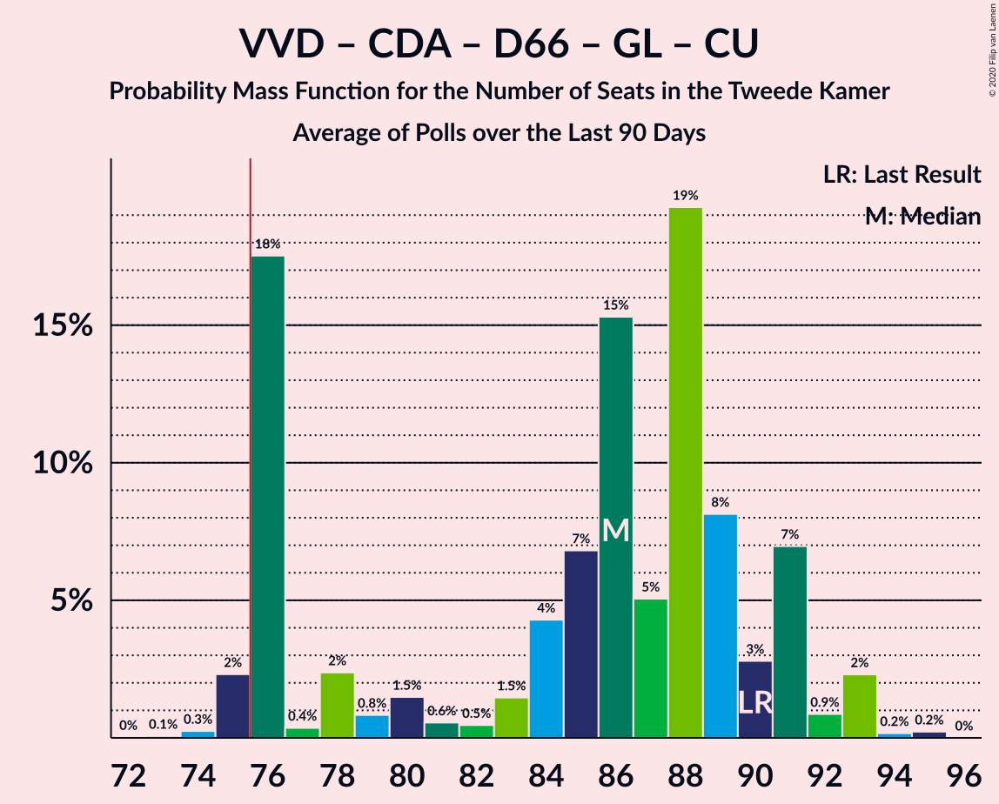

| Number of Seats | Probability | Accumulated | Special Marks |
|:---------------:|:-----------:|:-----------:|:-------------:|
| 81 | 0.6% | 100% |  |
| 82 | 0% | 99.4% |  |
| 83 | 0.1% | 99.4% |  |
| 84 | 12% | 99.3% |  |
| 85 | 0% | 88% |  |
| 86 | 0% | 88% |  |
| 87 | 11% | 88% |  |
| 88 | 0.1% | 77% |  |
| 89 | 0% | 77% |  |
| 90 | 0.8% | 77% | Last Result |
| 91 | 2% | 76% |  |
| 92 | 0% | 74% |  |
| 93 | 74% | 74% | Median |
| 94 | 0% | 0.1% |  |
| 95 | 0% | 0.1% |  |
| 96 | 0.1% | 0.1% |  |
| 97 | 0% | 0% |  |

### Volkspartij voor Vrijheid en Democratie – Christen-Democratisch Appèl – Democraten 66 – Partij van de Arbeid – ChristenUnie

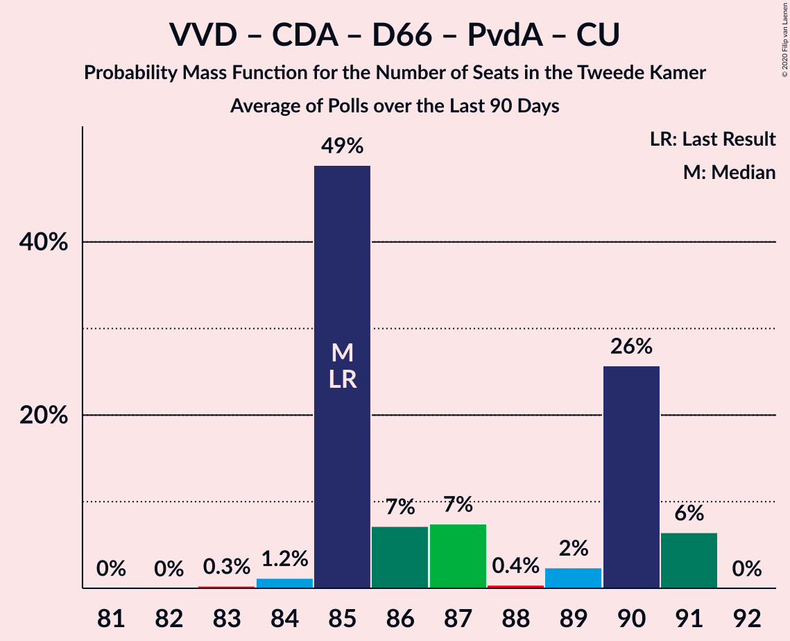

| Number of Seats | Probability | Accumulated | Special Marks |
|:---------------:|:-----------:|:-----------:|:-------------:|
| 81 | 0.1% | 100% |  |
| 82 | 0% | 99.8% |  |
| 83 | 0.3% | 99.8% |  |
| 84 | 0% | 99.5% |  |
| 85 | 12% | 99.5% | Last Result |
| 86 | 2% | 87% |  |
| 87 | 11% | 85% |  |
| 88 | 0.2% | 74% |  |
| 89 | 0% | 74% |  |
| 90 | 74% | 74% | Median |
| 91 | 0% | 0% |  |

### Volkspartij voor Vrijheid en Democratie – Partij voor de Vrijheid – Christen-Democratisch Appèl – Staatkundig Gereformeerde Partij – Forum voor Democratie

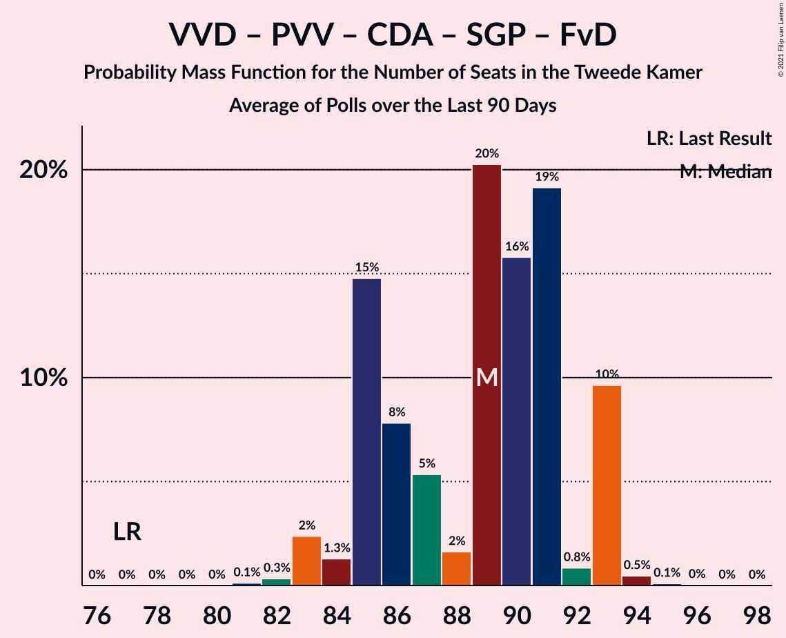

| Number of Seats | Probability | Accumulated | Special Marks |
|:---------------:|:-----------:|:-----------:|:-------------:|
| 77 | 0% | 100% | Last Result |
| 78 | 0% | 100% |  |
| 79 | 0% | 100% |  |
| 80 | 0% | 100% |  |
| 81 | 0% | 100% |  |
| 82 | 0% | 100% |  |
| 83 | 0.1% | 100% |  |
| 84 | 85% | 99.9% | Median |
| 85 | 0% | 15% |  |
| 86 | 11% | 15% |  |
| 87 | 2% | 3% |  |
| 88 | 0% | 1.2% |  |
| 89 | 1.0% | 1.2% |  |
| 90 | 0% | 0.2% |  |
| 91 | 0.1% | 0.2% |  |
| 92 | 0% | 0% |  |

### Volkspartij voor Vrijheid en Democratie – Partij voor de Vrijheid – Christen-Democratisch Appèl – Forum voor Democratie

| Number of Seats | Probability | Accumulated | Special Marks |
|:---------------:|:-----------:|:-----------:|:-------------:|
| 74 | 0% | 100% | Last Result |
| 75 | 0% | 100% |  |
| 76 | 0% | 100% | Majority |
| 77 | 0% | 100% |  |
| 78 | 0% | 100% |  |
| 79 | 0% | 100% |  |
| 80 | 0% | 100% |  |
| 81 | 96% | 100% | Median |
| 82 | 0.1% | 4% |  |
| 83 | 2% | 4% |  |
| 84 | 0.8% | 2% |  |
| 85 | 0.2% | 1.2% |  |
| 86 | 0% | 1.0% |  |
| 87 | 0.8% | 0.9% |  |
| 88 | 0.1% | 0.1% |  |
| 89 | 0% | 0% |  |

### Volkspartij voor Vrijheid en Democratie – Christen-Democratisch Appèl – Democraten 66 – ChristenUnie

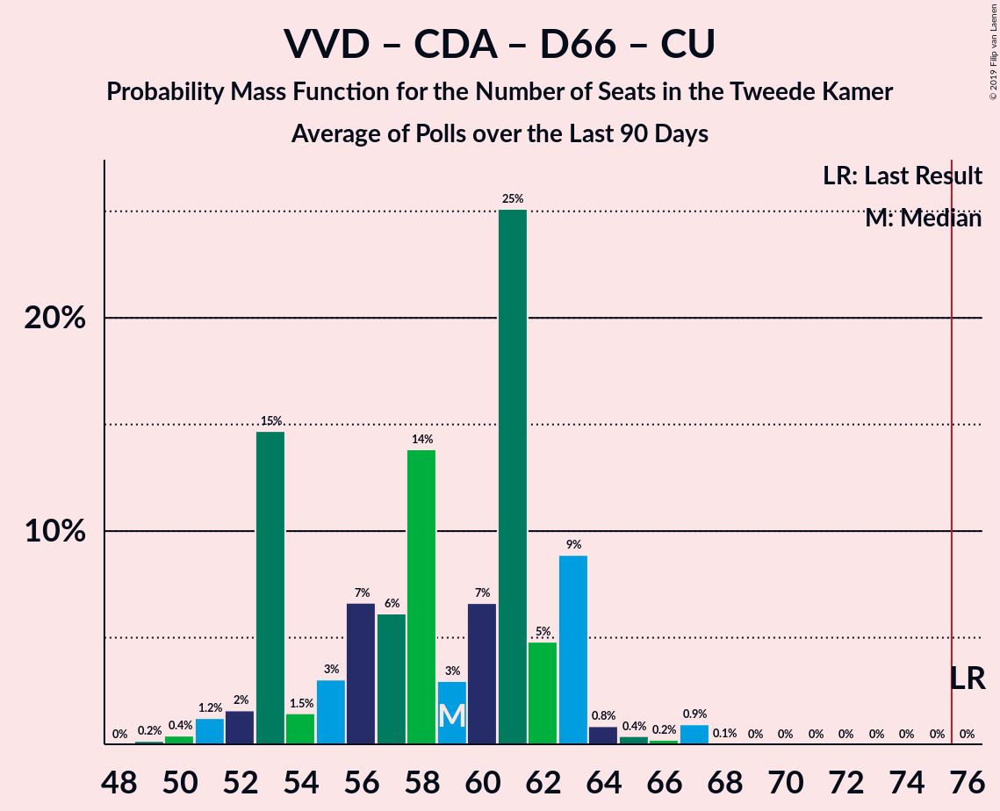

| Number of Seats | Probability | Accumulated | Special Marks |
|:---------------:|:-----------:|:-----------:|:-------------:|
| 67 | 0.6% | 100% |  |
| 68 | 0.1% | 99.4% |  |
| 69 | 12% | 99.4% |  |
| 70 | 0.2% | 88% |  |
| 71 | 0.1% | 88% |  |
| 72 | 3% | 87% |  |
| 73 | 11% | 85% |  |
| 74 | 0.1% | 74% |  |
| 75 | 0% | 74% |  |
| 76 | 0% | 74% | Last Result, Majority |
| 77 | 0.1% | 74% |  |
| 78 | 74% | 74% | Median |
| 79 | 0% | 0% |  |

### Volkspartij voor Vrijheid en Democratie – Christen-Democratisch Appèl – 50Plus – Staatkundig Gereformeerde Partij – Forum voor Democratie

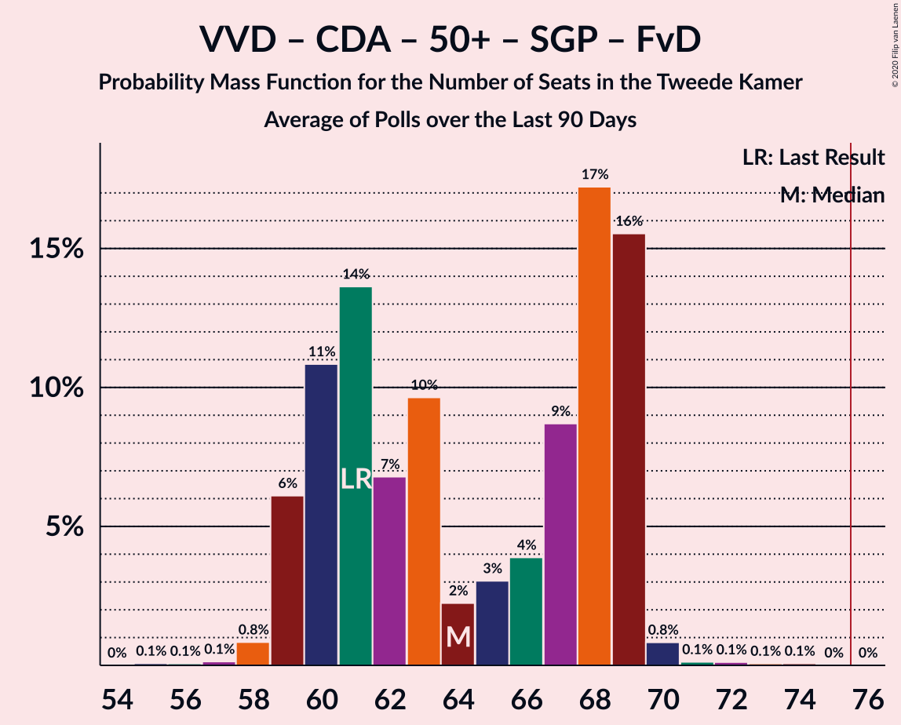

| Number of Seats | Probability | Accumulated | Special Marks |
|:---------------:|:-----------:|:-----------:|:-------------:|
| 61 | 0% | 100% | Last Result |
| 62 | 0% | 100% |  |
| 63 | 0% | 100% |  |
| 64 | 0% | 100% |  |
| 65 | 0% | 100% |  |
| 66 | 0% | 100% |  |
| 67 | 0% | 100% |  |
| 68 | 0% | 100% |  |
| 69 | 0.1% | 100% |  |
| 70 | 0% | 99.9% |  |
| 71 | 0.6% | 99.9% |  |
| 72 | 0.2% | 99.3% |  |
| 73 | 0% | 99.1% |  |
| 74 | 85% | 99.1% | Median |
| 75 | 0.2% | 14% |  |
| 76 | 11% | 14% | Majority |
| 77 | 0.2% | 2% |  |
| 78 | 0.1% | 2% |  |
| 79 | 2% | 2% |  |
| 80 | 0% | 0% |  |

### Volkspartij voor Vrijheid en Democratie – Christen-Democratisch Appèl – 50Plus – Forum voor Democratie

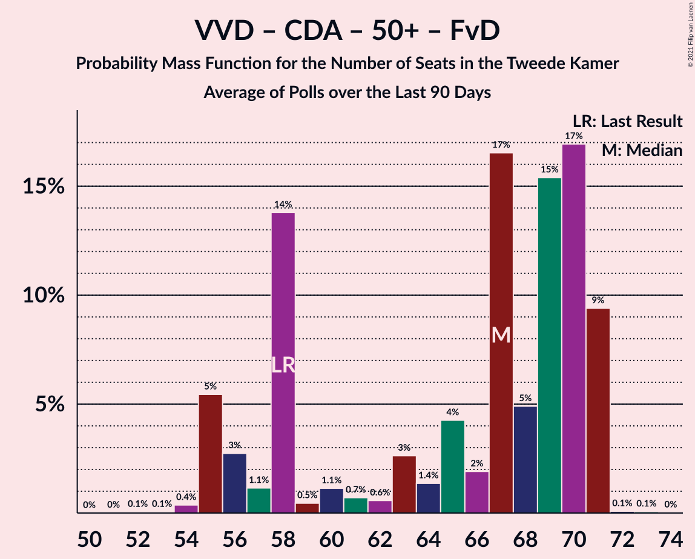

| Number of Seats | Probability | Accumulated | Special Marks |
|:---------------:|:-----------:|:-----------:|:-------------:|
| 58 | 0% | 100% | Last Result |
| 59 | 0% | 100% |  |
| 60 | 0% | 100% |  |
| 61 | 0% | 100% |  |
| 62 | 0% | 100% |  |
| 63 | 0% | 100% |  |
| 64 | 0.1% | 100% |  |
| 65 | 0% | 99.9% |  |
| 66 | 0% | 99.9% |  |
| 67 | 0% | 99.9% |  |
| 68 | 0% | 99.8% |  |
| 69 | 0.6% | 99.8% |  |
| 70 | 0.2% | 99.3% |  |
| 71 | 96% | 99.1% | Median |
| 72 | 0.1% | 3% |  |
| 73 | 0% | 3% |  |
| 74 | 0.9% | 3% |  |
| 75 | 2% | 2% |  |
| 76 | 0% | 0% | Majority |

### Volkspartij voor Vrijheid en Democratie – Christen-Democratisch Appèl – Staatkundig Gereformeerde Partij – Forum voor Democratie

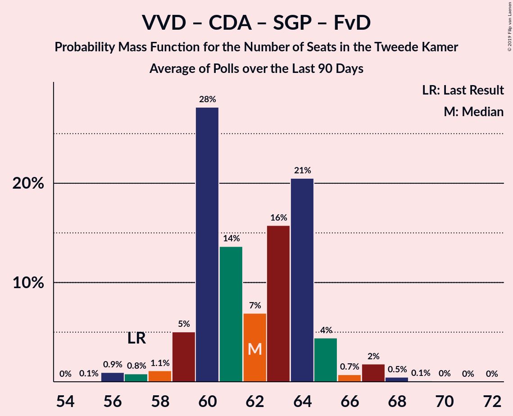

| Number of Seats | Probability | Accumulated | Special Marks |
|:---------------:|:-----------:|:-----------:|:-------------:|
| 57 | 0% | 100% | Last Result |
| 58 | 0% | 100% |  |
| 59 | 0% | 100% |  |
| 60 | 0% | 100% |  |
| 61 | 0% | 100% |  |
| 62 | 0% | 100% |  |
| 63 | 0% | 100% |  |
| 64 | 0% | 100% |  |
| 65 | 0% | 100% |  |
| 66 | 0% | 100% |  |
| 67 | 0% | 100% |  |
| 68 | 0.1% | 100% |  |
| 69 | 0.6% | 99.9% |  |
| 70 | 0.1% | 99.3% |  |
| 71 | 11% | 99.2% |  |
| 72 | 74% | 88% | Median |
| 73 | 11% | 14% |  |
| 74 | 0.8% | 3% |  |
| 75 | 0.1% | 2% |  |
| 76 | 2% | 2% | Majority |
| 77 | 0% | 0% |  |

### Volkspartij voor Vrijheid en Democratie – Christen-Democratisch Appèl – Forum voor Democratie

| Number of Seats | Probability | Accumulated | Special Marks |
|:---------------:|:-----------:|:-----------:|:-------------:|
| 54 | 0% | 100% | Last Result |
| 55 | 0% | 100% |  |
| 56 | 0% | 100% |  |
| 57 | 0% | 100% |  |
| 58 | 0% | 100% |  |
| 59 | 0% | 100% |  |
| 60 | 0% | 100% |  |
| 61 | 0% | 100% |  |
| 62 | 0% | 100% |  |
| 63 | 0.1% | 100% |  |
| 64 | 0% | 99.9% |  |
| 65 | 0% | 99.9% |  |
| 66 | 0% | 99.9% |  |
| 67 | 0.6% | 99.8% |  |
| 68 | 22% | 99.2% |  |
| 69 | 74% | 77% | Median |
| 70 | 0.1% | 3% |  |
| 71 | 0% | 3% |  |
| 72 | 3% | 3% |  |
| 73 | 0.1% | 0.2% |  |
| 74 | 0% | 0% |  |

### Volkspartij voor Vrijheid en Democratie – Christen-Democratisch Appèl – Partij van de Arbeid

| Number of Seats | Probability | Accumulated | Special Marks |
|:---------------:|:-----------:|:-----------:|:-------------:|
| 61 | 0% | 100% | Last Result |
| 62 | 0% | 100% |  |
| 63 | 0% | 100% |  |
| 64 | 0% | 100% |  |
| 65 | 0.1% | 100% |  |
| 66 | 0% | 99.9% |  |
| 67 | 0.3% | 99.8% |  |
| 68 | 74% | 99.5% | Median |
| 69 | 0% | 26% |  |
| 70 | 11% | 26% |  |
| 71 | 0% | 15% |  |
| 72 | 13% | 15% |  |
| 73 | 0.2% | 2% |  |
| 74 | 2% | 2% |  |
| 75 | 0% | 0% |  |

### Volkspartij voor Vrijheid en Democratie – Democraten 66 – Partij van de Arbeid

| Number of Seats | Probability | Accumulated | Special Marks |
|:---------------:|:-----------:|:-----------:|:-------------:|
| 61 | 0.2% | 100% | Last Result |
| 62 | 0.8% | 99.8% |  |
| 63 | 0% | 99.0% |  |
| 64 | 0.2% | 99.0% |  |
| 65 | 0.1% | 98.8% |  |
| 66 | 0.1% | 98.7% |  |
| 67 | 0.2% | 98.6% |  |
| 68 | 0% | 98% |  |
| 69 | 74% | 98% | Median |
| 70 | 13% | 24% |  |
| 71 | 11% | 11% |  |
| 72 | 0% | 0% |  |

### Volkspartij voor Vrijheid en Democratie – Partij voor de Vrijheid – Christen-Democratisch Appèl

| Number of Seats | Probability | Accumulated | Special Marks |
|:---------------:|:-----------:|:-----------:|:-------------:|
| 67 | 0.1% | 100% |  |
| 68 | 74% | 99.9% | Median |
| 69 | 22% | 26% |  |
| 70 | 0.8% | 4% |  |
| 71 | 2% | 3% |  |
| 72 | 0.1% | 1.1% | Last Result |
| 73 | 0.2% | 1.1% |  |
| 74 | 0.9% | 0.9% |  |
| 75 | 0% | 0% |  |

### Volkspartij voor Vrijheid en Democratie – Christen-Democratisch Appèl – Democraten 66

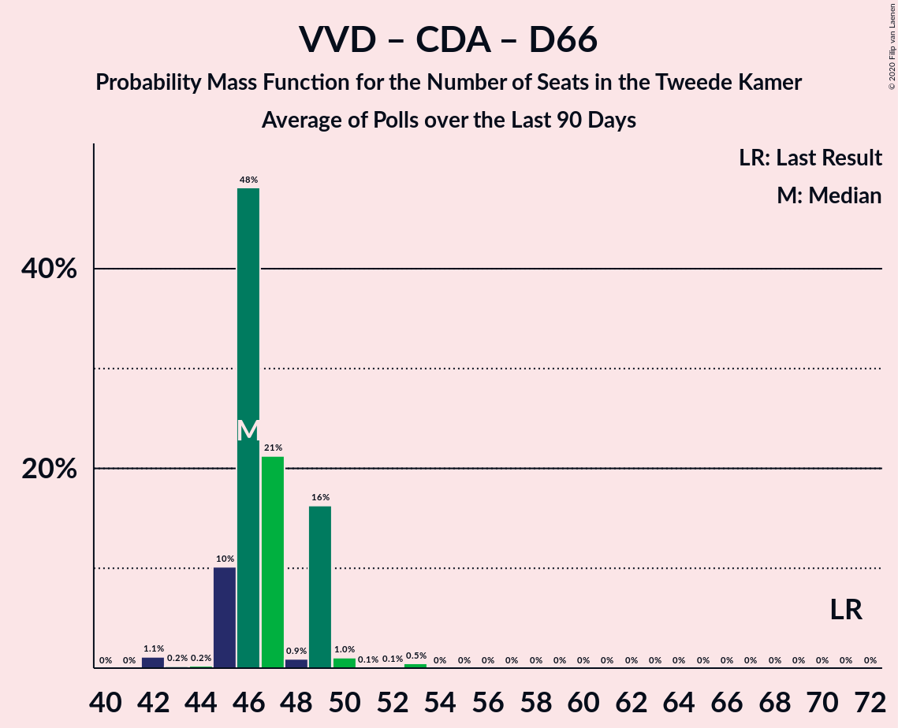

| Number of Seats | Probability | Accumulated | Special Marks |
|:---------------:|:-----------:|:-----------:|:-------------:|
| 62 | 0.6% | 100% |  |
| 63 | 0.2% | 99.4% |  |
| 64 | 0.3% | 99.2% |  |
| 65 | 11% | 98.9% |  |
| 66 | 0.8% | 88% |  |
| 67 | 0% | 87% |  |
| 68 | 13% | 87% |  |
| 69 | 74% | 74% | Median |
| 70 | 0% | 0.2% |  |
| 71 | 0% | 0.1% | Last Result |
| 72 | 0.1% | 0.1% |  |
| 73 | 0% | 0% |  |

### Christen-Democratisch Appèl – Democraten 66 – GroenLinks – Socialistische Partij – Partij van de Arbeid – ChristenUnie

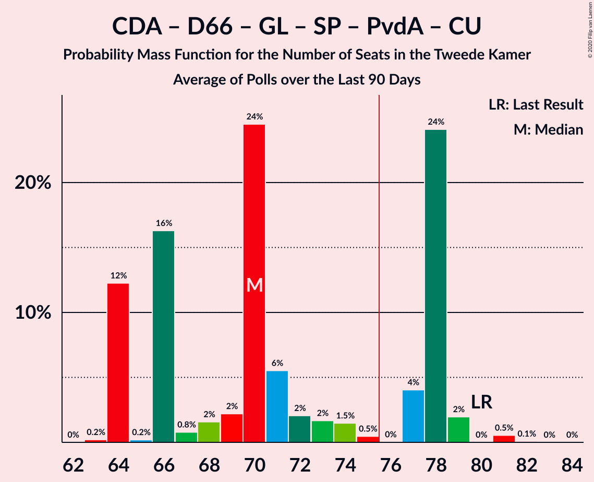

| Number of Seats | Probability | Accumulated | Special Marks |
|:---------------:|:-----------:|:-----------:|:-------------:|
| 61 | 0.1% | 100% |  |
| 62 | 0% | 99.9% |  |
| 63 | 11% | 99.8% |  |
| 64 | 0% | 88% |  |
| 65 | 12% | 88% |  |
| 66 | 0.8% | 76% |  |
| 67 | 0.2% | 75% |  |
| 68 | 0.1% | 75% |  |
| 69 | 74% | 75% | Median |
| 70 | 0.8% | 0.9% |  |
| 71 | 0% | 0% |  |
| 72 | 0% | 0% |  |
| 73 | 0% | 0% |  |
| 74 | 0% | 0% |  |
| 75 | 0% | 0% |  |
| 76 | 0% | 0% | Majority |
| 77 | 0% | 0% |  |
| 78 | 0% | 0% |  |
| 79 | 0% | 0% |  |
| 80 | 0% | 0% | Last Result |

### Volkspartij voor Vrijheid en Democratie – Partij van de Arbeid

| Number of Seats | Probability | Accumulated | Special Marks |
|:---------------:|:-----------:|:-----------:|:-------------:|
| 42 | 0% | 100% | Last Result |
| 43 | 0% | 100% |  |
| 44 | 0% | 100% |  |
| 45 | 0% | 100% |  |
| 46 | 0% | 100% |  |
| 47 | 0% | 100% |  |
| 48 | 0% | 100% |  |
| 49 | 0% | 100% |  |
| 50 | 0% | 100% |  |
| 51 | 0% | 100% |  |
| 52 | 0.3% | 100% |  |
| 53 | 0% | 99.7% |  |
| 54 | 0% | 99.7% |  |
| 55 | 0.9% | 99.6% |  |
| 56 | 74% | 98.7% | Median |
| 57 | 0.2% | 25% |  |
| 58 | 11% | 25% |  |
| 59 | 0% | 14% |  |
| 60 | 0.1% | 14% |  |
| 61 | 0.6% | 14% |  |
| 62 | 13% | 13% |  |
| 63 | 0% | 0% |  |

### Christen-Democratisch Appèl – Democraten 66 – GroenLinks – Partij van de Arbeid – ChristenUnie

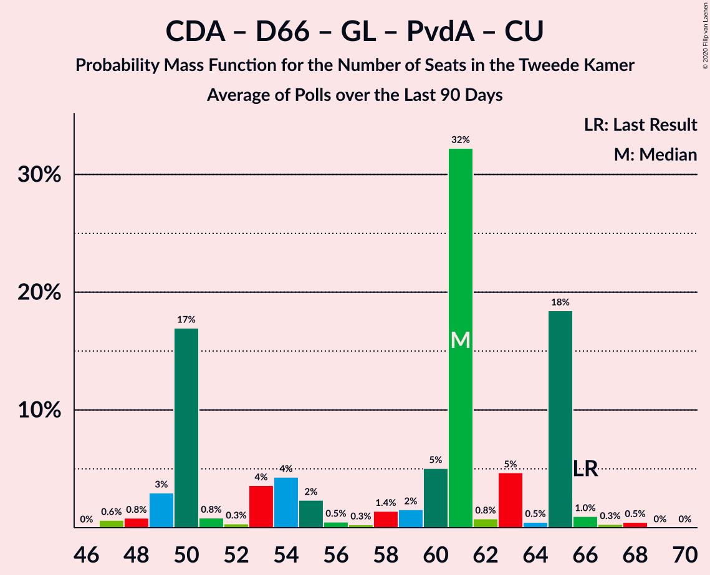

| Number of Seats | Probability | Accumulated | Special Marks |
|:---------------:|:-----------:|:-----------:|:-------------:|
| 51 | 0.1% | 100% |  |
| 52 | 0% | 99.9% |  |
| 53 | 0% | 99.9% |  |
| 54 | 11% | 99.8% |  |
| 55 | 0% | 88% |  |
| 56 | 0% | 88% |  |
| 57 | 13% | 88% |  |
| 58 | 0.6% | 76% |  |
| 59 | 0.2% | 75% |  |
| 60 | 0% | 75% |  |
| 61 | 75% | 75% | Median |
| 62 | 0% | 0.1% |  |
| 63 | 0.1% | 0.1% |  |
| 64 | 0% | 0% |  |
| 65 | 0% | 0% |  |
| 66 | 0% | 0% | Last Result |

### Volkspartij voor Vrijheid en Democratie – Christen-Democratisch Appèl

| Number of Seats | Probability | Accumulated | Special Marks |
|:---------------:|:-----------:|:-----------:|:-------------:|
| 52 | 0.1% | 100% | Last Result |
| 53 | 0.6% | 99.9% |  |
| 54 | 0.1% | 99.3% |  |
| 55 | 0.2% | 99.2% |  |
| 56 | 96% | 99.0% | Median |
| 57 | 0% | 3% |  |
| 58 | 0.2% | 3% |  |
| 59 | 0.8% | 3% |  |
| 60 | 2% | 2% |  |
| 61 | 0% | 0.1% |  |
| 62 | 0.1% | 0.1% |  |
| 63 | 0% | 0% |  |

### Christen-Democratisch Appèl – Democraten 66 – Partij van de Arbeid

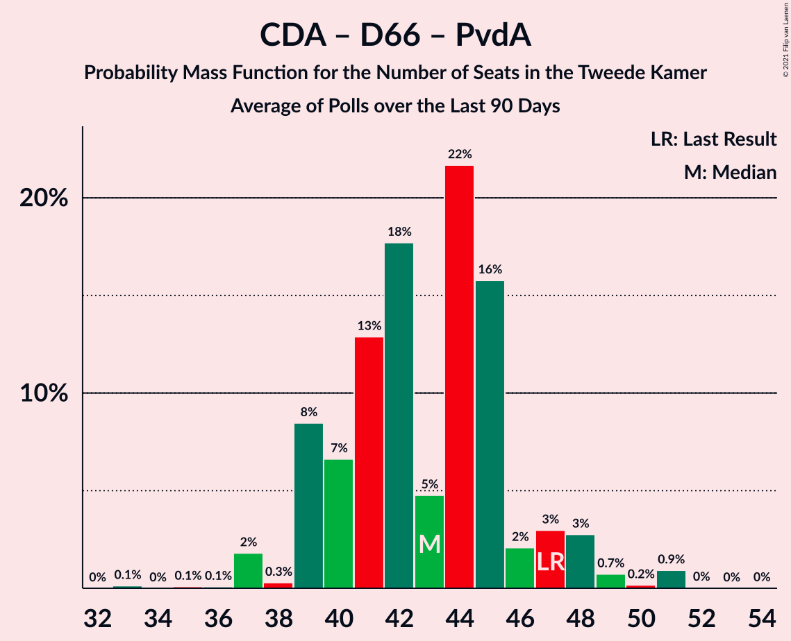

| Number of Seats | Probability | Accumulated | Special Marks |
|:---------------:|:-----------:|:-----------:|:-------------:|
| 31 | 0.1% | 100% |  |
| 32 | 0% | 99.9% |  |
| 33 | 0% | 99.8% |  |
| 34 | 2% | 99.8% |  |
| 35 | 11% | 98% |  |
| 36 | 0.2% | 87% |  |
| 37 | 75% | 86% | Median |
| 38 | 11% | 12% |  |
| 39 | 0.6% | 0.8% |  |
| 40 | 0.1% | 0.2% |  |
| 41 | 0% | 0.1% |  |
| 42 | 0.1% | 0.1% |  |
| 43 | 0% | 0% |  |
| 44 | 0% | 0% |  |
| 45 | 0% | 0% |  |
| 46 | 0% | 0% |  |
| 47 | 0% | 0% | Last Result |

### Christen-Democratisch Appèl – Partij van de Arbeid – ChristenUnie

| Number of Seats | Probability | Accumulated | Special Marks |
|:---------------:|:-----------:|:-----------:|:-------------:|
| 27 | 0.1% | 100% |  |
| 28 | 0% | 99.9% |  |
| 29 | 0% | 99.9% |  |
| 30 | 13% | 99.9% |  |
| 31 | 11% | 87% |  |
| 32 | 0.4% | 76% |  |
| 33 | 74% | 76% | Last Result, Median |
| 34 | 0% | 2% |  |
| 35 | 0.6% | 2% |  |
| 36 | 0.8% | 1.0% |  |
| 37 | 0% | 0.2% |  |
| 38 | 0.1% | 0.1% |  |
| 39 | 0% | 0% |  |

### Christen-Democratisch Appèl – Partij van de Arbeid

| Number of Seats | Probability | Accumulated | Special Marks |
|:---------------:|:-----------:|:-----------:|:-------------:|
| 21 | 0.1% | 100% |  |
| 22 | 0% | 99.9% |  |
| 23 | 0% | 99.9% |  |
| 24 | 74% | 99.9% | Median |
| 25 | 0% | 26% |  |
| 26 | 24% | 26% |  |
| 27 | 0.3% | 2% |  |
| 28 | 0% | 2% | Last Result |
| 29 | 0% | 2% |  |
| 30 | 1.5% | 2% |  |
| 31 | 0% | 0.1% |  |
| 32 | 0% | 0.1% |  |
| 33 | 0.1% | 0.1% |  |
| 34 | 0% | 0% |  |

### Christen-Democratisch Appèl – Democraten 66

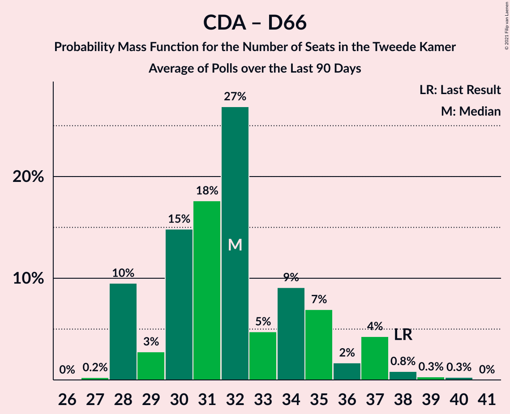

| Number of Seats | Probability | Accumulated | Special Marks |
|:---------------:|:-----------:|:-----------:|:-------------:|
| 19 | 11% | 100% |  |
| 20 | 2% | 89% |  |
| 21 | 0.1% | 86% |  |
| 22 | 0.1% | 86% |  |
| 23 | 0% | 86% |  |
| 24 | 12% | 86% |  |
| 25 | 74% | 74% | Median |
| 26 | 0.2% | 0.3% |  |
| 27 | 0% | 0% |  |
| 28 | 0% | 0% |  |
| 29 | 0% | 0% |  |
| 30 | 0% | 0% |  |
| 31 | 0% | 0% |  |
| 32 | 0% | 0% |  |
| 33 | 0% | 0% |  |
| 34 | 0% | 0% |  |
| 35 | 0% | 0% |  |
| 36 | 0% | 0% |  |
| 37 | 0% | 0% |  |
| 38 | 0% | 0% | Last Result |

## Technical Information

+ **Number of polls included in this average:** 3
+ **Lowest number of simulations done in a poll included in this average:** 0
+ **Total number of simulations done in the polls included in this average:** 65,536
+ **Error estimate:** 2.87%
