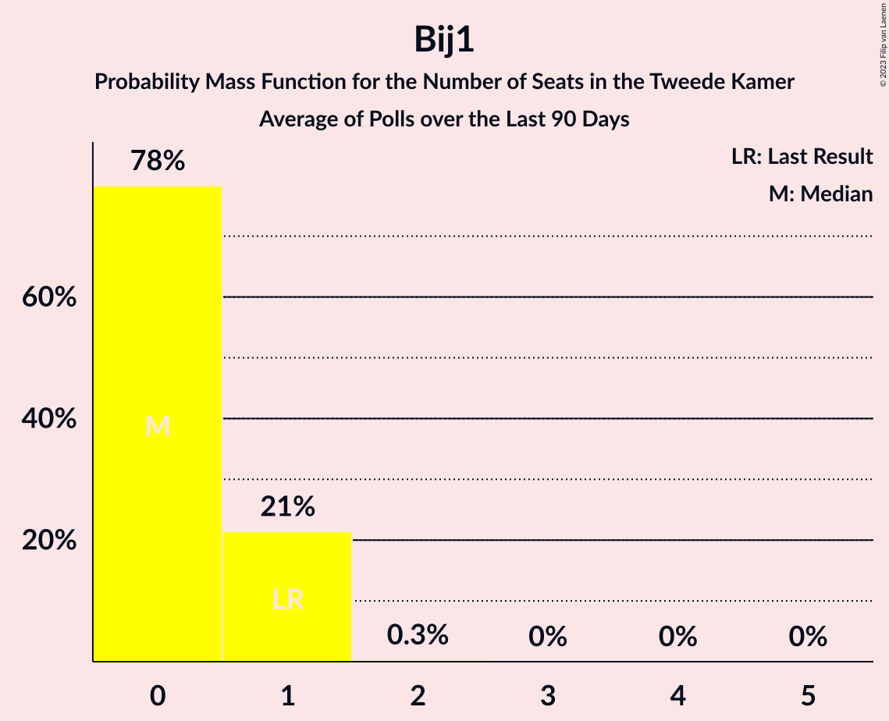

# Poll Average

<a href="#voting-intentions">Voting Intentions</a> | <a href="#seats">Seats</a> | <a href="#coalitions">Coalitions</a> | <a href="#technical-information">Technical Information</a>

## Summary

The table below lists the polls on which the average is based. They are the most recent polls (less than 90 days old) registered and analyzed so far.

| Period     | Polling firm/Commissioner(s) | VVD | D66 | PVV | CDA | SP | PvdA | GL | FvD | PvdD | CU | Volt | JA21 | SGP | DENK | 50+ | BBB | B1 | CO | Spl | PP | PvdT |
|:----------:|:----------------------------:|:--:|:--:|:--:|:--:|:--:|:--:|:--:|:--:|:--:|:--:|:--:|:--:|:--:|:--:|:--:|:--:|:--:|:--:|:--:|:--:|:--:|
| 17 March 2021 | General Election | 21.9%   34 | 15.0%   24 | 10.8%   17 | 9.5%   15 | 6.0%   9 | 5.7%   9 | 5.2%   8 | 5.0%   8 | 3.8%   6 | 3.4%   5 | 2.4%   3 | 2.4%   3 | 2.1%   3 | 2.0%   3 | 1.0%   1 | 1.0%   1 | 0.8%   1 | 0.4%   0 | 0.3%   0 | 0.2%   0 | 0.0%   0 |
| N/A | Poll Average | 20–24%   30–38 | 14–18%   20–29 | 9–13%   14–21 | 7–10%   9–14 | 4–7%   5–11 | 5–8%   6–11 | 4–6%   5–10 | 4–7%   6–9 | 4–6%   6–10 | 2–4%   4–7 | 2–4%   4–7 | 2–5%   3–6 | 2–3%   2–4 | 1–2%   1–4 | 0–1%   0–2 | 0–2%   0–2 | 0–2%   0–1 | N/A   N/A | N/A   N/A | N/A   N/A | N/A   N/A |
| [23–24 April 2021](2021-04-24-Peilnl.html) | Peil.nl | 20–23%   32–34 | 13–16%   20–22 | 11–13%   18–21 | 7–9%   11–12 | 5–7%   9–10 | 5–7%   8–10 | 4–5%   7–9 | 5–7%   8–10 | 4–5%   7 | 3–4%   5–7 | 3–4%   5 | 3–5%   5–6 | 2–3%   2–3 | 2–3%   3 | 0%   0 | 1–2%   1–3 | 0–1%   0–1 | N/A   N/A | N/A   N/A | N/A   N/A | N/A   N/A |
| [16–19 April 2021](2021-04-19-Ipsos.html) | Ipsos | 20–25%   30–38 | 14–19%   24–30 | 10–14%   14–20 | 6–10%   8–17 | 3–6%   5–9 | 5–8%   8–12 | 4–6%   5–10 | 3–6%   5–9 | 4–7%   6–10 | 2–4%   3–6 | 2–5%   3–7 | 2–4%   3–5 | 1–3%   2–4 | 1–2%   1–4 | 0–2%   0–2 | 0–2%   0–2 | 0–1%   0–2 | N/A   N/A | N/A   N/A | N/A   N/A | N/A   N/A |
| [9–12 April 2021](2021-04-12-IOResearch.html) | I&O Research | 20–23%   32–35 | 15–18%   24–27 | 8–11%   15 | 8–10%   14 | 5–8%   8–11 | 4–6%   6–8 | 3–5%   5–7 | 4–6%   6–8 | 3–5%   6–7 | 3–4%   5–6 | 2–4%   4–5 | 3–5%   6 | 2–3%   3 | 1–3%   2–3 | 0–1%   0–1 | 1–2%   0–2 | 1–2%   1 | N/A   N/A | N/A   N/A | N/A   N/A | N/A   N/A |
| 17 March 2021 | General Election | 21.9%   34 | 15.0%   24 | 10.8%   17 | 9.5%   15 | 6.0%   9 | 5.7%   9 | 5.2%   8 | 5.0%   8 | 3.8%   6 | 3.4%   5 | 2.4%   3 | 2.4%   3 | 2.1%   3 | 2.0%   3 | 1.0%   1 | 1.0%   1 | 0.8%   1 | 0.4%   0 | 0.3%   0 | 0.2%   0 | 0.0%   0 |

Only polls for which at least the sample size has been published are included in the table above.

**Legend:**
+ **Top half of each row:** Voting intentions (95% confidence interval)
+ **Bottom half of each row:** Seat projections for the Tweede Kamer (95% confidence interval)
+ **VVD:** Volkspartij voor Vrijheid en Democratie
+ **D66:** Democraten 66
+ **PVV:** Partij voor de Vrijheid
+ **CDA:** Christen-Democratisch Appèl
+ **SP:** Socialistische Partij
+ **PvdA:** Partij van de Arbeid
+ **GL:** GroenLinks
+ **FvD:** Forum voor Democratie
+ **PvdD:** Partij voor de Dieren
+ **CU:** ChristenUnie
+ **Volt:** Volt Europa
+ **JA21:** Juiste Antwoord 2021
+ **SGP:** Staatkundig Gereformeerde Partij
+ **DENK:** DENK
+ **50+:** 50Plus
+ **BBB:** BoerBurgerBeweging
+ **B1:** Bij1
+ **CO:** Code Oranje
+ **Spl:** Splinter
+ **PP:** Piratenpartij
+ **PvdT:** Partij voor de Toekomst
+ **N/A (single party):** Party not included the published results
+ **N/A (entire row):** Calculation for this opinion poll not started yet

## Voting Intentions

### Confidence Intervals

| Party | Last Result | Median | 80% Confidence Interval | 90% Confidence Interval | 95% Confidence Interval | 99% Confidence Interval |
|:-----:|:-----------:|:------:|:-----------------------:|:-----------------------:|:-----------------------:|:-----------------------:|
| <a href="#volkspartij-voor-vrijheid-en-democratie">Volkspartij voor Vrijheid en Democratie</a> | 21.9% | 21.7% | 20.5–23.4% |20.2–23.9% | 19.9–24.5% | 19.3–25.4% |
| <a href="#democraten-66">Democraten 66</a> | 15.0% | 16.0% | 14.3–17.7% |14.0–18.1% | 13.7–18.5% | 13.3–19.4% |
| <a href="#partij-voor-de-vrijheid">Partij voor de Vrijheid</a> | 10.8% | 11.4% | 9.2–12.7% |8.8–13.1% | 8.6–13.4% | 8.2–14.1% |
| <a href="#christen-democratisch-appèl">Christen-Democratisch Appèl</a> | 9.5% | 8.2% | 7.2–9.3% |6.9–9.6% | 6.6–9.8% | 6.1–10.3% |
| <a href="#socialistische-partij">Socialistische Partij</a> | 6.0% | 5.9% | 4.3–6.8% |3.9–7.1% | 3.7–7.3% | 3.3–7.7% |
| <a href="#partij-van-de-arbeid">Partij van de Arbeid</a> | 5.7% | 5.9% | 5.0–6.9% |4.8–7.2% | 4.6–7.5% | 4.3–8.2% |
| <a href="#groenlinks">GroenLinks</a> | 5.2% | 4.6% | 3.9–5.3% |3.7–5.6% | 3.5–5.8% | 3.3–6.4% |
| <a href="#forum-voor-democratie">Forum voor Democratie</a> | 5.0% | 5.0% | 4.1–6.2% |3.9–6.5% | 3.7–6.6% | 3.3–7.0% |
| <a href="#partij-voor-de-dieren">Partij voor de Dieren</a> | 3.8% | 4.7% | 4.0–5.7% |3.8–6.0% | 3.7–6.4% | 3.4–6.9% |
| <a href="#christenunie">ChristenUnie</a> | 3.4% | 3.3% | 2.8–3.9% |2.6–4.1% | 2.5–4.3% | 2.2–4.6% |
| <a href="#volt-europa">Volt Europa</a> | 2.4% | 3.3% | 2.7–3.9% |2.6–4.1% | 2.4–4.3% | 2.2–4.8% |
| <a href="#juiste-antwoord-2021">Juiste Antwoord 2021</a> | 2.4% | 3.7% | 2.7–4.4% |2.4–4.5% | 2.2–4.7% | 1.9–5.0% |
| <a href="#staatkundig-gereformeerde-partij">Staatkundig Gereformeerde Partij</a> | 2.1% | 2.1% | 1.7–2.6% |1.6–2.8% | 1.5–3.0% | 1.3–3.4% |
| <a href="#denk">DENK</a> | 2.0% | 1.9% | 1.3–2.3% |1.2–2.4% | 1.0–2.5% | 0.8–2.8% |
| <a href="#50plus">50Plus</a> | 1.0% | 0.7% | 0.1–1.1% |0.1–1.2% | 0.1–1.4% | 0.1–1.6% |
| <a href="#boerburgerbeweging">BoerBurgerBeweging</a> | 1.0% | 1.1% | 0.7–1.5% |0.6–1.6% | 0.5–1.7% | 0.4–1.9% |
| <a href="#bij1">Bij1</a> | 0.8% | 0.8% | 0.5–1.3% |0.5–1.4% | 0.4–1.5% | 0.3–1.7% |
| <a href="#code-oranje">Code Oranje</a> | 0.4% | N/A | N/A |N/A | N/A | N/A |
| <a href="#splinter">Splinter</a> | 0.3% | N/A | N/A |N/A | N/A | N/A |
| <a href="#piratenpartij">Piratenpartij</a> | 0.2% | N/A | N/A |N/A | N/A | N/A |
| <a href="#partij-voor-de-toekomst">Partij voor de Toekomst</a> | 0.0% | N/A | N/A |N/A | N/A | N/A |

### Volkspartij voor Vrijheid en Democratie

*For a full overview of the results for this party, see the [Volkspartij voor Vrijheid en Democratie](party-volkspartijvoorvrijheidendemocratie.html) page.*

| Voting Intentions | Probability | Accumulated | Special Marks |
|:-----------------:|:-----------:|:-----------:|:-------------:|
| 17.5–18.5% | 0% | 100% |  |
| 18.5–19.5% | 0.9% | 100% |  |
| 19.5–20.5% | 10% | 99.0% |  |
| 20.5–21.5% | 33% | 89% |  |
| 21.5–22.5% | 32% | 55% | Last Result, Median |
| 22.5–23.5% | 15% | 23% |  |
| 23.5–24.5% | 6% | 8% |  |
| 24.5–25.5% | 2% | 2% |  |
| 25.5–26.5% | 0.4% | 0.4% |  |
| 26.5–27.5% | 0% | 0.1% |  |
| 27.5–28.5% | 0% | 0% |  |

### Democraten 66

*For a full overview of the results for this party, see the [Democraten 66](party-democraten66.html) page.*

| Voting Intentions | Probability | Accumulated | Special Marks |
|:-----------------:|:-----------:|:-----------:|:-------------:|
| 11.5–12.5% | 0% | 100% |  |
| 12.5–13.5% | 1.4% | 100% |  |
| 13.5–14.5% | 14% | 98.6% |  |
| 14.5–15.5% | 23% | 84% | Last Result |
| 15.5–16.5% | 26% | 61% | Median |
| 16.5–17.5% | 23% | 35% |  |
| 17.5–18.5% | 9% | 12% |  |
| 18.5–19.5% | 2% | 2% |  |
| 19.5–20.5% | 0.3% | 0.3% |  |
| 20.5–21.5% | 0% | 0% |  |

### Partij voor de Vrijheid

*For a full overview of the results for this party, see the [Partij voor de Vrijheid](party-partijvoordevrijheid.html) page.*

| Voting Intentions | Probability | Accumulated | Special Marks |
|:-----------------:|:-----------:|:-----------:|:-------------:|
| 6.5–7.5% | 0% | 100% |  |
| 7.5–8.5% | 2% | 100% |  |
| 8.5–9.5% | 16% | 98% |  |
| 9.5–10.5% | 17% | 82% |  |
| 10.5–11.5% | 20% | 65% | Last Result, Median |
| 11.5–12.5% | 32% | 45% |  |
| 12.5–13.5% | 12% | 14% |  |
| 13.5–14.5% | 2% | 2% |  |
| 14.5–15.5% | 0.2% | 0.2% |  |
| 15.5–16.5% | 0% | 0% |  |

### Christen-Democratisch Appèl

*For a full overview of the results for this party, see the [Christen-Democratisch Appèl](party-christen-democratischappèl.html) page.*

| Voting Intentions | Probability | Accumulated | Special Marks |
|:-----------------:|:-----------:|:-----------:|:-------------:|
| 4.5–5.5% | 0.1% | 100% |  |
| 5.5–6.5% | 2% | 99.9% |  |
| 6.5–7.5% | 18% | 98% |  |
| 7.5–8.5% | 47% | 80% | Median |
| 8.5–9.5% | 28% | 33% |  |
| 9.5–10.5% | 5% | 5% | Last Result |
| 10.5–11.5% | 0.2% | 0.2% |  |
| 11.5–12.5% | 0% | 0% |  |

### Socialistische Partij

*For a full overview of the results for this party, see the [Socialistische Partij](party-socialistischepartij.html) page.*

| Voting Intentions | Probability | Accumulated | Special Marks |
|:-----------------:|:-----------:|:-----------:|:-------------:|
| 1.5–2.5% | 0% | 100% |  |
| 2.5–3.5% | 1.4% | 100% |  |
| 3.5–4.5% | 14% | 98.6% |  |
| 4.5–5.5% | 21% | 84% |  |
| 5.5–6.5% | 45% | 63% | Last Result, Median |
| 6.5–7.5% | 17% | 18% |  |
| 7.5–8.5% | 1.0% | 1.0% |  |
| 8.5–9.5% | 0% | 0% |  |

### Partij van de Arbeid

*For a full overview of the results for this party, see the [Partij van de Arbeid](party-partijvandearbeid.html) page.*

| Voting Intentions | Probability | Accumulated | Special Marks |
|:-----------------:|:-----------:|:-----------:|:-------------:|
| 2.5–3.5% | 0% | 100% |  |
| 3.5–4.5% | 2% | 100% |  |
| 4.5–5.5% | 30% | 98% |  |
| 5.5–6.5% | 51% | 68% | Last Result, Median |
| 6.5–7.5% | 15% | 17% |  |
| 7.5–8.5% | 2% | 2% |  |
| 8.5–9.5% | 0.2% | 0.2% |  |
| 9.5–10.5% | 0% | 0% |  |

### GroenLinks

*For a full overview of the results for this party, see the [GroenLinks](party-groenlinks.html) page.*

| Voting Intentions | Probability | Accumulated | Special Marks |
|:-----------------:|:-----------:|:-----------:|:-------------:|
| 1.5–2.5% | 0% | 100% |  |
| 2.5–3.5% | 3% | 100% |  |
| 3.5–4.5% | 47% | 97% |  |
| 4.5–5.5% | 45% | 50% | Last Result, Median |
| 5.5–6.5% | 5% | 5% |  |
| 6.5–7.5% | 0.3% | 0.3% |  |
| 7.5–8.5% | 0% | 0% |  |

### Forum voor Democratie

*For a full overview of the results for this party, see the [Forum voor Democratie](party-forumvoordemocratie.html) page.*

| Voting Intentions | Probability | Accumulated | Special Marks |
|:-----------------:|:-----------:|:-----------:|:-------------:|
| 1.5–2.5% | 0% | 100% |  |
| 2.5–3.5% | 2% | 100% |  |
| 3.5–4.5% | 26% | 98% |  |
| 4.5–5.5% | 39% | 72% | Last Result, Median |
| 5.5–6.5% | 29% | 33% |  |
| 6.5–7.5% | 3% | 4% |  |
| 7.5–8.5% | 0% | 0% |  |

### Partij voor de Dieren

*For a full overview of the results for this party, see the [Partij voor de Dieren](party-partijvoordedieren.html) page.*

| Voting Intentions | Probability | Accumulated | Special Marks |
|:-----------------:|:-----------:|:-----------:|:-------------:|
| 1.5–2.5% | 0% | 100% |  |
| 2.5–3.5% | 1.2% | 100% |  |
| 3.5–4.5% | 39% | 98.8% | Last Result |
| 4.5–5.5% | 48% | 60% | Median |
| 5.5–6.5% | 11% | 13% |  |
| 6.5–7.5% | 1.5% | 2% |  |
| 7.5–8.5% | 0.1% | 0.1% |  |
| 8.5–9.5% | 0% | 0% |  |

### ChristenUnie

*For a full overview of the results for this party, see the [ChristenUnie](party-christenunie.html) page.*

| Voting Intentions | Probability | Accumulated | Special Marks |
|:-----------------:|:-----------:|:-----------:|:-------------:|
| 0.5–1.5% | 0% | 100% |  |
| 1.5–2.5% | 4% | 100% |  |
| 2.5–3.5% | 65% | 96% | Last Result, Median |
| 3.5–4.5% | 31% | 32% |  |
| 4.5–5.5% | 0.7% | 0.7% |  |
| 5.5–6.5% | 0% | 0% |  |

### Volt Europa

*For a full overview of the results for this party, see the [Volt Europa](party-volteuropa.html) page.*

| Voting Intentions | Probability | Accumulated | Special Marks |
|:-----------------:|:-----------:|:-----------:|:-------------:|
| 0.5–1.5% | 0% | 100% |  |
| 1.5–2.5% | 4% | 100% | Last Result |
| 2.5–3.5% | 69% | 96% | Median |
| 3.5–4.5% | 25% | 26% |  |
| 4.5–5.5% | 1.1% | 1.2% |  |
| 5.5–6.5% | 0% | 0% |  |

### Juiste Antwoord 2021

*For a full overview of the results for this party, see the [Juiste Antwoord 2021](party-juisteantwoord2021.html) page.*

| Voting Intentions | Probability | Accumulated | Special Marks |
|:-----------------:|:-----------:|:-----------:|:-------------:|
| 0.5–1.5% | 0% | 100% |  |
| 1.5–2.5% | 8% | 100% | Last Result |
| 2.5–3.5% | 32% | 92% |  |
| 3.5–4.5% | 55% | 60% | Median |
| 4.5–5.5% | 4% | 4% |  |
| 5.5–6.5% | 0% | 0% |  |

### Staatkundig Gereformeerde Partij

*For a full overview of the results for this party, see the [Staatkundig Gereformeerde Partij](party-staatkundiggereformeerdepartij.html) page.*

| Voting Intentions | Probability | Accumulated | Special Marks |
|:-----------------:|:-----------:|:-----------:|:-------------:|
| 0.0–0.5% | 0% | 100% |  |
| 0.5–1.5% | 3% | 100% |  |
| 1.5–2.5% | 83% | 97% | Last Result, Median |
| 2.5–3.5% | 14% | 14% |  |
| 3.5–4.5% | 0.3% | 0.3% |  |
| 4.5–5.5% | 0% | 0% |  |

### DENK

*For a full overview of the results for this party, see the [DENK](party-denk.html) page.*

| Voting Intentions | Probability | Accumulated | Special Marks |
|:-----------------:|:-----------:|:-----------:|:-------------:|
| 0.0–0.5% | 0% | 100% |  |
| 0.5–1.5% | 21% | 100% |  |
| 1.5–2.5% | 76% | 79% | Last Result, Median |
| 2.5–3.5% | 2% | 2% |  |
| 3.5–4.5% | 0% | 0% |  |

### 50Plus

*For a full overview of the results for this party, see the [50Plus](party-50plus.html) page.*

| Voting Intentions | Probability | Accumulated | Special Marks |
|:-----------------:|:-----------:|:-----------:|:-------------:|
| 0.0–0.5% | 39% | 100% |  |
| 0.5–1.5% | 60% | 61% | Last Result, Median |
| 1.5–2.5% | 0.9% | 0.9% |  |
| 2.5–3.5% | 0% | 0% |  |

### BoerBurgerBeweging

*For a full overview of the results for this party, see the [BoerBurgerBeweging](party-boerburgerbeweging.html) page.*

| Voting Intentions | Probability | Accumulated | Special Marks |
|:-----------------:|:-----------:|:-----------:|:-------------:|
| 0.0–0.5% | 4% | 100% |  |
| 0.5–1.5% | 89% | 96% | Last Result, Median |
| 1.5–2.5% | 8% | 8% |  |
| 2.5–3.5% | 0% | 0% |  |

### Bij1

*For a full overview of the results for this party, see the [Bij1](party-bij1.html) page.*

| Voting Intentions | Probability | Accumulated | Special Marks |
|:-----------------:|:-----------:|:-----------:|:-------------:|
| 0.0–0.5% | 12% | 100% |  |
| 0.5–1.5% | 86% | 88% | Last Result, Median |
| 1.5–2.5% | 2% | 2% |  |
| 2.5–3.5% | 0% | 0% |  |

## Seats

### Confidence Intervals

| Party | Last Result | Median | 80% Confidence Interval | 90% Confidence Interval | 95% Confidence Interval | 99% Confidence Interval |
|:-----:|:-----------:|:------:|:-----------------------:|:-----------------------:|:-----------------------:|:-----------------------:|
| <a href="#volkspartij-voor-vrijheid-en-democratie">Volkspartij voor Vrijheid en Democratie</a> | 34 | 34 | 32–35 |30–35 | 30–38 | 30–38 |
| <a href="#democraten-66">Democraten 66</a> | 24 | 24 | 20–27 |20–27 | 20–29 | 20–30 |
| <a href="#partij-voor-de-vrijheid">Partij voor de Vrijheid</a> | 17 | 17 | 15–21 |15–21 | 14–21 | 13–22 |
| <a href="#christen-democratisch-appèl">Christen-Democratisch Appèl</a> | 15 | 12 | 9–14 |9–14 | 9–14 | 8–17 |
| <a href="#socialistische-partij">Socialistische Partij</a> | 9 | 9 | 6–11 |6–11 | 5–11 | 5–11 |
| <a href="#partij-van-de-arbeid">Partij van de Arbeid</a> | 9 | 9 | 6–9 |6–10 | 6–11 | 6–12 |
| <a href="#groenlinks">GroenLinks</a> | 8 | 7 | 5–9 |5–9 | 5–10 | 5–10 |
| <a href="#forum-voor-democratie">Forum voor Democratie</a> | 8 | 6 | 6–9 |6–9 | 6–9 | 5–10 |
| <a href="#partij-voor-de-dieren">Partij voor de Dieren</a> | 6 | 7 | 6–10 |6–10 | 6–10 | 5–10 |
| <a href="#christenunie">ChristenUnie</a> | 5 | 6 | 4–7 |4–7 | 4–7 | 3–7 |
| <a href="#volt-europa">Volt Europa</a> | 3 | 5 | 4–6 |4–7 | 4–7 | 3–7 |
| <a href="#juiste-antwoord-2021">Juiste Antwoord 2021</a> | 3 | 6 | 4–6 |4–6 | 3–6 | 3–6 |
| <a href="#staatkundig-gereformeerde-partij">Staatkundig Gereformeerde Partij</a> | 3 | 3 | 2–4 |2–4 | 2–4 | 2–4 |
| <a href="#denk">DENK</a> | 3 | 3 | 2–4 |2–4 | 1–4 | 1–4 |
| <a href="#50plus">50Plus</a> | 1 | 1 | 0–2 |0–2 | 0–2 | 0–2 |
| <a href="#boerburgerbeweging">BoerBurgerBeweging</a> | 1 | 1 | 0–2 |0–2 | 0–2 | 0–3 |
| <a href="#bij1">Bij1</a> | 1 | 1 | 0–1 |0–1 | 0–1 | 0–2 |
| <a href="#code-oranje">Code Oranje</a> | 0 | N/A | N/A |N/A | N/A | N/A |
| <a href="#splinter">Splinter</a> | 0 | N/A | N/A |N/A | N/A | N/A |
| <a href="#piratenpartij">Piratenpartij</a> | 0 | N/A | N/A |N/A | N/A | N/A |
| <a href="#partij-voor-de-toekomst">Partij voor de Toekomst</a> | 0 | N/A | N/A |N/A | N/A | N/A |

### Volkspartij voor Vrijheid en Democratie

*For a full overview of the results for this party, see the [Volkspartij voor Vrijheid en Democratie](party-volkspartijvoorvrijheidendemocratie.html) page.*

| Number of Seats | Probability | Accumulated | Special Marks |
|:---------------:|:-----------:|:-----------:|:-------------:|
| 28 | 0.1% | 100% |  |
| 29 | 0.1% | 99.9% |  |
| 30 | 7% | 99.8% |  |
| 31 | 1.4% | 93% |  |
| 32 | 34% | 91% |  |
| 33 | 0.2% | 57% |  |
| 34 | 22% | 57% | Last Result, Median |
| 35 | 31% | 35% |  |
| 36 | 0.8% | 4% |  |
| 37 | 0.3% | 3% |  |
| 38 | 2% | 3% |  |
| 39 | 0.1% | 0.1% |  |
| 40 | 0% | 0% |  |

### Democraten 66

*For a full overview of the results for this party, see the [Democraten 66](party-democraten66.html) page.*

| Number of Seats | Probability | Accumulated | Special Marks |
|:---------------:|:-----------:|:-----------:|:-------------:|
| 20 | 31% | 100% |  |
| 21 | 1.4% | 69% |  |
| 22 | 0.8% | 68% |  |
| 23 | 0.1% | 67% |  |
| 24 | 34% | 67% | Last Result, Median |
| 25 | 0.6% | 32% |  |
| 26 | 5% | 32% |  |
| 27 | 24% | 26% |  |
| 28 | 0% | 3% |  |
| 29 | 2% | 3% |  |
| 30 | 0.7% | 1.1% |  |
| 31 | 0% | 0.4% |  |
| 32 | 0.4% | 0.4% |  |
| 33 | 0% | 0% |  |

### Partij voor de Vrijheid

*For a full overview of the results for this party, see the [Partij voor de Vrijheid](party-partijvoordevrijheid.html) page.*

| Number of Seats | Probability | Accumulated | Special Marks |
|:---------------:|:-----------:|:-----------:|:-------------:|
| 13 | 0.5% | 100% |  |
| 14 | 3% | 99.5% |  |
| 15 | 33% | 97% |  |
| 16 | 4% | 64% |  |
| 17 | 16% | 60% | Last Result, Median |
| 18 | 4% | 44% |  |
| 19 | 8% | 40% |  |
| 20 | 0.2% | 32% |  |
| 21 | 31% | 32% |  |
| 22 | 0.6% | 0.7% |  |
| 23 | 0% | 0% |  |

### Christen-Democratisch Appèl

*For a full overview of the results for this party, see the [Christen-Democratisch Appèl](party-christen-democratischappèl.html) page.*

| Number of Seats | Probability | Accumulated | Special Marks |
|:---------------:|:-----------:|:-----------:|:-------------:|
| 7 | 0.4% | 100% |  |
| 8 | 0.7% | 99.6% |  |
| 9 | 16% | 99.0% |  |
| 10 | 2% | 83% |  |
| 11 | 2% | 81% |  |
| 12 | 33% | 79% | Median |
| 13 | 5% | 47% |  |
| 14 | 40% | 42% |  |
| 15 | 0.6% | 2% | Last Result |
| 16 | 0% | 1.1% |  |
| 17 | 1.0% | 1.0% |  |
| 18 | 0% | 0% |  |

### Socialistische Partij

*For a full overview of the results for this party, see the [Socialistische Partij](party-socialistischepartij.html) page.*

| Number of Seats | Probability | Accumulated | Special Marks |
|:---------------:|:-----------:|:-----------:|:-------------:|
| 4 | 0.1% | 100% |  |
| 5 | 3% | 99.9% |  |
| 6 | 19% | 97% |  |
| 7 | 0.9% | 78% |  |
| 8 | 24% | 77% |  |
| 9 | 39% | 52% | Last Result, Median |
| 10 | 3% | 13% |  |
| 11 | 11% | 11% |  |
| 12 | 0% | 0% |  |

### Partij van de Arbeid

*For a full overview of the results for this party, see the [Partij van de Arbeid](party-partijvandearbeid.html) page.*

| Number of Seats | Probability | Accumulated | Special Marks |
|:---------------:|:-----------:|:-----------:|:-------------:|
| 6 | 11% | 100% |  |
| 7 | 22% | 89% |  |
| 8 | 12% | 67% |  |
| 9 | 49% | 56% | Last Result, Median |
| 10 | 3% | 7% |  |
| 11 | 3% | 4% |  |
| 12 | 0.6% | 1.1% |  |
| 13 | 0.5% | 0.5% |  |
| 14 | 0% | 0% |  |

### GroenLinks

*For a full overview of the results for this party, see the [GroenLinks](party-groenlinks.html) page.*

| Number of Seats | Probability | Accumulated | Special Marks |
|:---------------:|:-----------:|:-----------:|:-------------:|
| 5 | 23% | 100% |  |
| 6 | 3% | 77% |  |
| 7 | 59% | 73% | Median |
| 8 | 3% | 15% | Last Result |
| 9 | 8% | 11% |  |
| 10 | 3% | 3% |  |
| 11 | 0% | 0% |  |

### Forum voor Democratie

*For a full overview of the results for this party, see the [Forum voor Democratie](party-forumvoordemocratie.html) page.*

| Number of Seats | Probability | Accumulated | Special Marks |
|:---------------:|:-----------:|:-----------:|:-------------:|
| 4 | 0.1% | 100% |  |
| 5 | 2% | 99.9% |  |
| 6 | 48% | 98% | Median |
| 7 | 14% | 50% |  |
| 8 | 3% | 36% | Last Result |
| 9 | 32% | 33% |  |
| 10 | 0.7% | 1.0% |  |
| 11 | 0.4% | 0.4% |  |
| 12 | 0% | 0% |  |

### Partij voor de Dieren

*For a full overview of the results for this party, see the [Partij voor de Dieren](party-partijvoordedieren.html) page.*

| Number of Seats | Probability | Accumulated | Special Marks |
|:---------------:|:-----------:|:-----------:|:-------------:|
| 5 | 1.0% | 100% |  |
| 6 | 32% | 99.0% | Last Result |
| 7 | 43% | 67% | Median |
| 8 | 5% | 23% |  |
| 9 | 4% | 19% |  |
| 10 | 15% | 15% |  |
| 11 | 0.1% | 0.1% |  |
| 12 | 0.1% | 0.1% |  |
| 13 | 0% | 0% |  |

### ChristenUnie

*For a full overview of the results for this party, see the [ChristenUnie](party-christenunie.html) page.*

| Number of Seats | Probability | Accumulated | Special Marks |
|:---------------:|:-----------:|:-----------:|:-------------:|
| 3 | 1.4% | 100% |  |
| 4 | 9% | 98.6% |  |
| 5 | 34% | 90% | Last Result |
| 6 | 24% | 55% | Median |
| 7 | 31% | 32% |  |
| 8 | 0.4% | 0.4% |  |
| 9 | 0% | 0% |  |

### Volt Europa

*For a full overview of the results for this party, see the [Volt Europa](party-volteuropa.html) page.*

| Number of Seats | Probability | Accumulated | Special Marks |
|:---------------:|:-----------:|:-----------:|:-------------:|
| 3 | 1.0% | 100% | Last Result |
| 4 | 24% | 99.0% |  |
| 5 | 49% | 75% | Median |
| 6 | 18% | 25% |  |
| 7 | 8% | 8% |  |
| 8 | 0.1% | 0.1% |  |
| 9 | 0% | 0% |  |

### Juiste Antwoord 2021

*For a full overview of the results for this party, see the [Juiste Antwoord 2021](party-juisteantwoord2021.html) page.*

| Number of Seats | Probability | Accumulated | Special Marks |
|:---------------:|:-----------:|:-----------:|:-------------:|
| 2 | 0.1% | 100% |  |
| 3 | 4% | 99.9% | Last Result |
| 4 | 26% | 96% |  |
| 5 | 5% | 70% |  |
| 6 | 65% | 65% | Median |
| 7 | 0.4% | 0.5% |  |
| 8 | 0% | 0% |  |

### Staatkundig Gereformeerde Partij

*For a full overview of the results for this party, see the [Staatkundig Gereformeerde Partij](party-staatkundiggereformeerdepartij.html) page.*

| Number of Seats | Probability | Accumulated | Special Marks |
|:---------------:|:-----------:|:-----------:|:-------------:|
| 1 | 0.1% | 100% |  |
| 2 | 42% | 99.9% |  |
| 3 | 41% | 58% | Last Result, Median |
| 4 | 17% | 17% |  |
| 5 | 0.4% | 0.5% |  |
| 6 | 0% | 0% |  |

### DENK

*For a full overview of the results for this party, see the [DENK](party-denk.html) page.*

| Number of Seats | Probability | Accumulated | Special Marks |
|:---------------:|:-----------:|:-----------:|:-------------:|
| 1 | 4% | 100% |  |
| 2 | 24% | 96% |  |
| 3 | 56% | 73% | Last Result, Median |
| 4 | 16% | 16% |  |
| 5 | 0.1% | 0.1% |  |
| 6 | 0% | 0% |  |

### 50Plus

*For a full overview of the results for this party, see the [50Plus](party-50plus.html) page.*

| Number of Seats | Probability | Accumulated | Special Marks |
|:---------------:|:-----------:|:-----------:|:-------------:|
| 0 | 40% | 100% |  |
| 1 | 44% | 60% | Last Result, Median |
| 2 | 16% | 16% |  |
| 3 | 0% | 0% |  |

### BoerBurgerBeweging

*For a full overview of the results for this party, see the [BoerBurgerBeweging](party-boerburgerbeweging.html) page.*

| Number of Seats | Probability | Accumulated | Special Marks |
|:---------------:|:-----------:|:-----------:|:-------------:|
| 0 | 13% | 100% |  |
| 1 | 55% | 87% | Last Result, Median |
| 2 | 30% | 32% |  |
| 3 | 1.2% | 1.3% |  |
| 4 | 0.1% | 0.1% |  |
| 5 | 0% | 0% |  |

### Bij1

*For a full overview of the results for this party, see the [Bij1](party-bij1.html) page.*

| Number of Seats | Probability | Accumulated | Special Marks |
|:---------------:|:-----------:|:-----------:|:-------------:|
| 0 | 39% | 100% |  |
| 1 | 60% | 61% | Last Result, Median |
| 2 | 1.0% | 1.1% |  |
| 3 | 0.1% | 0.1% |  |
| 4 | 0% | 0% |  |

### Code Oranje

*For a full overview of the results for this party, see the [Code Oranje](party-codeoranje.html) page.*

### Splinter

*For a full overview of the results for this party, see the [Splinter](party-splinter.html) page.*

### Piratenpartij

*For a full overview of the results for this party, see the [Piratenpartij](party-piratenpartij.html) page.*

### Partij voor de Toekomst

*For a full overview of the results for this party, see the [Partij voor de Toekomst](party-partijvoordetoekomst.html) page.*

## Coalitions

### Confidence Intervals

| Coalition | Last Result | Median | Majority? | 80% Confidence Interval | 90% Confidence Interval | 95% Confidence Interval | 99% Confidence Interval |
|:---------:|:-----------:|:------:|:---------:|:-----------------------:|:-----------------------:|:-----------------------:|:-----------------------:|
| Volkspartij voor Vrijheid en Democratie – Democraten 66 – Christen-Democratisch Appèl – Partij van de Arbeid – ChristenUnie | 87 | 82 | 100% | 80–88 | 80–89 | 80–92 | 79–93 |
| Volkspartij voor Vrijheid en Democratie – Democraten 66 – Christen-Democratisch Appèl – GroenLinks – ChristenUnie | 86 | 81 | 99.9% | 78–86 | 78–88 | 78–89 | 77–90 |
| Volkspartij voor Vrijheid en Democratie – Democraten 66 – Christen-Democratisch Appèl – ChristenUnie | 78 | 73 | 42% | 71–81 | 71–81 | 71–81 | 69–83 |
| Volkspartij voor Vrijheid en Democratie – Partij voor de Vrijheid – Christen-Democratisch Appèl – Forum voor Democratie – Staatkundig Gereformeerde Partij | 77 | 72 | 36% | 71–76 | 71–76 | 70–78 | 68–78 |
| Volkspartij voor Vrijheid en Democratie – Democraten 66 – Christen-Democratisch Appèl | 73 | 68 | 4% | 64–75 | 64–75 | 64–78 | 64–78 |
| Volkspartij voor Vrijheid en Democratie – Partij voor de Vrijheid – Christen-Democratisch Appèl – Forum voor Democratie | 74 | 69 | 0.2% | 67–74 | 67–74 | 67–74 | 66–75 |
| Volkspartij voor Vrijheid en Democratie – Democraten 66 – Partij van de Arbeid | 67 | 65 | 0.8% | 61–69 | 61–72 | 61–74 | 61–76 |
| Democraten 66 – Christen-Democratisch Appèl – Socialistische Partij – Partij van de Arbeid – GroenLinks – ChristenUnie | 70 | 65 | 0% | 60–68 | 60–68 | 60–70 | 60–73 |
| Volkspartij voor Vrijheid en Democratie – Partij voor de Vrijheid – Christen-Democratisch Appèl | 66 | 63 | 0% | 61–65 | 61–65 | 61–67 | 59–68 |
| Democraten 66 – Christen-Democratisch Appèl – Partij van de Arbeid – GroenLinks – ChristenUnie | 61 | 56 | 0% | 54–59 | 54–62 | 54–62 | 53–66 |
| Volkspartij voor Vrijheid en Democratie – Christen-Democratisch Appèl – Forum voor Democratie – Staatkundig Gereformeerde Partij – 50Plus | 61 | 56 | 0% | 53–60 | 53–60 | 53–62 | 51–63 |
| Volkspartij voor Vrijheid en Democratie – Christen-Democratisch Appèl – Forum voor Democratie – Staatkundig Gereformeerde Partij | 60 | 55 | 0% | 52–59 | 52–59 | 52–61 | 51–62 |
| Volkspartij voor Vrijheid en Democratie – Christen-Democratisch Appèl – Partij van de Arbeid | 58 | 53 | 0% | 53–55 | 52–56 | 52–59 | 52–63 |
| Volkspartij voor Vrijheid en Democratie – Christen-Democratisch Appèl – Forum voor Democratie – 50Plus | 58 | 53 | 0% | 51–57 | 51–57 | 50–58 | 48–59 |
| Volkspartij voor Vrijheid en Democratie – Christen-Democratisch Appèl – Forum voor Democratie | 57 | 53 | 0% | 50–56 | 50–56 | 50–57 | 48–59 |
| Democraten 66 – Christen-Democratisch Appèl – Partij van de Arbeid | 48 | 44 | 0% | 41–48 | 41–49 | 41–51 | 41–54 |
| Volkspartij voor Vrijheid en Democratie – Christen-Democratisch Appèl | 49 | 44 | 0% | 44–49 | 44–49 | 43–49 | 42–52 |
| Volkspartij voor Vrijheid en Democratie – Partij van de Arbeid | 43 | 41 | 0% | 41–44 | 38–46 | 38–47 | 38–47 |
| Democraten 66 – Christen-Democratisch Appèl | 39 | 36 | 0% | 32–41 | 32–41 | 32–41 | 32–44 |
| Christen-Democratisch Appèl – Partij van de Arbeid – ChristenUnie | 29 | 27 | 0% | 23–28 | 23–28 | 23–29 | 22–31 |
| Christen-Democratisch Appèl – Partij van de Arbeid | 24 | 21 | 0% | 18–22 | 18–22 | 18–22 | 17–28 |

### Volkspartij voor Vrijheid en Democratie – Democraten 66 – Christen-Democratisch Appèl – Partij van de Arbeid – ChristenUnie

| Number of Seats | Probability | Accumulated | Special Marks |
|:---------------:|:-----------:|:-----------:|:-------------:|
| 78 | 0.2% | 100% |  |
| 79 | 1.1% | 99.7% |  |
| 80 | 38% | 98.6% |  |
| 81 | 0.4% | 60% |  |
| 82 | 15% | 60% |  |
| 83 | 2% | 45% |  |
| 84 | 11% | 43% |  |
| 85 | 0.2% | 32% | Median |
| 86 | 0.5% | 32% |  |
| 87 | 4% | 31% | Last Result |
| 88 | 22% | 27% |  |
| 89 | 2% | 5% |  |
| 90 | 0.4% | 4% |  |
| 91 | 0% | 3% |  |
| 92 | 3% | 3% |  |
| 93 | 0% | 0.5% |  |
| 94 | 0.4% | 0.5% |  |
| 95 | 0.1% | 0.1% |  |
| 96 | 0% | 0% |  |

### Volkspartij voor Vrijheid en Democratie – Democraten 66 – Christen-Democratisch Appèl – GroenLinks – ChristenUnie

| Number of Seats | Probability | Accumulated | Special Marks |
|:---------------:|:-----------:|:-----------:|:-------------:|
| 75 | 0.1% | 100% |  |
| 76 | 0.1% | 99.9% | Majority |
| 77 | 0.4% | 99.8% |  |
| 78 | 32% | 99.4% |  |
| 79 | 0.3% | 67% |  |
| 80 | 15% | 67% |  |
| 81 | 8% | 52% |  |
| 82 | 2% | 44% |  |
| 83 | 0.1% | 42% | Median |
| 84 | 2% | 42% |  |
| 85 | 11% | 40% |  |
| 86 | 22% | 29% | Last Result |
| 87 | 0.7% | 7% |  |
| 88 | 1.1% | 6% |  |
| 89 | 4% | 5% |  |
| 90 | 0.6% | 0.6% |  |
| 91 | 0% | 0% |  |

### Volkspartij voor Vrijheid en Democratie – Democraten 66 – Christen-Democratisch Appèl – ChristenUnie

| Number of Seats | Probability | Accumulated | Special Marks |
|:---------------:|:-----------:|:-----------:|:-------------:|
| 68 | 0.1% | 100% |  |
| 69 | 1.1% | 99.9% |  |
| 70 | 0.5% | 98.8% |  |
| 71 | 31% | 98% |  |
| 72 | 7% | 67% |  |
| 73 | 15% | 60% |  |
| 74 | 0.9% | 45% |  |
| 75 | 2% | 44% |  |
| 76 | 3% | 42% | Median, Majority |
| 77 | 0% | 40% |  |
| 78 | 11% | 40% | Last Result |
| 79 | 3% | 29% |  |
| 80 | 0.9% | 26% |  |
| 81 | 22% | 25% |  |
| 82 | 0.7% | 2% |  |
| 83 | 1.3% | 2% |  |
| 84 | 0.4% | 0.5% |  |
| 85 | 0.1% | 0.1% |  |
| 86 | 0% | 0% |  |

### Volkspartij voor Vrijheid en Democratie – Partij voor de Vrijheid – Christen-Democratisch Appèl – Forum voor Democratie – Staatkundig Gereformeerde Partij

| Number of Seats | Probability | Accumulated | Special Marks |
|:---------------:|:-----------:|:-----------:|:-------------:|
| 68 | 0.7% | 100% |  |
| 69 | 0.8% | 99.2% |  |
| 70 | 2% | 98% |  |
| 71 | 25% | 97% |  |
| 72 | 25% | 72% | Median |
| 73 | 0.9% | 48% |  |
| 74 | 11% | 47% |  |
| 75 | 0.4% | 36% |  |
| 76 | 32% | 36% | Majority |
| 77 | 0.5% | 3% | Last Result |
| 78 | 2% | 3% |  |
| 79 | 0.2% | 0.4% |  |
| 80 | 0.1% | 0.2% |  |
| 81 | 0.1% | 0.1% |  |
| 82 | 0% | 0% |  |

### Volkspartij voor Vrijheid en Democratie – Democraten 66 – Christen-Democratisch Appèl

| Number of Seats | Probability | Accumulated | Special Marks |
|:---------------:|:-----------:|:-----------:|:-------------:|
| 64 | 32% | 100% |  |
| 65 | 0.1% | 68% |  |
| 66 | 0.2% | 68% |  |
| 67 | 0.4% | 67% |  |
| 68 | 22% | 67% |  |
| 69 | 0.9% | 45% |  |
| 70 | 2% | 44% | Median |
| 71 | 2% | 42% |  |
| 72 | 0.5% | 40% |  |
| 73 | 11% | 40% | Last Result |
| 74 | 3% | 28% |  |
| 75 | 21% | 25% |  |
| 76 | 1.1% | 4% | Majority |
| 77 | 0% | 3% |  |
| 78 | 2% | 3% |  |
| 79 | 0.5% | 0.5% |  |
| 80 | 0% | 0% |  |

### Volkspartij voor Vrijheid en Democratie – Partij voor de Vrijheid – Christen-Democratisch Appèl – Forum voor Democratie

| Number of Seats | Probability | Accumulated | Special Marks |
|:---------------:|:-----------:|:-----------:|:-------------:|
| 65 | 0.4% | 100% |  |
| 66 | 1.1% | 99.6% |  |
| 67 | 15% | 98% |  |
| 68 | 4% | 83% |  |
| 69 | 31% | 79% | Median |
| 70 | 1.2% | 48% |  |
| 71 | 11% | 47% |  |
| 72 | 0.3% | 36% |  |
| 73 | 0.2% | 35% |  |
| 74 | 34% | 35% | Last Result |
| 75 | 1.1% | 1.4% |  |
| 76 | 0.2% | 0.2% | Majority |
| 77 | 0% | 0.1% |  |
| 78 | 0.1% | 0.1% |  |
| 79 | 0% | 0% |  |

### Volkspartij voor Vrijheid en Democratie – Democraten 66 – Partij van de Arbeid

| Number of Seats | Probability | Accumulated | Special Marks |
|:---------------:|:-----------:|:-----------:|:-------------:|
| 61 | 31% | 100% |  |
| 62 | 7% | 69% |  |
| 63 | 2% | 62% |  |
| 64 | 1.3% | 60% |  |
| 65 | 11% | 59% |  |
| 66 | 0.4% | 48% |  |
| 67 | 0.1% | 48% | Last Result, Median |
| 68 | 36% | 47% |  |
| 69 | 3% | 11% |  |
| 70 | 1.0% | 8% |  |
| 71 | 1.1% | 7% |  |
| 72 | 2% | 6% |  |
| 73 | 0.9% | 4% |  |
| 74 | 2% | 3% |  |
| 75 | 0% | 0.8% |  |
| 76 | 0.8% | 0.8% | Majority |
| 77 | 0% | 0% |  |

### Democraten 66 – Christen-Democratisch Appèl – Socialistische Partij – Partij van de Arbeid – GroenLinks – ChristenUnie

| Number of Seats | Probability | Accumulated | Special Marks |
|:---------------:|:-----------:|:-----------:|:-------------:|
| 59 | 0.2% | 100% |  |
| 60 | 15% | 99.8% |  |
| 61 | 0.2% | 85% |  |
| 62 | 2% | 85% |  |
| 63 | 0.2% | 83% |  |
| 64 | 32% | 83% |  |
| 65 | 2% | 52% |  |
| 66 | 1.2% | 49% |  |
| 67 | 32% | 48% | Median |
| 68 | 12% | 16% |  |
| 69 | 0.8% | 3% |  |
| 70 | 1.3% | 3% | Last Result |
| 71 | 0% | 1.3% |  |
| 72 | 0.7% | 1.3% |  |
| 73 | 0.4% | 0.6% |  |
| 74 | 0.2% | 0.2% |  |
| 75 | 0% | 0% |  |

### Volkspartij voor Vrijheid en Democratie – Partij voor de Vrijheid – Christen-Democratisch Appèl

| Number of Seats | Probability | Accumulated | Special Marks |
|:---------------:|:-----------:|:-----------:|:-------------:|
| 58 | 0% | 100% |  |
| 59 | 0.6% | 99.9% |  |
| 60 | 1.0% | 99.4% |  |
| 61 | 18% | 98% |  |
| 62 | 3% | 81% |  |
| 63 | 31% | 78% | Median |
| 64 | 11% | 47% |  |
| 65 | 33% | 36% |  |
| 66 | 0.2% | 3% | Last Result |
| 67 | 1.4% | 3% |  |
| 68 | 1.1% | 1.2% |  |
| 69 | 0% | 0.1% |  |
| 70 | 0% | 0.1% |  |
| 71 | 0% | 0% |  |

### Democraten 66 – Christen-Democratisch Appèl – Partij van de Arbeid – GroenLinks – ChristenUnie

| Number of Seats | Probability | Accumulated | Special Marks |
|:---------------:|:-----------:|:-----------:|:-------------:|
| 51 | 0.2% | 100% |  |
| 52 | 0.1% | 99.8% |  |
| 53 | 0.3% | 99.7% |  |
| 54 | 15% | 99.3% |  |
| 55 | 31% | 84% |  |
| 56 | 12% | 53% |  |
| 57 | 0.7% | 41% |  |
| 58 | 2% | 40% | Median |
| 59 | 29% | 38% |  |
| 60 | 3% | 9% |  |
| 61 | 0% | 6% | Last Result |
| 62 | 4% | 6% |  |
| 63 | 0.1% | 1.4% |  |
| 64 | 0.2% | 1.4% |  |
| 65 | 0.1% | 1.2% |  |
| 66 | 0.6% | 1.1% |  |
| 67 | 0% | 0.5% |  |
| 68 | 0.4% | 0.5% |  |
| 69 | 0.1% | 0.1% |  |
| 70 | 0% | 0% |  |

### Volkspartij voor Vrijheid en Democratie – Christen-Democratisch Appèl – Forum voor Democratie – Staatkundig Gereformeerde Partij – 50Plus

| Number of Seats | Probability | Accumulated | Special Marks |
|:---------------:|:-----------:|:-----------:|:-------------:|
| 47 | 0.1% | 100% |  |
| 48 | 0% | 99.9% |  |
| 49 | 0% | 99.9% |  |
| 50 | 0% | 99.9% |  |
| 51 | 0.6% | 99.9% |  |
| 52 | 2% | 99.3% |  |
| 53 | 9% | 98% |  |
| 54 | 1.2% | 89% |  |
| 55 | 31% | 88% |  |
| 56 | 15% | 56% | Median |
| 57 | 2% | 41% |  |
| 58 | 25% | 39% |  |
| 59 | 0.7% | 15% |  |
| 60 | 11% | 14% |  |
| 61 | 0.2% | 3% | Last Result |
| 62 | 1.2% | 3% |  |
| 63 | 1.3% | 1.3% |  |
| 64 | 0% | 0% |  |

### Volkspartij voor Vrijheid en Democratie – Christen-Democratisch Appèl – Forum voor Democratie – Staatkundig Gereformeerde Partij

| Number of Seats | Probability | Accumulated | Special Marks |
|:---------------:|:-----------:|:-----------:|:-------------:|
| 47 | 0.1% | 100% |  |
| 48 | 0% | 99.9% |  |
| 49 | 0% | 99.9% |  |
| 50 | 0% | 99.9% |  |
| 51 | 2% | 99.9% |  |
| 52 | 8% | 98% |  |
| 53 | 1.1% | 90% |  |
| 54 | 16% | 89% |  |
| 55 | 31% | 73% | Median |
| 56 | 0.9% | 42% |  |
| 57 | 25% | 41% |  |
| 58 | 1.5% | 15% |  |
| 59 | 11% | 14% |  |
| 60 | 0.5% | 3% | Last Result |
| 61 | 0.2% | 3% |  |
| 62 | 2% | 2% |  |
| 63 | 0% | 0% |  |

### Volkspartij voor Vrijheid en Democratie – Christen-Democratisch Appèl – Partij van de Arbeid

| Number of Seats | Probability | Accumulated | Special Marks |
|:---------------:|:-----------:|:-----------:|:-------------:|
| 50 | 0% | 100% |  |
| 51 | 0.1% | 99.9% |  |
| 52 | 7% | 99.9% |  |
| 53 | 49% | 92% |  |
| 54 | 2% | 44% |  |
| 55 | 33% | 42% | Median |
| 56 | 5% | 8% |  |
| 57 | 0.6% | 3% |  |
| 58 | 0.3% | 3% | Last Result |
| 59 | 0.1% | 3% |  |
| 60 | 1.4% | 2% |  |
| 61 | 0% | 1.1% |  |
| 62 | 0% | 1.1% |  |
| 63 | 1.1% | 1.1% |  |
| 64 | 0% | 0% |  |

### Volkspartij voor Vrijheid en Democratie – Christen-Democratisch Appèl – Forum voor Democratie – 50Plus

| Number of Seats | Probability | Accumulated | Special Marks |
|:---------------:|:-----------:|:-----------:|:-------------:|
| 45 | 0.1% | 100% |  |
| 46 | 0% | 99.9% |  |
| 47 | 0% | 99.9% |  |
| 48 | 0.6% | 99.9% |  |
| 49 | 0.4% | 99.3% |  |
| 50 | 2% | 98.9% |  |
| 51 | 9% | 96% |  |
| 52 | 15% | 88% |  |
| 53 | 31% | 73% | Median |
| 54 | 2% | 41% |  |
| 55 | 24% | 39% |  |
| 56 | 1.3% | 15% |  |
| 57 | 11% | 14% |  |
| 58 | 0.2% | 3% | Last Result |
| 59 | 2% | 2% |  |
| 60 | 0% | 0% |  |

### Volkspartij voor Vrijheid en Democratie – Christen-Democratisch Appèl – Forum voor Democratie

| Number of Seats | Probability | Accumulated | Special Marks |
|:---------------:|:-----------:|:-----------:|:-------------:|
| 45 | 0.1% | 100% |  |
| 46 | 0% | 99.9% |  |
| 47 | 0% | 99.9% |  |
| 48 | 1.0% | 99.9% |  |
| 49 | 0.7% | 98.9% |  |
| 50 | 24% | 98% |  |
| 51 | 1.2% | 74% |  |
| 52 | 0.4% | 73% | Median |
| 53 | 32% | 72% |  |
| 54 | 26% | 41% |  |
| 55 | 0.4% | 15% |  |
| 56 | 12% | 15% |  |
| 57 | 0.7% | 3% | Last Result |
| 58 | 2% | 2% |  |
| 59 | 1.0% | 1.0% |  |
| 60 | 0% | 0% |  |

### Democraten 66 – Christen-Democratisch Appèl – Partij van de Arbeid

| Number of Seats | Probability | Accumulated | Special Marks |
|:---------------:|:-----------:|:-----------:|:-------------:|
| 40 | 0.2% | 100% |  |
| 41 | 32% | 99.8% |  |
| 42 | 16% | 68% |  |
| 43 | 0.2% | 52% |  |
| 44 | 11% | 51% |  |
| 45 | 0.6% | 40% | Median |
| 46 | 9% | 40% |  |
| 47 | 5% | 31% |  |
| 48 | 21% | 26% | Last Result |
| 49 | 2% | 5% |  |
| 50 | 0.6% | 4% |  |
| 51 | 0.7% | 3% |  |
| 52 | 0.6% | 2% |  |
| 53 | 0.1% | 2% |  |
| 54 | 1.1% | 2% |  |
| 55 | 0.1% | 0.5% |  |
| 56 | 0% | 0.4% |  |
| 57 | 0.4% | 0.4% |  |
| 58 | 0% | 0% |  |

### Volkspartij voor Vrijheid en Democratie – Christen-Democratisch Appèl

| Number of Seats | Probability | Accumulated | Special Marks |
|:---------------:|:-----------:|:-----------:|:-------------:|
| 39 | 0.1% | 100% |  |
| 40 | 0% | 99.9% |  |
| 41 | 0.1% | 99.9% |  |
| 42 | 0.5% | 99.8% |  |
| 43 | 3% | 99.3% |  |
| 44 | 53% | 96% |  |
| 45 | 2% | 43% |  |
| 46 | 1.4% | 41% | Median |
| 47 | 2% | 40% |  |
| 48 | 24% | 37% |  |
| 49 | 11% | 13% | Last Result |
| 50 | 0.1% | 2% |  |
| 51 | 1.3% | 2% |  |
| 52 | 1.0% | 1.1% |  |
| 53 | 0.1% | 0.1% |  |
| 54 | 0% | 0% |  |

### Volkspartij voor Vrijheid en Democratie – Partij van de Arbeid

| Number of Seats | Probability | Accumulated | Special Marks |
|:---------------:|:-----------:|:-----------:|:-------------:|
| 38 | 7% | 100% |  |
| 39 | 0.1% | 93% |  |
| 40 | 2% | 93% |  |
| 41 | 64% | 91% |  |
| 42 | 2% | 27% |  |
| 43 | 3% | 25% | Last Result, Median |
| 44 | 15% | 22% |  |
| 45 | 0.6% | 6% |  |
| 46 | 3% | 6% |  |
| 47 | 2% | 3% |  |
| 48 | 0.4% | 0.5% |  |
| 49 | 0% | 0.1% |  |
| 50 | 0% | 0.1% |  |
| 51 | 0% | 0% |  |

### Democraten 66 – Christen-Democratisch Appèl

| Number of Seats | Probability | Accumulated | Special Marks |
|:---------------:|:-----------:|:-----------:|:-------------:|
| 32 | 33% | 100% |  |
| 33 | 15% | 67% |  |
| 34 | 0.3% | 52% |  |
| 35 | 0.5% | 51% |  |
| 36 | 2% | 51% | Median |
| 37 | 0.4% | 49% |  |
| 38 | 20% | 49% |  |
| 39 | 3% | 29% | Last Result |
| 40 | 2% | 26% |  |
| 41 | 21% | 24% |  |
| 42 | 0.8% | 2% |  |
| 43 | 1.1% | 2% |  |
| 44 | 0.2% | 0.6% |  |
| 45 | 0% | 0.4% |  |
| 46 | 0% | 0.4% |  |
| 47 | 0.4% | 0.4% |  |
| 48 | 0% | 0% |  |

### Christen-Democratisch Appèl – Partij van de Arbeid – ChristenUnie

| Number of Seats | Probability | Accumulated | Special Marks |
|:---------------:|:-----------:|:-----------:|:-------------:|
| 21 | 0% | 100% |  |
| 22 | 1.0% | 99.9% |  |
| 23 | 16% | 98.9% |  |
| 24 | 0.4% | 83% |  |
| 25 | 12% | 83% |  |
| 26 | 13% | 71% |  |
| 27 | 24% | 58% | Median |
| 28 | 32% | 34% |  |
| 29 | 0.3% | 3% | Last Result |
| 30 | 1.2% | 2% |  |
| 31 | 1.0% | 1.1% |  |
| 32 | 0% | 0.1% |  |
| 33 | 0.1% | 0.1% |  |
| 34 | 0% | 0% |  |

### Christen-Democratisch Appèl – Partij van de Arbeid

| Number of Seats | Probability | Accumulated | Special Marks |
|:---------------:|:-----------:|:-----------:|:-------------:|
| 17 | 1.1% | 100% |  |
| 18 | 16% | 98.9% |  |
| 19 | 0.4% | 83% |  |
| 20 | 12% | 83% |  |
| 21 | 58% | 71% | Median |
| 22 | 10% | 13% |  |
| 23 | 0% | 2% |  |
| 24 | 0.7% | 2% | Last Result |
| 25 | 0.6% | 2% |  |
| 26 | 0% | 1.1% |  |
| 27 | 0.1% | 1.0% |  |
| 28 | 1.0% | 1.0% |  |
| 29 | 0% | 0% |  |

## Technical Information

+ **Number of polls included in this average:** 3
+ **Lowest number of simulations done in a poll included in this average:** 131,072
+ **Total number of simulations done in the polls included in this average:** 786,432
+ **Error estimate:** 3.25%
