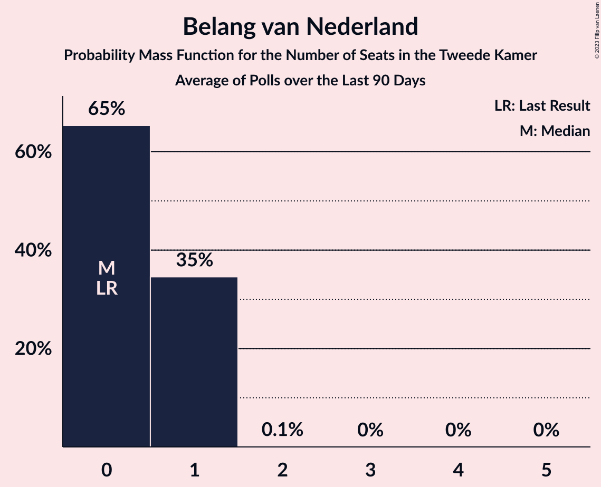

# Poll Average

<a href="#voting-intentions">Voting Intentions</a> | <a href="#seats">Seats</a> | <a href="#coalitions">Coalitions</a> | <a href="#technical-information">Technical Information</a>

## Summary

The table below lists the polls on which the average is based. They are the most recent polls (less than 90 days old) registered and analyzed so far.

| Period     | Polling firm/Commissioner(s) | VVD | D66 | PVV | CDA | SP | PvdA | GL | FvD | PvdD | CU | Volt | JA21 | SGP | DENK | 50+ | BBB | B1 | CO | Spl | PP | PvdT | BVNL | GL–PvdA | NSC |
|:----------:|:----------------------------:|:--:|:--:|:--:|:--:|:--:|:--:|:--:|:--:|:--:|:--:|:--:|:--:|:--:|:--:|:--:|:--:|:--:|:--:|:--:|:--:|:--:|:--:|:--:|:--:|
| 17 March 2021 | General Election | 21.9%   34 | 15.0%   24 | 10.8%   17 | 9.5%   15 | 6.0%   9 | 5.7%   9 | 5.2%   8 | 5.0%   8 | 3.8%   6 | 3.4%   5 | 2.4%   3 | 2.4%   3 | 2.1%   3 | 2.0%   3 | 1.0%   1 | 1.0%   1 | 0.8%   1 | 0.4%   0 | 0.3%   0 | 0.2%   0 | 0.0%   0 | 0.0%   0 | 10.9%   17 | 0.0%   0 |
| N/A | Poll Average | 15–19%   24–31 | 3–7%   4–11 | 10–13%   16–19 | 2–5%   4–6 | 2–4%   3–6 | N/A   N/A | N/A   N/A | 2–4%   2–6 | 3–6%   4–8 | 2–4%   3–6 | 2–3%   2–5 | 1–3%   1–3 | 1–3%   1–4 | 1–3%   1–4 | 0–1%   0–1 | 7–10%   11–16 | 0–2%   0–1 | N/A   N/A | N/A   N/A | N/A   N/A | N/A   N/A | 0–1%   0–1 | 12–20%   19–29 | 14–19%   22–29 |
| [22–25 September 2023](2023-09-25-IOResearch.html) | I&O Research | 15–19%   22–29 | 3–5%   3–6 | 10–13%   16–19 | 3–4%   4–6 | 3–5%   5–6 | N/A   N/A | N/A   N/A | 2–4%   4–6 | 3–5%   4–8 | 2–4%   3–5 | 2–3%   3–5 | 1–2%   1–3 | 2–4%   2–4 | 1–3%   2–4 | 0–1%   0–1 | 6–9%   11–14 | 0–1%   0 | N/A   N/A | N/A   N/A | N/A   N/A | N/A   N/A | 0–1%   0–1 | 16–20%   26–31 | 14–18%   22–27 |
| [22–24 September 2023](2023-09-24-Ipsos.html) | Ipsos   EenVandaag | 15–20%   24–31 | 5–8%   8–11 | 10–13%   15–18 | 2–4%   4–5 | 2–5%   3–7 | N/A   N/A | N/A   N/A | 2–3%   2–5 | 4–6%   6–8 | 2–5%   3–6 | 1–3%   2–4 | 1–3%   2–4 | 1–3%   2–6 | 2–3%   3–4 | 0–1%   0–1 | 7–10%   10–13 | 1–2%   1–2 | N/A   N/A | N/A   N/A | N/A   N/A | N/A   N/A | N/A   N/A | 11–16%   19–21 | 14–18%   22–29 |
| [22–23 September 2023](2023-09-23-Peilnl.html) | Peil.nl | 15–17%   24–26 | 4–5%   7 | 10–12%   16–18 | 3–5%   5–6 | 2–3%   4 | N/A   N/A | N/A   N/A | 3–4%   4–6 | 3–5%   6 | 2–3%   3 | 2–3%   4 | 1–2%   1 | 1–2%   1 | 1–2%   1–2 | 0–1%   0 | 8–10%   14–16 | 0%   0 | N/A   N/A | N/A   N/A | N/A   N/A | N/A   N/A | 0–1%   0–1 | 15–17%   24–27 | 17–19%   28–29 |
| 17 March 2021 | General Election | 21.9%   34 | 15.0%   24 | 10.8%   17 | 9.5%   15 | 6.0%   9 | 5.7%   9 | 5.2%   8 | 5.0%   8 | 3.8%   6 | 3.4%   5 | 2.4%   3 | 2.4%   3 | 2.1%   3 | 2.0%   3 | 1.0%   1 | 1.0%   1 | 0.8%   1 | 0.4%   0 | 0.3%   0 | 0.2%   0 | 0.0%   0 | 0.0%   0 | 10.9%   17 | 0.0%   0 |

Only polls for which at least the sample size has been published are included in the table above.

**Legend:**
+ **Top half of each row:** Voting intentions (95% confidence interval)
+ **Bottom half of each row:** Seat projections for the Tweede Kamer (95% confidence interval)
+ **VVD:** Volkspartij voor Vrijheid en Democratie
+ **D66:** Democraten 66
+ **PVV:** Partij voor de Vrijheid
+ **CDA:** Christen-Democratisch Appèl
+ **SP:** Socialistische Partij
+ **PvdA:** Partij van de Arbeid
+ **GL:** GroenLinks
+ **FvD:** Forum voor Democratie
+ **PvdD:** Partij voor de Dieren
+ **CU:** ChristenUnie
+ **Volt:** Volt Europa
+ **JA21:** Juiste Antwoord 2021
+ **SGP:** Staatkundig Gereformeerde Partij
+ **DENK:** DENK
+ **50+:** 50Plus
+ **BBB:** BoerBurgerBeweging
+ **B1:** Bij1
+ **CO:** Code Oranje
+ **Spl:** Splinter
+ **PP:** Piratenpartij
+ **PvdT:** Partij voor de Toekomst
+ **BVNL:** Belang van Nederland
+ **GL–PvdA:** GroenLinks–Partij van de Arbeid
+ **NSC:** Nieuw Sociaal Contract
+ **N/A (single party):** Party not included the published results
+ **N/A (entire row):** Calculation for this opinion poll not started yet

## Voting Intentions

### Confidence Intervals

| Party | Last Result | Median | 80% Confidence Interval | 90% Confidence Interval | 95% Confidence Interval | 99% Confidence Interval |
|:-----:|:-----------:|:------:|:-----------------------:|:-----------------------:|:-----------------------:|:-----------------------:|
| <a href="#volkspartij-voor-vrijheid-en-democratie">Volkspartij voor Vrijheid en Democratie</a> | 21.9% | 16.7% | 15.4–18.4% |15.1–18.8% | 14.9–19.2% | 14.4–20.0% |
| <a href="#democraten-66">Democraten 66</a> | 15.0% | 4.7% | 3.5–6.5% |3.2–6.9% | 3.0–7.3% | 2.7–7.9% |
| <a href="#groenlinks–partij-van-de-arbeid">GroenLinks–Partij van de Arbeid</a> | 10.9% | 15.9% | 12.8–18.6% |12.3–19.1% | 11.9–19.6% | 11.2–20.4% |
| <a href="#partij-voor-de-vrijheid">Partij voor de Vrijheid</a> | 10.8% | 11.4% | 10.4–12.5% |10.1–12.8% | 9.9–13.2% | 9.3–13.8% |
| <a href="#christen-democratisch-appèl">Christen-Democratisch Appèl</a> | 9.5% | 3.5% | 2.7–4.3% |2.5–4.5% | 2.3–4.6% | 2.0–4.9% |
| <a href="#socialistische-partij">Socialistische Partij</a> | 6.0% | 3.2% | 2.5–4.1% |2.4–4.3% | 2.2–4.5% | 2.0–4.9% |
| <a href="#partij-van-de-arbeid">Partij van de Arbeid</a> | 5.7% | N/A | N/A |N/A | N/A | N/A |
| <a href="#groenlinks">GroenLinks</a> | 5.2% | N/A | N/A |N/A | N/A | N/A |
| <a href="#forum-voor-democratie">Forum voor Democratie</a> | 5.0% | 3.0% | 2.2–3.7% |1.9–3.8% | 1.8–4.0% | 1.5–4.2% |
| <a href="#partij-voor-de-dieren">Partij voor de Dieren</a> | 3.8% | 4.2% | 3.6–5.3% |3.4–5.7% | 3.3–6.0% | 3.0–6.6% |
| <a href="#christenunie">ChristenUnie</a> | 3.4% | 2.9% | 2.3–3.8% |2.2–4.1% | 2.1–4.4% | 1.8–4.9% |
| <a href="#volt-europa">Volt Europa</a> | 2.4% | 2.4% | 1.8–3.0% |1.6–3.1% | 1.5–3.2% | 1.3–3.5% |
| <a href="#juiste-antwoord-2021">Juiste Antwoord 2021</a> | 2.4% | 1.4% | 0.9–2.5% |0.8–2.7% | 0.7–2.9% | 0.6–3.4% |
| <a href="#staatkundig-gereformeerde-partij">Staatkundig Gereformeerde Partij</a> | 2.1% | 2.0% | 1.2–3.0% |1.2–3.2% | 1.1–3.4% | 1.0–3.7% |
| <a href="#denk">DENK</a> | 2.0% | 1.7% | 1.2–2.7% |1.1–2.9% | 1.1–3.2% | 0.9–3.6% |
| <a href="#50plus">50Plus</a> | 1.0% | 0.6% | 0.3–0.9% |0.3–1.0% | 0.2–1.0% | 0.2–1.2% |
| <a href="#boerburgerbeweging">BoerBurgerBeweging</a> | 1.0% | 8.5% | 7.2–9.7% |6.9–10.0% | 6.7–10.2% | 6.3–10.6% |
| <a href="#bij1">Bij1</a> | 0.8% | 0.3% | 0.1–1.2% |0.1–1.4% | 0.1–1.6% | 0.1–1.9% |
| <a href="#code-oranje">Code Oranje</a> | 0.4% | N/A | N/A |N/A | N/A | N/A |
| <a href="#splinter">Splinter</a> | 0.3% | N/A | N/A |N/A | N/A | N/A |
| <a href="#piratenpartij">Piratenpartij</a> | 0.2% | N/A | N/A |N/A | N/A | N/A |
| <a href="#partij-voor-de-toekomst">Partij voor de Toekomst</a> | 0.0% | N/A | N/A |N/A | N/A | N/A |
| <a href="#belang-van-nederland">Belang van Nederland</a> | 0.0% | 0.7% | 0.4–0.9% |0.4–1.0% | 0.3–1.1% | 0.3–1.2% |
| <a href="#nieuw-sociaal-contract">Nieuw Sociaal Contract</a> | 0.0% | 16.6% | 14.8–18.4% |14.4–18.7% | 14.1–19.0% | 13.4–19.5% |

### Volkspartij voor Vrijheid en Democratie

*For a full overview of the results for this party, see the [Volkspartij voor Vrijheid en Democratie](party-volkspartijvoorvrijheidendemocratie.html) page.*

| Voting Intentions | Probability | Accumulated | Special Marks |
|:-----------------:|:-----------:|:-----------:|:-------------:|
| 12.5–13.5% | 0% | 100% |  |
| 13.5–14.5% | 0.9% | 100% |  |
| 14.5–15.5% | 12% | 99.1% |  |
| 15.5–16.5% | 32% | 87% |  |
| 16.5–17.5% | 29% | 56% | Median |
| 17.5–18.5% | 19% | 27% |  |
| 18.5–19.5% | 7% | 8% |  |
| 19.5–20.5% | 1.2% | 1.4% |  |
| 20.5–21.5% | 0.1% | 0.1% |  |
| 21.5–22.5% | 0% | 0% | Last Result |

### Democraten 66

*For a full overview of the results for this party, see the [Democraten 66](party-democraten66.html) page.*

| Voting Intentions | Probability | Accumulated | Special Marks |
|:-----------------:|:-----------:|:-----------:|:-------------:|
| 0.5–1.5% | 0% | 100% |  |
| 1.5–2.5% | 0.1% | 100% |  |
| 2.5–3.5% | 12% | 99.9% |  |
| 3.5–4.5% | 32% | 88% |  |
| 4.5–5.5% | 29% | 56% | Median |
| 5.5–6.5% | 17% | 27% |  |
| 6.5–7.5% | 8% | 10% |  |
| 7.5–8.5% | 1.2% | 1.3% |  |
| 8.5–9.5% | 0.1% | 0.1% |  |
| 9.5–10.5% | 0% | 0% |  |
| 10.5–11.5% | 0% | 0% |  |
| 11.5–12.5% | 0% | 0% |  |
| 12.5–13.5% | 0% | 0% |  |
| 13.5–14.5% | 0% | 0% |  |
| 14.5–15.5% | 0% | 0% | Last Result |

### GroenLinks–Partij van de Arbeid

*For a full overview of the results for this party, see the [GroenLinks–Partij van de Arbeid](party-groenlinks–partijvandearbeid.html) page.*

| Voting Intentions | Probability | Accumulated | Special Marks |
|:-----------------:|:-----------:|:-----------:|:-------------:|
| 8.5–9.5% | 0% | 100% |  |
| 9.5–10.5% | 0.1% | 100% |  |
| 10.5–11.5% | 1.2% | 99.9% | Last Result |
| 11.5–12.5% | 6% | 98.8% |  |
| 12.5–13.5% | 12% | 93% |  |
| 13.5–14.5% | 10% | 81% |  |
| 14.5–15.5% | 13% | 71% |  |
| 15.5–16.5% | 21% | 58% | Median |
| 16.5–17.5% | 14% | 37% |  |
| 17.5–18.5% | 13% | 24% |  |
| 18.5–19.5% | 8% | 11% |  |
| 19.5–20.5% | 2% | 3% |  |
| 20.5–21.5% | 0.3% | 0.3% |  |
| 21.5–22.5% | 0% | 0% |  |

### Partij voor de Vrijheid

*For a full overview of the results for this party, see the [Partij voor de Vrijheid](party-partijvoordevrijheid.html) page.*

| Voting Intentions | Probability | Accumulated | Special Marks |
|:-----------------:|:-----------:|:-----------:|:-------------:|
| 7.5–8.5% | 0% | 100% |  |
| 8.5–9.5% | 1.1% | 100% |  |
| 9.5–10.5% | 12% | 98.9% |  |
| 10.5–11.5% | 45% | 87% | Last Result, Median |
| 11.5–12.5% | 33% | 42% |  |
| 12.5–13.5% | 8% | 9% |  |
| 13.5–14.5% | 1.0% | 1.0% |  |
| 14.5–15.5% | 0.1% | 0.1% |  |
| 15.5–16.5% | 0% | 0% |  |

### Christen-Democratisch Appèl

*For a full overview of the results for this party, see the [Christen-Democratisch Appèl](party-christen-democratischappèl.html) page.*

| Voting Intentions | Probability | Accumulated | Special Marks |
|:-----------------:|:-----------:|:-----------:|:-------------:|
| 0.5–1.5% | 0% | 100% |  |
| 1.5–2.5% | 7% | 100% |  |
| 2.5–3.5% | 44% | 93% |  |
| 3.5–4.5% | 46% | 50% | Median |
| 4.5–5.5% | 3% | 3% |  |
| 5.5–6.5% | 0% | 0% |  |
| 6.5–7.5% | 0% | 0% |  |
| 7.5–8.5% | 0% | 0% |  |
| 8.5–9.5% | 0% | 0% |  |
| 9.5–10.5% | 0% | 0% | Last Result |

### Socialistische Partij

*For a full overview of the results for this party, see the [Socialistische Partij](party-socialistischepartij.html) page.*

| Voting Intentions | Probability | Accumulated | Special Marks |
|:-----------------:|:-----------:|:-----------:|:-------------:|
| 0.5–1.5% | 0% | 100% |  |
| 1.5–2.5% | 13% | 100% |  |
| 2.5–3.5% | 57% | 87% | Median |
| 3.5–4.5% | 28% | 30% |  |
| 4.5–5.5% | 2% | 2% |  |
| 5.5–6.5% | 0% | 0% | Last Result |

### Forum voor Democratie

*For a full overview of the results for this party, see the [Forum voor Democratie](party-forumvoordemocratie.html) page.*

| Voting Intentions | Probability | Accumulated | Special Marks |
|:-----------------:|:-----------:|:-----------:|:-------------:|
| 0.0–0.5% | 0% | 100% |  |
| 0.5–1.5% | 0.7% | 100% |  |
| 1.5–2.5% | 24% | 99.3% |  |
| 2.5–3.5% | 61% | 75% | Median |
| 3.5–4.5% | 14% | 14% |  |
| 4.5–5.5% | 0.1% | 0.1% | Last Result |
| 5.5–6.5% | 0% | 0% |  |

### Partij voor de Dieren

*For a full overview of the results for this party, see the [Partij voor de Dieren](party-partijvoordedieren.html) page.*

| Voting Intentions | Probability | Accumulated | Special Marks |
|:-----------------:|:-----------:|:-----------:|:-------------:|
| 1.5–2.5% | 0% | 100% |  |
| 2.5–3.5% | 9% | 100% |  |
| 3.5–4.5% | 59% | 91% | Last Result, Median |
| 4.5–5.5% | 25% | 32% |  |
| 5.5–6.5% | 6% | 7% |  |
| 6.5–7.5% | 0.5% | 0.5% |  |
| 7.5–8.5% | 0% | 0% |  |

### ChristenUnie

*For a full overview of the results for this party, see the [ChristenUnie](party-christenunie.html) page.*

| Voting Intentions | Probability | Accumulated | Special Marks |
|:-----------------:|:-----------:|:-----------:|:-------------:|
| 0.5–1.5% | 0% | 100% |  |
| 1.5–2.5% | 25% | 100% |  |
| 2.5–3.5% | 59% | 75% | Last Result, Median |
| 3.5–4.5% | 15% | 16% |  |
| 4.5–5.5% | 1.5% | 1.5% |  |
| 5.5–6.5% | 0% | 0% |  |

### Volt Europa

*For a full overview of the results for this party, see the [Volt Europa](party-volteuropa.html) page.*

| Voting Intentions | Probability | Accumulated | Special Marks |
|:-----------------:|:-----------:|:-----------:|:-------------:|
| 0.0–0.5% | 0% | 100% |  |
| 0.5–1.5% | 3% | 100% |  |
| 1.5–2.5% | 58% | 97% | Last Result, Median |
| 2.5–3.5% | 38% | 39% |  |
| 3.5–4.5% | 0.4% | 0.4% |  |
| 4.5–5.5% | 0% | 0% |  |

### Juiste Antwoord 2021

*For a full overview of the results for this party, see the [Juiste Antwoord 2021](party-juisteantwoord2021.html) page.*

| Voting Intentions | Probability | Accumulated | Special Marks |
|:-----------------:|:-----------:|:-----------:|:-------------:|
| 0.0–0.5% | 0.4% | 100% |  |
| 0.5–1.5% | 60% | 99.6% | Median |
| 1.5–2.5% | 31% | 39% | Last Result |
| 2.5–3.5% | 8% | 8% |  |
| 3.5–4.5% | 0.2% | 0.2% |  |
| 4.5–5.5% | 0% | 0% |  |

### Staatkundig Gereformeerde Partij

*For a full overview of the results for this party, see the [Staatkundig Gereformeerde Partij](party-staatkundiggereformeerdepartij.html) page.*

| Voting Intentions | Probability | Accumulated | Special Marks |
|:-----------------:|:-----------:|:-----------:|:-------------:|
| 0.0–0.5% | 0% | 100% |  |
| 0.5–1.5% | 30% | 100% |  |
| 1.5–2.5% | 43% | 70% | Last Result, Median |
| 2.5–3.5% | 25% | 27% |  |
| 3.5–4.5% | 1.1% | 1.1% |  |
| 4.5–5.5% | 0% | 0% |  |

### DENK

*For a full overview of the results for this party, see the [DENK](party-denk.html) page.*

| Voting Intentions | Probability | Accumulated | Special Marks |
|:-----------------:|:-----------:|:-----------:|:-------------:|
| 0.0–0.5% | 0% | 100% |  |
| 0.5–1.5% | 37% | 100% |  |
| 1.5–2.5% | 49% | 63% | Last Result, Median |
| 2.5–3.5% | 13% | 14% |  |
| 3.5–4.5% | 0.6% | 0.6% |  |
| 4.5–5.5% | 0% | 0% |  |

### 50Plus

*For a full overview of the results for this party, see the [50Plus](party-50plus.html) page.*

| Voting Intentions | Probability | Accumulated | Special Marks |
|:-----------------:|:-----------:|:-----------:|:-------------:|
| 0.0–0.5% | 44% | 100% |  |
| 0.5–1.5% | 56% | 56% | Last Result, Median |
| 1.5–2.5% | 0% | 0% |  |
| 2.5–3.5% | 0% | 0% |  |

### BoerBurgerBeweging

*For a full overview of the results for this party, see the [BoerBurgerBeweging](party-boerburgerbeweging.html) page.*

| Voting Intentions | Probability | Accumulated | Special Marks |
|:-----------------:|:-----------:|:-----------:|:-------------:|
| 0.5–1.5% | 0% | 100% | Last Result |
| 1.5–2.5% | 0% | 100% |  |
| 2.5–3.5% | 0% | 100% |  |
| 3.5–4.5% | 0% | 100% |  |
| 4.5–5.5% | 0% | 100% |  |
| 5.5–6.5% | 2% | 100% |  |
| 6.5–7.5% | 16% | 98% |  |
| 7.5–8.5% | 33% | 82% |  |
| 8.5–9.5% | 35% | 49% | Median |
| 9.5–10.5% | 13% | 14% |  |
| 10.5–11.5% | 0.7% | 0.7% |  |
| 11.5–12.5% | 0% | 0% |  |

### Bij1

*For a full overview of the results for this party, see the [Bij1](party-bij1.html) page.*

| Voting Intentions | Probability | Accumulated | Special Marks |
|:-----------------:|:-----------:|:-----------:|:-------------:|
| 0.0–0.5% | 64% | 100% | Median |
| 0.5–1.5% | 34% | 36% | Last Result |
| 1.5–2.5% | 3% | 3% |  |
| 2.5–3.5% | 0% | 0% |  |

### Belang van Nederland

*For a full overview of the results for this party, see the [Belang van Nederland](party-belangvannederland.html) page.*

| Voting Intentions | Probability | Accumulated | Special Marks |
|:-----------------:|:-----------:|:-----------:|:-------------:|
| 0.0–0.5% | 27% | 100% | Last Result |
| 0.5–1.5% | 73% | 73% | Median |
| 1.5–2.5% | 0% | 0% |  |

### Nieuw Sociaal Contract

*For a full overview of the results for this party, see the [Nieuw Sociaal Contract](party-nieuwsociaalcontract.html) page.*

| Voting Intentions | Probability | Accumulated | Special Marks |
|:-----------------:|:-----------:|:-----------:|:-------------:|
| 0.0–0.5% | 0% | 100% | Last Result |
| 0.5–1.5% | 0% | 100% |  |
| 1.5–2.5% | 0% | 100% |  |
| 2.5–3.5% | 0% | 100% |  |
| 3.5–4.5% | 0% | 100% |  |
| 4.5–5.5% | 0% | 100% |  |
| 5.5–6.5% | 0% | 100% |  |
| 6.5–7.5% | 0% | 100% |  |
| 7.5–8.5% | 0% | 100% |  |
| 8.5–9.5% | 0% | 100% |  |
| 9.5–10.5% | 0% | 100% |  |
| 10.5–11.5% | 0% | 100% |  |
| 11.5–12.5% | 0% | 100% |  |
| 12.5–13.5% | 0.7% | 100% |  |
| 13.5–14.5% | 6% | 99.2% |  |
| 14.5–15.5% | 18% | 94% |  |
| 15.5–16.5% | 25% | 76% |  |
| 16.5–17.5% | 23% | 51% | Median |
| 17.5–18.5% | 21% | 28% |  |
| 18.5–19.5% | 7% | 7% |  |
| 19.5–20.5% | 0.4% | 0.5% |  |
| 20.5–21.5% | 0% | 0% |  |

## Seats

### Confidence Intervals

| Party | Last Result | Median | 80% Confidence Interval | 90% Confidence Interval | 95% Confidence Interval | 99% Confidence Interval |
|:-----:|:-----------:|:------:|:-----------------------:|:-----------------------:|:-----------------------:|:-----------------------:|
| <a href="#volkspartij-voor-vrijheid-en-democratie">Volkspartij voor Vrijheid en Democratie</a> | 34 | 26 | 25–29 |24–31 | 24–31 | 22–31 |
| <a href="#democraten-66">Democraten 66</a> | 24 | 7 | 5–10 |4–10 | 4–11 | 3–12 |
| <a href="#groenlinks–partij-van-de-arbeid">GroenLinks–Partij van de Arbeid</a> | 17 | 25 | 20–27 |19–29 | 19–29 | 19–31 |
| <a href="#partij-voor-de-vrijheid">Partij voor de Vrijheid</a> | 17 | 18 | 16–18 |16–18 | 16–19 | 14–20 |
| <a href="#christen-democratisch-appèl">Christen-Democratisch Appèl</a> | 15 | 5 | 4–6 |4–6 | 4–6 | 3–6 |
| <a href="#socialistische-partij">Socialistische Partij</a> | 9 | 5 | 4–6 |3–6 | 3–6 | 3–7 |
| <a href="#partij-van-de-arbeid">Partij van de Arbeid</a> | 9 | N/A | N/A |N/A | N/A | N/A |
| <a href="#groenlinks">GroenLinks</a> | 8 | N/A | N/A |N/A | N/A | N/A |
| <a href="#forum-voor-democratie">Forum voor Democratie</a> | 8 | 4 | 3–4 |2–5 | 2–6 | 2–7 |
| <a href="#partij-voor-de-dieren">Partij voor de Dieren</a> | 6 | 7 | 6–8 |6–8 | 4–8 | 4–9 |
| <a href="#christenunie">ChristenUnie</a> | 5 | 4 | 3–6 |3–6 | 3–6 | 3–7 |
| <a href="#volt-europa">Volt Europa</a> | 3 | 4 | 2–5 |2–5 | 2–5 | 2–5 |
| <a href="#juiste-antwoord-2021">Juiste Antwoord 2021</a> | 3 | 2 | 1–3 |1–3 | 1–3 | 1–5 |
| <a href="#staatkundig-gereformeerde-partij">Staatkundig Gereformeerde Partij</a> | 3 | 2 | 1–4 |1–4 | 1–4 | 1–6 |
| <a href="#denk">DENK</a> | 3 | 2 | 2–4 |2–4 | 1–4 | 1–4 |
| <a href="#50plus">50Plus</a> | 1 | 0 | 0 |0 | 0–1 | 0–1 |
| <a href="#boerburgerbeweging">BoerBurgerBeweging</a> | 1 | 12 | 11–14 |11–14 | 11–16 | 9–16 |
| <a href="#bij1">Bij1</a> | 1 | 0 | 0–1 |0–1 | 0–1 | 0–2 |
| <a href="#code-oranje">Code Oranje</a> | 0 | N/A | N/A |N/A | N/A | N/A |
| <a href="#splinter">Splinter</a> | 0 | N/A | N/A |N/A | N/A | N/A |
| <a href="#piratenpartij">Piratenpartij</a> | 0 | N/A | N/A |N/A | N/A | N/A |
| <a href="#partij-voor-de-toekomst">Partij voor de Toekomst</a> | 0 | N/A | N/A |N/A | N/A | N/A |
| <a href="#belang-van-nederland">Belang van Nederland</a> | 0 | 1 | 0–1 |0–1 | 0–1 | 0–2 |
| <a href="#nieuw-sociaal-contract">Nieuw Sociaal Contract</a> | 0 | 25 | 22–29 |22–29 | 22–29 | 22–30 |

### Volkspartij voor Vrijheid en Democratie

*For a full overview of the results for this party, see the [Volkspartij voor Vrijheid en Democratie](party-volkspartijvoorvrijheidendemocratie.html) page.*

| Number of Seats | Probability | Accumulated | Special Marks |
|:---------------:|:-----------:|:-----------:|:-------------:|
| 21 | 0.3% | 100% |  |
| 22 | 1.4% | 99.7% |  |
| 23 | 0.2% | 98% |  |
| 24 | 6% | 98% |  |
| 25 | 5% | 93% |  |
| 26 | 50% | 87% | Median |
| 27 | 1.0% | 37% |  |
| 28 | 24% | 36% |  |
| 29 | 3% | 12% |  |
| 30 | 0.2% | 9% |  |
| 31 | 9% | 9% |  |
| 32 | 0.4% | 0.4% |  |
| 33 | 0% | 0% |  |
| 34 | 0% | 0% | Last Result |

### Democraten 66

*For a full overview of the results for this party, see the [Democraten 66](party-democraten66.html) page.*

| Number of Seats | Probability | Accumulated | Special Marks |
|:---------------:|:-----------:|:-----------:|:-------------:|
| 3 | 0.9% | 100% |  |
| 4 | 7% | 99.1% |  |
| 5 | 24% | 92% |  |
| 6 | 1.3% | 68% |  |
| 7 | 34% | 67% | Median |
| 8 | 0.9% | 33% |  |
| 9 | 0.9% | 32% |  |
| 10 | 29% | 31% |  |
| 11 | 2% | 3% |  |
| 12 | 0.5% | 0.7% |  |
| 13 | 0.2% | 0.2% |  |
| 14 | 0% | 0% |  |
| 15 | 0% | 0% |  |
| 16 | 0% | 0% |  |
| 17 | 0% | 0% |  |
| 18 | 0% | 0% |  |
| 19 | 0% | 0% |  |
| 20 | 0% | 0% |  |
| 21 | 0% | 0% |  |
| 22 | 0% | 0% |  |
| 23 | 0% | 0% |  |
| 24 | 0% | 0% | Last Result |

### GroenLinks–Partij van de Arbeid

*For a full overview of the results for this party, see the [GroenLinks–Partij van de Arbeid](party-groenlinks–partijvandearbeid.html) page.*

| Number of Seats | Probability | Accumulated | Special Marks |
|:---------------:|:-----------:|:-----------:|:-------------:|
| 16 | 0.1% | 100% |  |
| 17 | 0.1% | 99.9% | Last Result |
| 18 | 0.2% | 99.8% |  |
| 19 | 9% | 99.6% |  |
| 20 | 22% | 90% |  |
| 21 | 1.2% | 69% |  |
| 22 | 0.6% | 67% |  |
| 23 | 0.3% | 67% |  |
| 24 | 0.8% | 67% |  |
| 25 | 31% | 66% | Median |
| 26 | 1.5% | 35% |  |
| 27 | 28% | 34% |  |
| 28 | 0.2% | 6% |  |
| 29 | 4% | 6% |  |
| 30 | 1.3% | 2% |  |
| 31 | 0.9% | 0.9% |  |
| 32 | 0% | 0% |  |

### Partij voor de Vrijheid

*For a full overview of the results for this party, see the [Partij voor de Vrijheid](party-partijvoordevrijheid.html) page.*

| Number of Seats | Probability | Accumulated | Special Marks |
|:---------------:|:-----------:|:-----------:|:-------------:|
| 13 | 0.2% | 100% |  |
| 14 | 0.5% | 99.8% |  |
| 15 | 1.0% | 99.4% |  |
| 16 | 13% | 98% |  |
| 17 | 24% | 85% | Last Result |
| 18 | 58% | 61% | Median |
| 19 | 2% | 3% |  |
| 20 | 0.5% | 0.6% |  |
| 21 | 0.1% | 0.1% |  |
| 22 | 0% | 0% |  |

### Christen-Democratisch Appèl

*For a full overview of the results for this party, see the [Christen-Democratisch Appèl](party-christen-democratischappèl.html) page.*

| Number of Seats | Probability | Accumulated | Special Marks |
|:---------------:|:-----------:|:-----------:|:-------------:|
| 2 | 0% | 100% |  |
| 3 | 0.6% | 99.9% |  |
| 4 | 35% | 99.3% |  |
| 5 | 27% | 64% | Median |
| 6 | 36% | 37% |  |
| 7 | 0.3% | 0.4% |  |
| 8 | 0.1% | 0.1% |  |
| 9 | 0% | 0% |  |
| 10 | 0% | 0% |  |
| 11 | 0% | 0% |  |
| 12 | 0% | 0% |  |
| 13 | 0% | 0% |  |
| 14 | 0% | 0% |  |
| 15 | 0% | 0% | Last Result |

### Socialistische Partij

*For a full overview of the results for this party, see the [Socialistische Partij](party-socialistischepartij.html) page.*

| Number of Seats | Probability | Accumulated | Special Marks |
|:---------------:|:-----------:|:-----------:|:-------------:|
| 3 | 10% | 100% |  |
| 4 | 35% | 90% |  |
| 5 | 9% | 55% | Median |
| 6 | 44% | 47% |  |
| 7 | 2% | 2% |  |
| 8 | 0.5% | 0.5% |  |
| 9 | 0% | 0% | Last Result |

### Partij van de Arbeid

*For a full overview of the results for this party, see the [Partij van de Arbeid](party-partijvandearbeid.html) page.*

### GroenLinks

*For a full overview of the results for this party, see the [GroenLinks](party-groenlinks.html) page.*

### Forum voor Democratie

*For a full overview of the results for this party, see the [Forum voor Democratie](party-forumvoordemocratie.html) page.*

| Number of Seats | Probability | Accumulated | Special Marks |
|:---------------:|:-----------:|:-----------:|:-------------:|
| 1 | 0.2% | 100% |  |
| 2 | 9% | 99.8% |  |
| 3 | 3% | 91% |  |
| 4 | 80% | 88% | Median |
| 5 | 4% | 8% |  |
| 6 | 3% | 4% |  |
| 7 | 0.9% | 0.9% |  |
| 8 | 0% | 0% | Last Result |

### Partij voor de Dieren

*For a full overview of the results for this party, see the [Partij voor de Dieren](party-partijvoordedieren.html) page.*

| Number of Seats | Probability | Accumulated | Special Marks |
|:---------------:|:-----------:|:-----------:|:-------------:|
| 4 | 4% | 100% |  |
| 5 | 0.8% | 96% |  |
| 6 | 36% | 96% | Last Result |
| 7 | 37% | 60% | Median |
| 8 | 22% | 23% |  |
| 9 | 0.5% | 0.6% |  |
| 10 | 0.1% | 0.1% |  |
| 11 | 0% | 0% |  |

### ChristenUnie

*For a full overview of the results for this party, see the [ChristenUnie](party-christenunie.html) page.*

| Number of Seats | Probability | Accumulated | Special Marks |
|:---------------:|:-----------:|:-----------:|:-------------:|
| 2 | 0.1% | 100% |  |
| 3 | 44% | 99.9% |  |
| 4 | 30% | 55% | Median |
| 5 | 4% | 25% | Last Result |
| 6 | 20% | 21% |  |
| 7 | 0.6% | 0.7% |  |
| 8 | 0.2% | 0.2% |  |
| 9 | 0% | 0% |  |

### Volt Europa

*For a full overview of the results for this party, see the [Volt Europa](party-volteuropa.html) page.*

| Number of Seats | Probability | Accumulated | Special Marks |
|:---------------:|:-----------:|:-----------:|:-------------:|
| 1 | 0.2% | 100% |  |
| 2 | 21% | 99.8% |  |
| 3 | 18% | 79% | Last Result |
| 4 | 34% | 61% | Median |
| 5 | 27% | 27% |  |
| 6 | 0.1% | 0.1% |  |
| 7 | 0% | 0% |  |

### Juiste Antwoord 2021

*For a full overview of the results for this party, see the [Juiste Antwoord 2021](party-juisteantwoord2021.html) page.*

| Number of Seats | Probability | Accumulated | Special Marks |
|:---------------:|:-----------:|:-----------:|:-------------:|
| 1 | 41% | 100% |  |
| 2 | 12% | 59% | Median |
| 3 | 46% | 47% | Last Result |
| 4 | 0.4% | 1.0% |  |
| 5 | 0.5% | 0.5% |  |
| 6 | 0% | 0% |  |

### Staatkundig Gereformeerde Partij

*For a full overview of the results for this party, see the [Staatkundig Gereformeerde Partij](party-staatkundiggereformeerdepartij.html) page.*

| Number of Seats | Probability | Accumulated | Special Marks |
|:---------------:|:-----------:|:-----------:|:-------------:|
| 1 | 33% | 100% |  |
| 2 | 24% | 67% | Median |
| 3 | 6% | 43% | Last Result |
| 4 | 35% | 37% |  |
| 5 | 0.3% | 2% |  |
| 6 | 2% | 2% |  |
| 7 | 0% | 0% |  |

### DENK

*For a full overview of the results for this party, see the [DENK](party-denk.html) page.*

| Number of Seats | Probability | Accumulated | Special Marks |
|:---------------:|:-----------:|:-----------:|:-------------:|
| 1 | 3% | 100% |  |
| 2 | 56% | 97% | Median |
| 3 | 18% | 41% | Last Result |
| 4 | 22% | 23% |  |
| 5 | 0.4% | 0.4% |  |
| 6 | 0% | 0% |  |

### 50Plus

*For a full overview of the results for this party, see the [50Plus](party-50plus.html) page.*

| Number of Seats | Probability | Accumulated | Special Marks |
|:---------------:|:-----------:|:-----------:|:-------------:|
| 0 | 95% | 100% | Median |
| 1 | 4% | 5% | Last Result |
| 2 | 0.2% | 0.2% |  |
| 3 | 0% | 0% |  |

### BoerBurgerBeweging

*For a full overview of the results for this party, see the [BoerBurgerBeweging](party-boerburgerbeweging.html) page.*

| Number of Seats | Probability | Accumulated | Special Marks |
|:---------------:|:-----------:|:-----------:|:-------------:|
| 1 | 0% | 100% | Last Result |
| 2 | 0% | 100% |  |
| 3 | 0% | 100% |  |
| 4 | 0% | 100% |  |
| 5 | 0% | 100% |  |
| 6 | 0% | 100% |  |
| 7 | 0% | 100% |  |
| 8 | 0% | 100% |  |
| 9 | 0.6% | 100% |  |
| 10 | 0.8% | 99.4% |  |
| 11 | 36% | 98.6% |  |
| 12 | 26% | 63% | Median |
| 13 | 2% | 37% |  |
| 14 | 31% | 35% |  |
| 15 | 0.8% | 3% |  |
| 16 | 3% | 3% |  |
| 17 | 0% | 0% |  |

### Bij1

*For a full overview of the results for this party, see the [Bij1](party-bij1.html) page.*

| Number of Seats | Probability | Accumulated | Special Marks |
|:---------------:|:-----------:|:-----------:|:-------------:|
| 0 | 66% | 100% | Median |
| 1 | 33% | 34% | Last Result |
| 2 | 0.9% | 0.9% |  |
| 3 | 0.1% | 0.1% |  |
| 4 | 0% | 0% |  |

### Code Oranje

*For a full overview of the results for this party, see the [Code Oranje](party-codeoranje.html) page.*

### Splinter

*For a full overview of the results for this party, see the [Splinter](party-splinter.html) page.*

### Piratenpartij

*For a full overview of the results for this party, see the [Piratenpartij](party-piratenpartij.html) page.*

### Partij voor de Toekomst

*For a full overview of the results for this party, see the [Partij voor de Toekomst](party-partijvoordetoekomst.html) page.*

### Belang van Nederland

*For a full overview of the results for this party, see the [Belang van Nederland](party-belangvannederland.html) page.*

| Number of Seats | Probability | Accumulated | Special Marks |
|:---------------:|:-----------:|:-----------:|:-------------:|
| 0 | 47% | 100% | Last Result |
| 1 | 52% | 53% | Median |
| 2 | 1.0% | 1.0% |  |
| 3 | 0% | 0% |  |

### Nieuw Sociaal Contract

*For a full overview of the results for this party, see the [Nieuw Sociaal Contract](party-nieuwsociaalcontract.html) page.*

| Number of Seats | Probability | Accumulated | Special Marks |
|:---------------:|:-----------:|:-----------:|:-------------:|
| 0 | 0% | 100% | Last Result |
| 1 | 0% | 100% |  |
| 2 | 0% | 100% |  |
| 3 | 0% | 100% |  |
| 4 | 0% | 100% |  |
| 5 | 0% | 100% |  |
| 6 | 0% | 100% |  |
| 7 | 0% | 100% |  |
| 8 | 0% | 100% |  |
| 9 | 0% | 100% |  |
| 10 | 0% | 100% |  |
| 11 | 0% | 100% |  |
| 12 | 0% | 100% |  |
| 13 | 0% | 100% |  |
| 14 | 0% | 100% |  |
| 15 | 0% | 100% |  |
| 16 | 0% | 100% |  |
| 17 | 0% | 100% |  |
| 18 | 0% | 100% |  |
| 19 | 0% | 100% |  |
| 20 | 0.1% | 100% |  |
| 21 | 0.3% | 99.9% |  |
| 22 | 27% | 99.6% |  |
| 23 | 22% | 73% |  |
| 24 | 0.3% | 51% |  |
| 25 | 2% | 50% | Median |
| 26 | 2% | 48% |  |
| 27 | 4% | 46% |  |
| 28 | 30% | 42% |  |
| 29 | 11% | 12% |  |
| 30 | 0.5% | 0.5% |  |
| 31 | 0% | 0.1% |  |
| 32 | 0% | 0% |  |

## Coalitions

### Confidence Intervals

| Coalition | Last Result | Median | Majority? | 80% Confidence Interval | 90% Confidence Interval | 95% Confidence Interval | 99% Confidence Interval |
|:---------:|:-----------:|:------:|:---------:|:-----------------------:|:-----------------------:|:-----------------------:|:-----------------------:|
| Volkspartij voor Vrijheid en Democratie – GroenLinks–Partij van de Arbeid – Christen-Democratisch Appèl – BoerBurgerBeweging | 67 | 70 | 0% | 63–72 | 63–72 | 60–72 | 59–73 |
| Volkspartij voor Vrijheid en Democratie – GroenLinks–Partij van de Arbeid – BoerBurgerBeweging | 52 | 65 | 0% | 58–66 | 58–67 | 56–67 | 55–68 |
| Volkspartij voor Vrijheid en Democratie – Democraten 66 – GroenLinks–Partij van de Arbeid | 75 | 58 | 0% | 56–60 | 56–60 | 55–60 | 52–62 |
| Volkspartij voor Vrijheid en Democratie – GroenLinks–Partij van de Arbeid – Christen-Democratisch Appèl | 66 | 57 | 0% | 51–59 | 51–60 | 49–60 | 48–60 |
| Volkspartij voor Vrijheid en Democratie – Partij voor de Vrijheid – Christen-Democratisch Appèl – Forum voor Democratie – Staatkundig Gereformeerde Partij | 77 | 55 | 0% | 54–58 | 53–58 | 52–59 | 51–60 |
| Volkspartij voor Vrijheid en Democratie – Partij voor de Vrijheid – Christen-Democratisch Appèl – Forum voor Democratie | 74 | 54 | 0% | 52–54 | 50–54 | 49–56 | 47–57 |
| Volkspartij voor Vrijheid en Democratie – GroenLinks–Partij van de Arbeid | 51 | 51 | 0% | 46–55 | 46–55 | 44–55 | 43–56 |
| Volkspartij voor Vrijheid en Democratie – Partij voor de Vrijheid – Christen-Democratisch Appèl | 66 | 50 | 0% | 48–51 | 45–51 | 45–52 | 44–53 |
| Democraten 66 – GroenLinks–Partij van de Arbeid – Christen-Democratisch Appèl – Socialistische Partij – ChristenUnie | 70 | 46 | 0% | 42–47 | 39–48 | 39–49 | 39–50 |
| Volkspartij voor Vrijheid en Democratie – Democraten 66 – Christen-Democratisch Appèl – ChristenUnie | 78 | 42 | 0% | 40–47 | 39–48 | 39–48 | 35–52 |
| Volkspartij voor Vrijheid en Democratie – Christen-Democratisch Appèl – Partij van de Arbeid – GroenLinks – BoerBurgerBeweging | 67 | 43 | 0% | 43–46 | 41–46 | 40–46 | 38–48 |
| Volkspartij voor Vrijheid en Democratie – Christen-Democratisch Appèl – BoerBurgerBeweging | 50 | 43 | 0% | 43–46 | 41–46 | 40–46 | 38–48 |
| Volkspartij voor Vrijheid en Democratie – Democraten 66 – Christen-Democratisch Appèl | 73 | 39 | 0% | 37–42 | 35–45 | 34–45 | 32–45 |
| Democraten 66 – GroenLinks–Partij van de Arbeid – Christen-Democratisch Appèl – ChristenUnie | 61 | 41 | 0% | 38–41 | 36–43 | 36–44 | 36–45 |
| GroenLinks–Partij van de Arbeid – BoerBurgerBeweging | 18 | 38 | 0% | 31–39 | 30–41 | 30–43 | 30–45 |
| Volkspartij voor Vrijheid en Democratie – Partij van de Arbeid – GroenLinks – BoerBurgerBeweging | 52 | 39 | 0% | 38–41 | 36–42 | 35–42 | 32–43 |
| Volkspartij voor Vrijheid en Democratie – Christen-Democratisch Appèl – Forum voor Democratie – Staatkundig Gereformeerde Partij – 50Plus | 61 | 37 | 0% | 37–41 | 37–41 | 36–41 | 34–44 |
| Volkspartij voor Vrijheid en Democratie – Christen-Democratisch Appèl – Forum voor Democratie – Staatkundig Gereformeerde Partij | 60 | 37 | 0% | 37–41 | 37–41 | 36–41 | 34–44 |
| Volkspartij voor Vrijheid en Democratie – Democraten 66 – Partij van de Arbeid – GroenLinks | 75 | 33 | 0% | 31–38 | 29–41 | 29–41 | 27–41 |
| Democraten 66 – GroenLinks–Partij van de Arbeid – Christen-Democratisch Appèl | 56 | 36 | 0% | 34–38 | 33–39 | 33–40 | 32–41 |
| GroenLinks–Partij van de Arbeid – Christen-Democratisch Appèl – ChristenUnie | 37 | 34 | 0% | 29–35 | 26–39 | 26–39 | 26–41 |
| Volkspartij voor Vrijheid en Democratie – Christen-Democratisch Appèl – Forum voor Democratie – 50Plus | 58 | 36 | 0% | 35–37 | 35–37 | 32–38 | 31–41 |
| Volkspartij voor Vrijheid en Democratie – Christen-Democratisch Appèl – Forum voor Democratie | 57 | 36 | 0% | 35–37 | 34–37 | 32–37 | 30–41 |
| Volkspartij voor Vrijheid en Democratie – Christen-Democratisch Appèl – Partij van de Arbeid – GroenLinks | 66 | 32 | 0% | 31–34 | 29–35 | 29–35 | 27–35 |
| Volkspartij voor Vrijheid en Democratie – Christen-Democratisch Appèl | 49 | 32 | 0% | 31–34 | 29–35 | 29–35 | 27–35 |
| GroenLinks–Partij van de Arbeid – Christen-Democratisch Appèl | 32 | 31 | 0% | 25–31 | 23–35 | 23–35 | 23–36 |
| Volkspartij voor Vrijheid en Democratie – Partij van de Arbeid – GroenLinks | 51 | 26 | 0% | 25–29 | 24–31 | 24–31 | 22–31 |
| Democraten 66 – Christen-Democratisch Appèl – Socialistische Partij – Partij van de Arbeid – GroenLinks – ChristenUnie | 70 | 20 | 0% | 19–27 | 19–27 | 18–27 | 17–28 |
| Democraten 66 – Christen-Democratisch Appèl – Partij van de Arbeid – GroenLinks – ChristenUnie | 61 | 16 | 0% | 13–21 | 13–21 | 12–21 | 12–23 |
| Partij van de Arbeid – GroenLinks – BoerBurgerBeweging | 18 | 12 | 0% | 11–14 | 11–14 | 11–16 | 9–16 |
| Democraten 66 – Christen-Democratisch Appèl | 39 | 13 | 0% | 9–15 | 9–15 | 9–16 | 8–16 |
| Democraten 66 – Christen-Democratisch Appèl – Partij van de Arbeid – GroenLinks | 56 | 13 | 0% | 9–15 | 9–15 | 9–16 | 8–16 |
| Christen-Democratisch Appèl – Partij van de Arbeid – GroenLinks – ChristenUnie | 37 | 9 | 0% | 8–11 | 7–11 | 7–11 | 7–11 |
| Christen-Democratisch Appèl – Partij van de Arbeid – GroenLinks | 32 | 5 | 0% | 4–6 | 4–6 | 4–6 | 3–6 |

### Volkspartij voor Vrijheid en Democratie – GroenLinks–Partij van de Arbeid – Christen-Democratisch Appèl – BoerBurgerBeweging

| Number of Seats | Probability | Accumulated | Special Marks |
|:---------------:|:-----------:|:-----------:|:-------------:|
| 58 | 0.3% | 100% |  |
| 59 | 0.3% | 99.7% |  |
| 60 | 2% | 99.4% |  |
| 61 | 0.6% | 97% |  |
| 62 | 0.3% | 97% |  |
| 63 | 20% | 97% |  |
| 64 | 0.3% | 76% |  |
| 65 | 9% | 76% |  |
| 66 | 0.3% | 67% |  |
| 67 | 1.0% | 67% | Last Result |
| 68 | 0.3% | 66% | Median |
| 69 | 0.6% | 66% |  |
| 70 | 24% | 65% |  |
| 71 | 31% | 42% |  |
| 72 | 9% | 10% |  |
| 73 | 1.3% | 2% |  |
| 74 | 0.1% | 0.2% |  |
| 75 | 0.1% | 0.1% |  |
| 76 | 0% | 0% | Majority |

### Volkspartij voor Vrijheid en Democratie – GroenLinks–Partij van de Arbeid – BoerBurgerBeweging

| Number of Seats | Probability | Accumulated | Special Marks |
|:---------------:|:-----------:|:-----------:|:-------------:|
| 52 | 0% | 100% | Last Result |
| 53 | 0.1% | 99.9% |  |
| 54 | 0.3% | 99.9% |  |
| 55 | 2% | 99.6% |  |
| 56 | 0.6% | 98% |  |
| 57 | 0.4% | 97% |  |
| 58 | 20% | 97% |  |
| 59 | 0.7% | 77% |  |
| 60 | 0.1% | 76% |  |
| 61 | 9% | 76% |  |
| 62 | 0.1% | 67% |  |
| 63 | 1.0% | 67% | Median |
| 64 | 0.5% | 66% |  |
| 65 | 32% | 65% |  |
| 66 | 27% | 34% |  |
| 67 | 5% | 7% |  |
| 68 | 2% | 2% |  |
| 69 | 0% | 0.1% |  |
| 70 | 0% | 0.1% |  |
| 71 | 0.1% | 0.1% |  |
| 72 | 0% | 0% |  |

### Volkspartij voor Vrijheid en Democratie – Democraten 66 – GroenLinks–Partij van de Arbeid

| Number of Seats | Probability | Accumulated | Special Marks |
|:---------------:|:-----------:|:-----------:|:-------------:|
| 49 | 0% | 100% |  |
| 50 | 0.2% | 99.9% |  |
| 51 | 0.1% | 99.7% |  |
| 52 | 0.4% | 99.7% |  |
| 53 | 0.1% | 99.2% |  |
| 54 | 0.4% | 99.1% |  |
| 55 | 2% | 98.7% |  |
| 56 | 20% | 96% |  |
| 57 | 2% | 76% |  |
| 58 | 38% | 74% | Median |
| 59 | 1.1% | 36% |  |
| 60 | 34% | 35% |  |
| 61 | 0.4% | 1.2% |  |
| 62 | 0.6% | 0.8% |  |
| 63 | 0.1% | 0.2% |  |
| 64 | 0% | 0.1% |  |
| 65 | 0% | 0.1% |  |
| 66 | 0.1% | 0.1% |  |
| 67 | 0% | 0% |  |
| 68 | 0% | 0% |  |
| 69 | 0% | 0% |  |
| 70 | 0% | 0% |  |
| 71 | 0% | 0% |  |
| 72 | 0% | 0% |  |
| 73 | 0% | 0% |  |
| 74 | 0% | 0% |  |
| 75 | 0% | 0% | Last Result |

### Volkspartij voor Vrijheid en Democratie – GroenLinks–Partij van de Arbeid – Christen-Democratisch Appèl

| Number of Seats | Probability | Accumulated | Special Marks |
|:---------------:|:-----------:|:-----------:|:-------------:|
| 45 | 0.1% | 100% |  |
| 46 | 0.1% | 99.9% |  |
| 47 | 0.3% | 99.8% |  |
| 48 | 0.2% | 99.6% |  |
| 49 | 2% | 99.4% |  |
| 50 | 0.2% | 97% |  |
| 51 | 20% | 97% |  |
| 52 | 0.1% | 77% |  |
| 53 | 0.2% | 77% |  |
| 54 | 10% | 76% |  |
| 55 | 0.4% | 66% |  |
| 56 | 3% | 66% | Median |
| 57 | 30% | 63% |  |
| 58 | 1.1% | 32% |  |
| 59 | 23% | 31% |  |
| 60 | 8% | 8% |  |
| 61 | 0% | 0.2% |  |
| 62 | 0% | 0.2% |  |
| 63 | 0% | 0.2% |  |
| 64 | 0.1% | 0.1% |  |
| 65 | 0% | 0% |  |
| 66 | 0% | 0% | Last Result |

### Volkspartij voor Vrijheid en Democratie – Partij voor de Vrijheid – Christen-Democratisch Appèl – Forum voor Democratie – Staatkundig Gereformeerde Partij

| Number of Seats | Probability | Accumulated | Special Marks |
|:---------------:|:-----------:|:-----------:|:-------------:|
| 48 | 0% | 100% |  |
| 49 | 0.2% | 99.9% |  |
| 50 | 0.3% | 99.8% |  |
| 51 | 0.4% | 99.5% |  |
| 52 | 4% | 99.1% |  |
| 53 | 0.7% | 95% |  |
| 54 | 21% | 95% |  |
| 55 | 36% | 74% | Median |
| 56 | 0.6% | 37% |  |
| 57 | 9% | 37% |  |
| 58 | 24% | 27% |  |
| 59 | 2% | 4% |  |
| 60 | 1.3% | 2% |  |
| 61 | 0.1% | 0.4% |  |
| 62 | 0.3% | 0.3% |  |
| 63 | 0% | 0% |  |
| 64 | 0% | 0% |  |
| 65 | 0% | 0% |  |
| 66 | 0% | 0% |  |
| 67 | 0% | 0% |  |
| 68 | 0% | 0% |  |
| 69 | 0% | 0% |  |
| 70 | 0% | 0% |  |
| 71 | 0% | 0% |  |
| 72 | 0% | 0% |  |
| 73 | 0% | 0% |  |
| 74 | 0% | 0% |  |
| 75 | 0% | 0% |  |
| 76 | 0% | 0% | Majority |
| 77 | 0% | 0% | Last Result |

### Volkspartij voor Vrijheid en Democratie – Partij voor de Vrijheid – Christen-Democratisch Appèl – Forum voor Democratie

| Number of Seats | Probability | Accumulated | Special Marks |
|:---------------:|:-----------:|:-----------:|:-------------:|
| 45 | 0.2% | 100% |  |
| 46 | 0.2% | 99.8% |  |
| 47 | 0.2% | 99.6% |  |
| 48 | 0.5% | 99.4% |  |
| 49 | 3% | 99.0% |  |
| 50 | 1.3% | 96% |  |
| 51 | 3% | 95% |  |
| 52 | 21% | 92% |  |
| 53 | 13% | 71% | Median |
| 54 | 54% | 58% |  |
| 55 | 0.8% | 4% |  |
| 56 | 2% | 4% |  |
| 57 | 1.0% | 1.4% |  |
| 58 | 0.4% | 0.4% |  |
| 59 | 0% | 0% |  |
| 60 | 0% | 0% |  |
| 61 | 0% | 0% |  |
| 62 | 0% | 0% |  |
| 63 | 0% | 0% |  |
| 64 | 0% | 0% |  |
| 65 | 0% | 0% |  |
| 66 | 0% | 0% |  |
| 67 | 0% | 0% |  |
| 68 | 0% | 0% |  |
| 69 | 0% | 0% |  |
| 70 | 0% | 0% |  |
| 71 | 0% | 0% |  |
| 72 | 0% | 0% |  |
| 73 | 0% | 0% |  |
| 74 | 0% | 0% | Last Result |

### Volkspartij voor Vrijheid en Democratie – GroenLinks–Partij van de Arbeid

| Number of Seats | Probability | Accumulated | Special Marks |
|:---------------:|:-----------:|:-----------:|:-------------:|
| 39 | 0.1% | 100% |  |
| 40 | 0% | 99.9% |  |
| 41 | 0.1% | 99.9% |  |
| 42 | 0.2% | 99.8% |  |
| 43 | 0.2% | 99.7% |  |
| 44 | 2% | 99.5% |  |
| 45 | 0.1% | 97% |  |
| 46 | 20% | 97% |  |
| 47 | 0.2% | 77% |  |
| 48 | 0.1% | 77% |  |
| 49 | 0.5% | 76% |  |
| 50 | 10% | 76% |  |
| 51 | 33% | 66% | Last Result, Median |
| 52 | 0.3% | 33% |  |
| 53 | 1.1% | 32% |  |
| 54 | 6% | 31% |  |
| 55 | 24% | 26% |  |
| 56 | 2% | 2% |  |
| 57 | 0% | 0.1% |  |
| 58 | 0% | 0.1% |  |
| 59 | 0% | 0.1% |  |
| 60 | 0.1% | 0.1% |  |
| 61 | 0% | 0% |  |

### Volkspartij voor Vrijheid en Democratie – Partij voor de Vrijheid – Christen-Democratisch Appèl

| Number of Seats | Probability | Accumulated | Special Marks |
|:---------------:|:-----------:|:-----------:|:-------------:|
| 42 | 0.2% | 100% |  |
| 43 | 0.3% | 99.8% |  |
| 44 | 1.5% | 99.5% |  |
| 45 | 4% | 98% |  |
| 46 | 2% | 94% |  |
| 47 | 2% | 92% |  |
| 48 | 20% | 90% |  |
| 49 | 4% | 70% | Median |
| 50 | 55% | 67% |  |
| 51 | 9% | 12% |  |
| 52 | 2% | 3% |  |
| 53 | 0.3% | 0.6% |  |
| 54 | 0.3% | 0.4% |  |
| 55 | 0% | 0% |  |
| 56 | 0% | 0% |  |
| 57 | 0% | 0% |  |
| 58 | 0% | 0% |  |
| 59 | 0% | 0% |  |
| 60 | 0% | 0% |  |
| 61 | 0% | 0% |  |
| 62 | 0% | 0% |  |
| 63 | 0% | 0% |  |
| 64 | 0% | 0% |  |
| 65 | 0% | 0% |  |
| 66 | 0% | 0% | Last Result |

### Democraten 66 – GroenLinks–Partij van de Arbeid – Christen-Democratisch Appèl – Socialistische Partij – ChristenUnie

| Number of Seats | Probability | Accumulated | Special Marks |
|:---------------:|:-----------:|:-----------:|:-------------:|
| 39 | 9% | 100% |  |
| 40 | 0.2% | 91% |  |
| 41 | 0.4% | 91% |  |
| 42 | 0.7% | 91% |  |
| 43 | 0.5% | 90% |  |
| 44 | 4% | 89% |  |
| 45 | 31% | 85% |  |
| 46 | 26% | 55% | Median |
| 47 | 20% | 28% |  |
| 48 | 5% | 8% |  |
| 49 | 1.0% | 3% |  |
| 50 | 1.3% | 2% |  |
| 51 | 0% | 0.4% |  |
| 52 | 0% | 0.3% |  |
| 53 | 0.3% | 0.3% |  |
| 54 | 0% | 0% |  |
| 55 | 0% | 0% |  |
| 56 | 0% | 0% |  |
| 57 | 0% | 0% |  |
| 58 | 0% | 0% |  |
| 59 | 0% | 0% |  |
| 60 | 0% | 0% |  |
| 61 | 0% | 0% |  |
| 62 | 0% | 0% |  |
| 63 | 0% | 0% |  |
| 64 | 0% | 0% |  |
| 65 | 0% | 0% |  |
| 66 | 0% | 0% |  |
| 67 | 0% | 0% |  |
| 68 | 0% | 0% |  |
| 69 | 0% | 0% |  |
| 70 | 0% | 0% | Last Result |

### Volkspartij voor Vrijheid en Democratie – Democraten 66 – Christen-Democratisch Appèl – ChristenUnie

| Number of Seats | Probability | Accumulated | Special Marks |
|:---------------:|:-----------:|:-----------:|:-------------:|
| 35 | 0.9% | 100% |  |
| 36 | 0% | 99.1% |  |
| 37 | 0.4% | 99.1% |  |
| 38 | 0.1% | 98.7% |  |
| 39 | 8% | 98.6% |  |
| 40 | 1.3% | 91% |  |
| 41 | 25% | 89% |  |
| 42 | 31% | 64% | Median |
| 43 | 0.8% | 33% |  |
| 44 | 0.6% | 33% |  |
| 45 | 2% | 32% |  |
| 46 | 0.2% | 30% |  |
| 47 | 20% | 30% |  |
| 48 | 9% | 10% |  |
| 49 | 0.4% | 1.2% |  |
| 50 | 0.1% | 0.8% |  |
| 51 | 0.2% | 0.7% |  |
| 52 | 0.5% | 0.5% |  |
| 53 | 0% | 0% |  |
| 54 | 0% | 0% |  |
| 55 | 0% | 0% |  |
| 56 | 0% | 0% |  |
| 57 | 0% | 0% |  |
| 58 | 0% | 0% |  |
| 59 | 0% | 0% |  |
| 60 | 0% | 0% |  |
| 61 | 0% | 0% |  |
| 62 | 0% | 0% |  |
| 63 | 0% | 0% |  |
| 64 | 0% | 0% |  |
| 65 | 0% | 0% |  |
| 66 | 0% | 0% |  |
| 67 | 0% | 0% |  |
| 68 | 0% | 0% |  |
| 69 | 0% | 0% |  |
| 70 | 0% | 0% |  |
| 71 | 0% | 0% |  |
| 72 | 0% | 0% |  |
| 73 | 0% | 0% |  |
| 74 | 0% | 0% |  |
| 75 | 0% | 0% |  |
| 76 | 0% | 0% | Majority |
| 77 | 0% | 0% |  |
| 78 | 0% | 0% | Last Result |

### Volkspartij voor Vrijheid en Democratie – Christen-Democratisch Appèl – Partij van de Arbeid – GroenLinks – BoerBurgerBeweging

| Number of Seats | Probability | Accumulated | Special Marks |
|:---------------:|:-----------:|:-----------:|:-------------:|
| 37 | 0.3% | 100% |  |
| 38 | 0.3% | 99.7% |  |
| 39 | 0.4% | 99.4% |  |
| 40 | 2% | 99.1% |  |
| 41 | 2% | 97% |  |
| 42 | 1.5% | 94% |  |
| 43 | 46% | 93% | Median |
| 44 | 0.4% | 47% |  |
| 45 | 5% | 46% |  |
| 46 | 39% | 41% |  |
| 47 | 2% | 2% |  |
| 48 | 0.1% | 0.5% |  |
| 49 | 0.4% | 0.4% |  |
| 50 | 0% | 0.1% |  |
| 51 | 0% | 0% |  |
| 52 | 0% | 0% |  |
| 53 | 0% | 0% |  |
| 54 | 0% | 0% |  |
| 55 | 0% | 0% |  |
| 56 | 0% | 0% |  |
| 57 | 0% | 0% |  |
| 58 | 0% | 0% |  |
| 59 | 0% | 0% |  |
| 60 | 0% | 0% |  |
| 61 | 0% | 0% |  |
| 62 | 0% | 0% |  |
| 63 | 0% | 0% |  |
| 64 | 0% | 0% |  |
| 65 | 0% | 0% |  |
| 66 | 0% | 0% |  |
| 67 | 0% | 0% | Last Result |

### Volkspartij voor Vrijheid en Democratie – Christen-Democratisch Appèl – BoerBurgerBeweging

| Number of Seats | Probability | Accumulated | Special Marks |
|:---------------:|:-----------:|:-----------:|:-------------:|
| 37 | 0.3% | 100% |  |
| 38 | 0.3% | 99.7% |  |
| 39 | 0.4% | 99.4% |  |
| 40 | 2% | 99.1% |  |
| 41 | 2% | 97% |  |
| 42 | 1.5% | 94% |  |
| 43 | 46% | 93% | Median |
| 44 | 0.4% | 47% |  |
| 45 | 5% | 46% |  |
| 46 | 39% | 41% |  |
| 47 | 2% | 2% |  |
| 48 | 0.1% | 0.5% |  |
| 49 | 0.4% | 0.4% |  |
| 50 | 0% | 0.1% | Last Result |
| 51 | 0% | 0% |  |

### Volkspartij voor Vrijheid en Democratie – Democraten 66 – Christen-Democratisch Appèl

| Number of Seats | Probability | Accumulated | Special Marks |
|:---------------:|:-----------:|:-----------:|:-------------:|
| 32 | 0.9% | 100% |  |
| 33 | 0.1% | 99.1% |  |
| 34 | 2% | 99.0% |  |
| 35 | 4% | 97% |  |
| 36 | 3% | 93% |  |
| 37 | 26% | 90% |  |
| 38 | 0.8% | 64% | Median |
| 39 | 31% | 63% |  |
| 40 | 2% | 32% |  |
| 41 | 20% | 30% |  |
| 42 | 0.2% | 10% |  |
| 43 | 0.1% | 10% |  |
| 44 | 0.3% | 10% |  |
| 45 | 9% | 9% |  |
| 46 | 0% | 0.1% |  |
| 47 | 0% | 0% |  |
| 48 | 0% | 0% |  |
| 49 | 0% | 0% |  |
| 50 | 0% | 0% |  |
| 51 | 0% | 0% |  |
| 52 | 0% | 0% |  |
| 53 | 0% | 0% |  |
| 54 | 0% | 0% |  |
| 55 | 0% | 0% |  |
| 56 | 0% | 0% |  |
| 57 | 0% | 0% |  |
| 58 | 0% | 0% |  |
| 59 | 0% | 0% |  |
| 60 | 0% | 0% |  |
| 61 | 0% | 0% |  |
| 62 | 0% | 0% |  |
| 63 | 0% | 0% |  |
| 64 | 0% | 0% |  |
| 65 | 0% | 0% |  |
| 66 | 0% | 0% |  |
| 67 | 0% | 0% |  |
| 68 | 0% | 0% |  |
| 69 | 0% | 0% |  |
| 70 | 0% | 0% |  |
| 71 | 0% | 0% |  |
| 72 | 0% | 0% |  |
| 73 | 0% | 0% | Last Result |

### Democraten 66 – GroenLinks–Partij van de Arbeid – Christen-Democratisch Appèl – ChristenUnie

| Number of Seats | Probability | Accumulated | Special Marks |
|:---------------:|:-----------:|:-----------:|:-------------:|
| 34 | 0% | 100% |  |
| 35 | 0.1% | 99.9% |  |
| 36 | 9% | 99.8% |  |
| 37 | 0.5% | 91% |  |
| 38 | 2% | 90% |  |
| 39 | 3% | 89% |  |
| 40 | 24% | 86% |  |
| 41 | 52% | 62% | Median |
| 42 | 3% | 10% |  |
| 43 | 4% | 7% |  |
| 44 | 1.5% | 3% |  |
| 45 | 2% | 2% |  |
| 46 | 0.1% | 0.1% |  |
| 47 | 0% | 0% |  |
| 48 | 0% | 0% |  |
| 49 | 0% | 0% |  |
| 50 | 0% | 0% |  |
| 51 | 0% | 0% |  |
| 52 | 0% | 0% |  |
| 53 | 0% | 0% |  |
| 54 | 0% | 0% |  |
| 55 | 0% | 0% |  |
| 56 | 0% | 0% |  |
| 57 | 0% | 0% |  |
| 58 | 0% | 0% |  |
| 59 | 0% | 0% |  |
| 60 | 0% | 0% |  |
| 61 | 0% | 0% | Last Result |

### GroenLinks–Partij van de Arbeid – BoerBurgerBeweging

| Number of Seats | Probability | Accumulated | Special Marks |
|:---------------:|:-----------:|:-----------:|:-------------:|
| 18 | 0% | 100% | Last Result |
| 19 | 0% | 100% |  |
| 20 | 0% | 100% |  |
| 21 | 0% | 100% |  |
| 22 | 0% | 100% |  |
| 23 | 0% | 100% |  |
| 24 | 0% | 100% |  |
| 25 | 0% | 100% |  |
| 26 | 0% | 100% |  |
| 27 | 0% | 100% |  |
| 28 | 0.1% | 99.9% |  |
| 29 | 0.1% | 99.9% |  |
| 30 | 9% | 99.8% |  |
| 31 | 2% | 90% |  |
| 32 | 21% | 88% |  |
| 33 | 0.1% | 67% |  |
| 34 | 0.3% | 67% |  |
| 35 | 0.2% | 67% |  |
| 36 | 0.1% | 67% |  |
| 37 | 0.2% | 67% | Median |
| 38 | 25% | 66% |  |
| 39 | 33% | 42% |  |
| 40 | 0.4% | 9% |  |
| 41 | 5% | 8% |  |
| 42 | 0.1% | 4% |  |
| 43 | 3% | 3% |  |
| 44 | 0% | 0.9% |  |
| 45 | 0.9% | 0.9% |  |
| 46 | 0% | 0% |  |

### Volkspartij voor Vrijheid en Democratie – Partij van de Arbeid – GroenLinks – BoerBurgerBeweging

| Number of Seats | Probability | Accumulated | Special Marks |
|:---------------:|:-----------:|:-----------:|:-------------:|
| 32 | 0.5% | 100% |  |
| 33 | 0.1% | 99.5% |  |
| 34 | 0% | 99.4% |  |
| 35 | 4% | 99.4% |  |
| 36 | 1.3% | 96% |  |
| 37 | 4% | 95% |  |
| 38 | 21% | 91% | Median |
| 39 | 24% | 70% |  |
| 40 | 33% | 46% |  |
| 41 | 3% | 13% |  |
| 42 | 9% | 10% |  |
| 43 | 0.2% | 0.5% |  |
| 44 | 0.3% | 0.3% |  |
| 45 | 0% | 0% |  |
| 46 | 0% | 0% |  |
| 47 | 0% | 0% |  |
| 48 | 0% | 0% |  |
| 49 | 0% | 0% |  |
| 50 | 0% | 0% |  |
| 51 | 0% | 0% |  |
| 52 | 0% | 0% | Last Result |

### Volkspartij voor Vrijheid en Democratie – Christen-Democratisch Appèl – Forum voor Democratie – Staatkundig Gereformeerde Partij – 50Plus

| Number of Seats | Probability | Accumulated | Special Marks |
|:---------------:|:-----------:|:-----------:|:-------------:|
| 31 | 0.1% | 100% |  |
| 32 | 0% | 99.9% |  |
| 33 | 0.3% | 99.9% |  |
| 34 | 0.2% | 99.6% |  |
| 35 | 1.3% | 99.4% |  |
| 36 | 3% | 98% |  |
| 37 | 53% | 95% | Median |
| 38 | 3% | 42% |  |
| 39 | 2% | 39% |  |
| 40 | 24% | 37% |  |
| 41 | 11% | 13% |  |
| 42 | 0.5% | 2% |  |
| 43 | 0.4% | 2% |  |
| 44 | 1.0% | 1.3% |  |
| 45 | 0.3% | 0.3% |  |
| 46 | 0% | 0% |  |
| 47 | 0% | 0% |  |
| 48 | 0% | 0% |  |
| 49 | 0% | 0% |  |
| 50 | 0% | 0% |  |
| 51 | 0% | 0% |  |
| 52 | 0% | 0% |  |
| 53 | 0% | 0% |  |
| 54 | 0% | 0% |  |
| 55 | 0% | 0% |  |
| 56 | 0% | 0% |  |
| 57 | 0% | 0% |  |
| 58 | 0% | 0% |  |
| 59 | 0% | 0% |  |
| 60 | 0% | 0% |  |
| 61 | 0% | 0% | Last Result |

### Volkspartij voor Vrijheid en Democratie – Christen-Democratisch Appèl – Forum voor Democratie – Staatkundig Gereformeerde Partij

| Number of Seats | Probability | Accumulated | Special Marks |
|:---------------:|:-----------:|:-----------:|:-------------:|
| 31 | 0% | 100% |  |
| 32 | 0% | 99.9% |  |
| 33 | 0.3% | 99.9% |  |
| 34 | 0.2% | 99.6% |  |
| 35 | 1.3% | 99.4% |  |
| 36 | 3% | 98% |  |
| 37 | 53% | 95% | Median |
| 38 | 5% | 42% |  |
| 39 | 1.2% | 37% |  |
| 40 | 25% | 36% |  |
| 41 | 9% | 11% |  |
| 42 | 0.8% | 2% |  |
| 43 | 0% | 1.3% |  |
| 44 | 1.0% | 1.3% |  |
| 45 | 0.3% | 0.3% |  |
| 46 | 0% | 0% |  |
| 47 | 0% | 0% |  |
| 48 | 0% | 0% |  |
| 49 | 0% | 0% |  |
| 50 | 0% | 0% |  |
| 51 | 0% | 0% |  |
| 52 | 0% | 0% |  |
| 53 | 0% | 0% |  |
| 54 | 0% | 0% |  |
| 55 | 0% | 0% |  |
| 56 | 0% | 0% |  |
| 57 | 0% | 0% |  |
| 58 | 0% | 0% |  |
| 59 | 0% | 0% |  |
| 60 | 0% | 0% | Last Result |

### Volkspartij voor Vrijheid en Democratie – Democraten 66 – Partij van de Arbeid – GroenLinks

| Number of Seats | Probability | Accumulated | Special Marks |
|:---------------:|:-----------:|:-----------:|:-------------:|
| 27 | 0.9% | 100% |  |
| 28 | 2% | 99.1% |  |
| 29 | 4% | 98% |  |
| 30 | 0.4% | 94% |  |
| 31 | 4% | 94% |  |
| 32 | 0.4% | 89% |  |
| 33 | 56% | 89% | Median |
| 34 | 0.7% | 33% |  |
| 35 | 2% | 33% |  |
| 36 | 20% | 30% |  |
| 37 | 0.1% | 10% |  |
| 38 | 0.3% | 10% |  |
| 39 | 0.4% | 10% |  |
| 40 | 0.3% | 9% |  |
| 41 | 9% | 9% |  |
| 42 | 0% | 0% |  |
| 43 | 0% | 0% |  |
| 44 | 0% | 0% |  |
| 45 | 0% | 0% |  |
| 46 | 0% | 0% |  |
| 47 | 0% | 0% |  |
| 48 | 0% | 0% |  |
| 49 | 0% | 0% |  |
| 50 | 0% | 0% |  |
| 51 | 0% | 0% |  |
| 52 | 0% | 0% |  |
| 53 | 0% | 0% |  |
| 54 | 0% | 0% |  |
| 55 | 0% | 0% |  |
| 56 | 0% | 0% |  |
| 57 | 0% | 0% |  |
| 58 | 0% | 0% |  |
| 59 | 0% | 0% |  |
| 60 | 0% | 0% |  |
| 61 | 0% | 0% |  |
| 62 | 0% | 0% |  |
| 63 | 0% | 0% |  |
| 64 | 0% | 0% |  |
| 65 | 0% | 0% |  |
| 66 | 0% | 0% |  |
| 67 | 0% | 0% |  |
| 68 | 0% | 0% |  |
| 69 | 0% | 0% |  |
| 70 | 0% | 0% |  |
| 71 | 0% | 0% |  |
| 72 | 0% | 0% |  |
| 73 | 0% | 0% |  |
| 74 | 0% | 0% |  |
| 75 | 0% | 0% | Last Result |

### Democraten 66 – GroenLinks–Partij van de Arbeid – Christen-Democratisch Appèl

| Number of Seats | Probability | Accumulated | Special Marks |
|:---------------:|:-----------:|:-----------:|:-------------:|
| 30 | 0.1% | 100% |  |
| 31 | 0.2% | 99.8% |  |
| 32 | 0.6% | 99.6% |  |
| 33 | 9% | 99.0% |  |
| 34 | 0.3% | 90% |  |
| 35 | 24% | 90% |  |
| 36 | 26% | 66% |  |
| 37 | 1.3% | 40% | Median |
| 38 | 30% | 39% |  |
| 39 | 6% | 9% |  |
| 40 | 1.3% | 3% |  |
| 41 | 0.9% | 1.3% |  |
| 42 | 0.3% | 0.4% |  |
| 43 | 0.1% | 0.1% |  |
| 44 | 0% | 0% |  |
| 45 | 0% | 0% |  |
| 46 | 0% | 0% |  |
| 47 | 0% | 0% |  |
| 48 | 0% | 0% |  |
| 49 | 0% | 0% |  |
| 50 | 0% | 0% |  |
| 51 | 0% | 0% |  |
| 52 | 0% | 0% |  |
| 53 | 0% | 0% |  |
| 54 | 0% | 0% |  |
| 55 | 0% | 0% |  |
| 56 | 0% | 0% | Last Result |

### GroenLinks–Partij van de Arbeid – Christen-Democratisch Appèl – ChristenUnie

| Number of Seats | Probability | Accumulated | Special Marks |
|:---------------:|:-----------:|:-----------:|:-------------:|
| 26 | 9% | 100% |  |
| 27 | 0.3% | 91% |  |
| 28 | 0.2% | 91% |  |
| 29 | 0.6% | 91% |  |
| 30 | 2% | 90% |  |
| 31 | 20% | 88% |  |
| 32 | 0.9% | 67% |  |
| 33 | 1.0% | 67% |  |
| 34 | 31% | 66% | Median |
| 35 | 28% | 35% |  |
| 36 | 0.2% | 7% |  |
| 37 | 0.4% | 6% | Last Result |
| 38 | 0.4% | 6% |  |
| 39 | 4% | 6% |  |
| 40 | 0% | 1.4% |  |
| 41 | 1.3% | 1.3% |  |
| 42 | 0% | 0% |  |

### Volkspartij voor Vrijheid en Democratie – Christen-Democratisch Appèl – Forum voor Democratie – 50Plus

| Number of Seats | Probability | Accumulated | Special Marks |
|:---------------:|:-----------:|:-----------:|:-------------:|
| 28 | 0.1% | 100% |  |
| 29 | 0% | 99.9% |  |
| 30 | 0.4% | 99.9% |  |
| 31 | 0.2% | 99.5% |  |
| 32 | 3% | 99.3% |  |
| 33 | 0.7% | 96% |  |
| 34 | 0.2% | 96% |  |
| 35 | 27% | 96% | Median |
| 36 | 54% | 68% |  |
| 37 | 9% | 14% |  |
| 38 | 3% | 5% |  |
| 39 | 0.4% | 2% |  |
| 40 | 0.2% | 1.4% |  |
| 41 | 1.1% | 1.2% |  |
| 42 | 0% | 0.1% |  |
| 43 | 0% | 0% |  |
| 44 | 0% | 0% |  |
| 45 | 0% | 0% |  |
| 46 | 0% | 0% |  |
| 47 | 0% | 0% |  |
| 48 | 0% | 0% |  |
| 49 | 0% | 0% |  |
| 50 | 0% | 0% |  |
| 51 | 0% | 0% |  |
| 52 | 0% | 0% |  |
| 53 | 0% | 0% |  |
| 54 | 0% | 0% |  |
| 55 | 0% | 0% |  |
| 56 | 0% | 0% |  |
| 57 | 0% | 0% |  |
| 58 | 0% | 0% | Last Result |

### Volkspartij voor Vrijheid en Democratie – Christen-Democratisch Appèl – Forum voor Democratie

| Number of Seats | Probability | Accumulated | Special Marks |
|:---------------:|:-----------:|:-----------:|:-------------:|
| 28 | 0% | 100% |  |
| 29 | 0% | 99.9% |  |
| 30 | 0.4% | 99.9% |  |
| 31 | 0.2% | 99.5% |  |
| 32 | 3% | 99.3% |  |
| 33 | 0.7% | 96% |  |
| 34 | 1.0% | 96% |  |
| 35 | 27% | 95% | Median |
| 36 | 54% | 67% |  |
| 37 | 11% | 14% |  |
| 38 | 1.0% | 2% |  |
| 39 | 0.1% | 1.4% |  |
| 40 | 0.2% | 1.3% |  |
| 41 | 1.2% | 1.2% |  |
| 42 | 0% | 0% |  |
| 43 | 0% | 0% |  |
| 44 | 0% | 0% |  |
| 45 | 0% | 0% |  |
| 46 | 0% | 0% |  |
| 47 | 0% | 0% |  |
| 48 | 0% | 0% |  |
| 49 | 0% | 0% |  |
| 50 | 0% | 0% |  |
| 51 | 0% | 0% |  |
| 52 | 0% | 0% |  |
| 53 | 0% | 0% |  |
| 54 | 0% | 0% |  |
| 55 | 0% | 0% |  |
| 56 | 0% | 0% |  |
| 57 | 0% | 0% | Last Result |

### Volkspartij voor Vrijheid en Democratie – Christen-Democratisch Appèl – Partij van de Arbeid – GroenLinks

| Number of Seats | Probability | Accumulated | Special Marks |
|:---------------:|:-----------:|:-----------:|:-------------:|
| 26 | 0.1% | 100% |  |
| 27 | 2% | 99.9% |  |
| 28 | 0.6% | 98% |  |
| 29 | 5% | 98% |  |
| 30 | 2% | 93% |  |
| 31 | 24% | 91% | Median |
| 32 | 54% | 67% |  |
| 33 | 3% | 13% |  |
| 34 | 2% | 11% |  |
| 35 | 9% | 9% |  |
| 36 | 0.2% | 0.5% |  |
| 37 | 0.3% | 0.3% |  |
| 38 | 0% | 0% |  |
| 39 | 0% | 0% |  |
| 40 | 0% | 0% |  |
| 41 | 0% | 0% |  |
| 42 | 0% | 0% |  |
| 43 | 0% | 0% |  |
| 44 | 0% | 0% |  |
| 45 | 0% | 0% |  |
| 46 | 0% | 0% |  |
| 47 | 0% | 0% |  |
| 48 | 0% | 0% |  |
| 49 | 0% | 0% |  |
| 50 | 0% | 0% |  |
| 51 | 0% | 0% |  |
| 52 | 0% | 0% |  |
| 53 | 0% | 0% |  |
| 54 | 0% | 0% |  |
| 55 | 0% | 0% |  |
| 56 | 0% | 0% |  |
| 57 | 0% | 0% |  |
| 58 | 0% | 0% |  |
| 59 | 0% | 0% |  |
| 60 | 0% | 0% |  |
| 61 | 0% | 0% |  |
| 62 | 0% | 0% |  |
| 63 | 0% | 0% |  |
| 64 | 0% | 0% |  |
| 65 | 0% | 0% |  |
| 66 | 0% | 0% | Last Result |

### Volkspartij voor Vrijheid en Democratie – Christen-Democratisch Appèl

| Number of Seats | Probability | Accumulated | Special Marks |
|:---------------:|:-----------:|:-----------:|:-------------:|
| 26 | 0.1% | 100% |  |
| 27 | 2% | 99.9% |  |
| 28 | 0.6% | 98% |  |
| 29 | 5% | 98% |  |
| 30 | 2% | 93% |  |
| 31 | 24% | 91% | Median |
| 32 | 54% | 67% |  |
| 33 | 3% | 13% |  |
| 34 | 2% | 11% |  |
| 35 | 9% | 9% |  |
| 36 | 0.2% | 0.5% |  |
| 37 | 0.3% | 0.3% |  |
| 38 | 0% | 0% |  |
| 39 | 0% | 0% |  |
| 40 | 0% | 0% |  |
| 41 | 0% | 0% |  |
| 42 | 0% | 0% |  |
| 43 | 0% | 0% |  |
| 44 | 0% | 0% |  |
| 45 | 0% | 0% |  |
| 46 | 0% | 0% |  |
| 47 | 0% | 0% |  |
| 48 | 0% | 0% |  |
| 49 | 0% | 0% | Last Result |

### GroenLinks–Partij van de Arbeid – Christen-Democratisch Appèl

| Number of Seats | Probability | Accumulated | Special Marks |
|:---------------:|:-----------:|:-----------:|:-------------:|
| 21 | 0.2% | 100% |  |
| 22 | 0.2% | 99.8% |  |
| 23 | 9% | 99.6% |  |
| 24 | 0.5% | 91% |  |
| 25 | 22% | 90% |  |
| 26 | 0.7% | 68% |  |
| 27 | 0.6% | 67% |  |
| 28 | 0.3% | 67% |  |
| 29 | 0.8% | 66% |  |
| 30 | 0.5% | 66% | Median |
| 31 | 56% | 65% |  |
| 32 | 4% | 10% | Last Result |
| 33 | 0.1% | 6% |  |
| 34 | 0% | 6% |  |
| 35 | 4% | 6% |  |
| 36 | 2% | 2% |  |
| 37 | 0% | 0.1% |  |
| 38 | 0% | 0% |  |

### Volkspartij voor Vrijheid en Democratie – Partij van de Arbeid – GroenLinks

| Number of Seats | Probability | Accumulated | Special Marks |
|:---------------:|:-----------:|:-----------:|:-------------:|
| 21 | 0.3% | 100% |  |
| 22 | 1.4% | 99.7% |  |
| 23 | 0.2% | 98% |  |
| 24 | 6% | 98% |  |
| 25 | 5% | 93% |  |
| 26 | 50% | 87% | Median |
| 27 | 1.0% | 37% |  |
| 28 | 24% | 36% |  |
| 29 | 3% | 12% |  |
| 30 | 0.2% | 9% |  |
| 31 | 9% | 9% |  |
| 32 | 0.4% | 0.4% |  |
| 33 | 0% | 0% |  |
| 34 | 0% | 0% |  |
| 35 | 0% | 0% |  |
| 36 | 0% | 0% |  |
| 37 | 0% | 0% |  |
| 38 | 0% | 0% |  |
| 39 | 0% | 0% |  |
| 40 | 0% | 0% |  |
| 41 | 0% | 0% |  |
| 42 | 0% | 0% |  |
| 43 | 0% | 0% |  |
| 44 | 0% | 0% |  |
| 45 | 0% | 0% |  |
| 46 | 0% | 0% |  |
| 47 | 0% | 0% |  |
| 48 | 0% | 0% |  |
| 49 | 0% | 0% |  |
| 50 | 0% | 0% |  |
| 51 | 0% | 0% | Last Result |

### Democraten 66 – Christen-Democratisch Appèl – Socialistische Partij – Partij van de Arbeid – GroenLinks – ChristenUnie

| Number of Seats | Probability | Accumulated | Special Marks |
|:---------------:|:-----------:|:-----------:|:-------------:|
| 17 | 2% | 100% |  |
| 18 | 2% | 98% |  |
| 19 | 31% | 96% |  |
| 20 | 40% | 66% |  |
| 21 | 1.4% | 25% | Median |
| 22 | 0.6% | 24% |  |
| 23 | 0.4% | 23% |  |
| 24 | 0.4% | 23% |  |
| 25 | 0.4% | 23% |  |
| 26 | 0.5% | 22% |  |
| 27 | 20% | 22% |  |
| 28 | 2% | 2% |  |
| 29 | 0.3% | 0.3% |  |
| 30 | 0% | 0% |  |
| 31 | 0% | 0% |  |
| 32 | 0% | 0% |  |
| 33 | 0% | 0% |  |
| 34 | 0% | 0% |  |
| 35 | 0% | 0% |  |
| 36 | 0% | 0% |  |
| 37 | 0% | 0% |  |
| 38 | 0% | 0% |  |
| 39 | 0% | 0% |  |
| 40 | 0% | 0% |  |
| 41 | 0% | 0% |  |
| 42 | 0% | 0% |  |
| 43 | 0% | 0% |  |
| 44 | 0% | 0% |  |
| 45 | 0% | 0% |  |
| 46 | 0% | 0% |  |
| 47 | 0% | 0% |  |
| 48 | 0% | 0% |  |
| 49 | 0% | 0% |  |
| 50 | 0% | 0% |  |
| 51 | 0% | 0% |  |
| 52 | 0% | 0% |  |
| 53 | 0% | 0% |  |
| 54 | 0% | 0% |  |
| 55 | 0% | 0% |  |
| 56 | 0% | 0% |  |
| 57 | 0% | 0% |  |
| 58 | 0% | 0% |  |
| 59 | 0% | 0% |  |
| 60 | 0% | 0% |  |
| 61 | 0% | 0% |  |
| 62 | 0% | 0% |  |
| 63 | 0% | 0% |  |
| 64 | 0% | 0% |  |
| 65 | 0% | 0% |  |
| 66 | 0% | 0% |  |
| 67 | 0% | 0% |  |
| 68 | 0% | 0% |  |
| 69 | 0% | 0% |  |
| 70 | 0% | 0% | Last Result |

### Democraten 66 – Christen-Democratisch Appèl – Partij van de Arbeid – GroenLinks – ChristenUnie

| Number of Seats | Probability | Accumulated | Special Marks |
|:---------------:|:-----------:|:-----------:|:-------------:|
| 11 | 0.1% | 100% |  |
| 12 | 3% | 99.9% |  |
| 13 | 24% | 97% |  |
| 14 | 4% | 73% |  |
| 15 | 5% | 69% |  |
| 16 | 30% | 64% | Median |
| 17 | 10% | 34% |  |
| 18 | 1.2% | 24% |  |
| 19 | 0.1% | 23% |  |
| 20 | 0.1% | 22% |  |
| 21 | 21% | 22% |  |
| 22 | 0.1% | 0.9% |  |
| 23 | 0.6% | 0.8% |  |
| 24 | 0.3% | 0.3% |  |
| 25 | 0% | 0% |  |
| 26 | 0% | 0% |  |
| 27 | 0% | 0% |  |
| 28 | 0% | 0% |  |
| 29 | 0% | 0% |  |
| 30 | 0% | 0% |  |
| 31 | 0% | 0% |  |
| 32 | 0% | 0% |  |
| 33 | 0% | 0% |  |
| 34 | 0% | 0% |  |
| 35 | 0% | 0% |  |
| 36 | 0% | 0% |  |
| 37 | 0% | 0% |  |
| 38 | 0% | 0% |  |
| 39 | 0% | 0% |  |
| 40 | 0% | 0% |  |
| 41 | 0% | 0% |  |
| 42 | 0% | 0% |  |
| 43 | 0% | 0% |  |
| 44 | 0% | 0% |  |
| 45 | 0% | 0% |  |
| 46 | 0% | 0% |  |
| 47 | 0% | 0% |  |
| 48 | 0% | 0% |  |
| 49 | 0% | 0% |  |
| 50 | 0% | 0% |  |
| 51 | 0% | 0% |  |
| 52 | 0% | 0% |  |
| 53 | 0% | 0% |  |
| 54 | 0% | 0% |  |
| 55 | 0% | 0% |  |
| 56 | 0% | 0% |  |
| 57 | 0% | 0% |  |
| 58 | 0% | 0% |  |
| 59 | 0% | 0% |  |
| 60 | 0% | 0% |  |
| 61 | 0% | 0% | Last Result |

### Partij van de Arbeid – GroenLinks – BoerBurgerBeweging

| Number of Seats | Probability | Accumulated | Special Marks |
|:---------------:|:-----------:|:-----------:|:-------------:|
| 9 | 0.6% | 100% |  |
| 10 | 0.8% | 99.4% |  |
| 11 | 36% | 98.6% |  |
| 12 | 26% | 63% | Median |
| 13 | 2% | 37% |  |
| 14 | 31% | 35% |  |
| 15 | 0.8% | 3% |  |
| 16 | 3% | 3% |  |
| 17 | 0% | 0% |  |
| 18 | 0% | 0% | Last Result |

### Democraten 66 – Christen-Democratisch Appèl

| Number of Seats | Probability | Accumulated | Special Marks |
|:---------------:|:-----------:|:-----------:|:-------------:|
| 8 | 2% | 100% |  |
| 9 | 25% | 98% |  |
| 10 | 6% | 74% |  |
| 11 | 0.7% | 67% |  |
| 12 | 3% | 67% | Median |
| 13 | 31% | 64% |  |
| 14 | 10% | 32% |  |
| 15 | 20% | 22% |  |
| 16 | 2% | 3% |  |
| 17 | 0.1% | 0.3% |  |
| 18 | 0.2% | 0.2% |  |
| 19 | 0% | 0% |  |
| 20 | 0% | 0% |  |
| 21 | 0% | 0% |  |
| 22 | 0% | 0% |  |
| 23 | 0% | 0% |  |
| 24 | 0% | 0% |  |
| 25 | 0% | 0% |  |
| 26 | 0% | 0% |  |
| 27 | 0% | 0% |  |
| 28 | 0% | 0% |  |
| 29 | 0% | 0% |  |
| 30 | 0% | 0% |  |
| 31 | 0% | 0% |  |
| 32 | 0% | 0% |  |
| 33 | 0% | 0% |  |
| 34 | 0% | 0% |  |
| 35 | 0% | 0% |  |
| 36 | 0% | 0% |  |
| 37 | 0% | 0% |  |
| 38 | 0% | 0% |  |
| 39 | 0% | 0% | Last Result |

### Democraten 66 – Christen-Democratisch Appèl – Partij van de Arbeid – GroenLinks

| Number of Seats | Probability | Accumulated | Special Marks |
|:---------------:|:-----------:|:-----------:|:-------------:|
| 8 | 2% | 100% |  |
| 9 | 25% | 98% |  |
| 10 | 6% | 74% |  |
| 11 | 0.7% | 67% |  |
| 12 | 3% | 67% | Median |
| 13 | 31% | 64% |  |
| 14 | 10% | 32% |  |
| 15 | 20% | 22% |  |
| 16 | 2% | 3% |  |
| 17 | 0.1% | 0.3% |  |
| 18 | 0.2% | 0.2% |  |
| 19 | 0% | 0% |  |
| 20 | 0% | 0% |  |
| 21 | 0% | 0% |  |
| 22 | 0% | 0% |  |
| 23 | 0% | 0% |  |
| 24 | 0% | 0% |  |
| 25 | 0% | 0% |  |
| 26 | 0% | 0% |  |
| 27 | 0% | 0% |  |
| 28 | 0% | 0% |  |
| 29 | 0% | 0% |  |
| 30 | 0% | 0% |  |
| 31 | 0% | 0% |  |
| 32 | 0% | 0% |  |
| 33 | 0% | 0% |  |
| 34 | 0% | 0% |  |
| 35 | 0% | 0% |  |
| 36 | 0% | 0% |  |
| 37 | 0% | 0% |  |
| 38 | 0% | 0% |  |
| 39 | 0% | 0% |  |
| 40 | 0% | 0% |  |
| 41 | 0% | 0% |  |
| 42 | 0% | 0% |  |
| 43 | 0% | 0% |  |
| 44 | 0% | 0% |  |
| 45 | 0% | 0% |  |
| 46 | 0% | 0% |  |
| 47 | 0% | 0% |  |
| 48 | 0% | 0% |  |
| 49 | 0% | 0% |  |
| 50 | 0% | 0% |  |
| 51 | 0% | 0% |  |
| 52 | 0% | 0% |  |
| 53 | 0% | 0% |  |
| 54 | 0% | 0% |  |
| 55 | 0% | 0% |  |
| 56 | 0% | 0% | Last Result |

### Christen-Democratisch Appèl – Partij van de Arbeid – GroenLinks – ChristenUnie

| Number of Seats | Probability | Accumulated | Special Marks |
|:---------------:|:-----------:|:-----------:|:-------------:|
| 6 | 0.1% | 100% |  |
| 7 | 9% | 99.9% |  |
| 8 | 30% | 91% |  |
| 9 | 32% | 61% | Median |
| 10 | 6% | 29% |  |
| 11 | 22% | 22% |  |
| 12 | 0.1% | 0.3% |  |
| 13 | 0% | 0.1% |  |
| 14 | 0% | 0.1% |  |
| 15 | 0% | 0.1% |  |
| 16 | 0.1% | 0.1% |  |
| 17 | 0% | 0% |  |
| 18 | 0% | 0% |  |
| 19 | 0% | 0% |  |
| 20 | 0% | 0% |  |
| 21 | 0% | 0% |  |
| 22 | 0% | 0% |  |
| 23 | 0% | 0% |  |
| 24 | 0% | 0% |  |
| 25 | 0% | 0% |  |
| 26 | 0% | 0% |  |
| 27 | 0% | 0% |  |
| 28 | 0% | 0% |  |
| 29 | 0% | 0% |  |
| 30 | 0% | 0% |  |
| 31 | 0% | 0% |  |
| 32 | 0% | 0% |  |
| 33 | 0% | 0% |  |
| 34 | 0% | 0% |  |
| 35 | 0% | 0% |  |
| 36 | 0% | 0% |  |
| 37 | 0% | 0% | Last Result |

### Christen-Democratisch Appèl – Partij van de Arbeid – GroenLinks

| Number of Seats | Probability | Accumulated | Special Marks |
|:---------------:|:-----------:|:-----------:|:-------------:|
| 2 | 0% | 100% |  |
| 3 | 0.6% | 99.9% |  |
| 4 | 35% | 99.3% |  |
| 5 | 27% | 64% | Median |
| 6 | 36% | 37% |  |
| 7 | 0.3% | 0.4% |  |
| 8 | 0.1% | 0.1% |  |
| 9 | 0% | 0% |  |
| 10 | 0% | 0% |  |
| 11 | 0% | 0% |  |
| 12 | 0% | 0% |  |
| 13 | 0% | 0% |  |
| 14 | 0% | 0% |  |
| 15 | 0% | 0% |  |
| 16 | 0% | 0% |  |
| 17 | 0% | 0% |  |
| 18 | 0% | 0% |  |
| 19 | 0% | 0% |  |
| 20 | 0% | 0% |  |
| 21 | 0% | 0% |  |
| 22 | 0% | 0% |  |
| 23 | 0% | 0% |  |
| 24 | 0% | 0% |  |
| 25 | 0% | 0% |  |
| 26 | 0% | 0% |  |
| 27 | 0% | 0% |  |
| 28 | 0% | 0% |  |
| 29 | 0% | 0% |  |
| 30 | 0% | 0% |  |
| 31 | 0% | 0% |  |
| 32 | 0% | 0% | Last Result |

## Technical Information

+ **Number of polls included in this average:** 3
+ **Lowest number of simulations done in a poll included in this average:** 1,048,576
+ **Total number of simulations done in the polls included in this average:** 3,145,728
+ **Error estimate:** 3.72%
