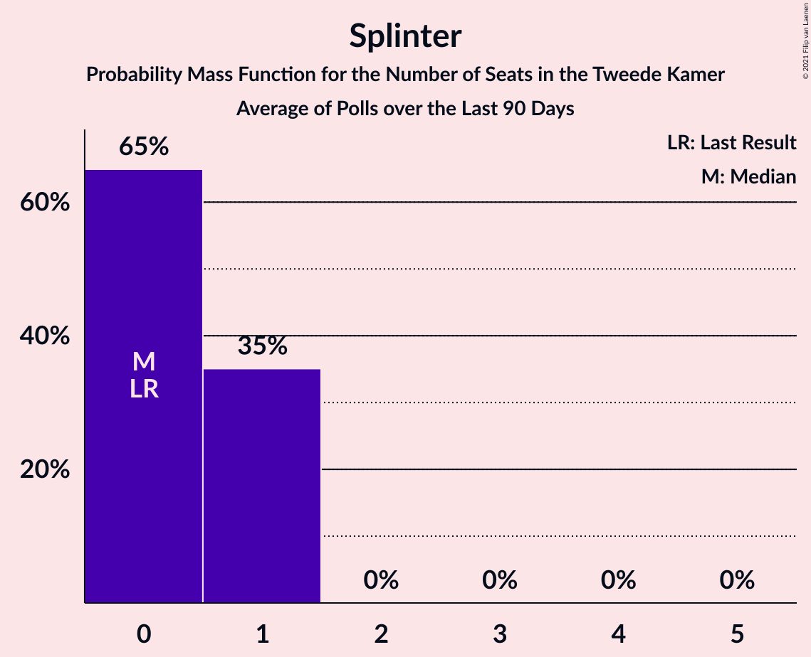
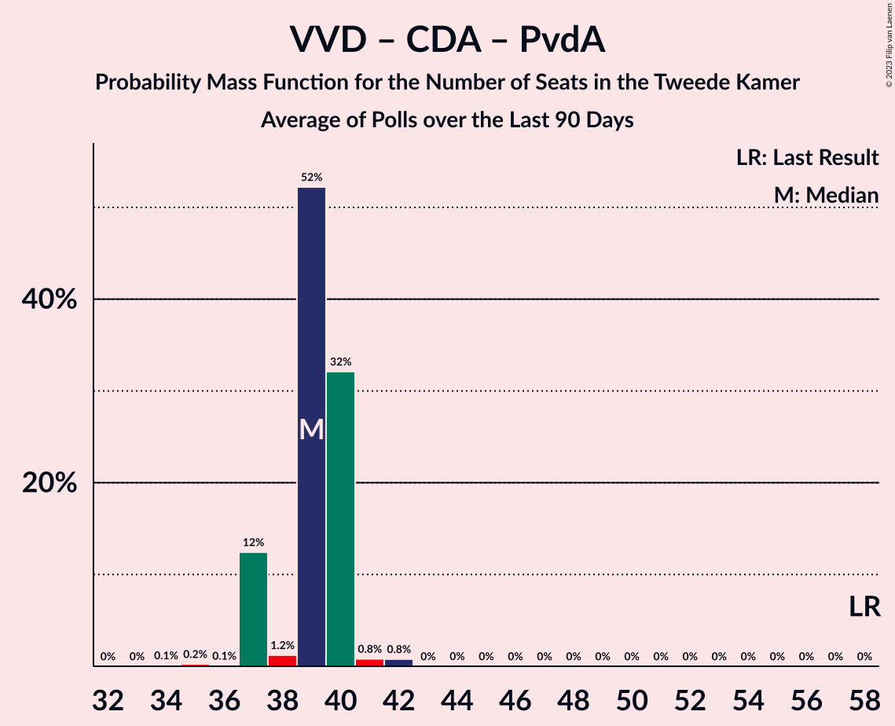

# Poll Average

<a href="#voting-intentions">Voting Intentions</a> | <a href="#seats">Seats</a> | <a href="#coalitions">Coalitions</a> | <a href="#technical-information">Technical Information</a>

## Summary

The table below lists the polls on which the average is based. They are the most recent polls (less than 90 days old) registered and analyzed so far.

| Period     | Polling firm/Commissioner(s) | VVD | PVV | CDA | D66 | GL | SP | PvdA | CU | PvdD | 50+ | SGP | DENK | FvD | PP | B1 | PvdT | JA21 | CO | Volt | BBB | Spl |
|:----------:|:----------------------------:|:--:|:--:|:--:|:--:|:--:|:--:|:--:|:--:|:--:|:--:|:--:|:--:|:--:|:--:|:--:|:--:|:--:|:--:|:--:|:--:|:--:|
| 15 March 2017 | General Election | 21.3%   33 | 13.1%   20 | 12.4%   19 | 12.2%   19 | 9.1%   14 | 9.1%   14 | 5.7%   9 | 3.4%   5 | 3.2%   5 | 3.1%   4 | 2.1%   3 | 2.1%   3 | 1.8%   2 | 0.3%   0 | 0.3%   0 | 0.0%   0 | 0.0%   0 | 0.0%   0 | 0.0%   0 | 0.0%   0 | 0.0%   0 |
| N/A | Poll Average | 20–25%   31–40 | 11–17%   16–25 | 9–13%   14–19 | 10–14%   16–20 | 5–8%   7–13 | 6–9%   9–14 | 6–9%   10–13 | 3–5%   5–8 | 3–5%   4–7 | 0–1%   0–2 | 2–3%   2–4 | 1–2%   1–2 | 3–4%   4–7 | 0%   0 | 0–1%   0–1 | N/A   N/A | 1–2%   1–4 | 0%   0 | 1–4%   1–5 | 0–1%   0–2 | 0–1%   0–1 |
| [14–16 March 2021](2021-03-16-KantarPublic.html) | Kantar Public | 22–26%   35–40 | 11–13%   16–22 | 9–11%   14–15 | 10–13%   17–20 | 5–7%   9–10 | 7–9%   12–14 | 7–9%   11–12 | 3–5%   5–6 | 3–5%   5–7 | 0–1%   0–1 | 2–3%   2–3 | 1–2%   1–2 | 3–4%   4 | N/A   N/A | 0–1%   1 | N/A   N/A | 1–2%   1–2 | N/A   N/A | 2–3%   2–3 | 0–1%   0–1 | 0–1%   0–1 |
| [15–16 March 2021](2021-03-16-Ipsos.html) | Ipsos   EenVandaag | 22–25%   33–38 | 11–14%   17–20 | 10–13%   15–19 | 11–14%   18–20 | 6–8%   10–13 | 6–8%   10–13 | 6–8%   10–13 | 3–5%   5–8 | 3–5%   5–7 | 0%   0 | 2–3%   2–3 | 1–2%   2 | 3–4%   4–5 | N/A   N/A | 0%   0 | N/A   N/A | 1–2%   2 | N/A   N/A | 1–2%   1–2 | 0–1%   0–1 | N/A   N/A |
| [12–15 March 2021](2021-03-15-IOResearch.html) | I&O Research | 20–23%   30–36 | 11–14%   17–22 | 9–11%   13–19 | 11–13%   17–20 | 6–8%   9–13 | 6–8%   8–13 | 6–8%   10–12 | 3–5%   5–6 | 3–4%   3–6 | 1%   0–2 | 2–3%   2–4 | 1–2%   1–2 | 3–4%   4–6 | 0%   0 | 0–1%   0–1 | N/A   N/A | 1–2%   1–3 | 0–1%   0 | 3–4%   4–5 | 1%   0–2 | N/A   N/A |
| [12–13 March 2021](2021-03-13-Peilnl.html) | Peil.nl | 19–22%   31–33 | 15–17%   23–25 | 11–13%   17–19 | 10–12%   16–20 | 5–6%   7–8 | 6–8%   9–12 | 6–8%   10–12 | 3–5%   5–7 | 3–5%   5–7 | 0–1%   0–1 | 2–3%   2–4 | 1–2%   1–2 | 3–5%   5–7 | N/A   N/A | 0–1%   0–1 | N/A   N/A | 2–3%   2–4 | 0%   0 | 2–3%   3–4 | N/A   N/A | N/A   N/A |
| 15 March 2017 | General Election | 21.3%   33 | 13.1%   20 | 12.4%   19 | 12.2%   19 | 9.1%   14 | 9.1%   14 | 5.7%   9 | 3.4%   5 | 3.2%   5 | 3.1%   4 | 2.1%   3 | 2.1%   3 | 1.8%   2 | 0.3%   0 | 0.3%   0 | 0.0%   0 | 0.0%   0 | 0.0%   0 | 0.0%   0 | 0.0%   0 | 0.0%   0 |

Only polls for which at least the sample size has been published are included in the table above.

**Legend:**
+ **Top half of each row:** Voting intentions (95% confidence interval)
+ **Bottom half of each row:** Seat projections for the Tweede Kamer (95% confidence interval)
+ **VVD:** Volkspartij voor Vrijheid en Democratie
+ **PVV:** Partij voor de Vrijheid
+ **CDA:** Christen-Democratisch Appèl
+ **D66:** Democraten 66
+ **GL:** GroenLinks
+ **SP:** Socialistische Partij
+ **PvdA:** Partij van de Arbeid
+ **CU:** ChristenUnie
+ **PvdD:** Partij voor de Dieren
+ **50+:** 50Plus
+ **SGP:** Staatkundig Gereformeerde Partij
+ **DENK:** DENK
+ **FvD:** Forum voor Democratie
+ **PP:** Piratenpartij
+ **B1:** Bij1
+ **PvdT:** Partij voor de Toekomst
+ **JA21:** Juiste Antwoord 2021
+ **CO:** Code Oranje
+ **Volt:** Volt Europa
+ **BBB:** BoerBurgerBeweging
+ **Spl:** Splinter
+ **N/A (single party):** Party not included the published results
+ **N/A (entire row):** Calculation for this opinion poll not started yet

## Voting Intentions

### Confidence Intervals

| Party | Last Result | Median | 80% Confidence Interval | 90% Confidence Interval | 95% Confidence Interval | 99% Confidence Interval |
|:-----:|:-----------:|:------:|:-----------------------:|:-----------------------:|:-----------------------:|:-----------------------:|
| <a href="#volkspartij-voor-vrijheid-en-democratie">Volkspartij voor Vrijheid en Democratie</a> | 21.3% | 22.1% | 20.2–24.4% |19.8–24.8% | 19.6–25.1% | 19.1–25.7% |
| <a href="#partij-voor-de-vrijheid">Partij voor de Vrijheid</a> | 13.1% | 12.7% | 11.6–16.1% |11.4–16.5% | 11.1–16.8% | 10.7–17.4% |
| <a href="#christen-democratisch-appèl">Christen-Democratisch Appèl</a> | 12.4% | 10.8% | 9.6–12.2% |9.4–12.6% | 9.2–12.8% | 8.8–13.3% |
| <a href="#democraten-66">Democraten 66</a> | 12.2% | 11.7% | 10.8–12.9% |10.6–13.2% | 10.4–13.5% | 10.0–14.0% |
| <a href="#groenlinks">GroenLinks</a> | 9.1% | 6.5% | 5.2–7.7% |5.0–7.9% | 4.8–8.1% | 4.5–8.5% |
| <a href="#socialistische-partij">Socialistische Partij</a> | 9.1% | 7.1% | 6.3–8.2% |6.1–8.5% | 6.0–8.7% | 5.7–9.1% |
| <a href="#partij-van-de-arbeid">Partij van de Arbeid</a> | 5.7% | 7.5% | 6.8–8.3% |6.6–8.5% | 6.5–8.7% | 6.2–9.1% |
| <a href="#christenunie">ChristenUnie</a> | 3.4% | 4.0% | 3.5–4.5% |3.4–4.6% | 3.3–4.8% | 3.1–5.0% |
| <a href="#partij-voor-de-dieren">Partij voor de Dieren</a> | 3.2% | 3.9% | 3.1–4.4% |2.9–4.6% | 2.8–4.7% | 2.6–5.0% |
| <a href="#50plus">50Plus</a> | 3.1% | 0.7% | 0.2–1.1% |0.1–1.2% | 0.1–1.3% | 0.1–1.5% |
| <a href="#staatkundig-gereformeerde-partij">Staatkundig Gereformeerde Partij</a> | 2.1% | 2.1% | 1.7–2.6% |1.7–2.7% | 1.6–2.8% | 1.4–3.1% |
| <a href="#denk">DENK</a> | 2.1% | 1.3% | 1.1–1.7% |1.0–1.7% | 1.0–1.8% | 0.9–2.0% |
| <a href="#forum-voor-democratie">Forum voor Democratie</a> | 1.8% | 3.5% | 2.9–4.2% |2.8–4.3% | 2.7–4.5% | 2.5–4.8% |
| <a href="#piratenpartij">Piratenpartij</a> | 0.3% | 0.1% | 0.1–0.2% |0.1–0.3% | 0.0–0.3% | 0.0–0.4% |
| <a href="#bij1">Bij1</a> | 0.3% | 0.6% | 0.2–0.9% |0.1–1.0% | 0.1–1.0% | 0.1–1.2% |
| <a href="#partij-voor-de-toekomst">Partij voor de Toekomst</a> | 0.0% | N/A | N/A |N/A | N/A | N/A |
| <a href="#juiste-antwoord-2021">Juiste Antwoord 2021</a> | 0.0% | 1.6% | 1.2–2.2% |1.1–2.3% | 1.0–2.4% | 0.9–2.6% |
| <a href="#code-oranje">Code Oranje</a> | 0.0% | 0.3% | 0.1–0.4% |0.1–0.5% | 0.1–0.5% | 0.1–0.6% |
| <a href="#volt-europa">Volt Europa</a> | 0.0% | 2.0% | 1.3–3.3% |1.2–3.5% | 1.1–3.7% | 0.9–4.0% |
| <a href="#boerburgerbeweging">BoerBurgerBeweging</a> | 0.0% | 0.8% | 0.5–1.0% |0.5–1.1% | 0.4–1.2% | 0.4–1.4% |
| <a href="#splinter">Splinter</a> | 0.0% | 0.7% | 0.5–0.9% |0.5–1.0% | 0.4–1.0% | 0.4–1.2% |

### Volkspartij voor Vrijheid en Democratie

*For a full overview of the results for this party, see the [Volkspartij voor Vrijheid en Democratie](party-volkspartijvoorvrijheidendemocratie.html) page.*

| Voting Intentions | Probability | Accumulated | Special Marks |
|:-----------------:|:-----------:|:-----------:|:-------------:|
| 17.5–18.5% | 0.1% | 100% |  |
| 18.5–19.5% | 2% | 99.9% |  |
| 19.5–20.5% | 16% | 98% |  |
| 20.5–21.5% | 23% | 82% | Last Result |
| 21.5–22.5% | 14% | 58% | Median |
| 22.5–23.5% | 18% | 45% |  |
| 23.5–24.5% | 19% | 27% |  |
| 24.5–25.5% | 7% | 7% |  |
| 25.5–26.5% | 0.7% | 0.7% |  |
| 26.5–27.5% | 0% | 0% |  |

### Partij voor de Vrijheid

*For a full overview of the results for this party, see the [Partij voor de Vrijheid](party-partijvoordevrijheid.html) page.*

| Voting Intentions | Probability | Accumulated | Special Marks |
|:-----------------:|:-----------:|:-----------:|:-------------:|
| 8.5–9.5% | 0% | 100% |  |
| 9.5–10.5% | 0.2% | 100% |  |
| 10.5–11.5% | 8% | 99.8% |  |
| 11.5–12.5% | 36% | 91% |  |
| 12.5–13.5% | 27% | 55% | Last Result, Median |
| 13.5–14.5% | 4% | 29% |  |
| 14.5–15.5% | 6% | 25% |  |
| 15.5–16.5% | 14% | 18% |  |
| 16.5–17.5% | 4% | 5% |  |
| 17.5–18.5% | 0.2% | 0.3% |  |
| 18.5–19.5% | 0% | 0% |  |

### Christen-Democratisch Appèl

*For a full overview of the results for this party, see the [Christen-Democratisch Appèl](party-christen-democratischappèl.html) page.*

| Voting Intentions | Probability | Accumulated | Special Marks |
|:-----------------:|:-----------:|:-----------:|:-------------:|
| 7.5–8.5% | 0.1% | 100% |  |
| 8.5–9.5% | 8% | 99.9% |  |
| 9.5–10.5% | 33% | 92% |  |
| 10.5–11.5% | 30% | 59% | Median |
| 11.5–12.5% | 23% | 28% | Last Result |
| 12.5–13.5% | 5% | 5% |  |
| 13.5–14.5% | 0.1% | 0.1% |  |
| 14.5–15.5% | 0% | 0% |  |

### Democraten 66

*For a full overview of the results for this party, see the [Democraten 66](party-democraten66.html) page.*

| Voting Intentions | Probability | Accumulated | Special Marks |
|:-----------------:|:-----------:|:-----------:|:-------------:|
| 8.5–9.5% | 0% | 100% |  |
| 9.5–10.5% | 5% | 100% |  |
| 10.5–11.5% | 37% | 95% |  |
| 11.5–12.5% | 40% | 58% | Last Result, Median |
| 12.5–13.5% | 16% | 18% |  |
| 13.5–14.5% | 2% | 2% |  |
| 14.5–15.5% | 0.1% | 0.1% |  |
| 15.5–16.5% | 0% | 0% |  |

### GroenLinks

*For a full overview of the results for this party, see the [GroenLinks](party-groenlinks.html) page.*

| Voting Intentions | Probability | Accumulated | Special Marks |
|:-----------------:|:-----------:|:-----------:|:-------------:|
| 2.5–3.5% | 0% | 100% |  |
| 3.5–4.5% | 0.6% | 100% |  |
| 4.5–5.5% | 20% | 99.4% |  |
| 5.5–6.5% | 30% | 79% |  |
| 6.5–7.5% | 35% | 49% | Median |
| 7.5–8.5% | 14% | 14% |  |
| 8.5–9.5% | 0.4% | 0.4% | Last Result |
| 9.5–10.5% | 0% | 0% |  |

### Socialistische Partij

*For a full overview of the results for this party, see the [Socialistische Partij](party-socialistischepartij.html) page.*

| Voting Intentions | Probability | Accumulated | Special Marks |
|:-----------------:|:-----------:|:-----------:|:-------------:|
| 3.5–4.5% | 0% | 100% |  |
| 4.5–5.5% | 0.2% | 100% |  |
| 5.5–6.5% | 19% | 99.8% |  |
| 6.5–7.5% | 49% | 81% | Median |
| 7.5–8.5% | 27% | 31% |  |
| 8.5–9.5% | 4% | 4% | Last Result |
| 9.5–10.5% | 0% | 0% |  |
| 10.5–11.5% | 0% | 0% |  |

### Partij van de Arbeid

*For a full overview of the results for this party, see the [Partij van de Arbeid](party-partijvandearbeid.html) page.*

| Voting Intentions | Probability | Accumulated | Special Marks |
|:-----------------:|:-----------:|:-----------:|:-------------:|
| 4.5–5.5% | 0% | 100% |  |
| 5.5–6.5% | 4% | 100% | Last Result |
| 6.5–7.5% | 49% | 96% |  |
| 7.5–8.5% | 42% | 47% | Median |
| 8.5–9.5% | 5% | 5% |  |
| 9.5–10.5% | 0% | 0% |  |
| 10.5–11.5% | 0% | 0% |  |

### ChristenUnie

*For a full overview of the results for this party, see the [ChristenUnie](party-christenunie.html) page.*

| Voting Intentions | Probability | Accumulated | Special Marks |
|:-----------------:|:-----------:|:-----------:|:-------------:|
| 1.5–2.5% | 0% | 100% |  |
| 2.5–3.5% | 11% | 100% | Last Result |
| 3.5–4.5% | 82% | 89% | Median |
| 4.5–5.5% | 7% | 7% |  |
| 5.5–6.5% | 0% | 0% |  |

### Partij voor de Dieren

*For a full overview of the results for this party, see the [Partij voor de Dieren](party-partijvoordedieren.html) page.*

| Voting Intentions | Probability | Accumulated | Special Marks |
|:-----------------:|:-----------:|:-----------:|:-------------:|
| 0.5–1.5% | 0% | 100% |  |
| 1.5–2.5% | 0.4% | 100% |  |
| 2.5–3.5% | 27% | 99.6% | Last Result |
| 3.5–4.5% | 66% | 72% | Median |
| 4.5–5.5% | 6% | 6% |  |
| 5.5–6.5% | 0% | 0% |  |

### 50Plus

*For a full overview of the results for this party, see the [50Plus](party-50plus.html) page.*

| Voting Intentions | Probability | Accumulated | Special Marks |
|:-----------------:|:-----------:|:-----------:|:-------------:|
| 0.0–0.5% | 33% | 100% |  |
| 0.5–1.5% | 66% | 67% | Median |
| 1.5–2.5% | 0.2% | 0.2% |  |
| 2.5–3.5% | 0% | 0% | Last Result |

### Staatkundig Gereformeerde Partij

*For a full overview of the results for this party, see the [Staatkundig Gereformeerde Partij](party-staatkundiggereformeerdepartij.html) page.*

| Voting Intentions | Probability | Accumulated | Special Marks |
|:-----------------:|:-----------:|:-----------:|:-------------:|
| 0.0–0.5% | 0% | 100% |  |
| 0.5–1.5% | 2% | 100% |  |
| 1.5–2.5% | 87% | 98% | Last Result, Median |
| 2.5–3.5% | 10% | 10% |  |
| 3.5–4.5% | 0% | 0% |  |

### DENK

*For a full overview of the results for this party, see the [DENK](party-denk.html) page.*

| Voting Intentions | Probability | Accumulated | Special Marks |
|:-----------------:|:-----------:|:-----------:|:-------------:|
| 0.0–0.5% | 0% | 100% |  |
| 0.5–1.5% | 81% | 100% | Median |
| 1.5–2.5% | 19% | 19% | Last Result |
| 2.5–3.5% | 0% | 0% |  |

### Forum voor Democratie

*For a full overview of the results for this party, see the [Forum voor Democratie](party-forumvoordemocratie.html) page.*

| Voting Intentions | Probability | Accumulated | Special Marks |
|:-----------------:|:-----------:|:-----------:|:-------------:|
| 0.5–1.5% | 0% | 100% |  |
| 1.5–2.5% | 0.6% | 100% | Last Result |
| 2.5–3.5% | 58% | 99.4% | Median |
| 3.5–4.5% | 40% | 42% |  |
| 4.5–5.5% | 2% | 2% |  |
| 5.5–6.5% | 0% | 0% |  |

### Piratenpartij

*For a full overview of the results for this party, see the [Piratenpartij](party-piratenpartij.html) page.*

| Voting Intentions | Probability | Accumulated | Special Marks |
|:-----------------:|:-----------:|:-----------:|:-------------:|
| 0.0–0.5% | 100% | 100% | Last Result, Median |
| 0.5–1.5% | 0% | 0% |  |

### Bij1

*For a full overview of the results for this party, see the [Bij1](party-bij1.html) page.*

| Voting Intentions | Probability | Accumulated | Special Marks |
|:-----------------:|:-----------:|:-----------:|:-------------:|
| 0.0–0.5% | 36% | 100% | Last Result |
| 0.5–1.5% | 64% | 64% | Median |
| 1.5–2.5% | 0% | 0% |  |

### Juiste Antwoord 2021

*For a full overview of the results for this party, see the [Juiste Antwoord 2021](party-juisteantwoord2021.html) page.*

| Voting Intentions | Probability | Accumulated | Special Marks |
|:-----------------:|:-----------:|:-----------:|:-------------:|
| 0.0–0.5% | 0% | 100% | Last Result |
| 0.5–1.5% | 43% | 100% |  |
| 1.5–2.5% | 56% | 57% | Median |
| 2.5–3.5% | 0.9% | 0.9% |  |
| 3.5–4.5% | 0% | 0% |  |

### Volt Europa

*For a full overview of the results for this party, see the [Volt Europa](party-volteuropa.html) page.*

| Voting Intentions | Probability | Accumulated | Special Marks |
|:-----------------:|:-----------:|:-----------:|:-------------:|
| 0.0–0.5% | 0% | 100% | Last Result |
| 0.5–1.5% | 21% | 100% |  |
| 1.5–2.5% | 53% | 79% | Median |
| 2.5–3.5% | 22% | 26% |  |
| 3.5–4.5% | 4% | 4% |  |
| 4.5–5.5% | 0% | 0% |  |

### BoerBurgerBeweging

*For a full overview of the results for this party, see the [BoerBurgerBeweging](party-boerburgerbeweging.html) page.*

| Voting Intentions | Probability | Accumulated | Special Marks |
|:-----------------:|:-----------:|:-----------:|:-------------:|
| 0.0–0.5% | 12% | 100% | Last Result |
| 0.5–1.5% | 88% | 88% | Median |
| 1.5–2.5% | 0% | 0% |  |
| 2.5–3.5% | 0% | 0% |  |

### Splinter

*For a full overview of the results for this party, see the [Splinter](party-splinter.html) page.*

| Voting Intentions | Probability | Accumulated | Special Marks |
|:-----------------:|:-----------:|:-----------:|:-------------:|
| 0.0–0.5% | 18% | 100% | Last Result |
| 0.5–1.5% | 82% | 82% | Median |
| 1.5–2.5% | 0% | 0% |  |

### Code Oranje

*For a full overview of the results for this party, see the [Code Oranje](party-codeoranje.html) page.*

| Voting Intentions | Probability | Accumulated | Special Marks |
|:-----------------:|:-----------:|:-----------:|:-------------:|
| 0.0–0.5% | 98% | 100% | Last Result, Median |
| 0.5–1.5% | 2% | 2% |  |
| 1.5–2.5% | 0% | 0% |  |

## Seats

### Confidence Intervals

| Party | Last Result | Median | 80% Confidence Interval | 90% Confidence Interval | 95% Confidence Interval | 99% Confidence Interval |
|:-----:|:-----------:|:------:|:-----------------------:|:-----------------------:|:-----------------------:|:-----------------------:|
| <a href="#volkspartij-voor-vrijheid-en-democratie">Volkspartij voor Vrijheid en Democratie</a> | 33 | 33 | 31–38 |31–40 | 31–40 | 30–40 |
| <a href="#partij-voor-de-vrijheid">Partij voor de Vrijheid</a> | 20 | 20 | 17–24 |16–24 | 16–25 | 16–25 |
| <a href="#christen-democratisch-appèl">Christen-Democratisch Appèl</a> | 19 | 16 | 14–19 |14–19 | 14–19 | 13–20 |
| <a href="#democraten-66">Democraten 66</a> | 19 | 19 | 16–20 |16–20 | 16–20 | 16–21 |
| <a href="#groenlinks">GroenLinks</a> | 14 | 10 | 8–13 |7–13 | 7–13 | 7–13 |
| <a href="#socialistische-partij">Socialistische Partij</a> | 14 | 11 | 10–12 |9–13 | 9–14 | 8–14 |
| <a href="#partij-van-de-arbeid">Partij van de Arbeid</a> | 9 | 11 | 10–12 |10–12 | 10–13 | 9–13 |
| <a href="#christenunie">ChristenUnie</a> | 5 | 6 | 5–7 |5–7 | 5–8 | 5–8 |
| <a href="#partij-voor-de-dieren">Partij voor de Dieren</a> | 5 | 5 | 5–7 |4–7 | 4–7 | 3–7 |
| <a href="#50plus">50Plus</a> | 4 | 1 | 0–2 |0–2 | 0–2 | 0–2 |
| <a href="#staatkundig-gereformeerde-partij">Staatkundig Gereformeerde Partij</a> | 3 | 3 | 2–4 |2–4 | 2–4 | 2–4 |
| <a href="#denk">DENK</a> | 3 | 2 | 1–2 |1–2 | 1–2 | 1–2 |
| <a href="#forum-voor-democratie">Forum voor Democratie</a> | 2 | 5 | 4–7 |4–7 | 4–7 | 4–7 |
| <a href="#piratenpartij">Piratenpartij</a> | 0 | 0 | 0 |0 | 0 | 0 |
| <a href="#bij1">Bij1</a> | 0 | 1 | 0–1 |0–1 | 0–1 | 0–1 |
| <a href="#partij-voor-de-toekomst">Partij voor de Toekomst</a> | 0 | N/A | N/A |N/A | N/A | N/A |
| <a href="#juiste-antwoord-2021">Juiste Antwoord 2021</a> | 0 | 2 | 2–3 |2–4 | 1–4 | 1–4 |
| <a href="#code-oranje">Code Oranje</a> | 0 | 0 | 0 |0 | 0 | 0 |
| <a href="#volt-europa">Volt Europa</a> | 0 | 3 | 2–5 |2–5 | 1–5 | 1–5 |
| <a href="#boerburgerbeweging">BoerBurgerBeweging</a> | 0 | 0 | 0–1 |0–2 | 0–2 | 0–2 |
| <a href="#splinter">Splinter</a> | 0 | 0 | 0–1 |0–1 | 0–1 | 0–1 |

### Volkspartij voor Vrijheid en Democratie

*For a full overview of the results for this party, see the [Volkspartij voor Vrijheid en Democratie](party-volkspartijvoorvrijheidendemocratie.html) page.*

| Number of Seats | Probability | Accumulated | Special Marks |
|:---------------:|:-----------:|:-----------:|:-------------:|
| 28 | 0.1% | 100% |  |
| 29 | 0.1% | 99.9% |  |
| 30 | 2% | 99.8% |  |
| 31 | 12% | 98% |  |
| 32 | 12% | 86% |  |
| 33 | 38% | 74% | Last Result, Median |
| 34 | 4% | 36% |  |
| 35 | 15% | 32% |  |
| 36 | 1.4% | 17% |  |
| 37 | 0.6% | 16% |  |
| 38 | 7% | 15% |  |
| 39 | 0.6% | 8% |  |
| 40 | 8% | 8% |  |
| 41 | 0% | 0% |  |

### Partij voor de Vrijheid

*For a full overview of the results for this party, see the [Partij voor de Vrijheid](party-partijvoordevrijheid.html) page.*

| Number of Seats | Probability | Accumulated | Special Marks |
|:---------------:|:-----------:|:-----------:|:-------------:|
| 16 | 8% | 100% |  |
| 17 | 3% | 92% |  |
| 18 | 7% | 89% |  |
| 19 | 17% | 82% |  |
| 20 | 23% | 65% | Last Result, Median |
| 21 | 1.4% | 43% |  |
| 22 | 16% | 41% |  |
| 23 | 4% | 25% |  |
| 24 | 18% | 21% |  |
| 25 | 2% | 3% |  |
| 26 | 0.1% | 0.3% |  |
| 27 | 0.1% | 0.2% |  |
| 28 | 0% | 0.1% |  |
| 29 | 0% | 0.1% |  |
| 30 | 0.1% | 0.1% |  |
| 31 | 0% | 0% |  |

### Christen-Democratisch Appèl

*For a full overview of the results for this party, see the [Christen-Democratisch Appèl](party-christen-democratischappèl.html) page.*

| Number of Seats | Probability | Accumulated | Special Marks |
|:---------------:|:-----------:|:-----------:|:-------------:|
| 13 | 2% | 100% |  |
| 14 | 11% | 98% |  |
| 15 | 31% | 86% |  |
| 16 | 22% | 55% | Median |
| 17 | 3% | 33% |  |
| 18 | 2% | 30% |  |
| 19 | 28% | 28% | Last Result |
| 20 | 0.3% | 0.6% |  |
| 21 | 0.2% | 0.2% |  |
| 22 | 0% | 0% |  |

### Democraten 66

*For a full overview of the results for this party, see the [Democraten 66](party-democraten66.html) page.*

| Number of Seats | Probability | Accumulated | Special Marks |
|:---------------:|:-----------:|:-----------:|:-------------:|
| 15 | 0.1% | 100% |  |
| 16 | 14% | 99.9% |  |
| 17 | 20% | 86% |  |
| 18 | 13% | 66% |  |
| 19 | 15% | 53% | Last Result, Median |
| 20 | 37% | 37% |  |
| 21 | 0.4% | 0.8% |  |
| 22 | 0.3% | 0.4% |  |
| 23 | 0.1% | 0.1% |  |
| 24 | 0% | 0% |  |

### GroenLinks

*For a full overview of the results for this party, see the [GroenLinks](party-groenlinks.html) page.*

| Number of Seats | Probability | Accumulated | Special Marks |
|:---------------:|:-----------:|:-----------:|:-------------:|
| 6 | 0.2% | 100% |  |
| 7 | 10% | 99.8% |  |
| 8 | 15% | 90% |  |
| 9 | 4% | 75% |  |
| 10 | 29% | 71% | Median |
| 11 | 2% | 42% |  |
| 12 | 21% | 40% |  |
| 13 | 19% | 19% |  |
| 14 | 0% | 0% | Last Result |

### Socialistische Partij

*For a full overview of the results for this party, see the [Socialistische Partij](party-socialistischepartij.html) page.*

| Number of Seats | Probability | Accumulated | Special Marks |
|:---------------:|:-----------:|:-----------:|:-------------:|
| 8 | 2% | 100% |  |
| 9 | 4% | 98% |  |
| 10 | 19% | 94% |  |
| 11 | 27% | 75% | Median |
| 12 | 43% | 49% |  |
| 13 | 3% | 6% |  |
| 14 | 3% | 3% | Last Result |
| 15 | 0% | 0% |  |

### Partij van de Arbeid

*For a full overview of the results for this party, see the [Partij van de Arbeid](party-partijvandearbeid.html) page.*

| Number of Seats | Probability | Accumulated | Special Marks |
|:---------------:|:-----------:|:-----------:|:-------------:|
| 9 | 0.8% | 100% | Last Result |
| 10 | 17% | 99.2% |  |
| 11 | 37% | 82% | Median |
| 12 | 41% | 45% |  |
| 13 | 4% | 4% |  |
| 14 | 0.1% | 0.1% |  |
| 15 | 0% | 0% |  |

### ChristenUnie

*For a full overview of the results for this party, see the [ChristenUnie](party-christenunie.html) page.*

| Number of Seats | Probability | Accumulated | Special Marks |
|:---------------:|:-----------:|:-----------:|:-------------:|
| 4 | 0.3% | 100% |  |
| 5 | 42% | 99.7% | Last Result |
| 6 | 30% | 58% | Median |
| 7 | 24% | 28% |  |
| 8 | 3% | 3% |  |
| 9 | 0% | 0% |  |

### Partij voor de Dieren

*For a full overview of the results for this party, see the [Partij voor de Dieren](party-partijvoordedieren.html) page.*

| Number of Seats | Probability | Accumulated | Special Marks |
|:---------------:|:-----------:|:-----------:|:-------------:|
| 3 | 2% | 100% |  |
| 4 | 3% | 98% |  |
| 5 | 68% | 94% | Last Result, Median |
| 6 | 5% | 27% |  |
| 7 | 21% | 21% |  |
| 8 | 0.3% | 0.3% |  |
| 9 | 0% | 0% |  |

### 50Plus

*For a full overview of the results for this party, see the [50Plus](party-50plus.html) page.*

| Number of Seats | Probability | Accumulated | Special Marks |
|:---------------:|:-----------:|:-----------:|:-------------:|
| 0 | 46% | 100% |  |
| 1 | 36% | 54% | Median |
| 2 | 18% | 18% |  |
| 3 | 0% | 0% |  |
| 4 | 0% | 0% | Last Result |

### Staatkundig Gereformeerde Partij

*For a full overview of the results for this party, see the [Staatkundig Gereformeerde Partij](party-staatkundiggereformeerdepartij.html) page.*

| Number of Seats | Probability | Accumulated | Special Marks |
|:---------------:|:-----------:|:-----------:|:-------------:|
| 2 | 46% | 100% |  |
| 3 | 44% | 54% | Last Result, Median |
| 4 | 11% | 11% |  |
| 5 | 0% | 0% |  |

### DENK

*For a full overview of the results for this party, see the [DENK](party-denk.html) page.*

| Number of Seats | Probability | Accumulated | Special Marks |
|:---------------:|:-----------:|:-----------:|:-------------:|
| 1 | 49% | 100% |  |
| 2 | 51% | 51% | Median |
| 3 | 0.2% | 0.2% | Last Result |
| 4 | 0.1% | 0.1% |  |
| 5 | 0% | 0% |  |

### Forum voor Democratie

*For a full overview of the results for this party, see the [Forum voor Democratie](party-forumvoordemocratie.html) page.*

| Number of Seats | Probability | Accumulated | Special Marks |
|:---------------:|:-----------:|:-----------:|:-------------:|
| 2 | 0% | 100% | Last Result |
| 3 | 0.3% | 100% |  |
| 4 | 48% | 99.7% |  |
| 5 | 34% | 51% | Median |
| 6 | 7% | 17% |  |
| 7 | 10% | 10% |  |
| 8 | 0.2% | 0.2% |  |
| 9 | 0% | 0% |  |

### Piratenpartij

*For a full overview of the results for this party, see the [Piratenpartij](party-piratenpartij.html) page.*

| Number of Seats | Probability | Accumulated | Special Marks |
|:---------------:|:-----------:|:-----------:|:-------------:|
| 0 | 100% | 100% | Last Result, Median |

### Bij1

*For a full overview of the results for this party, see the [Bij1](party-bij1.html) page.*

| Number of Seats | Probability | Accumulated | Special Marks |
|:---------------:|:-----------:|:-----------:|:-------------:|
| 0 | 36% | 100% | Last Result |
| 1 | 64% | 64% | Median |
| 2 | 0.4% | 0.4% |  |
| 3 | 0% | 0% |  |

### Partij voor de Toekomst

*For a full overview of the results for this party, see the [Partij voor de Toekomst](party-partijvoordetoekomst.html) page.*

### Juiste Antwoord 2021

*For a full overview of the results for this party, see the [Juiste Antwoord 2021](party-juisteantwoord2021.html) page.*

| Number of Seats | Probability | Accumulated | Special Marks |
|:---------------:|:-----------:|:-----------:|:-------------:|
| 0 | 0% | 100% | Last Result |
| 1 | 4% | 100% |  |
| 2 | 76% | 96% | Median |
| 3 | 11% | 20% |  |
| 4 | 9% | 9% |  |
| 5 | 0% | 0% |  |

### Code Oranje

*For a full overview of the results for this party, see the [Code Oranje](party-codeoranje.html) page.*

| Number of Seats | Probability | Accumulated | Special Marks |
|:---------------:|:-----------:|:-----------:|:-------------:|
| 0 | 99.6% | 100% | Last Result, Median |
| 1 | 0.4% | 0.4% |  |
| 2 | 0% | 0% |  |

### Volt Europa

*For a full overview of the results for this party, see the [Volt Europa](party-volteuropa.html) page.*

| Number of Seats | Probability | Accumulated | Special Marks |
|:---------------:|:-----------:|:-----------:|:-------------:|
| 0 | 0% | 100% | Last Result |
| 1 | 4% | 100% |  |
| 2 | 29% | 96% |  |
| 3 | 36% | 67% | Median |
| 4 | 10% | 30% |  |
| 5 | 20% | 20% |  |
| 6 | 0.5% | 0.5% |  |
| 7 | 0% | 0% |  |

### BoerBurgerBeweging

*For a full overview of the results for this party, see the [BoerBurgerBeweging](party-boerburgerbeweging.html) page.*

| Number of Seats | Probability | Accumulated | Special Marks |
|:---------------:|:-----------:|:-----------:|:-------------:|
| 0 | 51% | 100% | Last Result, Median |
| 1 | 42% | 49% |  |
| 2 | 7% | 7% |  |
| 3 | 0% | 0% |  |

### Splinter

*For a full overview of the results for this party, see the [Splinter](party-splinter.html) page.*

| Number of Seats | Probability | Accumulated | Special Marks |
|:---------------:|:-----------:|:-----------:|:-------------:|
| 0 | 56% | 100% | Last Result, Median |
| 1 | 44% | 44% |  |
| 2 | 0% | 0% |  |

## Coalitions

### Confidence Intervals

| Coalition | Last Result | Median | Majority? | 80% Confidence Interval | 90% Confidence Interval | 95% Confidence Interval | 99% Confidence Interval |
|:---------:|:-----------:|:------:|:---------:|:-----------------------:|:-----------------------:|:-----------------------:|:-----------------------:|
| Volkspartij voor Vrijheid en Democratie – Christen-Democratisch Appèl – Democraten 66 – Partij van de Arbeid – ChristenUnie | 85 | 85 | 100% | 82–90 | 82–91 | 82–93 | 78–93 |
| Volkspartij voor Vrijheid en Democratie – Christen-Democratisch Appèl – Democraten 66 – GroenLinks – ChristenUnie | 90 | 85 | 100% | 80–89 | 80–90 | 80–93 | 78–93 |
| Volkspartij voor Vrijheid en Democratie – Partij voor de Vrijheid – Christen-Democratisch Appèl – Staatkundig Gereformeerde Partij – Forum voor Democratie | 77 | 78 | 63% | 75–85 | 75–86 | 74–86 | 71–86 |
| Volkspartij voor Vrijheid en Democratie – Partij voor de Vrijheid – Christen-Democratisch Appèl – Forum voor Democratie | 74 | 75 | 50% | 72–82 | 72–82 | 71–82 | 69–82 |
| Volkspartij voor Vrijheid en Democratie – Christen-Democratisch Appèl – Democraten 66 – ChristenUnie | 76 | 75 | 34% | 71–79 | 71–80 | 71–81 | 67–81 |
| Christen-Democratisch Appèl – Democraten 66 – GroenLinks – Socialistische Partij – Partij van de Arbeid – ChristenUnie | 80 | 72 | 23% | 69–80 | 69–80 | 69–80 | 68–80 |
| Volkspartij voor Vrijheid en Democratie – Partij voor de Vrijheid – Christen-Democratisch Appèl | 72 | 70 | 0.8% | 67–75 | 67–75 | 67–75 | 63–77 |
| Volkspartij voor Vrijheid en Democratie – Christen-Democratisch Appèl – Democraten 66 | 71 | 69 | 0.1% | 65–73 | 65–73 | 65–73 | 62–75 |
| Volkspartij voor Vrijheid en Democratie – Democraten 66 – Partij van de Arbeid | 61 | 65 | 0% | 58–67 | 58–70 | 58–70 | 58–70 |
| Christen-Democratisch Appèl – Democraten 66 – GroenLinks – Partij van de Arbeid – ChristenUnie | 66 | 61 | 0% | 58–68 | 58–68 | 56–69 | 56–69 |
| Volkspartij voor Vrijheid en Democratie – Christen-Democratisch Appèl – Partij van de Arbeid | 61 | 61 | 0% | 59–65 | 59–65 | 58–66 | 54–66 |
| Volkspartij voor Vrijheid en Democratie – Christen-Democratisch Appèl – 50Plus – Staatkundig Gereformeerde Partij – Forum voor Democratie | 61 | 58 | 0% | 55–63 | 55–63 | 55–63 | 52–63 |
| Volkspartij voor Vrijheid en Democratie – Christen-Democratisch Appèl – Staatkundig Gereformeerde Partij – Forum voor Democratie | 57 | 57 | 0% | 55–62 | 55–62 | 55–62 | 51–63 |
| Volkspartij voor Vrijheid en Democratie – Christen-Democratisch Appèl – 50Plus – Forum voor Democratie | 58 | 55 | 0% | 53–59 | 53–59 | 53–59 | 50–60 |
| Volkspartij voor Vrijheid en Democratie – Christen-Democratisch Appèl – Forum voor Democratie | 54 | 54 | 0% | 53–58 | 53–58 | 52–58 | 49–60 |
| Volkspartij voor Vrijheid en Democratie – Christen-Democratisch Appèl | 52 | 50 | 0% | 48–54 | 48–54 | 47–54 | 43–55 |
| Christen-Democratisch Appèl – Democraten 66 – Partij van de Arbeid | 47 | 46 | 0% | 43–49 | 43–49 | 42–52 | 42–52 |
| Volkspartij voor Vrijheid en Democratie – Partij van de Arbeid | 42 | 45 | 0% | 42–49 | 42–51 | 42–51 | 41–51 |
| Christen-Democratisch Appèl – Democraten 66 | 38 | 35 | 0% | 32–37 | 32–38 | 31–39 | 31–39 |
| Christen-Democratisch Appèl – Partij van de Arbeid – ChristenUnie | 33 | 34 | 0% | 31–36 | 30–36 | 30–39 | 29–39 |
| Christen-Democratisch Appèl – Partij van de Arbeid | 28 | 27 | 0% | 25–31 | 25–31 | 24–32 | 24–32 |

### Volkspartij voor Vrijheid en Democratie – Christen-Democratisch Appèl – Democraten 66 – Partij van de Arbeid – ChristenUnie

| Number of Seats | Probability | Accumulated | Special Marks |
|:---------------:|:-----------:|:-----------:|:-------------:|
| 78 | 1.2% | 100% |  |
| 79 | 0.3% | 98.7% |  |
| 80 | 0.3% | 98% |  |
| 81 | 0.2% | 98% |  |
| 82 | 25% | 98% |  |
| 83 | 1.1% | 73% |  |
| 84 | 0.6% | 72% |  |
| 85 | 22% | 71% | Last Result, Median |
| 86 | 2% | 49% |  |
| 87 | 14% | 47% |  |
| 88 | 17% | 33% |  |
| 89 | 0.9% | 16% |  |
| 90 | 8% | 15% |  |
| 91 | 3% | 7% |  |
| 92 | 0.5% | 4% |  |
| 93 | 3% | 3% |  |
| 94 | 0.1% | 0.1% |  |
| 95 | 0% | 0% |  |

### Volkspartij voor Vrijheid en Democratie – Christen-Democratisch Appèl – Democraten 66 – GroenLinks – ChristenUnie

| Number of Seats | Probability | Accumulated | Special Marks |
|:---------------:|:-----------:|:-----------:|:-------------:|
| 77 | 0.1% | 100% |  |
| 78 | 0.6% | 99.9% |  |
| 79 | 1.5% | 99.3% |  |
| 80 | 19% | 98% |  |
| 81 | 0.5% | 79% |  |
| 82 | 0.6% | 79% |  |
| 83 | 24% | 78% |  |
| 84 | 3% | 54% | Median |
| 85 | 15% | 51% |  |
| 86 | 0.8% | 36% |  |
| 87 | 2% | 35% |  |
| 88 | 0.1% | 33% |  |
| 89 | 25% | 32% |  |
| 90 | 3% | 7% | Last Result |
| 91 | 0% | 4% |  |
| 92 | 0.2% | 4% |  |
| 93 | 3% | 3% |  |
| 94 | 0% | 0.1% |  |
| 95 | 0% | 0% |  |

### Volkspartij voor Vrijheid en Democratie – Partij voor de Vrijheid – Christen-Democratisch Appèl – Staatkundig Gereformeerde Partij – Forum voor Democratie

| Number of Seats | Probability | Accumulated | Special Marks |
|:---------------:|:-----------:|:-----------:|:-------------:|
| 70 | 0.3% | 100% |  |
| 71 | 1.2% | 99.7% |  |
| 72 | 0% | 98% |  |
| 73 | 0.1% | 98% |  |
| 74 | 3% | 98% |  |
| 75 | 32% | 96% |  |
| 76 | 8% | 63% | Majority |
| 77 | 5% | 55% | Last Result, Median |
| 78 | 2% | 50% |  |
| 79 | 19% | 49% |  |
| 80 | 4% | 30% |  |
| 81 | 9% | 26% |  |
| 82 | 0.9% | 17% |  |
| 83 | 6% | 16% |  |
| 84 | 0.5% | 11% |  |
| 85 | 0.4% | 10% |  |
| 86 | 9% | 10% |  |
| 87 | 0.2% | 0.2% |  |
| 88 | 0% | 0% |  |

### Volkspartij voor Vrijheid en Democratie – Partij voor de Vrijheid – Christen-Democratisch Appèl – Forum voor Democratie

| Number of Seats | Probability | Accumulated | Special Marks |
|:---------------:|:-----------:|:-----------:|:-------------:|
| 67 | 0.3% | 100% |  |
| 68 | 0% | 99.7% |  |
| 69 | 1.3% | 99.7% |  |
| 70 | 0.1% | 98% |  |
| 71 | 3% | 98% |  |
| 72 | 16% | 96% |  |
| 73 | 17% | 80% |  |
| 74 | 12% | 63% | Last Result, Median |
| 75 | 1.4% | 51% |  |
| 76 | 20% | 50% | Majority |
| 77 | 0.1% | 30% |  |
| 78 | 4% | 30% |  |
| 79 | 10% | 26% |  |
| 80 | 0.4% | 16% |  |
| 81 | 5% | 16% |  |
| 82 | 10% | 10% |  |
| 83 | 0.2% | 0.5% |  |
| 84 | 0% | 0.3% |  |
| 85 | 0.2% | 0.2% |  |
| 86 | 0% | 0% |  |

### Volkspartij voor Vrijheid en Democratie – Christen-Democratisch Appèl – Democraten 66 – ChristenUnie

| Number of Seats | Probability | Accumulated | Special Marks |
|:---------------:|:-----------:|:-----------:|:-------------:|
| 67 | 1.2% | 100% |  |
| 68 | 0.4% | 98.8% |  |
| 69 | 0.1% | 98% |  |
| 70 | 0.3% | 98% |  |
| 71 | 16% | 98% |  |
| 72 | 10% | 82% |  |
| 73 | 10% | 72% |  |
| 74 | 9% | 62% | Median |
| 75 | 19% | 53% |  |
| 76 | 17% | 34% | Last Result, Majority |
| 77 | 0.4% | 17% |  |
| 78 | 0.7% | 16% |  |
| 79 | 8% | 15% |  |
| 80 | 4% | 7% |  |
| 81 | 3% | 3% |  |
| 82 | 0% | 0.1% |  |
| 83 | 0.1% | 0.1% |  |
| 84 | 0% | 0% |  |

### Christen-Democratisch Appèl – Democraten 66 – GroenLinks – Socialistische Partij – Partij van de Arbeid – ChristenUnie

| Number of Seats | Probability | Accumulated | Special Marks |
|:---------------:|:-----------:|:-----------:|:-------------:|
| 66 | 0.1% | 100% |  |
| 67 | 0.1% | 99.9% |  |
| 68 | 1.2% | 99.9% |  |
| 69 | 11% | 98.6% |  |
| 70 | 6% | 88% |  |
| 71 | 11% | 82% |  |
| 72 | 28% | 71% |  |
| 73 | 2% | 43% | Median |
| 74 | 14% | 42% |  |
| 75 | 4% | 27% |  |
| 76 | 0.1% | 23% | Majority |
| 77 | 3% | 23% |  |
| 78 | 0.1% | 20% |  |
| 79 | 4% | 20% |  |
| 80 | 16% | 17% | Last Result |
| 81 | 0.1% | 0.1% |  |
| 82 | 0% | 0% |  |

### Volkspartij voor Vrijheid en Democratie – Partij voor de Vrijheid – Christen-Democratisch Appèl

| Number of Seats | Probability | Accumulated | Special Marks |
|:---------------:|:-----------:|:-----------:|:-------------:|
| 63 | 2% | 100% |  |
| 64 | 0% | 98% |  |
| 65 | 0.1% | 98% |  |
| 66 | 0.6% | 98% |  |
| 67 | 18% | 98% |  |
| 68 | 0.6% | 80% |  |
| 69 | 17% | 80% | Median |
| 70 | 13% | 63% |  |
| 71 | 4% | 50% |  |
| 72 | 17% | 46% | Last Result |
| 73 | 3% | 29% |  |
| 74 | 10% | 26% |  |
| 75 | 15% | 16% |  |
| 76 | 0.2% | 0.8% | Majority |
| 77 | 0.3% | 0.6% |  |
| 78 | 0.2% | 0.3% |  |
| 79 | 0.1% | 0.1% |  |
| 80 | 0% | 0% |  |

### Volkspartij voor Vrijheid en Democratie – Christen-Democratisch Appèl – Democraten 66

| Number of Seats | Probability | Accumulated | Special Marks |
|:---------------:|:-----------:|:-----------:|:-------------:|
| 62 | 2% | 100% |  |
| 63 | 0.2% | 98% |  |
| 64 | 0.1% | 98% |  |
| 65 | 16% | 98% |  |
| 66 | 0.9% | 82% |  |
| 67 | 11% | 81% |  |
| 68 | 17% | 71% | Median |
| 69 | 21% | 54% |  |
| 70 | 16% | 33% |  |
| 71 | 0.9% | 17% | Last Result |
| 72 | 0.6% | 16% |  |
| 73 | 15% | 15% |  |
| 74 | 0.1% | 0.9% |  |
| 75 | 0.7% | 0.8% |  |
| 76 | 0% | 0.1% | Majority |
| 77 | 0.1% | 0.1% |  |
| 78 | 0% | 0% |  |

### Volkspartij voor Vrijheid en Democratie – Democraten 66 – Partij van de Arbeid

| Number of Seats | Probability | Accumulated | Special Marks |
|:---------------:|:-----------:|:-----------:|:-------------:|
| 56 | 0.1% | 100% |  |
| 57 | 0% | 99.9% |  |
| 58 | 10% | 99.9% |  |
| 59 | 4% | 90% |  |
| 60 | 4% | 86% |  |
| 61 | 25% | 82% | Last Result |
| 62 | 0.3% | 57% |  |
| 63 | 4% | 57% | Median |
| 64 | 0.9% | 52% |  |
| 65 | 18% | 52% |  |
| 66 | 4% | 34% |  |
| 67 | 21% | 30% |  |
| 68 | 0.8% | 9% |  |
| 69 | 0.7% | 9% |  |
| 70 | 8% | 8% |  |
| 71 | 0% | 0% |  |

### Christen-Democratisch Appèl – Democraten 66 – GroenLinks – Partij van de Arbeid – ChristenUnie

| Number of Seats | Probability | Accumulated | Special Marks |
|:---------------:|:-----------:|:-----------:|:-------------:|
| 56 | 3% | 100% |  |
| 57 | 0.1% | 97% |  |
| 58 | 11% | 97% |  |
| 59 | 0.8% | 86% |  |
| 60 | 14% | 85% |  |
| 61 | 25% | 71% |  |
| 62 | 19% | 47% | Median |
| 63 | 0.8% | 27% |  |
| 64 | 0.5% | 26% |  |
| 65 | 3% | 26% |  |
| 66 | 0.2% | 23% | Last Result |
| 67 | 2% | 22% |  |
| 68 | 17% | 20% |  |
| 69 | 3% | 3% |  |
| 70 | 0.1% | 0.1% |  |
| 71 | 0% | 0% |  |

### Volkspartij voor Vrijheid en Democratie – Christen-Democratisch Appèl – Partij van de Arbeid

| Number of Seats | Probability | Accumulated | Special Marks |
|:---------------:|:-----------:|:-----------:|:-------------:|
| 54 | 1.2% | 100% |  |
| 55 | 0% | 98.8% |  |
| 56 | 0.4% | 98.7% |  |
| 57 | 0.4% | 98% |  |
| 58 | 1.0% | 98% |  |
| 59 | 16% | 97% |  |
| 60 | 3% | 81% | Median |
| 61 | 30% | 78% | Last Result |
| 62 | 27% | 48% |  |
| 63 | 4% | 21% |  |
| 64 | 3% | 16% |  |
| 65 | 8% | 13% |  |
| 66 | 4% | 5% |  |
| 67 | 0.1% | 0.3% |  |
| 68 | 0% | 0.1% |  |
| 69 | 0.1% | 0.1% |  |
| 70 | 0% | 0% |  |

### Volkspartij voor Vrijheid en Democratie – Christen-Democratisch Appèl – 50Plus – Staatkundig Gereformeerde Partij – Forum voor Democratie

| Number of Seats | Probability | Accumulated | Special Marks |
|:---------------:|:-----------:|:-----------:|:-------------:|
| 52 | 1.2% | 100% |  |
| 53 | 0.4% | 98.8% |  |
| 54 | 0.2% | 98% |  |
| 55 | 17% | 98% |  |
| 56 | 1.4% | 82% |  |
| 57 | 15% | 80% |  |
| 58 | 28% | 65% | Median |
| 59 | 3% | 37% |  |
| 60 | 11% | 34% |  |
| 61 | 12% | 23% | Last Result |
| 62 | 0.7% | 11% |  |
| 63 | 11% | 11% |  |
| 64 | 0.1% | 0.2% |  |
| 65 | 0% | 0.1% |  |
| 66 | 0% | 0% |  |

### Volkspartij voor Vrijheid en Democratie – Christen-Democratisch Appèl – Staatkundig Gereformeerde Partij – Forum voor Democratie

| Number of Seats | Probability | Accumulated | Special Marks |
|:---------------:|:-----------:|:-----------:|:-------------:|
| 51 | 1.2% | 100% |  |
| 52 | 0.3% | 98.8% |  |
| 53 | 0.3% | 98% |  |
| 54 | 0.6% | 98% |  |
| 55 | 17% | 98% |  |
| 56 | 17% | 81% |  |
| 57 | 27% | 64% | Last Result, Median |
| 58 | 3% | 37% |  |
| 59 | 4% | 34% |  |
| 60 | 15% | 30% |  |
| 61 | 4% | 15% |  |
| 62 | 10% | 11% |  |
| 63 | 1.0% | 1.2% |  |
| 64 | 0.1% | 0.2% |  |
| 65 | 0% | 0.1% |  |
| 66 | 0% | 0% |  |

### Volkspartij voor Vrijheid en Democratie – Christen-Democratisch Appèl – 50Plus – Forum voor Democratie

| Number of Seats | Probability | Accumulated | Special Marks |
|:---------------:|:-----------:|:-----------:|:-------------:|
| 49 | 0% | 100% |  |
| 50 | 2% | 99.9% |  |
| 51 | 0.2% | 98% |  |
| 52 | 0.3% | 98% |  |
| 53 | 17% | 98% |  |
| 54 | 15% | 81% |  |
| 55 | 18% | 65% | Median |
| 56 | 13% | 47% |  |
| 57 | 4% | 34% |  |
| 58 | 10% | 30% | Last Result |
| 59 | 19% | 20% |  |
| 60 | 1.2% | 1.4% |  |
| 61 | 0% | 0.2% |  |
| 62 | 0.1% | 0.2% |  |
| 63 | 0% | 0% |  |

### Volkspartij voor Vrijheid en Democratie – Christen-Democratisch Appèl – Forum voor Democratie

| Number of Seats | Probability | Accumulated | Special Marks |
|:---------------:|:-----------:|:-----------:|:-------------:|
| 49 | 2% | 100% |  |
| 50 | 0.3% | 98% |  |
| 51 | 0.6% | 98% |  |
| 52 | 0.2% | 98% |  |
| 53 | 33% | 97% |  |
| 54 | 18% | 64% | Last Result, Median |
| 55 | 10% | 46% |  |
| 56 | 5% | 36% |  |
| 57 | 0.8% | 31% |  |
| 58 | 27% | 30% |  |
| 59 | 1.1% | 2% |  |
| 60 | 1.1% | 1.3% |  |
| 61 | 0% | 0.2% |  |
| 62 | 0.1% | 0.1% |  |
| 63 | 0% | 0% |  |

### Volkspartij voor Vrijheid en Democratie – Christen-Democratisch Appèl

| Number of Seats | Probability | Accumulated | Special Marks |
|:---------------:|:-----------:|:-----------:|:-------------:|
| 43 | 1.2% | 100% |  |
| 44 | 0% | 98.8% |  |
| 45 | 0.4% | 98.7% |  |
| 46 | 0.7% | 98% |  |
| 47 | 0.2% | 98% |  |
| 48 | 17% | 97% |  |
| 49 | 20% | 81% | Median |
| 50 | 27% | 61% |  |
| 51 | 10% | 34% |  |
| 52 | 8% | 24% | Last Result |
| 53 | 4% | 17% |  |
| 54 | 12% | 13% |  |
| 55 | 1.2% | 1.3% |  |
| 56 | 0.1% | 0.2% |  |
| 57 | 0.1% | 0.1% |  |
| 58 | 0% | 0% |  |

### Christen-Democratisch Appèl – Democraten 66 – Partij van de Arbeid

| Number of Seats | Probability | Accumulated | Special Marks |
|:---------------:|:-----------:|:-----------:|:-------------:|
| 41 | 0% | 100% |  |
| 42 | 4% | 99.9% |  |
| 43 | 17% | 96% |  |
| 44 | 10% | 79% |  |
| 45 | 17% | 69% |  |
| 46 | 3% | 52% | Median |
| 47 | 15% | 49% | Last Result |
| 48 | 20% | 35% |  |
| 49 | 10% | 14% |  |
| 50 | 0.8% | 4% |  |
| 51 | 0.1% | 3% |  |
| 52 | 3% | 3% |  |
| 53 | 0% | 0% |  |

### Volkspartij voor Vrijheid en Democratie – Partij van de Arbeid

| Number of Seats | Probability | Accumulated | Special Marks |
|:---------------:|:-----------:|:-----------:|:-------------:|
| 39 | 0.1% | 100% |  |
| 40 | 0.2% | 99.9% |  |
| 41 | 2% | 99.7% |  |
| 42 | 13% | 98% | Last Result |
| 43 | 14% | 85% |  |
| 44 | 18% | 71% | Median |
| 45 | 17% | 53% |  |
| 46 | 1.1% | 36% |  |
| 47 | 19% | 35% |  |
| 48 | 3% | 15% |  |
| 49 | 4% | 12% |  |
| 50 | 0.7% | 9% |  |
| 51 | 8% | 8% |  |
| 52 | 0% | 0.1% |  |
| 53 | 0% | 0% |  |

### Christen-Democratisch Appèl – Democraten 66

| Number of Seats | Probability | Accumulated | Special Marks |
|:---------------:|:-----------:|:-----------:|:-------------:|
| 29 | 0% | 100% |  |
| 30 | 0% | 99.9% |  |
| 31 | 3% | 99.9% |  |
| 32 | 17% | 97% |  |
| 33 | 10% | 79% |  |
| 34 | 2% | 69% |  |
| 35 | 32% | 68% | Median |
| 36 | 17% | 35% |  |
| 37 | 12% | 18% |  |
| 38 | 2% | 6% | Last Result |
| 39 | 3% | 4% |  |
| 40 | 0.1% | 0.2% |  |
| 41 | 0% | 0% |  |

### Christen-Democratisch Appèl – Partij van de Arbeid – ChristenUnie

| Number of Seats | Probability | Accumulated | Special Marks |
|:---------------:|:-----------:|:-----------:|:-------------:|
| 29 | 2% | 100% |  |
| 30 | 3% | 98% |  |
| 31 | 9% | 94% |  |
| 32 | 31% | 85% |  |
| 33 | 4% | 55% | Last Result, Median |
| 34 | 15% | 51% |  |
| 35 | 18% | 37% |  |
| 36 | 15% | 19% |  |
| 37 | 0.2% | 4% |  |
| 38 | 0.5% | 4% |  |
| 39 | 4% | 4% |  |
| 40 | 0.1% | 0.1% |  |
| 41 | 0% | 0% |  |

### Christen-Democratisch Appèl – Partij van de Arbeid

| Number of Seats | Probability | Accumulated | Special Marks |
|:---------------:|:-----------:|:-----------:|:-------------:|
| 23 | 0.4% | 100% |  |
| 24 | 2% | 99.6% |  |
| 25 | 11% | 97% |  |
| 26 | 20% | 86% |  |
| 27 | 16% | 66% | Median |
| 28 | 19% | 50% | Last Result |
| 29 | 16% | 31% |  |
| 30 | 3% | 15% |  |
| 31 | 9% | 13% |  |
| 32 | 4% | 4% |  |
| 33 | 0.1% | 0.1% |  |
| 34 | 0% | 0% |  |

## Technical Information

+ **Number of polls included in this average:** 4
+ **Lowest number of simulations done in a poll included in this average:** 131,072
+ **Total number of simulations done in the polls included in this average:** 3,276,800
+ **Error estimate:** 2.93%
