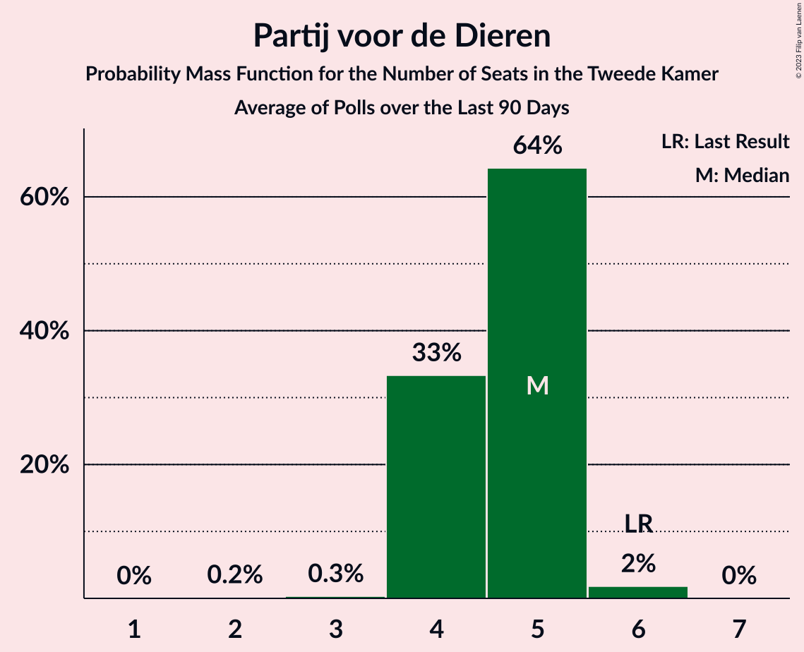

# Poll Average

<a href="#voting-intentions">Voting Intentions</a> | <a href="#seats">Seats</a> | <a href="#coalitions">Coalitions</a> | <a href="#technical-information">Technical Information</a>

## Summary

The table below lists the polls on which the average is based. They are the most recent polls (less than 90 days old) registered and analyzed so far.

| Period     | Polling firm/Commissioner(s) | VVD | PVV | CDA | D66 | GL | SP | PvdA | CU | PvdD | 50+ | SGP | DENK | FvD | PP | B1 | PvdT |
|:----------:|:----------------------------:|:--:|:--:|:--:|:--:|:--:|:--:|:--:|:--:|:--:|:--:|:--:|:--:|:--:|:--:|:--:|:--:|
| 15 March 2017 | General Election | 21.3%   33 | 13.1%   20 | 12.4%   19 | 12.2%   19 | 9.1%   14 | 9.1%   14 | 5.7%   9 | 3.4%   5 | 3.2%   5 | 3.1%   4 | 2.1%   3 | 2.1%   3 | 1.8%   2 | 0.3%   0 | 0.3%   0 | 0.0%   0 |
| N/A | Poll Average | 21–29%   33–43 | 11–19%   19–29 | 6–12%   10–19 | 7–11%   11–15 | 7–10%   10–15 | 5–8%   8–13 | 6–10%   9–16 | 2–5%   2–7 | 3–6%   4–9 | 1–2%   1–3 | 1–3%   1–4 | 1–3%   1–4 | 3–7%   5–11 | N/A   N/A | N/A   N/A | 0%   0–1 |
| [16–17 October 2020](2020-10-17-Peilnl.html) | Peil.nl | 21–23%   32–37 | 15–17%   23–28 | 8–10%   12–15 | 7–9%   10–13 | 7–9%   11–13 | 6–8%   9–13 | 8–10%   12–16 | 3–5%   5–7 | 3–4%   4–6 | 1–2%   1–2 | 2–3%   2–5 | 2–3%   2–4 | 6–8%   8–12 | N/A   N/A | N/A   N/A | 0%   0 |
| [9–12 October 2020](2020-10-12-IOResearch.html) | I&O Research | 25–29%   40–44 | 11–14%   18–19 | 8–10%   13–14 | 8–11%   13–15 | 8–10%   13–14 | 5–7%   8–10 | 8–10%   13–14 | 4–6%   6–7 | 2–4%   5 | 1–2%   1 | 2–3%   3 | 1–2%   1–2 | 4–6%   7–9 | N/A   N/A | N/A   N/A | N/A   N/A |
| [25–29 September 2020](2020-09-29-KantarPublic.html) | Kantar Public | 24–29%   36–44 | 15–20%   24–31 | 6–9%   9–13 | 8–11%   11–15 | 8–11%   13–16 | 5–8%   8–13 | 6–9%   9–13 | 1–3%   2–4 | 4–7%   6–10 | 1–2%   1–2 | 1–3%   2–4 | 1–3%   1–4 | 3–5%   5–8 | N/A   N/A | N/A   N/A | 0–1%   0–1 |
| [25–27 September 2020](2020-09-27-Ipsos.html) | Ipsos   EenVandaag | 23–28%   34–43 | 11–15%   18–23 | 9–13%   13–19 | 7–10%   11–15 | 7–10%   10–14 | 5–8%   8–12 | 7–11%   11–16 | 3–5%   4–7 | 3–6%   5–8 | 1–2%   1–3 | 1–3%   1–4 | 1–2%   0–2 | 4–7%   6–9 | N/A   N/A | N/A   N/A | N/A   N/A |
| 15 March 2017 | General Election | 21.3%   33 | 13.1%   20 | 12.4%   19 | 12.2%   19 | 9.1%   14 | 9.1%   14 | 5.7%   9 | 3.4%   5 | 3.2%   5 | 3.1%   4 | 2.1%   3 | 2.1%   3 | 1.8%   2 | 0.3%   0 | 0.3%   0 | 0.0%   0 |

Only polls for which at least the sample size has been published are included in the table above.

**Legend:**
+ **Top half of each row:** Voting intentions (95% confidence interval)
+ **Bottom half of each row:** Seat projections for the Tweede Kamer (95% confidence interval)
+ **VVD:** Volkspartij voor Vrijheid en Democratie
+ **PVV:** Partij voor de Vrijheid
+ **CDA:** Christen-Democratisch Appèl
+ **D66:** Democraten 66
+ **GL:** GroenLinks
+ **SP:** Socialistische Partij
+ **PvdA:** Partij van de Arbeid
+ **CU:** ChristenUnie
+ **PvdD:** Partij voor de Dieren
+ **50+:** 50Plus
+ **SGP:** Staatkundig Gereformeerde Partij
+ **DENK:** DENK
+ **FvD:** Forum voor Democratie
+ **PP:** Piratenpartij
+ **B1:** Bij1
+ **PvdT:** Partij voor de Toekomst
+ **N/A (single party):** Party not included the published results
+ **N/A (entire row):** Calculation for this opinion poll not started yet

## Voting Intentions

### Confidence Intervals

| Party | Last Result | Median | 80% Confidence Interval | 90% Confidence Interval | 95% Confidence Interval | 99% Confidence Interval |
|:-----:|:-----------:|:------:|:-----------------------:|:-----------------------:|:-----------------------:|:-----------------------:|
| <a href="#volkspartij-voor-vrijheid-en-democratie">Volkspartij voor Vrijheid en Democratie</a> | 21.3% | 25.6% | 21.8–27.7% |21.3–28.2% | 21.0–28.6% | 20.4–29.3% |
| <a href="#partij-voor-de-vrijheid">Partij voor de Vrijheid</a> | 13.1% | 14.8% | 12.0–17.6% |11.6–18.2% | 11.3–18.7% | 10.7–19.6% |
| <a href="#christen-democratisch-appèl">Christen-Democratisch Appèl</a> | 12.4% | 8.8% | 7.2–11.1% |6.7–11.7% | 6.4–12.1% | 5.9–12.9% |
| <a href="#democraten-66">Democraten 66</a> | 12.2% | 8.8% | 7.7–10.1% |7.4–10.4% | 7.2–10.7% | 6.9–11.3% |
| <a href="#groenlinks">GroenLinks</a> | 9.1% | 8.6% | 7.5–9.9% |7.3–10.2% | 7.0–10.5% | 6.5–11.2% |
| <a href="#socialistische-partij">Socialistische Partij</a> | 9.1% | 6.8% | 5.8–7.8% |5.5–8.0% | 5.3–8.2% | 5.0–8.7% |
| <a href="#partij-van-de-arbeid">Partij van de Arbeid</a> | 5.7% | 8.7% | 7.1–9.8% |6.7–10.1% | 6.4–10.3% | 5.9–10.9% |
| <a href="#christenunie">ChristenUnie</a> | 3.4% | 4.0% | 1.9–4.9% |1.7–5.1% | 1.5–5.3% | 1.3–5.8% |
| <a href="#partij-voor-de-dieren">Partij voor de Dieren</a> | 3.2% | 3.9% | 3.0–5.7% |2.8–6.0% | 2.7–6.3% | 2.4–6.9% |
| <a href="#50plus">50Plus</a> | 3.1% | 1.3% | 0.9–1.8% |0.8–2.0% | 0.7–2.2% | 0.6–2.5% |
| <a href="#staatkundig-gereformeerde-partij">Staatkundig Gereformeerde Partij</a> | 2.1% | 2.3% | 1.7–2.9% |1.5–3.1% | 1.4–3.2% | 1.2–3.5% |
| <a href="#denk">DENK</a> | 2.1% | 1.6% | 1.0–2.3% |0.8–2.5% | 0.7–2.6% | 0.6–3.0% |
| <a href="#forum-voor-democratie">Forum voor Democratie</a> | 1.8% | 5.0% | 3.8–6.8% |3.6–7.1% | 3.3–7.3% | 3.0–7.7% |
| <a href="#piratenpartij">Piratenpartij</a> | 0.3% | N/A | N/A |N/A | N/A | N/A |
| <a href="#bij1">Bij1</a> | 0.3% | N/A | N/A |N/A | N/A | N/A |
| <a href="#partij-voor-de-toekomst">Partij voor de Toekomst</a> | 0.0% | 0.2% | 0.1–0.4% |0.1–0.5% | 0.1–0.5% | 0.0–0.7% |

### Volkspartij voor Vrijheid en Democratie

*For a full overview of the results for this party, see the [Volkspartij voor Vrijheid en Democratie](party-volkspartijvoorvrijheidendemocratie.html) page.*

| Voting Intentions | Probability | Accumulated | Special Marks |
|:-----------------:|:-----------:|:-----------:|:-------------:|
| 18.5–19.5% | 0% | 100% |  |
| 19.5–20.5% | 0.7% | 100% |  |
| 20.5–21.5% | 6% | 99.3% | Last Result |
| 21.5–22.5% | 13% | 93% |  |
| 22.5–23.5% | 7% | 80% |  |
| 23.5–24.5% | 7% | 73% |  |
| 24.5–25.5% | 14% | 66% |  |
| 25.5–26.5% | 21% | 52% | Median |
| 26.5–27.5% | 19% | 31% |  |
| 27.5–28.5% | 9% | 12% |  |
| 28.5–29.5% | 2% | 3% |  |
| 29.5–30.5% | 0.3% | 0.3% |  |
| 30.5–31.5% | 0% | 0% |  |

### Partij voor de Vrijheid

*For a full overview of the results for this party, see the [Partij voor de Vrijheid](party-partijvoordevrijheid.html) page.*

| Voting Intentions | Probability | Accumulated | Special Marks |
|:-----------------:|:-----------:|:-----------:|:-------------:|
| 8.5–9.5% | 0% | 100% |  |
| 9.5–10.5% | 0.3% | 100% |  |
| 10.5–11.5% | 4% | 99.7% |  |
| 11.5–12.5% | 17% | 95% |  |
| 12.5–13.5% | 19% | 78% | Last Result |
| 13.5–14.5% | 8% | 59% |  |
| 14.5–15.5% | 9% | 51% | Median |
| 15.5–16.5% | 19% | 43% |  |
| 16.5–17.5% | 13% | 24% |  |
| 17.5–18.5% | 7% | 11% |  |
| 18.5–19.5% | 3% | 3% |  |
| 19.5–20.5% | 0.5% | 0.6% |  |
| 20.5–21.5% | 0.1% | 0.1% |  |
| 21.5–22.5% | 0% | 0% |  |

### Christen-Democratisch Appèl

*For a full overview of the results for this party, see the [Christen-Democratisch Appèl](party-christen-democratischappèl.html) page.*

| Voting Intentions | Probability | Accumulated | Special Marks |
|:-----------------:|:-----------:|:-----------:|:-------------:|
| 3.5–4.5% | 0% | 100% |  |
| 4.5–5.5% | 0.1% | 100% |  |
| 5.5–6.5% | 3% | 99.9% |  |
| 6.5–7.5% | 12% | 97% |  |
| 7.5–8.5% | 26% | 84% |  |
| 8.5–9.5% | 30% | 58% | Median |
| 9.5–10.5% | 12% | 28% |  |
| 10.5–11.5% | 10% | 16% |  |
| 11.5–12.5% | 5% | 6% | Last Result |
| 12.5–13.5% | 1.0% | 1.1% |  |
| 13.5–14.5% | 0.1% | 0.1% |  |
| 14.5–15.5% | 0% | 0% |  |

### Democraten 66

*For a full overview of the results for this party, see the [Democraten 66](party-democraten66.html) page.*

| Voting Intentions | Probability | Accumulated | Special Marks |
|:-----------------:|:-----------:|:-----------:|:-------------:|
| 4.5–5.5% | 0% | 100% |  |
| 5.5–6.5% | 0.1% | 100% |  |
| 6.5–7.5% | 7% | 99.9% |  |
| 7.5–8.5% | 32% | 93% |  |
| 8.5–9.5% | 36% | 61% | Median |
| 9.5–10.5% | 21% | 25% |  |
| 10.5–11.5% | 4% | 4% |  |
| 11.5–12.5% | 0.2% | 0.2% | Last Result |
| 12.5–13.5% | 0% | 0% |  |

### GroenLinks

*For a full overview of the results for this party, see the [GroenLinks](party-groenlinks.html) page.*

| Voting Intentions | Probability | Accumulated | Special Marks |
|:-----------------:|:-----------:|:-----------:|:-------------:|
| 4.5–5.5% | 0% | 100% |  |
| 5.5–6.5% | 0.5% | 100% |  |
| 6.5–7.5% | 10% | 99.5% |  |
| 7.5–8.5% | 38% | 90% |  |
| 8.5–9.5% | 35% | 52% | Last Result, Median |
| 9.5–10.5% | 14% | 17% |  |
| 10.5–11.5% | 2% | 2% |  |
| 11.5–12.5% | 0.2% | 0.2% |  |
| 12.5–13.5% | 0% | 0% |  |

### Socialistische Partij

*For a full overview of the results for this party, see the [Socialistische Partij](party-socialistischepartij.html) page.*

| Voting Intentions | Probability | Accumulated | Special Marks |
|:-----------------:|:-----------:|:-----------:|:-------------:|
| 3.5–4.5% | 0% | 100% |  |
| 4.5–5.5% | 5% | 100% |  |
| 5.5–6.5% | 34% | 95% |  |
| 6.5–7.5% | 44% | 60% | Median |
| 7.5–8.5% | 15% | 16% |  |
| 8.5–9.5% | 0.8% | 0.8% | Last Result |
| 9.5–10.5% | 0% | 0% |  |

### Partij van de Arbeid

*For a full overview of the results for this party, see the [Partij van de Arbeid](party-partijvandearbeid.html) page.*

| Voting Intentions | Probability | Accumulated | Special Marks |
|:-----------------:|:-----------:|:-----------:|:-------------:|
| 3.5–4.5% | 0% | 100% |  |
| 4.5–5.5% | 0.1% | 100% |  |
| 5.5–6.5% | 3% | 99.9% | Last Result |
| 6.5–7.5% | 14% | 97% |  |
| 7.5–8.5% | 26% | 83% |  |
| 8.5–9.5% | 39% | 57% | Median |
| 9.5–10.5% | 16% | 17% |  |
| 10.5–11.5% | 1.3% | 1.3% |  |
| 11.5–12.5% | 0.1% | 0.1% |  |
| 12.5–13.5% | 0% | 0% |  |

### ChristenUnie

*For a full overview of the results for this party, see the [ChristenUnie](party-christenunie.html) page.*

| Voting Intentions | Probability | Accumulated | Special Marks |
|:-----------------:|:-----------:|:-----------:|:-------------:|
| 0.0–0.5% | 0% | 100% |  |
| 0.5–1.5% | 3% | 100% |  |
| 1.5–2.5% | 19% | 97% |  |
| 2.5–3.5% | 11% | 78% | Last Result |
| 3.5–4.5% | 46% | 66% | Median |
| 4.5–5.5% | 19% | 20% |  |
| 5.5–6.5% | 1.2% | 1.2% |  |
| 6.5–7.5% | 0% | 0% |  |

### Partij voor de Dieren

*For a full overview of the results for this party, see the [Partij voor de Dieren](party-partijvoordedieren.html) page.*

| Voting Intentions | Probability | Accumulated | Special Marks |
|:-----------------:|:-----------:|:-----------:|:-------------:|
| 0.5–1.5% | 0% | 100% |  |
| 1.5–2.5% | 1.0% | 100% |  |
| 2.5–3.5% | 38% | 99.0% | Last Result |
| 3.5–4.5% | 27% | 61% | Median |
| 4.5–5.5% | 23% | 35% |  |
| 5.5–6.5% | 11% | 12% |  |
| 6.5–7.5% | 1.3% | 1.3% |  |
| 7.5–8.5% | 0% | 0% |  |
| 8.5–9.5% | 0% | 0% |  |

### 50Plus

*For a full overview of the results for this party, see the [50Plus](party-50plus.html) page.*

| Voting Intentions | Probability | Accumulated | Special Marks |
|:-----------------:|:-----------:|:-----------:|:-------------:|
| 0.0–0.5% | 0.2% | 100% |  |
| 0.5–1.5% | 73% | 99.8% | Median |
| 1.5–2.5% | 26% | 27% |  |
| 2.5–3.5% | 0.5% | 0.5% | Last Result |
| 3.5–4.5% | 0% | 0% |  |

### Staatkundig Gereformeerde Partij

*For a full overview of the results for this party, see the [Staatkundig Gereformeerde Partij](party-staatkundiggereformeerdepartij.html) page.*

| Voting Intentions | Probability | Accumulated | Special Marks |
|:-----------------:|:-----------:|:-----------:|:-------------:|
| 0.0–0.5% | 0% | 100% |  |
| 0.5–1.5% | 7% | 100% |  |
| 1.5–2.5% | 59% | 93% | Last Result, Median |
| 2.5–3.5% | 34% | 35% |  |
| 3.5–4.5% | 0.3% | 0.3% |  |
| 4.5–5.5% | 0% | 0% |  |

### DENK

*For a full overview of the results for this party, see the [DENK](party-denk.html) page.*

| Voting Intentions | Probability | Accumulated | Special Marks |
|:-----------------:|:-----------:|:-----------:|:-------------:|
| 0.0–0.5% | 0.4% | 100% |  |
| 0.5–1.5% | 45% | 99.6% |  |
| 1.5–2.5% | 51% | 55% | Last Result, Median |
| 2.5–3.5% | 4% | 4% |  |
| 3.5–4.5% | 0% | 0% |  |

### Forum voor Democratie

*For a full overview of the results for this party, see the [Forum voor Democratie](party-forumvoordemocratie.html) page.*

| Voting Intentions | Probability | Accumulated | Special Marks |
|:-----------------:|:-----------:|:-----------:|:-------------:|
| 1.5–2.5% | 0% | 100% | Last Result |
| 2.5–3.5% | 5% | 100% |  |
| 3.5–4.5% | 27% | 95% |  |
| 4.5–5.5% | 34% | 68% | Median |
| 5.5–6.5% | 18% | 34% |  |
| 6.5–7.5% | 15% | 16% |  |
| 7.5–8.5% | 0.9% | 0.9% |  |
| 8.5–9.5% | 0% | 0% |  |

### Partij voor de Toekomst

*For a full overview of the results for this party, see the [Partij voor de Toekomst](party-partijvoordetoekomst.html) page.*

| Voting Intentions | Probability | Accumulated | Special Marks |
|:-----------------:|:-----------:|:-----------:|:-------------:|
| 0.0–0.5% | 98% | 100% | Last Result, Median |
| 0.5–1.5% | 2% | 2% |  |
| 1.5–2.5% | 0% | 0% |  |

## Seats

### Confidence Intervals

| Party | Last Result | Median | 80% Confidence Interval | 90% Confidence Interval | 95% Confidence Interval | 99% Confidence Interval |
|:-----:|:-----------:|:------:|:-----------------------:|:-----------------------:|:-----------------------:|:-----------------------:|
| <a href="#volkspartij-voor-vrijheid-en-democratie">Volkspartij voor Vrijheid en Democratie</a> | 33 | 39 | 33–42 |33–42 | 33–43 | 32–44 |
| <a href="#partij-voor-de-vrijheid">Partij voor de Vrijheid</a> | 20 | 23 | 19–29 |19–29 | 19–29 | 17–31 |
| <a href="#christen-democratisch-appèl">Christen-Democratisch Appèl</a> | 19 | 13 | 12–19 |10–19 | 10–19 | 8–19 |
| <a href="#democraten-66">Democraten 66</a> | 19 | 13 | 11–15 |11–15 | 11–15 | 10–16 |
| <a href="#groenlinks">GroenLinks</a> | 14 | 13 | 11–14 |11–14 | 10–15 | 9–16 |
| <a href="#socialistische-partij">Socialistische Partij</a> | 14 | 10 | 9–12 |9–13 | 8–13 | 8–13 |
| <a href="#partij-van-de-arbeid">Partij van de Arbeid</a> | 9 | 13 | 11–15 |10–15 | 9–16 | 8–16 |
| <a href="#christenunie">ChristenUnie</a> | 5 | 6 | 3–6 |3–7 | 2–7 | 2–8 |
| <a href="#partij-voor-de-dieren">Partij voor de Dieren</a> | 5 | 5 | 5–9 |4–9 | 4–9 | 4–10 |
| <a href="#50plus">50Plus</a> | 4 | 1 | 1–2 |1–2 | 1–3 | 1–4 |
| <a href="#staatkundig-gereformeerde-partij">Staatkundig Gereformeerde Partij</a> | 3 | 3 | 2–4 |2–4 | 1–4 | 1–5 |
| <a href="#denk">DENK</a> | 3 | 2 | 1–3 |1–4 | 1–4 | 0–4 |
| <a href="#forum-voor-democratie">Forum voor Democratie</a> | 2 | 7 | 5–10 |5–10 | 5–11 | 4–12 |
| <a href="#piratenpartij">Piratenpartij</a> | 0 | N/A | N/A |N/A | N/A | N/A |
| <a href="#bij1">Bij1</a> | 0 | N/A | N/A |N/A | N/A | N/A |
| <a href="#partij-voor-de-toekomst">Partij voor de Toekomst</a> | 0 | 0 | 0 |0 | 0–1 | 0–1 |

### Volkspartij voor Vrijheid en Democratie

*For a full overview of the results for this party, see the [Volkspartij voor Vrijheid en Democratie](party-volkspartijvoorvrijheidendemocratie.html) page.*

| Number of Seats | Probability | Accumulated | Special Marks |
|:---------------:|:-----------:|:-----------:|:-------------:|
| 31 | 0.4% | 100% |  |
| 32 | 2% | 99.5% |  |
| 33 | 11% | 98% | Last Result |
| 34 | 4% | 87% |  |
| 35 | 8% | 83% |  |
| 36 | 7% | 75% |  |
| 37 | 2% | 68% |  |
| 38 | 13% | 66% |  |
| 39 | 4% | 53% | Median |
| 40 | 3% | 49% |  |
| 41 | 17% | 46% |  |
| 42 | 25% | 29% |  |
| 43 | 1.4% | 4% |  |
| 44 | 2% | 2% |  |
| 45 | 0.1% | 0.5% |  |
| 46 | 0.4% | 0.4% |  |
| 47 | 0% | 0% |  |

### Partij voor de Vrijheid

*For a full overview of the results for this party, see the [Partij voor de Vrijheid](party-partijvoordevrijheid.html) page.*

| Number of Seats | Probability | Accumulated | Special Marks |
|:---------------:|:-----------:|:-----------:|:-------------:|
| 16 | 0.1% | 100% |  |
| 17 | 0.5% | 99.8% |  |
| 18 | 2% | 99.4% |  |
| 19 | 29% | 98% |  |
| 20 | 4% | 69% | Last Result |
| 21 | 1.3% | 64% |  |
| 22 | 11% | 63% |  |
| 23 | 4% | 52% | Median |
| 24 | 6% | 48% |  |
| 25 | 8% | 42% |  |
| 26 | 4% | 34% |  |
| 27 | 6% | 30% |  |
| 28 | 11% | 24% |  |
| 29 | 12% | 13% |  |
| 30 | 0.4% | 1.1% |  |
| 31 | 0.6% | 0.6% |  |
| 32 | 0% | 0% |  |

### Christen-Democratisch Appèl

*For a full overview of the results for this party, see the [Christen-Democratisch Appèl](party-christen-democratischappèl.html) page.*

| Number of Seats | Probability | Accumulated | Special Marks |
|:---------------:|:-----------:|:-----------:|:-------------:|
| 8 | 0.5% | 100% |  |
| 9 | 1.2% | 99.5% |  |
| 10 | 5% | 98% |  |
| 11 | 2% | 94% |  |
| 12 | 25% | 92% |  |
| 13 | 31% | 66% | Median |
| 14 | 11% | 35% |  |
| 15 | 3% | 25% |  |
| 16 | 8% | 22% |  |
| 17 | 1.1% | 14% |  |
| 18 | 2% | 12% |  |
| 19 | 10% | 10% | Last Result |
| 20 | 0.1% | 0.3% |  |
| 21 | 0.2% | 0.2% |  |
| 22 | 0% | 0% |  |

### Democraten 66

*For a full overview of the results for this party, see the [Democraten 66](party-democraten66.html) page.*

| Number of Seats | Probability | Accumulated | Special Marks |
|:---------------:|:-----------:|:-----------:|:-------------:|
| 10 | 1.4% | 100% |  |
| 11 | 18% | 98.6% |  |
| 12 | 20% | 81% |  |
| 13 | 27% | 61% | Median |
| 14 | 7% | 33% |  |
| 15 | 25% | 26% |  |
| 16 | 0.9% | 1.2% |  |
| 17 | 0.1% | 0.3% |  |
| 18 | 0.2% | 0.2% |  |
| 19 | 0% | 0% | Last Result |

### GroenLinks

*For a full overview of the results for this party, see the [GroenLinks](party-groenlinks.html) page.*

| Number of Seats | Probability | Accumulated | Special Marks |
|:---------------:|:-----------:|:-----------:|:-------------:|
| 9 | 0.5% | 100% |  |
| 10 | 2% | 99.5% |  |
| 11 | 21% | 97% |  |
| 12 | 14% | 77% |  |
| 13 | 50% | 62% | Median |
| 14 | 10% | 13% | Last Result |
| 15 | 2% | 3% |  |
| 16 | 0.5% | 0.9% |  |
| 17 | 0.3% | 0.4% |  |
| 18 | 0% | 0.1% |  |
| 19 | 0.1% | 0.1% |  |
| 20 | 0% | 0% |  |

### Socialistische Partij

*For a full overview of the results for this party, see the [Socialistische Partij](party-socialistischepartij.html) page.*

| Number of Seats | Probability | Accumulated | Special Marks |
|:---------------:|:-----------:|:-----------:|:-------------:|
| 7 | 0.2% | 100% |  |
| 8 | 4% | 99.8% |  |
| 9 | 16% | 96% |  |
| 10 | 40% | 80% | Median |
| 11 | 28% | 39% |  |
| 12 | 5% | 11% |  |
| 13 | 5% | 6% |  |
| 14 | 0.3% | 0.3% | Last Result |
| 15 | 0% | 0% |  |

### Partij van de Arbeid

*For a full overview of the results for this party, see the [Partij van de Arbeid](party-partijvandearbeid.html) page.*

| Number of Seats | Probability | Accumulated | Special Marks |
|:---------------:|:-----------:|:-----------:|:-------------:|
| 8 | 0.6% | 100% |  |
| 9 | 3% | 99.4% | Last Result |
| 10 | 3% | 97% |  |
| 11 | 15% | 94% |  |
| 12 | 7% | 79% |  |
| 13 | 25% | 73% | Median |
| 14 | 28% | 47% |  |
| 15 | 16% | 19% |  |
| 16 | 3% | 3% |  |
| 17 | 0.3% | 0.3% |  |
| 18 | 0% | 0% |  |

### ChristenUnie

*For a full overview of the results for this party, see the [ChristenUnie](party-christenunie.html) page.*

| Number of Seats | Probability | Accumulated | Special Marks |
|:---------------:|:-----------:|:-----------:|:-------------:|
| 1 | 0.3% | 100% |  |
| 2 | 4% | 99.7% |  |
| 3 | 18% | 95% |  |
| 4 | 5% | 78% |  |
| 5 | 21% | 73% | Last Result |
| 6 | 45% | 52% | Median |
| 7 | 7% | 7% |  |
| 8 | 0.8% | 0.9% |  |
| 9 | 0.1% | 0.1% |  |
| 10 | 0% | 0% |  |

### Partij voor de Dieren

*For a full overview of the results for this party, see the [Partij voor de Dieren](party-partijvoordedieren.html) page.*

| Number of Seats | Probability | Accumulated | Special Marks |
|:---------------:|:-----------:|:-----------:|:-------------:|
| 3 | 0.1% | 100% |  |
| 4 | 8% | 99.9% |  |
| 5 | 42% | 92% | Last Result, Median |
| 6 | 16% | 50% |  |
| 7 | 13% | 34% |  |
| 8 | 7% | 21% |  |
| 9 | 13% | 14% |  |
| 10 | 0.6% | 0.7% |  |
| 11 | 0.1% | 0.1% |  |
| 12 | 0% | 0% |  |

### 50Plus

*For a full overview of the results for this party, see the [50Plus](party-50plus.html) page.*

| Number of Seats | Probability | Accumulated | Special Marks |
|:---------------:|:-----------:|:-----------:|:-------------:|
| 1 | 70% | 100% | Median |
| 2 | 27% | 30% |  |
| 3 | 2% | 3% |  |
| 4 | 0.5% | 0.5% | Last Result |
| 5 | 0% | 0% |  |

### Staatkundig Gereformeerde Partij

*For a full overview of the results for this party, see the [Staatkundig Gereformeerde Partij](party-staatkundiggereformeerdepartij.html) page.*

| Number of Seats | Probability | Accumulated | Special Marks |
|:---------------:|:-----------:|:-----------:|:-------------:|
| 1 | 3% | 100% |  |
| 2 | 18% | 97% |  |
| 3 | 60% | 79% | Last Result, Median |
| 4 | 17% | 18% |  |
| 5 | 1.2% | 1.2% |  |
| 6 | 0% | 0% |  |

### DENK

*For a full overview of the results for this party, see the [DENK](party-denk.html) page.*

| Number of Seats | Probability | Accumulated | Special Marks |
|:---------------:|:-----------:|:-----------:|:-------------:|
| 0 | 1.0% | 100% |  |
| 1 | 41% | 99.0% |  |
| 2 | 32% | 58% | Median |
| 3 | 19% | 26% | Last Result |
| 4 | 6% | 6% |  |
| 5 | 0.4% | 0.4% |  |
| 6 | 0% | 0% |  |

### Forum voor Democratie

*For a full overview of the results for this party, see the [Forum voor Democratie](party-forumvoordemocratie.html) page.*

| Number of Seats | Probability | Accumulated | Special Marks |
|:---------------:|:-----------:|:-----------:|:-------------:|
| 2 | 0% | 100% | Last Result |
| 3 | 0% | 100% |  |
| 4 | 0.6% | 100% |  |
| 5 | 14% | 99.4% |  |
| 6 | 14% | 86% |  |
| 7 | 29% | 72% | Median |
| 8 | 15% | 43% |  |
| 9 | 12% | 28% |  |
| 10 | 13% | 16% |  |
| 11 | 2% | 3% |  |
| 12 | 0.8% | 1.0% |  |
| 13 | 0.2% | 0.2% |  |
| 14 | 0% | 0% |  |

### Piratenpartij

*For a full overview of the results for this party, see the [Piratenpartij](party-piratenpartij.html) page.*

### Bij1

*For a full overview of the results for this party, see the [Bij1](party-bij1.html) page.*

### Partij voor de Toekomst

*For a full overview of the results for this party, see the [Partij voor de Toekomst](party-partijvoordetoekomst.html) page.*

| Number of Seats | Probability | Accumulated | Special Marks |
|:---------------:|:-----------:|:-----------:|:-------------:|
| 0 | 96% | 100% | Last Result, Median |
| 1 | 4% | 4% |  |
| 2 | 0% | 0% |  |

## Coalitions

### Confidence Intervals

| Coalition | Last Result | Median | Majority? | 80% Confidence Interval | 90% Confidence Interval | 95% Confidence Interval | 99% Confidence Interval |
|:---------:|:-----------:|:------:|:---------:|:-----------------------:|:-----------------------:|:-----------------------:|:-----------------------:|
| Volkspartij voor Vrijheid en Democratie – Partij voor de Vrijheid – Christen-Democratisch Appèl – Staatkundig Gereformeerde Partij – Forum voor Democratie | 77 | 86 | 100% | 84–90 | 82–90 | 82–90 | 80–93 |
| Volkspartij voor Vrijheid en Democratie – Christen-Democratisch Appèl – Democraten 66 – GroenLinks – ChristenUnie | 90 | 83 | 98% | 76–89 | 76–89 | 76–90 | 74–91 |
| Volkspartij voor Vrijheid en Democratie – Christen-Democratisch Appèl – Democraten 66 – Partij van de Arbeid – ChristenUnie | 85 | 83 | 97% | 78–90 | 76–90 | 75–90 | 75–93 |
| Volkspartij voor Vrijheid en Democratie – Partij voor de Vrijheid – Christen-Democratisch Appèl – Forum voor Democratie | 74 | 82 | 99.9% | 80–87 | 80–87 | 79–87 | 77–90 |
| Volkspartij voor Vrijheid en Democratie – Partij voor de Vrijheid – Christen-Democratisch Appèl | 72 | 74 | 35% | 71–82 | 71–82 | 70–82 | 69–82 |
| Volkspartij voor Vrijheid en Democratie – Christen-Democratisch Appèl – Democraten 66 – ChristenUnie | 76 | 69 | 27% | 65–76 | 64–76 | 64–77 | 62–79 |
| Christen-Democratisch Appèl – Democraten 66 – GroenLinks – Socialistische Partij – Partij van de Arbeid – ChristenUnie | 80 | 70 | 0.4% | 61–72 | 61–72 | 58–74 | 57–75 |
| Volkspartij voor Vrijheid en Democratie – Christen-Democratisch Appèl – Democraten 66 | 71 | 65 | 0% | 59–70 | 59–70 | 58–72 | 56–73 |
| Volkspartij voor Vrijheid en Democratie – Christen-Democratisch Appèl – Partij van de Arbeid | 61 | 64 | 0% | 60–70 | 59–70 | 59–71 | 58–74 |
| Volkspartij voor Vrijheid en Democratie – Democraten 66 – Partij van de Arbeid | 61 | 63 | 0% | 60–71 | 59–71 | 58–71 | 57–71 |
| Volkspartij voor Vrijheid en Democratie – Christen-Democratisch Appèl – 50Plus – Staatkundig Gereformeerde Partij – Forum voor Democratie | 61 | 64 | 0% | 61–69 | 60–69 | 59–70 | 58–72 |
| Volkspartij voor Vrijheid en Democratie – Christen-Democratisch Appèl – Staatkundig Gereformeerde Partij – Forum voor Democratie | 57 | 62 | 0% | 59–68 | 58–68 | 58–69 | 56–71 |
| Volkspartij voor Vrijheid en Democratie – Christen-Democratisch Appèl – 50Plus – Forum voor Democratie | 58 | 60 | 0% | 57–66 | 57–66 | 56–67 | 55–69 |
| Volkspartij voor Vrijheid en Democratie – Christen-Democratisch Appèl – Forum voor Democratie | 54 | 58 | 0% | 56–65 | 55–65 | 55–66 | 54–68 |
| Christen-Democratisch Appèl – Democraten 66 – GroenLinks – Partij van de Arbeid – ChristenUnie | 66 | 59 | 0% | 50–62 | 50–63 | 49–64 | 48–66 |
| Volkspartij voor Vrijheid en Democratie – Christen-Democratisch Appèl | 52 | 53 | 0% | 47–57 | 46–57 | 46–58 | 45–60 |
| Volkspartij voor Vrijheid en Democratie – Partij van de Arbeid | 42 | 52 | 0% | 48–56 | 46–56 | 46–56 | 45–58 |
| Christen-Democratisch Appèl – Democraten 66 – Partij van de Arbeid | 47 | 41 | 0% | 34–44 | 34–44 | 33–46 | 31–48 |
| Christen-Democratisch Appèl – Partij van de Arbeid – ChristenUnie | 33 | 33 | 0% | 26–37 | 24–38 | 21–39 | 21–41 |
| Christen-Democratisch Appèl – Partij van de Arbeid | 28 | 27 | 0% | 23–32 | 22–32 | 19–33 | 18–35 |
| Christen-Democratisch Appèl – Democraten 66 | 38 | 27 | 0% | 23–31 | 23–31 | 23–32 | 21–33 |

### Volkspartij voor Vrijheid en Democratie – Partij voor de Vrijheid – Christen-Democratisch Appèl – Staatkundig Gereformeerde Partij – Forum voor Democratie

| Number of Seats | Probability | Accumulated | Special Marks |
|:---------------:|:-----------:|:-----------:|:-------------:|
| 77 | 0% | 100% | Last Result |
| 78 | 0% | 100% |  |
| 79 | 0.2% | 99.9% |  |
| 80 | 0.2% | 99.7% |  |
| 81 | 0.7% | 99.5% |  |
| 82 | 4% | 98.8% |  |
| 83 | 4% | 95% |  |
| 84 | 34% | 90% |  |
| 85 | 6% | 56% | Median |
| 86 | 5% | 50% |  |
| 87 | 8% | 45% |  |
| 88 | 13% | 38% |  |
| 89 | 14% | 25% |  |
| 90 | 8% | 11% |  |
| 91 | 2% | 2% |  |
| 92 | 0% | 0.6% |  |
| 93 | 0.6% | 0.6% |  |
| 94 | 0% | 0% |  |

### Volkspartij voor Vrijheid en Democratie – Christen-Democratisch Appèl – Democraten 66 – GroenLinks – ChristenUnie

| Number of Seats | Probability | Accumulated | Special Marks |
|:---------------:|:-----------:|:-----------:|:-------------:|
| 73 | 0.2% | 100% |  |
| 74 | 0.7% | 99.7% |  |
| 75 | 2% | 99.0% |  |
| 76 | 8% | 98% | Majority |
| 77 | 10% | 90% |  |
| 78 | 4% | 80% |  |
| 79 | 7% | 76% |  |
| 80 | 13% | 69% |  |
| 81 | 4% | 56% |  |
| 82 | 0.8% | 52% |  |
| 83 | 3% | 51% |  |
| 84 | 2% | 48% | Median |
| 85 | 10% | 46% |  |
| 86 | 5% | 36% |  |
| 87 | 4% | 31% |  |
| 88 | 1.0% | 28% |  |
| 89 | 23% | 27% |  |
| 90 | 1.3% | 3% | Last Result |
| 91 | 2% | 2% |  |
| 92 | 0.1% | 0.2% |  |
| 93 | 0% | 0.1% |  |
| 94 | 0% | 0% |  |

### Volkspartij voor Vrijheid en Democratie – Christen-Democratisch Appèl – Democraten 66 – Partij van de Arbeid – ChristenUnie

| Number of Seats | Probability | Accumulated | Special Marks |
|:---------------:|:-----------:|:-----------:|:-------------:|
| 72 | 0% | 100% |  |
| 73 | 0.2% | 99.9% |  |
| 74 | 0.1% | 99.8% |  |
| 75 | 3% | 99.7% |  |
| 76 | 3% | 97% | Majority |
| 77 | 1.2% | 94% |  |
| 78 | 24% | 92% |  |
| 79 | 7% | 69% |  |
| 80 | 6% | 62% |  |
| 81 | 4% | 56% |  |
| 82 | 2% | 52% |  |
| 83 | 2% | 50% |  |
| 84 | 4% | 48% | Median |
| 85 | 0.9% | 44% | Last Result |
| 86 | 0.9% | 43% |  |
| 87 | 9% | 42% |  |
| 88 | 1.3% | 34% |  |
| 89 | 1.3% | 32% |  |
| 90 | 29% | 31% |  |
| 91 | 0.4% | 1.4% |  |
| 92 | 0.5% | 1.1% |  |
| 93 | 0.2% | 0.6% |  |
| 94 | 0% | 0.4% |  |
| 95 | 0.3% | 0.3% |  |
| 96 | 0% | 0% |  |

### Volkspartij voor Vrijheid en Democratie – Partij voor de Vrijheid – Christen-Democratisch Appèl – Forum voor Democratie

| Number of Seats | Probability | Accumulated | Special Marks |
|:---------------:|:-----------:|:-----------:|:-------------:|
| 74 | 0% | 100% | Last Result |
| 75 | 0% | 100% |  |
| 76 | 0.2% | 99.9% | Majority |
| 77 | 0.3% | 99.7% |  |
| 78 | 1.2% | 99.4% |  |
| 79 | 2% | 98% |  |
| 80 | 8% | 96% |  |
| 81 | 34% | 88% |  |
| 82 | 4% | 54% | Median |
| 83 | 8% | 50% |  |
| 84 | 5% | 41% |  |
| 85 | 11% | 36% |  |
| 86 | 1.1% | 25% |  |
| 87 | 22% | 24% |  |
| 88 | 2% | 2% |  |
| 89 | 0.1% | 0.7% |  |
| 90 | 0.6% | 0.6% |  |
| 91 | 0% | 0% |  |

### Volkspartij voor Vrijheid en Democratie – Partij voor de Vrijheid – Christen-Democratisch Appèl

| Number of Seats | Probability | Accumulated | Special Marks |
|:---------------:|:-----------:|:-----------:|:-------------:|
| 68 | 0.2% | 100% |  |
| 69 | 1.0% | 99.8% |  |
| 70 | 3% | 98.7% |  |
| 71 | 8% | 96% |  |
| 72 | 2% | 88% | Last Result |
| 73 | 5% | 87% |  |
| 74 | 35% | 82% |  |
| 75 | 12% | 47% | Median |
| 76 | 2% | 35% | Majority |
| 77 | 2% | 34% |  |
| 78 | 4% | 31% |  |
| 79 | 13% | 28% |  |
| 80 | 0.8% | 14% |  |
| 81 | 0.2% | 13% |  |
| 82 | 13% | 13% |  |
| 83 | 0% | 0% |  |

### Volkspartij voor Vrijheid en Democratie – Christen-Democratisch Appèl – Democraten 66 – ChristenUnie

| Number of Seats | Probability | Accumulated | Special Marks |
|:---------------:|:-----------:|:-----------:|:-------------:|
| 61 | 0.4% | 100% |  |
| 62 | 0.9% | 99.6% |  |
| 63 | 1.1% | 98.7% |  |
| 64 | 4% | 98% |  |
| 65 | 15% | 94% |  |
| 66 | 10% | 79% |  |
| 67 | 16% | 69% |  |
| 68 | 1.3% | 53% |  |
| 69 | 4% | 52% |  |
| 70 | 0.7% | 48% |  |
| 71 | 3% | 48% | Median |
| 72 | 0.3% | 45% |  |
| 73 | 2% | 44% |  |
| 74 | 11% | 42% |  |
| 75 | 4% | 31% |  |
| 76 | 23% | 27% | Last Result, Majority |
| 77 | 2% | 4% |  |
| 78 | 1.3% | 2% |  |
| 79 | 0.4% | 0.8% |  |
| 80 | 0% | 0.4% |  |
| 81 | 0.4% | 0.4% |  |
| 82 | 0% | 0% |  |

### Christen-Democratisch Appèl – Democraten 66 – GroenLinks – Socialistische Partij – Partij van de Arbeid – ChristenUnie

| Number of Seats | Probability | Accumulated | Special Marks |
|:---------------:|:-----------:|:-----------:|:-------------:|
| 56 | 0.4% | 100% |  |
| 57 | 0.6% | 99.6% |  |
| 58 | 3% | 99.0% |  |
| 59 | 0.2% | 96% |  |
| 60 | 0.5% | 96% |  |
| 61 | 12% | 96% |  |
| 62 | 1.0% | 83% |  |
| 63 | 3% | 82% |  |
| 64 | 8% | 79% |  |
| 65 | 1.2% | 71% |  |
| 66 | 3% | 70% |  |
| 67 | 6% | 67% |  |
| 68 | 7% | 61% | Median |
| 69 | 2% | 54% |  |
| 70 | 6% | 52% |  |
| 71 | 34% | 45% |  |
| 72 | 7% | 11% |  |
| 73 | 0.9% | 4% |  |
| 74 | 0.8% | 3% |  |
| 75 | 2% | 2% |  |
| 76 | 0.1% | 0.4% | Majority |
| 77 | 0.2% | 0.2% |  |
| 78 | 0% | 0% |  |
| 79 | 0% | 0% |  |
| 80 | 0% | 0% | Last Result |

### Volkspartij voor Vrijheid en Democratie – Christen-Democratisch Appèl – Democraten 66

| Number of Seats | Probability | Accumulated | Special Marks |
|:---------------:|:-----------:|:-----------:|:-------------:|
| 55 | 0.1% | 100% |  |
| 56 | 0.7% | 99.9% |  |
| 57 | 0.7% | 99.2% |  |
| 58 | 3% | 98% |  |
| 59 | 6% | 95% |  |
| 60 | 13% | 89% |  |
| 61 | 4% | 77% |  |
| 62 | 0.6% | 72% |  |
| 63 | 6% | 72% |  |
| 64 | 13% | 65% |  |
| 65 | 4% | 52% | Median |
| 66 | 1.0% | 48% |  |
| 67 | 5% | 47% |  |
| 68 | 6% | 42% |  |
| 69 | 8% | 37% |  |
| 70 | 25% | 28% |  |
| 71 | 0.5% | 3% | Last Result |
| 72 | 2% | 3% |  |
| 73 | 0.4% | 0.7% |  |
| 74 | 0.1% | 0.3% |  |
| 75 | 0.2% | 0.2% |  |
| 76 | 0% | 0% | Majority |

### Volkspartij voor Vrijheid en Democratie – Christen-Democratisch Appèl – Partij van de Arbeid

| Number of Seats | Probability | Accumulated | Special Marks |
|:---------------:|:-----------:|:-----------:|:-------------:|
| 54 | 0% | 100% |  |
| 55 | 0% | 99.9% |  |
| 56 | 0% | 99.9% |  |
| 57 | 0.2% | 99.9% |  |
| 58 | 0.7% | 99.7% |  |
| 59 | 5% | 99.1% |  |
| 60 | 12% | 94% |  |
| 61 | 5% | 82% | Last Result |
| 62 | 8% | 77% |  |
| 63 | 5% | 69% |  |
| 64 | 15% | 65% |  |
| 65 | 1.0% | 50% | Median |
| 66 | 2% | 49% |  |
| 67 | 5% | 47% |  |
| 68 | 0.6% | 42% |  |
| 69 | 23% | 41% |  |
| 70 | 13% | 18% |  |
| 71 | 3% | 5% |  |
| 72 | 0.5% | 2% |  |
| 73 | 0.3% | 1.2% |  |
| 74 | 0.9% | 0.9% |  |
| 75 | 0% | 0% |  |

### Volkspartij voor Vrijheid en Democratie – Democraten 66 – Partij van de Arbeid

| Number of Seats | Probability | Accumulated | Special Marks |
|:---------------:|:-----------:|:-----------:|:-------------:|
| 56 | 0% | 100% |  |
| 57 | 0.7% | 99.9% |  |
| 58 | 4% | 99.2% |  |
| 59 | 3% | 95% |  |
| 60 | 8% | 93% |  |
| 61 | 11% | 85% | Last Result |
| 62 | 5% | 74% |  |
| 63 | 23% | 69% |  |
| 64 | 7% | 46% |  |
| 65 | 4% | 39% | Median |
| 66 | 3% | 36% |  |
| 67 | 4% | 33% |  |
| 68 | 2% | 29% |  |
| 69 | 2% | 27% |  |
| 70 | 2% | 25% |  |
| 71 | 23% | 24% |  |
| 72 | 0.1% | 0.2% |  |
| 73 | 0.2% | 0.2% |  |
| 74 | 0% | 0% |  |

### Volkspartij voor Vrijheid en Democratie – Christen-Democratisch Appèl – 50Plus – Staatkundig Gereformeerde Partij – Forum voor Democratie

| Number of Seats | Probability | Accumulated | Special Marks |
|:---------------:|:-----------:|:-----------:|:-------------:|
| 55 | 0.1% | 100% |  |
| 56 | 0.1% | 99.9% |  |
| 57 | 0.1% | 99.9% |  |
| 58 | 0.8% | 99.8% |  |
| 59 | 3% | 98.9% |  |
| 60 | 5% | 96% |  |
| 61 | 21% | 90% | Last Result |
| 62 | 13% | 69% |  |
| 63 | 4% | 56% | Median |
| 64 | 5% | 52% |  |
| 65 | 4% | 47% |  |
| 66 | 24% | 43% |  |
| 67 | 3% | 18% |  |
| 68 | 3% | 15% |  |
| 69 | 9% | 13% |  |
| 70 | 2% | 4% |  |
| 71 | 0.4% | 2% |  |
| 72 | 1.2% | 1.4% |  |
| 73 | 0.1% | 0.1% |  |
| 74 | 0% | 0% |  |

### Volkspartij voor Vrijheid en Democratie – Christen-Democratisch Appèl – Staatkundig Gereformeerde Partij – Forum voor Democratie

| Number of Seats | Probability | Accumulated | Special Marks |
|:---------------:|:-----------:|:-----------:|:-------------:|
| 53 | 0.1% | 100% |  |
| 54 | 0.1% | 99.9% |  |
| 55 | 0% | 99.8% |  |
| 56 | 0.3% | 99.8% |  |
| 57 | 0.8% | 99.5% | Last Result |
| 58 | 4% | 98.6% |  |
| 59 | 7% | 95% |  |
| 60 | 30% | 88% |  |
| 61 | 4% | 58% |  |
| 62 | 7% | 54% | Median |
| 63 | 5% | 47% |  |
| 64 | 2% | 43% |  |
| 65 | 24% | 41% |  |
| 66 | 4% | 18% |  |
| 67 | 2% | 14% |  |
| 68 | 9% | 12% |  |
| 69 | 2% | 3% |  |
| 70 | 0.5% | 1.3% |  |
| 71 | 0.7% | 0.8% |  |
| 72 | 0% | 0% |  |

### Volkspartij voor Vrijheid en Democratie – Christen-Democratisch Appèl – 50Plus – Forum voor Democratie

| Number of Seats | Probability | Accumulated | Special Marks |
|:---------------:|:-----------:|:-----------:|:-------------:|
| 53 | 0.1% | 100% |  |
| 54 | 0.1% | 99.9% |  |
| 55 | 1.2% | 99.8% |  |
| 56 | 3% | 98.6% |  |
| 57 | 13% | 96% |  |
| 58 | 3% | 82% | Last Result |
| 59 | 25% | 79% |  |
| 60 | 5% | 55% | Median |
| 61 | 3% | 50% |  |
| 62 | 2% | 46% |  |
| 63 | 24% | 45% |  |
| 64 | 5% | 21% |  |
| 65 | 2% | 16% |  |
| 66 | 10% | 14% |  |
| 67 | 2% | 4% |  |
| 68 | 1.2% | 2% |  |
| 69 | 1.0% | 1.2% |  |
| 70 | 0.1% | 0.2% |  |
| 71 | 0.1% | 0.1% |  |
| 72 | 0% | 0% |  |

### Volkspartij voor Vrijheid en Democratie – Christen-Democratisch Appèl – Forum voor Democratie

| Number of Seats | Probability | Accumulated | Special Marks |
|:---------------:|:-----------:|:-----------:|:-------------:|
| 51 | 0.1% | 100% |  |
| 52 | 0.1% | 99.9% |  |
| 53 | 0.1% | 99.8% |  |
| 54 | 2% | 99.7% | Last Result |
| 55 | 4% | 98% |  |
| 56 | 14% | 94% |  |
| 57 | 12% | 81% |  |
| 58 | 19% | 69% |  |
| 59 | 3% | 50% | Median |
| 60 | 2% | 47% |  |
| 61 | 1.0% | 45% |  |
| 62 | 26% | 44% |  |
| 63 | 3% | 18% |  |
| 64 | 3% | 15% |  |
| 65 | 8% | 12% |  |
| 66 | 2% | 4% |  |
| 67 | 0.8% | 2% |  |
| 68 | 0.8% | 0.8% |  |
| 69 | 0% | 0% |  |

### Christen-Democratisch Appèl – Democraten 66 – GroenLinks – Partij van de Arbeid – ChristenUnie

| Number of Seats | Probability | Accumulated | Special Marks |
|:---------------:|:-----------:|:-----------:|:-------------:|
| 47 | 0.5% | 100% |  |
| 48 | 0.6% | 99.5% |  |
| 49 | 2% | 98.9% |  |
| 50 | 13% | 97% |  |
| 51 | 0.6% | 84% |  |
| 52 | 0.4% | 83% |  |
| 53 | 3% | 83% |  |
| 54 | 11% | 80% |  |
| 55 | 2% | 69% |  |
| 56 | 4% | 67% |  |
| 57 | 4% | 63% |  |
| 58 | 4% | 59% | Median |
| 59 | 11% | 55% |  |
| 60 | 10% | 44% |  |
| 61 | 23% | 34% |  |
| 62 | 3% | 11% |  |
| 63 | 5% | 8% |  |
| 64 | 0.9% | 3% |  |
| 65 | 0.1% | 2% |  |
| 66 | 2% | 2% | Last Result |
| 67 | 0% | 0.1% |  |
| 68 | 0% | 0% |  |

### Volkspartij voor Vrijheid en Democratie – Christen-Democratisch Appèl

| Number of Seats | Probability | Accumulated | Special Marks |
|:---------------:|:-----------:|:-----------:|:-------------:|
| 44 | 0.3% | 100% |  |
| 45 | 2% | 99.6% |  |
| 46 | 3% | 98% |  |
| 47 | 17% | 94% |  |
| 48 | 3% | 78% |  |
| 49 | 3% | 75% |  |
| 50 | 5% | 72% |  |
| 51 | 4% | 67% |  |
| 52 | 5% | 63% | Last Result, Median |
| 53 | 14% | 58% |  |
| 54 | 0.9% | 45% |  |
| 55 | 28% | 44% |  |
| 56 | 2% | 16% |  |
| 57 | 9% | 13% |  |
| 58 | 2% | 4% |  |
| 59 | 0.8% | 2% |  |
| 60 | 0.8% | 1.0% |  |
| 61 | 0.1% | 0.1% |  |
| 62 | 0% | 0% |  |

### Volkspartij voor Vrijheid en Democratie – Partij van de Arbeid

| Number of Seats | Probability | Accumulated | Special Marks |
|:---------------:|:-----------:|:-----------:|:-------------:|
| 42 | 0% | 100% | Last Result |
| 43 | 0% | 100% |  |
| 44 | 0.1% | 100% |  |
| 45 | 2% | 99.9% |  |
| 46 | 3% | 98% |  |
| 47 | 3% | 95% |  |
| 48 | 18% | 92% |  |
| 49 | 1.2% | 74% |  |
| 50 | 6% | 72% |  |
| 51 | 15% | 67% |  |
| 52 | 18% | 52% | Median |
| 53 | 2% | 34% |  |
| 54 | 5% | 33% |  |
| 55 | 2% | 27% |  |
| 56 | 23% | 26% |  |
| 57 | 2% | 2% |  |
| 58 | 0.6% | 0.6% |  |
| 59 | 0% | 0% |  |

### Christen-Democratisch Appèl – Democraten 66 – Partij van de Arbeid

| Number of Seats | Probability | Accumulated | Special Marks |
|:---------------:|:-----------:|:-----------:|:-------------:|
| 29 | 0.1% | 100% |  |
| 30 | 0.1% | 99.9% |  |
| 31 | 0.7% | 99.8% |  |
| 32 | 0.4% | 99.2% |  |
| 33 | 3% | 98.8% |  |
| 34 | 12% | 96% |  |
| 35 | 3% | 84% |  |
| 36 | 1.2% | 81% |  |
| 37 | 4% | 80% |  |
| 38 | 12% | 76% |  |
| 39 | 6% | 65% | Median |
| 40 | 4% | 58% |  |
| 41 | 7% | 54% |  |
| 42 | 30% | 47% |  |
| 43 | 0.5% | 17% |  |
| 44 | 13% | 16% |  |
| 45 | 0.6% | 4% |  |
| 46 | 0.9% | 3% |  |
| 47 | 0.1% | 2% | Last Result |
| 48 | 2% | 2% |  |
| 49 | 0.1% | 0.2% |  |
| 50 | 0% | 0% |  |

### Christen-Democratisch Appèl – Partij van de Arbeid – ChristenUnie

| Number of Seats | Probability | Accumulated | Special Marks |
|:---------------:|:-----------:|:-----------:|:-------------:|
| 20 | 0.1% | 100% |  |
| 21 | 3% | 99.9% |  |
| 22 | 0.4% | 97% |  |
| 23 | 1.2% | 96% |  |
| 24 | 1.0% | 95% |  |
| 25 | 0.2% | 94% |  |
| 26 | 13% | 94% |  |
| 27 | 2% | 81% |  |
| 28 | 3% | 78% |  |
| 29 | 0.4% | 75% |  |
| 30 | 8% | 75% |  |
| 31 | 1.2% | 67% |  |
| 32 | 6% | 66% | Median |
| 33 | 27% | 60% | Last Result |
| 34 | 4% | 32% |  |
| 35 | 10% | 29% |  |
| 36 | 2% | 19% |  |
| 37 | 10% | 16% |  |
| 38 | 3% | 6% |  |
| 39 | 0.3% | 3% |  |
| 40 | 0.1% | 2% |  |
| 41 | 2% | 2% |  |
| 42 | 0% | 0% |  |

### Christen-Democratisch Appèl – Partij van de Arbeid

| Number of Seats | Probability | Accumulated | Special Marks |
|:---------------:|:-----------:|:-----------:|:-------------:|
| 18 | 0.5% | 100% |  |
| 19 | 3% | 99.5% |  |
| 20 | 1.2% | 97% |  |
| 21 | 0.4% | 95% |  |
| 22 | 2% | 95% |  |
| 23 | 14% | 93% |  |
| 24 | 0.9% | 79% |  |
| 25 | 12% | 78% |  |
| 26 | 7% | 66% | Median |
| 27 | 25% | 59% |  |
| 28 | 6% | 35% | Last Result |
| 29 | 9% | 29% |  |
| 30 | 3% | 20% |  |
| 31 | 5% | 17% |  |
| 32 | 9% | 12% |  |
| 33 | 0.6% | 3% |  |
| 34 | 0.1% | 2% |  |
| 35 | 2% | 2% |  |
| 36 | 0% | 0% |  |

### Christen-Democratisch Appèl – Democraten 66

| Number of Seats | Probability | Accumulated | Special Marks |
|:---------------:|:-----------:|:-----------:|:-------------:|
| 20 | 0.2% | 100% |  |
| 21 | 0.4% | 99.8% |  |
| 22 | 1.3% | 99.4% |  |
| 23 | 14% | 98% |  |
| 24 | 5% | 84% |  |
| 25 | 17% | 79% |  |
| 26 | 10% | 63% | Median |
| 27 | 9% | 53% |  |
| 28 | 25% | 43% |  |
| 29 | 5% | 19% |  |
| 30 | 0.7% | 14% |  |
| 31 | 9% | 13% |  |
| 32 | 4% | 4% |  |
| 33 | 0.3% | 0.6% |  |
| 34 | 0.2% | 0.3% |  |
| 35 | 0% | 0.1% |  |
| 36 | 0% | 0% |  |
| 37 | 0% | 0% |  |
| 38 | 0% | 0% | Last Result |

## Technical Information

+ **Number of polls included in this average:** 4
+ **Lowest number of simulations done in a poll included in this average:** 1,048,576
+ **Total number of simulations done in the polls included in this average:** 4,194,304
+ **Error estimate:** 2.23%
