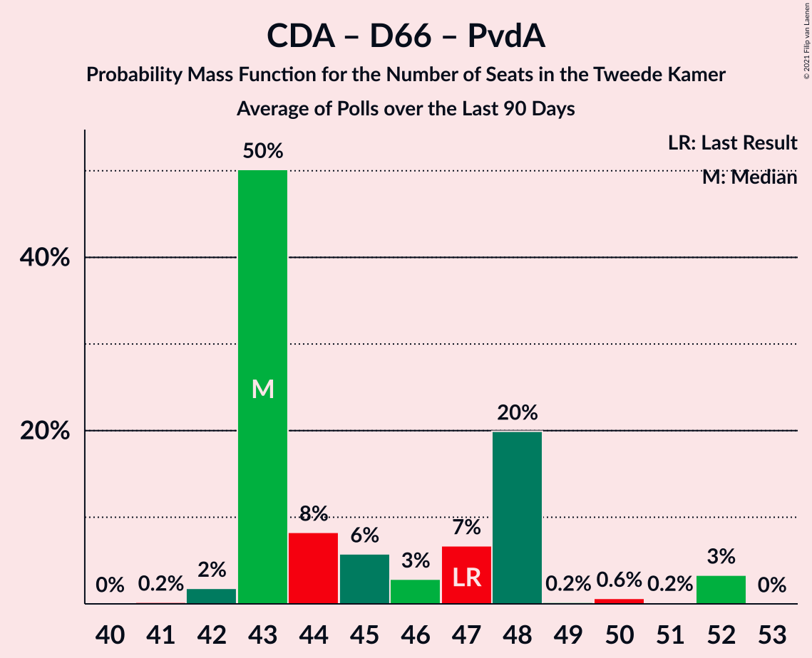

# Poll Average

<a href="#voting-intentions">Voting Intentions</a> | <a href="#seats">Seats</a> | <a href="#coalitions">Coalitions</a> | <a href="#technical-information">Technical Information</a>

## Summary

The table below lists the polls on which the average is based. They are the most recent polls (less than 90 days old) registered and analyzed so far.

| Period     | Polling firm/Commissioner(s) | VVD | PVV | CDA | D66 | GL | SP | PvdA | CU | PvdD | 50+ | SGP | DENK | FvD | PP | B1 | PvdT | JA21 | CO | Volt | BBB |
|:----------:|:----------------------------:|:--:|:--:|:--:|:--:|:--:|:--:|:--:|:--:|:--:|:--:|:--:|:--:|:--:|:--:|:--:|:--:|:--:|:--:|:--:|:--:|
| 15 March 2017 | General Election | 21.3%   33 | 13.1%   20 | 12.4%   19 | 12.2%   19 | 9.1%   14 | 9.1%   14 | 5.7%   9 | 3.4%   5 | 3.2%   5 | 3.1%   4 | 2.1%   3 | 2.1%   3 | 1.8%   2 | 0.3%   0 | 0.3%   0 | 0.0%   0 | 0.0%   0 | 0.0%   0 | 0.0%   0 | 0.0%   0 |
| N/A | Poll Average | 20–28%   31–43 | 10–17%   16–25 | 10–14%   14–22 | 8–13%   13–20 | 5–9%   7–14 | 6–9%   8–14 | 6–10%   10–14 | 3–5%   5–8 | 3–5%   4–7 | 0–2%   0–3 | 1–3%   1–4 | 0–2%   0–2 | 2–4%   2–7 | 0%   0 | 0–1%   0–1 | N/A   N/A | 0–2%   0–4 | 0%   0 | 0–4%   0–5 | 1%   0–2 |
| [12–15 March 2021](2021-03-15-IOResearch.html) | I&O Research | 20–23%   30–36 | 11–14%   17–22 | 9–11%   13–19 | 11–13%   17–20 | 6–8%   9–13 | 6–8%   8–13 | 6–8%   10–12 | 3–5%   5–6 | 3–4%   3–6 | 1%   0–2 | 2–3%   2–4 | 1–2%   1–2 | 3–4%   4–6 | 0%   0 | 0–1%   0–1 | N/A   N/A | 1–2%   1–3 | 0–1%   0 | 3–4%   4–5 | 1%   0–2 |
| [12–13 March 2021](2021-03-13-Peilnl.html) | Peil.nl | 19–22%   31–33 | 15–17%   23–25 | 11–13%   17–19 | 10–12%   16–20 | 5–6%   7–8 | 6–8%   9–12 | 6–8%   10–12 | 3–5%   5–7 | 3–5%   5–7 | 0–1%   0–1 | 2–3%   2–4 | 1–2%   1–2 | 3–5%   5–7 | N/A   N/A | 0–1%   0–1 | N/A   N/A | 2–3%   2–4 | 0%   0 | 2–3%   3–4 | N/A   N/A |
| [6–8 March 2021](2021-03-08-KantarPublic.html) | Kantar Public | 25–29%   36–44 | 10–13%   16–20 | 11–14%   17–23 | 9–12%   13–18 | 6–9%   9–14 | 7–9%   10–15 | 7–10%   11–15 | 3–5%   4–8 | 3–5%   4–8 | 1–3%   2–4 | 1–2%   1–3 | 0–1%   0–1 | 1–3%   2–5 | N/A   N/A | N/A   N/A | N/A   N/A | 0–1%   0–2 | N/A   N/A | 0–1%   0–2 | N/A   N/A |
| [5–8 March 2021](2021-03-08-Ipsos.html) | Ipsos   EenVandaag | 23–27%   37–43 | 12–15%   18–22 | 10–13%   15–18 | 8–10%   13–15 | 7–9%   10–13 | 6–8%   8–12 | 6–9%   9–13 | 3–5%   6–8 | 3–5%   5–7 | 1–2%   1–2 | 1–3%   2–3 | 1–2%   1–2 | 2–4%   3–5 | N/A   N/A | N/A   N/A | N/A   N/A | 1–2%   1–2 | N/A   N/A | 1–2%   1–2 | N/A   N/A |
| 15 March 2017 | General Election | 21.3%   33 | 13.1%   20 | 12.4%   19 | 12.2%   19 | 9.1%   14 | 9.1%   14 | 5.7%   9 | 3.4%   5 | 3.2%   5 | 3.1%   4 | 2.1%   3 | 2.1%   3 | 1.8%   2 | 0.3%   0 | 0.3%   0 | 0.0%   0 | 0.0%   0 | 0.0%   0 | 0.0%   0 | 0.0%   0 |

Only polls for which at least the sample size has been published are included in the table above.

**Legend:**
+ **Top half of each row:** Voting intentions (95% confidence interval)
+ **Bottom half of each row:** Seat projections for the Tweede Kamer (95% confidence interval)
+ **VVD:** Volkspartij voor Vrijheid en Democratie
+ **PVV:** Partij voor de Vrijheid
+ **CDA:** Christen-Democratisch Appèl
+ **D66:** Democraten 66
+ **GL:** GroenLinks
+ **SP:** Socialistische Partij
+ **PvdA:** Partij van de Arbeid
+ **CU:** ChristenUnie
+ **PvdD:** Partij voor de Dieren
+ **50+:** 50Plus
+ **SGP:** Staatkundig Gereformeerde Partij
+ **DENK:** DENK
+ **FvD:** Forum voor Democratie
+ **PP:** Piratenpartij
+ **B1:** Bij1
+ **PvdT:** Partij voor de Toekomst
+ **JA21:** Juiste Antwoord 2021
+ **CO:** Code Oranje
+ **Volt:** Volt Europa
+ **BBB:** BoerBurgerBeweging
+ **N/A (single party):** Party not included the published results
+ **N/A (entire row):** Calculation for this opinion poll not started yet

## Voting Intentions

### Confidence Intervals

| Party | Last Result | Median | 80% Confidence Interval | 90% Confidence Interval | 95% Confidence Interval | 99% Confidence Interval |
|:-----:|:-----------:|:------:|:-----------------------:|:-----------------------:|:-----------------------:|:-----------------------:|
| <a href="#volkspartij-voor-vrijheid-en-democratie">Volkspartij voor Vrijheid en Democratie</a> | 21.3% | 22.8% | 20.2–27.0% |19.8–27.6% | 19.6–28.1% | 19.1–29.0% |
| <a href="#partij-voor-de-vrijheid">Partij voor de Vrijheid</a> | 13.1% | 12.9% | 11.1–16.1% |10.7–16.5% | 10.4–16.8% | 9.8–17.4% |
| <a href="#christen-democratisch-appèl">Christen-Democratisch Appèl</a> | 12.4% | 11.5% | 10.0–13.0% |9.7–13.4% | 9.5–13.8% | 9.1–14.5% |
| <a href="#democraten-66">Democraten 66</a> | 12.2% | 10.7% | 8.9–12.1% |8.6–12.4% | 8.3–12.7% | 7.9–13.1% |
| <a href="#groenlinks">GroenLinks</a> | 9.1% | 7.2% | 5.2–8.1% |5.0–8.4% | 4.8–8.6% | 4.5–9.1% |
| <a href="#socialistische-partij">Socialistische Partij</a> | 9.1% | 6.9% | 6.2–8.2% |6.0–8.6% | 5.8–8.9% | 5.5–9.5% |
| <a href="#partij-van-de-arbeid">Partij van de Arbeid</a> | 5.7% | 7.6% | 6.8–8.9% |6.6–9.3% | 6.5–9.6% | 6.1–10.2% |
| <a href="#christenunie">ChristenUnie</a> | 3.4% | 4.0% | 3.5–4.6% |3.4–4.8% | 3.3–5.0% | 3.0–5.3% |
| <a href="#partij-voor-de-dieren">Partij voor de Dieren</a> | 3.2% | 3.9% | 3.1–4.6% |2.9–4.8% | 2.8–5.0% | 2.6–5.3% |
| <a href="#50plus">50Plus</a> | 3.1% | 1.2% | 0.6–2.1% |0.6–2.4% | 0.5–2.5% | 0.4–2.9% |
| <a href="#staatkundig-gereformeerde-partij">Staatkundig Gereformeerde Partij</a> | 2.1% | 2.0% | 1.3–2.5% |1.1–2.7% | 1.0–2.8% | 0.8–3.1% |
| <a href="#denk">DENK</a> | 2.1% | 1.3% | 0.7–1.6% |0.6–1.7% | 0.5–1.8% | 0.4–2.0% |
| <a href="#forum-voor-democratie">Forum voor Democratie</a> | 1.8% | 3.1% | 2.0–4.1% |1.8–4.3% | 1.6–4.5% | 1.4–4.8% |
| <a href="#piratenpartij">Piratenpartij</a> | 0.3% | 0.1% | 0.1–0.2% |0.1–0.3% | 0.0–0.3% | 0.0–0.4% |
| <a href="#bij1">Bij1</a> | 0.3% | 0.7% | 0.5–0.9% |0.5–1.0% | 0.4–1.1% | 0.4–1.2% |
| <a href="#partij-voor-de-toekomst">Partij voor de Toekomst</a> | 0.0% | N/A | N/A |N/A | N/A | N/A |
| <a href="#juiste-antwoord-2021">Juiste Antwoord 2021</a> | 0.0% | 1.6% | 0.7–2.2% |0.6–2.3% | 0.5–2.4% | 0.4–2.6% |
| <a href="#code-oranje">Code Oranje</a> | 0.0% | 0.3% | 0.1–0.4% |0.1–0.5% | 0.1–0.5% | 0.1–0.6% |
| <a href="#volt-europa">Volt Europa</a> | 0.0% | 1.7% | 0.7–3.3% |0.6–3.5% | 0.5–3.7% | 0.4–4.0% |
| <a href="#boerburgerbeweging">BoerBurgerBeweging</a> | 0.0% | 0.9% | 0.7–1.2% |0.6–1.2% | 0.6–1.3% | 0.5–1.5% |

### Volkspartij voor Vrijheid en Democratie

*For a full overview of the results for this party, see the [Volkspartij voor Vrijheid en Democratie](party-volkspartijvoorvrijheidendemocratie.html) page.*

| Voting Intentions | Probability | Accumulated | Special Marks |
|:-----------------:|:-----------:|:-----------:|:-------------:|
| 17.5–18.5% | 0.1% | 100% |  |
| 18.5–19.5% | 2% | 99.9% |  |
| 19.5–20.5% | 16% | 98% |  |
| 20.5–21.5% | 23% | 82% | Last Result |
| 21.5–22.5% | 8% | 59% |  |
| 22.5–23.5% | 3% | 51% | Median |
| 23.5–24.5% | 8% | 48% |  |
| 24.5–25.5% | 13% | 39% |  |
| 25.5–26.5% | 12% | 27% |  |
| 26.5–27.5% | 9% | 14% |  |
| 27.5–28.5% | 4% | 5% |  |
| 28.5–29.5% | 1.0% | 1.1% |  |
| 29.5–30.5% | 0.1% | 0.1% |  |
| 30.5–31.5% | 0% | 0% |  |

### Partij voor de Vrijheid

*For a full overview of the results for this party, see the [Partij voor de Vrijheid](party-partijvoordevrijheid.html) page.*

| Voting Intentions | Probability | Accumulated | Special Marks |
|:-----------------:|:-----------:|:-----------:|:-------------:|
| 7.5–8.5% | 0% | 100% |  |
| 8.5–9.5% | 0.2% | 100% |  |
| 9.5–10.5% | 3% | 99.8% |  |
| 10.5–11.5% | 13% | 96% |  |
| 11.5–12.5% | 23% | 84% |  |
| 12.5–13.5% | 24% | 60% | Last Result, Median |
| 13.5–14.5% | 10% | 36% |  |
| 14.5–15.5% | 8% | 26% |  |
| 15.5–16.5% | 14% | 18% |  |
| 16.5–17.5% | 4% | 5% |  |
| 17.5–18.5% | 0.2% | 0.3% |  |
| 18.5–19.5% | 0% | 0% |  |

### Christen-Democratisch Appèl

*For a full overview of the results for this party, see the [Christen-Democratisch Appèl](party-christen-democratischappèl.html) page.*

| Voting Intentions | Probability | Accumulated | Special Marks |
|:-----------------:|:-----------:|:-----------:|:-------------:|
| 7.5–8.5% | 0% | 100% |  |
| 8.5–9.5% | 3% | 100% |  |
| 9.5–10.5% | 20% | 97% |  |
| 10.5–11.5% | 28% | 77% |  |
| 11.5–12.5% | 30% | 50% | Last Result, Median |
| 12.5–13.5% | 15% | 19% |  |
| 13.5–14.5% | 4% | 4% |  |
| 14.5–15.5% | 0.4% | 0.4% |  |
| 15.5–16.5% | 0% | 0% |  |

### Democraten 66

*For a full overview of the results for this party, see the [Democraten 66](party-democraten66.html) page.*

| Voting Intentions | Probability | Accumulated | Special Marks |
|:-----------------:|:-----------:|:-----------:|:-------------:|
| 5.5–6.5% | 0% | 100% |  |
| 6.5–7.5% | 0.1% | 100% |  |
| 7.5–8.5% | 5% | 99.9% |  |
| 8.5–9.5% | 20% | 95% |  |
| 9.5–10.5% | 21% | 75% |  |
| 10.5–11.5% | 28% | 54% | Median |
| 11.5–12.5% | 22% | 26% | Last Result |
| 12.5–13.5% | 3% | 4% |  |
| 13.5–14.5% | 0.1% | 0.1% |  |
| 14.5–15.5% | 0% | 0% |  |

### GroenLinks

*For a full overview of the results for this party, see the [GroenLinks](party-groenlinks.html) page.*

| Voting Intentions | Probability | Accumulated | Special Marks |
|:-----------------:|:-----------:|:-----------:|:-------------:|
| 2.5–3.5% | 0% | 100% |  |
| 3.5–4.5% | 0.6% | 100% |  |
| 4.5–5.5% | 17% | 99.4% |  |
| 5.5–6.5% | 12% | 82% |  |
| 6.5–7.5% | 39% | 70% | Median |
| 7.5–8.5% | 28% | 31% |  |
| 8.5–9.5% | 3% | 3% | Last Result |
| 9.5–10.5% | 0.1% | 0.1% |  |
| 10.5–11.5% | 0% | 0% |  |

### Socialistische Partij

*For a full overview of the results for this party, see the [Socialistische Partij](party-socialistischepartij.html) page.*

| Voting Intentions | Probability | Accumulated | Special Marks |
|:-----------------:|:-----------:|:-----------:|:-------------:|
| 3.5–4.5% | 0% | 100% |  |
| 4.5–5.5% | 0.5% | 100% |  |
| 5.5–6.5% | 27% | 99.5% |  |
| 6.5–7.5% | 49% | 72% | Median |
| 7.5–8.5% | 18% | 23% |  |
| 8.5–9.5% | 5% | 5% | Last Result |
| 9.5–10.5% | 0.4% | 0.4% |  |
| 10.5–11.5% | 0% | 0% |  |

### Partij van de Arbeid

*For a full overview of the results for this party, see the [Partij van de Arbeid](party-partijvandearbeid.html) page.*

| Voting Intentions | Probability | Accumulated | Special Marks |
|:-----------------:|:-----------:|:-----------:|:-------------:|
| 4.5–5.5% | 0% | 100% |  |
| 5.5–6.5% | 4% | 100% | Last Result |
| 6.5–7.5% | 44% | 96% |  |
| 7.5–8.5% | 36% | 52% | Median |
| 8.5–9.5% | 13% | 16% |  |
| 9.5–10.5% | 3% | 3% |  |
| 10.5–11.5% | 0.2% | 0.2% |  |
| 11.5–12.5% | 0% | 0% |  |

### ChristenUnie

*For a full overview of the results for this party, see the [ChristenUnie](party-christenunie.html) page.*

| Voting Intentions | Probability | Accumulated | Special Marks |
|:-----------------:|:-----------:|:-----------:|:-------------:|
| 1.5–2.5% | 0% | 100% |  |
| 2.5–3.5% | 11% | 100% | Last Result |
| 3.5–4.5% | 76% | 89% | Median |
| 4.5–5.5% | 13% | 13% |  |
| 5.5–6.5% | 0.2% | 0.2% |  |
| 6.5–7.5% | 0% | 0% |  |

### Partij voor de Dieren

*For a full overview of the results for this party, see the [Partij voor de Dieren](party-partijvoordedieren.html) page.*

| Voting Intentions | Probability | Accumulated | Special Marks |
|:-----------------:|:-----------:|:-----------:|:-------------:|
| 0.5–1.5% | 0% | 100% |  |
| 1.5–2.5% | 0.4% | 100% |  |
| 2.5–3.5% | 28% | 99.6% | Last Result |
| 3.5–4.5% | 60% | 72% | Median |
| 4.5–5.5% | 11% | 12% |  |
| 5.5–6.5% | 0.2% | 0.2% |  |
| 6.5–7.5% | 0% | 0% |  |

### 50Plus

*For a full overview of the results for this party, see the [50Plus](party-50plus.html) page.*

| Voting Intentions | Probability | Accumulated | Special Marks |
|:-----------------:|:-----------:|:-----------:|:-------------:|
| 0.0–0.5% | 4% | 100% |  |
| 0.5–1.5% | 67% | 96% | Median |
| 1.5–2.5% | 26% | 29% |  |
| 2.5–3.5% | 2% | 2% | Last Result |
| 3.5–4.5% | 0% | 0% |  |

### Staatkundig Gereformeerde Partij

*For a full overview of the results for this party, see the [Staatkundig Gereformeerde Partij](party-staatkundiggereformeerdepartij.html) page.*

| Voting Intentions | Probability | Accumulated | Special Marks |
|:-----------------:|:-----------:|:-----------:|:-------------:|
| 0.0–0.5% | 0% | 100% |  |
| 0.5–1.5% | 22% | 100% |  |
| 1.5–2.5% | 69% | 78% | Last Result, Median |
| 2.5–3.5% | 9% | 9% |  |
| 3.5–4.5% | 0% | 0% |  |

### DENK

*For a full overview of the results for this party, see the [DENK](party-denk.html) page.*

| Voting Intentions | Probability | Accumulated | Special Marks |
|:-----------------:|:-----------:|:-----------:|:-------------:|
| 0.0–0.5% | 4% | 100% |  |
| 0.5–1.5% | 82% | 96% | Median |
| 1.5–2.5% | 14% | 14% | Last Result |
| 2.5–3.5% | 0% | 0% |  |

### Forum voor Democratie

*For a full overview of the results for this party, see the [Forum voor Democratie](party-forumvoordemocratie.html) page.*

| Voting Intentions | Probability | Accumulated | Special Marks |
|:-----------------:|:-----------:|:-----------:|:-------------:|
| 0.0–0.5% | 0% | 100% |  |
| 0.5–1.5% | 2% | 100% |  |
| 1.5–2.5% | 24% | 98% | Last Result |
| 2.5–3.5% | 45% | 75% | Median |
| 3.5–4.5% | 28% | 29% |  |
| 4.5–5.5% | 2% | 2% |  |
| 5.5–6.5% | 0% | 0% |  |

### Piratenpartij

*For a full overview of the results for this party, see the [Piratenpartij](party-piratenpartij.html) page.*

| Voting Intentions | Probability | Accumulated | Special Marks |
|:-----------------:|:-----------:|:-----------:|:-------------:|
| 0.0–0.5% | 100% | 100% | Last Result, Median |
| 0.5–1.5% | 0% | 0% |  |

### Bij1

*For a full overview of the results for this party, see the [Bij1](party-bij1.html) page.*

| Voting Intentions | Probability | Accumulated | Special Marks |
|:-----------------:|:-----------:|:-----------:|:-------------:|
| 0.0–0.5% | 13% | 100% | Last Result |
| 0.5–1.5% | 87% | 87% | Median |
| 1.5–2.5% | 0% | 0% |  |

### Juiste Antwoord 2021

*For a full overview of the results for this party, see the [Juiste Antwoord 2021](party-juisteantwoord2021.html) page.*

| Voting Intentions | Probability | Accumulated | Special Marks |
|:-----------------:|:-----------:|:-----------:|:-------------:|
| 0.0–0.5% | 4% | 100% | Last Result |
| 0.5–1.5% | 44% | 96% |  |
| 1.5–2.5% | 51% | 51% | Median |
| 2.5–3.5% | 0.9% | 0.9% |  |
| 3.5–4.5% | 0% | 0% |  |

### Code Oranje

*For a full overview of the results for this party, see the [Code Oranje](party-codeoranje.html) page.*

| Voting Intentions | Probability | Accumulated | Special Marks |
|:-----------------:|:-----------:|:-----------:|:-------------:|
| 0.0–0.5% | 98% | 100% | Last Result, Median |
| 0.5–1.5% | 2% | 2% |  |
| 1.5–2.5% | 0% | 0% |  |

### Volt Europa

*For a full overview of the results for this party, see the [Volt Europa](party-volteuropa.html) page.*

| Voting Intentions | Probability | Accumulated | Special Marks |
|:-----------------:|:-----------:|:-----------:|:-------------:|
| 0.0–0.5% | 4% | 100% | Last Result |
| 0.5–1.5% | 43% | 96% |  |
| 1.5–2.5% | 27% | 52% | Median |
| 2.5–3.5% | 21% | 25% |  |
| 3.5–4.5% | 4% | 4% |  |
| 4.5–5.5% | 0% | 0% |  |

### BoerBurgerBeweging

*For a full overview of the results for this party, see the [BoerBurgerBeweging](party-boerburgerbeweging.html) page.*

| Voting Intentions | Probability | Accumulated | Special Marks |
|:-----------------:|:-----------:|:-----------:|:-------------:|
| 0.0–0.5% | 0.8% | 100% | Last Result |
| 0.5–1.5% | 99.0% | 99.2% | Median |
| 1.5–2.5% | 0.1% | 0.1% |  |
| 2.5–3.5% | 0% | 0% |  |

## Seats

### Confidence Intervals

| Party | Last Result | Median | 80% Confidence Interval | 90% Confidence Interval | 95% Confidence Interval | 99% Confidence Interval |
|:-----:|:-----------:|:------:|:-----------------------:|:-----------------------:|:-----------------------:|:-----------------------:|
| <a href="#volkspartij-voor-vrijheid-en-democratie">Volkspartij voor Vrijheid en Democratie</a> | 33 | 36 | 31–43 |31–43 | 31–43 | 30–44 |
| <a href="#partij-voor-de-vrijheid">Partij voor de Vrijheid</a> | 20 | 19 | 18–24 |17–24 | 16–25 | 16–25 |
| <a href="#christen-democratisch-appèl">Christen-Democratisch Appèl</a> | 19 | 18 | 15–20 |15–21 | 14–22 | 13–23 |
| <a href="#democraten-66">Democraten 66</a> | 19 | 16 | 13–18 |13–19 | 13–20 | 12–21 |
| <a href="#groenlinks">GroenLinks</a> | 14 | 11 | 8–13 |7–13 | 7–14 | 7–14 |
| <a href="#socialistische-partij">Socialistische Partij</a> | 14 | 11 | 9–12 |9–14 | 8–14 | 8–15 |
| <a href="#partij-van-de-arbeid">Partij van de Arbeid</a> | 9 | 11 | 10–13 |10–13 | 10–14 | 9–15 |
| <a href="#christenunie">ChristenUnie</a> | 5 | 6 | 5–7 |5–7 | 5–8 | 4–8 |
| <a href="#partij-voor-de-dieren">Partij voor de Dieren</a> | 5 | 5 | 4–7 |4–7 | 4–7 | 3–8 |
| <a href="#50plus">50Plus</a> | 4 | 2 | 1–3 |0–3 | 0–3 | 0–4 |
| <a href="#staatkundig-gereformeerde-partij">Staatkundig Gereformeerde Partij</a> | 3 | 2 | 2–4 |1–4 | 1–4 | 1–4 |
| <a href="#denk">DENK</a> | 3 | 1 | 1–2 |0–2 | 0–2 | 0–2 |
| <a href="#forum-voor-democratie">Forum voor Democratie</a> | 2 | 4 | 3–7 |3–7 | 2–7 | 2–7 |
| <a href="#piratenpartij">Piratenpartij</a> | 0 | 0 | 0 |0 | 0 | 0 |
| <a href="#bij1">Bij1</a> | 0 | 1 | 0–1 |0–1 | 0–1 | 0–2 |
| <a href="#partij-voor-de-toekomst">Partij voor de Toekomst</a> | 0 | N/A | N/A |N/A | N/A | N/A |
| <a href="#juiste-antwoord-2021">Juiste Antwoord 2021</a> | 0 | 2 | 1–3 |0–4 | 0–4 | 0–4 |
| <a href="#code-oranje">Code Oranje</a> | 0 | 0 | 0 |0 | 0 | 0 |
| <a href="#volt-europa">Volt Europa</a> | 0 | 2 | 1–5 |1–5 | 0–5 | 0–5 |
| <a href="#boerburgerbeweging">BoerBurgerBeweging</a> | 0 | 1 | 1–2 |1–2 | 0–2 | 0–2 |

### Volkspartij voor Vrijheid en Democratie

*For a full overview of the results for this party, see the [Volkspartij voor Vrijheid en Democratie](party-volkspartijvoorvrijheidendemocratie.html) page.*

| Number of Seats | Probability | Accumulated | Special Marks |
|:---------------:|:-----------:|:-----------:|:-------------:|
| 28 | 0.1% | 100% |  |
| 29 | 0.1% | 99.9% |  |
| 30 | 2% | 99.8% |  |
| 31 | 12% | 98% |  |
| 32 | 12% | 86% |  |
| 33 | 21% | 74% | Last Result |
| 34 | 0.7% | 53% |  |
| 35 | 1.0% | 52% |  |
| 36 | 2% | 51% | Median |
| 37 | 2% | 49% |  |
| 38 | 10% | 47% |  |
| 39 | 4% | 37% |  |
| 40 | 14% | 33% |  |
| 41 | 5% | 19% |  |
| 42 | 2% | 15% |  |
| 43 | 12% | 13% |  |
| 44 | 0.4% | 0.8% |  |
| 45 | 0.2% | 0.4% |  |
| 46 | 0.1% | 0.2% |  |
| 47 | 0.1% | 0.2% |  |
| 48 | 0% | 0% |  |

### Partij voor de Vrijheid

*For a full overview of the results for this party, see the [Partij voor de Vrijheid](party-partijvoordevrijheid.html) page.*

| Number of Seats | Probability | Accumulated | Special Marks |
|:---------------:|:-----------:|:-----------:|:-------------:|
| 14 | 0.1% | 100% |  |
| 15 | 0.3% | 99.9% |  |
| 16 | 4% | 99.6% |  |
| 17 | 6% | 96% |  |
| 18 | 4% | 90% |  |
| 19 | 37% | 86% | Median |
| 20 | 6% | 49% | Last Result |
| 21 | 14% | 43% |  |
| 22 | 3% | 28% |  |
| 23 | 4% | 25% |  |
| 24 | 18% | 21% |  |
| 25 | 2% | 3% |  |
| 26 | 0.1% | 0.3% |  |
| 27 | 0.1% | 0.2% |  |
| 28 | 0% | 0.1% |  |
| 29 | 0% | 0.1% |  |
| 30 | 0.1% | 0.1% |  |
| 31 | 0% | 0% |  |

### Christen-Democratisch Appèl

*For a full overview of the results for this party, see the [Christen-Democratisch Appèl](party-christen-democratischappèl.html) page.*

| Number of Seats | Probability | Accumulated | Special Marks |
|:---------------:|:-----------:|:-----------:|:-------------:|
| 13 | 2% | 100% |  |
| 14 | 0.4% | 98% |  |
| 15 | 19% | 97% |  |
| 16 | 7% | 78% |  |
| 17 | 15% | 71% |  |
| 18 | 9% | 56% | Median |
| 19 | 35% | 46% | Last Result |
| 20 | 3% | 12% |  |
| 21 | 6% | 9% |  |
| 22 | 1.4% | 3% |  |
| 23 | 2% | 2% |  |
| 24 | 0% | 0% |  |

### Democraten 66

*For a full overview of the results for this party, see the [Democraten 66](party-democraten66.html) page.*

| Number of Seats | Probability | Accumulated | Special Marks |
|:---------------:|:-----------:|:-----------:|:-------------:|
| 11 | 0.1% | 100% |  |
| 12 | 0.5% | 99.9% |  |
| 13 | 26% | 99.3% |  |
| 14 | 12% | 74% |  |
| 15 | 7% | 62% |  |
| 16 | 17% | 55% | Median |
| 17 | 18% | 38% |  |
| 18 | 13% | 20% |  |
| 19 | 5% | 8% | Last Result |
| 20 | 2% | 3% |  |
| 21 | 0.4% | 0.5% |  |
| 22 | 0.2% | 0.2% |  |
| 23 | 0% | 0% |  |

### GroenLinks

*For a full overview of the results for this party, see the [GroenLinks](party-groenlinks.html) page.*

| Number of Seats | Probability | Accumulated | Special Marks |
|:---------------:|:-----------:|:-----------:|:-------------:|
| 6 | 0.2% | 100% |  |
| 7 | 10% | 99.8% |  |
| 8 | 15% | 90% |  |
| 9 | 8% | 75% |  |
| 10 | 15% | 68% |  |
| 11 | 12% | 52% | Median |
| 12 | 29% | 40% |  |
| 13 | 8% | 11% |  |
| 14 | 3% | 3% | Last Result |
| 15 | 0.3% | 0.3% |  |
| 16 | 0% | 0% |  |

### Socialistische Partij

*For a full overview of the results for this party, see the [Socialistische Partij](party-socialistischepartij.html) page.*

| Number of Seats | Probability | Accumulated | Special Marks |
|:---------------:|:-----------:|:-----------:|:-------------:|
| 8 | 4% | 100% |  |
| 9 | 9% | 96% |  |
| 10 | 20% | 87% |  |
| 11 | 29% | 67% | Median |
| 12 | 28% | 38% |  |
| 13 | 2% | 9% |  |
| 14 | 6% | 7% | Last Result |
| 15 | 0.9% | 0.9% |  |
| 16 | 0% | 0% |  |

### Partij van de Arbeid

*For a full overview of the results for this party, see the [Partij van de Arbeid](party-partijvandearbeid.html) page.*

| Number of Seats | Probability | Accumulated | Special Marks |
|:---------------:|:-----------:|:-----------:|:-------------:|
| 9 | 2% | 100% | Last Result |
| 10 | 22% | 98% |  |
| 11 | 33% | 76% | Median |
| 12 | 27% | 43% |  |
| 13 | 13% | 17% |  |
| 14 | 2% | 3% |  |
| 15 | 1.4% | 2% |  |
| 16 | 0.3% | 0.3% |  |
| 17 | 0% | 0% |  |

### ChristenUnie

*For a full overview of the results for this party, see the [ChristenUnie](party-christenunie.html) page.*

| Number of Seats | Probability | Accumulated | Special Marks |
|:---------------:|:-----------:|:-----------:|:-------------:|
| 4 | 2% | 100% |  |
| 5 | 34% | 98% | Last Result |
| 6 | 46% | 64% | Median |
| 7 | 15% | 17% |  |
| 8 | 2% | 3% |  |
| 9 | 0.3% | 0.3% |  |
| 10 | 0% | 0% |  |

### Partij voor de Dieren

*For a full overview of the results for this party, see the [Partij voor de Dieren](party-partijvoordedieren.html) page.*

| Number of Seats | Probability | Accumulated | Special Marks |
|:---------------:|:-----------:|:-----------:|:-------------:|
| 3 | 2% | 100% |  |
| 4 | 13% | 98% |  |
| 5 | 47% | 85% | Last Result, Median |
| 6 | 7% | 38% |  |
| 7 | 29% | 31% |  |
| 8 | 2% | 2% |  |
| 9 | 0% | 0% |  |

### 50Plus

*For a full overview of the results for this party, see the [50Plus](party-50plus.html) page.*

| Number of Seats | Probability | Accumulated | Special Marks |
|:---------------:|:-----------:|:-----------:|:-------------:|
| 0 | 7% | 100% |  |
| 1 | 43% | 93% |  |
| 2 | 40% | 51% | Median |
| 3 | 9% | 11% |  |
| 4 | 2% | 2% | Last Result |
| 5 | 0% | 0% |  |

### Staatkundig Gereformeerde Partij

*For a full overview of the results for this party, see the [Staatkundig Gereformeerde Partij](party-staatkundiggereformeerdepartij.html) page.*

| Number of Seats | Probability | Accumulated | Special Marks |
|:---------------:|:-----------:|:-----------:|:-------------:|
| 1 | 7% | 100% |  |
| 2 | 47% | 93% | Median |
| 3 | 35% | 47% | Last Result |
| 4 | 11% | 11% |  |
| 5 | 0% | 0% |  |

### DENK

*For a full overview of the results for this party, see the [DENK](party-denk.html) page.*

| Number of Seats | Probability | Accumulated | Special Marks |
|:---------------:|:-----------:|:-----------:|:-------------:|
| 0 | 6% | 100% |  |
| 1 | 60% | 94% | Median |
| 2 | 34% | 34% |  |
| 3 | 0.3% | 0.3% | Last Result |
| 4 | 0.1% | 0.1% |  |
| 5 | 0% | 0% |  |

### Forum voor Democratie

*For a full overview of the results for this party, see the [Forum voor Democratie](party-forumvoordemocratie.html) page.*

| Number of Seats | Probability | Accumulated | Special Marks |
|:---------------:|:-----------:|:-----------:|:-------------:|
| 1 | 0.4% | 100% |  |
| 2 | 4% | 99.6% | Last Result |
| 3 | 27% | 96% |  |
| 4 | 22% | 69% | Median |
| 5 | 30% | 47% |  |
| 6 | 7% | 18% |  |
| 7 | 10% | 10% |  |
| 8 | 0.2% | 0.2% |  |
| 9 | 0% | 0% |  |

### Piratenpartij

*For a full overview of the results for this party, see the [Piratenpartij](party-piratenpartij.html) page.*

| Number of Seats | Probability | Accumulated | Special Marks |
|:---------------:|:-----------:|:-----------:|:-------------:|
| 0 | 100% | 100% | Last Result, Median |

### Bij1

*For a full overview of the results for this party, see the [Bij1](party-bij1.html) page.*

| Number of Seats | Probability | Accumulated | Special Marks |
|:---------------:|:-----------:|:-----------:|:-------------:|
| 0 | 21% | 100% | Last Result |
| 1 | 78% | 79% | Median |
| 2 | 0.7% | 0.7% |  |
| 3 | 0% | 0% |  |

### Partij voor de Toekomst

*For a full overview of the results for this party, see the [Partij voor de Toekomst](party-partijvoordetoekomst.html) page.*

### Juiste Antwoord 2021

*For a full overview of the results for this party, see the [Juiste Antwoord 2021](party-juisteantwoord2021.html) page.*

| Number of Seats | Probability | Accumulated | Special Marks |
|:---------------:|:-----------:|:-----------:|:-------------:|
| 0 | 6% | 100% | Last Result |
| 1 | 25% | 94% |  |
| 2 | 50% | 69% | Median |
| 3 | 10% | 19% |  |
| 4 | 9% | 9% |  |
| 5 | 0% | 0% |  |

### Code Oranje

*For a full overview of the results for this party, see the [Code Oranje](party-codeoranje.html) page.*

| Number of Seats | Probability | Accumulated | Special Marks |
|:---------------:|:-----------:|:-----------:|:-------------:|
| 0 | 99.6% | 100% | Last Result, Median |
| 1 | 0.4% | 0.4% |  |
| 2 | 0% | 0% |  |

### Volt Europa

*For a full overview of the results for this party, see the [Volt Europa](party-volteuropa.html) page.*

| Number of Seats | Probability | Accumulated | Special Marks |
|:---------------:|:-----------:|:-----------:|:-------------:|
| 0 | 3% | 100% | Last Result |
| 1 | 36% | 97% |  |
| 2 | 11% | 61% | Median |
| 3 | 19% | 50% |  |
| 4 | 10% | 30% |  |
| 5 | 20% | 20% |  |
| 6 | 0.5% | 0.5% |  |
| 7 | 0% | 0% |  |

### BoerBurgerBeweging

*For a full overview of the results for this party, see the [BoerBurgerBeweging](party-boerburgerbeweging.html) page.*

| Number of Seats | Probability | Accumulated | Special Marks |
|:---------------:|:-----------:|:-----------:|:-------------:|
| 0 | 3% | 100% | Last Result |
| 1 | 78% | 97% | Median |
| 2 | 19% | 19% |  |
| 3 | 0% | 0% |  |

## Coalitions

### Confidence Intervals

| Coalition | Last Result | Median | Majority? | 80% Confidence Interval | 90% Confidence Interval | 95% Confidence Interval | 99% Confidence Interval |
|:---------:|:-----------:|:------:|:---------:|:-----------------------:|:-----------------------:|:-----------------------:|:-----------------------:|
| Volkspartij voor Vrijheid en Democratie – Christen-Democratisch Appèl – Democraten 66 – GroenLinks – ChristenUnie | 90 | 86 | 100% | 80–92 | 80–94 | 80–96 | 78–97 |
| Volkspartij voor Vrijheid en Democratie – Christen-Democratisch Appèl – Democraten 66 – Partij van de Arbeid – ChristenUnie | 85 | 86 | 100% | 82–93 | 82–94 | 82–95 | 78–96 |
| Volkspartij voor Vrijheid en Democratie – Partij voor de Vrijheid – Christen-Democratisch Appèl – Staatkundig Gereformeerde Partij – Forum voor Democratie | 77 | 83 | 80% | 75–86 | 75–86 | 74–86 | 71–86 |
| Volkspartij voor Vrijheid en Democratie – Partij voor de Vrijheid – Christen-Democratisch Appèl – Forum voor Democratie | 74 | 81 | 77% | 72–83 | 72–84 | 71–84 | 69–84 |
| Volkspartij voor Vrijheid en Democratie – Christen-Democratisch Appèl – Democraten 66 – ChristenUnie | 76 | 75 | 47% | 71–80 | 71–82 | 71–83 | 67–85 |
| Volkspartij voor Vrijheid en Democratie – Partij voor de Vrijheid – Christen-Democratisch Appèl | 72 | 75 | 43% | 67–81 | 67–81 | 67–81 | 63–82 |
| Christen-Democratisch Appèl – Democraten 66 – GroenLinks – Socialistische Partij – Partij van de Arbeid – ChristenUnie | 80 | 72 | 12% | 69–76 | 68–79 | 67–79 | 67–82 |
| Volkspartij voor Vrijheid en Democratie – Christen-Democratisch Appèl – Democraten 66 | 71 | 68 | 6% | 65–75 | 65–76 | 65–78 | 62–78 |
| Volkspartij voor Vrijheid en Democratie – Christen-Democratisch Appèl – Partij van de Arbeid | 61 | 64 | 2% | 59–75 | 59–75 | 58–75 | 54–76 |
| Volkspartij voor Vrijheid en Democratie – Democraten 66 – Partij van de Arbeid | 61 | 63 | 0% | 58–69 | 58–69 | 58–69 | 58–72 |
| Volkspartij voor Vrijheid en Democratie – Christen-Democratisch Appèl – 50Plus – Staatkundig Gereformeerde Partij – Forum voor Democratie | 61 | 63 | 0% | 58–69 | 58–69 | 56–69 | 52–71 |
| Volkspartij voor Vrijheid en Democratie – Christen-Democratisch Appèl – 50Plus – Forum voor Democratie | 58 | 59 | 0% | 55–67 | 55–67 | 53–68 | 50–69 |
| Christen-Democratisch Appèl – Democraten 66 – GroenLinks – Partij van de Arbeid – ChristenUnie | 66 | 61 | 0% | 58–64 | 58–67 | 57–67 | 57–70 |
| Volkspartij voor Vrijheid en Democratie – Christen-Democratisch Appèl – Staatkundig Gereformeerde Partij – Forum voor Democratie | 57 | 62 | 0% | 56–67 | 56–67 | 55–67 | 51–68 |
| Volkspartij voor Vrijheid en Democratie – Christen-Democratisch Appèl – Forum voor Democratie | 54 | 58 | 0% | 53–65 | 53–65 | 52–65 | 49–66 |
| Volkspartij voor Vrijheid en Democratie – Christen-Democratisch Appèl | 52 | 53 | 0% | 48–62 | 48–62 | 47–63 | 43–64 |
| Volkspartij voor Vrijheid en Democratie – Partij van de Arbeid | 42 | 47 | 0% | 42–54 | 42–56 | 42–56 | 41–56 |
| Christen-Democratisch Appèl – Democraten 66 – Partij van de Arbeid | 47 | 45 | 0% | 42–49 | 41–49 | 40–50 | 39–51 |
| Christen-Democratisch Appèl – Partij van de Arbeid – ChristenUnie | 33 | 35 | 0% | 32–39 | 32–39 | 30–40 | 29–43 |
| Christen-Democratisch Appèl – Democraten 66 | 38 | 32 | 0% | 30–37 | 30–37 | 30–37 | 30–38 |
| Christen-Democratisch Appèl – Partij van de Arbeid | 28 | 29 | 0% | 26–32 | 26–33 | 25–35 | 24–37 |

### Volkspartij voor Vrijheid en Democratie – Christen-Democratisch Appèl – Democraten 66 – GroenLinks – ChristenUnie

| Number of Seats | Probability | Accumulated | Special Marks |
|:---------------:|:-----------:|:-----------:|:-------------:|
| 77 | 0.1% | 100% |  |
| 78 | 0.6% | 99.9% |  |
| 79 | 1.5% | 99.3% |  |
| 80 | 19% | 98% |  |
| 81 | 0.6% | 79% |  |
| 82 | 0.8% | 79% |  |
| 83 | 21% | 78% |  |
| 84 | 3% | 57% |  |
| 85 | 2% | 54% |  |
| 86 | 11% | 52% |  |
| 87 | 6% | 41% | Median |
| 88 | 6% | 35% |  |
| 89 | 4% | 29% |  |
| 90 | 6% | 25% | Last Result |
| 91 | 3% | 19% |  |
| 92 | 9% | 16% |  |
| 93 | 1.2% | 7% |  |
| 94 | 1.1% | 5% |  |
| 95 | 0.4% | 4% |  |
| 96 | 3% | 4% |  |
| 97 | 0.9% | 1.3% |  |
| 98 | 0.3% | 0.4% |  |
| 99 | 0% | 0.1% |  |
| 100 | 0% | 0% |  |

### Volkspartij voor Vrijheid en Democratie – Christen-Democratisch Appèl – Democraten 66 – Partij van de Arbeid – ChristenUnie

| Number of Seats | Probability | Accumulated | Special Marks |
|:---------------:|:-----------:|:-----------:|:-------------:|
| 78 | 1.3% | 100% |  |
| 79 | 0.3% | 98.7% |  |
| 80 | 0.3% | 98% |  |
| 81 | 0.2% | 98% |  |
| 82 | 25% | 98% |  |
| 83 | 1.3% | 73% |  |
| 84 | 1.0% | 71% |  |
| 85 | 19% | 70% | Last Result |
| 86 | 2% | 51% |  |
| 87 | 4% | 49% | Median |
| 88 | 15% | 45% |  |
| 89 | 5% | 31% |  |
| 90 | 5% | 25% |  |
| 91 | 0.8% | 20% |  |
| 92 | 2% | 19% |  |
| 93 | 11% | 18% |  |
| 94 | 2% | 6% |  |
| 95 | 2% | 4% |  |
| 96 | 2% | 2% |  |
| 97 | 0.1% | 0.4% |  |
| 98 | 0.1% | 0.3% |  |
| 99 | 0.1% | 0.3% |  |
| 100 | 0.1% | 0.2% |  |
| 101 | 0% | 0% |  |

### Volkspartij voor Vrijheid en Democratie – Partij voor de Vrijheid – Christen-Democratisch Appèl – Staatkundig Gereformeerde Partij – Forum voor Democratie

| Number of Seats | Probability | Accumulated | Special Marks |
|:---------------:|:-----------:|:-----------:|:-------------:|
| 70 | 0.3% | 100% |  |
| 71 | 1.2% | 99.7% |  |
| 72 | 0% | 98% |  |
| 73 | 0.1% | 98% |  |
| 74 | 3% | 98% |  |
| 75 | 16% | 96% |  |
| 76 | 0.2% | 80% | Majority |
| 77 | 3% | 80% | Last Result |
| 78 | 0.6% | 77% |  |
| 79 | 3% | 76% | Median |
| 80 | 6% | 73% |  |
| 81 | 11% | 67% |  |
| 82 | 1.4% | 56% |  |
| 83 | 21% | 55% |  |
| 84 | 8% | 34% |  |
| 85 | 8% | 26% |  |
| 86 | 18% | 18% |  |
| 87 | 0.3% | 0.5% |  |
| 88 | 0.1% | 0.2% |  |
| 89 | 0% | 0% |  |

### Volkspartij voor Vrijheid en Democratie – Partij voor de Vrijheid – Christen-Democratisch Appèl – Forum voor Democratie

| Number of Seats | Probability | Accumulated | Special Marks |
|:---------------:|:-----------:|:-----------:|:-------------:|
| 67 | 0.3% | 100% |  |
| 68 | 0% | 99.7% |  |
| 69 | 1.3% | 99.7% |  |
| 70 | 0.1% | 98% |  |
| 71 | 3% | 98% |  |
| 72 | 16% | 96% |  |
| 73 | 0.3% | 80% |  |
| 74 | 1.0% | 80% | Last Result |
| 75 | 2% | 79% |  |
| 76 | 3% | 77% | Majority |
| 77 | 4% | 74% | Median |
| 78 | 0.7% | 70% |  |
| 79 | 13% | 69% |  |
| 80 | 5% | 56% |  |
| 81 | 17% | 51% |  |
| 82 | 19% | 33% |  |
| 83 | 5% | 14% |  |
| 84 | 9% | 9% |  |
| 85 | 0.4% | 0.4% |  |
| 86 | 0.1% | 0.1% |  |
| 87 | 0% | 0% |  |

### Volkspartij voor Vrijheid en Democratie – Christen-Democratisch Appèl – Democraten 66 – ChristenUnie

| Number of Seats | Probability | Accumulated | Special Marks |
|:---------------:|:-----------:|:-----------:|:-------------:|
| 67 | 1.2% | 100% |  |
| 68 | 0.4% | 98.7% |  |
| 69 | 0.1% | 98% |  |
| 70 | 0.4% | 98% |  |
| 71 | 16% | 98% |  |
| 72 | 10% | 82% |  |
| 73 | 10% | 71% |  |
| 74 | 9% | 61% |  |
| 75 | 6% | 53% |  |
| 76 | 12% | 47% | Last Result, Median, Majority |
| 77 | 2% | 35% |  |
| 78 | 5% | 34% |  |
| 79 | 10% | 29% |  |
| 80 | 11% | 18% |  |
| 81 | 1.5% | 7% |  |
| 82 | 3% | 6% |  |
| 83 | 1.2% | 3% |  |
| 84 | 1.1% | 2% |  |
| 85 | 0.1% | 0.6% |  |
| 86 | 0.1% | 0.5% |  |
| 87 | 0.3% | 0.3% |  |
| 88 | 0% | 0% |  |

### Volkspartij voor Vrijheid en Democratie – Partij voor de Vrijheid – Christen-Democratisch Appèl

| Number of Seats | Probability | Accumulated | Special Marks |
|:---------------:|:-----------:|:-----------:|:-------------:|
| 63 | 2% | 100% |  |
| 64 | 0% | 98% |  |
| 65 | 0.1% | 98% |  |
| 66 | 0.6% | 98% |  |
| 67 | 18% | 98% |  |
| 68 | 0.5% | 80% |  |
| 69 | 0.3% | 80% |  |
| 70 | 2% | 79% |  |
| 71 | 2% | 78% |  |
| 72 | 1.3% | 75% | Last Result |
| 73 | 3% | 74% | Median |
| 74 | 11% | 71% |  |
| 75 | 16% | 59% |  |
| 76 | 6% | 43% | Majority |
| 77 | 3% | 37% |  |
| 78 | 21% | 35% |  |
| 79 | 2% | 14% |  |
| 80 | 1.0% | 12% |  |
| 81 | 10% | 11% |  |
| 82 | 0.4% | 0.5% |  |
| 83 | 0.1% | 0.1% |  |
| 84 | 0.1% | 0.1% |  |
| 85 | 0% | 0% |  |

### Christen-Democratisch Appèl – Democraten 66 – GroenLinks – Socialistische Partij – Partij van de Arbeid – ChristenUnie

| Number of Seats | Probability | Accumulated | Special Marks |
|:---------------:|:-----------:|:-----------:|:-------------:|
| 66 | 0.1% | 100% |  |
| 67 | 4% | 99.8% |  |
| 68 | 2% | 96% |  |
| 69 | 14% | 94% |  |
| 70 | 13% | 79% |  |
| 71 | 15% | 66% |  |
| 72 | 20% | 50% |  |
| 73 | 2% | 31% | Median |
| 74 | 10% | 28% |  |
| 75 | 6% | 18% |  |
| 76 | 2% | 12% | Majority |
| 77 | 3% | 9% |  |
| 78 | 1.4% | 7% |  |
| 79 | 4% | 5% |  |
| 80 | 0.1% | 1.2% | Last Result |
| 81 | 0.3% | 1.1% |  |
| 82 | 0.8% | 0.8% |  |
| 83 | 0% | 0% |  |

### Volkspartij voor Vrijheid en Democratie – Christen-Democratisch Appèl – Democraten 66

| Number of Seats | Probability | Accumulated | Special Marks |
|:---------------:|:-----------:|:-----------:|:-------------:|
| 62 | 2% | 100% |  |
| 63 | 0.2% | 98% |  |
| 64 | 0.2% | 98% |  |
| 65 | 16% | 98% |  |
| 66 | 1.1% | 82% |  |
| 67 | 11% | 81% |  |
| 68 | 21% | 70% |  |
| 69 | 1.3% | 50% |  |
| 70 | 13% | 48% | Median |
| 71 | 5% | 35% | Last Result |
| 72 | 7% | 30% |  |
| 73 | 6% | 23% |  |
| 74 | 2% | 17% |  |
| 75 | 9% | 15% |  |
| 76 | 2% | 6% | Majority |
| 77 | 1.5% | 4% |  |
| 78 | 2% | 3% |  |
| 79 | 0.1% | 0.5% |  |
| 80 | 0% | 0.4% |  |
| 81 | 0% | 0.3% |  |
| 82 | 0.3% | 0.3% |  |
| 83 | 0% | 0% |  |

### Volkspartij voor Vrijheid en Democratie – Christen-Democratisch Appèl – Partij van de Arbeid

| Number of Seats | Probability | Accumulated | Special Marks |
|:---------------:|:-----------:|:-----------:|:-------------:|
| 54 | 1.2% | 100% |  |
| 55 | 0% | 98.8% |  |
| 56 | 0.4% | 98.7% |  |
| 57 | 0.4% | 98% |  |
| 58 | 1.0% | 98% |  |
| 59 | 16% | 97% |  |
| 60 | 3% | 81% |  |
| 61 | 14% | 78% | Last Result |
| 62 | 13% | 64% |  |
| 63 | 0.9% | 51% |  |
| 64 | 0.7% | 50% |  |
| 65 | 0.6% | 50% | Median |
| 66 | 3% | 49% |  |
| 67 | 3% | 45% |  |
| 68 | 3% | 42% |  |
| 69 | 14% | 39% |  |
| 70 | 6% | 25% |  |
| 71 | 3% | 19% |  |
| 72 | 2% | 16% |  |
| 73 | 2% | 14% |  |
| 74 | 0.7% | 12% |  |
| 75 | 9% | 11% |  |
| 76 | 2% | 2% | Majority |
| 77 | 0.1% | 0.3% |  |
| 78 | 0.1% | 0.2% |  |
| 79 | 0% | 0.1% |  |
| 80 | 0% | 0% |  |

### Volkspartij voor Vrijheid en Democratie – Democraten 66 – Partij van de Arbeid

| Number of Seats | Probability | Accumulated | Special Marks |
|:---------------:|:-----------:|:-----------:|:-------------:|
| 56 | 0.1% | 100% |  |
| 57 | 0% | 99.9% |  |
| 58 | 10% | 99.9% |  |
| 59 | 4% | 90% |  |
| 60 | 4% | 86% |  |
| 61 | 25% | 82% | Last Result |
| 62 | 6% | 57% |  |
| 63 | 8% | 50% | Median |
| 64 | 3% | 42% |  |
| 65 | 13% | 39% |  |
| 66 | 4% | 27% |  |
| 67 | 8% | 23% |  |
| 68 | 3% | 15% |  |
| 69 | 10% | 12% |  |
| 70 | 0.4% | 2% |  |
| 71 | 2% | 2% |  |
| 72 | 0.2% | 0.5% |  |
| 73 | 0.2% | 0.4% |  |
| 74 | 0.1% | 0.2% |  |
| 75 | 0% | 0.1% |  |
| 76 | 0% | 0% | Majority |

### Volkspartij voor Vrijheid en Democratie – Christen-Democratisch Appèl – 50Plus – Staatkundig Gereformeerde Partij – Forum voor Democratie

| Number of Seats | Probability | Accumulated | Special Marks |
|:---------------:|:-----------:|:-----------:|:-------------:|
| 52 | 1.2% | 100% |  |
| 53 | 0.4% | 98.8% |  |
| 54 | 0.2% | 98% |  |
| 55 | 0.3% | 98% |  |
| 56 | 1.4% | 98% |  |
| 57 | 0.9% | 97% |  |
| 58 | 28% | 96% |  |
| 59 | 3% | 68% |  |
| 60 | 4% | 65% |  |
| 61 | 0.7% | 60% | Last Result |
| 62 | 4% | 60% | Median |
| 63 | 22% | 56% |  |
| 64 | 1.3% | 34% |  |
| 65 | 2% | 32% |  |
| 66 | 8% | 30% |  |
| 67 | 4% | 22% |  |
| 68 | 1.1% | 18% |  |
| 69 | 16% | 17% |  |
| 70 | 0.5% | 1.1% |  |
| 71 | 0.4% | 0.5% |  |
| 72 | 0.1% | 0.1% |  |
| 73 | 0% | 0% |  |

### Volkspartij voor Vrijheid en Democratie – Christen-Democratisch Appèl – 50Plus – Forum voor Democratie

| Number of Seats | Probability | Accumulated | Special Marks |
|:---------------:|:-----------:|:-----------:|:-------------:|
| 49 | 0% | 100% |  |
| 50 | 2% | 99.9% |  |
| 51 | 0.2% | 98% |  |
| 52 | 0.3% | 98% |  |
| 53 | 0.9% | 98% |  |
| 54 | 1.4% | 97% |  |
| 55 | 18% | 96% |  |
| 56 | 13% | 78% |  |
| 57 | 0.6% | 65% |  |
| 58 | 4% | 64% | Last Result |
| 59 | 14% | 60% |  |
| 60 | 1.0% | 46% | Median |
| 61 | 11% | 45% |  |
| 62 | 1.5% | 34% |  |
| 63 | 5% | 32% |  |
| 64 | 4% | 27% |  |
| 65 | 3% | 23% |  |
| 66 | 8% | 20% |  |
| 67 | 9% | 12% |  |
| 68 | 3% | 3% |  |
| 69 | 0.4% | 0.5% |  |
| 70 | 0.1% | 0.1% |  |
| 71 | 0% | 0% |  |

### Christen-Democratisch Appèl – Democraten 66 – GroenLinks – Partij van de Arbeid – ChristenUnie

| Number of Seats | Probability | Accumulated | Special Marks |
|:---------------:|:-----------:|:-----------:|:-------------:|
| 56 | 0.1% | 100% |  |
| 57 | 4% | 99.8% |  |
| 58 | 22% | 96% |  |
| 59 | 1.1% | 74% |  |
| 60 | 9% | 73% |  |
| 61 | 32% | 64% |  |
| 62 | 16% | 32% | Median |
| 63 | 3% | 15% |  |
| 64 | 3% | 12% |  |
| 65 | 1.3% | 9% |  |
| 66 | 2% | 8% | Last Result |
| 67 | 4% | 6% |  |
| 68 | 1.2% | 2% |  |
| 69 | 0.1% | 1.0% |  |
| 70 | 0.9% | 0.9% |  |
| 71 | 0% | 0% |  |

### Volkspartij voor Vrijheid en Democratie – Christen-Democratisch Appèl – Staatkundig Gereformeerde Partij – Forum voor Democratie

| Number of Seats | Probability | Accumulated | Special Marks |
|:---------------:|:-----------:|:-----------:|:-------------:|
| 51 | 1.2% | 100% |  |
| 52 | 0.3% | 98.8% |  |
| 53 | 0.3% | 98% |  |
| 54 | 0.6% | 98% |  |
| 55 | 0.6% | 98% |  |
| 56 | 17% | 97% |  |
| 57 | 13% | 80% | Last Result |
| 58 | 3% | 68% |  |
| 59 | 1.2% | 65% |  |
| 60 | 7% | 64% | Median |
| 61 | 3% | 57% |  |
| 62 | 21% | 53% |  |
| 63 | 1.0% | 32% |  |
| 64 | 7% | 31% |  |
| 65 | 7% | 24% |  |
| 66 | 6% | 18% |  |
| 67 | 10% | 11% |  |
| 68 | 0.7% | 0.9% |  |
| 69 | 0.1% | 0.2% |  |
| 70 | 0% | 0% |  |

### Volkspartij voor Vrijheid en Democratie – Christen-Democratisch Appèl – Forum voor Democratie

| Number of Seats | Probability | Accumulated | Special Marks |
|:---------------:|:-----------:|:-----------:|:-------------:|
| 49 | 2% | 100% |  |
| 50 | 0.3% | 98% |  |
| 51 | 0.6% | 98% |  |
| 52 | 0.2% | 98% |  |
| 53 | 17% | 97% |  |
| 54 | 4% | 80% | Last Result |
| 55 | 10% | 76% |  |
| 56 | 2% | 66% |  |
| 57 | 4% | 64% |  |
| 58 | 14% | 61% | Median |
| 59 | 3% | 46% |  |
| 60 | 11% | 43% |  |
| 61 | 5% | 32% |  |
| 62 | 2% | 27% |  |
| 63 | 12% | 26% |  |
| 64 | 2% | 13% |  |
| 65 | 9% | 11% |  |
| 66 | 2% | 2% |  |
| 67 | 0.1% | 0.2% |  |
| 68 | 0% | 0.1% |  |
| 69 | 0% | 0% |  |

### Volkspartij voor Vrijheid en Democratie – Christen-Democratisch Appèl

| Number of Seats | Probability | Accumulated | Special Marks |
|:---------------:|:-----------:|:-----------:|:-------------:|
| 43 | 1.2% | 100% |  |
| 44 | 0% | 98.8% |  |
| 45 | 0.4% | 98.7% |  |
| 46 | 0.7% | 98% |  |
| 47 | 0.2% | 98% |  |
| 48 | 17% | 97% |  |
| 49 | 3% | 81% |  |
| 50 | 13% | 77% |  |
| 51 | 10% | 65% |  |
| 52 | 4% | 55% | Last Result |
| 53 | 3% | 50% |  |
| 54 | 1.3% | 47% | Median |
| 55 | 0.3% | 46% |  |
| 56 | 2% | 46% |  |
| 57 | 13% | 43% |  |
| 58 | 5% | 30% |  |
| 59 | 10% | 25% |  |
| 60 | 2% | 15% |  |
| 61 | 2% | 13% |  |
| 62 | 9% | 11% |  |
| 63 | 0.5% | 3% |  |
| 64 | 2% | 2% |  |
| 65 | 0% | 0% |  |

### Volkspartij voor Vrijheid en Democratie – Partij van de Arbeid

| Number of Seats | Probability | Accumulated | Special Marks |
|:---------------:|:-----------:|:-----------:|:-------------:|
| 39 | 0.1% | 100% |  |
| 40 | 0.2% | 99.9% |  |
| 41 | 2% | 99.7% |  |
| 42 | 13% | 98% | Last Result |
| 43 | 14% | 85% |  |
| 44 | 18% | 71% |  |
| 45 | 0.9% | 53% |  |
| 46 | 0.9% | 52% |  |
| 47 | 1.5% | 51% | Median |
| 48 | 1.1% | 50% |  |
| 49 | 8% | 49% |  |
| 50 | 4% | 41% |  |
| 51 | 5% | 37% |  |
| 52 | 12% | 32% |  |
| 53 | 9% | 20% |  |
| 54 | 2% | 11% |  |
| 55 | 0.6% | 10% |  |
| 56 | 9% | 9% |  |
| 57 | 0.1% | 0.4% |  |
| 58 | 0.1% | 0.3% |  |
| 59 | 0.2% | 0.3% |  |
| 60 | 0% | 0.1% |  |
| 61 | 0% | 0% |  |

### Christen-Democratisch Appèl – Democraten 66 – Partij van de Arbeid

| Number of Seats | Probability | Accumulated | Special Marks |
|:---------------:|:-----------:|:-----------:|:-------------:|
| 39 | 0.8% | 100% |  |
| 40 | 4% | 99.1% |  |
| 41 | 0.6% | 95% |  |
| 42 | 15% | 94% |  |
| 43 | 21% | 79% |  |
| 44 | 2% | 58% |  |
| 45 | 28% | 56% | Median |
| 46 | 4% | 27% |  |
| 47 | 4% | 23% | Last Result |
| 48 | 4% | 19% |  |
| 49 | 12% | 15% |  |
| 50 | 1.1% | 3% |  |
| 51 | 1.4% | 2% |  |
| 52 | 0.2% | 0.3% |  |
| 53 | 0% | 0% |  |

### Christen-Democratisch Appèl – Partij van de Arbeid – ChristenUnie

| Number of Seats | Probability | Accumulated | Special Marks |
|:---------------:|:-----------:|:-----------:|:-------------:|
| 29 | 2% | 100% |  |
| 30 | 0.1% | 98% |  |
| 31 | 1.0% | 97% |  |
| 32 | 20% | 97% |  |
| 33 | 4% | 77% | Last Result |
| 34 | 17% | 72% |  |
| 35 | 15% | 55% | Median |
| 36 | 17% | 40% |  |
| 37 | 10% | 23% |  |
| 38 | 1.2% | 13% |  |
| 39 | 8% | 12% |  |
| 40 | 2% | 3% |  |
| 41 | 0.1% | 2% |  |
| 42 | 0.1% | 2% |  |
| 43 | 1.2% | 2% |  |
| 44 | 0.1% | 0.3% |  |
| 45 | 0.2% | 0.2% |  |
| 46 | 0% | 0% |  |

### Christen-Democratisch Appèl – Democraten 66

| Number of Seats | Probability | Accumulated | Special Marks |
|:---------------:|:-----------:|:-----------:|:-------------:|
| 27 | 0.1% | 100% |  |
| 28 | 0.3% | 99.9% |  |
| 29 | 0.1% | 99.6% |  |
| 30 | 18% | 99.5% |  |
| 31 | 1.5% | 81% |  |
| 32 | 30% | 80% |  |
| 33 | 3% | 50% |  |
| 34 | 8% | 46% | Median |
| 35 | 19% | 38% |  |
| 36 | 3% | 19% |  |
| 37 | 13% | 16% |  |
| 38 | 2% | 2% | Last Result |
| 39 | 0% | 0.1% |  |
| 40 | 0% | 0.1% |  |
| 41 | 0% | 0% |  |

### Christen-Democratisch Appèl – Partij van de Arbeid

| Number of Seats | Probability | Accumulated | Special Marks |
|:---------------:|:-----------:|:-----------:|:-------------:|
| 23 | 0.4% | 100% |  |
| 24 | 2% | 99.6% |  |
| 25 | 0.3% | 98% |  |
| 26 | 21% | 97% |  |
| 27 | 3% | 76% |  |
| 28 | 9% | 73% | Last Result |
| 29 | 27% | 64% | Median |
| 30 | 6% | 37% |  |
| 31 | 10% | 31% |  |
| 32 | 15% | 21% |  |
| 33 | 2% | 6% |  |
| 34 | 0.4% | 4% |  |
| 35 | 3% | 3% |  |
| 36 | 0.2% | 0.7% |  |
| 37 | 0.3% | 0.6% |  |
| 38 | 0.2% | 0.2% |  |
| 39 | 0% | 0% |  |

## Technical Information

+ **Number of polls included in this average:** 4
+ **Lowest number of simulations done in a poll included in this average:** 1,048,576
+ **Total number of simulations done in the polls included in this average:** 4,194,304
+ **Error estimate:** 2.68%
