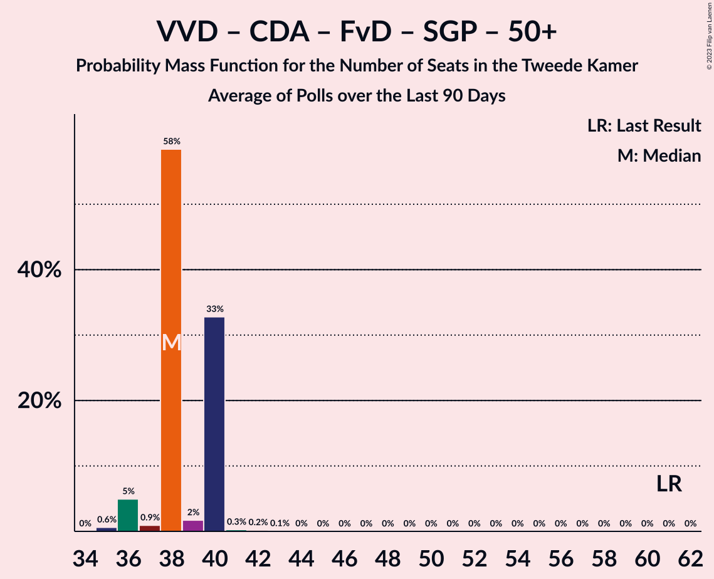

# Poll Average

<a href="#voting-intentions">Voting Intentions</a> | <a href="#seats">Seats</a> | <a href="#coalitions">Coalitions</a> | <a href="#technical-information">Technical Information</a>

## Summary

The table below lists the polls on which the average is based. They are the most recent polls (less than 90 days old) registered and analyzed so far.

| Period     | Polling firm/Commissioner(s) | VVD | D66 | PVV | CDA | SP | PvdA | GL | FvD | PvdD | CU | Volt | JA21 | SGP | DENK | 50+ | BBB | B1 | CO | Spl | PP | PvdT | BVNL | GL–PvdA | NSC |
|:----------:|:----------------------------:|:--:|:--:|:--:|:--:|:--:|:--:|:--:|:--:|:--:|:--:|:--:|:--:|:--:|:--:|:--:|:--:|:--:|:--:|:--:|:--:|:--:|:--:|:--:|:--:|
| 17 March 2021 | General Election | 21.9%   34 | 15.0%   24 | 10.8%   17 | 9.5%   15 | 6.0%   9 | 5.7%   9 | 5.2%   8 | 5.0%   8 | 3.8%   6 | 3.4%   5 | 2.4%   3 | 2.4%   3 | 2.1%   3 | 2.0%   3 | 1.0%   1 | 1.0%   1 | 0.8%   1 | 0.4%   0 | 0.3%   0 | 0.2%   0 | 0.0%   0 | 0.0%   0 | 10.9%   17 | 0.0%   0 |
| N/A | Poll Average | 16–20%   25–30 | 4–7%   6–9 | 10–18%   18–28 | 2–5%   4–7 | 3–6%   4–8 | N/A   N/A | N/A   N/A | 2–4%   3–6 | 3–5%   4–6 | 2–4%   2–4 | 2–4%   3–5 | 0–2%   0–3 | 1–3%   1–4 | 2–3%   3–5 | 0–1%   0–2 | 4–7%   6–10 | 0–1%   0–1 | N/A   N/A | N/A   N/A | N/A   N/A | N/A   N/A | 0–1%   0–1 | 14–17%   21–24 | 14–18%   22–27 |
| [17–18 November 2023](2023-11-18-Peilnl.html) | Peil.nl | 16–19%   25–31 | 5–6%   6–9 | 16–19%   24–29 | 3–5%   5–7 | 3–4%   4–7 | N/A   N/A | N/A   N/A | 3–4%   3–6 | 3–4%   4–6 | 2–3%   2–3 | 2–3%   3–5 | 0–1%   0–1 | 1–2%   1–2 | 2–3%   3–5 | 0%   0 | 4–5%   5–9 | 0–1%   0–1 | N/A   N/A | N/A   N/A | N/A   N/A | N/A   N/A | 0–1%   0–1 | 14–17%   22–26 | 14–17%   22–26 |
| [12–14 November 2023](2023-11-14-IOResearch.html) | I&O Research | 16–19%   25–29 | 4–6%   6–8 | 11–14%   18–21 | 2–4%   3–5 | 4–6%   6–8 | N/A   N/A | N/A   N/A | 2–3%   3–4 | 3–5%   5–6 | 3–4%   4–5 | 3–4%   4–6 | 1–2%   0–3 | 2–3%   3–4 | 2–3%   3–5 | 0–1%   0–2 | 4–6%   7–9 | 0–1%   0 | N/A   N/A | N/A   N/A | N/A   N/A | N/A   N/A | 0–1%   0–1 | 13–16%   21–24 | 14–17%   23–27 |
| [10–13 November 2023](2023-11-13-Ipsos.html) | Ipsos   EenVandaag | 17–20%   30 | 5–7%   9 | 10–13%   18 | 2–3%   4 | 3–4%   5 | N/A   N/A | N/A   N/A | 2–3%   4 | 4–6%   6 | 3–4%   3 | 1–3%   3 | 1–2%   2 | 1–3%   3 | 2–3%   4 | 0%   0 | 5–7%   10 | 0–1%   0 | N/A   N/A | N/A   N/A | N/A   N/A | N/A   N/A | 0%   0 | 14–17%   23 | 16–19%   26 |
| 17 March 2021 | General Election | 21.9%   34 | 15.0%   24 | 10.8%   17 | 9.5%   15 | 6.0%   9 | 5.7%   9 | 5.2%   8 | 5.0%   8 | 3.8%   6 | 3.4%   5 | 2.4%   3 | 2.4%   3 | 2.1%   3 | 2.0%   3 | 1.0%   1 | 1.0%   1 | 0.8%   1 | 0.4%   0 | 0.3%   0 | 0.2%   0 | 0.0%   0 | 0.0%   0 | 10.9%   17 | 0.0%   0 |

Only polls for which at least the sample size has been published are included in the table above.

**Legend:**
+ **Top half of each row:** Voting intentions (95% confidence interval)
+ **Bottom half of each row:** Seat projections for the Tweede Kamer (95% confidence interval)
+ **VVD:** Volkspartij voor Vrijheid en Democratie
+ **D66:** Democraten 66
+ **PVV:** Partij voor de Vrijheid
+ **CDA:** Christen-Democratisch Appèl
+ **SP:** Socialistische Partij
+ **PvdA:** Partij van de Arbeid
+ **GL:** GroenLinks
+ **FvD:** Forum voor Democratie
+ **PvdD:** Partij voor de Dieren
+ **CU:** ChristenUnie
+ **Volt:** Volt Europa
+ **JA21:** Juiste Antwoord 2021
+ **SGP:** Staatkundig Gereformeerde Partij
+ **DENK:** DENK
+ **50+:** 50Plus
+ **BBB:** BoerBurgerBeweging
+ **B1:** Bij1
+ **CO:** Code Oranje
+ **Spl:** Splinter
+ **PP:** Piratenpartij
+ **PvdT:** Partij voor de Toekomst
+ **BVNL:** Belang van Nederland
+ **GL–PvdA:** GroenLinks–Partij van de Arbeid
+ **NSC:** Nieuw Sociaal Contract
+ **N/A (single party):** Party not included the published results
+ **N/A (entire row):** Calculation for this opinion poll not started yet

## Voting Intentions

### Confidence Intervals

| Party | Last Result | Median | 80% Confidence Interval | 90% Confidence Interval | 95% Confidence Interval | 99% Confidence Interval |
|:-----:|:-----------:|:------:|:-----------------------:|:-----------------------:|:-----------------------:|:-----------------------:|
| <a href="#volkspartij-voor-vrijheid-en-democratie">Volkspartij voor Vrijheid en Democratie</a> | 21.9% | 17.7% | 16.6–19.1% |16.3–19.5% | 16.0–19.9% | 15.6–20.5% |
| <a href="#democraten-66">Democraten 66</a> | 15.0% | 5.3% | 4.5–6.3% |4.3–6.6% | 4.2–6.8% | 3.9–7.2% |
| <a href="#groenlinks–partij-van-de-arbeid">GroenLinks–Partij van de Arbeid</a> | 10.9% | 15.1% | 14.2–16.1% |13.9–16.4% | 13.7–16.7% | 13.2–17.2% |
| <a href="#partij-voor-de-vrijheid">Partij voor de Vrijheid</a> | 10.8% | 12.8% | 10.9–17.6% |10.6–18.0% | 10.3–18.3% | 9.8–18.8% |
| <a href="#christen-democratisch-appèl">Christen-Democratisch Appèl</a> | 9.5% | 3.0% | 2.4–4.2% |2.3–4.4% | 2.2–4.6% | 2.0–4.8% |
| <a href="#socialistische-partij">Socialistische Partij</a> | 6.0% | 3.6% | 3.0–5.2% |2.9–5.5% | 2.7–5.6% | 2.5–6.0% |
| <a href="#partij-van-de-arbeid">Partij van de Arbeid</a> | 5.7% | N/A | N/A |N/A | N/A | N/A |
| <a href="#groenlinks">GroenLinks</a> | 5.2% | N/A | N/A |N/A | N/A | N/A |
| <a href="#forum-voor-democratie">Forum voor Democratie</a> | 5.0% | 2.8% | 2.2–3.5% |2.1–3.7% | 2.0–3.8% | 1.8–4.1% |
| <a href="#partij-voor-de-dieren">Partij voor de Dieren</a> | 3.8% | 4.0% | 3.2–4.9% |3.0–5.2% | 2.9–5.4% | 2.7–5.7% |
| <a href="#christenunie">ChristenUnie</a> | 3.4% | 3.1% | 1.9–3.7% |1.8–3.9% | 1.7–4.0% | 1.5–4.4% |
| <a href="#volt-europa">Volt Europa</a> | 2.4% | 2.7% | 1.9–3.6% |1.7–3.8% | 1.6–4.0% | 1.4–4.3% |
| <a href="#juiste-antwoord-2021">Juiste Antwoord 2021</a> | 2.4% | 1.1% | 0.6–1.6% |0.5–1.7% | 0.5–1.8% | 0.4–2.0% |
| <a href="#staatkundig-gereformeerde-partij">Staatkundig Gereformeerde Partij</a> | 2.1% | 2.0% | 1.2–2.8% |1.2–3.0% | 1.1–3.1% | 1.0–3.4% |
| <a href="#denk">DENK</a> | 2.0% | 2.7% | 2.2–3.1% |2.1–3.2% | 2.0–3.3% | 1.9–3.6% |
| <a href="#50plus">50Plus</a> | 1.0% | 0.3% | 0.1–0.9% |0.1–1.0% | 0.1–1.1% | 0.0–1.3% |
| <a href="#boerburgerbeweging">BoerBurgerBeweging</a> | 1.0% | 5.2% | 4.4–6.3% |4.3–6.6% | 4.1–6.8% | 3.9–7.2% |
| <a href="#bij1">Bij1</a> | 0.8% | 0.6% | 0.3–0.9% |0.2–1.0% | 0.2–1.0% | 0.1–1.2% |
| <a href="#code-oranje">Code Oranje</a> | 0.4% | N/A | N/A |N/A | N/A | N/A |
| <a href="#splinter">Splinter</a> | 0.3% | N/A | N/A |N/A | N/A | N/A |
| <a href="#piratenpartij">Piratenpartij</a> | 0.2% | N/A | N/A |N/A | N/A | N/A |
| <a href="#partij-voor-de-toekomst">Partij voor de Toekomst</a> | 0.0% | N/A | N/A |N/A | N/A | N/A |
| <a href="#belang-van-nederland">Belang van Nederland</a> | 0.0% | 0.6% | 0.1–0.9% |0.1–1.0% | 0.1–1.1% | 0.1–1.3% |
| <a href="#nieuw-sociaal-contract">Nieuw Sociaal Contract</a> | 0.0% | 15.9% | 14.7–17.7% |14.4–18.1% | 14.2–18.5% | 13.8–19.1% |

### Volkspartij voor Vrijheid en Democratie

*For a full overview of the results for this party, see the [Volkspartij voor Vrijheid en Democratie](party-volkspartijvoorvrijheidendemocratie.html) page.*

| Voting Intentions | Probability | Accumulated | Special Marks |
|:-----------------:|:-----------:|:-----------:|:-------------:|
| 13.5–14.5% | 0% | 100% |  |
| 14.5–15.5% | 0.4% | 100% |  |
| 15.5–16.5% | 9% | 99.6% |  |
| 16.5–17.5% | 35% | 90% |  |
| 17.5–18.5% | 34% | 55% | Median |
| 18.5–19.5% | 16% | 21% |  |
| 19.5–20.5% | 4% | 5% |  |
| 20.5–21.5% | 0.4% | 0.4% |  |
| 21.5–22.5% | 0% | 0% | Last Result |

### Democraten 66

*For a full overview of the results for this party, see the [Democraten 66](party-democraten66.html) page.*

| Voting Intentions | Probability | Accumulated | Special Marks |
|:-----------------:|:-----------:|:-----------:|:-------------:|
| 2.5–3.5% | 0% | 100% |  |
| 3.5–4.5% | 11% | 100% |  |
| 4.5–5.5% | 50% | 88% | Median |
| 5.5–6.5% | 33% | 39% |  |
| 6.5–7.5% | 5% | 5% |  |
| 7.5–8.5% | 0.1% | 0.1% |  |
| 8.5–9.5% | 0% | 0% |  |
| 9.5–10.5% | 0% | 0% |  |
| 10.5–11.5% | 0% | 0% |  |
| 11.5–12.5% | 0% | 0% |  |
| 12.5–13.5% | 0% | 0% |  |
| 13.5–14.5% | 0% | 0% |  |
| 14.5–15.5% | 0% | 0% | Last Result |

### GroenLinks–Partij van de Arbeid

*For a full overview of the results for this party, see the [GroenLinks–Partij van de Arbeid](party-groenlinks–partijvandearbeid.html) page.*

| Voting Intentions | Probability | Accumulated | Special Marks |
|:-----------------:|:-----------:|:-----------:|:-------------:|
| 10.5–11.5% | 0% | 100% | Last Result |
| 11.5–12.5% | 0% | 100% |  |
| 12.5–13.5% | 2% | 100% |  |
| 13.5–14.5% | 20% | 98% |  |
| 14.5–15.5% | 49% | 79% | Median |
| 15.5–16.5% | 26% | 30% |  |
| 16.5–17.5% | 3% | 3% |  |
| 17.5–18.5% | 0.1% | 0.1% |  |
| 18.5–19.5% | 0% | 0% |  |

### Partij voor de Vrijheid

*For a full overview of the results for this party, see the [Partij voor de Vrijheid](party-partijvoordevrijheid.html) page.*

| Voting Intentions | Probability | Accumulated | Special Marks |
|:-----------------:|:-----------:|:-----------:|:-------------:|
| 7.5–8.5% | 0% | 100% |  |
| 8.5–9.5% | 0.2% | 100% |  |
| 9.5–10.5% | 5% | 99.8% |  |
| 10.5–11.5% | 18% | 95% | Last Result |
| 11.5–12.5% | 21% | 77% |  |
| 12.5–13.5% | 18% | 56% | Median |
| 13.5–14.5% | 5% | 38% |  |
| 14.5–15.5% | 0.4% | 34% |  |
| 15.5–16.5% | 5% | 33% |  |
| 16.5–17.5% | 17% | 29% |  |
| 17.5–18.5% | 11% | 12% |  |
| 18.5–19.5% | 1.2% | 1.2% |  |
| 19.5–20.5% | 0% | 0% |  |

### Christen-Democratisch Appèl

*For a full overview of the results for this party, see the [Christen-Democratisch Appèl](party-christen-democratischappèl.html) page.*

| Voting Intentions | Probability | Accumulated | Special Marks |
|:-----------------:|:-----------:|:-----------:|:-------------:|
| 0.5–1.5% | 0% | 100% |  |
| 1.5–2.5% | 17% | 100% |  |
| 2.5–3.5% | 51% | 83% | Median |
| 3.5–4.5% | 30% | 32% |  |
| 4.5–5.5% | 3% | 3% |  |
| 5.5–6.5% | 0% | 0% |  |
| 6.5–7.5% | 0% | 0% |  |
| 7.5–8.5% | 0% | 0% |  |
| 8.5–9.5% | 0% | 0% |  |
| 9.5–10.5% | 0% | 0% | Last Result |

### Socialistische Partij

*For a full overview of the results for this party, see the [Socialistische Partij](party-socialistischepartij.html) page.*

| Voting Intentions | Probability | Accumulated | Special Marks |
|:-----------------:|:-----------:|:-----------:|:-------------:|
| 0.5–1.5% | 0% | 100% |  |
| 1.5–2.5% | 0.6% | 100% |  |
| 2.5–3.5% | 47% | 99.4% |  |
| 3.5–4.5% | 25% | 53% | Median |
| 4.5–5.5% | 24% | 28% |  |
| 5.5–6.5% | 4% | 4% | Last Result |
| 6.5–7.5% | 0% | 0% |  |

### Forum voor Democratie

*For a full overview of the results for this party, see the [Forum voor Democratie](party-forumvoordemocratie.html) page.*

| Voting Intentions | Probability | Accumulated | Special Marks |
|:-----------------:|:-----------:|:-----------:|:-------------:|
| 0.5–1.5% | 0% | 100% |  |
| 1.5–2.5% | 30% | 100% |  |
| 2.5–3.5% | 60% | 70% | Median |
| 3.5–4.5% | 10% | 10% |  |
| 4.5–5.5% | 0% | 0% | Last Result |

### Partij voor de Dieren

*For a full overview of the results for this party, see the [Partij voor de Dieren](party-partijvoordedieren.html) page.*

| Voting Intentions | Probability | Accumulated | Special Marks |
|:-----------------:|:-----------:|:-----------:|:-------------:|
| 1.5–2.5% | 0.1% | 100% |  |
| 2.5–3.5% | 29% | 99.9% |  |
| 3.5–4.5% | 49% | 71% | Last Result, Median |
| 4.5–5.5% | 21% | 23% |  |
| 5.5–6.5% | 1.2% | 1.2% |  |
| 6.5–7.5% | 0% | 0% |  |

### ChristenUnie

*For a full overview of the results for this party, see the [ChristenUnie](party-christenunie.html) page.*

| Voting Intentions | Probability | Accumulated | Special Marks |
|:-----------------:|:-----------:|:-----------:|:-------------:|
| 0.0–0.5% | 0% | 100% |  |
| 0.5–1.5% | 0.8% | 100% |  |
| 1.5–2.5% | 32% | 99.2% |  |
| 2.5–3.5% | 48% | 67% | Last Result, Median |
| 3.5–4.5% | 18% | 19% |  |
| 4.5–5.5% | 0.1% | 0.1% |  |
| 5.5–6.5% | 0% | 0% |  |

### Volt Europa

*For a full overview of the results for this party, see the [Volt Europa](party-volteuropa.html) page.*

| Voting Intentions | Probability | Accumulated | Special Marks |
|:-----------------:|:-----------:|:-----------:|:-------------:|
| 0.0–0.5% | 0% | 100% |  |
| 0.5–1.5% | 2% | 100% |  |
| 1.5–2.5% | 40% | 98% | Last Result |
| 2.5–3.5% | 47% | 58% | Median |
| 3.5–4.5% | 11% | 11% |  |
| 4.5–5.5% | 0.1% | 0.1% |  |
| 5.5–6.5% | 0% | 0% |  |

### Juiste Antwoord 2021

*For a full overview of the results for this party, see the [Juiste Antwoord 2021](party-juisteantwoord2021.html) page.*

| Voting Intentions | Probability | Accumulated | Special Marks |
|:-----------------:|:-----------:|:-----------:|:-------------:|
| 0.0–0.5% | 5% | 100% |  |
| 0.5–1.5% | 84% | 95% | Median |
| 1.5–2.5% | 11% | 11% | Last Result |
| 2.5–3.5% | 0% | 0% |  |

### Staatkundig Gereformeerde Partij

*For a full overview of the results for this party, see the [Staatkundig Gereformeerde Partij](party-staatkundiggereformeerdepartij.html) page.*

| Voting Intentions | Probability | Accumulated | Special Marks |
|:-----------------:|:-----------:|:-----------:|:-------------:|
| 0.0–0.5% | 0% | 100% |  |
| 0.5–1.5% | 29% | 100% |  |
| 1.5–2.5% | 50% | 71% | Last Result, Median |
| 2.5–3.5% | 21% | 21% |  |
| 3.5–4.5% | 0.2% | 0.2% |  |
| 4.5–5.5% | 0% | 0% |  |

### DENK

*For a full overview of the results for this party, see the [DENK](party-denk.html) page.*

| Voting Intentions | Probability | Accumulated | Special Marks |
|:-----------------:|:-----------:|:-----------:|:-------------:|
| 0.5–1.5% | 0% | 100% |  |
| 1.5–2.5% | 37% | 100% | Last Result |
| 2.5–3.5% | 63% | 63% | Median |
| 3.5–4.5% | 0.7% | 0.7% |  |
| 4.5–5.5% | 0% | 0% |  |

### 50Plus

*For a full overview of the results for this party, see the [50Plus](party-50plus.html) page.*

| Voting Intentions | Probability | Accumulated | Special Marks |
|:-----------------:|:-----------:|:-----------:|:-------------:|
| 0.0–0.5% | 68% | 100% | Median |
| 0.5–1.5% | 31% | 32% | Last Result |
| 1.5–2.5% | 0% | 0% |  |

### BoerBurgerBeweging

*For a full overview of the results for this party, see the [BoerBurgerBeweging](party-boerburgerbeweging.html) page.*

| Voting Intentions | Probability | Accumulated | Special Marks |
|:-----------------:|:-----------:|:-----------:|:-------------:|
| 0.5–1.5% | 0% | 100% | Last Result |
| 1.5–2.5% | 0% | 100% |  |
| 2.5–3.5% | 0% | 100% |  |
| 3.5–4.5% | 15% | 100% |  |
| 4.5–5.5% | 50% | 85% | Median |
| 5.5–6.5% | 30% | 35% |  |
| 6.5–7.5% | 5% | 6% |  |
| 7.5–8.5% | 0.1% | 0.1% |  |
| 8.5–9.5% | 0% | 0% |  |

### Bij1

*For a full overview of the results for this party, see the [Bij1](party-bij1.html) page.*

| Voting Intentions | Probability | Accumulated | Special Marks |
|:-----------------:|:-----------:|:-----------:|:-------------:|
| 0.0–0.5% | 42% | 100% |  |
| 0.5–1.5% | 58% | 58% | Last Result, Median |
| 1.5–2.5% | 0% | 0% |  |

### Belang van Nederland

*For a full overview of the results for this party, see the [Belang van Nederland](party-belangvannederland.html) page.*

| Voting Intentions | Probability | Accumulated | Special Marks |
|:-----------------:|:-----------:|:-----------:|:-------------:|
| 0.0–0.5% | 40% | 100% | Last Result |
| 0.5–1.5% | 59% | 60% | Median |
| 1.5–2.5% | 0% | 0% |  |

### Nieuw Sociaal Contract

*For a full overview of the results for this party, see the [Nieuw Sociaal Contract](party-nieuwsociaalcontract.html) page.*

| Voting Intentions | Probability | Accumulated | Special Marks |
|:-----------------:|:-----------:|:-----------:|:-------------:|
| 0.0–0.5% | 0% | 100% | Last Result |
| 0.5–1.5% | 0% | 100% |  |
| 1.5–2.5% | 0% | 100% |  |
| 2.5–3.5% | 0% | 100% |  |
| 3.5–4.5% | 0% | 100% |  |
| 4.5–5.5% | 0% | 100% |  |
| 5.5–6.5% | 0% | 100% |  |
| 6.5–7.5% | 0% | 100% |  |
| 7.5–8.5% | 0% | 100% |  |
| 8.5–9.5% | 0% | 100% |  |
| 9.5–10.5% | 0% | 100% |  |
| 10.5–11.5% | 0% | 100% |  |
| 11.5–12.5% | 0% | 100% |  |
| 12.5–13.5% | 0.2% | 100% |  |
| 13.5–14.5% | 7% | 99.8% |  |
| 14.5–15.5% | 31% | 93% |  |
| 15.5–16.5% | 31% | 63% | Median |
| 16.5–17.5% | 19% | 32% |  |
| 17.5–18.5% | 10% | 13% |  |
| 18.5–19.5% | 2% | 2% |  |
| 19.5–20.5% | 0.1% | 0.1% |  |
| 20.5–21.5% | 0% | 0% |  |

## Seats

### Confidence Intervals

| Party | Last Result | Median | 80% Confidence Interval | 90% Confidence Interval | 95% Confidence Interval | 99% Confidence Interval |
|:-----:|:-----------:|:------:|:-----------------------:|:-----------------------:|:-----------------------:|:-----------------------:|
| <a href="#volkspartij-voor-vrijheid-en-democratie">Volkspartij voor Vrijheid en Democratie</a> | 34 | 29 | 25–30 |25–30 | 25–30 | 24–31 |
| <a href="#democraten-66">Democraten 66</a> | 24 | 8 | 7–9 |7–9 | 6–9 | 6–10 |
| <a href="#groenlinks–partij-van-de-arbeid">GroenLinks–Partij van de Arbeid</a> | 17 | 23 | 22–24 |22–24 | 21–24 | 21–26 |
| <a href="#partij-voor-de-vrijheid">Partij voor de Vrijheid</a> | 17 | 18 | 18–28 |18–28 | 18–28 | 18–29 |
| <a href="#christen-democratisch-appèl">Christen-Democratisch Appèl</a> | 15 | 4 | 4–6 |4–7 | 4–7 | 3–7 |
| <a href="#socialistische-partij">Socialistische Partij</a> | 9 | 6 | 5–7 |4–8 | 4–8 | 4–8 |
| <a href="#partij-van-de-arbeid">Partij van de Arbeid</a> | 9 | N/A | N/A |N/A | N/A | N/A |
| <a href="#groenlinks">GroenLinks</a> | 8 | N/A | N/A |N/A | N/A | N/A |
| <a href="#forum-voor-democratie">Forum voor Democratie</a> | 8 | 4 | 3–5 |3–6 | 3–6 | 3–6 |
| <a href="#partij-voor-de-dieren">Partij voor de Dieren</a> | 6 | 6 | 4–6 |4–6 | 4–6 | 4–7 |
| <a href="#christenunie">ChristenUnie</a> | 5 | 3 | 2–4 |2–4 | 2–4 | 2–6 |
| <a href="#volt-europa">Volt Europa</a> | 3 | 3 | 3–5 |3–5 | 3–5 | 3–6 |
| <a href="#juiste-antwoord-2021">Juiste Antwoord 2021</a> | 3 | 2 | 1–3 |0–3 | 0–3 | 0–3 |
| <a href="#staatkundig-gereformeerde-partij">Staatkundig Gereformeerde Partij</a> | 3 | 3 | 1–4 |1–4 | 1–4 | 1–4 |
| <a href="#denk">DENK</a> | 3 | 4 | 3–4 |3–4 | 3–5 | 3–5 |
| <a href="#50plus">50Plus</a> | 1 | 0 | 0–1 |0–1 | 0–2 | 0–2 |
| <a href="#boerburgerbeweging">BoerBurgerBeweging</a> | 1 | 8 | 7–10 |6–10 | 6–10 | 5–10 |
| <a href="#bij1">Bij1</a> | 1 | 0 | 0 |0–1 | 0–1 | 0–1 |
| <a href="#code-oranje">Code Oranje</a> | 0 | N/A | N/A |N/A | N/A | N/A |
| <a href="#splinter">Splinter</a> | 0 | N/A | N/A |N/A | N/A | N/A |
| <a href="#piratenpartij">Piratenpartij</a> | 0 | N/A | N/A |N/A | N/A | N/A |
| <a href="#partij-voor-de-toekomst">Partij voor de Toekomst</a> | 0 | N/A | N/A |N/A | N/A | N/A |
| <a href="#belang-van-nederland">Belang van Nederland</a> | 0 | 0 | 0–1 |0–1 | 0–1 | 0–2 |
| <a href="#nieuw-sociaal-contract">Nieuw Sociaal Contract</a> | 0 | 26 | 23–27 |23–27 | 22–27 | 22–27 |

### Volkspartij voor Vrijheid en Democratie

*For a full overview of the results for this party, see the [Volkspartij voor Vrijheid en Democratie](party-volkspartijvoorvrijheidendemocratie.html) page.*

| Number of Seats | Probability | Accumulated | Special Marks |
|:---------------:|:-----------:|:-----------:|:-------------:|
| 22 | 0.1% | 100% |  |
| 23 | 0.2% | 99.9% |  |
| 24 | 0.9% | 99.6% |  |
| 25 | 27% | 98.7% |  |
| 26 | 3% | 71% |  |
| 27 | 1.2% | 68% |  |
| 28 | 10% | 67% |  |
| 29 | 22% | 57% | Median |
| 30 | 33% | 35% |  |
| 31 | 2% | 2% |  |
| 32 | 0% | 0% |  |
| 33 | 0% | 0% |  |
| 34 | 0% | 0% | Last Result |

### Democraten 66

*For a full overview of the results for this party, see the [Democraten 66](party-democraten66.html) page.*

| Number of Seats | Probability | Accumulated | Special Marks |
|:---------------:|:-----------:|:-----------:|:-------------:|
| 6 | 4% | 100% |  |
| 7 | 27% | 96% |  |
| 8 | 31% | 69% | Median |
| 9 | 37% | 38% |  |
| 10 | 0.5% | 0.7% |  |
| 11 | 0.2% | 0.2% |  |
| 12 | 0% | 0% |  |
| 13 | 0% | 0% |  |
| 14 | 0% | 0% |  |
| 15 | 0% | 0% |  |
| 16 | 0% | 0% |  |
| 17 | 0% | 0% |  |
| 18 | 0% | 0% |  |
| 19 | 0% | 0% |  |
| 20 | 0% | 0% |  |
| 21 | 0% | 0% |  |
| 22 | 0% | 0% |  |
| 23 | 0% | 0% |  |
| 24 | 0% | 0% | Last Result |

### GroenLinks–Partij van de Arbeid

*For a full overview of the results for this party, see the [GroenLinks–Partij van de Arbeid](party-groenlinks–partijvandearbeid.html) page.*

| Number of Seats | Probability | Accumulated | Special Marks |
|:---------------:|:-----------:|:-----------:|:-------------:|
| 17 | 0% | 100% | Last Result |
| 18 | 0% | 100% |  |
| 19 | 0% | 100% |  |
| 20 | 0.3% | 100% |  |
| 21 | 5% | 99.6% |  |
| 22 | 10% | 95% |  |
| 23 | 39% | 86% | Median |
| 24 | 45% | 47% |  |
| 25 | 1.0% | 2% |  |
| 26 | 1.0% | 1.0% |  |
| 27 | 0% | 0% |  |

### Partij voor de Vrijheid

*For a full overview of the results for this party, see the [Partij voor de Vrijheid](party-partijvoordevrijheid.html) page.*

| Number of Seats | Probability | Accumulated | Special Marks |
|:---------------:|:-----------:|:-----------:|:-------------:|
| 17 | 0.1% | 100% | Last Result |
| 18 | 59% | 99.9% | Median |
| 19 | 0.8% | 41% |  |
| 20 | 5% | 41% |  |
| 21 | 2% | 36% |  |
| 22 | 0.3% | 34% |  |
| 23 | 0.1% | 33% |  |
| 24 | 0.9% | 33% |  |
| 25 | 5% | 32% |  |
| 26 | 1.1% | 27% |  |
| 27 | 5% | 26% |  |
| 28 | 20% | 21% |  |
| 29 | 0.8% | 1.1% |  |
| 30 | 0.3% | 0.3% |  |
| 31 | 0% | 0% |  |

### Christen-Democratisch Appèl

*For a full overview of the results for this party, see the [Christen-Democratisch Appèl](party-christen-democratischappèl.html) page.*

| Number of Seats | Probability | Accumulated | Special Marks |
|:---------------:|:-----------:|:-----------:|:-------------:|
| 2 | 0.1% | 100% |  |
| 3 | 2% | 99.9% |  |
| 4 | 64% | 98% | Median |
| 5 | 22% | 34% |  |
| 6 | 4% | 12% |  |
| 7 | 7% | 7% |  |
| 8 | 0.1% | 0.1% |  |
| 9 | 0% | 0% |  |
| 10 | 0% | 0% |  |
| 11 | 0% | 0% |  |
| 12 | 0% | 0% |  |
| 13 | 0% | 0% |  |
| 14 | 0% | 0% |  |
| 15 | 0% | 0% | Last Result |

### Socialistische Partij

*For a full overview of the results for this party, see the [Socialistische Partij](party-socialistischepartij.html) page.*

| Number of Seats | Probability | Accumulated | Special Marks |
|:---------------:|:-----------:|:-----------:|:-------------:|
| 4 | 8% | 100% |  |
| 5 | 39% | 92% |  |
| 6 | 28% | 53% | Median |
| 7 | 20% | 25% |  |
| 8 | 5% | 6% |  |
| 9 | 0.2% | 0.2% | Last Result |
| 10 | 0% | 0% |  |

### Partij van de Arbeid

*For a full overview of the results for this party, see the [Partij van de Arbeid](party-partijvandearbeid.html) page.*

### GroenLinks

*For a full overview of the results for this party, see the [GroenLinks](party-groenlinks.html) page.*

### Forum voor Democratie

*For a full overview of the results for this party, see the [Forum voor Democratie](party-forumvoordemocratie.html) page.*

| Number of Seats | Probability | Accumulated | Special Marks |
|:---------------:|:-----------:|:-----------:|:-------------:|
| 2 | 0.3% | 100% |  |
| 3 | 29% | 99.7% |  |
| 4 | 57% | 70% | Median |
| 5 | 7% | 13% |  |
| 6 | 7% | 7% |  |
| 7 | 0% | 0% |  |
| 8 | 0% | 0% | Last Result |

### Partij voor de Dieren

*For a full overview of the results for this party, see the [Partij voor de Dieren](party-partijvoordedieren.html) page.*

| Number of Seats | Probability | Accumulated | Special Marks |
|:---------------:|:-----------:|:-----------:|:-------------:|
| 4 | 24% | 100% |  |
| 5 | 9% | 76% |  |
| 6 | 67% | 67% | Last Result, Median |
| 7 | 0.5% | 0.6% |  |
| 8 | 0.1% | 0.1% |  |
| 9 | 0% | 0% |  |

### ChristenUnie

*For a full overview of the results for this party, see the [ChristenUnie](party-christenunie.html) page.*

| Number of Seats | Probability | Accumulated | Special Marks |
|:---------------:|:-----------:|:-----------:|:-------------:|
| 2 | 10% | 100% |  |
| 3 | 56% | 90% | Median |
| 4 | 31% | 34% |  |
| 5 | 2% | 2% | Last Result |
| 6 | 0.8% | 0.9% |  |
| 7 | 0% | 0% |  |

### Volt Europa

*For a full overview of the results for this party, see the [Volt Europa](party-volteuropa.html) page.*

| Number of Seats | Probability | Accumulated | Special Marks |
|:---------------:|:-----------:|:-----------:|:-------------:|
| 2 | 0.1% | 100% |  |
| 3 | 53% | 99.9% | Last Result, Median |
| 4 | 11% | 47% |  |
| 5 | 33% | 35% |  |
| 6 | 2% | 2% |  |
| 7 | 0.1% | 0.1% |  |
| 8 | 0% | 0% |  |

### Juiste Antwoord 2021

*For a full overview of the results for this party, see the [Juiste Antwoord 2021](party-juisteantwoord2021.html) page.*

| Number of Seats | Probability | Accumulated | Special Marks |
|:---------------:|:-----------:|:-----------:|:-------------:|
| 0 | 7% | 100% |  |
| 1 | 33% | 93% |  |
| 2 | 35% | 60% | Median |
| 3 | 25% | 25% | Last Result |
| 4 | 0% | 0% |  |

### Staatkundig Gereformeerde Partij

*For a full overview of the results for this party, see the [Staatkundig Gereformeerde Partij](party-staatkundiggereformeerdepartij.html) page.*

| Number of Seats | Probability | Accumulated | Special Marks |
|:---------------:|:-----------:|:-----------:|:-------------:|
| 1 | 22% | 100% |  |
| 2 | 11% | 78% |  |
| 3 | 39% | 67% | Last Result, Median |
| 4 | 28% | 28% |  |
| 5 | 0.3% | 0.3% |  |
| 6 | 0% | 0% |  |

### DENK

*For a full overview of the results for this party, see the [DENK](party-denk.html) page.*

| Number of Seats | Probability | Accumulated | Special Marks |
|:---------------:|:-----------:|:-----------:|:-------------:|
| 2 | 0.2% | 100% |  |
| 3 | 31% | 99.8% | Last Result |
| 4 | 65% | 69% | Median |
| 5 | 4% | 4% |  |
| 6 | 0% | 0% |  |

### 50Plus

*For a full overview of the results for this party, see the [50Plus](party-50plus.html) page.*

| Number of Seats | Probability | Accumulated | Special Marks |
|:---------------:|:-----------:|:-----------:|:-------------:|
| 0 | 69% | 100% | Median |
| 1 | 27% | 31% | Last Result |
| 2 | 5% | 5% |  |
| 3 | 0% | 0% |  |

### BoerBurgerBeweging

*For a full overview of the results for this party, see the [BoerBurgerBeweging](party-boerburgerbeweging.html) page.*

| Number of Seats | Probability | Accumulated | Special Marks |
|:---------------:|:-----------:|:-----------:|:-------------:|
| 1 | 0% | 100% | Last Result |
| 2 | 0% | 100% |  |
| 3 | 0% | 100% |  |
| 4 | 0% | 100% |  |
| 5 | 2% | 100% |  |
| 6 | 6% | 98% |  |
| 7 | 29% | 92% |  |
| 8 | 27% | 63% | Median |
| 9 | 3% | 36% |  |
| 10 | 33% | 33% |  |
| 11 | 0% | 0% |  |

### Bij1

*For a full overview of the results for this party, see the [Bij1](party-bij1.html) page.*

| Number of Seats | Probability | Accumulated | Special Marks |
|:---------------:|:-----------:|:-----------:|:-------------:|
| 0 | 91% | 100% | Median |
| 1 | 8% | 9% | Last Result |
| 2 | 0.3% | 0.3% |  |
| 3 | 0% | 0% |  |

### Code Oranje

*For a full overview of the results for this party, see the [Code Oranje](party-codeoranje.html) page.*

### Splinter

*For a full overview of the results for this party, see the [Splinter](party-splinter.html) page.*

### Piratenpartij

*For a full overview of the results for this party, see the [Piratenpartij](party-piratenpartij.html) page.*

### Partij voor de Toekomst

*For a full overview of the results for this party, see the [Partij voor de Toekomst](party-partijvoordetoekomst.html) page.*

### Belang van Nederland

*For a full overview of the results for this party, see the [Belang van Nederland](party-belangvannederland.html) page.*

| Number of Seats | Probability | Accumulated | Special Marks |
|:---------------:|:-----------:|:-----------:|:-------------:|
| 0 | 58% | 100% | Last Result, Median |
| 1 | 42% | 42% |  |
| 2 | 0.6% | 0.6% |  |
| 3 | 0% | 0% |  |

### Nieuw Sociaal Contract

*For a full overview of the results for this party, see the [Nieuw Sociaal Contract](party-nieuwsociaalcontract.html) page.*

| Number of Seats | Probability | Accumulated | Special Marks |
|:---------------:|:-----------:|:-----------:|:-------------:|
| 0 | 0% | 100% | Last Result |
| 1 | 0% | 100% |  |
| 2 | 0% | 100% |  |
| 3 | 0% | 100% |  |
| 4 | 0% | 100% |  |
| 5 | 0% | 100% |  |
| 6 | 0% | 100% |  |
| 7 | 0% | 100% |  |
| 8 | 0% | 100% |  |
| 9 | 0% | 100% |  |
| 10 | 0% | 100% |  |
| 11 | 0% | 100% |  |
| 12 | 0% | 100% |  |
| 13 | 0% | 100% |  |
| 14 | 0% | 100% |  |
| 15 | 0% | 100% |  |
| 16 | 0% | 100% |  |
| 17 | 0% | 100% |  |
| 18 | 0% | 100% |  |
| 19 | 0% | 100% |  |
| 20 | 0% | 100% |  |
| 21 | 0.2% | 100% |  |
| 22 | 4% | 99.7% |  |
| 23 | 22% | 96% |  |
| 24 | 7% | 74% |  |
| 25 | 2% | 68% |  |
| 26 | 40% | 66% | Median |
| 27 | 26% | 26% |  |
| 28 | 0.1% | 0.3% |  |
| 29 | 0.1% | 0.2% |  |
| 30 | 0% | 0.1% |  |
| 31 | 0.1% | 0.1% |  |
| 32 | 0% | 0% |  |

## Coalitions

### Confidence Intervals

| Coalition | Last Result | Median | Majority? | 80% Confidence Interval | 90% Confidence Interval | 95% Confidence Interval | 99% Confidence Interval |
|:---------:|:-----------:|:------:|:---------:|:-----------------------:|:-----------------------:|:-----------------------:|:-----------------------:|
| Volkspartij voor Vrijheid en Democratie – Partij voor de Vrijheid – Christen-Democratisch Appèl – Forum voor Democratie – Staatkundig Gereformeerde Partij | 77 | 59 | 0% | 54–67 | 54–69 | 54–70 | 54–70 |
| Volkspartij voor Vrijheid en Democratie – Partij voor de Vrijheid – Christen-Democratisch Appèl – Forum voor Democratie | 74 | 56 | 0% | 50–66 | 50–68 | 50–68 | 50–68 |
| Volkspartij voor Vrijheid en Democratie – GroenLinks–Partij van de Arbeid – Christen-Democratisch Appèl – BoerBurgerBeweging | 67 | 65 | 0% | 61–67 | 60–67 | 60–67 | 59–67 |
| Volkspartij voor Vrijheid en Democratie – GroenLinks–Partij van de Arbeid – BoerBurgerBeweging | 52 | 60 | 0% | 56–63 | 56–63 | 56–63 | 54–63 |
| Volkspartij voor Vrijheid en Democratie – Democraten 66 – GroenLinks–Partij van de Arbeid | 75 | 60 | 0% | 57–62 | 56–62 | 55–62 | 54–62 |
| Volkspartij voor Vrijheid en Democratie – Partij voor de Vrijheid – Christen-Democratisch Appèl | 66 | 52 | 0% | 47–62 | 47–62 | 47–62 | 47–63 |
| Volkspartij voor Vrijheid en Democratie – GroenLinks–Partij van de Arbeid – Christen-Democratisch Appèl | 66 | 57 | 0% | 53–58 | 53–58 | 53–58 | 51–60 |
| Volkspartij voor Vrijheid en Democratie – GroenLinks–Partij van de Arbeid | 51 | 53 | 0% | 49–53 | 49–53 | 48–53 | 47–53 |
| Democraten 66 – GroenLinks–Partij van de Arbeid – Christen-Democratisch Appèl – Socialistische Partij – ChristenUnie | 70 | 45 | 0% | 43–46 | 43–46 | 42–47 | 41–48 |
| Volkspartij voor Vrijheid en Democratie – Democraten 66 – Christen-Democratisch Appèl – ChristenUnie | 78 | 44 | 0% | 41–46 | 41–46 | 41–46 | 40–48 |
| Volkspartij voor Vrijheid en Democratie – Christen-Democratisch Appèl – Partij van de Arbeid – GroenLinks – BoerBurgerBeweging | 67 | 41 | 0% | 37–44 | 37–44 | 37–44 | 36–44 |
| Volkspartij voor Vrijheid en Democratie – Christen-Democratisch Appèl – BoerBurgerBeweging | 50 | 41 | 0% | 37–44 | 37–44 | 37–44 | 36–44 |
| Volkspartij voor Vrijheid en Democratie – Democraten 66 – Christen-Democratisch Appèl | 73 | 41 | 0% | 37–43 | 37–43 | 37–43 | 36–46 |
| Volkspartij voor Vrijheid en Democratie – Christen-Democratisch Appèl – Forum voor Democratie – Staatkundig Gereformeerde Partij – 50Plus | 61 | 39 | 0% | 37–41 | 37–42 | 37–42 | 36–45 |
| Volkspartij voor Vrijheid en Democratie – Christen-Democratisch Appèl – Forum voor Democratie – Staatkundig Gereformeerde Partij | 60 | 39 | 0% | 36–41 | 36–42 | 36–42 | 34–45 |
| Democraten 66 – GroenLinks–Partij van de Arbeid – Christen-Democratisch Appèl – ChristenUnie | 61 | 39 | 0% | 38–40 | 37–40 | 36–41 | 36–43 |
| Volkspartij voor Vrijheid en Democratie – Christen-Democratisch Appèl – Forum voor Democratie – 50Plus | 58 | 38 | 0% | 33–39 | 33–40 | 33–41 | 33–43 |
| Volkspartij voor Vrijheid en Democratie – Christen-Democratisch Appèl – Forum voor Democratie | 57 | 38 | 0% | 32–39 | 32–40 | 32–41 | 31–43 |
| Volkspartij voor Vrijheid en Democratie – Partij van de Arbeid – GroenLinks – BoerBurgerBeweging | 52 | 36 | 0% | 33–40 | 33–40 | 33–40 | 31–40 |
| Volkspartij voor Vrijheid en Democratie – Democraten 66 – Partij van de Arbeid – GroenLinks | 75 | 36 | 0% | 33–39 | 33–39 | 33–39 | 32–39 |
| Democraten 66 – GroenLinks–Partij van de Arbeid – Christen-Democratisch Appèl | 56 | 36 | 0% | 35–36 | 33–37 | 32–38 | 31–40 |
| Volkspartij voor Vrijheid en Democratie – Christen-Democratisch Appèl – Partij van de Arbeid – GroenLinks | 66 | 34 | 0% | 29–34 | 29–35 | 29–35 | 28–38 |
| Volkspartij voor Vrijheid en Democratie – Christen-Democratisch Appèl | 49 | 34 | 0% | 29–34 | 29–35 | 29–35 | 28–38 |
| GroenLinks–Partij van de Arbeid – Christen-Democratisch Appèl – ChristenUnie | 37 | 31 | 0% | 30–32 | 29–32 | 29–33 | 29–35 |
| GroenLinks–Partij van de Arbeid – BoerBurgerBeweging | 18 | 32 | 0% | 28–33 | 28–33 | 28–33 | 27–33 |
| GroenLinks–Partij van de Arbeid – Christen-Democratisch Appèl | 32 | 28 | 0% | 27–29 | 25–29 | 25–30 | 25–32 |
| Volkspartij voor Vrijheid en Democratie – Partij van de Arbeid – GroenLinks | 51 | 29 | 0% | 25–30 | 25–30 | 25–30 | 24–31 |
| Democraten 66 – Christen-Democratisch Appèl – Socialistische Partij – Partij van de Arbeid – GroenLinks – ChristenUnie | 70 | 22 | 0% | 21–22 | 20–23 | 19–23 | 19–25 |
| Democraten 66 – Christen-Democratisch Appèl – Partij van de Arbeid – GroenLinks – ChristenUnie | 61 | 16 | 0% | 15–16 | 15–17 | 15–18 | 14–19 |
| Democraten 66 – Christen-Democratisch Appèl | 39 | 12 | 0% | 12–13 | 11–15 | 11–15 | 9–16 |
| Democraten 66 – Christen-Democratisch Appèl – Partij van de Arbeid – GroenLinks | 56 | 12 | 0% | 12–13 | 11–15 | 11–15 | 9–16 |
| Christen-Democratisch Appèl – Partij van de Arbeid – GroenLinks – ChristenUnie | 37 | 8 | 0% | 7–9 | 7–9 | 7–10 | 7–11 |
| Partij van de Arbeid – GroenLinks – BoerBurgerBeweging | 18 | 8 | 0% | 7–10 | 6–10 | 6–10 | 5–10 |
| Christen-Democratisch Appèl – Partij van de Arbeid – GroenLinks | 32 | 4 | 0% | 4–6 | 4–7 | 4–7 | 3–7 |

### Volkspartij voor Vrijheid en Democratie – Partij voor de Vrijheid – Christen-Democratisch Appèl – Forum voor Democratie – Staatkundig Gereformeerde Partij

| Number of Seats | Probability | Accumulated | Special Marks |
|:---------------:|:-----------:|:-----------:|:-------------:|
| 53 | 0.1% | 100% |  |
| 54 | 25% | 99.9% |  |
| 55 | 1.1% | 75% |  |
| 56 | 0.1% | 74% |  |
| 57 | 0.1% | 74% |  |
| 58 | 1.1% | 73% | Median |
| 59 | 38% | 72% |  |
| 60 | 0.3% | 34% |  |
| 61 | 0.1% | 34% |  |
| 62 | 0.2% | 34% |  |
| 63 | 2% | 33% |  |
| 64 | 0.8% | 32% |  |
| 65 | 1.2% | 31% |  |
| 66 | 3% | 30% |  |
| 67 | 19% | 26% |  |
| 68 | 0.3% | 8% |  |
| 69 | 5% | 8% |  |
| 70 | 3% | 3% |  |
| 71 | 0% | 0% |  |
| 72 | 0% | 0% |  |
| 73 | 0% | 0% |  |
| 74 | 0% | 0% |  |
| 75 | 0% | 0% |  |
| 76 | 0% | 0% | Majority |
| 77 | 0% | 0% | Last Result |

### Volkspartij voor Vrijheid en Democratie – Partij voor de Vrijheid – Christen-Democratisch Appèl – Forum voor Democratie

| Number of Seats | Probability | Accumulated | Special Marks |
|:---------------:|:-----------:|:-----------:|:-------------:|
| 49 | 0% | 100% |  |
| 50 | 25% | 99.9% |  |
| 51 | 0% | 75% |  |
| 52 | 1.0% | 75% |  |
| 53 | 0.2% | 74% |  |
| 54 | 1.2% | 73% |  |
| 55 | 1.3% | 72% | Median |
| 56 | 37% | 71% |  |
| 57 | 0.1% | 34% |  |
| 58 | 0% | 34% |  |
| 59 | 0.1% | 33% |  |
| 60 | 0% | 33% |  |
| 61 | 1.4% | 33% |  |
| 62 | 0.9% | 32% |  |
| 63 | 0.7% | 31% |  |
| 64 | 4% | 30% |  |
| 65 | 0.4% | 26% |  |
| 66 | 18% | 26% |  |
| 67 | 3% | 8% |  |
| 68 | 5% | 5% |  |
| 69 | 0% | 0% |  |
| 70 | 0% | 0% |  |
| 71 | 0% | 0% |  |
| 72 | 0% | 0% |  |
| 73 | 0% | 0% |  |
| 74 | 0% | 0% | Last Result |

### Volkspartij voor Vrijheid en Democratie – GroenLinks–Partij van de Arbeid – Christen-Democratisch Appèl – BoerBurgerBeweging

| Number of Seats | Probability | Accumulated | Special Marks |
|:---------------:|:-----------:|:-----------:|:-------------:|
| 56 | 0.1% | 100% |  |
| 57 | 0% | 99.9% |  |
| 58 | 0.1% | 99.9% |  |
| 59 | 0.7% | 99.7% |  |
| 60 | 6% | 99.1% |  |
| 61 | 26% | 93% |  |
| 62 | 4% | 68% |  |
| 63 | 7% | 64% |  |
| 64 | 3% | 57% | Median |
| 65 | 21% | 55% |  |
| 66 | 0.2% | 33% |  |
| 67 | 33% | 33% | Last Result |
| 68 | 0% | 0% |  |

### Volkspartij voor Vrijheid en Democratie – GroenLinks–Partij van de Arbeid – BoerBurgerBeweging

| Number of Seats | Probability | Accumulated | Special Marks |
|:---------------:|:-----------:|:-----------:|:-------------:|
| 52 | 0.1% | 100% | Last Result |
| 53 | 0.2% | 99.9% |  |
| 54 | 0.4% | 99.7% |  |
| 55 | 2% | 99.3% |  |
| 56 | 9% | 98% |  |
| 57 | 30% | 89% |  |
| 58 | 6% | 59% |  |
| 59 | 0.4% | 53% |  |
| 60 | 19% | 53% | Median |
| 61 | 0.4% | 34% |  |
| 62 | 0% | 33% |  |
| 63 | 33% | 33% |  |
| 64 | 0% | 0% |  |

### Volkspartij voor Vrijheid en Democratie – Democraten 66 – GroenLinks–Partij van de Arbeid

| Number of Seats | Probability | Accumulated | Special Marks |
|:---------------:|:-----------:|:-----------:|:-------------:|
| 53 | 0.1% | 100% |  |
| 54 | 0.4% | 99.9% |  |
| 55 | 2% | 99.5% |  |
| 56 | 6% | 97% |  |
| 57 | 28% | 91% |  |
| 58 | 6% | 63% |  |
| 59 | 0.7% | 57% |  |
| 60 | 21% | 56% | Median |
| 61 | 2% | 35% |  |
| 62 | 33% | 33% |  |
| 63 | 0.1% | 0.2% |  |
| 64 | 0% | 0% |  |
| 65 | 0% | 0% |  |
| 66 | 0% | 0% |  |
| 67 | 0% | 0% |  |
| 68 | 0% | 0% |  |
| 69 | 0% | 0% |  |
| 70 | 0% | 0% |  |
| 71 | 0% | 0% |  |
| 72 | 0% | 0% |  |
| 73 | 0% | 0% |  |
| 74 | 0% | 0% |  |
| 75 | 0% | 0% | Last Result |

### Volkspartij voor Vrijheid en Democratie – Partij voor de Vrijheid – Christen-Democratisch Appèl

| Number of Seats | Probability | Accumulated | Special Marks |
|:---------------:|:-----------:|:-----------:|:-------------:|
| 46 | 0.1% | 100% |  |
| 47 | 25% | 99.9% |  |
| 48 | 0.1% | 75% |  |
| 49 | 1.0% | 75% |  |
| 50 | 1.3% | 74% |  |
| 51 | 0.3% | 72% | Median |
| 52 | 38% | 72% |  |
| 53 | 0.4% | 34% |  |
| 54 | 0.2% | 34% |  |
| 55 | 0.4% | 33% |  |
| 56 | 0.2% | 33% |  |
| 57 | 0.9% | 33% |  |
| 58 | 1.4% | 32% |  |
| 59 | 3% | 30% |  |
| 60 | 0.3% | 27% |  |
| 61 | 3% | 27% |  |
| 62 | 22% | 24% |  |
| 63 | 2% | 2% |  |
| 64 | 0% | 0% |  |
| 65 | 0% | 0% |  |
| 66 | 0% | 0% | Last Result |

### Volkspartij voor Vrijheid en Democratie – GroenLinks–Partij van de Arbeid – Christen-Democratisch Appèl

| Number of Seats | Probability | Accumulated | Special Marks |
|:---------------:|:-----------:|:-----------:|:-------------:|
| 49 | 0% | 100% |  |
| 50 | 0% | 99.9% |  |
| 51 | 1.0% | 99.9% |  |
| 52 | 0.7% | 99.0% |  |
| 53 | 30% | 98% |  |
| 54 | 2% | 68% |  |
| 55 | 1.2% | 66% |  |
| 56 | 5% | 65% | Median |
| 57 | 39% | 60% |  |
| 58 | 19% | 21% |  |
| 59 | 0.1% | 2% |  |
| 60 | 2% | 2% |  |
| 61 | 0.1% | 0.1% |  |
| 62 | 0% | 0% |  |
| 63 | 0% | 0% |  |
| 64 | 0% | 0% |  |
| 65 | 0% | 0% |  |
| 66 | 0% | 0% | Last Result |

### Volkspartij voor Vrijheid en Democratie – GroenLinks–Partij van de Arbeid

| Number of Seats | Probability | Accumulated | Special Marks |
|:---------------:|:-----------:|:-----------:|:-------------:|
| 45 | 0.1% | 100% |  |
| 46 | 0.1% | 99.9% |  |
| 47 | 2% | 99.8% |  |
| 48 | 1.1% | 98% |  |
| 49 | 31% | 97% |  |
| 50 | 5% | 65% |  |
| 51 | 6% | 61% | Last Result |
| 52 | 1.0% | 55% | Median |
| 53 | 53% | 54% |  |
| 54 | 0% | 0.2% |  |
| 55 | 0% | 0.1% |  |
| 56 | 0.1% | 0.1% |  |
| 57 | 0% | 0% |  |

### Democraten 66 – GroenLinks–Partij van de Arbeid – Christen-Democratisch Appèl – Socialistische Partij – ChristenUnie

| Number of Seats | Probability | Accumulated | Special Marks |
|:---------------:|:-----------:|:-----------:|:-------------:|
| 41 | 2% | 100% |  |
| 42 | 2% | 98% |  |
| 43 | 6% | 95% |  |
| 44 | 38% | 89% | Median |
| 45 | 3% | 51% |  |
| 46 | 44% | 48% |  |
| 47 | 3% | 4% |  |
| 48 | 0.7% | 1.0% |  |
| 49 | 0.2% | 0.3% |  |
| 50 | 0.1% | 0.1% |  |
| 51 | 0% | 0.1% |  |
| 52 | 0% | 0% |  |
| 53 | 0% | 0% |  |
| 54 | 0% | 0% |  |
| 55 | 0% | 0% |  |
| 56 | 0% | 0% |  |
| 57 | 0% | 0% |  |
| 58 | 0% | 0% |  |
| 59 | 0% | 0% |  |
| 60 | 0% | 0% |  |
| 61 | 0% | 0% |  |
| 62 | 0% | 0% |  |
| 63 | 0% | 0% |  |
| 64 | 0% | 0% |  |
| 65 | 0% | 0% |  |
| 66 | 0% | 0% |  |
| 67 | 0% | 0% |  |
| 68 | 0% | 0% |  |
| 69 | 0% | 0% |  |
| 70 | 0% | 0% | Last Result |

### Volkspartij voor Vrijheid en Democratie – Democraten 66 – Christen-Democratisch Appèl – ChristenUnie

| Number of Seats | Probability | Accumulated | Special Marks |
|:---------------:|:-----------:|:-----------:|:-------------:|
| 38 | 0.1% | 100% |  |
| 39 | 0.1% | 99.9% |  |
| 40 | 1.4% | 99.9% |  |
| 41 | 27% | 98% |  |
| 42 | 2% | 71% |  |
| 43 | 10% | 70% |  |
| 44 | 20% | 60% | Median |
| 45 | 4% | 40% |  |
| 46 | 34% | 36% |  |
| 47 | 0% | 2% |  |
| 48 | 2% | 2% |  |
| 49 | 0.1% | 0.1% |  |
| 50 | 0% | 0% |  |
| 51 | 0% | 0% |  |
| 52 | 0% | 0% |  |
| 53 | 0% | 0% |  |
| 54 | 0% | 0% |  |
| 55 | 0% | 0% |  |
| 56 | 0% | 0% |  |
| 57 | 0% | 0% |  |
| 58 | 0% | 0% |  |
| 59 | 0% | 0% |  |
| 60 | 0% | 0% |  |
| 61 | 0% | 0% |  |
| 62 | 0% | 0% |  |
| 63 | 0% | 0% |  |
| 64 | 0% | 0% |  |
| 65 | 0% | 0% |  |
| 66 | 0% | 0% |  |
| 67 | 0% | 0% |  |
| 68 | 0% | 0% |  |
| 69 | 0% | 0% |  |
| 70 | 0% | 0% |  |
| 71 | 0% | 0% |  |
| 72 | 0% | 0% |  |
| 73 | 0% | 0% |  |
| 74 | 0% | 0% |  |
| 75 | 0% | 0% |  |
| 76 | 0% | 0% | Majority |
| 77 | 0% | 0% |  |
| 78 | 0% | 0% | Last Result |

### Volkspartij voor Vrijheid en Democratie – Christen-Democratisch Appèl – Partij van de Arbeid – GroenLinks – BoerBurgerBeweging

| Number of Seats | Probability | Accumulated | Special Marks |
|:---------------:|:-----------:|:-----------:|:-------------:|
| 35 | 0.3% | 100% |  |
| 36 | 1.4% | 99.7% |  |
| 37 | 27% | 98% |  |
| 38 | 0.7% | 72% |  |
| 39 | 5% | 71% |  |
| 40 | 5% | 66% |  |
| 41 | 25% | 61% | Median |
| 42 | 0.2% | 36% |  |
| 43 | 2% | 35% |  |
| 44 | 34% | 34% |  |
| 45 | 0% | 0% |  |
| 46 | 0% | 0% |  |
| 47 | 0% | 0% |  |
| 48 | 0% | 0% |  |
| 49 | 0% | 0% |  |
| 50 | 0% | 0% |  |
| 51 | 0% | 0% |  |
| 52 | 0% | 0% |  |
| 53 | 0% | 0% |  |
| 54 | 0% | 0% |  |
| 55 | 0% | 0% |  |
| 56 | 0% | 0% |  |
| 57 | 0% | 0% |  |
| 58 | 0% | 0% |  |
| 59 | 0% | 0% |  |
| 60 | 0% | 0% |  |
| 61 | 0% | 0% |  |
| 62 | 0% | 0% |  |
| 63 | 0% | 0% |  |
| 64 | 0% | 0% |  |
| 65 | 0% | 0% |  |
| 66 | 0% | 0% |  |
| 67 | 0% | 0% | Last Result |

### Volkspartij voor Vrijheid en Democratie – Christen-Democratisch Appèl – BoerBurgerBeweging

| Number of Seats | Probability | Accumulated | Special Marks |
|:---------------:|:-----------:|:-----------:|:-------------:|
| 35 | 0.3% | 100% |  |
| 36 | 1.4% | 99.7% |  |
| 37 | 27% | 98% |  |
| 38 | 0.7% | 72% |  |
| 39 | 5% | 71% |  |
| 40 | 5% | 66% |  |
| 41 | 25% | 61% | Median |
| 42 | 0.2% | 36% |  |
| 43 | 2% | 35% |  |
| 44 | 34% | 34% |  |
| 45 | 0% | 0% |  |
| 46 | 0% | 0% |  |
| 47 | 0% | 0% |  |
| 48 | 0% | 0% |  |
| 49 | 0% | 0% |  |
| 50 | 0% | 0% | Last Result |

### Volkspartij voor Vrijheid en Democratie – Democraten 66 – Christen-Democratisch Appèl

| Number of Seats | Probability | Accumulated | Special Marks |
|:---------------:|:-----------:|:-----------:|:-------------:|
| 33 | 0.1% | 100% |  |
| 34 | 0.1% | 99.9% |  |
| 35 | 0.1% | 99.9% |  |
| 36 | 0.8% | 99.7% |  |
| 37 | 27% | 98.9% |  |
| 38 | 2% | 72% |  |
| 39 | 5% | 70% |  |
| 40 | 2% | 65% |  |
| 41 | 24% | 64% | Median |
| 42 | 2% | 40% |  |
| 43 | 36% | 38% |  |
| 44 | 0% | 2% |  |
| 45 | 0% | 2% |  |
| 46 | 2% | 2% |  |
| 47 | 0% | 0% |  |
| 48 | 0% | 0% |  |
| 49 | 0% | 0% |  |
| 50 | 0% | 0% |  |
| 51 | 0% | 0% |  |
| 52 | 0% | 0% |  |
| 53 | 0% | 0% |  |
| 54 | 0% | 0% |  |
| 55 | 0% | 0% |  |
| 56 | 0% | 0% |  |
| 57 | 0% | 0% |  |
| 58 | 0% | 0% |  |
| 59 | 0% | 0% |  |
| 60 | 0% | 0% |  |
| 61 | 0% | 0% |  |
| 62 | 0% | 0% |  |
| 63 | 0% | 0% |  |
| 64 | 0% | 0% |  |
| 65 | 0% | 0% |  |
| 66 | 0% | 0% |  |
| 67 | 0% | 0% |  |
| 68 | 0% | 0% |  |
| 69 | 0% | 0% |  |
| 70 | 0% | 0% |  |
| 71 | 0% | 0% |  |
| 72 | 0% | 0% |  |
| 73 | 0% | 0% | Last Result |

### Volkspartij voor Vrijheid en Democratie – Christen-Democratisch Appèl – Forum voor Democratie – Staatkundig Gereformeerde Partij – 50Plus

| Number of Seats | Probability | Accumulated | Special Marks |
|:---------------:|:-----------:|:-----------:|:-------------:|
| 35 | 0.3% | 100% |  |
| 36 | 1.2% | 99.7% |  |
| 37 | 27% | 98% |  |
| 38 | 2% | 71% |  |
| 39 | 21% | 69% |  |
| 40 | 0.5% | 49% | Median |
| 41 | 40% | 48% |  |
| 42 | 7% | 8% |  |
| 43 | 0.1% | 2% |  |
| 44 | 0% | 2% |  |
| 45 | 2% | 2% |  |
| 46 | 0% | 0% |  |
| 47 | 0% | 0% |  |
| 48 | 0% | 0% |  |
| 49 | 0% | 0% |  |
| 50 | 0% | 0% |  |
| 51 | 0% | 0% |  |
| 52 | 0% | 0% |  |
| 53 | 0% | 0% |  |
| 54 | 0% | 0% |  |
| 55 | 0% | 0% |  |
| 56 | 0% | 0% |  |
| 57 | 0% | 0% |  |
| 58 | 0% | 0% |  |
| 59 | 0% | 0% |  |
| 60 | 0% | 0% |  |
| 61 | 0% | 0% | Last Result |

### Volkspartij voor Vrijheid en Democratie – Christen-Democratisch Appèl – Forum voor Democratie – Staatkundig Gereformeerde Partij

| Number of Seats | Probability | Accumulated | Special Marks |
|:---------------:|:-----------:|:-----------:|:-------------:|
| 34 | 0.8% | 100% |  |
| 35 | 0.4% | 99.2% |  |
| 36 | 26% | 98.8% |  |
| 37 | 2% | 73% |  |
| 38 | 2% | 71% |  |
| 39 | 24% | 69% |  |
| 40 | 0.8% | 45% | Median |
| 41 | 35% | 44% |  |
| 42 | 6% | 8% |  |
| 43 | 0% | 2% |  |
| 44 | 0% | 2% |  |
| 45 | 2% | 2% |  |
| 46 | 0% | 0% |  |
| 47 | 0% | 0% |  |
| 48 | 0% | 0% |  |
| 49 | 0% | 0% |  |
| 50 | 0% | 0% |  |
| 51 | 0% | 0% |  |
| 52 | 0% | 0% |  |
| 53 | 0% | 0% |  |
| 54 | 0% | 0% |  |
| 55 | 0% | 0% |  |
| 56 | 0% | 0% |  |
| 57 | 0% | 0% |  |
| 58 | 0% | 0% |  |
| 59 | 0% | 0% |  |
| 60 | 0% | 0% | Last Result |

### Democraten 66 – GroenLinks–Partij van de Arbeid – Christen-Democratisch Appèl – ChristenUnie

| Number of Seats | Probability | Accumulated | Special Marks |
|:---------------:|:-----------:|:-----------:|:-------------:|
| 35 | 0.2% | 100% |  |
| 36 | 5% | 99.8% |  |
| 37 | 3% | 95% |  |
| 38 | 6% | 92% | Median |
| 39 | 57% | 87% |  |
| 40 | 27% | 30% |  |
| 41 | 1.1% | 4% |  |
| 42 | 2% | 2% |  |
| 43 | 0.4% | 0.7% |  |
| 44 | 0.3% | 0.3% |  |
| 45 | 0% | 0% |  |
| 46 | 0% | 0% |  |
| 47 | 0% | 0% |  |
| 48 | 0% | 0% |  |
| 49 | 0% | 0% |  |
| 50 | 0% | 0% |  |
| 51 | 0% | 0% |  |
| 52 | 0% | 0% |  |
| 53 | 0% | 0% |  |
| 54 | 0% | 0% |  |
| 55 | 0% | 0% |  |
| 56 | 0% | 0% |  |
| 57 | 0% | 0% |  |
| 58 | 0% | 0% |  |
| 59 | 0% | 0% |  |
| 60 | 0% | 0% |  |
| 61 | 0% | 0% | Last Result |

### Volkspartij voor Vrijheid en Democratie – Christen-Democratisch Appèl – Forum voor Democratie – 50Plus

| Number of Seats | Probability | Accumulated | Special Marks |
|:---------------:|:-----------:|:-----------:|:-------------:|
| 31 | 0.1% | 100% |  |
| 32 | 0.1% | 99.9% |  |
| 33 | 27% | 99.8% |  |
| 34 | 0.8% | 73% |  |
| 35 | 2% | 72% |  |
| 36 | 2% | 70% |  |
| 37 | 2% | 68% | Median |
| 38 | 56% | 66% |  |
| 39 | 2% | 10% |  |
| 40 | 4% | 8% |  |
| 41 | 3% | 4% |  |
| 42 | 0% | 2% |  |
| 43 | 2% | 2% |  |
| 44 | 0% | 0% |  |
| 45 | 0% | 0% |  |
| 46 | 0% | 0% |  |
| 47 | 0% | 0% |  |
| 48 | 0% | 0% |  |
| 49 | 0% | 0% |  |
| 50 | 0% | 0% |  |
| 51 | 0% | 0% |  |
| 52 | 0% | 0% |  |
| 53 | 0% | 0% |  |
| 54 | 0% | 0% |  |
| 55 | 0% | 0% |  |
| 56 | 0% | 0% |  |
| 57 | 0% | 0% |  |
| 58 | 0% | 0% | Last Result |

### Volkspartij voor Vrijheid en Democratie – Christen-Democratisch Appèl – Forum voor Democratie

| Number of Seats | Probability | Accumulated | Special Marks |
|:---------------:|:-----------:|:-----------:|:-------------:|
| 31 | 0.8% | 100% |  |
| 32 | 25% | 99.2% |  |
| 33 | 1.5% | 74% |  |
| 34 | 0.8% | 72% |  |
| 35 | 2% | 72% |  |
| 36 | 6% | 70% |  |
| 37 | 2% | 64% | Median |
| 38 | 52% | 62% |  |
| 39 | 2% | 10% |  |
| 40 | 4% | 8% |  |
| 41 | 3% | 4% |  |
| 42 | 0% | 2% |  |
| 43 | 2% | 2% |  |
| 44 | 0% | 0% |  |
| 45 | 0% | 0% |  |
| 46 | 0% | 0% |  |
| 47 | 0% | 0% |  |
| 48 | 0% | 0% |  |
| 49 | 0% | 0% |  |
| 50 | 0% | 0% |  |
| 51 | 0% | 0% |  |
| 52 | 0% | 0% |  |
| 53 | 0% | 0% |  |
| 54 | 0% | 0% |  |
| 55 | 0% | 0% |  |
| 56 | 0% | 0% |  |
| 57 | 0% | 0% | Last Result |

### Volkspartij voor Vrijheid en Democratie – Partij van de Arbeid – GroenLinks – BoerBurgerBeweging

| Number of Seats | Probability | Accumulated | Special Marks |
|:---------------:|:-----------:|:-----------:|:-------------:|
| 29 | 0.3% | 100% |  |
| 30 | 0.1% | 99.7% |  |
| 31 | 0.1% | 99.6% |  |
| 32 | 2% | 99.5% |  |
| 33 | 29% | 98% |  |
| 34 | 4% | 69% |  |
| 35 | 10% | 65% |  |
| 36 | 21% | 56% |  |
| 37 | 0.5% | 34% | Median |
| 38 | 0.7% | 34% |  |
| 39 | 0% | 33% |  |
| 40 | 33% | 33% |  |
| 41 | 0% | 0% |  |
| 42 | 0% | 0% |  |
| 43 | 0% | 0% |  |
| 44 | 0% | 0% |  |
| 45 | 0% | 0% |  |
| 46 | 0% | 0% |  |
| 47 | 0% | 0% |  |
| 48 | 0% | 0% |  |
| 49 | 0% | 0% |  |
| 50 | 0% | 0% |  |
| 51 | 0% | 0% |  |
| 52 | 0% | 0% | Last Result |

### Volkspartij voor Vrijheid en Democratie – Democraten 66 – Partij van de Arbeid – GroenLinks

| Number of Seats | Probability | Accumulated | Special Marks |
|:---------------:|:-----------:|:-----------:|:-------------:|
| 30 | 0% | 100% |  |
| 31 | 0.4% | 99.9% |  |
| 32 | 2% | 99.5% |  |
| 33 | 27% | 98% |  |
| 34 | 4% | 71% |  |
| 35 | 10% | 67% |  |
| 36 | 19% | 57% |  |
| 37 | 0.6% | 38% | Median |
| 38 | 2% | 37% |  |
| 39 | 35% | 35% |  |
| 40 | 0% | 0% |  |
| 41 | 0% | 0% |  |
| 42 | 0% | 0% |  |
| 43 | 0% | 0% |  |
| 44 | 0% | 0% |  |
| 45 | 0% | 0% |  |
| 46 | 0% | 0% |  |
| 47 | 0% | 0% |  |
| 48 | 0% | 0% |  |
| 49 | 0% | 0% |  |
| 50 | 0% | 0% |  |
| 51 | 0% | 0% |  |
| 52 | 0% | 0% |  |
| 53 | 0% | 0% |  |
| 54 | 0% | 0% |  |
| 55 | 0% | 0% |  |
| 56 | 0% | 0% |  |
| 57 | 0% | 0% |  |
| 58 | 0% | 0% |  |
| 59 | 0% | 0% |  |
| 60 | 0% | 0% |  |
| 61 | 0% | 0% |  |
| 62 | 0% | 0% |  |
| 63 | 0% | 0% |  |
| 64 | 0% | 0% |  |
| 65 | 0% | 0% |  |
| 66 | 0% | 0% |  |
| 67 | 0% | 0% |  |
| 68 | 0% | 0% |  |
| 69 | 0% | 0% |  |
| 70 | 0% | 0% |  |
| 71 | 0% | 0% |  |
| 72 | 0% | 0% |  |
| 73 | 0% | 0% |  |
| 74 | 0% | 0% |  |
| 75 | 0% | 0% | Last Result |

### Democraten 66 – GroenLinks–Partij van de Arbeid – Christen-Democratisch Appèl

| Number of Seats | Probability | Accumulated | Special Marks |
|:---------------:|:-----------:|:-----------:|:-------------:|
| 30 | 0.1% | 100% |  |
| 31 | 0.8% | 99.9% |  |
| 32 | 4% | 99.1% |  |
| 33 | 0.5% | 95% |  |
| 34 | 0.6% | 95% |  |
| 35 | 6% | 94% | Median |
| 36 | 81% | 88% |  |
| 37 | 4% | 7% |  |
| 38 | 0.7% | 3% |  |
| 39 | 2% | 2% |  |
| 40 | 0.8% | 1.0% |  |
| 41 | 0.1% | 0.1% |  |
| 42 | 0.1% | 0.1% |  |
| 43 | 0% | 0% |  |
| 44 | 0% | 0% |  |
| 45 | 0% | 0% |  |
| 46 | 0% | 0% |  |
| 47 | 0% | 0% |  |
| 48 | 0% | 0% |  |
| 49 | 0% | 0% |  |
| 50 | 0% | 0% |  |
| 51 | 0% | 0% |  |
| 52 | 0% | 0% |  |
| 53 | 0% | 0% |  |
| 54 | 0% | 0% |  |
| 55 | 0% | 0% |  |
| 56 | 0% | 0% | Last Result |

### Volkspartij voor Vrijheid en Democratie – Christen-Democratisch Appèl – Partij van de Arbeid – GroenLinks

| Number of Seats | Probability | Accumulated | Special Marks |
|:---------------:|:-----------:|:-----------:|:-------------:|
| 27 | 0.1% | 100% |  |
| 28 | 0.8% | 99.9% |  |
| 29 | 27% | 99.1% |  |
| 30 | 1.0% | 72% |  |
| 31 | 1.1% | 71% |  |
| 32 | 7% | 70% |  |
| 33 | 2% | 64% | Median |
| 34 | 57% | 62% |  |
| 35 | 3% | 5% |  |
| 36 | 0.2% | 2% |  |
| 37 | 0% | 2% |  |
| 38 | 2% | 2% |  |
| 39 | 0% | 0% |  |
| 40 | 0% | 0% |  |
| 41 | 0% | 0% |  |
| 42 | 0% | 0% |  |
| 43 | 0% | 0% |  |
| 44 | 0% | 0% |  |
| 45 | 0% | 0% |  |
| 46 | 0% | 0% |  |
| 47 | 0% | 0% |  |
| 48 | 0% | 0% |  |
| 49 | 0% | 0% |  |
| 50 | 0% | 0% |  |
| 51 | 0% | 0% |  |
| 52 | 0% | 0% |  |
| 53 | 0% | 0% |  |
| 54 | 0% | 0% |  |
| 55 | 0% | 0% |  |
| 56 | 0% | 0% |  |
| 57 | 0% | 0% |  |
| 58 | 0% | 0% |  |
| 59 | 0% | 0% |  |
| 60 | 0% | 0% |  |
| 61 | 0% | 0% |  |
| 62 | 0% | 0% |  |
| 63 | 0% | 0% |  |
| 64 | 0% | 0% |  |
| 65 | 0% | 0% |  |
| 66 | 0% | 0% | Last Result |

### Volkspartij voor Vrijheid en Democratie – Christen-Democratisch Appèl

| Number of Seats | Probability | Accumulated | Special Marks |
|:---------------:|:-----------:|:-----------:|:-------------:|
| 27 | 0.1% | 100% |  |
| 28 | 0.8% | 99.9% |  |
| 29 | 27% | 99.1% |  |
| 30 | 1.0% | 72% |  |
| 31 | 1.1% | 71% |  |
| 32 | 7% | 70% |  |
| 33 | 2% | 64% | Median |
| 34 | 57% | 62% |  |
| 35 | 3% | 5% |  |
| 36 | 0.2% | 2% |  |
| 37 | 0% | 2% |  |
| 38 | 2% | 2% |  |
| 39 | 0% | 0% |  |
| 40 | 0% | 0% |  |
| 41 | 0% | 0% |  |
| 42 | 0% | 0% |  |
| 43 | 0% | 0% |  |
| 44 | 0% | 0% |  |
| 45 | 0% | 0% |  |
| 46 | 0% | 0% |  |
| 47 | 0% | 0% |  |
| 48 | 0% | 0% |  |
| 49 | 0% | 0% | Last Result |

### GroenLinks–Partij van de Arbeid – Christen-Democratisch Appèl – ChristenUnie

| Number of Seats | Probability | Accumulated | Special Marks |
|:---------------:|:-----------:|:-----------:|:-------------:|
| 28 | 0.1% | 100% |  |
| 29 | 6% | 99.9% |  |
| 30 | 34% | 93% | Median |
| 31 | 11% | 59% |  |
| 32 | 44% | 49% |  |
| 33 | 3% | 4% |  |
| 34 | 0.9% | 2% |  |
| 35 | 0.5% | 0.6% |  |
| 36 | 0.1% | 0.1% |  |
| 37 | 0% | 0% | Last Result |

### GroenLinks–Partij van de Arbeid – BoerBurgerBeweging

| Number of Seats | Probability | Accumulated | Special Marks |
|:---------------:|:-----------:|:-----------:|:-------------:|
| 18 | 0% | 100% | Last Result |
| 19 | 0% | 100% |  |
| 20 | 0% | 100% |  |
| 21 | 0% | 100% |  |
| 22 | 0% | 100% |  |
| 23 | 0% | 100% |  |
| 24 | 0% | 100% |  |
| 25 | 0% | 100% |  |
| 26 | 0.1% | 100% |  |
| 27 | 2% | 99.9% |  |
| 28 | 8% | 98% |  |
| 29 | 2% | 89% |  |
| 30 | 6% | 87% |  |
| 31 | 21% | 82% | Median |
| 32 | 27% | 61% |  |
| 33 | 34% | 34% |  |
| 34 | 0.1% | 0.5% |  |
| 35 | 0.3% | 0.4% |  |
| 36 | 0.1% | 0.1% |  |
| 37 | 0% | 0% |  |

### GroenLinks–Partij van de Arbeid – Christen-Democratisch Appèl

| Number of Seats | Probability | Accumulated | Special Marks |
|:---------------:|:-----------:|:-----------:|:-------------:|
| 24 | 0.2% | 100% |  |
| 25 | 5% | 99.7% |  |
| 26 | 0.1% | 95% |  |
| 27 | 38% | 95% | Median |
| 28 | 27% | 57% |  |
| 29 | 26% | 30% |  |
| 30 | 2% | 3% |  |
| 31 | 0.7% | 1.4% |  |
| 32 | 0.7% | 0.7% | Last Result |
| 33 | 0.1% | 0.1% |  |
| 34 | 0% | 0% |  |

### Volkspartij voor Vrijheid en Democratie – Partij van de Arbeid – GroenLinks

| Number of Seats | Probability | Accumulated | Special Marks |
|:---------------:|:-----------:|:-----------:|:-------------:|
| 22 | 0.1% | 100% |  |
| 23 | 0.2% | 99.9% |  |
| 24 | 0.9% | 99.6% |  |
| 25 | 27% | 98.7% |  |
| 26 | 3% | 71% |  |
| 27 | 1.2% | 68% |  |
| 28 | 10% | 67% |  |
| 29 | 22% | 57% | Median |
| 30 | 33% | 35% |  |
| 31 | 2% | 2% |  |
| 32 | 0% | 0% |  |
| 33 | 0% | 0% |  |
| 34 | 0% | 0% |  |
| 35 | 0% | 0% |  |
| 36 | 0% | 0% |  |
| 37 | 0% | 0% |  |
| 38 | 0% | 0% |  |
| 39 | 0% | 0% |  |
| 40 | 0% | 0% |  |
| 41 | 0% | 0% |  |
| 42 | 0% | 0% |  |
| 43 | 0% | 0% |  |
| 44 | 0% | 0% |  |
| 45 | 0% | 0% |  |
| 46 | 0% | 0% |  |
| 47 | 0% | 0% |  |
| 48 | 0% | 0% |  |
| 49 | 0% | 0% |  |
| 50 | 0% | 0% |  |
| 51 | 0% | 0% | Last Result |

### Democraten 66 – Christen-Democratisch Appèl – Socialistische Partij – Partij van de Arbeid – GroenLinks – ChristenUnie

| Number of Seats | Probability | Accumulated | Special Marks |
|:---------------:|:-----------:|:-----------:|:-------------:|
| 18 | 0.2% | 100% |  |
| 19 | 5% | 99.8% |  |
| 20 | 0.7% | 95% |  |
| 21 | 40% | 94% | Median |
| 22 | 45% | 55% |  |
| 23 | 7% | 9% |  |
| 24 | 2% | 2% |  |
| 25 | 0.6% | 0.8% |  |
| 26 | 0.1% | 0.2% |  |
| 27 | 0.1% | 0.2% |  |
| 28 | 0.1% | 0.1% |  |
| 29 | 0% | 0% |  |
| 30 | 0% | 0% |  |
| 31 | 0% | 0% |  |
| 32 | 0% | 0% |  |
| 33 | 0% | 0% |  |
| 34 | 0% | 0% |  |
| 35 | 0% | 0% |  |
| 36 | 0% | 0% |  |
| 37 | 0% | 0% |  |
| 38 | 0% | 0% |  |
| 39 | 0% | 0% |  |
| 40 | 0% | 0% |  |
| 41 | 0% | 0% |  |
| 42 | 0% | 0% |  |
| 43 | 0% | 0% |  |
| 44 | 0% | 0% |  |
| 45 | 0% | 0% |  |
| 46 | 0% | 0% |  |
| 47 | 0% | 0% |  |
| 48 | 0% | 0% |  |
| 49 | 0% | 0% |  |
| 50 | 0% | 0% |  |
| 51 | 0% | 0% |  |
| 52 | 0% | 0% |  |
| 53 | 0% | 0% |  |
| 54 | 0% | 0% |  |
| 55 | 0% | 0% |  |
| 56 | 0% | 0% |  |
| 57 | 0% | 0% |  |
| 58 | 0% | 0% |  |
| 59 | 0% | 0% |  |
| 60 | 0% | 0% |  |
| 61 | 0% | 0% |  |
| 62 | 0% | 0% |  |
| 63 | 0% | 0% |  |
| 64 | 0% | 0% |  |
| 65 | 0% | 0% |  |
| 66 | 0% | 0% |  |
| 67 | 0% | 0% |  |
| 68 | 0% | 0% |  |
| 69 | 0% | 0% |  |
| 70 | 0% | 0% | Last Result |

### Democraten 66 – Christen-Democratisch Appèl – Partij van de Arbeid – GroenLinks – ChristenUnie

| Number of Seats | Probability | Accumulated | Special Marks |
|:---------------:|:-----------:|:-----------:|:-------------:|
| 13 | 0.3% | 100% |  |
| 14 | 1.1% | 99.7% |  |
| 15 | 28% | 98.6% | Median |
| 16 | 63% | 70% |  |
| 17 | 4% | 7% |  |
| 18 | 1.0% | 3% |  |
| 19 | 1.4% | 2% |  |
| 20 | 0.3% | 0.4% |  |
| 21 | 0% | 0% |  |
| 22 | 0% | 0% |  |
| 23 | 0% | 0% |  |
| 24 | 0% | 0% |  |
| 25 | 0% | 0% |  |
| 26 | 0% | 0% |  |
| 27 | 0% | 0% |  |
| 28 | 0% | 0% |  |
| 29 | 0% | 0% |  |
| 30 | 0% | 0% |  |
| 31 | 0% | 0% |  |
| 32 | 0% | 0% |  |
| 33 | 0% | 0% |  |
| 34 | 0% | 0% |  |
| 35 | 0% | 0% |  |
| 36 | 0% | 0% |  |
| 37 | 0% | 0% |  |
| 38 | 0% | 0% |  |
| 39 | 0% | 0% |  |
| 40 | 0% | 0% |  |
| 41 | 0% | 0% |  |
| 42 | 0% | 0% |  |
| 43 | 0% | 0% |  |
| 44 | 0% | 0% |  |
| 45 | 0% | 0% |  |
| 46 | 0% | 0% |  |
| 47 | 0% | 0% |  |
| 48 | 0% | 0% |  |
| 49 | 0% | 0% |  |
| 50 | 0% | 0% |  |
| 51 | 0% | 0% |  |
| 52 | 0% | 0% |  |
| 53 | 0% | 0% |  |
| 54 | 0% | 0% |  |
| 55 | 0% | 0% |  |
| 56 | 0% | 0% |  |
| 57 | 0% | 0% |  |
| 58 | 0% | 0% |  |
| 59 | 0% | 0% |  |
| 60 | 0% | 0% |  |
| 61 | 0% | 0% | Last Result |

### Democraten 66 – Christen-Democratisch Appèl

| Number of Seats | Probability | Accumulated | Special Marks |
|:---------------:|:-----------:|:-----------:|:-------------:|
| 9 | 0.9% | 100% |  |
| 10 | 0.5% | 99.0% |  |
| 11 | 6% | 98.6% |  |
| 12 | 45% | 93% | Median |
| 13 | 40% | 48% |  |
| 14 | 3% | 8% |  |
| 15 | 3% | 5% |  |
| 16 | 2% | 2% |  |
| 17 | 0.2% | 0.2% |  |
| 18 | 0% | 0% |  |
| 19 | 0% | 0% |  |
| 20 | 0% | 0% |  |
| 21 | 0% | 0% |  |
| 22 | 0% | 0% |  |
| 23 | 0% | 0% |  |
| 24 | 0% | 0% |  |
| 25 | 0% | 0% |  |
| 26 | 0% | 0% |  |
| 27 | 0% | 0% |  |
| 28 | 0% | 0% |  |
| 29 | 0% | 0% |  |
| 30 | 0% | 0% |  |
| 31 | 0% | 0% |  |
| 32 | 0% | 0% |  |
| 33 | 0% | 0% |  |
| 34 | 0% | 0% |  |
| 35 | 0% | 0% |  |
| 36 | 0% | 0% |  |
| 37 | 0% | 0% |  |
| 38 | 0% | 0% |  |
| 39 | 0% | 0% | Last Result |

### Democraten 66 – Christen-Democratisch Appèl – Partij van de Arbeid – GroenLinks

| Number of Seats | Probability | Accumulated | Special Marks |
|:---------------:|:-----------:|:-----------:|:-------------:|
| 9 | 0.9% | 100% |  |
| 10 | 0.5% | 99.0% |  |
| 11 | 6% | 98.6% |  |
| 12 | 45% | 93% | Median |
| 13 | 40% | 48% |  |
| 14 | 3% | 8% |  |
| 15 | 3% | 5% |  |
| 16 | 2% | 2% |  |
| 17 | 0.2% | 0.2% |  |
| 18 | 0% | 0% |  |
| 19 | 0% | 0% |  |
| 20 | 0% | 0% |  |
| 21 | 0% | 0% |  |
| 22 | 0% | 0% |  |
| 23 | 0% | 0% |  |
| 24 | 0% | 0% |  |
| 25 | 0% | 0% |  |
| 26 | 0% | 0% |  |
| 27 | 0% | 0% |  |
| 28 | 0% | 0% |  |
| 29 | 0% | 0% |  |
| 30 | 0% | 0% |  |
| 31 | 0% | 0% |  |
| 32 | 0% | 0% |  |
| 33 | 0% | 0% |  |
| 34 | 0% | 0% |  |
| 35 | 0% | 0% |  |
| 36 | 0% | 0% |  |
| 37 | 0% | 0% |  |
| 38 | 0% | 0% |  |
| 39 | 0% | 0% |  |
| 40 | 0% | 0% |  |
| 41 | 0% | 0% |  |
| 42 | 0% | 0% |  |
| 43 | 0% | 0% |  |
| 44 | 0% | 0% |  |
| 45 | 0% | 0% |  |
| 46 | 0% | 0% |  |
| 47 | 0% | 0% |  |
| 48 | 0% | 0% |  |
| 49 | 0% | 0% |  |
| 50 | 0% | 0% |  |
| 51 | 0% | 0% |  |
| 52 | 0% | 0% |  |
| 53 | 0% | 0% |  |
| 54 | 0% | 0% |  |
| 55 | 0% | 0% |  |
| 56 | 0% | 0% | Last Result |

### Christen-Democratisch Appèl – Partij van de Arbeid – GroenLinks – ChristenUnie

| Number of Seats | Probability | Accumulated | Special Marks |
|:---------------:|:-----------:|:-----------:|:-------------:|
| 7 | 37% | 100% | Median |
| 8 | 52% | 63% |  |
| 9 | 7% | 11% |  |
| 10 | 3% | 4% |  |
| 11 | 0.5% | 0.5% |  |
| 12 | 0.1% | 0.1% |  |
| 13 | 0% | 0% |  |
| 14 | 0% | 0% |  |
| 15 | 0% | 0% |  |
| 16 | 0% | 0% |  |
| 17 | 0% | 0% |  |
| 18 | 0% | 0% |  |
| 19 | 0% | 0% |  |
| 20 | 0% | 0% |  |
| 21 | 0% | 0% |  |
| 22 | 0% | 0% |  |
| 23 | 0% | 0% |  |
| 24 | 0% | 0% |  |
| 25 | 0% | 0% |  |
| 26 | 0% | 0% |  |
| 27 | 0% | 0% |  |
| 28 | 0% | 0% |  |
| 29 | 0% | 0% |  |
| 30 | 0% | 0% |  |
| 31 | 0% | 0% |  |
| 32 | 0% | 0% |  |
| 33 | 0% | 0% |  |
| 34 | 0% | 0% |  |
| 35 | 0% | 0% |  |
| 36 | 0% | 0% |  |
| 37 | 0% | 0% | Last Result |

### Partij van de Arbeid – GroenLinks – BoerBurgerBeweging

| Number of Seats | Probability | Accumulated | Special Marks |
|:---------------:|:-----------:|:-----------:|:-------------:|
| 5 | 2% | 100% |  |
| 6 | 6% | 98% |  |
| 7 | 29% | 92% |  |
| 8 | 27% | 63% | Median |
| 9 | 3% | 36% |  |
| 10 | 33% | 33% |  |
| 11 | 0% | 0% |  |
| 12 | 0% | 0% |  |
| 13 | 0% | 0% |  |
| 14 | 0% | 0% |  |
| 15 | 0% | 0% |  |
| 16 | 0% | 0% |  |
| 17 | 0% | 0% |  |
| 18 | 0% | 0% | Last Result |

### Christen-Democratisch Appèl – Partij van de Arbeid – GroenLinks

| Number of Seats | Probability | Accumulated | Special Marks |
|:---------------:|:-----------:|:-----------:|:-------------:|
| 2 | 0.1% | 100% |  |
| 3 | 2% | 99.9% |  |
| 4 | 64% | 98% | Median |
| 5 | 22% | 34% |  |
| 6 | 4% | 12% |  |
| 7 | 7% | 7% |  |
| 8 | 0.1% | 0.1% |  |
| 9 | 0% | 0% |  |
| 10 | 0% | 0% |  |
| 11 | 0% | 0% |  |
| 12 | 0% | 0% |  |
| 13 | 0% | 0% |  |
| 14 | 0% | 0% |  |
| 15 | 0% | 0% |  |
| 16 | 0% | 0% |  |
| 17 | 0% | 0% |  |
| 18 | 0% | 0% |  |
| 19 | 0% | 0% |  |
| 20 | 0% | 0% |  |
| 21 | 0% | 0% |  |
| 22 | 0% | 0% |  |
| 23 | 0% | 0% |  |
| 24 | 0% | 0% |  |
| 25 | 0% | 0% |  |
| 26 | 0% | 0% |  |
| 27 | 0% | 0% |  |
| 28 | 0% | 0% |  |
| 29 | 0% | 0% |  |
| 30 | 0% | 0% |  |
| 31 | 0% | 0% |  |
| 32 | 0% | 0% | Last Result |

## Technical Information

+ **Number of polls included in this average:** 3
+ **Lowest number of simulations done in a poll included in this average:** 1,048,576
+ **Total number of simulations done in the polls included in this average:** 3,145,728
+ **Error estimate:** 3.05%
