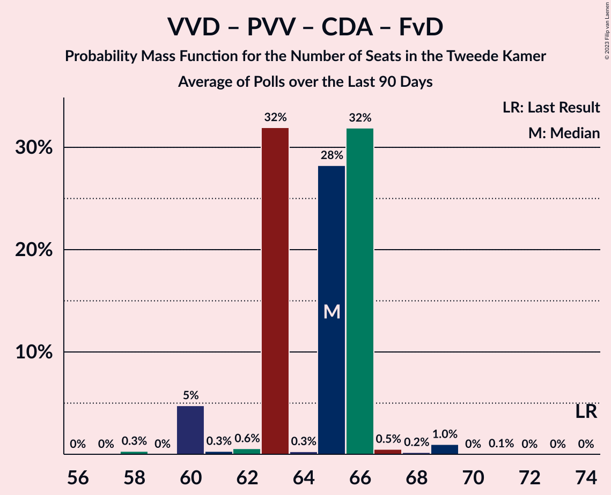

# Poll Average

<a href="#voting-intentions">Voting Intentions</a> | <a href="#seats">Seats</a> | <a href="#coalitions">Coalitions</a> | <a href="#technical-information">Technical Information</a>

## Summary

The table below lists the polls on which the average is based. They are the most recent polls (less than 90 days old) registered and analyzed so far.

| Period     | Polling firm/Commissioner(s) | VVD | D66 | PVV | CDA | SP | PvdA | GL | FvD | PvdD | CU | Volt | JA21 | SGP | DENK | 50+ | BBB | B1 | CO | Spl | PP | PvdT |
|:----------:|:----------------------------:|:--:|:--:|:--:|:--:|:--:|:--:|:--:|:--:|:--:|:--:|:--:|:--:|:--:|:--:|:--:|:--:|:--:|:--:|:--:|:--:|:--:|
| 17 March 2021 | General Election | 21.9%   34 | 15.0%   24 | 10.8%   17 | 9.5%   15 | 6.0%   9 | 5.7%   9 | 5.2%   8 | 5.0%   8 | 3.8%   6 | 3.4%   5 | 2.4%   3 | 2.4%   3 | 2.1%   3 | 2.0%   3 | 1.0%   1 | 1.0%   1 | 0.8%   1 | 0.4%   0 | 0.3%   0 | 0.2%   0 | 0.0%   0 |
| N/A | Poll Average | 21–27%   34–40 | 12–16%   20–26 | 8–13%   14–20 | 4–9%   5–13 | 4–7%   6–10 | 5–8%   7–12 | 4–7%   7–9 | 3–4%   4–6 | 4–6%   7–9 | 3–5%   3–7 | 2–5%   4–7 | 2–5%   3–6 | 2–3%   2–4 | 2–3%   3–4 | 0–1%   0–1 | 2–4%   3–5 | 0–2%   1–2 | N/A   N/A | N/A   N/A | N/A   N/A | N/A   N/A |
| [25–28 June 2021](2021-06-28-Ipsos.html) | Ipsos   EenVandaag | 22–27%   38–42 | 12–17%   21–26 | 9–13%   14–18 | 5–8%   7–13 | 4–7%   6–8 | 5–8%   7–10 | 4–6%   7–8 | 2–5%   4–6 | 4–7%   8–9 | 2–5%   3–5 | 2–4%   4–6 | 2–4%   3–6 | 2–4%   3–4 | 2–4%   3–4 | 0–1%   0–1 | 2–4%   3–6 | 0–1%   0–1 | N/A   N/A | N/A   N/A | N/A   N/A | N/A   N/A |
| [27 June 2021](2021-06-27-Peilnl.html) | Peil.nl | 22–25%   34–36 | 13–16%   20–24 | 11–13%   17–20 | 3–5%   5–6 | 5–7%   9–10 | 6–8%   8–12 | 4–5%   7–8 | 3–4%   4–6 | 5–6%   7–8 | 3–5%   6–7 | 3–5%   5 | 3–4%   4–6 | 2–3%   2–3 | 2–3%   3 | 0%   0 | 3–4%   5 | 1–2%   2 | N/A   N/A | N/A   N/A | N/A   N/A | N/A   N/A |
| [4–7 June 2021](2021-06-07-IOResearch.html) | I&O Research | 21–25%   34–36 | 12–15%   19–22 | 8–11%   14–16 | 7–9%   11–13 | 4–6%   6–7 | 5–8%   9–11 | 5–7%   9 | 3–4%   4–5 | 4–6%   7–8 | 3–4%   4–7 | 4–5%   6–9 | 3–5%   4–6 | 2–3%   2–3 | 1–3%   2–3 | 0–1%   0–1 | 2–3%   3–4 | 1–2%   1–3 | N/A   N/A | N/A   N/A | N/A   N/A | N/A   N/A |
| 17 March 2021 | General Election | 21.9%   34 | 15.0%   24 | 10.8%   17 | 9.5%   15 | 6.0%   9 | 5.7%   9 | 5.2%   8 | 5.0%   8 | 3.8%   6 | 3.4%   5 | 2.4%   3 | 2.4%   3 | 2.1%   3 | 2.0%   3 | 1.0%   1 | 1.0%   1 | 0.8%   1 | 0.4%   0 | 0.3%   0 | 0.2%   0 | 0.0%   0 |

Only polls for which at least the sample size has been published are included in the table above.

**Legend:**
+ **Top half of each row:** Voting intentions (95% confidence interval)
+ **Bottom half of each row:** Seat projections for the Tweede Kamer (95% confidence interval)
+ **VVD:** Volkspartij voor Vrijheid en Democratie
+ **D66:** Democraten 66
+ **PVV:** Partij voor de Vrijheid
+ **CDA:** Christen-Democratisch Appèl
+ **SP:** Socialistische Partij
+ **PvdA:** Partij van de Arbeid
+ **GL:** GroenLinks
+ **FvD:** Forum voor Democratie
+ **PvdD:** Partij voor de Dieren
+ **CU:** ChristenUnie
+ **Volt:** Volt Europa
+ **JA21:** Juiste Antwoord 2021
+ **SGP:** Staatkundig Gereformeerde Partij
+ **DENK:** DENK
+ **50+:** 50Plus
+ **BBB:** BoerBurgerBeweging
+ **B1:** Bij1
+ **CO:** Code Oranje
+ **Spl:** Splinter
+ **PP:** Piratenpartij
+ **PvdT:** Partij voor de Toekomst
+ **N/A (single party):** Party not included the published results
+ **N/A (entire row):** Calculation for this opinion poll not started yet

## Voting Intentions

### Confidence Intervals

| Party | Last Result | Median | 80% Confidence Interval | 90% Confidence Interval | 95% Confidence Interval | 99% Confidence Interval |
|:-----:|:-----------:|:------:|:-----------------------:|:-----------------------:|:-----------------------:|:-----------------------:|
| <a href="#volkspartij-voor-vrijheid-en-democratie">Volkspartij voor Vrijheid en Democratie</a> | 21.9% | 23.4% | 22.0–25.4% |21.7–26.1% | 21.3–26.6% | 20.7–27.7% |
| <a href="#democraten-66">Democraten 66</a> | 15.0% | 14.2% | 12.9–15.4% |12.5–15.8% | 12.2–16.1% | 11.7–16.8% |
| <a href="#partij-voor-de-vrijheid">Partij voor de Vrijheid</a> | 10.8% | 10.8% | 8.8–12.4% |8.5–12.7% | 8.2–12.9% | 7.8–13.4% |
| <a href="#christen-democratisch-appèl">Christen-Democratisch Appèl</a> | 9.5% | 6.2% | 3.8–8.3% |3.7–8.6% | 3.5–8.9% | 3.3–9.4% |
| <a href="#socialistische-partij">Socialistische Partij</a> | 6.0% | 5.4% | 4.4–6.4% |4.2–6.6% | 4.0–6.8% | 3.7–7.2% |
| <a href="#partij-van-de-arbeid">Partij van de Arbeid</a> | 5.7% | 6.5% | 5.6–7.2% |5.4–7.5% | 5.1–7.7% | 4.7–8.1% |
| <a href="#groenlinks">GroenLinks</a> | 5.2% | 5.1% | 4.3–6.1% |4.1–6.4% | 4.0–6.6% | 3.6–7.1% |
| <a href="#forum-voor-democratie">Forum voor Democratie</a> | 5.0% | 3.5% | 2.9–4.1% |2.8–4.3% | 2.7–4.5% | 2.4–5.0% |
| <a href="#partij-voor-de-dieren">Partij voor de Dieren</a> | 3.8% | 5.2% | 4.5–5.9% |4.3–6.1% | 4.1–6.4% | 3.8–6.9% |
| <a href="#christenunie">ChristenUnie</a> | 3.4% | 3.7% | 3.0–4.3% |2.8–4.5% | 2.6–4.7% | 2.3–5.0% |
| <a href="#volt-europa">Volt Europa</a> | 2.4% | 3.9% | 2.8–4.7% |2.5–5.0% | 2.3–5.2% | 2.0–5.5% |
| <a href="#juiste-antwoord-2021">Juiste Antwoord 2021</a> | 2.4% | 3.5% | 2.9–4.2% |2.7–4.5% | 2.5–4.7% | 2.2–5.0% |
| <a href="#staatkundig-gereformeerde-partij">Staatkundig Gereformeerde Partij</a> | 2.1% | 2.2% | 1.8–2.8% |1.7–3.0% | 1.6–3.2% | 1.4–3.6% |
| <a href="#denk">DENK</a> | 2.0% | 2.1% | 1.7–2.7% |1.6–3.0% | 1.5–3.2% | 1.3–3.6% |
| <a href="#50plus">50Plus</a> | 1.0% | 0.4% | 0.1–0.8% |0.1–1.0% | 0.1–1.1% | 0.1–1.4% |
| <a href="#boerburgerbeweging">BoerBurgerBeweging</a> | 1.0% | 2.9% | 2.1–3.6% |1.9–3.8% | 1.8–3.9% | 1.6–4.2% |
| <a href="#bij1">Bij1</a> | 0.8% | 1.3% | 0.6–1.7% |0.5–1.9% | 0.4–2.0% | 0.3–2.2% |
| <a href="#code-oranje">Code Oranje</a> | 0.4% | N/A | N/A |N/A | N/A | N/A |
| <a href="#splinter">Splinter</a> | 0.3% | N/A | N/A |N/A | N/A | N/A |
| <a href="#piratenpartij">Piratenpartij</a> | 0.2% | N/A | N/A |N/A | N/A | N/A |
| <a href="#partij-voor-de-toekomst">Partij voor de Toekomst</a> | 0.0% | N/A | N/A |N/A | N/A | N/A |

### Volkspartij voor Vrijheid en Democratie

*For a full overview of the results for this party, see the [Volkspartij voor Vrijheid en Democratie](party-volkspartijvoorvrijheidendemocratie.html) page.*

| Voting Intentions | Probability | Accumulated | Special Marks |
|:-----------------:|:-----------:|:-----------:|:-------------:|
| 18.5–19.5% | 0% | 100% |  |
| 19.5–20.5% | 0.4% | 100% |  |
| 20.5–21.5% | 4% | 99.6% |  |
| 21.5–22.5% | 17% | 96% | Last Result |
| 22.5–23.5% | 33% | 79% | Median |
| 23.5–24.5% | 25% | 46% |  |
| 24.5–25.5% | 12% | 21% |  |
| 25.5–26.5% | 6% | 9% |  |
| 26.5–27.5% | 2% | 3% |  |
| 27.5–28.5% | 0.5% | 0.6% |  |
| 28.5–29.5% | 0.1% | 0.1% |  |
| 29.5–30.5% | 0% | 0% |  |

### Democraten 66

*For a full overview of the results for this party, see the [Democraten 66](party-democraten66.html) page.*

| Voting Intentions | Probability | Accumulated | Special Marks |
|:-----------------:|:-----------:|:-----------:|:-------------:|
| 9.5–10.5% | 0% | 100% |  |
| 10.5–11.5% | 0.3% | 100% |  |
| 11.5–12.5% | 5% | 99.7% |  |
| 12.5–13.5% | 22% | 95% |  |
| 13.5–14.5% | 38% | 73% | Median |
| 14.5–15.5% | 28% | 35% | Last Result |
| 15.5–16.5% | 7% | 8% |  |
| 16.5–17.5% | 0.8% | 0.9% |  |
| 17.5–18.5% | 0.1% | 0.1% |  |
| 18.5–19.5% | 0% | 0% |  |

### Partij voor de Vrijheid

*For a full overview of the results for this party, see the [Partij voor de Vrijheid](party-partijvoordevrijheid.html) page.*

| Voting Intentions | Probability | Accumulated | Special Marks |
|:-----------------:|:-----------:|:-----------:|:-------------:|
| 5.5–6.5% | 0% | 100% |  |
| 6.5–7.5% | 0.2% | 100% |  |
| 7.5–8.5% | 6% | 99.8% |  |
| 8.5–9.5% | 21% | 94% |  |
| 9.5–10.5% | 19% | 74% |  |
| 10.5–11.5% | 21% | 55% | Last Result, Median |
| 11.5–12.5% | 26% | 33% |  |
| 12.5–13.5% | 7% | 7% |  |
| 13.5–14.5% | 0.3% | 0.3% |  |
| 14.5–15.5% | 0% | 0% |  |

### Christen-Democratisch Appèl

*For a full overview of the results for this party, see the [Christen-Democratisch Appèl](party-christen-democratischappèl.html) page.*

| Voting Intentions | Probability | Accumulated | Special Marks |
|:-----------------:|:-----------:|:-----------:|:-------------:|
| 1.5–2.5% | 0% | 100% |  |
| 2.5–3.5% | 3% | 100% |  |
| 3.5–4.5% | 28% | 97% |  |
| 4.5–5.5% | 9% | 69% |  |
| 5.5–6.5% | 17% | 60% | Median |
| 6.5–7.5% | 18% | 44% |  |
| 7.5–8.5% | 20% | 26% |  |
| 8.5–9.5% | 5% | 6% |  |
| 9.5–10.5% | 0.2% | 0.2% | Last Result |
| 10.5–11.5% | 0% | 0% |  |

### Socialistische Partij

*For a full overview of the results for this party, see the [Socialistische Partij](party-socialistischepartij.html) page.*

| Voting Intentions | Probability | Accumulated | Special Marks |
|:-----------------:|:-----------:|:-----------:|:-------------:|
| 1.5–2.5% | 0% | 100% |  |
| 2.5–3.5% | 0.2% | 100% |  |
| 3.5–4.5% | 14% | 99.8% |  |
| 4.5–5.5% | 41% | 86% | Median |
| 5.5–6.5% | 39% | 45% | Last Result |
| 6.5–7.5% | 5% | 6% |  |
| 7.5–8.5% | 0.1% | 0.1% |  |
| 8.5–9.5% | 0% | 0% |  |

### Partij van de Arbeid

*For a full overview of the results for this party, see the [Partij van de Arbeid](party-partijvandearbeid.html) page.*

| Voting Intentions | Probability | Accumulated | Special Marks |
|:-----------------:|:-----------:|:-----------:|:-------------:|
| 2.5–3.5% | 0% | 100% |  |
| 3.5–4.5% | 0.3% | 100% |  |
| 4.5–5.5% | 8% | 99.7% |  |
| 5.5–6.5% | 46% | 92% | Last Result, Median |
| 6.5–7.5% | 42% | 46% |  |
| 7.5–8.5% | 4% | 4% |  |
| 8.5–9.5% | 0.1% | 0.1% |  |
| 9.5–10.5% | 0% | 0% |  |

### GroenLinks

*For a full overview of the results for this party, see the [GroenLinks](party-groenlinks.html) page.*

| Voting Intentions | Probability | Accumulated | Special Marks |
|:-----------------:|:-----------:|:-----------:|:-------------:|
| 1.5–2.5% | 0% | 100% |  |
| 2.5–3.5% | 0.3% | 100% |  |
| 3.5–4.5% | 21% | 99.7% |  |
| 4.5–5.5% | 50% | 79% | Last Result, Median |
| 5.5–6.5% | 26% | 29% |  |
| 6.5–7.5% | 3% | 3% |  |
| 7.5–8.5% | 0.1% | 0.1% |  |
| 8.5–9.5% | 0% | 0% |  |

### Forum voor Democratie

*For a full overview of the results for this party, see the [Forum voor Democratie](party-forumvoordemocratie.html) page.*

| Voting Intentions | Probability | Accumulated | Special Marks |
|:-----------------:|:-----------:|:-----------:|:-------------:|
| 0.5–1.5% | 0% | 100% |  |
| 1.5–2.5% | 1.3% | 100% |  |
| 2.5–3.5% | 57% | 98.7% | Median |
| 3.5–4.5% | 39% | 42% |  |
| 4.5–5.5% | 2% | 2% | Last Result |
| 5.5–6.5% | 0% | 0% |  |
| 6.5–7.5% | 0% | 0% |  |

### Partij voor de Dieren

*For a full overview of the results for this party, see the [Partij voor de Dieren](party-partijvoordedieren.html) page.*

| Voting Intentions | Probability | Accumulated | Special Marks |
|:-----------------:|:-----------:|:-----------:|:-------------:|
| 1.5–2.5% | 0% | 100% |  |
| 2.5–3.5% | 0.2% | 100% |  |
| 3.5–4.5% | 12% | 99.8% | Last Result |
| 4.5–5.5% | 62% | 88% | Median |
| 5.5–6.5% | 24% | 25% |  |
| 6.5–7.5% | 1.3% | 1.4% |  |
| 7.5–8.5% | 0% | 0% |  |
| 8.5–9.5% | 0% | 0% |  |

### ChristenUnie

*For a full overview of the results for this party, see the [ChristenUnie](party-christenunie.html) page.*

| Voting Intentions | Probability | Accumulated | Special Marks |
|:-----------------:|:-----------:|:-----------:|:-------------:|
| 0.5–1.5% | 0% | 100% |  |
| 1.5–2.5% | 2% | 100% |  |
| 2.5–3.5% | 38% | 98% | Last Result |
| 3.5–4.5% | 56% | 61% | Median |
| 4.5–5.5% | 4% | 4% |  |
| 5.5–6.5% | 0% | 0% |  |

### Volt Europa

*For a full overview of the results for this party, see the [Volt Europa](party-volteuropa.html) page.*

| Voting Intentions | Probability | Accumulated | Special Marks |
|:-----------------:|:-----------:|:-----------:|:-------------:|
| 0.5–1.5% | 0% | 100% |  |
| 1.5–2.5% | 6% | 100% | Last Result |
| 2.5–3.5% | 25% | 94% |  |
| 3.5–4.5% | 53% | 69% | Median |
| 4.5–5.5% | 15% | 16% |  |
| 5.5–6.5% | 0.5% | 0.5% |  |
| 6.5–7.5% | 0% | 0% |  |

### Juiste Antwoord 2021

*For a full overview of the results for this party, see the [Juiste Antwoord 2021](party-juisteantwoord2021.html) page.*

| Voting Intentions | Probability | Accumulated | Special Marks |
|:-----------------:|:-----------:|:-----------:|:-------------:|
| 0.5–1.5% | 0% | 100% |  |
| 1.5–2.5% | 3% | 100% | Last Result |
| 2.5–3.5% | 51% | 97% | Median |
| 3.5–4.5% | 42% | 46% |  |
| 4.5–5.5% | 4% | 4% |  |
| 5.5–6.5% | 0% | 0% |  |

### Staatkundig Gereformeerde Partij

*For a full overview of the results for this party, see the [Staatkundig Gereformeerde Partij](party-staatkundiggereformeerdepartij.html) page.*

| Voting Intentions | Probability | Accumulated | Special Marks |
|:-----------------:|:-----------:|:-----------:|:-------------:|
| 0.0–0.5% | 0% | 100% |  |
| 0.5–1.5% | 2% | 100% |  |
| 1.5–2.5% | 77% | 98% | Last Result, Median |
| 2.5–3.5% | 20% | 21% |  |
| 3.5–4.5% | 0.7% | 0.7% |  |
| 4.5–5.5% | 0% | 0% |  |

### DENK

*For a full overview of the results for this party, see the [DENK](party-denk.html) page.*

| Voting Intentions | Probability | Accumulated | Special Marks |
|:-----------------:|:-----------:|:-----------:|:-------------:|
| 0.0–0.5% | 0% | 100% |  |
| 0.5–1.5% | 4% | 100% |  |
| 1.5–2.5% | 79% | 96% | Last Result, Median |
| 2.5–3.5% | 16% | 17% |  |
| 3.5–4.5% | 0.7% | 0.7% |  |
| 4.5–5.5% | 0% | 0% |  |

### 50Plus

*For a full overview of the results for this party, see the [50Plus](party-50plus.html) page.*

| Voting Intentions | Probability | Accumulated | Special Marks |
|:-----------------:|:-----------:|:-----------:|:-------------:|
| 0.0–0.5% | 62% | 100% | Median |
| 0.5–1.5% | 38% | 38% | Last Result |
| 1.5–2.5% | 0.2% | 0.2% |  |
| 2.5–3.5% | 0% | 0% |  |

### BoerBurgerBeweging

*For a full overview of the results for this party, see the [BoerBurgerBeweging](party-boerburgerbeweging.html) page.*

| Voting Intentions | Probability | Accumulated | Special Marks |
|:-----------------:|:-----------:|:-----------:|:-------------:|
| 0.0–0.5% | 0% | 100% |  |
| 0.5–1.5% | 0.2% | 100% | Last Result |
| 1.5–2.5% | 33% | 99.8% |  |
| 2.5–3.5% | 54% | 67% | Median |
| 3.5–4.5% | 13% | 13% |  |
| 4.5–5.5% | 0.1% | 0.1% |  |
| 5.5–6.5% | 0% | 0% |  |

### Bij1

*For a full overview of the results for this party, see the [Bij1](party-bij1.html) page.*

| Voting Intentions | Probability | Accumulated | Special Marks |
|:-----------------:|:-----------:|:-----------:|:-------------:|
| 0.0–0.5% | 7% | 100% |  |
| 0.5–1.5% | 72% | 93% | Last Result, Median |
| 1.5–2.5% | 21% | 21% |  |
| 2.5–3.5% | 0% | 0% |  |
| 3.5–4.5% | 0% | 0% |  |

## Seats

### Confidence Intervals

| Party | Last Result | Median | 80% Confidence Interval | 90% Confidence Interval | 95% Confidence Interval | 99% Confidence Interval |
|:-----:|:-----------:|:------:|:-----------------------:|:-----------------------:|:-----------------------:|:-----------------------:|
| <a href="#volkspartij-voor-vrijheid-en-democratie">Volkspartij voor Vrijheid en Democratie</a> | 34 | 36 | 34–40 |34–40 | 34–40 | 34–42 |
| <a href="#democraten-66">Democraten 66</a> | 24 | 21 | 20–26 |20–26 | 20–26 | 19–26 |
| <a href="#partij-voor-de-vrijheid">Partij voor de Vrijheid</a> | 17 | 15 | 14–19 |14–20 | 14–20 | 12–20 |
| <a href="#christen-democratisch-appèl">Christen-Democratisch Appèl</a> | 15 | 7 | 5–13 |5–13 | 5–13 | 5–13 |
| <a href="#socialistische-partij">Socialistische Partij</a> | 9 | 8 | 7–10 |7–10 | 6–10 | 6–10 |
| <a href="#partij-van-de-arbeid">Partij van de Arbeid</a> | 9 | 10 | 7–12 |7–12 | 7–12 | 7–12 |
| <a href="#groenlinks">GroenLinks</a> | 8 | 8 | 7–9 |7–9 | 7–9 | 6–10 |
| <a href="#forum-voor-democratie">Forum voor Democratie</a> | 8 | 4 | 4–6 |4–6 | 4–6 | 3–6 |
| <a href="#partij-voor-de-dieren">Partij voor de Dieren</a> | 6 | 8 | 7–9 |7–9 | 7–9 | 6–9 |
| <a href="#christenunie">ChristenUnie</a> | 5 | 5 | 4–7 |4–7 | 3–7 | 3–7 |
| <a href="#volt-europa">Volt Europa</a> | 3 | 6 | 5–7 |5–7 | 4–7 | 4–9 |
| <a href="#juiste-antwoord-2021">Juiste Antwoord 2021</a> | 3 | 6 | 3–6 |3–6 | 3–6 | 3–6 |
| <a href="#staatkundig-gereformeerde-partij">Staatkundig Gereformeerde Partij</a> | 3 | 3 | 2–4 |2–4 | 2–4 | 2–4 |
| <a href="#denk">DENK</a> | 3 | 3 | 3–4 |3–4 | 3–4 | 2–6 |
| <a href="#50plus">50Plus</a> | 1 | 0 | 0 |0 | 0–1 | 0–1 |
| <a href="#boerburgerbeweging">BoerBurgerBeweging</a> | 1 | 4 | 3–5 |3–5 | 3–5 | 3–7 |
| <a href="#bij1">Bij1</a> | 1 | 1 | 1–2 |1–2 | 1–2 | 0–3 |
| <a href="#code-oranje">Code Oranje</a> | 0 | N/A | N/A |N/A | N/A | N/A |
| <a href="#splinter">Splinter</a> | 0 | N/A | N/A |N/A | N/A | N/A |
| <a href="#piratenpartij">Piratenpartij</a> | 0 | N/A | N/A |N/A | N/A | N/A |
| <a href="#partij-voor-de-toekomst">Partij voor de Toekomst</a> | 0 | N/A | N/A |N/A | N/A | N/A |

### Volkspartij voor Vrijheid en Democratie

*For a full overview of the results for this party, see the [Volkspartij voor Vrijheid en Democratie](party-volkspartijvoorvrijheidendemocratie.html) page.*

| Number of Seats | Probability | Accumulated | Special Marks |
|:---------------:|:-----------:|:-----------:|:-------------:|
| 32 | 0% | 100% |  |
| 33 | 0% | 99.9% |  |
| 34 | 41% | 99.9% | Last Result |
| 35 | 0.4% | 59% |  |
| 36 | 25% | 59% | Median |
| 37 | 0.2% | 34% |  |
| 38 | 1.1% | 34% |  |
| 39 | 0.7% | 33% |  |
| 40 | 29% | 32% |  |
| 41 | 0.7% | 2% |  |
| 42 | 2% | 2% |  |
| 43 | 0% | 0% |  |

### Democraten 66

*For a full overview of the results for this party, see the [Democraten 66](party-democraten66.html) page.*

| Number of Seats | Probability | Accumulated | Special Marks |
|:---------------:|:-----------:|:-----------:|:-------------:|
| 18 | 0.4% | 100% |  |
| 19 | 1.1% | 99.6% |  |
| 20 | 23% | 98% |  |
| 21 | 32% | 76% | Median |
| 22 | 3% | 43% |  |
| 23 | 0.5% | 41% |  |
| 24 | 10% | 40% | Last Result |
| 25 | 0.4% | 30% |  |
| 26 | 29% | 29% |  |
| 27 | 0% | 0% |  |

### Partij voor de Vrijheid

*For a full overview of the results for this party, see the [Partij voor de Vrijheid](party-partijvoordevrijheid.html) page.*

| Number of Seats | Probability | Accumulated | Special Marks |
|:---------------:|:-----------:|:-----------:|:-------------:|
| 12 | 0.6% | 100% |  |
| 13 | 0.2% | 99.4% |  |
| 14 | 32% | 99.1% |  |
| 15 | 30% | 67% | Median |
| 16 | 2% | 37% |  |
| 17 | 23% | 35% | Last Result |
| 18 | 1.3% | 12% |  |
| 19 | 0.8% | 11% |  |
| 20 | 10% | 10% |  |
| 21 | 0% | 0% |  |

### Christen-Democratisch Appèl

*For a full overview of the results for this party, see the [Christen-Democratisch Appèl](party-christen-democratischappèl.html) page.*

| Number of Seats | Probability | Accumulated | Special Marks |
|:---------------:|:-----------:|:-----------:|:-------------:|
| 4 | 0.2% | 100% |  |
| 5 | 23% | 99.8% |  |
| 6 | 10% | 76% |  |
| 7 | 31% | 67% | Median |
| 8 | 0.3% | 35% |  |
| 9 | 0.7% | 35% |  |
| 10 | 0.8% | 34% |  |
| 11 | 2% | 34% |  |
| 12 | 0% | 32% |  |
| 13 | 32% | 32% |  |
| 14 | 0% | 0% |  |
| 15 | 0% | 0% | Last Result |

### Socialistische Partij

*For a full overview of the results for this party, see the [Socialistische Partij](party-socialistischepartij.html) page.*

| Number of Seats | Probability | Accumulated | Special Marks |
|:---------------:|:-----------:|:-----------:|:-------------:|
| 5 | 0.1% | 100% |  |
| 6 | 4% | 99.9% |  |
| 7 | 32% | 96% |  |
| 8 | 30% | 64% | Median |
| 9 | 23% | 33% | Last Result |
| 10 | 11% | 11% |  |
| 11 | 0.1% | 0.2% |  |
| 12 | 0% | 0.2% |  |
| 13 | 0.2% | 0.2% |  |
| 14 | 0% | 0% |  |

### Partij van de Arbeid

*For a full overview of the results for this party, see the [Partij van de Arbeid](party-partijvandearbeid.html) page.*

| Number of Seats | Probability | Accumulated | Special Marks |
|:---------------:|:-----------:|:-----------:|:-------------:|
| 7 | 29% | 100% |  |
| 8 | 12% | 71% |  |
| 9 | 2% | 58% | Last Result |
| 10 | 31% | 57% | Median |
| 11 | 2% | 25% |  |
| 12 | 23% | 23% |  |
| 13 | 0% | 0% |  |

### GroenLinks

*For a full overview of the results for this party, see the [GroenLinks](party-groenlinks.html) page.*

| Number of Seats | Probability | Accumulated | Special Marks |
|:---------------:|:-----------:|:-----------:|:-------------:|
| 6 | 1.0% | 100% |  |
| 7 | 40% | 99.0% |  |
| 8 | 25% | 59% | Last Result, Median |
| 9 | 33% | 34% |  |
| 10 | 0.6% | 0.7% |  |
| 11 | 0% | 0% |  |

### Forum voor Democratie

*For a full overview of the results for this party, see the [Forum voor Democratie](party-forumvoordemocratie.html) page.*

| Number of Seats | Probability | Accumulated | Special Marks |
|:---------------:|:-----------:|:-----------:|:-------------:|
| 3 | 1.0% | 100% |  |
| 4 | 55% | 99.0% | Median |
| 5 | 32% | 44% |  |
| 6 | 12% | 12% |  |
| 7 | 0.1% | 0.1% |  |
| 8 | 0% | 0% | Last Result |

### Partij voor de Dieren

*For a full overview of the results for this party, see the [Partij voor de Dieren](party-partijvoordedieren.html) page.*

| Number of Seats | Probability | Accumulated | Special Marks |
|:---------------:|:-----------:|:-----------:|:-------------:|
| 6 | 0.7% | 100% | Last Result |
| 7 | 11% | 99.2% |  |
| 8 | 56% | 88% | Median |
| 9 | 32% | 32% |  |
| 10 | 0.3% | 0.4% |  |
| 11 | 0% | 0% |  |

### ChristenUnie

*For a full overview of the results for this party, see the [ChristenUnie](party-christenunie.html) page.*

| Number of Seats | Probability | Accumulated | Special Marks |
|:---------------:|:-----------:|:-----------:|:-------------:|
| 3 | 3% | 100% |  |
| 4 | 30% | 97% |  |
| 5 | 31% | 67% | Last Result, Median |
| 6 | 2% | 36% |  |
| 7 | 34% | 34% |  |
| 8 | 0.1% | 0.1% |  |
| 9 | 0% | 0% |  |

### Volt Europa

*For a full overview of the results for this party, see the [Volt Europa](party-volteuropa.html) page.*

| Number of Seats | Probability | Accumulated | Special Marks |
|:---------------:|:-----------:|:-----------:|:-------------:|
| 3 | 0.3% | 100% | Last Result |
| 4 | 2% | 99.7% |  |
| 5 | 34% | 97% |  |
| 6 | 32% | 64% | Median |
| 7 | 31% | 32% |  |
| 8 | 0.4% | 1.4% |  |
| 9 | 1.1% | 1.1% |  |
| 10 | 0% | 0% |  |

### Juiste Antwoord 2021

*For a full overview of the results for this party, see the [Juiste Antwoord 2021](party-juisteantwoord2021.html) page.*

| Number of Seats | Probability | Accumulated | Special Marks |
|:---------------:|:-----------:|:-----------:|:-------------:|
| 3 | 30% | 100% | Last Result |
| 4 | 13% | 70% |  |
| 5 | 2% | 57% |  |
| 6 | 55% | 56% | Median |
| 7 | 0.4% | 0.5% |  |
| 8 | 0.1% | 0.1% |  |
| 9 | 0% | 0% |  |

### Staatkundig Gereformeerde Partij

*For a full overview of the results for this party, see the [Staatkundig Gereformeerde Partij](party-staatkundiggereformeerdepartij.html) page.*

| Number of Seats | Probability | Accumulated | Special Marks |
|:---------------:|:-----------:|:-----------:|:-------------:|
| 2 | 13% | 100% |  |
| 3 | 57% | 87% | Last Result, Median |
| 4 | 30% | 30% |  |
| 5 | 0.1% | 0.1% |  |
| 6 | 0% | 0% |  |

### DENK

*For a full overview of the results for this party, see the [DENK](party-denk.html) page.*

| Number of Seats | Probability | Accumulated | Special Marks |
|:---------------:|:-----------:|:-----------:|:-------------:|
| 2 | 1.2% | 100% |  |
| 3 | 66% | 98.8% | Last Result, Median |
| 4 | 32% | 33% |  |
| 5 | 0.1% | 0.7% |  |
| 6 | 0.6% | 0.6% |  |
| 7 | 0% | 0% |  |

### 50Plus

*For a full overview of the results for this party, see the [50Plus](party-50plus.html) page.*

| Number of Seats | Probability | Accumulated | Special Marks |
|:---------------:|:-----------:|:-----------:|:-------------:|
| 0 | 97% | 100% | Median |
| 1 | 3% | 3% | Last Result |
| 2 | 0.1% | 0.1% |  |
| 3 | 0% | 0% |  |

### BoerBurgerBeweging

*For a full overview of the results for this party, see the [BoerBurgerBeweging](party-boerburgerbeweging.html) page.*

| Number of Seats | Probability | Accumulated | Special Marks |
|:---------------:|:-----------:|:-----------:|:-------------:|
| 1 | 0% | 100% | Last Result |
| 2 | 0.1% | 100% |  |
| 3 | 33% | 99.9% |  |
| 4 | 32% | 67% | Median |
| 5 | 34% | 35% |  |
| 6 | 0.1% | 0.9% |  |
| 7 | 0.8% | 0.8% |  |
| 8 | 0% | 0% |  |

### Bij1

*For a full overview of the results for this party, see the [Bij1](party-bij1.html) page.*

| Number of Seats | Probability | Accumulated | Special Marks |
|:---------------:|:-----------:|:-----------:|:-------------:|
| 0 | 2% | 100% |  |
| 1 | 62% | 98% | Last Result, Median |
| 2 | 35% | 36% |  |
| 3 | 2% | 2% |  |
| 4 | 0% | 0% |  |

### Code Oranje

*For a full overview of the results for this party, see the [Code Oranje](party-codeoranje.html) page.*

### Splinter

*For a full overview of the results for this party, see the [Splinter](party-splinter.html) page.*

### Piratenpartij

*For a full overview of the results for this party, see the [Piratenpartij](party-piratenpartij.html) page.*

### Partij voor de Toekomst

*For a full overview of the results for this party, see the [Partij voor de Toekomst](party-partijvoordetoekomst.html) page.*

## Coalitions

### Confidence Intervals

| Coalition | Last Result | Median | Majority? | 80% Confidence Interval | 90% Confidence Interval | 95% Confidence Interval | 99% Confidence Interval |
|:---------:|:-----------:|:------:|:---------:|:-----------------------:|:-----------------------:|:-----------------------:|:-----------------------:|
| Volkspartij voor Vrijheid en Democratie – Democraten 66 – Christen-Democratisch Appèl – Partij van de Arbeid – ChristenUnie | 87 | 83 | 100% | 79–84 | 79–84 | 79–85 | 79–88 |
| Volkspartij voor Vrijheid en Democratie – Democraten 66 – Christen-Democratisch Appèl – GroenLinks – ChristenUnie | 86 | 82 | 100% | 76–84 | 76–84 | 76–84 | 76–86 |
| Volkspartij voor Vrijheid en Democratie – Democraten 66 – Christen-Democratisch Appèl – ChristenUnie | 78 | 73 | 32% | 68–77 | 68–77 | 68–77 | 68–77 |
| Volkspartij voor Vrijheid en Democratie – Democraten 66 – Partij van de Arbeid | 67 | 68 | 0% | 65–73 | 65–73 | 65–73 | 64–73 |
| Volkspartij voor Vrijheid en Democratie – Democraten 66 – Christen-Democratisch Appèl | 73 | 68 | 0% | 61–73 | 61–73 | 61–73 | 61–73 |
| Volkspartij voor Vrijheid en Democratie – Partij voor de Vrijheid – Christen-Democratisch Appèl – Forum voor Democratie – Staatkundig Gereformeerde Partij | 77 | 69 | 0% | 65–70 | 65–70 | 65–72 | 64–74 |
| Volkspartij voor Vrijheid en Democratie – Partij voor de Vrijheid – Christen-Democratisch Appèl – Forum voor Democratie | 74 | 66 | 0% | 62–66 | 62–67 | 62–70 | 62–71 |
| Democraten 66 – Christen-Democratisch Appèl – Socialistische Partij – Partij van de Arbeid – GroenLinks – ChristenUnie | 70 | 61 | 0% | 59–65 | 59–65 | 58–65 | 53–67 |
| Volkspartij voor Vrijheid en Democratie – Partij voor de Vrijheid – Christen-Democratisch Appèl | 66 | 61 | 0% | 58–62 | 58–62 | 58–65 | 58–67 |
| Volkspartij voor Vrijheid en Democratie – Christen-Democratisch Appèl – Partij van de Arbeid | 58 | 54 | 0% | 50–57 | 48–57 | 48–60 | 48–61 |
| Democraten 66 – Christen-Democratisch Appèl – Partij van de Arbeid – GroenLinks – ChristenUnie | 61 | 52 | 0% | 51–58 | 51–58 | 51–58 | 47–61 |
| Volkspartij voor Vrijheid en Democratie – Christen-Democratisch Appèl – Forum voor Democratie – Staatkundig Gereformeerde Partij – 50Plus | 61 | 55 | 0% | 48–55 | 48–56 | 48–57 | 47–60 |
| Volkspartij voor Vrijheid en Democratie – Christen-Democratisch Appèl – Forum voor Democratie – Staatkundig Gereformeerde Partij | 60 | 55 | 0% | 48–55 | 48–56 | 48–56 | 47–60 |
| Volkspartij voor Vrijheid en Democratie – Christen-Democratisch Appèl – Forum voor Democratie – 50Plus | 58 | 51 | 0% | 45–52 | 45–53 | 45–54 | 44–57 |
| Volkspartij voor Vrijheid en Democratie – Christen-Democratisch Appèl – Forum voor Democratie | 57 | 51 | 0% | 45–52 | 45–52 | 45–54 | 44–57 |
| Volkspartij voor Vrijheid en Democratie – Partij van de Arbeid | 43 | 47 | 0% | 44–48 | 42–48 | 42–49 | 42–52 |
| Volkspartij voor Vrijheid en Democratie – Christen-Democratisch Appèl | 49 | 47 | 0% | 41–47 | 40–48 | 40–49 | 40–51 |
| Democraten 66 – Christen-Democratisch Appèl – Partij van de Arbeid | 48 | 40 | 0% | 37–44 | 37–44 | 37–44 | 36–46 |
| Democraten 66 – Christen-Democratisch Appèl | 39 | 33 | 0% | 25–34 | 25–34 | 25–34 | 25–35 |
| Christen-Democratisch Appèl – Partij van de Arbeid – ChristenUnie | 29 | 24 | 0% | 18–28 | 18–28 | 18–28 | 18–30 |
| Christen-Democratisch Appèl – Partij van de Arbeid | 24 | 17 | 0% | 14–23 | 14–23 | 14–23 | 14–24 |

### Volkspartij voor Vrijheid en Democratie – Democraten 66 – Christen-Democratisch Appèl – Partij van de Arbeid – ChristenUnie

| Number of Seats | Probability | Accumulated | Special Marks |
|:---------------:|:-----------:|:-----------:|:-------------:|
| 77 | 0.4% | 100% |  |
| 78 | 0% | 99.6% |  |
| 79 | 10% | 99.6% | Median |
| 80 | 23% | 89% |  |
| 81 | 2% | 66% |  |
| 82 | 2% | 65% |  |
| 83 | 30% | 63% |  |
| 84 | 30% | 33% |  |
| 85 | 0.9% | 3% |  |
| 86 | 0.6% | 2% |  |
| 87 | 0% | 1.2% | Last Result |
| 88 | 1.2% | 1.2% |  |
| 89 | 0% | 0% |  |

### Volkspartij voor Vrijheid en Democratie – Democraten 66 – Christen-Democratisch Appèl – GroenLinks – ChristenUnie

| Number of Seats | Probability | Accumulated | Special Marks |
|:---------------:|:-----------:|:-----------:|:-------------:|
| 76 | 22% | 100% | Majority |
| 77 | 0.6% | 78% | Median |
| 78 | 10% | 77% |  |
| 79 | 0.7% | 67% |  |
| 80 | 2% | 66% |  |
| 81 | 1.3% | 64% |  |
| 82 | 31% | 63% |  |
| 83 | 0% | 32% |  |
| 84 | 31% | 32% |  |
| 85 | 0% | 1.3% |  |
| 86 | 1.2% | 1.2% | Last Result |
| 87 | 0% | 0% |  |

### Volkspartij voor Vrijheid en Democratie – Democraten 66 – Christen-Democratisch Appèl – ChristenUnie

| Number of Seats | Probability | Accumulated | Special Marks |
|:---------------:|:-----------:|:-----------:|:-------------:|
| 68 | 23% | 100% |  |
| 69 | 0.5% | 77% | Median |
| 70 | 0.2% | 77% |  |
| 71 | 11% | 77% |  |
| 72 | 0.5% | 65% |  |
| 73 | 32% | 65% |  |
| 74 | 0.7% | 33% |  |
| 75 | 0.1% | 32% |  |
| 76 | 2% | 32% | Majority |
| 77 | 30% | 30% |  |
| 78 | 0% | 0.1% | Last Result |
| 79 | 0% | 0% |  |

### Volkspartij voor Vrijheid en Democratie – Democraten 66 – Partij van de Arbeid

| Number of Seats | Probability | Accumulated | Special Marks |
|:---------------:|:-----------:|:-----------:|:-------------:|
| 62 | 0.4% | 100% |  |
| 63 | 0.1% | 99.6% |  |
| 64 | 1.2% | 99.5% |  |
| 65 | 30% | 98% |  |
| 66 | 10% | 68% |  |
| 67 | 0% | 59% | Last Result, Median |
| 68 | 23% | 59% |  |
| 69 | 3% | 35% |  |
| 70 | 0.3% | 33% |  |
| 71 | 2% | 32% |  |
| 72 | 0.8% | 30% |  |
| 73 | 29% | 30% |  |
| 74 | 0.2% | 0.2% |  |
| 75 | 0% | 0% |  |

### Volkspartij voor Vrijheid en Democratie – Democraten 66 – Christen-Democratisch Appèl

| Number of Seats | Probability | Accumulated | Special Marks |
|:---------------:|:-----------:|:-----------:|:-------------:|
| 61 | 22% | 100% |  |
| 62 | 0% | 78% |  |
| 63 | 0.3% | 78% |  |
| 64 | 11% | 77% | Median |
| 65 | 0.8% | 66% |  |
| 66 | 0.1% | 65% |  |
| 67 | 0.2% | 65% |  |
| 68 | 30% | 65% |  |
| 69 | 0.4% | 35% |  |
| 70 | 2% | 34% |  |
| 71 | 2% | 32% |  |
| 72 | 0% | 30% |  |
| 73 | 30% | 30% | Last Result |
| 74 | 0% | 0% |  |

### Volkspartij voor Vrijheid en Democratie – Partij voor de Vrijheid – Christen-Democratisch Appèl – Forum voor Democratie – Staatkundig Gereformeerde Partij

| Number of Seats | Probability | Accumulated | Special Marks |
|:---------------:|:-----------:|:-----------:|:-------------:|
| 63 | 0.4% | 100% |  |
| 64 | 0.1% | 99.6% |  |
| 65 | 23% | 99.5% | Median |
| 66 | 0.8% | 77% |  |
| 67 | 1.1% | 76% |  |
| 68 | 10% | 75% |  |
| 69 | 30% | 65% |  |
| 70 | 30% | 35% |  |
| 71 | 0% | 5% |  |
| 72 | 2% | 5% |  |
| 73 | 0.2% | 2% |  |
| 74 | 2% | 2% |  |
| 75 | 0.1% | 0.1% |  |
| 76 | 0% | 0% | Majority |
| 77 | 0% | 0% | Last Result |

### Volkspartij voor Vrijheid en Democratie – Partij voor de Vrijheid – Christen-Democratisch Appèl – Forum voor Democratie

| Number of Seats | Probability | Accumulated | Special Marks |
|:---------------:|:-----------:|:-----------:|:-------------:|
| 61 | 0.5% | 100% |  |
| 62 | 22% | 99.5% | Median |
| 63 | 0.7% | 77% |  |
| 64 | 0.4% | 76% |  |
| 65 | 1.2% | 76% |  |
| 66 | 69% | 75% |  |
| 67 | 1.2% | 6% |  |
| 68 | 1.1% | 5% |  |
| 69 | 0.7% | 4% |  |
| 70 | 0.9% | 3% |  |
| 71 | 2% | 2% |  |
| 72 | 0.1% | 0.1% |  |
| 73 | 0% | 0% |  |
| 74 | 0% | 0% | Last Result |

### Democraten 66 – Christen-Democratisch Appèl – Socialistische Partij – Partij van de Arbeid – GroenLinks – ChristenUnie

| Number of Seats | Probability | Accumulated | Special Marks |
|:---------------:|:-----------:|:-----------:|:-------------:|
| 53 | 1.1% | 100% |  |
| 54 | 0.5% | 98.9% |  |
| 55 | 0% | 98% |  |
| 56 | 0.1% | 98% |  |
| 57 | 0.6% | 98% |  |
| 58 | 0.9% | 98% |  |
| 59 | 29% | 97% | Median |
| 60 | 0.8% | 67% |  |
| 61 | 23% | 67% |  |
| 62 | 11% | 44% |  |
| 63 | 1.1% | 33% |  |
| 64 | 0.2% | 32% |  |
| 65 | 30% | 32% |  |
| 66 | 0.1% | 1.4% |  |
| 67 | 1.1% | 1.4% |  |
| 68 | 0% | 0.2% |  |
| 69 | 0% | 0.2% |  |
| 70 | 0.2% | 0.2% | Last Result |
| 71 | 0% | 0% |  |

### Volkspartij voor Vrijheid en Democratie – Partij voor de Vrijheid – Christen-Democratisch Appèl

| Number of Seats | Probability | Accumulated | Special Marks |
|:---------------:|:-----------:|:-----------:|:-------------:|
| 56 | 0% | 100% |  |
| 57 | 0.4% | 99.9% |  |
| 58 | 23% | 99.6% | Median |
| 59 | 0.3% | 77% |  |
| 60 | 11% | 77% |  |
| 61 | 30% | 65% |  |
| 62 | 30% | 35% |  |
| 63 | 2% | 5% |  |
| 64 | 0.3% | 3% |  |
| 65 | 0.8% | 3% |  |
| 66 | 0.1% | 2% | Last Result |
| 67 | 2% | 2% |  |
| 68 | 0% | 0% |  |

### Volkspartij voor Vrijheid en Democratie – Christen-Democratisch Appèl – Partij van de Arbeid

| Number of Seats | Probability | Accumulated | Special Marks |
|:---------------:|:-----------:|:-----------:|:-------------:|
| 48 | 10% | 100% |  |
| 49 | 0% | 90% |  |
| 50 | 0.5% | 90% |  |
| 51 | 0.4% | 90% |  |
| 52 | 0.1% | 89% |  |
| 53 | 23% | 89% | Median |
| 54 | 30% | 67% |  |
| 55 | 0.4% | 37% |  |
| 56 | 2% | 37% |  |
| 57 | 32% | 35% |  |
| 58 | 0% | 3% | Last Result |
| 59 | 0% | 3% |  |
| 60 | 2% | 3% |  |
| 61 | 0.6% | 0.7% |  |
| 62 | 0% | 0% |  |

### Democraten 66 – Christen-Democratisch Appèl – Partij van de Arbeid – GroenLinks – ChristenUnie

| Number of Seats | Probability | Accumulated | Special Marks |
|:---------------:|:-----------:|:-----------:|:-------------:|
| 47 | 2% | 100% |  |
| 48 | 0.1% | 98% |  |
| 49 | 0% | 98% |  |
| 50 | 0.9% | 98% |  |
| 51 | 30% | 98% | Median |
| 52 | 33% | 67% |  |
| 53 | 0.7% | 34% |  |
| 54 | 0% | 34% |  |
| 55 | 0.9% | 34% |  |
| 56 | 0.2% | 33% |  |
| 57 | 1.3% | 33% |  |
| 58 | 30% | 31% |  |
| 59 | 0% | 1.2% |  |
| 60 | 0% | 1.2% |  |
| 61 | 1.1% | 1.1% | Last Result |
| 62 | 0% | 0% |  |

### Volkspartij voor Vrijheid en Democratie – Christen-Democratisch Appèl – Forum voor Democratie – Staatkundig Gereformeerde Partij – 50Plus

| Number of Seats | Probability | Accumulated | Special Marks |
|:---------------:|:-----------:|:-----------:|:-------------:|
| 46 | 0.2% | 100% |  |
| 47 | 0.6% | 99.8% |  |
| 48 | 32% | 99.2% |  |
| 49 | 0.2% | 67% |  |
| 50 | 0.2% | 67% | Median |
| 51 | 0.1% | 66% |  |
| 52 | 1.1% | 66% |  |
| 53 | 0.2% | 65% |  |
| 54 | 0.3% | 65% |  |
| 55 | 59% | 65% |  |
| 56 | 0.7% | 5% |  |
| 57 | 3% | 5% |  |
| 58 | 0.8% | 2% |  |
| 59 | 0.5% | 1.2% |  |
| 60 | 0.6% | 0.7% |  |
| 61 | 0% | 0% | Last Result |

### Volkspartij voor Vrijheid en Democratie – Christen-Democratisch Appèl – Forum voor Democratie – Staatkundig Gereformeerde Partij

| Number of Seats | Probability | Accumulated | Special Marks |
|:---------------:|:-----------:|:-----------:|:-------------:|
| 46 | 0.2% | 100% |  |
| 47 | 0.6% | 99.8% |  |
| 48 | 32% | 99.1% |  |
| 49 | 0.2% | 67% |  |
| 50 | 0.2% | 67% | Median |
| 51 | 0.1% | 66% |  |
| 52 | 1.2% | 66% |  |
| 53 | 0.1% | 65% |  |
| 54 | 0.3% | 65% |  |
| 55 | 59% | 65% |  |
| 56 | 3% | 5% |  |
| 57 | 0% | 2% |  |
| 58 | 1.3% | 2% |  |
| 59 | 0% | 0.7% |  |
| 60 | 0.6% | 0.6% | Last Result |
| 61 | 0% | 0% |  |

### Volkspartij voor Vrijheid en Democratie – Christen-Democratisch Appèl – Forum voor Democratie – 50Plus

| Number of Seats | Probability | Accumulated | Special Marks |
|:---------------:|:-----------:|:-----------:|:-------------:|
| 44 | 0.7% | 100% |  |
| 45 | 22% | 99.3% |  |
| 46 | 10% | 77% |  |
| 47 | 0.2% | 67% | Median |
| 48 | 0.3% | 67% |  |
| 49 | 0% | 66% |  |
| 50 | 1.2% | 66% |  |
| 51 | 30% | 65% |  |
| 52 | 30% | 35% |  |
| 53 | 0.4% | 5% |  |
| 54 | 3% | 5% |  |
| 55 | 1.3% | 2% |  |
| 56 | 0% | 0.7% |  |
| 57 | 0.6% | 0.6% |  |
| 58 | 0% | 0% | Last Result |

### Volkspartij voor Vrijheid en Democratie – Christen-Democratisch Appèl – Forum voor Democratie

| Number of Seats | Probability | Accumulated | Special Marks |
|:---------------:|:-----------:|:-----------:|:-------------:|
| 44 | 0.7% | 100% |  |
| 45 | 22% | 99.3% |  |
| 46 | 10% | 77% |  |
| 47 | 0.2% | 67% | Median |
| 48 | 0.3% | 67% |  |
| 49 | 0% | 66% |  |
| 50 | 1.3% | 66% |  |
| 51 | 30% | 65% |  |
| 52 | 30% | 35% |  |
| 53 | 2% | 5% |  |
| 54 | 1.1% | 3% |  |
| 55 | 0.8% | 1.5% |  |
| 56 | 0% | 0.7% |  |
| 57 | 0.6% | 0.6% | Last Result |
| 58 | 0% | 0% |  |

### Volkspartij voor Vrijheid en Democratie – Partij van de Arbeid

| Number of Seats | Probability | Accumulated | Special Marks |
|:---------------:|:-----------:|:-----------:|:-------------:|
| 42 | 10% | 100% |  |
| 43 | 0.1% | 90% | Last Result |
| 44 | 30% | 90% |  |
| 45 | 2% | 60% |  |
| 46 | 0.4% | 58% | Median |
| 47 | 32% | 58% |  |
| 48 | 23% | 25% |  |
| 49 | 0.6% | 3% |  |
| 50 | 1.3% | 2% |  |
| 51 | 0% | 0.7% |  |
| 52 | 0.6% | 0.7% |  |
| 53 | 0% | 0% |  |

### Volkspartij voor Vrijheid en Democratie – Christen-Democratisch Appèl

| Number of Seats | Probability | Accumulated | Special Marks |
|:---------------:|:-----------:|:-----------:|:-------------:|
| 40 | 10% | 100% |  |
| 41 | 23% | 90% |  |
| 42 | 0% | 67% |  |
| 43 | 0.1% | 67% | Median |
| 44 | 0.3% | 67% |  |
| 45 | 1.2% | 66% |  |
| 46 | 0.6% | 65% |  |
| 47 | 59% | 65% |  |
| 48 | 0.7% | 5% |  |
| 49 | 3% | 4% | Last Result |
| 50 | 0% | 1.5% |  |
| 51 | 1.5% | 1.5% |  |
| 52 | 0% | 0% |  |

### Democraten 66 – Christen-Democratisch Appèl – Partij van de Arbeid

| Number of Seats | Probability | Accumulated | Special Marks |
|:---------------:|:-----------:|:-----------:|:-------------:|
| 35 | 0.1% | 100% |  |
| 36 | 1.1% | 99.9% |  |
| 37 | 23% | 98.8% |  |
| 38 | 11% | 76% | Median |
| 39 | 1.5% | 65% |  |
| 40 | 29% | 63% |  |
| 41 | 1.3% | 34% |  |
| 42 | 0.2% | 32% |  |
| 43 | 0.1% | 32% |  |
| 44 | 31% | 32% |  |
| 45 | 0.2% | 1.4% |  |
| 46 | 1.2% | 1.2% |  |
| 47 | 0% | 0% |  |
| 48 | 0% | 0% | Last Result |

### Democraten 66 – Christen-Democratisch Appèl

| Number of Seats | Probability | Accumulated | Special Marks |
|:---------------:|:-----------:|:-----------:|:-------------:|
| 25 | 22% | 100% |  |
| 26 | 0.1% | 78% |  |
| 27 | 0.4% | 78% |  |
| 28 | 1.4% | 77% | Median |
| 29 | 2% | 76% |  |
| 30 | 11% | 74% |  |
| 31 | 0.9% | 63% |  |
| 32 | 0.3% | 62% |  |
| 33 | 29% | 61% |  |
| 34 | 30% | 32% |  |
| 35 | 2% | 2% |  |
| 36 | 0.1% | 0.1% |  |
| 37 | 0% | 0% |  |
| 38 | 0% | 0% |  |
| 39 | 0% | 0% | Last Result |

### Christen-Democratisch Appèl – Partij van de Arbeid – ChristenUnie

| Number of Seats | Probability | Accumulated | Special Marks |
|:---------------:|:-----------:|:-----------:|:-------------:|
| 18 | 31% | 100% |  |
| 19 | 0.2% | 69% |  |
| 20 | 0.6% | 69% |  |
| 21 | 10% | 68% |  |
| 22 | 1.0% | 58% | Median |
| 23 | 0.4% | 57% |  |
| 24 | 24% | 57% |  |
| 25 | 0.8% | 33% |  |
| 26 | 0% | 32% |  |
| 27 | 0.1% | 32% |  |
| 28 | 30% | 32% |  |
| 29 | 1.1% | 2% | Last Result |
| 30 | 1.1% | 1.2% |  |
| 31 | 0% | 0% |  |

### Christen-Democratisch Appèl – Partij van de Arbeid

| Number of Seats | Probability | Accumulated | Special Marks |
|:---------------:|:-----------:|:-----------:|:-------------:|
| 14 | 40% | 100% |  |
| 15 | 2% | 60% |  |
| 16 | 0.3% | 58% |  |
| 17 | 23% | 58% | Median |
| 18 | 0.7% | 35% |  |
| 19 | 0.7% | 34% |  |
| 20 | 0.6% | 34% |  |
| 21 | 0.1% | 33% |  |
| 22 | 2% | 33% |  |
| 23 | 30% | 31% |  |
| 24 | 1.2% | 1.2% | Last Result |
| 25 | 0% | 0% |  |

## Technical Information

+ **Number of polls included in this average:** 3
+ **Lowest number of simulations done in a poll included in this average:** 131,072
+ **Total number of simulations done in the polls included in this average:** 393,216
+ **Error estimate:** 3.05%
