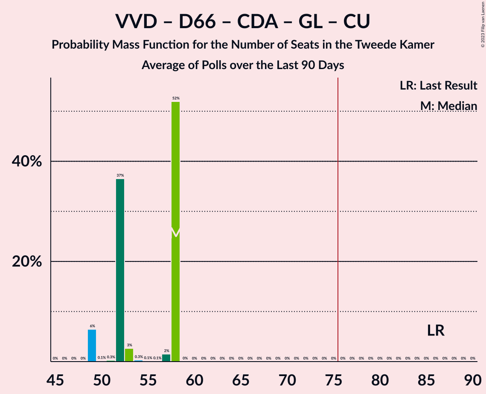

# Poll Average

<a href="#voting-intentions">Voting Intentions</a> | <a href="#seats">Seats</a> | <a href="#coalitions">Coalitions</a> | <a href="#technical-information">Technical Information</a>

## Summary

The table below lists the polls on which the average is based. They are the most recent polls (less than 90 days old) registered and analyzed so far.

| Period     | Polling firm/Commissioner(s) | VVD | D66 | PVV | CDA | SP | PvdA | GL | FvD | PvdD | CU | Volt | JA21 | SGP | DENK | 50+ | BBB | B1 | CO | Spl | PP | PvdT | BVNL |
|:----------:|:----------------------------:|:--:|:--:|:--:|:--:|:--:|:--:|:--:|:--:|:--:|:--:|:--:|:--:|:--:|:--:|:--:|:--:|:--:|:--:|:--:|:--:|:--:|:--:|
| 17 March 2021 | General Election | 21.9%   34 | 15.0%   24 | 10.8%   17 | 9.5%   15 | 6.0%   9 | 5.7%   9 | 5.2%   8 | 5.0%   8 | 3.8%   6 | 3.4%   5 | 2.4%   3 | 2.4%   3 | 2.1%   3 | 2.0%   3 | 1.0%   1 | 1.0%   1 | 0.8%   1 | 0.4%   0 | 0.3%   0 | 0.2%   0 | 0.0%   0 | 0.0%   0 |
| N/A | Poll Average | 20–27%   31–42 | 12–15%   17–24 | 9–13%   13–19 | 3–8%   5–12 | 4–7%   6–11 | 5–8%   9–14 | 4–7%   5–11 | 2–4%   3–6 | 4–6%   5–11 | 3–5%   4–7 | 2–5%   4–7 | 3–5%   4–7 | 2–3%   2–4 | 1–3%   1–5 | 0–1%   0–1 | 2–5%   3–7 | 0–2%   0–3 | N/A   N/A | N/A   N/A | N/A   N/A | N/A   N/A | 0–2%   0–2 |
| [27–30 August 2021](2021-08-30-Ipsos.html) | Ipsos   EenVandaag | 22–27%   37–42 | 12–16%   21–22 | 9–13%   14 | 5–8%   10–12 | 3–6%   6 | 5–8%   9–10 | 4–7%   7–8 | 2–4%   3 | 4–6%   7 | 3–5%   5–6 | 2–4%   5 | 2–5%   5 | 2–4%   3–4 | 2–4%   4–5 | 0–1%   0–1 | 2–4%   3 | 0–1%   0–1 | N/A   N/A | N/A   N/A | N/A   N/A | N/A   N/A | N/A   N/A |
| [20–21 August 2021](2021-08-21-Peilnl.html) | Peil.nl | 22–25%   35–41 | 11–14%   16–21 | 10–12%   16–19 | 3–5%   5–8 | 5–7%   7–11 | 6–8%   10–12 | 4–5%   5–8 | 3–4%   4–6 | 5–6%   5–11 | 3–5%   5–8 | 3–5%   5–7 | 3–4%   4–7 | 2–3%   1–4 | 2–3%   2–3 | 0%   0 | 4–5%   6–8 | 0–1%   0–1 | N/A   N/A | N/A   N/A | N/A   N/A | N/A   N/A | 0–1%   0–1 |
| [9–12 July 2021](2021-07-12-IOResearch.html) | I&O Research | 20–23%   31–36 | 12–15%   19–24 | 9–12%   13–17 | 3–5%   5–7 | 5–7%   7–11 | 6–8%   10–14 | 5–7%   7–11 | 2–4%   3–5 | 4–6%   5–8 | 3–4%   4–7 | 3–5%   4–7 | 3–5%   4–8 | 2–3%   3–4 | 1–2%   1–3 | 0–1%   0 | 3–4%   4–7 | 1–3%   2–4 | N/A   N/A | N/A   N/A | N/A   N/A | N/A   N/A | 1–2%   1–2 |
| 17 March 2021 | General Election | 21.9%   34 | 15.0%   24 | 10.8%   17 | 9.5%   15 | 6.0%   9 | 5.7%   9 | 5.2%   8 | 5.0%   8 | 3.8%   6 | 3.4%   5 | 2.4%   3 | 2.4%   3 | 2.1%   3 | 2.0%   3 | 1.0%   1 | 1.0%   1 | 0.8%   1 | 0.4%   0 | 0.3%   0 | 0.2%   0 | 0.0%   0 | 0.0%   0 |

Only polls for which at least the sample size has been published are included in the table above.

**Legend:**
+ **Top half of each row:** Voting intentions (95% confidence interval)
+ **Bottom half of each row:** Seat projections for the Tweede Kamer (95% confidence interval)
+ **VVD:** Volkspartij voor Vrijheid en Democratie
+ **D66:** Democraten 66
+ **PVV:** Partij voor de Vrijheid
+ **CDA:** Christen-Democratisch Appèl
+ **SP:** Socialistische Partij
+ **PvdA:** Partij van de Arbeid
+ **GL:** GroenLinks
+ **FvD:** Forum voor Democratie
+ **PvdD:** Partij voor de Dieren
+ **CU:** ChristenUnie
+ **Volt:** Volt Europa
+ **JA21:** Juiste Antwoord 2021
+ **SGP:** Staatkundig Gereformeerde Partij
+ **DENK:** DENK
+ **50+:** 50Plus
+ **BBB:** BoerBurgerBeweging
+ **B1:** Bij1
+ **CO:** Code Oranje
+ **Spl:** Splinter
+ **PP:** Piratenpartij
+ **PvdT:** Partij voor de Toekomst
+ **BVNL:** Belang van Nederland
+ **N/A (single party):** Party not included the published results
+ **N/A (entire row):** Calculation for this opinion poll not started yet

## Voting Intentions

### Confidence Intervals

| Party | Last Result | Median | 80% Confidence Interval | 90% Confidence Interval | 95% Confidence Interval | 99% Confidence Interval |
|:-----:|:-----------:|:------:|:-----------------------:|:-----------------------:|:-----------------------:|:-----------------------:|
| <a href="#volkspartij-voor-vrijheid-en-democratie">Volkspartij voor Vrijheid en Democratie</a> | 21.9% | 23.5% | 21.1–25.5% |20.6–26.1% | 20.3–26.6% | 19.6–27.7% |
| <a href="#democraten-66">Democraten 66</a> | 15.0% | 13.3% | 12.1–14.6% |11.9–15.0% | 11.6–15.3% | 11.1–16.0% |
| <a href="#partij-voor-de-vrijheid">Partij voor de Vrijheid</a> | 10.8% | 10.9% | 9.8–12.0% |9.5–12.3% | 9.3–12.6% | 8.8–13.2% |
| <a href="#christen-democratisch-appèl">Christen-Democratisch Appèl</a> | 9.5% | 4.3% | 3.7–7.0% |3.5–7.4% | 3.4–7.8% | 3.2–8.4% |
| <a href="#socialistische-partij">Socialistische Partij</a> | 6.0% | 5.7% | 4.2–6.5% |3.9–6.7% | 3.7–6.9% | 3.2–7.3% |
| <a href="#partij-van-de-arbeid">Partij van de Arbeid</a> | 5.7% | 7.1% | 6.0–7.9% |5.6–8.1% | 5.4–8.3% | 4.9–8.7% |
| <a href="#groenlinks">GroenLinks</a> | 5.2% | 5.5% | 4.5–6.5% |4.3–6.8% | 4.1–7.1% | 3.9–7.6% |
| <a href="#forum-voor-democratie">Forum voor Democratie</a> | 5.0% | 3.1% | 2.5–3.7% |2.4–3.8% | 2.2–4.0% | 1.9–4.3% |
| <a href="#partij-voor-de-dieren">Partij voor de Dieren</a> | 3.8% | 5.0% | 4.3–5.8% |4.1–6.0% | 3.9–6.2% | 3.6–6.7% |
| <a href="#christenunie">ChristenUnie</a> | 3.4% | 3.8% | 3.2–4.5% |3.0–4.7% | 2.9–4.9% | 2.6–5.4% |
| <a href="#volt-europa">Volt Europa</a> | 2.4% | 3.8% | 2.9–4.4% |2.7–4.6% | 2.5–4.7% | 2.2–5.0% |
| <a href="#juiste-antwoord-2021">Juiste Antwoord 2021</a> | 2.4% | 3.6% | 3.0–4.4% |2.8–4.6% | 2.7–4.8% | 2.4–5.1% |
| <a href="#staatkundig-gereformeerde-partij">Staatkundig Gereformeerde Partij</a> | 2.1% | 2.3% | 1.8–2.9% |1.7–3.1% | 1.6–3.3% | 1.5–3.7% |
| <a href="#denk">DENK</a> | 2.0% | 2.0% | 1.5–2.7% |1.3–3.0% | 1.3–3.2% | 1.1–3.7% |
| <a href="#50plus">50Plus</a> | 1.0% | 0.3% | 0.1–0.5% |0.1–0.6% | 0.1–0.7% | 0.1–0.9% |
| <a href="#boerburgerbeweging">BoerBurgerBeweging</a> | 1.0% | 3.6% | 2.2–4.9% |2.0–5.1% | 1.8–5.3% | 1.5–5.6% |
| <a href="#bij1">Bij1</a> | 0.8% | 0.9% | 0.5–2.2% |0.5–2.4% | 0.4–2.5% | 0.3–2.8% |
| <a href="#code-oranje">Code Oranje</a> | 0.4% | N/A | N/A |N/A | N/A | N/A |
| <a href="#splinter">Splinter</a> | 0.3% | N/A | N/A |N/A | N/A | N/A |
| <a href="#piratenpartij">Piratenpartij</a> | 0.2% | N/A | N/A |N/A | N/A | N/A |
| <a href="#partij-voor-de-toekomst">Partij voor de Toekomst</a> | 0.0% | N/A | N/A |N/A | N/A | N/A |
| <a href="#belang-van-nederland">Belang van Nederland</a> | 0.0% | 0.9% | 0.6–1.5% |0.5–1.6% | 0.5–1.7% | 0.4–1.9% |

### Volkspartij voor Vrijheid en Democratie

*For a full overview of the results for this party, see the [Volkspartij voor Vrijheid en Democratie](party-volkspartijvoorvrijheidendemocratie.html) page.*

| Voting Intentions | Probability | Accumulated | Special Marks |
|:-----------------:|:-----------:|:-----------:|:-------------:|
| 17.5–18.5% | 0% | 100% |  |
| 18.5–19.5% | 0.4% | 100% |  |
| 19.5–20.5% | 4% | 99.6% |  |
| 20.5–21.5% | 13% | 96% |  |
| 21.5–22.5% | 15% | 83% | Last Result |
| 22.5–23.5% | 18% | 68% |  |
| 23.5–24.5% | 25% | 50% | Median |
| 24.5–25.5% | 16% | 25% |  |
| 25.5–26.5% | 6% | 9% |  |
| 26.5–27.5% | 2% | 3% |  |
| 27.5–28.5% | 0.5% | 0.6% |  |
| 28.5–29.5% | 0.1% | 0.1% |  |
| 29.5–30.5% | 0% | 0% |  |

### Democraten 66

*For a full overview of the results for this party, see the [Democraten 66](party-democraten66.html) page.*

| Voting Intentions | Probability | Accumulated | Special Marks |
|:-----------------:|:-----------:|:-----------:|:-------------:|
| 9.5–10.5% | 0.1% | 100% |  |
| 10.5–11.5% | 2% | 99.9% |  |
| 11.5–12.5% | 20% | 98% |  |
| 12.5–13.5% | 39% | 78% | Median |
| 13.5–14.5% | 28% | 39% |  |
| 14.5–15.5% | 9% | 11% | Last Result |
| 15.5–16.5% | 1.4% | 2% |  |
| 16.5–17.5% | 0.1% | 0.1% |  |
| 17.5–18.5% | 0% | 0% |  |

### Partij voor de Vrijheid

*For a full overview of the results for this party, see the [Partij voor de Vrijheid](party-partijvoordevrijheid.html) page.*

| Voting Intentions | Probability | Accumulated | Special Marks |
|:-----------------:|:-----------:|:-----------:|:-------------:|
| 6.5–7.5% | 0% | 100% |  |
| 7.5–8.5% | 0.2% | 100% |  |
| 8.5–9.5% | 5% | 99.8% |  |
| 9.5–10.5% | 28% | 95% |  |
| 10.5–11.5% | 45% | 67% | Last Result, Median |
| 11.5–12.5% | 20% | 22% |  |
| 12.5–13.5% | 3% | 3% |  |
| 13.5–14.5% | 0.2% | 0.2% |  |
| 14.5–15.5% | 0% | 0% |  |

### Christen-Democratisch Appèl

*For a full overview of the results for this party, see the [Christen-Democratisch Appèl](party-christen-democratischappèl.html) page.*

| Voting Intentions | Probability | Accumulated | Special Marks |
|:-----------------:|:-----------:|:-----------:|:-------------:|
| 1.5–2.5% | 0% | 100% |  |
| 2.5–3.5% | 6% | 100% |  |
| 3.5–4.5% | 53% | 94% | Median |
| 4.5–5.5% | 10% | 41% |  |
| 5.5–6.5% | 13% | 31% |  |
| 6.5–7.5% | 13% | 18% |  |
| 7.5–8.5% | 4% | 4% |  |
| 8.5–9.5% | 0.3% | 0.4% |  |
| 9.5–10.5% | 0% | 0% | Last Result |

### Socialistische Partij

*For a full overview of the results for this party, see the [Socialistische Partij](party-socialistischepartij.html) page.*

| Voting Intentions | Probability | Accumulated | Special Marks |
|:-----------------:|:-----------:|:-----------:|:-------------:|
| 1.5–2.5% | 0% | 100% |  |
| 2.5–3.5% | 2% | 100% |  |
| 3.5–4.5% | 16% | 98% |  |
| 4.5–5.5% | 24% | 83% |  |
| 5.5–6.5% | 50% | 59% | Last Result, Median |
| 6.5–7.5% | 9% | 9% |  |
| 7.5–8.5% | 0.1% | 0.1% |  |
| 8.5–9.5% | 0% | 0% |  |

### Partij van de Arbeid

*For a full overview of the results for this party, see the [Partij van de Arbeid](party-partijvandearbeid.html) page.*

| Voting Intentions | Probability | Accumulated | Special Marks |
|:-----------------:|:-----------:|:-----------:|:-------------:|
| 2.5–3.5% | 0% | 100% |  |
| 3.5–4.5% | 0.1% | 100% |  |
| 4.5–5.5% | 4% | 99.9% |  |
| 5.5–6.5% | 20% | 96% | Last Result |
| 6.5–7.5% | 53% | 75% | Median |
| 7.5–8.5% | 22% | 23% |  |
| 8.5–9.5% | 0.8% | 0.8% |  |
| 9.5–10.5% | 0% | 0% |  |

### GroenLinks

*For a full overview of the results for this party, see the [GroenLinks](party-groenlinks.html) page.*

| Voting Intentions | Probability | Accumulated | Special Marks |
|:-----------------:|:-----------:|:-----------:|:-------------:|
| 2.5–3.5% | 0% | 100% |  |
| 3.5–4.5% | 13% | 100% |  |
| 4.5–5.5% | 38% | 87% | Last Result |
| 5.5–6.5% | 39% | 48% | Median |
| 6.5–7.5% | 9% | 10% |  |
| 7.5–8.5% | 0.6% | 0.6% |  |
| 8.5–9.5% | 0% | 0% |  |

### Forum voor Democratie

*For a full overview of the results for this party, see the [Forum voor Democratie](party-forumvoordemocratie.html) page.*

| Voting Intentions | Probability | Accumulated | Special Marks |
|:-----------------:|:-----------:|:-----------:|:-------------:|
| 0.5–1.5% | 0% | 100% |  |
| 1.5–2.5% | 10% | 100% |  |
| 2.5–3.5% | 73% | 90% | Median |
| 3.5–4.5% | 17% | 17% |  |
| 4.5–5.5% | 0.2% | 0.2% | Last Result |
| 5.5–6.5% | 0% | 0% |  |

### Partij voor de Dieren

*For a full overview of the results for this party, see the [Partij voor de Dieren](party-partijvoordedieren.html) page.*

| Voting Intentions | Probability | Accumulated | Special Marks |
|:-----------------:|:-----------:|:-----------:|:-------------:|
| 1.5–2.5% | 0% | 100% |  |
| 2.5–3.5% | 0.4% | 100% |  |
| 3.5–4.5% | 20% | 99.6% | Last Result |
| 4.5–5.5% | 60% | 79% | Median |
| 5.5–6.5% | 18% | 19% |  |
| 6.5–7.5% | 0.7% | 0.8% |  |
| 7.5–8.5% | 0% | 0% |  |

### ChristenUnie

*For a full overview of the results for this party, see the [ChristenUnie](party-christenunie.html) page.*

| Voting Intentions | Probability | Accumulated | Special Marks |
|:-----------------:|:-----------:|:-----------:|:-------------:|
| 0.5–1.5% | 0% | 100% |  |
| 1.5–2.5% | 0.2% | 100% |  |
| 2.5–3.5% | 28% | 99.8% | Last Result |
| 3.5–4.5% | 63% | 72% | Median |
| 4.5–5.5% | 8% | 8% |  |
| 5.5–6.5% | 0.3% | 0.3% |  |
| 6.5–7.5% | 0% | 0% |  |

### Volt Europa

*For a full overview of the results for this party, see the [Volt Europa](party-volteuropa.html) page.*

| Voting Intentions | Probability | Accumulated | Special Marks |
|:-----------------:|:-----------:|:-----------:|:-------------:|
| 0.5–1.5% | 0% | 100% |  |
| 1.5–2.5% | 3% | 100% | Last Result |
| 2.5–3.5% | 29% | 97% |  |
| 3.5–4.5% | 62% | 68% | Median |
| 4.5–5.5% | 6% | 6% |  |
| 5.5–6.5% | 0% | 0% |  |

### Juiste Antwoord 2021

*For a full overview of the results for this party, see the [Juiste Antwoord 2021](party-juisteantwoord2021.html) page.*

| Voting Intentions | Probability | Accumulated | Special Marks |
|:-----------------:|:-----------:|:-----------:|:-------------:|
| 0.5–1.5% | 0% | 100% |  |
| 1.5–2.5% | 1.1% | 100% | Last Result |
| 2.5–3.5% | 44% | 98.9% |  |
| 3.5–4.5% | 49% | 55% | Median |
| 4.5–5.5% | 5% | 6% |  |
| 5.5–6.5% | 0.1% | 0.1% |  |
| 6.5–7.5% | 0% | 0% |  |

### Staatkundig Gereformeerde Partij

*For a full overview of the results for this party, see the [Staatkundig Gereformeerde Partij](party-staatkundiggereformeerdepartij.html) page.*

| Voting Intentions | Probability | Accumulated | Special Marks |
|:-----------------:|:-----------:|:-----------:|:-------------:|
| 0.0–0.5% | 0% | 100% |  |
| 0.5–1.5% | 1.4% | 100% |  |
| 1.5–2.5% | 72% | 98.6% | Last Result, Median |
| 2.5–3.5% | 26% | 27% |  |
| 3.5–4.5% | 0.8% | 0.8% |  |
| 4.5–5.5% | 0% | 0% |  |

### DENK

*For a full overview of the results for this party, see the [DENK](party-denk.html) page.*

| Voting Intentions | Probability | Accumulated | Special Marks |
|:-----------------:|:-----------:|:-----------:|:-------------:|
| 0.0–0.5% | 0% | 100% |  |
| 0.5–1.5% | 15% | 100% |  |
| 1.5–2.5% | 71% | 85% | Last Result, Median |
| 2.5–3.5% | 14% | 15% |  |
| 3.5–4.5% | 0.7% | 0.7% |  |
| 4.5–5.5% | 0% | 0% |  |

### 50Plus

*For a full overview of the results for this party, see the [50Plus](party-50plus.html) page.*

| Voting Intentions | Probability | Accumulated | Special Marks |
|:-----------------:|:-----------:|:-----------:|:-------------:|
| 0.0–0.5% | 92% | 100% | Median |
| 0.5–1.5% | 8% | 8% | Last Result |
| 1.5–2.5% | 0% | 0% |  |

### BoerBurgerBeweging

*For a full overview of the results for this party, see the [BoerBurgerBeweging](party-boerburgerbeweging.html) page.*

| Voting Intentions | Probability | Accumulated | Special Marks |
|:-----------------:|:-----------:|:-----------:|:-------------:|
| 0.0–0.5% | 0% | 100% |  |
| 0.5–1.5% | 0.6% | 100% | Last Result |
| 1.5–2.5% | 19% | 99.4% |  |
| 2.5–3.5% | 30% | 81% |  |
| 3.5–4.5% | 29% | 51% | Median |
| 4.5–5.5% | 21% | 21% |  |
| 5.5–6.5% | 0.6% | 0.6% |  |
| 6.5–7.5% | 0% | 0% |  |

### Bij1

*For a full overview of the results for this party, see the [Bij1](party-bij1.html) page.*

| Voting Intentions | Probability | Accumulated | Special Marks |
|:-----------------:|:-----------:|:-----------:|:-------------:|
| 0.0–0.5% | 12% | 100% |  |
| 0.5–1.5% | 56% | 88% | Last Result, Median |
| 1.5–2.5% | 30% | 32% |  |
| 2.5–3.5% | 2% | 2% |  |
| 3.5–4.5% | 0% | 0% |  |

### Belang van Nederland

*For a full overview of the results for this party, see the [Belang van Nederland](party-belangvannederland.html) page.*

| Voting Intentions | Probability | Accumulated | Special Marks |
|:-----------------:|:-----------:|:-----------:|:-------------:|
| 0.0–0.5% | 8% | 100% | Last Result |
| 0.5–1.5% | 86% | 92% | Median |
| 1.5–2.5% | 6% | 6% |  |
| 2.5–3.5% | 0% | 0% |  |

## Seats

### Confidence Intervals

| Party | Last Result | Median | 80% Confidence Interval | 90% Confidence Interval | 95% Confidence Interval | 99% Confidence Interval |
|:-----:|:-----------:|:------:|:-----------------------:|:-----------------------:|:-----------------------:|:-----------------------:|
| <a href="#volkspartij-voor-vrijheid-en-democratie">Volkspartij voor Vrijheid en Democratie</a> | 34 | 40 | 32–42 |32–42 | 31–42 | 30–42 |
| <a href="#democraten-66">Democraten 66</a> | 24 | 21 | 18–23 |17–24 | 17–24 | 16–24 |
| <a href="#partij-voor-de-vrijheid">Partij voor de Vrijheid</a> | 17 | 15 | 14–17 |13–17 | 13–19 | 13–20 |
| <a href="#christen-democratisch-appèl">Christen-Democratisch Appèl</a> | 15 | 7 | 5–12 |5–12 | 5–12 | 4–12 |
| <a href="#socialistische-partij">Socialistische Partij</a> | 9 | 8 | 6–11 |6–11 | 6–11 | 6–11 |
| <a href="#partij-van-de-arbeid">Partij van de Arbeid</a> | 9 | 11 | 9–13 |9–14 | 9–14 | 9–14 |
| <a href="#groenlinks">GroenLinks</a> | 8 | 7 | 5–10 |5–11 | 5–11 | 5–11 |
| <a href="#forum-voor-democratie">Forum voor Democratie</a> | 8 | 4 | 3–5 |3–6 | 3–6 | 3–6 |
| <a href="#partij-voor-de-dieren">Partij voor de Dieren</a> | 6 | 7 | 6–9 |6–11 | 5–11 | 5–11 |
| <a href="#christenunie">ChristenUnie</a> | 5 | 5 | 4–7 |4–7 | 4–7 | 4–8 |
| <a href="#volt-europa">Volt Europa</a> | 3 | 5 | 5–6 |5–6 | 4–7 | 3–8 |
| <a href="#juiste-antwoord-2021">Juiste Antwoord 2021</a> | 3 | 5 | 4–6 |4–6 | 4–7 | 3–8 |
| <a href="#staatkundig-gereformeerde-partij">Staatkundig Gereformeerde Partij</a> | 3 | 3 | 3 |3–4 | 2–4 | 1–5 |
| <a href="#denk">DENK</a> | 3 | 3 | 2–5 |1–5 | 1–5 | 1–5 |
| <a href="#50plus">50Plus</a> | 1 | 0 | 0–1 |0–1 | 0–1 | 0–1 |
| <a href="#boerburgerbeweging">BoerBurgerBeweging</a> | 1 | 6 | 3–7 |3–7 | 3–7 | 3–8 |
| <a href="#bij1">Bij1</a> | 1 | 0 | 0–3 |0–3 | 0–3 | 0–4 |
| <a href="#code-oranje">Code Oranje</a> | 0 | N/A | N/A |N/A | N/A | N/A |
| <a href="#splinter">Splinter</a> | 0 | N/A | N/A |N/A | N/A | N/A |
| <a href="#piratenpartij">Piratenpartij</a> | 0 | N/A | N/A |N/A | N/A | N/A |
| <a href="#partij-voor-de-toekomst">Partij voor de Toekomst</a> | 0 | N/A | N/A |N/A | N/A | N/A |
| <a href="#belang-van-nederland">Belang van Nederland</a> | 0 | 1 | 1–2 |0–2 | 0–2 | 0–2 |

### Volkspartij voor Vrijheid en Democratie

*For a full overview of the results for this party, see the [Volkspartij voor Vrijheid en Democratie](party-volkspartijvoorvrijheidendemocratie.html) page.*

| Number of Seats | Probability | Accumulated | Special Marks |
|:---------------:|:-----------:|:-----------:|:-------------:|
| 29 | 0% | 100% |  |
| 30 | 0.5% | 99.9% |  |
| 31 | 4% | 99.4% |  |
| 32 | 9% | 96% |  |
| 33 | 6% | 87% |  |
| 34 | 0.5% | 81% | Last Result |
| 35 | 5% | 81% |  |
| 36 | 18% | 75% |  |
| 37 | 1.3% | 57% |  |
| 38 | 3% | 56% |  |
| 39 | 2% | 53% |  |
| 40 | 2% | 51% | Median |
| 41 | 18% | 49% |  |
| 42 | 32% | 32% |  |
| 43 | 0% | 0% |  |

### Democraten 66

*For a full overview of the results for this party, see the [Democraten 66](party-democraten66.html) page.*

| Number of Seats | Probability | Accumulated | Special Marks |
|:---------------:|:-----------:|:-----------:|:-------------:|
| 16 | 1.1% | 100% |  |
| 17 | 9% | 98.9% |  |
| 18 | 19% | 90% |  |
| 19 | 5% | 71% |  |
| 20 | 16% | 66% |  |
| 21 | 3% | 50% | Median |
| 22 | 33% | 48% |  |
| 23 | 9% | 15% |  |
| 24 | 5% | 5% | Last Result |
| 25 | 0% | 0.1% |  |
| 26 | 0.1% | 0.1% |  |
| 27 | 0% | 0% |  |

### Partij voor de Vrijheid

*For a full overview of the results for this party, see the [Partij voor de Vrijheid](party-partijvoordevrijheid.html) page.*

| Number of Seats | Probability | Accumulated | Special Marks |
|:---------------:|:-----------:|:-----------:|:-------------:|
| 13 | 9% | 100% |  |
| 14 | 33% | 91% |  |
| 15 | 15% | 57% | Median |
| 16 | 24% | 43% |  |
| 17 | 14% | 19% | Last Result |
| 18 | 2% | 5% |  |
| 19 | 2% | 3% |  |
| 20 | 0.5% | 0.6% |  |
| 21 | 0% | 0% |  |

### Christen-Democratisch Appèl

*For a full overview of the results for this party, see the [Christen-Democratisch Appèl](party-christen-democratischappèl.html) page.*

| Number of Seats | Probability | Accumulated | Special Marks |
|:---------------:|:-----------:|:-----------:|:-------------:|
| 4 | 1.0% | 100% |  |
| 5 | 22% | 99.0% |  |
| 6 | 17% | 77% |  |
| 7 | 24% | 59% | Median |
| 8 | 2% | 35% |  |
| 9 | 0.6% | 33% |  |
| 10 | 0.5% | 33% |  |
| 11 | 0% | 32% |  |
| 12 | 32% | 32% |  |
| 13 | 0.1% | 0.4% |  |
| 14 | 0% | 0.3% |  |
| 15 | 0.3% | 0.3% | Last Result |
| 16 | 0% | 0% |  |

### Socialistische Partij

*For a full overview of the results for this party, see the [Socialistische Partij](party-socialistischepartij.html) page.*

| Number of Seats | Probability | Accumulated | Special Marks |
|:---------------:|:-----------:|:-----------:|:-------------:|
| 5 | 0.2% | 100% |  |
| 6 | 33% | 99.8% |  |
| 7 | 5% | 67% |  |
| 8 | 14% | 62% | Median |
| 9 | 17% | 48% | Last Result |
| 10 | 12% | 31% |  |
| 11 | 18% | 18% |  |
| 12 | 0% | 0% |  |

### Partij van de Arbeid

*For a full overview of the results for this party, see the [Partij van de Arbeid](party-partijvandearbeid.html) page.*

| Number of Seats | Probability | Accumulated | Special Marks |
|:---------------:|:-----------:|:-----------:|:-------------:|
| 7 | 0.2% | 100% |  |
| 8 | 0.1% | 99.8% |  |
| 9 | 33% | 99.7% | Last Result |
| 10 | 13% | 67% |  |
| 11 | 15% | 53% | Median |
| 12 | 29% | 39% |  |
| 13 | 1.3% | 10% |  |
| 14 | 9% | 9% |  |
| 15 | 0% | 0% |  |

### GroenLinks

*For a full overview of the results for this party, see the [GroenLinks](party-groenlinks.html) page.*

| Number of Seats | Probability | Accumulated | Special Marks |
|:---------------:|:-----------:|:-----------:|:-------------:|
| 5 | 18% | 100% |  |
| 6 | 0.8% | 82% |  |
| 7 | 39% | 81% | Median |
| 8 | 15% | 42% | Last Result |
| 9 | 12% | 27% |  |
| 10 | 6% | 14% |  |
| 11 | 8% | 9% |  |
| 12 | 0.1% | 0.1% |  |
| 13 | 0% | 0% |  |

### Forum voor Democratie

*For a full overview of the results for this party, see the [Forum voor Democratie](party-forumvoordemocratie.html) page.*

| Number of Seats | Probability | Accumulated | Special Marks |
|:---------------:|:-----------:|:-----------:|:-------------:|
| 2 | 0.1% | 100% |  |
| 3 | 42% | 99.9% |  |
| 4 | 38% | 57% | Median |
| 5 | 10% | 20% |  |
| 6 | 10% | 10% |  |
| 7 | 0.1% | 0.1% |  |
| 8 | 0.1% | 0.1% | Last Result |
| 9 | 0% | 0% |  |

### Partij voor de Dieren

*For a full overview of the results for this party, see the [Partij voor de Dieren](party-partijvoordedieren.html) page.*

| Number of Seats | Probability | Accumulated | Special Marks |
|:---------------:|:-----------:|:-----------:|:-------------:|
| 5 | 4% | 100% |  |
| 6 | 8% | 96% | Last Result |
| 7 | 51% | 88% | Median |
| 8 | 10% | 37% |  |
| 9 | 17% | 26% |  |
| 10 | 1.3% | 9% |  |
| 11 | 8% | 8% |  |
| 12 | 0% | 0% |  |

### ChristenUnie

*For a full overview of the results for this party, see the [ChristenUnie](party-christenunie.html) page.*

| Number of Seats | Probability | Accumulated | Special Marks |
|:---------------:|:-----------:|:-----------:|:-------------:|
| 3 | 0.1% | 100% |  |
| 4 | 12% | 99.9% |  |
| 5 | 50% | 88% | Last Result, Median |
| 6 | 17% | 38% |  |
| 7 | 18% | 20% |  |
| 8 | 2% | 2% |  |
| 9 | 0% | 0% |  |

### Volt Europa

*For a full overview of the results for this party, see the [Volt Europa](party-volteuropa.html) page.*

| Number of Seats | Probability | Accumulated | Special Marks |
|:---------------:|:-----------:|:-----------:|:-------------:|
| 3 | 0.6% | 100% | Last Result |
| 4 | 4% | 99.4% |  |
| 5 | 61% | 96% | Median |
| 6 | 32% | 35% |  |
| 7 | 2% | 3% |  |
| 8 | 0.4% | 0.6% |  |
| 9 | 0.2% | 0.2% |  |
| 10 | 0% | 0% |  |

### Juiste Antwoord 2021

*For a full overview of the results for this party, see the [Juiste Antwoord 2021](party-juisteantwoord2021.html) page.*

| Number of Seats | Probability | Accumulated | Special Marks |
|:---------------:|:-----------:|:-----------:|:-------------:|
| 3 | 1.0% | 100% | Last Result |
| 4 | 20% | 99.0% |  |
| 5 | 53% | 79% | Median |
| 6 | 23% | 26% |  |
| 7 | 2% | 3% |  |
| 8 | 1.1% | 1.1% |  |
| 9 | 0% | 0% |  |

### Staatkundig Gereformeerde Partij

*For a full overview of the results for this party, see the [Staatkundig Gereformeerde Partij](party-staatkundiggereformeerdepartij.html) page.*

| Number of Seats | Probability | Accumulated | Special Marks |
|:---------------:|:-----------:|:-----------:|:-------------:|
| 1 | 1.1% | 100% |  |
| 2 | 3% | 98.9% |  |
| 3 | 86% | 96% | Last Result, Median |
| 4 | 8% | 9% |  |
| 5 | 0.9% | 0.9% |  |
| 6 | 0% | 0% |  |

### DENK

*For a full overview of the results for this party, see the [DENK](party-denk.html) page.*

| Number of Seats | Probability | Accumulated | Special Marks |
|:---------------:|:-----------:|:-----------:|:-------------:|
| 1 | 5% | 100% |  |
| 2 | 41% | 95% |  |
| 3 | 20% | 53% | Last Result, Median |
| 4 | 1.0% | 33% |  |
| 5 | 32% | 32% |  |
| 6 | 0% | 0.1% |  |
| 7 | 0% | 0% |  |

### 50Plus

*For a full overview of the results for this party, see the [50Plus](party-50plus.html) page.*

| Number of Seats | Probability | Accumulated | Special Marks |
|:---------------:|:-----------:|:-----------:|:-------------:|
| 0 | 67% | 100% | Median |
| 1 | 32% | 33% | Last Result |
| 2 | 0.2% | 0.2% |  |
| 3 | 0% | 0% |  |

### BoerBurgerBeweging

*For a full overview of the results for this party, see the [BoerBurgerBeweging](party-boerburgerbeweging.html) page.*

| Number of Seats | Probability | Accumulated | Special Marks |
|:---------------:|:-----------:|:-----------:|:-------------:|
| 1 | 0% | 100% | Last Result |
| 2 | 0% | 100% |  |
| 3 | 32% | 99.9% |  |
| 4 | 1.2% | 67% |  |
| 5 | 8% | 66% |  |
| 6 | 41% | 58% | Median |
| 7 | 15% | 17% |  |
| 8 | 2% | 2% |  |
| 9 | 0% | 0% |  |

### Bij1

*For a full overview of the results for this party, see the [Bij1](party-bij1.html) page.*

| Number of Seats | Probability | Accumulated | Special Marks |
|:---------------:|:-----------:|:-----------:|:-------------:|
| 0 | 54% | 100% | Median |
| 1 | 12% | 46% | Last Result |
| 2 | 11% | 34% |  |
| 3 | 20% | 22% |  |
| 4 | 2% | 2% |  |
| 5 | 0% | 0% |  |

### Code Oranje

*For a full overview of the results for this party, see the [Code Oranje](party-codeoranje.html) page.*

### Splinter

*For a full overview of the results for this party, see the [Splinter](party-splinter.html) page.*

### Piratenpartij

*For a full overview of the results for this party, see the [Piratenpartij](party-piratenpartij.html) page.*

### Partij voor de Toekomst

*For a full overview of the results for this party, see the [Partij voor de Toekomst](party-partijvoordetoekomst.html) page.*

### Belang van Nederland

*For a full overview of the results for this party, see the [Belang van Nederland](party-belangvannederland.html) page.*

| Number of Seats | Probability | Accumulated | Special Marks |
|:---------------:|:-----------:|:-----------:|:-------------:|
| 0 | 8% | 100% | Last Result |
| 1 | 70% | 92% | Median |
| 2 | 22% | 22% |  |
| 3 | 0.3% | 0.3% |  |
| 4 | 0% | 0% |  |

## Coalitions

### Confidence Intervals

| Coalition | Last Result | Median | Majority? | 80% Confidence Interval | 90% Confidence Interval | 95% Confidence Interval | 99% Confidence Interval |
|:---------:|:-----------:|:------:|:---------:|:-----------------------:|:-----------------------:|:-----------------------:|:-----------------------:|
| Volkspartij voor Vrijheid en Democratie – Democraten 66 – Christen-Democratisch Appèl – Partij van de Arbeid – ChristenUnie | 87 | 83 | 88% | 75–90 | 75–90 | 74–90 | 74–90 |
| Volkspartij voor Vrijheid en Democratie – Democraten 66 – Christen-Democratisch Appèl – GroenLinks – ChristenUnie | 86 | 76 | 78% | 73–88 | 72–88 | 72–88 | 72–88 |
| Volkspartij voor Vrijheid en Democratie – Democraten 66 – Christen-Democratisch Appèl – ChristenUnie | 78 | 71 | 32% | 65–81 | 65–81 | 62–81 | 62–81 |
| Volkspartij voor Vrijheid en Democratie – Democraten 66 – Christen-Democratisch Appèl | 73 | 64 | 32% | 60–76 | 59–76 | 56–76 | 56–76 |
| Volkspartij voor Vrijheid en Democratie – Partij voor de Vrijheid – Christen-Democratisch Appèl – Forum voor Democratie – Staatkundig Gereformeerde Partij | 77 | 69 | 0% | 60–74 | 60–74 | 59–74 | 59–74 |
| Volkspartij voor Vrijheid en Democratie – Democraten 66 – Partij van de Arbeid | 67 | 70 | 0% | 63–73 | 63–73 | 63–73 | 63–73 |
| Volkspartij voor Vrijheid en Democratie – Partij voor de Vrijheid – Christen-Democratisch Appèl – Forum voor Democratie | 74 | 66 | 0% | 57–71 | 57–71 | 56–71 | 56–71 |
| Volkspartij voor Vrijheid en Democratie – Partij voor de Vrijheid – Christen-Democratisch Appèl | 66 | 62 | 0% | 53–68 | 53–68 | 51–68 | 51–68 |
| Democraten 66 – Christen-Democratisch Appèl – Socialistische Partij – Partij van de Arbeid – GroenLinks – ChristenUnie | 70 | 61 | 0% | 56–64 | 56–67 | 56–67 | 54–67 |
| Volkspartij voor Vrijheid en Democratie – Christen-Democratisch Appèl – Partij van de Arbeid | 58 | 58 | 0% | 49–63 | 49–63 | 48–63 | 48–63 |
| Volkspartij voor Vrijheid en Democratie – Christen-Democratisch Appèl – Forum voor Democratie – Staatkundig Gereformeerde Partij – 50Plus | 61 | 53 | 0% | 45–61 | 45–61 | 44–61 | 44–61 |
| Volkspartij voor Vrijheid en Democratie – Christen-Democratisch Appèl – Forum voor Democratie – Staatkundig Gereformeerde Partij | 60 | 53 | 0% | 45–60 | 45–60 | 44–60 | 44–60 |
| Volkspartij voor Vrijheid en Democratie – Christen-Democratisch Appèl – Forum voor Democratie – 50Plus | 58 | 50 | 0% | 42–58 | 42–58 | 41–58 | 41–58 |
| Democraten 66 – Christen-Democratisch Appèl – Partij van de Arbeid – GroenLinks – ChristenUnie | 61 | 54 | 0% | 47–55 | 47–57 | 47–57 | 45–58 |
| Volkspartij voor Vrijheid en Democratie – Christen-Democratisch Appèl – Forum voor Democratie | 57 | 50 | 0% | 42–57 | 42–57 | 41–57 | 41–57 |
| Volkspartij voor Vrijheid en Democratie – Christen-Democratisch Appèl | 49 | 46 | 0% | 38–54 | 38–54 | 36–54 | 36–54 |
| Volkspartij voor Vrijheid en Democratie – Partij van de Arbeid | 43 | 51 | 0% | 43–53 | 43–53 | 43–53 | 42–53 |
| Democraten 66 – Christen-Democratisch Appèl – Partij van de Arbeid | 48 | 40 | 0% | 35–43 | 34–43 | 34–43 | 33–43 |
| Democraten 66 – Christen-Democratisch Appèl | 39 | 27 | 0% | 23–34 | 23–34 | 23–34 | 23–34 |
| Christen-Democratisch Appèl – Partij van de Arbeid – ChristenUnie | 29 | 24 | 0% | 22–26 | 22–26 | 21–26 | 20–27 |
| Christen-Democratisch Appèl – Partij van de Arbeid | 24 | 18 | 0% | 17–21 | 16–21 | 16–21 | 14–23 |

### Volkspartij voor Vrijheid en Democratie – Democraten 66 – Christen-Democratisch Appèl – Partij van de Arbeid – ChristenUnie

| Number of Seats | Probability | Accumulated | Special Marks |
|:---------------:|:-----------:|:-----------:|:-------------:|
| 72 | 0.1% | 100% |  |
| 73 | 0.2% | 99.8% |  |
| 74 | 4% | 99.6% |  |
| 75 | 8% | 96% |  |
| 76 | 0.2% | 88% | Majority |
| 77 | 4% | 88% |  |
| 78 | 10% | 83% |  |
| 79 | 4% | 73% |  |
| 80 | 6% | 69% |  |
| 81 | 10% | 63% |  |
| 82 | 3% | 53% |  |
| 83 | 17% | 50% |  |
| 84 | 0.1% | 33% | Median |
| 85 | 0.5% | 33% |  |
| 86 | 0% | 32% |  |
| 87 | 0% | 32% | Last Result |
| 88 | 0% | 32% |  |
| 89 | 0% | 32% |  |
| 90 | 32% | 32% |  |
| 91 | 0% | 0% |  |

### Volkspartij voor Vrijheid en Democratie – Democraten 66 – Christen-Democratisch Appèl – GroenLinks – ChristenUnie

| Number of Seats | Probability | Accumulated | Special Marks |
|:---------------:|:-----------:|:-----------:|:-------------:|
| 70 | 0.3% | 100% |  |
| 71 | 0.1% | 99.7% |  |
| 72 | 5% | 99.6% |  |
| 73 | 9% | 95% |  |
| 74 | 1.4% | 86% |  |
| 75 | 7% | 85% |  |
| 76 | 30% | 78% | Majority |
| 77 | 3% | 48% |  |
| 78 | 10% | 45% |  |
| 79 | 3% | 36% |  |
| 80 | 0.2% | 33% | Median |
| 81 | 0.2% | 33% |  |
| 82 | 0% | 33% |  |
| 83 | 0% | 33% |  |
| 84 | 0.4% | 33% |  |
| 85 | 0% | 32% |  |
| 86 | 0% | 32% | Last Result |
| 87 | 0.4% | 32% |  |
| 88 | 32% | 32% |  |
| 89 | 0% | 0% |  |

### Volkspartij voor Vrijheid en Democratie – Democraten 66 – Christen-Democratisch Appèl – ChristenUnie

| Number of Seats | Probability | Accumulated | Special Marks |
|:---------------:|:-----------:|:-----------:|:-------------:|
| 60 | 0.1% | 100% |  |
| 61 | 0.1% | 99.9% |  |
| 62 | 3% | 99.9% |  |
| 63 | 0.3% | 96% |  |
| 64 | 0.6% | 96% |  |
| 65 | 8% | 96% |  |
| 66 | 2% | 87% |  |
| 67 | 22% | 85% |  |
| 68 | 6% | 63% |  |
| 69 | 3% | 57% |  |
| 70 | 0.9% | 54% |  |
| 71 | 18% | 53% |  |
| 72 | 2% | 35% |  |
| 73 | 0% | 33% | Median |
| 74 | 0.3% | 33% |  |
| 75 | 0% | 32% |  |
| 76 | 0.3% | 32% | Majority |
| 77 | 0% | 32% |  |
| 78 | 0% | 32% | Last Result |
| 79 | 0.3% | 32% |  |
| 80 | 0% | 32% |  |
| 81 | 32% | 32% |  |
| 82 | 0% | 0% |  |

### Volkspartij voor Vrijheid en Democratie – Democraten 66 – Christen-Democratisch Appèl

| Number of Seats | Probability | Accumulated | Special Marks |
|:---------------:|:-----------:|:-----------:|:-------------:|
| 56 | 3% | 100% |  |
| 57 | 0.1% | 97% |  |
| 58 | 0.8% | 97% |  |
| 59 | 0.9% | 96% |  |
| 60 | 8% | 95% |  |
| 61 | 12% | 87% |  |
| 62 | 6% | 75% |  |
| 63 | 15% | 69% |  |
| 64 | 17% | 54% |  |
| 65 | 2% | 37% |  |
| 66 | 3% | 35% |  |
| 67 | 0.1% | 33% |  |
| 68 | 0.7% | 33% | Median |
| 69 | 0.1% | 32% |  |
| 70 | 0% | 32% |  |
| 71 | 0% | 32% |  |
| 72 | 0% | 32% |  |
| 73 | 0.3% | 32% | Last Result |
| 74 | 0% | 32% |  |
| 75 | 0% | 32% |  |
| 76 | 32% | 32% | Majority |
| 77 | 0% | 0% |  |

### Volkspartij voor Vrijheid en Democratie – Partij voor de Vrijheid – Christen-Democratisch Appèl – Forum voor Democratie – Staatkundig Gereformeerde Partij

| Number of Seats | Probability | Accumulated | Special Marks |
|:---------------:|:-----------:|:-----------:|:-------------:|
| 59 | 4% | 100% |  |
| 60 | 8% | 96% |  |
| 61 | 0.3% | 88% |  |
| 62 | 14% | 88% |  |
| 63 | 0.8% | 73% |  |
| 64 | 2% | 72% |  |
| 65 | 2% | 71% |  |
| 66 | 2% | 69% |  |
| 67 | 2% | 67% |  |
| 68 | 0.6% | 65% |  |
| 69 | 25% | 64% | Median |
| 70 | 3% | 38% |  |
| 71 | 2% | 36% |  |
| 72 | 0.3% | 34% |  |
| 73 | 0.2% | 34% |  |
| 74 | 33% | 33% |  |
| 75 | 0% | 0.1% |  |
| 76 | 0% | 0% | Majority |
| 77 | 0% | 0% | Last Result |

### Volkspartij voor Vrijheid en Democratie – Democraten 66 – Partij van de Arbeid

| Number of Seats | Probability | Accumulated | Special Marks |
|:---------------:|:-----------:|:-----------:|:-------------:|
| 60 | 0% | 100% |  |
| 61 | 0.1% | 99.9% |  |
| 62 | 0.2% | 99.9% |  |
| 63 | 11% | 99.7% |  |
| 64 | 2% | 89% |  |
| 65 | 1.1% | 86% |  |
| 66 | 14% | 85% |  |
| 67 | 2% | 71% | Last Result |
| 68 | 1.0% | 69% |  |
| 69 | 8% | 68% |  |
| 70 | 10% | 60% |  |
| 71 | 18% | 50% |  |
| 72 | 0% | 32% | Median |
| 73 | 32% | 32% |  |
| 74 | 0% | 0% |  |

### Volkspartij voor Vrijheid en Democratie – Partij voor de Vrijheid – Christen-Democratisch Appèl – Forum voor Democratie

| Number of Seats | Probability | Accumulated | Special Marks |
|:---------------:|:-----------:|:-----------:|:-------------:|
| 55 | 0.1% | 100% |  |
| 56 | 4% | 99.9% |  |
| 57 | 8% | 96% |  |
| 58 | 1.3% | 88% |  |
| 59 | 14% | 87% |  |
| 60 | 0.3% | 73% |  |
| 61 | 2% | 73% |  |
| 62 | 4% | 71% |  |
| 63 | 0.3% | 67% |  |
| 64 | 2% | 67% |  |
| 65 | 3% | 65% |  |
| 66 | 26% | 63% | Median |
| 67 | 0.1% | 37% |  |
| 68 | 2% | 37% |  |
| 69 | 0.4% | 35% |  |
| 70 | 3% | 34% |  |
| 71 | 32% | 32% |  |
| 72 | 0% | 0.1% |  |
| 73 | 0% | 0% |  |
| 74 | 0% | 0% | Last Result |

### Volkspartij voor Vrijheid en Democratie – Partij voor de Vrijheid – Christen-Democratisch Appèl

| Number of Seats | Probability | Accumulated | Special Marks |
|:---------------:|:-----------:|:-----------:|:-------------:|
| 51 | 3% | 100% |  |
| 52 | 0.8% | 97% |  |
| 53 | 9% | 96% |  |
| 54 | 0.4% | 87% |  |
| 55 | 5% | 87% |  |
| 56 | 10% | 82% |  |
| 57 | 2% | 72% |  |
| 58 | 2% | 69% |  |
| 59 | 0.7% | 67% |  |
| 60 | 10% | 66% |  |
| 61 | 1.0% | 56% |  |
| 62 | 18% | 55% | Median |
| 63 | 1.4% | 37% |  |
| 64 | 1.2% | 35% |  |
| 65 | 0.5% | 34% |  |
| 66 | 2% | 34% | Last Result |
| 67 | 0.1% | 32% |  |
| 68 | 32% | 32% |  |
| 69 | 0% | 0% |  |

### Democraten 66 – Christen-Democratisch Appèl – Socialistische Partij – Partij van de Arbeid – GroenLinks – ChristenUnie

| Number of Seats | Probability | Accumulated | Special Marks |
|:---------------:|:-----------:|:-----------:|:-------------:|
| 54 | 0.5% | 100% |  |
| 55 | 1.1% | 99.5% |  |
| 56 | 10% | 98% |  |
| 57 | 2% | 88% |  |
| 58 | 17% | 86% |  |
| 59 | 3% | 69% | Median |
| 60 | 6% | 67% |  |
| 61 | 35% | 61% |  |
| 62 | 10% | 26% |  |
| 63 | 5% | 16% |  |
| 64 | 3% | 11% |  |
| 65 | 0.1% | 9% |  |
| 66 | 0.1% | 9% |  |
| 67 | 9% | 9% |  |
| 68 | 0% | 0% |  |
| 69 | 0% | 0% |  |
| 70 | 0% | 0% | Last Result |

### Volkspartij voor Vrijheid en Democratie – Christen-Democratisch Appèl – Partij van de Arbeid

| Number of Seats | Probability | Accumulated | Special Marks |
|:---------------:|:-----------:|:-----------:|:-------------:|
| 46 | 0.2% | 100% |  |
| 47 | 0.1% | 99.8% |  |
| 48 | 3% | 99.7% |  |
| 49 | 9% | 96% |  |
| 50 | 0.9% | 87% |  |
| 51 | 7% | 86% |  |
| 52 | 1.3% | 79% |  |
| 53 | 10% | 78% |  |
| 54 | 3% | 68% |  |
| 55 | 1.2% | 65% |  |
| 56 | 3% | 64% |  |
| 57 | 11% | 61% |  |
| 58 | 16% | 50% | Last Result, Median |
| 59 | 2% | 34% |  |
| 60 | 0% | 32% |  |
| 61 | 0% | 32% |  |
| 62 | 0% | 32% |  |
| 63 | 32% | 32% |  |
| 64 | 0% | 0% |  |

### Volkspartij voor Vrijheid en Democratie – Christen-Democratisch Appèl – Forum voor Democratie – Staatkundig Gereformeerde Partij – 50Plus

| Number of Seats | Probability | Accumulated | Special Marks |
|:---------------:|:-----------:|:-----------:|:-------------:|
| 43 | 0% | 100% |  |
| 44 | 4% | 99.9% |  |
| 45 | 9% | 96% |  |
| 46 | 5% | 88% |  |
| 47 | 2% | 83% |  |
| 48 | 2% | 81% |  |
| 49 | 10% | 79% |  |
| 50 | 5% | 70% |  |
| 51 | 0.8% | 64% |  |
| 52 | 9% | 64% |  |
| 53 | 19% | 55% |  |
| 54 | 1.3% | 36% | Median |
| 55 | 0.4% | 34% |  |
| 56 | 2% | 34% |  |
| 57 | 0% | 32% |  |
| 58 | 0.3% | 32% |  |
| 59 | 0% | 32% |  |
| 60 | 0.2% | 32% |  |
| 61 | 32% | 32% | Last Result |
| 62 | 0% | 0% |  |

### Volkspartij voor Vrijheid en Democratie – Christen-Democratisch Appèl – Forum voor Democratie – Staatkundig Gereformeerde Partij

| Number of Seats | Probability | Accumulated | Special Marks |
|:---------------:|:-----------:|:-----------:|:-------------:|
| 43 | 0% | 100% |  |
| 44 | 4% | 99.9% |  |
| 45 | 9% | 96% |  |
| 46 | 5% | 88% |  |
| 47 | 1.5% | 83% |  |
| 48 | 2% | 81% |  |
| 49 | 10% | 79% |  |
| 50 | 5% | 70% |  |
| 51 | 0.8% | 64% |  |
| 52 | 9% | 64% |  |
| 53 | 19% | 55% |  |
| 54 | 1.3% | 36% | Median |
| 55 | 0.4% | 34% |  |
| 56 | 2% | 34% |  |
| 57 | 0.3% | 32% |  |
| 58 | 0.2% | 32% |  |
| 59 | 0% | 32% |  |
| 60 | 32% | 32% | Last Result |
| 61 | 0% | 0% |  |

### Volkspartij voor Vrijheid en Democratie – Christen-Democratisch Appèl – Forum voor Democratie – 50Plus

| Number of Seats | Probability | Accumulated | Special Marks |
|:---------------:|:-----------:|:-----------:|:-------------:|
| 40 | 0.2% | 100% |  |
| 41 | 4% | 99.8% |  |
| 42 | 9% | 96% |  |
| 43 | 6% | 88% |  |
| 44 | 0.5% | 82% |  |
| 45 | 0.5% | 81% |  |
| 46 | 13% | 81% |  |
| 47 | 3% | 67% |  |
| 48 | 2% | 64% |  |
| 49 | 10% | 63% |  |
| 50 | 17% | 53% |  |
| 51 | 0.9% | 36% | Median |
| 52 | 2% | 35% |  |
| 53 | 1.0% | 33% |  |
| 54 | 0% | 32% |  |
| 55 | 0% | 32% |  |
| 56 | 0.5% | 32% |  |
| 57 | 0% | 32% |  |
| 58 | 32% | 32% | Last Result |
| 59 | 0% | 0% |  |

### Democraten 66 – Christen-Democratisch Appèl – Partij van de Arbeid – GroenLinks – ChristenUnie

| Number of Seats | Probability | Accumulated | Special Marks |
|:---------------:|:-----------:|:-----------:|:-------------:|
| 45 | 1.1% | 100% |  |
| 46 | 0.7% | 98.9% |  |
| 47 | 25% | 98% |  |
| 48 | 1.5% | 74% |  |
| 49 | 2% | 72% |  |
| 50 | 4% | 70% |  |
| 51 | 1.0% | 66% | Median |
| 52 | 2% | 65% |  |
| 53 | 7% | 63% |  |
| 54 | 14% | 56% |  |
| 55 | 32% | 42% |  |
| 56 | 0.5% | 9% |  |
| 57 | 8% | 9% |  |
| 58 | 0.1% | 0.6% |  |
| 59 | 0% | 0.4% |  |
| 60 | 0.1% | 0.4% |  |
| 61 | 0.3% | 0.3% | Last Result |
| 62 | 0% | 0% |  |

### Volkspartij voor Vrijheid en Democratie – Christen-Democratisch Appèl – Forum voor Democratie

| Number of Seats | Probability | Accumulated | Special Marks |
|:---------------:|:-----------:|:-----------:|:-------------:|
| 40 | 0.2% | 100% |  |
| 41 | 4% | 99.8% |  |
| 42 | 9% | 96% |  |
| 43 | 6% | 88% |  |
| 44 | 0.1% | 81% |  |
| 45 | 0.5% | 81% |  |
| 46 | 13% | 81% |  |
| 47 | 3% | 67% |  |
| 48 | 2% | 64% |  |
| 49 | 10% | 63% |  |
| 50 | 17% | 53% |  |
| 51 | 0.9% | 36% | Median |
| 52 | 2% | 35% |  |
| 53 | 1.0% | 33% |  |
| 54 | 0.2% | 32% |  |
| 55 | 0.3% | 32% |  |
| 56 | 0% | 32% |  |
| 57 | 32% | 32% | Last Result |
| 58 | 0% | 0% |  |

### Volkspartij voor Vrijheid en Democratie – Christen-Democratisch Appèl

| Number of Seats | Probability | Accumulated | Special Marks |
|:---------------:|:-----------:|:-----------:|:-------------:|
| 36 | 3% | 100% |  |
| 37 | 0.7% | 97% |  |
| 38 | 9% | 96% |  |
| 39 | 5% | 87% |  |
| 40 | 0.4% | 81% |  |
| 41 | 2% | 81% |  |
| 42 | 5% | 79% |  |
| 43 | 18% | 74% |  |
| 44 | 1.0% | 56% |  |
| 45 | 2% | 55% |  |
| 46 | 18% | 53% |  |
| 47 | 1.5% | 35% | Median |
| 48 | 1.5% | 34% |  |
| 49 | 0% | 32% | Last Result |
| 50 | 0.2% | 32% |  |
| 51 | 0% | 32% |  |
| 52 | 0.3% | 32% |  |
| 53 | 0% | 32% |  |
| 54 | 32% | 32% |  |
| 55 | 0% | 0% |  |

### Volkspartij voor Vrijheid en Democratie – Partij van de Arbeid

| Number of Seats | Probability | Accumulated | Special Marks |
|:---------------:|:-----------:|:-----------:|:-------------:|
| 40 | 0% | 100% |  |
| 41 | 0.2% | 99.9% |  |
| 42 | 1.1% | 99.8% |  |
| 43 | 12% | 98.7% | Last Result |
| 44 | 1.2% | 87% |  |
| 45 | 7% | 86% |  |
| 46 | 10% | 79% |  |
| 47 | 4% | 69% |  |
| 48 | 2% | 65% |  |
| 49 | 0.9% | 63% |  |
| 50 | 10% | 62% |  |
| 51 | 35% | 52% | Median |
| 52 | 0.8% | 17% |  |
| 53 | 17% | 17% |  |
| 54 | 0% | 0% |  |

### Democraten 66 – Christen-Democratisch Appèl – Partij van de Arbeid

| Number of Seats | Probability | Accumulated | Special Marks |
|:---------------:|:-----------:|:-----------:|:-------------:|
| 32 | 0.3% | 100% |  |
| 33 | 1.2% | 99.7% |  |
| 34 | 8% | 98.5% |  |
| 35 | 19% | 90% |  |
| 36 | 2% | 71% |  |
| 37 | 8% | 70% |  |
| 38 | 4% | 61% |  |
| 39 | 1.3% | 58% | Median |
| 40 | 9% | 56% |  |
| 41 | 11% | 48% |  |
| 42 | 5% | 37% |  |
| 43 | 32% | 32% |  |
| 44 | 0.1% | 0.5% |  |
| 45 | 0% | 0.3% |  |
| 46 | 0% | 0.3% |  |
| 47 | 0.3% | 0.3% |  |
| 48 | 0% | 0% | Last Result |

### Democraten 66 – Christen-Democratisch Appèl

| Number of Seats | Probability | Accumulated | Special Marks |
|:---------------:|:-----------:|:-----------:|:-------------:|
| 22 | 0.4% | 100% |  |
| 23 | 19% | 99.6% |  |
| 24 | 9% | 81% |  |
| 25 | 5% | 72% |  |
| 26 | 6% | 67% |  |
| 27 | 13% | 61% |  |
| 28 | 0.8% | 49% | Median |
| 29 | 10% | 48% |  |
| 30 | 5% | 38% |  |
| 31 | 0.6% | 33% |  |
| 32 | 0.1% | 32% |  |
| 33 | 0% | 32% |  |
| 34 | 32% | 32% |  |
| 35 | 0% | 0.3% |  |
| 36 | 0.3% | 0.3% |  |
| 37 | 0% | 0% |  |
| 38 | 0% | 0% |  |
| 39 | 0% | 0% | Last Result |

### Christen-Democratisch Appèl – Partij van de Arbeid – ChristenUnie

| Number of Seats | Probability | Accumulated | Special Marks |
|:---------------:|:-----------:|:-----------:|:-------------:|
| 16 | 0.1% | 100% |  |
| 17 | 0% | 99.9% |  |
| 18 | 0% | 99.9% |  |
| 19 | 0.2% | 99.9% |  |
| 20 | 0.9% | 99.7% |  |
| 21 | 2% | 98.8% |  |
| 22 | 12% | 96% |  |
| 23 | 18% | 84% | Median |
| 24 | 20% | 66% |  |
| 25 | 13% | 46% |  |
| 26 | 32% | 33% |  |
| 27 | 0.3% | 0.7% |  |
| 28 | 0% | 0.4% |  |
| 29 | 0% | 0.4% | Last Result |
| 30 | 0% | 0.3% |  |
| 31 | 0% | 0.3% |  |
| 32 | 0.3% | 0.3% |  |
| 33 | 0% | 0% |  |

### Christen-Democratisch Appèl – Partij van de Arbeid

| Number of Seats | Probability | Accumulated | Special Marks |
|:---------------:|:-----------:|:-----------:|:-------------:|
| 12 | 0.1% | 100% |  |
| 13 | 0% | 99.9% |  |
| 14 | 0.7% | 99.9% |  |
| 15 | 0.8% | 99.2% |  |
| 16 | 4% | 98% |  |
| 17 | 40% | 95% |  |
| 18 | 9% | 55% | Median |
| 19 | 4% | 46% |  |
| 20 | 0.5% | 42% |  |
| 21 | 41% | 41% |  |
| 22 | 0% | 0.6% |  |
| 23 | 0.2% | 0.5% |  |
| 24 | 0% | 0.3% | Last Result |
| 25 | 0% | 0.3% |  |
| 26 | 0.3% | 0.3% |  |
| 27 | 0% | 0% |  |

## Technical Information

+ **Number of polls included in this average:** 3
+ **Lowest number of simulations done in a poll included in this average:** 131,072
+ **Total number of simulations done in the polls included in this average:** 1,310,720
+ **Error estimate:** 2.71%
