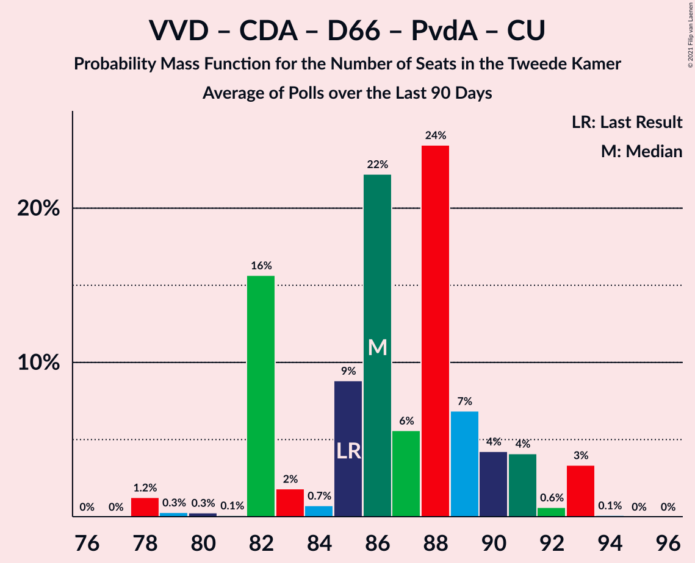

# Poll Average

<a href="#voting-intentions">Voting Intentions</a> | <a href="#seats">Seats</a> | <a href="#coalitions">Coalitions</a> | <a href="#technical-information">Technical Information</a>

## Summary

The table below lists the polls on which the average is based. They are the most recent polls (less than 90 days old) registered and analyzed so far.

| Period     | Polling firm/Commissioner(s) | VVD | PVV | CDA | D66 | GL | SP | PvdA | CU | PvdD | 50+ | SGP | DENK | FvD | PP | B1 | PvdT |
|:----------:|:----------------------------:|:--:|:--:|:--:|:--:|:--:|:--:|:--:|:--:|:--:|:--:|:--:|:--:|:--:|:--:|:--:|:--:|
| 15 March 2017 | General Election | 21.3%   33 | 13.1%   20 | 12.4%   19 | 12.2%   19 | 9.1%   14 | 9.1%   14 | 5.7%   9 | 3.4%   5 | 3.2%   5 | 3.1%   4 | 2.1%   3 | 2.1%   3 | 1.8%   2 | 0.3%   0 | 0.3%   0 | 0.0%   0 |
| N/A | Poll Average | 21–32%   33–48 | 8–13%   12–19 | 8–14%   10–23 | 6–9%   9–14 | 7–12%   11–16 | 5–8%   8–11 | 8–12%   12–17 | 3–5%   4–9 | 2–4%   3–6 | 0–2%   0–3 | 2–3%   3–5 | 0–2%   0–3 | 6–9%   10–13 | N/A   N/A | N/A   N/A | 0–1%   0–1 |
| [28 June 2020](2020-06-28-Peilnl.html) | Peil.nl | 21–23%   31–35 | 11–13%   16–19 | 11–14%   18–23 | 7–9%   11–14 | 7–9%   11–14 | 6–8%   9–12 | 10–12%   15–17 | 4–5%   5–8 | 3–4%   4–6 | 0–1%   0–1 | 2–3%   3–4 | 0–1%   0–2 | 6–8%   10–12 | N/A   N/A | N/A   N/A | 0–1%   0–1 |
| [5–9 June 2020](2020-06-09-IOResearch.html) | I&O Research | 28–31%   45–48 | 9–11%   14–16 | 8–10%   14–15 | 6–8%   10–12 | 9–11%   14–16 | 6–8%   9–11 | 8–10%   12–14 | 4–5%   6–8 | 2–3%   3–4 | 0–1%   0–1 | 2–3%   3–5 | 0%   0 | 6–8%   10–12 | N/A   N/A | N/A   N/A | 0%   0 |
| [22–24 May 2020](2020-05-24-Ipsos.html) | Ipsos   EenVandaag | 27–32%   42–48 | 8–11%   12–15 | 8–11%   10–13 | 5–8%   8–13 | 8–12%   14–18 | 5–8%   8–11 | 7–11%   12–16 | 3–5%   4–9 | 2–5%   4–8 | 1–2%   2–3 | 1–3%   2–5 | 1–2%   1–3 | 7–10%   9–14 | N/A   N/A | N/A   N/A | 0–1%   0–1 |
| 15 March 2017 | General Election | 21.3%   33 | 13.1%   20 | 12.4%   19 | 12.2%   19 | 9.1%   14 | 9.1%   14 | 5.7%   9 | 3.4%   5 | 3.2%   5 | 3.1%   4 | 2.1%   3 | 2.1%   3 | 1.8%   2 | 0.3%   0 | 0.3%   0 | 0.0%   0 |

Only polls for which at least the sample size has been published are included in the table above.

**Legend:**
+ **Top half of each row:** Voting intentions (95% confidence interval)
+ **Bottom half of each row:** Seat projections for the Tweede Kamer (95% confidence interval)
+ **VVD:** Volkspartij voor Vrijheid en Democratie
+ **PVV:** Partij voor de Vrijheid
+ **CDA:** Christen-Democratisch Appèl
+ **D66:** Democraten 66
+ **GL:** GroenLinks
+ **SP:** Socialistische Partij
+ **PvdA:** Partij van de Arbeid
+ **CU:** ChristenUnie
+ **PvdD:** Partij voor de Dieren
+ **50+:** 50Plus
+ **SGP:** Staatkundig Gereformeerde Partij
+ **DENK:** DENK
+ **FvD:** Forum voor Democratie
+ **PP:** Piratenpartij
+ **B1:** Bij1
+ **PvdT:** Partij voor de Toekomst
+ **N/A (single party):** Party not included the published results
+ **N/A (entire row):** Calculation for this opinion poll not started yet

## Voting Intentions

### Confidence Intervals

| Party | Last Result | Median | 80% Confidence Interval | 90% Confidence Interval | 95% Confidence Interval | 99% Confidence Interval |
|:-----:|:-----------:|:------:|:-----------------------:|:-----------------------:|:-----------------------:|:-----------------------:|
| <a href="#volkspartij-voor-vrijheid-en-democratie">Volkspartij voor Vrijheid en Democratie</a> | 21.3% | 28.9% | 21.6–30.7% |21.2–31.1% | 20.9–31.5% | 20.4–32.4% |
| <a href="#partij-voor-de-vrijheid">Partij voor de Vrijheid</a> | 13.1% | 10.2% | 8.9–12.3% |8.5–12.6% | 8.1–12.9% | 7.6–13.3% |
| <a href="#christen-democratisch-appèl">Christen-Democratisch Appèl</a> | 12.4% | 9.8% | 8.7–13.0% |8.4–13.3% | 8.1–13.5% | 7.6–14.0% |
| <a href="#democraten-66">Democraten 66</a> | 12.2% | 7.4% | 6.3–8.3% |6.0–8.6% | 5.7–8.8% | 5.2–9.2% |
| <a href="#groenlinks">GroenLinks</a> | 9.1% | 9.5% | 7.8–10.8% |7.5–11.1% | 7.3–11.5% | 7.0–12.2% |
| <a href="#socialistische-partij">Socialistische Partij</a> | 9.1% | 6.5% | 5.6–7.2% |5.3–7.4% | 5.1–7.6% | 4.6–8.0% |
| <a href="#partij-van-de-arbeid">Partij van de Arbeid</a> | 5.7% | 9.1% | 8.0–11.0% |7.8–11.3% | 7.5–11.5% | 7.0–11.9% |
| <a href="#christenunie">ChristenUnie</a> | 3.4% | 4.5% | 3.7–5.1% |3.5–5.3% | 3.2–5.4% | 2.9–5.7% |
| <a href="#partij-voor-de-dieren">Partij voor de Dieren</a> | 3.2% | 3.1% | 2.5–3.8% |2.4–4.1% | 2.3–4.3% | 2.1–4.7% |
| <a href="#50plus">50Plus</a> | 3.1% | 0.8% | 0.5–1.6% |0.5–1.8% | 0.4–2.0% | 0.4–2.3% |
| <a href="#staatkundig-gereformeerde-partij">Staatkundig Gereformeerde Partij</a> | 2.1% | 2.6% | 1.8–3.0% |1.6–3.1% | 1.5–3.3% | 1.3–3.5% |
| <a href="#denk">DENK</a> | 2.1% | 0.7% | 0.2–1.6% |0.1–1.8% | 0.1–2.0% | 0.1–2.3% |
| <a href="#forum-voor-democratie">Forum voor Democratie</a> | 1.8% | 7.5% | 6.8–8.5% |6.6–9.0% | 6.5–9.3% | 6.2–10.0% |
| <a href="#piratenpartij">Piratenpartij</a> | 0.3% | N/A | N/A |N/A | N/A | N/A |
| <a href="#bij1">Bij1</a> | 0.3% | N/A | N/A |N/A | N/A | N/A |
| <a href="#partij-voor-de-toekomst">Partij voor de Toekomst</a> | 0.0% | 0.6% | 0.2–0.9% |0.1–1.1% | 0.1–1.2% | 0.1–1.5% |

### Volkspartij voor Vrijheid en Democratie

*For a full overview of the results for this party, see the [Volkspartij voor Vrijheid en Democratie](party-volkspartijvoorvrijheidendemocratie.html) page.*

| Voting Intentions | Probability | Accumulated | Special Marks |
|:-----------------:|:-----------:|:-----------:|:-------------:|
| 18.5–19.5% | 0% | 100% |  |
| 19.5–20.5% | 0.9% | 100% |  |
| 20.5–21.5% | 9% | 99.1% | Last Result |
| 21.5–22.5% | 16% | 91% |  |
| 22.5–23.5% | 7% | 74% |  |
| 23.5–24.5% | 0.7% | 67% |  |
| 24.5–25.5% | 0.1% | 67% |  |
| 25.5–26.5% | 0.7% | 67% |  |
| 26.5–27.5% | 3% | 66% |  |
| 27.5–28.5% | 8% | 63% |  |
| 28.5–29.5% | 19% | 55% | Median |
| 29.5–30.5% | 23% | 36% |  |
| 30.5–31.5% | 10% | 13% |  |
| 31.5–32.5% | 2% | 2% |  |
| 32.5–33.5% | 0.3% | 0.4% |  |
| 33.5–34.5% | 0% | 0.1% |  |
| 34.5–35.5% | 0% | 0% |  |

### Partij voor de Vrijheid

*For a full overview of the results for this party, see the [Partij voor de Vrijheid](party-partijvoordevrijheid.html) page.*

| Voting Intentions | Probability | Accumulated | Special Marks |
|:-----------------:|:-----------:|:-----------:|:-------------:|
| 5.5–6.5% | 0% | 100% |  |
| 6.5–7.5% | 0.5% | 100% |  |
| 7.5–8.5% | 5% | 99.5% |  |
| 8.5–9.5% | 21% | 94% |  |
| 9.5–10.5% | 33% | 74% | Median |
| 10.5–11.5% | 15% | 41% |  |
| 11.5–12.5% | 20% | 26% |  |
| 12.5–13.5% | 6% | 6% | Last Result |
| 13.5–14.5% | 0.2% | 0.2% |  |
| 14.5–15.5% | 0% | 0% |  |

### Christen-Democratisch Appèl

*For a full overview of the results for this party, see the [Christen-Democratisch Appèl](party-christen-democratischappèl.html) page.*

| Voting Intentions | Probability | Accumulated | Special Marks |
|:-----------------:|:-----------:|:-----------:|:-------------:|
| 5.5–6.5% | 0% | 100% |  |
| 6.5–7.5% | 0.5% | 100% |  |
| 7.5–8.5% | 7% | 99.5% |  |
| 8.5–9.5% | 34% | 92% |  |
| 9.5–10.5% | 21% | 58% | Median |
| 10.5–11.5% | 5% | 37% |  |
| 11.5–12.5% | 14% | 33% | Last Result |
| 12.5–13.5% | 17% | 19% |  |
| 13.5–14.5% | 2% | 2% |  |
| 14.5–15.5% | 0% | 0% |  |
| 15.5–16.5% | 0% | 0% |  |

### Democraten 66

*For a full overview of the results for this party, see the [Democraten 66](party-democraten66.html) page.*

| Voting Intentions | Probability | Accumulated | Special Marks |
|:-----------------:|:-----------:|:-----------:|:-------------:|
| 3.5–4.5% | 0% | 100% |  |
| 4.5–5.5% | 2% | 100% |  |
| 5.5–6.5% | 13% | 98% |  |
| 6.5–7.5% | 42% | 85% | Median |
| 7.5–8.5% | 38% | 44% |  |
| 8.5–9.5% | 5% | 6% |  |
| 9.5–10.5% | 0.1% | 0.1% |  |
| 10.5–11.5% | 0% | 0% |  |
| 11.5–12.5% | 0% | 0% | Last Result |

### GroenLinks

*For a full overview of the results for this party, see the [GroenLinks](party-groenlinks.html) page.*

| Voting Intentions | Probability | Accumulated | Special Marks |
|:-----------------:|:-----------:|:-----------:|:-------------:|
| 5.5–6.5% | 0% | 100% |  |
| 6.5–7.5% | 6% | 100% |  |
| 7.5–8.5% | 24% | 94% |  |
| 8.5–9.5% | 20% | 70% | Last Result |
| 9.5–10.5% | 35% | 50% | Median |
| 10.5–11.5% | 12% | 15% |  |
| 11.5–12.5% | 2% | 2% |  |
| 12.5–13.5% | 0.2% | 0.2% |  |
| 13.5–14.5% | 0% | 0% |  |

### Socialistische Partij

*For a full overview of the results for this party, see the [Socialistische Partij](party-socialistischepartij.html) page.*

| Voting Intentions | Probability | Accumulated | Special Marks |
|:-----------------:|:-----------:|:-----------:|:-------------:|
| 2.5–3.5% | 0% | 100% |  |
| 3.5–4.5% | 0.4% | 100% |  |
| 4.5–5.5% | 8% | 99.6% |  |
| 5.5–6.5% | 44% | 92% |  |
| 6.5–7.5% | 45% | 48% | Median |
| 7.5–8.5% | 3% | 3% |  |
| 8.5–9.5% | 0% | 0% | Last Result |
| 9.5–10.5% | 0% | 0% |  |

### Partij van de Arbeid

*For a full overview of the results for this party, see the [Partij van de Arbeid](party-partijvandearbeid.html) page.*

| Voting Intentions | Probability | Accumulated | Special Marks |
|:-----------------:|:-----------:|:-----------:|:-------------:|
| 4.5–5.5% | 0% | 100% |  |
| 5.5–6.5% | 0.1% | 100% | Last Result |
| 6.5–7.5% | 3% | 99.9% |  |
| 7.5–8.5% | 25% | 97% |  |
| 8.5–9.5% | 32% | 72% | Median |
| 9.5–10.5% | 20% | 40% |  |
| 10.5–11.5% | 18% | 20% |  |
| 11.5–12.5% | 2% | 2% |  |
| 12.5–13.5% | 0% | 0% |  |

### ChristenUnie

*For a full overview of the results for this party, see the [ChristenUnie](party-christenunie.html) page.*

| Voting Intentions | Probability | Accumulated | Special Marks |
|:-----------------:|:-----------:|:-----------:|:-------------:|
| 1.5–2.5% | 0.1% | 100% |  |
| 2.5–3.5% | 6% | 99.9% | Last Result |
| 3.5–4.5% | 45% | 94% |  |
| 4.5–5.5% | 47% | 49% | Median |
| 5.5–6.5% | 1.4% | 1.4% |  |
| 6.5–7.5% | 0% | 0% |  |

### Partij voor de Dieren

*For a full overview of the results for this party, see the [Partij voor de Dieren](party-partijvoordedieren.html) page.*

| Voting Intentions | Probability | Accumulated | Special Marks |
|:-----------------:|:-----------:|:-----------:|:-------------:|
| 0.5–1.5% | 0% | 100% |  |
| 1.5–2.5% | 12% | 100% |  |
| 2.5–3.5% | 66% | 88% | Last Result, Median |
| 3.5–4.5% | 21% | 22% |  |
| 4.5–5.5% | 1.0% | 1.0% |  |
| 5.5–6.5% | 0% | 0% |  |

### 50Plus

*For a full overview of the results for this party, see the [50Plus](party-50plus.html) page.*

| Voting Intentions | Probability | Accumulated | Special Marks |
|:-----------------:|:-----------:|:-----------:|:-------------:|
| 0.0–0.5% | 11% | 100% |  |
| 0.5–1.5% | 78% | 89% | Median |
| 1.5–2.5% | 11% | 11% |  |
| 2.5–3.5% | 0.2% | 0.2% | Last Result |
| 3.5–4.5% | 0% | 0% |  |

### Staatkundig Gereformeerde Partij

*For a full overview of the results for this party, see the [Staatkundig Gereformeerde Partij](party-staatkundiggereformeerdepartij.html) page.*

| Voting Intentions | Probability | Accumulated | Special Marks |
|:-----------------:|:-----------:|:-----------:|:-------------:|
| 0.0–0.5% | 0% | 100% |  |
| 0.5–1.5% | 3% | 100% |  |
| 1.5–2.5% | 45% | 97% | Last Result |
| 2.5–3.5% | 51% | 51% | Median |
| 3.5–4.5% | 0.3% | 0.3% |  |
| 4.5–5.5% | 0% | 0% |  |

### DENK

*For a full overview of the results for this party, see the [DENK](party-denk.html) page.*

| Voting Intentions | Probability | Accumulated | Special Marks |
|:-----------------:|:-----------:|:-----------:|:-------------:|
| 0.0–0.5% | 39% | 100% |  |
| 0.5–1.5% | 50% | 61% | Median |
| 1.5–2.5% | 11% | 11% | Last Result |
| 2.5–3.5% | 0.2% | 0.2% |  |
| 3.5–4.5% | 0% | 0% |  |

### Forum voor Democratie

*For a full overview of the results for this party, see the [Forum voor Democratie](party-forumvoordemocratie.html) page.*

| Voting Intentions | Probability | Accumulated | Special Marks |
|:-----------------:|:-----------:|:-----------:|:-------------:|
| 1.5–2.5% | 0% | 100% | Last Result |
| 2.5–3.5% | 0% | 100% |  |
| 3.5–4.5% | 0% | 100% |  |
| 4.5–5.5% | 0% | 100% |  |
| 5.5–6.5% | 4% | 100% |  |
| 6.5–7.5% | 50% | 96% | Median |
| 7.5–8.5% | 37% | 47% |  |
| 8.5–9.5% | 8% | 10% |  |
| 9.5–10.5% | 1.4% | 2% |  |
| 10.5–11.5% | 0.1% | 0.1% |  |
| 11.5–12.5% | 0% | 0% |  |

### Partij voor de Toekomst

*For a full overview of the results for this party, see the [Partij voor de Toekomst](party-partijvoordetoekomst.html) page.*

| Voting Intentions | Probability | Accumulated | Special Marks |
|:-----------------:|:-----------:|:-----------:|:-------------:|
| 0.0–0.5% | 46% | 100% | Last Result |
| 0.5–1.5% | 54% | 54% | Median |
| 1.5–2.5% | 0.3% | 0.3% |  |
| 2.5–3.5% | 0% | 0% |  |

## Seats

### Confidence Intervals

| Party | Last Result | Median | 80% Confidence Interval | 90% Confidence Interval | 95% Confidence Interval | 99% Confidence Interval |
|:-----:|:-----------:|:------:|:-----------------------:|:-----------------------:|:-----------------------:|:-----------------------:|
| <a href="#volkspartij-voor-vrijheid-en-democratie">Volkspartij voor Vrijheid en Democratie</a> | 33 | 44 | 33–47 |33–47 | 33–48 | 31–48 |
| <a href="#partij-voor-de-vrijheid">Partij voor de Vrijheid</a> | 20 | 14 | 12–18 |12–18 | 12–19 | 11–20 |
| <a href="#christen-democratisch-appèl">Christen-Democratisch Appèl</a> | 19 | 15 | 12–19 |12–21 | 10–23 | 10–23 |
| <a href="#democraten-66">Democraten 66</a> | 19 | 12 | 10–13 |9–13 | 9–14 | 8–14 |
| <a href="#groenlinks">GroenLinks</a> | 14 | 15 | 12–15 |11–15 | 11–16 | 11–19 |
| <a href="#socialistische-partij">Socialistische Partij</a> | 14 | 11 | 8–11 |8–11 | 8–11 | 8–12 |
| <a href="#partij-van-de-arbeid">Partij van de Arbeid</a> | 9 | 13 | 12–16 |12–17 | 12–17 | 11–18 |
| <a href="#christenunie">ChristenUnie</a> | 5 | 7 | 5–9 |5–9 | 4–9 | 4–9 |
| <a href="#partij-voor-de-dieren">Partij voor de Dieren</a> | 5 | 5 | 3–6 |3–6 | 3–6 | 3–8 |
| <a href="#50plus">50Plus</a> | 4 | 1 | 0–2 |0–3 | 0–3 | 0–3 |
| <a href="#staatkundig-gereformeerde-partij">Staatkundig Gereformeerde Partij</a> | 3 | 3 | 3–4 |3–5 | 3–5 | 2–5 |
| <a href="#denk">DENK</a> | 3 | 0 | 0–2 |0–3 | 0–3 | 0–3 |
| <a href="#forum-voor-democratie">Forum voor Democratie</a> | 2 | 12 | 10–13 |10–13 | 10–13 | 9–15 |
| <a href="#piratenpartij">Piratenpartij</a> | 0 | N/A | N/A |N/A | N/A | N/A |
| <a href="#bij1">Bij1</a> | 0 | N/A | N/A |N/A | N/A | N/A |
| <a href="#partij-voor-de-toekomst">Partij voor de Toekomst</a> | 0 | 1 | 0–1 |0–1 | 0–1 | 0–1 |

### Volkspartij voor Vrijheid en Democratie

*For a full overview of the results for this party, see the [Volkspartij voor Vrijheid en Democratie](party-volkspartijvoorvrijheidendemocratie.html) page.*

| Number of Seats | Probability | Accumulated | Special Marks |
|:---------------:|:-----------:|:-----------:|:-------------:|
| 31 | 2% | 100% |  |
| 32 | 0.8% | 98% |  |
| 33 | 25% | 98% | Last Result |
| 34 | 3% | 73% |  |
| 35 | 3% | 70% |  |
| 36 | 0.2% | 67% |  |
| 37 | 0% | 67% |  |
| 38 | 0% | 67% |  |
| 39 | 0.1% | 67% |  |
| 40 | 0.1% | 67% |  |
| 41 | 0.6% | 67% |  |
| 42 | 0.5% | 66% |  |
| 43 | 0.5% | 65% |  |
| 44 | 26% | 65% | Median |
| 45 | 2% | 39% |  |
| 46 | 7% | 37% |  |
| 47 | 27% | 30% |  |
| 48 | 3% | 3% |  |
| 49 | 0.4% | 0.4% |  |
| 50 | 0% | 0% |  |

### Partij voor de Vrijheid

*For a full overview of the results for this party, see the [Partij voor de Vrijheid](party-partijvoordevrijheid.html) page.*

| Number of Seats | Probability | Accumulated | Special Marks |
|:---------------:|:-----------:|:-----------:|:-------------:|
| 10 | 0.1% | 100% |  |
| 11 | 0.6% | 99.9% |  |
| 12 | 23% | 99.3% |  |
| 13 | 9% | 77% |  |
| 14 | 28% | 68% | Median |
| 15 | 6% | 40% |  |
| 16 | 3% | 34% |  |
| 17 | 6% | 31% |  |
| 18 | 21% | 25% |  |
| 19 | 4% | 4% |  |
| 20 | 0.7% | 0.7% | Last Result |
| 21 | 0% | 0% |  |

### Christen-Democratisch Appèl

*For a full overview of the results for this party, see the [Christen-Democratisch Appèl](party-christen-democratischappèl.html) page.*

| Number of Seats | Probability | Accumulated | Special Marks |
|:---------------:|:-----------:|:-----------:|:-------------:|
| 10 | 3% | 100% |  |
| 11 | 0.3% | 97% |  |
| 12 | 28% | 96% |  |
| 13 | 1.2% | 68% |  |
| 14 | 5% | 67% |  |
| 15 | 28% | 62% | Median |
| 16 | 0.3% | 34% |  |
| 17 | 0.5% | 34% |  |
| 18 | 2% | 33% |  |
| 19 | 22% | 31% | Last Result |
| 20 | 3% | 9% |  |
| 21 | 2% | 7% |  |
| 22 | 0.2% | 5% |  |
| 23 | 5% | 5% |  |
| 24 | 0% | 0% |  |

### Democraten 66

*For a full overview of the results for this party, see the [Democraten 66](party-democraten66.html) page.*

| Number of Seats | Probability | Accumulated | Special Marks |
|:---------------:|:-----------:|:-----------:|:-------------:|
| 7 | 0.3% | 100% |  |
| 8 | 0.8% | 99.7% |  |
| 9 | 4% | 98.9% |  |
| 10 | 28% | 95% |  |
| 11 | 10% | 67% |  |
| 12 | 10% | 57% | Median |
| 13 | 44% | 47% |  |
| 14 | 4% | 4% |  |
| 15 | 0% | 0% |  |
| 16 | 0% | 0% |  |
| 17 | 0% | 0% |  |
| 18 | 0% | 0% |  |
| 19 | 0% | 0% | Last Result |

### GroenLinks

*For a full overview of the results for this party, see the [GroenLinks](party-groenlinks.html) page.*

| Number of Seats | Probability | Accumulated | Special Marks |
|:---------------:|:-----------:|:-----------:|:-------------:|
| 10 | 0.3% | 100% |  |
| 11 | 6% | 99.7% |  |
| 12 | 23% | 93% |  |
| 13 | 3% | 71% |  |
| 14 | 12% | 67% | Last Result |
| 15 | 52% | 56% | Median |
| 16 | 2% | 3% |  |
| 17 | 0.6% | 2% |  |
| 18 | 0.4% | 1.2% |  |
| 19 | 0.7% | 0.7% |  |
| 20 | 0.1% | 0.1% |  |
| 21 | 0% | 0% |  |

### Socialistische Partij

*For a full overview of the results for this party, see the [Socialistische Partij](party-socialistischepartij.html) page.*

| Number of Seats | Probability | Accumulated | Special Marks |
|:---------------:|:-----------:|:-----------:|:-------------:|
| 7 | 0.1% | 100% |  |
| 8 | 27% | 99.8% |  |
| 9 | 10% | 73% |  |
| 10 | 8% | 63% |  |
| 11 | 53% | 55% | Median |
| 12 | 2% | 2% |  |
| 13 | 0% | 0.1% |  |
| 14 | 0% | 0% | Last Result |

### Partij van de Arbeid

*For a full overview of the results for this party, see the [Partij van de Arbeid](party-partijvandearbeid.html) page.*

| Number of Seats | Probability | Accumulated | Special Marks |
|:---------------:|:-----------:|:-----------:|:-------------:|
| 9 | 0.1% | 100% | Last Result |
| 10 | 0% | 99.9% |  |
| 11 | 0.7% | 99.9% |  |
| 12 | 25% | 99.2% |  |
| 13 | 30% | 75% | Median |
| 14 | 7% | 44% |  |
| 15 | 0.9% | 37% |  |
| 16 | 31% | 36% |  |
| 17 | 4% | 5% |  |
| 18 | 0.5% | 0.7% |  |
| 19 | 0.2% | 0.2% |  |
| 20 | 0% | 0% |  |

### ChristenUnie

*For a full overview of the results for this party, see the [ChristenUnie](party-christenunie.html) page.*

| Number of Seats | Probability | Accumulated | Special Marks |
|:---------------:|:-----------:|:-----------:|:-------------:|
| 4 | 4% | 100% |  |
| 5 | 7% | 96% | Last Result |
| 6 | 33% | 88% |  |
| 7 | 29% | 55% | Median |
| 8 | 4% | 27% |  |
| 9 | 23% | 23% |  |
| 10 | 0% | 0% |  |

### Partij voor de Dieren

*For a full overview of the results for this party, see the [Partij voor de Dieren](party-partijvoordedieren.html) page.*

| Number of Seats | Probability | Accumulated | Special Marks |
|:---------------:|:-----------:|:-----------:|:-------------:|
| 2 | 0.5% | 100% |  |
| 3 | 32% | 99.5% |  |
| 4 | 17% | 68% |  |
| 5 | 26% | 51% | Last Result, Median |
| 6 | 23% | 25% |  |
| 7 | 0.5% | 2% |  |
| 8 | 1.2% | 1.2% |  |
| 9 | 0% | 0% |  |

### 50Plus

*For a full overview of the results for this party, see the [50Plus](party-50plus.html) page.*

| Number of Seats | Probability | Accumulated | Special Marks |
|:---------------:|:-----------:|:-----------:|:-------------:|
| 0 | 32% | 100% |  |
| 1 | 35% | 68% | Median |
| 2 | 26% | 33% |  |
| 3 | 7% | 7% |  |
| 4 | 0% | 0% | Last Result |

### Staatkundig Gereformeerde Partij

*For a full overview of the results for this party, see the [Staatkundig Gereformeerde Partij](party-staatkundiggereformeerdepartij.html) page.*

| Number of Seats | Probability | Accumulated | Special Marks |
|:---------------:|:-----------:|:-----------:|:-------------:|
| 2 | 2% | 100% |  |
| 3 | 53% | 98% | Last Result, Median |
| 4 | 38% | 45% |  |
| 5 | 8% | 8% |  |
| 6 | 0% | 0% |  |

### DENK

*For a full overview of the results for this party, see the [DENK](party-denk.html) page.*

| Number of Seats | Probability | Accumulated | Special Marks |
|:---------------:|:-----------:|:-----------:|:-------------:|
| 0 | 54% | 100% | Median |
| 1 | 35% | 46% |  |
| 2 | 4% | 11% |  |
| 3 | 7% | 7% | Last Result |
| 4 | 0% | 0.1% |  |
| 5 | 0% | 0% |  |

### Forum voor Democratie

*For a full overview of the results for this party, see the [Forum voor Democratie](party-forumvoordemocratie.html) page.*

| Number of Seats | Probability | Accumulated | Special Marks |
|:---------------:|:-----------:|:-----------:|:-------------:|
| 2 | 0% | 100% | Last Result |
| 3 | 0% | 100% |  |
| 4 | 0% | 100% |  |
| 5 | 0% | 100% |  |
| 6 | 0% | 100% |  |
| 7 | 0% | 100% |  |
| 8 | 0% | 100% |  |
| 9 | 2% | 100% |  |
| 10 | 20% | 98% |  |
| 11 | 18% | 77% |  |
| 12 | 34% | 59% | Median |
| 13 | 24% | 25% |  |
| 14 | 0.3% | 1.0% |  |
| 15 | 0.7% | 0.7% |  |
| 16 | 0% | 0% |  |

### Piratenpartij

*For a full overview of the results for this party, see the [Piratenpartij](party-piratenpartij.html) page.*

### Bij1

*For a full overview of the results for this party, see the [Bij1](party-bij1.html) page.*

### Partij voor de Toekomst

*For a full overview of the results for this party, see the [Partij voor de Toekomst](party-partijvoordetoekomst.html) page.*

| Number of Seats | Probability | Accumulated | Special Marks |
|:---------------:|:-----------:|:-----------:|:-------------:|
| 0 | 42% | 100% | Last Result |
| 1 | 57% | 58% | Median |
| 2 | 0.1% | 0.1% |  |
| 3 | 0% | 0% |  |

## Coalitions

### Confidence Intervals

| Coalition | Last Result | Median | Majority? | 80% Confidence Interval | 90% Confidence Interval | 95% Confidence Interval | 99% Confidence Interval |
|:---------:|:-----------:|:------:|:---------:|:-----------------------:|:-----------------------:|:-----------------------:|:-----------------------:|
| Volkspartij voor Vrijheid en Democratie – Christen-Democratisch Appèl – Democraten 66 – GroenLinks – ChristenUnie | 90 | 93 | 100% | 84–93 | 84–93 | 82–94 | 81–95 |
| Volkspartij voor Vrijheid en Democratie – Christen-Democratisch Appèl – Democraten 66 – Partij van de Arbeid – ChristenUnie | 85 | 90 | 100% | 87–91 | 86–91 | 85–93 | 85–94 |
| Volkspartij voor Vrijheid en Democratie – Partij voor de Vrijheid – Christen-Democratisch Appèl – Staatkundig Gereformeerde Partij – Forum voor Democratie | 77 | 84 | 100% | 83–92 | 83–92 | 83–92 | 81–92 |
| Volkspartij voor Vrijheid en Democratie – Partij voor de Vrijheid – Christen-Democratisch Appèl – Forum voor Democratie | 74 | 81 | 100% | 80–88 | 80–88 | 79–88 | 79–89 |
| Volkspartij voor Vrijheid en Democratie – Christen-Democratisch Appèl – Democraten 66 – ChristenUnie | 76 | 78 | 56% | 72–78 | 70–78 | 69–80 | 69–81 |
| Christen-Democratisch Appèl – Democraten 66 – GroenLinks – Socialistische Partij – Partij van de Arbeid – ChristenUnie | 80 | 70 | 32% | 68–78 | 65–79 | 63–79 | 63–80 |
| Volkspartij voor Vrijheid en Democratie – Christen-Democratisch Appèl – 50Plus – Staatkundig Gereformeerde Partij – Forum voor Democratie | 61 | 74 | 37% | 66–78 | 66–78 | 66–78 | 65–79 |
| Volkspartij voor Vrijheid en Democratie – Christen-Democratisch Appèl – Staatkundig Gereformeerde Partij – Forum voor Democratie | 57 | 72 | 33% | 65–78 | 65–78 | 65–78 | 64–78 |
| Volkspartij voor Vrijheid en Democratie – Partij voor de Vrijheid – Christen-Democratisch Appèl | 72 | 70 | 30% | 68–76 | 68–76 | 68–76 | 66–77 |
| Volkspartij voor Vrijheid en Democratie – Christen-Democratisch Appèl – Partij van de Arbeid | 61 | 70 | 2% | 68–75 | 68–75 | 67–75 | 65–76 |
| Volkspartij voor Vrijheid en Democratie – Christen-Democratisch Appèl – 50Plus – Forum voor Democratie | 58 | 71 | 0.1% | 63–74 | 63–74 | 63–74 | 62–75 |
| Volkspartij voor Vrijheid en Democratie – Christen-Democratisch Appèl – Forum voor Democratie | 54 | 69 | 0.1% | 62–74 | 62–74 | 62–74 | 61–74 |
| Volkspartij voor Vrijheid en Democratie – Christen-Democratisch Appèl – Democraten 66 | 71 | 69 | 0% | 65–72 | 65–72 | 64–73 | 62–73 |
| Volkspartij voor Vrijheid en Democratie – Democraten 66 – Partij van de Arbeid | 61 | 69 | 0.1% | 62–70 | 60–71 | 60–71 | 60–73 |
| Christen-Democratisch Appèl – Democraten 66 – GroenLinks – Partij van de Arbeid – ChristenUnie | 66 | 61 | 0% | 58–67 | 57–68 | 54–68 | 54–71 |
| Volkspartij voor Vrijheid en Democratie – Christen-Democratisch Appèl | 52 | 56 | 0% | 52–62 | 52–62 | 52–62 | 50–63 |
| Volkspartij voor Vrijheid en Democratie – Partij van de Arbeid | 42 | 56 | 0% | 49–60 | 49–62 | 49–62 | 48–62 |
| Christen-Democratisch Appèl – Democraten 66 – Partij van de Arbeid | 47 | 38 | 0% | 37–49 | 36–50 | 35–50 | 34–51 |
| Christen-Democratisch Appèl – Partij van de Arbeid – ChristenUnie | 33 | 34 | 0% | 32–43 | 31–45 | 30–46 | 30–46 |
| Christen-Democratisch Appèl – Partij van de Arbeid | 28 | 28 | 0% | 24–36 | 24–38 | 24–39 | 24–39 |
| Christen-Democratisch Appèl – Democraten 66 | 38 | 25 | 0% | 24–32 | 22–34 | 19–34 | 19–34 |

### Volkspartij voor Vrijheid en Democratie – Christen-Democratisch Appèl – Democraten 66 – GroenLinks – ChristenUnie

| Number of Seats | Probability | Accumulated | Special Marks |
|:---------------:|:-----------:|:-----------:|:-------------:|
| 80 | 0.3% | 100% |  |
| 81 | 0.3% | 99.7% |  |
| 82 | 2% | 99.4% |  |
| 83 | 0.3% | 97% |  |
| 84 | 23% | 97% |  |
| 85 | 10% | 74% |  |
| 86 | 0.3% | 64% |  |
| 87 | 3% | 64% |  |
| 88 | 3% | 61% |  |
| 89 | 0.5% | 58% |  |
| 90 | 0.4% | 57% | Last Result |
| 91 | 0.8% | 57% |  |
| 92 | 4% | 56% |  |
| 93 | 49% | 52% | Median |
| 94 | 2% | 3% |  |
| 95 | 1.0% | 1.2% |  |
| 96 | 0.1% | 0.2% |  |
| 97 | 0% | 0% |  |

### Volkspartij voor Vrijheid en Democratie – Christen-Democratisch Appèl – Democraten 66 – Partij van de Arbeid – ChristenUnie

| Number of Seats | Probability | Accumulated | Special Marks |
|:---------------:|:-----------:|:-----------:|:-------------:|
| 81 | 0.1% | 100% |  |
| 82 | 0% | 99.9% |  |
| 83 | 0.1% | 99.9% |  |
| 84 | 0.1% | 99.8% |  |
| 85 | 4% | 99.7% | Last Result |
| 86 | 4% | 96% |  |
| 87 | 6% | 92% |  |
| 88 | 20% | 86% |  |
| 89 | 4% | 66% |  |
| 90 | 28% | 63% |  |
| 91 | 30% | 35% | Median |
| 92 | 1.4% | 4% |  |
| 93 | 1.0% | 3% |  |
| 94 | 2% | 2% |  |
| 95 | 0% | 0% |  |

### Volkspartij voor Vrijheid en Democratie – Partij voor de Vrijheid – Christen-Democratisch Appèl – Staatkundig Gereformeerde Partij – Forum voor Democratie

| Number of Seats | Probability | Accumulated | Special Marks |
|:---------------:|:-----------:|:-----------:|:-------------:|
| 77 | 0% | 100% | Last Result |
| 78 | 0% | 100% |  |
| 79 | 0% | 100% |  |
| 80 | 0% | 100% |  |
| 81 | 1.3% | 100% |  |
| 82 | 0% | 98.7% |  |
| 83 | 22% | 98.7% |  |
| 84 | 28% | 77% |  |
| 85 | 0.5% | 49% |  |
| 86 | 7% | 49% |  |
| 87 | 2% | 42% |  |
| 88 | 6% | 40% | Median |
| 89 | 0.9% | 34% |  |
| 90 | 0.6% | 33% |  |
| 91 | 5% | 33% |  |
| 92 | 27% | 27% |  |
| 93 | 0.4% | 0.5% |  |
| 94 | 0.1% | 0.1% |  |
| 95 | 0% | 0.1% |  |
| 96 | 0% | 0% |  |

### Volkspartij voor Vrijheid en Democratie – Partij voor de Vrijheid – Christen-Democratisch Appèl – Forum voor Democratie

| Number of Seats | Probability | Accumulated | Special Marks |
|:---------------:|:-----------:|:-----------:|:-------------:|
| 74 | 0% | 100% | Last Result |
| 75 | 0% | 100% |  |
| 76 | 0% | 100% | Majority |
| 77 | 0% | 100% |  |
| 78 | 0% | 100% |  |
| 79 | 3% | 100% |  |
| 80 | 21% | 97% |  |
| 81 | 30% | 76% |  |
| 82 | 2% | 46% |  |
| 83 | 3% | 44% |  |
| 84 | 7% | 41% |  |
| 85 | 1.0% | 34% | Median |
| 86 | 3% | 33% |  |
| 87 | 2% | 30% |  |
| 88 | 28% | 29% |  |
| 89 | 0.4% | 0.5% |  |
| 90 | 0% | 0.1% |  |
| 91 | 0% | 0.1% |  |
| 92 | 0.1% | 0.1% |  |
| 93 | 0% | 0% |  |

### Volkspartij voor Vrijheid en Democratie – Christen-Democratisch Appèl – Democraten 66 – ChristenUnie

| Number of Seats | Probability | Accumulated | Special Marks |
|:---------------:|:-----------:|:-----------:|:-------------:|
| 67 | 0.2% | 100% |  |
| 68 | 0.1% | 99.8% |  |
| 69 | 4% | 99.7% |  |
| 70 | 2% | 96% |  |
| 71 | 2% | 94% |  |
| 72 | 23% | 93% |  |
| 73 | 6% | 70% |  |
| 74 | 6% | 64% |  |
| 75 | 2% | 58% |  |
| 76 | 0.4% | 56% | Last Result, Majority |
| 77 | 0.3% | 56% |  |
| 78 | 52% | 55% | Median |
| 79 | 0.1% | 3% |  |
| 80 | 2% | 3% |  |
| 81 | 1.0% | 1.0% |  |
| 82 | 0% | 0% |  |

### Christen-Democratisch Appèl – Democraten 66 – GroenLinks – Socialistische Partij – Partij van de Arbeid – ChristenUnie

| Number of Seats | Probability | Accumulated | Special Marks |
|:---------------:|:-----------:|:-----------:|:-------------:|
| 60 | 0% | 100% |  |
| 61 | 0% | 99.9% |  |
| 62 | 0% | 99.9% |  |
| 63 | 3% | 99.9% |  |
| 64 | 0% | 96% |  |
| 65 | 4% | 96% |  |
| 66 | 0.4% | 93% |  |
| 67 | 0.8% | 92% |  |
| 68 | 2% | 91% |  |
| 69 | 26% | 90% |  |
| 70 | 29% | 64% |  |
| 71 | 0.6% | 35% |  |
| 72 | 0.5% | 34% |  |
| 73 | 0.1% | 33% | Median |
| 74 | 0.3% | 33% |  |
| 75 | 0.9% | 33% |  |
| 76 | 3% | 32% | Majority |
| 77 | 2% | 29% |  |
| 78 | 20% | 27% |  |
| 79 | 6% | 8% |  |
| 80 | 1.3% | 1.4% | Last Result |
| 81 | 0.1% | 0.1% |  |
| 82 | 0% | 0% |  |

### Volkspartij voor Vrijheid en Democratie – Christen-Democratisch Appèl – 50Plus – Staatkundig Gereformeerde Partij – Forum voor Democratie

| Number of Seats | Probability | Accumulated | Special Marks |
|:---------------:|:-----------:|:-----------:|:-------------:|
| 61 | 0% | 100% | Last Result |
| 62 | 0% | 100% |  |
| 63 | 0% | 100% |  |
| 64 | 0% | 100% |  |
| 65 | 2% | 100% |  |
| 66 | 18% | 98% |  |
| 67 | 1.3% | 80% |  |
| 68 | 3% | 79% |  |
| 69 | 3% | 76% |  |
| 70 | 2% | 73% |  |
| 71 | 0.5% | 71% |  |
| 72 | 6% | 70% |  |
| 73 | 1.3% | 65% |  |
| 74 | 26% | 63% |  |
| 75 | 0.6% | 37% | Median |
| 76 | 6% | 37% | Majority |
| 77 | 2% | 30% |  |
| 78 | 27% | 28% |  |
| 79 | 0.8% | 0.9% |  |
| 80 | 0.1% | 0.1% |  |
| 81 | 0% | 0% |  |

### Volkspartij voor Vrijheid en Democratie – Christen-Democratisch Appèl – Staatkundig Gereformeerde Partij – Forum voor Democratie

| Number of Seats | Probability | Accumulated | Special Marks |
|:---------------:|:-----------:|:-----------:|:-------------:|
| 57 | 0% | 100% | Last Result |
| 58 | 0% | 100% |  |
| 59 | 0% | 100% |  |
| 60 | 0% | 100% |  |
| 61 | 0% | 100% |  |
| 62 | 0% | 100% |  |
| 63 | 0% | 100% |  |
| 64 | 2% | 100% |  |
| 65 | 18% | 98% |  |
| 66 | 0% | 80% |  |
| 67 | 3% | 80% |  |
| 68 | 6% | 77% |  |
| 69 | 1.1% | 72% |  |
| 70 | 0.9% | 71% |  |
| 71 | 9% | 70% |  |
| 72 | 23% | 61% |  |
| 73 | 3% | 37% |  |
| 74 | 0.9% | 34% | Median |
| 75 | 0.3% | 33% |  |
| 76 | 5% | 33% | Majority |
| 77 | 2% | 28% |  |
| 78 | 26% | 26% |  |
| 79 | 0% | 0.1% |  |
| 80 | 0% | 0% |  |

### Volkspartij voor Vrijheid en Democratie – Partij voor de Vrijheid – Christen-Democratisch Appèl

| Number of Seats | Probability | Accumulated | Special Marks |
|:---------------:|:-----------:|:-----------:|:-------------:|
| 66 | 0.7% | 100% |  |
| 67 | 0.1% | 99.3% |  |
| 68 | 23% | 99.3% |  |
| 69 | 9% | 76% |  |
| 70 | 22% | 67% |  |
| 71 | 2% | 45% |  |
| 72 | 3% | 43% | Last Result |
| 73 | 7% | 40% | Median |
| 74 | 0.5% | 34% |  |
| 75 | 3% | 33% |  |
| 76 | 28% | 30% | Majority |
| 77 | 2% | 2% |  |
| 78 | 0% | 0.5% |  |
| 79 | 0.4% | 0.4% |  |
| 80 | 0% | 0% |  |

### Volkspartij voor Vrijheid en Democratie – Christen-Democratisch Appèl – Partij van de Arbeid

| Number of Seats | Probability | Accumulated | Special Marks |
|:---------------:|:-----------:|:-----------:|:-------------:|
| 61 | 0% | 100% | Last Result |
| 62 | 0% | 100% |  |
| 63 | 0% | 100% |  |
| 64 | 0% | 100% |  |
| 65 | 0.6% | 100% |  |
| 66 | 0.1% | 99.3% |  |
| 67 | 2% | 99.3% |  |
| 68 | 42% | 97% |  |
| 69 | 1.0% | 55% |  |
| 70 | 7% | 54% |  |
| 71 | 4% | 46% |  |
| 72 | 9% | 43% | Median |
| 73 | 4% | 34% |  |
| 74 | 2% | 31% |  |
| 75 | 27% | 28% |  |
| 76 | 2% | 2% | Majority |
| 77 | 0.2% | 0.2% |  |
| 78 | 0% | 0% |  |

### Volkspartij voor Vrijheid en Democratie – Christen-Democratisch Appèl – 50Plus – Forum voor Democratie

| Number of Seats | Probability | Accumulated | Special Marks |
|:---------------:|:-----------:|:-----------:|:-------------:|
| 58 | 0% | 100% | Last Result |
| 59 | 0% | 100% |  |
| 60 | 0% | 100% |  |
| 61 | 0% | 100% |  |
| 62 | 2% | 99.9% |  |
| 63 | 18% | 98% |  |
| 64 | 3% | 80% |  |
| 65 | 2% | 77% |  |
| 66 | 3% | 75% |  |
| 67 | 0.8% | 72% |  |
| 68 | 6% | 71% |  |
| 69 | 0.8% | 65% |  |
| 70 | 1.4% | 64% |  |
| 71 | 32% | 63% |  |
| 72 | 0.2% | 31% | Median |
| 73 | 0.6% | 31% |  |
| 74 | 29% | 30% |  |
| 75 | 0.8% | 0.9% |  |
| 76 | 0% | 0.1% | Majority |
| 77 | 0% | 0.1% |  |
| 78 | 0% | 0.1% |  |
| 79 | 0% | 0% |  |

### Volkspartij voor Vrijheid en Democratie – Christen-Democratisch Appèl – Forum voor Democratie

| Number of Seats | Probability | Accumulated | Special Marks |
|:---------------:|:-----------:|:-----------:|:-------------:|
| 54 | 0% | 100% | Last Result |
| 55 | 0% | 100% |  |
| 56 | 0% | 100% |  |
| 57 | 0% | 100% |  |
| 58 | 0% | 100% |  |
| 59 | 0% | 100% |  |
| 60 | 0% | 100% |  |
| 61 | 2% | 99.9% |  |
| 62 | 18% | 98% |  |
| 63 | 2% | 80% |  |
| 64 | 2% | 79% |  |
| 65 | 5% | 76% |  |
| 66 | 1.5% | 71% |  |
| 67 | 5% | 70% |  |
| 68 | 8% | 65% |  |
| 69 | 23% | 57% |  |
| 70 | 0.2% | 34% |  |
| 71 | 3% | 34% | Median |
| 72 | 1.0% | 31% |  |
| 73 | 3% | 30% |  |
| 74 | 26% | 26% |  |
| 75 | 0% | 0.1% |  |
| 76 | 0% | 0.1% | Majority |
| 77 | 0% | 0% |  |

### Volkspartij voor Vrijheid en Democratie – Christen-Democratisch Appèl – Democraten 66

| Number of Seats | Probability | Accumulated | Special Marks |
|:---------------:|:-----------:|:-----------:|:-------------:|
| 61 | 0% | 100% |  |
| 62 | 2% | 99.9% |  |
| 63 | 0.1% | 98% |  |
| 64 | 1.1% | 98% |  |
| 65 | 24% | 97% |  |
| 66 | 1.3% | 73% |  |
| 67 | 9% | 72% |  |
| 68 | 6% | 63% |  |
| 69 | 23% | 57% |  |
| 70 | 0.3% | 34% |  |
| 71 | 0.8% | 33% | Last Result, Median |
| 72 | 29% | 32% |  |
| 73 | 3% | 3% |  |
| 74 | 0.2% | 0.2% |  |
| 75 | 0% | 0% |  |

### Volkspartij voor Vrijheid en Democratie – Democraten 66 – Partij van de Arbeid

| Number of Seats | Probability | Accumulated | Special Marks |
|:---------------:|:-----------:|:-----------:|:-------------:|
| 58 | 0.1% | 100% |  |
| 59 | 0% | 99.9% |  |
| 60 | 8% | 99.9% |  |
| 61 | 0.8% | 92% | Last Result |
| 62 | 19% | 91% |  |
| 63 | 1.3% | 72% |  |
| 64 | 1.4% | 71% |  |
| 65 | 3% | 69% |  |
| 66 | 0.1% | 66% |  |
| 67 | 1.3% | 66% |  |
| 68 | 0.2% | 65% |  |
| 69 | 25% | 65% | Median |
| 70 | 31% | 40% |  |
| 71 | 6% | 9% |  |
| 72 | 0% | 2% |  |
| 73 | 2% | 2% |  |
| 74 | 0.4% | 0.5% |  |
| 75 | 0% | 0.1% |  |
| 76 | 0.1% | 0.1% | Majority |
| 77 | 0% | 0% |  |

### Christen-Democratisch Appèl – Democraten 66 – GroenLinks – Partij van de Arbeid – ChristenUnie

| Number of Seats | Probability | Accumulated | Special Marks |
|:---------------:|:-----------:|:-----------:|:-------------:|
| 52 | 0.1% | 100% |  |
| 53 | 0% | 99.9% |  |
| 54 | 3% | 99.9% |  |
| 55 | 0.1% | 96% |  |
| 56 | 0.4% | 96% |  |
| 57 | 6% | 96% |  |
| 58 | 0.4% | 90% |  |
| 59 | 30% | 90% |  |
| 60 | 3% | 60% |  |
| 61 | 23% | 57% |  |
| 62 | 1.0% | 34% | Median |
| 63 | 0.2% | 33% |  |
| 64 | 0% | 33% |  |
| 65 | 1.0% | 33% |  |
| 66 | 3% | 32% | Last Result |
| 67 | 20% | 29% |  |
| 68 | 7% | 9% |  |
| 69 | 0.5% | 2% |  |
| 70 | 0% | 1.4% |  |
| 71 | 1.4% | 1.4% |  |
| 72 | 0% | 0% |  |

### Volkspartij voor Vrijheid en Democratie – Christen-Democratisch Appèl

| Number of Seats | Probability | Accumulated | Special Marks |
|:---------------:|:-----------:|:-----------:|:-------------:|
| 50 | 2% | 100% |  |
| 51 | 0.1% | 98% |  |
| 52 | 20% | 98% | Last Result |
| 53 | 2% | 78% |  |
| 54 | 5% | 76% |  |
| 55 | 0.6% | 71% |  |
| 56 | 34% | 70% |  |
| 57 | 2% | 36% |  |
| 58 | 0.3% | 34% |  |
| 59 | 0.3% | 34% | Median |
| 60 | 4% | 34% |  |
| 61 | 0.3% | 30% |  |
| 62 | 29% | 30% |  |
| 63 | 0.6% | 0.6% |  |
| 64 | 0% | 0% |  |

### Volkspartij voor Vrijheid en Democratie – Partij van de Arbeid

| Number of Seats | Probability | Accumulated | Special Marks |
|:---------------:|:-----------:|:-----------:|:-------------:|
| 42 | 0% | 100% | Last Result |
| 43 | 0% | 100% |  |
| 44 | 0% | 100% |  |
| 45 | 0% | 100% |  |
| 46 | 0% | 100% |  |
| 47 | 0.1% | 100% |  |
| 48 | 2% | 99.9% |  |
| 49 | 24% | 98% |  |
| 50 | 2% | 74% |  |
| 51 | 5% | 72% |  |
| 52 | 0.3% | 67% |  |
| 53 | 0.6% | 67% |  |
| 54 | 0.5% | 66% |  |
| 55 | 0.3% | 65% |  |
| 56 | 23% | 65% |  |
| 57 | 0.4% | 43% | Median |
| 58 | 4% | 42% |  |
| 59 | 5% | 38% |  |
| 60 | 27% | 33% |  |
| 61 | 0.3% | 6% |  |
| 62 | 6% | 6% |  |
| 63 | 0.3% | 0.3% |  |
| 64 | 0% | 0% |  |

### Christen-Democratisch Appèl – Democraten 66 – Partij van de Arbeid

| Number of Seats | Probability | Accumulated | Special Marks |
|:---------------:|:-----------:|:-----------:|:-------------:|
| 32 | 0.2% | 100% |  |
| 33 | 0.1% | 99.8% |  |
| 34 | 0.6% | 99.7% |  |
| 35 | 3% | 99.1% |  |
| 36 | 2% | 96% |  |
| 37 | 23% | 94% |  |
| 38 | 31% | 71% |  |
| 39 | 5% | 39% |  |
| 40 | 0.3% | 34% | Median |
| 41 | 0.2% | 34% |  |
| 42 | 0% | 33% |  |
| 43 | 0% | 33% |  |
| 44 | 0.2% | 33% |  |
| 45 | 0.7% | 33% |  |
| 46 | 0.4% | 32% |  |
| 47 | 0.6% | 32% | Last Result |
| 48 | 21% | 31% |  |
| 49 | 3% | 10% |  |
| 50 | 7% | 7% |  |
| 51 | 0.5% | 0.6% |  |
| 52 | 0% | 0% |  |

### Christen-Democratisch Appèl – Partij van de Arbeid – ChristenUnie

| Number of Seats | Probability | Accumulated | Special Marks |
|:---------------:|:-----------:|:-----------:|:-------------:|
| 29 | 0.3% | 100% |  |
| 30 | 5% | 99.6% |  |
| 31 | 5% | 95% |  |
| 32 | 0.2% | 90% |  |
| 33 | 26% | 90% | Last Result |
| 34 | 27% | 64% |  |
| 35 | 3% | 37% | Median |
| 36 | 0.4% | 34% |  |
| 37 | 0.1% | 33% |  |
| 38 | 0.1% | 33% |  |
| 39 | 0.8% | 33% |  |
| 40 | 3% | 33% |  |
| 41 | 1.2% | 30% |  |
| 42 | 18% | 29% |  |
| 43 | 0.8% | 11% |  |
| 44 | 3% | 10% |  |
| 45 | 2% | 7% |  |
| 46 | 5% | 5% |  |
| 47 | 0% | 0% |  |

### Christen-Democratisch Appèl – Partij van de Arbeid

| Number of Seats | Probability | Accumulated | Special Marks |
|:---------------:|:-----------:|:-----------:|:-------------:|
| 24 | 24% | 100% |  |
| 25 | 0.2% | 76% |  |
| 26 | 9% | 76% |  |
| 27 | 4% | 67% |  |
| 28 | 29% | 63% | Last Result, Median |
| 29 | 0% | 34% |  |
| 30 | 0.6% | 34% |  |
| 31 | 0% | 33% |  |
| 32 | 0.2% | 33% |  |
| 33 | 0.7% | 33% |  |
| 34 | 0.7% | 32% |  |
| 35 | 21% | 32% |  |
| 36 | 2% | 11% |  |
| 37 | 3% | 8% |  |
| 38 | 1.1% | 6% |  |
| 39 | 5% | 5% |  |
| 40 | 0% | 0% |  |

### Christen-Democratisch Appèl – Democraten 66

| Number of Seats | Probability | Accumulated | Special Marks |
|:---------------:|:-----------:|:-----------:|:-------------:|
| 19 | 3% | 100% |  |
| 20 | 0.8% | 97% |  |
| 21 | 0.2% | 96% |  |
| 22 | 1.2% | 96% |  |
| 23 | 0.1% | 94% |  |
| 24 | 4% | 94% |  |
| 25 | 51% | 90% |  |
| 26 | 5% | 39% |  |
| 27 | 0.2% | 34% | Median |
| 28 | 0.1% | 33% |  |
| 29 | 0.2% | 33% |  |
| 30 | 1.1% | 33% |  |
| 31 | 2% | 32% |  |
| 32 | 21% | 30% |  |
| 33 | 4% | 9% |  |
| 34 | 5% | 5% |  |
| 35 | 0% | 0% |  |
| 36 | 0% | 0% |  |
| 37 | 0% | 0% |  |
| 38 | 0% | 0% | Last Result |

## Technical Information

+ **Number of polls included in this average:** 3
+ **Lowest number of simulations done in a poll included in this average:** 131,072
+ **Total number of simulations done in the polls included in this average:** 524,288
+ **Error estimate:** 2.41%
