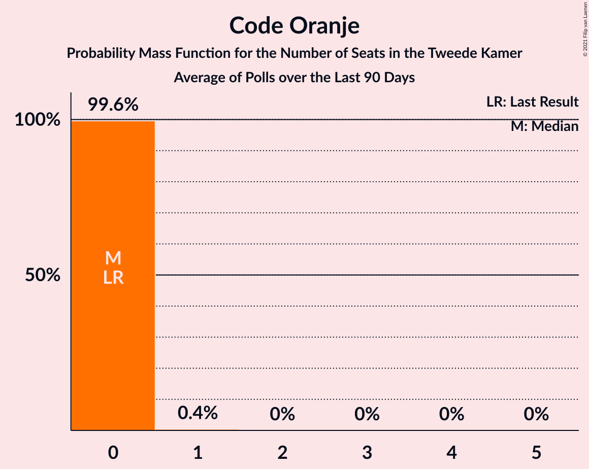

# Poll Average

<a href="#voting-intentions">Voting Intentions</a> | <a href="#seats">Seats</a> | <a href="#coalitions">Coalitions</a> | <a href="#technical-information">Technical Information</a>

## Summary

The table below lists the polls on which the average is based. They are the most recent polls (less than 90 days old) registered and analyzed so far.

| Period     | Polling firm/Commissioner(s) | VVD | D66 | PVV | CDA | SP | PvdA | GL | FvD | PvdD | CU | Volt | JA21 | SGP | DENK | 50+ | BBB | B1 | CO | Spl | PP | PvdT | BVNL |
|:----------:|:----------------------------:|:--:|:--:|:--:|:--:|:--:|:--:|:--:|:--:|:--:|:--:|:--:|:--:|:--:|:--:|:--:|:--:|:--:|:--:|:--:|:--:|:--:|:--:|
| 17 March 2021 | General Election | 21.9%   34 | 15.0%   24 | 10.8%   17 | 9.5%   15 | 6.0%   9 | 5.7%   9 | 5.2%   8 | 5.0%   8 | 3.8%   6 | 3.4%   5 | 2.4%   3 | 2.4%   3 | 2.1%   3 | 2.0%   3 | 1.0%   1 | 1.0%   1 | 0.8%   1 | 0.4%   0 | 0.3%   0 | 0.2%   0 | 0.0%   0 | 0.0%   0 |
| N/A | Poll Average | 16–23%   25–36 | 10–14%   15–23 | 7–12%   10–17 | 4–9%   5–15 | 4–7%   5–10 | 5–8%   8–13 | 5–9%   6–15 | 2–5%   3–9 | 3–7%   4–12 | 3–5%   4–8 | 2–5%   3–7 | 4–8%   6–12 | 1–3%   1–5 | 1–4%   1–5 | 0–2%   0–3 | 3–7%   5–11 | 0–2%   0–2 | N/A   N/A | N/A   N/A | N/A   N/A | N/A   N/A | 0–2%   0–2 |
| [8–11 April 2022](2022-04-11-IOResearch.html) | I&O Research | 16–19%   24–29 | 10–12%   15–20 | 7–9%   10–15 | 4–5%   5–8 | 5–6%   7–10 | 6–8%   8–13 | 7–10%   11–15 | 2–4%   3–5 | 5–6%   7–10 | 3–5%   5–8 | 2–4%   3–5 | 5–7%   8–11 | 2–3%   3–5 | 2–3%   2–5 | 1–2%   1–3 | 5–7%   6–11 | 1%   0–2 | N/A   N/A | N/A   N/A | N/A   N/A | N/A   N/A | 1–2%   1–2 |
| [8–9 April 2022](2022-04-09-Peilnl.html) | Peil.nl | 16–19%   25–28 | 11–13%   16–21 | 8–10%   14–16 | 5–6%   7–10 | 4–5%   6–8 | 6–8%   10–13 | 7–9%   11–13 | 2–3%   3–4 | 5–6%   6–9 | 4–5%   5–8 | 2–3%   3–5 | 6–8%   10–12 | 2–3%   3–5 | 2–3%   2–4 | 0–1%   0–2 | 6–8%   9–11 | 0–1%   0–1 | N/A   N/A | N/A   N/A | N/A   N/A | N/A   N/A | 0–1%   0–1 |
| [25–27 March 2022](2022-03-27-Ipsos.html) | Ipsos   EenVandaag | 18–23%   27–36 | 10–14%   16–24 | 8–11%   11–16 | 5–8%   7–10 | 3–6%   4–8 | 6–9%   8–13 | 5–8%   8–12 | 2–4%   2–6 | 5–8%   7–12 | 3–5%   4–8 | 2–4%   3–8 | 4–7%   6–10 | 2–4%   3–5 | 2–4%   3–5 | 0–2%   0–2 | 3–5%   5–8 | 0–2%   0–2 | N/A   N/A | N/A   N/A | N/A   N/A | N/A   N/A | N/A   N/A |
| [27–31 January 2022](2022-01-31-Kantar.html) | Kantar | 18–23%   27–33 | 11–15%   16–23 | 8–12%   13–18 | 6–9%   9–15 | 4–7%   6–13 | 5–8%   7–12 | 4–7%   6–13 | 3–6%   4–9 | 3–5%   3–7 | 3–5%   2–8 | 3–5%   4–7 | 5–8%   6–11 | 1–3%   1–5 | 1–2%   1–4 | 1–2%   1–3 | 4–6%   5–10 | 1–2%   0–3 | N/A   N/A | N/A   N/A | N/A   N/A | N/A   N/A | N/A   N/A |
| 17 March 2021 | General Election | 21.9%   34 | 15.0%   24 | 10.8%   17 | 9.5%   15 | 6.0%   9 | 5.7%   9 | 5.2%   8 | 5.0%   8 | 3.8%   6 | 3.4%   5 | 2.4%   3 | 2.4%   3 | 2.1%   3 | 2.0%   3 | 1.0%   1 | 1.0%   1 | 0.8%   1 | 0.4%   0 | 0.3%   0 | 0.2%   0 | 0.0%   0 | 0.0%   0 |

Only polls for which at least the sample size has been published are included in the table above.

**Legend:**
+ **Top half of each row:** Voting intentions (95% confidence interval)
+ **Bottom half of each row:** Seat projections for the Tweede Kamer (95% confidence interval)
+ **VVD:** Volkspartij voor Vrijheid en Democratie
+ **D66:** Democraten 66
+ **PVV:** Partij voor de Vrijheid
+ **CDA:** Christen-Democratisch Appèl
+ **SP:** Socialistische Partij
+ **PvdA:** Partij van de Arbeid
+ **GL:** GroenLinks
+ **FvD:** Forum voor Democratie
+ **PvdD:** Partij voor de Dieren
+ **CU:** ChristenUnie
+ **Volt:** Volt Europa
+ **JA21:** Juiste Antwoord 2021
+ **SGP:** Staatkundig Gereformeerde Partij
+ **DENK:** DENK
+ **50+:** 50Plus
+ **BBB:** BoerBurgerBeweging
+ **B1:** Bij1
+ **CO:** Code Oranje
+ **Spl:** Splinter
+ **PP:** Piratenpartij
+ **PvdT:** Partij voor de Toekomst
+ **BVNL:** Belang van Nederland
+ **N/A (single party):** Party not included the published results
+ **N/A (entire row):** Calculation for this opinion poll not started yet

## Voting Intentions

### Confidence Intervals

| Party | Last Result | Median | 80% Confidence Interval | 90% Confidence Interval | 95% Confidence Interval | 99% Confidence Interval |
|:-----:|:-----------:|:------:|:-----------------------:|:-----------------------:|:-----------------------:|:-----------------------:|
| <a href="#volkspartij-voor-vrijheid-en-democratie">Volkspartij voor Vrijheid en Democratie</a> | 21.9% | 18.7% | 16.8–21.7% |16.5–22.2% | 16.3–22.7% | 15.8–23.6% |
| <a href="#democraten-66">Democraten 66</a> | 15.0% | 11.9% | 10.7–13.4% |10.4–13.9% | 10.1–14.3% | 9.6–15.1% |
| <a href="#partij-voor-de-vrijheid">Partij voor de Vrijheid</a> | 10.8% | 9.2% | 7.8–10.7% |7.5–11.1% | 7.3–11.5% | 6.9–12.3% |
| <a href="#christen-democratisch-appèl">Christen-Democratisch Appèl</a> | 9.5% | 5.6% | 4.4–7.9% |4.1–8.4% | 3.9–8.7% | 3.6–9.5% |
| <a href="#socialistische-partij">Socialistische Partij</a> | 6.0% | 5.1% | 4.2–6.0% |4.0–6.3% | 3.8–6.6% | 3.4–7.2% |
| <a href="#partij-van-de-arbeid">Partij van de Arbeid</a> | 5.7% | 7.0% | 6.0–7.8% |5.7–8.1% | 5.4–8.3% | 4.9–8.8% |
| <a href="#groenlinks">GroenLinks</a> | 5.2% | 7.5% | 5.4–8.7% |5.0–9.0% | 4.7–9.3% | 4.3–9.7% |
| <a href="#forum-voor-democratie">Forum voor Democratie</a> | 5.0% | 2.9% | 2.4–4.3% |2.2–4.7% | 2.1–5.0% | 1.9–5.6% |
| <a href="#partij-voor-de-dieren">Partij voor de Dieren</a> | 3.8% | 5.3% | 3.5–6.4% |3.2–6.7% | 2.9–7.1% | 2.6–7.7% |
| <a href="#christenunie">ChristenUnie</a> | 3.4% | 4.2% | 3.2–4.9% |3.0–5.1% | 2.8–5.3% | 2.5–5.6% |
| <a href="#volt-europa">Volt Europa</a> | 2.4% | 3.0% | 2.5–4.1% |2.3–4.4% | 2.2–4.7% | 2.0–5.2% |
| <a href="#juiste-antwoord-2021">Juiste Antwoord 2021</a> | 2.4% | 6.2% | 5.0–7.5% |4.7–7.8% | 4.4–8.0% | 4.0–8.4% |
| <a href="#staatkundig-gereformeerde-partij">Staatkundig Gereformeerde Partij</a> | 2.1% | 2.5% | 1.6–3.1% |1.4–3.2% | 1.3–3.4% | 1.0–3.8% |
| <a href="#denk">DENK</a> | 2.0% | 2.1% | 1.5–3.2% |1.3–3.5% | 1.1–3.7% | 0.9–4.2% |
| <a href="#50plus">50Plus</a> | 1.0% | 1.1% | 0.6–1.7% |0.5–1.9% | 0.5–2.0% | 0.4–2.4% |
| <a href="#boerburgerbeweging">BoerBurgerBeweging</a> | 1.0% | 5.4% | 3.8–6.8% |3.5–7.1% | 3.3–7.3% | 2.9–7.7% |
| <a href="#bij1">Bij1</a> | 0.8% | 0.9% | 0.6–1.4% |0.5–1.6% | 0.5–1.8% | 0.4–2.1% |
| <a href="#code-oranje">Code Oranje</a> | 0.4% | N/A | N/A |N/A | N/A | N/A |
| <a href="#splinter">Splinter</a> | 0.3% | N/A | N/A |N/A | N/A | N/A |
| <a href="#piratenpartij">Piratenpartij</a> | 0.2% | N/A | N/A |N/A | N/A | N/A |
| <a href="#partij-voor-de-toekomst">Partij voor de Toekomst</a> | 0.0% | N/A | N/A |N/A | N/A | N/A |
| <a href="#belang-van-nederland">Belang van Nederland</a> | 0.0% | 1.0% | 0.6–1.5% |0.5–1.7% | 0.5–1.7% | 0.4–2.0% |

### Volkspartij voor Vrijheid en Democratie

*For a full overview of the results for this party, see the [Volkspartij voor Vrijheid en Democratie](party-volkspartijvoorvrijheidendemocratie.html) page.*

| Voting Intentions | Probability | Accumulated | Special Marks |
|:-----------------:|:-----------:|:-----------:|:-------------:|
| 13.5–14.5% | 0% | 100% |  |
| 14.5–15.5% | 0.2% | 100% |  |
| 15.5–16.5% | 5% | 99.8% |  |
| 16.5–17.5% | 22% | 95% |  |
| 17.5–18.5% | 21% | 73% |  |
| 18.5–19.5% | 12% | 52% | Median |
| 19.5–20.5% | 14% | 40% |  |
| 20.5–21.5% | 14% | 26% |  |
| 21.5–22.5% | 8% | 11% | Last Result |
| 22.5–23.5% | 3% | 3% |  |
| 23.5–24.5% | 0.5% | 0.6% |  |
| 24.5–25.5% | 0.1% | 0.1% |  |
| 25.5–26.5% | 0% | 0% |  |

### Democraten 66

*For a full overview of the results for this party, see the [Democraten 66](party-democraten66.html) page.*

| Voting Intentions | Probability | Accumulated | Special Marks |
|:-----------------:|:-----------:|:-----------:|:-------------:|
| 7.5–8.5% | 0% | 100% |  |
| 8.5–9.5% | 0.4% | 100% |  |
| 9.5–10.5% | 7% | 99.6% |  |
| 10.5–11.5% | 27% | 92% |  |
| 11.5–12.5% | 37% | 65% | Median |
| 12.5–13.5% | 20% | 28% |  |
| 13.5–14.5% | 7% | 8% |  |
| 14.5–15.5% | 1.3% | 1.5% | Last Result |
| 15.5–16.5% | 0.2% | 0.2% |  |
| 16.5–17.5% | 0% | 0% |  |

### Partij voor de Vrijheid

*For a full overview of the results for this party, see the [Partij voor de Vrijheid](party-partijvoordevrijheid.html) page.*

| Voting Intentions | Probability | Accumulated | Special Marks |
|:-----------------:|:-----------:|:-----------:|:-------------:|
| 5.5–6.5% | 0.1% | 100% |  |
| 6.5–7.5% | 5% | 99.9% |  |
| 7.5–8.5% | 22% | 95% |  |
| 8.5–9.5% | 35% | 73% | Median |
| 9.5–10.5% | 26% | 38% |  |
| 10.5–11.5% | 9% | 12% | Last Result |
| 11.5–12.5% | 2% | 2% |  |
| 12.5–13.5% | 0.3% | 0.3% |  |
| 13.5–14.5% | 0% | 0% |  |

### Christen-Democratisch Appèl

*For a full overview of the results for this party, see the [Christen-Democratisch Appèl](party-christen-democratischappèl.html) page.*

| Voting Intentions | Probability | Accumulated | Special Marks |
|:-----------------:|:-----------:|:-----------:|:-------------:|
| 1.5–2.5% | 0% | 100% |  |
| 2.5–3.5% | 0.3% | 100% |  |
| 3.5–4.5% | 15% | 99.7% |  |
| 4.5–5.5% | 32% | 85% |  |
| 5.5–6.5% | 23% | 52% | Median |
| 6.5–7.5% | 15% | 29% |  |
| 7.5–8.5% | 11% | 14% |  |
| 8.5–9.5% | 3% | 4% |  |
| 9.5–10.5% | 0.4% | 0.4% | Last Result |
| 10.5–11.5% | 0% | 0% |  |

### Socialistische Partij

*For a full overview of the results for this party, see the [Socialistische Partij](party-socialistischepartij.html) page.*

| Voting Intentions | Probability | Accumulated | Special Marks |
|:-----------------:|:-----------:|:-----------:|:-------------:|
| 1.5–2.5% | 0% | 100% |  |
| 2.5–3.5% | 0.9% | 100% |  |
| 3.5–4.5% | 22% | 99.1% |  |
| 4.5–5.5% | 51% | 77% | Median |
| 5.5–6.5% | 23% | 26% | Last Result |
| 6.5–7.5% | 3% | 3% |  |
| 7.5–8.5% | 0.1% | 0.1% |  |
| 8.5–9.5% | 0% | 0% |  |

### Partij van de Arbeid

*For a full overview of the results for this party, see the [Partij van de Arbeid](party-partijvandearbeid.html) page.*

| Voting Intentions | Probability | Accumulated | Special Marks |
|:-----------------:|:-----------:|:-----------:|:-------------:|
| 2.5–3.5% | 0% | 100% |  |
| 3.5–4.5% | 0.1% | 100% |  |
| 4.5–5.5% | 3% | 99.9% |  |
| 5.5–6.5% | 26% | 96% | Last Result |
| 6.5–7.5% | 51% | 71% | Median |
| 7.5–8.5% | 19% | 20% |  |
| 8.5–9.5% | 1.2% | 1.2% |  |
| 9.5–10.5% | 0% | 0% |  |
| 10.5–11.5% | 0% | 0% |  |

### GroenLinks

*For a full overview of the results for this party, see the [GroenLinks](party-groenlinks.html) page.*

| Voting Intentions | Probability | Accumulated | Special Marks |
|:-----------------:|:-----------:|:-----------:|:-------------:|
| 2.5–3.5% | 0% | 100% |  |
| 3.5–4.5% | 1.4% | 100% |  |
| 4.5–5.5% | 12% | 98.6% | Last Result |
| 5.5–6.5% | 21% | 87% |  |
| 6.5–7.5% | 19% | 66% | Median |
| 7.5–8.5% | 33% | 48% |  |
| 8.5–9.5% | 14% | 15% |  |
| 9.5–10.5% | 1.0% | 1.0% |  |
| 10.5–11.5% | 0% | 0% |  |

### Forum voor Democratie

*For a full overview of the results for this party, see the [Forum voor Democratie](party-forumvoordemocratie.html) page.*

| Voting Intentions | Probability | Accumulated | Special Marks |
|:-----------------:|:-----------:|:-----------:|:-------------:|
| 0.5–1.5% | 0% | 100% |  |
| 1.5–2.5% | 20% | 100% |  |
| 2.5–3.5% | 56% | 80% | Median |
| 3.5–4.5% | 18% | 24% |  |
| 4.5–5.5% | 6% | 7% | Last Result |
| 5.5–6.5% | 0.5% | 0.5% |  |
| 6.5–7.5% | 0% | 0% |  |

### Partij voor de Dieren

*For a full overview of the results for this party, see the [Partij voor de Dieren](party-partijvoordedieren.html) page.*

| Voting Intentions | Probability | Accumulated | Special Marks |
|:-----------------:|:-----------:|:-----------:|:-------------:|
| 0.5–1.5% | 0% | 100% |  |
| 1.5–2.5% | 0.5% | 100% |  |
| 2.5–3.5% | 10% | 99.5% |  |
| 3.5–4.5% | 14% | 89% | Last Result |
| 4.5–5.5% | 37% | 75% | Median |
| 5.5–6.5% | 31% | 38% |  |
| 6.5–7.5% | 6% | 7% |  |
| 7.5–8.5% | 0.7% | 0.8% |  |
| 8.5–9.5% | 0% | 0% |  |

### ChristenUnie

*For a full overview of the results for this party, see the [ChristenUnie](party-christenunie.html) page.*

| Voting Intentions | Probability | Accumulated | Special Marks |
|:-----------------:|:-----------:|:-----------:|:-------------:|
| 0.5–1.5% | 0% | 100% |  |
| 1.5–2.5% | 0.6% | 100% |  |
| 2.5–3.5% | 20% | 99.4% | Last Result |
| 3.5–4.5% | 53% | 80% | Median |
| 4.5–5.5% | 26% | 27% |  |
| 5.5–6.5% | 0.7% | 0.7% |  |
| 6.5–7.5% | 0% | 0% |  |

### Volt Europa

*For a full overview of the results for this party, see the [Volt Europa](party-volteuropa.html) page.*

| Voting Intentions | Probability | Accumulated | Special Marks |
|:-----------------:|:-----------:|:-----------:|:-------------:|
| 0.5–1.5% | 0% | 100% |  |
| 1.5–2.5% | 15% | 100% | Last Result |
| 2.5–3.5% | 62% | 85% | Median |
| 3.5–4.5% | 20% | 24% |  |
| 4.5–5.5% | 3% | 3% |  |
| 5.5–6.5% | 0.2% | 0.2% |  |
| 6.5–7.5% | 0% | 0% |  |

### Juiste Antwoord 2021

*For a full overview of the results for this party, see the [Juiste Antwoord 2021](party-juisteantwoord2021.html) page.*

| Voting Intentions | Probability | Accumulated | Special Marks |
|:-----------------:|:-----------:|:-----------:|:-------------:|
| 1.5–2.5% | 0% | 100% | Last Result |
| 2.5–3.5% | 0.1% | 100% |  |
| 3.5–4.5% | 4% | 99.9% |  |
| 4.5–5.5% | 22% | 96% |  |
| 5.5–6.5% | 38% | 74% | Median |
| 6.5–7.5% | 27% | 36% |  |
| 7.5–8.5% | 9% | 9% |  |
| 8.5–9.5% | 0.2% | 0.2% |  |
| 9.5–10.5% | 0% | 0% |  |

### Staatkundig Gereformeerde Partij

*For a full overview of the results for this party, see the [Staatkundig Gereformeerde Partij](party-staatkundiggereformeerdepartij.html) page.*

| Voting Intentions | Probability | Accumulated | Special Marks |
|:-----------------:|:-----------:|:-----------:|:-------------:|
| 0.0–0.5% | 0% | 100% |  |
| 0.5–1.5% | 8% | 100% |  |
| 1.5–2.5% | 48% | 92% | Last Result, Median |
| 2.5–3.5% | 43% | 44% |  |
| 3.5–4.5% | 1.3% | 1.3% |  |
| 4.5–5.5% | 0% | 0% |  |

### DENK

*For a full overview of the results for this party, see the [DENK](party-denk.html) page.*

| Voting Intentions | Probability | Accumulated | Special Marks |
|:-----------------:|:-----------:|:-----------:|:-------------:|
| 0.0–0.5% | 0% | 100% |  |
| 0.5–1.5% | 13% | 100% |  |
| 1.5–2.5% | 61% | 87% | Last Result, Median |
| 2.5–3.5% | 22% | 26% |  |
| 3.5–4.5% | 4% | 4% |  |
| 4.5–5.5% | 0.1% | 0.1% |  |
| 5.5–6.5% | 0% | 0% |  |

### 50Plus

*For a full overview of the results for this party, see the [50Plus](party-50plus.html) page.*

| Voting Intentions | Probability | Accumulated | Special Marks |
|:-----------------:|:-----------:|:-----------:|:-------------:|
| 0.0–0.5% | 7% | 100% |  |
| 0.5–1.5% | 78% | 93% | Last Result, Median |
| 1.5–2.5% | 15% | 15% |  |
| 2.5–3.5% | 0.2% | 0.2% |  |
| 3.5–4.5% | 0% | 0% |  |

### BoerBurgerBeweging

*For a full overview of the results for this party, see the [BoerBurgerBeweging](party-boerburgerbeweging.html) page.*

| Voting Intentions | Probability | Accumulated | Special Marks |
|:-----------------:|:-----------:|:-----------:|:-------------:|
| 0.5–1.5% | 0% | 100% | Last Result |
| 1.5–2.5% | 0% | 100% |  |
| 2.5–3.5% | 5% | 100% |  |
| 3.5–4.5% | 22% | 95% |  |
| 4.5–5.5% | 27% | 73% | Median |
| 5.5–6.5% | 29% | 47% |  |
| 6.5–7.5% | 16% | 17% |  |
| 7.5–8.5% | 0.9% | 0.9% |  |
| 8.5–9.5% | 0% | 0% |  |

### Bij1

*For a full overview of the results for this party, see the [Bij1](party-bij1.html) page.*

| Voting Intentions | Probability | Accumulated | Special Marks |
|:-----------------:|:-----------:|:-----------:|:-------------:|
| 0.0–0.5% | 6% | 100% |  |
| 0.5–1.5% | 87% | 94% | Last Result, Median |
| 1.5–2.5% | 6% | 6% |  |
| 2.5–3.5% | 0.1% | 0.1% |  |
| 3.5–4.5% | 0% | 0% |  |

### Belang van Nederland

*For a full overview of the results for this party, see the [Belang van Nederland](party-belangvannederland.html) page.*

| Voting Intentions | Probability | Accumulated | Special Marks |
|:-----------------:|:-----------:|:-----------:|:-------------:|
| 0.0–0.5% | 8% | 100% | Last Result |
| 0.5–1.5% | 83% | 92% | Median |
| 1.5–2.5% | 9% | 9% |  |
| 2.5–3.5% | 0% | 0% |  |

## Seats

### Confidence Intervals

| Party | Last Result | Median | 80% Confidence Interval | 90% Confidence Interval | 95% Confidence Interval | 99% Confidence Interval |
|:-----:|:-----------:|:------:|:-----------------------:|:-----------------------:|:-----------------------:|:-----------------------:|
| <a href="#volkspartij-voor-vrijheid-en-democratie">Volkspartij voor Vrijheid en Democratie</a> | 34 | 28 | 26–36 |26–36 | 25–36 | 24–37 |
| <a href="#democraten-66">Democraten 66</a> | 24 | 19 | 16–21 |15–22 | 15–23 | 14–24 |
| <a href="#partij-voor-de-vrijheid">Partij voor de Vrijheid</a> | 17 | 15 | 12–16 |11–16 | 10–17 | 10–18 |
| <a href="#christen-democratisch-appèl">Christen-Democratisch Appèl</a> | 15 | 8 | 6–14 |5–15 | 5–15 | 5–15 |
| <a href="#socialistische-partij">Socialistische Partij</a> | 9 | 7 | 6–9 |5–9 | 5–10 | 4–13 |
| <a href="#partij-van-de-arbeid">Partij van de Arbeid</a> | 9 | 10 | 8–13 |8–13 | 8–13 | 7–14 |
| <a href="#groenlinks">GroenLinks</a> | 8 | 12 | 8–13 |7–14 | 6–15 | 6–15 |
| <a href="#forum-voor-democratie">Forum voor Democratie</a> | 8 | 4 | 3–8 |3–9 | 3–9 | 2–9 |
| <a href="#partij-voor-de-dieren">Partij voor de Dieren</a> | 6 | 7 | 5–10 |4–12 | 4–12 | 3–12 |
| <a href="#christenunie">ChristenUnie</a> | 5 | 6 | 4–8 |4–8 | 4–8 | 2–8 |
| <a href="#volt-europa">Volt Europa</a> | 3 | 4 | 4–5 |3–6 | 3–7 | 3–8 |
| <a href="#juiste-antwoord-2021">Juiste Antwoord 2021</a> | 3 | 9 | 7–12 |7–12 | 6–12 | 6–13 |
| <a href="#staatkundig-gereformeerde-partij">Staatkundig Gereformeerde Partij</a> | 3 | 3 | 2–4 |1–5 | 1–5 | 1–5 |
| <a href="#denk">DENK</a> | 3 | 3 | 1–5 |1–5 | 1–5 | 1–5 |
| <a href="#50plus">50Plus</a> | 1 | 1 | 0–3 |0–3 | 0–3 | 0–3 |
| <a href="#boerburgerbeweging">BoerBurgerBeweging</a> | 1 | 8 | 6–10 |5–10 | 5–11 | 4–11 |
| <a href="#bij1">Bij1</a> | 1 | 1 | 0–2 |0–2 | 0–2 | 0–3 |
| <a href="#code-oranje">Code Oranje</a> | 0 | N/A | N/A |N/A | N/A | N/A |
| <a href="#splinter">Splinter</a> | 0 | N/A | N/A |N/A | N/A | N/A |
| <a href="#piratenpartij">Piratenpartij</a> | 0 | N/A | N/A |N/A | N/A | N/A |
| <a href="#partij-voor-de-toekomst">Partij voor de Toekomst</a> | 0 | N/A | N/A |N/A | N/A | N/A |
| <a href="#belang-van-nederland">Belang van Nederland</a> | 0 | 1 | 0–2 |0–2 | 0–2 | 0–3 |

### Volkspartij voor Vrijheid en Democratie

*For a full overview of the results for this party, see the [Volkspartij voor Vrijheid en Democratie](party-volkspartijvoorvrijheidendemocratie.html) page.*

| Number of Seats | Probability | Accumulated | Special Marks |
|:---------------:|:-----------:|:-----------:|:-------------:|
| 22 | 0.2% | 100% |  |
| 23 | 0.1% | 99.8% |  |
| 24 | 0.7% | 99.7% |  |
| 25 | 3% | 99.0% |  |
| 26 | 16% | 96% |  |
| 27 | 22% | 80% |  |
| 28 | 8% | 58% | Median |
| 29 | 16% | 50% |  |
| 30 | 9% | 34% |  |
| 31 | 4% | 25% |  |
| 32 | 4% | 21% |  |
| 33 | 6% | 18% |  |
| 34 | 0.3% | 12% | Last Result |
| 35 | 0.2% | 11% |  |
| 36 | 11% | 11% |  |
| 37 | 0.4% | 0.6% |  |
| 38 | 0.1% | 0.2% |  |
| 39 | 0% | 0.1% |  |
| 40 | 0% | 0.1% |  |
| 41 | 0.1% | 0.1% |  |
| 42 | 0% | 0% |  |

### Democraten 66

*For a full overview of the results for this party, see the [Democraten 66](party-democraten66.html) page.*

| Number of Seats | Probability | Accumulated | Special Marks |
|:---------------:|:-----------:|:-----------:|:-------------:|
| 14 | 0.6% | 100% |  |
| 15 | 6% | 99.4% |  |
| 16 | 20% | 94% |  |
| 17 | 11% | 74% |  |
| 18 | 4% | 63% |  |
| 19 | 30% | 60% | Median |
| 20 | 16% | 29% |  |
| 21 | 4% | 13% |  |
| 22 | 6% | 9% |  |
| 23 | 1.3% | 4% |  |
| 24 | 2% | 2% | Last Result |
| 25 | 0% | 0% |  |

### Partij voor de Vrijheid

*For a full overview of the results for this party, see the [Partij voor de Vrijheid](party-partijvoordevrijheid.html) page.*

| Number of Seats | Probability | Accumulated | Special Marks |
|:---------------:|:-----------:|:-----------:|:-------------:|
| 10 | 3% | 100% |  |
| 11 | 6% | 97% |  |
| 12 | 12% | 91% |  |
| 13 | 5% | 79% |  |
| 14 | 19% | 74% |  |
| 15 | 25% | 55% | Median |
| 16 | 27% | 30% |  |
| 17 | 1.2% | 3% | Last Result |
| 18 | 2% | 2% |  |
| 19 | 0.1% | 0.2% |  |
| 20 | 0% | 0% |  |

### Christen-Democratisch Appèl

*For a full overview of the results for this party, see the [Christen-Democratisch Appèl](party-christen-democratischappèl.html) page.*

| Number of Seats | Probability | Accumulated | Special Marks |
|:---------------:|:-----------:|:-----------:|:-------------:|
| 4 | 0.1% | 100% |  |
| 5 | 5% | 99.9% |  |
| 6 | 9% | 94% |  |
| 7 | 12% | 86% |  |
| 8 | 38% | 74% | Median |
| 9 | 7% | 36% |  |
| 10 | 8% | 29% |  |
| 11 | 2% | 21% |  |
| 12 | 2% | 19% |  |
| 13 | 0.9% | 17% |  |
| 14 | 9% | 17% |  |
| 15 | 7% | 7% | Last Result |
| 16 | 0.1% | 0.1% |  |
| 17 | 0% | 0% |  |

### Socialistische Partij

*For a full overview of the results for this party, see the [Socialistische Partij](party-socialistischepartij.html) page.*

| Number of Seats | Probability | Accumulated | Special Marks |
|:---------------:|:-----------:|:-----------:|:-------------:|
| 4 | 0.8% | 100% |  |
| 5 | 7% | 99.2% |  |
| 6 | 26% | 92% |  |
| 7 | 27% | 66% | Median |
| 8 | 25% | 39% |  |
| 9 | 10% | 14% | Last Result |
| 10 | 3% | 5% |  |
| 11 | 0.4% | 2% |  |
| 12 | 0.2% | 1.2% |  |
| 13 | 1.0% | 1.0% |  |
| 14 | 0% | 0% |  |

### Partij van de Arbeid

*For a full overview of the results for this party, see the [Partij van de Arbeid](party-partijvandearbeid.html) page.*

| Number of Seats | Probability | Accumulated | Special Marks |
|:---------------:|:-----------:|:-----------:|:-------------:|
| 6 | 0.1% | 100% |  |
| 7 | 2% | 99.9% |  |
| 8 | 18% | 98% |  |
| 9 | 14% | 80% | Last Result |
| 10 | 17% | 66% | Median |
| 11 | 28% | 50% |  |
| 12 | 5% | 21% |  |
| 13 | 16% | 16% |  |
| 14 | 0.6% | 0.6% |  |
| 15 | 0.1% | 0.1% |  |
| 16 | 0% | 0% |  |

### GroenLinks

*For a full overview of the results for this party, see the [GroenLinks](party-groenlinks.html) page.*

| Number of Seats | Probability | Accumulated | Special Marks |
|:---------------:|:-----------:|:-----------:|:-------------:|
| 6 | 3% | 100% |  |
| 7 | 7% | 97% |  |
| 8 | 20% | 90% | Last Result |
| 9 | 5% | 71% |  |
| 10 | 8% | 66% |  |
| 11 | 3% | 59% |  |
| 12 | 31% | 55% | Median |
| 13 | 15% | 24% |  |
| 14 | 4% | 8% |  |
| 15 | 4% | 4% |  |
| 16 | 0% | 0% |  |

### Forum voor Democratie

*For a full overview of the results for this party, see the [Forum voor Democratie](party-forumvoordemocratie.html) page.*

| Number of Seats | Probability | Accumulated | Special Marks |
|:---------------:|:-----------:|:-----------:|:-------------:|
| 2 | 2% | 100% |  |
| 3 | 16% | 98% |  |
| 4 | 48% | 82% | Median |
| 5 | 18% | 34% |  |
| 6 | 4% | 16% |  |
| 7 | 1.3% | 12% |  |
| 8 | 2% | 11% | Last Result |
| 9 | 9% | 9% |  |
| 10 | 0% | 0.1% |  |
| 11 | 0% | 0% |  |

### Partij voor de Dieren

*For a full overview of the results for this party, see the [Partij voor de Dieren](party-partijvoordedieren.html) page.*

| Number of Seats | Probability | Accumulated | Special Marks |
|:---------------:|:-----------:|:-----------:|:-------------:|
| 3 | 0.9% | 100% |  |
| 4 | 8% | 99.1% |  |
| 5 | 11% | 91% |  |
| 6 | 15% | 80% | Last Result |
| 7 | 17% | 65% | Median |
| 8 | 19% | 49% |  |
| 9 | 18% | 30% |  |
| 10 | 4% | 12% |  |
| 11 | 2% | 8% |  |
| 12 | 6% | 6% |  |
| 13 | 0.2% | 0.2% |  |
| 14 | 0% | 0% |  |

### ChristenUnie

*For a full overview of the results for this party, see the [ChristenUnie](party-christenunie.html) page.*

| Number of Seats | Probability | Accumulated | Special Marks |
|:---------------:|:-----------:|:-----------:|:-------------:|
| 2 | 0.8% | 100% |  |
| 3 | 0.2% | 99.2% |  |
| 4 | 14% | 99.0% |  |
| 5 | 15% | 85% | Last Result |
| 6 | 21% | 70% | Median |
| 7 | 34% | 49% |  |
| 8 | 14% | 15% |  |
| 9 | 0.3% | 0.3% |  |
| 10 | 0% | 0% |  |

### Volt Europa

*For a full overview of the results for this party, see the [Volt Europa](party-volteuropa.html) page.*

| Number of Seats | Probability | Accumulated | Special Marks |
|:---------------:|:-----------:|:-----------:|:-------------:|
| 3 | 8% | 100% | Last Result |
| 4 | 55% | 92% | Median |
| 5 | 27% | 37% |  |
| 6 | 6% | 10% |  |
| 7 | 2% | 4% |  |
| 8 | 2% | 2% |  |
| 9 | 0.1% | 0.1% |  |
| 10 | 0% | 0% |  |

### Juiste Antwoord 2021

*For a full overview of the results for this party, see the [Juiste Antwoord 2021](party-juisteantwoord2021.html) page.*

| Number of Seats | Probability | Accumulated | Special Marks |
|:---------------:|:-----------:|:-----------:|:-------------:|
| 3 | 0% | 100% | Last Result |
| 4 | 0% | 100% |  |
| 5 | 0.1% | 100% |  |
| 6 | 4% | 99.9% |  |
| 7 | 10% | 96% |  |
| 8 | 20% | 86% |  |
| 9 | 25% | 66% | Median |
| 10 | 14% | 41% |  |
| 11 | 5% | 27% |  |
| 12 | 21% | 22% |  |
| 13 | 0.7% | 0.8% |  |
| 14 | 0.1% | 0.1% |  |
| 15 | 0% | 0% |  |

### Staatkundig Gereformeerde Partij

*For a full overview of the results for this party, see the [Staatkundig Gereformeerde Partij](party-staatkundiggereformeerdepartij.html) page.*

| Number of Seats | Probability | Accumulated | Special Marks |
|:---------------:|:-----------:|:-----------:|:-------------:|
| 1 | 8% | 100% |  |
| 2 | 12% | 92% |  |
| 3 | 44% | 80% | Last Result, Median |
| 4 | 28% | 36% |  |
| 5 | 7% | 8% |  |
| 6 | 0.3% | 0.4% |  |
| 7 | 0.1% | 0.1% |  |
| 8 | 0% | 0% |  |

### DENK

*For a full overview of the results for this party, see the [DENK](party-denk.html) page.*

| Number of Seats | Probability | Accumulated | Special Marks |
|:---------------:|:-----------:|:-----------:|:-------------:|
| 1 | 12% | 100% |  |
| 2 | 18% | 88% |  |
| 3 | 37% | 69% | Last Result, Median |
| 4 | 21% | 33% |  |
| 5 | 11% | 11% |  |
| 6 | 0.3% | 0.3% |  |
| 7 | 0% | 0% |  |

### 50Plus

*For a full overview of the results for this party, see the [50Plus](party-50plus.html) page.*

| Number of Seats | Probability | Accumulated | Special Marks |
|:---------------:|:-----------:|:-----------:|:-------------:|
| 0 | 24% | 100% |  |
| 1 | 39% | 76% | Last Result, Median |
| 2 | 22% | 37% |  |
| 3 | 15% | 15% |  |
| 4 | 0.2% | 0.3% |  |
| 5 | 0.2% | 0.2% |  |
| 6 | 0% | 0% |  |

### BoerBurgerBeweging

*For a full overview of the results for this party, see the [BoerBurgerBeweging](party-boerburgerbeweging.html) page.*

| Number of Seats | Probability | Accumulated | Special Marks |
|:---------------:|:-----------:|:-----------:|:-------------:|
| 1 | 0% | 100% | Last Result |
| 2 | 0% | 100% |  |
| 3 | 0.1% | 100% |  |
| 4 | 0.5% | 99.9% |  |
| 5 | 6% | 99.4% |  |
| 6 | 24% | 93% |  |
| 7 | 13% | 70% |  |
| 8 | 13% | 57% | Median |
| 9 | 10% | 44% |  |
| 10 | 31% | 34% |  |
| 11 | 3% | 3% |  |
| 12 | 0.3% | 0.4% |  |
| 13 | 0.1% | 0.1% |  |
| 14 | 0% | 0% |  |

### Bij1

*For a full overview of the results for this party, see the [Bij1](party-bij1.html) page.*

| Number of Seats | Probability | Accumulated | Special Marks |
|:---------------:|:-----------:|:-----------:|:-------------:|
| 0 | 17% | 100% |  |
| 1 | 67% | 83% | Last Result, Median |
| 2 | 15% | 16% |  |
| 3 | 0.6% | 0.7% |  |
| 4 | 0% | 0% |  |

### Code Oranje

*For a full overview of the results for this party, see the [Code Oranje](party-codeoranje.html) page.*

### Splinter

*For a full overview of the results for this party, see the [Splinter](party-splinter.html) page.*

### Piratenpartij

*For a full overview of the results for this party, see the [Piratenpartij](party-piratenpartij.html) page.*

### Partij voor de Toekomst

*For a full overview of the results for this party, see the [Partij voor de Toekomst](party-partijvoordetoekomst.html) page.*

### Belang van Nederland

*For a full overview of the results for this party, see the [Belang van Nederland](party-belangvannederland.html) page.*

| Number of Seats | Probability | Accumulated | Special Marks |
|:---------------:|:-----------:|:-----------:|:-------------:|
| 0 | 26% | 100% | Last Result |
| 1 | 36% | 74% | Median |
| 2 | 37% | 38% |  |
| 3 | 0.9% | 1.0% |  |
| 4 | 0% | 0% |  |

## Coalitions

### Confidence Intervals

| Coalition | Last Result | Median | Majority? | 80% Confidence Interval | 90% Confidence Interval | 95% Confidence Interval | 99% Confidence Interval |
|:---------:|:-----------:|:------:|:---------:|:-----------------------:|:-----------------------:|:-----------------------:|:-----------------------:|
| Volkspartij voor Vrijheid en Democratie – Democraten 66 – Christen-Democratisch Appèl – Partij van de Arbeid – ChristenUnie | 87 | 72 | 34% | 66–79 | 66–83 | 65–83 | 61–83 |
| Volkspartij voor Vrijheid en Democratie – Democraten 66 – Christen-Democratisch Appèl – GroenLinks – ChristenUnie | 86 | 74 | 27% | 69–79 | 68–81 | 68–81 | 63–81 |
| Volkspartij voor Vrijheid en Democratie – Democraten 66 – Christen-Democratisch Appèl – ChristenUnie | 78 | 61 | 0% | 57–71 | 56–73 | 56–74 | 51–74 |
| Volkspartij voor Vrijheid en Democratie – Democraten 66 – Christen-Democratisch Appèl | 73 | 55 | 0% | 50–63 | 49–68 | 49–70 | 46–70 |
| Volkspartij voor Vrijheid en Democratie – Partij voor de Vrijheid – Christen-Democratisch Appèl – Forum voor Democratie – Staatkundig Gereformeerde Partij | 77 | 58 | 0% | 53–70 | 53–70 | 49–70 | 49–71 |
| Volkspartij voor Vrijheid en Democratie – Partij voor de Vrijheid – Christen-Democratisch Appèl – Forum voor Democratie | 74 | 54 | 0% | 50–67 | 49–68 | 45–68 | 45–68 |
| Democraten 66 – Christen-Democratisch Appèl – Socialistische Partij – Partij van de Arbeid – GroenLinks – ChristenUnie | 70 | 63 | 0% | 57–66 | 57–66 | 57–66 | 56–68 |
| Volkspartij voor Vrijheid en Democratie – Democraten 66 – Partij van de Arbeid | 67 | 57 | 0% | 53–64 | 52–64 | 52–65 | 50–66 |
| Volkspartij voor Vrijheid en Democratie – Partij voor de Vrijheid – Christen-Democratisch Appèl | 66 | 51 | 0% | 46–59 | 45–62 | 42–62 | 41–64 |
| Democraten 66 – Christen-Democratisch Appèl – Partij van de Arbeid – GroenLinks – ChristenUnie | 61 | 55 | 0% | 50–58 | 50–58 | 49–59 | 48–60 |
| Volkspartij voor Vrijheid en Democratie – Christen-Democratisch Appèl – Forum voor Democratie – Staatkundig Gereformeerde Partij – 50Plus | 61 | 45 | 0% | 42–57 | 41–57 | 41–57 | 40–57 |
| Volkspartij voor Vrijheid en Democratie – Christen-Democratisch Appèl – Partij van de Arbeid | 58 | 47 | 0% | 42–55 | 41–57 | 40–57 | 40–57 |
| Volkspartij voor Vrijheid en Democratie – Christen-Democratisch Appèl – Forum voor Democratie – Staatkundig Gereformeerde Partij | 60 | 44 | 0% | 41–54 | 39–54 | 39–55 | 38–55 |
| Volkspartij voor Vrijheid en Democratie – Christen-Democratisch Appèl – Forum voor Democratie – 50Plus | 58 | 42 | 0% | 39–55 | 37–55 | 37–55 | 36–55 |
| Volkspartij voor Vrijheid en Democratie – Christen-Democratisch Appèl – Forum voor Democratie | 57 | 40 | 0% | 38–52 | 36–53 | 35–53 | 34–53 |
| Volkspartij voor Vrijheid en Democratie – Christen-Democratisch Appèl | 49 | 36 | 0% | 33–44 | 32–48 | 31–48 | 30–48 |
| Volkspartij voor Vrijheid en Democratie – Partij van de Arbeid | 43 | 39 | 0% | 36–47 | 35–47 | 35–47 | 34–48 |
| Democraten 66 – Christen-Democratisch Appèl – Partij van de Arbeid | 48 | 38 | 0% | 33–43 | 32–46 | 31–46 | 31–46 |
| Democraten 66 – Christen-Democratisch Appèl | 39 | 27 | 0% | 24–34 | 22–36 | 22–37 | 21–37 |
| Christen-Democratisch Appèl – Partij van de Arbeid – ChristenUnie | 29 | 26 | 0% | 21–30 | 20–30 | 19–30 | 19–31 |
| Christen-Democratisch Appèl – Partij van de Arbeid | 24 | 19 | 0% | 15–23 | 14–24 | 14–24 | 14–24 |

### Volkspartij voor Vrijheid en Democratie – Democraten 66 – Christen-Democratisch Appèl – Partij van de Arbeid – ChristenUnie

| Number of Seats | Probability | Accumulated | Special Marks |
|:---------------:|:-----------:|:-----------:|:-------------:|
| 61 | 0.7% | 100% |  |
| 62 | 0.1% | 99.3% |  |
| 63 | 0.2% | 99.2% |  |
| 64 | 1.1% | 99.0% |  |
| 65 | 2% | 98% |  |
| 66 | 12% | 96% |  |
| 67 | 0.5% | 84% |  |
| 68 | 5% | 84% |  |
| 69 | 5% | 79% |  |
| 70 | 3% | 73% |  |
| 71 | 1.5% | 71% | Median |
| 72 | 22% | 69% |  |
| 73 | 7% | 48% |  |
| 74 | 4% | 41% |  |
| 75 | 3% | 37% |  |
| 76 | 3% | 34% | Majority |
| 77 | 2% | 31% |  |
| 78 | 10% | 29% |  |
| 79 | 11% | 19% |  |
| 80 | 0.5% | 8% |  |
| 81 | 2% | 8% |  |
| 82 | 0.3% | 5% |  |
| 83 | 5% | 5% |  |
| 84 | 0% | 0% |  |
| 85 | 0% | 0% |  |
| 86 | 0% | 0% |  |
| 87 | 0% | 0% | Last Result |

### Volkspartij voor Vrijheid en Democratie – Democraten 66 – Christen-Democratisch Appèl – GroenLinks – ChristenUnie

| Number of Seats | Probability | Accumulated | Special Marks |
|:---------------:|:-----------:|:-----------:|:-------------:|
| 63 | 0.6% | 100% |  |
| 64 | 0% | 99.4% |  |
| 65 | 0.3% | 99.4% |  |
| 66 | 0.6% | 99.1% |  |
| 67 | 1.0% | 98.5% |  |
| 68 | 6% | 98% |  |
| 69 | 4% | 91% |  |
| 70 | 12% | 87% |  |
| 71 | 15% | 75% |  |
| 72 | 2% | 60% |  |
| 73 | 7% | 58% | Median |
| 74 | 12% | 52% |  |
| 75 | 13% | 40% |  |
| 76 | 2% | 27% | Majority |
| 77 | 5% | 24% |  |
| 78 | 0.7% | 19% |  |
| 79 | 13% | 19% |  |
| 80 | 0.5% | 6% |  |
| 81 | 5% | 5% |  |
| 82 | 0% | 0.1% |  |
| 83 | 0% | 0% |  |
| 84 | 0% | 0% |  |
| 85 | 0% | 0% |  |
| 86 | 0% | 0% | Last Result |

### Volkspartij voor Vrijheid en Democratie – Democraten 66 – Christen-Democratisch Appèl – ChristenUnie

| Number of Seats | Probability | Accumulated | Special Marks |
|:---------------:|:-----------:|:-----------:|:-------------:|
| 51 | 0.6% | 100% |  |
| 52 | 0.2% | 99.4% |  |
| 53 | 0.2% | 99.2% |  |
| 54 | 0.3% | 99.0% |  |
| 55 | 0.9% | 98.7% |  |
| 56 | 7% | 98% |  |
| 57 | 4% | 91% |  |
| 58 | 11% | 87% |  |
| 59 | 13% | 76% |  |
| 60 | 7% | 63% |  |
| 61 | 12% | 56% | Median |
| 62 | 0.9% | 44% |  |
| 63 | 4% | 43% |  |
| 64 | 0.9% | 38% |  |
| 65 | 4% | 38% |  |
| 66 | 2% | 33% |  |
| 67 | 12% | 31% |  |
| 68 | 0.9% | 19% |  |
| 69 | 2% | 18% |  |
| 70 | 0.2% | 17% |  |
| 71 | 9% | 17% |  |
| 72 | 0% | 7% |  |
| 73 | 2% | 7% |  |
| 74 | 5% | 5% |  |
| 75 | 0% | 0% |  |
| 76 | 0% | 0% | Majority |
| 77 | 0% | 0% |  |
| 78 | 0% | 0% | Last Result |

### Volkspartij voor Vrijheid en Democratie – Democraten 66 – Christen-Democratisch Appèl

| Number of Seats | Probability | Accumulated | Special Marks |
|:---------------:|:-----------:|:-----------:|:-------------:|
| 46 | 0.8% | 100% |  |
| 47 | 0.5% | 99.2% |  |
| 48 | 0.6% | 98.7% |  |
| 49 | 5% | 98% |  |
| 50 | 4% | 93% |  |
| 51 | 8% | 89% |  |
| 52 | 2% | 81% |  |
| 53 | 15% | 79% |  |
| 54 | 13% | 64% |  |
| 55 | 6% | 51% | Median |
| 56 | 5% | 45% |  |
| 57 | 0.6% | 40% |  |
| 58 | 1.1% | 40% |  |
| 59 | 2% | 39% |  |
| 60 | 12% | 37% |  |
| 61 | 4% | 25% |  |
| 62 | 2% | 21% |  |
| 63 | 10% | 19% |  |
| 64 | 0.8% | 10% |  |
| 65 | 1.4% | 9% |  |
| 66 | 2% | 7% |  |
| 67 | 0.1% | 5% |  |
| 68 | 0.1% | 5% |  |
| 69 | 0% | 5% |  |
| 70 | 5% | 5% |  |
| 71 | 0% | 0% |  |
| 72 | 0% | 0% |  |
| 73 | 0% | 0% | Last Result |

### Volkspartij voor Vrijheid en Democratie – Partij voor de Vrijheid – Christen-Democratisch Appèl – Forum voor Democratie – Staatkundig Gereformeerde Partij

| Number of Seats | Probability | Accumulated | Special Marks |
|:---------------:|:-----------:|:-----------:|:-------------:|
| 49 | 3% | 100% |  |
| 50 | 0.3% | 97% |  |
| 51 | 0.5% | 97% |  |
| 52 | 1.3% | 96% |  |
| 53 | 7% | 95% |  |
| 54 | 5% | 89% |  |
| 55 | 2% | 83% |  |
| 56 | 6% | 81% |  |
| 57 | 23% | 75% |  |
| 58 | 4% | 52% | Median |
| 59 | 5% | 48% |  |
| 60 | 3% | 43% |  |
| 61 | 4% | 40% |  |
| 62 | 1.0% | 36% |  |
| 63 | 1.1% | 35% |  |
| 64 | 2% | 34% |  |
| 65 | 2% | 32% |  |
| 66 | 11% | 30% |  |
| 67 | 1.0% | 19% |  |
| 68 | 6% | 18% |  |
| 69 | 0.2% | 12% |  |
| 70 | 10% | 12% |  |
| 71 | 2% | 2% |  |
| 72 | 0.1% | 0.1% |  |
| 73 | 0% | 0% |  |
| 74 | 0% | 0% |  |
| 75 | 0% | 0% |  |
| 76 | 0% | 0% | Majority |
| 77 | 0% | 0% | Last Result |

### Volkspartij voor Vrijheid en Democratie – Partij voor de Vrijheid – Christen-Democratisch Appèl – Forum voor Democratie

| Number of Seats | Probability | Accumulated | Special Marks |
|:---------------:|:-----------:|:-----------:|:-------------:|
| 45 | 3% | 100% |  |
| 46 | 0.3% | 97% |  |
| 47 | 0.9% | 97% |  |
| 48 | 0.7% | 96% |  |
| 49 | 0.9% | 96% |  |
| 50 | 7% | 95% |  |
| 51 | 5% | 87% |  |
| 52 | 8% | 82% |  |
| 53 | 2% | 74% |  |
| 54 | 24% | 72% |  |
| 55 | 1.2% | 48% | Median |
| 56 | 5% | 47% |  |
| 57 | 5% | 42% |  |
| 58 | 0.3% | 37% |  |
| 59 | 1.5% | 37% |  |
| 60 | 2% | 35% |  |
| 61 | 0.5% | 33% |  |
| 62 | 10% | 33% |  |
| 63 | 2% | 23% |  |
| 64 | 2% | 21% |  |
| 65 | 0.3% | 18% |  |
| 66 | 3% | 18% |  |
| 67 | 6% | 15% |  |
| 68 | 9% | 9% |  |
| 69 | 0.3% | 0.3% |  |
| 70 | 0% | 0.1% |  |
| 71 | 0% | 0% |  |
| 72 | 0% | 0% |  |
| 73 | 0% | 0% |  |
| 74 | 0% | 0% | Last Result |

### Democraten 66 – Christen-Democratisch Appèl – Socialistische Partij – Partij van de Arbeid – GroenLinks – ChristenUnie

| Number of Seats | Probability | Accumulated | Special Marks |
|:---------------:|:-----------:|:-----------:|:-------------:|
| 54 | 0% | 100% |  |
| 55 | 0.4% | 99.9% |  |
| 56 | 2% | 99.6% |  |
| 57 | 10% | 98% |  |
| 58 | 12% | 88% |  |
| 59 | 4% | 75% |  |
| 60 | 6% | 71% |  |
| 61 | 3% | 65% |  |
| 62 | 9% | 62% | Median |
| 63 | 7% | 53% |  |
| 64 | 25% | 46% |  |
| 65 | 10% | 21% |  |
| 66 | 10% | 11% |  |
| 67 | 0.3% | 1.4% |  |
| 68 | 0.7% | 1.1% |  |
| 69 | 0.1% | 0.4% |  |
| 70 | 0.3% | 0.3% | Last Result |
| 71 | 0% | 0% |  |

### Volkspartij voor Vrijheid en Democratie – Democraten 66 – Partij van de Arbeid

| Number of Seats | Probability | Accumulated | Special Marks |
|:---------------:|:-----------:|:-----------:|:-------------:|
| 48 | 0.1% | 100% |  |
| 49 | 0% | 99.9% |  |
| 50 | 0.9% | 99.8% |  |
| 51 | 1.2% | 99.0% |  |
| 52 | 5% | 98% |  |
| 53 | 5% | 93% |  |
| 54 | 3% | 88% |  |
| 55 | 8% | 85% |  |
| 56 | 6% | 77% |  |
| 57 | 24% | 71% | Median |
| 58 | 12% | 47% |  |
| 59 | 11% | 34% |  |
| 60 | 0.7% | 23% |  |
| 61 | 1.1% | 23% |  |
| 62 | 0.2% | 22% |  |
| 63 | 10% | 21% |  |
| 64 | 8% | 12% |  |
| 65 | 2% | 4% |  |
| 66 | 1.0% | 1.2% |  |
| 67 | 0.1% | 0.2% | Last Result |
| 68 | 0% | 0.1% |  |
| 69 | 0.1% | 0.1% |  |
| 70 | 0% | 0% |  |

### Volkspartij voor Vrijheid en Democratie – Partij voor de Vrijheid – Christen-Democratisch Appèl

| Number of Seats | Probability | Accumulated | Special Marks |
|:---------------:|:-----------:|:-----------:|:-------------:|
| 41 | 2% | 100% |  |
| 42 | 0.3% | 98% |  |
| 43 | 0.9% | 97% |  |
| 44 | 0.8% | 96% |  |
| 45 | 0.8% | 95% |  |
| 46 | 10% | 95% |  |
| 47 | 5% | 84% |  |
| 48 | 7% | 80% |  |
| 49 | 0.5% | 73% |  |
| 50 | 22% | 73% |  |
| 51 | 3% | 50% | Median |
| 52 | 5% | 47% |  |
| 53 | 5% | 42% |  |
| 54 | 0.7% | 37% |  |
| 55 | 2% | 36% |  |
| 56 | 3% | 34% |  |
| 57 | 3% | 31% |  |
| 58 | 1.3% | 28% |  |
| 59 | 18% | 27% |  |
| 60 | 0.2% | 9% |  |
| 61 | 2% | 9% |  |
| 62 | 6% | 7% |  |
| 63 | 0% | 0.7% |  |
| 64 | 0.6% | 0.6% |  |
| 65 | 0% | 0% |  |
| 66 | 0% | 0% | Last Result |

### Democraten 66 – Christen-Democratisch Appèl – Partij van de Arbeid – GroenLinks – ChristenUnie

| Number of Seats | Probability | Accumulated | Special Marks |
|:---------------:|:-----------:|:-----------:|:-------------:|
| 46 | 0.2% | 100% |  |
| 47 | 0.1% | 99.8% |  |
| 48 | 1.0% | 99.7% |  |
| 49 | 2% | 98.6% |  |
| 50 | 13% | 97% |  |
| 51 | 7% | 84% |  |
| 52 | 2% | 77% |  |
| 53 | 16% | 75% |  |
| 54 | 7% | 59% |  |
| 55 | 4% | 52% | Median |
| 56 | 3% | 48% |  |
| 57 | 10% | 45% |  |
| 58 | 31% | 35% |  |
| 59 | 2% | 4% |  |
| 60 | 0.9% | 1.3% |  |
| 61 | 0.4% | 0.5% | Last Result |
| 62 | 0.1% | 0.1% |  |
| 63 | 0% | 0% |  |

### Volkspartij voor Vrijheid en Democratie – Christen-Democratisch Appèl – Forum voor Democratie – Staatkundig Gereformeerde Partij – 50Plus

| Number of Seats | Probability | Accumulated | Special Marks |
|:---------------:|:-----------:|:-----------:|:-------------:|
| 38 | 0.2% | 100% |  |
| 39 | 0.2% | 99.8% |  |
| 40 | 0.6% | 99.6% |  |
| 41 | 7% | 99.0% |  |
| 42 | 23% | 92% |  |
| 43 | 6% | 69% |  |
| 44 | 8% | 63% | Median |
| 45 | 7% | 55% |  |
| 46 | 2% | 48% |  |
| 47 | 3% | 46% |  |
| 48 | 6% | 43% |  |
| 49 | 2% | 37% |  |
| 50 | 2% | 35% |  |
| 51 | 10% | 33% |  |
| 52 | 3% | 23% |  |
| 53 | 2% | 20% |  |
| 54 | 1.1% | 18% |  |
| 55 | 0.1% | 17% |  |
| 56 | 5% | 17% |  |
| 57 | 11% | 12% |  |
| 58 | 0.2% | 0.4% |  |
| 59 | 0.1% | 0.2% |  |
| 60 | 0.1% | 0.1% |  |
| 61 | 0% | 0% | Last Result |

### Volkspartij voor Vrijheid en Democratie – Christen-Democratisch Appèl – Partij van de Arbeid

| Number of Seats | Probability | Accumulated | Special Marks |
|:---------------:|:-----------:|:-----------:|:-------------:|
| 39 | 0.2% | 100% |  |
| 40 | 3% | 99.8% |  |
| 41 | 2% | 97% |  |
| 42 | 6% | 95% |  |
| 43 | 2% | 89% |  |
| 44 | 10% | 87% |  |
| 45 | 6% | 78% |  |
| 46 | 11% | 72% | Median |
| 47 | 12% | 61% |  |
| 48 | 5% | 49% |  |
| 49 | 5% | 45% |  |
| 50 | 2% | 40% |  |
| 51 | 10% | 38% |  |
| 52 | 2% | 28% |  |
| 53 | 8% | 26% |  |
| 54 | 1.4% | 18% |  |
| 55 | 11% | 17% |  |
| 56 | 0.6% | 6% |  |
| 57 | 5% | 5% |  |
| 58 | 0.1% | 0.3% | Last Result |
| 59 | 0.1% | 0.1% |  |
| 60 | 0% | 0% |  |

### Volkspartij voor Vrijheid en Democratie – Christen-Democratisch Appèl – Forum voor Democratie – Staatkundig Gereformeerde Partij

| Number of Seats | Probability | Accumulated | Special Marks |
|:---------------:|:-----------:|:-----------:|:-------------:|
| 36 | 0.1% | 100% |  |
| 37 | 0.4% | 99.9% |  |
| 38 | 0.2% | 99.6% |  |
| 39 | 5% | 99.4% |  |
| 40 | 3% | 95% |  |
| 41 | 13% | 92% |  |
| 42 | 25% | 79% |  |
| 43 | 4% | 54% | Median |
| 44 | 3% | 51% |  |
| 45 | 3% | 48% |  |
| 46 | 3% | 45% |  |
| 47 | 5% | 42% |  |
| 48 | 3% | 37% |  |
| 49 | 2% | 34% |  |
| 50 | 1.0% | 32% |  |
| 51 | 12% | 31% |  |
| 52 | 2% | 19% |  |
| 53 | 0.4% | 18% |  |
| 54 | 15% | 17% |  |
| 55 | 2% | 3% |  |
| 56 | 0.1% | 0.3% |  |
| 57 | 0.1% | 0.2% |  |
| 58 | 0.1% | 0.1% |  |
| 59 | 0% | 0% |  |
| 60 | 0% | 0% | Last Result |

### Volkspartij voor Vrijheid en Democratie – Christen-Democratisch Appèl – Forum voor Democratie – 50Plus

| Number of Seats | Probability | Accumulated | Special Marks |
|:---------------:|:-----------:|:-----------:|:-------------:|
| 34 | 0.2% | 100% |  |
| 35 | 0.1% | 99.8% |  |
| 36 | 1.3% | 99.7% |  |
| 37 | 4% | 98% |  |
| 38 | 3% | 95% |  |
| 39 | 30% | 91% |  |
| 40 | 3% | 61% |  |
| 41 | 7% | 59% | Median |
| 42 | 4% | 52% |  |
| 43 | 4% | 48% |  |
| 44 | 1.3% | 44% |  |
| 45 | 6% | 42% |  |
| 46 | 2% | 36% |  |
| 47 | 10% | 34% |  |
| 48 | 2% | 25% |  |
| 49 | 2% | 23% |  |
| 50 | 2% | 21% |  |
| 51 | 2% | 19% |  |
| 52 | 2% | 18% |  |
| 53 | 0.8% | 15% |  |
| 54 | 0.3% | 14% |  |
| 55 | 14% | 14% |  |
| 56 | 0.2% | 0.3% |  |
| 57 | 0% | 0.1% |  |
| 58 | 0.1% | 0.1% | Last Result |
| 59 | 0% | 0% |  |

### Volkspartij voor Vrijheid en Democratie – Christen-Democratisch Appèl – Forum voor Democratie

| Number of Seats | Probability | Accumulated | Special Marks |
|:---------------:|:-----------:|:-----------:|:-------------:|
| 33 | 0.3% | 100% |  |
| 34 | 1.2% | 99.7% |  |
| 35 | 3% | 98.5% |  |
| 36 | 1.4% | 96% |  |
| 37 | 3% | 94% |  |
| 38 | 19% | 91% |  |
| 39 | 21% | 71% |  |
| 40 | 3% | 51% | Median |
| 41 | 0.9% | 48% |  |
| 42 | 4% | 47% |  |
| 43 | 1.4% | 43% |  |
| 44 | 6% | 42% |  |
| 45 | 2% | 36% |  |
| 46 | 1.2% | 34% |  |
| 47 | 10% | 32% |  |
| 48 | 2% | 23% |  |
| 49 | 2% | 21% |  |
| 50 | 4% | 19% |  |
| 51 | 0.9% | 15% |  |
| 52 | 9% | 14% |  |
| 53 | 5% | 5% |  |
| 54 | 0.1% | 0.3% |  |
| 55 | 0.1% | 0.2% |  |
| 56 | 0.1% | 0.1% |  |
| 57 | 0% | 0% | Last Result |

### Volkspartij voor Vrijheid en Democratie – Christen-Democratisch Appèl

| Number of Seats | Probability | Accumulated | Special Marks |
|:---------------:|:-----------:|:-----------:|:-------------:|
| 29 | 0.2% | 100% |  |
| 30 | 0.3% | 99.8% |  |
| 31 | 4% | 99.5% |  |
| 32 | 1.1% | 96% |  |
| 33 | 6% | 95% |  |
| 34 | 22% | 89% |  |
| 35 | 16% | 67% |  |
| 36 | 2% | 51% | Median |
| 37 | 3% | 49% |  |
| 38 | 4% | 47% |  |
| 39 | 2% | 43% |  |
| 40 | 7% | 41% |  |
| 41 | 2% | 34% |  |
| 42 | 3% | 33% |  |
| 43 | 11% | 29% |  |
| 44 | 10% | 18% |  |
| 45 | 2% | 9% |  |
| 46 | 1.3% | 7% |  |
| 47 | 0.1% | 5% |  |
| 48 | 5% | 5% |  |
| 49 | 0% | 0.1% | Last Result |
| 50 | 0% | 0.1% |  |
| 51 | 0.1% | 0.1% |  |
| 52 | 0% | 0% |  |

### Volkspartij voor Vrijheid en Democratie – Partij van de Arbeid

| Number of Seats | Probability | Accumulated | Special Marks |
|:---------------:|:-----------:|:-----------:|:-------------:|
| 32 | 0.2% | 100% |  |
| 33 | 0.2% | 99.8% |  |
| 34 | 1.0% | 99.6% |  |
| 35 | 6% | 98.6% |  |
| 36 | 7% | 93% |  |
| 37 | 20% | 86% |  |
| 38 | 16% | 66% | Median |
| 39 | 17% | 50% |  |
| 40 | 5% | 33% |  |
| 41 | 2% | 28% |  |
| 42 | 7% | 27% |  |
| 43 | 6% | 19% | Last Result |
| 44 | 2% | 13% |  |
| 45 | 0.3% | 11% |  |
| 46 | 0.8% | 11% |  |
| 47 | 9% | 10% |  |
| 48 | 2% | 2% |  |
| 49 | 0.1% | 0.2% |  |
| 50 | 0.1% | 0.1% |  |
| 51 | 0% | 0% |  |

### Democraten 66 – Christen-Democratisch Appèl – Partij van de Arbeid

| Number of Seats | Probability | Accumulated | Special Marks |
|:---------------:|:-----------:|:-----------:|:-------------:|
| 30 | 0.2% | 100% |  |
| 31 | 3% | 99.8% |  |
| 32 | 5% | 96% |  |
| 33 | 5% | 91% |  |
| 34 | 7% | 86% |  |
| 35 | 13% | 78% |  |
| 36 | 7% | 65% |  |
| 37 | 4% | 59% | Median |
| 38 | 12% | 54% |  |
| 39 | 7% | 42% |  |
| 40 | 12% | 34% |  |
| 41 | 2% | 22% |  |
| 42 | 9% | 20% |  |
| 43 | 2% | 11% |  |
| 44 | 2% | 9% |  |
| 45 | 0.5% | 6% |  |
| 46 | 6% | 6% |  |
| 47 | 0% | 0% |  |
| 48 | 0% | 0% | Last Result |

### Democraten 66 – Christen-Democratisch Appèl

| Number of Seats | Probability | Accumulated | Special Marks |
|:---------------:|:-----------:|:-----------:|:-------------:|
| 20 | 0.4% | 100% |  |
| 21 | 1.2% | 99.6% |  |
| 22 | 7% | 98% |  |
| 23 | 1.2% | 92% |  |
| 24 | 17% | 90% |  |
| 25 | 12% | 73% |  |
| 26 | 8% | 62% |  |
| 27 | 24% | 53% | Median |
| 28 | 0.6% | 30% |  |
| 29 | 3% | 29% |  |
| 30 | 4% | 26% |  |
| 31 | 0.9% | 21% |  |
| 32 | 3% | 21% |  |
| 33 | 0.6% | 18% |  |
| 34 | 10% | 17% |  |
| 35 | 0.6% | 8% |  |
| 36 | 2% | 7% |  |
| 37 | 5% | 5% |  |
| 38 | 0% | 0% |  |
| 39 | 0% | 0% | Last Result |

### Christen-Democratisch Appèl – Partij van de Arbeid – ChristenUnie

| Number of Seats | Probability | Accumulated | Special Marks |
|:---------------:|:-----------:|:-----------:|:-------------:|
| 19 | 4% | 100% |  |
| 20 | 4% | 96% |  |
| 21 | 3% | 92% |  |
| 22 | 4% | 89% |  |
| 23 | 5% | 85% |  |
| 24 | 11% | 80% | Median |
| 25 | 8% | 68% |  |
| 26 | 24% | 60% |  |
| 27 | 17% | 36% |  |
| 28 | 6% | 19% |  |
| 29 | 1.0% | 13% | Last Result |
| 30 | 11% | 12% |  |
| 31 | 0.6% | 0.9% |  |
| 32 | 0.2% | 0.3% |  |
| 33 | 0% | 0.1% |  |
| 34 | 0.1% | 0.1% |  |
| 35 | 0% | 0% |  |

### Christen-Democratisch Appèl – Partij van de Arbeid

| Number of Seats | Probability | Accumulated | Special Marks |
|:---------------:|:-----------:|:-----------:|:-------------:|
| 14 | 9% | 100% |  |
| 15 | 2% | 91% |  |
| 16 | 2% | 89% |  |
| 17 | 10% | 87% |  |
| 18 | 9% | 77% | Median |
| 19 | 28% | 68% |  |
| 20 | 2% | 40% |  |
| 21 | 13% | 38% |  |
| 22 | 10% | 24% |  |
| 23 | 8% | 14% |  |
| 24 | 5% | 6% | Last Result |
| 25 | 0.2% | 0.4% |  |
| 26 | 0.1% | 0.2% |  |
| 27 | 0.1% | 0.1% |  |
| 28 | 0% | 0% |  |

## Technical Information

+ **Number of polls included in this average:** 4
+ **Lowest number of simulations done in a poll included in this average:** 1,048,576
+ **Total number of simulations done in the polls included in this average:** 4,194,304
+ **Error estimate:** 3.73%
