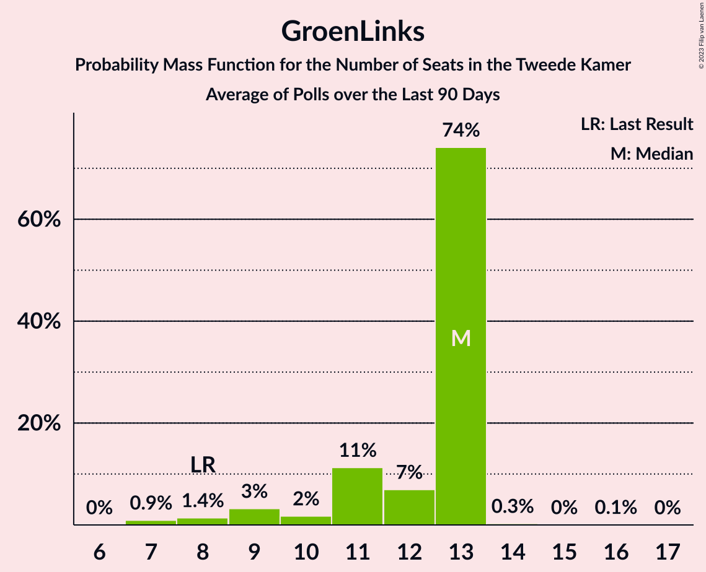
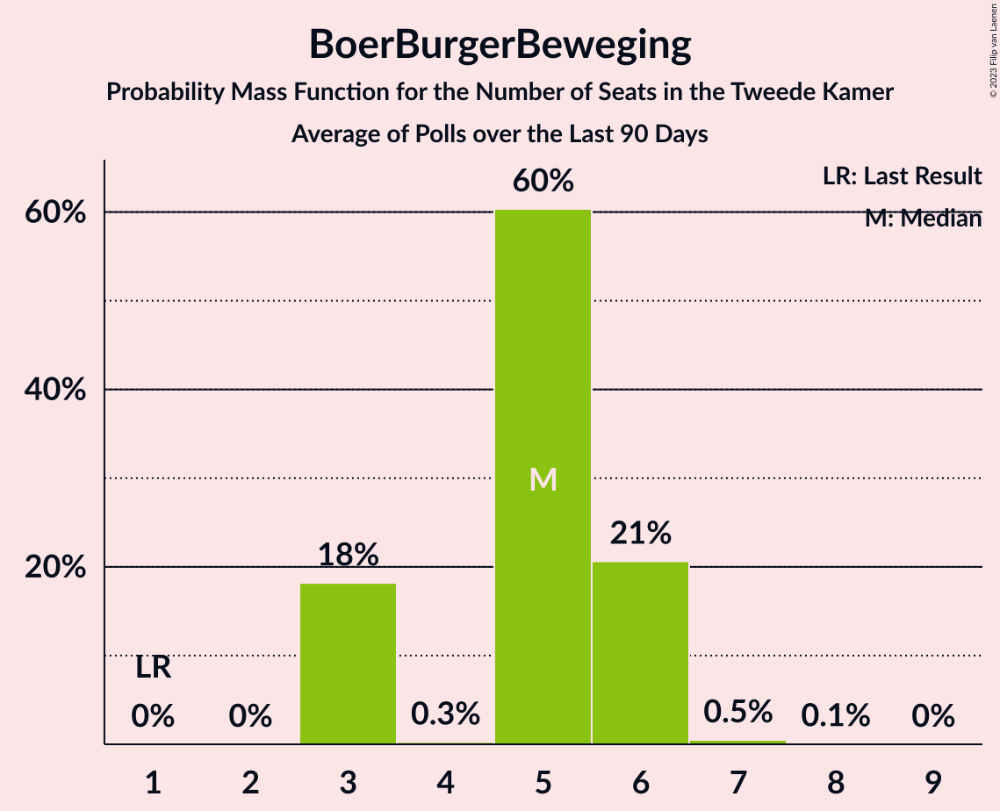

# Poll Average

<a href="#voting-intentions">Voting Intentions</a> | <a href="#seats">Seats</a> | <a href="#coalitions">Coalitions</a> | <a href="#technical-information">Technical Information</a>

## Summary

The table below lists the polls on which the average is based. They are the most recent polls (less than 90 days old) registered and analyzed so far.

| Period     | Polling firm/Commissioner(s) | VVD | D66 | PVV | CDA | SP | PvdA | GL | FvD | PvdD | CU | Volt | JA21 | SGP | DENK | 50+ | BBB | B1 | CO | Spl | PP | PvdT | BVNL |
|:----------:|:----------------------------:|:--:|:--:|:--:|:--:|:--:|:--:|:--:|:--:|:--:|:--:|:--:|:--:|:--:|:--:|:--:|:--:|:--:|:--:|:--:|:--:|:--:|:--:|
| 17 March 2021 | General Election | 21.9%   34 | 15.0%   24 | 10.8%   17 | 9.5%   15 | 6.0%   9 | 5.7%   9 | 5.2%   8 | 5.0%   8 | 3.8%   6 | 3.4%   5 | 2.4%   3 | 2.4%   3 | 2.1%   3 | 2.0%   3 | 1.0%   1 | 1.0%   1 | 0.8%   1 | 0.4%   0 | 0.3%   0 | 0.2%   0 | 0.0%   0 | 0.0%   0 |
| N/A | Poll Average | 14–21%   22–31 | 10–14%   17–20 | 9–12%   14–20 | 3–7%   5–10 | 4–6%   5–9 | 5–8%   8–12 | 5–8%   8–11 | 3–5%   5–7 | 4–7%   8–11 | 3–5%   3–8 | 4–7%   5–11 | 4–9%   6–14 | 2–4%   3–5 | 1–3%   2–5 | 0–2%   1–2 | 4–6%   6–9 | 0–2%   1–2 | N/A   N/A | N/A   N/A | N/A   N/A | N/A   N/A | 0–1%   0–1 |
| [11–14 February 2022](2022-02-14-IOResearch.html) | I&O Research | 15–18%   26–28 | 11–13%   19 | 9–12%   15–16 | 3–5%   5–6 | 4–6%   6–7 | 5–7%   10 | 6–8%   11 | 2–4%   4–6 | 4–6%   7–8 | 3–5%   6 | 5–7%   7–9 | 5–7%   8–9 | 2–4%   4 | 1–2%   2 | 1–2%   1–2 | 5–7%   8–9 | 1–2%   1–2 | N/A   N/A | N/A   N/A | N/A   N/A | N/A   N/A | 1%   1 |
| [11–12 February 2022](2022-02-12-Peilnl.html) | Peil.nl | 13–16%   22 | 11–14%   19 | 9–11%   15 | 3–5%   5 | 5–6%   9 | 5–7%   9 | 5–7%   8 | 4–5%   7 | 5–7%   10 | 3–4%   5 | 6–8%   9 | 8–10%   14 | 2–3%   3 | 2–3%   4 | 0–1%   1 | 5–6%   9 | 0–1%   1 | N/A   N/A | N/A   N/A | N/A   N/A | N/A   N/A | 0–1%   0 |
| [27–31 January 2022](2022-01-31-Kantar.html) | Kantar | N/A   N/A | N/A   N/A | N/A   N/A | N/A   N/A | N/A   N/A | N/A   N/A | N/A   N/A | N/A   N/A | N/A   N/A | N/A   N/A | N/A   N/A | N/A   N/A | N/A   N/A | N/A   N/A | N/A   N/A | N/A   N/A | N/A   N/A | N/A   N/A | N/A   N/A | N/A   N/A | N/A   N/A | N/A   N/A |
| [21–24 January 2022](2022-01-24-Ipsos.html) | Ipsos   EenVandaag | 17–22%   25–32 | 10–14%   15–20 | 9–13%   13–21 | 5–8%   7–10 | 3–6%   5–10 | 5–8%   7–12 | 5–9%   9–13 | 3–6%   5–8 | 5–8%   8–11 | 2–5%   3–8 | 4–6%   5–11 | 3–6%   5–8 | 2–4%   2–7 | 2–3%   2–5 | 0–2%   0–2 | 4–6%   5–9 | 0–2%   0–2 | N/A   N/A | N/A   N/A | N/A   N/A | N/A   N/A | N/A   N/A |
| 17 March 2021 | General Election | 21.9%   34 | 15.0%   24 | 10.8%   17 | 9.5%   15 | 6.0%   9 | 5.7%   9 | 5.2%   8 | 5.0%   8 | 3.8%   6 | 3.4%   5 | 2.4%   3 | 2.4%   3 | 2.1%   3 | 2.0%   3 | 1.0%   1 | 1.0%   1 | 0.8%   1 | 0.4%   0 | 0.3%   0 | 0.2%   0 | 0.0%   0 | 0.0%   0 |

Only polls for which at least the sample size has been published are included in the table above.

**Legend:**
+ **Top half of each row:** Voting intentions (95% confidence interval)
+ **Bottom half of each row:** Seat projections for the Tweede Kamer (95% confidence interval)
+ **VVD:** Volkspartij voor Vrijheid en Democratie
+ **D66:** Democraten 66
+ **PVV:** Partij voor de Vrijheid
+ **CDA:** Christen-Democratisch Appèl
+ **SP:** Socialistische Partij
+ **PvdA:** Partij van de Arbeid
+ **GL:** GroenLinks
+ **FvD:** Forum voor Democratie
+ **PvdD:** Partij voor de Dieren
+ **CU:** ChristenUnie
+ **Volt:** Volt Europa
+ **JA21:** Juiste Antwoord 2021
+ **SGP:** Staatkundig Gereformeerde Partij
+ **DENK:** DENK
+ **50+:** 50Plus
+ **BBB:** BoerBurgerBeweging
+ **B1:** Bij1
+ **CO:** Code Oranje
+ **Spl:** Splinter
+ **PP:** Piratenpartij
+ **PvdT:** Partij voor de Toekomst
+ **BVNL:** Belang van Nederland
+ **N/A (single party):** Party not included the published results
+ **N/A (entire row):** Calculation for this opinion poll not started yet

## Voting Intentions

### Confidence Intervals

| Party | Last Result | Median | 80% Confidence Interval | 90% Confidence Interval | 95% Confidence Interval | 99% Confidence Interval |
|:-----:|:-----------:|:------:|:-----------------------:|:-----------------------:|:-----------------------:|:-----------------------:|
| <a href="#volkspartij-voor-vrijheid-en-democratie">Volkspartij voor Vrijheid en Democratie</a> | 21.9% | 16.8% | 14.3–19.9% |14.0–20.6% | 13.7–21.1% | 13.3–22.0% |
| <a href="#democraten-66">Democraten 66</a> | 15.0% | 12.2% | 11.1–13.2% |10.7–13.5% | 10.4–13.8% | 9.8–14.3% |
| <a href="#partij-voor-de-vrijheid">Partij voor de Vrijheid</a> | 10.8% | 10.3% | 9.5–11.5% |9.2–11.9% | 9.0–12.3% | 8.6–13.0% |
| <a href="#christen-democratisch-appèl">Christen-Democratisch Appèl</a> | 9.5% | 4.2% | 3.6–6.4% |3.4–6.8% | 3.3–7.1% | 3.1–7.8% |
| <a href="#socialistische-partij">Socialistische Partij</a> | 6.0% | 5.0% | 4.1–5.7% |3.9–5.9% | 3.7–6.0% | 3.3–6.4% |
| <a href="#partij-van-de-arbeid">Partij van de Arbeid</a> | 5.7% | 6.2% | 5.5–7.1% |5.4–7.4% | 5.2–7.6% | 4.8–8.2% |
| <a href="#groenlinks">GroenLinks</a> | 5.2% | 6.6% | 5.7–7.6% |5.5–7.9% | 5.4–8.1% | 5.1–8.8% |
| <a href="#forum-voor-democratie">Forum voor Democratie</a> | 5.0% | 4.2% | 2.9–5.1% |2.7–5.3% | 2.6–5.4% | 2.3–5.8% |
| <a href="#partij-voor-de-dieren">Partij voor de Dieren</a> | 3.8% | 5.7% | 4.8–6.6% |4.6–6.9% | 4.5–7.2% | 4.2–7.8% |
| <a href="#christenunie">ChristenUnie</a> | 3.4% | 3.6% | 3.0–4.3% |2.8–4.5% | 2.7–4.7% | 2.4–5.0% |
| <a href="#volt-europa">Volt Europa</a> | 2.4% | 5.6% | 4.4–6.9% |4.1–7.2% | 3.8–7.4% | 3.4–7.7% |
| <a href="#juiste-antwoord-2021">Juiste Antwoord 2021</a> | 2.4% | 6.0% | 4.0–9.0% |3.7–9.2% | 3.5–9.4% | 3.1–9.8% |
| <a href="#staatkundig-gereformeerde-partij">Staatkundig Gereformeerde Partij</a> | 2.1% | 2.7% | 2.2–3.2% |2.1–3.4% | 1.9–3.5% | 1.7–3.9% |
| <a href="#denk">DENK</a> | 2.0% | 2.0% | 1.5–2.7% |1.4–2.9% | 1.3–3.2% | 1.1–3.6% |
| <a href="#50plus">50Plus</a> | 1.0% | 0.9% | 0.6–1.3% |0.5–1.5% | 0.5–1.6% | 0.4–1.8% |
| <a href="#boerburgerbeweging">BoerBurgerBeweging</a> | 1.0% | 5.3% | 4.4–6.0% |4.1–6.2% | 3.8–6.3% | 3.4–6.7% |
| <a href="#bij1">Bij1</a> | 0.8% | 0.9% | 0.6–1.4% |0.5–1.5% | 0.4–1.6% | 0.4–1.8% |
| <a href="#code-oranje">Code Oranje</a> | 0.4% | N/A | N/A |N/A | N/A | N/A |
| <a href="#splinter">Splinter</a> | 0.3% | N/A | N/A |N/A | N/A | N/A |
| <a href="#piratenpartij">Piratenpartij</a> | 0.2% | N/A | N/A |N/A | N/A | N/A |
| <a href="#partij-voor-de-toekomst">Partij voor de Toekomst</a> | 0.0% | N/A | N/A |N/A | N/A | N/A |
| <a href="#belang-van-nederland">Belang van Nederland</a> | 0.0% | 0.8% | 0.6–1.1% |0.5–1.2% | 0.5–1.3% | 0.4–1.5% |

### Volkspartij voor Vrijheid en Democratie

*For a full overview of the results for this party, see the [Volkspartij voor Vrijheid en Democratie](party-volkspartijvoorvrijheidendemocratie.html) page.*

| Voting Intentions | Probability | Accumulated | Special Marks |
|:-----------------:|:-----------:|:-----------:|:-------------:|
| 11.5–12.5% | 0% | 100% |  |
| 12.5–13.5% | 1.4% | 100% |  |
| 13.5–14.5% | 13% | 98.6% |  |
| 14.5–15.5% | 17% | 85% |  |
| 15.5–16.5% | 13% | 68% |  |
| 16.5–17.5% | 18% | 55% | Median |
| 17.5–18.5% | 12% | 37% |  |
| 18.5–19.5% | 11% | 25% |  |
| 19.5–20.5% | 9% | 14% |  |
| 20.5–21.5% | 4% | 5% |  |
| 21.5–22.5% | 1.0% | 1.2% | Last Result |
| 22.5–23.5% | 0.2% | 0.2% |  |
| 23.5–24.5% | 0% | 0% |  |

### Democraten 66

*For a full overview of the results for this party, see the [Democraten 66](party-democraten66.html) page.*

| Voting Intentions | Probability | Accumulated | Special Marks |
|:-----------------:|:-----------:|:-----------:|:-------------:|
| 7.5–8.5% | 0% | 100% |  |
| 8.5–9.5% | 0.2% | 100% |  |
| 9.5–10.5% | 3% | 99.7% |  |
| 10.5–11.5% | 19% | 97% |  |
| 11.5–12.5% | 43% | 77% | Median |
| 12.5–13.5% | 29% | 34% |  |
| 13.5–14.5% | 4% | 5% |  |
| 14.5–15.5% | 0.2% | 0.2% | Last Result |
| 15.5–16.5% | 0% | 0% |  |

### Partij voor de Vrijheid

*For a full overview of the results for this party, see the [Partij voor de Vrijheid](party-partijvoordevrijheid.html) page.*

| Voting Intentions | Probability | Accumulated | Special Marks |
|:-----------------:|:-----------:|:-----------:|:-------------:|
| 6.5–7.5% | 0% | 100% |  |
| 7.5–8.5% | 0.3% | 100% |  |
| 8.5–9.5% | 12% | 99.7% |  |
| 9.5–10.5% | 49% | 87% | Median |
| 10.5–11.5% | 30% | 39% | Last Result |
| 11.5–12.5% | 7% | 9% |  |
| 12.5–13.5% | 1.3% | 1.4% |  |
| 13.5–14.5% | 0.1% | 0.1% |  |
| 14.5–15.5% | 0% | 0% |  |

### Christen-Democratisch Appèl

*For a full overview of the results for this party, see the [Christen-Democratisch Appèl](party-christen-democratischappèl.html) page.*

| Voting Intentions | Probability | Accumulated | Special Marks |
|:-----------------:|:-----------:|:-----------:|:-------------:|
| 1.5–2.5% | 0% | 100% |  |
| 2.5–3.5% | 9% | 100% |  |
| 3.5–4.5% | 54% | 91% | Median |
| 4.5–5.5% | 13% | 38% |  |
| 5.5–6.5% | 17% | 25% |  |
| 6.5–7.5% | 7% | 8% |  |
| 7.5–8.5% | 0.9% | 0.9% |  |
| 8.5–9.5% | 0% | 0% |  |
| 9.5–10.5% | 0% | 0% | Last Result |

### Socialistische Partij

*For a full overview of the results for this party, see the [Socialistische Partij](party-socialistischepartij.html) page.*

| Voting Intentions | Probability | Accumulated | Special Marks |
|:-----------------:|:-----------:|:-----------:|:-------------:|
| 1.5–2.5% | 0% | 100% |  |
| 2.5–3.5% | 2% | 100% |  |
| 3.5–4.5% | 25% | 98% |  |
| 4.5–5.5% | 58% | 74% | Median |
| 5.5–6.5% | 15% | 15% | Last Result |
| 6.5–7.5% | 0.2% | 0.2% |  |
| 7.5–8.5% | 0% | 0% |  |

### Partij van de Arbeid

*For a full overview of the results for this party, see the [Partij van de Arbeid](party-partijvandearbeid.html) page.*

| Voting Intentions | Probability | Accumulated | Special Marks |
|:-----------------:|:-----------:|:-----------:|:-------------:|
| 2.5–3.5% | 0% | 100% |  |
| 3.5–4.5% | 0.1% | 100% |  |
| 4.5–5.5% | 10% | 99.9% |  |
| 5.5–6.5% | 61% | 90% | Last Result, Median |
| 6.5–7.5% | 26% | 29% |  |
| 7.5–8.5% | 3% | 3% |  |
| 8.5–9.5% | 0.2% | 0.2% |  |
| 9.5–10.5% | 0% | 0% |  |

### GroenLinks

*For a full overview of the results for this party, see the [GroenLinks](party-groenlinks.html) page.*

| Voting Intentions | Probability | Accumulated | Special Marks |
|:-----------------:|:-----------:|:-----------:|:-------------:|
| 3.5–4.5% | 0% | 100% |  |
| 4.5–5.5% | 6% | 100% | Last Result |
| 5.5–6.5% | 44% | 94% |  |
| 6.5–7.5% | 40% | 50% | Median |
| 7.5–8.5% | 10% | 11% |  |
| 8.5–9.5% | 0.8% | 0.9% |  |
| 9.5–10.5% | 0% | 0% |  |

### Forum voor Democratie

*For a full overview of the results for this party, see the [Forum voor Democratie](party-forumvoordemocratie.html) page.*

| Voting Intentions | Probability | Accumulated | Special Marks |
|:-----------------:|:-----------:|:-----------:|:-------------:|
| 0.5–1.5% | 0% | 100% |  |
| 1.5–2.5% | 2% | 100% |  |
| 2.5–3.5% | 32% | 98% |  |
| 3.5–4.5% | 34% | 66% | Median |
| 4.5–5.5% | 30% | 32% | Last Result |
| 5.5–6.5% | 2% | 2% |  |
| 6.5–7.5% | 0% | 0% |  |

### Partij voor de Dieren

*For a full overview of the results for this party, see the [Partij voor de Dieren](party-partijvoordedieren.html) page.*

| Voting Intentions | Probability | Accumulated | Special Marks |
|:-----------------:|:-----------:|:-----------:|:-------------:|
| 2.5–3.5% | 0% | 100% |  |
| 3.5–4.5% | 4% | 100% | Last Result |
| 4.5–5.5% | 36% | 96% |  |
| 5.5–6.5% | 48% | 60% | Median |
| 6.5–7.5% | 11% | 12% |  |
| 7.5–8.5% | 0.9% | 0.9% |  |
| 8.5–9.5% | 0% | 0% |  |

### ChristenUnie

*For a full overview of the results for this party, see the [ChristenUnie](party-christenunie.html) page.*

| Voting Intentions | Probability | Accumulated | Special Marks |
|:-----------------:|:-----------:|:-----------:|:-------------:|
| 0.5–1.5% | 0% | 100% |  |
| 1.5–2.5% | 1.3% | 100% |  |
| 2.5–3.5% | 47% | 98.7% | Last Result |
| 3.5–4.5% | 48% | 52% | Median |
| 4.5–5.5% | 4% | 4% |  |
| 5.5–6.5% | 0% | 0% |  |

### Volt Europa

*For a full overview of the results for this party, see the [Volt Europa](party-volteuropa.html) page.*

| Voting Intentions | Probability | Accumulated | Special Marks |
|:-----------------:|:-----------:|:-----------:|:-------------:|
| 1.5–2.5% | 0% | 100% | Last Result |
| 2.5–3.5% | 0.8% | 100% |  |
| 3.5–4.5% | 13% | 99.2% |  |
| 4.5–5.5% | 33% | 87% |  |
| 5.5–6.5% | 32% | 53% | Median |
| 6.5–7.5% | 20% | 21% |  |
| 7.5–8.5% | 1.2% | 1.2% |  |
| 8.5–9.5% | 0% | 0% |  |

### Juiste Antwoord 2021

*For a full overview of the results for this party, see the [Juiste Antwoord 2021](party-juisteantwoord2021.html) page.*

| Voting Intentions | Probability | Accumulated | Special Marks |
|:-----------------:|:-----------:|:-----------:|:-------------:|
| 1.5–2.5% | 0% | 100% | Last Result |
| 2.5–3.5% | 3% | 100% |  |
| 3.5–4.5% | 18% | 97% |  |
| 4.5–5.5% | 18% | 79% |  |
| 5.5–6.5% | 24% | 61% | Median |
| 6.5–7.5% | 4% | 37% |  |
| 7.5–8.5% | 13% | 33% |  |
| 8.5–9.5% | 18% | 20% |  |
| 9.5–10.5% | 2% | 2% |  |
| 10.5–11.5% | 0% | 0% |  |

### Staatkundig Gereformeerde Partij

*For a full overview of the results for this party, see the [Staatkundig Gereformeerde Partij](party-staatkundiggereformeerdepartij.html) page.*

| Voting Intentions | Probability | Accumulated | Special Marks |
|:-----------------:|:-----------:|:-----------:|:-------------:|
| 0.0–0.5% | 0% | 100% |  |
| 0.5–1.5% | 0.2% | 100% |  |
| 1.5–2.5% | 32% | 99.8% | Last Result |
| 2.5–3.5% | 66% | 68% | Median |
| 3.5–4.5% | 2% | 2% |  |
| 4.5–5.5% | 0% | 0% |  |

### DENK

*For a full overview of the results for this party, see the [DENK](party-denk.html) page.*

| Voting Intentions | Probability | Accumulated | Special Marks |
|:-----------------:|:-----------:|:-----------:|:-------------:|
| 0.0–0.5% | 0% | 100% |  |
| 0.5–1.5% | 14% | 100% |  |
| 1.5–2.5% | 72% | 86% | Last Result, Median |
| 2.5–3.5% | 13% | 14% |  |
| 3.5–4.5% | 0.6% | 0.6% |  |
| 4.5–5.5% | 0% | 0% |  |

### 50Plus

*For a full overview of the results for this party, see the [50Plus](party-50plus.html) page.*

| Voting Intentions | Probability | Accumulated | Special Marks |
|:-----------------:|:-----------:|:-----------:|:-------------:|
| 0.0–0.5% | 7% | 100% |  |
| 0.5–1.5% | 90% | 93% | Last Result, Median |
| 1.5–2.5% | 3% | 3% |  |
| 2.5–3.5% | 0% | 0% |  |

### BoerBurgerBeweging

*For a full overview of the results for this party, see the [BoerBurgerBeweging](party-boerburgerbeweging.html) page.*

| Voting Intentions | Probability | Accumulated | Special Marks |
|:-----------------:|:-----------:|:-----------:|:-------------:|
| 0.5–1.5% | 0% | 100% | Last Result |
| 1.5–2.5% | 0% | 100% |  |
| 2.5–3.5% | 0.8% | 100% |  |
| 3.5–4.5% | 13% | 99.2% |  |
| 4.5–5.5% | 55% | 86% | Median |
| 5.5–6.5% | 30% | 31% |  |
| 6.5–7.5% | 1.0% | 1.0% |  |
| 7.5–8.5% | 0% | 0% |  |

### Bij1

*For a full overview of the results for this party, see the [Bij1](party-bij1.html) page.*

| Voting Intentions | Probability | Accumulated | Special Marks |
|:-----------------:|:-----------:|:-----------:|:-------------:|
| 0.0–0.5% | 9% | 100% |  |
| 0.5–1.5% | 87% | 91% | Last Result, Median |
| 1.5–2.5% | 4% | 4% |  |
| 2.5–3.5% | 0% | 0% |  |

### Belang van Nederland

*For a full overview of the results for this party, see the [Belang van Nederland](party-belangvannederland.html) page.*

| Voting Intentions | Probability | Accumulated | Special Marks |
|:-----------------:|:-----------:|:-----------:|:-------------:|
| 0.0–0.5% | 8% | 100% | Last Result |
| 0.5–1.5% | 91% | 92% | Median |
| 1.5–2.5% | 0.2% | 0.2% |  |
| 2.5–3.5% | 0% | 0% |  |

## Seats

### Confidence Intervals

| Party | Last Result | Median | 80% Confidence Interval | 90% Confidence Interval | 95% Confidence Interval | 99% Confidence Interval |
|:-----:|:-----------:|:------:|:-----------------------:|:-----------------------:|:-----------------------:|:-----------------------:|
| <a href="#volkspartij-voor-vrijheid-en-democratie">Volkspartij voor Vrijheid en Democratie</a> | 34 | 26 | 22–28 |22–29 | 22–31 | 22–32 |
| <a href="#democraten-66">Democraten 66</a> | 24 | 19 | 17–20 |17–20 | 17–20 | 14–20 |
| <a href="#partij-voor-de-vrijheid">Partij voor de Vrijheid</a> | 17 | 15 | 15–16 |15–16 | 14–20 | 13–21 |
| <a href="#christen-democratisch-appèl">Christen-Democratisch Appèl</a> | 15 | 5 | 5–8 |5–9 | 5–10 | 5–11 |
| <a href="#socialistische-partij">Socialistische Partij</a> | 9 | 8 | 7–9 |6–9 | 5–9 | 5–10 |
| <a href="#partij-van-de-arbeid">Partij van de Arbeid</a> | 9 | 9 | 8–10 |8–11 | 8–12 | 6–12 |
| <a href="#groenlinks">GroenLinks</a> | 8 | 10 | 8–11 |8–11 | 8–11 | 8–13 |
| <a href="#forum-voor-democratie">Forum voor Democratie</a> | 8 | 6 | 6–7 |6–7 | 5–7 | 3–8 |
| <a href="#partij-voor-de-dieren">Partij voor de Dieren</a> | 6 | 10 | 8–10 |8–11 | 8–11 | 7–11 |
| <a href="#christenunie">ChristenUnie</a> | 5 | 6 | 4–8 |3–8 | 3–8 | 3–8 |
| <a href="#volt-europa">Volt Europa</a> | 3 | 7 | 7–9 |6–11 | 5–11 | 5–11 |
| <a href="#juiste-antwoord-2021">Juiste Antwoord 2021</a> | 3 | 8 | 6–14 |6–14 | 6–14 | 5–14 |
| <a href="#staatkundig-gereformeerde-partij">Staatkundig Gereformeerde Partij</a> | 3 | 4 | 3–5 |3–5 | 3–5 | 2–7 |
| <a href="#denk">DENK</a> | 3 | 4 | 2–4 |2–4 | 2–5 | 2–5 |
| <a href="#50plus">50Plus</a> | 1 | 1 | 1 |1 | 1–2 | 0–3 |
| <a href="#boerburgerbeweging">BoerBurgerBeweging</a> | 1 | 8 | 7–9 |6–9 | 6–9 | 5–9 |
| <a href="#bij1">Bij1</a> | 1 | 1 | 1 |1–2 | 1–2 | 0–2 |
| <a href="#code-oranje">Code Oranje</a> | 0 | N/A | N/A |N/A | N/A | N/A |
| <a href="#splinter">Splinter</a> | 0 | N/A | N/A |N/A | N/A | N/A |
| <a href="#piratenpartij">Piratenpartij</a> | 0 | N/A | N/A |N/A | N/A | N/A |
| <a href="#partij-voor-de-toekomst">Partij voor de Toekomst</a> | 0 | N/A | N/A |N/A | N/A | N/A |
| <a href="#belang-van-nederland">Belang van Nederland</a> | 0 | 0 | 0–1 |0–1 | 0–1 | 0–1 |

### Volkspartij voor Vrijheid en Democratie

*For a full overview of the results for this party, see the [Volkspartij voor Vrijheid en Democratie](party-volkspartijvoorvrijheidendemocratie.html) page.*

| Number of Seats | Probability | Accumulated | Special Marks |
|:---------------:|:-----------:|:-----------:|:-------------:|
| 22 | 33% | 100% |  |
| 23 | 0.1% | 67% |  |
| 24 | 0.4% | 67% |  |
| 25 | 0.8% | 66% |  |
| 26 | 18% | 66% | Median |
| 27 | 0.6% | 47% |  |
| 28 | 41% | 47% |  |
| 29 | 2% | 5% |  |
| 30 | 0.6% | 4% |  |
| 31 | 1.0% | 3% |  |
| 32 | 2% | 2% |  |
| 33 | 0% | 0.2% |  |
| 34 | 0% | 0.1% | Last Result |
| 35 | 0% | 0.1% |  |
| 36 | 0.1% | 0.1% |  |
| 37 | 0% | 0% |  |

### Democraten 66

*For a full overview of the results for this party, see the [Democraten 66](party-democraten66.html) page.*

| Number of Seats | Probability | Accumulated | Special Marks |
|:---------------:|:-----------:|:-----------:|:-------------:|
| 12 | 0.1% | 100% |  |
| 13 | 0% | 99.9% |  |
| 14 | 0.6% | 99.9% |  |
| 15 | 1.1% | 99.3% |  |
| 16 | 0.7% | 98% |  |
| 17 | 16% | 98% |  |
| 18 | 3% | 82% |  |
| 19 | 67% | 79% | Median |
| 20 | 12% | 12% |  |
| 21 | 0.3% | 0.3% |  |
| 22 | 0% | 0.1% |  |
| 23 | 0% | 0% |  |
| 24 | 0% | 0% | Last Result |

### Partij voor de Vrijheid

*For a full overview of the results for this party, see the [Partij voor de Vrijheid](party-partijvoordevrijheid.html) page.*

| Number of Seats | Probability | Accumulated | Special Marks |
|:---------------:|:-----------:|:-----------:|:-------------:|
| 13 | 1.3% | 100% |  |
| 14 | 2% | 98.6% |  |
| 15 | 74% | 96% | Median |
| 16 | 17% | 22% |  |
| 17 | 0.4% | 5% | Last Result |
| 18 | 1.3% | 5% |  |
| 19 | 0.7% | 3% |  |
| 20 | 0.2% | 3% |  |
| 21 | 2% | 2% |  |
| 22 | 0% | 0% |  |

### Christen-Democratisch Appèl

*For a full overview of the results for this party, see the [Christen-Democratisch Appèl](party-christen-democratischappèl.html) page.*

| Number of Seats | Probability | Accumulated | Special Marks |
|:---------------:|:-----------:|:-----------:|:-------------:|
| 5 | 65% | 100% | Median |
| 6 | 1.3% | 35% |  |
| 7 | 18% | 34% |  |
| 8 | 10% | 16% |  |
| 9 | 3% | 6% |  |
| 10 | 3% | 3% |  |
| 11 | 0.5% | 0.7% |  |
| 12 | 0.1% | 0.2% |  |
| 13 | 0% | 0% |  |
| 14 | 0% | 0% |  |
| 15 | 0% | 0% | Last Result |

### Socialistische Partij

*For a full overview of the results for this party, see the [Socialistische Partij](party-socialistischepartij.html) page.*

| Number of Seats | Probability | Accumulated | Special Marks |
|:---------------:|:-----------:|:-----------:|:-------------:|
| 4 | 0.3% | 100% |  |
| 5 | 2% | 99.7% |  |
| 6 | 3% | 97% |  |
| 7 | 43% | 94% |  |
| 8 | 16% | 51% | Median |
| 9 | 34% | 35% | Last Result |
| 10 | 0.9% | 0.9% |  |
| 11 | 0% | 0% |  |

### Partij van de Arbeid

*For a full overview of the results for this party, see the [Partij van de Arbeid](party-partijvandearbeid.html) page.*

| Number of Seats | Probability | Accumulated | Special Marks |
|:---------------:|:-----------:|:-----------:|:-------------:|
| 6 | 0.7% | 100% |  |
| 7 | 0.3% | 99.3% |  |
| 8 | 15% | 99.0% |  |
| 9 | 37% | 84% | Last Result, Median |
| 10 | 40% | 46% |  |
| 11 | 3% | 6% |  |
| 12 | 3% | 3% |  |
| 13 | 0% | 0% |  |

### GroenLinks

*For a full overview of the results for this party, see the [GroenLinks](party-groenlinks.html) page.*

| Number of Seats | Probability | Accumulated | Special Marks |
|:---------------:|:-----------:|:-----------:|:-------------:|
| 7 | 0.2% | 100% |  |
| 8 | 34% | 99.8% | Last Result |
| 9 | 9% | 66% |  |
| 10 | 19% | 57% | Median |
| 11 | 36% | 38% |  |
| 12 | 0.9% | 2% |  |
| 13 | 0.9% | 1.0% |  |
| 14 | 0% | 0.1% |  |
| 15 | 0% | 0% |  |

### Forum voor Democratie

*For a full overview of the results for this party, see the [Forum voor Democratie](party-forumvoordemocratie.html) page.*

| Number of Seats | Probability | Accumulated | Special Marks |
|:---------------:|:-----------:|:-----------:|:-------------:|
| 3 | 0.8% | 100% |  |
| 4 | 0.8% | 99.2% |  |
| 5 | 1.4% | 98% |  |
| 6 | 59% | 97% | Median |
| 7 | 36% | 38% |  |
| 8 | 2% | 2% | Last Result |
| 9 | 0.2% | 0.2% |  |
| 10 | 0% | 0% |  |

### Partij voor de Dieren

*For a full overview of the results for this party, see the [Partij voor de Dieren](party-partijvoordedieren.html) page.*

| Number of Seats | Probability | Accumulated | Special Marks |
|:---------------:|:-----------:|:-----------:|:-------------:|
| 6 | 0.1% | 100% | Last Result |
| 7 | 1.4% | 99.9% |  |
| 8 | 38% | 98.5% |  |
| 9 | 3% | 61% |  |
| 10 | 49% | 57% | Median |
| 11 | 8% | 8% |  |
| 12 | 0.1% | 0.3% |  |
| 13 | 0.2% | 0.3% |  |
| 14 | 0% | 0% |  |

### ChristenUnie

*For a full overview of the results for this party, see the [ChristenUnie](party-christenunie.html) page.*

| Number of Seats | Probability | Accumulated | Special Marks |
|:---------------:|:-----------:|:-----------:|:-------------:|
| 3 | 8% | 100% |  |
| 4 | 5% | 92% |  |
| 5 | 34% | 87% | Last Result |
| 6 | 36% | 53% | Median |
| 7 | 1.0% | 16% |  |
| 8 | 15% | 15% |  |
| 9 | 0% | 0% |  |

### Volt Europa

*For a full overview of the results for this party, see the [Volt Europa](party-volteuropa.html) page.*

| Number of Seats | Probability | Accumulated | Special Marks |
|:---------------:|:-----------:|:-----------:|:-------------:|
| 3 | 0% | 100% | Last Result |
| 4 | 0.2% | 100% |  |
| 5 | 3% | 99.8% |  |
| 6 | 3% | 97% |  |
| 7 | 50% | 93% | Median |
| 8 | 1.2% | 43% |  |
| 9 | 35% | 42% |  |
| 10 | 0.2% | 7% |  |
| 11 | 7% | 7% |  |
| 12 | 0.1% | 0.1% |  |
| 13 | 0% | 0% |  |

### Juiste Antwoord 2021

*For a full overview of the results for this party, see the [Juiste Antwoord 2021](party-juisteantwoord2021.html) page.*

| Number of Seats | Probability | Accumulated | Special Marks |
|:---------------:|:-----------:|:-----------:|:-------------:|
| 3 | 0% | 100% | Last Result |
| 4 | 0.5% | 100% |  |
| 5 | 1.2% | 99.5% |  |
| 6 | 15% | 98% |  |
| 7 | 1.0% | 84% |  |
| 8 | 48% | 83% | Median |
| 9 | 1.4% | 35% |  |
| 10 | 0.4% | 34% |  |
| 11 | 0% | 33% |  |
| 12 | 0% | 33% |  |
| 13 | 0.1% | 33% |  |
| 14 | 33% | 33% |  |
| 15 | 0% | 0% |  |

### Staatkundig Gereformeerde Partij

*For a full overview of the results for this party, see the [Staatkundig Gereformeerde Partij](party-staatkundiggereformeerdepartij.html) page.*

| Number of Seats | Probability | Accumulated | Special Marks |
|:---------------:|:-----------:|:-----------:|:-------------:|
| 2 | 1.2% | 100% |  |
| 3 | 44% | 98.7% | Last Result |
| 4 | 36% | 54% | Median |
| 5 | 17% | 18% |  |
| 6 | 0.1% | 1.3% |  |
| 7 | 1.2% | 1.2% |  |
| 8 | 0% | 0% |  |

### DENK

*For a full overview of the results for this party, see the [DENK](party-denk.html) page.*

| Number of Seats | Probability | Accumulated | Special Marks |
|:---------------:|:-----------:|:-----------:|:-------------:|
| 1 | 0.1% | 100% |  |
| 2 | 36% | 99.9% |  |
| 3 | 10% | 64% | Last Result |
| 4 | 51% | 54% | Median |
| 5 | 3% | 3% |  |
| 6 | 0.1% | 0.1% |  |
| 7 | 0% | 0% |  |

### 50Plus

*For a full overview of the results for this party, see the [50Plus](party-50plus.html) page.*

| Number of Seats | Probability | Accumulated | Special Marks |
|:---------------:|:-----------:|:-----------:|:-------------:|
| 0 | 0.9% | 100% |  |
| 1 | 95% | 99.1% | Last Result, Median |
| 2 | 4% | 4% |  |
| 3 | 0.6% | 0.6% |  |
| 4 | 0% | 0% |  |

### BoerBurgerBeweging

*For a full overview of the results for this party, see the [BoerBurgerBeweging](party-boerburgerbeweging.html) page.*

| Number of Seats | Probability | Accumulated | Special Marks |
|:---------------:|:-----------:|:-----------:|:-------------:|
| 1 | 0% | 100% | Last Result |
| 2 | 0% | 100% |  |
| 3 | 0% | 100% |  |
| 4 | 0.1% | 100% |  |
| 5 | 2% | 99.9% |  |
| 6 | 4% | 98% |  |
| 7 | 19% | 95% |  |
| 8 | 40% | 76% | Median |
| 9 | 36% | 36% |  |
| 10 | 0.1% | 0.2% |  |
| 11 | 0% | 0% |  |

### Bij1

*For a full overview of the results for this party, see the [Bij1](party-bij1.html) page.*

| Number of Seats | Probability | Accumulated | Special Marks |
|:---------------:|:-----------:|:-----------:|:-------------:|
| 0 | 1.0% | 100% |  |
| 1 | 93% | 99.0% | Last Result, Median |
| 2 | 5% | 6% |  |
| 3 | 0.3% | 0.3% |  |
| 4 | 0% | 0% |  |

### Code Oranje

*For a full overview of the results for this party, see the [Code Oranje](party-codeoranje.html) page.*

### Splinter

*For a full overview of the results for this party, see the [Splinter](party-splinter.html) page.*

### Piratenpartij

*For a full overview of the results for this party, see the [Piratenpartij](party-piratenpartij.html) page.*

### Partij voor de Toekomst

*For a full overview of the results for this party, see the [Partij voor de Toekomst](party-partijvoordetoekomst.html) page.*

### Belang van Nederland

*For a full overview of the results for this party, see the [Belang van Nederland](party-belangvannederland.html) page.*

| Number of Seats | Probability | Accumulated | Special Marks |
|:---------------:|:-----------:|:-----------:|:-------------:|
| 0 | 50% | 100% | Last Result, Median |
| 1 | 50% | 50% |  |
| 2 | 0% | 0% |  |

## Coalitions

### Confidence Intervals

| Coalition | Last Result | Median | Majority? | 80% Confidence Interval | 90% Confidence Interval | 95% Confidence Interval | 99% Confidence Interval |
|:---------:|:-----------:|:------:|:---------:|:-----------------------:|:-----------------------:|:-----------------------:|:-----------------------:|
| Volkspartij voor Vrijheid en Democratie – Democraten 66 – Christen-Democratisch Appèl – Partij van de Arbeid – ChristenUnie | 87 | 66 | 0.4% | 60–69 | 60–71 | 60–74 | 60–75 |
| Volkspartij voor Vrijheid en Democratie – Democraten 66 – Christen-Democratisch Appèl – GroenLinks – ChristenUnie | 86 | 68 | 0.3% | 59–69 | 59–72 | 59–73 | 59–74 |
| Volkspartij voor Vrijheid en Democratie – Partij voor de Vrijheid – Christen-Democratisch Appèl – Forum voor Democratie – Staatkundig Gereformeerde Partij | 77 | 58 | 0% | 52–60 | 52–65 | 52–67 | 52–68 |
| Volkspartij voor Vrijheid en Democratie – Partij voor de Vrijheid – Christen-Democratisch Appèl – Forum voor Democratie | 74 | 54 | 0% | 49–58 | 49–60 | 49–64 | 49–65 |
| Volkspartij voor Vrijheid en Democratie – Democraten 66 – Christen-Democratisch Appèl – ChristenUnie | 78 | 58 | 0% | 51–59 | 51–62 | 51–63 | 51–65 |
| Volkspartij voor Vrijheid en Democratie – Democraten 66 – Partij van de Arbeid | 67 | 53 | 0% | 50–58 | 50–58 | 50–62 | 50–62 |
| Democraten 66 – Christen-Democratisch Appèl – Socialistische Partij – Partij van de Arbeid – GroenLinks – ChristenUnie | 70 | 58 | 0% | 55–58 | 55–60 | 55–60 | 53–63 |
| Volkspartij voor Vrijheid en Democratie – Democraten 66 – Christen-Democratisch Appèl | 73 | 51 | 0% | 46–56 | 46–56 | 46–57 | 46–59 |
| Volkspartij voor Vrijheid en Democratie – Partij voor de Vrijheid – Christen-Democratisch Appèl | 66 | 48 | 0% | 42–51 | 42–54 | 42–57 | 42–58 |
| Democraten 66 – Christen-Democratisch Appèl – Partij van de Arbeid – GroenLinks – ChristenUnie | 61 | 50 | 0% | 46–51 | 46–53 | 46–54 | 46–56 |
| Volkspartij voor Vrijheid en Democratie – Christen-Democratisch Appèl – Forum voor Democratie – Staatkundig Gereformeerde Partij – 50Plus | 61 | 44 | 0% | 38–47 | 38–50 | 38–51 | 38–52 |
| Volkspartij voor Vrijheid en Democratie – Christen-Democratisch Appèl – Forum voor Democratie – Staatkundig Gereformeerde Partij | 60 | 43 | 0% | 37–46 | 37–49 | 37–50 | 37–51 |
| Volkspartij voor Vrijheid en Democratie – Christen-Democratisch Appèl – Partij van de Arbeid | 58 | 43 | 0% | 36–46 | 36–48 | 36–50 | 36–51 |
| Volkspartij voor Vrijheid en Democratie – Christen-Democratisch Appèl – Forum voor Democratie – 50Plus | 58 | 40 | 0% | 35–43 | 35–46 | 35–47 | 35–48 |
| Volkspartij voor Vrijheid en Democratie – Christen-Democratisch Appèl – Forum voor Democratie | 57 | 39 | 0% | 34–42 | 34–44 | 34–45 | 34–47 |
| Volkspartij voor Vrijheid en Democratie – Partij van de Arbeid | 43 | 35 | 0% | 31–38 | 31–39 | 31–42 | 31–44 |
| Democraten 66 – Christen-Democratisch Appèl – Partij van de Arbeid | 48 | 33 | 0% | 32–38 | 32–39 | 32–39 | 32–40 |
| Volkspartij voor Vrijheid en Democratie – Christen-Democratisch Appèl | 49 | 33 | 0% | 27–36 | 27–38 | 27–39 | 27–40 |
| Democraten 66 – Christen-Democratisch Appèl | 39 | 24 | 0% | 24–28 | 24–28 | 24–30 | 22–30 |
| Christen-Democratisch Appèl – Partij van de Arbeid – ChristenUnie | 29 | 21 | 0% | 19–23 | 19–25 | 19–26 | 19–26 |
| Christen-Democratisch Appèl – Partij van de Arbeid | 24 | 15 | 0% | 14–18 | 14–19 | 14–20 | 14–21 |

### Volkspartij voor Vrijheid en Democratie – Democraten 66 – Christen-Democratisch Appèl – Partij van de Arbeid – ChristenUnie

| Number of Seats | Probability | Accumulated | Special Marks |
|:---------------:|:-----------:|:-----------:|:-------------:|
| 60 | 33% | 100% |  |
| 61 | 0.2% | 67% |  |
| 62 | 0.1% | 67% |  |
| 63 | 0.3% | 67% |  |
| 64 | 0.3% | 66% |  |
| 65 | 0.9% | 66% | Median |
| 66 | 15% | 65% |  |
| 67 | 1.5% | 50% |  |
| 68 | 32% | 48% |  |
| 69 | 9% | 16% |  |
| 70 | 0.2% | 6% |  |
| 71 | 1.0% | 6% |  |
| 72 | 0.2% | 5% |  |
| 73 | 1.2% | 5% |  |
| 74 | 1.3% | 4% |  |
| 75 | 2% | 2% |  |
| 76 | 0.1% | 0.4% | Majority |
| 77 | 0.2% | 0.3% |  |
| 78 | 0% | 0% |  |
| 79 | 0% | 0% |  |
| 80 | 0% | 0% |  |
| 81 | 0% | 0% |  |
| 82 | 0% | 0% |  |
| 83 | 0% | 0% |  |
| 84 | 0% | 0% |  |
| 85 | 0% | 0% |  |
| 86 | 0% | 0% |  |
| 87 | 0% | 0% | Last Result |

### Volkspartij voor Vrijheid en Democratie – Democraten 66 – Christen-Democratisch Appèl – GroenLinks – ChristenUnie

| Number of Seats | Probability | Accumulated | Special Marks |
|:---------------:|:-----------:|:-----------:|:-------------:|
| 59 | 33% | 100% |  |
| 60 | 0% | 67% |  |
| 61 | 0.1% | 67% |  |
| 62 | 0% | 67% |  |
| 63 | 0.1% | 67% |  |
| 64 | 0.8% | 67% |  |
| 65 | 0.1% | 66% |  |
| 66 | 0.7% | 66% | Median |
| 67 | 0.6% | 65% |  |
| 68 | 23% | 64% |  |
| 69 | 32% | 42% |  |
| 70 | 3% | 9% |  |
| 71 | 1.4% | 7% |  |
| 72 | 0.8% | 5% |  |
| 73 | 2% | 5% |  |
| 74 | 2% | 2% |  |
| 75 | 0% | 0.4% |  |
| 76 | 0.1% | 0.3% | Majority |
| 77 | 0.1% | 0.2% |  |
| 78 | 0.1% | 0.2% |  |
| 79 | 0% | 0.1% |  |
| 80 | 0% | 0% |  |
| 81 | 0% | 0% |  |
| 82 | 0% | 0% |  |
| 83 | 0% | 0% |  |
| 84 | 0% | 0% |  |
| 85 | 0% | 0% |  |
| 86 | 0% | 0% | Last Result |

### Volkspartij voor Vrijheid en Democratie – Partij voor de Vrijheid – Christen-Democratisch Appèl – Forum voor Democratie – Staatkundig Gereformeerde Partij

| Number of Seats | Probability | Accumulated | Special Marks |
|:---------------:|:-----------:|:-----------:|:-------------:|
| 52 | 33% | 100% |  |
| 53 | 0.1% | 67% |  |
| 54 | 0.7% | 67% |  |
| 55 | 0% | 66% |  |
| 56 | 0.1% | 66% | Median |
| 57 | 0.6% | 66% |  |
| 58 | 32% | 65% |  |
| 59 | 0.3% | 33% |  |
| 60 | 24% | 33% |  |
| 61 | 0.2% | 10% |  |
| 62 | 0.5% | 9% |  |
| 63 | 2% | 9% |  |
| 64 | 0.7% | 7% |  |
| 65 | 2% | 6% |  |
| 66 | 0.2% | 4% |  |
| 67 | 3% | 4% |  |
| 68 | 0.4% | 0.7% |  |
| 69 | 0.2% | 0.3% |  |
| 70 | 0% | 0.2% |  |
| 71 | 0% | 0.1% |  |
| 72 | 0.1% | 0.1% |  |
| 73 | 0% | 0% |  |
| 74 | 0% | 0% |  |
| 75 | 0% | 0% |  |
| 76 | 0% | 0% | Majority |
| 77 | 0% | 0% | Last Result |

### Volkspartij voor Vrijheid en Democratie – Partij voor de Vrijheid – Christen-Democratisch Appèl – Forum voor Democratie

| Number of Seats | Probability | Accumulated | Special Marks |
|:---------------:|:-----------:|:-----------:|:-------------:|
| 49 | 33% | 100% |  |
| 50 | 0.1% | 67% |  |
| 51 | 0.7% | 67% |  |
| 52 | 0.3% | 66% | Median |
| 53 | 0.4% | 66% |  |
| 54 | 32% | 65% |  |
| 55 | 15% | 34% |  |
| 56 | 0.6% | 18% |  |
| 57 | 7% | 18% |  |
| 58 | 2% | 10% |  |
| 59 | 2% | 8% |  |
| 60 | 0.7% | 6% |  |
| 61 | 0.5% | 5% |  |
| 62 | 1.0% | 4% |  |
| 63 | 0.2% | 3% |  |
| 64 | 3% | 3% |  |
| 65 | 0.4% | 0.6% |  |
| 66 | 0% | 0.2% |  |
| 67 | 0.1% | 0.1% |  |
| 68 | 0% | 0% |  |
| 69 | 0% | 0% |  |
| 70 | 0% | 0% |  |
| 71 | 0% | 0% |  |
| 72 | 0% | 0% |  |
| 73 | 0% | 0% |  |
| 74 | 0% | 0% | Last Result |

### Volkspartij voor Vrijheid en Democratie – Democraten 66 – Christen-Democratisch Appèl – ChristenUnie

| Number of Seats | Probability | Accumulated | Special Marks |
|:---------------:|:-----------:|:-----------:|:-------------:|
| 51 | 33% | 100% |  |
| 52 | 0.1% | 67% |  |
| 53 | 0.7% | 67% |  |
| 54 | 0.4% | 66% |  |
| 55 | 0.6% | 66% |  |
| 56 | 0.6% | 65% | Median |
| 57 | 0.9% | 64% |  |
| 58 | 47% | 63% |  |
| 59 | 7% | 16% |  |
| 60 | 2% | 9% |  |
| 61 | 0.2% | 6% |  |
| 62 | 3% | 6% |  |
| 63 | 3% | 3% |  |
| 64 | 0.1% | 0.7% |  |
| 65 | 0.1% | 0.5% |  |
| 66 | 0.2% | 0.4% |  |
| 67 | 0.1% | 0.3% |  |
| 68 | 0.1% | 0.1% |  |
| 69 | 0% | 0% |  |
| 70 | 0% | 0% |  |
| 71 | 0% | 0% |  |
| 72 | 0% | 0% |  |
| 73 | 0% | 0% |  |
| 74 | 0% | 0% |  |
| 75 | 0% | 0% |  |
| 76 | 0% | 0% | Majority |
| 77 | 0% | 0% |  |
| 78 | 0% | 0% | Last Result |

### Volkspartij voor Vrijheid en Democratie – Democraten 66 – Partij van de Arbeid

| Number of Seats | Probability | Accumulated | Special Marks |
|:---------------:|:-----------:|:-----------:|:-------------:|
| 48 | 0.1% | 100% |  |
| 49 | 0.1% | 99.9% |  |
| 50 | 34% | 99.9% |  |
| 51 | 15% | 66% |  |
| 52 | 0.6% | 51% |  |
| 53 | 0.7% | 51% |  |
| 54 | 0.9% | 50% | Median |
| 55 | 4% | 49% |  |
| 56 | 0.1% | 45% |  |
| 57 | 32% | 44% |  |
| 58 | 8% | 12% |  |
| 59 | 0.3% | 4% |  |
| 60 | 0.3% | 3% |  |
| 61 | 0.1% | 3% |  |
| 62 | 3% | 3% |  |
| 63 | 0.1% | 0.2% |  |
| 64 | 0.1% | 0.1% |  |
| 65 | 0% | 0% |  |
| 66 | 0% | 0% |  |
| 67 | 0% | 0% | Last Result |

### Democraten 66 – Christen-Democratisch Appèl – Socialistische Partij – Partij van de Arbeid – GroenLinks – ChristenUnie

| Number of Seats | Probability | Accumulated | Special Marks |
|:---------------:|:-----------:|:-----------:|:-------------:|
| 51 | 0.3% | 100% |  |
| 52 | 0.1% | 99.7% |  |
| 53 | 0.1% | 99.6% |  |
| 54 | 0.2% | 99.5% |  |
| 55 | 34% | 99.2% |  |
| 56 | 0.2% | 66% |  |
| 57 | 9% | 65% | Median |
| 58 | 47% | 56% |  |
| 59 | 2% | 9% |  |
| 60 | 5% | 7% |  |
| 61 | 0.1% | 2% |  |
| 62 | 0.5% | 2% |  |
| 63 | 1.2% | 1.4% |  |
| 64 | 0.2% | 0.2% |  |
| 65 | 0% | 0% |  |
| 66 | 0% | 0% |  |
| 67 | 0% | 0% |  |
| 68 | 0% | 0% |  |
| 69 | 0% | 0% |  |
| 70 | 0% | 0% | Last Result |

### Volkspartij voor Vrijheid en Democratie – Democraten 66 – Christen-Democratisch Appèl

| Number of Seats | Probability | Accumulated | Special Marks |
|:---------------:|:-----------:|:-----------:|:-------------:|
| 46 | 33% | 100% |  |
| 47 | 0.1% | 67% |  |
| 48 | 0.8% | 67% |  |
| 49 | 0.2% | 66% |  |
| 50 | 15% | 66% | Median |
| 51 | 1.3% | 50% |  |
| 52 | 32% | 49% |  |
| 53 | 0.1% | 17% |  |
| 54 | 0.7% | 17% |  |
| 55 | 0.4% | 16% |  |
| 56 | 11% | 15% |  |
| 57 | 2% | 4% |  |
| 58 | 0.9% | 2% |  |
| 59 | 1.1% | 1.4% |  |
| 60 | 0.1% | 0.4% |  |
| 61 | 0.1% | 0.3% |  |
| 62 | 0.1% | 0.2% |  |
| 63 | 0% | 0.1% |  |
| 64 | 0% | 0% |  |
| 65 | 0% | 0% |  |
| 66 | 0% | 0% |  |
| 67 | 0% | 0% |  |
| 68 | 0% | 0% |  |
| 69 | 0% | 0% |  |
| 70 | 0% | 0% |  |
| 71 | 0% | 0% |  |
| 72 | 0% | 0% |  |
| 73 | 0% | 0% | Last Result |

### Volkspartij voor Vrijheid en Democratie – Partij voor de Vrijheid – Christen-Democratisch Appèl

| Number of Seats | Probability | Accumulated | Special Marks |
|:---------------:|:-----------:|:-----------:|:-------------:|
| 42 | 33% | 100% |  |
| 43 | 0% | 67% |  |
| 44 | 0.1% | 67% |  |
| 45 | 0% | 67% |  |
| 46 | 0.1% | 67% | Median |
| 47 | 0.1% | 67% |  |
| 48 | 33% | 66% |  |
| 49 | 15% | 34% |  |
| 50 | 0.4% | 18% |  |
| 51 | 8% | 18% |  |
| 52 | 2% | 10% |  |
| 53 | 2% | 7% |  |
| 54 | 1.4% | 5% |  |
| 55 | 0.2% | 4% |  |
| 56 | 0.1% | 4% |  |
| 57 | 3% | 3% |  |
| 58 | 0.3% | 0.5% |  |
| 59 | 0.1% | 0.2% |  |
| 60 | 0% | 0.1% |  |
| 61 | 0% | 0% |  |
| 62 | 0% | 0% |  |
| 63 | 0% | 0% |  |
| 64 | 0% | 0% |  |
| 65 | 0% | 0% |  |
| 66 | 0% | 0% | Last Result |

### Democraten 66 – Christen-Democratisch Appèl – Partij van de Arbeid – GroenLinks – ChristenUnie

| Number of Seats | Probability | Accumulated | Special Marks |
|:---------------:|:-----------:|:-----------:|:-------------:|
| 45 | 0% | 100% |  |
| 46 | 33% | 99.9% |  |
| 47 | 0.5% | 67% |  |
| 48 | 0.4% | 66% |  |
| 49 | 0.6% | 66% | Median |
| 50 | 24% | 65% |  |
| 51 | 32% | 41% |  |
| 52 | 1.2% | 9% |  |
| 53 | 3% | 8% |  |
| 54 | 4% | 4% |  |
| 55 | 0.1% | 1.0% |  |
| 56 | 0.4% | 0.9% |  |
| 57 | 0.3% | 0.4% |  |
| 58 | 0.1% | 0.2% |  |
| 59 | 0% | 0.1% |  |
| 60 | 0% | 0% |  |
| 61 | 0% | 0% | Last Result |

### Volkspartij voor Vrijheid en Democratie – Christen-Democratisch Appèl – Forum voor Democratie – Staatkundig Gereformeerde Partij – 50Plus

| Number of Seats | Probability | Accumulated | Special Marks |
|:---------------:|:-----------:|:-----------:|:-------------:|
| 37 | 0.1% | 100% |  |
| 38 | 33% | 99.9% |  |
| 39 | 0% | 67% |  |
| 40 | 0.7% | 67% |  |
| 41 | 0.1% | 66% |  |
| 42 | 0% | 66% | Median |
| 43 | 0.9% | 66% |  |
| 44 | 32% | 65% |  |
| 45 | 15% | 33% |  |
| 46 | 7% | 18% |  |
| 47 | 3% | 10% |  |
| 48 | 2% | 8% |  |
| 49 | 0.5% | 6% |  |
| 50 | 1.0% | 6% |  |
| 51 | 3% | 5% |  |
| 52 | 1.1% | 1.5% |  |
| 53 | 0.2% | 0.3% |  |
| 54 | 0% | 0.1% |  |
| 55 | 0% | 0.1% |  |
| 56 | 0% | 0.1% |  |
| 57 | 0% | 0.1% |  |
| 58 | 0% | 0% |  |
| 59 | 0% | 0% |  |
| 60 | 0% | 0% |  |
| 61 | 0% | 0% | Last Result |

### Volkspartij voor Vrijheid en Democratie – Christen-Democratisch Appèl – Forum voor Democratie – Staatkundig Gereformeerde Partij

| Number of Seats | Probability | Accumulated | Special Marks |
|:---------------:|:-----------:|:-----------:|:-------------:|
| 36 | 0.1% | 100% |  |
| 37 | 33% | 99.9% |  |
| 38 | 0.7% | 67% |  |
| 39 | 0.1% | 66% |  |
| 40 | 0.1% | 66% |  |
| 41 | 0% | 66% | Median |
| 42 | 0.9% | 66% |  |
| 43 | 32% | 65% |  |
| 44 | 15% | 33% |  |
| 45 | 7% | 17% |  |
| 46 | 3% | 10% |  |
| 47 | 2% | 8% |  |
| 48 | 0.9% | 6% |  |
| 49 | 2% | 5% |  |
| 50 | 1.3% | 3% |  |
| 51 | 0.9% | 1.3% |  |
| 52 | 0.1% | 0.3% |  |
| 53 | 0.2% | 0.2% |  |
| 54 | 0.1% | 0.1% |  |
| 55 | 0% | 0% |  |
| 56 | 0% | 0% |  |
| 57 | 0% | 0% |  |
| 58 | 0% | 0% |  |
| 59 | 0% | 0% |  |
| 60 | 0% | 0% | Last Result |

### Volkspartij voor Vrijheid en Democratie – Christen-Democratisch Appèl – Partij van de Arbeid

| Number of Seats | Probability | Accumulated | Special Marks |
|:---------------:|:-----------:|:-----------:|:-------------:|
| 36 | 33% | 100% |  |
| 37 | 0% | 67% |  |
| 38 | 0.3% | 67% |  |
| 39 | 0% | 66% |  |
| 40 | 0.1% | 66% | Median |
| 41 | 15% | 66% |  |
| 42 | 1.0% | 51% |  |
| 43 | 32% | 50% |  |
| 44 | 2% | 18% |  |
| 45 | 3% | 17% |  |
| 46 | 7% | 14% |  |
| 47 | 0.4% | 6% |  |
| 48 | 2% | 6% |  |
| 49 | 0.9% | 4% |  |
| 50 | 1.0% | 3% |  |
| 51 | 2% | 2% |  |
| 52 | 0.1% | 0.3% |  |
| 53 | 0% | 0.1% |  |
| 54 | 0.1% | 0.1% |  |
| 55 | 0% | 0% |  |
| 56 | 0% | 0% |  |
| 57 | 0% | 0% |  |
| 58 | 0% | 0% | Last Result |

### Volkspartij voor Vrijheid en Democratie – Christen-Democratisch Appèl – Forum voor Democratie – 50Plus

| Number of Seats | Probability | Accumulated | Special Marks |
|:---------------:|:-----------:|:-----------:|:-------------:|
| 33 | 0.1% | 100% |  |
| 34 | 0.1% | 99.9% |  |
| 35 | 33% | 99.8% |  |
| 36 | 0.1% | 67% |  |
| 37 | 0.7% | 67% |  |
| 38 | 0.3% | 66% | Median |
| 39 | 0.7% | 65% |  |
| 40 | 47% | 65% |  |
| 41 | 0.3% | 18% |  |
| 42 | 0.3% | 18% |  |
| 43 | 7% | 17% |  |
| 44 | 4% | 10% |  |
| 45 | 0.7% | 6% |  |
| 46 | 1.2% | 5% |  |
| 47 | 3% | 4% |  |
| 48 | 0.2% | 0.6% |  |
| 49 | 0.1% | 0.3% |  |
| 50 | 0.1% | 0.2% |  |
| 51 | 0% | 0.1% |  |
| 52 | 0% | 0.1% |  |
| 53 | 0% | 0.1% |  |
| 54 | 0% | 0% |  |
| 55 | 0% | 0% |  |
| 56 | 0% | 0% |  |
| 57 | 0% | 0% |  |
| 58 | 0% | 0% | Last Result |

### Volkspartij voor Vrijheid en Democratie – Christen-Democratisch Appèl – Forum voor Democratie

| Number of Seats | Probability | Accumulated | Special Marks |
|:---------------:|:-----------:|:-----------:|:-------------:|
| 32 | 0% | 100% |  |
| 33 | 0.1% | 99.9% |  |
| 34 | 33% | 99.8% |  |
| 35 | 0.8% | 67% |  |
| 36 | 0.1% | 66% |  |
| 37 | 0.3% | 66% | Median |
| 38 | 0.7% | 65% |  |
| 39 | 47% | 65% |  |
| 40 | 0.2% | 18% |  |
| 41 | 0.1% | 17% |  |
| 42 | 8% | 17% |  |
| 43 | 4% | 10% |  |
| 44 | 0.8% | 6% |  |
| 45 | 3% | 5% |  |
| 46 | 1.3% | 2% |  |
| 47 | 0.2% | 0.5% |  |
| 48 | 0.1% | 0.3% |  |
| 49 | 0.1% | 0.2% |  |
| 50 | 0.1% | 0.2% |  |
| 51 | 0.1% | 0.1% |  |
| 52 | 0% | 0% |  |
| 53 | 0% | 0% |  |
| 54 | 0% | 0% |  |
| 55 | 0% | 0% |  |
| 56 | 0% | 0% |  |
| 57 | 0% | 0% | Last Result |

### Volkspartij voor Vrijheid en Democratie – Partij van de Arbeid

| Number of Seats | Probability | Accumulated | Special Marks |
|:---------------:|:-----------:|:-----------:|:-------------:|
| 31 | 33% | 100% |  |
| 32 | 0% | 66% |  |
| 33 | 0.1% | 66% |  |
| 34 | 15% | 66% |  |
| 35 | 3% | 51% | Median |
| 36 | 1.1% | 48% |  |
| 37 | 1.5% | 47% |  |
| 38 | 40% | 45% |  |
| 39 | 1.4% | 6% |  |
| 40 | 0.7% | 4% |  |
| 41 | 0.6% | 4% |  |
| 42 | 1.1% | 3% |  |
| 43 | 0% | 2% | Last Result |
| 44 | 2% | 2% |  |
| 45 | 0.1% | 0.1% |  |
| 46 | 0% | 0% |  |

### Democraten 66 – Christen-Democratisch Appèl – Partij van de Arbeid

| Number of Seats | Probability | Accumulated | Special Marks |
|:---------------:|:-----------:|:-----------:|:-------------:|
| 31 | 0.2% | 100% |  |
| 32 | 15% | 99.8% |  |
| 33 | 34% | 84% | Median |
| 34 | 32% | 50% |  |
| 35 | 2% | 18% |  |
| 36 | 0.5% | 15% |  |
| 37 | 2% | 15% |  |
| 38 | 7% | 13% |  |
| 39 | 5% | 5% |  |
| 40 | 0.5% | 0.8% |  |
| 41 | 0.1% | 0.3% |  |
| 42 | 0.2% | 0.2% |  |
| 43 | 0% | 0% |  |
| 44 | 0% | 0% |  |
| 45 | 0% | 0% |  |
| 46 | 0% | 0% |  |
| 47 | 0% | 0% |  |
| 48 | 0% | 0% | Last Result |

### Volkspartij voor Vrijheid en Democratie – Christen-Democratisch Appèl

| Number of Seats | Probability | Accumulated | Special Marks |
|:---------------:|:-----------:|:-----------:|:-------------:|
| 27 | 33% | 100% |  |
| 28 | 0.1% | 67% |  |
| 29 | 0% | 67% |  |
| 30 | 0.2% | 67% |  |
| 31 | 0.2% | 66% | Median |
| 32 | 0.7% | 66% |  |
| 33 | 48% | 66% |  |
| 34 | 0.3% | 18% |  |
| 35 | 0.6% | 18% |  |
| 36 | 10% | 17% |  |
| 37 | 1.4% | 7% |  |
| 38 | 2% | 6% |  |
| 39 | 3% | 4% |  |
| 40 | 0.3% | 0.7% |  |
| 41 | 0.1% | 0.4% |  |
| 42 | 0.1% | 0.2% |  |
| 43 | 0.1% | 0.2% |  |
| 44 | 0.1% | 0.1% |  |
| 45 | 0% | 0% |  |
| 46 | 0% | 0% |  |
| 47 | 0% | 0% |  |
| 48 | 0% | 0% |  |
| 49 | 0% | 0% | Last Result |

### Democraten 66 – Christen-Democratisch Appèl

| Number of Seats | Probability | Accumulated | Special Marks |
|:---------------:|:-----------:|:-----------:|:-------------:|
| 21 | 0.2% | 100% |  |
| 22 | 0.6% | 99.8% |  |
| 23 | 1.2% | 99.2% |  |
| 24 | 80% | 98% | Median |
| 25 | 3% | 18% |  |
| 26 | 0.6% | 15% |  |
| 27 | 0.5% | 14% |  |
| 28 | 10% | 13% |  |
| 29 | 0.8% | 4% |  |
| 30 | 3% | 3% |  |
| 31 | 0% | 0.2% |  |
| 32 | 0.1% | 0.2% |  |
| 33 | 0% | 0% |  |
| 34 | 0% | 0% |  |
| 35 | 0% | 0% |  |
| 36 | 0% | 0% |  |
| 37 | 0% | 0% |  |
| 38 | 0% | 0% |  |
| 39 | 0% | 0% | Last Result |

### Christen-Democratisch Appèl – Partij van de Arbeid – ChristenUnie

| Number of Seats | Probability | Accumulated | Special Marks |
|:---------------:|:-----------:|:-----------:|:-------------:|
| 18 | 0.2% | 100% |  |
| 19 | 34% | 99.8% |  |
| 20 | 0.1% | 65% | Median |
| 21 | 39% | 65% |  |
| 22 | 1.3% | 26% |  |
| 23 | 19% | 25% |  |
| 24 | 0.4% | 6% |  |
| 25 | 3% | 5% |  |
| 26 | 2% | 3% |  |
| 27 | 0.1% | 0.4% |  |
| 28 | 0.1% | 0.2% |  |
| 29 | 0% | 0.1% | Last Result |
| 30 | 0.1% | 0.1% |  |
| 31 | 0% | 0% |  |

### Christen-Democratisch Appèl – Partij van de Arbeid

| Number of Seats | Probability | Accumulated | Special Marks |
|:---------------:|:-----------:|:-----------:|:-------------:|
| 14 | 33% | 100% | Median |
| 15 | 48% | 67% |  |
| 16 | 2% | 19% |  |
| 17 | 0.3% | 17% |  |
| 18 | 8% | 17% |  |
| 19 | 6% | 9% |  |
| 20 | 2% | 3% |  |
| 21 | 0.3% | 0.6% |  |
| 22 | 0.1% | 0.3% |  |
| 23 | 0.3% | 0.3% |  |
| 24 | 0% | 0% | Last Result |

## Technical Information

+ **Number of polls included in this average:** 4
+ **Lowest number of simulations done in a poll included in this average:** 0
+ **Total number of simulations done in the polls included in this average:** 3,145,728
+ **Error estimate:** 2.90%
