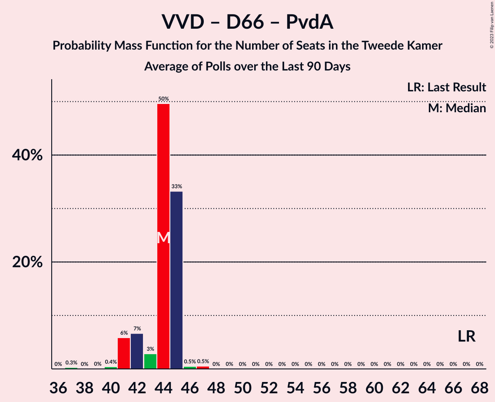

# Poll Average

<a href="#voting-intentions">Voting Intentions</a> | <a href="#seats">Seats</a> | <a href="#coalitions">Coalitions</a> | <a href="#technical-information">Technical Information</a>

## Summary

The table below lists the polls on which the average is based. They are the most recent polls (less than 90 days old) registered and analyzed so far.

| Period     | Polling firm/Commissioner(s) | VVD | PVV | CDA | D66 | GL | SP | PvdA | CU | PvdD | 50+ | SGP | DENK | FvD | PP | B1 | PvdT |
|:----------:|:----------------------------:|:--:|:--:|:--:|:--:|:--:|:--:|:--:|:--:|:--:|:--:|:--:|:--:|:--:|:--:|:--:|:--:|
| 15 March 2017 | General Election | 21.3%   33 | 13.1%   20 | 12.4%   19 | 12.2%   19 | 9.1%   14 | 9.1%   14 | 5.7%   9 | 3.4%   5 | 3.2%   5 | 3.1%   4 | 2.1%   3 | 2.1%   3 | 1.8%   2 | 0.3%   0 | 0.3%   0 | 0.0%   0 |
| N/A | Poll Average | 20–30%   33–45 | 7–13%   12–20 | 8–12%   12–19 | 5–9%   7–12 | 8–12%   12–15 | 4–8%   8–11 | 8–14%   14–23 | 4–6%   5–10 | 3–5%   4–6 | 0–6%   0–9 | 2–4%   2–5 | 0–2%   0–3 | 6–9%   9–13 | N/A   N/A | N/A   N/A | 0–2%   0–2 |
| [15 May 2020](2020-05-15-IOResearch.html) | I&O Research | 27–30%   45 | 7–10%   14 | 7–10%   12 | 4–6%   7 | 9–12%   15 | 6–8%   11 | 8–11%   15 | 4–6%   6 | 3–4%   5 | 0–1%   0 | 2–4%   4 | 0–1%   1 | 7–9%   12–13 | N/A   N/A | N/A   N/A | 1–2%   2 |
| [10 May 2020](2020-05-10-Peilnl.html) | Peil.nl | 20–23%   32–35 | 11–13%   16–21 | 10–12%   15–19 | 6–8%   9–11 | 8–10%   12–15 | 6–8%   8–11 | 11–14%   17–23 | 5–6%   6–10 | 3–4%   4–6 | 0–1%   0–1 | 2–3%   2–5 | 0–1%   0–1 | 6–8%   10–13 | N/A   N/A | N/A   N/A | 0–1%   0–1 |
| [24–26 April 2020](2020-04-26-Ipsos.html) | Ipsos   EenVandaag | 22–27%   36–42 | 7–11%   11–17 | 8–11%   12–15 | 6–10%   10–12 | 7–11%   12–14 | 4–7%   6–9 | 8–12%   13–18 | 4–7%   5–9 | 3–5%   4–7 | 4–7%   6–10 | 1–3%   1–4 | 1–3%   1–3 | 5–9%   8–12 | N/A   N/A | N/A   N/A | N/A   N/A |
| 15 March 2017 | General Election | 21.3%   33 | 13.1%   20 | 12.4%   19 | 12.2%   19 | 9.1%   14 | 9.1%   14 | 5.7%   9 | 3.4%   5 | 3.2%   5 | 3.1%   4 | 2.1%   3 | 2.1%   3 | 1.8%   2 | 0.3%   0 | 0.3%   0 | 0.0%   0 |

Only polls for which at least the sample size has been published are included in the table above.

**Legend:**
+ **Top half of each row:** Voting intentions (95% confidence interval)
+ **Bottom half of each row:** Seat projections for the Tweede Kamer (95% confidence interval)
+ **VVD:** Volkspartij voor Vrijheid en Democratie
+ **PVV:** Partij voor de Vrijheid
+ **CDA:** Christen-Democratisch Appèl
+ **D66:** Democraten 66
+ **GL:** GroenLinks
+ **SP:** Socialistische Partij
+ **PvdA:** Partij van de Arbeid
+ **CU:** ChristenUnie
+ **PvdD:** Partij voor de Dieren
+ **50+:** 50Plus
+ **SGP:** Staatkundig Gereformeerde Partij
+ **DENK:** DENK
+ **FvD:** Forum voor Democratie
+ **PP:** Piratenpartij
+ **B1:** Bij1
+ **PvdT:** Partij voor de Toekomst
+ **N/A (single party):** Party not included the published results
+ **N/A (entire row):** Calculation for this opinion poll not started yet

## Voting Intentions

### Confidence Intervals

| Party | Last Result | Median | 80% Confidence Interval | 90% Confidence Interval | 95% Confidence Interval | 99% Confidence Interval |
|:-----:|:-----------:|:------:|:-----------------------:|:-----------------------:|:-----------------------:|:-----------------------:|
| <a href="#volkspartij-voor-vrijheid-en-democratie">Volkspartij voor Vrijheid en Democratie</a> | 21.3% | 24.7% | 20.9–29.0% |20.5–29.5% | 20.2–29.9% | 19.7–30.6% |
| <a href="#partij-voor-de-vrijheid">Partij voor de Vrijheid</a> | 13.1% | 9.3% | 7.9–12.3% |7.7–12.6% | 7.4–12.9% | 7.0–13.3% |
| <a href="#christen-democratisch-appèl">Christen-Democratisch Appèl</a> | 12.4% | 9.5% | 8.1–11.6% |7.8–11.9% | 7.6–12.2% | 7.2–12.6% |
| <a href="#democraten-66">Democraten 66</a> | 12.2% | 6.6% | 5.0–8.3% |4.7–8.7% | 4.6–9.1% | 4.2–9.8% |
| <a href="#groenlinks">GroenLinks</a> | 9.1% | 9.1% | 8.0–10.9% |7.7–11.3% | 7.5–11.5% | 6.9–12.0% |
| <a href="#socialistische-partij">Socialistische Partij</a> | 9.1% | 6.6% | 5.0–7.5% |4.7–7.8% | 4.4–8.0% | 4.0–8.4% |
| <a href="#partij-van-de-arbeid">Partij van de Arbeid</a> | 5.7% | 10.3% | 9.0–13.0% |8.6–13.3% | 8.4–13.5% | 7.9–14.0% |
| <a href="#christenunie">ChristenUnie</a> | 3.4% | 5.1% | 4.4–5.8% |4.2–6.0% | 4.0–6.3% | 3.7–6.7% |
| <a href="#partij-voor-de-dieren">Partij voor de Dieren</a> | 3.2% | 3.5% | 3.0–4.1% |2.8–4.4% | 2.7–4.6% | 2.4–5.0% |
| <a href="#50plus">50Plus</a> | 3.1% | 0.8% | 0.6–5.6% |0.5–6.0% | 0.5–6.3% | 0.4–6.9% |
| <a href="#staatkundig-gereformeerde-partij">Staatkundig Gereformeerde Partij</a> | 2.1% | 2.7% | 1.8–3.3% |1.6–3.5% | 1.5–3.7% | 1.2–4.0% |
| <a href="#denk">DENK</a> | 2.1% | 0.8% | 0.6–2.0% |0.5–2.2% | 0.5–2.4% | 0.4–2.8% |
| <a href="#forum-voor-democratie">Forum voor Democratie</a> | 1.8% | 7.5% | 6.4–8.6% |6.0–8.9% | 5.8–9.1% | 5.3–9.6% |
| <a href="#piratenpartij">Piratenpartij</a> | 0.3% | N/A | N/A |N/A | N/A | N/A |
| <a href="#bij1">Bij1</a> | 0.3% | N/A | N/A |N/A | N/A | N/A |
| <a href="#partij-voor-de-toekomst">Partij voor de Toekomst</a> | 0.0% | 0.9% | 0.6–1.3% |0.5–1.5% | 0.5–1.6% | 0.4–1.8% |

### Volkspartij voor Vrijheid en Democratie

*For a full overview of the results for this party, see the [Volkspartij voor Vrijheid en Democratie](party-volkspartijvoorvrijheidendemocratie.html) page.*

| Voting Intentions | Probability | Accumulated | Special Marks |
|:-----------------:|:-----------:|:-----------:|:-------------:|
| 17.5–18.5% | 0% | 100% |  |
| 18.5–19.5% | 0.3% | 100% |  |
| 19.5–20.5% | 5% | 99.7% |  |
| 20.5–21.5% | 16% | 95% | Last Result |
| 21.5–22.5% | 12% | 79% |  |
| 22.5–23.5% | 6% | 67% |  |
| 23.5–24.5% | 9% | 60% |  |
| 24.5–25.5% | 9% | 52% | Median |
| 25.5–26.5% | 7% | 42% |  |
| 26.5–27.5% | 8% | 35% |  |
| 27.5–28.5% | 13% | 28% |  |
| 28.5–29.5% | 11% | 15% |  |
| 29.5–30.5% | 4% | 4% |  |
| 30.5–31.5% | 0.6% | 0.6% |  |
| 31.5–32.5% | 0% | 0% |  |

### Partij voor de Vrijheid

*For a full overview of the results for this party, see the [Partij voor de Vrijheid](party-partijvoordevrijheid.html) page.*

| Voting Intentions | Probability | Accumulated | Special Marks |
|:-----------------:|:-----------:|:-----------:|:-------------:|
| 5.5–6.5% | 0% | 100% |  |
| 6.5–7.5% | 3% | 100% |  |
| 7.5–8.5% | 25% | 96% |  |
| 8.5–9.5% | 27% | 71% | Median |
| 9.5–10.5% | 10% | 45% |  |
| 10.5–11.5% | 9% | 35% |  |
| 11.5–12.5% | 20% | 26% |  |
| 12.5–13.5% | 6% | 6% | Last Result |
| 13.5–14.5% | 0.2% | 0.2% |  |
| 14.5–15.5% | 0% | 0% |  |

### Christen-Democratisch Appèl

*For a full overview of the results for this party, see the [Christen-Democratisch Appèl](party-christen-democratischappèl.html) page.*

| Voting Intentions | Probability | Accumulated | Special Marks |
|:-----------------:|:-----------:|:-----------:|:-------------:|
| 5.5–6.5% | 0% | 100% |  |
| 6.5–7.5% | 2% | 100% |  |
| 7.5–8.5% | 21% | 98% |  |
| 8.5–9.5% | 27% | 77% |  |
| 9.5–10.5% | 15% | 49% | Median |
| 10.5–11.5% | 22% | 34% |  |
| 11.5–12.5% | 11% | 12% | Last Result |
| 12.5–13.5% | 0.7% | 0.7% |  |
| 13.5–14.5% | 0% | 0% |  |

### Democraten 66

*For a full overview of the results for this party, see the [Democraten 66](party-democraten66.html) page.*

| Voting Intentions | Probability | Accumulated | Special Marks |
|:-----------------:|:-----------:|:-----------:|:-------------:|
| 2.5–3.5% | 0% | 100% |  |
| 3.5–4.5% | 2% | 100% |  |
| 4.5–5.5% | 22% | 98% |  |
| 5.5–6.5% | 23% | 75% |  |
| 6.5–7.5% | 30% | 52% | Median |
| 7.5–8.5% | 16% | 22% |  |
| 8.5–9.5% | 6% | 7% |  |
| 9.5–10.5% | 0.8% | 0.9% |  |
| 10.5–11.5% | 0.1% | 0.1% |  |
| 11.5–12.5% | 0% | 0% | Last Result |

### GroenLinks

*For a full overview of the results for this party, see the [GroenLinks](party-groenlinks.html) page.*

| Voting Intentions | Probability | Accumulated | Special Marks |
|:-----------------:|:-----------:|:-----------:|:-------------:|
| 4.5–5.5% | 0% | 100% |  |
| 5.5–6.5% | 0.1% | 100% |  |
| 6.5–7.5% | 3% | 99.9% |  |
| 7.5–8.5% | 24% | 97% |  |
| 8.5–9.5% | 34% | 72% | Last Result, Median |
| 9.5–10.5% | 21% | 39% |  |
| 10.5–11.5% | 15% | 17% |  |
| 11.5–12.5% | 2% | 2% |  |
| 12.5–13.5% | 0.1% | 0.1% |  |
| 13.5–14.5% | 0% | 0% |  |

### Socialistische Partij

*For a full overview of the results for this party, see the [Socialistische Partij](party-socialistischepartij.html) page.*

| Voting Intentions | Probability | Accumulated | Special Marks |
|:-----------------:|:-----------:|:-----------:|:-------------:|
| 2.5–3.5% | 0.1% | 100% |  |
| 3.5–4.5% | 4% | 99.9% |  |
| 4.5–5.5% | 16% | 96% |  |
| 5.5–6.5% | 29% | 80% |  |
| 6.5–7.5% | 42% | 51% | Median |
| 7.5–8.5% | 8% | 9% |  |
| 8.5–9.5% | 0.3% | 0.3% | Last Result |
| 9.5–10.5% | 0% | 0% |  |

### Partij van de Arbeid

*For a full overview of the results for this party, see the [Partij van de Arbeid](party-partijvandearbeid.html) page.*

| Voting Intentions | Probability | Accumulated | Special Marks |
|:-----------------:|:-----------:|:-----------:|:-------------:|
| 5.5–6.5% | 0% | 100% | Last Result |
| 6.5–7.5% | 0.2% | 100% |  |
| 7.5–8.5% | 4% | 99.8% |  |
| 8.5–9.5% | 23% | 96% |  |
| 9.5–10.5% | 29% | 73% | Median |
| 10.5–11.5% | 10% | 44% |  |
| 11.5–12.5% | 14% | 34% |  |
| 12.5–13.5% | 17% | 19% |  |
| 13.5–14.5% | 2% | 2% |  |
| 14.5–15.5% | 0% | 0% |  |
| 15.5–16.5% | 0% | 0% |  |

### ChristenUnie

*For a full overview of the results for this party, see the [ChristenUnie](party-christenunie.html) page.*

| Voting Intentions | Probability | Accumulated | Special Marks |
|:-----------------:|:-----------:|:-----------:|:-------------:|
| 1.5–2.5% | 0% | 100% |  |
| 2.5–3.5% | 0.3% | 100% | Last Result |
| 3.5–4.5% | 17% | 99.7% |  |
| 4.5–5.5% | 62% | 83% | Median |
| 5.5–6.5% | 21% | 22% |  |
| 6.5–7.5% | 0.9% | 0.9% |  |
| 7.5–8.5% | 0% | 0% |  |

### Partij voor de Dieren

*For a full overview of the results for this party, see the [Partij voor de Dieren](party-partijvoordedieren.html) page.*

| Voting Intentions | Probability | Accumulated | Special Marks |
|:-----------------:|:-----------:|:-----------:|:-------------:|
| 0.5–1.5% | 0% | 100% |  |
| 1.5–2.5% | 1.0% | 100% |  |
| 2.5–3.5% | 55% | 99.0% | Last Result, Median |
| 3.5–4.5% | 41% | 44% |  |
| 4.5–5.5% | 2% | 3% |  |
| 5.5–6.5% | 0.1% | 0.1% |  |
| 6.5–7.5% | 0% | 0% |  |

### 50Plus

*For a full overview of the results for this party, see the [50Plus](party-50plus.html) page.*

| Voting Intentions | Probability | Accumulated | Special Marks |
|:-----------------:|:-----------:|:-----------:|:-------------:|
| 0.0–0.5% | 9% | 100% |  |
| 0.5–1.5% | 58% | 91% | Median |
| 1.5–2.5% | 0% | 33% |  |
| 2.5–3.5% | 0.1% | 33% | Last Result |
| 3.5–4.5% | 5% | 33% |  |
| 4.5–5.5% | 17% | 29% |  |
| 5.5–6.5% | 10% | 12% |  |
| 6.5–7.5% | 1.4% | 1.5% |  |
| 7.5–8.5% | 0.1% | 0.1% |  |
| 8.5–9.5% | 0% | 0% |  |

### Staatkundig Gereformeerde Partij

*For a full overview of the results for this party, see the [Staatkundig Gereformeerde Partij](party-staatkundiggereformeerdepartij.html) page.*

| Voting Intentions | Probability | Accumulated | Special Marks |
|:-----------------:|:-----------:|:-----------:|:-------------:|
| 0.0–0.5% | 0% | 100% |  |
| 0.5–1.5% | 4% | 100% |  |
| 1.5–2.5% | 37% | 96% | Last Result |
| 2.5–3.5% | 54% | 59% | Median |
| 3.5–4.5% | 5% | 5% |  |
| 4.5–5.5% | 0% | 0% |  |

### DENK

*For a full overview of the results for this party, see the [DENK](party-denk.html) page.*

| Voting Intentions | Probability | Accumulated | Special Marks |
|:-----------------:|:-----------:|:-----------:|:-------------:|
| 0.0–0.5% | 9% | 100% |  |
| 0.5–1.5% | 68% | 91% | Median |
| 1.5–2.5% | 21% | 23% | Last Result |
| 2.5–3.5% | 1.3% | 1.4% |  |
| 3.5–4.5% | 0% | 0% |  |

### Forum voor Democratie

*For a full overview of the results for this party, see the [Forum voor Democratie](party-forumvoordemocratie.html) page.*

| Voting Intentions | Probability | Accumulated | Special Marks |
|:-----------------:|:-----------:|:-----------:|:-------------:|
| 1.5–2.5% | 0% | 100% | Last Result |
| 2.5–3.5% | 0% | 100% |  |
| 3.5–4.5% | 0% | 100% |  |
| 4.5–5.5% | 1.3% | 100% |  |
| 5.5–6.5% | 12% | 98.6% |  |
| 6.5–7.5% | 40% | 87% | Median |
| 7.5–8.5% | 36% | 47% |  |
| 8.5–9.5% | 10% | 11% |  |
| 9.5–10.5% | 0.6% | 0.6% |  |
| 10.5–11.5% | 0% | 0% |  |

### Partij voor de Toekomst

*For a full overview of the results for this party, see the [Partij voor de Toekomst](party-partijvoordetoekomst.html) page.*

| Voting Intentions | Probability | Accumulated | Special Marks |
|:-----------------:|:-----------:|:-----------:|:-------------:|
| 0.0–0.5% | 8% | 100% | Last Result |
| 0.5–1.5% | 89% | 92% | Median |
| 1.5–2.5% | 3% | 3% |  |
| 2.5–3.5% | 0% | 0% |  |

## Seats

### Confidence Intervals

| Party | Last Result | Median | 80% Confidence Interval | 90% Confidence Interval | 95% Confidence Interval | 99% Confidence Interval |
|:-----:|:-----------:|:------:|:-----------------------:|:-----------------------:|:-----------------------:|:-----------------------:|
| <a href="#volkspartij-voor-vrijheid-en-democratie">Volkspartij voor Vrijheid en Democratie</a> | 33 | 37 | 33–45 |33–45 | 33–45 | 31–47 |
| <a href="#partij-voor-de-vrijheid">Partij voor de Vrijheid</a> | 20 | 14 | 12–19 |12–20 | 12–20 | 11–21 |
| <a href="#christen-democratisch-appèl">Christen-Democratisch Appèl</a> | 19 | 14 | 12–17 |12–17 | 12–19 | 12–19 |
| <a href="#democraten-66">Democraten 66</a> | 19 | 10 | 7–12 |7–12 | 7–12 | 7–14 |
| <a href="#groenlinks">GroenLinks</a> | 14 | 13 | 12–15 |12–15 | 12–15 | 11–15 |
| <a href="#socialistische-partij">Socialistische Partij</a> | 14 | 10 | 8–11 |8–11 | 8–11 | 6–12 |
| <a href="#partij-van-de-arbeid">Partij van de Arbeid</a> | 9 | 15 | 15–20 |15–23 | 14–23 | 12–23 |
| <a href="#christenunie">ChristenUnie</a> | 5 | 6 | 5–8 |5–10 | 5–10 | 4–10 |
| <a href="#partij-voor-de-dieren">Partij voor de Dieren</a> | 5 | 5 | 4–6 |4–6 | 4–6 | 4–7 |
| <a href="#50plus">50Plus</a> | 4 | 0 | 0–9 |0–9 | 0–9 | 0–10 |
| <a href="#staatkundig-gereformeerde-partij">Staatkundig Gereformeerde Partij</a> | 3 | 4 | 3–5 |2–5 | 2–5 | 1–5 |
| <a href="#denk">DENK</a> | 3 | 1 | 1–3 |0–3 | 0–3 | 0–3 |
| <a href="#forum-voor-democratie">Forum voor Democratie</a> | 2 | 11 | 10–13 |10–13 | 9–13 | 8–13 |
| <a href="#piratenpartij">Piratenpartij</a> | 0 | N/A | N/A |N/A | N/A | N/A |
| <a href="#bij1">Bij1</a> | 0 | N/A | N/A |N/A | N/A | N/A |
| <a href="#partij-voor-de-toekomst">Partij voor de Toekomst</a> | 0 | 1 | 0–2 |0–2 | 0–2 | 0–2 |

### Volkspartij voor Vrijheid en Democratie

*For a full overview of the results for this party, see the [Volkspartij voor Vrijheid en Democratie](party-volkspartijvoorvrijheidendemocratie.html) page.*

| Number of Seats | Probability | Accumulated | Special Marks |
|:---------------:|:-----------:|:-----------:|:-------------:|
| 30 | 0% | 100% |  |
| 31 | 0.8% | 99.9% |  |
| 32 | 2% | 99.2% |  |
| 33 | 22% | 98% | Last Result |
| 34 | 4% | 76% |  |
| 35 | 5% | 71% |  |
| 36 | 2% | 66% |  |
| 37 | 15% | 64% | Median |
| 38 | 0.8% | 49% |  |
| 39 | 2% | 48% |  |
| 40 | 0.4% | 46% |  |
| 41 | 0.3% | 46% |  |
| 42 | 12% | 46% |  |
| 43 | 0.2% | 33% |  |
| 44 | 0% | 33% |  |
| 45 | 33% | 33% |  |
| 46 | 0% | 0.6% |  |
| 47 | 0.6% | 0.6% |  |
| 48 | 0% | 0% |  |

### Partij voor de Vrijheid

*For a full overview of the results for this party, see the [Partij voor de Vrijheid](party-partijvoordevrijheid.html) page.*

| Number of Seats | Probability | Accumulated | Special Marks |
|:---------------:|:-----------:|:-----------:|:-------------:|
| 10 | 0% | 100% |  |
| 11 | 2% | 99.9% |  |
| 12 | 13% | 98% |  |
| 13 | 0.6% | 85% |  |
| 14 | 35% | 84% | Median |
| 15 | 0.4% | 50% |  |
| 16 | 9% | 49% |  |
| 17 | 17% | 40% |  |
| 18 | 2% | 23% |  |
| 19 | 15% | 21% |  |
| 20 | 5% | 6% | Last Result |
| 21 | 1.0% | 1.0% |  |
| 22 | 0% | 0% |  |

### Christen-Democratisch Appèl

*For a full overview of the results for this party, see the [Christen-Democratisch Appèl](party-christen-democratischappèl.html) page.*

| Number of Seats | Probability | Accumulated | Special Marks |
|:---------------:|:-----------:|:-----------:|:-------------:|
| 10 | 0.1% | 100% |  |
| 11 | 0.3% | 99.8% |  |
| 12 | 45% | 99.5% |  |
| 13 | 1.2% | 55% |  |
| 14 | 18% | 53% | Median |
| 15 | 8% | 36% |  |
| 16 | 3% | 27% |  |
| 17 | 20% | 24% |  |
| 18 | 0.9% | 4% |  |
| 19 | 3% | 3% | Last Result |
| 20 | 0.1% | 0.1% |  |
| 21 | 0% | 0% |  |

### Democraten 66

*For a full overview of the results for this party, see the [Democraten 66](party-democraten66.html) page.*

| Number of Seats | Probability | Accumulated | Special Marks |
|:---------------:|:-----------:|:-----------:|:-------------:|
| 7 | 33% | 100% |  |
| 8 | 1.0% | 67% |  |
| 9 | 16% | 66% |  |
| 10 | 26% | 50% | Median |
| 11 | 7% | 24% |  |
| 12 | 17% | 18% |  |
| 13 | 0.2% | 0.8% |  |
| 14 | 0.2% | 0.6% |  |
| 15 | 0.1% | 0.4% |  |
| 16 | 0.3% | 0.3% |  |
| 17 | 0% | 0% |  |
| 18 | 0% | 0% |  |
| 19 | 0% | 0% | Last Result |

### GroenLinks

*For a full overview of the results for this party, see the [GroenLinks](party-groenlinks.html) page.*

| Number of Seats | Probability | Accumulated | Special Marks |
|:---------------:|:-----------:|:-----------:|:-------------:|
| 10 | 0.3% | 100% |  |
| 11 | 0.7% | 99.7% |  |
| 12 | 42% | 99.0% |  |
| 13 | 19% | 57% | Median |
| 14 | 1.3% | 38% | Last Result |
| 15 | 37% | 37% |  |
| 16 | 0.1% | 0.5% |  |
| 17 | 0.3% | 0.4% |  |
| 18 | 0% | 0.1% |  |
| 19 | 0% | 0% |  |

### Socialistische Partij

*For a full overview of the results for this party, see the [Socialistische Partij](party-socialistischepartij.html) page.*

| Number of Seats | Probability | Accumulated | Special Marks |
|:---------------:|:-----------:|:-----------:|:-------------:|
| 5 | 0.5% | 100% |  |
| 6 | 0.7% | 99.5% |  |
| 7 | 0.4% | 98.9% |  |
| 8 | 30% | 98% |  |
| 9 | 10% | 68% |  |
| 10 | 11% | 58% | Median |
| 11 | 46% | 47% |  |
| 12 | 0.9% | 1.0% |  |
| 13 | 0% | 0% |  |
| 14 | 0% | 0% | Last Result |

### Partij van de Arbeid

*For a full overview of the results for this party, see the [Partij van de Arbeid](party-partijvandearbeid.html) page.*

| Number of Seats | Probability | Accumulated | Special Marks |
|:---------------:|:-----------:|:-----------:|:-------------:|
| 9 | 0% | 100% | Last Result |
| 10 | 0% | 100% |  |
| 11 | 0.5% | 100% |  |
| 12 | 0.2% | 99.5% |  |
| 13 | 0.4% | 99.3% |  |
| 14 | 2% | 99.0% |  |
| 15 | 61% | 97% | Median |
| 16 | 0.9% | 36% |  |
| 17 | 5% | 35% |  |
| 18 | 7% | 31% |  |
| 19 | 14% | 24% |  |
| 20 | 4% | 10% |  |
| 21 | 0.1% | 7% |  |
| 22 | 0% | 6% |  |
| 23 | 6% | 6% |  |
| 24 | 0% | 0% |  |

### ChristenUnie

*For a full overview of the results for this party, see the [ChristenUnie](party-christenunie.html) page.*

| Number of Seats | Probability | Accumulated | Special Marks |
|:---------------:|:-----------:|:-----------:|:-------------:|
| 4 | 0.8% | 100% |  |
| 5 | 15% | 99.2% | Last Result |
| 6 | 36% | 84% | Median |
| 7 | 29% | 48% |  |
| 8 | 10% | 19% |  |
| 9 | 2% | 9% |  |
| 10 | 7% | 7% |  |
| 11 | 0% | 0% |  |

### Partij voor de Dieren

*For a full overview of the results for this party, see the [Partij voor de Dieren](party-partijvoordedieren.html) page.*

| Number of Seats | Probability | Accumulated | Special Marks |
|:---------------:|:-----------:|:-----------:|:-------------:|
| 3 | 0.4% | 100% |  |
| 4 | 18% | 99.6% |  |
| 5 | 62% | 81% | Last Result, Median |
| 6 | 17% | 19% |  |
| 7 | 0.8% | 1.2% |  |
| 8 | 0.1% | 0.5% |  |
| 9 | 0.3% | 0.4% |  |
| 10 | 0% | 0% |  |

### 50Plus

*For a full overview of the results for this party, see the [50Plus](party-50plus.html) page.*

| Number of Seats | Probability | Accumulated | Special Marks |
|:---------------:|:-----------:|:-----------:|:-------------:|
| 0 | 59% | 100% | Median |
| 1 | 8% | 41% |  |
| 2 | 0% | 33% |  |
| 3 | 0% | 33% |  |
| 4 | 0% | 33% | Last Result |
| 5 | 0.2% | 33% |  |
| 6 | 0.9% | 33% |  |
| 7 | 17% | 32% |  |
| 8 | 2% | 16% |  |
| 9 | 13% | 14% |  |
| 10 | 1.1% | 1.2% |  |
| 11 | 0.1% | 0.1% |  |
| 12 | 0% | 0% |  |

### Staatkundig Gereformeerde Partij

*For a full overview of the results for this party, see the [Staatkundig Gereformeerde Partij](party-staatkundiggereformeerdepartij.html) page.*

| Number of Seats | Probability | Accumulated | Special Marks |
|:---------------:|:-----------:|:-----------:|:-------------:|
| 1 | 0.8% | 100% |  |
| 2 | 5% | 99.2% |  |
| 3 | 18% | 95% | Last Result |
| 4 | 59% | 76% | Median |
| 5 | 18% | 18% |  |
| 6 | 0% | 0% |  |

### DENK

*For a full overview of the results for this party, see the [DENK](party-denk.html) page.*

| Number of Seats | Probability | Accumulated | Special Marks |
|:---------------:|:-----------:|:-----------:|:-------------:|
| 0 | 7% | 100% |  |
| 1 | 61% | 93% | Median |
| 2 | 19% | 32% |  |
| 3 | 13% | 14% | Last Result |
| 4 | 0.4% | 0.5% |  |
| 5 | 0.1% | 0.1% |  |
| 6 | 0% | 0% |  |

### Forum voor Democratie

*For a full overview of the results for this party, see the [Forum voor Democratie](party-forumvoordemocratie.html) page.*

| Number of Seats | Probability | Accumulated | Special Marks |
|:---------------:|:-----------:|:-----------:|:-------------:|
| 2 | 0% | 100% | Last Result |
| 3 | 0% | 100% |  |
| 4 | 0% | 100% |  |
| 5 | 0% | 100% |  |
| 6 | 0% | 100% |  |
| 7 | 0% | 100% |  |
| 8 | 2% | 100% |  |
| 9 | 2% | 98% |  |
| 10 | 19% | 96% |  |
| 11 | 37% | 77% | Median |
| 12 | 6% | 40% |  |
| 13 | 34% | 34% |  |
| 14 | 0.1% | 0.1% |  |
| 15 | 0% | 0% |  |

### Piratenpartij

*For a full overview of the results for this party, see the [Piratenpartij](party-piratenpartij.html) page.*

### Bij1

*For a full overview of the results for this party, see the [Bij1](party-bij1.html) page.*

### Partij voor de Toekomst

*For a full overview of the results for this party, see the [Partij voor de Toekomst](party-partijvoordetoekomst.html) page.*

| Number of Seats | Probability | Accumulated | Special Marks |
|:---------------:|:-----------:|:-----------:|:-------------:|
| 0 | 41% | 100% | Last Result |
| 1 | 9% | 59% | Median |
| 2 | 50% | 50% |  |
| 3 | 0% | 0% |  |

## Coalitions

### Confidence Intervals

| Coalition | Last Result | Median | Majority? | 80% Confidence Interval | 90% Confidence Interval | 95% Confidence Interval | 99% Confidence Interval |
|:---------:|:-----------:|:------:|:---------:|:-----------------------:|:-----------------------:|:-----------------------:|:-----------------------:|
| Volkspartij voor Vrijheid en Democratie – Christen-Democratisch Appèl – Democraten 66 – Partij van de Arbeid – ChristenUnie | 85 | 85 | 100% | 83–89 | 83–91 | 83–91 | 82–91 |
| Volkspartij voor Vrijheid en Democratie – Partij voor de Vrijheid – Christen-Democratisch Appèl – Staatkundig Gereformeerde Partij – Forum voor Democratie | 77 | 85 | 98% | 79–88 | 79–88 | 77–88 | 73–90 |
| Volkspartij voor Vrijheid en Democratie – Christen-Democratisch Appèl – Democraten 66 – GroenLinks – ChristenUnie | 90 | 83 | 99.9% | 78–85 | 78–85 | 78–85 | 78–89 |
| Volkspartij voor Vrijheid en Democratie – Partij voor de Vrijheid – Christen-Democratisch Appèl – Forum voor Democratie | 74 | 80 | 90% | 76–84 | 75–84 | 74–84 | 70–86 |
| Christen-Democratisch Appèl – Democraten 66 – GroenLinks – Socialistische Partij – Partij van de Arbeid – ChristenUnie | 80 | 66 | 14% | 64–78 | 64–80 | 64–80 | 64–81 |
| Volkspartij voor Vrijheid en Democratie – Christen-Democratisch Appèl – 50Plus – Staatkundig Gereformeerde Partij – Forum voor Democratie | 61 | 72 | 13% | 65–77 | 63–77 | 63–77 | 62–78 |
| Volkspartij voor Vrijheid en Democratie – Christen-Democratisch Appèl – Staatkundig Gereformeerde Partij – Forum voor Democratie | 57 | 67 | 0.7% | 64–74 | 63–74 | 62–74 | 62–78 |
| Volkspartij voor Vrijheid en Democratie – Christen-Democratisch Appèl – 50Plus – Forum voor Democratie | 58 | 68 | 0.1% | 61–74 | 59–74 | 59–74 | 59–74 |
| Volkspartij voor Vrijheid en Democratie – Christen-Democratisch Appèl – Democraten 66 – ChristenUnie | 76 | 70 | 0.8% | 66–71 | 66–71 | 66–72 | 66–76 |
| Volkspartij voor Vrijheid en Democratie – Christen-Democratisch Appèl – Partij van de Arbeid | 61 | 69 | 0.6% | 66–72 | 66–72 | 66–72 | 63–76 |
| Volkspartij voor Vrijheid en Democratie – Partij voor de Vrijheid – Christen-Democratisch Appèl | 72 | 69 | 0% | 65–71 | 64–71 | 64–72 | 60–74 |
| Christen-Democratisch Appèl – Democraten 66 – GroenLinks – Partij van de Arbeid – ChristenUnie | 66 | 58 | 0% | 55–68 | 55–71 | 55–71 | 55–71 |
| Volkspartij voor Vrijheid en Democratie – Christen-Democratisch Appèl – Forum voor Democratie | 54 | 63 | 0% | 60–70 | 59–70 | 59–70 | 58–74 |
| Volkspartij voor Vrijheid en Democratie – Democraten 66 – Partij van de Arbeid | 61 | 66 | 0% | 61–67 | 61–67 | 61–67 | 58–69 |
| Volkspartij voor Vrijheid en Democratie – Christen-Democratisch Appèl – Democraten 66 | 71 | 63 | 0% | 59–64 | 58–64 | 58–65 | 58–70 |
| Volkspartij voor Vrijheid en Democratie – Partij van de Arbeid | 42 | 56 | 0% | 52–60 | 51–60 | 50–60 | 47–61 |
| Volkspartij voor Vrijheid en Democratie – Christen-Democratisch Appèl | 52 | 52 | 0% | 50–57 | 48–57 | 48–57 | 47–62 |
| Christen-Democratisch Appèl – Democraten 66 – Partij van de Arbeid | 47 | 41 | 0% | 34–47 | 34–48 | 34–48 | 34–49 |
| Christen-Democratisch Appèl – Partij van de Arbeid – ChristenUnie | 33 | 34 | 0% | 33–44 | 33–48 | 33–48 | 33–48 |
| Christen-Democratisch Appèl – Partij van de Arbeid | 28 | 29 | 0% | 27–37 | 27–38 | 27–38 | 26–38 |
| Christen-Democratisch Appèl – Democraten 66 | 38 | 25 | 0% | 19–27 | 19–28 | 19–29 | 19–30 |

### Volkspartij voor Vrijheid en Democratie – Christen-Democratisch Appèl – Democraten 66 – Partij van de Arbeid – ChristenUnie

| Number of Seats | Probability | Accumulated | Special Marks |
|:---------------:|:-----------:|:-----------:|:-------------:|
| 78 | 0.1% | 100% |  |
| 79 | 0.1% | 99.8% |  |
| 80 | 0.1% | 99.8% |  |
| 81 | 0% | 99.7% |  |
| 82 | 0.2% | 99.7% | Median |
| 83 | 16% | 99.5% |  |
| 84 | 2% | 84% |  |
| 85 | 46% | 82% | Last Result |
| 86 | 19% | 36% |  |
| 87 | 5% | 17% |  |
| 88 | 0.9% | 12% |  |
| 89 | 3% | 11% |  |
| 90 | 1.1% | 8% |  |
| 91 | 7% | 7% |  |
| 92 | 0.2% | 0.2% |  |
| 93 | 0% | 0% |  |

### Volkspartij voor Vrijheid en Democratie – Partij voor de Vrijheid – Christen-Democratisch Appèl – Staatkundig Gereformeerde Partij – Forum voor Democratie

| Number of Seats | Probability | Accumulated | Special Marks |
|:---------------:|:-----------:|:-----------:|:-------------:|
| 73 | 0.6% | 100% |  |
| 74 | 0.1% | 99.3% |  |
| 75 | 1.0% | 99.2% |  |
| 76 | 0.6% | 98% | Majority |
| 77 | 0.8% | 98% | Last Result |
| 78 | 0.9% | 97% |  |
| 79 | 7% | 96% |  |
| 80 | 12% | 89% | Median |
| 81 | 0.7% | 76% |  |
| 82 | 17% | 76% |  |
| 83 | 1.4% | 58% |  |
| 84 | 4% | 57% |  |
| 85 | 18% | 53% |  |
| 86 | 0.1% | 35% |  |
| 87 | 0.6% | 35% |  |
| 88 | 32% | 34% |  |
| 89 | 0.9% | 2% |  |
| 90 | 0.7% | 0.7% |  |
| 91 | 0% | 0% |  |

### Volkspartij voor Vrijheid en Democratie – Christen-Democratisch Appèl – Democraten 66 – GroenLinks – ChristenUnie

| Number of Seats | Probability | Accumulated | Special Marks |
|:---------------:|:-----------:|:-----------:|:-------------:|
| 75 | 0.1% | 100% |  |
| 76 | 0% | 99.9% | Majority |
| 77 | 0.2% | 99.9% |  |
| 78 | 12% | 99.7% |  |
| 79 | 2% | 87% |  |
| 80 | 16% | 85% | Median |
| 81 | 9% | 69% |  |
| 82 | 6% | 60% |  |
| 83 | 12% | 54% |  |
| 84 | 6% | 41% |  |
| 85 | 33% | 36% |  |
| 86 | 0.5% | 2% |  |
| 87 | 0.9% | 2% |  |
| 88 | 0.2% | 1.1% |  |
| 89 | 0.7% | 0.9% |  |
| 90 | 0.2% | 0.2% | Last Result |
| 91 | 0% | 0% |  |

### Volkspartij voor Vrijheid en Democratie – Partij voor de Vrijheid – Christen-Democratisch Appèl – Forum voor Democratie

| Number of Seats | Probability | Accumulated | Special Marks |
|:---------------:|:-----------:|:-----------:|:-------------:|
| 70 | 0.5% | 100% |  |
| 71 | 0.8% | 99.5% |  |
| 72 | 0.4% | 98.6% |  |
| 73 | 0.6% | 98% |  |
| 74 | 0.7% | 98% | Last Result |
| 75 | 7% | 97% |  |
| 76 | 1.2% | 90% | Median, Majority |
| 77 | 13% | 89% |  |
| 78 | 18% | 76% |  |
| 79 | 3% | 58% |  |
| 80 | 14% | 55% |  |
| 81 | 3% | 41% |  |
| 82 | 0.4% | 38% |  |
| 83 | 4% | 38% |  |
| 84 | 33% | 34% |  |
| 85 | 0.9% | 2% |  |
| 86 | 0.7% | 0.7% |  |
| 87 | 0% | 0% |  |

### Christen-Democratisch Appèl – Democraten 66 – GroenLinks – Socialistische Partij – Partij van de Arbeid – ChristenUnie

| Number of Seats | Probability | Accumulated | Special Marks |
|:---------------:|:-----------:|:-----------:|:-------------:|
| 63 | 0.2% | 100% |  |
| 64 | 12% | 99.8% |  |
| 65 | 0.2% | 88% |  |
| 66 | 48% | 87% |  |
| 67 | 0.9% | 39% |  |
| 68 | 2% | 39% | Median |
| 69 | 0.4% | 37% |  |
| 70 | 1.2% | 37% |  |
| 71 | 0.3% | 35% |  |
| 72 | 0.9% | 35% |  |
| 73 | 1.1% | 34% |  |
| 74 | 3% | 33% |  |
| 75 | 16% | 30% |  |
| 76 | 1.4% | 14% | Majority |
| 77 | 2% | 13% |  |
| 78 | 0.9% | 11% |  |
| 79 | 2% | 10% |  |
| 80 | 7% | 7% | Last Result |
| 81 | 0.8% | 0.8% |  |
| 82 | 0% | 0% |  |

### Volkspartij voor Vrijheid en Democratie – Christen-Democratisch Appèl – 50Plus – Staatkundig Gereformeerde Partij – Forum voor Democratie

| Number of Seats | Probability | Accumulated | Special Marks |
|:---------------:|:-----------:|:-----------:|:-------------:|
| 61 | 0% | 100% | Last Result |
| 62 | 0.7% | 100% |  |
| 63 | 7% | 99.3% |  |
| 64 | 0.2% | 93% |  |
| 65 | 4% | 92% |  |
| 66 | 15% | 88% | Median |
| 67 | 2% | 73% |  |
| 68 | 3% | 72% |  |
| 69 | 3% | 69% |  |
| 70 | 0.9% | 65% |  |
| 71 | 0.5% | 64% |  |
| 72 | 16% | 64% |  |
| 73 | 1.0% | 48% |  |
| 74 | 33% | 47% |  |
| 75 | 0.7% | 14% |  |
| 76 | 0% | 13% | Majority |
| 77 | 12% | 13% |  |
| 78 | 0.6% | 0.7% |  |
| 79 | 0% | 0.1% |  |
| 80 | 0.1% | 0.1% |  |
| 81 | 0% | 0% |  |

### Volkspartij voor Vrijheid en Democratie – Christen-Democratisch Appèl – Staatkundig Gereformeerde Partij – Forum voor Democratie

| Number of Seats | Probability | Accumulated | Special Marks |
|:---------------:|:-----------:|:-----------:|:-------------:|
| 57 | 0% | 100% | Last Result |
| 58 | 0% | 100% |  |
| 59 | 0.3% | 100% |  |
| 60 | 0.1% | 99.7% |  |
| 61 | 0.1% | 99.6% |  |
| 62 | 2% | 99.5% |  |
| 63 | 7% | 97% |  |
| 64 | 1.4% | 90% |  |
| 65 | 23% | 89% |  |
| 66 | 14% | 65% | Median |
| 67 | 2% | 52% |  |
| 68 | 15% | 49% |  |
| 69 | 0.4% | 34% |  |
| 70 | 0.2% | 33% |  |
| 71 | 0% | 33% |  |
| 72 | 0.1% | 33% |  |
| 73 | 0.1% | 33% |  |
| 74 | 32% | 33% |  |
| 75 | 0% | 0.7% |  |
| 76 | 0.1% | 0.7% | Majority |
| 77 | 0% | 0.6% |  |
| 78 | 0.6% | 0.6% |  |
| 79 | 0% | 0% |  |

### Volkspartij voor Vrijheid en Democratie – Christen-Democratisch Appèl – 50Plus – Forum voor Democratie

| Number of Seats | Probability | Accumulated | Special Marks |
|:---------------:|:-----------:|:-----------:|:-------------:|
| 58 | 0% | 100% | Last Result |
| 59 | 7% | 100% |  |
| 60 | 0.1% | 93% |  |
| 61 | 13% | 92% |  |
| 62 | 2% | 79% | Median |
| 63 | 7% | 78% |  |
| 64 | 4% | 70% |  |
| 65 | 0.4% | 67% |  |
| 66 | 1.3% | 66% |  |
| 67 | 0.3% | 65% |  |
| 68 | 16% | 65% |  |
| 69 | 0.6% | 49% |  |
| 70 | 33% | 48% |  |
| 71 | 0.8% | 15% |  |
| 72 | 0.5% | 14% |  |
| 73 | 0.2% | 13% |  |
| 74 | 13% | 13% |  |
| 75 | 0% | 0.1% |  |
| 76 | 0.1% | 0.1% | Majority |
| 77 | 0% | 0% |  |

### Volkspartij voor Vrijheid en Democratie – Christen-Democratisch Appèl – Democraten 66 – ChristenUnie

| Number of Seats | Probability | Accumulated | Special Marks |
|:---------------:|:-----------:|:-----------:|:-------------:|
| 64 | 0.3% | 100% |  |
| 65 | 0.1% | 99.7% |  |
| 66 | 16% | 99.5% |  |
| 67 | 1.4% | 84% | Median |
| 68 | 22% | 83% |  |
| 69 | 8% | 60% |  |
| 70 | 33% | 52% |  |
| 71 | 15% | 18% |  |
| 72 | 0.7% | 3% |  |
| 73 | 0.8% | 2% |  |
| 74 | 0.6% | 2% |  |
| 75 | 0.2% | 1.0% |  |
| 76 | 0.6% | 0.8% | Last Result, Majority |
| 77 | 0% | 0.2% |  |
| 78 | 0.2% | 0.2% |  |
| 79 | 0% | 0% |  |

### Volkspartij voor Vrijheid en Democratie – Christen-Democratisch Appèl – Partij van de Arbeid

| Number of Seats | Probability | Accumulated | Special Marks |
|:---------------:|:-----------:|:-----------:|:-------------:|
| 59 | 0.1% | 100% |  |
| 60 | 0% | 99.9% |  |
| 61 | 0.2% | 99.8% | Last Result |
| 62 | 0.1% | 99.7% |  |
| 63 | 0.2% | 99.6% |  |
| 64 | 1.2% | 99.4% |  |
| 65 | 0.3% | 98% |  |
| 66 | 17% | 98% | Median |
| 67 | 0.3% | 81% |  |
| 68 | 5% | 80% |  |
| 69 | 26% | 76% |  |
| 70 | 5% | 50% |  |
| 71 | 11% | 45% |  |
| 72 | 33% | 34% |  |
| 73 | 0.2% | 0.9% |  |
| 74 | 0% | 0.7% |  |
| 75 | 0.1% | 0.7% |  |
| 76 | 0.6% | 0.6% | Majority |
| 77 | 0% | 0% |  |

### Volkspartij voor Vrijheid en Democratie – Partij voor de Vrijheid – Christen-Democratisch Appèl

| Number of Seats | Probability | Accumulated | Special Marks |
|:---------------:|:-----------:|:-----------:|:-------------:|
| 60 | 0.6% | 100% |  |
| 61 | 0.5% | 99.3% |  |
| 62 | 0.7% | 98.9% |  |
| 63 | 0.4% | 98% |  |
| 64 | 7% | 98% |  |
| 65 | 2% | 91% | Median |
| 66 | 12% | 89% |  |
| 67 | 1.1% | 76% |  |
| 68 | 19% | 75% |  |
| 69 | 14% | 57% |  |
| 70 | 4% | 43% |  |
| 71 | 36% | 39% |  |
| 72 | 0.7% | 3% | Last Result |
| 73 | 1.2% | 2% |  |
| 74 | 0.7% | 0.7% |  |
| 75 | 0% | 0% |  |

### Christen-Democratisch Appèl – Democraten 66 – GroenLinks – Partij van de Arbeid – ChristenUnie

| Number of Seats | Probability | Accumulated | Special Marks |
|:---------------:|:-----------:|:-----------:|:-------------:|
| 54 | 0.2% | 100% |  |
| 55 | 32% | 99.8% |  |
| 56 | 13% | 67% |  |
| 57 | 0% | 55% |  |
| 58 | 16% | 55% | Median |
| 59 | 2% | 39% |  |
| 60 | 0.3% | 37% |  |
| 61 | 1.1% | 37% |  |
| 62 | 1.0% | 36% |  |
| 63 | 0.3% | 35% |  |
| 64 | 15% | 35% |  |
| 65 | 5% | 20% |  |
| 66 | 0.8% | 15% | Last Result |
| 67 | 3% | 14% |  |
| 68 | 2% | 11% |  |
| 69 | 3% | 9% |  |
| 70 | 0.1% | 7% |  |
| 71 | 6% | 6% |  |
| 72 | 0% | 0% |  |

### Volkspartij voor Vrijheid en Democratie – Christen-Democratisch Appèl – Forum voor Democratie

| Number of Seats | Probability | Accumulated | Special Marks |
|:---------------:|:-----------:|:-----------:|:-------------:|
| 54 | 0% | 100% | Last Result |
| 55 | 0% | 100% |  |
| 56 | 0.2% | 100% |  |
| 57 | 0.2% | 99.8% |  |
| 58 | 0.1% | 99.6% |  |
| 59 | 8% | 99.5% |  |
| 60 | 1.4% | 91% |  |
| 61 | 31% | 90% |  |
| 62 | 5% | 59% | Median |
| 63 | 6% | 54% |  |
| 64 | 2% | 48% |  |
| 65 | 12% | 46% |  |
| 66 | 0% | 34% |  |
| 67 | 0.4% | 34% |  |
| 68 | 0% | 33% |  |
| 69 | 0.1% | 33% |  |
| 70 | 32% | 33% |  |
| 71 | 0% | 0.7% |  |
| 72 | 0.1% | 0.7% |  |
| 73 | 0% | 0.6% |  |
| 74 | 0.6% | 0.6% |  |
| 75 | 0% | 0% |  |

### Volkspartij voor Vrijheid en Democratie – Democraten 66 – Partij van de Arbeid

| Number of Seats | Probability | Accumulated | Special Marks |
|:---------------:|:-----------:|:-----------:|:-------------:|
| 57 | 0% | 100% |  |
| 58 | 0.7% | 99.9% |  |
| 59 | 0.1% | 99.3% |  |
| 60 | 1.4% | 99.2% |  |
| 61 | 19% | 98% | Last Result |
| 62 | 2% | 79% | Median |
| 63 | 1.5% | 77% |  |
| 64 | 20% | 76% |  |
| 65 | 1.2% | 56% |  |
| 66 | 7% | 54% |  |
| 67 | 46% | 47% |  |
| 68 | 0.4% | 2% |  |
| 69 | 1.4% | 2% |  |
| 70 | 0.2% | 0.2% |  |
| 71 | 0% | 0% |  |

### Volkspartij voor Vrijheid en Democratie – Christen-Democratisch Appèl – Democraten 66

| Number of Seats | Probability | Accumulated | Special Marks |
|:---------------:|:-----------:|:-----------:|:-------------:|
| 56 | 0.2% | 100% |  |
| 57 | 0.1% | 99.8% |  |
| 58 | 8% | 99.7% |  |
| 59 | 13% | 92% |  |
| 60 | 3% | 79% |  |
| 61 | 6% | 76% | Median |
| 62 | 3% | 70% |  |
| 63 | 18% | 66% |  |
| 64 | 46% | 49% |  |
| 65 | 1.1% | 3% |  |
| 66 | 0.3% | 2% |  |
| 67 | 0.4% | 1.2% |  |
| 68 | 0% | 0.9% |  |
| 69 | 0% | 0.8% |  |
| 70 | 0.8% | 0.8% |  |
| 71 | 0% | 0% | Last Result |

### Volkspartij voor Vrijheid en Democratie – Partij van de Arbeid

| Number of Seats | Probability | Accumulated | Special Marks |
|:---------------:|:-----------:|:-----------:|:-------------:|
| 42 | 0% | 100% | Last Result |
| 43 | 0% | 100% |  |
| 44 | 0% | 100% |  |
| 45 | 0% | 100% |  |
| 46 | 0.1% | 100% |  |
| 47 | 0.6% | 99.8% |  |
| 48 | 0.1% | 99.2% |  |
| 49 | 0.2% | 99.2% |  |
| 50 | 2% | 99.0% |  |
| 51 | 7% | 97% |  |
| 52 | 29% | 90% | Median |
| 53 | 4% | 61% |  |
| 54 | 1.0% | 57% |  |
| 55 | 2% | 56% |  |
| 56 | 7% | 54% |  |
| 57 | 12% | 47% |  |
| 58 | 1.1% | 34% |  |
| 59 | 0.2% | 33% |  |
| 60 | 33% | 33% |  |
| 61 | 0.6% | 0.6% |  |
| 62 | 0% | 0% |  |

### Volkspartij voor Vrijheid en Democratie – Christen-Democratisch Appèl

| Number of Seats | Probability | Accumulated | Special Marks |
|:---------------:|:-----------:|:-----------:|:-------------:|
| 46 | 0.3% | 100% |  |
| 47 | 0.2% | 99.7% |  |
| 48 | 8% | 99.5% |  |
| 49 | 2% | 92% |  |
| 50 | 14% | 90% |  |
| 51 | 22% | 76% | Median |
| 52 | 6% | 54% | Last Result |
| 53 | 2% | 48% |  |
| 54 | 13% | 47% |  |
| 55 | 0.2% | 34% |  |
| 56 | 0.3% | 34% |  |
| 57 | 32% | 33% |  |
| 58 | 0% | 0.9% |  |
| 59 | 0.2% | 0.9% |  |
| 60 | 0.1% | 0.7% |  |
| 61 | 0% | 0.6% |  |
| 62 | 0.6% | 0.6% |  |
| 63 | 0% | 0% |  |

### Christen-Democratisch Appèl – Democraten 66 – Partij van de Arbeid

| Number of Seats | Probability | Accumulated | Special Marks |
|:---------------:|:-----------:|:-----------:|:-------------:|
| 34 | 33% | 100% |  |
| 35 | 0% | 67% |  |
| 36 | 0.1% | 67% |  |
| 37 | 13% | 67% |  |
| 38 | 0.2% | 54% |  |
| 39 | 1.1% | 54% | Median |
| 40 | 1.1% | 53% |  |
| 41 | 16% | 52% |  |
| 42 | 0.7% | 36% |  |
| 43 | 0.8% | 35% |  |
| 44 | 7% | 34% |  |
| 45 | 14% | 28% |  |
| 46 | 2% | 13% |  |
| 47 | 3% | 11% | Last Result |
| 48 | 7% | 8% |  |
| 49 | 0.7% | 0.9% |  |
| 50 | 0.1% | 0.1% |  |
| 51 | 0% | 0% |  |

### Christen-Democratisch Appèl – Partij van de Arbeid – ChristenUnie

| Number of Seats | Probability | Accumulated | Special Marks |
|:---------------:|:-----------:|:-----------:|:-------------:|
| 30 | 0.1% | 100% |  |
| 31 | 0.1% | 99.9% |  |
| 32 | 0% | 99.8% |  |
| 33 | 33% | 99.8% | Last Result |
| 34 | 28% | 67% |  |
| 35 | 0.7% | 39% | Median |
| 36 | 2% | 39% |  |
| 37 | 2% | 37% |  |
| 38 | 0.8% | 35% |  |
| 39 | 0.5% | 35% |  |
| 40 | 0% | 34% |  |
| 41 | 0.1% | 34% |  |
| 42 | 8% | 34% |  |
| 43 | 15% | 26% |  |
| 44 | 2% | 11% |  |
| 45 | 1.3% | 8% |  |
| 46 | 0.3% | 7% |  |
| 47 | 0.1% | 7% |  |
| 48 | 7% | 7% |  |
| 49 | 0% | 0% |  |

### Christen-Democratisch Appèl – Partij van de Arbeid

| Number of Seats | Probability | Accumulated | Special Marks |
|:---------------:|:-----------:|:-----------:|:-------------:|
| 24 | 0.1% | 100% |  |
| 25 | 0.3% | 99.9% |  |
| 26 | 0.2% | 99.5% |  |
| 27 | 45% | 99.3% |  |
| 28 | 1.3% | 55% | Last Result |
| 29 | 17% | 53% | Median |
| 30 | 1.1% | 36% |  |
| 31 | 0% | 35% |  |
| 32 | 1.0% | 35% |  |
| 33 | 0.7% | 34% |  |
| 34 | 5% | 33% |  |
| 35 | 3% | 29% |  |
| 36 | 15% | 25% |  |
| 37 | 2% | 10% |  |
| 38 | 8% | 8% |  |
| 39 | 0.3% | 0.3% |  |
| 40 | 0% | 0% |  |

### Christen-Democratisch Appèl – Democraten 66

| Number of Seats | Probability | Accumulated | Special Marks |
|:---------------:|:-----------:|:-----------:|:-------------:|
| 19 | 32% | 100% |  |
| 20 | 0.4% | 68% |  |
| 21 | 0% | 67% |  |
| 22 | 13% | 67% |  |
| 23 | 0.9% | 54% |  |
| 24 | 1.0% | 54% | Median |
| 25 | 10% | 53% |  |
| 26 | 31% | 43% |  |
| 27 | 4% | 12% |  |
| 28 | 3% | 7% |  |
| 29 | 3% | 4% |  |
| 30 | 0.9% | 1.0% |  |
| 31 | 0.1% | 0.1% |  |
| 32 | 0% | 0% |  |
| 33 | 0% | 0% |  |
| 34 | 0% | 0% |  |
| 35 | 0% | 0% |  |
| 36 | 0% | 0% |  |
| 37 | 0% | 0% |  |
| 38 | 0% | 0% | Last Result |

## Technical Information

+ **Number of polls included in this average:** 3
+ **Lowest number of simulations done in a poll included in this average:** 131,072
+ **Total number of simulations done in the polls included in this average:** 393,216
+ **Error estimate:** 2.29%
