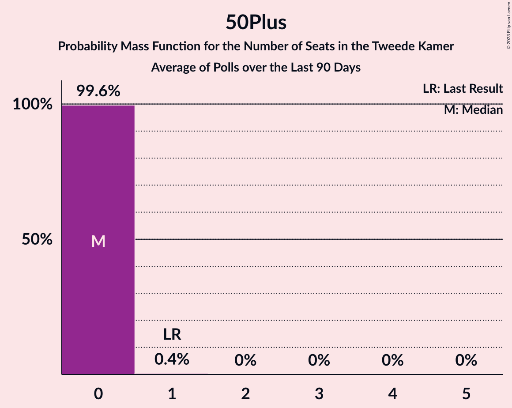

# Poll Average

<a href="#voting-intentions">Voting Intentions</a> | <a href="#seats">Seats</a> | <a href="#coalitions">Coalitions</a> | <a href="#technical-information">Technical Information</a>

## Summary

The table below lists the polls on which the average is based. They are the most recent polls (less than 90 days old) registered and analyzed so far.

| Period     | Polling firm/Commissioner(s) | VVD | PVV | CDA | D66 | GL | SP | PvdA | CU | PvdD | 50+ | SGP | DENK | FvD | PP | B1 | PvdT |
|:----------:|:----------------------------:|:--:|:--:|:--:|:--:|:--:|:--:|:--:|:--:|:--:|:--:|:--:|:--:|:--:|:--:|:--:|:--:|
| 15 March 2017 | General Election | 21.3%   33 | 13.1%   20 | 12.4%   19 | 12.2%   19 | 9.1%   14 | 9.1%   14 | 5.7%   9 | 3.4%   5 | 3.2%   5 | 3.1%   4 | 2.1%   3 | 2.1%   3 | 1.8%   2 | 0.3%   0 | 0.3%   0 | 0.0%   0 |
| N/A | Poll Average | 21–29%   34–47 | 9–13%   13–20 | 8–12%   11–20 | 7–11%   10–16 | 7–12%   11–20 | 5–9%   8–14 | 7–11%   10–15 | 3–6%   3–8 | 2–4%   3–7 | 0–2%   0–3 | 1–4%   2–5 | 0–2%   0–3 | 5–10%   8–17 | N/A   N/A | N/A   N/A | 0–1%   0–2 |
| [19 July 2020](2020-07-19-Peilnl.html) | Peil.nl | 21–23%   34–35 | 11–13%   18–20 | 10–12%   17 | 8–10%   13–15 | 7–9%   11–12 | 6–8%   10–11 | 9–11%   15 | 4–5%   6–7 | 3–4%   4–5 | 0–1%   0–1 | 2–3%   3–4 | 0–1%   0–1 | 7–9%   12 | N/A   N/A | N/A   N/A | 0–1%   0–1 |
| [3–6 July 2020](2020-07-06-IOResearch.html) | I&O Research | 23–27%   37–41 | 9–12%   15–18 | 10–12%   15–18 | 8–10%   12–16 | 9–12%   15–18 | 5–7%   8–10 | 7–9%   10–14 | 4–5%   5–8 | 2–4%   4–5 | 0–1%   0–1 | 2–4%   3–5 | 0–1%   0–1 | 7–9%   11–13 | N/A   N/A | N/A   N/A | 0–1%   0 |
| [27–30 June 2020](2020-06-30-Ipsos.html) | Ipsos   EenVandaag | 25–30%   37–46 | 9–13%   13–20 | 9–13%   14–21 | 8–11%   10–18 | 7–10%   11–16 | 5–8%   8–14 | 6–10%   10–14 | 4–6%   4–9 | 2–5%   3–7 | 0–1%   0–1 | 1–3%   2–5 | 1–2%   0–3 | 5–8%   6–12 | N/A   N/A | N/A   N/A | 0–1%   0–2 |
| [23–26 June 2020](2020-06-26-KantarPublic.html) | Kantar Public | 24–30%   37–47 | 8–12%   12–19 | 8–11%   10–15 | 6–10%   9–14 | 8–12%   13–20 | 6–10%   9–15 | 6–10%   8–14 | 2–5%   3–7 | 2–4%   2–5 | 1–2%   0–4 | 1–3%   2–4 | 1–2%   1–3 | 7–11%   10–17 | N/A   N/A | N/A   N/A | 0–1%   0–2 |
| 15 March 2017 | General Election | 21.3%   33 | 13.1%   20 | 12.4%   19 | 12.2%   19 | 9.1%   14 | 9.1%   14 | 5.7%   9 | 3.4%   5 | 3.2%   5 | 3.1%   4 | 2.1%   3 | 2.1%   3 | 1.8%   2 | 0.3%   0 | 0.3%   0 | 0.0%   0 |

Only polls for which at least the sample size has been published are included in the table above.

**Legend:**
+ **Top half of each row:** Voting intentions (95% confidence interval)
+ **Bottom half of each row:** Seat projections for the Tweede Kamer (95% confidence interval)
+ **VVD:** Volkspartij voor Vrijheid en Democratie
+ **PVV:** Partij voor de Vrijheid
+ **CDA:** Christen-Democratisch Appèl
+ **D66:** Democraten 66
+ **GL:** GroenLinks
+ **SP:** Socialistische Partij
+ **PvdA:** Partij van de Arbeid
+ **CU:** ChristenUnie
+ **PvdD:** Partij voor de Dieren
+ **50+:** 50Plus
+ **SGP:** Staatkundig Gereformeerde Partij
+ **DENK:** DENK
+ **FvD:** Forum voor Democratie
+ **PP:** Piratenpartij
+ **B1:** Bij1
+ **PvdT:** Partij voor de Toekomst
+ **N/A (single party):** Party not included the published results
+ **N/A (entire row):** Calculation for this opinion poll not started yet

## Voting Intentions

### Confidence Intervals

| Party | Last Result | Median | 80% Confidence Interval | 90% Confidence Interval | 95% Confidence Interval | 99% Confidence Interval |
|:-----:|:-----------:|:------:|:-----------------------:|:-----------------------:|:-----------------------:|:-----------------------:|
| <a href="#volkspartij-voor-vrijheid-en-democratie">Volkspartij voor Vrijheid en Democratie</a> | 21.3% | 25.5% | 21.8–28.2% |21.3–28.9% | 21.0–29.4% | 20.4–30.4% |
| <a href="#partij-voor-de-vrijheid">Partij voor de Vrijheid</a> | 13.1% | 10.8% | 9.4–12.3% |9.0–12.6% | 8.7–12.8% | 8.1–13.3% |
| <a href="#christen-democratisch-appèl">Christen-Democratisch Appèl</a> | 12.4% | 10.8% | 9.0–11.9% |8.6–12.2% | 8.2–12.4% | 7.5–12.9% |
| <a href="#democraten-66">Democraten 66</a> | 12.2% | 9.1% | 7.7–10.1% |7.3–10.4% | 6.9–10.7% | 6.3–11.3% |
| <a href="#groenlinks">GroenLinks</a> | 9.1% | 9.3% | 7.7–10.9% |7.5–11.3% | 7.3–11.6% | 6.9–12.3% |
| <a href="#socialistische-partij">Socialistische Partij</a> | 9.1% | 6.7% | 5.8–8.3% |5.6–8.8% | 5.4–9.3% | 5.0–10.1% |
| <a href="#partij-van-de-arbeid">Partij van de Arbeid</a> | 5.7% | 8.4% | 7.2–10.2% |6.9–10.5% | 6.7–10.8% | 6.2–11.2% |
| <a href="#christenunie">ChristenUnie</a> | 3.4% | 4.4% | 3.2–5.2% |2.9–5.4% | 2.7–5.6% | 2.3–6.2% |
| <a href="#partij-voor-de-dieren">Partij voor de Dieren</a> | 3.2% | 3.2% | 2.5–3.8% |2.3–4.0% | 2.1–4.2% | 1.8–4.7% |
| <a href="#50plus">50Plus</a> | 3.1% | 0.7% | 0.4–1.5% |0.4–1.8% | 0.3–2.0% | 0.3–2.4% |
| <a href="#staatkundig-gereformeerde-partij">Staatkundig Gereformeerde Partij</a> | 2.1% | 2.5% | 1.7–3.1% |1.5–3.3% | 1.4–3.5% | 1.2–3.8% |
| <a href="#denk">DENK</a> | 2.1% | 0.9% | 0.5–1.7% |0.4–1.9% | 0.4–2.1% | 0.3–2.5% |
| <a href="#forum-voor-democratie">Forum voor Democratie</a> | 1.8% | 7.9% | 5.8–9.1% |5.4–9.5% | 5.1–10.0% | 4.6–10.8% |
| <a href="#piratenpartij">Piratenpartij</a> | 0.3% | N/A | N/A |N/A | N/A | N/A |
| <a href="#bij1">Bij1</a> | 0.3% | N/A | N/A |N/A | N/A | N/A |
| <a href="#partij-voor-de-toekomst">Partij voor de Toekomst</a> | 0.0% | 0.6% | 0.3–1.0% |0.3–1.2% | 0.3–1.3% | 0.2–1.6% |

### Volkspartij voor Vrijheid en Democratie

*For a full overview of the results for this party, see the [Volkspartij voor Vrijheid en Democratie](party-volkspartijvoorvrijheidendemocratie.html) page.*

| Voting Intentions | Probability | Accumulated | Special Marks |
|:-----------------:|:-----------:|:-----------:|:-------------:|
| 18.5–19.5% | 0% | 100% |  |
| 19.5–20.5% | 0.7% | 100% |  |
| 20.5–21.5% | 6% | 99.3% | Last Result |
| 21.5–22.5% | 12% | 93% |  |
| 22.5–23.5% | 7% | 80% |  |
| 23.5–24.5% | 9% | 73% |  |
| 24.5–25.5% | 16% | 64% | Median |
| 25.5–26.5% | 16% | 49% |  |
| 26.5–27.5% | 15% | 32% |  |
| 27.5–28.5% | 10% | 18% |  |
| 28.5–29.5% | 5% | 7% |  |
| 29.5–30.5% | 2% | 2% |  |
| 30.5–31.5% | 0.4% | 0.4% |  |
| 31.5–32.5% | 0% | 0.1% |  |
| 32.5–33.5% | 0% | 0% |  |

### Partij voor de Vrijheid

*For a full overview of the results for this party, see the [Partij voor de Vrijheid](party-partijvoordevrijheid.html) page.*

| Voting Intentions | Probability | Accumulated | Special Marks |
|:-----------------:|:-----------:|:-----------:|:-------------:|
| 5.5–6.5% | 0% | 100% |  |
| 6.5–7.5% | 0.1% | 100% |  |
| 7.5–8.5% | 2% | 99.9% |  |
| 8.5–9.5% | 11% | 98% |  |
| 9.5–10.5% | 30% | 87% |  |
| 10.5–11.5% | 30% | 57% | Median |
| 11.5–12.5% | 21% | 27% |  |
| 12.5–13.5% | 5% | 5% | Last Result |
| 13.5–14.5% | 0.2% | 0.2% |  |
| 14.5–15.5% | 0% | 0% |  |

### Christen-Democratisch Appèl

*For a full overview of the results for this party, see the [Christen-Democratisch Appèl](party-christen-democratischappèl.html) page.*

| Voting Intentions | Probability | Accumulated | Special Marks |
|:-----------------:|:-----------:|:-----------:|:-------------:|
| 5.5–6.5% | 0% | 100% |  |
| 6.5–7.5% | 0.5% | 100% |  |
| 7.5–8.5% | 4% | 99.5% |  |
| 8.5–9.5% | 12% | 95% |  |
| 9.5–10.5% | 23% | 83% |  |
| 10.5–11.5% | 40% | 60% | Median |
| 11.5–12.5% | 18% | 20% | Last Result |
| 12.5–13.5% | 2% | 2% |  |
| 13.5–14.5% | 0.1% | 0.1% |  |
| 14.5–15.5% | 0% | 0% |  |

### Democraten 66

*For a full overview of the results for this party, see the [Democraten 66](party-democraten66.html) page.*

| Voting Intentions | Probability | Accumulated | Special Marks |
|:-----------------:|:-----------:|:-----------:|:-------------:|
| 4.5–5.5% | 0% | 100% |  |
| 5.5–6.5% | 1.0% | 100% |  |
| 6.5–7.5% | 7% | 99.0% |  |
| 7.5–8.5% | 21% | 92% |  |
| 8.5–9.5% | 45% | 72% | Median |
| 9.5–10.5% | 23% | 26% |  |
| 10.5–11.5% | 3% | 3% |  |
| 11.5–12.5% | 0.3% | 0.3% | Last Result |
| 12.5–13.5% | 0% | 0% |  |

### GroenLinks

*For a full overview of the results for this party, see the [GroenLinks](party-groenlinks.html) page.*

| Voting Intentions | Probability | Accumulated | Special Marks |
|:-----------------:|:-----------:|:-----------:|:-------------:|
| 4.5–5.5% | 0% | 100% |  |
| 5.5–6.5% | 0.1% | 100% |  |
| 6.5–7.5% | 6% | 99.9% |  |
| 7.5–8.5% | 28% | 94% |  |
| 8.5–9.5% | 23% | 66% | Last Result, Median |
| 9.5–10.5% | 26% | 44% |  |
| 10.5–11.5% | 15% | 18% |  |
| 11.5–12.5% | 3% | 3% |  |
| 12.5–13.5% | 0.2% | 0.3% |  |
| 13.5–14.5% | 0% | 0% |  |

### Socialistische Partij

*For a full overview of the results for this party, see the [Socialistische Partij](party-socialistischepartij.html) page.*

| Voting Intentions | Probability | Accumulated | Special Marks |
|:-----------------:|:-----------:|:-----------:|:-------------:|
| 3.5–4.5% | 0% | 100% |  |
| 4.5–5.5% | 5% | 100% |  |
| 5.5–6.5% | 36% | 95% |  |
| 6.5–7.5% | 37% | 59% | Median |
| 7.5–8.5% | 15% | 22% |  |
| 8.5–9.5% | 6% | 8% | Last Result |
| 9.5–10.5% | 1.3% | 1.5% |  |
| 10.5–11.5% | 0.1% | 0.1% |  |
| 11.5–12.5% | 0% | 0% |  |

### Partij van de Arbeid

*For a full overview of the results for this party, see the [Partij van de Arbeid](party-partijvandearbeid.html) page.*

| Voting Intentions | Probability | Accumulated | Special Marks |
|:-----------------:|:-----------:|:-----------:|:-------------:|
| 4.5–5.5% | 0% | 100% |  |
| 5.5–6.5% | 2% | 100% | Last Result |
| 6.5–7.5% | 17% | 98% |  |
| 7.5–8.5% | 37% | 81% | Median |
| 8.5–9.5% | 21% | 44% |  |
| 9.5–10.5% | 18% | 23% |  |
| 10.5–11.5% | 4% | 4% |  |
| 11.5–12.5% | 0.1% | 0.1% |  |
| 12.5–13.5% | 0% | 0% |  |

### ChristenUnie

*For a full overview of the results for this party, see the [ChristenUnie](party-christenunie.html) page.*

| Voting Intentions | Probability | Accumulated | Special Marks |
|:-----------------:|:-----------:|:-----------:|:-------------:|
| 0.5–1.5% | 0% | 100% |  |
| 1.5–2.5% | 2% | 100% |  |
| 2.5–3.5% | 15% | 98% | Last Result |
| 3.5–4.5% | 43% | 84% | Median |
| 4.5–5.5% | 38% | 41% |  |
| 5.5–6.5% | 3% | 3% |  |
| 6.5–7.5% | 0.1% | 0.1% |  |
| 7.5–8.5% | 0% | 0% |  |

### Partij voor de Dieren

*For a full overview of the results for this party, see the [Partij voor de Dieren](party-partijvoordedieren.html) page.*

| Voting Intentions | Probability | Accumulated | Special Marks |
|:-----------------:|:-----------:|:-----------:|:-------------:|
| 0.5–1.5% | 0.1% | 100% |  |
| 1.5–2.5% | 12% | 99.9% |  |
| 2.5–3.5% | 66% | 88% | Last Result, Median |
| 3.5–4.5% | 21% | 22% |  |
| 4.5–5.5% | 0.7% | 0.8% |  |
| 5.5–6.5% | 0% | 0% |  |

### 50Plus

*For a full overview of the results for this party, see the [50Plus](party-50plus.html) page.*

| Voting Intentions | Probability | Accumulated | Special Marks |
|:-----------------:|:-----------:|:-----------:|:-------------:|
| 0.0–0.5% | 22% | 100% |  |
| 0.5–1.5% | 69% | 78% | Median |
| 1.5–2.5% | 9% | 9% |  |
| 2.5–3.5% | 0.2% | 0.2% | Last Result |
| 3.5–4.5% | 0% | 0% |  |

### Staatkundig Gereformeerde Partij

*For a full overview of the results for this party, see the [Staatkundig Gereformeerde Partij](party-staatkundiggereformeerdepartij.html) page.*

| Voting Intentions | Probability | Accumulated | Special Marks |
|:-----------------:|:-----------:|:-----------:|:-------------:|
| 0.0–0.5% | 0% | 100% |  |
| 0.5–1.5% | 6% | 100% |  |
| 1.5–2.5% | 48% | 94% | Last Result, Median |
| 2.5–3.5% | 45% | 47% |  |
| 3.5–4.5% | 2% | 2% |  |
| 4.5–5.5% | 0% | 0% |  |

### DENK

*For a full overview of the results for this party, see the [DENK](party-denk.html) page.*

| Voting Intentions | Probability | Accumulated | Special Marks |
|:-----------------:|:-----------:|:-----------:|:-------------:|
| 0.0–0.5% | 16% | 100% |  |
| 0.5–1.5% | 67% | 84% | Median |
| 1.5–2.5% | 17% | 17% | Last Result |
| 2.5–3.5% | 0.3% | 0.3% |  |
| 3.5–4.5% | 0% | 0% |  |

### Forum voor Democratie

*For a full overview of the results for this party, see the [Forum voor Democratie](party-forumvoordemocratie.html) page.*

| Voting Intentions | Probability | Accumulated | Special Marks |
|:-----------------:|:-----------:|:-----------:|:-------------:|
| 1.5–2.5% | 0% | 100% | Last Result |
| 2.5–3.5% | 0% | 100% |  |
| 3.5–4.5% | 0.4% | 100% |  |
| 4.5–5.5% | 6% | 99.6% |  |
| 5.5–6.5% | 13% | 94% |  |
| 6.5–7.5% | 18% | 81% |  |
| 7.5–8.5% | 41% | 63% | Median |
| 8.5–9.5% | 17% | 22% |  |
| 9.5–10.5% | 4% | 5% |  |
| 10.5–11.5% | 0.8% | 0.8% |  |
| 11.5–12.5% | 0.1% | 0.1% |  |
| 12.5–13.5% | 0% | 0% |  |

### Partij voor de Toekomst

*For a full overview of the results for this party, see the [Partij voor de Toekomst](party-partijvoordetoekomst.html) page.*

| Voting Intentions | Probability | Accumulated | Special Marks |
|:-----------------:|:-----------:|:-----------:|:-------------:|
| 0.0–0.5% | 36% | 100% | Last Result |
| 0.5–1.5% | 64% | 64% | Median |
| 1.5–2.5% | 0.5% | 0.5% |  |
| 2.5–3.5% | 0% | 0% |  |

## Seats

### Confidence Intervals

| Party | Last Result | Median | 80% Confidence Interval | 90% Confidence Interval | 95% Confidence Interval | 99% Confidence Interval |
|:-----:|:-----------:|:------:|:-----------------------:|:-----------------------:|:-----------------------:|:-----------------------:|
| <a href="#volkspartij-voor-vrijheid-en-democratie">Volkspartij voor Vrijheid en Democratie</a> | 33 | 40 | 34–43 |34–45 | 34–47 | 34–48 |
| <a href="#partij-voor-de-vrijheid">Partij voor de Vrijheid</a> | 20 | 16 | 13–20 |13–20 | 13–20 | 12–20 |
| <a href="#christen-democratisch-appèl">Christen-Democratisch Appèl</a> | 19 | 17 | 14–17 |12–18 | 11–20 | 10–21 |
| <a href="#democraten-66">Democraten 66</a> | 19 | 13 | 11–15 |10–15 | 10–16 | 9–18 |
| <a href="#groenlinks">GroenLinks</a> | 14 | 14 | 11–17 |11–20 | 11–20 | 10–20 |
| <a href="#socialistische-partij">Socialistische Partij</a> | 14 | 11 | 9–12 |9–13 | 8–14 | 7–15 |
| <a href="#partij-van-de-arbeid">Partij van de Arbeid</a> | 9 | 12 | 11–15 |10–15 | 10–15 | 8–16 |
| <a href="#christenunie">ChristenUnie</a> | 5 | 6 | 5–7 |3–8 | 3–8 | 3–9 |
| <a href="#partij-voor-de-dieren">Partij voor de Dieren</a> | 5 | 4 | 4–5 |3–6 | 3–7 | 2–7 |
| <a href="#50plus">50Plus</a> | 4 | 1 | 0–2 |0–3 | 0–3 | 0–4 |
| <a href="#staatkundig-gereformeerde-partij">Staatkundig Gereformeerde Partij</a> | 3 | 4 | 2–5 |2–5 | 2–5 | 1–5 |
| <a href="#denk">DENK</a> | 3 | 1 | 0–2 |0–2 | 0–3 | 0–3 |
| <a href="#forum-voor-democratie">Forum voor Democratie</a> | 2 | 12 | 9–14 |9–17 | 8–17 | 6–17 |
| <a href="#piratenpartij">Piratenpartij</a> | 0 | N/A | N/A |N/A | N/A | N/A |
| <a href="#bij1">Bij1</a> | 0 | N/A | N/A |N/A | N/A | N/A |
| <a href="#partij-voor-de-toekomst">Partij voor de Toekomst</a> | 0 | 0 | 0–1 |0–2 | 0–2 | 0–2 |

### Volkspartij voor Vrijheid en Democratie

*For a full overview of the results for this party, see the [Volkspartij voor Vrijheid en Democratie](party-volkspartijvoorvrijheidendemocratie.html) page.*

| Number of Seats | Probability | Accumulated | Special Marks |
|:---------------:|:-----------:|:-----------:|:-------------:|
| 32 | 0.2% | 100% |  |
| 33 | 0.2% | 99.8% | Last Result |
| 34 | 24% | 99.6% |  |
| 35 | 1.1% | 76% |  |
| 36 | 0.4% | 75% |  |
| 37 | 6% | 74% |  |
| 38 | 2% | 69% |  |
| 39 | 11% | 66% |  |
| 40 | 12% | 55% | Median |
| 41 | 26% | 44% |  |
| 42 | 6% | 17% |  |
| 43 | 4% | 11% |  |
| 44 | 1.1% | 7% |  |
| 45 | 1.3% | 6% |  |
| 46 | 0.6% | 5% |  |
| 47 | 3% | 4% |  |
| 48 | 0.7% | 0.8% |  |
| 49 | 0.1% | 0.1% |  |
| 50 | 0% | 0% |  |

### Partij voor de Vrijheid

*For a full overview of the results for this party, see the [Partij voor de Vrijheid](party-partijvoordevrijheid.html) page.*

| Number of Seats | Probability | Accumulated | Special Marks |
|:---------------:|:-----------:|:-----------:|:-------------:|
| 11 | 0.1% | 100% |  |
| 12 | 1.1% | 99.9% |  |
| 13 | 14% | 98.8% |  |
| 14 | 5% | 85% |  |
| 15 | 9% | 80% |  |
| 16 | 33% | 71% | Median |
| 17 | 6% | 38% |  |
| 18 | 5% | 32% |  |
| 19 | 2% | 27% |  |
| 20 | 24% | 25% | Last Result |
| 21 | 0.4% | 0.4% |  |
| 22 | 0% | 0% |  |

### Christen-Democratisch Appèl

*For a full overview of the results for this party, see the [Christen-Democratisch Appèl](party-christen-democratischappèl.html) page.*

| Number of Seats | Probability | Accumulated | Special Marks |
|:---------------:|:-----------:|:-----------:|:-------------:|
| 10 | 2% | 100% |  |
| 11 | 3% | 98% |  |
| 12 | 0.9% | 95% |  |
| 13 | 3% | 94% |  |
| 14 | 11% | 91% |  |
| 15 | 26% | 80% |  |
| 16 | 3% | 55% |  |
| 17 | 44% | 52% | Median |
| 18 | 3% | 8% |  |
| 19 | 2% | 4% | Last Result |
| 20 | 0.3% | 3% |  |
| 21 | 2% | 2% |  |
| 22 | 0% | 0% |  |

### Democraten 66

*For a full overview of the results for this party, see the [Democraten 66](party-democraten66.html) page.*

| Number of Seats | Probability | Accumulated | Special Marks |
|:---------------:|:-----------:|:-----------:|:-------------:|
| 8 | 0.1% | 100% |  |
| 9 | 0.6% | 99.9% |  |
| 10 | 9% | 99.3% |  |
| 11 | 7% | 90% |  |
| 12 | 12% | 83% |  |
| 13 | 25% | 71% | Median |
| 14 | 13% | 46% |  |
| 15 | 29% | 33% |  |
| 16 | 2% | 4% |  |
| 17 | 1.4% | 2% |  |
| 18 | 0.9% | 0.9% |  |
| 19 | 0% | 0% | Last Result |

### GroenLinks

*For a full overview of the results for this party, see the [GroenLinks](party-groenlinks.html) page.*

| Number of Seats | Probability | Accumulated | Special Marks |
|:---------------:|:-----------:|:-----------:|:-------------:|
| 9 | 0.2% | 100% |  |
| 10 | 0.7% | 99.8% |  |
| 11 | 25% | 99.2% |  |
| 12 | 8% | 74% |  |
| 13 | 8% | 66% |  |
| 14 | 12% | 57% | Last Result, Median |
| 15 | 11% | 46% |  |
| 16 | 11% | 35% |  |
| 17 | 15% | 24% |  |
| 18 | 3% | 9% |  |
| 19 | 0.1% | 6% |  |
| 20 | 6% | 6% |  |
| 21 | 0% | 0% |  |

### Socialistische Partij

*For a full overview of the results for this party, see the [Socialistische Partij](party-socialistischepartij.html) page.*

| Number of Seats | Probability | Accumulated | Special Marks |
|:---------------:|:-----------:|:-----------:|:-------------:|
| 6 | 0.1% | 100% |  |
| 7 | 0.7% | 99.9% |  |
| 8 | 3% | 99.2% |  |
| 9 | 28% | 96% |  |
| 10 | 10% | 68% |  |
| 11 | 40% | 58% | Median |
| 12 | 8% | 18% |  |
| 13 | 6% | 9% |  |
| 14 | 1.4% | 4% | Last Result |
| 15 | 2% | 2% |  |
| 16 | 0.1% | 0.2% |  |
| 17 | 0% | 0% |  |

### Partij van de Arbeid

*For a full overview of the results for this party, see the [Partij van de Arbeid](party-partijvandearbeid.html) page.*

| Number of Seats | Probability | Accumulated | Special Marks |
|:---------------:|:-----------:|:-----------:|:-------------:|
| 8 | 0.7% | 100% |  |
| 9 | 0.9% | 99.3% | Last Result |
| 10 | 4% | 98% |  |
| 11 | 21% | 95% |  |
| 12 | 30% | 74% | Median |
| 13 | 12% | 44% |  |
| 14 | 7% | 32% |  |
| 15 | 25% | 26% |  |
| 16 | 0.3% | 0.7% |  |
| 17 | 0.4% | 0.5% |  |
| 18 | 0% | 0% |  |

### ChristenUnie

*For a full overview of the results for this party, see the [ChristenUnie](party-christenunie.html) page.*

| Number of Seats | Probability | Accumulated | Special Marks |
|:---------------:|:-----------:|:-----------:|:-------------:|
| 2 | 0.1% | 100% |  |
| 3 | 6% | 99.9% |  |
| 4 | 4% | 94% |  |
| 5 | 22% | 91% | Last Result |
| 6 | 53% | 69% | Median |
| 7 | 7% | 16% |  |
| 8 | 7% | 9% |  |
| 9 | 0.9% | 1.3% |  |
| 10 | 0.4% | 0.4% |  |
| 11 | 0% | 0% |  |

### Partij voor de Dieren

*For a full overview of the results for this party, see the [Partij voor de Dieren](party-partijvoordedieren.html) page.*

| Number of Seats | Probability | Accumulated | Special Marks |
|:---------------:|:-----------:|:-----------:|:-------------:|
| 2 | 0.9% | 100% |  |
| 3 | 8% | 99.1% |  |
| 4 | 64% | 91% | Median |
| 5 | 20% | 27% | Last Result |
| 6 | 3% | 7% |  |
| 7 | 5% | 5% |  |
| 8 | 0.1% | 0.1% |  |
| 9 | 0% | 0% |  |

### 50Plus

*For a full overview of the results for this party, see the [50Plus](party-50plus.html) page.*

| Number of Seats | Probability | Accumulated | Special Marks |
|:---------------:|:-----------:|:-----------:|:-------------:|
| 0 | 32% | 100% |  |
| 1 | 53% | 68% | Median |
| 2 | 8% | 14% |  |
| 3 | 5% | 6% |  |
| 4 | 0.8% | 0.8% | Last Result |
| 5 | 0% | 0% |  |

### Staatkundig Gereformeerde Partij

*For a full overview of the results for this party, see the [Staatkundig Gereformeerde Partij](party-staatkundiggereformeerdepartij.html) page.*

| Number of Seats | Probability | Accumulated | Special Marks |
|:---------------:|:-----------:|:-----------:|:-------------:|
| 1 | 0.7% | 100% |  |
| 2 | 17% | 99.3% |  |
| 3 | 14% | 82% | Last Result |
| 4 | 44% | 68% | Median |
| 5 | 24% | 24% |  |
| 6 | 0.1% | 0.1% |  |
| 7 | 0% | 0% |  |

### DENK

*For a full overview of the results for this party, see the [DENK](party-denk.html) page.*

| Number of Seats | Probability | Accumulated | Special Marks |
|:---------------:|:-----------:|:-----------:|:-------------:|
| 0 | 50% | 100% |  |
| 1 | 25% | 50% | Median |
| 2 | 22% | 25% |  |
| 3 | 3% | 3% | Last Result |
| 4 | 0.3% | 0.3% |  |
| 5 | 0% | 0% |  |

### Forum voor Democratie

*For a full overview of the results for this party, see the [Forum voor Democratie](party-forumvoordemocratie.html) page.*

| Number of Seats | Probability | Accumulated | Special Marks |
|:---------------:|:-----------:|:-----------:|:-------------:|
| 2 | 0% | 100% | Last Result |
| 3 | 0% | 100% |  |
| 4 | 0% | 100% |  |
| 5 | 0% | 100% |  |
| 6 | 0.9% | 100% |  |
| 7 | 0.3% | 99.1% |  |
| 8 | 2% | 98.7% |  |
| 9 | 6% | 96% |  |
| 10 | 11% | 90% |  |
| 11 | 23% | 79% |  |
| 12 | 31% | 56% | Median |
| 13 | 12% | 24% |  |
| 14 | 7% | 13% |  |
| 15 | 0.7% | 6% |  |
| 16 | 0.3% | 6% |  |
| 17 | 5% | 5% |  |
| 18 | 0.1% | 0.2% |  |
| 19 | 0.1% | 0.1% |  |
| 20 | 0% | 0% |  |

### Piratenpartij

*For a full overview of the results for this party, see the [Piratenpartij](party-piratenpartij.html) page.*

### Bij1

*For a full overview of the results for this party, see the [Bij1](party-bij1.html) page.*

### Partij voor de Toekomst

*For a full overview of the results for this party, see the [Partij voor de Toekomst](party-partijvoordetoekomst.html) page.*

| Number of Seats | Probability | Accumulated | Special Marks |
|:---------------:|:-----------:|:-----------:|:-------------:|
| 0 | 69% | 100% | Last Result, Median |
| 1 | 24% | 31% |  |
| 2 | 6% | 6% |  |
| 3 | 0.1% | 0.1% |  |
| 4 | 0% | 0% |  |

## Coalitions

### Confidence Intervals

| Coalition | Last Result | Median | Majority? | 80% Confidence Interval | 90% Confidence Interval | 95% Confidence Interval | 99% Confidence Interval |
|:---------:|:-----------:|:------:|:---------:|:-----------------------:|:-----------------------:|:-----------------------:|:-----------------------:|
| Volkspartij voor Vrijheid en Democratie – Christen-Democratisch Appèl – Democraten 66 – GroenLinks – ChristenUnie | 90 | 89 | 100% | 83–93 | 83–93 | 83–94 | 81–96 |
| Volkspartij voor Vrijheid en Democratie – Christen-Democratisch Appèl – Democraten 66 – Partij van de Arbeid – ChristenUnie | 85 | 87 | 100% | 83–90 | 82–91 | 81–92 | 79–95 |
| Volkspartij voor Vrijheid en Democratie – Partij voor de Vrijheid – Christen-Democratisch Appèl – Staatkundig Gereformeerde Partij – Forum voor Democratie | 77 | 87 | 100% | 83–90 | 83–90 | 81–91 | 79–94 |
| Volkspartij voor Vrijheid en Democratie – Partij voor de Vrijheid – Christen-Democratisch Appèl – Forum voor Democratie | 74 | 83 | 98.6% | 80–87 | 79–87 | 78–88 | 75–90 |
| Volkspartij voor Vrijheid en Democratie – Christen-Democratisch Appèl – Democraten 66 – ChristenUnie | 76 | 74 | 36% | 71–78 | 70–79 | 70–81 | 67–84 |
| Volkspartij voor Vrijheid en Democratie – Christen-Democratisch Appèl – 50Plus – Staatkundig Gereformeerde Partij – Forum voor Democratie | 61 | 71 | 9% | 68–75 | 67–78 | 66–79 | 65–79 |
| Volkspartij voor Vrijheid en Democratie – Partij voor de Vrijheid – Christen-Democratisch Appèl | 72 | 71 | 7% | 68–74 | 68–76 | 66–78 | 65–81 |
| Christen-Democratisch Appèl – Democraten 66 – GroenLinks – Socialistische Partij – Partij van de Arbeid – ChristenUnie | 80 | 73 | 8% | 67–75 | 65–76 | 64–77 | 63–79 |
| Volkspartij voor Vrijheid en Democratie – Christen-Democratisch Appèl – 50Plus – Forum voor Democratie | 58 | 68 | 5% | 64–72 | 64–75 | 63–77 | 62–77 |
| Volkspartij voor Vrijheid en Democratie – Christen-Democratisch Appèl – Staatkundig Gereformeerde Partij – Forum voor Democratie | 57 | 70 | 7% | 67–74 | 66–76 | 66–76 | 65–77 |
| Volkspartij voor Vrijheid en Democratie – Christen-Democratisch Appèl – Democraten 66 | 71 | 68 | 0.9% | 65–72 | 64–73 | 64–74 | 63–76 |
| Volkspartij voor Vrijheid en Democratie – Christen-Democratisch Appèl – Forum voor Democratie | 54 | 67 | 0.1% | 63–71 | 63–73 | 62–74 | 61–74 |
| Volkspartij voor Vrijheid en Democratie – Christen-Democratisch Appèl – Partij van de Arbeid | 61 | 67 | 0.2% | 65–71 | 65–72 | 63–72 | 62–74 |
| Volkspartij voor Vrijheid en Democratie – Democraten 66 – Partij van de Arbeid | 61 | 65 | 0.1% | 62–68 | 61–69 | 61–71 | 60–72 |
| Christen-Democratisch Appèl – Democraten 66 – GroenLinks – Partij van de Arbeid – ChristenUnie | 66 | 64 | 0% | 55–64 | 55–65 | 53–67 | 52–68 |
| Volkspartij voor Vrijheid en Democratie – Christen-Democratisch Appèl | 52 | 55 | 0% | 51–58 | 51–60 | 51–61 | 50–62 |
| Volkspartij voor Vrijheid en Democratie – Partij van de Arbeid | 42 | 51 | 0% | 49–55 | 49–57 | 48–58 | 47–60 |
| Christen-Democratisch Appèl – Democraten 66 – Partij van de Arbeid | 47 | 42 | 0% | 36–47 | 35–47 | 34–47 | 34–48 |
| Christen-Democratisch Appèl – Partij van de Arbeid – ChristenUnie | 33 | 34 | 0% | 30–38 | 30–38 | 28–38 | 25–41 |
| Christen-Democratisch Appèl – Democraten 66 | 38 | 30 | 0% | 25–32 | 23–33 | 23–34 | 21–34 |
| Christen-Democratisch Appèl – Partij van de Arbeid | 28 | 29 | 0% | 25–32 | 24–32 | 23–33 | 22–34 |

### Volkspartij voor Vrijheid en Democratie – Christen-Democratisch Appèl – Democraten 66 – GroenLinks – ChristenUnie

| Number of Seats | Probability | Accumulated | Special Marks |
|:---------------:|:-----------:|:-----------:|:-------------:|
| 79 | 0% | 100% |  |
| 80 | 0.3% | 99.9% |  |
| 81 | 0.4% | 99.6% |  |
| 82 | 0.3% | 99.3% |  |
| 83 | 24% | 99.0% |  |
| 84 | 4% | 75% |  |
| 85 | 5% | 71% |  |
| 86 | 3% | 66% |  |
| 87 | 0.5% | 63% |  |
| 88 | 4% | 62% |  |
| 89 | 12% | 58% |  |
| 90 | 11% | 46% | Last Result, Median |
| 91 | 14% | 36% |  |
| 92 | 2% | 22% |  |
| 93 | 17% | 20% |  |
| 94 | 2% | 3% |  |
| 95 | 0.2% | 1.3% |  |
| 96 | 0.7% | 1.1% |  |
| 97 | 0.3% | 0.4% |  |
| 98 | 0% | 0.1% |  |
| 99 | 0% | 0% |  |

### Volkspartij voor Vrijheid en Democratie – Christen-Democratisch Appèl – Democraten 66 – Partij van de Arbeid – ChristenUnie

| Number of Seats | Probability | Accumulated | Special Marks |
|:---------------:|:-----------:|:-----------:|:-------------:|
| 76 | 0% | 100% | Majority |
| 77 | 0.1% | 99.9% |  |
| 78 | 0.1% | 99.8% |  |
| 79 | 2% | 99.7% |  |
| 80 | 0.3% | 98% |  |
| 81 | 0.4% | 98% |  |
| 82 | 6% | 97% |  |
| 83 | 8% | 91% |  |
| 84 | 1.2% | 83% |  |
| 85 | 10% | 81% | Last Result |
| 86 | 5% | 72% |  |
| 87 | 30% | 67% |  |
| 88 | 16% | 37% | Median |
| 89 | 7% | 21% |  |
| 90 | 8% | 14% |  |
| 91 | 3% | 5% |  |
| 92 | 0.5% | 3% |  |
| 93 | 0.4% | 2% |  |
| 94 | 0.9% | 2% |  |
| 95 | 0.6% | 0.9% |  |
| 96 | 0.1% | 0.2% |  |
| 97 | 0% | 0.1% |  |
| 98 | 0% | 0.1% |  |
| 99 | 0.1% | 0.1% |  |
| 100 | 0% | 0% |  |

### Volkspartij voor Vrijheid en Democratie – Partij voor de Vrijheid – Christen-Democratisch Appèl – Staatkundig Gereformeerde Partij – Forum voor Democratie

| Number of Seats | Probability | Accumulated | Special Marks |
|:---------------:|:-----------:|:-----------:|:-------------:|
| 77 | 0% | 100% | Last Result |
| 78 | 0.2% | 100% |  |
| 79 | 2% | 99.8% |  |
| 80 | 0.5% | 98% |  |
| 81 | 0.2% | 98% |  |
| 82 | 0.7% | 97% |  |
| 83 | 11% | 97% |  |
| 84 | 6% | 86% |  |
| 85 | 6% | 79% |  |
| 86 | 7% | 74% |  |
| 87 | 27% | 67% |  |
| 88 | 10% | 39% |  |
| 89 | 5% | 29% | Median |
| 90 | 22% | 25% |  |
| 91 | 0.5% | 3% |  |
| 92 | 1.5% | 2% |  |
| 93 | 0.2% | 0.8% |  |
| 94 | 0.6% | 0.6% |  |
| 95 | 0% | 0% |  |

### Volkspartij voor Vrijheid en Democratie – Partij voor de Vrijheid – Christen-Democratisch Appèl – Forum voor Democratie

| Number of Seats | Probability | Accumulated | Special Marks |
|:---------------:|:-----------:|:-----------:|:-------------:|
| 74 | 0% | 100% | Last Result |
| 75 | 1.4% | 100% |  |
| 76 | 0.3% | 98.6% | Majority |
| 77 | 0.5% | 98% |  |
| 78 | 0.8% | 98% |  |
| 79 | 4% | 97% |  |
| 80 | 5% | 93% |  |
| 81 | 9% | 88% |  |
| 82 | 11% | 79% |  |
| 83 | 34% | 69% |  |
| 84 | 2% | 34% |  |
| 85 | 17% | 33% | Median |
| 86 | 5% | 16% |  |
| 87 | 7% | 10% |  |
| 88 | 0.8% | 3% |  |
| 89 | 0.5% | 2% |  |
| 90 | 2% | 2% |  |
| 91 | 0% | 0.1% |  |
| 92 | 0% | 0% |  |

### Volkspartij voor Vrijheid en Democratie – Christen-Democratisch Appèl – Democraten 66 – ChristenUnie

| Number of Seats | Probability | Accumulated | Special Marks |
|:---------------:|:-----------:|:-----------:|:-------------:|
| 64 | 0% | 100% |  |
| 65 | 0.1% | 99.9% |  |
| 66 | 0.2% | 99.8% |  |
| 67 | 0.1% | 99.6% |  |
| 68 | 2% | 99.5% |  |
| 69 | 0.3% | 98% |  |
| 70 | 3% | 98% |  |
| 71 | 12% | 94% |  |
| 72 | 27% | 82% |  |
| 73 | 3% | 55% |  |
| 74 | 9% | 52% |  |
| 75 | 7% | 43% |  |
| 76 | 20% | 36% | Last Result, Median, Majority |
| 77 | 6% | 17% |  |
| 78 | 6% | 11% |  |
| 79 | 2% | 5% |  |
| 80 | 0.7% | 3% |  |
| 81 | 1.3% | 3% |  |
| 82 | 0.5% | 1.5% |  |
| 83 | 0.2% | 1.0% |  |
| 84 | 0.4% | 0.8% |  |
| 85 | 0.3% | 0.4% |  |
| 86 | 0% | 0% |  |

### Volkspartij voor Vrijheid en Democratie – Christen-Democratisch Appèl – 50Plus – Staatkundig Gereformeerde Partij – Forum voor Democratie

| Number of Seats | Probability | Accumulated | Special Marks |
|:---------------:|:-----------:|:-----------:|:-------------:|
| 61 | 0% | 100% | Last Result |
| 62 | 0% | 100% |  |
| 63 | 0.1% | 100% |  |
| 64 | 0% | 99.9% |  |
| 65 | 0.4% | 99.9% |  |
| 66 | 3% | 99.5% |  |
| 67 | 4% | 97% |  |
| 68 | 30% | 93% |  |
| 69 | 6% | 63% |  |
| 70 | 6% | 57% |  |
| 71 | 2% | 50% |  |
| 72 | 4% | 48% |  |
| 73 | 8% | 44% |  |
| 74 | 23% | 36% | Median |
| 75 | 5% | 14% |  |
| 76 | 1.0% | 9% | Majority |
| 77 | 2% | 8% |  |
| 78 | 2% | 6% |  |
| 79 | 4% | 4% |  |
| 80 | 0% | 0.1% |  |
| 81 | 0% | 0.1% |  |
| 82 | 0% | 0% |  |

### Volkspartij voor Vrijheid en Democratie – Partij voor de Vrijheid – Christen-Democratisch Appèl

| Number of Seats | Probability | Accumulated | Special Marks |
|:---------------:|:-----------:|:-----------:|:-------------:|
| 63 | 0% | 100% |  |
| 64 | 0.2% | 99.9% |  |
| 65 | 2% | 99.7% |  |
| 66 | 0.7% | 98% |  |
| 67 | 1.0% | 97% |  |
| 68 | 10% | 96% |  |
| 69 | 4% | 87% |  |
| 70 | 15% | 83% |  |
| 71 | 30% | 67% |  |
| 72 | 5% | 37% | Last Result |
| 73 | 6% | 32% | Median |
| 74 | 18% | 25% |  |
| 75 | 1.2% | 8% |  |
| 76 | 3% | 7% | Majority |
| 77 | 0.9% | 4% |  |
| 78 | 1.0% | 3% |  |
| 79 | 0.9% | 2% |  |
| 80 | 0.1% | 0.9% |  |
| 81 | 0.2% | 0.7% |  |
| 82 | 0.5% | 0.5% |  |
| 83 | 0% | 0% |  |

### Christen-Democratisch Appèl – Democraten 66 – GroenLinks – Socialistische Partij – Partij van de Arbeid – ChristenUnie

| Number of Seats | Probability | Accumulated | Special Marks |
|:---------------:|:-----------:|:-----------:|:-------------:|
| 63 | 0.9% | 100% |  |
| 64 | 3% | 99.0% |  |
| 65 | 1.4% | 96% |  |
| 66 | 0.8% | 94% |  |
| 67 | 6% | 94% |  |
| 68 | 3% | 88% |  |
| 69 | 3% | 85% |  |
| 70 | 2% | 81% |  |
| 71 | 10% | 79% |  |
| 72 | 5% | 69% |  |
| 73 | 25% | 64% | Median |
| 74 | 4% | 39% |  |
| 75 | 27% | 35% |  |
| 76 | 5% | 8% | Majority |
| 77 | 2% | 4% |  |
| 78 | 1.3% | 2% |  |
| 79 | 0.4% | 0.5% |  |
| 80 | 0.1% | 0.1% | Last Result |
| 81 | 0% | 0% |  |

### Volkspartij voor Vrijheid en Democratie – Christen-Democratisch Appèl – 50Plus – Forum voor Democratie

| Number of Seats | Probability | Accumulated | Special Marks |
|:---------------:|:-----------:|:-----------:|:-------------:|
| 58 | 0% | 100% | Last Result |
| 59 | 0% | 100% |  |
| 60 | 0.2% | 100% |  |
| 61 | 0.2% | 99.8% |  |
| 62 | 2% | 99.6% |  |
| 63 | 1.3% | 98% |  |
| 64 | 27% | 97% |  |
| 65 | 9% | 70% |  |
| 66 | 6% | 61% |  |
| 67 | 5% | 55% |  |
| 68 | 10% | 50% |  |
| 69 | 15% | 41% |  |
| 70 | 10% | 25% | Median |
| 71 | 2% | 15% |  |
| 72 | 6% | 13% |  |
| 73 | 0.8% | 8% |  |
| 74 | 2% | 7% |  |
| 75 | 0.2% | 5% |  |
| 76 | 0.4% | 5% | Majority |
| 77 | 4% | 4% |  |
| 78 | 0% | 0.1% |  |
| 79 | 0% | 0% |  |

### Volkspartij voor Vrijheid en Democratie – Christen-Democratisch Appèl – Staatkundig Gereformeerde Partij – Forum voor Democratie

| Number of Seats | Probability | Accumulated | Special Marks |
|:---------------:|:-----------:|:-----------:|:-------------:|
| 57 | 0% | 100% | Last Result |
| 58 | 0% | 100% |  |
| 59 | 0% | 100% |  |
| 60 | 0% | 100% |  |
| 61 | 0% | 100% |  |
| 62 | 0% | 100% |  |
| 63 | 0% | 99.9% |  |
| 64 | 0.2% | 99.9% |  |
| 65 | 0.8% | 99.7% |  |
| 66 | 4% | 98.8% |  |
| 67 | 31% | 94% |  |
| 68 | 7% | 63% |  |
| 69 | 6% | 56% |  |
| 70 | 3% | 51% |  |
| 71 | 1.3% | 47% |  |
| 72 | 9% | 46% |  |
| 73 | 9% | 37% | Median |
| 74 | 19% | 28% |  |
| 75 | 2% | 9% |  |
| 76 | 4% | 7% | Majority |
| 77 | 2% | 2% |  |
| 78 | 0.1% | 0.2% |  |
| 79 | 0% | 0% |  |

### Volkspartij voor Vrijheid en Democratie – Christen-Democratisch Appèl – Democraten 66

| Number of Seats | Probability | Accumulated | Special Marks |
|:---------------:|:-----------:|:-----------:|:-------------:|
| 59 | 0.1% | 100% |  |
| 60 | 0.1% | 99.9% |  |
| 61 | 0.1% | 99.9% |  |
| 62 | 0.2% | 99.8% |  |
| 63 | 0.3% | 99.5% |  |
| 64 | 4% | 99.2% |  |
| 65 | 7% | 95% |  |
| 66 | 27% | 88% |  |
| 67 | 5% | 61% |  |
| 68 | 18% | 56% |  |
| 69 | 3% | 38% |  |
| 70 | 7% | 35% | Median |
| 71 | 18% | 28% | Last Result |
| 72 | 4% | 10% |  |
| 73 | 3% | 6% |  |
| 74 | 1.4% | 3% |  |
| 75 | 0.8% | 2% |  |
| 76 | 0.6% | 0.9% | Majority |
| 77 | 0.1% | 0.3% |  |
| 78 | 0% | 0.2% |  |
| 79 | 0.2% | 0.2% |  |
| 80 | 0% | 0% |  |

### Volkspartij voor Vrijheid en Democratie – Christen-Democratisch Appèl – Forum voor Democratie

| Number of Seats | Probability | Accumulated | Special Marks |
|:---------------:|:-----------:|:-----------:|:-------------:|
| 54 | 0% | 100% | Last Result |
| 55 | 0% | 100% |  |
| 56 | 0% | 100% |  |
| 57 | 0% | 100% |  |
| 58 | 0% | 100% |  |
| 59 | 0% | 100% |  |
| 60 | 0.2% | 100% |  |
| 61 | 0.3% | 99.7% |  |
| 62 | 2% | 99.5% |  |
| 63 | 28% | 97% |  |
| 64 | 6% | 69% |  |
| 65 | 7% | 64% |  |
| 66 | 5% | 57% |  |
| 67 | 12% | 51% |  |
| 68 | 0.9% | 40% |  |
| 69 | 22% | 39% | Median |
| 70 | 5% | 17% |  |
| 71 | 4% | 12% |  |
| 72 | 1.3% | 8% |  |
| 73 | 2% | 7% |  |
| 74 | 5% | 5% |  |
| 75 | 0.2% | 0.3% |  |
| 76 | 0.1% | 0.1% | Majority |
| 77 | 0% | 0% |  |

### Volkspartij voor Vrijheid en Democratie – Christen-Democratisch Appèl – Partij van de Arbeid

| Number of Seats | Probability | Accumulated | Special Marks |
|:---------------:|:-----------:|:-----------:|:-------------:|
| 60 | 0% | 100% |  |
| 61 | 0.2% | 99.9% | Last Result |
| 62 | 1.1% | 99.8% |  |
| 63 | 2% | 98.7% |  |
| 64 | 2% | 97% |  |
| 65 | 11% | 95% |  |
| 66 | 33% | 84% |  |
| 67 | 6% | 51% |  |
| 68 | 5% | 45% |  |
| 69 | 11% | 41% | Median |
| 70 | 20% | 30% |  |
| 71 | 5% | 10% |  |
| 72 | 4% | 6% |  |
| 73 | 0.9% | 2% |  |
| 74 | 0.5% | 0.7% |  |
| 75 | 0% | 0.3% |  |
| 76 | 0.1% | 0.2% | Majority |
| 77 | 0% | 0.1% |  |
| 78 | 0% | 0.1% |  |
| 79 | 0% | 0.1% |  |
| 80 | 0% | 0% |  |

### Volkspartij voor Vrijheid en Democratie – Democraten 66 – Partij van de Arbeid

| Number of Seats | Probability | Accumulated | Special Marks |
|:---------------:|:-----------:|:-----------:|:-------------:|
| 57 | 0.1% | 100% |  |
| 58 | 0.1% | 99.9% |  |
| 59 | 0.1% | 99.8% |  |
| 60 | 1.3% | 99.7% |  |
| 61 | 6% | 98% | Last Result |
| 62 | 3% | 92% |  |
| 63 | 4% | 90% |  |
| 64 | 34% | 85% |  |
| 65 | 8% | 52% | Median |
| 66 | 23% | 44% |  |
| 67 | 9% | 21% |  |
| 68 | 6% | 12% |  |
| 69 | 2% | 6% |  |
| 70 | 0.5% | 4% |  |
| 71 | 3% | 4% |  |
| 72 | 0.5% | 1.0% |  |
| 73 | 0.1% | 0.5% |  |
| 74 | 0.3% | 0.4% |  |
| 75 | 0% | 0.1% |  |
| 76 | 0.1% | 0.1% | Majority |
| 77 | 0% | 0% |  |

### Christen-Democratisch Appèl – Democraten 66 – GroenLinks – Partij van de Arbeid – ChristenUnie

| Number of Seats | Probability | Accumulated | Special Marks |
|:---------------:|:-----------:|:-----------:|:-------------:|
| 51 | 0.1% | 100% |  |
| 52 | 1.5% | 99.9% |  |
| 53 | 2% | 98% |  |
| 54 | 0.5% | 97% |  |
| 55 | 6% | 96% |  |
| 56 | 4% | 90% |  |
| 57 | 1.1% | 86% |  |
| 58 | 3% | 85% |  |
| 59 | 2% | 82% |  |
| 60 | 4% | 80% |  |
| 61 | 6% | 76% |  |
| 62 | 16% | 70% | Median |
| 63 | 3% | 55% |  |
| 64 | 46% | 52% |  |
| 65 | 1.1% | 6% |  |
| 66 | 1.1% | 5% | Last Result |
| 67 | 2% | 4% |  |
| 68 | 1.4% | 2% |  |
| 69 | 0.3% | 0.3% |  |
| 70 | 0% | 0.1% |  |
| 71 | 0% | 0% |  |

### Volkspartij voor Vrijheid en Democratie – Christen-Democratisch Appèl

| Number of Seats | Probability | Accumulated | Special Marks |
|:---------------:|:-----------:|:-----------:|:-------------:|
| 48 | 0% | 100% |  |
| 49 | 0.3% | 99.9% |  |
| 50 | 0.4% | 99.6% |  |
| 51 | 24% | 99.2% |  |
| 52 | 7% | 75% | Last Result |
| 53 | 2% | 68% |  |
| 54 | 11% | 66% |  |
| 55 | 14% | 55% |  |
| 56 | 3% | 41% |  |
| 57 | 9% | 38% | Median |
| 58 | 19% | 28% |  |
| 59 | 1.4% | 10% |  |
| 60 | 6% | 8% |  |
| 61 | 2% | 3% |  |
| 62 | 0.3% | 0.8% |  |
| 63 | 0.2% | 0.4% |  |
| 64 | 0.1% | 0.2% |  |
| 65 | 0.2% | 0.2% |  |
| 66 | 0% | 0% |  |

### Volkspartij voor Vrijheid en Democratie – Partij van de Arbeid

| Number of Seats | Probability | Accumulated | Special Marks |
|:---------------:|:-----------:|:-----------:|:-------------:|
| 42 | 0% | 100% | Last Result |
| 43 | 0% | 100% |  |
| 44 | 0% | 100% |  |
| 45 | 0% | 100% |  |
| 46 | 0.2% | 100% |  |
| 47 | 0.3% | 99.7% |  |
| 48 | 3% | 99.5% |  |
| 49 | 25% | 96% |  |
| 50 | 9% | 71% |  |
| 51 | 12% | 61% |  |
| 52 | 7% | 49% | Median |
| 53 | 18% | 43% |  |
| 54 | 12% | 24% |  |
| 55 | 5% | 13% |  |
| 56 | 2% | 8% |  |
| 57 | 1.1% | 6% |  |
| 58 | 2% | 5% |  |
| 59 | 0.3% | 2% |  |
| 60 | 2% | 2% |  |
| 61 | 0% | 0.1% |  |
| 62 | 0.1% | 0.1% |  |
| 63 | 0% | 0% |  |

### Christen-Democratisch Appèl – Democraten 66 – Partij van de Arbeid

| Number of Seats | Probability | Accumulated | Special Marks |
|:---------------:|:-----------:|:-----------:|:-------------:|
| 31 | 0.1% | 100% |  |
| 32 | 0% | 99.9% |  |
| 33 | 0% | 99.9% |  |
| 34 | 4% | 99.8% |  |
| 35 | 1.5% | 96% |  |
| 36 | 9% | 95% |  |
| 37 | 0.7% | 85% |  |
| 38 | 9% | 84% |  |
| 39 | 5% | 76% |  |
| 40 | 9% | 71% |  |
| 41 | 8% | 62% |  |
| 42 | 17% | 54% | Median |
| 43 | 2% | 38% |  |
| 44 | 5% | 36% |  |
| 45 | 3% | 31% |  |
| 46 | 3% | 28% |  |
| 47 | 25% | 25% | Last Result |
| 48 | 0.2% | 0.6% |  |
| 49 | 0.2% | 0.4% |  |
| 50 | 0.2% | 0.2% |  |
| 51 | 0% | 0% |  |

### Christen-Democratisch Appèl – Partij van de Arbeid – ChristenUnie

| Number of Seats | Probability | Accumulated | Special Marks |
|:---------------:|:-----------:|:-----------:|:-------------:|
| 25 | 0.7% | 100% |  |
| 26 | 0.3% | 99.3% |  |
| 27 | 0.3% | 99.0% |  |
| 28 | 2% | 98.7% |  |
| 29 | 0.4% | 96% |  |
| 30 | 12% | 96% |  |
| 31 | 1.5% | 84% |  |
| 32 | 16% | 83% |  |
| 33 | 5% | 67% | Last Result |
| 34 | 18% | 61% |  |
| 35 | 5% | 43% | Median |
| 36 | 4% | 38% |  |
| 37 | 3% | 33% |  |
| 38 | 28% | 30% |  |
| 39 | 0.5% | 2% |  |
| 40 | 0.5% | 1.3% |  |
| 41 | 0.6% | 0.9% |  |
| 42 | 0.1% | 0.3% |  |
| 43 | 0.1% | 0.2% |  |
| 44 | 0% | 0% |  |

### Christen-Democratisch Appèl – Democraten 66

| Number of Seats | Probability | Accumulated | Special Marks |
|:---------------:|:-----------:|:-----------:|:-------------:|
| 20 | 0% | 100% |  |
| 21 | 2% | 99.9% |  |
| 22 | 0.5% | 98% |  |
| 23 | 5% | 98% |  |
| 24 | 2% | 93% |  |
| 25 | 6% | 91% |  |
| 26 | 7% | 85% |  |
| 27 | 8% | 78% |  |
| 28 | 5% | 69% |  |
| 29 | 8% | 64% |  |
| 30 | 19% | 57% | Median |
| 31 | 5% | 38% |  |
| 32 | 27% | 32% |  |
| 33 | 2% | 5% |  |
| 34 | 3% | 3% |  |
| 35 | 0.2% | 0.3% |  |
| 36 | 0.2% | 0.2% |  |
| 37 | 0% | 0% |  |
| 38 | 0% | 0% | Last Result |

### Christen-Democratisch Appèl – Partij van de Arbeid

| Number of Seats | Probability | Accumulated | Special Marks |
|:---------------:|:-----------:|:-----------:|:-------------:|
| 20 | 0.1% | 100% |  |
| 21 | 0.2% | 99.9% |  |
| 22 | 1.0% | 99.7% |  |
| 23 | 2% | 98.6% |  |
| 24 | 5% | 97% |  |
| 25 | 2% | 91% |  |
| 26 | 17% | 89% |  |
| 27 | 15% | 73% |  |
| 28 | 6% | 58% | Last Result |
| 29 | 19% | 52% | Median |
| 30 | 3% | 33% |  |
| 31 | 2% | 30% |  |
| 32 | 24% | 28% |  |
| 33 | 2% | 3% |  |
| 34 | 0.6% | 0.9% |  |
| 35 | 0.2% | 0.2% |  |
| 36 | 0% | 0% |  |

## Technical Information

+ **Number of polls included in this average:** 4
+ **Lowest number of simulations done in a poll included in this average:** 262,144
+ **Total number of simulations done in the polls included in this average:** 2,883,584
+ **Error estimate:** 3.48%
