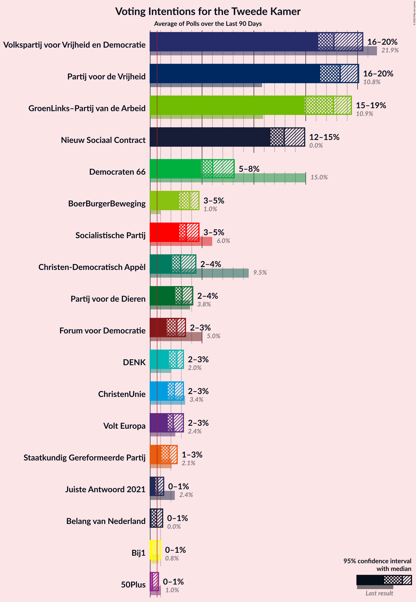

# Poll Average

<a href="#voting-intentions">Voting Intentions</a> | <a href="#seats">Seats</a> | <a href="#coalitions">Coalitions</a> | <a href="#technical-information">Technical Information</a>

## Summary

The table below lists the polls on which the average is based. They are the most recent polls (less than 90 days old) registered and analyzed so far.

| Period     | Polling firm/Commissioner(s) | VVD | D66 | PVV | CDA | SP | PvdA | GL | FvD | PvdD | CU | Volt | JA21 | SGP | DENK | 50+ | BBB | B1 | CO | Spl | PP | PvdT | BVNL | GL–PvdA |
|:----------:|:----------------------------:|:--:|:--:|:--:|:--:|:--:|:--:|:--:|:--:|:--:|:--:|:--:|:--:|:--:|:--:|:--:|:--:|:--:|:--:|:--:|:--:|:--:|:--:|:--:|
| 17 March 2021 | General Election | 21.9%   34 | 15.0%   24 | 10.8%   17 | 9.5%   15 | 6.0%   9 | 5.7%   9 | 5.2%   8 | 5.0%   8 | 3.8%   6 | 3.4%   5 | 2.4%   3 | 2.4%   3 | 2.1%   3 | 2.0%   3 | 1.0%   1 | 1.0%   1 | 0.8%   1 | 0.4%   0 | 0.3%   0 | 0.2%   0 | 0.0%   0 | 0.0%   0 | 10.9%   17 |
| N/A | Poll Average | 14–20%   23–29 | 5–9%   7–13 | 8–11%   13–17 | 3–6%   4–9 | 4–6%   6–9 | 4–7%   7–12 | 6–9%   9–13 | 2–4%   2–6 | 5–8%   7–12 | 2–5%   3–7 | 3–6%   3–8 | 3–5%   5–7 | 1–4%   2–6 | 1–3%   1–4 | 0–1%   0–1 | 12–18%   20–29 | 0–2%   0–2 | N/A   N/A | N/A   N/A | N/A   N/A | N/A   N/A | 0–1%   0–1 | 15–19%   23–27 |
| [14–17 July 2023](2023-07-17-IOResearch.html) | I&O Research | 14–17%   24–29 | 5–7%   7–11 | 8–11%   13–16 | 2–4%   4–5 | 4–6%   5–7 | N/A   N/A | N/A   N/A | 2–4%   4 | 5–7%   6–9 | 3–4%   5–7 | 4–6%   7–8 | 3–5%   5–6 | 2–4%   5–6 | 1–2%   1–2 | 0–1%   0–1 | 12–15%   20–21 | 1%   1 | N/A   N/A | N/A   N/A | N/A   N/A | N/A   N/A | 1%   0–1 | 15–19%   23–27 |
| [14–15 July 2023](2023-07-15-Peilnl.html) | Peil.nl | 15–18%   23–27 | 5–7%   8–10 | 9–11%   13–16 | 4–5%   6–9 | 5–6%   7–9 | N/A   N/A | N/A   N/A | 3–4%   4–6 | 5–6%   7–9 | 2–3%   3–5 | 3–5%   5–7 | 3–5%   5–7 | 2–3%   2–3 | 1–2%   1–3 | 0–1%   0–1 | 15–18%   23–29 | 0–1%   0–1 | N/A   N/A | N/A   N/A | N/A   N/A | N/A   N/A | 0–1%   0–1 | 15–18%   23–27 |
| [23–25 June 2023](2023-06-25-Ipsos.html) | Ipsos   EenVandaag | 16–21%   24–30 | 6–10%   9–14 | 8–12%   13–18 | 4–7%   6–10 | 4–6%   5–8 | 4–7%   7–12 | 6–9%   9–13 | 1–3%   2–5 | 5–8%   8–13 | 3–5%   4–7 | 3–5%   3–7 | 3–5%   4–8 | 1–3%   2–4 | 1–3%   2–5 | 0–1%   0–2 | 12–17%   19–26 | 1–2%   0–3 | N/A   N/A | N/A   N/A | N/A   N/A | N/A   N/A | N/A   N/A | N/A   N/A |
| 17 March 2021 | General Election | 21.9%   34 | 15.0%   24 | 10.8%   17 | 9.5%   15 | 6.0%   9 | 5.7%   9 | 5.2%   8 | 5.0%   8 | 3.8%   6 | 3.4%   5 | 2.4%   3 | 2.4%   3 | 2.1%   3 | 2.0%   3 | 1.0%   1 | 1.0%   1 | 0.8%   1 | 0.4%   0 | 0.3%   0 | 0.2%   0 | 0.0%   0 | 0.0%   0 | 10.9%   17 |

Only polls for which at least the sample size has been published are included in the table above.

**Legend:**
+ **Top half of each row:** Voting intentions (95% confidence interval)
+ **Bottom half of each row:** Seat projections for the Tweede Kamer (95% confidence interval)
+ **VVD:** Volkspartij voor Vrijheid en Democratie
+ **D66:** Democraten 66
+ **PVV:** Partij voor de Vrijheid
+ **CDA:** Christen-Democratisch Appèl
+ **SP:** Socialistische Partij
+ **PvdA:** Partij van de Arbeid
+ **GL:** GroenLinks
+ **FvD:** Forum voor Democratie
+ **PvdD:** Partij voor de Dieren
+ **CU:** ChristenUnie
+ **Volt:** Volt Europa
+ **JA21:** Juiste Antwoord 2021
+ **SGP:** Staatkundig Gereformeerde Partij
+ **DENK:** DENK
+ **50+:** 50Plus
+ **BBB:** BoerBurgerBeweging
+ **B1:** Bij1
+ **CO:** Code Oranje
+ **Spl:** Splinter
+ **PP:** Piratenpartij
+ **PvdT:** Partij voor de Toekomst
+ **BVNL:** Belang van Nederland
+ **GL–PvdA:** GroenLinks–Partij van de Arbeid
+ **N/A (single party):** Party not included the published results
+ **N/A (entire row):** Calculation for this opinion poll not started yet

## Voting Intentions

### Confidence Intervals

| Party | Last Result | Median | 80% Confidence Interval | 90% Confidence Interval | 95% Confidence Interval | 99% Confidence Interval |
|:-----:|:-----------:|:------:|:-----------------------:|:-----------------------:|:-----------------------:|:-----------------------:|
| <a href="#volkspartij-voor-vrijheid-en-democratie">Volkspartij voor Vrijheid en Democratie</a> | 21.9% | 16.6% | 15.0–18.8% |14.6–19.4% | 14.3–19.9% | 13.7–20.9% |
| <a href="#democraten-66">Democraten 66</a> | 15.0% | 6.2% | 5.3–8.2% |5.0–8.7% | 4.9–9.0% | 4.5–9.7% |
| <a href="#groenlinks–partij-van-de-arbeid">GroenLinks–Partij van de Arbeid</a> | 10.9% | 16.8% | 15.8–17.9% |15.5–18.3% | 15.3–18.6% | 14.8–19.2% |
| <a href="#partij-voor-de-vrijheid">Partij voor de Vrijheid</a> | 10.8% | 9.7% | 8.7–10.7% |8.5–11.0% | 8.2–11.2% | 7.7–11.8% |
| <a href="#christen-democratisch-appèl">Christen-Democratisch Appèl</a> | 9.5% | 4.5% | 3.0–5.5% |2.8–5.9% | 2.7–6.2% | 2.4–6.8% |
| <a href="#socialistische-partij">Socialistische Partij</a> | 6.0% | 4.9% | 4.0–5.7% |3.8–5.9% | 3.7–6.1% | 3.4–6.5% |
| <a href="#partij-van-de-arbeid">Partij van de Arbeid</a> | 5.7% | 5.7% | 4.9–6.7% |4.6–7.0% | 4.4–7.3% | 4.0–7.8% |
| <a href="#groenlinks">GroenLinks</a> | 5.2% | 7.1% | 6.1–8.2% |5.9–8.5% | 5.6–8.8% | 5.2–9.4% |
| <a href="#forum-voor-democratie">Forum voor Democratie</a> | 5.0% | 2.9% | 2.1–3.6% |1.9–3.7% | 1.7–3.9% | 1.4–4.1% |
| <a href="#partij-voor-de-dieren">Partij voor de Dieren</a> | 3.8% | 5.8% | 5.0–6.9% |4.8–7.2% | 4.7–7.5% | 4.4–8.1% |
| <a href="#christenunie">ChristenUnie</a> | 3.4% | 3.3% | 2.5–4.2% |2.4–4.5% | 2.2–4.7% | 2.1–5.2% |
| <a href="#volt-europa">Volt Europa</a> | 2.4% | 4.2% | 3.3–5.3% |3.1–5.6% | 2.9–5.8% | 2.5–6.3% |
| <a href="#juiste-antwoord-2021">Juiste Antwoord 2021</a> | 2.4% | 4.1% | 3.5–4.8% |3.3–5.0% | 3.2–5.2% | 2.9–5.6% |
| <a href="#staatkundig-gereformeerde-partij">Staatkundig Gereformeerde Partij</a> | 2.1% | 2.2% | 1.6–3.2% |1.5–3.4% | 1.4–3.6% | 1.1–3.9% |
| <a href="#denk">DENK</a> | 2.0% | 1.5% | 1.2–2.6% |1.1–2.8% | 1.0–3.1% | 0.9–3.5% |
| <a href="#50plus">50Plus</a> | 1.0% | 0.7% | 0.5–1.0% |0.4–1.2% | 0.4–1.3% | 0.3–1.5% |
| <a href="#boerburgerbeweging">BoerBurgerBeweging</a> | 1.0% | 14.6% | 12.6–16.9% |12.2–17.3% | 11.9–17.6% | 11.4–18.1% |
| <a href="#bij1">Bij1</a> | 0.8% | 0.9% | 0.6–1.5% |0.5–1.6% | 0.5–1.8% | 0.4–2.1% |
| <a href="#code-oranje">Code Oranje</a> | 0.4% | N/A | N/A |N/A | N/A | N/A |
| <a href="#splinter">Splinter</a> | 0.3% | N/A | N/A |N/A | N/A | N/A |
| <a href="#piratenpartij">Piratenpartij</a> | 0.2% | N/A | N/A |N/A | N/A | N/A |
| <a href="#partij-voor-de-toekomst">Partij voor de Toekomst</a> | 0.0% | N/A | N/A |N/A | N/A | N/A |
| <a href="#belang-van-nederland">Belang van Nederland</a> | 0.0% | 0.8% | 0.6–1.1% |0.5–1.2% | 0.5–1.3% | 0.4–1.5% |

### Volkspartij voor Vrijheid en Democratie

*For a full overview of the results for this party, see the [Volkspartij voor Vrijheid en Democratie](party-volkspartijvoorvrijheidendemocratie.html) page.*

| Voting Intentions | Probability | Accumulated | Special Marks |
|:-----------------:|:-----------:|:-----------:|:-------------:|
| 11.5–12.5% | 0% | 100% |  |
| 12.5–13.5% | 0.3% | 100% |  |
| 13.5–14.5% | 4% | 99.7% |  |
| 14.5–15.5% | 15% | 96% |  |
| 15.5–16.5% | 29% | 80% |  |
| 16.5–17.5% | 25% | 51% | Median |
| 17.5–18.5% | 14% | 26% |  |
| 18.5–19.5% | 8% | 12% |  |
| 19.5–20.5% | 3% | 4% |  |
| 20.5–21.5% | 0.8% | 0.9% |  |
| 21.5–22.5% | 0.1% | 0.1% | Last Result |
| 22.5–23.5% | 0% | 0% |  |

### Democraten 66

*For a full overview of the results for this party, see the [Democraten 66](party-democraten66.html) page.*

| Voting Intentions | Probability | Accumulated | Special Marks |
|:-----------------:|:-----------:|:-----------:|:-------------:|
| 2.5–3.5% | 0% | 100% |  |
| 3.5–4.5% | 0.7% | 100% |  |
| 4.5–5.5% | 19% | 99.3% |  |
| 5.5–6.5% | 44% | 80% | Median |
| 6.5–7.5% | 16% | 37% |  |
| 7.5–8.5% | 14% | 21% |  |
| 8.5–9.5% | 5% | 6% |  |
| 9.5–10.5% | 0.7% | 0.8% |  |
| 10.5–11.5% | 0% | 0% |  |
| 11.5–12.5% | 0% | 0% |  |
| 12.5–13.5% | 0% | 0% |  |
| 13.5–14.5% | 0% | 0% |  |
| 14.5–15.5% | 0% | 0% | Last Result |

### GroenLinks–Partij van de Arbeid

*For a full overview of the results for this party, see the [GroenLinks–Partij van de Arbeid](party-groenlinks–partijvandearbeid.html) page.*

| Voting Intentions | Probability | Accumulated | Special Marks |
|:-----------------:|:-----------:|:-----------:|:-------------:|
| 10.5–11.5% | 0% | 100% | Last Result |
| 11.5–12.5% | 0% | 100% |  |
| 12.5–13.5% | 0% | 100% |  |
| 13.5–14.5% | 0.2% | 100% |  |
| 14.5–15.5% | 6% | 99.8% |  |
| 15.5–16.5% | 34% | 94% |  |
| 16.5–17.5% | 42% | 60% | Median |
| 17.5–18.5% | 15% | 18% |  |
| 18.5–19.5% | 2% | 3% |  |
| 19.5–20.5% | 0.2% | 0.2% |  |
| 20.5–21.5% | 0% | 0% |  |

### Partij voor de Vrijheid

*For a full overview of the results for this party, see the [Partij voor de Vrijheid](party-partijvoordevrijheid.html) page.*

| Voting Intentions | Probability | Accumulated | Special Marks |
|:-----------------:|:-----------:|:-----------:|:-------------:|
| 5.5–6.5% | 0% | 100% |  |
| 6.5–7.5% | 0.3% | 100% |  |
| 7.5–8.5% | 6% | 99.7% |  |
| 8.5–9.5% | 34% | 94% |  |
| 9.5–10.5% | 46% | 59% | Median |
| 10.5–11.5% | 12% | 13% | Last Result |
| 11.5–12.5% | 1.0% | 1.0% |  |
| 12.5–13.5% | 0.1% | 0.1% |  |
| 13.5–14.5% | 0% | 0% |  |

### Christen-Democratisch Appèl

*For a full overview of the results for this party, see the [Christen-Democratisch Appèl](party-christen-democratischappèl.html) page.*

| Voting Intentions | Probability | Accumulated | Special Marks |
|:-----------------:|:-----------:|:-----------:|:-------------:|
| 0.5–1.5% | 0% | 100% |  |
| 1.5–2.5% | 1.3% | 100% |  |
| 2.5–3.5% | 24% | 98.7% |  |
| 3.5–4.5% | 27% | 74% |  |
| 4.5–5.5% | 37% | 47% | Median |
| 5.5–6.5% | 9% | 10% |  |
| 6.5–7.5% | 1.0% | 1.0% |  |
| 7.5–8.5% | 0% | 0% |  |
| 8.5–9.5% | 0% | 0% |  |
| 9.5–10.5% | 0% | 0% | Last Result |

### Socialistische Partij

*For a full overview of the results for this party, see the [Socialistische Partij](party-socialistischepartij.html) page.*

| Voting Intentions | Probability | Accumulated | Special Marks |
|:-----------------:|:-----------:|:-----------:|:-------------:|
| 1.5–2.5% | 0% | 100% |  |
| 2.5–3.5% | 1.4% | 100% |  |
| 3.5–4.5% | 30% | 98.6% |  |
| 4.5–5.5% | 53% | 69% | Median |
| 5.5–6.5% | 15% | 16% | Last Result |
| 6.5–7.5% | 0.4% | 0.4% |  |
| 7.5–8.5% | 0% | 0% |  |

### Partij van de Arbeid

*For a full overview of the results for this party, see the [Partij van de Arbeid](party-partijvandearbeid.html) page.*

| Voting Intentions | Probability | Accumulated | Special Marks |
|:-----------------:|:-----------:|:-----------:|:-------------:|
| 2.5–3.5% | 0% | 100% |  |
| 3.5–4.5% | 4% | 100% |  |
| 4.5–5.5% | 36% | 96% |  |
| 5.5–6.5% | 46% | 60% | Last Result, Median |
| 6.5–7.5% | 13% | 14% |  |
| 7.5–8.5% | 1.1% | 1.1% |  |
| 8.5–9.5% | 0% | 0% |  |

### GroenLinks

*For a full overview of the results for this party, see the [GroenLinks](party-groenlinks.html) page.*

| Voting Intentions | Probability | Accumulated | Special Marks |
|:-----------------:|:-----------:|:-----------:|:-------------:|
| 3.5–4.5% | 0% | 100% |  |
| 4.5–5.5% | 2% | 100% | Last Result |
| 5.5–6.5% | 22% | 98% |  |
| 6.5–7.5% | 46% | 76% | Median |
| 7.5–8.5% | 25% | 29% |  |
| 8.5–9.5% | 4% | 4% |  |
| 9.5–10.5% | 0.3% | 0.3% |  |
| 10.5–11.5% | 0% | 0% |  |

### Forum voor Democratie

*For a full overview of the results for this party, see the [Forum voor Democratie](party-forumvoordemocratie.html) page.*

| Voting Intentions | Probability | Accumulated | Special Marks |
|:-----------------:|:-----------:|:-----------:|:-------------:|
| 0.0–0.5% | 0% | 100% |  |
| 0.5–1.5% | 1.1% | 100% |  |
| 1.5–2.5% | 27% | 98.9% |  |
| 2.5–3.5% | 61% | 72% | Median |
| 3.5–4.5% | 11% | 11% |  |
| 4.5–5.5% | 0% | 0% | Last Result |

### Partij voor de Dieren

*For a full overview of the results for this party, see the [Partij voor de Dieren](party-partijvoordedieren.html) page.*

| Voting Intentions | Probability | Accumulated | Special Marks |
|:-----------------:|:-----------:|:-----------:|:-------------:|
| 2.5–3.5% | 0% | 100% |  |
| 3.5–4.5% | 1.2% | 100% | Last Result |
| 4.5–5.5% | 36% | 98.8% |  |
| 5.5–6.5% | 46% | 63% | Median |
| 6.5–7.5% | 15% | 17% |  |
| 7.5–8.5% | 2% | 2% |  |
| 8.5–9.5% | 0.1% | 0.1% |  |
| 9.5–10.5% | 0% | 0% |  |

### ChristenUnie

*For a full overview of the results for this party, see the [ChristenUnie](party-christenunie.html) page.*

| Voting Intentions | Probability | Accumulated | Special Marks |
|:-----------------:|:-----------:|:-----------:|:-------------:|
| 0.5–1.5% | 0% | 100% |  |
| 1.5–2.5% | 12% | 100% |  |
| 2.5–3.5% | 50% | 88% | Last Result, Median |
| 3.5–4.5% | 34% | 38% |  |
| 4.5–5.5% | 4% | 4% |  |
| 5.5–6.5% | 0.1% | 0.1% |  |
| 6.5–7.5% | 0% | 0% |  |

### Volt Europa

*For a full overview of the results for this party, see the [Volt Europa](party-volteuropa.html) page.*

| Voting Intentions | Probability | Accumulated | Special Marks |
|:-----------------:|:-----------:|:-----------:|:-------------:|
| 0.5–1.5% | 0% | 100% |  |
| 1.5–2.5% | 0.5% | 100% | Last Result |
| 2.5–3.5% | 17% | 99.5% |  |
| 3.5–4.5% | 50% | 83% | Median |
| 4.5–5.5% | 27% | 32% |  |
| 5.5–6.5% | 6% | 6% |  |
| 6.5–7.5% | 0.1% | 0.1% |  |
| 7.5–8.5% | 0% | 0% |  |

### Juiste Antwoord 2021

*For a full overview of the results for this party, see the [Juiste Antwoord 2021](party-juisteantwoord2021.html) page.*

| Voting Intentions | Probability | Accumulated | Special Marks |
|:-----------------:|:-----------:|:-----------:|:-------------:|
| 1.5–2.5% | 0.1% | 100% | Last Result |
| 2.5–3.5% | 12% | 99.9% |  |
| 3.5–4.5% | 70% | 88% | Median |
| 4.5–5.5% | 17% | 18% |  |
| 5.5–6.5% | 0.7% | 0.7% |  |
| 6.5–7.5% | 0% | 0% |  |

### Staatkundig Gereformeerde Partij

*For a full overview of the results for this party, see the [Staatkundig Gereformeerde Partij](party-staatkundiggereformeerdepartij.html) page.*

| Voting Intentions | Probability | Accumulated | Special Marks |
|:-----------------:|:-----------:|:-----------:|:-------------:|
| 0.0–0.5% | 0% | 100% |  |
| 0.5–1.5% | 7% | 100% |  |
| 1.5–2.5% | 61% | 93% | Last Result, Median |
| 2.5–3.5% | 30% | 32% |  |
| 3.5–4.5% | 3% | 3% |  |
| 4.5–5.5% | 0% | 0% |  |

### DENK

*For a full overview of the results for this party, see the [DENK](party-denk.html) page.*

| Voting Intentions | Probability | Accumulated | Special Marks |
|:-----------------:|:-----------:|:-----------:|:-------------:|
| 0.0–0.5% | 0% | 100% |  |
| 0.5–1.5% | 50% | 100% |  |
| 1.5–2.5% | 39% | 50% | Last Result, Median |
| 2.5–3.5% | 10% | 11% |  |
| 3.5–4.5% | 0.4% | 0.4% |  |
| 4.5–5.5% | 0% | 0% |  |

### 50Plus

*For a full overview of the results for this party, see the [50Plus](party-50plus.html) page.*

| Voting Intentions | Probability | Accumulated | Special Marks |
|:-----------------:|:-----------:|:-----------:|:-------------:|
| 0.0–0.5% | 17% | 100% |  |
| 0.5–1.5% | 82% | 83% | Last Result, Median |
| 1.5–2.5% | 0.4% | 0.4% |  |
| 2.5–3.5% | 0% | 0% |  |

### BoerBurgerBeweging

*For a full overview of the results for this party, see the [BoerBurgerBeweging](party-boerburgerbeweging.html) page.*

| Voting Intentions | Probability | Accumulated | Special Marks |
|:-----------------:|:-----------:|:-----------:|:-------------:|
| 0.5–1.5% | 0% | 100% | Last Result |
| 1.5–2.5% | 0% | 100% |  |
| 2.5–3.5% | 0% | 100% |  |
| 3.5–4.5% | 0% | 100% |  |
| 4.5–5.5% | 0% | 100% |  |
| 5.5–6.5% | 0% | 100% |  |
| 6.5–7.5% | 0% | 100% |  |
| 7.5–8.5% | 0% | 100% |  |
| 8.5–9.5% | 0% | 100% |  |
| 9.5–10.5% | 0% | 100% |  |
| 10.5–11.5% | 0.8% | 100% |  |
| 11.5–12.5% | 8% | 99.2% |  |
| 12.5–13.5% | 20% | 91% |  |
| 13.5–14.5% | 20% | 71% |  |
| 14.5–15.5% | 14% | 51% | Median |
| 15.5–16.5% | 19% | 37% |  |
| 16.5–17.5% | 15% | 18% |  |
| 17.5–18.5% | 3% | 3% |  |
| 18.5–19.5% | 0.1% | 0.1% |  |
| 19.5–20.5% | 0% | 0% |  |

### Bij1

*For a full overview of the results for this party, see the [Bij1](party-bij1.html) page.*

| Voting Intentions | Probability | Accumulated | Special Marks |
|:-----------------:|:-----------:|:-----------:|:-------------:|
| 0.0–0.5% | 7% | 100% |  |
| 0.5–1.5% | 87% | 93% | Last Result, Median |
| 1.5–2.5% | 7% | 7% |  |
| 2.5–3.5% | 0.1% | 0.1% |  |
| 3.5–4.5% | 0% | 0% |  |

### Belang van Nederland

*For a full overview of the results for this party, see the [Belang van Nederland](party-belangvannederland.html) page.*

| Voting Intentions | Probability | Accumulated | Special Marks |
|:-----------------:|:-----------:|:-----------:|:-------------:|
| 0.0–0.5% | 9% | 100% | Last Result |
| 0.5–1.5% | 90% | 91% | Median |
| 1.5–2.5% | 0.5% | 0.5% |  |
| 2.5–3.5% | 0% | 0% |  |

## Seats

### Confidence Intervals

| Party | Last Result | Median | 80% Confidence Interval | 90% Confidence Interval | 95% Confidence Interval | 99% Confidence Interval |
|:-----:|:-----------:|:------:|:-----------------------:|:-----------------------:|:-----------------------:|:-----------------------:|
| <a href="#volkspartij-voor-vrijheid-en-democratie">Volkspartij voor Vrijheid en Democratie</a> | 34 | 26 | 23–28 |23–28 | 23–29 | 22–30 |
| <a href="#democraten-66">Democraten 66</a> | 24 | 10 | 7–12 |7–12 | 7–13 | 7–16 |
| <a href="#groenlinks–partij-van-de-arbeid">GroenLinks–Partij van de Arbeid</a> | 17 | 25 | 25–27 |24–27 | 23–27 | 23–27 |
| <a href="#partij-voor-de-vrijheid">Partij voor de Vrijheid</a> | 17 | 15 | 13–16 |13–16 | 13–17 | 12–18 |
| <a href="#christen-democratisch-appèl">Christen-Democratisch Appèl</a> | 15 | 6 | 5–8 |5–8 | 4–9 | 4–10 |
| <a href="#socialistische-partij">Socialistische Partij</a> | 9 | 7 | 7–9 |6–9 | 6–9 | 5–9 |
| <a href="#partij-van-de-arbeid">Partij van de Arbeid</a> | 9 | 7 | 7–9 |7–10 | 7–12 | 7–12 |
| <a href="#groenlinks">GroenLinks</a> | 8 | 13 | 11–13 |9–13 | 9–13 | 7–13 |
| <a href="#forum-voor-democratie">Forum voor Democratie</a> | 8 | 4 | 2–5 |2–5 | 2–6 | 2–7 |
| <a href="#partij-voor-de-dieren">Partij voor de Dieren</a> | 6 | 8 | 8–9 |8–10 | 7–12 | 6–13 |
| <a href="#christenunie">ChristenUnie</a> | 5 | 5 | 3–5 |3–6 | 3–7 | 3–8 |
| <a href="#volt-europa">Volt Europa</a> | 3 | 6 | 3–8 |3–8 | 3–8 | 3–8 |
| <a href="#juiste-antwoord-2021">Juiste Antwoord 2021</a> | 3 | 6 | 5–7 |5–7 | 5–7 | 4–8 |
| <a href="#staatkundig-gereformeerde-partij">Staatkundig Gereformeerde Partij</a> | 3 | 3 | 2–6 |2–6 | 2–6 | 2–6 |
| <a href="#denk">DENK</a> | 3 | 2 | 1–3 |1–3 | 1–4 | 1–5 |
| <a href="#50plus">50Plus</a> | 1 | 1 | 0–1 |0–1 | 0–1 | 0–2 |
| <a href="#boerburgerbeweging">BoerBurgerBeweging</a> | 1 | 24 | 20–29 |20–29 | 20–29 | 19–29 |
| <a href="#bij1">Bij1</a> | 1 | 1 | 0–2 |0–2 | 0–2 | 0–3 |
| <a href="#code-oranje">Code Oranje</a> | 0 | N/A | N/A |N/A | N/A | N/A |
| <a href="#splinter">Splinter</a> | 0 | N/A | N/A |N/A | N/A | N/A |
| <a href="#piratenpartij">Piratenpartij</a> | 0 | N/A | N/A |N/A | N/A | N/A |
| <a href="#partij-voor-de-toekomst">Partij voor de Toekomst</a> | 0 | N/A | N/A |N/A | N/A | N/A |
| <a href="#belang-van-nederland">Belang van Nederland</a> | 0 | 1 | 0–1 |0–1 | 0–1 | 0–1 |

### Volkspartij voor Vrijheid en Democratie

*For a full overview of the results for this party, see the [Volkspartij voor Vrijheid en Democratie](party-volkspartijvoorvrijheidendemocratie.html) page.*

| Number of Seats | Probability | Accumulated | Special Marks |
|:---------------:|:-----------:|:-----------:|:-------------:|
| 21 | 0.1% | 100% |  |
| 22 | 0.4% | 99.9% |  |
| 23 | 20% | 99.5% |  |
| 24 | 5% | 79% |  |
| 25 | 3% | 74% |  |
| 26 | 31% | 71% | Median |
| 27 | 9% | 40% |  |
| 28 | 27% | 31% |  |
| 29 | 3% | 4% |  |
| 30 | 2% | 2% |  |
| 31 | 0.1% | 0.2% |  |
| 32 | 0% | 0.1% |  |
| 33 | 0% | 0.1% |  |
| 34 | 0.1% | 0.1% | Last Result |
| 35 | 0% | 0% |  |

### Democraten 66

*For a full overview of the results for this party, see the [Democraten 66](party-democraten66.html) page.*

| Number of Seats | Probability | Accumulated | Special Marks |
|:---------------:|:-----------:|:-----------:|:-------------:|
| 7 | 29% | 100% |  |
| 8 | 4% | 71% |  |
| 9 | 3% | 67% |  |
| 10 | 31% | 64% | Median |
| 11 | 3% | 33% |  |
| 12 | 26% | 30% |  |
| 13 | 2% | 3% |  |
| 14 | 0.6% | 1.3% |  |
| 15 | 0.1% | 0.7% |  |
| 16 | 0.6% | 0.6% |  |
| 17 | 0% | 0% |  |
| 18 | 0% | 0% |  |
| 19 | 0% | 0% |  |
| 20 | 0% | 0% |  |
| 21 | 0% | 0% |  |
| 22 | 0% | 0% |  |
| 23 | 0% | 0% |  |
| 24 | 0% | 0% | Last Result |

### GroenLinks–Partij van de Arbeid

*For a full overview of the results for this party, see the [GroenLinks–Partij van de Arbeid](party-groenlinks–partijvandearbeid.html) page.*

| Number of Seats | Probability | Accumulated | Special Marks |
|:---------------:|:-----------:|:-----------:|:-------------:|
| 17 | 0% | 100% | Last Result |
| 18 | 0% | 100% |  |
| 19 | 0% | 100% |  |
| 20 | 0% | 100% |  |
| 21 | 0% | 100% |  |
| 22 | 0.1% | 100% |  |
| 23 | 4% | 99.9% |  |
| 24 | 4% | 96% |  |
| 25 | 45% | 92% | Median |
| 26 | 13% | 47% |  |
| 27 | 34% | 35% |  |
| 28 | 0.2% | 0.5% |  |
| 29 | 0% | 0.2% |  |
| 30 | 0.1% | 0.2% |  |
| 31 | 0% | 0.1% |  |
| 32 | 0% | 0% |  |

### Partij voor de Vrijheid

*For a full overview of the results for this party, see the [Partij voor de Vrijheid](party-partijvoordevrijheid.html) page.*

| Number of Seats | Probability | Accumulated | Special Marks |
|:---------------:|:-----------:|:-----------:|:-------------:|
| 11 | 0.1% | 100% |  |
| 12 | 0.7% | 99.9% |  |
| 13 | 28% | 99.2% |  |
| 14 | 4% | 71% |  |
| 15 | 53% | 67% | Median |
| 16 | 9% | 13% |  |
| 17 | 2% | 4% | Last Result |
| 18 | 1.3% | 1.4% |  |
| 19 | 0.1% | 0.1% |  |
| 20 | 0% | 0% |  |

### Christen-Democratisch Appèl

*For a full overview of the results for this party, see the [Christen-Democratisch Appèl](party-christen-democratischappèl.html) page.*

| Number of Seats | Probability | Accumulated | Special Marks |
|:---------------:|:-----------:|:-----------:|:-------------:|
| 4 | 3% | 100% |  |
| 5 | 31% | 97% |  |
| 6 | 22% | 66% | Median |
| 7 | 29% | 44% |  |
| 8 | 11% | 14% |  |
| 9 | 2% | 3% |  |
| 10 | 1.1% | 1.5% |  |
| 11 | 0.4% | 0.4% |  |
| 12 | 0% | 0% |  |
| 13 | 0% | 0% |  |
| 14 | 0% | 0% |  |
| 15 | 0% | 0% | Last Result |

### Socialistische Partij

*For a full overview of the results for this party, see the [Socialistische Partij](party-socialistischepartij.html) page.*

| Number of Seats | Probability | Accumulated | Special Marks |
|:---------------:|:-----------:|:-----------:|:-------------:|
| 5 | 2% | 100% |  |
| 6 | 4% | 98% |  |
| 7 | 61% | 94% | Median |
| 8 | 11% | 33% |  |
| 9 | 21% | 22% | Last Result |
| 10 | 0.4% | 0.5% |  |
| 11 | 0% | 0% |  |

### Partij van de Arbeid

*For a full overview of the results for this party, see the [Partij van de Arbeid](party-partijvandearbeid.html) page.*

| Number of Seats | Probability | Accumulated | Special Marks |
|:---------------:|:-----------:|:-----------:|:-------------:|
| 6 | 0.3% | 100% |  |
| 7 | 75% | 99.6% | Median |
| 8 | 7% | 24% |  |
| 9 | 12% | 18% | Last Result |
| 10 | 2% | 5% |  |
| 11 | 0.7% | 4% |  |
| 12 | 3% | 3% |  |
| 13 | 0% | 0% |  |

### GroenLinks

*For a full overview of the results for this party, see the [GroenLinks](party-groenlinks.html) page.*

| Number of Seats | Probability | Accumulated | Special Marks |
|:---------------:|:-----------:|:-----------:|:-------------:|
| 7 | 0.9% | 100% |  |
| 8 | 1.4% | 99.1% | Last Result |
| 9 | 3% | 98% |  |
| 10 | 2% | 94% |  |
| 11 | 11% | 93% |  |
| 12 | 7% | 81% |  |
| 13 | 74% | 74% | Median |
| 14 | 0.3% | 0.4% |  |
| 15 | 0% | 0.1% |  |
| 16 | 0.1% | 0.1% |  |
| 17 | 0% | 0% |  |

### Forum voor Democratie

*For a full overview of the results for this party, see the [Forum voor Democratie](party-forumvoordemocratie.html) page.*

| Number of Seats | Probability | Accumulated | Special Marks |
|:---------------:|:-----------:|:-----------:|:-------------:|
| 1 | 0.2% | 100% |  |
| 2 | 27% | 99.8% |  |
| 3 | 3% | 73% |  |
| 4 | 43% | 70% | Median |
| 5 | 24% | 27% |  |
| 6 | 2% | 3% |  |
| 7 | 0.9% | 0.9% |  |
| 8 | 0% | 0% | Last Result |

### Partij voor de Dieren

*For a full overview of the results for this party, see the [Partij voor de Dieren](party-partijvoordedieren.html) page.*

| Number of Seats | Probability | Accumulated | Special Marks |
|:---------------:|:-----------:|:-----------:|:-------------:|
| 6 | 1.1% | 100% | Last Result |
| 7 | 3% | 98.9% |  |
| 8 | 58% | 96% | Median |
| 9 | 31% | 39% |  |
| 10 | 3% | 8% |  |
| 11 | 2% | 5% |  |
| 12 | 1.3% | 3% |  |
| 13 | 1.4% | 1.4% |  |
| 14 | 0% | 0% |  |

### ChristenUnie

*For a full overview of the results for this party, see the [ChristenUnie](party-christenunie.html) page.*

| Number of Seats | Probability | Accumulated | Special Marks |
|:---------------:|:-----------:|:-----------:|:-------------:|
| 2 | 0.2% | 100% |  |
| 3 | 24% | 99.8% |  |
| 4 | 10% | 75% |  |
| 5 | 59% | 66% | Last Result, Median |
| 6 | 4% | 7% |  |
| 7 | 2% | 3% |  |
| 8 | 0.6% | 0.7% |  |
| 9 | 0% | 0% |  |

### Volt Europa

*For a full overview of the results for this party, see the [Volt Europa](party-volteuropa.html) page.*

| Number of Seats | Probability | Accumulated | Special Marks |
|:---------------:|:-----------:|:-----------:|:-------------:|
| 3 | 25% | 100% | Last Result |
| 4 | 4% | 75% |  |
| 5 | 3% | 71% |  |
| 6 | 31% | 67% | Median |
| 7 | 5% | 37% |  |
| 8 | 32% | 32% |  |
| 9 | 0% | 0% |  |

### Juiste Antwoord 2021

*For a full overview of the results for this party, see the [Juiste Antwoord 2021](party-juisteantwoord2021.html) page.*

| Number of Seats | Probability | Accumulated | Special Marks |
|:---------------:|:-----------:|:-----------:|:-------------:|
| 3 | 0% | 100% | Last Result |
| 4 | 2% | 100% |  |
| 5 | 34% | 98% |  |
| 6 | 35% | 65% | Median |
| 7 | 28% | 30% |  |
| 8 | 2% | 2% |  |
| 9 | 0.1% | 0.1% |  |
| 10 | 0% | 0% |  |

### Staatkundig Gereformeerde Partij

*For a full overview of the results for this party, see the [Staatkundig Gereformeerde Partij](party-staatkundiggereformeerdepartij.html) page.*

| Number of Seats | Probability | Accumulated | Special Marks |
|:---------------:|:-----------:|:-----------:|:-------------:|
| 1 | 0.3% | 100% |  |
| 2 | 36% | 99.7% |  |
| 3 | 29% | 64% | Last Result, Median |
| 4 | 2% | 35% |  |
| 5 | 4% | 33% |  |
| 6 | 29% | 29% |  |
| 7 | 0% | 0% |  |

### DENK

*For a full overview of the results for this party, see the [DENK](party-denk.html) page.*

| Number of Seats | Probability | Accumulated | Special Marks |
|:---------------:|:-----------:|:-----------:|:-------------:|
| 1 | 37% | 100% |  |
| 2 | 31% | 63% | Median |
| 3 | 28% | 32% | Last Result |
| 4 | 3% | 4% |  |
| 5 | 1.4% | 1.4% |  |
| 6 | 0% | 0% |  |

### 50Plus

*For a full overview of the results for this party, see the [50Plus](party-50plus.html) page.*

| Number of Seats | Probability | Accumulated | Special Marks |
|:---------------:|:-----------:|:-----------:|:-------------:|
| 0 | 36% | 100% |  |
| 1 | 63% | 64% | Last Result, Median |
| 2 | 1.2% | 1.2% |  |
| 3 | 0% | 0% |  |

### BoerBurgerBeweging

*For a full overview of the results for this party, see the [BoerBurgerBeweging](party-boerburgerbeweging.html) page.*

| Number of Seats | Probability | Accumulated | Special Marks |
|:---------------:|:-----------:|:-----------:|:-------------:|
| 1 | 0% | 100% | Last Result |
| 2 | 0% | 100% |  |
| 3 | 0% | 100% |  |
| 4 | 0% | 100% |  |
| 5 | 0% | 100% |  |
| 6 | 0% | 100% |  |
| 7 | 0% | 100% |  |
| 8 | 0% | 100% |  |
| 9 | 0% | 100% |  |
| 10 | 0% | 100% |  |
| 11 | 0% | 100% |  |
| 12 | 0% | 100% |  |
| 13 | 0% | 100% |  |
| 14 | 0% | 100% |  |
| 15 | 0% | 100% |  |
| 16 | 0% | 100% |  |
| 17 | 0.1% | 100% |  |
| 18 | 0.4% | 99.9% |  |
| 19 | 2% | 99.5% |  |
| 20 | 32% | 98% |  |
| 21 | 6% | 66% |  |
| 22 | 2% | 60% |  |
| 23 | 1.4% | 59% |  |
| 24 | 8% | 57% | Median |
| 25 | 2% | 50% |  |
| 26 | 26% | 47% |  |
| 27 | 0.6% | 21% |  |
| 28 | 0.1% | 21% |  |
| 29 | 21% | 21% |  |
| 30 | 0% | 0% |  |

### Bij1

*For a full overview of the results for this party, see the [Bij1](party-bij1.html) page.*

| Number of Seats | Probability | Accumulated | Special Marks |
|:---------------:|:-----------:|:-----------:|:-------------:|
| 0 | 32% | 100% |  |
| 1 | 38% | 68% | Last Result, Median |
| 2 | 28% | 29% |  |
| 3 | 0.9% | 0.9% |  |
| 4 | 0% | 0% |  |

### Code Oranje

*For a full overview of the results for this party, see the [Code Oranje](party-codeoranje.html) page.*

### Splinter

*For a full overview of the results for this party, see the [Splinter](party-splinter.html) page.*

### Piratenpartij

*For a full overview of the results for this party, see the [Piratenpartij](party-piratenpartij.html) page.*

### Partij voor de Toekomst

*For a full overview of the results for this party, see the [Partij voor de Toekomst](party-partijvoordetoekomst.html) page.*

### Belang van Nederland

*For a full overview of the results for this party, see the [Belang van Nederland](party-belangvannederland.html) page.*

| Number of Seats | Probability | Accumulated | Special Marks |
|:---------------:|:-----------:|:-----------:|:-------------:|
| 0 | 36% | 100% | Last Result |
| 1 | 64% | 64% | Median |
| 2 | 0.1% | 0.1% |  |
| 3 | 0% | 0% |  |

## Coalitions

### Confidence Intervals

| Coalition | Last Result | Median | Majority? | 80% Confidence Interval | 90% Confidence Interval | 95% Confidence Interval | 99% Confidence Interval |
|:---------:|:-----------:|:------:|:---------:|:-----------------------:|:-----------------------:|:-----------------------:|:-----------------------:|
| Volkspartij voor Vrijheid en Democratie – GroenLinks–Partij van de Arbeid – Christen-Democratisch Appèl – BoerBurgerBeweging | 67 | 76 | 66% | 61–85 | 57–85 | 54–85 | 50–87 |
| Volkspartij voor Vrijheid en Democratie – Christen-Democratisch Appèl – Partij van de Arbeid – GroenLinks – BoerBurgerBeweging | 67 | 58 | 29% | 51–81 | 51–81 | 50–81 | 49–81 |
| Volkspartij voor Vrijheid en Democratie – GroenLinks–Partij van de Arbeid – BoerBurgerBeweging | 52 | 71 | 29% | 54–79 | 49–79 | 47–79 | 43–80 |
| Volkspartij voor Vrijheid en Democratie – Partij van de Arbeid – GroenLinks – BoerBurgerBeweging | 52 | 52 | 0.1% | 46–74 | 46–74 | 46–74 | 45–74 |
| Volkspartij voor Vrijheid en Democratie – Democraten 66 – GroenLinks–Partij van de Arbeid | 75 | 58 | 0% | 40–60 | 39–63 | 38–63 | 34–63 |
| Volkspartij voor Vrijheid en Democratie – Christen-Democratisch Appèl – BoerBurgerBeweging | 50 | 58 | 0% | 51–61 | 51–61 | 50–61 | 49–63 |
| Volkspartij voor Vrijheid en Democratie – GroenLinks–Partij van de Arbeid – Christen-Democratisch Appèl | 66 | 56 | 0% | 35–57 | 35–61 | 33–61 | 31–61 |
| Volkspartij voor Vrijheid en Democratie – Democraten 66 – Partij van de Arbeid – GroenLinks | 75 | 33 | 0% | 33–60 | 33–60 | 33–60 | 32–63 |
| Volkspartij voor Vrijheid en Democratie – Partij voor de Vrijheid – Christen-Democratisch Appèl – Forum voor Democratie – Staatkundig Gereformeerde Partij | 77 | 54 | 0% | 51–57 | 51–57 | 51–58 | 51–61 |
| Volkspartij voor Vrijheid en Democratie – Democraten 66 – Christen-Democratisch Appèl – ChristenUnie | 78 | 43 | 0% | 42–52 | 42–53 | 42–56 | 42–58 |
| Democraten 66 – GroenLinks–Partij van de Arbeid – Christen-Democratisch Appèl – Socialistische Partij – ChristenUnie | 70 | 49 | 0% | 31–55 | 31–56 | 31–56 | 29–56 |
| Volkspartij voor Vrijheid en Democratie – Christen-Democratisch Appèl – Partij van de Arbeid – GroenLinks | 66 | 31 | 0% | 29–55 | 29–55 | 29–56 | 28–58 |
| GroenLinks–Partij van de Arbeid – BoerBurgerBeweging | 18 | 45 | 0% | 26–56 | 21–56 | 20–56 | 19–56 |
| Volkspartij voor Vrijheid en Democratie – Partij voor de Vrijheid – Christen-Democratisch Appèl – Forum voor Democratie | 74 | 50 | 0% | 49–54 | 49–55 | 48–55 | 47–58 |
| Volkspartij voor Vrijheid en Democratie – GroenLinks–Partij van de Arbeid | 51 | 50 | 0% | 28–51 | 28–53 | 26–53 | 24–55 |
| Democraten 66 – Christen-Democratisch Appèl – Socialistische Partij – Partij van de Arbeid – GroenLinks – ChristenUnie | 70 | 28 | 0% | 24–51 | 24–52 | 24–53 | 24–56 |
| Volkspartij voor Vrijheid en Democratie – Partij voor de Vrijheid – Christen-Democratisch Appèl | 66 | 46 | 0% | 44–50 | 44–51 | 44–52 | 43–55 |
| Volkspartij voor Vrijheid en Democratie – Democraten 66 – Christen-Democratisch Appèl | 73 | 39 | 0% | 38–47 | 38–47 | 38–50 | 36–51 |
| Democraten 66 – GroenLinks–Partij van de Arbeid – Christen-Democratisch Appèl – ChristenUnie | 61 | 42 | 0% | 24–46 | 24–48 | 24–48 | 22–48 |
| Volkspartij voor Vrijheid en Democratie – Partij van de Arbeid – GroenLinks | 51 | 26 | 0% | 23–48 | 23–48 | 23–48 | 23–50 |
| Partij van de Arbeid – GroenLinks – BoerBurgerBeweging | 18 | 29 | 0% | 20–46 | 20–46 | 20–46 | 20–46 |
| Democraten 66 – Christen-Democratisch Appèl – Partij van de Arbeid – GroenLinks – ChristenUnie | 61 | 19 | 0% | 17–44 | 17–45 | 17–46 | 17–48 |
| Democraten 66 – GroenLinks–Partij van de Arbeid – Christen-Democratisch Appèl | 56 | 37 | 0% | 19–43 | 19–44 | 19–44 | 16–44 |
| Volkspartij voor Vrijheid en Democratie – Christen-Democratisch Appèl – Forum voor Democratie – Staatkundig Gereformeerde Partij – 50Plus | 61 | 41 | 0% | 36–42 | 36–42 | 36–43 | 36–48 |
| Volkspartij voor Vrijheid en Democratie – Christen-Democratisch Appèl – Forum voor Democratie – Staatkundig Gereformeerde Partij | 60 | 40 | 0% | 36–41 | 36–42 | 36–43 | 36–46 |
| Volkspartij voor Vrijheid en Democratie – Christen-Democratisch Appèl – Forum voor Democratie – 50Plus | 58 | 36 | 0% | 34–39 | 34–40 | 33–41 | 33–45 |
| Volkspartij voor Vrijheid en Democratie – Christen-Democratisch Appèl – Forum voor Democratie | 57 | 35 | 0% | 34–39 | 34–39 | 33–40 | 32–43 |
| Democraten 66 – Christen-Democratisch Appèl – Partij van de Arbeid – GroenLinks | 56 | 16 | 0% | 12–39 | 12–39 | 12–40 | 12–43 |
| GroenLinks–Partij van de Arbeid – Christen-Democratisch Appèl – ChristenUnie | 37 | 35 | 0% | 12–37 | 12–38 | 12–38 | 10–38 |
| Volkspartij voor Vrijheid en Democratie – Christen-Democratisch Appèl | 49 | 31 | 0% | 29–35 | 29–35 | 29–36 | 28–40 |
| Christen-Democratisch Appèl – Partij van de Arbeid – GroenLinks – ChristenUnie | 37 | 10 | 0% | 9–32 | 9–33 | 9–34 | 8–36 |
| GroenLinks–Partij van de Arbeid – Christen-Democratisch Appèl | 32 | 30 | 0% | 7–33 | 7–34 | 7–34 | 6–34 |
| Christen-Democratisch Appèl – Partij van de Arbeid – GroenLinks | 32 | 6 | 0% | 5–27 | 5–27 | 4–28 | 4–31 |
| Democraten 66 – Christen-Democratisch Appèl | 39 | 16 | 0% | 12–19 | 12–19 | 12–20 | 12–23 |

### Volkspartij voor Vrijheid en Democratie – GroenLinks–Partij van de Arbeid – Christen-Democratisch Appèl – BoerBurgerBeweging

| Number of Seats | Probability | Accumulated | Special Marks |
|:---------------:|:-----------:|:-----------:|:-------------:|
| 50 | 1.0% | 100% |  |
| 51 | 0.1% | 99.0% |  |
| 52 | 0.6% | 98.9% |  |
| 53 | 0.3% | 98% |  |
| 54 | 0.9% | 98% |  |
| 55 | 0.7% | 97% |  |
| 56 | 0.2% | 96% |  |
| 57 | 2% | 96% |  |
| 58 | 2% | 94% |  |
| 59 | 0.1% | 92% |  |
| 60 | 0.8% | 92% |  |
| 61 | 24% | 91% |  |
| 62 | 0.3% | 67% |  |
| 63 | 0.1% | 67% |  |
| 64 | 0.1% | 67% |  |
| 65 | 0.1% | 67% |  |
| 66 | 0% | 67% |  |
| 67 | 0% | 67% | Last Result |
| 68 | 0% | 67% |  |
| 69 | 0% | 67% |  |
| 70 | 0% | 67% |  |
| 71 | 0.1% | 67% |  |
| 72 | 0% | 66% |  |
| 73 | 0% | 66% |  |
| 74 | 0% | 66% |  |
| 75 | 0.1% | 66% |  |
| 76 | 32% | 66% | Majority |
| 77 | 0.9% | 35% |  |
| 78 | 0% | 34% |  |
| 79 | 0.2% | 34% |  |
| 80 | 0.7% | 34% |  |
| 81 | 1.0% | 33% | Median |
| 82 | 3% | 32% |  |
| 83 | 0.5% | 29% |  |
| 84 | 0.5% | 29% |  |
| 85 | 27% | 28% |  |
| 86 | 0.2% | 0.7% |  |
| 87 | 0.2% | 0.5% |  |
| 88 | 0% | 0.3% |  |
| 89 | 0.1% | 0.3% |  |
| 90 | 0.2% | 0.2% |  |
| 91 | 0% | 0% |  |

### Volkspartij voor Vrijheid en Democratie – Christen-Democratisch Appèl – Partij van de Arbeid – GroenLinks – BoerBurgerBeweging

| Number of Seats | Probability | Accumulated | Special Marks |
|:---------------:|:-----------:|:-----------:|:-------------:|
| 45 | 0.1% | 100% |  |
| 46 | 0.1% | 99.9% |  |
| 47 | 0% | 99.8% |  |
| 48 | 0% | 99.8% |  |
| 49 | 1.4% | 99.7% |  |
| 50 | 1.1% | 98% |  |
| 51 | 29% | 97% |  |
| 52 | 0.1% | 68% |  |
| 53 | 1.5% | 68% |  |
| 54 | 0.1% | 67% |  |
| 55 | 0.4% | 67% |  |
| 56 | 0.9% | 66% |  |
| 57 | 1.1% | 66% |  |
| 58 | 22% | 64% |  |
| 59 | 8% | 42% |  |
| 60 | 0.4% | 34% |  |
| 61 | 0% | 34% |  |
| 62 | 0% | 34% |  |
| 63 | 0.3% | 34% |  |
| 64 | 0% | 33% |  |
| 65 | 0% | 33% |  |
| 66 | 0% | 33% |  |
| 67 | 0% | 33% | Last Result |
| 68 | 0% | 33% |  |
| 69 | 0% | 33% |  |
| 70 | 0.1% | 33% |  |
| 71 | 0.1% | 33% |  |
| 72 | 0.8% | 33% |  |
| 73 | 1.0% | 32% |  |
| 74 | 2% | 31% |  |
| 75 | 0.1% | 29% |  |
| 76 | 0.7% | 29% | Median, Majority |
| 77 | 2% | 29% |  |
| 78 | 2% | 27% |  |
| 79 | 0.2% | 25% |  |
| 80 | 0.4% | 25% |  |
| 81 | 24% | 24% |  |
| 82 | 0% | 0.2% |  |
| 83 | 0.1% | 0.2% |  |
| 84 | 0% | 0.1% |  |
| 85 | 0% | 0.1% |  |
| 86 | 0% | 0.1% |  |
| 87 | 0% | 0.1% |  |
| 88 | 0% | 0.1% |  |
| 89 | 0.1% | 0.1% |  |
| 90 | 0% | 0% |  |

### Volkspartij voor Vrijheid en Democratie – GroenLinks–Partij van de Arbeid – BoerBurgerBeweging

| Number of Seats | Probability | Accumulated | Special Marks |
|:---------------:|:-----------:|:-----------:|:-------------:|
| 43 | 1.0% | 100% |  |
| 44 | 0.1% | 99.0% |  |
| 45 | 0.1% | 99.0% |  |
| 46 | 0.6% | 98.8% |  |
| 47 | 1.3% | 98% |  |
| 48 | 2% | 97% |  |
| 49 | 2% | 95% |  |
| 50 | 0.1% | 93% |  |
| 51 | 1.2% | 93% |  |
| 52 | 0.6% | 92% | Last Result |
| 53 | 0.4% | 91% |  |
| 54 | 24% | 91% |  |
| 55 | 0.1% | 67% |  |
| 56 | 0% | 67% |  |
| 57 | 0.1% | 67% |  |
| 58 | 0% | 67% |  |
| 59 | 0% | 67% |  |
| 60 | 0% | 67% |  |
| 61 | 0% | 67% |  |
| 62 | 0% | 67% |  |
| 63 | 0% | 67% |  |
| 64 | 0% | 67% |  |
| 65 | 0% | 67% |  |
| 66 | 0.1% | 67% |  |
| 67 | 0% | 67% |  |
| 68 | 0.1% | 67% |  |
| 69 | 0% | 66% |  |
| 70 | 0% | 66% |  |
| 71 | 29% | 66% |  |
| 72 | 4% | 37% |  |
| 73 | 2% | 34% |  |
| 74 | 2% | 32% |  |
| 75 | 0.4% | 29% | Median |
| 76 | 0.3% | 29% | Majority |
| 77 | 7% | 29% |  |
| 78 | 0.1% | 22% |  |
| 79 | 21% | 22% |  |
| 80 | 0.3% | 0.6% |  |
| 81 | 0.1% | 0.3% |  |
| 82 | 0% | 0.2% |  |
| 83 | 0% | 0.2% |  |
| 84 | 0% | 0.2% |  |
| 85 | 0.2% | 0.2% |  |
| 86 | 0% | 0% |  |

### Volkspartij voor Vrijheid en Democratie – Partij van de Arbeid – GroenLinks – BoerBurgerBeweging

| Number of Seats | Probability | Accumulated | Special Marks |
|:---------------:|:-----------:|:-----------:|:-------------:|
| 40 | 0.1% | 100% |  |
| 41 | 0.1% | 99.9% |  |
| 42 | 0% | 99.8% |  |
| 43 | 0% | 99.8% |  |
| 44 | 0.1% | 99.7% |  |
| 45 | 2% | 99.7% |  |
| 46 | 29% | 98% |  |
| 47 | 0.1% | 68% |  |
| 48 | 0.9% | 68% |  |
| 49 | 2% | 67% |  |
| 50 | 2% | 65% |  |
| 51 | 7% | 63% |  |
| 52 | 21% | 55% | Last Result |
| 53 | 1.1% | 35% |  |
| 54 | 0.1% | 34% |  |
| 55 | 0% | 34% |  |
| 56 | 0% | 34% |  |
| 57 | 0% | 34% |  |
| 58 | 0.2% | 34% |  |
| 59 | 0% | 33% |  |
| 60 | 0% | 33% |  |
| 61 | 0% | 33% |  |
| 62 | 0.1% | 33% |  |
| 63 | 0% | 33% |  |
| 64 | 0.4% | 33% |  |
| 65 | 0.7% | 33% |  |
| 66 | 0.3% | 32% |  |
| 67 | 2% | 32% |  |
| 68 | 0.7% | 29% |  |
| 69 | 3% | 29% |  |
| 70 | 0.2% | 26% | Median |
| 71 | 1.5% | 26% |  |
| 72 | 0.1% | 24% |  |
| 73 | 0.1% | 24% |  |
| 74 | 24% | 24% |  |
| 75 | 0% | 0.1% |  |
| 76 | 0% | 0.1% | Majority |
| 77 | 0% | 0.1% |  |
| 78 | 0% | 0.1% |  |
| 79 | 0% | 0.1% |  |
| 80 | 0% | 0.1% |  |
| 81 | 0.1% | 0.1% |  |
| 82 | 0% | 0% |  |

### Volkspartij voor Vrijheid en Democratie – Democraten 66 – GroenLinks–Partij van de Arbeid

| Number of Seats | Probability | Accumulated | Special Marks |
|:---------------:|:-----------:|:-----------:|:-------------:|
| 33 | 0.1% | 100% |  |
| 34 | 0.8% | 99.9% |  |
| 35 | 0.3% | 99.1% |  |
| 36 | 1.2% | 98.8% |  |
| 37 | 0% | 98% |  |
| 38 | 0.9% | 98% |  |
| 39 | 2% | 97% |  |
| 40 | 25% | 94% |  |
| 41 | 0.5% | 70% |  |
| 42 | 0.3% | 69% |  |
| 43 | 1.5% | 69% |  |
| 44 | 0.7% | 67% |  |
| 45 | 0.1% | 67% |  |
| 46 | 0% | 67% |  |
| 47 | 0% | 67% |  |
| 48 | 0% | 67% |  |
| 49 | 0% | 67% |  |
| 50 | 0% | 67% |  |
| 51 | 0% | 67% |  |
| 52 | 0% | 67% |  |
| 53 | 0.1% | 67% |  |
| 54 | 0% | 67% |  |
| 55 | 0.1% | 67% |  |
| 56 | 0.1% | 66% |  |
| 57 | 0.8% | 66% |  |
| 58 | 30% | 66% |  |
| 59 | 4% | 36% |  |
| 60 | 23% | 32% |  |
| 61 | 0.5% | 10% | Median |
| 62 | 2% | 9% |  |
| 63 | 7% | 7% |  |
| 64 | 0% | 0.3% |  |
| 65 | 0.2% | 0.2% |  |
| 66 | 0% | 0% |  |
| 67 | 0% | 0% |  |
| 68 | 0% | 0% |  |
| 69 | 0% | 0% |  |
| 70 | 0% | 0% |  |
| 71 | 0% | 0% |  |
| 72 | 0% | 0% |  |
| 73 | 0% | 0% |  |
| 74 | 0% | 0% |  |
| 75 | 0% | 0% | Last Result |

### Volkspartij voor Vrijheid en Democratie – Christen-Democratisch Appèl – BoerBurgerBeweging

| Number of Seats | Probability | Accumulated | Special Marks |
|:---------------:|:-----------:|:-----------:|:-------------:|
| 45 | 0.1% | 100% |  |
| 46 | 0.1% | 99.9% |  |
| 47 | 0% | 99.8% |  |
| 48 | 0% | 99.8% |  |
| 49 | 1.4% | 99.7% |  |
| 50 | 2% | 98% | Last Result |
| 51 | 29% | 96% |  |
| 52 | 0.7% | 67% |  |
| 53 | 2% | 67% |  |
| 54 | 0.9% | 65% |  |
| 55 | 1.1% | 64% |  |
| 56 | 1.2% | 63% | Median |
| 57 | 4% | 62% |  |
| 58 | 24% | 58% |  |
| 59 | 8% | 34% |  |
| 60 | 1.2% | 26% |  |
| 61 | 24% | 25% |  |
| 62 | 0.3% | 0.8% |  |
| 63 | 0.4% | 0.5% |  |
| 64 | 0.1% | 0.1% |  |
| 65 | 0.1% | 0.1% |  |
| 66 | 0% | 0% |  |

### Volkspartij voor Vrijheid en Democratie – GroenLinks–Partij van de Arbeid – Christen-Democratisch Appèl

| Number of Seats | Probability | Accumulated | Special Marks |
|:---------------:|:-----------:|:-----------:|:-------------:|
| 29 | 0.1% | 100% |  |
| 30 | 0% | 99.9% |  |
| 31 | 1.3% | 99.9% |  |
| 32 | 0.5% | 98.6% |  |
| 33 | 0.9% | 98% |  |
| 34 | 0.8% | 97% |  |
| 35 | 25% | 96% |  |
| 36 | 2% | 71% |  |
| 37 | 1.2% | 69% |  |
| 38 | 0.4% | 68% |  |
| 39 | 0.1% | 67% |  |
| 40 | 0.6% | 67% |  |
| 41 | 0% | 67% |  |
| 42 | 0.1% | 67% |  |
| 43 | 0% | 67% |  |
| 44 | 0% | 67% |  |
| 45 | 0% | 67% |  |
| 46 | 0% | 67% |  |
| 47 | 0% | 67% |  |
| 48 | 0% | 67% |  |
| 49 | 0% | 67% |  |
| 50 | 0% | 67% |  |
| 51 | 0.1% | 67% |  |
| 52 | 0% | 67% |  |
| 53 | 0.2% | 67% |  |
| 54 | 0.8% | 66% |  |
| 55 | 2% | 66% |  |
| 56 | 52% | 64% |  |
| 57 | 3% | 12% | Median |
| 58 | 0.2% | 10% |  |
| 59 | 2% | 9% |  |
| 60 | 0.3% | 7% |  |
| 61 | 7% | 7% |  |
| 62 | 0.1% | 0.1% |  |
| 63 | 0% | 0% |  |
| 64 | 0% | 0% |  |
| 65 | 0% | 0% |  |
| 66 | 0% | 0% | Last Result |

### Volkspartij voor Vrijheid en Democratie – Democraten 66 – Partij van de Arbeid – GroenLinks

| Number of Seats | Probability | Accumulated | Special Marks |
|:---------------:|:-----------:|:-----------:|:-------------:|
| 29 | 0.1% | 100% |  |
| 30 | 0.2% | 99.9% |  |
| 31 | 0.1% | 99.7% |  |
| 32 | 2% | 99.6% |  |
| 33 | 49% | 98% |  |
| 34 | 2% | 49% |  |
| 35 | 3% | 47% |  |
| 36 | 2% | 44% |  |
| 37 | 8% | 42% |  |
| 38 | 0.3% | 34% |  |
| 39 | 0% | 33% |  |
| 40 | 0% | 33% |  |
| 41 | 0% | 33% |  |
| 42 | 0% | 33% |  |
| 43 | 0% | 33% |  |
| 44 | 0% | 33% |  |
| 45 | 0% | 33% |  |
| 46 | 0% | 33% |  |
| 47 | 0% | 33% |  |
| 48 | 0% | 33% |  |
| 49 | 0% | 33% |  |
| 50 | 0% | 33% |  |
| 51 | 0% | 33% |  |
| 52 | 0% | 33% |  |
| 53 | 0.4% | 33% |  |
| 54 | 0.5% | 33% |  |
| 55 | 0.2% | 32% |  |
| 56 | 0.8% | 32% | Median |
| 57 | 0.2% | 31% |  |
| 58 | 0.4% | 31% |  |
| 59 | 2% | 31% |  |
| 60 | 26% | 28% |  |
| 61 | 0.6% | 2% |  |
| 62 | 0.1% | 2% |  |
| 63 | 1.5% | 2% |  |
| 64 | 0% | 0.1% |  |
| 65 | 0% | 0.1% |  |
| 66 | 0% | 0.1% |  |
| 67 | 0% | 0.1% |  |
| 68 | 0% | 0.1% |  |
| 69 | 0.1% | 0.1% |  |
| 70 | 0% | 0% |  |
| 71 | 0% | 0% |  |
| 72 | 0% | 0% |  |
| 73 | 0% | 0% |  |
| 74 | 0% | 0% |  |
| 75 | 0% | 0% | Last Result |

### Volkspartij voor Vrijheid en Democratie – Partij voor de Vrijheid – Christen-Democratisch Appèl – Forum voor Democratie – Staatkundig Gereformeerde Partij

| Number of Seats | Probability | Accumulated | Special Marks |
|:---------------:|:-----------:|:-----------:|:-------------:|
| 48 | 0% | 100% |  |
| 49 | 0.1% | 99.9% |  |
| 50 | 0.1% | 99.8% |  |
| 51 | 21% | 99.7% |  |
| 52 | 2% | 79% |  |
| 53 | 26% | 77% |  |
| 54 | 3% | 51% | Median |
| 55 | 5% | 47% |  |
| 56 | 32% | 43% |  |
| 57 | 7% | 10% |  |
| 58 | 1.0% | 3% |  |
| 59 | 1.4% | 2% |  |
| 60 | 0.2% | 0.9% |  |
| 61 | 0.4% | 0.7% |  |
| 62 | 0% | 0.3% |  |
| 63 | 0% | 0.3% |  |
| 64 | 0% | 0.2% |  |
| 65 | 0.2% | 0.2% |  |
| 66 | 0% | 0% |  |
| 67 | 0% | 0% |  |
| 68 | 0% | 0% |  |
| 69 | 0% | 0% |  |
| 70 | 0% | 0% |  |
| 71 | 0% | 0% |  |
| 72 | 0% | 0% |  |
| 73 | 0% | 0% |  |
| 74 | 0% | 0% |  |
| 75 | 0% | 0% |  |
| 76 | 0% | 0% | Majority |
| 77 | 0% | 0% | Last Result |

### Volkspartij voor Vrijheid en Democratie – Democraten 66 – Christen-Democratisch Appèl – ChristenUnie

| Number of Seats | Probability | Accumulated | Special Marks |
|:---------------:|:-----------:|:-----------:|:-------------:|
| 39 | 0.1% | 100% |  |
| 40 | 0.1% | 99.9% |  |
| 41 | 0.1% | 99.8% |  |
| 42 | 20% | 99.7% |  |
| 43 | 31% | 79% |  |
| 44 | 1.4% | 49% |  |
| 45 | 2% | 47% |  |
| 46 | 3% | 45% |  |
| 47 | 1.1% | 41% | Median |
| 48 | 2% | 40% |  |
| 49 | 7% | 38% |  |
| 50 | 0.5% | 31% |  |
| 51 | 0.4% | 31% |  |
| 52 | 25% | 30% |  |
| 53 | 2% | 5% |  |
| 54 | 0.6% | 4% |  |
| 55 | 0.5% | 3% |  |
| 56 | 1.2% | 3% |  |
| 57 | 0.1% | 1.3% |  |
| 58 | 1.2% | 1.3% |  |
| 59 | 0.1% | 0.1% |  |
| 60 | 0% | 0% |  |
| 61 | 0% | 0% |  |
| 62 | 0% | 0% |  |
| 63 | 0% | 0% |  |
| 64 | 0% | 0% |  |
| 65 | 0% | 0% |  |
| 66 | 0% | 0% |  |
| 67 | 0% | 0% |  |
| 68 | 0% | 0% |  |
| 69 | 0% | 0% |  |
| 70 | 0% | 0% |  |
| 71 | 0% | 0% |  |
| 72 | 0% | 0% |  |
| 73 | 0% | 0% |  |
| 74 | 0% | 0% |  |
| 75 | 0% | 0% |  |
| 76 | 0% | 0% | Majority |
| 77 | 0% | 0% |  |
| 78 | 0% | 0% | Last Result |

### Democraten 66 – GroenLinks–Partij van de Arbeid – Christen-Democratisch Appèl – Socialistische Partij – ChristenUnie

| Number of Seats | Probability | Accumulated | Special Marks |
|:---------------:|:-----------:|:-----------:|:-------------:|
| 27 | 0.1% | 100% |  |
| 28 | 0.4% | 99.9% |  |
| 29 | 0.4% | 99.5% |  |
| 30 | 0.7% | 99.1% |  |
| 31 | 25% | 98% |  |
| 32 | 4% | 74% |  |
| 33 | 0.9% | 69% |  |
| 34 | 0.3% | 68% |  |
| 35 | 0.6% | 68% |  |
| 36 | 0.1% | 67% |  |
| 37 | 0.2% | 67% |  |
| 38 | 0.4% | 67% |  |
| 39 | 0% | 67% |  |
| 40 | 0% | 67% |  |
| 41 | 0% | 67% |  |
| 42 | 0% | 67% |  |
| 43 | 0% | 67% |  |
| 44 | 0% | 67% |  |
| 45 | 0% | 67% |  |
| 46 | 0% | 67% |  |
| 47 | 2% | 67% |  |
| 48 | 0% | 65% |  |
| 49 | 29% | 65% |  |
| 50 | 0.6% | 36% |  |
| 51 | 2% | 35% |  |
| 52 | 3% | 33% |  |
| 53 | 1.2% | 30% | Median |
| 54 | 0.3% | 29% |  |
| 55 | 22% | 29% |  |
| 56 | 7% | 7% |  |
| 57 | 0.1% | 0.1% |  |
| 58 | 0% | 0% |  |
| 59 | 0% | 0% |  |
| 60 | 0% | 0% |  |
| 61 | 0% | 0% |  |
| 62 | 0% | 0% |  |
| 63 | 0% | 0% |  |
| 64 | 0% | 0% |  |
| 65 | 0% | 0% |  |
| 66 | 0% | 0% |  |
| 67 | 0% | 0% |  |
| 68 | 0% | 0% |  |
| 69 | 0% | 0% |  |
| 70 | 0% | 0% | Last Result |

### Volkspartij voor Vrijheid en Democratie – Christen-Democratisch Appèl – Partij van de Arbeid – GroenLinks

| Number of Seats | Probability | Accumulated | Special Marks |
|:---------------:|:-----------:|:-----------:|:-------------:|
| 25 | 0.1% | 100% |  |
| 26 | 0.1% | 99.9% |  |
| 27 | 0.1% | 99.8% |  |
| 28 | 1.4% | 99.8% |  |
| 29 | 21% | 98% |  |
| 30 | 0.8% | 77% |  |
| 31 | 30% | 76% |  |
| 32 | 1.1% | 47% |  |
| 33 | 4% | 46% |  |
| 34 | 0.8% | 42% |  |
| 35 | 7% | 41% |  |
| 36 | 0% | 33% |  |
| 37 | 0% | 33% |  |
| 38 | 0% | 33% |  |
| 39 | 0% | 33% |  |
| 40 | 0% | 33% |  |
| 41 | 0% | 33% |  |
| 42 | 0% | 33% |  |
| 43 | 0% | 33% |  |
| 44 | 0% | 33% |  |
| 45 | 0% | 33% |  |
| 46 | 0% | 33% |  |
| 47 | 0% | 33% |  |
| 48 | 0.1% | 33% |  |
| 49 | 0% | 33% |  |
| 50 | 0.4% | 33% |  |
| 51 | 0.3% | 33% |  |
| 52 | 1.5% | 32% | Median |
| 53 | 0.3% | 31% |  |
| 54 | 0.8% | 31% |  |
| 55 | 26% | 30% |  |
| 56 | 2% | 4% |  |
| 57 | 2% | 2% |  |
| 58 | 0.1% | 0.6% |  |
| 59 | 0% | 0.5% |  |
| 60 | 0.4% | 0.4% |  |
| 61 | 0% | 0.1% |  |
| 62 | 0% | 0.1% |  |
| 63 | 0% | 0.1% |  |
| 64 | 0% | 0.1% |  |
| 65 | 0% | 0.1% |  |
| 66 | 0.1% | 0.1% | Last Result |
| 67 | 0% | 0% |  |

### GroenLinks–Partij van de Arbeid – BoerBurgerBeweging

| Number of Seats | Probability | Accumulated | Special Marks |
|:---------------:|:-----------:|:-----------:|:-------------:|
| 18 | 0.3% | 100% | Last Result |
| 19 | 1.4% | 99.6% |  |
| 20 | 2% | 98% |  |
| 21 | 3% | 97% |  |
| 22 | 1.1% | 93% |  |
| 23 | 0.3% | 92% |  |
| 24 | 0.6% | 92% |  |
| 25 | 0.1% | 91% |  |
| 26 | 24% | 91% |  |
| 27 | 0.1% | 67% |  |
| 28 | 0% | 67% |  |
| 29 | 0% | 67% |  |
| 30 | 0% | 67% |  |
| 31 | 0% | 67% |  |
| 32 | 0% | 67% |  |
| 33 | 0% | 67% |  |
| 34 | 0% | 67% |  |
| 35 | 0% | 67% |  |
| 36 | 0% | 67% |  |
| 37 | 0% | 67% |  |
| 38 | 0% | 67% |  |
| 39 | 0% | 67% |  |
| 40 | 0% | 67% |  |
| 41 | 0% | 67% |  |
| 42 | 0% | 67% |  |
| 43 | 1.4% | 67% |  |
| 44 | 0.1% | 65% |  |
| 45 | 29% | 65% |  |
| 46 | 0.1% | 36% |  |
| 47 | 1.0% | 36% |  |
| 48 | 3% | 35% |  |
| 49 | 3% | 32% | Median |
| 50 | 7% | 29% |  |
| 51 | 0.4% | 23% |  |
| 52 | 1.1% | 22% |  |
| 53 | 0.2% | 21% |  |
| 54 | 0.2% | 21% |  |
| 55 | 0% | 21% |  |
| 56 | 20% | 21% |  |
| 57 | 0.1% | 0.1% |  |
| 58 | 0% | 0% |  |

### Volkspartij voor Vrijheid en Democratie – Partij voor de Vrijheid – Christen-Democratisch Appèl – Forum voor Democratie

| Number of Seats | Probability | Accumulated | Special Marks |
|:---------------:|:-----------:|:-----------:|:-------------:|
| 44 | 0% | 100% |  |
| 45 | 0.1% | 99.9% |  |
| 46 | 0.3% | 99.8% |  |
| 47 | 0.9% | 99.5% |  |
| 48 | 2% | 98.6% |  |
| 49 | 21% | 97% |  |
| 50 | 56% | 76% |  |
| 51 | 1.2% | 21% | Median |
| 52 | 4% | 20% |  |
| 53 | 4% | 16% |  |
| 54 | 2% | 12% |  |
| 55 | 8% | 10% |  |
| 56 | 1.0% | 2% |  |
| 57 | 0.4% | 1.1% |  |
| 58 | 0.4% | 0.7% |  |
| 59 | 0% | 0.3% |  |
| 60 | 0% | 0.3% |  |
| 61 | 0% | 0.3% |  |
| 62 | 0% | 0.2% |  |
| 63 | 0.2% | 0.2% |  |
| 64 | 0% | 0% |  |
| 65 | 0% | 0% |  |
| 66 | 0% | 0% |  |
| 67 | 0% | 0% |  |
| 68 | 0% | 0% |  |
| 69 | 0% | 0% |  |
| 70 | 0% | 0% |  |
| 71 | 0% | 0% |  |
| 72 | 0% | 0% |  |
| 73 | 0% | 0% |  |
| 74 | 0% | 0% | Last Result |

### Volkspartij voor Vrijheid en Democratie – GroenLinks–Partij van de Arbeid

| Number of Seats | Probability | Accumulated | Special Marks |
|:---------------:|:-----------:|:-----------:|:-------------:|
| 24 | 1.3% | 100% |  |
| 25 | 0.9% | 98.7% |  |
| 26 | 0.4% | 98% |  |
| 27 | 2% | 97% |  |
| 28 | 27% | 96% |  |
| 29 | 0.7% | 69% |  |
| 30 | 1.5% | 68% |  |
| 31 | 0.1% | 67% |  |
| 32 | 0% | 67% |  |
| 33 | 0% | 67% |  |
| 34 | 0.1% | 67% |  |
| 35 | 0% | 67% |  |
| 36 | 0% | 67% |  |
| 37 | 0% | 67% |  |
| 38 | 0% | 67% |  |
| 39 | 0% | 67% |  |
| 40 | 0% | 67% |  |
| 41 | 0% | 67% |  |
| 42 | 0% | 67% |  |
| 43 | 0% | 67% |  |
| 44 | 0% | 67% |  |
| 45 | 0.1% | 67% |  |
| 46 | 0.1% | 67% |  |
| 47 | 0.7% | 66% |  |
| 48 | 0.2% | 66% |  |
| 49 | 2% | 66% |  |
| 50 | 22% | 63% |  |
| 51 | 32% | 42% | Last Result, Median |
| 52 | 1.5% | 10% |  |
| 53 | 7% | 8% |  |
| 54 | 0.3% | 0.8% |  |
| 55 | 0.4% | 0.6% |  |
| 56 | 0.2% | 0.2% |  |
| 57 | 0% | 0% |  |

### Democraten 66 – Christen-Democratisch Appèl – Socialistische Partij – Partij van de Arbeid – GroenLinks – ChristenUnie

| Number of Seats | Probability | Accumulated | Special Marks |
|:---------------:|:-----------:|:-----------:|:-------------:|
| 21 | 0.3% | 100% |  |
| 22 | 0% | 99.7% |  |
| 23 | 0.1% | 99.6% |  |
| 24 | 30% | 99.5% |  |
| 25 | 2% | 69% |  |
| 26 | 1.3% | 67% |  |
| 27 | 0.9% | 65% |  |
| 28 | 22% | 64% |  |
| 29 | 0.3% | 42% |  |
| 30 | 7% | 42% |  |
| 31 | 0.8% | 34% |  |
| 32 | 0.3% | 34% |  |
| 33 | 0% | 33% |  |
| 34 | 0% | 33% |  |
| 35 | 0% | 33% |  |
| 36 | 0% | 33% |  |
| 37 | 0% | 33% |  |
| 38 | 0% | 33% |  |
| 39 | 0% | 33% |  |
| 40 | 0% | 33% |  |
| 41 | 0% | 33% |  |
| 42 | 0% | 33% |  |
| 43 | 0% | 33% |  |
| 44 | 0.1% | 33% |  |
| 45 | 0% | 33% |  |
| 46 | 0% | 33% |  |
| 47 | 0.4% | 33% |  |
| 48 | 0.4% | 33% | Median |
| 49 | 0.2% | 32% |  |
| 50 | 0.9% | 32% |  |
| 51 | 24% | 31% |  |
| 52 | 4% | 7% |  |
| 53 | 1.1% | 3% |  |
| 54 | 0.6% | 2% |  |
| 55 | 0% | 1.1% |  |
| 56 | 1.0% | 1.1% |  |
| 57 | 0% | 0.1% |  |
| 58 | 0% | 0.1% |  |
| 59 | 0% | 0.1% |  |
| 60 | 0.1% | 0.1% |  |
| 61 | 0% | 0% |  |
| 62 | 0% | 0% |  |
| 63 | 0% | 0% |  |
| 64 | 0% | 0% |  |
| 65 | 0% | 0% |  |
| 66 | 0% | 0% |  |
| 67 | 0% | 0% |  |
| 68 | 0% | 0% |  |
| 69 | 0% | 0% |  |
| 70 | 0% | 0% | Last Result |

### Volkspartij voor Vrijheid en Democratie – Partij voor de Vrijheid – Christen-Democratisch Appèl

| Number of Seats | Probability | Accumulated | Special Marks |
|:---------------:|:-----------:|:-----------:|:-------------:|
| 39 | 0.1% | 100% |  |
| 40 | 0.1% | 99.9% |  |
| 41 | 0.1% | 99.8% |  |
| 42 | 0% | 99.8% |  |
| 43 | 1.1% | 99.7% |  |
| 44 | 22% | 98.6% |  |
| 45 | 0.4% | 77% |  |
| 46 | 32% | 77% |  |
| 47 | 1.4% | 44% | Median |
| 48 | 27% | 43% |  |
| 49 | 4% | 16% |  |
| 50 | 1.4% | 11% |  |
| 51 | 7% | 10% |  |
| 52 | 2% | 3% |  |
| 53 | 0.1% | 0.9% |  |
| 54 | 0.1% | 0.8% |  |
| 55 | 0.4% | 0.7% |  |
| 56 | 0% | 0.3% |  |
| 57 | 0% | 0.3% |  |
| 58 | 0.2% | 0.2% |  |
| 59 | 0% | 0% |  |
| 60 | 0% | 0% |  |
| 61 | 0% | 0% |  |
| 62 | 0% | 0% |  |
| 63 | 0% | 0% |  |
| 64 | 0% | 0% |  |
| 65 | 0% | 0% |  |
| 66 | 0% | 0% | Last Result |

### Volkspartij voor Vrijheid en Democratie – Democraten 66 – Christen-Democratisch Appèl

| Number of Seats | Probability | Accumulated | Special Marks |
|:---------------:|:-----------:|:-----------:|:-------------:|
| 33 | 0% | 100% |  |
| 34 | 0.1% | 99.9% |  |
| 35 | 0.1% | 99.9% |  |
| 36 | 1.3% | 99.7% |  |
| 37 | 0.1% | 98% |  |
| 38 | 29% | 98% |  |
| 39 | 21% | 69% |  |
| 40 | 2% | 49% |  |
| 41 | 3% | 47% |  |
| 42 | 2% | 44% | Median |
| 43 | 3% | 42% |  |
| 44 | 0.5% | 39% |  |
| 45 | 8% | 38% |  |
| 46 | 0.1% | 30% |  |
| 47 | 26% | 30% |  |
| 48 | 0.2% | 4% |  |
| 49 | 0.7% | 4% |  |
| 50 | 2% | 3% |  |
| 51 | 0.6% | 1.0% |  |
| 52 | 0.3% | 0.3% |  |
| 53 | 0.1% | 0.1% |  |
| 54 | 0% | 0% |  |
| 55 | 0% | 0% |  |
| 56 | 0% | 0% |  |
| 57 | 0% | 0% |  |
| 58 | 0% | 0% |  |
| 59 | 0% | 0% |  |
| 60 | 0% | 0% |  |
| 61 | 0% | 0% |  |
| 62 | 0% | 0% |  |
| 63 | 0% | 0% |  |
| 64 | 0% | 0% |  |
| 65 | 0% | 0% |  |
| 66 | 0% | 0% |  |
| 67 | 0% | 0% |  |
| 68 | 0% | 0% |  |
| 69 | 0% | 0% |  |
| 70 | 0% | 0% |  |
| 71 | 0% | 0% |  |
| 72 | 0% | 0% |  |
| 73 | 0% | 0% | Last Result |

### Democraten 66 – GroenLinks–Partij van de Arbeid – Christen-Democratisch Appèl – ChristenUnie

| Number of Seats | Probability | Accumulated | Special Marks |
|:---------------:|:-----------:|:-----------:|:-------------:|
| 19 | 0.2% | 100% |  |
| 20 | 0% | 99.8% |  |
| 21 | 0.1% | 99.8% |  |
| 22 | 0.5% | 99.7% |  |
| 23 | 0.9% | 99.2% |  |
| 24 | 25% | 98% |  |
| 25 | 3% | 73% |  |
| 26 | 2% | 70% |  |
| 27 | 0.1% | 68% |  |
| 28 | 0.4% | 68% |  |
| 29 | 0.1% | 68% |  |
| 30 | 1.0% | 68% |  |
| 31 | 0% | 67% |  |
| 32 | 0% | 67% |  |
| 33 | 0% | 67% |  |
| 34 | 0% | 67% |  |
| 35 | 0% | 67% |  |
| 36 | 0% | 67% |  |
| 37 | 0% | 67% |  |
| 38 | 0% | 67% |  |
| 39 | 0% | 67% |  |
| 40 | 1.4% | 67% |  |
| 41 | 0% | 65% |  |
| 42 | 29% | 65% |  |
| 43 | 1.2% | 36% |  |
| 44 | 2% | 35% |  |
| 45 | 2% | 33% |  |
| 46 | 22% | 31% | Median |
| 47 | 2% | 10% |  |
| 48 | 8% | 8% |  |
| 49 | 0% | 0% |  |
| 50 | 0% | 0% |  |
| 51 | 0% | 0% |  |
| 52 | 0% | 0% |  |
| 53 | 0% | 0% |  |
| 54 | 0% | 0% |  |
| 55 | 0% | 0% |  |
| 56 | 0% | 0% |  |
| 57 | 0% | 0% |  |
| 58 | 0% | 0% |  |
| 59 | 0% | 0% |  |
| 60 | 0% | 0% |  |
| 61 | 0% | 0% | Last Result |

### Volkspartij voor Vrijheid en Democratie – Partij van de Arbeid – GroenLinks

| Number of Seats | Probability | Accumulated | Special Marks |
|:---------------:|:-----------:|:-----------:|:-------------:|
| 21 | 0.1% | 100% |  |
| 22 | 0.4% | 99.9% |  |
| 23 | 20% | 99.5% |  |
| 24 | 4% | 79% |  |
| 25 | 2% | 75% |  |
| 26 | 30% | 73% |  |
| 27 | 8% | 43% |  |
| 28 | 0% | 35% |  |
| 29 | 2% | 35% |  |
| 30 | 0% | 33% |  |
| 31 | 0% | 33% |  |
| 32 | 0% | 33% |  |
| 33 | 0% | 33% |  |
| 34 | 0% | 33% |  |
| 35 | 0% | 33% |  |
| 36 | 0% | 33% |  |
| 37 | 0% | 33% |  |
| 38 | 0% | 33% |  |
| 39 | 0% | 33% |  |
| 40 | 0% | 33% |  |
| 41 | 0.1% | 33% |  |
| 42 | 0.1% | 33% |  |
| 43 | 0.4% | 33% |  |
| 44 | 0.8% | 33% |  |
| 45 | 1.1% | 32% |  |
| 46 | 0.9% | 31% | Median |
| 47 | 0.4% | 30% |  |
| 48 | 27% | 29% |  |
| 49 | 0.8% | 2% |  |
| 50 | 1.2% | 1.4% |  |
| 51 | 0.1% | 0.2% | Last Result |
| 52 | 0% | 0.1% |  |
| 53 | 0% | 0.1% |  |
| 54 | 0% | 0.1% |  |
| 55 | 0% | 0.1% |  |
| 56 | 0% | 0.1% |  |
| 57 | 0% | 0.1% |  |
| 58 | 0.1% | 0.1% |  |
| 59 | 0% | 0% |  |

### Partij van de Arbeid – GroenLinks – BoerBurgerBeweging

| Number of Seats | Probability | Accumulated | Special Marks |
|:---------------:|:-----------:|:-----------:|:-------------:|
| 18 | 0.1% | 100% | Last Result |
| 19 | 0.1% | 99.9% |  |
| 20 | 30% | 99.8% |  |
| 21 | 2% | 69% |  |
| 22 | 0.5% | 67% |  |
| 23 | 1.1% | 67% |  |
| 24 | 7% | 66% |  |
| 25 | 2% | 58% |  |
| 26 | 2% | 56% |  |
| 27 | 0.5% | 54% |  |
| 28 | 0.1% | 54% |  |
| 29 | 21% | 54% |  |
| 30 | 0% | 33% |  |
| 31 | 0% | 33% |  |
| 32 | 0% | 33% |  |
| 33 | 0% | 33% |  |
| 34 | 0% | 33% |  |
| 35 | 0% | 33% |  |
| 36 | 0.4% | 33% |  |
| 37 | 0.6% | 33% |  |
| 38 | 0.6% | 32% |  |
| 39 | 0.3% | 32% |  |
| 40 | 0.8% | 31% |  |
| 41 | 3% | 31% |  |
| 42 | 2% | 28% |  |
| 43 | 2% | 26% |  |
| 44 | 0.1% | 25% | Median |
| 45 | 0.2% | 24% |  |
| 46 | 24% | 24% |  |
| 47 | 0.2% | 0.2% |  |
| 48 | 0% | 0% |  |

### Democraten 66 – Christen-Democratisch Appèl – Partij van de Arbeid – GroenLinks – ChristenUnie

| Number of Seats | Probability | Accumulated | Special Marks |
|:---------------:|:-----------:|:-----------:|:-------------:|
| 16 | 0.4% | 100% |  |
| 17 | 31% | 99.6% |  |
| 18 | 2% | 69% |  |
| 19 | 22% | 67% |  |
| 20 | 1.4% | 46% |  |
| 21 | 3% | 44% |  |
| 22 | 7% | 42% |  |
| 23 | 1.4% | 35% |  |
| 24 | 0% | 33% |  |
| 25 | 0% | 33% |  |
| 26 | 0% | 33% |  |
| 27 | 0% | 33% |  |
| 28 | 0% | 33% |  |
| 29 | 0% | 33% |  |
| 30 | 0% | 33% |  |
| 31 | 0% | 33% |  |
| 32 | 0% | 33% |  |
| 33 | 0% | 33% |  |
| 34 | 0% | 33% |  |
| 35 | 0% | 33% |  |
| 36 | 0% | 33% |  |
| 37 | 0% | 33% |  |
| 38 | 0% | 33% |  |
| 39 | 0.3% | 33% |  |
| 40 | 0.1% | 33% |  |
| 41 | 0.5% | 33% | Median |
| 42 | 0.3% | 32% |  |
| 43 | 0.8% | 32% |  |
| 44 | 25% | 31% |  |
| 45 | 2% | 7% |  |
| 46 | 3% | 4% |  |
| 47 | 0.6% | 2% |  |
| 48 | 1.0% | 1.3% |  |
| 49 | 0.1% | 0.2% |  |
| 50 | 0% | 0.1% |  |
| 51 | 0% | 0.1% |  |
| 52 | 0.1% | 0.1% |  |
| 53 | 0% | 0% |  |
| 54 | 0% | 0% |  |
| 55 | 0% | 0% |  |
| 56 | 0% | 0% |  |
| 57 | 0% | 0% |  |
| 58 | 0% | 0% |  |
| 59 | 0% | 0% |  |
| 60 | 0% | 0% |  |
| 61 | 0% | 0% | Last Result |

### Democraten 66 – GroenLinks–Partij van de Arbeid – Christen-Democratisch Appèl

| Number of Seats | Probability | Accumulated | Special Marks |
|:---------------:|:-----------:|:-----------:|:-------------:|
| 14 | 0.2% | 100% |  |
| 15 | 0% | 99.8% |  |
| 16 | 0.6% | 99.8% |  |
| 17 | 0.4% | 99.1% |  |
| 18 | 0.6% | 98.7% |  |
| 19 | 27% | 98% |  |
| 20 | 3% | 72% |  |
| 21 | 0.9% | 69% |  |
| 22 | 0.7% | 68% |  |
| 23 | 0.7% | 67% |  |
| 24 | 0% | 67% |  |
| 25 | 0% | 67% |  |
| 26 | 0% | 67% |  |
| 27 | 0% | 67% |  |
| 28 | 0% | 67% |  |
| 29 | 0% | 67% |  |
| 30 | 0% | 67% |  |
| 31 | 0% | 67% |  |
| 32 | 0% | 67% |  |
| 33 | 0% | 67% |  |
| 34 | 0% | 67% |  |
| 35 | 1.4% | 67% |  |
| 36 | 0% | 65% |  |
| 37 | 29% | 65% |  |
| 38 | 0.6% | 36% |  |
| 39 | 2% | 36% |  |
| 40 | 1.1% | 34% |  |
| 41 | 1.4% | 33% | Median |
| 42 | 2% | 31% |  |
| 43 | 23% | 30% |  |
| 44 | 7% | 7% |  |
| 45 | 0.1% | 0.1% |  |
| 46 | 0% | 0% |  |
| 47 | 0% | 0% |  |
| 48 | 0% | 0% |  |
| 49 | 0% | 0% |  |
| 50 | 0% | 0% |  |
| 51 | 0% | 0% |  |
| 52 | 0% | 0% |  |
| 53 | 0% | 0% |  |
| 54 | 0% | 0% |  |
| 55 | 0% | 0% |  |
| 56 | 0% | 0% | Last Result |

### Volkspartij voor Vrijheid en Democratie – Christen-Democratisch Appèl – Forum voor Democratie – Staatkundig Gereformeerde Partij – 50Plus

| Number of Seats | Probability | Accumulated | Special Marks |
|:---------------:|:-----------:|:-----------:|:-------------:|
| 34 | 0% | 100% |  |
| 35 | 0% | 99.9% |  |
| 36 | 21% | 99.9% |  |
| 37 | 0.5% | 79% |  |
| 38 | 4% | 78% |  |
| 39 | 1.2% | 74% |  |
| 40 | 1.4% | 73% | Median |
| 41 | 34% | 72% |  |
| 42 | 33% | 37% |  |
| 43 | 2% | 5% |  |
| 44 | 0.7% | 2% |  |
| 45 | 0% | 2% |  |
| 46 | 0.8% | 1.5% |  |
| 47 | 0.1% | 0.7% |  |
| 48 | 0.6% | 0.6% |  |
| 49 | 0% | 0% |  |
| 50 | 0% | 0% |  |
| 51 | 0% | 0% |  |
| 52 | 0% | 0% |  |
| 53 | 0% | 0% |  |
| 54 | 0% | 0% |  |
| 55 | 0% | 0% |  |
| 56 | 0% | 0% |  |
| 57 | 0% | 0% |  |
| 58 | 0% | 0% |  |
| 59 | 0% | 0% |  |
| 60 | 0% | 0% |  |
| 61 | 0% | 0% | Last Result |

### Volkspartij voor Vrijheid en Democratie – Christen-Democratisch Appèl – Forum voor Democratie – Staatkundig Gereformeerde Partij

| Number of Seats | Probability | Accumulated | Special Marks |
|:---------------:|:-----------:|:-----------:|:-------------:|
| 34 | 0% | 100% |  |
| 35 | 0.4% | 99.9% |  |
| 36 | 21% | 99.5% |  |
| 37 | 4% | 79% |  |
| 38 | 1.1% | 75% |  |
| 39 | 1.4% | 74% | Median |
| 40 | 27% | 72% |  |
| 41 | 39% | 45% |  |
| 42 | 3% | 7% |  |
| 43 | 2% | 4% |  |
| 44 | 0.4% | 2% |  |
| 45 | 0.8% | 1.5% |  |
| 46 | 0.4% | 0.7% |  |
| 47 | 0.3% | 0.3% |  |
| 48 | 0% | 0% |  |
| 49 | 0% | 0% |  |
| 50 | 0% | 0% |  |
| 51 | 0% | 0% |  |
| 52 | 0% | 0% |  |
| 53 | 0% | 0% |  |
| 54 | 0% | 0% |  |
| 55 | 0% | 0% |  |
| 56 | 0% | 0% |  |
| 57 | 0% | 0% |  |
| 58 | 0% | 0% |  |
| 59 | 0% | 0% |  |
| 60 | 0% | 0% | Last Result |

### Volkspartij voor Vrijheid en Democratie – Christen-Democratisch Appèl – Forum voor Democratie – 50Plus

| Number of Seats | Probability | Accumulated | Special Marks |
|:---------------:|:-----------:|:-----------:|:-------------:|
| 30 | 0% | 100% |  |
| 31 | 0.1% | 99.9% |  |
| 32 | 0.3% | 99.8% |  |
| 33 | 2% | 99.5% |  |
| 34 | 21% | 97% |  |
| 35 | 0.4% | 77% |  |
| 36 | 32% | 76% |  |
| 37 | 2% | 44% | Median |
| 38 | 26% | 42% |  |
| 39 | 10% | 16% |  |
| 40 | 3% | 6% |  |
| 41 | 1.2% | 3% |  |
| 42 | 0.1% | 2% |  |
| 43 | 0.7% | 1.5% |  |
| 44 | 0.1% | 0.7% |  |
| 45 | 0.4% | 0.6% |  |
| 46 | 0.3% | 0.3% |  |
| 47 | 0% | 0% |  |
| 48 | 0% | 0% |  |
| 49 | 0% | 0% |  |
| 50 | 0% | 0% |  |
| 51 | 0% | 0% |  |
| 52 | 0% | 0% |  |
| 53 | 0% | 0% |  |
| 54 | 0% | 0% |  |
| 55 | 0% | 0% |  |
| 56 | 0% | 0% |  |
| 57 | 0% | 0% |  |
| 58 | 0% | 0% | Last Result |

### Volkspartij voor Vrijheid en Democratie – Christen-Democratisch Appèl – Forum voor Democratie

| Number of Seats | Probability | Accumulated | Special Marks |
|:---------------:|:-----------:|:-----------:|:-------------:|
| 30 | 0.1% | 100% |  |
| 31 | 0.1% | 99.9% |  |
| 32 | 2% | 99.8% |  |
| 33 | 1.0% | 98% |  |
| 34 | 21% | 97% |  |
| 35 | 31% | 76% |  |
| 36 | 1.4% | 45% | Median |
| 37 | 26% | 44% |  |
| 38 | 4% | 17% |  |
| 39 | 9% | 13% |  |
| 40 | 2% | 4% |  |
| 41 | 0.4% | 2% |  |
| 42 | 0.7% | 1.5% |  |
| 43 | 0.4% | 0.7% |  |
| 44 | 0.1% | 0.4% |  |
| 45 | 0.2% | 0.3% |  |
| 46 | 0% | 0% |  |
| 47 | 0% | 0% |  |
| 48 | 0% | 0% |  |
| 49 | 0% | 0% |  |
| 50 | 0% | 0% |  |
| 51 | 0% | 0% |  |
| 52 | 0% | 0% |  |
| 53 | 0% | 0% |  |
| 54 | 0% | 0% |  |
| 55 | 0% | 0% |  |
| 56 | 0% | 0% |  |
| 57 | 0% | 0% | Last Result |

### Democraten 66 – Christen-Democratisch Appèl – Partij van de Arbeid – GroenLinks

| Number of Seats | Probability | Accumulated | Special Marks |
|:---------------:|:-----------:|:-----------:|:-------------:|
| 11 | 0% | 100% |  |
| 12 | 32% | 99.9% |  |
| 13 | 0.1% | 68% |  |
| 14 | 0.8% | 68% |  |
| 15 | 1.4% | 67% |  |
| 16 | 22% | 66% |  |
| 17 | 0.9% | 44% |  |
| 18 | 8% | 43% |  |
| 19 | 1.3% | 35% |  |
| 20 | 0% | 33% |  |
| 21 | 0% | 33% |  |
| 22 | 0% | 33% |  |
| 23 | 0% | 33% |  |
| 24 | 0% | 33% |  |
| 25 | 0% | 33% |  |
| 26 | 0% | 33% |  |
| 27 | 0% | 33% |  |
| 28 | 0% | 33% |  |
| 29 | 0% | 33% |  |
| 30 | 0% | 33% |  |
| 31 | 0% | 33% |  |
| 32 | 0% | 33% |  |
| 33 | 0.1% | 33% |  |
| 34 | 0.2% | 33% |  |
| 35 | 0.1% | 33% |  |
| 36 | 1.1% | 33% | Median |
| 37 | 0.1% | 32% |  |
| 38 | 0.9% | 32% |  |
| 39 | 26% | 31% |  |
| 40 | 3% | 5% |  |
| 41 | 1.0% | 2% |  |
| 42 | 0.1% | 1.2% |  |
| 43 | 1.0% | 1.2% |  |
| 44 | 0% | 0.1% |  |
| 45 | 0% | 0.1% |  |
| 46 | 0.1% | 0.1% |  |
| 47 | 0% | 0% |  |
| 48 | 0% | 0% |  |
| 49 | 0% | 0% |  |
| 50 | 0% | 0% |  |
| 51 | 0% | 0% |  |
| 52 | 0% | 0% |  |
| 53 | 0% | 0% |  |
| 54 | 0% | 0% |  |
| 55 | 0% | 0% |  |
| 56 | 0% | 0% | Last Result |

### GroenLinks–Partij van de Arbeid – Christen-Democratisch Appèl – ChristenUnie

| Number of Seats | Probability | Accumulated | Special Marks |
|:---------------:|:-----------:|:-----------:|:-------------:|
| 8 | 0.1% | 100% |  |
| 9 | 0% | 99.9% |  |
| 10 | 0.5% | 99.9% |  |
| 11 | 0.5% | 99.4% |  |
| 12 | 25% | 98.9% |  |
| 13 | 2% | 74% |  |
| 14 | 3% | 71% |  |
| 15 | 0.7% | 68% |  |
| 16 | 0.3% | 67% |  |
| 17 | 0.1% | 67% |  |
| 18 | 0.4% | 67% |  |
| 19 | 0% | 67% |  |
| 20 | 0% | 67% |  |
| 21 | 0% | 67% |  |
| 22 | 0% | 67% |  |
| 23 | 0% | 67% |  |
| 24 | 0% | 67% |  |
| 25 | 0% | 67% |  |
| 26 | 0% | 67% |  |
| 27 | 0% | 67% |  |
| 28 | 0% | 67% |  |
| 29 | 0% | 67% |  |
| 30 | 0% | 67% |  |
| 31 | 0% | 67% |  |
| 32 | 1.4% | 67% |  |
| 33 | 0.8% | 65% |  |
| 34 | 1.1% | 64% |  |
| 35 | 31% | 63% |  |
| 36 | 21% | 32% | Median |
| 37 | 2% | 11% | Last Result |
| 38 | 9% | 9% |  |
| 39 | 0.2% | 0.2% |  |
| 40 | 0.1% | 0.1% |  |
| 41 | 0% | 0% |  |

### Volkspartij voor Vrijheid en Democratie – Christen-Democratisch Appèl

| Number of Seats | Probability | Accumulated | Special Marks |
|:---------------:|:-----------:|:-----------:|:-------------:|
| 25 | 0.1% | 100% |  |
| 26 | 0.1% | 99.9% |  |
| 27 | 0.1% | 99.8% |  |
| 28 | 1.4% | 99.8% |  |
| 29 | 21% | 98% |  |
| 30 | 0.8% | 77% |  |
| 31 | 31% | 76% |  |
| 32 | 2% | 45% | Median |
| 33 | 5% | 44% |  |
| 34 | 2% | 39% |  |
| 35 | 33% | 37% |  |
| 36 | 2% | 5% |  |
| 37 | 1.3% | 2% |  |
| 38 | 0.4% | 1.2% |  |
| 39 | 0.1% | 0.8% |  |
| 40 | 0.6% | 0.7% |  |
| 41 | 0% | 0.1% |  |
| 42 | 0.1% | 0.1% |  |
| 43 | 0% | 0% |  |
| 44 | 0% | 0% |  |
| 45 | 0% | 0% |  |
| 46 | 0% | 0% |  |
| 47 | 0% | 0% |  |
| 48 | 0% | 0% |  |
| 49 | 0% | 0% | Last Result |

### Christen-Democratisch Appèl – Partij van de Arbeid – GroenLinks – ChristenUnie

| Number of Seats | Probability | Accumulated | Special Marks |
|:---------------:|:-----------:|:-----------:|:-------------:|
| 8 | 0.9% | 100% |  |
| 9 | 23% | 99.1% |  |
| 10 | 31% | 76% |  |
| 11 | 4% | 46% |  |
| 12 | 7% | 42% |  |
| 13 | 1.2% | 35% |  |
| 14 | 0.3% | 34% |  |
| 15 | 0% | 33% |  |
| 16 | 0% | 33% |  |
| 17 | 0% | 33% |  |
| 18 | 0% | 33% |  |
| 19 | 0% | 33% |  |
| 20 | 0% | 33% |  |
| 21 | 0% | 33% |  |
| 22 | 0% | 33% |  |
| 23 | 0% | 33% |  |
| 24 | 0% | 33% |  |
| 25 | 0% | 33% |  |
| 26 | 0.1% | 33% |  |
| 27 | 0.1% | 33% |  |
| 28 | 0% | 33% |  |
| 29 | 0.6% | 33% |  |
| 30 | 0.3% | 33% |  |
| 31 | 0.6% | 32% | Median |
| 32 | 26% | 32% |  |
| 33 | 1.4% | 6% |  |
| 34 | 2% | 5% |  |
| 35 | 1.1% | 2% |  |
| 36 | 1.0% | 1.2% |  |
| 37 | 0.1% | 0.2% | Last Result |
| 38 | 0.1% | 0.2% |  |
| 39 | 0.1% | 0.1% |  |
| 40 | 0% | 0% |  |

### GroenLinks–Partij van de Arbeid – Christen-Democratisch Appèl

| Number of Seats | Probability | Accumulated | Special Marks |
|:---------------:|:-----------:|:-----------:|:-------------:|
| 5 | 0.4% | 100% |  |
| 6 | 0.9% | 99.6% |  |
| 7 | 28% | 98.8% |  |
| 8 | 2% | 71% |  |
| 9 | 0.8% | 69% |  |
| 10 | 0.8% | 68% |  |
| 11 | 0.4% | 67% |  |
| 12 | 0% | 67% |  |
| 13 | 0% | 67% |  |
| 14 | 0% | 67% |  |
| 15 | 0% | 67% |  |
| 16 | 0% | 67% |  |
| 17 | 0% | 67% |  |
| 18 | 0% | 67% |  |
| 19 | 0% | 67% |  |
| 20 | 0% | 67% |  |
| 21 | 0% | 67% |  |
| 22 | 0% | 67% |  |
| 23 | 0% | 67% |  |
| 24 | 0% | 67% |  |
| 25 | 0% | 67% |  |
| 26 | 0% | 67% |  |
| 27 | 1.4% | 67% |  |
| 28 | 0% | 65% |  |
| 29 | 0.2% | 65% |  |
| 30 | 31% | 65% |  |
| 31 | 2% | 34% | Median |
| 32 | 3% | 33% | Last Result |
| 33 | 22% | 29% |  |
| 34 | 7% | 7% |  |
| 35 | 0.2% | 0.4% |  |
| 36 | 0.1% | 0.1% |  |
| 37 | 0% | 0% |  |

### Christen-Democratisch Appèl – Partij van de Arbeid – GroenLinks

| Number of Seats | Probability | Accumulated | Special Marks |
|:---------------:|:-----------:|:-----------:|:-------------:|
| 4 | 3% | 100% |  |
| 5 | 30% | 97% |  |
| 6 | 22% | 66% |  |
| 7 | 2% | 45% |  |
| 8 | 9% | 43% |  |
| 9 | 0.8% | 34% |  |
| 10 | 0.3% | 34% |  |
| 11 | 0% | 33% |  |
| 12 | 0% | 33% |  |
| 13 | 0% | 33% |  |
| 14 | 0% | 33% |  |
| 15 | 0% | 33% |  |
| 16 | 0% | 33% |  |
| 17 | 0% | 33% |  |
| 18 | 0% | 33% |  |
| 19 | 0% | 33% |  |
| 20 | 0.1% | 33% |  |
| 21 | 0% | 33% |  |
| 22 | 0.1% | 33% |  |
| 23 | 0.3% | 33% |  |
| 24 | 0.7% | 33% |  |
| 25 | 0.3% | 32% |  |
| 26 | 1.3% | 32% | Median |
| 27 | 27% | 31% |  |
| 28 | 2% | 4% |  |
| 29 | 0.2% | 2% |  |
| 30 | 0.7% | 2% |  |
| 31 | 1.4% | 2% |  |
| 32 | 0.1% | 0.1% | Last Result |
| 33 | 0.1% | 0.1% |  |
| 34 | 0% | 0% |  |

### Democraten 66 – Christen-Democratisch Appèl

| Number of Seats | Probability | Accumulated | Special Marks |
|:---------------:|:-----------:|:-----------:|:-------------:|
| 11 | 0% | 100% |  |
| 12 | 32% | 99.9% |  |
| 13 | 0.1% | 68% |  |
| 14 | 1.0% | 68% |  |
| 15 | 1.4% | 67% |  |
| 16 | 23% | 65% | Median |
| 17 | 1.3% | 43% |  |
| 18 | 9% | 42% |  |
| 19 | 28% | 33% |  |
| 20 | 3% | 5% |  |
| 21 | 0.9% | 2% |  |
| 22 | 0.7% | 1.4% |  |
| 23 | 0.7% | 0.7% |  |
| 24 | 0% | 0% |  |
| 25 | 0% | 0% |  |
| 26 | 0% | 0% |  |
| 27 | 0% | 0% |  |
| 28 | 0% | 0% |  |
| 29 | 0% | 0% |  |
| 30 | 0% | 0% |  |
| 31 | 0% | 0% |  |
| 32 | 0% | 0% |  |
| 33 | 0% | 0% |  |
| 34 | 0% | 0% |  |
| 35 | 0% | 0% |  |
| 36 | 0% | 0% |  |
| 37 | 0% | 0% |  |
| 38 | 0% | 0% |  |
| 39 | 0% | 0% | Last Result |

## Technical Information

+ **Number of polls included in this average:** 3
+ **Lowest number of simulations done in a poll included in this average:** 1,048,576
+ **Total number of simulations done in the polls included in this average:** 3,145,728
+ **Error estimate:** 2.93%
