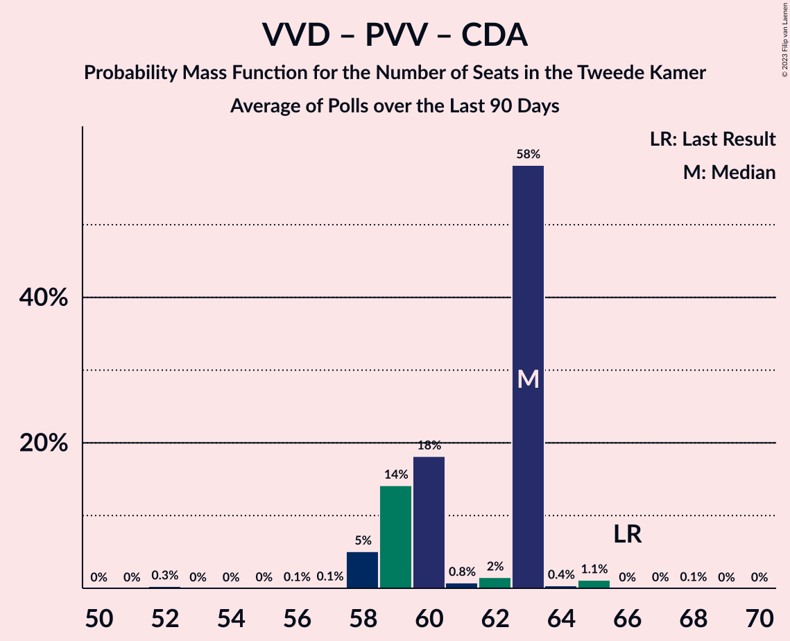

# Poll Average

<a href="#voting-intentions">Voting Intentions</a> | <a href="#seats">Seats</a> | <a href="#coalitions">Coalitions</a> | <a href="#technical-information">Technical Information</a>

## Summary

The table below lists the polls on which the average is based. They are the most recent polls (less than 90 days old) registered and analyzed so far.

| Period     | Polling firm/Commissioner(s) | VVD | D66 | PVV | CDA | SP | PvdA | GL | FvD | PvdD | CU | Volt | JA21 | SGP | DENK | 50+ | BBB | B1 | CO | Spl | PP | PvdT |
|:----------:|:----------------------------:|:--:|:--:|:--:|:--:|:--:|:--:|:--:|:--:|:--:|:--:|:--:|:--:|:--:|:--:|:--:|:--:|:--:|:--:|:--:|:--:|:--:|
| 17 March 2021 | General Election | 21.9%   34 | 15.0%   24 | 10.8%   17 | 9.5%   15 | 6.0%   9 | 5.7%   9 | 5.2%   8 | 5.0%   8 | 3.8%   6 | 3.4%   5 | 2.4%   3 | 2.4%   3 | 2.1%   3 | 2.0%   3 | 1.0%   1 | 1.0%   1 | 0.8%   1 | 0.4%   0 | 0.3%   0 | 0.2%   0 | 0.0%   0 |
| N/A | Poll Average | 20–25%   30–38 | 13–19%   21–29 | 9–14%   14–19 | 6–9%   8–14 | 4–8%   5–10 | 5–8%   8–12 | 4–6%   5–10 | 4–6%   5–9 | 4–6%   5–10 | 2–4%   4–6 | 3–5%   4–7 | 2–5%   3–6 | 1–3%   2–4 | 1–3%   1–4 | 0–1%   0–2 | 0–2%   0–3 | 0–2%   0–2 | N/A   N/A | N/A   N/A | N/A   N/A | N/A   N/A |
| [14–15 May 2021](2021-05-15-Peilnl.html) | Peil.nl | N/A   N/A | N/A   N/A | N/A   N/A | N/A   N/A | N/A   N/A | N/A   N/A | N/A   N/A | N/A   N/A | N/A   N/A | N/A   N/A | N/A   N/A | N/A   N/A | N/A   N/A | N/A   N/A | N/A   N/A | N/A   N/A | N/A   N/A | N/A   N/A | N/A   N/A | N/A   N/A | N/A   N/A |
| [30 April–3 May 2021](2021-05-03-IOResearch.html) | I&O Research | 20–23%   33–38 | 13–16%   21–25 | 9–11%   15–17 | 5–8%   8–12 | 6–8%   10 | 5–8%   9–12 | 4–6%   6–8 | 4–6%   6–9 | 4–5%   5–8 | 3–4%   4–6 | 3–5%   4–6 | 3–5%   5–6 | 1–3%   2–3 | 2–3%   2–3 | 0–1%   1 | 1–3%   2–3 | 1–2%   1–2 | N/A   N/A | N/A   N/A | N/A   N/A | N/A   N/A |
| [16–19 April 2021](2021-04-19-Ipsos.html) | Ipsos | 20–25%   29–38 | 14–19%   24–31 | 10–14%   14–21 | 6–10%   9–15 | 3–6%   5–9 | 5–8%   8–11 | 4–6%   5–10 | 3–6%   5–9 | 4–7%   6–10 | 2–4%   3–6 | 2–5%   4–7 | 2–4%   3–5 | 1–3%   2–5 | 1–2%   1–4 | 0–2%   0–2 | 0–2%   0–2 | 0–1%   0–1 | N/A   N/A | N/A   N/A | N/A   N/A | N/A   N/A |
| 17 March 2021 | General Election | 21.9%   34 | 15.0%   24 | 10.8%   17 | 9.5%   15 | 6.0%   9 | 5.7%   9 | 5.2%   8 | 5.0%   8 | 3.8%   6 | 3.4%   5 | 2.4%   3 | 2.4%   3 | 2.1%   3 | 2.0%   3 | 1.0%   1 | 1.0%   1 | 0.8%   1 | 0.4%   0 | 0.3%   0 | 0.2%   0 | 0.0%   0 |

Only polls for which at least the sample size has been published are included in the table above.

**Legend:**
+ **Top half of each row:** Voting intentions (95% confidence interval)
+ **Bottom half of each row:** Seat projections for the Tweede Kamer (95% confidence interval)
+ **VVD:** Volkspartij voor Vrijheid en Democratie
+ **D66:** Democraten 66
+ **PVV:** Partij voor de Vrijheid
+ **CDA:** Christen-Democratisch Appèl
+ **SP:** Socialistische Partij
+ **PvdA:** Partij van de Arbeid
+ **GL:** GroenLinks
+ **FvD:** Forum voor Democratie
+ **PvdD:** Partij voor de Dieren
+ **CU:** ChristenUnie
+ **Volt:** Volt Europa
+ **JA21:** Juiste Antwoord 2021
+ **SGP:** Staatkundig Gereformeerde Partij
+ **DENK:** DENK
+ **50+:** 50Plus
+ **BBB:** BoerBurgerBeweging
+ **B1:** Bij1
+ **CO:** Code Oranje
+ **Spl:** Splinter
+ **PP:** Piratenpartij
+ **PvdT:** Partij voor de Toekomst
+ **N/A (single party):** Party not included the published results
+ **N/A (entire row):** Calculation for this opinion poll not started yet

## Voting Intentions

### Confidence Intervals

| Party | Last Result | Median | 80% Confidence Interval | 90% Confidence Interval | 95% Confidence Interval | 99% Confidence Interval |
|:-----:|:-----------:|:------:|:-----------------------:|:-----------------------:|:-----------------------:|:-----------------------:|
| <a href="#volkspartij-voor-vrijheid-en-democratie">Volkspartij voor Vrijheid en Democratie</a> | 21.9% | 22.0% | 20.6–23.7% |20.2–24.3% | 19.9–24.7% | 19.3–25.7% |
| <a href="#democraten-66">Democraten 66</a> | 15.0% | 15.4% | 13.7–17.7% |13.4–18.3% | 13.1–18.7% | 12.6–19.5% |
| <a href="#partij-voor-de-vrijheid">Partij voor de Vrijheid</a> | 10.8% | 10.7% | 9.4–12.7% |9.1–13.1% | 8.9–13.5% | 8.4–14.3% |
| <a href="#christen-democratisch-appèl">Christen-Democratisch Appèl</a> | 9.5% | 7.0% | 6.0–8.5% |5.8–8.9% | 5.6–9.2% | 5.2–9.9% |
| <a href="#socialistische-partij">Socialistische Partij</a> | 6.0% | 5.7% | 4.1–7.0% |3.8–7.3% | 3.6–7.5% | 3.2–8.0% |
| <a href="#partij-van-de-arbeid">Partij van de Arbeid</a> | 5.7% | 6.4% | 5.6–7.3% |5.4–7.6% | 5.1–7.8% | 4.7–8.3% |
| <a href="#groenlinks">GroenLinks</a> | 5.2% | 4.9% | 4.2–5.7% |4.0–5.9% | 3.8–6.1% | 3.4–6.6% |
| <a href="#forum-voor-democratie">Forum voor Democratie</a> | 5.0% | 4.9% | 4.0–5.6% |3.8–5.9% | 3.6–6.1% | 3.2–6.5% |
| <a href="#partij-voor-de-dieren">Partij voor de Dieren</a> | 3.8% | 4.8% | 4.0–5.9% |3.8–6.2% | 3.7–6.5% | 3.4–7.1% |
| <a href="#christenunie">ChristenUnie</a> | 3.4% | 3.4% | 2.7–4.0% |2.5–4.2% | 2.4–4.4% | 2.1–4.8% |
| <a href="#volt-europa">Volt Europa</a> | 2.4% | 3.7% | 2.9–4.4% |2.7–4.6% | 2.6–4.8% | 2.2–5.2% |
| <a href="#juiste-antwoord-2021">Juiste Antwoord 2021</a> | 2.4% | 3.5% | 2.5–4.2% |2.3–4.5% | 2.1–4.6% | 1.9–5.0% |
| <a href="#staatkundig-gereformeerde-partij">Staatkundig Gereformeerde Partij</a> | 2.1% | 2.1% | 1.7–2.7% |1.5–2.9% | 1.4–3.1% | 1.3–3.5% |
| <a href="#denk">DENK</a> | 2.0% | 1.9% | 1.2–2.5% |1.1–2.7% | 1.0–2.8% | 0.8–3.1% |
| <a href="#50plus">50Plus</a> | 1.0% | 0.8% | 0.5–1.2% |0.4–1.3% | 0.4–1.4% | 0.3–1.7% |
| <a href="#boerburgerbeweging">BoerBurgerBeweging</a> | 1.0% | 1.4% | 0.6–2.1% |0.5–2.3% | 0.5–2.4% | 0.3–2.7% |
| <a href="#bij1">Bij1</a> | 0.8% | 1.1% | 0.6–1.6% |0.5–1.7% | 0.4–1.8% | 0.3–2.0% |
| <a href="#code-oranje">Code Oranje</a> | 0.4% | N/A | N/A |N/A | N/A | N/A |
| <a href="#splinter">Splinter</a> | 0.3% | N/A | N/A |N/A | N/A | N/A |
| <a href="#piratenpartij">Piratenpartij</a> | 0.2% | N/A | N/A |N/A | N/A | N/A |
| <a href="#partij-voor-de-toekomst">Partij voor de Toekomst</a> | 0.0% | N/A | N/A |N/A | N/A | N/A |

### Volkspartij voor Vrijheid en Democratie

*For a full overview of the results for this party, see the [Volkspartij voor Vrijheid en Democratie](party-volkspartijvoorvrijheidendemocratie.html) page.*

| Voting Intentions | Probability | Accumulated | Special Marks |
|:-----------------:|:-----------:|:-----------:|:-------------:|
| 17.5–18.5% | 0.1% | 100% |  |
| 18.5–19.5% | 1.1% | 99.9% |  |
| 19.5–20.5% | 8% | 98.9% |  |
| 20.5–21.5% | 26% | 90% |  |
| 21.5–22.5% | 32% | 65% | Last Result, Median |
| 22.5–23.5% | 20% | 32% |  |
| 23.5–24.5% | 9% | 12% |  |
| 24.5–25.5% | 3% | 3% |  |
| 25.5–26.5% | 0.6% | 0.6% |  |
| 26.5–27.5% | 0.1% | 0.1% |  |
| 27.5–28.5% | 0% | 0% |  |

### Democraten 66

*For a full overview of the results for this party, see the [Democraten 66](party-democraten66.html) page.*

| Voting Intentions | Probability | Accumulated | Special Marks |
|:-----------------:|:-----------:|:-----------:|:-------------:|
| 10.5–11.5% | 0% | 100% |  |
| 11.5–12.5% | 0.4% | 100% |  |
| 12.5–13.5% | 7% | 99.6% |  |
| 13.5–14.5% | 23% | 93% |  |
| 14.5–15.5% | 23% | 70% | Last Result, Median |
| 15.5–16.5% | 18% | 46% |  |
| 16.5–17.5% | 16% | 28% |  |
| 17.5–18.5% | 9% | 12% |  |
| 18.5–19.5% | 3% | 3% |  |
| 19.5–20.5% | 0.4% | 0.5% |  |
| 20.5–21.5% | 0% | 0% |  |
| 21.5–22.5% | 0% | 0% |  |

### Partij voor de Vrijheid

*For a full overview of the results for this party, see the [Partij voor de Vrijheid](party-partijvoordevrijheid.html) page.*

| Voting Intentions | Probability | Accumulated | Special Marks |
|:-----------------:|:-----------:|:-----------:|:-------------:|
| 6.5–7.5% | 0% | 100% |  |
| 7.5–8.5% | 0.8% | 100% |  |
| 8.5–9.5% | 14% | 99.2% |  |
| 9.5–10.5% | 31% | 86% |  |
| 10.5–11.5% | 24% | 55% | Last Result, Median |
| 11.5–12.5% | 19% | 30% |  |
| 12.5–13.5% | 9% | 12% |  |
| 13.5–14.5% | 2% | 2% |  |
| 14.5–15.5% | 0.2% | 0.3% |  |
| 15.5–16.5% | 0% | 0% |  |

### Christen-Democratisch Appèl

*For a full overview of the results for this party, see the [Christen-Democratisch Appèl](party-christen-democratischappèl.html) page.*

| Voting Intentions | Probability | Accumulated | Special Marks |
|:-----------------:|:-----------:|:-----------:|:-------------:|
| 3.5–4.5% | 0% | 100% |  |
| 4.5–5.5% | 2% | 100% |  |
| 5.5–6.5% | 29% | 98% |  |
| 6.5–7.5% | 37% | 68% | Median |
| 7.5–8.5% | 23% | 31% |  |
| 8.5–9.5% | 8% | 9% |  |
| 9.5–10.5% | 1.0% | 1.1% | Last Result |
| 10.5–11.5% | 0.1% | 0.1% |  |
| 11.5–12.5% | 0% | 0% |  |

### Socialistische Partij

*For a full overview of the results for this party, see the [Socialistische Partij](party-socialistischepartij.html) page.*

| Voting Intentions | Probability | Accumulated | Special Marks |
|:-----------------:|:-----------:|:-----------:|:-------------:|
| 1.5–2.5% | 0% | 100% |  |
| 2.5–3.5% | 2% | 100% |  |
| 3.5–4.5% | 22% | 98% |  |
| 4.5–5.5% | 23% | 76% |  |
| 5.5–6.5% | 27% | 53% | Last Result, Median |
| 6.5–7.5% | 23% | 25% |  |
| 7.5–8.5% | 2% | 2% |  |
| 8.5–9.5% | 0% | 0% |  |

### Partij van de Arbeid

*For a full overview of the results for this party, see the [Partij van de Arbeid](party-partijvandearbeid.html) page.*

| Voting Intentions | Probability | Accumulated | Special Marks |
|:-----------------:|:-----------:|:-----------:|:-------------:|
| 2.5–3.5% | 0% | 100% |  |
| 3.5–4.5% | 0.2% | 100% |  |
| 4.5–5.5% | 9% | 99.8% |  |
| 5.5–6.5% | 49% | 91% | Last Result, Median |
| 6.5–7.5% | 37% | 42% |  |
| 7.5–8.5% | 5% | 5% |  |
| 8.5–9.5% | 0.2% | 0.3% |  |
| 9.5–10.5% | 0% | 0% |  |

### GroenLinks

*For a full overview of the results for this party, see the [GroenLinks](party-groenlinks.html) page.*

| Voting Intentions | Probability | Accumulated | Special Marks |
|:-----------------:|:-----------:|:-----------:|:-------------:|
| 1.5–2.5% | 0% | 100% |  |
| 2.5–3.5% | 1.1% | 100% |  |
| 3.5–4.5% | 25% | 98.9% |  |
| 4.5–5.5% | 59% | 74% | Last Result, Median |
| 5.5–6.5% | 15% | 15% |  |
| 6.5–7.5% | 0.6% | 0.6% |  |
| 7.5–8.5% | 0% | 0% |  |

### Forum voor Democratie

*For a full overview of the results for this party, see the [Forum voor Democratie](party-forumvoordemocratie.html) page.*

| Voting Intentions | Probability | Accumulated | Special Marks |
|:-----------------:|:-----------:|:-----------:|:-------------:|
| 1.5–2.5% | 0% | 100% |  |
| 2.5–3.5% | 2% | 100% |  |
| 3.5–4.5% | 29% | 98% |  |
| 4.5–5.5% | 56% | 68% | Last Result, Median |
| 5.5–6.5% | 12% | 13% |  |
| 6.5–7.5% | 0.3% | 0.3% |  |
| 7.5–8.5% | 0% | 0% |  |

### Partij voor de Dieren

*For a full overview of the results for this party, see the [Partij voor de Dieren](party-partijvoordedieren.html) page.*

| Voting Intentions | Probability | Accumulated | Special Marks |
|:-----------------:|:-----------:|:-----------:|:-------------:|
| 1.5–2.5% | 0% | 100% |  |
| 2.5–3.5% | 1.3% | 100% |  |
| 3.5–4.5% | 36% | 98.7% | Last Result |
| 4.5–5.5% | 44% | 62% | Median |
| 5.5–6.5% | 16% | 18% |  |
| 6.5–7.5% | 2% | 2% |  |
| 7.5–8.5% | 0.1% | 0.1% |  |
| 8.5–9.5% | 0% | 0% |  |

### ChristenUnie

*For a full overview of the results for this party, see the [ChristenUnie](party-christenunie.html) page.*

| Voting Intentions | Probability | Accumulated | Special Marks |
|:-----------------:|:-----------:|:-----------:|:-------------:|
| 0.5–1.5% | 0% | 100% |  |
| 1.5–2.5% | 5% | 100% |  |
| 2.5–3.5% | 57% | 95% | Last Result, Median |
| 3.5–4.5% | 37% | 38% |  |
| 4.5–5.5% | 1.4% | 1.4% |  |
| 5.5–6.5% | 0% | 0% |  |

### Volt Europa

*For a full overview of the results for this party, see the [Volt Europa](party-volteuropa.html) page.*

| Voting Intentions | Probability | Accumulated | Special Marks |
|:-----------------:|:-----------:|:-----------:|:-------------:|
| 0.5–1.5% | 0% | 100% |  |
| 1.5–2.5% | 2% | 100% | Last Result |
| 2.5–3.5% | 36% | 98% |  |
| 3.5–4.5% | 55% | 61% | Median |
| 4.5–5.5% | 6% | 7% |  |
| 5.5–6.5% | 0.1% | 0.1% |  |
| 6.5–7.5% | 0% | 0% |  |

### Juiste Antwoord 2021

*For a full overview of the results for this party, see the [Juiste Antwoord 2021](party-juisteantwoord2021.html) page.*

| Voting Intentions | Probability | Accumulated | Special Marks |
|:-----------------:|:-----------:|:-----------:|:-------------:|
| 0.5–1.5% | 0% | 100% |  |
| 1.5–2.5% | 11% | 100% | Last Result |
| 2.5–3.5% | 44% | 89% | Median |
| 3.5–4.5% | 41% | 44% |  |
| 4.5–5.5% | 3% | 3% |  |
| 5.5–6.5% | 0% | 0% |  |

### Staatkundig Gereformeerde Partij

*For a full overview of the results for this party, see the [Staatkundig Gereformeerde Partij](party-staatkundiggereformeerdepartij.html) page.*

| Voting Intentions | Probability | Accumulated | Special Marks |
|:-----------------:|:-----------:|:-----------:|:-------------:|
| 0.0–0.5% | 0% | 100% |  |
| 0.5–1.5% | 5% | 100% |  |
| 1.5–2.5% | 78% | 95% | Last Result, Median |
| 2.5–3.5% | 16% | 16% |  |
| 3.5–4.5% | 0.4% | 0.4% |  |
| 4.5–5.5% | 0% | 0% |  |

### DENK

*For a full overview of the results for this party, see the [DENK](party-denk.html) page.*

| Voting Intentions | Probability | Accumulated | Special Marks |
|:-----------------:|:-----------:|:-----------:|:-------------:|
| 0.0–0.5% | 0% | 100% |  |
| 0.5–1.5% | 26% | 100% |  |
| 1.5–2.5% | 64% | 74% | Last Result, Median |
| 2.5–3.5% | 10% | 10% |  |
| 3.5–4.5% | 0% | 0% |  |

### 50Plus

*For a full overview of the results for this party, see the [50Plus](party-50plus.html) page.*

| Voting Intentions | Probability | Accumulated | Special Marks |
|:-----------------:|:-----------:|:-----------:|:-------------:|
| 0.0–0.5% | 14% | 100% |  |
| 0.5–1.5% | 84% | 86% | Last Result, Median |
| 1.5–2.5% | 1.2% | 1.2% |  |
| 2.5–3.5% | 0% | 0% |  |

### BoerBurgerBeweging

*For a full overview of the results for this party, see the [BoerBurgerBeweging](party-boerburgerbeweging.html) page.*

| Voting Intentions | Probability | Accumulated | Special Marks |
|:-----------------:|:-----------:|:-----------:|:-------------:|
| 0.0–0.5% | 6% | 100% |  |
| 0.5–1.5% | 51% | 94% | Last Result, Median |
| 1.5–2.5% | 43% | 44% |  |
| 2.5–3.5% | 1.2% | 1.2% |  |
| 3.5–4.5% | 0% | 0% |  |

### Bij1

*For a full overview of the results for this party, see the [Bij1](party-bij1.html) page.*

| Voting Intentions | Probability | Accumulated | Special Marks |
|:-----------------:|:-----------:|:-----------:|:-------------:|
| 0.0–0.5% | 10% | 100% |  |
| 0.5–1.5% | 79% | 90% | Last Result, Median |
| 1.5–2.5% | 11% | 11% |  |
| 2.5–3.5% | 0% | 0% |  |

## Seats

### Confidence Intervals

| Party | Last Result | Median | 80% Confidence Interval | 90% Confidence Interval | 95% Confidence Interval | 99% Confidence Interval |
|:-----:|:-----------:|:------:|:-----------------------:|:-----------------------:|:-----------------------:|:-----------------------:|
| <a href="#volkspartij-voor-vrijheid-en-democratie">Volkspartij voor Vrijheid en Democratie</a> | 34 | 33 | 31–38 |30–38 | 30–38 | 29–38 |
| <a href="#democraten-66">Democraten 66</a> | 24 | 24 | 21–27 |21–27 | 21–29 | 21–31 |
| <a href="#partij-voor-de-vrijheid">Partij voor de Vrijheid</a> | 17 | 17 | 15–19 |15–19 | 14–19 | 14–22 |
| <a href="#christen-democratisch-appèl">Christen-Democratisch Appèl</a> | 15 | 10 | 8–14 |8–14 | 8–14 | 7–17 |
| <a href="#socialistische-partij">Socialistische Partij</a> | 9 | 9 | 5–10 |5–10 | 5–10 | 5–10 |
| <a href="#partij-van-de-arbeid">Partij van de Arbeid</a> | 9 | 9 | 8–12 |8–12 | 8–12 | 8–12 |
| <a href="#groenlinks">GroenLinks</a> | 8 | 7 | 5–9 |5–9 | 5–10 | 5–10 |
| <a href="#forum-voor-democratie">Forum voor Democratie</a> | 8 | 6 | 5–9 |5–9 | 5–9 | 5–9 |
| <a href="#partij-voor-de-dieren">Partij voor de Dieren</a> | 6 | 7 | 5–10 |5–10 | 5–10 | 5–10 |
| <a href="#christenunie">ChristenUnie</a> | 5 | 5 | 4–6 |4–6 | 4–6 | 3–8 |
| <a href="#volt-europa">Volt Europa</a> | 3 | 6 | 4–6 |4–7 | 4–7 | 3–7 |
| <a href="#juiste-antwoord-2021">Juiste Antwoord 2021</a> | 3 | 5 | 4–6 |3–6 | 3–6 | 3–6 |
| <a href="#staatkundig-gereformeerde-partij">Staatkundig Gereformeerde Partij</a> | 3 | 3 | 2–4 |2–4 | 2–4 | 2–5 |
| <a href="#denk">DENK</a> | 3 | 3 | 2–4 |2–4 | 1–4 | 1–4 |
| <a href="#50plus">50Plus</a> | 1 | 1 | 0–2 |0–2 | 0–2 | 0–4 |
| <a href="#boerburgerbeweging">BoerBurgerBeweging</a> | 1 | 2 | 1–3 |1–3 | 0–3 | 0–3 |
| <a href="#bij1">Bij1</a> | 1 | 1 | 1–2 |0–2 | 0–2 | 0–2 |
| <a href="#code-oranje">Code Oranje</a> | 0 | N/A | N/A |N/A | N/A | N/A |
| <a href="#splinter">Splinter</a> | 0 | N/A | N/A |N/A | N/A | N/A |
| <a href="#piratenpartij">Piratenpartij</a> | 0 | N/A | N/A |N/A | N/A | N/A |
| <a href="#partij-voor-de-toekomst">Partij voor de Toekomst</a> | 0 | N/A | N/A |N/A | N/A | N/A |

### Volkspartij voor Vrijheid en Democratie

*For a full overview of the results for this party, see the [Volkspartij voor Vrijheid en Democratie](party-volkspartijvoorvrijheidendemocratie.html) page.*

| Number of Seats | Probability | Accumulated | Special Marks |
|:---------------:|:-----------:|:-----------:|:-------------:|
| 28 | 0.2% | 100% |  |
| 29 | 1.5% | 99.8% |  |
| 30 | 7% | 98% |  |
| 31 | 1.3% | 91% |  |
| 32 | 2% | 90% |  |
| 33 | 39% | 88% | Median |
| 34 | 1.1% | 49% | Last Result |
| 35 | 20% | 48% |  |
| 36 | 0.8% | 28% |  |
| 37 | 0.5% | 27% |  |
| 38 | 26% | 26% |  |
| 39 | 0.1% | 0.2% |  |
| 40 | 0.1% | 0.1% |  |
| 41 | 0% | 0% |  |

### Democraten 66

*For a full overview of the results for this party, see the [Democraten 66](party-democraten66.html) page.*

| Number of Seats | Probability | Accumulated | Special Marks |
|:---------------:|:-----------:|:-----------:|:-------------:|
| 19 | 0.1% | 100% |  |
| 20 | 0.2% | 99.9% |  |
| 21 | 19% | 99.7% |  |
| 22 | 0.7% | 81% |  |
| 23 | 11% | 80% |  |
| 24 | 24% | 69% | Last Result, Median |
| 25 | 21% | 45% |  |
| 26 | 5% | 25% |  |
| 27 | 15% | 19% |  |
| 28 | 0.1% | 4% |  |
| 29 | 2% | 4% |  |
| 30 | 0.7% | 2% |  |
| 31 | 1.3% | 2% |  |
| 32 | 0.4% | 0.5% |  |
| 33 | 0% | 0% |  |

### Partij voor de Vrijheid

*For a full overview of the results for this party, see the [Partij voor de Vrijheid](party-partijvoordevrijheid.html) page.*

| Number of Seats | Probability | Accumulated | Special Marks |
|:---------------:|:-----------:|:-----------:|:-------------:|
| 13 | 0.3% | 100% |  |
| 14 | 3% | 99.7% |  |
| 15 | 20% | 97% |  |
| 16 | 17% | 77% |  |
| 17 | 34% | 60% | Last Result, Median |
| 18 | 3% | 26% |  |
| 19 | 21% | 23% |  |
| 20 | 0.7% | 2% |  |
| 21 | 0.6% | 1.4% |  |
| 22 | 0.8% | 0.8% |  |
| 23 | 0% | 0% |  |

### Christen-Democratisch Appèl

*For a full overview of the results for this party, see the [Christen-Democratisch Appèl](party-christen-democratischappèl.html) page.*

| Number of Seats | Probability | Accumulated | Special Marks |
|:---------------:|:-----------:|:-----------:|:-------------:|
| 7 | 0.5% | 100% |  |
| 8 | 12% | 99.5% |  |
| 9 | 36% | 88% |  |
| 10 | 2% | 52% | Median |
| 11 | 14% | 50% |  |
| 12 | 21% | 36% |  |
| 13 | 4% | 15% |  |
| 14 | 9% | 10% |  |
| 15 | 0.7% | 2% | Last Result |
| 16 | 0% | 1.1% |  |
| 17 | 1.0% | 1.0% |  |
| 18 | 0% | 0% |  |

### Socialistische Partij

*For a full overview of the results for this party, see the [Socialistische Partij](party-socialistischepartij.html) page.*

| Number of Seats | Probability | Accumulated | Special Marks |
|:---------------:|:-----------:|:-----------:|:-------------:|
| 4 | 0.1% | 100% |  |
| 5 | 16% | 99.9% |  |
| 6 | 21% | 84% |  |
| 7 | 1.2% | 63% |  |
| 8 | 4% | 62% |  |
| 9 | 8% | 58% | Last Result, Median |
| 10 | 50% | 50% |  |
| 11 | 0.1% | 0.2% |  |
| 12 | 0% | 0.1% |  |
| 13 | 0.1% | 0.1% |  |
| 14 | 0% | 0% |  |

### Partij van de Arbeid

*For a full overview of the results for this party, see the [Partij van de Arbeid](party-partijvandearbeid.html) page.*

| Number of Seats | Probability | Accumulated | Special Marks |
|:---------------:|:-----------:|:-----------:|:-------------:|
| 6 | 0.3% | 100% |  |
| 7 | 0.1% | 99.7% |  |
| 8 | 12% | 99.6% |  |
| 9 | 61% | 88% | Last Result, Median |
| 10 | 2% | 27% |  |
| 11 | 4% | 25% |  |
| 12 | 21% | 21% |  |
| 13 | 0.5% | 0.5% |  |
| 14 | 0% | 0% |  |

### GroenLinks

*For a full overview of the results for this party, see the [GroenLinks](party-groenlinks.html) page.*

| Number of Seats | Probability | Accumulated | Special Marks |
|:---------------:|:-----------:|:-----------:|:-------------:|
| 5 | 15% | 100% |  |
| 6 | 33% | 85% |  |
| 7 | 16% | 52% | Median |
| 8 | 26% | 36% | Last Result |
| 9 | 7% | 10% |  |
| 10 | 3% | 3% |  |
| 11 | 0% | 0.1% |  |
| 12 | 0.1% | 0.1% |  |
| 13 | 0% | 0% |  |

### Forum voor Democratie

*For a full overview of the results for this party, see the [Forum voor Democratie](party-forumvoordemocratie.html) page.*

| Number of Seats | Probability | Accumulated | Special Marks |
|:---------------:|:-----------:|:-----------:|:-------------:|
| 4 | 0.3% | 100% |  |
| 5 | 16% | 99.7% |  |
| 6 | 46% | 83% | Median |
| 7 | 25% | 38% |  |
| 8 | 0.6% | 13% | Last Result |
| 9 | 12% | 13% |  |
| 10 | 0.5% | 0.5% |  |
| 11 | 0% | 0% |  |

### Partij voor de Dieren

*For a full overview of the results for this party, see the [Partij voor de Dieren](party-partijvoordedieren.html) page.*

| Number of Seats | Probability | Accumulated | Special Marks |
|:---------------:|:-----------:|:-----------:|:-------------:|
| 5 | 32% | 100% |  |
| 6 | 0.8% | 68% | Last Result |
| 7 | 23% | 67% | Median |
| 8 | 23% | 44% |  |
| 9 | 5% | 21% |  |
| 10 | 15% | 15% |  |
| 11 | 0.2% | 0.3% |  |
| 12 | 0.1% | 0.1% |  |
| 13 | 0% | 0% |  |

### ChristenUnie

*For a full overview of the results for this party, see the [ChristenUnie](party-christenunie.html) page.*

| Number of Seats | Probability | Accumulated | Special Marks |
|:---------------:|:-----------:|:-----------:|:-------------:|
| 3 | 2% | 100% |  |
| 4 | 20% | 98% |  |
| 5 | 56% | 77% | Last Result, Median |
| 6 | 21% | 22% |  |
| 7 | 0.4% | 0.9% |  |
| 8 | 0.5% | 0.5% |  |
| 9 | 0% | 0% |  |

### Volt Europa

*For a full overview of the results for this party, see the [Volt Europa](party-volteuropa.html) page.*

| Number of Seats | Probability | Accumulated | Special Marks |
|:---------------:|:-----------:|:-----------:|:-------------:|
| 3 | 1.0% | 100% | Last Result |
| 4 | 22% | 98.9% |  |
| 5 | 21% | 77% |  |
| 6 | 48% | 55% | Median |
| 7 | 8% | 8% |  |
| 8 | 0.1% | 0.1% |  |
| 9 | 0% | 0% |  |

### Juiste Antwoord 2021

*For a full overview of the results for this party, see the [Juiste Antwoord 2021](party-juisteantwoord2021.html) page.*

| Number of Seats | Probability | Accumulated | Special Marks |
|:---------------:|:-----------:|:-----------:|:-------------:|
| 2 | 0.2% | 100% |  |
| 3 | 6% | 99.8% | Last Result |
| 4 | 39% | 94% |  |
| 5 | 16% | 55% | Median |
| 6 | 39% | 39% |  |
| 7 | 0.3% | 0.4% |  |
| 8 | 0% | 0% |  |

### Staatkundig Gereformeerde Partij

*For a full overview of the results for this party, see the [Staatkundig Gereformeerde Partij](party-staatkundiggereformeerdepartij.html) page.*

| Number of Seats | Probability | Accumulated | Special Marks |
|:---------------:|:-----------:|:-----------:|:-------------:|
| 1 | 0.4% | 100% |  |
| 2 | 49% | 99.6% |  |
| 3 | 31% | 50% | Last Result, Median |
| 4 | 18% | 20% |  |
| 5 | 2% | 2% |  |
| 6 | 0.1% | 0.1% |  |
| 7 | 0% | 0% |  |

### DENK

*For a full overview of the results for this party, see the [DENK](party-denk.html) page.*

| Number of Seats | Probability | Accumulated | Special Marks |
|:---------------:|:-----------:|:-----------:|:-------------:|
| 0 | 0.1% | 100% |  |
| 1 | 4% | 99.9% |  |
| 2 | 44% | 96% |  |
| 3 | 36% | 52% | Last Result, Median |
| 4 | 16% | 16% |  |
| 5 | 0% | 0% |  |

### 50Plus

*For a full overview of the results for this party, see the [50Plus](party-50plus.html) page.*

| Number of Seats | Probability | Accumulated | Special Marks |
|:---------------:|:-----------:|:-----------:|:-------------:|
| 0 | 19% | 100% |  |
| 1 | 64% | 81% | Last Result, Median |
| 2 | 16% | 17% |  |
| 3 | 0.1% | 1.1% |  |
| 4 | 1.0% | 1.0% |  |
| 5 | 0% | 0% |  |

### BoerBurgerBeweging

*For a full overview of the results for this party, see the [BoerBurgerBeweging](party-boerburgerbeweging.html) page.*

| Number of Seats | Probability | Accumulated | Special Marks |
|:---------------:|:-----------:|:-----------:|:-------------:|
| 0 | 4% | 100% |  |
| 1 | 24% | 96% | Last Result |
| 2 | 53% | 72% | Median |
| 3 | 19% | 19% |  |
| 4 | 0.2% | 0.2% |  |
| 5 | 0% | 0% |  |

### Bij1

*For a full overview of the results for this party, see the [Bij1](party-bij1.html) page.*

| Number of Seats | Probability | Accumulated | Special Marks |
|:---------------:|:-----------:|:-----------:|:-------------:|
| 0 | 8% | 100% |  |
| 1 | 71% | 92% | Last Result, Median |
| 2 | 21% | 21% |  |
| 3 | 0.2% | 0.2% |  |
| 4 | 0% | 0% |  |

### Code Oranje

*For a full overview of the results for this party, see the [Code Oranje](party-codeoranje.html) page.*

### Splinter

*For a full overview of the results for this party, see the [Splinter](party-splinter.html) page.*

### Piratenpartij

*For a full overview of the results for this party, see the [Piratenpartij](party-piratenpartij.html) page.*

### Partij voor de Toekomst

*For a full overview of the results for this party, see the [Partij voor de Toekomst](party-partijvoordetoekomst.html) page.*

## Coalitions

### Confidence Intervals

| Coalition | Last Result | Median | Majority? | 80% Confidence Interval | 90% Confidence Interval | 95% Confidence Interval | 99% Confidence Interval |
|:---------:|:-----------:|:------:|:---------:|:-----------------------:|:-----------------------:|:-----------------------:|:-----------------------:|
| Volkspartij voor Vrijheid en Democratie – Democraten 66 – Christen-Democratisch Appèl – Partij van de Arbeid – ChristenUnie | 87 | 82 | 99.8% | 81–90 | 80–90 | 80–92 | 80–93 |
| Volkspartij voor Vrijheid en Democratie – Democraten 66 – Christen-Democratisch Appèl – GroenLinks – ChristenUnie | 86 | 80 | 99.7% | 78–86 | 78–88 | 78–89 | 77–90 |
| Volkspartij voor Vrijheid en Democratie – Democraten 66 – Christen-Democratisch Appèl – ChristenUnie | 78 | 73 | 25% | 72–81 | 72–81 | 72–82 | 70–84 |
| Volkspartij voor Vrijheid en Democratie – Democraten 66 – Christen-Democratisch Appèl | 73 | 68 | 17% | 66–76 | 66–76 | 66–78 | 65–79 |
| Volkspartij voor Vrijheid en Democratie – Partij voor de Vrijheid – Christen-Democratisch Appèl – Forum voor Democratie – Staatkundig Gereformeerde Partij | 77 | 71 | 18% | 66–76 | 66–76 | 66–78 | 66–79 |
| Volkspartij voor Vrijheid en Democratie – Partij voor de Vrijheid – Christen-Democratisch Appèl – Forum voor Democratie | 74 | 68 | 0.5% | 64–73 | 64–73 | 64–74 | 64–75 |
| Volkspartij voor Vrijheid en Democratie – Democraten 66 – Partij van de Arbeid | 67 | 70 | 0.8% | 63–74 | 62–74 | 62–74 | 62–76 |
| Democraten 66 – Christen-Democratisch Appèl – Socialistische Partij – Partij van de Arbeid – GroenLinks – ChristenUnie | 70 | 64 | 0% | 60–69 | 60–69 | 60–72 | 59–73 |
| Volkspartij voor Vrijheid en Democratie – Partij voor de Vrijheid – Christen-Democratisch Appèl | 66 | 62 | 0% | 57–68 | 57–68 | 57–68 | 57–68 |
| Democraten 66 – Christen-Democratisch Appèl – Partij van de Arbeid – GroenLinks – ChristenUnie | 61 | 57 | 0% | 50–60 | 50–62 | 50–65 | 50–68 |
| Volkspartij voor Vrijheid en Democratie – Christen-Democratisch Appèl – Forum voor Democratie – Staatkundig Gereformeerde Partij – 50Plus | 61 | 54 | 0% | 52–59 | 52–59 | 52–62 | 51–63 |
| Volkspartij voor Vrijheid en Democratie – Christen-Democratisch Appèl – Forum voor Democratie – Staatkundig Gereformeerde Partij | 60 | 53 | 0% | 51–58 | 51–58 | 51–60 | 51–62 |
| Volkspartij voor Vrijheid en Democratie – Christen-Democratisch Appèl – Partij van de Arbeid | 58 | 54 | 0% | 53–58 | 52–58 | 52–59 | 51–63 |
| Volkspartij voor Vrijheid en Democratie – Christen-Democratisch Appèl – Forum voor Democratie – 50Plus | 58 | 52 | 0% | 50–56 | 50–56 | 49–59 | 48–59 |
| Volkspartij voor Vrijheid en Democratie – Christen-Democratisch Appèl – Forum voor Democratie | 57 | 51 | 0% | 49–55 | 49–55 | 48–58 | 48–59 |
| Democraten 66 – Christen-Democratisch Appèl – Partij van de Arbeid | 48 | 46 | 0% | 40–47 | 40–49 | 40–53 | 40–55 |
| Volkspartij voor Vrijheid en Democratie – Christen-Democratisch Appèl | 49 | 45 | 0% | 42–49 | 42–49 | 42–49 | 42–52 |
| Volkspartij voor Vrijheid en Democratie – Partij van de Arbeid | 43 | 45 | 0% | 41–47 | 38–47 | 38–47 | 37–48 |
| Democraten 66 – Christen-Democratisch Appèl | 39 | 34 | 0% | 31–38 | 31–40 | 31–43 | 31–45 |
| Christen-Democratisch Appèl – Partij van de Arbeid – ChristenUnie | 29 | 26 | 0% | 21–27 | 21–27 | 21–29 | 21–31 |
| Christen-Democratisch Appèl – Partij van de Arbeid | 24 | 21 | 0% | 17–22 | 17–22 | 17–24 | 17–28 |

### Volkspartij voor Vrijheid en Democratie – Democraten 66 – Christen-Democratisch Appèl – Partij van de Arbeid – ChristenUnie

| Number of Seats | Probability | Accumulated | Special Marks |
|:---------------:|:-----------:|:-----------:|:-------------:|
| 74 | 0.1% | 100% |  |
| 75 | 0% | 99.9% |  |
| 76 | 0.1% | 99.8% | Majority |
| 77 | 0% | 99.7% |  |
| 78 | 0.2% | 99.7% |  |
| 79 | 0% | 99.6% |  |
| 80 | 7% | 99.5% |  |
| 81 | 19% | 92% | Median |
| 82 | 27% | 74% |  |
| 83 | 1.2% | 47% |  |
| 84 | 20% | 45% |  |
| 85 | 0.5% | 25% |  |
| 86 | 0.6% | 25% |  |
| 87 | 5% | 24% | Last Result |
| 88 | 0.8% | 19% |  |
| 89 | 2% | 18% |  |
| 90 | 13% | 16% |  |
| 91 | 0% | 3% |  |
| 92 | 3% | 3% |  |
| 93 | 0% | 0.5% |  |
| 94 | 0.4% | 0.5% |  |
| 95 | 0.1% | 0.1% |  |
| 96 | 0% | 0% |  |

### Volkspartij voor Vrijheid en Democratie – Democraten 66 – Christen-Democratisch Appèl – GroenLinks – ChristenUnie

| Number of Seats | Probability | Accumulated | Special Marks |
|:---------------:|:-----------:|:-----------:|:-------------:|
| 73 | 0.1% | 100% |  |
| 74 | 0.1% | 99.9% |  |
| 75 | 0.1% | 99.8% |  |
| 76 | 0.1% | 99.7% | Majority |
| 77 | 0.6% | 99.6% |  |
| 78 | 19% | 99.0% |  |
| 79 | 12% | 80% | Median |
| 80 | 35% | 68% |  |
| 81 | 8% | 33% |  |
| 82 | 0.9% | 25% |  |
| 83 | 0.5% | 25% |  |
| 84 | 2% | 24% |  |
| 85 | 0.3% | 22% |  |
| 86 | 14% | 22% | Last Result |
| 87 | 2% | 8% |  |
| 88 | 1.2% | 6% |  |
| 89 | 4% | 5% |  |
| 90 | 0.6% | 0.6% |  |
| 91 | 0% | 0.1% |  |
| 92 | 0% | 0% |  |

### Volkspartij voor Vrijheid en Democratie – Democraten 66 – Christen-Democratisch Appèl – ChristenUnie

| Number of Seats | Probability | Accumulated | Special Marks |
|:---------------:|:-----------:|:-----------:|:-------------:|
| 65 | 0.1% | 100% |  |
| 66 | 0.1% | 99.9% |  |
| 67 | 0% | 99.8% |  |
| 68 | 0.1% | 99.8% |  |
| 69 | 0.2% | 99.7% |  |
| 70 | 0.5% | 99.6% |  |
| 71 | 1.1% | 99.1% |  |
| 72 | 46% | 98% | Median |
| 73 | 26% | 52% |  |
| 74 | 1.1% | 26% |  |
| 75 | 0.2% | 25% |  |
| 76 | 3% | 25% | Majority |
| 77 | 0.1% | 22% |  |
| 78 | 0.5% | 22% | Last Result |
| 79 | 5% | 22% |  |
| 80 | 0.9% | 17% |  |
| 81 | 14% | 16% |  |
| 82 | 0.7% | 3% |  |
| 83 | 1.3% | 2% |  |
| 84 | 0.4% | 0.5% |  |
| 85 | 0.1% | 0.1% |  |
| 86 | 0% | 0% |  |

### Volkspartij voor Vrijheid en Democratie – Democraten 66 – Christen-Democratisch Appèl

| Number of Seats | Probability | Accumulated | Special Marks |
|:---------------:|:-----------:|:-----------:|:-------------:|
| 60 | 0.1% | 100% |  |
| 61 | 0% | 99.9% |  |
| 62 | 0.1% | 99.9% |  |
| 63 | 0.1% | 99.8% |  |
| 64 | 0% | 99.7% |  |
| 65 | 0.3% | 99.7% |  |
| 66 | 18% | 99.4% |  |
| 67 | 21% | 81% | Median |
| 68 | 23% | 60% |  |
| 69 | 12% | 37% |  |
| 70 | 1.0% | 25% |  |
| 71 | 2% | 24% |  |
| 72 | 0.6% | 23% |  |
| 73 | 0.8% | 22% | Last Result |
| 74 | 4% | 21% |  |
| 75 | 0.3% | 17% |  |
| 76 | 14% | 17% | Majority |
| 77 | 0.1% | 3% |  |
| 78 | 2% | 3% |  |
| 79 | 0.5% | 0.5% |  |
| 80 | 0% | 0% |  |

### Volkspartij voor Vrijheid en Democratie – Partij voor de Vrijheid – Christen-Democratisch Appèl – Forum voor Democratie – Staatkundig Gereformeerde Partij

| Number of Seats | Probability | Accumulated | Special Marks |
|:---------------:|:-----------:|:-----------:|:-------------:|
| 66 | 20% | 100% |  |
| 67 | 0.2% | 80% |  |
| 68 | 0.8% | 80% |  |
| 69 | 2% | 79% | Median |
| 70 | 20% | 77% |  |
| 71 | 25% | 57% |  |
| 72 | 1.2% | 31% |  |
| 73 | 0.9% | 30% |  |
| 74 | 11% | 29% |  |
| 75 | 0.2% | 18% |  |
| 76 | 14% | 18% | Majority |
| 77 | 0.5% | 3% | Last Result |
| 78 | 2% | 3% |  |
| 79 | 0.2% | 0.6% |  |
| 80 | 0.3% | 0.4% |  |
| 81 | 0% | 0.1% |  |
| 82 | 0% | 0% |  |

### Volkspartij voor Vrijheid en Democratie – Partij voor de Vrijheid – Christen-Democratisch Appèl – Forum voor Democratie

| Number of Seats | Probability | Accumulated | Special Marks |
|:---------------:|:-----------:|:-----------:|:-------------:|
| 63 | 0.2% | 100% |  |
| 64 | 21% | 99.8% |  |
| 65 | 0.2% | 78% |  |
| 66 | 1.1% | 78% | Median |
| 67 | 16% | 77% |  |
| 68 | 23% | 61% |  |
| 69 | 8% | 38% |  |
| 70 | 1.4% | 30% |  |
| 71 | 11% | 29% |  |
| 72 | 0.2% | 17% |  |
| 73 | 13% | 17% |  |
| 74 | 3% | 4% | Last Result |
| 75 | 1.1% | 2% |  |
| 76 | 0.1% | 0.5% | Majority |
| 77 | 0.1% | 0.4% |  |
| 78 | 0% | 0.3% |  |
| 79 | 0.3% | 0.3% |  |
| 80 | 0% | 0% |  |

### Volkspartij voor Vrijheid en Democratie – Democraten 66 – Partij van de Arbeid

| Number of Seats | Probability | Accumulated | Special Marks |
|:---------------:|:-----------:|:-----------:|:-------------:|
| 59 | 0.1% | 100% |  |
| 60 | 0% | 99.9% |  |
| 61 | 0.2% | 99.9% |  |
| 62 | 7% | 99.7% |  |
| 63 | 19% | 93% |  |
| 64 | 0.3% | 74% |  |
| 65 | 0.7% | 74% |  |
| 66 | 0.2% | 73% | Median |
| 67 | 1.3% | 73% | Last Result |
| 68 | 16% | 72% |  |
| 69 | 3% | 55% |  |
| 70 | 32% | 52% |  |
| 71 | 1.1% | 20% |  |
| 72 | 2% | 19% |  |
| 73 | 0.9% | 17% |  |
| 74 | 15% | 16% |  |
| 75 | 0% | 0.9% |  |
| 76 | 0.8% | 0.8% | Majority |
| 77 | 0% | 0% |  |

### Democraten 66 – Christen-Democratisch Appèl – Socialistische Partij – Partij van de Arbeid – GroenLinks – ChristenUnie

| Number of Seats | Probability | Accumulated | Special Marks |
|:---------------:|:-----------:|:-----------:|:-------------:|
| 58 | 0.1% | 100% |  |
| 59 | 0.4% | 99.9% |  |
| 60 | 26% | 99.5% |  |
| 61 | 0.1% | 74% |  |
| 62 | 14% | 73% |  |
| 63 | 0.3% | 60% |  |
| 64 | 19% | 59% | Median |
| 65 | 2% | 40% |  |
| 66 | 2% | 38% |  |
| 67 | 0.7% | 36% |  |
| 68 | 11% | 35% |  |
| 69 | 21% | 25% |  |
| 70 | 1.1% | 4% | Last Result |
| 71 | 0.1% | 3% |  |
| 72 | 2% | 3% |  |
| 73 | 0.4% | 0.6% |  |
| 74 | 0.2% | 0.2% |  |
| 75 | 0% | 0% |  |

### Volkspartij voor Vrijheid en Democratie – Partij voor de Vrijheid – Christen-Democratisch Appèl

| Number of Seats | Probability | Accumulated | Special Marks |
|:---------------:|:-----------:|:-----------:|:-------------:|
| 56 | 0.1% | 100% |  |
| 57 | 20% | 99.9% |  |
| 58 | 0.2% | 80% |  |
| 59 | 2% | 80% |  |
| 60 | 2% | 78% | Median |
| 61 | 15% | 76% |  |
| 62 | 33% | 60% |  |
| 63 | 9% | 28% |  |
| 64 | 0.1% | 19% |  |
| 65 | 2% | 18% |  |
| 66 | 0.4% | 16% | Last Result |
| 67 | 2% | 16% |  |
| 68 | 14% | 15% |  |
| 69 | 0.4% | 0.5% |  |
| 70 | 0.1% | 0.1% |  |
| 71 | 0% | 0% |  |

### Democraten 66 – Christen-Democratisch Appèl – Partij van de Arbeid – GroenLinks – ChristenUnie

| Number of Seats | Probability | Accumulated | Special Marks |
|:---------------:|:-----------:|:-----------:|:-------------:|
| 48 | 0.1% | 100% |  |
| 49 | 0% | 99.9% |  |
| 50 | 11% | 99.9% |  |
| 51 | 0.1% | 89% |  |
| 52 | 0.2% | 89% |  |
| 53 | 0.4% | 88% |  |
| 54 | 33% | 88% |  |
| 55 | 0.5% | 55% | Median |
| 56 | 0.4% | 54% |  |
| 57 | 14% | 54% |  |
| 58 | 2% | 40% |  |
| 59 | 28% | 38% |  |
| 60 | 3% | 11% |  |
| 61 | 0.1% | 7% | Last Result |
| 62 | 4% | 7% |  |
| 63 | 0.1% | 3% |  |
| 64 | 0.3% | 3% |  |
| 65 | 0.1% | 3% |  |
| 66 | 2% | 2% |  |
| 67 | 0% | 0.5% |  |
| 68 | 0.4% | 0.5% |  |
| 69 | 0.1% | 0.1% |  |
| 70 | 0% | 0% |  |

### Volkspartij voor Vrijheid en Democratie – Christen-Democratisch Appèl – Forum voor Democratie – Staatkundig Gereformeerde Partij – 50Plus

| Number of Seats | Probability | Accumulated | Special Marks |
|:---------------:|:-----------:|:-----------:|:-------------:|
| 47 | 0.2% | 100% |  |
| 48 | 0% | 99.8% |  |
| 49 | 0% | 99.8% |  |
| 50 | 0.1% | 99.8% |  |
| 51 | 0.7% | 99.7% |  |
| 52 | 22% | 99.0% |  |
| 53 | 9% | 77% | Median |
| 54 | 20% | 68% |  |
| 55 | 0.3% | 48% |  |
| 56 | 15% | 48% |  |
| 57 | 13% | 33% |  |
| 58 | 4% | 20% |  |
| 59 | 13% | 16% |  |
| 60 | 0.4% | 3% |  |
| 61 | 0.1% | 3% | Last Result |
| 62 | 1.2% | 3% |  |
| 63 | 1.3% | 1.3% |  |
| 64 | 0% | 0% |  |

### Volkspartij voor Vrijheid en Democratie – Christen-Democratisch Appèl – Forum voor Democratie – Staatkundig Gereformeerde Partij

| Number of Seats | Probability | Accumulated | Special Marks |
|:---------------:|:-----------:|:-----------:|:-------------:|
| 47 | 0.2% | 100% |  |
| 48 | 0% | 99.8% |  |
| 49 | 0.1% | 99.8% |  |
| 50 | 0% | 99.7% |  |
| 51 | 22% | 99.7% |  |
| 52 | 8% | 78% | Median |
| 53 | 21% | 70% |  |
| 54 | 15% | 48% |  |
| 55 | 1.2% | 34% |  |
| 56 | 0.7% | 32% |  |
| 57 | 16% | 32% |  |
| 58 | 13% | 16% |  |
| 59 | 0.5% | 3% |  |
| 60 | 0.3% | 3% | Last Result |
| 61 | 0.1% | 2% |  |
| 62 | 2% | 2% |  |
| 63 | 0% | 0% |  |

### Volkspartij voor Vrijheid en Democratie – Christen-Democratisch Appèl – Partij van de Arbeid

| Number of Seats | Probability | Accumulated | Special Marks |
|:---------------:|:-----------:|:-----------:|:-------------:|
| 47 | 0.1% | 100% |  |
| 48 | 0% | 99.9% |  |
| 49 | 0% | 99.9% |  |
| 50 | 0.1% | 99.8% |  |
| 51 | 2% | 99.7% |  |
| 52 | 7% | 98% | Median |
| 53 | 16% | 90% |  |
| 54 | 39% | 74% |  |
| 55 | 14% | 36% |  |
| 56 | 5% | 22% |  |
| 57 | 1.1% | 17% |  |
| 58 | 13% | 16% | Last Result |
| 59 | 0.1% | 3% |  |
| 60 | 1.4% | 2% |  |
| 61 | 0% | 1.1% |  |
| 62 | 0% | 1.1% |  |
| 63 | 1.0% | 1.1% |  |
| 64 | 0% | 0% |  |

### Volkspartij voor Vrijheid en Democratie – Christen-Democratisch Appèl – Forum voor Democratie – 50Plus

| Number of Seats | Probability | Accumulated | Special Marks |
|:---------------:|:-----------:|:-----------:|:-------------:|
| 43 | 0.1% | 100% |  |
| 44 | 0% | 99.9% |  |
| 45 | 0.1% | 99.9% |  |
| 46 | 0% | 99.8% |  |
| 47 | 0.1% | 99.8% |  |
| 48 | 0.6% | 99.7% |  |
| 49 | 2% | 99.1% |  |
| 50 | 22% | 97% | Median |
| 51 | 8% | 75% |  |
| 52 | 33% | 67% |  |
| 53 | 0.4% | 34% |  |
| 54 | 14% | 33% |  |
| 55 | 4% | 19% |  |
| 56 | 12% | 15% |  |
| 57 | 0.1% | 3% |  |
| 58 | 0.1% | 3% | Last Result |
| 59 | 3% | 3% |  |
| 60 | 0% | 0% |  |

### Volkspartij voor Vrijheid en Democratie – Christen-Democratisch Appèl – Forum voor Democratie

| Number of Seats | Probability | Accumulated | Special Marks |
|:---------------:|:-----------:|:-----------:|:-------------:|
| 43 | 0.1% | 100% |  |
| 44 | 0% | 99.9% |  |
| 45 | 0.1% | 99.9% |  |
| 46 | 0.1% | 99.8% |  |
| 47 | 0% | 99.7% |  |
| 48 | 2% | 99.7% |  |
| 49 | 21% | 97% | Median |
| 50 | 24% | 76% |  |
| 51 | 20% | 52% |  |
| 52 | 0.2% | 33% |  |
| 53 | 0.8% | 32% |  |
| 54 | 16% | 31% |  |
| 55 | 12% | 15% |  |
| 56 | 0.8% | 4% |  |
| 57 | 0.3% | 3% | Last Result |
| 58 | 2% | 3% |  |
| 59 | 1.0% | 1.0% |  |
| 60 | 0% | 0% |  |

### Democraten 66 – Christen-Democratisch Appèl – Partij van de Arbeid

| Number of Seats | Probability | Accumulated | Special Marks |
|:---------------:|:-----------:|:-----------:|:-------------:|
| 36 | 0.1% | 100% |  |
| 37 | 0% | 99.9% |  |
| 38 | 0.2% | 99.9% |  |
| 39 | 0% | 99.7% |  |
| 40 | 11% | 99.7% |  |
| 41 | 0.8% | 89% |  |
| 42 | 33% | 88% |  |
| 43 | 0.4% | 54% | Median |
| 44 | 0.6% | 54% |  |
| 45 | 1.0% | 53% |  |
| 46 | 27% | 52% |  |
| 47 | 18% | 25% |  |
| 48 | 0.4% | 7% | Last Result |
| 49 | 1.4% | 6% |  |
| 50 | 0.7% | 5% |  |
| 51 | 0.7% | 4% |  |
| 52 | 0.6% | 4% |  |
| 53 | 1.4% | 3% |  |
| 54 | 1.1% | 2% |  |
| 55 | 0.1% | 0.5% |  |
| 56 | 0% | 0.4% |  |
| 57 | 0.4% | 0.4% |  |
| 58 | 0% | 0% |  |

### Volkspartij voor Vrijheid en Democratie – Christen-Democratisch Appèl

| Number of Seats | Probability | Accumulated | Special Marks |
|:---------------:|:-----------:|:-----------:|:-------------:|
| 38 | 0.1% | 100% |  |
| 39 | 0.2% | 99.9% |  |
| 40 | 0% | 99.7% |  |
| 41 | 0.1% | 99.7% |  |
| 42 | 21% | 99.6% |  |
| 43 | 4% | 79% | Median |
| 44 | 23% | 75% |  |
| 45 | 20% | 52% |  |
| 46 | 11% | 32% |  |
| 47 | 2% | 21% |  |
| 48 | 3% | 19% |  |
| 49 | 13% | 16% | Last Result |
| 50 | 0.1% | 2% |  |
| 51 | 1.3% | 2% |  |
| 52 | 1.0% | 1.1% |  |
| 53 | 0.1% | 0.1% |  |
| 54 | 0% | 0% |  |

### Volkspartij voor Vrijheid en Democratie – Partij van de Arbeid

| Number of Seats | Probability | Accumulated | Special Marks |
|:---------------:|:-----------:|:-----------:|:-------------:|
| 37 | 1.4% | 100% |  |
| 38 | 7% | 98.6% |  |
| 39 | 0.1% | 92% |  |
| 40 | 0.4% | 91% |  |
| 41 | 1.1% | 91% |  |
| 42 | 20% | 90% | Median |
| 43 | 5% | 70% | Last Result |
| 44 | 15% | 66% |  |
| 45 | 21% | 51% |  |
| 46 | 3% | 30% |  |
| 47 | 26% | 27% |  |
| 48 | 0.5% | 0.6% |  |
| 49 | 0% | 0.1% |  |
| 50 | 0% | 0.1% |  |
| 51 | 0% | 0% |  |

### Democraten 66 – Christen-Democratisch Appèl

| Number of Seats | Probability | Accumulated | Special Marks |
|:---------------:|:-----------:|:-----------:|:-------------:|
| 28 | 0.1% | 100% |  |
| 29 | 0.1% | 99.9% |  |
| 30 | 0.1% | 99.8% |  |
| 31 | 11% | 99.7% |  |
| 32 | 1.1% | 88% |  |
| 33 | 33% | 87% |  |
| 34 | 20% | 54% | Median |
| 35 | 0.4% | 34% |  |
| 36 | 3% | 33% |  |
| 37 | 0.6% | 30% |  |
| 38 | 21% | 30% |  |
| 39 | 3% | 9% | Last Result |
| 40 | 2% | 6% |  |
| 41 | 0.1% | 4% |  |
| 42 | 0.6% | 4% |  |
| 43 | 1.1% | 3% |  |
| 44 | 0.2% | 2% |  |
| 45 | 1.3% | 2% |  |
| 46 | 0% | 0.4% |  |
| 47 | 0.4% | 0.4% |  |
| 48 | 0% | 0% |  |

### Christen-Democratisch Appèl – Partij van de Arbeid – ChristenUnie

| Number of Seats | Probability | Accumulated | Special Marks |
|:---------------:|:-----------:|:-----------:|:-------------:|
| 20 | 0.2% | 100% |  |
| 21 | 11% | 99.8% |  |
| 22 | 1.0% | 88% |  |
| 23 | 16% | 87% |  |
| 24 | 0.4% | 72% | Median |
| 25 | 14% | 71% |  |
| 26 | 32% | 57% |  |
| 27 | 21% | 25% |  |
| 28 | 0.9% | 4% |  |
| 29 | 0.6% | 3% | Last Result |
| 30 | 1.2% | 2% |  |
| 31 | 1.0% | 1.1% |  |
| 32 | 0% | 0.1% |  |
| 33 | 0.1% | 0.1% |  |
| 34 | 0% | 0% |  |

### Christen-Democratisch Appèl – Partij van de Arbeid

| Number of Seats | Probability | Accumulated | Special Marks |
|:---------------:|:-----------:|:-----------:|:-------------:|
| 16 | 0.2% | 100% |  |
| 17 | 12% | 99.8% |  |
| 18 | 16% | 87% |  |
| 19 | 0.3% | 72% | Median |
| 20 | 14% | 72% |  |
| 21 | 44% | 58% |  |
| 22 | 10% | 14% |  |
| 23 | 1.3% | 4% |  |
| 24 | 0.7% | 3% | Last Result |
| 25 | 0.7% | 2% |  |
| 26 | 0.1% | 1.1% |  |
| 27 | 0.1% | 1.0% |  |
| 28 | 1.0% | 1.0% |  |
| 29 | 0% | 0% |  |

## Technical Information

+ **Number of polls included in this average:** 3
+ **Lowest number of simulations done in a poll included in this average:** 0
+ **Total number of simulations done in the polls included in this average:** 1,179,648
+ **Error estimate:** 2.53%
