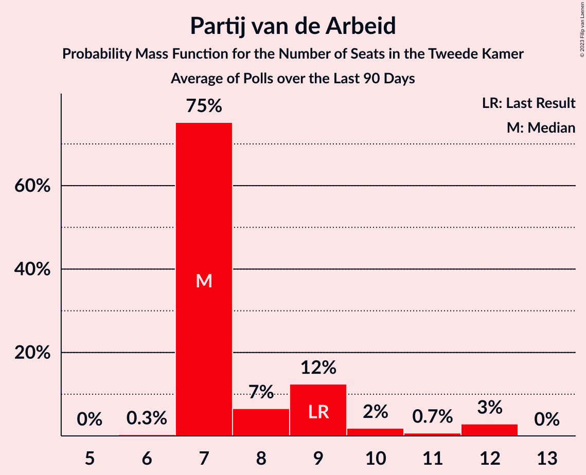

# Poll Average

<a href="#voting-intentions">Voting Intentions</a> | <a href="#seats">Seats</a> | <a href="#coalitions">Coalitions</a> | <a href="#technical-information">Technical Information</a>

## Summary

The table below lists the polls on which the average is based. They are the most recent polls (less than 90 days old) registered and analyzed so far.

| Period     | Polling firm/Commissioner(s) | VVD | D66 | PVV | CDA | SP | PvdA | GL | FvD | PvdD | CU | Volt | JA21 | SGP | DENK | 50+ | BBB | B1 | CO | Spl | PP | PvdT | BVNL |
|:----------:|:----------------------------:|:--:|:--:|:--:|:--:|:--:|:--:|:--:|:--:|:--:|:--:|:--:|:--:|:--:|:--:|:--:|:--:|:--:|:--:|:--:|:--:|:--:|:--:|
| 17 March 2021 | General Election | 21.9%   34 | 15.0%   24 | 10.8%   17 | 9.5%   15 | 6.0%   9 | 5.7%   9 | 5.2%   8 | 5.0%   8 | 3.8%   6 | 3.4%   5 | 2.4%   3 | 2.4%   3 | 2.1%   3 | 2.0%   3 | 1.0%   1 | 1.0%   1 | 0.8%   1 | 0.4%   0 | 0.3%   0 | 0.2%   0 | 0.0%   0 | 0.0%   0 |
| N/A | Poll Average | 14–22%   22–33 | 10–14%   16–22 | 9–12%   14–19 | 3–9%   5–15 | 4–6%   6–10 | 5–8%   7–12 | 5–8%   6–12 | 3–5%   4–9 | 3–7%   4–11 | 3–5%   3–8 | 3–7%   5–11 | 4–9%   6–14 | 1–4%   1–5 | 1–3%   1–5 | 0–2%   1–3 | 4–6%   5–9 | 0–2%   0–2 | N/A   N/A | N/A   N/A | N/A   N/A | N/A   N/A | 0–1%   0–1 |
| [11–14 February 2022](2022-02-14-IOResearch.html) | I&O Research | 15–18%   26–28 | 11–13%   19 | 9–12%   15–16 | 3–5%   5–6 | 4–6%   6–7 | 5–7%   10 | 6–8%   11 | 2–4%   4–6 | 4–6%   7–8 | 3–5%   6 | 5–7%   7–9 | 5–7%   8–9 | 2–4%   4 | 1–2%   2 | 1–2%   1–2 | 5–7%   8–9 | 1–2%   1–2 | N/A   N/A | N/A   N/A | N/A   N/A | N/A   N/A | 1%   1 |
| [11–12 February 2022](2022-02-12-Peilnl.html) | Peil.nl | 13–16%   22 | 11–14%   19 | 9–11%   15 | 3–5%   5 | 5–6%   9 | 5–7%   9 | 5–7%   8 | 4–5%   7 | 5–7%   10 | 3–4%   5 | 6–8%   9 | 8–10%   14 | 2–3%   3 | 2–3%   4 | 0–1%   1 | 5–6%   9 | 0–1%   1 | N/A   N/A | N/A   N/A | N/A   N/A | N/A   N/A | 0–1%   0 |
| [27–31 January 2022](2022-01-31-Kantar.html) | Kantar | 18–23%   27–33 | 11–15%   16–23 | 8–12%   13–18 | 6–9%   9–15 | 4–7%   6–13 | 5–8%   7–12 | 4–7%   6–13 | 3–6%   4–9 | 3–5%   3–7 | 3–5%   2–8 | 3–5%   4–7 | 5–8%   6–11 | 1–3%   1–5 | 1–2%   1–4 | 1–2%   1–3 | 4–6%   5–10 | 1–2%   0–3 | N/A   N/A | N/A   N/A | N/A   N/A | N/A   N/A | N/A   N/A |
| [21–24 January 2022](2022-01-24-Ipsos.html) | Ipsos   EenVandaag | 17–22%   25–32 | 10–14%   15–20 | 9–13%   13–21 | 5–8%   7–10 | 3–6%   5–10 | 5–8%   7–12 | 5–9%   9–13 | 3–6%   5–8 | 5–8%   8–11 | 2–5%   3–8 | 4–6%   5–11 | 3–6%   5–8 | 2–4%   2–7 | 2–3%   2–5 | 0–2%   0–2 | 4–6%   5–9 | 0–2%   0–2 | N/A   N/A | N/A   N/A | N/A   N/A | N/A   N/A | N/A   N/A |
| 17 March 2021 | General Election | 21.9%   34 | 15.0%   24 | 10.8%   17 | 9.5%   15 | 6.0%   9 | 5.7%   9 | 5.2%   8 | 5.0%   8 | 3.8%   6 | 3.4%   5 | 2.4%   3 | 2.4%   3 | 2.1%   3 | 2.0%   3 | 1.0%   1 | 1.0%   1 | 0.8%   1 | 0.4%   0 | 0.3%   0 | 0.2%   0 | 0.0%   0 | 0.0%   0 |

Only polls for which at least the sample size has been published are included in the table above.

**Legend:**
+ **Top half of each row:** Voting intentions (95% confidence interval)
+ **Bottom half of each row:** Seat projections for the Tweede Kamer (95% confidence interval)
+ **VVD:** Volkspartij voor Vrijheid en Democratie
+ **D66:** Democraten 66
+ **PVV:** Partij voor de Vrijheid
+ **CDA:** Christen-Democratisch Appèl
+ **SP:** Socialistische Partij
+ **PvdA:** Partij van de Arbeid
+ **GL:** GroenLinks
+ **FvD:** Forum voor Democratie
+ **PvdD:** Partij voor de Dieren
+ **CU:** ChristenUnie
+ **Volt:** Volt Europa
+ **JA21:** Juiste Antwoord 2021
+ **SGP:** Staatkundig Gereformeerde Partij
+ **DENK:** DENK
+ **50+:** 50Plus
+ **BBB:** BoerBurgerBeweging
+ **B1:** Bij1
+ **CO:** Code Oranje
+ **Spl:** Splinter
+ **PP:** Piratenpartij
+ **PvdT:** Partij voor de Toekomst
+ **BVNL:** Belang van Nederland
+ **N/A (single party):** Party not included the published results
+ **N/A (entire row):** Calculation for this opinion poll not started yet

## Voting Intentions

### Confidence Intervals

| Party | Last Result | Median | 80% Confidence Interval | 90% Confidence Interval | 95% Confidence Interval | 99% Confidence Interval |
|:-----:|:-----------:|:------:|:-----------------------:|:-----------------------:|:-----------------------:|:-----------------------:|
| <a href="#volkspartij-voor-vrijheid-en-democratie">Volkspartij voor Vrijheid en Democratie</a> | 21.9% | 17.8% | 14.5–21.1% |14.1–21.8% | 13.8–22.3% | 13.4–23.3% |
| <a href="#democraten-66">Democraten 66</a> | 15.0% | 12.3% | 11.1–13.5% |10.8–13.9% | 10.5–14.2% | 9.9–15.0% |
| <a href="#partij-voor-de-vrijheid">Partij voor de Vrijheid</a> | 10.8% | 10.3% | 9.4–11.5% |9.1–11.9% | 8.8–12.2% | 8.3–13.0% |
| <a href="#christen-democratisch-appèl">Christen-Democratisch Appèl</a> | 9.5% | 4.8% | 3.7–7.9% |3.5–8.4% | 3.4–8.7% | 3.1–9.5% |
| <a href="#socialistische-partij">Socialistische Partij</a> | 6.0% | 5.1% | 4.2–6.0% |4.0–6.3% | 3.7–6.5% | 3.3–7.2% |
| <a href="#partij-van-de-arbeid">Partij van de Arbeid</a> | 5.7% | 6.3% | 5.5–7.2% |5.3–7.5% | 5.1–7.8% | 4.8–8.4% |
| <a href="#groenlinks">GroenLinks</a> | 5.2% | 6.3% | 5.3–7.4% |5.0–7.8% | 4.7–8.0% | 4.3–8.6% |
| <a href="#forum-voor-democratie">Forum voor Democratie</a> | 5.0% | 4.2% | 2.9–5.0% |2.8–5.3% | 2.6–5.4% | 2.4–5.9% |
| <a href="#partij-voor-de-dieren">Partij voor de Dieren</a> | 3.8% | 5.4% | 3.5–6.5% |3.2–6.8% | 2.9–7.1% | 2.6–7.7% |
| <a href="#christenunie">ChristenUnie</a> | 3.4% | 3.6% | 3.0–4.4% |2.8–4.6% | 2.7–4.8% | 2.4–5.2% |
| <a href="#volt-europa">Volt Europa</a> | 2.4% | 5.2% | 3.6–6.8% |3.3–7.1% | 3.1–7.3% | 2.7–7.7% |
| <a href="#juiste-antwoord-2021">Juiste Antwoord 2021</a> | 2.4% | 6.0% | 4.2–8.8% |3.8–9.1% | 3.6–9.4% | 3.2–9.8% |
| <a href="#staatkundig-gereformeerde-partij">Staatkundig Gereformeerde Partij</a> | 2.1% | 2.6% | 1.6–3.2% |1.4–3.3% | 1.3–3.5% | 1.0–3.8% |
| <a href="#denk">DENK</a> | 2.0% | 1.9% | 1.3–2.6% |1.2–2.8% | 1.1–3.1% | 0.9–3.5% |
| <a href="#50plus">50Plus</a> | 1.0% | 1.0% | 0.6–1.6% |0.5–1.8% | 0.5–2.0% | 0.4–2.4% |
| <a href="#boerburgerbeweging">BoerBurgerBeweging</a> | 1.0% | 5.2% | 4.3–6.0% |4.0–6.2% | 3.8–6.3% | 3.4–6.8% |
| <a href="#bij1">Bij1</a> | 0.8% | 1.0% | 0.6–1.5% |0.5–1.7% | 0.5–1.8% | 0.4–2.1% |
| <a href="#code-oranje">Code Oranje</a> | 0.4% | N/A | N/A |N/A | N/A | N/A |
| <a href="#splinter">Splinter</a> | 0.3% | N/A | N/A |N/A | N/A | N/A |
| <a href="#piratenpartij">Piratenpartij</a> | 0.2% | N/A | N/A |N/A | N/A | N/A |
| <a href="#partij-voor-de-toekomst">Partij voor de Toekomst</a> | 0.0% | N/A | N/A |N/A | N/A | N/A |
| <a href="#belang-van-nederland">Belang van Nederland</a> | 0.0% | 0.8% | 0.6–1.1% |0.5–1.2% | 0.5–1.3% | 0.4–1.5% |

### Volkspartij voor Vrijheid en Democratie

*For a full overview of the results for this party, see the [Volkspartij voor Vrijheid en Democratie](party-volkspartijvoorvrijheidendemocratie.html) page.*

| Voting Intentions | Probability | Accumulated | Special Marks |
|:-----------------:|:-----------:|:-----------:|:-------------:|
| 11.5–12.5% | 0% | 100% |  |
| 12.5–13.5% | 1.0% | 100% |  |
| 13.5–14.5% | 10% | 99.0% |  |
| 14.5–15.5% | 13% | 89% |  |
| 15.5–16.5% | 10% | 76% |  |
| 16.5–17.5% | 13% | 66% |  |
| 17.5–18.5% | 10% | 53% | Median |
| 18.5–19.5% | 12% | 42% |  |
| 19.5–20.5% | 13% | 30% |  |
| 20.5–21.5% | 10% | 16% |  |
| 21.5–22.5% | 5% | 6% | Last Result |
| 22.5–23.5% | 1.4% | 2% |  |
| 23.5–24.5% | 0.3% | 0.3% |  |
| 24.5–25.5% | 0% | 0% |  |

### Democraten 66

*For a full overview of the results for this party, see the [Democraten 66](party-democraten66.html) page.*

| Voting Intentions | Probability | Accumulated | Special Marks |
|:-----------------:|:-----------:|:-----------:|:-------------:|
| 7.5–8.5% | 0% | 100% |  |
| 8.5–9.5% | 0.2% | 100% |  |
| 9.5–10.5% | 3% | 99.8% |  |
| 10.5–11.5% | 17% | 97% |  |
| 11.5–12.5% | 40% | 80% | Median |
| 12.5–13.5% | 31% | 40% |  |
| 13.5–14.5% | 8% | 9% |  |
| 14.5–15.5% | 1.2% | 1.3% | Last Result |
| 15.5–16.5% | 0.1% | 0.1% |  |
| 16.5–17.5% | 0% | 0% |  |

### Partij voor de Vrijheid

*For a full overview of the results for this party, see the [Partij voor de Vrijheid](party-partijvoordevrijheid.html) page.*

| Voting Intentions | Probability | Accumulated | Special Marks |
|:-----------------:|:-----------:|:-----------:|:-------------:|
| 6.5–7.5% | 0% | 100% |  |
| 7.5–8.5% | 1.1% | 100% |  |
| 8.5–9.5% | 15% | 98.9% |  |
| 9.5–10.5% | 46% | 84% | Median |
| 10.5–11.5% | 29% | 38% | Last Result |
| 11.5–12.5% | 7% | 9% |  |
| 12.5–13.5% | 1.2% | 1.3% |  |
| 13.5–14.5% | 0.1% | 0.1% |  |
| 14.5–15.5% | 0% | 0% |  |

### Christen-Democratisch Appèl

*For a full overview of the results for this party, see the [Christen-Democratisch Appèl](party-christen-democratischappèl.html) page.*

| Voting Intentions | Probability | Accumulated | Special Marks |
|:-----------------:|:-----------:|:-----------:|:-------------:|
| 1.5–2.5% | 0% | 100% |  |
| 2.5–3.5% | 6% | 100% |  |
| 3.5–4.5% | 40% | 94% |  |
| 4.5–5.5% | 10% | 53% | Median |
| 5.5–6.5% | 15% | 43% |  |
| 6.5–7.5% | 15% | 29% |  |
| 7.5–8.5% | 11% | 14% |  |
| 8.5–9.5% | 3% | 4% |  |
| 9.5–10.5% | 0.4% | 0.4% | Last Result |
| 10.5–11.5% | 0% | 0% |  |

### Socialistische Partij

*For a full overview of the results for this party, see the [Socialistische Partij](party-socialistischepartij.html) page.*

| Voting Intentions | Probability | Accumulated | Special Marks |
|:-----------------:|:-----------:|:-----------:|:-------------:|
| 1.5–2.5% | 0% | 100% |  |
| 2.5–3.5% | 1.2% | 100% |  |
| 3.5–4.5% | 20% | 98.8% |  |
| 4.5–5.5% | 55% | 78% | Median |
| 5.5–6.5% | 21% | 24% | Last Result |
| 6.5–7.5% | 2% | 2% |  |
| 7.5–8.5% | 0.1% | 0.1% |  |
| 8.5–9.5% | 0% | 0% |  |

### Partij van de Arbeid

*For a full overview of the results for this party, see the [Partij van de Arbeid](party-partijvandearbeid.html) page.*

| Voting Intentions | Probability | Accumulated | Special Marks |
|:-----------------:|:-----------:|:-----------:|:-------------:|
| 2.5–3.5% | 0% | 100% |  |
| 3.5–4.5% | 0.2% | 100% |  |
| 4.5–5.5% | 10% | 99.8% |  |
| 5.5–6.5% | 57% | 90% | Last Result, Median |
| 6.5–7.5% | 28% | 33% |  |
| 7.5–8.5% | 4% | 4% |  |
| 8.5–9.5% | 0.3% | 0.3% |  |
| 9.5–10.5% | 0% | 0% |  |

### GroenLinks

*For a full overview of the results for this party, see the [GroenLinks](party-groenlinks.html) page.*

| Voting Intentions | Probability | Accumulated | Special Marks |
|:-----------------:|:-----------:|:-----------:|:-------------:|
| 2.5–3.5% | 0% | 100% |  |
| 3.5–4.5% | 1.4% | 100% |  |
| 4.5–5.5% | 14% | 98.6% | Last Result |
| 5.5–6.5% | 44% | 84% | Median |
| 6.5–7.5% | 32% | 41% |  |
| 7.5–8.5% | 7% | 8% |  |
| 8.5–9.5% | 0.6% | 0.7% |  |
| 9.5–10.5% | 0% | 0% |  |

### Forum voor Democratie

*For a full overview of the results for this party, see the [Forum voor Democratie](party-forumvoordemocratie.html) page.*

| Voting Intentions | Probability | Accumulated | Special Marks |
|:-----------------:|:-----------:|:-----------:|:-------------:|
| 0.5–1.5% | 0% | 100% |  |
| 1.5–2.5% | 2% | 100% |  |
| 2.5–3.5% | 28% | 98% |  |
| 3.5–4.5% | 40% | 70% | Median |
| 4.5–5.5% | 29% | 30% | Last Result |
| 5.5–6.5% | 2% | 2% |  |
| 6.5–7.5% | 0% | 0% |  |

### Partij voor de Dieren

*For a full overview of the results for this party, see the [Partij voor de Dieren](party-partijvoordedieren.html) page.*

| Voting Intentions | Probability | Accumulated | Special Marks |
|:-----------------:|:-----------:|:-----------:|:-------------:|
| 0.5–1.5% | 0% | 100% |  |
| 1.5–2.5% | 0.5% | 100% |  |
| 2.5–3.5% | 10% | 99.5% |  |
| 3.5–4.5% | 15% | 89% | Last Result |
| 4.5–5.5% | 29% | 74% | Median |
| 5.5–6.5% | 36% | 45% |  |
| 6.5–7.5% | 8% | 9% |  |
| 7.5–8.5% | 0.7% | 0.7% |  |
| 8.5–9.5% | 0% | 0% |  |

### ChristenUnie

*For a full overview of the results for this party, see the [ChristenUnie](party-christenunie.html) page.*

| Voting Intentions | Probability | Accumulated | Special Marks |
|:-----------------:|:-----------:|:-----------:|:-------------:|
| 0.5–1.5% | 0% | 100% |  |
| 1.5–2.5% | 1.3% | 100% |  |
| 2.5–3.5% | 44% | 98.7% | Last Result |
| 3.5–4.5% | 49% | 55% | Median |
| 4.5–5.5% | 5% | 5% |  |
| 5.5–6.5% | 0.1% | 0.1% |  |
| 6.5–7.5% | 0% | 0% |  |

### Volt Europa

*For a full overview of the results for this party, see the [Volt Europa](party-volteuropa.html) page.*

| Voting Intentions | Probability | Accumulated | Special Marks |
|:-----------------:|:-----------:|:-----------:|:-------------:|
| 0.5–1.5% | 0% | 100% |  |
| 1.5–2.5% | 0.2% | 100% | Last Result |
| 2.5–3.5% | 8% | 99.8% |  |
| 3.5–4.5% | 23% | 92% |  |
| 4.5–5.5% | 28% | 68% | Median |
| 5.5–6.5% | 24% | 40% |  |
| 6.5–7.5% | 15% | 16% |  |
| 7.5–8.5% | 0.9% | 0.9% |  |
| 8.5–9.5% | 0% | 0% |  |

### Juiste Antwoord 2021

*For a full overview of the results for this party, see the [Juiste Antwoord 2021](party-juisteantwoord2021.html) page.*

| Voting Intentions | Probability | Accumulated | Special Marks |
|:-----------------:|:-----------:|:-----------:|:-------------:|
| 1.5–2.5% | 0% | 100% | Last Result |
| 2.5–3.5% | 2% | 100% |  |
| 3.5–4.5% | 14% | 98% |  |
| 4.5–5.5% | 20% | 84% |  |
| 5.5–6.5% | 30% | 64% | Median |
| 6.5–7.5% | 8% | 33% |  |
| 7.5–8.5% | 10% | 25% |  |
| 8.5–9.5% | 14% | 15% |  |
| 9.5–10.5% | 1.2% | 1.2% |  |
| 10.5–11.5% | 0% | 0% |  |

### Staatkundig Gereformeerde Partij

*For a full overview of the results for this party, see the [Staatkundig Gereformeerde Partij](party-staatkundiggereformeerdepartij.html) page.*

| Voting Intentions | Probability | Accumulated | Special Marks |
|:-----------------:|:-----------:|:-----------:|:-------------:|
| 0.0–0.5% | 0% | 100% |  |
| 0.5–1.5% | 8% | 100% |  |
| 1.5–2.5% | 40% | 92% | Last Result |
| 2.5–3.5% | 50% | 52% | Median |
| 3.5–4.5% | 2% | 2% |  |
| 4.5–5.5% | 0% | 0% |  |

### DENK

*For a full overview of the results for this party, see the [DENK](party-denk.html) page.*

| Voting Intentions | Probability | Accumulated | Special Marks |
|:-----------------:|:-----------:|:-----------:|:-------------:|
| 0.0–0.5% | 0% | 100% |  |
| 0.5–1.5% | 23% | 100% |  |
| 1.5–2.5% | 66% | 77% | Last Result, Median |
| 2.5–3.5% | 10% | 11% |  |
| 3.5–4.5% | 0.4% | 0.4% |  |
| 4.5–5.5% | 0% | 0% |  |

### 50Plus

*For a full overview of the results for this party, see the [50Plus](party-50plus.html) page.*

| Voting Intentions | Probability | Accumulated | Special Marks |
|:-----------------:|:-----------:|:-----------:|:-------------:|
| 0.0–0.5% | 5% | 100% |  |
| 0.5–1.5% | 83% | 95% | Last Result, Median |
| 1.5–2.5% | 12% | 12% |  |
| 2.5–3.5% | 0.2% | 0.2% |  |
| 3.5–4.5% | 0% | 0% |  |

### BoerBurgerBeweging

*For a full overview of the results for this party, see the [BoerBurgerBeweging](party-boerburgerbeweging.html) page.*

| Voting Intentions | Probability | Accumulated | Special Marks |
|:-----------------:|:-----------:|:-----------:|:-------------:|
| 0.5–1.5% | 0% | 100% | Last Result |
| 1.5–2.5% | 0% | 100% |  |
| 2.5–3.5% | 0.9% | 100% |  |
| 3.5–4.5% | 17% | 99.1% |  |
| 4.5–5.5% | 54% | 82% | Median |
| 5.5–6.5% | 27% | 28% |  |
| 6.5–7.5% | 1.1% | 1.1% |  |
| 7.5–8.5% | 0% | 0% |  |

### Bij1

*For a full overview of the results for this party, see the [Bij1](party-bij1.html) page.*

| Voting Intentions | Probability | Accumulated | Special Marks |
|:-----------------:|:-----------:|:-----------:|:-------------:|
| 0.0–0.5% | 7% | 100% |  |
| 0.5–1.5% | 84% | 93% | Last Result, Median |
| 1.5–2.5% | 8% | 9% |  |
| 2.5–3.5% | 0.1% | 0.1% |  |
| 3.5–4.5% | 0% | 0% |  |

### Belang van Nederland

*For a full overview of the results for this party, see the [Belang van Nederland](party-belangvannederland.html) page.*

| Voting Intentions | Probability | Accumulated | Special Marks |
|:-----------------:|:-----------:|:-----------:|:-------------:|
| 0.0–0.5% | 8% | 100% | Last Result |
| 0.5–1.5% | 91% | 92% | Median |
| 1.5–2.5% | 0.2% | 0.2% |  |
| 2.5–3.5% | 0% | 0% |  |

## Seats

### Confidence Intervals

| Party | Last Result | Median | 80% Confidence Interval | 90% Confidence Interval | 95% Confidence Interval | 99% Confidence Interval |
|:-----:|:-----------:|:------:|:-----------------------:|:-----------------------:|:-----------------------:|:-----------------------:|
| <a href="#volkspartij-voor-vrijheid-en-democratie">Volkspartij voor Vrijheid en Democratie</a> | 34 | 28 | 22–32 |22–33 | 22–33 | 22–34 |
| <a href="#democraten-66">Democraten 66</a> | 24 | 19 | 17–20 |17–22 | 16–22 | 14–23 |
| <a href="#partij-voor-de-vrijheid">Partij voor de Vrijheid</a> | 17 | 15 | 14–16 |14–17 | 14–19 | 13–21 |
| <a href="#christen-democratisch-appèl">Christen-Democratisch Appèl</a> | 15 | 7 | 5–14 |5–15 | 5–15 | 5–15 |
| <a href="#socialistische-partij">Socialistische Partij</a> | 9 | 8 | 7–9 |6–9 | 6–10 | 5–13 |
| <a href="#partij-van-de-arbeid">Partij van de Arbeid</a> | 9 | 9 | 8–10 |8–11 | 7–12 | 6–13 |
| <a href="#groenlinks">GroenLinks</a> | 8 | 9 | 8–11 |7–11 | 6–12 | 6–13 |
| <a href="#forum-voor-democratie">Forum voor Democratie</a> | 8 | 6 | 5–8 |5–9 | 4–9 | 3–9 |
| <a href="#partij-voor-de-dieren">Partij voor de Dieren</a> | 6 | 8 | 5–10 |4–11 | 4–11 | 3–11 |
| <a href="#christenunie">ChristenUnie</a> | 5 | 6 | 4–8 |3–8 | 3–8 | 2–8 |
| <a href="#volt-europa">Volt Europa</a> | 3 | 7 | 5–9 |5–11 | 5–11 | 4–11 |
| <a href="#juiste-antwoord-2021">Juiste Antwoord 2021</a> | 3 | 8 | 6–14 |6–14 | 6–14 | 5–14 |
| <a href="#staatkundig-gereformeerde-partij">Staatkundig Gereformeerde Partij</a> | 3 | 3 | 2–5 |1–5 | 1–5 | 1–7 |
| <a href="#denk">DENK</a> | 3 | 3 | 1–4 |1–4 | 1–5 | 1–5 |
| <a href="#50plus">50Plus</a> | 1 | 1 | 1–3 |1–3 | 1–3 | 0–3 |
| <a href="#boerburgerbeweging">BoerBurgerBeweging</a> | 1 | 8 | 6–9 |6–9 | 5–9 | 5–11 |
| <a href="#bij1">Bij1</a> | 1 | 1 | 1–2 |1–2 | 0–2 | 0–3 |
| <a href="#code-oranje">Code Oranje</a> | 0 | N/A | N/A |N/A | N/A | N/A |
| <a href="#splinter">Splinter</a> | 0 | N/A | N/A |N/A | N/A | N/A |
| <a href="#piratenpartij">Piratenpartij</a> | 0 | N/A | N/A |N/A | N/A | N/A |
| <a href="#partij-voor-de-toekomst">Partij voor de Toekomst</a> | 0 | N/A | N/A |N/A | N/A | N/A |
| <a href="#belang-van-nederland">Belang van Nederland</a> | 0 | 0 | 0–1 |0–1 | 0–1 | 0–1 |

### Volkspartij voor Vrijheid en Democratie

*For a full overview of the results for this party, see the [Volkspartij voor Vrijheid en Democratie](party-volkspartijvoorvrijheidendemocratie.html) page.*

| Number of Seats | Probability | Accumulated | Special Marks |
|:---------------:|:-----------:|:-----------:|:-------------:|
| 22 | 25% | 100% |  |
| 23 | 0.1% | 75% |  |
| 24 | 0.4% | 75% |  |
| 25 | 0.7% | 75% |  |
| 26 | 14% | 74% |  |
| 27 | 0.7% | 60% |  |
| 28 | 31% | 59% | Median |
| 29 | 11% | 28% |  |
| 30 | 4% | 17% |  |
| 31 | 2% | 12% |  |
| 32 | 4% | 10% |  |
| 33 | 5% | 6% |  |
| 34 | 0.1% | 0.6% | Last Result |
| 35 | 0.1% | 0.5% |  |
| 36 | 0.1% | 0.4% |  |
| 37 | 0.1% | 0.2% |  |
| 38 | 0.1% | 0.2% |  |
| 39 | 0% | 0.1% |  |
| 40 | 0% | 0.1% |  |
| 41 | 0.1% | 0.1% |  |
| 42 | 0% | 0% |  |

### Democraten 66

*For a full overview of the results for this party, see the [Democraten 66](party-democraten66.html) page.*

| Number of Seats | Probability | Accumulated | Special Marks |
|:---------------:|:-----------:|:-----------:|:-------------:|
| 12 | 0.1% | 100% |  |
| 13 | 0% | 99.9% |  |
| 14 | 0.8% | 99.9% |  |
| 15 | 0.9% | 99.1% |  |
| 16 | 1.4% | 98% |  |
| 17 | 12% | 97% |  |
| 18 | 3% | 84% |  |
| 19 | 52% | 82% | Median |
| 20 | 20% | 30% |  |
| 21 | 3% | 10% |  |
| 22 | 6% | 7% |  |
| 23 | 1.3% | 1.4% |  |
| 24 | 0.1% | 0.1% | Last Result |
| 25 | 0% | 0% |  |

### Partij voor de Vrijheid

*For a full overview of the results for this party, see the [Partij voor de Vrijheid](party-partijvoordevrijheid.html) page.*

| Number of Seats | Probability | Accumulated | Special Marks |
|:---------------:|:-----------:|:-----------:|:-------------:|
| 11 | 0.1% | 100% |  |
| 12 | 0.1% | 99.9% |  |
| 13 | 2% | 99.8% |  |
| 14 | 9% | 98% |  |
| 15 | 57% | 89% | Median |
| 16 | 26% | 32% |  |
| 17 | 1.1% | 6% | Last Result |
| 18 | 2% | 5% |  |
| 19 | 0.6% | 3% |  |
| 20 | 0.1% | 2% |  |
| 21 | 2% | 2% |  |
| 22 | 0% | 0% |  |

### Christen-Democratisch Appèl

*For a full overview of the results for this party, see the [Christen-Democratisch Appèl](party-christen-democratischappèl.html) page.*

| Number of Seats | Probability | Accumulated | Special Marks |
|:---------------:|:-----------:|:-----------:|:-------------:|
| 5 | 49% | 100% |  |
| 6 | 1.0% | 51% |  |
| 7 | 14% | 50% | Median |
| 8 | 7% | 37% |  |
| 9 | 4% | 29% |  |
| 10 | 4% | 26% |  |
| 11 | 2% | 21% |  |
| 12 | 2% | 19% |  |
| 13 | 0.9% | 17% |  |
| 14 | 9% | 17% |  |
| 15 | 7% | 7% | Last Result |
| 16 | 0.1% | 0.1% |  |
| 17 | 0% | 0% |  |

### Socialistische Partij

*For a full overview of the results for this party, see the [Socialistische Partij](party-socialistischepartij.html) page.*

| Number of Seats | Probability | Accumulated | Special Marks |
|:---------------:|:-----------:|:-----------:|:-------------:|
| 4 | 0.2% | 100% |  |
| 5 | 2% | 99.8% |  |
| 6 | 4% | 98% |  |
| 7 | 34% | 94% |  |
| 8 | 30% | 60% | Median |
| 9 | 27% | 30% | Last Result |
| 10 | 2% | 3% |  |
| 11 | 0.2% | 1.3% |  |
| 12 | 0.2% | 1.1% |  |
| 13 | 1.0% | 1.0% |  |
| 14 | 0% | 0% |  |

### Partij van de Arbeid

*For a full overview of the results for this party, see the [Partij van de Arbeid](party-partijvandearbeid.html) page.*

| Number of Seats | Probability | Accumulated | Special Marks |
|:---------------:|:-----------:|:-----------:|:-------------:|
| 6 | 0.6% | 100% |  |
| 7 | 2% | 99.4% |  |
| 8 | 23% | 97% |  |
| 9 | 36% | 74% | Last Result, Median |
| 10 | 31% | 39% |  |
| 11 | 3% | 7% |  |
| 12 | 4% | 4% |  |
| 13 | 0.5% | 0.6% |  |
| 14 | 0.1% | 0.1% |  |
| 15 | 0% | 0% |  |

### GroenLinks

*For a full overview of the results for this party, see the [GroenLinks](party-groenlinks.html) page.*

| Number of Seats | Probability | Accumulated | Special Marks |
|:---------------:|:-----------:|:-----------:|:-------------:|
| 6 | 3% | 100% |  |
| 7 | 7% | 97% |  |
| 8 | 36% | 90% | Last Result |
| 9 | 8% | 55% | Median |
| 10 | 16% | 46% |  |
| 11 | 28% | 31% |  |
| 12 | 1.0% | 3% |  |
| 13 | 2% | 2% |  |
| 14 | 0% | 0% |  |

### Forum voor Democratie

*For a full overview of the results for this party, see the [Forum voor Democratie](party-forumvoordemocratie.html) page.*

| Number of Seats | Probability | Accumulated | Special Marks |
|:---------------:|:-----------:|:-----------:|:-------------:|
| 3 | 0.6% | 100% |  |
| 4 | 2% | 99.4% |  |
| 5 | 10% | 97% |  |
| 6 | 47% | 87% | Median |
| 7 | 28% | 40% |  |
| 8 | 3% | 12% | Last Result |
| 9 | 9% | 9% |  |
| 10 | 0% | 0.1% |  |
| 11 | 0% | 0% |  |

### Partij voor de Dieren

*For a full overview of the results for this party, see the [Partij voor de Dieren](party-partijvoordedieren.html) page.*

| Number of Seats | Probability | Accumulated | Special Marks |
|:---------------:|:-----------:|:-----------:|:-------------:|
| 3 | 0.9% | 100% |  |
| 4 | 8% | 99.1% |  |
| 5 | 11% | 91% |  |
| 6 | 4% | 80% | Last Result |
| 7 | 2% | 76% |  |
| 8 | 29% | 74% | Median |
| 9 | 3% | 45% |  |
| 10 | 37% | 43% |  |
| 11 | 6% | 6% |  |
| 12 | 0.1% | 0.2% |  |
| 13 | 0.2% | 0.2% |  |
| 14 | 0% | 0% |  |

### ChristenUnie

*For a full overview of the results for this party, see the [ChristenUnie](party-christenunie.html) page.*

| Number of Seats | Probability | Accumulated | Special Marks |
|:---------------:|:-----------:|:-----------:|:-------------:|
| 2 | 0.8% | 100% |  |
| 3 | 6% | 99.2% |  |
| 4 | 10% | 93% |  |
| 5 | 29% | 83% | Last Result |
| 6 | 30% | 54% | Median |
| 7 | 4% | 25% |  |
| 8 | 20% | 20% |  |
| 9 | 0% | 0% |  |

### Volt Europa

*For a full overview of the results for this party, see the [Volt Europa](party-volteuropa.html) page.*

| Number of Seats | Probability | Accumulated | Special Marks |
|:---------------:|:-----------:|:-----------:|:-------------:|
| 3 | 0.1% | 100% | Last Result |
| 4 | 0.9% | 99.9% |  |
| 5 | 21% | 99.0% |  |
| 6 | 6% | 78% |  |
| 7 | 40% | 72% | Median |
| 8 | 1.1% | 33% |  |
| 9 | 26% | 32% |  |
| 10 | 0.1% | 5% |  |
| 11 | 5% | 5% |  |
| 12 | 0% | 0% |  |

### Juiste Antwoord 2021

*For a full overview of the results for this party, see the [Juiste Antwoord 2021](party-juisteantwoord2021.html) page.*

| Number of Seats | Probability | Accumulated | Special Marks |
|:---------------:|:-----------:|:-----------:|:-------------:|
| 3 | 0% | 100% | Last Result |
| 4 | 0.4% | 100% |  |
| 5 | 1.0% | 99.6% |  |
| 6 | 11% | 98.6% |  |
| 7 | 10% | 87% |  |
| 8 | 41% | 77% | Median |
| 9 | 8% | 36% |  |
| 10 | 1.4% | 29% |  |
| 11 | 2% | 27% |  |
| 12 | 0.1% | 25% |  |
| 13 | 0.5% | 25% |  |
| 14 | 25% | 25% |  |
| 15 | 0% | 0% |  |

### Staatkundig Gereformeerde Partij

*For a full overview of the results for this party, see the [Staatkundig Gereformeerde Partij](party-staatkundiggereformeerdepartij.html) page.*

| Number of Seats | Probability | Accumulated | Special Marks |
|:---------------:|:-----------:|:-----------:|:-------------:|
| 1 | 8% | 100% |  |
| 2 | 13% | 92% |  |
| 3 | 35% | 80% | Last Result, Median |
| 4 | 28% | 44% |  |
| 5 | 15% | 16% |  |
| 6 | 0.1% | 1.0% |  |
| 7 | 0.9% | 0.9% |  |
| 8 | 0% | 0% |  |

### DENK

*For a full overview of the results for this party, see the [DENK](party-denk.html) page.*

| Number of Seats | Probability | Accumulated | Special Marks |
|:---------------:|:-----------:|:-----------:|:-------------:|
| 1 | 12% | 100% |  |
| 2 | 32% | 88% |  |
| 3 | 10% | 56% | Last Result, Median |
| 4 | 44% | 46% |  |
| 5 | 3% | 3% |  |
| 6 | 0% | 0% |  |

### 50Plus

*For a full overview of the results for this party, see the [50Plus](party-50plus.html) page.*

| Number of Seats | Probability | Accumulated | Special Marks |
|:---------------:|:-----------:|:-----------:|:-------------:|
| 0 | 0.9% | 100% |  |
| 1 | 75% | 99.1% | Last Result, Median |
| 2 | 13% | 24% |  |
| 3 | 11% | 11% |  |
| 4 | 0.2% | 0.3% |  |
| 5 | 0.2% | 0.2% |  |
| 6 | 0% | 0% |  |

### BoerBurgerBeweging

*For a full overview of the results for this party, see the [BoerBurgerBeweging](party-boerburgerbeweging.html) page.*

| Number of Seats | Probability | Accumulated | Special Marks |
|:---------------:|:-----------:|:-----------:|:-------------:|
| 1 | 0% | 100% | Last Result |
| 2 | 0% | 100% |  |
| 3 | 0% | 100% |  |
| 4 | 0.1% | 100% |  |
| 5 | 3% | 99.9% |  |
| 6 | 19% | 97% |  |
| 7 | 16% | 78% |  |
| 8 | 33% | 62% | Median |
| 9 | 28% | 30% |  |
| 10 | 0.9% | 1.5% |  |
| 11 | 0.4% | 0.6% |  |
| 12 | 0.1% | 0.2% |  |
| 13 | 0.1% | 0.1% |  |
| 14 | 0% | 0% |  |

### Bij1

*For a full overview of the results for this party, see the [Bij1](party-bij1.html) page.*

| Number of Seats | Probability | Accumulated | Special Marks |
|:---------------:|:-----------:|:-----------:|:-------------:|
| 0 | 3% | 100% |  |
| 1 | 83% | 97% | Last Result, Median |
| 2 | 12% | 13% |  |
| 3 | 0.8% | 0.9% |  |
| 4 | 0% | 0% |  |

### Code Oranje

*For a full overview of the results for this party, see the [Code Oranje](party-codeoranje.html) page.*

### Splinter

*For a full overview of the results for this party, see the [Splinter](party-splinter.html) page.*

### Piratenpartij

*For a full overview of the results for this party, see the [Piratenpartij](party-piratenpartij.html) page.*

### Partij voor de Toekomst

*For a full overview of the results for this party, see the [Partij voor de Toekomst](party-partijvoordetoekomst.html) page.*

### Belang van Nederland

*For a full overview of the results for this party, see the [Belang van Nederland](party-belangvannederland.html) page.*

| Number of Seats | Probability | Accumulated | Special Marks |
|:---------------:|:-----------:|:-----------:|:-------------:|
| 0 | 50% | 100% | Last Result, Median |
| 1 | 50% | 50% |  |
| 2 | 0% | 0% |  |

## Coalitions

### Confidence Intervals

| Coalition | Last Result | Median | Majority? | 80% Confidence Interval | 90% Confidence Interval | 95% Confidence Interval | 99% Confidence Interval |
|:---------:|:-----------:|:------:|:---------:|:-----------------------:|:-----------------------:|:-----------------------:|:-----------------------:|
| Volkspartij voor Vrijheid en Democratie – Democraten 66 – Christen-Democratisch Appèl – Partij van de Arbeid – ChristenUnie | 87 | 68 | 20% | 60–79 | 60–83 | 60–83 | 60–83 |
| Volkspartij voor Vrijheid en Democratie – Democraten 66 – Christen-Democratisch Appèl – GroenLinks – ChristenUnie | 86 | 69 | 20% | 59–79 | 59–81 | 59–81 | 59–81 |
| Volkspartij voor Vrijheid en Democratie – Democraten 66 – Christen-Democratisch Appèl – ChristenUnie | 78 | 58 | 0% | 51–71 | 51–73 | 51–74 | 51–74 |
| Volkspartij voor Vrijheid en Democratie – Partij voor de Vrijheid – Christen-Democratisch Appèl – Forum voor Democratie – Staatkundig Gereformeerde Partij | 77 | 58 | 0% | 52–70 | 52–70 | 52–71 | 52–71 |
| Volkspartij voor Vrijheid en Democratie – Democraten 66 – Christen-Democratisch Appèl | 73 | 52 | 0% | 46–63 | 46–68 | 46–70 | 46–70 |
| Volkspartij voor Vrijheid en Democratie – Partij voor de Vrijheid – Christen-Democratisch Appèl – Forum voor Democratie | 74 | 55 | 0% | 49–67 | 49–68 | 49–68 | 49–68 |
| Democraten 66 – Christen-Democratisch Appèl – Socialistische Partij – Partij van de Arbeid – GroenLinks – ChristenUnie | 70 | 58 | 0% | 55–66 | 55–66 | 55–66 | 54–67 |
| Volkspartij voor Vrijheid en Democratie – Democraten 66 – Partij van de Arbeid | 67 | 57 | 0% | 50–61 | 50–64 | 50–64 | 50–66 |
| Volkspartij voor Vrijheid en Democratie – Partij voor de Vrijheid – Christen-Democratisch Appèl | 66 | 49 | 0% | 42–59 | 42–62 | 42–62 | 42–62 |
| Democraten 66 – Christen-Democratisch Appèl – Partij van de Arbeid – GroenLinks – ChristenUnie | 61 | 51 | 0% | 46–58 | 46–58 | 46–58 | 46–59 |
| Volkspartij voor Vrijheid en Democratie – Christen-Democratisch Appèl – Forum voor Democratie – Staatkundig Gereformeerde Partij – 50Plus | 61 | 44 | 0% | 38–57 | 38–57 | 38–57 | 38–57 |
| Volkspartij voor Vrijheid en Democratie – Christen-Democratisch Appèl – Partij van de Arbeid | 58 | 43 | 0% | 36–53 | 36–57 | 36–57 | 36–57 |
| Volkspartij voor Vrijheid en Democratie – Christen-Democratisch Appèl – Forum voor Democratie – Staatkundig Gereformeerde Partij | 60 | 43 | 0% | 37–54 | 37–54 | 37–55 | 37–55 |
| Volkspartij voor Vrijheid en Democratie – Christen-Democratisch Appèl – Forum voor Democratie – 50Plus | 58 | 40 | 0% | 35–55 | 35–55 | 35–55 | 35–55 |
| Volkspartij voor Vrijheid en Democratie – Christen-Democratisch Appèl – Forum voor Democratie | 57 | 39 | 0% | 34–52 | 34–53 | 34–53 | 34–53 |
| Volkspartij voor Vrijheid en Democratie – Christen-Democratisch Appèl | 49 | 33 | 0% | 27–43 | 27–48 | 27–48 | 27–48 |
| Democraten 66 – Christen-Democratisch Appèl – Partij van de Arbeid | 48 | 34 | 0% | 32–42 | 32–46 | 32–46 | 32–46 |
| Volkspartij voor Vrijheid en Democratie – Partij van de Arbeid | 43 | 37 | 0% | 31–42 | 31–42 | 31–43 | 31–44 |
| Democraten 66 – Christen-Democratisch Appèl | 39 | 24 | 0% | 24–34 | 24–36 | 24–37 | 22–37 |
| Christen-Democratisch Appèl – Partij van de Arbeid – ChristenUnie | 29 | 21 | 0% | 19–30 | 19–30 | 19–30 | 19–30 |
| Christen-Democratisch Appèl – Partij van de Arbeid | 24 | 15 | 0% | 14–22 | 14–24 | 14–24 | 14–24 |

### Volkspartij voor Vrijheid en Democratie – Democraten 66 – Christen-Democratisch Appèl – Partij van de Arbeid – ChristenUnie

| Number of Seats | Probability | Accumulated | Special Marks |
|:---------------:|:-----------:|:-----------:|:-------------:|
| 60 | 25% | 100% |  |
| 61 | 0.1% | 75% |  |
| 62 | 0.1% | 75% |  |
| 63 | 0.3% | 75% |  |
| 64 | 0.2% | 75% |  |
| 65 | 0.7% | 74% |  |
| 66 | 12% | 74% |  |
| 67 | 1.1% | 62% |  |
| 68 | 24% | 61% |  |
| 69 | 7% | 37% | Median |
| 70 | 0.4% | 29% |  |
| 71 | 1.1% | 29% |  |
| 72 | 0.3% | 28% |  |
| 73 | 2% | 28% |  |
| 74 | 3% | 26% |  |
| 75 | 3% | 23% |  |
| 76 | 0.8% | 20% | Majority |
| 77 | 0.6% | 19% |  |
| 78 | 0.6% | 19% |  |
| 79 | 10% | 18% |  |
| 80 | 0.4% | 8% |  |
| 81 | 2% | 8% |  |
| 82 | 0.3% | 5% |  |
| 83 | 5% | 5% |  |
| 84 | 0% | 0% |  |
| 85 | 0% | 0% |  |
| 86 | 0% | 0% |  |
| 87 | 0% | 0% | Last Result |

### Volkspartij voor Vrijheid en Democratie – Democraten 66 – Christen-Democratisch Appèl – GroenLinks – ChristenUnie

| Number of Seats | Probability | Accumulated | Special Marks |
|:---------------:|:-----------:|:-----------:|:-------------:|
| 59 | 25% | 100% |  |
| 60 | 0% | 75% |  |
| 61 | 0.1% | 75% |  |
| 62 | 0% | 75% |  |
| 63 | 0% | 75% |  |
| 64 | 0.6% | 75% |  |
| 65 | 0.1% | 74% |  |
| 66 | 0.6% | 74% |  |
| 67 | 0.6% | 74% |  |
| 68 | 17% | 73% |  |
| 69 | 24% | 56% | Median |
| 70 | 3% | 32% |  |
| 71 | 2% | 29% |  |
| 72 | 0.9% | 28% |  |
| 73 | 2% | 27% |  |
| 74 | 3% | 25% |  |
| 75 | 2% | 22% |  |
| 76 | 2% | 20% | Majority |
| 77 | 0.7% | 19% |  |
| 78 | 0.7% | 18% |  |
| 79 | 12% | 17% |  |
| 80 | 0.4% | 6% |  |
| 81 | 5% | 5% |  |
| 82 | 0% | 0.1% |  |
| 83 | 0% | 0% |  |
| 84 | 0% | 0% |  |
| 85 | 0% | 0% |  |
| 86 | 0% | 0% | Last Result |

### Volkspartij voor Vrijheid en Democratie – Democraten 66 – Christen-Democratisch Appèl – ChristenUnie

| Number of Seats | Probability | Accumulated | Special Marks |
|:---------------:|:-----------:|:-----------:|:-------------:|
| 51 | 25% | 100% |  |
| 52 | 0% | 75% |  |
| 53 | 0.5% | 75% |  |
| 54 | 0.3% | 75% |  |
| 55 | 0.5% | 74% |  |
| 56 | 0.4% | 74% |  |
| 57 | 0.7% | 73% |  |
| 58 | 35% | 73% |  |
| 59 | 6% | 37% |  |
| 60 | 2% | 32% | Median |
| 61 | 0.5% | 30% |  |
| 62 | 2% | 29% |  |
| 63 | 3% | 27% |  |
| 64 | 0.6% | 23% |  |
| 65 | 0.6% | 23% |  |
| 66 | 1.1% | 22% |  |
| 67 | 3% | 21% |  |
| 68 | 0.8% | 18% |  |
| 69 | 0.8% | 17% |  |
| 70 | 0.1% | 17% |  |
| 71 | 9% | 17% |  |
| 72 | 0% | 7% |  |
| 73 | 2% | 7% |  |
| 74 | 5% | 5% |  |
| 75 | 0% | 0% |  |
| 76 | 0% | 0% | Majority |
| 77 | 0% | 0% |  |
| 78 | 0% | 0% | Last Result |

### Volkspartij voor Vrijheid en Democratie – Partij voor de Vrijheid – Christen-Democratisch Appèl – Forum voor Democratie – Staatkundig Gereformeerde Partij

| Number of Seats | Probability | Accumulated | Special Marks |
|:---------------:|:-----------:|:-----------:|:-------------:|
| 52 | 25% | 100% |  |
| 53 | 0.1% | 75% |  |
| 54 | 0.6% | 75% |  |
| 55 | 0% | 74% |  |
| 56 | 0.1% | 74% |  |
| 57 | 0.5% | 74% |  |
| 58 | 24% | 74% |  |
| 59 | 0.2% | 50% | Median |
| 60 | 18% | 50% |  |
| 61 | 0.6% | 32% |  |
| 62 | 0.7% | 31% |  |
| 63 | 2% | 30% |  |
| 64 | 2% | 28% |  |
| 65 | 3% | 26% |  |
| 66 | 2% | 24% |  |
| 67 | 4% | 21% |  |
| 68 | 6% | 18% |  |
| 69 | 0.3% | 12% |  |
| 70 | 9% | 12% |  |
| 71 | 2% | 3% |  |
| 72 | 0.1% | 0.2% |  |
| 73 | 0% | 0.1% |  |
| 74 | 0% | 0% |  |
| 75 | 0% | 0% |  |
| 76 | 0% | 0% | Majority |
| 77 | 0% | 0% | Last Result |

### Volkspartij voor Vrijheid en Democratie – Democraten 66 – Christen-Democratisch Appèl

| Number of Seats | Probability | Accumulated | Special Marks |
|:---------------:|:-----------:|:-----------:|:-------------:|
| 46 | 25% | 100% |  |
| 47 | 0% | 75% |  |
| 48 | 0.6% | 75% |  |
| 49 | 0.2% | 74% |  |
| 50 | 11% | 74% |  |
| 51 | 0.9% | 63% |  |
| 52 | 24% | 62% |  |
| 53 | 0.1% | 37% |  |
| 54 | 0.6% | 37% | Median |
| 55 | 0.7% | 37% |  |
| 56 | 9% | 36% |  |
| 57 | 2% | 28% |  |
| 58 | 1.2% | 26% |  |
| 59 | 2% | 25% |  |
| 60 | 1.4% | 23% |  |
| 61 | 0.8% | 21% |  |
| 62 | 2% | 20% |  |
| 63 | 9% | 18% |  |
| 64 | 0.5% | 9% |  |
| 65 | 0.9% | 8% |  |
| 66 | 2% | 7% |  |
| 67 | 0.1% | 5% |  |
| 68 | 0.1% | 5% |  |
| 69 | 0% | 5% |  |
| 70 | 5% | 5% |  |
| 71 | 0% | 0% |  |
| 72 | 0% | 0% |  |
| 73 | 0% | 0% | Last Result |

### Volkspartij voor Vrijheid en Democratie – Partij voor de Vrijheid – Christen-Democratisch Appèl – Forum voor Democratie

| Number of Seats | Probability | Accumulated | Special Marks |
|:---------------:|:-----------:|:-----------:|:-------------:|
| 49 | 25% | 100% |  |
| 50 | 0.1% | 75% |  |
| 51 | 0.5% | 75% |  |
| 52 | 0.2% | 74% |  |
| 53 | 0.3% | 74% |  |
| 54 | 24% | 74% |  |
| 55 | 12% | 50% |  |
| 56 | 0.6% | 39% | Median |
| 57 | 6% | 38% |  |
| 58 | 2% | 32% |  |
| 59 | 2% | 30% |  |
| 60 | 1.4% | 28% |  |
| 61 | 0.8% | 27% |  |
| 62 | 2% | 26% |  |
| 63 | 2% | 24% |  |
| 64 | 4% | 22% |  |
| 65 | 0.5% | 18% |  |
| 66 | 3% | 17% |  |
| 67 | 6% | 15% |  |
| 68 | 9% | 9% |  |
| 69 | 0.3% | 0.3% |  |
| 70 | 0% | 0.1% |  |
| 71 | 0% | 0% |  |
| 72 | 0% | 0% |  |
| 73 | 0% | 0% |  |
| 74 | 0% | 0% | Last Result |

### Democraten 66 – Christen-Democratisch Appèl – Socialistische Partij – Partij van de Arbeid – GroenLinks – ChristenUnie

| Number of Seats | Probability | Accumulated | Special Marks |
|:---------------:|:-----------:|:-----------:|:-------------:|
| 51 | 0.2% | 100% |  |
| 52 | 0.1% | 99.8% |  |
| 53 | 0.1% | 99.6% |  |
| 54 | 0.2% | 99.6% |  |
| 55 | 25% | 99.4% |  |
| 56 | 0.4% | 74% |  |
| 57 | 8% | 74% |  |
| 58 | 36% | 66% | Median |
| 59 | 2% | 30% |  |
| 60 | 4% | 28% |  |
| 61 | 0.4% | 24% |  |
| 62 | 0.8% | 24% |  |
| 63 | 4% | 23% |  |
| 64 | 0.9% | 19% |  |
| 65 | 8% | 18% |  |
| 66 | 10% | 10% |  |
| 67 | 0.2% | 0.6% |  |
| 68 | 0% | 0.4% |  |
| 69 | 0.1% | 0.4% |  |
| 70 | 0.3% | 0.3% | Last Result |
| 71 | 0% | 0% |  |

### Volkspartij voor Vrijheid en Democratie – Democraten 66 – Partij van de Arbeid

| Number of Seats | Probability | Accumulated | Special Marks |
|:---------------:|:-----------:|:-----------:|:-------------:|
| 48 | 0.1% | 100% |  |
| 49 | 0% | 99.9% |  |
| 50 | 25% | 99.9% |  |
| 51 | 11% | 75% |  |
| 52 | 0.7% | 63% |  |
| 53 | 0.7% | 63% |  |
| 54 | 0.7% | 62% |  |
| 55 | 4% | 61% |  |
| 56 | 1.0% | 58% | Median |
| 57 | 34% | 57% |  |
| 58 | 7% | 22% |  |
| 59 | 4% | 15% |  |
| 60 | 0.5% | 11% |  |
| 61 | 0.6% | 10% |  |
| 62 | 2% | 10% |  |
| 63 | 1.0% | 7% |  |
| 64 | 5% | 7% |  |
| 65 | 0.2% | 1.2% |  |
| 66 | 1.0% | 1.1% |  |
| 67 | 0% | 0.1% | Last Result |
| 68 | 0% | 0.1% |  |
| 69 | 0.1% | 0.1% |  |
| 70 | 0% | 0% |  |

### Volkspartij voor Vrijheid en Democratie – Partij voor de Vrijheid – Christen-Democratisch Appèl

| Number of Seats | Probability | Accumulated | Special Marks |
|:---------------:|:-----------:|:-----------:|:-------------:|
| 42 | 25% | 100% |  |
| 43 | 0% | 75% |  |
| 44 | 0% | 75% |  |
| 45 | 0% | 75% |  |
| 46 | 0.1% | 75% |  |
| 47 | 0.1% | 75% |  |
| 48 | 24% | 75% |  |
| 49 | 12% | 50% |  |
| 50 | 0.3% | 39% | Median |
| 51 | 6% | 38% |  |
| 52 | 2% | 32% |  |
| 53 | 3% | 30% |  |
| 54 | 2% | 28% |  |
| 55 | 0.4% | 26% |  |
| 56 | 2% | 26% |  |
| 57 | 4% | 23% |  |
| 58 | 1.5% | 19% |  |
| 59 | 9% | 18% |  |
| 60 | 0.2% | 8% |  |
| 61 | 3% | 8% |  |
| 62 | 6% | 6% |  |
| 63 | 0% | 0.2% |  |
| 64 | 0.1% | 0.2% |  |
| 65 | 0% | 0% |  |
| 66 | 0% | 0% | Last Result |

### Democraten 66 – Christen-Democratisch Appèl – Partij van de Arbeid – GroenLinks – ChristenUnie

| Number of Seats | Probability | Accumulated | Special Marks |
|:---------------:|:-----------:|:-----------:|:-------------:|
| 46 | 25% | 100% |  |
| 47 | 0.5% | 75% |  |
| 48 | 0.5% | 74% |  |
| 49 | 0.9% | 74% |  |
| 50 | 19% | 73% | Median |
| 51 | 25% | 54% |  |
| 52 | 1.5% | 29% |  |
| 53 | 3% | 27% |  |
| 54 | 3% | 24% |  |
| 55 | 1.1% | 21% |  |
| 56 | 1.1% | 20% |  |
| 57 | 8% | 19% |  |
| 58 | 10% | 11% |  |
| 59 | 0.2% | 0.7% |  |
| 60 | 0% | 0.5% |  |
| 61 | 0.4% | 0.4% | Last Result |
| 62 | 0.1% | 0.1% |  |
| 63 | 0% | 0% |  |

### Volkspartij voor Vrijheid en Democratie – Christen-Democratisch Appèl – Forum voor Democratie – Staatkundig Gereformeerde Partij – 50Plus

| Number of Seats | Probability | Accumulated | Special Marks |
|:---------------:|:-----------:|:-----------:|:-------------:|
| 37 | 0.1% | 100% |  |
| 38 | 25% | 99.9% |  |
| 39 | 0% | 75% |  |
| 40 | 0.5% | 75% |  |
| 41 | 0.1% | 74% |  |
| 42 | 0% | 74% |  |
| 43 | 0.7% | 74% |  |
| 44 | 24% | 74% |  |
| 45 | 12% | 50% | Median |
| 46 | 6% | 38% |  |
| 47 | 2% | 32% |  |
| 48 | 2% | 30% |  |
| 49 | 0.4% | 28% |  |
| 50 | 2% | 28% |  |
| 51 | 4% | 26% |  |
| 52 | 4% | 23% |  |
| 53 | 1.1% | 19% |  |
| 54 | 0.8% | 18% |  |
| 55 | 0.1% | 17% |  |
| 56 | 5% | 17% |  |
| 57 | 11% | 12% |  |
| 58 | 0.2% | 0.4% |  |
| 59 | 0.1% | 0.2% |  |
| 60 | 0.1% | 0.1% |  |
| 61 | 0% | 0% | Last Result |

### Volkspartij voor Vrijheid en Democratie – Christen-Democratisch Appèl – Partij van de Arbeid

| Number of Seats | Probability | Accumulated | Special Marks |
|:---------------:|:-----------:|:-----------:|:-------------:|
| 36 | 25% | 100% |  |
| 37 | 0% | 75% |  |
| 38 | 0.2% | 75% |  |
| 39 | 0% | 75% |  |
| 40 | 0.1% | 75% |  |
| 41 | 11% | 75% |  |
| 42 | 0.7% | 63% |  |
| 43 | 24% | 63% |  |
| 44 | 1.2% | 39% | Median |
| 45 | 3% | 38% |  |
| 46 | 6% | 35% |  |
| 47 | 0.4% | 29% |  |
| 48 | 2% | 29% |  |
| 49 | 3% | 27% |  |
| 50 | 2% | 24% |  |
| 51 | 11% | 22% |  |
| 52 | 1.1% | 11% |  |
| 53 | 3% | 10% |  |
| 54 | 1.4% | 7% |  |
| 55 | 0.4% | 6% |  |
| 56 | 0.1% | 6% |  |
| 57 | 5% | 5% |  |
| 58 | 0.1% | 0.2% | Last Result |
| 59 | 0.1% | 0.1% |  |
| 60 | 0% | 0% |  |

### Volkspartij voor Vrijheid en Democratie – Christen-Democratisch Appèl – Forum voor Democratie – Staatkundig Gereformeerde Partij

| Number of Seats | Probability | Accumulated | Special Marks |
|:---------------:|:-----------:|:-----------:|:-------------:|
| 36 | 0.1% | 100% |  |
| 37 | 25% | 99.9% |  |
| 38 | 0.5% | 75% |  |
| 39 | 0.1% | 74% |  |
| 40 | 0.1% | 74% |  |
| 41 | 0% | 74% |  |
| 42 | 0.7% | 74% |  |
| 43 | 24% | 74% |  |
| 44 | 12% | 49% | Median |
| 45 | 6% | 38% |  |
| 46 | 2% | 32% |  |
| 47 | 1.3% | 29% |  |
| 48 | 2% | 28% |  |
| 49 | 2% | 26% |  |
| 50 | 2% | 23% |  |
| 51 | 4% | 22% |  |
| 52 | 1.0% | 18% |  |
| 53 | 0.2% | 17% |  |
| 54 | 14% | 17% |  |
| 55 | 2% | 3% |  |
| 56 | 0.1% | 0.3% |  |
| 57 | 0.1% | 0.2% |  |
| 58 | 0.1% | 0.1% |  |
| 59 | 0% | 0% |  |
| 60 | 0% | 0% | Last Result |

### Volkspartij voor Vrijheid en Democratie – Christen-Democratisch Appèl – Forum voor Democratie – 50Plus

| Number of Seats | Probability | Accumulated | Special Marks |
|:---------------:|:-----------:|:-----------:|:-------------:|
| 34 | 0.1% | 100% |  |
| 35 | 25% | 99.9% |  |
| 36 | 0.1% | 75% |  |
| 37 | 0.6% | 75% |  |
| 38 | 0.2% | 74% |  |
| 39 | 0.5% | 74% |  |
| 40 | 35% | 74% |  |
| 41 | 0.2% | 38% |  |
| 42 | 0.2% | 38% | Median |
| 43 | 6% | 38% |  |
| 44 | 3% | 32% |  |
| 45 | 0.7% | 29% |  |
| 46 | 1.4% | 28% |  |
| 47 | 3% | 27% |  |
| 48 | 2% | 23% |  |
| 49 | 1.4% | 22% |  |
| 50 | 0.9% | 20% |  |
| 51 | 2% | 19% |  |
| 52 | 2% | 18% |  |
| 53 | 0.8% | 15% |  |
| 54 | 0.3% | 15% |  |
| 55 | 14% | 14% |  |
| 56 | 0.2% | 0.3% |  |
| 57 | 0% | 0.1% |  |
| 58 | 0.1% | 0.1% | Last Result |
| 59 | 0% | 0% |  |

### Volkspartij voor Vrijheid en Democratie – Christen-Democratisch Appèl – Forum voor Democratie

| Number of Seats | Probability | Accumulated | Special Marks |
|:---------------:|:-----------:|:-----------:|:-------------:|
| 33 | 0.1% | 100% |  |
| 34 | 25% | 99.9% |  |
| 35 | 0.6% | 75% |  |
| 36 | 0.1% | 74% |  |
| 37 | 0.2% | 74% |  |
| 38 | 0.6% | 74% |  |
| 39 | 35% | 74% |  |
| 40 | 0.2% | 38% |  |
| 41 | 0.3% | 38% | Median |
| 42 | 6% | 38% |  |
| 43 | 3% | 32% |  |
| 44 | 2% | 29% |  |
| 45 | 2% | 27% |  |
| 46 | 2% | 25% |  |
| 47 | 1.1% | 23% |  |
| 48 | 2% | 22% |  |
| 49 | 1.4% | 20% |  |
| 50 | 3% | 18% |  |
| 51 | 0.9% | 15% |  |
| 52 | 9% | 14% |  |
| 53 | 5% | 5% |  |
| 54 | 0.1% | 0.3% |  |
| 55 | 0.1% | 0.2% |  |
| 56 | 0.1% | 0.1% |  |
| 57 | 0% | 0% | Last Result |

### Volkspartij voor Vrijheid en Democratie – Christen-Democratisch Appèl

| Number of Seats | Probability | Accumulated | Special Marks |
|:---------------:|:-----------:|:-----------:|:-------------:|
| 27 | 25% | 100% |  |
| 28 | 0.1% | 75% |  |
| 29 | 0% | 75% |  |
| 30 | 0.2% | 75% |  |
| 31 | 0.2% | 75% |  |
| 32 | 0.5% | 75% |  |
| 33 | 36% | 74% |  |
| 34 | 0.3% | 38% |  |
| 35 | 0.4% | 38% | Median |
| 36 | 8% | 38% |  |
| 37 | 1.2% | 30% |  |
| 38 | 2% | 29% |  |
| 39 | 3% | 27% |  |
| 40 | 2% | 24% |  |
| 41 | 0.7% | 22% |  |
| 42 | 3% | 21% |  |
| 43 | 9% | 18% |  |
| 44 | 1.0% | 9% |  |
| 45 | 2% | 8% |  |
| 46 | 0.6% | 6% |  |
| 47 | 0.1% | 5% |  |
| 48 | 5% | 5% |  |
| 49 | 0% | 0.1% | Last Result |
| 50 | 0% | 0.1% |  |
| 51 | 0.1% | 0.1% |  |
| 52 | 0% | 0% |  |

### Democraten 66 – Christen-Democratisch Appèl – Partij van de Arbeid

| Number of Seats | Probability | Accumulated | Special Marks |
|:---------------:|:-----------:|:-----------:|:-------------:|
| 31 | 0.2% | 100% |  |
| 32 | 12% | 99.8% |  |
| 33 | 26% | 88% |  |
| 34 | 25% | 62% |  |
| 35 | 2% | 38% | Median |
| 36 | 0.7% | 36% |  |
| 37 | 3% | 35% |  |
| 38 | 6% | 32% |  |
| 39 | 5% | 26% |  |
| 40 | 1.5% | 21% |  |
| 41 | 1.0% | 19% |  |
| 42 | 10% | 18% |  |
| 43 | 0.2% | 9% |  |
| 44 | 2% | 9% |  |
| 45 | 0.4% | 6% |  |
| 46 | 6% | 6% |  |
| 47 | 0% | 0% |  |
| 48 | 0% | 0% | Last Result |

### Volkspartij voor Vrijheid en Democratie – Partij van de Arbeid

| Number of Seats | Probability | Accumulated | Special Marks |
|:---------------:|:-----------:|:-----------:|:-------------:|
| 31 | 25% | 100% |  |
| 32 | 0% | 75% |  |
| 33 | 0.2% | 75% |  |
| 34 | 11% | 75% |  |
| 35 | 2% | 63% |  |
| 36 | 1.2% | 61% |  |
| 37 | 10% | 59% | Median |
| 38 | 32% | 49% |  |
| 39 | 5% | 17% |  |
| 40 | 1.4% | 12% |  |
| 41 | 0.6% | 11% |  |
| 42 | 6% | 10% |  |
| 43 | 2% | 4% | Last Result |
| 44 | 2% | 2% |  |
| 45 | 0.2% | 0.4% |  |
| 46 | 0% | 0.3% |  |
| 47 | 0% | 0.2% |  |
| 48 | 0% | 0.2% |  |
| 49 | 0.1% | 0.2% |  |
| 50 | 0.1% | 0.1% |  |
| 51 | 0% | 0% |  |

### Democraten 66 – Christen-Democratisch Appèl

| Number of Seats | Probability | Accumulated | Special Marks |
|:---------------:|:-----------:|:-----------:|:-------------:|
| 21 | 0.2% | 100% |  |
| 22 | 0.4% | 99.8% |  |
| 23 | 0.9% | 99.4% |  |
| 24 | 60% | 98% |  |
| 25 | 3% | 38% |  |
| 26 | 1.1% | 36% | Median |
| 27 | 0.7% | 34% |  |
| 28 | 7% | 34% |  |
| 29 | 1.5% | 26% |  |
| 30 | 6% | 25% |  |
| 31 | 0.8% | 19% |  |
| 32 | 0.9% | 18% |  |
| 33 | 0.3% | 17% |  |
| 34 | 10% | 17% |  |
| 35 | 0.5% | 8% |  |
| 36 | 2% | 7% |  |
| 37 | 5% | 5% |  |
| 38 | 0% | 0% |  |
| 39 | 0% | 0% | Last Result |

### Christen-Democratisch Appèl – Partij van de Arbeid – ChristenUnie

| Number of Seats | Probability | Accumulated | Special Marks |
|:---------------:|:-----------:|:-----------:|:-------------:|
| 18 | 0.1% | 100% |  |
| 19 | 26% | 99.8% |  |
| 20 | 0.2% | 74% |  |
| 21 | 29% | 74% |  |
| 22 | 2% | 45% | Median |
| 23 | 15% | 42% |  |
| 24 | 1.4% | 28% |  |
| 25 | 5% | 26% |  |
| 26 | 3% | 21% |  |
| 27 | 0.9% | 19% |  |
| 28 | 5% | 18% |  |
| 29 | 0.6% | 12% | Last Result |
| 30 | 11% | 12% |  |
| 31 | 0.1% | 0.4% |  |
| 32 | 0.2% | 0.3% |  |
| 33 | 0% | 0.1% |  |
| 34 | 0.1% | 0.1% |  |
| 35 | 0% | 0% |  |

### Christen-Democratisch Appèl – Partij van de Arbeid

| Number of Seats | Probability | Accumulated | Special Marks |
|:---------------:|:-----------:|:-----------:|:-------------:|
| 14 | 25% | 100% |  |
| 15 | 36% | 75% |  |
| 16 | 1.3% | 39% | Median |
| 17 | 2% | 38% |  |
| 18 | 7% | 36% |  |
| 19 | 6% | 30% |  |
| 20 | 2% | 23% |  |
| 21 | 2% | 21% |  |
| 22 | 10% | 19% |  |
| 23 | 4% | 9% |  |
| 24 | 5% | 6% | Last Result |
| 25 | 0.2% | 0.4% |  |
| 26 | 0.1% | 0.2% |  |
| 27 | 0.1% | 0.1% |  |
| 28 | 0% | 0% |  |

## Technical Information

+ **Number of polls included in this average:** 4
+ **Lowest number of simulations done in a poll included in this average:** 1,048,576
+ **Total number of simulations done in the polls included in this average:** 4,194,304
+ **Error estimate:** 3.08%
