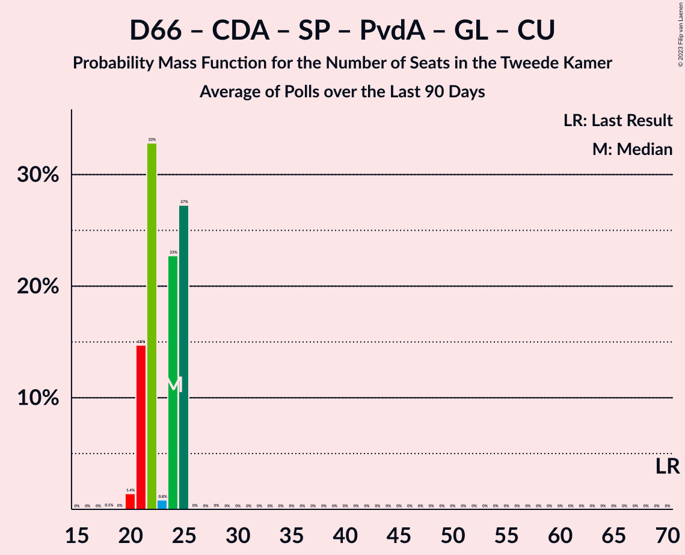

# Poll Average

<a href="#voting-intentions">Voting Intentions</a> | <a href="#seats">Seats</a> | <a href="#coalitions">Coalitions</a> | <a href="#technical-information">Technical Information</a>

## Summary

The table below lists the polls on which the average is based. They are the most recent polls (less than 90 days old) registered and analyzed so far.

| Period     | Polling firm/Commissioner(s) | VVD | D66 | PVV | CDA | SP | PvdA | GL | FvD | PvdD | CU | Volt | JA21 | SGP | DENK | 50+ | BBB | B1 | CO | Spl | PP | PvdT | BVNL |
|:----------:|:----------------------------:|:--:|:--:|:--:|:--:|:--:|:--:|:--:|:--:|:--:|:--:|:--:|:--:|:--:|:--:|:--:|:--:|:--:|:--:|:--:|:--:|:--:|:--:|
| 17 March 2021 | General Election | 21.9%   34 | 15.0%   24 | 10.8%   17 | 9.5%   15 | 6.0%   9 | 5.7%   9 | 5.2%   8 | 5.0%   8 | 3.8%   6 | 3.4%   5 | 2.4%   3 | 2.4%   3 | 2.1%   3 | 2.0%   3 | 1.0%   1 | 1.0%   1 | 0.8%   1 | 0.4%   0 | 0.3%   0 | 0.2%   0 | 0.0%   0 | 0.0%   0 |
| N/A | Poll Average | 20–25%   31–37 | 8–15%   13–23 | 9–15%   14–23 | 3–7%   4–10 | 4–7%   6–11 | 5–8%   7–12 | 5–9%   7–13 | 2–4%   3–7 | 3–7%   5–11 | 3–5%   4–8 | 3–6%   4–8 | 3–5%   4–7 | 1–3%   2–4 | 0–3%   0–5 | 0–1%   0–2 | 3–6%   4–8 | 0–2%   0–2 | N/A   N/A | N/A   N/A | N/A   N/A | N/A   N/A | 0–1%   0–2 |
| [15–16 October 2021](2021-10-16-Peilnl.html) | Peil.nl | 21–24%   34–35 | 10–12%   15–17 | 11–14%   20–23 | 3–4%   4–6 | 5–7%   8 | 6–8%   10–12 | 5–7%   8–10 | 3–5%   6–7 | 5–6%   7–8 | 3–5%   5–7 | 3–5%   5–7 | 3–4%   4 | 2–3%   2–4 | 2–3%   2–3 | 0%   0 | 4–5%   8 | 0–1%   0–1 | N/A   N/A | N/A   N/A | N/A   N/A | N/A   N/A | 0–1%   1 |
| [8–11 October 2021](2021-10-11-IOResearch.html) | I&O Research | 19–23%   31–34 | 8–11%   13–15 | 8–11%   13–19 | 3–5%   4–8 | 5–7%   8–11 | 6–8%   8–12 | 6–9%   10–13 | 3–4%   3–5 | 4–6%   6–8 | 3–5%   5–9 | 4–6%   5–10 | 3–5%   6–8 | 2–4%   2–4 | 0–1%   0–1 | 0–1%   0–1 | 3–5%   5–6 | 1–2%   1–2 | N/A   N/A | N/A   N/A | N/A   N/A | N/A   N/A | 0–1%   0–2 |
| [24–27 September 2021](2021-09-27-Ipsos.html) | Ipsos | 21–26%   31–38 | 10–14%   15–23 | 9–13%   15–20 | 4–7%   5–10 | 4–7%   5–10 | 5–8%   7–12 | 4–7%   6–11 | 2–4%   3–6 | 5–8%   7–13 | 2–5%   3–7 | 3–5%   4–8 | 3–5%   4–8 | 1–3%   2–4 | 2–4%   2–6 | 0–1%   0–1 | 3–5%   3–7 | 1–2%   0–2 | N/A   N/A | N/A   N/A | N/A   N/A | N/A   N/A | N/A   N/A |
| [17–20 September 2021](2021-09-20-Kantar.html) | Kantar | 20–25%   31–34 | 11–16%   18–23 | 11–16%   20–22 | 4–6%   5–9 | 4–6%   6–9 | 5–8%   7–10 | 6–9%   11–13 | 2–4%   3–6 | 3–5%   5–7 | 3–5%   5–7 | 3–5%   5–7 | 3–5%   5–6 | 1–3%   2–3 | 1–3%   3–4 | 0–1%   0–2 | 4–6%   5–8 | 0–1%   0–2 | N/A   N/A | N/A   N/A | N/A   N/A | N/A   N/A | N/A   N/A |
| 17 March 2021 | General Election | 21.9%   34 | 15.0%   24 | 10.8%   17 | 9.5%   15 | 6.0%   9 | 5.7%   9 | 5.2%   8 | 5.0%   8 | 3.8%   6 | 3.4%   5 | 2.4%   3 | 2.4%   3 | 2.1%   3 | 2.0%   3 | 1.0%   1 | 1.0%   1 | 0.8%   1 | 0.4%   0 | 0.3%   0 | 0.2%   0 | 0.0%   0 | 0.0%   0 |

Only polls for which at least the sample size has been published are included in the table above.

**Legend:**
+ **Top half of each row:** Voting intentions (95% confidence interval)
+ **Bottom half of each row:** Seat projections for the Tweede Kamer (95% confidence interval)
+ **VVD:** Volkspartij voor Vrijheid en Democratie
+ **D66:** Democraten 66
+ **PVV:** Partij voor de Vrijheid
+ **CDA:** Christen-Democratisch Appèl
+ **SP:** Socialistische Partij
+ **PvdA:** Partij van de Arbeid
+ **GL:** GroenLinks
+ **FvD:** Forum voor Democratie
+ **PvdD:** Partij voor de Dieren
+ **CU:** ChristenUnie
+ **Volt:** Volt Europa
+ **JA21:** Juiste Antwoord 2021
+ **SGP:** Staatkundig Gereformeerde Partij
+ **DENK:** DENK
+ **50+:** 50Plus
+ **BBB:** BoerBurgerBeweging
+ **B1:** Bij1
+ **CO:** Code Oranje
+ **Spl:** Splinter
+ **PP:** Piratenpartij
+ **PvdT:** Partij voor de Toekomst
+ **BVNL:** Belang van Nederland
+ **N/A (single party):** Party not included the published results
+ **N/A (entire row):** Calculation for this opinion poll not started yet

## Voting Intentions

### Confidence Intervals

| Party | Last Result | Median | 80% Confidence Interval | 90% Confidence Interval | 95% Confidence Interval | 99% Confidence Interval |
|:-----:|:-----------:|:------:|:-----------------------:|:-----------------------:|:-----------------------:|:-----------------------:|
| <a href="#volkspartij-voor-vrijheid-en-democratie">Volkspartij voor Vrijheid en Democratie</a> | 21.9% | 22.3% | 20.6–24.1% |20.2–24.7% | 19.8–25.2% | 19.2–26.2% |
| <a href="#democraten-66">Democraten 66</a> | 15.0% | 11.6% | 9.2–13.8% |8.8–14.3% | 8.5–14.8% | 8.1–15.6% |
| <a href="#partij-voor-de-vrijheid">Partij voor de Vrijheid</a> | 10.8% | 12.0% | 9.5–13.8% |9.2–14.3% | 8.9–14.7% | 8.4–15.6% |
| <a href="#christen-democratisch-appèl">Christen-Democratisch Appèl</a> | 9.5% | 4.4% | 3.3–5.9% |3.1–6.3% | 2.9–6.6% | 2.7–7.2% |
| <a href="#socialistische-partij">Socialistische Partij</a> | 6.0% | 5.6% | 4.4–6.5% |4.1–6.7% | 3.9–6.9% | 3.5–7.3% |
| <a href="#partij-van-de-arbeid">Partij van de Arbeid</a> | 5.7% | 6.7% | 5.4–7.7% |5.1–7.9% | 4.9–8.1% | 4.4–8.5% |
| <a href="#groenlinks">GroenLinks</a> | 5.2% | 6.6% | 5.4–7.9% |5.1–8.3% | 4.9–8.6% | 4.4–9.2% |
| <a href="#forum-voor-democratie">Forum voor Democratie</a> | 5.0% | 3.3% | 2.5–4.2% |2.3–4.4% | 2.1–4.5% | 1.8–4.8% |
| <a href="#partij-voor-de-dieren">Partij voor de Dieren</a> | 3.8% | 5.1% | 3.8–6.2% |3.5–6.7% | 3.3–7.0% | 2.9–7.7% |
| <a href="#christenunie">ChristenUnie</a> | 3.4% | 4.0% | 3.2–4.7% |3.0–4.9% | 2.8–5.1% | 2.4–5.5% |
| <a href="#volt-europa">Volt Europa</a> | 2.4% | 4.2% | 3.5–5.2% |3.2–5.5% | 3.1–5.7% | 2.7–6.1% |
| <a href="#juiste-antwoord-2021">Juiste Antwoord 2021</a> | 2.4% | 3.8% | 3.1–4.7% |2.9–4.9% | 2.8–5.1% | 2.6–5.5% |
| <a href="#staatkundig-gereformeerde-partij">Staatkundig Gereformeerde Partij</a> | 2.1% | 2.2% | 1.6–3.0% |1.5–3.2% | 1.4–3.3% | 1.2–3.7% |
| <a href="#denk">DENK</a> | 2.0% | 2.0% | 0.7–2.8% |0.6–3.1% | 0.5–3.3% | 0.4–3.8% |
| <a href="#50plus">50Plus</a> | 1.0% | 0.5% | 0.2–0.9% |0.1–1.0% | 0.1–1.2% | 0.1–1.4% |
| <a href="#boerburgerbeweging">BoerBurgerBeweging</a> | 1.0% | 4.2% | 3.3–5.1% |3.1–5.4% | 2.9–5.6% | 2.5–6.2% |
| <a href="#bij1">Bij1</a> | 0.8% | 0.9% | 0.6–1.4% |0.5–1.5% | 0.4–1.7% | 0.3–1.9% |
| <a href="#code-oranje">Code Oranje</a> | 0.4% | N/A | N/A |N/A | N/A | N/A |
| <a href="#splinter">Splinter</a> | 0.3% | N/A | N/A |N/A | N/A | N/A |
| <a href="#piratenpartij">Piratenpartij</a> | 0.2% | N/A | N/A |N/A | N/A | N/A |
| <a href="#partij-voor-de-toekomst">Partij voor de Toekomst</a> | 0.0% | N/A | N/A |N/A | N/A | N/A |
| <a href="#belang-van-nederland">Belang van Nederland</a> | 0.0% | 0.7% | 0.5–0.9% |0.4–1.0% | 0.4–1.0% | 0.3–1.2% |

### Volkspartij voor Vrijheid en Democratie

*For a full overview of the results for this party, see the [Volkspartij voor Vrijheid en Democratie](party-volkspartijvoorvrijheidendemocratie.html) page.*

| Voting Intentions | Probability | Accumulated | Special Marks |
|:-----------------:|:-----------:|:-----------:|:-------------:|
| 16.5–17.5% | 0% | 100% |  |
| 17.5–18.5% | 0.1% | 100% |  |
| 18.5–19.5% | 1.3% | 99.9% |  |
| 19.5–20.5% | 8% | 98.6% |  |
| 20.5–21.5% | 20% | 91% |  |
| 21.5–22.5% | 29% | 71% | Last Result, Median |
| 22.5–23.5% | 25% | 42% |  |
| 23.5–24.5% | 12% | 17% |  |
| 24.5–25.5% | 4% | 6% |  |
| 25.5–26.5% | 1.2% | 2% |  |
| 26.5–27.5% | 0.2% | 0.3% |  |
| 27.5–28.5% | 0% | 0% |  |

### Democraten 66

*For a full overview of the results for this party, see the [Democraten 66](party-democraten66.html) page.*

| Voting Intentions | Probability | Accumulated | Special Marks |
|:-----------------:|:-----------:|:-----------:|:-------------:|
| 6.5–7.5% | 0% | 100% |  |
| 7.5–8.5% | 3% | 100% |  |
| 8.5–9.5% | 13% | 97% |  |
| 9.5–10.5% | 12% | 84% |  |
| 10.5–11.5% | 22% | 72% |  |
| 11.5–12.5% | 22% | 50% | Median |
| 12.5–13.5% | 16% | 29% |  |
| 13.5–14.5% | 9% | 13% |  |
| 14.5–15.5% | 3% | 4% | Last Result |
| 15.5–16.5% | 0.6% | 0.6% |  |
| 16.5–17.5% | 0.1% | 0.1% |  |
| 17.5–18.5% | 0% | 0% |  |

### Partij voor de Vrijheid

*For a full overview of the results for this party, see the [Partij voor de Vrijheid](party-partijvoordevrijheid.html) page.*

| Voting Intentions | Probability | Accumulated | Special Marks |
|:-----------------:|:-----------:|:-----------:|:-------------:|
| 6.5–7.5% | 0% | 100% |  |
| 7.5–8.5% | 0.8% | 100% |  |
| 8.5–9.5% | 10% | 99.2% |  |
| 9.5–10.5% | 17% | 89% |  |
| 10.5–11.5% | 14% | 72% | Last Result |
| 11.5–12.5% | 22% | 59% | Median |
| 12.5–13.5% | 24% | 37% |  |
| 13.5–14.5% | 10% | 13% |  |
| 14.5–15.5% | 3% | 3% |  |
| 15.5–16.5% | 0.5% | 0.6% |  |
| 16.5–17.5% | 0.1% | 0.1% |  |
| 17.5–18.5% | 0% | 0% |  |

### Christen-Democratisch Appèl

*For a full overview of the results for this party, see the [Christen-Democratisch Appèl](party-christen-democratischappèl.html) page.*

| Voting Intentions | Probability | Accumulated | Special Marks |
|:-----------------:|:-----------:|:-----------:|:-------------:|
| 1.5–2.5% | 0.1% | 100% |  |
| 2.5–3.5% | 20% | 99.9% |  |
| 3.5–4.5% | 36% | 80% | Median |
| 4.5–5.5% | 28% | 44% |  |
| 5.5–6.5% | 13% | 16% |  |
| 6.5–7.5% | 3% | 3% |  |
| 7.5–8.5% | 0.2% | 0.2% |  |
| 8.5–9.5% | 0% | 0% |  |
| 9.5–10.5% | 0% | 0% | Last Result |

### Socialistische Partij

*For a full overview of the results for this party, see the [Socialistische Partij](party-socialistischepartij.html) page.*

| Voting Intentions | Probability | Accumulated | Special Marks |
|:-----------------:|:-----------:|:-----------:|:-------------:|
| 1.5–2.5% | 0% | 100% |  |
| 2.5–3.5% | 0.8% | 100% |  |
| 3.5–4.5% | 13% | 99.2% |  |
| 4.5–5.5% | 32% | 87% |  |
| 5.5–6.5% | 47% | 55% | Last Result, Median |
| 6.5–7.5% | 8% | 8% |  |
| 7.5–8.5% | 0.2% | 0.2% |  |
| 8.5–9.5% | 0% | 0% |  |

### Partij van de Arbeid

*For a full overview of the results for this party, see the [Partij van de Arbeid](party-partijvandearbeid.html) page.*

| Voting Intentions | Probability | Accumulated | Special Marks |
|:-----------------:|:-----------:|:-----------:|:-------------:|
| 2.5–3.5% | 0% | 100% |  |
| 3.5–4.5% | 0.8% | 100% |  |
| 4.5–5.5% | 12% | 99.2% |  |
| 5.5–6.5% | 30% | 87% | Last Result |
| 6.5–7.5% | 42% | 57% | Median |
| 7.5–8.5% | 15% | 15% |  |
| 8.5–9.5% | 0.5% | 0.5% |  |
| 9.5–10.5% | 0% | 0% |  |

### GroenLinks

*For a full overview of the results for this party, see the [GroenLinks](party-groenlinks.html) page.*

| Voting Intentions | Probability | Accumulated | Special Marks |
|:-----------------:|:-----------:|:-----------:|:-------------:|
| 2.5–3.5% | 0% | 100% |  |
| 3.5–4.5% | 0.9% | 100% |  |
| 4.5–5.5% | 12% | 99.1% | Last Result |
| 5.5–6.5% | 36% | 87% |  |
| 6.5–7.5% | 31% | 51% | Median |
| 7.5–8.5% | 17% | 20% |  |
| 8.5–9.5% | 3% | 3% |  |
| 9.5–10.5% | 0.2% | 0.2% |  |
| 10.5–11.5% | 0% | 0% |  |

### Forum voor Democratie

*For a full overview of the results for this party, see the [Forum voor Democratie](party-forumvoordemocratie.html) page.*

| Voting Intentions | Probability | Accumulated | Special Marks |
|:-----------------:|:-----------:|:-----------:|:-------------:|
| 0.5–1.5% | 0.1% | 100% |  |
| 1.5–2.5% | 12% | 99.9% |  |
| 2.5–3.5% | 50% | 88% | Median |
| 3.5–4.5% | 35% | 37% |  |
| 4.5–5.5% | 2% | 2% | Last Result |
| 5.5–6.5% | 0% | 0% |  |

### Partij voor de Dieren

*For a full overview of the results for this party, see the [Partij voor de Dieren](party-partijvoordedieren.html) page.*

| Voting Intentions | Probability | Accumulated | Special Marks |
|:-----------------:|:-----------:|:-----------:|:-------------:|
| 1.5–2.5% | 0.1% | 100% |  |
| 2.5–3.5% | 5% | 99.9% |  |
| 3.5–4.5% | 23% | 95% | Last Result |
| 4.5–5.5% | 44% | 71% | Median |
| 5.5–6.5% | 22% | 27% |  |
| 6.5–7.5% | 5% | 6% |  |
| 7.5–8.5% | 0.7% | 0.7% |  |
| 8.5–9.5% | 0% | 0% |  |

### ChristenUnie

*For a full overview of the results for this party, see the [ChristenUnie](party-christenunie.html) page.*

| Voting Intentions | Probability | Accumulated | Special Marks |
|:-----------------:|:-----------:|:-----------:|:-------------:|
| 0.5–1.5% | 0% | 100% |  |
| 1.5–2.5% | 1.0% | 100% |  |
| 2.5–3.5% | 22% | 99.0% | Last Result |
| 3.5–4.5% | 64% | 77% | Median |
| 4.5–5.5% | 13% | 14% |  |
| 5.5–6.5% | 0.4% | 0.4% |  |
| 6.5–7.5% | 0% | 0% |  |

### Volt Europa

*For a full overview of the results for this party, see the [Volt Europa](party-volteuropa.html) page.*

| Voting Intentions | Probability | Accumulated | Special Marks |
|:-----------------:|:-----------:|:-----------:|:-------------:|
| 0.5–1.5% | 0% | 100% |  |
| 1.5–2.5% | 0.2% | 100% | Last Result |
| 2.5–3.5% | 13% | 99.8% |  |
| 3.5–4.5% | 54% | 87% | Median |
| 4.5–5.5% | 28% | 32% |  |
| 5.5–6.5% | 4% | 4% |  |
| 6.5–7.5% | 0% | 0% |  |
| 7.5–8.5% | 0% | 0% |  |

### Juiste Antwoord 2021

*For a full overview of the results for this party, see the [Juiste Antwoord 2021](party-juisteantwoord2021.html) page.*

| Voting Intentions | Probability | Accumulated | Special Marks |
|:-----------------:|:-----------:|:-----------:|:-------------:|
| 0.5–1.5% | 0% | 100% |  |
| 1.5–2.5% | 0.4% | 100% | Last Result |
| 2.5–3.5% | 33% | 99.6% |  |
| 3.5–4.5% | 53% | 67% | Median |
| 4.5–5.5% | 13% | 13% |  |
| 5.5–6.5% | 0.5% | 0.5% |  |
| 6.5–7.5% | 0% | 0% |  |

### Staatkundig Gereformeerde Partij

*For a full overview of the results for this party, see the [Staatkundig Gereformeerde Partij](party-staatkundiggereformeerdepartij.html) page.*

| Voting Intentions | Probability | Accumulated | Special Marks |
|:-----------------:|:-----------:|:-----------:|:-------------:|
| 0.0–0.5% | 0% | 100% |  |
| 0.5–1.5% | 7% | 100% |  |
| 1.5–2.5% | 66% | 93% | Last Result, Median |
| 2.5–3.5% | 26% | 27% |  |
| 3.5–4.5% | 0.9% | 0.9% |  |
| 4.5–5.5% | 0% | 0% |  |

### DENK

*For a full overview of the results for this party, see the [DENK](party-denk.html) page.*

| Voting Intentions | Probability | Accumulated | Special Marks |
|:-----------------:|:-----------:|:-----------:|:-------------:|
| 0.0–0.5% | 4% | 100% |  |
| 0.5–1.5% | 24% | 96% |  |
| 1.5–2.5% | 54% | 72% | Last Result, Median |
| 2.5–3.5% | 17% | 18% |  |
| 3.5–4.5% | 1.1% | 1.1% |  |
| 4.5–5.5% | 0% | 0% |  |

### 50Plus

*For a full overview of the results for this party, see the [50Plus](party-50plus.html) page.*

| Voting Intentions | Probability | Accumulated | Special Marks |
|:-----------------:|:-----------:|:-----------:|:-------------:|
| 0.0–0.5% | 61% | 100% | Median |
| 0.5–1.5% | 39% | 39% | Last Result |
| 1.5–2.5% | 0.2% | 0.2% |  |
| 2.5–3.5% | 0% | 0% |  |

### BoerBurgerBeweging

*For a full overview of the results for this party, see the [BoerBurgerBeweging](party-boerburgerbeweging.html) page.*

| Voting Intentions | Probability | Accumulated | Special Marks |
|:-----------------:|:-----------:|:-----------:|:-------------:|
| 0.5–1.5% | 0% | 100% | Last Result |
| 1.5–2.5% | 0.6% | 100% |  |
| 2.5–3.5% | 18% | 99.4% |  |
| 3.5–4.5% | 48% | 81% | Median |
| 4.5–5.5% | 30% | 33% |  |
| 5.5–6.5% | 3% | 3% |  |
| 6.5–7.5% | 0.1% | 0.1% |  |
| 7.5–8.5% | 0% | 0% |  |

### Bij1

*For a full overview of the results for this party, see the [Bij1](party-bij1.html) page.*

| Voting Intentions | Probability | Accumulated | Special Marks |
|:-----------------:|:-----------:|:-----------:|:-------------:|
| 0.0–0.5% | 10% | 100% |  |
| 0.5–1.5% | 86% | 90% | Last Result, Median |
| 1.5–2.5% | 4% | 4% |  |
| 2.5–3.5% | 0% | 0% |  |

### Belang van Nederland

*For a full overview of the results for this party, see the [Belang van Nederland](party-belangvannederland.html) page.*

| Voting Intentions | Probability | Accumulated | Special Marks |
|:-----------------:|:-----------:|:-----------:|:-------------:|
| 0.0–0.5% | 25% | 100% | Last Result |
| 0.5–1.5% | 75% | 75% | Median |
| 1.5–2.5% | 0% | 0% |  |

## Seats

### Confidence Intervals

| Party | Last Result | Median | 80% Confidence Interval | 90% Confidence Interval | 95% Confidence Interval | 99% Confidence Interval |
|:-----:|:-----------:|:------:|:-----------------------:|:-----------------------:|:-----------------------:|:-----------------------:|
| <a href="#volkspartij-voor-vrijheid-en-democratie">Volkspartij voor Vrijheid en Democratie</a> | 34 | 34 | 31–35 |31–36 | 31–37 | 30–38 |
| <a href="#democraten-66">Democraten 66</a> | 24 | 17 | 14–21 |14–23 | 13–23 | 13–23 |
| <a href="#partij-voor-de-vrijheid">Partij voor de Vrijheid</a> | 17 | 20 | 14–23 |14–23 | 14–23 | 13–24 |
| <a href="#christen-democratisch-appèl">Christen-Democratisch Appèl</a> | 15 | 6 | 4–9 |4–10 | 4–10 | 4–10 |
| <a href="#socialistische-partij">Socialistische Partij</a> | 9 | 8 | 8–10 |7–10 | 6–11 | 5–11 |
| <a href="#partij-van-de-arbeid">Partij van de Arbeid</a> | 9 | 10 | 8–12 |7–12 | 7–12 | 7–12 |
| <a href="#groenlinks">GroenLinks</a> | 8 | 10 | 8–13 |7–13 | 7–13 | 6–13 |
| <a href="#forum-voor-democratie">Forum voor Democratie</a> | 8 | 4 | 4–7 |4–7 | 3–7 | 3–7 |
| <a href="#partij-voor-de-dieren">Partij voor de Dieren</a> | 6 | 8 | 5–8 |5–9 | 5–11 | 5–13 |
| <a href="#christenunie">ChristenUnie</a> | 5 | 5 | 4–7 |4–7 | 4–8 | 3–9 |
| <a href="#volt-europa">Volt Europa</a> | 3 | 6 | 5–8 |5–8 | 4–8 | 4–10 |
| <a href="#juiste-antwoord-2021">Juiste Antwoord 2021</a> | 3 | 6 | 4–6 |4–7 | 4–7 | 4–8 |
| <a href="#staatkundig-gereformeerde-partij">Staatkundig Gereformeerde Partij</a> | 3 | 3 | 2–4 |2–4 | 2–4 | 2–5 |
| <a href="#denk">DENK</a> | 3 | 3 | 0–4 |0–4 | 0–5 | 0–6 |
| <a href="#50plus">50Plus</a> | 1 | 0 | 0–2 |0–2 | 0–2 | 0–2 |
| <a href="#boerburgerbeweging">BoerBurgerBeweging</a> | 1 | 5 | 5–8 |5–8 | 4–8 | 3–8 |
| <a href="#bij1">Bij1</a> | 1 | 1 | 0–2 |0–2 | 0–2 | 0–2 |
| <a href="#code-oranje">Code Oranje</a> | 0 | N/A | N/A |N/A | N/A | N/A |
| <a href="#splinter">Splinter</a> | 0 | N/A | N/A |N/A | N/A | N/A |
| <a href="#piratenpartij">Piratenpartij</a> | 0 | N/A | N/A |N/A | N/A | N/A |
| <a href="#partij-voor-de-toekomst">Partij voor de Toekomst</a> | 0 | N/A | N/A |N/A | N/A | N/A |
| <a href="#belang-van-nederland">Belang van Nederland</a> | 0 | 1 | 0–2 |0–2 | 0–2 | 0–2 |

### Volkspartij voor Vrijheid en Democratie

*For a full overview of the results for this party, see the [Volkspartij voor Vrijheid en Democratie](party-volkspartijvoorvrijheidendemocratie.html) page.*

| Number of Seats | Probability | Accumulated | Special Marks |
|:---------------:|:-----------:|:-----------:|:-------------:|
| 29 | 0.2% | 100% |  |
| 30 | 0.6% | 99.8% |  |
| 31 | 27% | 99.2% |  |
| 32 | 15% | 72% |  |
| 33 | 1.1% | 57% |  |
| 34 | 30% | 56% | Last Result, Median |
| 35 | 19% | 27% |  |
| 36 | 3% | 7% |  |
| 37 | 3% | 5% |  |
| 38 | 1.3% | 2% |  |
| 39 | 0.1% | 0.4% |  |
| 40 | 0.1% | 0.3% |  |
| 41 | 0% | 0.2% |  |
| 42 | 0.2% | 0.2% |  |
| 43 | 0% | 0% |  |

### Democraten 66

*For a full overview of the results for this party, see the [Democraten 66](party-democraten66.html) page.*

| Number of Seats | Probability | Accumulated | Special Marks |
|:---------------:|:-----------:|:-----------:|:-------------:|
| 11 | 0.1% | 100% |  |
| 12 | 0.2% | 99.9% |  |
| 13 | 3% | 99.7% |  |
| 14 | 21% | 97% |  |
| 15 | 12% | 76% |  |
| 16 | 1.3% | 64% |  |
| 17 | 18% | 62% | Median |
| 18 | 12% | 45% |  |
| 19 | 12% | 32% |  |
| 20 | 6% | 20% |  |
| 21 | 5% | 14% |  |
| 22 | 0.2% | 9% |  |
| 23 | 9% | 9% |  |
| 24 | 0% | 0.1% | Last Result |
| 25 | 0% | 0% |  |

### Partij voor de Vrijheid

*For a full overview of the results for this party, see the [Partij voor de Vrijheid](party-partijvoordevrijheid.html) page.*

| Number of Seats | Probability | Accumulated | Special Marks |
|:---------------:|:-----------:|:-----------:|:-------------:|
| 12 | 0.1% | 100% |  |
| 13 | 1.1% | 99.9% |  |
| 14 | 9% | 98.9% |  |
| 15 | 1.3% | 90% |  |
| 16 | 11% | 89% |  |
| 17 | 8% | 78% | Last Result |
| 18 | 5% | 70% |  |
| 19 | 12% | 65% |  |
| 20 | 13% | 52% | Median |
| 21 | 13% | 39% |  |
| 22 | 11% | 26% |  |
| 23 | 15% | 16% |  |
| 24 | 0.1% | 0.5% |  |
| 25 | 0% | 0.5% |  |
| 26 | 0.4% | 0.4% |  |
| 27 | 0% | 0% |  |

### Christen-Democratisch Appèl

*For a full overview of the results for this party, see the [Christen-Democratisch Appèl](party-christen-democratischappèl.html) page.*

| Number of Seats | Probability | Accumulated | Special Marks |
|:---------------:|:-----------:|:-----------:|:-------------:|
| 4 | 11% | 100% |  |
| 5 | 14% | 89% |  |
| 6 | 38% | 75% | Median |
| 7 | 10% | 37% |  |
| 8 | 11% | 27% |  |
| 9 | 11% | 16% |  |
| 10 | 5% | 5% |  |
| 11 | 0% | 0.1% |  |
| 12 | 0% | 0.1% |  |
| 13 | 0% | 0% |  |
| 14 | 0% | 0% |  |
| 15 | 0% | 0% | Last Result |

### Socialistische Partij

*For a full overview of the results for this party, see the [Socialistische Partij](party-socialistischepartij.html) page.*

| Number of Seats | Probability | Accumulated | Special Marks |
|:---------------:|:-----------:|:-----------:|:-------------:|
| 5 | 0.6% | 100% |  |
| 6 | 4% | 99.3% |  |
| 7 | 5% | 96% |  |
| 8 | 49% | 91% | Median |
| 9 | 20% | 41% | Last Result |
| 10 | 18% | 21% |  |
| 11 | 3% | 3% |  |
| 12 | 0.1% | 0.1% |  |
| 13 | 0% | 0% |  |

### Partij van de Arbeid

*For a full overview of the results for this party, see the [Partij van de Arbeid](party-partijvandearbeid.html) page.*

| Number of Seats | Probability | Accumulated | Special Marks |
|:---------------:|:-----------:|:-----------:|:-------------:|
| 6 | 0.1% | 100% |  |
| 7 | 5% | 99.9% |  |
| 8 | 16% | 95% |  |
| 9 | 21% | 79% | Last Result |
| 10 | 24% | 58% | Median |
| 11 | 4% | 35% |  |
| 12 | 31% | 31% |  |
| 13 | 0.1% | 0.1% |  |
| 14 | 0% | 0% |  |

### GroenLinks

*For a full overview of the results for this party, see the [GroenLinks](party-groenlinks.html) page.*

| Number of Seats | Probability | Accumulated | Special Marks |
|:---------------:|:-----------:|:-----------:|:-------------:|
| 6 | 2% | 100% |  |
| 7 | 4% | 98% |  |
| 8 | 17% | 94% | Last Result |
| 9 | 14% | 77% |  |
| 10 | 23% | 62% | Median |
| 11 | 1.2% | 39% |  |
| 12 | 14% | 38% |  |
| 13 | 24% | 24% |  |
| 14 | 0.1% | 0.1% |  |
| 15 | 0% | 0% |  |

### Forum voor Democratie

*For a full overview of the results for this party, see the [Forum voor Democratie](party-forumvoordemocratie.html) page.*

| Number of Seats | Probability | Accumulated | Special Marks |
|:---------------:|:-----------:|:-----------:|:-------------:|
| 2 | 0.2% | 100% |  |
| 3 | 5% | 99.8% |  |
| 4 | 50% | 95% | Median |
| 5 | 8% | 45% |  |
| 6 | 27% | 37% |  |
| 7 | 10% | 10% |  |
| 8 | 0.1% | 0.1% | Last Result |
| 9 | 0% | 0% |  |

### Partij voor de Dieren

*For a full overview of the results for this party, see the [Partij voor de Dieren](party-partijvoordedieren.html) page.*

| Number of Seats | Probability | Accumulated | Special Marks |
|:---------------:|:-----------:|:-----------:|:-------------:|
| 4 | 0.3% | 100% |  |
| 5 | 14% | 99.7% |  |
| 6 | 1.4% | 85% | Last Result |
| 7 | 34% | 84% |  |
| 8 | 41% | 50% | Median |
| 9 | 6% | 10% |  |
| 10 | 0.8% | 4% |  |
| 11 | 1.4% | 3% |  |
| 12 | 0.4% | 2% |  |
| 13 | 1.1% | 1.1% |  |
| 14 | 0% | 0% |  |

### ChristenUnie

*For a full overview of the results for this party, see the [ChristenUnie](party-christenunie.html) page.*

| Number of Seats | Probability | Accumulated | Special Marks |
|:---------------:|:-----------:|:-----------:|:-------------:|
| 3 | 0.9% | 100% |  |
| 4 | 11% | 99.1% |  |
| 5 | 41% | 88% | Last Result, Median |
| 6 | 20% | 47% |  |
| 7 | 25% | 27% |  |
| 8 | 0.5% | 3% |  |
| 9 | 2% | 2% |  |
| 10 | 0% | 0% |  |

### Volt Europa

*For a full overview of the results for this party, see the [Volt Europa](party-volteuropa.html) page.*

| Number of Seats | Probability | Accumulated | Special Marks |
|:---------------:|:-----------:|:-----------:|:-------------:|
| 3 | 0% | 100% | Last Result |
| 4 | 3% | 100% |  |
| 5 | 40% | 96% |  |
| 6 | 16% | 56% | Median |
| 7 | 27% | 40% |  |
| 8 | 13% | 14% |  |
| 9 | 0% | 0.9% |  |
| 10 | 0.9% | 0.9% |  |
| 11 | 0% | 0% |  |

### Juiste Antwoord 2021

*For a full overview of the results for this party, see the [Juiste Antwoord 2021](party-juisteantwoord2021.html) page.*

| Number of Seats | Probability | Accumulated | Special Marks |
|:---------------:|:-----------:|:-----------:|:-------------:|
| 3 | 0.1% | 100% | Last Result |
| 4 | 34% | 99.9% |  |
| 5 | 14% | 66% |  |
| 6 | 45% | 51% | Median |
| 7 | 4% | 7% |  |
| 8 | 2% | 2% |  |
| 9 | 0% | 0% |  |

### Staatkundig Gereformeerde Partij

*For a full overview of the results for this party, see the [Staatkundig Gereformeerde Partij](party-staatkundiggereformeerdepartij.html) page.*

| Number of Seats | Probability | Accumulated | Special Marks |
|:---------------:|:-----------:|:-----------:|:-------------:|
| 1 | 0.1% | 100% |  |
| 2 | 32% | 99.9% |  |
| 3 | 28% | 68% | Last Result, Median |
| 4 | 39% | 40% |  |
| 5 | 0.9% | 1.0% |  |
| 6 | 0% | 0.1% |  |
| 7 | 0.1% | 0.1% |  |
| 8 | 0% | 0% |  |

### DENK

*For a full overview of the results for this party, see the [DENK](party-denk.html) page.*

| Number of Seats | Probability | Accumulated | Special Marks |
|:---------------:|:-----------:|:-----------:|:-------------:|
| 0 | 14% | 100% |  |
| 1 | 11% | 86% |  |
| 2 | 13% | 75% |  |
| 3 | 33% | 62% | Last Result, Median |
| 4 | 26% | 29% |  |
| 5 | 1.4% | 3% |  |
| 6 | 2% | 2% |  |
| 7 | 0% | 0% |  |

### 50Plus

*For a full overview of the results for this party, see the [50Plus](party-50plus.html) page.*

| Number of Seats | Probability | Accumulated | Special Marks |
|:---------------:|:-----------:|:-----------:|:-------------:|
| 0 | 75% | 100% | Median |
| 1 | 15% | 25% | Last Result |
| 2 | 11% | 11% |  |
| 3 | 0% | 0% |  |

### BoerBurgerBeweging

*For a full overview of the results for this party, see the [BoerBurgerBeweging](party-boerburgerbeweging.html) page.*

| Number of Seats | Probability | Accumulated | Special Marks |
|:---------------:|:-----------:|:-----------:|:-------------:|
| 1 | 0% | 100% | Last Result |
| 2 | 0% | 100% |  |
| 3 | 1.0% | 100% |  |
| 4 | 2% | 99.0% |  |
| 5 | 48% | 97% | Median |
| 6 | 5% | 49% |  |
| 7 | 8% | 45% |  |
| 8 | 37% | 37% |  |
| 9 | 0.2% | 0.2% |  |
| 10 | 0% | 0% |  |

### Bij1

*For a full overview of the results for this party, see the [Bij1](party-bij1.html) page.*

| Number of Seats | Probability | Accumulated | Special Marks |
|:---------------:|:-----------:|:-----------:|:-------------:|
| 0 | 39% | 100% |  |
| 1 | 33% | 61% | Last Result, Median |
| 2 | 28% | 28% |  |
| 3 | 0.4% | 0.4% |  |
| 4 | 0% | 0% |  |

### Code Oranje

*For a full overview of the results for this party, see the [Code Oranje](party-codeoranje.html) page.*

### Splinter

*For a full overview of the results for this party, see the [Splinter](party-splinter.html) page.*

### Piratenpartij

*For a full overview of the results for this party, see the [Piratenpartij](party-piratenpartij.html) page.*

### Partij voor de Toekomst

*For a full overview of the results for this party, see the [Partij voor de Toekomst](party-partijvoordetoekomst.html) page.*

### Belang van Nederland

*For a full overview of the results for this party, see the [Belang van Nederland](party-belangvannederland.html) page.*

| Number of Seats | Probability | Accumulated | Special Marks |
|:---------------:|:-----------:|:-----------:|:-------------:|
| 0 | 29% | 100% | Last Result |
| 1 | 53% | 71% | Median |
| 2 | 18% | 18% |  |
| 3 | 0% | 0% |  |

## Coalitions

### Confidence Intervals

| Coalition | Last Result | Median | Majority? | 80% Confidence Interval | 90% Confidence Interval | 95% Confidence Interval | 99% Confidence Interval |
|:---------:|:-----------:|:------:|:---------:|:-----------------------:|:-----------------------:|:-----------------------:|:-----------------------:|
| Volkspartij voor Vrijheid en Democratie – Democraten 66 – Christen-Democratisch Appèl – Partij van de Arbeid – ChristenUnie | 87 | 72 | 15% | 69–77 | 69–81 | 69–81 | 68–83 |
| Volkspartij voor Vrijheid en Democratie – Democraten 66 – Christen-Democratisch Appèl – GroenLinks – ChristenUnie | 86 | 71 | 26% | 67–78 | 67–81 | 67–81 | 67–81 |
| Volkspartij voor Vrijheid en Democratie – Partij voor de Vrijheid – Christen-Democratisch Appèl – Forum voor Democratie – Staatkundig Gereformeerde Partij | 77 | 67 | 0% | 62–71 | 62–71 | 62–72 | 60–72 |
| Volkspartij voor Vrijheid en Democratie – Democraten 66 – Christen-Democratisch Appèl – ChristenUnie | 78 | 62 | 0% | 57–69 | 57–72 | 57–72 | 57–73 |
| Volkspartij voor Vrijheid en Democratie – Partij voor de Vrijheid – Christen-Democratisch Appèl – Forum voor Democratie | 74 | 64 | 0% | 58–69 | 58–69 | 58–69 | 56–70 |
| Volkspartij voor Vrijheid en Democratie – Democraten 66 – Partij van de Arbeid | 67 | 61 | 0% | 58–65 | 58–67 | 55–67 | 54–70 |
| Volkspartij voor Vrijheid en Democratie – Democraten 66 – Christen-Democratisch Appèl | 73 | 57 | 0% | 52–63 | 52–66 | 52–66 | 52–67 |
| Volkspartij voor Vrijheid en Democratie – Partij voor de Vrijheid – Christen-Democratisch Appèl | 66 | 59 | 0% | 54–63 | 54–63 | 54–64 | 51–65 |
| Democraten 66 – Christen-Democratisch Appèl – Socialistische Partij – Partij van de Arbeid – GroenLinks – ChristenUnie | 70 | 58 | 0% | 54–64 | 54–64 | 53–64 | 51–64 |
| Democraten 66 – Christen-Democratisch Appèl – Partij van de Arbeid – GroenLinks – ChristenUnie | 61 | 49 | 0% | 46–55 | 46–55 | 45–55 | 44–55 |
| Volkspartij voor Vrijheid en Democratie – Christen-Democratisch Appèl – Partij van de Arbeid | 58 | 50 | 0% | 44–52 | 44–54 | 44–55 | 44–56 |
| Volkspartij voor Vrijheid en Democratie – Christen-Democratisch Appèl – Forum voor Democratie – Staatkundig Gereformeerde Partij – 50Plus | 61 | 48 | 0% | 45–51 | 45–52 | 45–54 | 44–56 |
| Volkspartij voor Vrijheid en Democratie – Christen-Democratisch Appèl – Forum voor Democratie – Staatkundig Gereformeerde Partij | 60 | 48 | 0% | 45–51 | 45–51 | 45–54 | 43–56 |
| Volkspartij voor Vrijheid en Democratie – Christen-Democratisch Appèl – Forum voor Democratie – 50Plus | 58 | 46 | 0% | 42–47 | 42–50 | 42–50 | 41–53 |
| Volkspartij voor Vrijheid en Democratie – Christen-Democratisch Appèl – Forum voor Democratie | 57 | 44 | 0% | 42–47 | 42–49 | 42–50 | 40–53 |
| Volkspartij voor Vrijheid en Democratie – Partij van de Arbeid | 43 | 44 | 0% | 39–47 | 39–47 | 39–47 | 38–48 |
| Volkspartij voor Vrijheid en Democratie – Christen-Democratisch Appèl | 49 | 40 | 0% | 36–43 | 36–45 | 36–46 | 36–47 |
| Democraten 66 – Christen-Democratisch Appèl – Partij van de Arbeid | 48 | 33 | 0% | 31–39 | 31–40 | 28–40 | 26–40 |
| Democraten 66 – Christen-Democratisch Appèl | 39 | 23 | 0% | 19–29 | 19–31 | 18–31 | 18–31 |
| Christen-Democratisch Appèl – Partij van de Arbeid – ChristenUnie | 29 | 23 | 0% | 20–24 | 20–24 | 18–25 | 18–26 |
| Christen-Democratisch Appèl – Partij van de Arbeid | 24 | 17 | 0% | 13–18 | 13–19 | 13–19 | 13–19 |

### Volkspartij voor Vrijheid en Democratie – Democraten 66 – Christen-Democratisch Appèl – Partij van de Arbeid – ChristenUnie

| Number of Seats | Probability | Accumulated | Special Marks |
|:---------------:|:-----------:|:-----------:|:-------------:|
| 65 | 0.3% | 100% |  |
| 66 | 0% | 99.7% |  |
| 67 | 0.1% | 99.7% |  |
| 68 | 1.0% | 99.5% |  |
| 69 | 13% | 98.5% |  |
| 70 | 11% | 85% |  |
| 71 | 10% | 74% |  |
| 72 | 21% | 64% | Median |
| 73 | 22% | 43% |  |
| 74 | 0.8% | 21% |  |
| 75 | 5% | 20% |  |
| 76 | 2% | 15% | Majority |
| 77 | 4% | 13% |  |
| 78 | 0.1% | 10% |  |
| 79 | 2% | 9% |  |
| 80 | 0.1% | 8% |  |
| 81 | 7% | 7% |  |
| 82 | 0.3% | 0.8% |  |
| 83 | 0.5% | 0.5% |  |
| 84 | 0% | 0% |  |
| 85 | 0% | 0% |  |
| 86 | 0% | 0% |  |
| 87 | 0% | 0% | Last Result |

### Volkspartij voor Vrijheid en Democratie – Democraten 66 – Christen-Democratisch Appèl – GroenLinks – ChristenUnie

| Number of Seats | Probability | Accumulated | Special Marks |
|:---------------:|:-----------:|:-----------:|:-------------:|
| 67 | 11% | 100% |  |
| 68 | 0.4% | 89% |  |
| 69 | 0.1% | 89% |  |
| 70 | 15% | 88% |  |
| 71 | 26% | 73% |  |
| 72 | 2% | 47% | Median |
| 73 | 2% | 45% |  |
| 74 | 4% | 44% |  |
| 75 | 14% | 40% |  |
| 76 | 2% | 26% | Majority |
| 77 | 13% | 24% |  |
| 78 | 0.9% | 11% |  |
| 79 | 0.2% | 10% |  |
| 80 | 2% | 10% |  |
| 81 | 7% | 7% |  |
| 82 | 0% | 0.1% |  |
| 83 | 0% | 0.1% |  |
| 84 | 0% | 0.1% |  |
| 85 | 0% | 0% |  |
| 86 | 0% | 0% | Last Result |

### Volkspartij voor Vrijheid en Democratie – Partij voor de Vrijheid – Christen-Democratisch Appèl – Forum voor Democratie – Staatkundig Gereformeerde Partij

| Number of Seats | Probability | Accumulated | Special Marks |
|:---------------:|:-----------:|:-----------:|:-------------:|
| 59 | 0.1% | 100% |  |
| 60 | 0.8% | 99.9% |  |
| 61 | 0.8% | 99.0% |  |
| 62 | 9% | 98% |  |
| 63 | 7% | 89% |  |
| 64 | 13% | 82% |  |
| 65 | 1.0% | 69% |  |
| 66 | 1.4% | 68% |  |
| 67 | 28% | 66% | Median |
| 68 | 4% | 38% |  |
| 69 | 3% | 34% |  |
| 70 | 11% | 31% |  |
| 71 | 16% | 19% |  |
| 72 | 3% | 4% |  |
| 73 | 0.1% | 0.3% |  |
| 74 | 0.2% | 0.3% |  |
| 75 | 0% | 0% |  |
| 76 | 0% | 0% | Majority |
| 77 | 0% | 0% | Last Result |

### Volkspartij voor Vrijheid en Democratie – Democraten 66 – Christen-Democratisch Appèl – ChristenUnie

| Number of Seats | Probability | Accumulated | Special Marks |
|:---------------:|:-----------:|:-----------:|:-------------:|
| 57 | 11% | 100% |  |
| 58 | 1.3% | 89% |  |
| 59 | 9% | 88% |  |
| 60 | 0.9% | 78% |  |
| 61 | 13% | 78% |  |
| 62 | 32% | 65% | Median |
| 63 | 0.2% | 33% |  |
| 64 | 11% | 33% |  |
| 65 | 1.4% | 21% |  |
| 66 | 3% | 20% |  |
| 67 | 2% | 17% |  |
| 68 | 5% | 15% |  |
| 69 | 0.6% | 10% |  |
| 70 | 2% | 9% |  |
| 71 | 0.1% | 8% |  |
| 72 | 7% | 7% |  |
| 73 | 0.6% | 0.6% |  |
| 74 | 0% | 0% |  |
| 75 | 0% | 0% |  |
| 76 | 0% | 0% | Majority |
| 77 | 0% | 0% |  |
| 78 | 0% | 0% | Last Result |

### Volkspartij voor Vrijheid en Democratie – Partij voor de Vrijheid – Christen-Democratisch Appèl – Forum voor Democratie

| Number of Seats | Probability | Accumulated | Special Marks |
|:---------------:|:-----------:|:-----------:|:-------------:|
| 54 | 0% | 100% |  |
| 55 | 0.1% | 99.9% |  |
| 56 | 0.8% | 99.9% |  |
| 57 | 0.1% | 99.1% |  |
| 58 | 9% | 99.0% |  |
| 59 | 7% | 90% |  |
| 60 | 3% | 83% |  |
| 61 | 12% | 80% |  |
| 62 | 0.5% | 68% |  |
| 63 | 7% | 67% |  |
| 64 | 12% | 61% | Median |
| 65 | 15% | 49% |  |
| 66 | 13% | 34% |  |
| 67 | 0.3% | 21% |  |
| 68 | 3% | 20% |  |
| 69 | 17% | 17% |  |
| 70 | 0.5% | 0.6% |  |
| 71 | 0% | 0.1% |  |
| 72 | 0.1% | 0.1% |  |
| 73 | 0% | 0% |  |
| 74 | 0% | 0% | Last Result |

### Volkspartij voor Vrijheid en Democratie – Democraten 66 – Partij van de Arbeid

| Number of Seats | Probability | Accumulated | Special Marks |
|:---------------:|:-----------:|:-----------:|:-------------:|
| 52 | 0.3% | 100% |  |
| 53 | 0.2% | 99.7% |  |
| 54 | 0.1% | 99.5% |  |
| 55 | 2% | 99.4% |  |
| 56 | 1.1% | 97% |  |
| 57 | 0.3% | 96% |  |
| 58 | 33% | 96% |  |
| 59 | 0.4% | 63% |  |
| 60 | 11% | 62% |  |
| 61 | 25% | 51% | Median |
| 62 | 12% | 27% |  |
| 63 | 0.9% | 15% |  |
| 64 | 4% | 14% |  |
| 65 | 0.8% | 10% |  |
| 66 | 0.1% | 9% |  |
| 67 | 8% | 9% | Last Result |
| 68 | 0% | 1.0% |  |
| 69 | 0.4% | 0.9% |  |
| 70 | 0.5% | 0.6% |  |
| 71 | 0% | 0% |  |

### Volkspartij voor Vrijheid en Democratie – Democraten 66 – Christen-Democratisch Appèl

| Number of Seats | Probability | Accumulated | Special Marks |
|:---------------:|:-----------:|:-----------:|:-------------:|
| 50 | 0.2% | 100% |  |
| 51 | 0.2% | 99.8% |  |
| 52 | 14% | 99.5% |  |
| 53 | 0.8% | 85% |  |
| 54 | 19% | 85% |  |
| 55 | 11% | 65% |  |
| 56 | 0.7% | 55% |  |
| 57 | 16% | 54% | Median |
| 58 | 16% | 38% |  |
| 59 | 0.5% | 22% |  |
| 60 | 0.7% | 21% |  |
| 61 | 2% | 20% |  |
| 62 | 3% | 19% |  |
| 63 | 6% | 16% |  |
| 64 | 2% | 10% |  |
| 65 | 0.1% | 8% |  |
| 66 | 7% | 7% |  |
| 67 | 0.8% | 0.8% |  |
| 68 | 0% | 0% |  |
| 69 | 0% | 0% |  |
| 70 | 0% | 0% |  |
| 71 | 0% | 0% |  |
| 72 | 0% | 0% |  |
| 73 | 0% | 0% | Last Result |

### Volkspartij voor Vrijheid en Democratie – Partij voor de Vrijheid – Christen-Democratisch Appèl

| Number of Seats | Probability | Accumulated | Special Marks |
|:---------------:|:-----------:|:-----------:|:-------------:|
| 50 | 0.2% | 100% |  |
| 51 | 0.8% | 99.8% |  |
| 52 | 0.1% | 99.0% |  |
| 53 | 0.2% | 98.8% |  |
| 54 | 9% | 98.6% |  |
| 55 | 8% | 89% |  |
| 56 | 2% | 81% |  |
| 57 | 11% | 79% |  |
| 58 | 11% | 68% |  |
| 59 | 17% | 57% |  |
| 60 | 1.1% | 40% | Median |
| 61 | 15% | 39% |  |
| 62 | 2% | 24% |  |
| 63 | 19% | 22% |  |
| 64 | 2% | 3% |  |
| 65 | 0.7% | 0.9% |  |
| 66 | 0.1% | 0.2% | Last Result |
| 67 | 0.1% | 0.1% |  |
| 68 | 0% | 0% |  |

### Democraten 66 – Christen-Democratisch Appèl – Socialistische Partij – Partij van de Arbeid – GroenLinks – ChristenUnie

| Number of Seats | Probability | Accumulated | Special Marks |
|:---------------:|:-----------:|:-----------:|:-------------:|
| 51 | 1.0% | 100% |  |
| 52 | 1.1% | 99.0% |  |
| 53 | 2% | 98% |  |
| 54 | 16% | 96% |  |
| 55 | 2% | 80% |  |
| 56 | 10% | 78% | Median |
| 57 | 13% | 68% |  |
| 58 | 12% | 55% |  |
| 59 | 6% | 44% |  |
| 60 | 17% | 38% |  |
| 61 | 3% | 21% |  |
| 62 | 0.9% | 18% |  |
| 63 | 7% | 17% |  |
| 64 | 11% | 11% |  |
| 65 | 0% | 0.1% |  |
| 66 | 0.1% | 0.1% |  |
| 67 | 0% | 0% |  |
| 68 | 0% | 0% |  |
| 69 | 0% | 0% |  |
| 70 | 0% | 0% | Last Result |

### Democraten 66 – Christen-Democratisch Appèl – Partij van de Arbeid – GroenLinks – ChristenUnie

| Number of Seats | Probability | Accumulated | Special Marks |
|:---------------:|:-----------:|:-----------:|:-------------:|
| 43 | 0.3% | 100% |  |
| 44 | 2% | 99.7% |  |
| 45 | 0.4% | 98% |  |
| 46 | 16% | 97% |  |
| 47 | 15% | 81% |  |
| 48 | 12% | 66% | Median |
| 49 | 9% | 54% |  |
| 50 | 7% | 45% |  |
| 51 | 3% | 38% |  |
| 52 | 12% | 35% |  |
| 53 | 5% | 23% |  |
| 54 | 0.3% | 18% |  |
| 55 | 18% | 18% |  |
| 56 | 0% | 0.2% |  |
| 57 | 0.1% | 0.2% |  |
| 58 | 0% | 0.1% |  |
| 59 | 0.1% | 0.1% |  |
| 60 | 0% | 0% |  |
| 61 | 0% | 0% | Last Result |

### Volkspartij voor Vrijheid en Democratie – Christen-Democratisch Appèl – Partij van de Arbeid

| Number of Seats | Probability | Accumulated | Special Marks |
|:---------------:|:-----------:|:-----------:|:-------------:|
| 44 | 11% | 100% |  |
| 45 | 0% | 89% |  |
| 46 | 0.5% | 89% |  |
| 47 | 5% | 89% |  |
| 48 | 7% | 84% |  |
| 49 | 11% | 76% |  |
| 50 | 29% | 65% | Median |
| 51 | 13% | 37% |  |
| 52 | 16% | 24% |  |
| 53 | 2% | 8% |  |
| 54 | 3% | 6% |  |
| 55 | 1.0% | 3% |  |
| 56 | 2% | 2% |  |
| 57 | 0.3% | 0.3% |  |
| 58 | 0% | 0.1% | Last Result |
| 59 | 0% | 0% |  |

### Volkspartij voor Vrijheid en Democratie – Christen-Democratisch Appèl – Forum voor Democratie – Staatkundig Gereformeerde Partij – 50Plus

| Number of Seats | Probability | Accumulated | Special Marks |
|:---------------:|:-----------:|:-----------:|:-------------:|
| 43 | 0.1% | 100% |  |
| 44 | 0.6% | 99.9% |  |
| 45 | 22% | 99.3% |  |
| 46 | 8% | 78% |  |
| 47 | 3% | 70% | Median |
| 48 | 29% | 67% |  |
| 49 | 12% | 38% |  |
| 50 | 12% | 26% |  |
| 51 | 8% | 14% |  |
| 52 | 1.4% | 6% |  |
| 53 | 0.2% | 4% |  |
| 54 | 2% | 4% |  |
| 55 | 0.4% | 2% |  |
| 56 | 1.2% | 1.4% |  |
| 57 | 0.2% | 0.2% |  |
| 58 | 0% | 0% |  |
| 59 | 0% | 0% |  |
| 60 | 0% | 0% |  |
| 61 | 0% | 0% | Last Result |

### Volkspartij voor Vrijheid en Democratie – Christen-Democratisch Appèl – Forum voor Democratie – Staatkundig Gereformeerde Partij

| Number of Seats | Probability | Accumulated | Special Marks |
|:---------------:|:-----------:|:-----------:|:-------------:|
| 42 | 0.1% | 100% |  |
| 43 | 0.5% | 99.9% |  |
| 44 | 0.2% | 99.4% |  |
| 45 | 22% | 99.2% |  |
| 46 | 18% | 77% |  |
| 47 | 4% | 59% | Median |
| 48 | 27% | 55% |  |
| 49 | 3% | 28% |  |
| 50 | 12% | 26% |  |
| 51 | 9% | 13% |  |
| 52 | 0.1% | 4% |  |
| 53 | 0.2% | 4% |  |
| 54 | 2% | 4% |  |
| 55 | 0.5% | 2% |  |
| 56 | 1.1% | 1.3% |  |
| 57 | 0.2% | 0.2% |  |
| 58 | 0% | 0% |  |
| 59 | 0% | 0% |  |
| 60 | 0% | 0% | Last Result |

### Volkspartij voor Vrijheid en Democratie – Christen-Democratisch Appèl – Forum voor Democratie – 50Plus

| Number of Seats | Probability | Accumulated | Special Marks |
|:---------------:|:-----------:|:-----------:|:-------------:|
| 40 | 0.1% | 100% |  |
| 41 | 0.6% | 99.9% |  |
| 42 | 27% | 99.2% |  |
| 43 | 0.3% | 72% |  |
| 44 | 8% | 72% | Median |
| 45 | 11% | 64% |  |
| 46 | 36% | 52% |  |
| 47 | 8% | 16% |  |
| 48 | 3% | 9% |  |
| 49 | 0.1% | 6% |  |
| 50 | 3% | 6% |  |
| 51 | 0.1% | 2% |  |
| 52 | 0.8% | 2% |  |
| 53 | 1.2% | 1.3% |  |
| 54 | 0% | 0.1% |  |
| 55 | 0% | 0.1% |  |
| 56 | 0% | 0% |  |
| 57 | 0% | 0% |  |
| 58 | 0% | 0% | Last Result |

### Volkspartij voor Vrijheid en Democratie – Christen-Democratisch Appèl – Forum voor Democratie

| Number of Seats | Probability | Accumulated | Special Marks |
|:---------------:|:-----------:|:-----------:|:-------------:|
| 39 | 0.1% | 100% |  |
| 40 | 0.5% | 99.9% |  |
| 41 | 0.2% | 99.4% |  |
| 42 | 28% | 99.2% |  |
| 43 | 3% | 72% |  |
| 44 | 25% | 69% | Median |
| 45 | 2% | 44% |  |
| 46 | 25% | 41% |  |
| 47 | 8% | 16% |  |
| 48 | 3% | 8% |  |
| 49 | 1.3% | 6% |  |
| 50 | 2% | 4% |  |
| 51 | 0.1% | 2% |  |
| 52 | 0.9% | 2% |  |
| 53 | 1.1% | 1.2% |  |
| 54 | 0.1% | 0.1% |  |
| 55 | 0% | 0% |  |
| 56 | 0% | 0% |  |
| 57 | 0% | 0% | Last Result |

### Volkspartij voor Vrijheid en Democratie – Partij van de Arbeid

| Number of Seats | Probability | Accumulated | Special Marks |
|:---------------:|:-----------:|:-----------:|:-------------:|
| 37 | 0.1% | 100% |  |
| 38 | 0.4% | 99.9% |  |
| 39 | 11% | 99.5% |  |
| 40 | 12% | 89% |  |
| 41 | 8% | 77% |  |
| 42 | 3% | 68% |  |
| 43 | 4% | 65% | Last Result |
| 44 | 35% | 61% | Median |
| 45 | 0.8% | 25% |  |
| 46 | 13% | 25% |  |
| 47 | 11% | 12% |  |
| 48 | 0.5% | 0.8% |  |
| 49 | 0.1% | 0.3% |  |
| 50 | 0% | 0.2% |  |
| 51 | 0.2% | 0.2% |  |
| 52 | 0% | 0% |  |

### Volkspartij voor Vrijheid en Democratie – Christen-Democratisch Appèl

| Number of Seats | Probability | Accumulated | Special Marks |
|:---------------:|:-----------:|:-----------:|:-------------:|
| 35 | 0.1% | 100% |  |
| 36 | 11% | 99.9% |  |
| 37 | 1.0% | 89% |  |
| 38 | 18% | 88% |  |
| 39 | 14% | 70% |  |
| 40 | 38% | 57% | Median |
| 41 | 0.1% | 18% |  |
| 42 | 2% | 18% |  |
| 43 | 9% | 16% |  |
| 44 | 2% | 7% |  |
| 45 | 0.9% | 5% |  |
| 46 | 2% | 4% |  |
| 47 | 2% | 2% |  |
| 48 | 0.3% | 0.4% |  |
| 49 | 0% | 0.1% | Last Result |
| 50 | 0% | 0% |  |

### Democraten 66 – Christen-Democratisch Appèl – Partij van de Arbeid

| Number of Seats | Probability | Accumulated | Special Marks |
|:---------------:|:-----------:|:-----------:|:-------------:|
| 26 | 2% | 100% |  |
| 27 | 0% | 98% |  |
| 28 | 0.9% | 98% |  |
| 29 | 0.4% | 97% |  |
| 30 | 0.7% | 97% |  |
| 31 | 11% | 96% |  |
| 32 | 33% | 85% |  |
| 33 | 15% | 52% | Median |
| 34 | 4% | 37% |  |
| 35 | 1.0% | 33% |  |
| 36 | 13% | 32% |  |
| 37 | 7% | 19% |  |
| 38 | 1.4% | 12% |  |
| 39 | 2% | 11% |  |
| 40 | 8% | 9% |  |
| 41 | 0.1% | 0.3% |  |
| 42 | 0.1% | 0.2% |  |
| 43 | 0% | 0% |  |
| 44 | 0% | 0% |  |
| 45 | 0% | 0% |  |
| 46 | 0% | 0% |  |
| 47 | 0% | 0% |  |
| 48 | 0% | 0% | Last Result |

### Democraten 66 – Christen-Democratisch Appèl

| Number of Seats | Probability | Accumulated | Special Marks |
|:---------------:|:-----------:|:-----------:|:-------------:|
| 18 | 3% | 100% |  |
| 19 | 10% | 97% |  |
| 20 | 20% | 87% |  |
| 21 | 1.0% | 67% |  |
| 22 | 0.5% | 66% |  |
| 23 | 16% | 65% | Median |
| 24 | 11% | 49% |  |
| 25 | 3% | 37% |  |
| 26 | 1.2% | 34% |  |
| 27 | 19% | 33% |  |
| 28 | 1.0% | 14% |  |
| 29 | 4% | 13% |  |
| 30 | 0.1% | 9% |  |
| 31 | 8% | 8% |  |
| 32 | 0% | 0.1% |  |
| 33 | 0% | 0% |  |
| 34 | 0% | 0% |  |
| 35 | 0% | 0% |  |
| 36 | 0% | 0% |  |
| 37 | 0% | 0% |  |
| 38 | 0% | 0% |  |
| 39 | 0% | 0% | Last Result |

### Christen-Democratisch Appèl – Partij van de Arbeid – ChristenUnie

| Number of Seats | Probability | Accumulated | Special Marks |
|:---------------:|:-----------:|:-----------:|:-------------:|
| 18 | 3% | 100% |  |
| 19 | 1.0% | 97% |  |
| 20 | 12% | 96% |  |
| 21 | 23% | 84% | Median |
| 22 | 6% | 61% |  |
| 23 | 39% | 55% |  |
| 24 | 13% | 16% |  |
| 25 | 2% | 3% |  |
| 26 | 1.4% | 2% |  |
| 27 | 0.1% | 0.2% |  |
| 28 | 0% | 0% |  |
| 29 | 0% | 0% | Last Result |

### Christen-Democratisch Appèl – Partij van de Arbeid

| Number of Seats | Probability | Accumulated | Special Marks |
|:---------------:|:-----------:|:-----------:|:-------------:|
| 12 | 0.2% | 100% |  |
| 13 | 15% | 99.8% |  |
| 14 | 3% | 85% |  |
| 15 | 1.1% | 82% |  |
| 16 | 27% | 81% | Median |
| 17 | 16% | 54% |  |
| 18 | 33% | 39% |  |
| 19 | 5% | 5% |  |
| 20 | 0.1% | 0.2% |  |
| 21 | 0.1% | 0.1% |  |
| 22 | 0% | 0% |  |
| 23 | 0% | 0% |  |
| 24 | 0% | 0% | Last Result |

## Technical Information

+ **Number of polls included in this average:** 4
+ **Lowest number of simulations done in a poll included in this average:** 8,192
+ **Total number of simulations done in the polls included in this average:** 2,170,880
+ **Error estimate:** 3.06%
