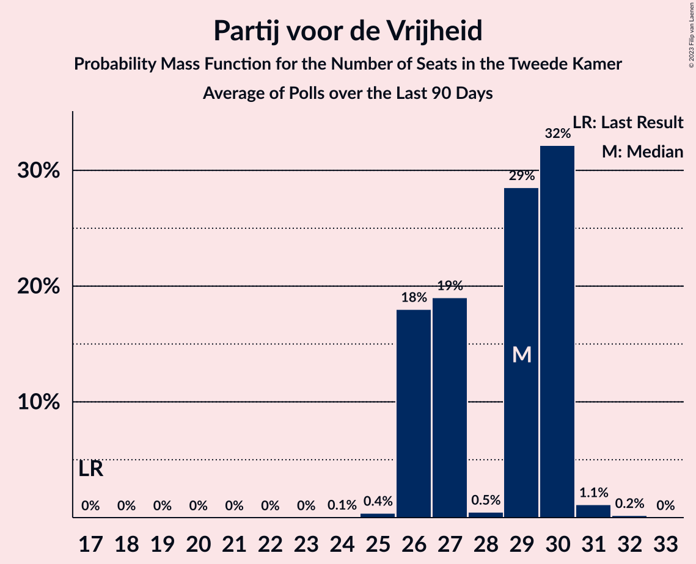

# Poll Average

<a href="#voting-intentions">Voting Intentions</a> | <a href="#seats">Seats</a> | <a href="#coalitions">Coalitions</a> | <a href="#technical-information">Technical Information</a>

## Summary

The table below lists the polls on which the average is based. They are the most recent polls (less than 90 days old) registered and analyzed so far.

| Period     | Polling firm/Commissioner(s) | VVD | PVV | CDA | D66 | GL | SP | PvdA | CU | PvdD | 50+ | SGP | DENK | FvD | PP | B1 | PvdT | JA21 | CO | Volt |
|:----------:|:----------------------------:|:--:|:--:|:--:|:--:|:--:|:--:|:--:|:--:|:--:|:--:|:--:|:--:|:--:|:--:|:--:|:--:|:--:|:--:|:--:|
| 15 March 2017 | General Election | 21.3%   33 | 13.1%   20 | 12.4%   19 | 12.2%   19 | 9.1%   14 | 9.1%   14 | 5.7%   9 | 3.4%   5 | 3.2%   5 | 3.1%   4 | 2.1%   3 | 2.1%   3 | 1.8%   2 | 0.3%   0 | 0.3%   0 | 0.0%   0 | 0.0%   0 | 0.0%   0 | 0.0%   0 |
| N/A | Poll Average | 22–30%   35–46 | 10–17%   17–25 | 11–15%   16–22 | 7–12%   10–17 | 5–10%   9–15 | 5–8%   8–11 | 7–10%   10–14 | 3–5%   3–7 | 3–6%   4–9 | 0–3%   0–3 | 1–3%   2–3 | 1–3%   1–3 | 1–3%   2–4 | 0%   0 | 0%   0 | N/A   N/A | 0–2%   1–3 | 0–1%   0–1 | 0–1%   0–1 |
| [14 February 2021](2021-02-14-Peilnl.html) | Peil.nl | 22–25%   35–37 | 15–17%   24–25 | 11–13%   16–19 | 8–10%   12–14 | 5–7%   9–10 | 5–7%   8–10 | 8–10%   12–14 | 4–5%   6–7 | 4–5%   7 | 0–1%   0–1 | 2–3%   3 | 1–2%   2 | 2–3%   4 | N/A   N/A | 0%   0 | N/A   N/A | 2–3%   2–3 | 0–1%   0–1 | 0–1%   1 |
| [29 January–2 February 2021](2021-02-02-IOResearch.html) | I&O Research   De Volkskrant | 27–30%   42–44 | 11–14%   19–20 | 11–14%   20–21 | 7–9%   10–12 | 6–8%   11–13 | 6–8%   10–11 | 7–10%   12–15 | 4–6%   5–6 | 3–4%   5–6 | 0–1%   0–1 | 1–3%   2–3 | 1–2%   2 | 1–3%   3 | 0%   0 | 0%   0 | N/A   N/A | 0–1%   1 | 0%   0 | 0%   0 |
| [23–26 January 2021](2021-01-26-KantarPublic.html) | Kantar Public | 25–31%   41–46 | 10–13%   16–18 | 10–14%   16–19 | 8–11%   12–16 | 7–10%   13–14 | 6–9%   9–12 | 7–10%   10–13 | 2–5%   3–6 | 2–5%   4–5 | 1–3%   2–3 | 1–3%   3–5 | 1–3%   2–3 | 1–3%   2–3 | N/A   N/A | N/A   N/A | N/A   N/A | 0–1%   0–1 | N/A   N/A | N/A   N/A |
| [22–25 January 2021](2021-01-25-Ipsos.html) | Ipsos   EenVandaag | 23–29%   36–46 | 11–15%   17–24 | 11–15%   17–22 | 8–12%   12–18 | 6–10%   10–15 | 5–8%   7–11 | 6–9%   9–15 | 3–5%   4–8 | 3–6%   5–9 | 1–2%   0–2 | 1–2%   1–3 | 1–2%   1–3 | 1–3%   1–4 | N/A   N/A | N/A   N/A | N/A   N/A | 1–2%   1–3 | N/A   N/A | N/A   N/A |
| 15 March 2017 | General Election | 21.3%   33 | 13.1%   20 | 12.4%   19 | 12.2%   19 | 9.1%   14 | 9.1%   14 | 5.7%   9 | 3.4%   5 | 3.2%   5 | 3.1%   4 | 2.1%   3 | 2.1%   3 | 1.8%   2 | 0.3%   0 | 0.3%   0 | 0.0%   0 | 0.0%   0 | 0.0%   0 | 0.0%   0 |

Only polls for which at least the sample size has been published are included in the table above.

**Legend:**
+ **Top half of each row:** Voting intentions (95% confidence interval)
+ **Bottom half of each row:** Seat projections for the Tweede Kamer (95% confidence interval)
+ **VVD:** Volkspartij voor Vrijheid en Democratie
+ **PVV:** Partij voor de Vrijheid
+ **CDA:** Christen-Democratisch Appèl
+ **D66:** Democraten 66
+ **GL:** GroenLinks
+ **SP:** Socialistische Partij
+ **PvdA:** Partij van de Arbeid
+ **CU:** ChristenUnie
+ **PvdD:** Partij voor de Dieren
+ **50+:** 50Plus
+ **SGP:** Staatkundig Gereformeerde Partij
+ **DENK:** DENK
+ **FvD:** Forum voor Democratie
+ **PP:** Piratenpartij
+ **B1:** Bij1
+ **PvdT:** Partij voor de Toekomst
+ **JA21:** Juiste Antwoord 2021
+ **CO:** Code Oranje
+ **Volt:** Volt Europa
+ **N/A (single party):** Party not included the published results
+ **N/A (entire row):** Calculation for this opinion poll not started yet

## Voting Intentions

### Confidence Intervals

| Party | Last Result | Median | 80% Confidence Interval | 90% Confidence Interval | 95% Confidence Interval | 99% Confidence Interval |
|:-----:|:-----------:|:------:|:-----------------------:|:-----------------------:|:-----------------------:|:-----------------------:|
| <a href="#volkspartij-voor-vrijheid-en-democratie">Volkspartij voor Vrijheid en Democratie</a> | 21.3% | 26.9% | 23.1–29.2% |22.6–29.7% | 22.3–30.1% | 21.7–30.9% |
| <a href="#partij-voor-de-vrijheid">Partij voor de Vrijheid</a> | 13.1% | 12.7% | 11.0–16.1% |10.6–16.5% | 10.2–16.8% | 9.5–17.4% |
| <a href="#christen-democratisch-appèl">Christen-Democratisch Appèl</a> | 12.4% | 12.4% | 11.3–13.7% |11.0–14.2% | 10.7–14.6% | 10.1–15.4% |
| <a href="#democraten-66">Democraten 66</a> | 12.2% | 8.9% | 7.7–10.6% |7.4–11.1% | 7.2–11.5% | 6.8–12.2% |
| <a href="#groenlinks">GroenLinks</a> | 9.1% | 7.5% | 5.9–9.1% |5.6–9.5% | 5.4–9.8% | 5.1–10.5% |
| <a href="#socialistische-partij">Socialistische Partij</a> | 9.1% | 6.7% | 5.6–7.9% |5.4–8.2% | 5.2–8.5% | 4.8–9.0% |
| <a href="#partij-van-de-arbeid">Partij van de Arbeid</a> | 5.7% | 8.3% | 7.2–9.2% |6.9–9.5% | 6.6–9.7% | 6.1–10.1% |
| <a href="#christenunie">ChristenUnie</a> | 3.4% | 4.3% | 3.1–5.1% |2.9–5.3% | 2.7–5.4% | 2.4–5.8% |
| <a href="#partij-voor-de-dieren">Partij voor de Dieren</a> | 3.2% | 3.9% | 3.0–5.0% |2.8–5.3% | 2.7–5.5% | 2.4–5.9% |
| <a href="#50plus">50Plus</a> | 3.1% | 0.9% | 0.6–2.2% |0.5–2.4% | 0.5–2.6% | 0.4–3.0% |
| <a href="#staatkundig-gereformeerde-partij">Staatkundig Gereformeerde Partij</a> | 2.1% | 2.0% | 1.4–2.4% |1.3–2.6% | 1.1–2.7% | 0.9–3.0% |
| <a href="#denk">DENK</a> | 2.1% | 1.5% | 1.1–2.2% |1.0–2.5% | 1.0–2.6% | 0.8–3.0% |
| <a href="#forum-voor-democratie">Forum voor Democratie</a> | 1.8% | 2.2% | 1.7–2.9% |1.5–3.0% | 1.4–3.2% | 1.2–3.4% |
| <a href="#piratenpartij">Piratenpartij</a> | 0.3% | 0.2% | 0.1–0.4% |0.1–0.4% | 0.1–0.5% | 0.1–0.6% |
| <a href="#bij1">Bij1</a> | 0.3% | 0.2% | 0.1–0.3% |0.1–0.4% | 0.1–0.4% | 0.1–0.5% |
| <a href="#partij-voor-de-toekomst">Partij voor de Toekomst</a> | 0.0% | N/A | N/A |N/A | N/A | N/A |
| <a href="#juiste-antwoord-2021">Juiste Antwoord 2021</a> | 0.0% | 1.1% | 0.6–2.1% |0.5–2.3% | 0.4–2.4% | 0.3–2.6% |
| <a href="#code-oranje">Code Oranje</a> | 0.0% | 0.4% | 0.1–0.8% |0.1–0.9% | 0.1–1.0% | 0.1–1.1% |
| <a href="#volt-europa">Volt Europa</a> | 0.0% | 0.4% | 0.1–0.8% |0.1–0.9% | 0.1–1.0% | 0.1–1.1% |

### Volkspartij voor Vrijheid en Democratie

*For a full overview of the results for this party, see the [Volkspartij voor Vrijheid en Democratie](party-volkspartijvoorvrijheidendemocratie.html) page.*

| Voting Intentions | Probability | Accumulated | Special Marks |
|:-----------------:|:-----------:|:-----------:|:-------------:|
| 19.5–20.5% | 0% | 100% |  |
| 20.5–21.5% | 0.3% | 100% | Last Result |
| 21.5–22.5% | 4% | 99.7% |  |
| 22.5–23.5% | 12% | 96% |  |
| 23.5–24.5% | 10% | 83% |  |
| 24.5–25.5% | 7% | 73% |  |
| 25.5–26.5% | 11% | 66% |  |
| 26.5–27.5% | 15% | 55% | Median |
| 27.5–28.5% | 19% | 39% |  |
| 28.5–29.5% | 14% | 20% |  |
| 29.5–30.5% | 5% | 6% |  |
| 30.5–31.5% | 0.9% | 1.0% |  |
| 31.5–32.5% | 0.1% | 0.1% |  |
| 32.5–33.5% | 0% | 0% |  |

### Partij voor de Vrijheid

*For a full overview of the results for this party, see the [Partij voor de Vrijheid](party-partijvoordevrijheid.html) page.*

| Voting Intentions | Probability | Accumulated | Special Marks |
|:-----------------:|:-----------:|:-----------:|:-------------:|
| 7.5–8.5% | 0% | 100% |  |
| 8.5–9.5% | 0.5% | 100% |  |
| 9.5–10.5% | 4% | 99.5% |  |
| 10.5–11.5% | 14% | 95% |  |
| 11.5–12.5% | 26% | 81% |  |
| 12.5–13.5% | 22% | 55% | Last Result, Median |
| 13.5–14.5% | 7% | 33% |  |
| 14.5–15.5% | 8% | 26% |  |
| 15.5–16.5% | 14% | 18% |  |
| 16.5–17.5% | 4% | 5% |  |
| 17.5–18.5% | 0.2% | 0.3% |  |
| 18.5–19.5% | 0% | 0% |  |

### Christen-Democratisch Appèl

*For a full overview of the results for this party, see the [Christen-Democratisch Appèl](party-christen-democratischappèl.html) page.*

| Voting Intentions | Probability | Accumulated | Special Marks |
|:-----------------:|:-----------:|:-----------:|:-------------:|
| 8.5–9.5% | 0.1% | 100% |  |
| 9.5–10.5% | 2% | 99.9% |  |
| 10.5–11.5% | 15% | 98% |  |
| 11.5–12.5% | 41% | 83% | Last Result, Median |
| 12.5–13.5% | 30% | 43% |  |
| 13.5–14.5% | 10% | 13% |  |
| 14.5–15.5% | 2% | 3% |  |
| 15.5–16.5% | 0.3% | 0.4% |  |
| 16.5–17.5% | 0% | 0% |  |

### Democraten 66

*For a full overview of the results for this party, see the [Democraten 66](party-democraten66.html) page.*

| Voting Intentions | Probability | Accumulated | Special Marks |
|:-----------------:|:-----------:|:-----------:|:-------------:|
| 4.5–5.5% | 0% | 100% |  |
| 5.5–6.5% | 0.1% | 100% |  |
| 6.5–7.5% | 7% | 99.9% |  |
| 7.5–8.5% | 30% | 93% |  |
| 8.5–9.5% | 33% | 63% | Median |
| 9.5–10.5% | 19% | 30% |  |
| 10.5–11.5% | 9% | 11% |  |
| 11.5–12.5% | 2% | 2% | Last Result |
| 12.5–13.5% | 0.2% | 0.2% |  |
| 13.5–14.5% | 0% | 0% |  |

### GroenLinks

*For a full overview of the results for this party, see the [GroenLinks](party-groenlinks.html) page.*

| Voting Intentions | Probability | Accumulated | Special Marks |
|:-----------------:|:-----------:|:-----------:|:-------------:|
| 3.5–4.5% | 0% | 100% |  |
| 4.5–5.5% | 4% | 100% |  |
| 5.5–6.5% | 22% | 96% |  |
| 6.5–7.5% | 26% | 74% | Median |
| 7.5–8.5% | 28% | 48% |  |
| 8.5–9.5% | 16% | 20% | Last Result |
| 9.5–10.5% | 4% | 5% |  |
| 10.5–11.5% | 0.4% | 0.4% |  |
| 11.5–12.5% | 0% | 0% |  |

### Socialistische Partij

*For a full overview of the results for this party, see the [Socialistische Partij](party-socialistischepartij.html) page.*

| Voting Intentions | Probability | Accumulated | Special Marks |
|:-----------------:|:-----------:|:-----------:|:-------------:|
| 2.5–3.5% | 0% | 100% |  |
| 3.5–4.5% | 0.1% | 100% |  |
| 4.5–5.5% | 8% | 99.9% |  |
| 5.5–6.5% | 36% | 92% |  |
| 6.5–7.5% | 36% | 56% | Median |
| 7.5–8.5% | 18% | 20% |  |
| 8.5–9.5% | 2% | 2% | Last Result |
| 9.5–10.5% | 0.1% | 0.1% |  |
| 10.5–11.5% | 0% | 0% |  |

### Partij van de Arbeid

*For a full overview of the results for this party, see the [Partij van de Arbeid](party-partijvandearbeid.html) page.*

| Voting Intentions | Probability | Accumulated | Special Marks |
|:-----------------:|:-----------:|:-----------:|:-------------:|
| 4.5–5.5% | 0.1% | 100% |  |
| 5.5–6.5% | 2% | 99.9% | Last Result |
| 6.5–7.5% | 16% | 98% |  |
| 7.5–8.5% | 43% | 82% | Median |
| 8.5–9.5% | 35% | 39% |  |
| 9.5–10.5% | 4% | 4% |  |
| 10.5–11.5% | 0.1% | 0.1% |  |
| 11.5–12.5% | 0% | 0% |  |

### ChristenUnie

*For a full overview of the results for this party, see the [ChristenUnie](party-christenunie.html) page.*

| Voting Intentions | Probability | Accumulated | Special Marks |
|:-----------------:|:-----------:|:-----------:|:-------------:|
| 0.5–1.5% | 0% | 100% |  |
| 1.5–2.5% | 1.1% | 100% |  |
| 2.5–3.5% | 20% | 98.9% | Last Result |
| 3.5–4.5% | 43% | 78% | Median |
| 4.5–5.5% | 34% | 36% |  |
| 5.5–6.5% | 1.5% | 1.5% |  |
| 6.5–7.5% | 0% | 0% |  |

### Partij voor de Dieren

*For a full overview of the results for this party, see the [Partij voor de Dieren](party-partijvoordedieren.html) page.*

| Voting Intentions | Probability | Accumulated | Special Marks |
|:-----------------:|:-----------:|:-----------:|:-------------:|
| 0.5–1.5% | 0% | 100% |  |
| 1.5–2.5% | 1.3% | 100% |  |
| 2.5–3.5% | 33% | 98.7% | Last Result |
| 3.5–4.5% | 38% | 65% | Median |
| 4.5–5.5% | 26% | 27% |  |
| 5.5–6.5% | 2% | 2% |  |
| 6.5–7.5% | 0% | 0% |  |
| 7.5–8.5% | 0% | 0% |  |

### 50Plus

*For a full overview of the results for this party, see the [50Plus](party-50plus.html) page.*

| Voting Intentions | Probability | Accumulated | Special Marks |
|:-----------------:|:-----------:|:-----------:|:-------------:|
| 0.0–0.5% | 8% | 100% |  |
| 0.5–1.5% | 66% | 92% | Median |
| 1.5–2.5% | 22% | 25% |  |
| 2.5–3.5% | 3% | 3% | Last Result |
| 3.5–4.5% | 0% | 0% |  |

### Staatkundig Gereformeerde Partij

*For a full overview of the results for this party, see the [Staatkundig Gereformeerde Partij](party-staatkundiggereformeerdepartij.html) page.*

| Voting Intentions | Probability | Accumulated | Special Marks |
|:-----------------:|:-----------:|:-----------:|:-------------:|
| 0.0–0.5% | 0% | 100% |  |
| 0.5–1.5% | 15% | 100% |  |
| 1.5–2.5% | 79% | 85% | Last Result, Median |
| 2.5–3.5% | 6% | 6% |  |
| 3.5–4.5% | 0% | 0% |  |

### DENK

*For a full overview of the results for this party, see the [DENK](party-denk.html) page.*

| Voting Intentions | Probability | Accumulated | Special Marks |
|:-----------------:|:-----------:|:-----------:|:-------------:|
| 0.0–0.5% | 0% | 100% |  |
| 0.5–1.5% | 54% | 100% |  |
| 1.5–2.5% | 42% | 46% | Last Result, Median |
| 2.5–3.5% | 4% | 4% |  |
| 3.5–4.5% | 0% | 0% |  |

### Forum voor Democratie

*For a full overview of the results for this party, see the [Forum voor Democratie](party-forumvoordemocratie.html) page.*

| Voting Intentions | Probability | Accumulated | Special Marks |
|:-----------------:|:-----------:|:-----------:|:-------------:|
| 0.0–0.5% | 0% | 100% |  |
| 0.5–1.5% | 5% | 100% |  |
| 1.5–2.5% | 68% | 95% | Last Result, Median |
| 2.5–3.5% | 27% | 27% |  |
| 3.5–4.5% | 0.2% | 0.2% |  |
| 4.5–5.5% | 0% | 0% |  |

### Piratenpartij

*For a full overview of the results for this party, see the [Piratenpartij](party-piratenpartij.html) page.*

| Voting Intentions | Probability | Accumulated | Special Marks |
|:-----------------:|:-----------:|:-----------:|:-------------:|
| 0.0–0.5% | 99.3% | 100% | Last Result, Median |
| 0.5–1.5% | 0.7% | 0.7% |  |
| 1.5–2.5% | 0% | 0% |  |

### Bij1

*For a full overview of the results for this party, see the [Bij1](party-bij1.html) page.*

| Voting Intentions | Probability | Accumulated | Special Marks |
|:-----------------:|:-----------:|:-----------:|:-------------:|
| 0.0–0.5% | 99.6% | 100% | Last Result, Median |
| 0.5–1.5% | 0.4% | 0.4% |  |
| 1.5–2.5% | 0% | 0% |  |

### Juiste Antwoord 2021

*For a full overview of the results for this party, see the [Juiste Antwoord 2021](party-juisteantwoord2021.html) page.*

| Voting Intentions | Probability | Accumulated | Special Marks |
|:-----------------:|:-----------:|:-----------:|:-------------:|
| 0.0–0.5% | 10% | 100% | Last Result |
| 0.5–1.5% | 57% | 90% | Median |
| 1.5–2.5% | 32% | 33% |  |
| 2.5–3.5% | 0.9% | 0.9% |  |
| 3.5–4.5% | 0% | 0% |  |

### Code Oranje

*For a full overview of the results for this party, see the [Code Oranje](party-codeoranje.html) page.*

| Voting Intentions | Probability | Accumulated | Special Marks |
|:-----------------:|:-----------:|:-----------:|:-------------:|
| 0.0–0.5% | 58% | 100% | Last Result, Median |
| 0.5–1.5% | 42% | 42% |  |
| 1.5–2.5% | 0% | 0% |  |

### Volt Europa

*For a full overview of the results for this party, see the [Volt Europa](party-volteuropa.html) page.*

| Voting Intentions | Probability | Accumulated | Special Marks |
|:-----------------:|:-----------:|:-----------:|:-------------:|
| 0.0–0.5% | 58% | 100% | Last Result, Median |
| 0.5–1.5% | 42% | 42% |  |
| 1.5–2.5% | 0% | 0% |  |

## Seats

### Confidence Intervals

| Party | Last Result | Median | 80% Confidence Interval | 90% Confidence Interval | 95% Confidence Interval | 99% Confidence Interval |
|:-----:|:-----------:|:------:|:-----------------------:|:-----------------------:|:-----------------------:|:-----------------------:|
| <a href="#volkspartij-voor-vrijheid-en-democratie">Volkspartij voor Vrijheid en Democratie</a> | 33 | 44 | 37–45 |35–46 | 35–46 | 35–46 |
| <a href="#partij-voor-de-vrijheid">Partij voor de Vrijheid</a> | 20 | 20 | 17–24 |17–25 | 17–25 | 16–26 |
| <a href="#christen-democratisch-appèl">Christen-Democratisch Appèl</a> | 19 | 18 | 16–21 |16–22 | 16–22 | 16–22 |
| <a href="#democraten-66">Democraten 66</a> | 19 | 14 | 10–16 |10–16 | 10–17 | 10–18 |
| <a href="#groenlinks">GroenLinks</a> | 14 | 13 | 10–13 |9–15 | 9–15 | 9–15 |
| <a href="#socialistische-partij">Socialistische Partij</a> | 14 | 10 | 9–11 |8–11 | 8–11 | 7–12 |
| <a href="#partij-van-de-arbeid">Partij van de Arbeid</a> | 9 | 12 | 11–14 |11–14 | 10–14 | 9–15 |
| <a href="#christenunie">ChristenUnie</a> | 5 | 5 | 3–7 |3–7 | 3–7 | 3–8 |
| <a href="#partij-voor-de-dieren">Partij voor de Dieren</a> | 5 | 5 | 5–7 |4–8 | 4–9 | 3–9 |
| <a href="#50plus">50Plus</a> | 4 | 1 | 0–3 |0–3 | 0–3 | 0–3 |
| <a href="#staatkundig-gereformeerde-partij">Staatkundig Gereformeerde Partij</a> | 3 | 3 | 2–3 |2–3 | 2–3 | 1–5 |
| <a href="#denk">DENK</a> | 3 | 2 | 2–3 |2–3 | 1–3 | 1–4 |
| <a href="#forum-voor-democratie">Forum voor Democratie</a> | 2 | 3 | 2–4 |2–4 | 2–4 | 1–4 |
| <a href="#piratenpartij">Piratenpartij</a> | 0 | 0 | 0 |0 | 0 | 0 |
| <a href="#bij1">Bij1</a> | 0 | 0 | 0 |0 | 0 | 0 |
| <a href="#partij-voor-de-toekomst">Partij voor de Toekomst</a> | 0 | N/A | N/A |N/A | N/A | N/A |
| <a href="#juiste-antwoord-2021">Juiste Antwoord 2021</a> | 0 | 1 | 1–2 |1–3 | 1–3 | 0–3 |
| <a href="#code-oranje">Code Oranje</a> | 0 | 0 | 0–1 |0–1 | 0–1 | 0–1 |
| <a href="#volt-europa">Volt Europa</a> | 0 | 0 | 0–1 |0–1 | 0–1 | 0–1 |

### Volkspartij voor Vrijheid en Democratie

*For a full overview of the results for this party, see the [Volkspartij voor Vrijheid en Democratie](party-volkspartijvoorvrijheidendemocratie.html) page.*

| Number of Seats | Probability | Accumulated | Special Marks |
|:---------------:|:-----------:|:-----------:|:-------------:|
| 33 | 0.1% | 100% | Last Result |
| 34 | 0% | 99.9% |  |
| 35 | 6% | 99.9% |  |
| 36 | 2% | 93% |  |
| 37 | 23% | 92% |  |
| 38 | 4% | 69% |  |
| 39 | 2% | 64% |  |
| 40 | 7% | 63% |  |
| 41 | 1.1% | 55% |  |
| 42 | 2% | 54% |  |
| 43 | 1.4% | 53% |  |
| 44 | 40% | 51% | Median |
| 45 | 2% | 11% |  |
| 46 | 8% | 9% |  |
| 47 | 0.4% | 0.4% |  |
| 48 | 0% | 0% |  |

### Partij voor de Vrijheid

*For a full overview of the results for this party, see the [Partij voor de Vrijheid](party-partijvoordevrijheid.html) page.*

| Number of Seats | Probability | Accumulated | Special Marks |
|:---------------:|:-----------:|:-----------:|:-------------:|
| 14 | 0.1% | 100% |  |
| 15 | 0.1% | 99.9% |  |
| 16 | 1.2% | 99.8% |  |
| 17 | 12% | 98.7% |  |
| 18 | 17% | 87% |  |
| 19 | 3% | 70% |  |
| 20 | 29% | 68% | Last Result, Median |
| 21 | 11% | 38% |  |
| 22 | 0.7% | 27% |  |
| 23 | 0.4% | 27% |  |
| 24 | 20% | 26% |  |
| 25 | 6% | 6% |  |
| 26 | 0.4% | 0.5% |  |
| 27 | 0.1% | 0.1% |  |
| 28 | 0% | 0% |  |

### Christen-Democratisch Appèl

*For a full overview of the results for this party, see the [Christen-Democratisch Appèl](party-christen-democratischappèl.html) page.*

| Number of Seats | Probability | Accumulated | Special Marks |
|:---------------:|:-----------:|:-----------:|:-------------:|
| 14 | 0.1% | 100% |  |
| 15 | 0.2% | 99.9% |  |
| 16 | 34% | 99.7% |  |
| 17 | 7% | 66% |  |
| 18 | 9% | 59% | Median |
| 19 | 10% | 50% | Last Result |
| 20 | 6% | 40% |  |
| 21 | 29% | 34% |  |
| 22 | 5% | 6% |  |
| 23 | 0.4% | 0.5% |  |
| 24 | 0% | 0% |  |

### Democraten 66

*For a full overview of the results for this party, see the [Democraten 66](party-democraten66.html) page.*

| Number of Seats | Probability | Accumulated | Special Marks |
|:---------------:|:-----------:|:-----------:|:-------------:|
| 10 | 23% | 100% |  |
| 11 | 1.1% | 77% |  |
| 12 | 8% | 75% |  |
| 13 | 12% | 68% |  |
| 14 | 27% | 55% | Median |
| 15 | 9% | 28% |  |
| 16 | 17% | 20% |  |
| 17 | 2% | 3% |  |
| 18 | 0.8% | 1.1% |  |
| 19 | 0.1% | 0.3% | Last Result |
| 20 | 0.3% | 0.3% |  |
| 21 | 0% | 0% |  |

### GroenLinks

*For a full overview of the results for this party, see the [GroenLinks](party-groenlinks.html) page.*

| Number of Seats | Probability | Accumulated | Special Marks |
|:---------------:|:-----------:|:-----------:|:-------------:|
| 8 | 0.2% | 100% |  |
| 9 | 7% | 99.8% |  |
| 10 | 26% | 93% |  |
| 11 | 4% | 68% |  |
| 12 | 3% | 63% |  |
| 13 | 52% | 60% | Median |
| 14 | 2% | 9% | Last Result |
| 15 | 6% | 6% |  |
| 16 | 0.3% | 0.3% |  |
| 17 | 0% | 0% |  |

### Socialistische Partij

*For a full overview of the results for this party, see the [Socialistische Partij](party-socialistischepartij.html) page.*

| Number of Seats | Probability | Accumulated | Special Marks |
|:---------------:|:-----------:|:-----------:|:-------------:|
| 6 | 0.1% | 100% |  |
| 7 | 1.4% | 99.9% |  |
| 8 | 5% | 98.5% |  |
| 9 | 35% | 93% |  |
| 10 | 16% | 58% | Median |
| 11 | 40% | 42% |  |
| 12 | 1.4% | 2% |  |
| 13 | 0.2% | 0.3% |  |
| 14 | 0.1% | 0.1% | Last Result |
| 15 | 0% | 0% |  |

### Partij van de Arbeid

*For a full overview of the results for this party, see the [Partij van de Arbeid](party-partijvandearbeid.html) page.*

| Number of Seats | Probability | Accumulated | Special Marks |
|:---------------:|:-----------:|:-----------:|:-------------:|
| 7 | 0.1% | 100% |  |
| 8 | 0.1% | 99.9% |  |
| 9 | 1.5% | 99.8% | Last Result |
| 10 | 1.2% | 98% |  |
| 11 | 30% | 97% |  |
| 12 | 40% | 67% | Median |
| 13 | 5% | 27% |  |
| 14 | 20% | 22% |  |
| 15 | 1.4% | 2% |  |
| 16 | 0.3% | 0.3% |  |
| 17 | 0% | 0% |  |

### ChristenUnie

*For a full overview of the results for this party, see the [ChristenUnie](party-christenunie.html) page.*

| Number of Seats | Probability | Accumulated | Special Marks |
|:---------------:|:-----------:|:-----------:|:-------------:|
| 3 | 16% | 100% |  |
| 4 | 3% | 84% |  |
| 5 | 32% | 82% | Last Result, Median |
| 6 | 37% | 50% |  |
| 7 | 11% | 12% |  |
| 8 | 1.1% | 1.2% |  |
| 9 | 0% | 0% |  |

### Partij voor de Dieren

*For a full overview of the results for this party, see the [Partij voor de Dieren](party-partijvoordedieren.html) page.*

| Number of Seats | Probability | Accumulated | Special Marks |
|:---------------:|:-----------:|:-----------:|:-------------:|
| 3 | 0.6% | 100% |  |
| 4 | 8% | 99.4% |  |
| 5 | 50% | 91% | Last Result, Median |
| 6 | 4% | 41% |  |
| 7 | 31% | 37% |  |
| 8 | 2% | 6% |  |
| 9 | 4% | 4% |  |
| 10 | 0% | 0% |  |

### 50Plus

*For a full overview of the results for this party, see the [50Plus](party-50plus.html) page.*

| Number of Seats | Probability | Accumulated | Special Marks |
|:---------------:|:-----------:|:-----------:|:-------------:|
| 0 | 21% | 100% |  |
| 1 | 48% | 79% | Median |
| 2 | 7% | 31% |  |
| 3 | 24% | 24% |  |
| 4 | 0.1% | 0.1% | Last Result |
| 5 | 0% | 0% |  |

### Staatkundig Gereformeerde Partij

*For a full overview of the results for this party, see the [Staatkundig Gereformeerde Partij](party-staatkundiggereformeerdepartij.html) page.*

| Number of Seats | Probability | Accumulated | Special Marks |
|:---------------:|:-----------:|:-----------:|:-------------:|
| 1 | 1.4% | 100% |  |
| 2 | 42% | 98.6% |  |
| 3 | 55% | 56% | Last Result, Median |
| 4 | 0.7% | 2% |  |
| 5 | 0.9% | 0.9% |  |
| 6 | 0% | 0% |  |

### DENK

*For a full overview of the results for this party, see the [DENK](party-denk.html) page.*

| Number of Seats | Probability | Accumulated | Special Marks |
|:---------------:|:-----------:|:-----------:|:-------------:|
| 1 | 3% | 100% |  |
| 2 | 66% | 96% | Median |
| 3 | 30% | 31% | Last Result |
| 4 | 0.4% | 0.6% |  |
| 5 | 0.2% | 0.2% |  |
| 6 | 0% | 0% |  |

### Forum voor Democratie

*For a full overview of the results for this party, see the [Forum voor Democratie](party-forumvoordemocratie.html) page.*

| Number of Seats | Probability | Accumulated | Special Marks |
|:---------------:|:-----------:|:-----------:|:-------------:|
| 1 | 1.4% | 100% |  |
| 2 | 9% | 98.6% | Last Result |
| 3 | 53% | 89% | Median |
| 4 | 36% | 36% |  |
| 5 | 0.2% | 0.2% |  |
| 6 | 0% | 0% |  |

### Piratenpartij

*For a full overview of the results for this party, see the [Piratenpartij](party-piratenpartij.html) page.*

| Number of Seats | Probability | Accumulated | Special Marks |
|:---------------:|:-----------:|:-----------:|:-------------:|
| 0 | 100% | 100% | Last Result, Median |

### Bij1

*For a full overview of the results for this party, see the [Bij1](party-bij1.html) page.*

| Number of Seats | Probability | Accumulated | Special Marks |
|:---------------:|:-----------:|:-----------:|:-------------:|
| 0 | 100% | 100% | Last Result, Median |

### Partij voor de Toekomst

*For a full overview of the results for this party, see the [Partij voor de Toekomst](party-partijvoordetoekomst.html) page.*

### Juiste Antwoord 2021

*For a full overview of the results for this party, see the [Juiste Antwoord 2021](party-juisteantwoord2021.html) page.*

| Number of Seats | Probability | Accumulated | Special Marks |
|:---------------:|:-----------:|:-----------:|:-------------:|
| 0 | 2% | 100% | Last Result |
| 1 | 57% | 98% | Median |
| 2 | 33% | 42% |  |
| 3 | 8% | 8% |  |
| 4 | 0% | 0% |  |

### Code Oranje

*For a full overview of the results for this party, see the [Code Oranje](party-codeoranje.html) page.*

| Number of Seats | Probability | Accumulated | Special Marks |
|:---------------:|:-----------:|:-----------:|:-------------:|
| 0 | 63% | 100% | Last Result, Median |
| 1 | 37% | 37% |  |
| 2 | 0% | 0% |  |

### Volt Europa

*For a full overview of the results for this party, see the [Volt Europa](party-volteuropa.html) page.*

| Number of Seats | Probability | Accumulated | Special Marks |
|:---------------:|:-----------:|:-----------:|:-------------:|
| 0 | 51% | 100% | Last Result, Median |
| 1 | 49% | 49% |  |
| 2 | 0% | 0% |  |

## Coalitions

### Confidence Intervals

| Coalition | Last Result | Median | Majority? | 80% Confidence Interval | 90% Confidence Interval | 95% Confidence Interval | 99% Confidence Interval |
|:---------:|:-----------:|:------:|:---------:|:-----------------------:|:-----------------------:|:-----------------------:|:-----------------------:|
| Volkspartij voor Vrijheid en Democratie – Christen-Democratisch Appèl – Democraten 66 – Partij van de Arbeid – ChristenUnie | 85 | 90 | 100% | 87–94 | 85–96 | 85–98 | 85–98 |
| Volkspartij voor Vrijheid en Democratie – Christen-Democratisch Appèl – Democraten 66 – GroenLinks – ChristenUnie | 90 | 92 | 100% | 83–96 | 82–96 | 82–97 | 82–97 |
| Volkspartij voor Vrijheid en Democratie – Partij voor de Vrijheid – Christen-Democratisch Appèl – Staatkundig Gereformeerde Partij – Forum voor Democratie | 77 | 85 | 100% | 84–90 | 83–90 | 83–90 | 80–90 |
| Volkspartij voor Vrijheid en Democratie – Partij voor de Vrijheid – Christen-Democratisch Appèl – Forum voor Democratie | 74 | 83 | 99.9% | 81–88 | 80–88 | 80–88 | 77–88 |
| Volkspartij voor Vrijheid en Democratie – Christen-Democratisch Appèl – Democraten 66 – ChristenUnie | 76 | 79 | 75% | 73–83 | 73–83 | 73–86 | 73–87 |
| Volkspartij voor Vrijheid en Democratie – Partij voor de Vrijheid – Christen-Democratisch Appèl | 72 | 79 | 99.0% | 77–85 | 77–85 | 77–85 | 75–85 |
| Volkspartij voor Vrijheid en Democratie – Christen-Democratisch Appèl – Democraten 66 | 71 | 75 | 30% | 67–77 | 66–77 | 66–80 | 66–82 |
| Volkspartij voor Vrijheid en Democratie – Christen-Democratisch Appèl – Partij van de Arbeid | 61 | 71 | 28% | 67–77 | 66–77 | 66–78 | 66–79 |
| Christen-Democratisch Appèl – Democraten 66 – GroenLinks – Socialistische Partij – Partij van de Arbeid – ChristenUnie | 80 | 71 | 3% | 69–74 | 69–75 | 69–76 | 69–78 |
| Volkspartij voor Vrijheid en Democratie – Christen-Democratisch Appèl – 50Plus – Staatkundig Gereformeerde Partij – Forum voor Democratie | 61 | 69 | 0% | 60–72 | 60–73 | 60–73 | 60–74 |
| Volkspartij voor Vrijheid en Democratie – Christen-Democratisch Appèl – Staatkundig Gereformeerde Partij – Forum voor Democratie | 57 | 66 | 0% | 60–70 | 60–70 | 60–71 | 60–71 |
| Volkspartij voor Vrijheid en Democratie – Democraten 66 – Partij van de Arbeid | 61 | 66 | 0% | 61–71 | 59–71 | 59–71 | 59–72 |
| Volkspartij voor Vrijheid en Democratie – Christen-Democratisch Appèl – 50Plus – Forum voor Democratie | 58 | 66 | 0% | 57–70 | 57–70 | 57–70 | 57–70 |
| Volkspartij voor Vrijheid en Democratie – Christen-Democratisch Appèl – Forum voor Democratie | 54 | 63 | 0% | 57–68 | 57–68 | 57–69 | 57–69 |
| Christen-Democratisch Appèl – Democraten 66 – GroenLinks – Partij van de Arbeid – ChristenUnie | 66 | 61 | 0% | 59–65 | 59–66 | 59–66 | 59–68 |
| Volkspartij voor Vrijheid en Democratie – Christen-Democratisch Appèl | 52 | 60 | 0% | 53–65 | 53–65 | 53–66 | 53–67 |
| Volkspartij voor Vrijheid en Democratie – Partij van de Arbeid | 42 | 55 | 0% | 48–56 | 47–57 | 47–57 | 47–60 |
| Christen-Democratisch Appèl – Democraten 66 – Partij van de Arbeid | 47 | 43 | 0% | 43–48 | 42–48 | 42–49 | 41–51 |
| Christen-Democratisch Appèl – Partij van de Arbeid – ChristenUnie | 33 | 36 | 0% | 30–38 | 30–40 | 30–40 | 30–42 |
| Christen-Democratisch Appèl – Democraten 66 | 38 | 31 | 0% | 30–35 | 30–37 | 30–37 | 29–39 |
| Christen-Democratisch Appèl – Partij van de Arbeid | 28 | 30 | 0% | 27–33 | 27–33 | 27–34 | 26–36 |

### Volkspartij voor Vrijheid en Democratie – Christen-Democratisch Appèl – Democraten 66 – Partij van de Arbeid – ChristenUnie

| Number of Seats | Probability | Accumulated | Special Marks |
|:---------------:|:-----------:|:-----------:|:-------------:|
| 85 | 6% | 100% | Last Result |
| 86 | 0.1% | 94% |  |
| 87 | 23% | 94% |  |
| 88 | 0.3% | 71% |  |
| 89 | 7% | 71% |  |
| 90 | 16% | 64% |  |
| 91 | 3% | 48% |  |
| 92 | 24% | 44% |  |
| 93 | 6% | 20% | Median |
| 94 | 8% | 14% |  |
| 95 | 0.4% | 6% |  |
| 96 | 2% | 6% |  |
| 97 | 0.6% | 3% |  |
| 98 | 3% | 3% |  |
| 99 | 0% | 0.1% |  |
| 100 | 0.1% | 0.1% |  |
| 101 | 0% | 0% |  |

### Volkspartij voor Vrijheid en Democratie – Christen-Democratisch Appèl – Democraten 66 – GroenLinks – ChristenUnie

| Number of Seats | Probability | Accumulated | Special Marks |
|:---------------:|:-----------:|:-----------:|:-------------:|
| 80 | 0.1% | 100% |  |
| 81 | 0% | 99.9% |  |
| 82 | 6% | 99.9% |  |
| 83 | 18% | 94% |  |
| 84 | 0.4% | 76% |  |
| 85 | 0.1% | 75% |  |
| 86 | 0.2% | 75% |  |
| 87 | 0.6% | 75% |  |
| 88 | 0.4% | 75% |  |
| 89 | 4% | 74% |  |
| 90 | 5% | 70% | Last Result |
| 91 | 2% | 65% |  |
| 92 | 22% | 63% |  |
| 93 | 25% | 41% |  |
| 94 | 2% | 15% | Median |
| 95 | 2% | 13% |  |
| 96 | 8% | 11% |  |
| 97 | 3% | 3% |  |
| 98 | 0% | 0.2% |  |
| 99 | 0% | 0.1% |  |
| 100 | 0% | 0.1% |  |
| 101 | 0.1% | 0.1% |  |
| 102 | 0% | 0% |  |

### Volkspartij voor Vrijheid en Democratie – Partij voor de Vrijheid – Christen-Democratisch Appèl – Staatkundig Gereformeerde Partij – Forum voor Democratie

| Number of Seats | Probability | Accumulated | Special Marks |
|:---------------:|:-----------:|:-----------:|:-------------:|
| 77 | 0.1% | 100% | Last Result |
| 78 | 0% | 99.9% |  |
| 79 | 0.3% | 99.8% |  |
| 80 | 0.4% | 99.5% |  |
| 81 | 1.4% | 99.1% |  |
| 82 | 0.2% | 98% |  |
| 83 | 6% | 98% |  |
| 84 | 40% | 92% |  |
| 85 | 6% | 52% |  |
| 86 | 7% | 46% |  |
| 87 | 11% | 39% |  |
| 88 | 3% | 28% | Median |
| 89 | 0.2% | 24% |  |
| 90 | 24% | 24% |  |
| 91 | 0.4% | 0.5% |  |
| 92 | 0.1% | 0.1% |  |
| 93 | 0% | 0% |  |

### Volkspartij voor Vrijheid en Democratie – Partij voor de Vrijheid – Christen-Democratisch Appèl – Forum voor Democratie

| Number of Seats | Probability | Accumulated | Special Marks |
|:---------------:|:-----------:|:-----------:|:-------------:|
| 74 | 0.1% | 100% | Last Result |
| 75 | 0% | 99.9% |  |
| 76 | 0.2% | 99.9% | Majority |
| 77 | 0.2% | 99.7% |  |
| 78 | 1.0% | 99.5% |  |
| 79 | 0.9% | 98% |  |
| 80 | 4% | 98% |  |
| 81 | 35% | 94% |  |
| 82 | 9% | 59% |  |
| 83 | 12% | 50% |  |
| 84 | 8% | 38% |  |
| 85 | 2% | 30% | Median |
| 86 | 3% | 28% |  |
| 87 | 0.1% | 24% |  |
| 88 | 24% | 24% |  |
| 89 | 0.1% | 0.2% |  |
| 90 | 0.1% | 0.1% |  |
| 91 | 0% | 0% |  |

### Volkspartij voor Vrijheid en Democratie – Christen-Democratisch Appèl – Democraten 66 – ChristenUnie

| Number of Seats | Probability | Accumulated | Special Marks |
|:---------------:|:-----------:|:-----------:|:-------------:|
| 72 | 0.1% | 100% |  |
| 73 | 24% | 99.9% |  |
| 74 | 0.1% | 76% |  |
| 75 | 0.5% | 76% |  |
| 76 | 5% | 75% | Last Result, Majority |
| 77 | 6% | 70% |  |
| 78 | 2% | 64% |  |
| 79 | 18% | 62% |  |
| 80 | 28% | 45% |  |
| 81 | 1.3% | 17% | Median |
| 82 | 3% | 16% |  |
| 83 | 8% | 13% |  |
| 84 | 1.4% | 4% |  |
| 85 | 0.2% | 3% |  |
| 86 | 0.4% | 3% |  |
| 87 | 2% | 2% |  |
| 88 | 0% | 0% |  |

### Volkspartij voor Vrijheid en Democratie – Partij voor de Vrijheid – Christen-Democratisch Appèl

| Number of Seats | Probability | Accumulated | Special Marks |
|:---------------:|:-----------:|:-----------:|:-------------:|
| 72 | 0.1% | 100% | Last Result |
| 73 | 0.2% | 99.9% |  |
| 74 | 0.1% | 99.7% |  |
| 75 | 0.6% | 99.6% |  |
| 76 | 0.7% | 99.0% | Majority |
| 77 | 19% | 98% |  |
| 78 | 26% | 79% |  |
| 79 | 14% | 54% |  |
| 80 | 2% | 40% |  |
| 81 | 8% | 38% |  |
| 82 | 2% | 30% | Median |
| 83 | 0.5% | 28% |  |
| 84 | 2% | 27% |  |
| 85 | 25% | 25% |  |
| 86 | 0.1% | 0.3% |  |
| 87 | 0.1% | 0.1% |  |
| 88 | 0% | 0% |  |

### Volkspartij voor Vrijheid en Democratie – Christen-Democratisch Appèl – Democraten 66

| Number of Seats | Probability | Accumulated | Special Marks |
|:---------------:|:-----------:|:-----------:|:-------------:|
| 66 | 6% | 100% |  |
| 67 | 18% | 94% |  |
| 68 | 0.4% | 76% |  |
| 69 | 0.1% | 75% |  |
| 70 | 0.7% | 75% |  |
| 71 | 10% | 74% | Last Result |
| 72 | 0.3% | 65% |  |
| 73 | 6% | 64% |  |
| 74 | 3% | 58% |  |
| 75 | 25% | 55% |  |
| 76 | 16% | 30% | Median, Majority |
| 77 | 9% | 14% |  |
| 78 | 1.2% | 4% |  |
| 79 | 0.1% | 3% |  |
| 80 | 0.6% | 3% |  |
| 81 | 0.1% | 2% |  |
| 82 | 2% | 2% |  |
| 83 | 0% | 0% |  |

### Volkspartij voor Vrijheid en Democratie – Christen-Democratisch Appèl – Partij van de Arbeid

| Number of Seats | Probability | Accumulated | Special Marks |
|:---------------:|:-----------:|:-----------:|:-------------:|
| 61 | 0% | 100% | Last Result |
| 62 | 0% | 100% |  |
| 63 | 0% | 100% |  |
| 64 | 0% | 100% |  |
| 65 | 0.3% | 100% |  |
| 66 | 6% | 99.7% |  |
| 67 | 18% | 94% |  |
| 68 | 0.7% | 75% |  |
| 69 | 11% | 75% |  |
| 70 | 4% | 64% |  |
| 71 | 19% | 60% |  |
| 72 | 2% | 41% |  |
| 73 | 1.4% | 39% |  |
| 74 | 0.7% | 38% | Median |
| 75 | 9% | 37% |  |
| 76 | 0.2% | 28% | Majority |
| 77 | 24% | 28% |  |
| 78 | 3% | 4% |  |
| 79 | 1.0% | 1.1% |  |
| 80 | 0% | 0.1% |  |
| 81 | 0% | 0.1% |  |
| 82 | 0.1% | 0.1% |  |
| 83 | 0% | 0% |  |

### Christen-Democratisch Appèl – Democraten 66 – GroenLinks – Socialistische Partij – Partij van de Arbeid – ChristenUnie

| Number of Seats | Probability | Accumulated | Special Marks |
|:---------------:|:-----------:|:-----------:|:-------------:|
| 67 | 0.1% | 100% |  |
| 68 | 0.2% | 99.9% |  |
| 69 | 25% | 99.6% |  |
| 70 | 24% | 75% |  |
| 71 | 7% | 51% |  |
| 72 | 25% | 44% | Median |
| 73 | 3% | 20% |  |
| 74 | 11% | 16% |  |
| 75 | 3% | 6% |  |
| 76 | 2% | 3% | Majority |
| 77 | 0.6% | 1.2% |  |
| 78 | 0.3% | 0.6% |  |
| 79 | 0.1% | 0.3% |  |
| 80 | 0% | 0.2% | Last Result |
| 81 | 0.1% | 0.2% |  |
| 82 | 0% | 0% |  |

### Volkspartij voor Vrijheid en Democratie – Christen-Democratisch Appèl – 50Plus – Staatkundig Gereformeerde Partij – Forum voor Democratie

| Number of Seats | Probability | Accumulated | Special Marks |
|:---------------:|:-----------:|:-----------:|:-------------:|
| 60 | 18% | 100% |  |
| 61 | 0.6% | 82% | Last Result |
| 62 | 6% | 81% |  |
| 63 | 0.9% | 75% |  |
| 64 | 8% | 74% |  |
| 65 | 9% | 66% |  |
| 66 | 1.1% | 57% |  |
| 67 | 2% | 56% |  |
| 68 | 1.5% | 54% |  |
| 69 | 17% | 52% | Median |
| 70 | 0.2% | 35% |  |
| 71 | 24% | 35% |  |
| 72 | 2% | 11% |  |
| 73 | 8% | 9% |  |
| 74 | 0.8% | 0.9% |  |
| 75 | 0% | 0% |  |

### Volkspartij voor Vrijheid en Democratie – Christen-Democratisch Appèl – Staatkundig Gereformeerde Partij – Forum voor Democratie

| Number of Seats | Probability | Accumulated | Special Marks |
|:---------------:|:-----------:|:-----------:|:-------------:|
| 57 | 0% | 100% | Last Result |
| 58 | 0% | 100% |  |
| 59 | 0.2% | 100% |  |
| 60 | 19% | 99.8% |  |
| 61 | 7% | 81% |  |
| 62 | 0.7% | 75% |  |
| 63 | 12% | 74% |  |
| 64 | 6% | 62% |  |
| 65 | 0.8% | 56% |  |
| 66 | 17% | 55% |  |
| 67 | 2% | 38% |  |
| 68 | 1.5% | 36% | Median |
| 69 | 0.2% | 35% |  |
| 70 | 31% | 35% |  |
| 71 | 3% | 4% |  |
| 72 | 0.5% | 0.5% |  |
| 73 | 0% | 0% |  |

### Volkspartij voor Vrijheid en Democratie – Democraten 66 – Partij van de Arbeid

| Number of Seats | Probability | Accumulated | Special Marks |
|:---------------:|:-----------:|:-----------:|:-------------:|
| 59 | 6% | 100% |  |
| 60 | 0% | 94% |  |
| 61 | 4% | 94% | Last Result |
| 62 | 0.7% | 90% |  |
| 63 | 2% | 89% |  |
| 64 | 0.9% | 87% |  |
| 65 | 19% | 86% |  |
| 66 | 34% | 67% |  |
| 67 | 0.9% | 34% |  |
| 68 | 3% | 33% |  |
| 69 | 1.0% | 30% |  |
| 70 | 9% | 29% | Median |
| 71 | 18% | 20% |  |
| 72 | 1.2% | 2% |  |
| 73 | 0.2% | 0.4% |  |
| 74 | 0.1% | 0.2% |  |
| 75 | 0% | 0% |  |

### Volkspartij voor Vrijheid en Democratie – Christen-Democratisch Appèl – 50Plus – Forum voor Democratie

| Number of Seats | Probability | Accumulated | Special Marks |
|:---------------:|:-----------:|:-----------:|:-------------:|
| 57 | 18% | 100% |  |
| 58 | 0.5% | 82% | Last Result |
| 59 | 6% | 81% |  |
| 60 | 0.5% | 75% |  |
| 61 | 0.8% | 74% |  |
| 62 | 11% | 74% |  |
| 63 | 5% | 62% |  |
| 64 | 3% | 57% |  |
| 65 | 2% | 54% |  |
| 66 | 17% | 53% | Median |
| 67 | 1.4% | 36% |  |
| 68 | 0.3% | 35% |  |
| 69 | 24% | 35% |  |
| 70 | 10% | 10% |  |
| 71 | 0.1% | 0.1% |  |
| 72 | 0% | 0% |  |

### Volkspartij voor Vrijheid en Democratie – Christen-Democratisch Appèl – Forum voor Democratie

| Number of Seats | Probability | Accumulated | Special Marks |
|:---------------:|:-----------:|:-----------:|:-------------:|
| 54 | 0% | 100% | Last Result |
| 55 | 0% | 100% |  |
| 56 | 0.2% | 100% |  |
| 57 | 19% | 99.8% |  |
| 58 | 6% | 81% |  |
| 59 | 0.4% | 75% |  |
| 60 | 4% | 75% |  |
| 61 | 8% | 70% |  |
| 62 | 6% | 62% |  |
| 63 | 17% | 56% |  |
| 64 | 2% | 39% |  |
| 65 | 1.1% | 37% | Median |
| 66 | 2% | 36% |  |
| 67 | 8% | 34% |  |
| 68 | 24% | 26% |  |
| 69 | 3% | 3% |  |
| 70 | 0.1% | 0.1% |  |
| 71 | 0% | 0% |  |

### Christen-Democratisch Appèl – Democraten 66 – GroenLinks – Partij van de Arbeid – ChristenUnie

| Number of Seats | Probability | Accumulated | Special Marks |
|:---------------:|:-----------:|:-----------:|:-------------:|
| 55 | 0.1% | 100% |  |
| 56 | 0.1% | 99.9% |  |
| 57 | 0.2% | 99.9% |  |
| 58 | 0.2% | 99.7% |  |
| 59 | 22% | 99.5% |  |
| 60 | 19% | 78% |  |
| 61 | 32% | 59% |  |
| 62 | 2% | 26% | Median |
| 63 | 7% | 25% |  |
| 64 | 7% | 17% |  |
| 65 | 5% | 11% |  |
| 66 | 3% | 5% | Last Result |
| 67 | 1.2% | 2% |  |
| 68 | 0.7% | 1.0% |  |
| 69 | 0.1% | 0.4% |  |
| 70 | 0.2% | 0.3% |  |
| 71 | 0% | 0.1% |  |
| 72 | 0% | 0% |  |

### Volkspartij voor Vrijheid en Democratie – Christen-Democratisch Appèl

| Number of Seats | Probability | Accumulated | Special Marks |
|:---------------:|:-----------:|:-----------:|:-------------:|
| 52 | 0.1% | 100% | Last Result |
| 53 | 18% | 99.9% |  |
| 54 | 6% | 82% |  |
| 55 | 0.2% | 75% |  |
| 56 | 0.2% | 75% |  |
| 57 | 6% | 75% |  |
| 58 | 11% | 69% |  |
| 59 | 2% | 58% |  |
| 60 | 18% | 57% |  |
| 61 | 2% | 39% |  |
| 62 | 0.6% | 37% | Median |
| 63 | 1.4% | 36% |  |
| 64 | 8% | 35% |  |
| 65 | 24% | 27% |  |
| 66 | 0.4% | 3% |  |
| 67 | 2% | 2% |  |
| 68 | 0% | 0.1% |  |
| 69 | 0% | 0% |  |

### Volkspartij voor Vrijheid en Democratie – Partij van de Arbeid

| Number of Seats | Probability | Accumulated | Special Marks |
|:---------------:|:-----------:|:-----------:|:-------------:|
| 42 | 0% | 100% | Last Result |
| 43 | 0% | 100% |  |
| 44 | 0.1% | 100% |  |
| 45 | 0% | 99.9% |  |
| 46 | 0.2% | 99.9% |  |
| 47 | 6% | 99.7% |  |
| 48 | 6% | 93% |  |
| 49 | 1.0% | 87% |  |
| 50 | 0.6% | 86% |  |
| 51 | 23% | 86% |  |
| 52 | 7% | 63% |  |
| 53 | 1.4% | 56% |  |
| 54 | 2% | 55% |  |
| 55 | 16% | 52% |  |
| 56 | 26% | 36% | Median |
| 57 | 8% | 10% |  |
| 58 | 0.1% | 1.4% |  |
| 59 | 0.1% | 1.2% |  |
| 60 | 1.0% | 1.1% |  |
| 61 | 0% | 0.1% |  |
| 62 | 0.1% | 0.1% |  |
| 63 | 0% | 0% |  |

### Christen-Democratisch Appèl – Democraten 66 – Partij van de Arbeid

| Number of Seats | Probability | Accumulated | Special Marks |
|:---------------:|:-----------:|:-----------:|:-------------:|
| 38 | 0.1% | 100% |  |
| 39 | 0% | 99.9% |  |
| 40 | 0.2% | 99.9% |  |
| 41 | 0.6% | 99.7% |  |
| 42 | 8% | 99.1% |  |
| 43 | 51% | 91% |  |
| 44 | 20% | 40% | Median |
| 45 | 6% | 21% |  |
| 46 | 1.3% | 15% |  |
| 47 | 3% | 13% | Last Result |
| 48 | 7% | 11% |  |
| 49 | 2% | 4% |  |
| 50 | 0.6% | 2% |  |
| 51 | 0.9% | 1.0% |  |
| 52 | 0.1% | 0.1% |  |
| 53 | 0% | 0% |  |

### Christen-Democratisch Appèl – Partij van de Arbeid – ChristenUnie

| Number of Seats | Probability | Accumulated | Special Marks |
|:---------------:|:-----------:|:-----------:|:-------------:|
| 30 | 15% | 100% |  |
| 31 | 0.4% | 85% |  |
| 32 | 0.7% | 84% |  |
| 33 | 1.2% | 84% | Last Result |
| 34 | 2% | 83% |  |
| 35 | 13% | 81% | Median |
| 36 | 19% | 68% |  |
| 37 | 4% | 48% |  |
| 38 | 35% | 44% |  |
| 39 | 0.4% | 9% |  |
| 40 | 7% | 9% |  |
| 41 | 0.7% | 2% |  |
| 42 | 1.3% | 1.3% |  |
| 43 | 0% | 0% |  |

### Christen-Democratisch Appèl – Democraten 66

| Number of Seats | Probability | Accumulated | Special Marks |
|:---------------:|:-----------:|:-----------:|:-------------:|
| 28 | 0.3% | 100% |  |
| 29 | 0.3% | 99.7% |  |
| 30 | 19% | 99.3% |  |
| 31 | 44% | 80% |  |
| 32 | 17% | 37% | Median |
| 33 | 0.9% | 19% |  |
| 34 | 6% | 18% |  |
| 35 | 5% | 13% |  |
| 36 | 2% | 8% |  |
| 37 | 4% | 6% |  |
| 38 | 0.8% | 1.4% | Last Result |
| 39 | 0.3% | 0.6% |  |
| 40 | 0.3% | 0.3% |  |
| 41 | 0% | 0% |  |

### Christen-Democratisch Appèl – Partij van de Arbeid

| Number of Seats | Probability | Accumulated | Special Marks |
|:---------------:|:-----------:|:-----------:|:-------------:|
| 26 | 0.7% | 100% |  |
| 27 | 16% | 99.3% |  |
| 28 | 0.5% | 84% | Last Result |
| 29 | 14% | 83% |  |
| 30 | 20% | 69% | Median |
| 31 | 7% | 49% |  |
| 32 | 6% | 42% |  |
| 33 | 31% | 35% |  |
| 34 | 3% | 4% |  |
| 35 | 0.8% | 1.5% |  |
| 36 | 0.3% | 0.6% |  |
| 37 | 0.3% | 0.3% |  |
| 38 | 0% | 0% |  |

## Technical Information

+ **Number of polls included in this average:** 4
+ **Lowest number of simulations done in a poll included in this average:** 1,048,576
+ **Total number of simulations done in the polls included in this average:** 4,194,304
+ **Error estimate:** 3.31%
