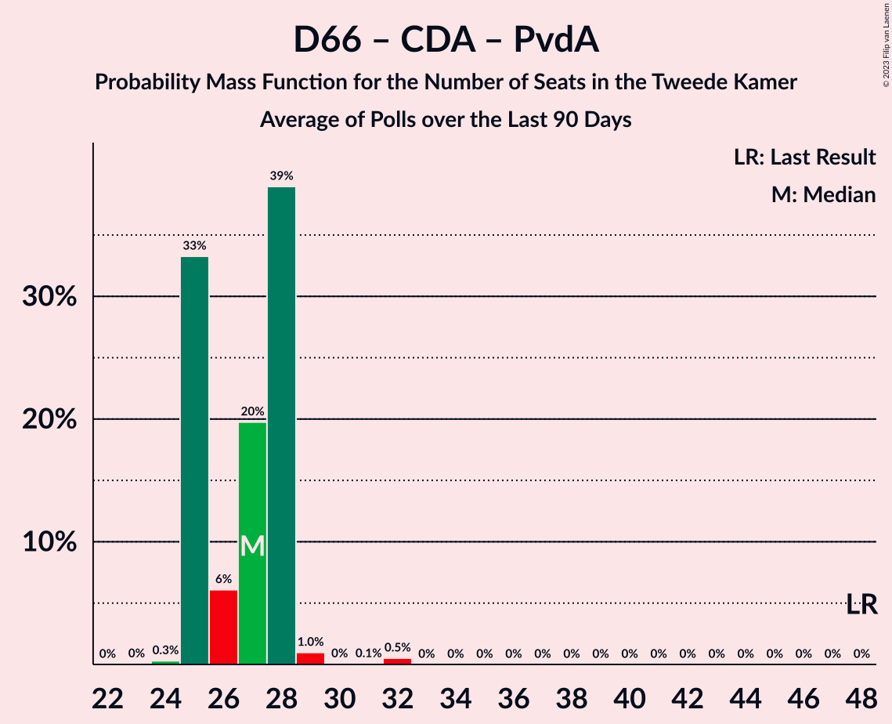

# Poll Average

<a href="#voting-intentions">Voting Intentions</a> | <a href="#seats">Seats</a> | <a href="#coalitions">Coalitions</a> | <a href="#technical-information">Technical Information</a>

## Summary

The table below lists the polls on which the average is based. They are the most recent polls (less than 90 days old) registered and analyzed so far.

| Period     | Polling firm/Commissioner(s) | VVD | D66 | PVV | CDA | SP | PvdA | GL | FvD | PvdD | CU | Volt | JA21 | SGP | DENK | 50+ | BBB | B1 | CO | Spl | PP | PvdT | BVNL |
|:----------:|:----------------------------:|:--:|:--:|:--:|:--:|:--:|:--:|:--:|:--:|:--:|:--:|:--:|:--:|:--:|:--:|:--:|:--:|:--:|:--:|:--:|:--:|:--:|:--:|
| 17 March 2021 | General Election | 21.9%   34 | 15.0%   24 | 10.8%   17 | 9.5%   15 | 6.0%   9 | 5.7%   9 | 5.2%   8 | 5.0%   8 | 3.8%   6 | 3.4%   5 | 2.4%   3 | 2.4%   3 | 2.1%   3 | 2.0%   3 | 1.0%   1 | 1.0%   1 | 0.8%   1 | 0.4%   0 | 0.3%   0 | 0.2%   0 | 0.0%   0 | 0.0%   0 |
| N/A | Poll Average | 12–19%   20–29 | 6–12%   11–18 | 10–14%   16–22 | 3–6%   4–10 | 4–7%   7–10 | 5–8%   7–12 | 6–9%   11–14 | 1–4%   2–6 | 5–7%   6–11 | 2–5%   4–7 | 2–4%   3–5 | 5–11%   7–16 | 2–4%   2–5 | 1–3%   1–3 | 0–1%   0–1 | 7–10%   10–15 | 0–2%   0–2 | N/A   N/A | N/A   N/A | N/A   N/A | N/A   N/A | 0–2%   0–3 |
| [9–12 December 2022](2022-12-12-IOResearch.html) | I&O Research | 12–14%   20 | 6–8%   11 | 10–13%   18–19 | 4–5%   6–7 | 5–7%   8 | 6–8%   10–11 | 7–10%   12–13 | 2–3%   3 | 5–7%   9–10 | 3–5%   5–7 | 3–4%   5 | 7–10%   14 | 3–4%   4–5 | 1–2%   1 | 1–2%   1 | 7–10%   10–14 | 1–2%   1–2 | N/A   N/A | N/A   N/A | N/A   N/A | N/A   N/A | 0–1%   0 |
| [2–3 December 2022](2022-12-03-Peilnl.html) | Peil.nl | 13–15%   20–22 | 6–8%   11–13 | 12–15%   21–22 | 3–4%   4–5 | 5–6%   7–9 | 6–8%   10–12 | 7–9%   12–13 | 3–4%   3–6 | 5–6%   8 | 3–5%   5–6 | 3–4%   4–5 | 9–11%   14–16 | 2–3%   3–4 | 2–3%   2–3 | 0–1%   0 | 8–10%   12–15 | 0–1%   0–1 | N/A   N/A | N/A   N/A | N/A   N/A | N/A   N/A | 0–1%   0–1 |
| [25–28 November 2022](2022-11-28-Ipsos.html) | Ipsos   EenVandaag | 15–19%   22–29 | 9–13%   14–19 | 10–14%   14–20 | 4–7%   6–10 | 4–7%   6–11 | 5–8%   7–12 | 6–9%   8–14 | 1–2%   1–3 | 4–7%   5–11 | 2–4%   3–7 | 2–4%   3–6 | 4–7%   7–11 | 1–3%   2–4 | 1–3%   2–5 | 0–1%   0–1 | 6–10%   9–16 | 1–2%   1–2 | N/A   N/A | N/A   N/A | N/A   N/A | N/A   N/A | 1–2%   1–3 |
| 17 March 2021 | General Election | 21.9%   34 | 15.0%   24 | 10.8%   17 | 9.5%   15 | 6.0%   9 | 5.7%   9 | 5.2%   8 | 5.0%   8 | 3.8%   6 | 3.4%   5 | 2.4%   3 | 2.4%   3 | 2.1%   3 | 2.0%   3 | 1.0%   1 | 1.0%   1 | 0.8%   1 | 0.4%   0 | 0.3%   0 | 0.2%   0 | 0.0%   0 | 0.0%   0 |

Only polls for which at least the sample size has been published are included in the table above.

**Legend:**
+ **Top half of each row:** Voting intentions (95% confidence interval)
+ **Bottom half of each row:** Seat projections for the Tweede Kamer (95% confidence interval)
+ **VVD:** Volkspartij voor Vrijheid en Democratie
+ **D66:** Democraten 66
+ **PVV:** Partij voor de Vrijheid
+ **CDA:** Christen-Democratisch Appèl
+ **SP:** Socialistische Partij
+ **PvdA:** Partij van de Arbeid
+ **GL:** GroenLinks
+ **FvD:** Forum voor Democratie
+ **PvdD:** Partij voor de Dieren
+ **CU:** ChristenUnie
+ **Volt:** Volt Europa
+ **JA21:** Juiste Antwoord 2021
+ **SGP:** Staatkundig Gereformeerde Partij
+ **DENK:** DENK
+ **50+:** 50Plus
+ **BBB:** BoerBurgerBeweging
+ **B1:** Bij1
+ **CO:** Code Oranje
+ **Spl:** Splinter
+ **PP:** Piratenpartij
+ **PvdT:** Partij voor de Toekomst
+ **BVNL:** Belang van Nederland
+ **N/A (single party):** Party not included the published results
+ **N/A (entire row):** Calculation for this opinion poll not started yet

## Voting Intentions

### Confidence Intervals

| Party | Last Result | Median | 80% Confidence Interval | 90% Confidence Interval | 95% Confidence Interval | 99% Confidence Interval |
|:-----:|:-----------:|:------:|:-----------------------:|:-----------------------:|:-----------------------:|:-----------------------:|
| <a href="#volkspartij-voor-vrijheid-en-democratie">Volkspartij voor Vrijheid en Democratie</a> | 21.9% | 14.1% | 12.5–17.6% |12.2–18.2% | 11.9–18.7% | 11.4–19.6% |
| <a href="#democraten-66">Democraten 66</a> | 15.0% | 7.7% | 6.8–11.4% |6.6–11.9% | 6.4–12.4% | 6.1–13.1% |
| <a href="#partij-voor-de-vrijheid">Partij voor de Vrijheid</a> | 10.8% | 12.2% | 10.8–13.7% |10.5–14.0% | 10.2–14.3% | 9.7–14.8% |
| <a href="#christen-democratisch-appèl">Christen-Democratisch Appèl</a> | 9.5% | 4.3% | 3.2–5.7% |3.0–6.1% | 2.9–6.4% | 2.7–7.0% |
| <a href="#socialistische-partij">Socialistische Partij</a> | 6.0% | 5.5% | 4.9–6.3% |4.7–6.6% | 4.5–6.8% | 4.2–7.3% |
| <a href="#partij-van-de-arbeid">Partij van de Arbeid</a> | 5.7% | 6.7% | 5.9–7.5% |5.7–7.7% | 5.4–7.9% | 5.0–8.4% |
| <a href="#groenlinks">GroenLinks</a> | 5.2% | 8.0% | 7.0–8.9% |6.6–9.2% | 6.3–9.4% | 5.8–9.9% |
| <a href="#forum-voor-democratie">Forum voor Democratie</a> | 5.0% | 2.6% | 1.2–3.5% |1.1–3.7% | 1.0–3.8% | 0.8–4.1% |
| <a href="#partij-voor-de-dieren">Partij voor de Dieren</a> | 3.8% | 5.7% | 5.0–6.7% |4.8–6.9% | 4.6–7.2% | 4.3–7.6% |
| <a href="#christenunie">ChristenUnie</a> | 3.4% | 3.7% | 2.8–4.3% |2.6–4.5% | 2.4–4.6% | 2.1–4.9% |
| <a href="#volt-europa">Volt Europa</a> | 2.4% | 3.4% | 2.8–3.9% |2.6–4.1% | 2.4–4.3% | 2.1–4.6% |
| <a href="#juiste-antwoord-2021">Juiste Antwoord 2021</a> | 2.4% | 8.4% | 5.4–10.3% |5.0–10.6% | 4.7–10.8% | 4.3–11.3% |
| <a href="#staatkundig-gereformeerde-partij">Staatkundig Gereformeerde Partij</a> | 2.1% | 2.7% | 1.9–3.7% |1.7–3.9% | 1.5–4.0% | 1.3–4.4% |
| <a href="#denk">DENK</a> | 2.0% | 1.8% | 0.9–2.4% |0.8–2.6% | 0.7–2.8% | 0.6–3.2% |
| <a href="#50plus">50Plus</a> | 1.0% | 0.8% | 0.5–1.2% |0.4–1.3% | 0.3–1.4% | 0.2–1.6% |
| <a href="#boerburgerbeweging">BoerBurgerBeweging</a> | 1.0% | 8.6% | 7.4–9.7% |7.0–10.0% | 6.7–10.2% | 6.2–10.6% |
| <a href="#bij1">Bij1</a> | 0.8% | 1.1% | 0.6–1.6% |0.5–1.8% | 0.5–1.9% | 0.4–2.2% |
| <a href="#code-oranje">Code Oranje</a> | 0.4% | N/A | N/A |N/A | N/A | N/A |
| <a href="#splinter">Splinter</a> | 0.3% | N/A | N/A |N/A | N/A | N/A |
| <a href="#piratenpartij">Piratenpartij</a> | 0.2% | N/A | N/A |N/A | N/A | N/A |
| <a href="#partij-voor-de-toekomst">Partij voor de Toekomst</a> | 0.0% | N/A | N/A |N/A | N/A | N/A |
| <a href="#belang-van-nederland">Belang van Nederland</a> | 0.0% | 0.7% | 0.3–1.5% |0.2–1.7% | 0.2–1.9% | 0.1–2.2% |

### Volkspartij voor Vrijheid en Democratie

*For a full overview of the results for this party, see the [Volkspartij voor Vrijheid en Democratie](party-volkspartijvoorvrijheidendemocratie.html) page.*

| Voting Intentions | Probability | Accumulated | Special Marks |
|:-----------------:|:-----------:|:-----------:|:-------------:|
| 9.5–10.5% | 0% | 100% |  |
| 10.5–11.5% | 0.9% | 100% |  |
| 11.5–12.5% | 10% | 99.1% |  |
| 12.5–13.5% | 25% | 89% |  |
| 13.5–14.5% | 25% | 65% | Median |
| 14.5–15.5% | 9% | 39% |  |
| 15.5–16.5% | 9% | 30% |  |
| 16.5–17.5% | 11% | 21% |  |
| 17.5–18.5% | 7% | 10% |  |
| 18.5–19.5% | 3% | 3% |  |
| 19.5–20.5% | 0.5% | 0.5% |  |
| 20.5–21.5% | 0.1% | 0.1% |  |
| 21.5–22.5% | 0% | 0% | Last Result |

### Democraten 66

*For a full overview of the results for this party, see the [Democraten 66](party-democraten66.html) page.*

| Voting Intentions | Probability | Accumulated | Special Marks |
|:-----------------:|:-----------:|:-----------:|:-------------:|
| 4.5–5.5% | 0% | 100% |  |
| 5.5–6.5% | 4% | 100% |  |
| 6.5–7.5% | 40% | 96% |  |
| 7.5–8.5% | 22% | 56% | Median |
| 8.5–9.5% | 3% | 34% |  |
| 9.5–10.5% | 9% | 31% |  |
| 10.5–11.5% | 13% | 22% |  |
| 11.5–12.5% | 7% | 9% |  |
| 12.5–13.5% | 2% | 2% |  |
| 13.5–14.5% | 0.2% | 0.2% |  |
| 14.5–15.5% | 0% | 0% | Last Result |

### Partij voor de Vrijheid

*For a full overview of the results for this party, see the [Partij voor de Vrijheid](party-partijvoordevrijheid.html) page.*

| Voting Intentions | Probability | Accumulated | Special Marks |
|:-----------------:|:-----------:|:-----------:|:-------------:|
| 7.5–8.5% | 0% | 100% |  |
| 8.5–9.5% | 0.3% | 100% |  |
| 9.5–10.5% | 6% | 99.7% |  |
| 10.5–11.5% | 26% | 94% | Last Result |
| 11.5–12.5% | 28% | 68% | Median |
| 12.5–13.5% | 27% | 40% |  |
| 13.5–14.5% | 13% | 14% |  |
| 14.5–15.5% | 1.0% | 1.0% |  |
| 15.5–16.5% | 0% | 0% |  |

### Christen-Democratisch Appèl

*For a full overview of the results for this party, see the [Christen-Democratisch Appèl](party-christen-democratischappèl.html) page.*

| Voting Intentions | Probability | Accumulated | Special Marks |
|:-----------------:|:-----------:|:-----------:|:-------------:|
| 1.5–2.5% | 0.1% | 100% |  |
| 2.5–3.5% | 25% | 99.9% |  |
| 3.5–4.5% | 35% | 75% | Median |
| 4.5–5.5% | 26% | 39% |  |
| 5.5–6.5% | 11% | 13% |  |
| 6.5–7.5% | 2% | 2% |  |
| 7.5–8.5% | 0.1% | 0.1% |  |
| 8.5–9.5% | 0% | 0% |  |
| 9.5–10.5% | 0% | 0% | Last Result |

### Socialistische Partij

*For a full overview of the results for this party, see the [Socialistische Partij](party-socialistischepartij.html) page.*

| Voting Intentions | Probability | Accumulated | Special Marks |
|:-----------------:|:-----------:|:-----------:|:-------------:|
| 2.5–3.5% | 0% | 100% |  |
| 3.5–4.5% | 3% | 100% |  |
| 4.5–5.5% | 49% | 97% |  |
| 5.5–6.5% | 43% | 48% | Last Result, Median |
| 6.5–7.5% | 5% | 5% |  |
| 7.5–8.5% | 0.2% | 0.3% |  |
| 8.5–9.5% | 0% | 0% |  |

### Partij van de Arbeid

*For a full overview of the results for this party, see the [Partij van de Arbeid](party-partijvandearbeid.html) page.*

| Voting Intentions | Probability | Accumulated | Special Marks |
|:-----------------:|:-----------:|:-----------:|:-------------:|
| 3.5–4.5% | 0.1% | 100% |  |
| 4.5–5.5% | 3% | 99.9% |  |
| 5.5–6.5% | 37% | 96% | Last Result |
| 6.5–7.5% | 52% | 60% | Median |
| 7.5–8.5% | 8% | 8% |  |
| 8.5–9.5% | 0.3% | 0.3% |  |
| 9.5–10.5% | 0% | 0% |  |

### GroenLinks

*For a full overview of the results for this party, see the [GroenLinks](party-groenlinks.html) page.*

| Voting Intentions | Probability | Accumulated | Special Marks |
|:-----------------:|:-----------:|:-----------:|:-------------:|
| 3.5–4.5% | 0% | 100% |  |
| 4.5–5.5% | 0.2% | 100% | Last Result |
| 5.5–6.5% | 4% | 99.8% |  |
| 6.5–7.5% | 22% | 96% |  |
| 7.5–8.5% | 52% | 74% | Median |
| 8.5–9.5% | 21% | 22% |  |
| 9.5–10.5% | 1.5% | 2% |  |
| 10.5–11.5% | 0% | 0% |  |

### Forum voor Democratie

*For a full overview of the results for this party, see the [Forum voor Democratie](party-forumvoordemocratie.html) page.*

| Voting Intentions | Probability | Accumulated | Special Marks |
|:-----------------:|:-----------:|:-----------:|:-------------:|
| 0.0–0.5% | 0% | 100% |  |
| 0.5–1.5% | 22% | 100% |  |
| 1.5–2.5% | 28% | 78% |  |
| 2.5–3.5% | 41% | 50% | Median |
| 3.5–4.5% | 9% | 9% |  |
| 4.5–5.5% | 0% | 0% | Last Result |

### Partij voor de Dieren

*For a full overview of the results for this party, see the [Partij voor de Dieren](party-partijvoordedieren.html) page.*

| Voting Intentions | Probability | Accumulated | Special Marks |
|:-----------------:|:-----------:|:-----------:|:-------------:|
| 2.5–3.5% | 0% | 100% |  |
| 3.5–4.5% | 2% | 100% | Last Result |
| 4.5–5.5% | 37% | 98% |  |
| 5.5–6.5% | 47% | 61% | Median |
| 6.5–7.5% | 13% | 14% |  |
| 7.5–8.5% | 0.6% | 0.7% |  |
| 8.5–9.5% | 0% | 0% |  |

### ChristenUnie

*For a full overview of the results for this party, see the [ChristenUnie](party-christenunie.html) page.*

| Voting Intentions | Probability | Accumulated | Special Marks |
|:-----------------:|:-----------:|:-----------:|:-------------:|
| 0.5–1.5% | 0% | 100% |  |
| 1.5–2.5% | 4% | 100% |  |
| 2.5–3.5% | 36% | 96% | Last Result |
| 3.5–4.5% | 56% | 60% | Median |
| 4.5–5.5% | 4% | 4% |  |
| 5.5–6.5% | 0% | 0% |  |

### Volt Europa

*For a full overview of the results for this party, see the [Volt Europa](party-volteuropa.html) page.*

| Voting Intentions | Probability | Accumulated | Special Marks |
|:-----------------:|:-----------:|:-----------:|:-------------:|
| 0.5–1.5% | 0% | 100% |  |
| 1.5–2.5% | 4% | 100% | Last Result |
| 2.5–3.5% | 63% | 96% | Median |
| 3.5–4.5% | 32% | 33% |  |
| 4.5–5.5% | 0.6% | 0.6% |  |
| 5.5–6.5% | 0% | 0% |  |

### Juiste Antwoord 2021

*For a full overview of the results for this party, see the [Juiste Antwoord 2021](party-juisteantwoord2021.html) page.*

| Voting Intentions | Probability | Accumulated | Special Marks |
|:-----------------:|:-----------:|:-----------:|:-------------:|
| 1.5–2.5% | 0% | 100% | Last Result |
| 2.5–3.5% | 0% | 100% |  |
| 3.5–4.5% | 1.3% | 100% |  |
| 4.5–5.5% | 12% | 98.7% |  |
| 5.5–6.5% | 15% | 87% |  |
| 6.5–7.5% | 6% | 71% |  |
| 7.5–8.5% | 18% | 65% | Median |
| 8.5–9.5% | 19% | 47% |  |
| 9.5–10.5% | 22% | 28% |  |
| 10.5–11.5% | 6% | 6% |  |
| 11.5–12.5% | 0.1% | 0.1% |  |
| 12.5–13.5% | 0% | 0% |  |

### Staatkundig Gereformeerde Partij

*For a full overview of the results for this party, see the [Staatkundig Gereformeerde Partij](party-staatkundiggereformeerdepartij.html) page.*

| Voting Intentions | Probability | Accumulated | Special Marks |
|:-----------------:|:-----------:|:-----------:|:-------------:|
| 0.0–0.5% | 0% | 100% |  |
| 0.5–1.5% | 3% | 100% |  |
| 1.5–2.5% | 35% | 97% | Last Result |
| 2.5–3.5% | 48% | 61% | Median |
| 3.5–4.5% | 13% | 13% |  |
| 4.5–5.5% | 0.2% | 0.2% |  |
| 5.5–6.5% | 0% | 0% |  |

### DENK

*For a full overview of the results for this party, see the [DENK](party-denk.html) page.*

| Voting Intentions | Probability | Accumulated | Special Marks |
|:-----------------:|:-----------:|:-----------:|:-------------:|
| 0.0–0.5% | 0.2% | 100% |  |
| 0.5–1.5% | 37% | 99.8% |  |
| 1.5–2.5% | 57% | 63% | Last Result, Median |
| 2.5–3.5% | 6% | 6% |  |
| 3.5–4.5% | 0.1% | 0.1% |  |
| 4.5–5.5% | 0% | 0% |  |

### 50Plus

*For a full overview of the results for this party, see the [50Plus](party-50plus.html) page.*

| Voting Intentions | Probability | Accumulated | Special Marks |
|:-----------------:|:-----------:|:-----------:|:-------------:|
| 0.0–0.5% | 17% | 100% |  |
| 0.5–1.5% | 82% | 83% | Last Result, Median |
| 1.5–2.5% | 0.6% | 0.6% |  |
| 2.5–3.5% | 0% | 0% |  |

### BoerBurgerBeweging

*For a full overview of the results for this party, see the [BoerBurgerBeweging](party-boerburgerbeweging.html) page.*

| Voting Intentions | Probability | Accumulated | Special Marks |
|:-----------------:|:-----------:|:-----------:|:-------------:|
| 0.5–1.5% | 0% | 100% | Last Result |
| 1.5–2.5% | 0% | 100% |  |
| 2.5–3.5% | 0% | 100% |  |
| 3.5–4.5% | 0% | 100% |  |
| 4.5–5.5% | 0% | 100% |  |
| 5.5–6.5% | 2% | 100% |  |
| 6.5–7.5% | 12% | 98% |  |
| 7.5–8.5% | 32% | 86% |  |
| 8.5–9.5% | 40% | 54% | Median |
| 9.5–10.5% | 14% | 14% |  |
| 10.5–11.5% | 0.6% | 0.6% |  |
| 11.5–12.5% | 0% | 0% |  |

### Bij1

*For a full overview of the results for this party, see the [Bij1](party-bij1.html) page.*

| Voting Intentions | Probability | Accumulated | Special Marks |
|:-----------------:|:-----------:|:-----------:|:-------------:|
| 0.0–0.5% | 5% | 100% |  |
| 0.5–1.5% | 82% | 95% | Last Result, Median |
| 1.5–2.5% | 12% | 12% |  |
| 2.5–3.5% | 0.1% | 0.1% |  |
| 3.5–4.5% | 0% | 0% |  |

### Belang van Nederland

*For a full overview of the results for this party, see the [Belang van Nederland](party-belangvannederland.html) page.*

| Voting Intentions | Probability | Accumulated | Special Marks |
|:-----------------:|:-----------:|:-----------:|:-------------:|
| 0.0–0.5% | 37% | 100% | Last Result |
| 0.5–1.5% | 54% | 63% | Median |
| 1.5–2.5% | 9% | 9% |  |
| 2.5–3.5% | 0.1% | 0.1% |  |
| 3.5–4.5% | 0% | 0% |  |

## Seats

### Confidence Intervals

| Party | Last Result | Median | 80% Confidence Interval | 90% Confidence Interval | 95% Confidence Interval | 99% Confidence Interval |
|:-----:|:-----------:|:------:|:-----------------------:|:-----------------------:|:-----------------------:|:-----------------------:|
| <a href="#volkspartij-voor-vrijheid-en-democratie">Volkspartij voor Vrijheid en Democratie</a> | 34 | 22 | 20–25 |20–27 | 20–29 | 20–31 |
| <a href="#democraten-66">Democraten 66</a> | 24 | 11 | 11–17 |11–18 | 11–18 | 11–19 |
| <a href="#partij-voor-de-vrijheid">Partij voor de Vrijheid</a> | 17 | 19 | 17–21 |17–21 | 16–22 | 14–22 |
| <a href="#christen-democratisch-appèl">Christen-Democratisch Appèl</a> | 15 | 6 | 4–9 |4–10 | 4–10 | 4–10 |
| <a href="#socialistische-partij">Socialistische Partij</a> | 9 | 8 | 7–8 |7–9 | 7–10 | 6–11 |
| <a href="#partij-van-de-arbeid">Partij van de Arbeid</a> | 9 | 10 | 8–10 |7–11 | 7–12 | 7–12 |
| <a href="#groenlinks">GroenLinks</a> | 8 | 13 | 11–13 |11–14 | 11–14 | 8–15 |
| <a href="#forum-voor-democratie">Forum voor Democratie</a> | 8 | 3 | 2–5 |2–5 | 2–6 | 1–6 |
| <a href="#partij-voor-de-dieren">Partij voor de Dieren</a> | 6 | 9 | 8–11 |7–11 | 6–11 | 5–11 |
| <a href="#christenunie">ChristenUnie</a> | 5 | 5 | 4–6 |4–7 | 4–7 | 3–7 |
| <a href="#volt-europa">Volt Europa</a> | 3 | 5 | 4–5 |3–5 | 3–5 | 3–6 |
| <a href="#juiste-antwoord-2021">Juiste Antwoord 2021</a> | 3 | 14 | 7–16 |7–16 | 7–16 | 7–16 |
| <a href="#staatkundig-gereformeerde-partij">Staatkundig Gereformeerde Partij</a> | 3 | 4 | 3–4 |2–4 | 2–5 | 2–5 |
| <a href="#denk">DENK</a> | 3 | 2 | 1–3 |1–3 | 1–3 | 1–5 |
| <a href="#50plus">50Plus</a> | 1 | 1 | 0–1 |0–1 | 0–1 | 0–1 |
| <a href="#boerburgerbeweging">BoerBurgerBeweging</a> | 1 | 14 | 10–15 |10–15 | 10–15 | 9–16 |
| <a href="#bij1">Bij1</a> | 1 | 2 | 0–2 |0–2 | 0–2 | 0–3 |
| <a href="#code-oranje">Code Oranje</a> | 0 | N/A | N/A |N/A | N/A | N/A |
| <a href="#splinter">Splinter</a> | 0 | N/A | N/A |N/A | N/A | N/A |
| <a href="#piratenpartij">Piratenpartij</a> | 0 | N/A | N/A |N/A | N/A | N/A |
| <a href="#partij-voor-de-toekomst">Partij voor de Toekomst</a> | 0 | N/A | N/A |N/A | N/A | N/A |
| <a href="#belang-van-nederland">Belang van Nederland</a> | 0 | 1 | 0–3 |0–3 | 0–3 | 0–3 |

### Volkspartij voor Vrijheid en Democratie

*For a full overview of the results for this party, see the [Volkspartij voor Vrijheid en Democratie](party-volkspartijvoorvrijheidendemocratie.html) page.*

| Number of Seats | Probability | Accumulated | Special Marks |
|:---------------:|:-----------:|:-----------:|:-------------:|
| 19 | 0.2% | 100% |  |
| 20 | 37% | 99.8% |  |
| 21 | 0.2% | 63% |  |
| 22 | 35% | 62% | Median |
| 23 | 11% | 28% |  |
| 24 | 0.8% | 17% |  |
| 25 | 8% | 16% |  |
| 26 | 2% | 8% |  |
| 27 | 2% | 6% |  |
| 28 | 0.7% | 4% |  |
| 29 | 3% | 4% |  |
| 30 | 0.1% | 0.7% |  |
| 31 | 0.7% | 0.7% |  |
| 32 | 0% | 0% |  |
| 33 | 0% | 0% |  |
| 34 | 0% | 0% | Last Result |

### Democraten 66

*For a full overview of the results for this party, see the [Democraten 66](party-democraten66.html) page.*

| Number of Seats | Probability | Accumulated | Special Marks |
|:---------------:|:-----------:|:-----------:|:-------------:|
| 10 | 0.1% | 100% |  |
| 11 | 60% | 99.9% | Median |
| 12 | 5% | 40% |  |
| 13 | 2% | 35% |  |
| 14 | 8% | 33% |  |
| 15 | 0.4% | 25% |  |
| 16 | 7% | 24% |  |
| 17 | 11% | 18% |  |
| 18 | 5% | 7% |  |
| 19 | 1.0% | 1.4% |  |
| 20 | 0.1% | 0.4% |  |
| 21 | 0.3% | 0.3% |  |
| 22 | 0% | 0% |  |
| 23 | 0% | 0% |  |
| 24 | 0% | 0% | Last Result |

### Partij voor de Vrijheid

*For a full overview of the results for this party, see the [Partij voor de Vrijheid](party-partijvoordevrijheid.html) page.*

| Number of Seats | Probability | Accumulated | Special Marks |
|:---------------:|:-----------:|:-----------:|:-------------:|
| 14 | 2% | 100% |  |
| 15 | 0.2% | 98% |  |
| 16 | 3% | 98% |  |
| 17 | 12% | 96% | Last Result |
| 18 | 33% | 83% |  |
| 19 | 3% | 50% | Median |
| 20 | 13% | 47% |  |
| 21 | 29% | 33% |  |
| 22 | 5% | 5% |  |
| 23 | 0% | 0% |  |

### Christen-Democratisch Appèl

*For a full overview of the results for this party, see the [Christen-Democratisch Appèl](party-christen-democratischappèl.html) page.*

| Number of Seats | Probability | Accumulated | Special Marks |
|:---------------:|:-----------:|:-----------:|:-------------:|
| 4 | 31% | 100% |  |
| 5 | 3% | 69% |  |
| 6 | 32% | 66% | Median |
| 7 | 4% | 34% |  |
| 8 | 16% | 30% |  |
| 9 | 6% | 15% |  |
| 10 | 8% | 9% |  |
| 11 | 0.2% | 0.2% |  |
| 12 | 0% | 0% |  |
| 13 | 0% | 0% |  |
| 14 | 0% | 0% |  |
| 15 | 0% | 0% | Last Result |

### Socialistische Partij

*For a full overview of the results for this party, see the [Socialistische Partij](party-socialistischepartij.html) page.*

| Number of Seats | Probability | Accumulated | Special Marks |
|:---------------:|:-----------:|:-----------:|:-------------:|
| 6 | 0.8% | 100% |  |
| 7 | 14% | 99.2% |  |
| 8 | 79% | 85% | Median |
| 9 | 2% | 5% | Last Result |
| 10 | 2% | 3% |  |
| 11 | 0.6% | 0.9% |  |
| 12 | 0% | 0.4% |  |
| 13 | 0.1% | 0.3% |  |
| 14 | 0.2% | 0.2% |  |
| 15 | 0% | 0% |  |

### Partij van de Arbeid

*For a full overview of the results for this party, see the [Partij van de Arbeid](party-partijvandearbeid.html) page.*

| Number of Seats | Probability | Accumulated | Special Marks |
|:---------------:|:-----------:|:-----------:|:-------------:|
| 7 | 6% | 100% |  |
| 8 | 4% | 94% |  |
| 9 | 20% | 90% | Last Result |
| 10 | 61% | 70% | Median |
| 11 | 5% | 9% |  |
| 12 | 3% | 3% |  |
| 13 | 0.3% | 0.5% |  |
| 14 | 0.2% | 0.2% |  |
| 15 | 0% | 0% |  |

### GroenLinks

*For a full overview of the results for this party, see the [GroenLinks](party-groenlinks.html) page.*

| Number of Seats | Probability | Accumulated | Special Marks |
|:---------------:|:-----------:|:-----------:|:-------------:|
| 8 | 0.9% | 100% | Last Result |
| 9 | 0.8% | 99.1% |  |
| 10 | 0.6% | 98% |  |
| 11 | 11% | 98% |  |
| 12 | 15% | 86% |  |
| 13 | 61% | 71% | Median |
| 14 | 9% | 10% |  |
| 15 | 0.8% | 0.8% |  |
| 16 | 0% | 0% |  |

### Forum voor Democratie

*For a full overview of the results for this party, see the [Forum voor Democratie](party-forumvoordemocratie.html) page.*

| Number of Seats | Probability | Accumulated | Special Marks |
|:---------------:|:-----------:|:-----------:|:-------------:|
| 0 | 0.5% | 100% |  |
| 1 | 2% | 99.5% |  |
| 2 | 23% | 98% |  |
| 3 | 43% | 74% | Median |
| 4 | 0.4% | 32% |  |
| 5 | 27% | 31% |  |
| 6 | 4% | 4% |  |
| 7 | 0% | 0% |  |
| 8 | 0% | 0% | Last Result |

### Partij voor de Dieren

*For a full overview of the results for this party, see the [Partij voor de Dieren](party-partijvoordedieren.html) page.*

| Number of Seats | Probability | Accumulated | Special Marks |
|:---------------:|:-----------:|:-----------:|:-------------:|
| 5 | 2% | 100% |  |
| 6 | 1.5% | 98% | Last Result |
| 7 | 1.1% | 96% |  |
| 8 | 43% | 95% |  |
| 9 | 32% | 52% | Median |
| 10 | 9% | 20% |  |
| 11 | 11% | 11% |  |
| 12 | 0.1% | 0.1% |  |
| 13 | 0% | 0% |  |

### ChristenUnie

*For a full overview of the results for this party, see the [ChristenUnie](party-christenunie.html) page.*

| Number of Seats | Probability | Accumulated | Special Marks |
|:---------------:|:-----------:|:-----------:|:-------------:|
| 2 | 0.2% | 100% |  |
| 3 | 2% | 99.8% |  |
| 4 | 13% | 98% |  |
| 5 | 39% | 85% | Last Result, Median |
| 6 | 40% | 46% |  |
| 7 | 5% | 5% |  |
| 8 | 0.5% | 0.5% |  |
| 9 | 0% | 0% |  |

### Volt Europa

*For a full overview of the results for this party, see the [Volt Europa](party-volteuropa.html) page.*

| Number of Seats | Probability | Accumulated | Special Marks |
|:---------------:|:-----------:|:-----------:|:-------------:|
| 2 | 0.3% | 100% |  |
| 3 | 9% | 99.7% | Last Result |
| 4 | 12% | 90% |  |
| 5 | 77% | 78% | Median |
| 6 | 1.2% | 1.3% |  |
| 7 | 0.1% | 0.1% |  |
| 8 | 0% | 0% |  |

### Juiste Antwoord 2021

*For a full overview of the results for this party, see the [Juiste Antwoord 2021](party-juisteantwoord2021.html) page.*

| Number of Seats | Probability | Accumulated | Special Marks |
|:---------------:|:-----------:|:-----------:|:-------------:|
| 3 | 0% | 100% | Last Result |
| 4 | 0% | 100% |  |
| 5 | 0% | 100% |  |
| 6 | 0.3% | 100% |  |
| 7 | 13% | 99.7% |  |
| 8 | 2% | 87% |  |
| 9 | 11% | 85% |  |
| 10 | 6% | 74% |  |
| 11 | 1.1% | 68% |  |
| 12 | 0.1% | 67% |  |
| 13 | 0.2% | 67% |  |
| 14 | 35% | 67% | Median |
| 15 | 0.5% | 31% |  |
| 16 | 31% | 31% |  |
| 17 | 0% | 0% |  |

### Staatkundig Gereformeerde Partij

*For a full overview of the results for this party, see the [Staatkundig Gereformeerde Partij](party-staatkundiggereformeerdepartij.html) page.*

| Number of Seats | Probability | Accumulated | Special Marks |
|:---------------:|:-----------:|:-----------:|:-------------:|
| 1 | 0.3% | 100% |  |
| 2 | 7% | 99.7% |  |
| 3 | 33% | 93% | Last Result |
| 4 | 57% | 60% | Median |
| 5 | 3% | 3% |  |
| 6 | 0.3% | 0.3% |  |
| 7 | 0% | 0% |  |

### DENK

*For a full overview of the results for this party, see the [DENK](party-denk.html) page.*

| Number of Seats | Probability | Accumulated | Special Marks |
|:---------------:|:-----------:|:-----------:|:-------------:|
| 1 | 34% | 100% |  |
| 2 | 56% | 66% | Median |
| 3 | 9% | 11% | Last Result |
| 4 | 0.7% | 2% |  |
| 5 | 1.3% | 1.3% |  |
| 6 | 0% | 0% |  |

### 50Plus

*For a full overview of the results for this party, see the [50Plus](party-50plus.html) page.*

| Number of Seats | Probability | Accumulated | Special Marks |
|:---------------:|:-----------:|:-----------:|:-------------:|
| 0 | 49% | 100% |  |
| 1 | 51% | 51% | Last Result, Median |
| 2 | 0.1% | 0.1% |  |
| 3 | 0% | 0% |  |

### BoerBurgerBeweging

*For a full overview of the results for this party, see the [BoerBurgerBeweging](party-boerburgerbeweging.html) page.*

| Number of Seats | Probability | Accumulated | Special Marks |
|:---------------:|:-----------:|:-----------:|:-------------:|
| 1 | 0% | 100% | Last Result |
| 2 | 0% | 100% |  |
| 3 | 0% | 100% |  |
| 4 | 0% | 100% |  |
| 5 | 0% | 100% |  |
| 6 | 0% | 100% |  |
| 7 | 0.1% | 100% |  |
| 8 | 0.1% | 99.9% |  |
| 9 | 2% | 99.8% |  |
| 10 | 11% | 98% |  |
| 11 | 2% | 87% |  |
| 12 | 6% | 86% |  |
| 13 | 0.9% | 80% |  |
| 14 | 38% | 79% | Median |
| 15 | 40% | 41% |  |
| 16 | 0.9% | 0.9% |  |
| 17 | 0% | 0% |  |

### Bij1

*For a full overview of the results for this party, see the [Bij1](party-bij1.html) page.*

| Number of Seats | Probability | Accumulated | Special Marks |
|:---------------:|:-----------:|:-----------:|:-------------:|
| 0 | 29% | 100% |  |
| 1 | 12% | 71% | Last Result |
| 2 | 58% | 59% | Median |
| 3 | 0.6% | 0.7% |  |
| 4 | 0.1% | 0.1% |  |
| 5 | 0% | 0% |  |

### Code Oranje

*For a full overview of the results for this party, see the [Code Oranje](party-codeoranje.html) page.*

### Splinter

*For a full overview of the results for this party, see the [Splinter](party-splinter.html) page.*

### Piratenpartij

*For a full overview of the results for this party, see the [Piratenpartij](party-piratenpartij.html) page.*

### Partij voor de Toekomst

*For a full overview of the results for this party, see the [Partij voor de Toekomst](party-partijvoordetoekomst.html) page.*

### Belang van Nederland

*For a full overview of the results for this party, see the [Belang van Nederland](party-belangvannederland.html) page.*

| Number of Seats | Probability | Accumulated | Special Marks |
|:---------------:|:-----------:|:-----------:|:-------------:|
| 0 | 38% | 100% | Last Result |
| 1 | 47% | 62% | Median |
| 2 | 4% | 15% |  |
| 3 | 11% | 11% |  |
| 4 | 0% | 0% |  |

## Coalitions

### Confidence Intervals

| Coalition | Last Result | Median | Majority? | 80% Confidence Interval | 90% Confidence Interval | 95% Confidence Interval | 99% Confidence Interval |
|:---------:|:-----------:|:------:|:---------:|:-----------------------:|:-----------------------:|:-----------------------:|:-----------------------:|
| Volkspartij voor Vrijheid en Democratie – Democraten 66 – Christen-Democratisch Appèl – GroenLinks – ChristenUnie | 86 | 56 | 0% | 55–69 | 55–70 | 55–74 | 54–74 |
| Volkspartij voor Vrijheid en Democratie – Democraten 66 – Christen-Democratisch Appèl – Partij van de Arbeid – ChristenUnie | 87 | 53 | 0% | 52–64 | 52–67 | 52–70 | 52–70 |
| Democraten 66 – Christen-Democratisch Appèl – Socialistische Partij – Partij van de Arbeid – GroenLinks – ChristenUnie | 70 | 53 | 0% | 52–61 | 52–61 | 52–61 | 52–65 |
| Volkspartij voor Vrijheid en Democratie – Partij voor de Vrijheid – Christen-Democratisch Appèl – Forum voor Democratie – Staatkundig Gereformeerde Partij | 77 | 55 | 0% | 51–59 | 51–61 | 51–61 | 49–61 |
| Volkspartij voor Vrijheid en Democratie – Democraten 66 – Christen-Democratisch Appèl – ChristenUnie | 78 | 43 | 0% | 42–55 | 42–57 | 42–61 | 42–62 |
| Volkspartij voor Vrijheid en Democratie – Partij voor de Vrijheid – Christen-Democratisch Appèl – Forum voor Democratie | 74 | 52 | 0% | 47–55 | 47–57 | 47–57 | 46–57 |
| Volkspartij voor Vrijheid en Democratie – Partij voor de Vrijheid – Christen-Democratisch Appèl | 66 | 47 | 0% | 44–53 | 44–55 | 44–55 | 44–55 |
| Volkspartij voor Vrijheid en Democratie – Democraten 66 – Partij van de Arbeid | 67 | 43 | 0% | 41–49 | 41–54 | 41–55 | 41–59 |
| Volkspartij voor Vrijheid en Democratie – Democraten 66 – Christen-Democratisch Appèl | 73 | 37 | 0% | 37–49 | 37–52 | 37–55 | 36–57 |
| Democraten 66 – Christen-Democratisch Appèl – Partij van de Arbeid – GroenLinks – ChristenUnie | 61 | 45 | 0% | 44–53 | 44–53 | 44–53 | 43–56 |
| Volkspartij voor Vrijheid en Democratie – Christen-Democratisch Appèl – Partij van de Arbeid | 58 | 36 | 0% | 36–44 | 36–44 | 36–45 | 34–49 |
| Volkspartij voor Vrijheid en Democratie – Christen-Democratisch Appèl – Forum voor Democratie – Staatkundig Gereformeerde Partij – 50Plus | 61 | 34 | 0% | 34–42 | 34–42 | 33–43 | 33–45 |
| Volkspartij voor Vrijheid en Democratie – Christen-Democratisch Appèl – Forum voor Democratie – Staatkundig Gereformeerde Partij | 60 | 34 | 0% | 33–41 | 33–41 | 33–43 | 33–44 |
| Volkspartij voor Vrijheid en Democratie – Christen-Democratisch Appèl – Forum voor Democratie – 50Plus | 58 | 31 | 0% | 30–38 | 30–38 | 30–39 | 30–41 |
| Volkspartij voor Vrijheid en Democratie – Christen-Democratisch Appèl – Forum voor Democratie | 57 | 31 | 0% | 29–37 | 29–37 | 29–39 | 29–40 |
| Volkspartij voor Vrijheid en Democratie – Partij van de Arbeid | 43 | 32 | 0% | 30–34 | 29–36 | 29–37 | 29–41 |
| Volkspartij voor Vrijheid en Democratie – Christen-Democratisch Appèl | 49 | 26 | 0% | 26–35 | 26–35 | 24–37 | 24–39 |
| Democraten 66 – Christen-Democratisch Appèl – Partij van de Arbeid | 48 | 27 | 0% | 25–34 | 25–34 | 25–36 | 25–39 |
| Democraten 66 – Christen-Democratisch Appèl | 39 | 17 | 0% | 15–25 | 15–26 | 15–26 | 15–28 |
| Christen-Democratisch Appèl – Partij van de Arbeid – ChristenUnie | 29 | 21 | 0% | 20–25 | 20–25 | 19–25 | 17–27 |
| Christen-Democratisch Appèl – Partij van de Arbeid | 24 | 16 | 0% | 14–18 | 14–19 | 14–19 | 14–21 |

### Volkspartij voor Vrijheid en Democratie – Democraten 66 – Christen-Democratisch Appèl – GroenLinks – ChristenUnie

| Number of Seats | Probability | Accumulated | Special Marks |
|:---------------:|:-----------:|:-----------:|:-------------:|
| 52 | 0% | 100% |  |
| 53 | 0% | 99.9% |  |
| 54 | 2% | 99.9% |  |
| 55 | 33% | 98% |  |
| 56 | 27% | 65% |  |
| 57 | 4% | 38% | Median |
| 58 | 0% | 34% |  |
| 59 | 0% | 34% |  |
| 60 | 0.3% | 34% |  |
| 61 | 0.3% | 33% |  |
| 62 | 0.4% | 33% |  |
| 63 | 12% | 32% |  |
| 64 | 6% | 21% |  |
| 65 | 0.1% | 15% |  |
| 66 | 0.2% | 15% |  |
| 67 | 0.5% | 15% |  |
| 68 | 0.5% | 14% |  |
| 69 | 9% | 14% |  |
| 70 | 1.4% | 5% |  |
| 71 | 0.6% | 4% |  |
| 72 | 0.1% | 3% |  |
| 73 | 0% | 3% |  |
| 74 | 3% | 3% |  |
| 75 | 0% | 0% |  |
| 76 | 0% | 0% | Majority |
| 77 | 0% | 0% |  |
| 78 | 0% | 0% |  |
| 79 | 0% | 0% |  |
| 80 | 0% | 0% |  |
| 81 | 0% | 0% |  |
| 82 | 0% | 0% |  |
| 83 | 0% | 0% |  |
| 84 | 0% | 0% |  |
| 85 | 0% | 0% |  |
| 86 | 0% | 0% | Last Result |

### Volkspartij voor Vrijheid en Democratie – Democraten 66 – Christen-Democratisch Appèl – Partij van de Arbeid – ChristenUnie

| Number of Seats | Probability | Accumulated | Special Marks |
|:---------------:|:-----------:|:-----------:|:-------------:|
| 51 | 0% | 100% |  |
| 52 | 33% | 99.9% |  |
| 53 | 27% | 67% |  |
| 54 | 3% | 40% | Median |
| 55 | 0.1% | 38% |  |
| 56 | 4% | 37% |  |
| 57 | 0% | 33% |  |
| 58 | 0% | 33% |  |
| 59 | 5% | 33% |  |
| 60 | 0.3% | 28% |  |
| 61 | 11% | 27% |  |
| 62 | 1.1% | 17% |  |
| 63 | 0.7% | 16% |  |
| 64 | 8% | 15% |  |
| 65 | 1.0% | 7% |  |
| 66 | 0.6% | 6% |  |
| 67 | 1.2% | 5% |  |
| 68 | 0.1% | 4% |  |
| 69 | 0.7% | 4% |  |
| 70 | 3% | 3% |  |
| 71 | 0% | 0.4% |  |
| 72 | 0.3% | 0.3% |  |
| 73 | 0% | 0% |  |
| 74 | 0% | 0% |  |
| 75 | 0% | 0% |  |
| 76 | 0% | 0% | Majority |
| 77 | 0% | 0% |  |
| 78 | 0% | 0% |  |
| 79 | 0% | 0% |  |
| 80 | 0% | 0% |  |
| 81 | 0% | 0% |  |
| 82 | 0% | 0% |  |
| 83 | 0% | 0% |  |
| 84 | 0% | 0% |  |
| 85 | 0% | 0% |  |
| 86 | 0% | 0% |  |
| 87 | 0% | 0% | Last Result |

### Democraten 66 – Christen-Democratisch Appèl – Socialistische Partij – Partij van de Arbeid – GroenLinks – ChristenUnie

| Number of Seats | Probability | Accumulated | Special Marks |
|:---------------:|:-----------:|:-----------:|:-------------:|
| 51 | 0.1% | 100% |  |
| 52 | 27% | 99.9% |  |
| 53 | 34% | 73% | Median |
| 54 | 4% | 39% |  |
| 55 | 0.2% | 34% |  |
| 56 | 13% | 34% |  |
| 57 | 6% | 22% |  |
| 58 | 0.7% | 16% |  |
| 59 | 2% | 15% |  |
| 60 | 0.1% | 13% |  |
| 61 | 11% | 13% |  |
| 62 | 0.6% | 2% |  |
| 63 | 0.9% | 2% |  |
| 64 | 0.1% | 0.7% |  |
| 65 | 0.2% | 0.6% |  |
| 66 | 0% | 0.4% |  |
| 67 | 0.4% | 0.4% |  |
| 68 | 0% | 0% |  |
| 69 | 0% | 0% |  |
| 70 | 0% | 0% | Last Result |

### Volkspartij voor Vrijheid en Democratie – Partij voor de Vrijheid – Christen-Democratisch Appèl – Forum voor Democratie – Staatkundig Gereformeerde Partij

| Number of Seats | Probability | Accumulated | Special Marks |
|:---------------:|:-----------:|:-----------:|:-------------:|
| 49 | 0.6% | 100% |  |
| 50 | 0.1% | 99.4% |  |
| 51 | 31% | 99.4% |  |
| 52 | 0% | 68% |  |
| 53 | 0.6% | 68% |  |
| 54 | 13% | 67% | Median |
| 55 | 32% | 54% |  |
| 56 | 8% | 23% |  |
| 57 | 2% | 15% |  |
| 58 | 1.4% | 13% |  |
| 59 | 3% | 11% |  |
| 60 | 0.3% | 9% |  |
| 61 | 8% | 8% |  |
| 62 | 0.4% | 0.4% |  |
| 63 | 0% | 0% |  |
| 64 | 0% | 0% |  |
| 65 | 0% | 0% |  |
| 66 | 0% | 0% |  |
| 67 | 0% | 0% |  |
| 68 | 0% | 0% |  |
| 69 | 0% | 0% |  |
| 70 | 0% | 0% |  |
| 71 | 0% | 0% |  |
| 72 | 0% | 0% |  |
| 73 | 0% | 0% |  |
| 74 | 0% | 0% |  |
| 75 | 0% | 0% |  |
| 76 | 0% | 0% | Majority |
| 77 | 0% | 0% | Last Result |

### Volkspartij voor Vrijheid en Democratie – Democraten 66 – Christen-Democratisch Appèl – ChristenUnie

| Number of Seats | Probability | Accumulated | Special Marks |
|:---------------:|:-----------:|:-----------:|:-------------:|
| 41 | 0% | 100% |  |
| 42 | 35% | 99.9% |  |
| 43 | 27% | 65% |  |
| 44 | 0% | 38% | Median |
| 45 | 5% | 38% |  |
| 46 | 0.1% | 33% |  |
| 47 | 0% | 33% |  |
| 48 | 0% | 33% |  |
| 49 | 0.3% | 33% |  |
| 50 | 0.2% | 33% |  |
| 51 | 0.3% | 33% |  |
| 52 | 16% | 33% |  |
| 53 | 0.4% | 16% |  |
| 54 | 0.1% | 16% |  |
| 55 | 9% | 16% |  |
| 56 | 1.0% | 7% |  |
| 57 | 1.4% | 6% |  |
| 58 | 0.6% | 4% |  |
| 59 | 0.1% | 4% |  |
| 60 | 0.7% | 4% |  |
| 61 | 0.4% | 3% |  |
| 62 | 2% | 2% |  |
| 63 | 0% | 0% |  |
| 64 | 0% | 0% |  |
| 65 | 0% | 0% |  |
| 66 | 0% | 0% |  |
| 67 | 0% | 0% |  |
| 68 | 0% | 0% |  |
| 69 | 0% | 0% |  |
| 70 | 0% | 0% |  |
| 71 | 0% | 0% |  |
| 72 | 0% | 0% |  |
| 73 | 0% | 0% |  |
| 74 | 0% | 0% |  |
| 75 | 0% | 0% |  |
| 76 | 0% | 0% | Majority |
| 77 | 0% | 0% |  |
| 78 | 0% | 0% | Last Result |

### Volkspartij voor Vrijheid en Democratie – Partij voor de Vrijheid – Christen-Democratisch Appèl – Forum voor Democratie

| Number of Seats | Probability | Accumulated | Special Marks |
|:---------------:|:-----------:|:-----------:|:-------------:|
| 46 | 0.7% | 100% |  |
| 47 | 31% | 99.2% |  |
| 48 | 0.3% | 68% |  |
| 49 | 2% | 68% |  |
| 50 | 11% | 66% | Median |
| 51 | 2% | 55% |  |
| 52 | 32% | 53% |  |
| 53 | 0.6% | 21% |  |
| 54 | 7% | 20% |  |
| 55 | 4% | 13% |  |
| 56 | 0.6% | 9% |  |
| 57 | 8% | 9% |  |
| 58 | 0% | 0.1% |  |
| 59 | 0% | 0% |  |
| 60 | 0% | 0% |  |
| 61 | 0% | 0% |  |
| 62 | 0% | 0% |  |
| 63 | 0% | 0% |  |
| 64 | 0% | 0% |  |
| 65 | 0% | 0% |  |
| 66 | 0% | 0% |  |
| 67 | 0% | 0% |  |
| 68 | 0% | 0% |  |
| 69 | 0% | 0% |  |
| 70 | 0% | 0% |  |
| 71 | 0% | 0% |  |
| 72 | 0% | 0% |  |
| 73 | 0% | 0% |  |
| 74 | 0% | 0% | Last Result |

### Volkspartij voor Vrijheid en Democratie – Partij voor de Vrijheid – Christen-Democratisch Appèl

| Number of Seats | Probability | Accumulated | Special Marks |
|:---------------:|:-----------:|:-----------:|:-------------:|
| 42 | 0.2% | 100% |  |
| 43 | 0% | 99.8% |  |
| 44 | 31% | 99.8% |  |
| 45 | 2% | 69% |  |
| 46 | 5% | 67% |  |
| 47 | 27% | 62% | Median |
| 48 | 10% | 35% |  |
| 49 | 3% | 24% |  |
| 50 | 0.4% | 21% |  |
| 51 | 7% | 21% |  |
| 52 | 0.3% | 14% |  |
| 53 | 4% | 13% |  |
| 54 | 0.3% | 9% |  |
| 55 | 8% | 9% |  |
| 56 | 0.1% | 0.2% |  |
| 57 | 0% | 0.1% |  |
| 58 | 0% | 0% |  |
| 59 | 0% | 0% |  |
| 60 | 0% | 0% |  |
| 61 | 0% | 0% |  |
| 62 | 0% | 0% |  |
| 63 | 0% | 0% |  |
| 64 | 0% | 0% |  |
| 65 | 0% | 0% |  |
| 66 | 0% | 0% | Last Result |

### Volkspartij voor Vrijheid en Democratie – Democraten 66 – Partij van de Arbeid

| Number of Seats | Probability | Accumulated | Special Marks |
|:---------------:|:-----------:|:-----------:|:-------------:|
| 40 | 0% | 100% |  |
| 41 | 31% | 99.9% |  |
| 42 | 2% | 69% |  |
| 43 | 29% | 67% | Median |
| 44 | 2% | 38% |  |
| 45 | 8% | 35% |  |
| 46 | 0% | 28% |  |
| 47 | 0.3% | 28% |  |
| 48 | 8% | 28% |  |
| 49 | 10% | 20% |  |
| 50 | 0.4% | 9% |  |
| 51 | 0.7% | 9% |  |
| 52 | 2% | 8% |  |
| 53 | 1.0% | 6% |  |
| 54 | 0.5% | 5% |  |
| 55 | 3% | 5% |  |
| 56 | 0.3% | 2% |  |
| 57 | 0.3% | 1.2% |  |
| 58 | 0% | 0.8% |  |
| 59 | 0.6% | 0.8% |  |
| 60 | 0% | 0.2% |  |
| 61 | 0.2% | 0.2% |  |
| 62 | 0% | 0% |  |
| 63 | 0% | 0% |  |
| 64 | 0% | 0% |  |
| 65 | 0% | 0% |  |
| 66 | 0% | 0% |  |
| 67 | 0% | 0% | Last Result |

### Volkspartij voor Vrijheid en Democratie – Democraten 66 – Christen-Democratisch Appèl

| Number of Seats | Probability | Accumulated | Special Marks |
|:---------------:|:-----------:|:-----------:|:-------------:|
| 35 | 0% | 100% |  |
| 36 | 2% | 99.9% |  |
| 37 | 60% | 98% |  |
| 38 | 2% | 38% |  |
| 39 | 2% | 36% | Median |
| 40 | 0% | 33% |  |
| 41 | 0% | 33% |  |
| 42 | 0% | 33% |  |
| 43 | 0.1% | 33% |  |
| 44 | 0% | 33% |  |
| 45 | 0.1% | 33% |  |
| 46 | 0.6% | 33% |  |
| 47 | 6% | 33% |  |
| 48 | 11% | 27% |  |
| 49 | 9% | 16% |  |
| 50 | 0.7% | 8% |  |
| 51 | 0.7% | 7% |  |
| 52 | 2% | 6% |  |
| 53 | 0.3% | 4% |  |
| 54 | 0.5% | 4% |  |
| 55 | 3% | 4% |  |
| 56 | 0.3% | 0.9% |  |
| 57 | 0.6% | 0.6% |  |
| 58 | 0% | 0% |  |
| 59 | 0% | 0% |  |
| 60 | 0% | 0% |  |
| 61 | 0% | 0% |  |
| 62 | 0% | 0% |  |
| 63 | 0% | 0% |  |
| 64 | 0% | 0% |  |
| 65 | 0% | 0% |  |
| 66 | 0% | 0% |  |
| 67 | 0% | 0% |  |
| 68 | 0% | 0% |  |
| 69 | 0% | 0% |  |
| 70 | 0% | 0% |  |
| 71 | 0% | 0% |  |
| 72 | 0% | 0% |  |
| 73 | 0% | 0% | Last Result |

### Democraten 66 – Christen-Democratisch Appèl – Partij van de Arbeid – GroenLinks – ChristenUnie

| Number of Seats | Probability | Accumulated | Special Marks |
|:---------------:|:-----------:|:-----------:|:-------------:|
| 42 | 0% | 100% |  |
| 43 | 0.9% | 99.9% |  |
| 44 | 27% | 99.0% |  |
| 45 | 33% | 72% | Median |
| 46 | 5% | 39% |  |
| 47 | 0.6% | 34% |  |
| 48 | 3% | 34% |  |
| 49 | 16% | 31% |  |
| 50 | 0.9% | 15% |  |
| 51 | 0.4% | 14% |  |
| 52 | 1.1% | 14% |  |
| 53 | 11% | 13% |  |
| 54 | 0.6% | 2% |  |
| 55 | 0.2% | 1.0% |  |
| 56 | 0.4% | 0.8% |  |
| 57 | 0% | 0.4% |  |
| 58 | 0% | 0.4% |  |
| 59 | 0.4% | 0.4% |  |
| 60 | 0% | 0% |  |
| 61 | 0% | 0% | Last Result |

### Volkspartij voor Vrijheid en Democratie – Christen-Democratisch Appèl – Partij van de Arbeid

| Number of Seats | Probability | Accumulated | Special Marks |
|:---------------:|:-----------:|:-----------:|:-------------:|
| 34 | 2% | 100% |  |
| 35 | 0.1% | 98% |  |
| 36 | 60% | 98% |  |
| 37 | 0.2% | 38% |  |
| 38 | 10% | 37% | Median |
| 39 | 0.2% | 28% |  |
| 40 | 11% | 28% |  |
| 41 | 0.9% | 17% |  |
| 42 | 0.3% | 16% |  |
| 43 | 2% | 16% |  |
| 44 | 9% | 14% |  |
| 45 | 3% | 5% |  |
| 46 | 0.3% | 2% |  |
| 47 | 0.3% | 1.2% |  |
| 48 | 0.1% | 0.9% |  |
| 49 | 0.8% | 0.8% |  |
| 50 | 0% | 0% |  |
| 51 | 0% | 0% |  |
| 52 | 0% | 0% |  |
| 53 | 0% | 0% |  |
| 54 | 0% | 0% |  |
| 55 | 0% | 0% |  |
| 56 | 0% | 0% |  |
| 57 | 0% | 0% |  |
| 58 | 0% | 0% | Last Result |

### Volkspartij voor Vrijheid en Democratie – Christen-Democratisch Appèl – Forum voor Democratie – Staatkundig Gereformeerde Partij – 50Plus

| Number of Seats | Probability | Accumulated | Special Marks |
|:---------------:|:-----------:|:-----------:|:-------------:|
| 33 | 2% | 100% |  |
| 34 | 62% | 97% |  |
| 35 | 0.5% | 36% |  |
| 36 | 3% | 35% | Median |
| 37 | 17% | 32% |  |
| 38 | 0.4% | 16% |  |
| 39 | 1.4% | 15% |  |
| 40 | 0.7% | 14% |  |
| 41 | 1.2% | 13% |  |
| 42 | 8% | 12% |  |
| 43 | 3% | 4% |  |
| 44 | 0.2% | 1.2% |  |
| 45 | 0.7% | 0.9% |  |
| 46 | 0.3% | 0.3% |  |
| 47 | 0% | 0% |  |
| 48 | 0% | 0% |  |
| 49 | 0% | 0% |  |
| 50 | 0% | 0% |  |
| 51 | 0% | 0% |  |
| 52 | 0% | 0% |  |
| 53 | 0% | 0% |  |
| 54 | 0% | 0% |  |
| 55 | 0% | 0% |  |
| 56 | 0% | 0% |  |
| 57 | 0% | 0% |  |
| 58 | 0% | 0% |  |
| 59 | 0% | 0% |  |
| 60 | 0% | 0% |  |
| 61 | 0% | 0% | Last Result |

### Volkspartij voor Vrijheid en Democratie – Christen-Democratisch Appèl – Forum voor Democratie – Staatkundig Gereformeerde Partij

| Number of Seats | Probability | Accumulated | Special Marks |
|:---------------:|:-----------:|:-----------:|:-------------:|
| 33 | 34% | 100% |  |
| 34 | 31% | 66% |  |
| 35 | 3% | 35% | Median |
| 36 | 6% | 33% |  |
| 37 | 11% | 26% |  |
| 38 | 1.1% | 16% |  |
| 39 | 0.7% | 14% |  |
| 40 | 2% | 14% |  |
| 41 | 8% | 12% |  |
| 42 | 0.3% | 4% |  |
| 43 | 3% | 4% |  |
| 44 | 0.7% | 1.0% |  |
| 45 | 0.3% | 0.3% |  |
| 46 | 0% | 0% |  |
| 47 | 0% | 0% |  |
| 48 | 0% | 0% |  |
| 49 | 0% | 0% |  |
| 50 | 0% | 0% |  |
| 51 | 0% | 0% |  |
| 52 | 0% | 0% |  |
| 53 | 0% | 0% |  |
| 54 | 0% | 0% |  |
| 55 | 0% | 0% |  |
| 56 | 0% | 0% |  |
| 57 | 0% | 0% |  |
| 58 | 0% | 0% |  |
| 59 | 0% | 0% |  |
| 60 | 0% | 0% | Last Result |

### Volkspartij voor Vrijheid en Democratie – Christen-Democratisch Appèl – Forum voor Democratie – 50Plus

| Number of Seats | Probability | Accumulated | Special Marks |
|:---------------:|:-----------:|:-----------:|:-------------:|
| 29 | 0.3% | 100% |  |
| 30 | 37% | 99.7% |  |
| 31 | 29% | 62% |  |
| 32 | 0.5% | 33% | Median |
| 33 | 11% | 33% |  |
| 34 | 0.5% | 22% |  |
| 35 | 5% | 21% |  |
| 36 | 0.8% | 16% |  |
| 37 | 1.2% | 15% |  |
| 38 | 9% | 14% |  |
| 39 | 3% | 4% |  |
| 40 | 0.4% | 1.1% |  |
| 41 | 0.6% | 0.7% |  |
| 42 | 0% | 0.1% |  |
| 43 | 0% | 0% |  |
| 44 | 0% | 0% |  |
| 45 | 0% | 0% |  |
| 46 | 0% | 0% |  |
| 47 | 0% | 0% |  |
| 48 | 0% | 0% |  |
| 49 | 0% | 0% |  |
| 50 | 0% | 0% |  |
| 51 | 0% | 0% |  |
| 52 | 0% | 0% |  |
| 53 | 0% | 0% |  |
| 54 | 0% | 0% |  |
| 55 | 0% | 0% |  |
| 56 | 0% | 0% |  |
| 57 | 0% | 0% |  |
| 58 | 0% | 0% | Last Result |

### Volkspartij voor Vrijheid en Democratie – Christen-Democratisch Appèl – Forum voor Democratie

| Number of Seats | Probability | Accumulated | Special Marks |
|:---------------:|:-----------:|:-----------:|:-------------:|
| 28 | 0.2% | 100% |  |
| 29 | 31% | 99.8% |  |
| 30 | 8% | 69% |  |
| 31 | 27% | 60% | Median |
| 32 | 0.8% | 33% |  |
| 33 | 11% | 32% |  |
| 34 | 6% | 21% |  |
| 35 | 0.3% | 16% |  |
| 36 | 1.5% | 15% |  |
| 37 | 9% | 14% |  |
| 38 | 0.7% | 5% |  |
| 39 | 3% | 4% |  |
| 40 | 0.7% | 0.7% |  |
| 41 | 0% | 0% |  |
| 42 | 0% | 0% |  |
| 43 | 0% | 0% |  |
| 44 | 0% | 0% |  |
| 45 | 0% | 0% |  |
| 46 | 0% | 0% |  |
| 47 | 0% | 0% |  |
| 48 | 0% | 0% |  |
| 49 | 0% | 0% |  |
| 50 | 0% | 0% |  |
| 51 | 0% | 0% |  |
| 52 | 0% | 0% |  |
| 53 | 0% | 0% |  |
| 54 | 0% | 0% |  |
| 55 | 0% | 0% |  |
| 56 | 0% | 0% |  |
| 57 | 0% | 0% | Last Result |

### Volkspartij voor Vrijheid en Democratie – Partij van de Arbeid

| Number of Seats | Probability | Accumulated | Special Marks |
|:---------------:|:-----------:|:-----------:|:-------------:|
| 29 | 5% | 100% |  |
| 30 | 33% | 94% |  |
| 31 | 3% | 62% |  |
| 32 | 40% | 59% | Median |
| 33 | 3% | 19% |  |
| 34 | 9% | 17% |  |
| 35 | 1.4% | 8% |  |
| 36 | 1.4% | 6% |  |
| 37 | 3% | 5% |  |
| 38 | 1.0% | 2% |  |
| 39 | 0% | 0.9% |  |
| 40 | 0.1% | 0.9% |  |
| 41 | 0.7% | 0.8% |  |
| 42 | 0.2% | 0.2% |  |
| 43 | 0% | 0% | Last Result |

### Volkspartij voor Vrijheid en Democratie – Christen-Democratisch Appèl

| Number of Seats | Probability | Accumulated | Special Marks |
|:---------------:|:-----------:|:-----------:|:-------------:|
| 24 | 4% | 100% |  |
| 25 | 0% | 96% |  |
| 26 | 58% | 96% |  |
| 27 | 5% | 38% |  |
| 28 | 0.2% | 33% | Median |
| 29 | 0.2% | 33% |  |
| 30 | 0.5% | 33% |  |
| 31 | 16% | 33% |  |
| 32 | 0.9% | 17% |  |
| 33 | 1.2% | 16% |  |
| 34 | 2% | 15% |  |
| 35 | 8% | 13% |  |
| 36 | 0.5% | 4% |  |
| 37 | 3% | 4% |  |
| 38 | 0.1% | 0.7% |  |
| 39 | 0.6% | 0.7% |  |
| 40 | 0% | 0% |  |
| 41 | 0% | 0% |  |
| 42 | 0% | 0% |  |
| 43 | 0% | 0% |  |
| 44 | 0% | 0% |  |
| 45 | 0% | 0% |  |
| 46 | 0% | 0% |  |
| 47 | 0% | 0% |  |
| 48 | 0% | 0% |  |
| 49 | 0% | 0% | Last Result |

### Democraten 66 – Christen-Democratisch Appèl – Partij van de Arbeid

| Number of Seats | Probability | Accumulated | Special Marks |
|:---------------:|:-----------:|:-----------:|:-------------:|
| 25 | 27% | 100% |  |
| 26 | 0.4% | 73% |  |
| 27 | 33% | 73% | Median |
| 28 | 5% | 40% |  |
| 29 | 2% | 35% |  |
| 30 | 0.1% | 33% |  |
| 31 | 0.4% | 33% |  |
| 32 | 7% | 33% |  |
| 33 | 9% | 26% |  |
| 34 | 14% | 17% |  |
| 35 | 1.0% | 4% |  |
| 36 | 1.2% | 3% |  |
| 37 | 0.1% | 1.4% |  |
| 38 | 0.8% | 1.3% |  |
| 39 | 0.3% | 0.5% |  |
| 40 | 0.2% | 0.2% |  |
| 41 | 0% | 0% |  |
| 42 | 0% | 0% |  |
| 43 | 0% | 0% |  |
| 44 | 0% | 0% |  |
| 45 | 0% | 0% |  |
| 46 | 0% | 0% |  |
| 47 | 0% | 0% |  |
| 48 | 0% | 0% | Last Result |

### Democraten 66 – Christen-Democratisch Appèl

| Number of Seats | Probability | Accumulated | Special Marks |
|:---------------:|:-----------:|:-----------:|:-------------:|
| 15 | 27% | 100% |  |
| 16 | 2% | 73% |  |
| 17 | 35% | 71% | Median |
| 18 | 2% | 36% |  |
| 19 | 0% | 33% |  |
| 20 | 0.4% | 33% |  |
| 21 | 0.1% | 33% |  |
| 22 | 0.2% | 33% |  |
| 23 | 1.1% | 33% |  |
| 24 | 9% | 31% |  |
| 25 | 17% | 23% |  |
| 26 | 5% | 6% |  |
| 27 | 0.1% | 1.0% |  |
| 28 | 0.8% | 0.9% |  |
| 29 | 0.1% | 0.1% |  |
| 30 | 0% | 0% |  |
| 31 | 0% | 0% |  |
| 32 | 0% | 0% |  |
| 33 | 0% | 0% |  |
| 34 | 0% | 0% |  |
| 35 | 0% | 0% |  |
| 36 | 0% | 0% |  |
| 37 | 0% | 0% |  |
| 38 | 0% | 0% |  |
| 39 | 0% | 0% | Last Result |

### Christen-Democratisch Appèl – Partij van de Arbeid – ChristenUnie

| Number of Seats | Probability | Accumulated | Special Marks |
|:---------------:|:-----------:|:-----------:|:-------------:|
| 17 | 0.8% | 100% |  |
| 18 | 0.2% | 99.2% |  |
| 19 | 2% | 99.0% |  |
| 20 | 28% | 97% |  |
| 21 | 49% | 69% | Median |
| 22 | 5% | 20% |  |
| 23 | 3% | 15% |  |
| 24 | 0.5% | 12% |  |
| 25 | 11% | 12% |  |
| 26 | 0.3% | 0.9% |  |
| 27 | 0.4% | 0.6% |  |
| 28 | 0.2% | 0.2% |  |
| 29 | 0% | 0% | Last Result |

### Christen-Democratisch Appèl – Partij van de Arbeid

| Number of Seats | Probability | Accumulated | Special Marks |
|:---------------:|:-----------:|:-----------:|:-------------:|
| 13 | 0.1% | 100% |  |
| 14 | 30% | 99.9% |  |
| 15 | 0.6% | 70% |  |
| 16 | 44% | 70% | Median |
| 17 | 13% | 25% |  |
| 18 | 3% | 13% |  |
| 19 | 8% | 10% |  |
| 20 | 0.7% | 1.3% |  |
| 21 | 0.5% | 0.7% |  |
| 22 | 0.2% | 0.2% |  |
| 23 | 0% | 0% |  |
| 24 | 0% | 0% | Last Result |

## Technical Information

+ **Number of polls included in this average:** 3
+ **Lowest number of simulations done in a poll included in this average:** 1,048,576
+ **Total number of simulations done in the polls included in this average:** 3,145,728
+ **Error estimate:** 2.10%
