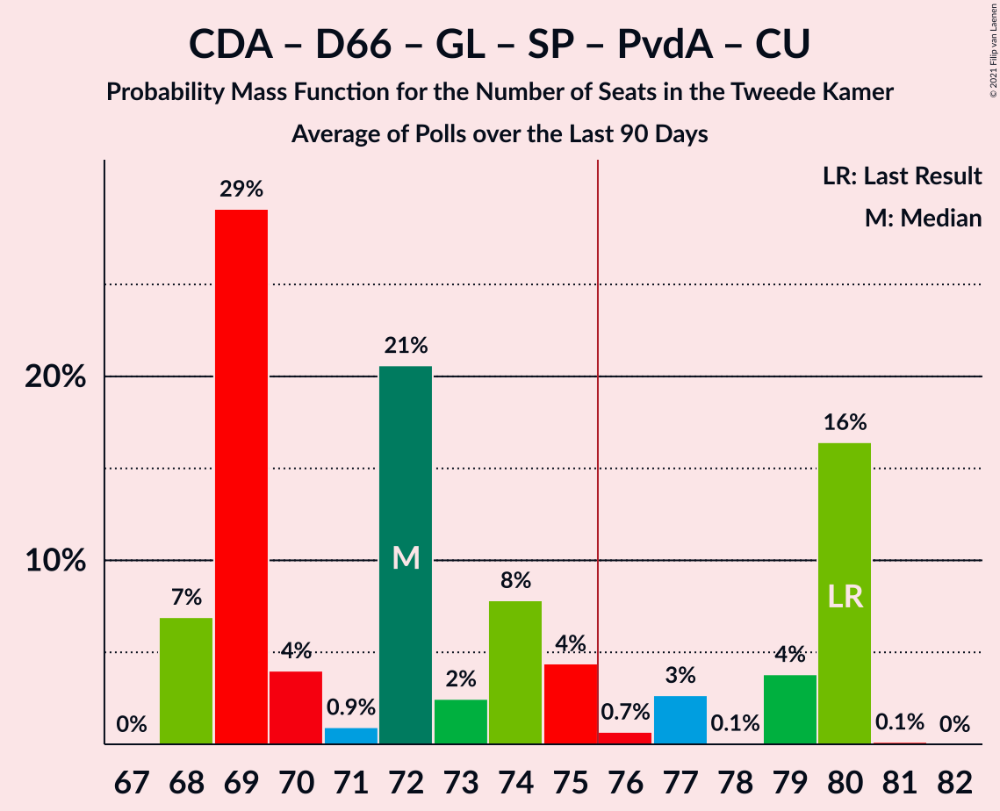

# Poll Average

<a href="#voting-intentions">Voting Intentions</a> | <a href="#seats">Seats</a> | <a href="#coalitions">Coalitions</a> | <a href="#technical-information">Technical Information</a>

## Summary

The table below lists the polls on which the average is based. They are the most recent polls (less than 90 days old) registered and analyzed so far.

| Period     | Polling firm/Commissioner(s) | VVD | PVV | CDA | D66 | GL | SP | PvdA | CU | PvdD | 50+ | SGP | DENK | FvD | PP | B1 | PvdT | JA21 | CO |
|:----------:|:----------------------------:|:--:|:--:|:--:|:--:|:--:|:--:|:--:|:--:|:--:|:--:|:--:|:--:|:--:|:--:|:--:|:--:|:--:|:--:|
| 15 March 2017 | General Election | 21.3%   33 | 13.1%   20 | 12.4%   19 | 12.2%   19 | 9.1%   14 | 9.1%   14 | 5.7%   9 | 3.4%   5 | 3.2%   5 | 3.1%   4 | 2.1%   3 | 2.1%   3 | 1.8%   2 | 0.3%   0 | 0.3%   0 | 0.0%   0 | 0.0%   0 | 0.0%   0 |
| N/A | Poll Average | 21–30%   32–45 | 12–18%   19–26 | 11–15%   17–22 | 7–10%   11–14 | 6–10%   9–16 | 5–8%   7–11 | 6–10%   10–15 | 3–6%   3–9 | 2–5%   3–9 | 0–2%   0–2 | 1–3%   2–4 | 0–2%   0–3 | 2–3%   3–5 | N/A   N/A | 0–1%   0–1 | N/A   N/A | 1–2%   1–4 | N/A   N/A |
| [8–11 January 2021](2021-01-11-IOResearch.html) | I&O Research | 27–31%   41–46 | 12–15%   17–22 | 11–13%   17–20 | 8–10%   10–14 | 8–10%   12–16 | 6–8%   9–11 | 6–8%   10–13 | 4–6%   6–8 | 2–3%   3–5 | 0–1%   0–2 | 2–3%   2–4 | 0–1%   0–1 | 2–3%   3–5 | N/A   N/A | N/A   N/A | N/A   N/A | 1–2%   1–2 | N/A   N/A |
| [10 January 2021](2021-01-10-Peilnl.html) | Peil.nl | 21–23%   32–35 | 15–18%   24–28 | 11–13%   17–20 | 8–10%   12–14 | 6–8%   10–13 | 5–7%   7–10 | 6–8%   10–12 | 5–6%   6–9 | 4–5%   5–9 | 0–1%   0–1 | 2–3%   3–4 | 2–3%   2–3 | 2–3%   3–5 | N/A   N/A | 0–1%   0–1 | N/A   N/A | 2–3%   2–4 | N/A   N/A |
| [18–21 December 2020](2020-12-21-KantarPublic.html) | Kantar Public | N/A   N/A | N/A   N/A | N/A   N/A | N/A   N/A | N/A   N/A | N/A   N/A | N/A   N/A | N/A   N/A | N/A   N/A | N/A   N/A | N/A   N/A | N/A   N/A | N/A   N/A | N/A   N/A | N/A   N/A | N/A   N/A | N/A   N/A | N/A   N/A |
| [18–21 December 2020](2020-12-21-Ipsos.html) | Ipsos   EenVandaag | 24–30%   37–45 | 12–17%   19–25 | 11–16%   18–23 | 7–10%   11–15 | 6–9%   8–13 | 5–8%   7–12 | 7–10%   10–15 | 3–5%   3–7 | 3–5%   4–8 | 1–2%   0–2 | 1–3%   1–4 | 1–2%   1–3 | 2–3%   2–4 | N/A   N/A | N/A   N/A | N/A   N/A | N/A   N/A | N/A   N/A |
| 15 March 2017 | General Election | 21.3%   33 | 13.1%   20 | 12.4%   19 | 12.2%   19 | 9.1%   14 | 9.1%   14 | 5.7%   9 | 3.4%   5 | 3.2%   5 | 3.1%   4 | 2.1%   3 | 2.1%   3 | 1.8%   2 | 0.3%   0 | 0.3%   0 | 0.0%   0 | 0.0%   0 | 0.0%   0 |

Only polls for which at least the sample size has been published are included in the table above.

**Legend:**
+ **Top half of each row:** Voting intentions (95% confidence interval)
+ **Bottom half of each row:** Seat projections for the Tweede Kamer (95% confidence interval)
+ **VVD:** Volkspartij voor Vrijheid en Democratie
+ **PVV:** Partij voor de Vrijheid
+ **CDA:** Christen-Democratisch Appèl
+ **D66:** Democraten 66
+ **GL:** GroenLinks
+ **SP:** Socialistische Partij
+ **PvdA:** Partij van de Arbeid
+ **CU:** ChristenUnie
+ **PvdD:** Partij voor de Dieren
+ **50+:** 50Plus
+ **SGP:** Staatkundig Gereformeerde Partij
+ **DENK:** DENK
+ **FvD:** Forum voor Democratie
+ **PP:** Piratenpartij
+ **B1:** Bij1
+ **PvdT:** Partij voor de Toekomst
+ **JA21:** Juiste Antwoord 2021
+ **CO:** Code Oranje
+ **N/A (single party):** Party not included the published results
+ **N/A (entire row):** Calculation for this opinion poll not started yet

## Voting Intentions

### Confidence Intervals

| Party | Last Result | Median | 80% Confidence Interval | 90% Confidence Interval | 95% Confidence Interval | 99% Confidence Interval |
|:-----:|:-----------:|:------:|:-----------------------:|:-----------------------:|:-----------------------:|:-----------------------:|
| <a href="#volkspartij-voor-vrijheid-en-democratie">Volkspartij voor Vrijheid en Democratie</a> | 21.3% | 26.8% | 21.6–29.3% |21.2–29.7% | 20.9–30.1% | 20.4–30.8% |
| <a href="#partij-voor-de-vrijheid">Partij voor de Vrijheid</a> | 13.1% | 14.6% | 12.9–17.0% |12.5–17.4% | 12.3–17.7% | 11.8–18.2% |
| <a href="#christen-democratisch-appèl">Christen-Democratisch Appèl</a> | 12.4% | 12.3% | 11.3–14.0% |11.1–14.6% | 10.9–15.0% | 10.5–15.9% |
| <a href="#democraten-66">Democraten 66</a> | 12.2% | 8.6% | 7.7–9.4% |7.4–9.7% | 7.1–9.9% | 6.6–10.4% |
| <a href="#groenlinks">GroenLinks</a> | 9.1% | 7.3% | 6.3–9.0% |6.1–9.3% | 5.9–9.5% | 5.5–10.0% |
| <a href="#socialistische-partij">Socialistische Partij</a> | 9.1% | 6.3% | 5.6–7.2% |5.4–7.5% | 5.2–7.7% | 4.9–8.3% |
| <a href="#partij-van-de-arbeid">Partij van de Arbeid</a> | 5.7% | 7.6% | 6.8–8.7% |6.6–9.2% | 6.4–9.5% | 6.1–10.2% |
| <a href="#christenunie">ChristenUnie</a> | 3.4% | 4.7% | 3.3–5.6% |3.0–5.8% | 2.8–6.0% | 2.5–6.3% |
| <a href="#partij-voor-de-dieren">Partij voor de Dieren</a> | 3.2% | 4.0% | 2.5–5.0% |2.4–5.2% | 2.2–5.4% | 2.0–5.7% |
| <a href="#50plus">50Plus</a> | 3.1% | 0.8% | 0.5–1.3% |0.5–1.5% | 0.4–1.6% | 0.4–2.0% |
| <a href="#staatkundig-gereformeerde-partij">Staatkundig Gereformeerde Partij</a> | 2.1% | 2.2% | 1.7–2.9% |1.5–3.0% | 1.4–3.2% | 1.2–3.4% |
| <a href="#denk">DENK</a> | 2.1% | 1.6% | 0.6–2.2% |0.5–2.4% | 0.5–2.5% | 0.4–2.7% |
| <a href="#forum-voor-democratie">Forum voor Democratie</a> | 1.8% | 2.6% | 2.1–3.1% |1.9–3.2% | 1.7–3.4% | 1.5–3.6% |
| <a href="#piratenpartij">Piratenpartij</a> | 0.3% | N/A | N/A |N/A | N/A | N/A |
| <a href="#bij1">Bij1</a> | 0.3% | 0.7% | 0.5–0.9% |0.5–1.0% | 0.4–1.0% | 0.4–1.2% |
| <a href="#partij-voor-de-toekomst">Partij voor de Toekomst</a> | 0.0% | N/A | N/A |N/A | N/A | N/A |
| <a href="#juiste-antwoord-2021">Juiste Antwoord 2021</a> | 0.0% | 1.7% | 1.2–2.2% |1.1–2.4% | 1.0–2.5% | 0.9–2.7% |
| <a href="#code-oranje">Code Oranje</a> | 0.0% | N/A | N/A |N/A | N/A | N/A |

### Volkspartij voor Vrijheid en Democratie

*For a full overview of the results for this party, see the [Volkspartij voor Vrijheid en Democratie](party-volkspartijvoorvrijheidendemocratie.html) page.*

| Voting Intentions | Probability | Accumulated | Special Marks |
|:-----------------:|:-----------:|:-----------:|:-------------:|
| 18.5–19.5% | 0% | 100% |  |
| 19.5–20.5% | 0.9% | 100% |  |
| 20.5–21.5% | 9% | 99.1% | Last Result |
| 21.5–22.5% | 16% | 91% |  |
| 22.5–23.5% | 7% | 74% |  |
| 23.5–24.5% | 2% | 67% |  |
| 24.5–25.5% | 4% | 65% |  |
| 25.5–26.5% | 8% | 61% |  |
| 26.5–27.5% | 13% | 53% | Median |
| 27.5–28.5% | 18% | 40% |  |
| 28.5–29.5% | 15% | 22% |  |
| 29.5–30.5% | 6% | 7% |  |
| 30.5–31.5% | 0.9% | 0.9% |  |
| 31.5–32.5% | 0.1% | 0.1% |  |
| 32.5–33.5% | 0% | 0% |  |

### Partij voor de Vrijheid

*For a full overview of the results for this party, see the [Partij voor de Vrijheid](party-partijvoordevrijheid.html) page.*

| Voting Intentions | Probability | Accumulated | Special Marks |
|:-----------------:|:-----------:|:-----------:|:-------------:|
| 9.5–10.5% | 0% | 100% |  |
| 10.5–11.5% | 0.2% | 100% |  |
| 11.5–12.5% | 5% | 99.8% |  |
| 12.5–13.5% | 22% | 95% | Last Result |
| 13.5–14.5% | 22% | 73% |  |
| 14.5–15.5% | 13% | 51% | Median |
| 15.5–16.5% | 18% | 38% |  |
| 16.5–17.5% | 16% | 20% |  |
| 17.5–18.5% | 3% | 3% |  |
| 18.5–19.5% | 0.1% | 0.1% |  |
| 19.5–20.5% | 0% | 0% |  |

### Christen-Democratisch Appèl

*For a full overview of the results for this party, see the [Christen-Democratisch Appèl](party-christen-democratischappèl.html) page.*

| Voting Intentions | Probability | Accumulated | Special Marks |
|:-----------------:|:-----------:|:-----------:|:-------------:|
| 8.5–9.5% | 0% | 100% |  |
| 9.5–10.5% | 0.6% | 100% |  |
| 10.5–11.5% | 16% | 99.4% |  |
| 11.5–12.5% | 43% | 83% | Last Result, Median |
| 12.5–13.5% | 24% | 40% |  |
| 13.5–14.5% | 11% | 16% |  |
| 14.5–15.5% | 4% | 5% |  |
| 15.5–16.5% | 0.9% | 1.0% |  |
| 16.5–17.5% | 0.1% | 0.1% |  |
| 17.5–18.5% | 0% | 0% |  |

### Democraten 66

*For a full overview of the results for this party, see the [Democraten 66](party-democraten66.html) page.*

| Voting Intentions | Probability | Accumulated | Special Marks |
|:-----------------:|:-----------:|:-----------:|:-------------:|
| 4.5–5.5% | 0% | 100% |  |
| 5.5–6.5% | 0.4% | 100% |  |
| 6.5–7.5% | 6% | 99.6% |  |
| 7.5–8.5% | 40% | 93% |  |
| 8.5–9.5% | 46% | 53% | Median |
| 9.5–10.5% | 7% | 7% |  |
| 10.5–11.5% | 0.3% | 0.3% |  |
| 11.5–12.5% | 0% | 0% | Last Result |

### GroenLinks

*For a full overview of the results for this party, see the [GroenLinks](party-groenlinks.html) page.*

| Voting Intentions | Probability | Accumulated | Special Marks |
|:-----------------:|:-----------:|:-----------:|:-------------:|
| 3.5–4.5% | 0% | 100% |  |
| 4.5–5.5% | 0.6% | 100% |  |
| 5.5–6.5% | 19% | 99.4% |  |
| 6.5–7.5% | 35% | 80% | Median |
| 7.5–8.5% | 24% | 45% |  |
| 8.5–9.5% | 19% | 21% | Last Result |
| 9.5–10.5% | 2% | 2% |  |
| 10.5–11.5% | 0% | 0% |  |
| 11.5–12.5% | 0% | 0% |  |

### Socialistische Partij

*For a full overview of the results for this party, see the [Socialistische Partij](party-socialistischepartij.html) page.*

| Voting Intentions | Probability | Accumulated | Special Marks |
|:-----------------:|:-----------:|:-----------:|:-------------:|
| 2.5–3.5% | 0% | 100% |  |
| 3.5–4.5% | 0.1% | 100% |  |
| 4.5–5.5% | 8% | 99.9% |  |
| 5.5–6.5% | 54% | 92% | Median |
| 6.5–7.5% | 33% | 38% |  |
| 7.5–8.5% | 4% | 4% |  |
| 8.5–9.5% | 0.2% | 0.2% | Last Result |
| 9.5–10.5% | 0% | 0% |  |

### Partij van de Arbeid

*For a full overview of the results for this party, see the [Partij van de Arbeid](party-partijvandearbeid.html) page.*

| Voting Intentions | Probability | Accumulated | Special Marks |
|:-----------------:|:-----------:|:-----------:|:-------------:|
| 4.5–5.5% | 0% | 100% |  |
| 5.5–6.5% | 4% | 100% | Last Result |
| 6.5–7.5% | 46% | 96% |  |
| 7.5–8.5% | 37% | 50% | Median |
| 8.5–9.5% | 11% | 13% |  |
| 9.5–10.5% | 2% | 2% |  |
| 10.5–11.5% | 0.2% | 0.2% |  |
| 11.5–12.5% | 0% | 0% |  |

### ChristenUnie

*For a full overview of the results for this party, see the [ChristenUnie](party-christenunie.html) page.*

| Voting Intentions | Probability | Accumulated | Special Marks |
|:-----------------:|:-----------:|:-----------:|:-------------:|
| 0.5–1.5% | 0% | 100% |  |
| 1.5–2.5% | 0.7% | 100% |  |
| 2.5–3.5% | 15% | 99.3% | Last Result |
| 3.5–4.5% | 29% | 84% |  |
| 4.5–5.5% | 44% | 55% | Median |
| 5.5–6.5% | 12% | 12% |  |
| 6.5–7.5% | 0.1% | 0.1% |  |
| 7.5–8.5% | 0% | 0% |  |

### Partij voor de Dieren

*For a full overview of the results for this party, see the [Partij voor de Dieren](party-partijvoordedieren.html) page.*

| Voting Intentions | Probability | Accumulated | Special Marks |
|:-----------------:|:-----------:|:-----------:|:-------------:|
| 0.5–1.5% | 0% | 100% |  |
| 1.5–2.5% | 11% | 100% |  |
| 2.5–3.5% | 28% | 89% | Last Result |
| 3.5–4.5% | 32% | 61% | Median |
| 4.5–5.5% | 27% | 28% |  |
| 5.5–6.5% | 1.0% | 1.0% |  |
| 6.5–7.5% | 0% | 0% |  |

### 50Plus

*For a full overview of the results for this party, see the [50Plus](party-50plus.html) page.*

| Voting Intentions | Probability | Accumulated | Special Marks |
|:-----------------:|:-----------:|:-----------:|:-------------:|
| 0.0–0.5% | 11% | 100% |  |
| 0.5–1.5% | 86% | 89% | Median |
| 1.5–2.5% | 4% | 4% |  |
| 2.5–3.5% | 0% | 0% | Last Result |

### Staatkundig Gereformeerde Partij

*For a full overview of the results for this party, see the [Staatkundig Gereformeerde Partij](party-staatkundiggereformeerdepartij.html) page.*

| Voting Intentions | Probability | Accumulated | Special Marks |
|:-----------------:|:-----------:|:-----------:|:-------------:|
| 0.0–0.5% | 0% | 100% |  |
| 0.5–1.5% | 6% | 100% |  |
| 1.5–2.5% | 66% | 94% | Last Result, Median |
| 2.5–3.5% | 28% | 28% |  |
| 3.5–4.5% | 0.2% | 0.2% |  |
| 4.5–5.5% | 0% | 0% |  |

### DENK

*For a full overview of the results for this party, see the [DENK](party-denk.html) page.*

| Voting Intentions | Probability | Accumulated | Special Marks |
|:-----------------:|:-----------:|:-----------:|:-------------:|
| 0.0–0.5% | 5% | 100% |  |
| 0.5–1.5% | 45% | 95% |  |
| 1.5–2.5% | 49% | 50% | Last Result, Median |
| 2.5–3.5% | 2% | 2% |  |
| 3.5–4.5% | 0% | 0% |  |

### Forum voor Democratie

*For a full overview of the results for this party, see the [Forum voor Democratie](party-forumvoordemocratie.html) page.*

| Voting Intentions | Probability | Accumulated | Special Marks |
|:-----------------:|:-----------:|:-----------:|:-------------:|
| 0.0–0.5% | 0% | 100% |  |
| 0.5–1.5% | 0.9% | 100% |  |
| 1.5–2.5% | 43% | 99.1% | Last Result |
| 2.5–3.5% | 55% | 56% | Median |
| 3.5–4.5% | 0.8% | 0.8% |  |
| 4.5–5.5% | 0% | 0% |  |

### Bij1

*For a full overview of the results for this party, see the [Bij1](party-bij1.html) page.*

| Voting Intentions | Probability | Accumulated | Special Marks |
|:-----------------:|:-----------:|:-----------:|:-------------:|
| 0.0–0.5% | 16% | 100% | Last Result |
| 0.5–1.5% | 84% | 84% | Median |
| 1.5–2.5% | 0% | 0% |  |

### Juiste Antwoord 2021

*For a full overview of the results for this party, see the [Juiste Antwoord 2021](party-juisteantwoord2021.html) page.*

| Voting Intentions | Probability | Accumulated | Special Marks |
|:-----------------:|:-----------:|:-----------:|:-------------:|
| 0.0–0.5% | 0% | 100% | Last Result |
| 0.5–1.5% | 41% | 100% |  |
| 1.5–2.5% | 58% | 59% | Median |
| 2.5–3.5% | 1.5% | 1.5% |  |
| 3.5–4.5% | 0% | 0% |  |

## Seats

### Confidence Intervals

| Party | Last Result | Median | 80% Confidence Interval | 90% Confidence Interval | 95% Confidence Interval | 99% Confidence Interval |
|:-----:|:-----------:|:------:|:-----------------------:|:-----------------------:|:-----------------------:|:-----------------------:|
| <a href="#volkspartij-voor-vrijheid-en-democratie">Volkspartij voor Vrijheid en Democratie</a> | 33 | 41 | 32–45 |32–45 | 32–45 | 32–47 |
| <a href="#partij-voor-de-vrijheid">Partij voor de Vrijheid</a> | 20 | 22 | 19–26 |19–26 | 19–26 | 17–28 |
| <a href="#christen-democratisch-appèl">Christen-Democratisch Appèl</a> | 19 | 18 | 17–20 |17–21 | 17–22 | 16–24 |
| <a href="#democraten-66">Democraten 66</a> | 19 | 13 | 12–14 |12–14 | 11–14 | 10–15 |
| <a href="#groenlinks">GroenLinks</a> | 14 | 12 | 10–15 |9–15 | 9–16 | 8–16 |
| <a href="#socialistische-partij">Socialistische Partij</a> | 14 | 10 | 8–10 |7–10 | 7–11 | 7–12 |
| <a href="#partij-van-de-arbeid">Partij van de Arbeid</a> | 9 | 12 | 10–13 |10–14 | 10–15 | 9–15 |
| <a href="#christenunie">ChristenUnie</a> | 5 | 6 | 4–9 |4–9 | 3–9 | 3–9 |
| <a href="#partij-voor-de-dieren">Partij voor de Dieren</a> | 5 | 6 | 4–8 |4–9 | 3–9 | 3–9 |
| <a href="#50plus">50Plus</a> | 4 | 1 | 0–2 |0–2 | 0–2 | 0–2 |
| <a href="#staatkundig-gereformeerde-partij">Staatkundig Gereformeerde Partij</a> | 3 | 3 | 2–4 |2–4 | 2–4 | 1–4 |
| <a href="#denk">DENK</a> | 3 | 2 | 1–3 |0–3 | 0–3 | 0–3 |
| <a href="#forum-voor-democratie">Forum voor Democratie</a> | 2 | 3 | 3–5 |3–5 | 3–5 | 2–5 |
| <a href="#piratenpartij">Piratenpartij</a> | 0 | N/A | N/A |N/A | N/A | N/A |
| <a href="#bij1">Bij1</a> | 0 | 1 | 0–1 |0–1 | 0–1 | 0–1 |
| <a href="#partij-voor-de-toekomst">Partij voor de Toekomst</a> | 0 | N/A | N/A |N/A | N/A | N/A |
| <a href="#juiste-antwoord-2021">Juiste Antwoord 2021</a> | 0 | 2 | 1–3 |1–3 | 1–4 | 1–5 |
| <a href="#code-oranje">Code Oranje</a> | 0 | N/A | N/A |N/A | N/A | N/A |

### Volkspartij voor Vrijheid en Democratie

*For a full overview of the results for this party, see the [Volkspartij voor Vrijheid en Democratie](party-volkspartijvoorvrijheidendemocratie.html) page.*

| Number of Seats | Probability | Accumulated | Special Marks |
|:---------------:|:-----------:|:-----------:|:-------------:|
| 30 | 0.1% | 100% |  |
| 31 | 0.2% | 99.9% |  |
| 32 | 14% | 99.7% |  |
| 33 | 2% | 86% | Last Result |
| 34 | 9% | 84% |  |
| 35 | 8% | 75% |  |
| 36 | 0.3% | 67% |  |
| 37 | 0.9% | 66% |  |
| 38 | 4% | 66% |  |
| 39 | 2% | 62% |  |
| 40 | 2% | 60% |  |
| 41 | 21% | 58% | Median |
| 42 | 10% | 37% |  |
| 43 | 13% | 27% |  |
| 44 | 1.0% | 14% |  |
| 45 | 12% | 13% |  |
| 46 | 0.6% | 1.2% |  |
| 47 | 0.4% | 0.6% |  |
| 48 | 0.1% | 0.1% |  |
| 49 | 0% | 0% |  |

### Partij voor de Vrijheid

*For a full overview of the results for this party, see the [Partij voor de Vrijheid](party-partijvoordevrijheid.html) page.*

| Number of Seats | Probability | Accumulated | Special Marks |
|:---------------:|:-----------:|:-----------:|:-------------:|
| 17 | 1.0% | 100% |  |
| 18 | 1.0% | 99.0% |  |
| 19 | 20% | 98% |  |
| 20 | 7% | 78% | Last Result |
| 21 | 13% | 71% |  |
| 22 | 19% | 59% | Median |
| 23 | 4% | 39% |  |
| 24 | 2% | 35% |  |
| 25 | 20% | 34% |  |
| 26 | 12% | 14% |  |
| 27 | 0.7% | 2% |  |
| 28 | 2% | 2% |  |
| 29 | 0% | 0.1% |  |
| 30 | 0% | 0% |  |

### Christen-Democratisch Appèl

*For a full overview of the results for this party, see the [Christen-Democratisch Appèl](party-christen-democratischappèl.html) page.*

| Number of Seats | Probability | Accumulated | Special Marks |
|:---------------:|:-----------:|:-----------:|:-------------:|
| 15 | 0.2% | 100% |  |
| 16 | 0.7% | 99.8% |  |
| 17 | 14% | 99.1% |  |
| 18 | 48% | 85% | Median |
| 19 | 14% | 37% | Last Result |
| 20 | 13% | 23% |  |
| 21 | 6% | 10% |  |
| 22 | 2% | 4% |  |
| 23 | 2% | 2% |  |
| 24 | 0.5% | 0.7% |  |
| 25 | 0.2% | 0.2% |  |
| 26 | 0% | 0% |  |

### Democraten 66

*For a full overview of the results for this party, see the [Democraten 66](party-democraten66.html) page.*

| Number of Seats | Probability | Accumulated | Special Marks |
|:---------------:|:-----------:|:-----------:|:-------------:|
| 9 | 0.3% | 100% |  |
| 10 | 2% | 99.7% |  |
| 11 | 3% | 98% |  |
| 12 | 20% | 96% |  |
| 13 | 27% | 76% | Median |
| 14 | 47% | 49% |  |
| 15 | 2% | 2% |  |
| 16 | 0.2% | 0.3% |  |
| 17 | 0.1% | 0.1% |  |
| 18 | 0% | 0% |  |
| 19 | 0% | 0% | Last Result |

### GroenLinks

*For a full overview of the results for this party, see the [GroenLinks](party-groenlinks.html) page.*

| Number of Seats | Probability | Accumulated | Special Marks |
|:---------------:|:-----------:|:-----------:|:-------------:|
| 7 | 0.1% | 100% |  |
| 8 | 1.2% | 99.9% |  |
| 9 | 4% | 98.8% |  |
| 10 | 17% | 95% |  |
| 11 | 14% | 78% |  |
| 12 | 19% | 64% | Median |
| 13 | 19% | 45% |  |
| 14 | 2% | 26% | Last Result |
| 15 | 20% | 25% |  |
| 16 | 4% | 4% |  |
| 17 | 0% | 0% |  |

### Socialistische Partij

*For a full overview of the results for this party, see the [Socialistische Partij](party-socialistischepartij.html) page.*

| Number of Seats | Probability | Accumulated | Special Marks |
|:---------------:|:-----------:|:-----------:|:-------------:|
| 6 | 0.1% | 100% |  |
| 7 | 5% | 99.9% |  |
| 8 | 19% | 95% |  |
| 9 | 20% | 76% |  |
| 10 | 51% | 55% | Median |
| 11 | 2% | 4% |  |
| 12 | 1.3% | 2% |  |
| 13 | 0.3% | 0.4% |  |
| 14 | 0% | 0% | Last Result |

### Partij van de Arbeid

*For a full overview of the results for this party, see the [Partij van de Arbeid](party-partijvandearbeid.html) page.*

| Number of Seats | Probability | Accumulated | Special Marks |
|:---------------:|:-----------:|:-----------:|:-------------:|
| 8 | 0.1% | 100% |  |
| 9 | 1.1% | 99.9% | Last Result |
| 10 | 19% | 98.9% |  |
| 11 | 17% | 79% |  |
| 12 | 30% | 63% | Median |
| 13 | 24% | 33% |  |
| 14 | 5% | 10% |  |
| 15 | 5% | 5% |  |
| 16 | 0.3% | 0.3% |  |
| 17 | 0% | 0% |  |

### ChristenUnie

*For a full overview of the results for this party, see the [ChristenUnie](party-christenunie.html) page.*

| Number of Seats | Probability | Accumulated | Special Marks |
|:---------------:|:-----------:|:-----------:|:-------------:|
| 3 | 4% | 100% |  |
| 4 | 12% | 96% |  |
| 5 | 10% | 85% | Last Result |
| 6 | 43% | 75% | Median |
| 7 | 8% | 32% |  |
| 8 | 14% | 24% |  |
| 9 | 10% | 10% |  |
| 10 | 0.1% | 0.1% |  |
| 11 | 0% | 0% |  |

### Partij voor de Dieren

*For a full overview of the results for this party, see the [Partij voor de Dieren](party-partijvoordedieren.html) page.*

| Number of Seats | Probability | Accumulated | Special Marks |
|:---------------:|:-----------:|:-----------:|:-------------:|
| 2 | 0.3% | 100% |  |
| 3 | 3% | 99.7% |  |
| 4 | 12% | 97% |  |
| 5 | 31% | 85% | Last Result |
| 6 | 16% | 54% | Median |
| 7 | 14% | 38% |  |
| 8 | 17% | 24% |  |
| 9 | 6% | 6% |  |
| 10 | 0% | 0% |  |

### 50Plus

*For a full overview of the results for this party, see the [50Plus](party-50plus.html) page.*

| Number of Seats | Probability | Accumulated | Special Marks |
|:---------------:|:-----------:|:-----------:|:-------------:|
| 0 | 46% | 100% |  |
| 1 | 39% | 54% | Median |
| 2 | 14% | 15% |  |
| 3 | 0.5% | 0.5% |  |
| 4 | 0% | 0% | Last Result |

### Staatkundig Gereformeerde Partij

*For a full overview of the results for this party, see the [Staatkundig Gereformeerde Partij](party-staatkundiggereformeerdepartij.html) page.*

| Number of Seats | Probability | Accumulated | Special Marks |
|:---------------:|:-----------:|:-----------:|:-------------:|
| 1 | 0.9% | 100% |  |
| 2 | 22% | 99.1% |  |
| 3 | 64% | 77% | Last Result, Median |
| 4 | 12% | 13% |  |
| 5 | 0.3% | 0.3% |  |
| 6 | 0% | 0% |  |

### DENK

*For a full overview of the results for this party, see the [DENK](party-denk.html) page.*

| Number of Seats | Probability | Accumulated | Special Marks |
|:---------------:|:-----------:|:-----------:|:-------------:|
| 0 | 6% | 100% |  |
| 1 | 37% | 94% |  |
| 2 | 34% | 57% | Median |
| 3 | 22% | 23% | Last Result |
| 4 | 0.4% | 0.5% |  |
| 5 | 0% | 0% |  |

### Forum voor Democratie

*For a full overview of the results for this party, see the [Forum voor Democratie](party-forumvoordemocratie.html) page.*

| Number of Seats | Probability | Accumulated | Special Marks |
|:---------------:|:-----------:|:-----------:|:-------------:|
| 1 | 0.2% | 100% |  |
| 2 | 1.4% | 99.8% | Last Result |
| 3 | 51% | 98% | Median |
| 4 | 33% | 47% |  |
| 5 | 14% | 14% |  |
| 6 | 0.1% | 0.1% |  |
| 7 | 0% | 0% |  |

### Piratenpartij

*For a full overview of the results for this party, see the [Piratenpartij](party-piratenpartij.html) page.*

### Bij1

*For a full overview of the results for this party, see the [Bij1](party-bij1.html) page.*

| Number of Seats | Probability | Accumulated | Special Marks |
|:---------------:|:-----------:|:-----------:|:-------------:|
| 0 | 31% | 100% | Last Result |
| 1 | 69% | 69% | Median |
| 2 | 0.3% | 0.3% |  |
| 3 | 0% | 0% |  |

### Partij voor de Toekomst

*For a full overview of the results for this party, see the [Partij voor de Toekomst](party-partijvoordetoekomst.html) page.*

### Juiste Antwoord 2021

*For a full overview of the results for this party, see the [Juiste Antwoord 2021](party-juisteantwoord2021.html) page.*

| Number of Seats | Probability | Accumulated | Special Marks |
|:---------------:|:-----------:|:-----------:|:-------------:|
| 0 | 0% | 100% | Last Result |
| 1 | 37% | 100% |  |
| 2 | 28% | 63% | Median |
| 3 | 30% | 35% |  |
| 4 | 4% | 5% |  |
| 5 | 0.5% | 0.5% |  |
| 6 | 0% | 0% |  |

### Code Oranje

*For a full overview of the results for this party, see the [Code Oranje](party-codeoranje.html) page.*

## Coalitions

### Confidence Intervals

| Coalition | Last Result | Median | Majority? | 80% Confidence Interval | 90% Confidence Interval | 95% Confidence Interval | 99% Confidence Interval |
|:---------:|:-----------:|:------:|:---------:|:-----------------------:|:-----------------------:|:-----------------------:|:-----------------------:|
| Volkspartij voor Vrijheid en Democratie – Christen-Democratisch Appèl – Democraten 66 – GroenLinks – ChristenUnie | 90 | 92 | 100% | 83–94 | 82–94 | 82–96 | 81–98 |
| Volkspartij voor Vrijheid en Democratie – Christen-Democratisch Appèl – Democraten 66 – Partij van de Arbeid – ChristenUnie | 85 | 91 | 100% | 81–93 | 81–94 | 81–95 | 81–98 |
| Volkspartij voor Vrijheid en Democratie – Partij voor de Vrijheid – Christen-Democratisch Appèl – Staatkundig Gereformeerde Partij – Forum voor Democratie | 77 | 86 | 100% | 83–90 | 83–91 | 83–91 | 83–94 |
| Volkspartij voor Vrijheid en Democratie – Partij voor de Vrijheid – Christen-Democratisch Appèl – Forum voor Democratie | 74 | 82 | 100% | 80–88 | 80–88 | 80–89 | 80–92 |
| Volkspartij voor Vrijheid en Democratie – Partij voor de Vrijheid – Christen-Democratisch Appèl | 72 | 78 | 99.4% | 77–85 | 77–85 | 77–86 | 75–88 |
| Volkspartij voor Vrijheid en Democratie – Christen-Democratisch Appèl – Democraten 66 – ChristenUnie | 76 | 78 | 66% | 71–81 | 71–82 | 71–84 | 71–87 |
| Volkspartij voor Vrijheid en Democratie – Christen-Democratisch Appèl – Democraten 66 | 71 | 73 | 19% | 65–76 | 64–76 | 64–78 | 63–80 |
| Volkspartij voor Vrijheid en Democratie – Christen-Democratisch Appèl – Partij van de Arbeid | 61 | 72 | 7% | 61–75 | 61–77 | 61–78 | 61–78 |
| Christen-Democratisch Appèl – Democraten 66 – GroenLinks – Socialistische Partij – Partij van de Arbeid – ChristenUnie | 80 | 71 | 21% | 68–76 | 68–76 | 67–76 | 65–76 |
| Volkspartij voor Vrijheid en Democratie – Christen-Democratisch Appèl – 50Plus – Staatkundig Gereformeerde Partij – Forum voor Democratie | 61 | 66 | 0.1% | 57–71 | 57–71 | 57–72 | 57–74 |
| Volkspartij voor Vrijheid en Democratie – Christen-Democratisch Appèl – Staatkundig Gereformeerde Partij – Forum voor Democratie | 57 | 66 | 0% | 57–69 | 57–69 | 57–71 | 57–73 |
| Volkspartij voor Vrijheid en Democratie – Democraten 66 – Partij van de Arbeid | 61 | 67 | 0% | 56–69 | 56–69 | 54–70 | 54–72 |
| Volkspartij voor Vrijheid en Democratie – Christen-Democratisch Appèl – 50Plus – Forum voor Democratie | 58 | 63 | 0% | 54–68 | 54–68 | 54–69 | 54–71 |
| Volkspartij voor Vrijheid en Democratie – Christen-Democratisch Appèl – Forum voor Democratie | 54 | 63 | 0% | 54–66 | 54–66 | 54–68 | 54–70 |
| Christen-Democratisch Appèl – Democraten 66 – GroenLinks – Partij van de Arbeid – ChristenUnie | 66 | 62 | 0% | 59–66 | 59–66 | 58–66 | 57–67 |
| Volkspartij voor Vrijheid en Democratie – Christen-Democratisch Appèl | 52 | 59 | 0% | 51–63 | 51–63 | 51–65 | 50–67 |
| Volkspartij voor Vrijheid en Democratie – Partij van de Arbeid | 42 | 54 | 0% | 42–56 | 42–57 | 42–57 | 42–58 |
| Christen-Democratisch Appèl – Democraten 66 – Partij van de Arbeid | 47 | 43 | 0% | 42–47 | 41–48 | 41–48 | 39–51 |
| Christen-Democratisch Appèl – Partij van de Arbeid – ChristenUnie | 33 | 37 | 0% | 34–39 | 33–39 | 33–41 | 33–43 |
| Christen-Democratisch Appèl – Democraten 66 | 38 | 32 | 0% | 30–33 | 29–35 | 29–36 | 28–37 |
| Christen-Democratisch Appèl – Partij van de Arbeid | 28 | 30 | 0% | 29–34 | 28–36 | 28–36 | 27–38 |

### Volkspartij voor Vrijheid en Democratie – Christen-Democratisch Appèl – Democraten 66 – GroenLinks – ChristenUnie

| Number of Seats | Probability | Accumulated | Special Marks |
|:---------------:|:-----------:|:-----------:|:-------------:|
| 80 | 0.4% | 100% |  |
| 81 | 0.3% | 99.6% |  |
| 82 | 6% | 99.3% |  |
| 83 | 14% | 93% |  |
| 84 | 0.3% | 79% |  |
| 85 | 5% | 79% |  |
| 86 | 8% | 73% |  |
| 87 | 1.5% | 65% |  |
| 88 | 2% | 63% |  |
| 89 | 6% | 61% |  |
| 90 | 1.0% | 55% | Last Result, Median |
| 91 | 1.0% | 54% |  |
| 92 | 10% | 53% |  |
| 93 | 13% | 43% |  |
| 94 | 25% | 30% |  |
| 95 | 1.4% | 5% |  |
| 96 | 3% | 3% |  |
| 97 | 0.2% | 0.8% |  |
| 98 | 0.3% | 0.5% |  |
| 99 | 0% | 0.2% |  |
| 100 | 0.1% | 0.2% |  |
| 101 | 0.1% | 0.1% |  |
| 102 | 0% | 0% |  |

### Volkspartij voor Vrijheid en Democratie – Christen-Democratisch Appèl – Democraten 66 – Partij van de Arbeid – ChristenUnie

| Number of Seats | Probability | Accumulated | Special Marks |
|:---------------:|:-----------:|:-----------:|:-------------:|
| 81 | 11% | 100% |  |
| 82 | 3% | 89% |  |
| 83 | 0.5% | 86% |  |
| 84 | 6% | 85% |  |
| 85 | 3% | 79% | Last Result |
| 86 | 2% | 76% |  |
| 87 | 8% | 74% |  |
| 88 | 0.7% | 66% |  |
| 89 | 0.6% | 66% |  |
| 90 | 10% | 65% | Median |
| 91 | 18% | 55% |  |
| 92 | 20% | 36% |  |
| 93 | 10% | 16% |  |
| 94 | 2% | 6% |  |
| 95 | 2% | 4% |  |
| 96 | 0.5% | 2% |  |
| 97 | 0.6% | 2% |  |
| 98 | 1.3% | 1.3% |  |
| 99 | 0% | 0% |  |

### Volkspartij voor Vrijheid en Democratie – Partij voor de Vrijheid – Christen-Democratisch Appèl – Staatkundig Gereformeerde Partij – Forum voor Democratie

| Number of Seats | Probability | Accumulated | Special Marks |
|:---------------:|:-----------:|:-----------:|:-------------:|
| 77 | 0% | 100% | Last Result |
| 78 | 0% | 100% |  |
| 79 | 0% | 100% |  |
| 80 | 0% | 100% |  |
| 81 | 0.1% | 100% |  |
| 82 | 0.1% | 99.9% |  |
| 83 | 19% | 99.8% |  |
| 84 | 3% | 81% |  |
| 85 | 23% | 77% |  |
| 86 | 14% | 55% |  |
| 87 | 1.2% | 40% | Median |
| 88 | 6% | 39% |  |
| 89 | 16% | 33% |  |
| 90 | 9% | 17% |  |
| 91 | 6% | 8% |  |
| 92 | 0.2% | 2% |  |
| 93 | 0.9% | 2% |  |
| 94 | 0.8% | 1.1% |  |
| 95 | 0.1% | 0.3% |  |
| 96 | 0.2% | 0.2% |  |
| 97 | 0% | 0% |  |

### Volkspartij voor Vrijheid en Democratie – Partij voor de Vrijheid – Christen-Democratisch Appèl – Forum voor Democratie

| Number of Seats | Probability | Accumulated | Special Marks |
|:---------------:|:-----------:|:-----------:|:-------------:|
| 74 | 0% | 100% | Last Result |
| 75 | 0% | 100% |  |
| 76 | 0% | 100% | Majority |
| 77 | 0% | 100% |  |
| 78 | 0.1% | 100% |  |
| 79 | 0.2% | 99.8% |  |
| 80 | 19% | 99.6% |  |
| 81 | 3% | 81% |  |
| 82 | 32% | 77% |  |
| 83 | 1.3% | 45% |  |
| 84 | 4% | 44% | Median |
| 85 | 5% | 39% |  |
| 86 | 9% | 34% |  |
| 87 | 12% | 25% |  |
| 88 | 9% | 14% |  |
| 89 | 2% | 4% |  |
| 90 | 0.7% | 2% |  |
| 91 | 0.7% | 1.3% |  |
| 92 | 0.3% | 0.6% |  |
| 93 | 0.2% | 0.3% |  |
| 94 | 0% | 0.1% |  |
| 95 | 0% | 0% |  |

### Volkspartij voor Vrijheid en Democratie – Partij voor de Vrijheid – Christen-Democratisch Appèl

| Number of Seats | Probability | Accumulated | Special Marks |
|:---------------:|:-----------:|:-----------:|:-------------:|
| 72 | 0% | 100% | Last Result |
| 73 | 0% | 100% |  |
| 74 | 0.1% | 100% |  |
| 75 | 0.4% | 99.9% |  |
| 76 | 0.1% | 99.4% | Majority |
| 77 | 30% | 99.3% |  |
| 78 | 21% | 69% |  |
| 79 | 3% | 48% |  |
| 80 | 3% | 45% |  |
| 81 | 8% | 43% | Median |
| 82 | 2% | 35% |  |
| 83 | 13% | 33% |  |
| 84 | 11% | 21% |  |
| 85 | 7% | 10% |  |
| 86 | 2% | 3% |  |
| 87 | 1.0% | 2% |  |
| 88 | 0.4% | 0.7% |  |
| 89 | 0.1% | 0.2% |  |
| 90 | 0.1% | 0.1% |  |
| 91 | 0% | 0% |  |

### Volkspartij voor Vrijheid en Democratie – Christen-Democratisch Appèl – Democraten 66 – ChristenUnie

| Number of Seats | Probability | Accumulated | Special Marks |
|:---------------:|:-----------:|:-----------:|:-------------:|
| 69 | 0% | 100% |  |
| 70 | 0.1% | 99.9% |  |
| 71 | 12% | 99.8% |  |
| 72 | 9% | 88% |  |
| 73 | 3% | 80% |  |
| 74 | 2% | 76% |  |
| 75 | 8% | 74% |  |
| 76 | 5% | 66% | Last Result, Majority |
| 77 | 1.0% | 61% |  |
| 78 | 11% | 60% | Median |
| 79 | 23% | 50% |  |
| 80 | 11% | 27% |  |
| 81 | 6% | 16% |  |
| 82 | 6% | 10% |  |
| 83 | 1.3% | 4% |  |
| 84 | 0.8% | 3% |  |
| 85 | 0.4% | 2% |  |
| 86 | 0.4% | 2% |  |
| 87 | 0.9% | 1.1% |  |
| 88 | 0.1% | 0.2% |  |
| 89 | 0% | 0% |  |

### Volkspartij voor Vrijheid en Democratie – Christen-Democratisch Appèl – Democraten 66

| Number of Seats | Probability | Accumulated | Special Marks |
|:---------------:|:-----------:|:-----------:|:-------------:|
| 61 | 0% | 100% |  |
| 62 | 0.3% | 99.9% |  |
| 63 | 0.4% | 99.6% |  |
| 64 | 9% | 99.3% |  |
| 65 | 16% | 91% |  |
| 66 | 8% | 75% |  |
| 67 | 0.3% | 67% |  |
| 68 | 0.2% | 67% |  |
| 69 | 0.8% | 67% |  |
| 70 | 0.5% | 66% |  |
| 71 | 8% | 65% | Last Result |
| 72 | 3% | 57% | Median |
| 73 | 22% | 55% |  |
| 74 | 4% | 32% |  |
| 75 | 9% | 28% |  |
| 76 | 15% | 19% | Majority |
| 77 | 1.3% | 4% |  |
| 78 | 0.7% | 3% |  |
| 79 | 0.5% | 2% |  |
| 80 | 1.3% | 1.5% |  |
| 81 | 0% | 0.2% |  |
| 82 | 0.2% | 0.2% |  |
| 83 | 0% | 0% |  |

### Volkspartij voor Vrijheid en Democratie – Christen-Democratisch Appèl – Partij van de Arbeid

| Number of Seats | Probability | Accumulated | Special Marks |
|:---------------:|:-----------:|:-----------:|:-------------:|
| 59 | 0% | 100% |  |
| 60 | 0.1% | 99.9% |  |
| 61 | 11% | 99.9% | Last Result |
| 62 | 3% | 88% |  |
| 63 | 2% | 85% |  |
| 64 | 16% | 83% |  |
| 65 | 0.2% | 67% |  |
| 66 | 0.1% | 67% |  |
| 67 | 0.4% | 67% |  |
| 68 | 0.2% | 67% |  |
| 69 | 0.4% | 66% |  |
| 70 | 0.7% | 66% |  |
| 71 | 10% | 65% | Median |
| 72 | 22% | 55% |  |
| 73 | 6% | 33% |  |
| 74 | 15% | 27% |  |
| 75 | 4% | 12% |  |
| 76 | 2% | 7% | Majority |
| 77 | 2% | 5% |  |
| 78 | 3% | 4% |  |
| 79 | 0.3% | 0.3% |  |
| 80 | 0% | 0% |  |

### Christen-Democratisch Appèl – Democraten 66 – GroenLinks – Socialistische Partij – Partij van de Arbeid – ChristenUnie

| Number of Seats | Probability | Accumulated | Special Marks |
|:---------------:|:-----------:|:-----------:|:-------------:|
| 64 | 0.1% | 100% |  |
| 65 | 0.5% | 99.9% |  |
| 66 | 0.6% | 99.4% |  |
| 67 | 1.4% | 98.8% |  |
| 68 | 10% | 97% |  |
| 69 | 19% | 88% |  |
| 70 | 1.3% | 69% |  |
| 71 | 26% | 67% | Median |
| 72 | 8% | 42% |  |
| 73 | 9% | 33% |  |
| 74 | 2% | 24% |  |
| 75 | 1.5% | 22% |  |
| 76 | 20% | 21% | Majority |
| 77 | 0.4% | 0.4% |  |
| 78 | 0% | 0% |  |
| 79 | 0% | 0% |  |
| 80 | 0% | 0% | Last Result |

### Volkspartij voor Vrijheid en Democratie – Christen-Democratisch Appèl – 50Plus – Staatkundig Gereformeerde Partij – Forum voor Democratie

| Number of Seats | Probability | Accumulated | Special Marks |
|:---------------:|:-----------:|:-----------:|:-------------:|
| 57 | 11% | 100% |  |
| 58 | 2% | 89% |  |
| 59 | 10% | 87% |  |
| 60 | 0.4% | 77% |  |
| 61 | 6% | 76% | Last Result |
| 62 | 3% | 70% |  |
| 63 | 0.5% | 67% |  |
| 64 | 0.8% | 66% |  |
| 65 | 3% | 65% |  |
| 66 | 24% | 63% | Median |
| 67 | 3% | 38% |  |
| 68 | 4% | 36% |  |
| 69 | 18% | 32% |  |
| 70 | 2% | 13% |  |
| 71 | 8% | 11% |  |
| 72 | 1.3% | 3% |  |
| 73 | 0.7% | 1.3% |  |
| 74 | 0.3% | 0.5% |  |
| 75 | 0.2% | 0.2% |  |
| 76 | 0% | 0.1% | Majority |
| 77 | 0% | 0% |  |

### Volkspartij voor Vrijheid en Democratie – Christen-Democratisch Appèl – Staatkundig Gereformeerde Partij – Forum voor Democratie

| Number of Seats | Probability | Accumulated | Special Marks |
|:---------------:|:-----------:|:-----------:|:-------------:|
| 56 | 0.1% | 100% |  |
| 57 | 13% | 99.9% | Last Result |
| 58 | 8% | 87% |  |
| 59 | 3% | 79% |  |
| 60 | 0.3% | 76% |  |
| 61 | 9% | 76% |  |
| 62 | 0.3% | 67% |  |
| 63 | 3% | 67% |  |
| 64 | 0.4% | 63% |  |
| 65 | 2% | 63% | Median |
| 66 | 25% | 60% |  |
| 67 | 5% | 35% |  |
| 68 | 19% | 31% |  |
| 69 | 7% | 12% |  |
| 70 | 2% | 4% |  |
| 71 | 0.9% | 3% |  |
| 72 | 1.0% | 2% |  |
| 73 | 0.3% | 0.6% |  |
| 74 | 0.2% | 0.2% |  |
| 75 | 0% | 0% |  |

### Volkspartij voor Vrijheid en Democratie – Democraten 66 – Partij van de Arbeid

| Number of Seats | Probability | Accumulated | Special Marks |
|:---------------:|:-----------:|:-----------:|:-------------:|
| 54 | 3% | 100% |  |
| 55 | 0.3% | 97% |  |
| 56 | 11% | 97% |  |
| 57 | 0.8% | 86% |  |
| 58 | 6% | 85% |  |
| 59 | 5% | 79% |  |
| 60 | 0.2% | 74% |  |
| 61 | 8% | 74% | Last Result |
| 62 | 0.6% | 66% |  |
| 63 | 0.3% | 65% |  |
| 64 | 2% | 65% |  |
| 65 | 5% | 63% |  |
| 66 | 7% | 58% | Median |
| 67 | 10% | 51% |  |
| 68 | 24% | 41% |  |
| 69 | 13% | 16% |  |
| 70 | 1.1% | 3% |  |
| 71 | 1.5% | 2% |  |
| 72 | 0.6% | 0.8% |  |
| 73 | 0.2% | 0.2% |  |
| 74 | 0% | 0% |  |

### Volkspartij voor Vrijheid en Democratie – Christen-Democratisch Appèl – 50Plus – Forum voor Democratie

| Number of Seats | Probability | Accumulated | Special Marks |
|:---------------:|:-----------:|:-----------:|:-------------:|
| 53 | 0.1% | 100% |  |
| 54 | 11% | 99.9% |  |
| 55 | 2% | 89% |  |
| 56 | 11% | 87% |  |
| 57 | 6% | 76% |  |
| 58 | 3% | 70% | Last Result |
| 59 | 0.3% | 67% |  |
| 60 | 0.3% | 67% |  |
| 61 | 0.8% | 66% |  |
| 62 | 0.6% | 66% |  |
| 63 | 27% | 65% | Median |
| 64 | 1.2% | 38% |  |
| 65 | 6% | 37% |  |
| 66 | 3% | 31% |  |
| 67 | 17% | 28% |  |
| 68 | 8% | 12% |  |
| 69 | 2% | 4% |  |
| 70 | 0.9% | 2% |  |
| 71 | 0.3% | 0.6% |  |
| 72 | 0.3% | 0.4% |  |
| 73 | 0% | 0.1% |  |
| 74 | 0% | 0% |  |

### Volkspartij voor Vrijheid en Democratie – Christen-Democratisch Appèl – Forum voor Democratie

| Number of Seats | Probability | Accumulated | Special Marks |
|:---------------:|:-----------:|:-----------:|:-------------:|
| 52 | 0.1% | 100% |  |
| 53 | 0% | 99.9% |  |
| 54 | 13% | 99.9% | Last Result |
| 55 | 8% | 87% |  |
| 56 | 3% | 79% |  |
| 57 | 9% | 76% |  |
| 58 | 0.2% | 67% |  |
| 59 | 0.6% | 67% |  |
| 60 | 0.8% | 66% |  |
| 61 | 3% | 66% |  |
| 62 | 1.0% | 63% | Median |
| 63 | 25% | 62% |  |
| 64 | 5% | 36% |  |
| 65 | 5% | 31% |  |
| 66 | 22% | 26% |  |
| 67 | 1.3% | 5% |  |
| 68 | 2% | 3% |  |
| 69 | 0.9% | 2% |  |
| 70 | 0.4% | 0.8% |  |
| 71 | 0.4% | 0.4% |  |
| 72 | 0% | 0% |  |

### Christen-Democratisch Appèl – Democraten 66 – GroenLinks – Partij van de Arbeid – ChristenUnie

| Number of Seats | Probability | Accumulated | Special Marks |
|:---------------:|:-----------:|:-----------:|:-------------:|
| 55 | 0.2% | 100% |  |
| 56 | 0.2% | 99.8% |  |
| 57 | 0.5% | 99.5% |  |
| 58 | 2% | 99.0% |  |
| 59 | 10% | 97% |  |
| 60 | 17% | 87% |  |
| 61 | 18% | 70% | Median |
| 62 | 6% | 52% |  |
| 63 | 14% | 46% |  |
| 64 | 8% | 33% |  |
| 65 | 5% | 25% |  |
| 66 | 20% | 20% | Last Result |
| 67 | 0.2% | 0.5% |  |
| 68 | 0.3% | 0.3% |  |
| 69 | 0% | 0% |  |

### Volkspartij voor Vrijheid en Democratie – Christen-Democratisch Appèl

| Number of Seats | Probability | Accumulated | Special Marks |
|:---------------:|:-----------:|:-----------:|:-------------:|
| 48 | 0% | 100% |  |
| 49 | 0% | 99.9% |  |
| 50 | 0.4% | 99.9% |  |
| 51 | 13% | 99.4% |  |
| 52 | 19% | 86% | Last Result |
| 53 | 0% | 67% |  |
| 54 | 0.2% | 67% |  |
| 55 | 0.1% | 67% |  |
| 56 | 0.5% | 67% |  |
| 57 | 0.7% | 66% |  |
| 58 | 3% | 66% |  |
| 59 | 25% | 62% | Median |
| 60 | 2% | 37% |  |
| 61 | 9% | 35% |  |
| 62 | 4% | 26% |  |
| 63 | 18% | 22% |  |
| 64 | 1.2% | 4% |  |
| 65 | 1.2% | 3% |  |
| 66 | 0.9% | 1.4% |  |
| 67 | 0.5% | 0.5% |  |
| 68 | 0% | 0.1% |  |
| 69 | 0% | 0% |  |

### Volkspartij voor Vrijheid en Democratie – Partij van de Arbeid

| Number of Seats | Probability | Accumulated | Special Marks |
|:---------------:|:-----------:|:-----------:|:-------------:|
| 42 | 14% | 100% | Last Result |
| 43 | 0.2% | 86% |  |
| 44 | 0.4% | 86% |  |
| 45 | 2% | 86% |  |
| 46 | 9% | 83% |  |
| 47 | 8% | 75% |  |
| 48 | 0.4% | 67% |  |
| 49 | 0.3% | 66% |  |
| 50 | 1.5% | 66% |  |
| 51 | 1.1% | 65% |  |
| 52 | 5% | 63% |  |
| 53 | 5% | 59% | Median |
| 54 | 30% | 54% |  |
| 55 | 7% | 24% |  |
| 56 | 11% | 17% |  |
| 57 | 4% | 6% |  |
| 58 | 0.9% | 1.3% |  |
| 59 | 0.3% | 0.4% |  |
| 60 | 0.1% | 0.1% |  |
| 61 | 0% | 0% |  |

### Christen-Democratisch Appèl – Democraten 66 – Partij van de Arbeid

| Number of Seats | Probability | Accumulated | Special Marks |
|:---------------:|:-----------:|:-----------:|:-------------:|
| 38 | 0.1% | 100% |  |
| 39 | 0.4% | 99.9% |  |
| 40 | 0.7% | 99.5% |  |
| 41 | 6% | 98.8% |  |
| 42 | 23% | 93% |  |
| 43 | 27% | 69% | Median |
| 44 | 8% | 42% |  |
| 45 | 21% | 34% |  |
| 46 | 3% | 13% |  |
| 47 | 4% | 10% | Last Result |
| 48 | 4% | 6% |  |
| 49 | 1.0% | 2% |  |
| 50 | 0.2% | 2% |  |
| 51 | 1.2% | 1.3% |  |
| 52 | 0.1% | 0.1% |  |
| 53 | 0% | 0% |  |

### Christen-Democratisch Appèl – Partij van de Arbeid – ChristenUnie

| Number of Seats | Probability | Accumulated | Special Marks |
|:---------------:|:-----------:|:-----------:|:-------------:|
| 32 | 0% | 100% |  |
| 33 | 9% | 99.9% | Last Result |
| 34 | 5% | 91% |  |
| 35 | 16% | 86% |  |
| 36 | 6% | 70% | Median |
| 37 | 25% | 63% |  |
| 38 | 24% | 39% |  |
| 39 | 10% | 14% |  |
| 40 | 1.4% | 4% |  |
| 41 | 1.1% | 3% |  |
| 42 | 0.4% | 1.5% |  |
| 43 | 1.1% | 1.1% |  |
| 44 | 0% | 0% |  |

### Christen-Democratisch Appèl – Democraten 66

| Number of Seats | Probability | Accumulated | Special Marks |
|:---------------:|:-----------:|:-----------:|:-------------:|
| 27 | 0.1% | 100% |  |
| 28 | 0.6% | 99.9% |  |
| 29 | 5% | 99.3% |  |
| 30 | 10% | 94% |  |
| 31 | 25% | 84% | Median |
| 32 | 29% | 59% |  |
| 33 | 23% | 30% |  |
| 34 | 2% | 7% |  |
| 35 | 2% | 5% |  |
| 36 | 2% | 3% |  |
| 37 | 0.6% | 0.9% |  |
| 38 | 0.1% | 0.3% | Last Result |
| 39 | 0.2% | 0.3% |  |
| 40 | 0% | 0% |  |

### Christen-Democratisch Appèl – Partij van de Arbeid

| Number of Seats | Probability | Accumulated | Special Marks |
|:---------------:|:-----------:|:-----------:|:-------------:|
| 26 | 0.1% | 100% |  |
| 27 | 0.4% | 99.8% |  |
| 28 | 5% | 99.4% | Last Result |
| 29 | 34% | 94% |  |
| 30 | 18% | 60% | Median |
| 31 | 27% | 42% |  |
| 32 | 1.2% | 15% |  |
| 33 | 3% | 14% |  |
| 34 | 5% | 11% |  |
| 35 | 1.1% | 6% |  |
| 36 | 4% | 5% |  |
| 37 | 0.3% | 1.4% |  |
| 38 | 1.0% | 1.1% |  |
| 39 | 0% | 0.1% |  |
| 40 | 0% | 0% |  |

## Technical Information

+ **Number of polls included in this average:** 4
+ **Lowest number of simulations done in a poll included in this average:** 0
+ **Total number of simulations done in the polls included in this average:** 1,310,720
+ **Error estimate:** 3.06%
