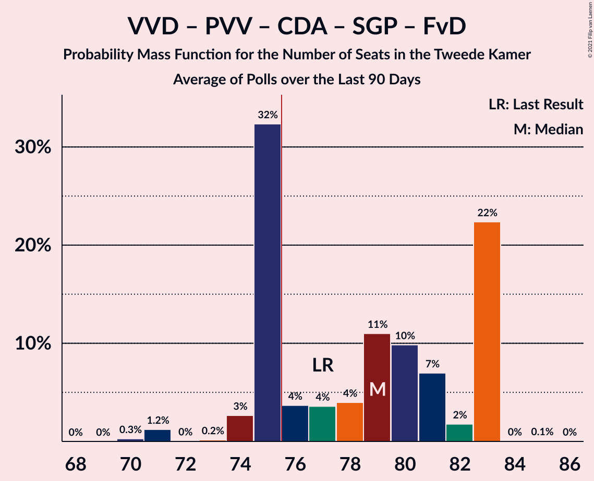

# Poll Average

<a href="#voting-intentions">Voting Intentions</a> | <a href="#seats">Seats</a> | <a href="#coalitions">Coalitions</a> | <a href="#technical-information">Technical Information</a>

## Summary

The table below lists the polls on which the average is based. They are the most recent polls (less than 90 days old) registered and analyzed so far.

| Period     | Polling firm/Commissioner(s) | VVD | PVV | CDA | D66 | GL | SP | PvdA | CU | PvdD | 50+ | SGP | DENK | FvD | PP | B1 |
|:----------:|:----------------------------:|:--:|:--:|:--:|:--:|:--:|:--:|:--:|:--:|:--:|:--:|:--:|:--:|:--:|:--:|:--:|
| 15 March 2017 | General Election | 21.3%   33 | 13.1%   20 | 12.4%   19 | 12.2%   19 | 9.1%   14 | 9.1%   14 | 5.7%   9 | 3.4%   5 | 3.2%   5 | 3.1%   4 | 2.1%   3 | 2.1%   3 | 1.8%   2 | 0.3%   0 | 0.3%   0 |
| N/A | Poll Average | 12–19%   19–26 | 10–14%   17–21 | 8–11%   11–17 | 6–10%   10–16 | 7–13%   11–18 | 4–7%   5–12 | 8–12%   11–17 | 3–7%   5–10 | 3–5%   4–7 | 5–8%   8–13 | 1–3%   2–5 | 1–2%   0–3 | 8–12%   12–18 | N/A   N/A | N/A   N/A |
| [21–24 February 2020](2020-02-24-Ipsos.html) | Ipsos   EenVandaag | 15–19%   21–27 | 10–14%   16–24 | 8–11%   12–18 | 7–10%   10–16 | 8–12%   12–18 | 4–6%   5–12 | 8–11%   11–16 | 3–6%   4–10 | 3–5%   4–7 | 5–9%   8–13 | 1–3%   2–3 | 1–3%   1–3 | 8–12%   12–18 | N/A   N/A | N/A   N/A |
| [17–22 February 2020](2020-02-22-Peilnl.html) | Peil.nl | 12–15%   17–22 | 12–14%   18–20 | 8–10%   10–13 | 8–10%   13–15 | 7–9%   11–14 | 6–8%   8–12 | 10–13%   17–18 | 3–5%   5–7 | 3–5%   5–7 | 6–8%   9–11 | 2–3%   3–5 | 2–3%   2–3 | 10–12%   16–18 | N/A   N/A | N/A   N/A |
| [10–14 January 2020](2020-01-14-IOResearch.html) | I&O Research | 16–19%   26 | 9–12%   17 | 9–11%   13–15 | 6–8%   9–13 | 11–13%   17–20 | 5–7%   9–10 | 8–10%   13–14 | 5–7%   8–9 | 3–4%   4–5 | 4–6%   8 | 2–3%   3–5 | 1%   0–1 | 8–10%   14 | N/A   N/A | N/A   N/A |
| 15 March 2017 | General Election | 21.3%   33 | 13.1%   20 | 12.4%   19 | 12.2%   19 | 9.1%   14 | 9.1%   14 | 5.7%   9 | 3.4%   5 | 3.2%   5 | 3.1%   4 | 2.1%   3 | 2.1%   3 | 1.8%   2 | 0.3%   0 | 0.3%   0 |

Only polls for which at least the sample size has been published are included in the table above.

**Legend:**
+ **Top half of each row:** Voting intentions (95% confidence interval)
+ **Bottom half of each row:** Seat projections for the Tweede Kamer (95% confidence interval)
+ **VVD:** Volkspartij voor Vrijheid en Democratie
+ **PVV:** Partij voor de Vrijheid
+ **CDA:** Christen-Democratisch Appèl
+ **D66:** Democraten 66
+ **GL:** GroenLinks
+ **SP:** Socialistische Partij
+ **PvdA:** Partij van de Arbeid
+ **CU:** ChristenUnie
+ **PvdD:** Partij voor de Dieren
+ **50+:** 50Plus
+ **SGP:** Staatkundig Gereformeerde Partij
+ **DENK:** DENK
+ **FvD:** Forum voor Democratie
+ **PP:** Piratenpartij
+ **B1:** Bij1
+ **N/A (single party):** Party not included the published results
+ **N/A (entire row):** Calculation for this opinion poll not started yet

## Voting Intentions

### Confidence Intervals

| Party | Last Result | Median | 80% Confidence Interval | 90% Confidence Interval | 95% Confidence Interval | 99% Confidence Interval |
|:-----:|:-----------:|:------:|:-----------------------:|:-----------------------:|:-----------------------:|:-----------------------:|
| <a href="#volkspartij-voor-vrijheid-en-democratie">Volkspartij voor Vrijheid en Democratie</a> | 21.3% | 16.7% | 13.0–18.4% |12.7–18.8% | 12.5–19.2% | 12.0–19.9% |
| <a href="#partij-voor-de-vrijheid">Partij voor de Vrijheid</a> | 13.1% | 11.8% | 10.3–13.2% |10.0–13.5% | 9.8–13.8% | 9.3–14.3% |
| <a href="#christen-democratisch-appèl">Christen-Democratisch Appèl</a> | 12.4% | 9.2% | 8.2–10.4% |8.0–10.7% | 7.8–11.0% | 7.4–11.5% |
| <a href="#democraten-66">Democraten 66</a> | 12.2% | 8.4% | 7.0–9.7% |6.7–10.0% | 6.5–10.2% | 6.1–10.7% |
| <a href="#groenlinks">GroenLinks</a> | 9.1% | 9.7% | 7.8–12.2% |7.5–12.6% | 7.3–12.8% | 7.0–13.4% |
| <a href="#socialistische-partij">Socialistische Partij</a> | 9.1% | 6.1% | 4.7–7.0% |4.3–7.2% | 4.1–7.4% | 3.7–7.7% |
| <a href="#partij-van-de-arbeid">Partij van de Arbeid</a> | 5.7% | 9.5% | 8.3–11.7% |8.0–12.0% | 7.8–12.2% | 7.3–12.7% |
| <a href="#christenunie">ChristenUnie</a> | 3.4% | 4.5% | 3.7–6.1% |3.5–6.4% | 3.4–6.6% | 3.1–7.0% |
| <a href="#partij-voor-de-dieren">Partij voor de Dieren</a> | 3.2% | 3.8% | 3.1–4.5% |2.9–4.7% | 2.8–4.9% | 2.5–5.4% |
| <a href="#50plus">50Plus</a> | 3.1% | 6.4% | 5.1–7.4% |4.9–7.7% | 4.7–8.1% | 4.4–8.7% |
| <a href="#staatkundig-gereformeerde-partij">Staatkundig Gereformeerde Partij</a> | 2.1% | 2.6% | 1.8–3.1% |1.6–3.2% | 1.4–3.3% | 1.2–3.6% |
| <a href="#denk">DENK</a> | 2.1% | 1.6% | 0.8–2.2% |0.7–2.4% | 0.7–2.5% | 0.6–2.7% |
| <a href="#forum-voor-democratie">Forum voor Democratie</a> | 1.8% | 9.9% | 8.7–11.1% |8.4–11.4% | 8.2–11.7% | 7.8–12.2% |
| <a href="#piratenpartij">Piratenpartij</a> | 0.3% | N/A | N/A |N/A | N/A | N/A |
| <a href="#bij1">Bij1</a> | 0.3% | N/A | N/A |N/A | N/A | N/A |

### Volkspartij voor Vrijheid en Democratie

*For a full overview of the results for this party, see the [Volkspartij voor Vrijheid en Democratie](party-volkspartijvoorvrijheidendemocratie.html) page.*

| Voting Intentions | Probability | Accumulated | Special Marks |
|:-----------------:|:-----------:|:-----------:|:-------------:|
| 10.5–11.5% | 0% | 100% |  |
| 11.5–12.5% | 3% | 100% |  |
| 12.5–13.5% | 18% | 97% |  |
| 13.5–14.5% | 12% | 79% |  |
| 14.5–15.5% | 4% | 67% |  |
| 15.5–16.5% | 10% | 64% |  |
| 16.5–17.5% | 23% | 53% | Median |
| 17.5–18.5% | 22% | 30% |  |
| 18.5–19.5% | 7% | 8% |  |
| 19.5–20.5% | 1.0% | 1.1% |  |
| 20.5–21.5% | 0.1% | 0.1% | Last Result |
| 21.5–22.5% | 0% | 0% |  |

### Partij voor de Vrijheid

*For a full overview of the results for this party, see the [Partij voor de Vrijheid](party-partijvoordevrijheid.html) page.*

| Voting Intentions | Probability | Accumulated | Special Marks |
|:-----------------:|:-----------:|:-----------:|:-------------:|
| 7.5–8.5% | 0% | 100% |  |
| 8.5–9.5% | 1.3% | 100% |  |
| 9.5–10.5% | 14% | 98.7% |  |
| 10.5–11.5% | 27% | 84% |  |
| 11.5–12.5% | 29% | 57% | Median |
| 12.5–13.5% | 24% | 28% | Last Result |
| 13.5–14.5% | 4% | 5% |  |
| 14.5–15.5% | 0.2% | 0.3% |  |
| 15.5–16.5% | 0% | 0% |  |

### Christen-Democratisch Appèl

*For a full overview of the results for this party, see the [Christen-Democratisch Appèl](party-christen-democratischappèl.html) page.*

| Voting Intentions | Probability | Accumulated | Special Marks |
|:-----------------:|:-----------:|:-----------:|:-------------:|
| 5.5–6.5% | 0% | 100% |  |
| 6.5–7.5% | 0.9% | 100% |  |
| 7.5–8.5% | 19% | 99.1% |  |
| 8.5–9.5% | 45% | 80% | Median |
| 9.5–10.5% | 29% | 35% |  |
| 10.5–11.5% | 6% | 7% |  |
| 11.5–12.5% | 0.5% | 0.5% | Last Result |
| 12.5–13.5% | 0% | 0% |  |

### Democraten 66

*For a full overview of the results for this party, see the [Democraten 66](party-democraten66.html) page.*

| Voting Intentions | Probability | Accumulated | Special Marks |
|:-----------------:|:-----------:|:-----------:|:-------------:|
| 4.5–5.5% | 0% | 100% |  |
| 5.5–6.5% | 3% | 100% |  |
| 6.5–7.5% | 24% | 97% |  |
| 7.5–8.5% | 27% | 73% | Median |
| 8.5–9.5% | 31% | 46% |  |
| 9.5–10.5% | 14% | 15% |  |
| 10.5–11.5% | 0.8% | 0.8% |  |
| 11.5–12.5% | 0% | 0% | Last Result |

### GroenLinks

*For a full overview of the results for this party, see the [GroenLinks](party-groenlinks.html) page.*

| Voting Intentions | Probability | Accumulated | Special Marks |
|:-----------------:|:-----------:|:-----------:|:-------------:|
| 5.5–6.5% | 0% | 100% |  |
| 6.5–7.5% | 6% | 100% |  |
| 7.5–8.5% | 26% | 94% |  |
| 8.5–9.5% | 17% | 68% | Last Result |
| 9.5–10.5% | 13% | 51% | Median |
| 10.5–11.5% | 16% | 38% |  |
| 11.5–12.5% | 18% | 23% |  |
| 12.5–13.5% | 5% | 5% |  |
| 13.5–14.5% | 0.3% | 0.3% |  |
| 14.5–15.5% | 0% | 0% |  |

### Socialistische Partij

*For a full overview of the results for this party, see the [Socialistische Partij](party-socialistischepartij.html) page.*

| Voting Intentions | Probability | Accumulated | Special Marks |
|:-----------------:|:-----------:|:-----------:|:-------------:|
| 1.5–2.5% | 0% | 100% |  |
| 2.5–3.5% | 0.3% | 100% |  |
| 3.5–4.5% | 8% | 99.7% |  |
| 4.5–5.5% | 22% | 92% |  |
| 5.5–6.5% | 42% | 70% | Median |
| 6.5–7.5% | 26% | 28% |  |
| 7.5–8.5% | 1.3% | 1.3% |  |
| 8.5–9.5% | 0% | 0% | Last Result |

### Partij van de Arbeid

*For a full overview of the results for this party, see the [Partij van de Arbeid](party-partijvandearbeid.html) page.*

| Voting Intentions | Probability | Accumulated | Special Marks |
|:-----------------:|:-----------:|:-----------:|:-------------:|
| 5.5–6.5% | 0% | 100% | Last Result |
| 6.5–7.5% | 1.2% | 100% |  |
| 7.5–8.5% | 17% | 98.8% |  |
| 8.5–9.5% | 32% | 82% |  |
| 9.5–10.5% | 16% | 50% | Median |
| 10.5–11.5% | 21% | 34% |  |
| 11.5–12.5% | 12% | 12% |  |
| 12.5–13.5% | 0.8% | 0.8% |  |
| 13.5–14.5% | 0% | 0% |  |

### ChristenUnie

*For a full overview of the results for this party, see the [ChristenUnie](party-christenunie.html) page.*

| Voting Intentions | Probability | Accumulated | Special Marks |
|:-----------------:|:-----------:|:-----------:|:-------------:|
| 1.5–2.5% | 0% | 100% |  |
| 2.5–3.5% | 6% | 100% | Last Result |
| 3.5–4.5% | 46% | 94% | Median |
| 4.5–5.5% | 22% | 48% |  |
| 5.5–6.5% | 23% | 25% |  |
| 6.5–7.5% | 3% | 3% |  |
| 7.5–8.5% | 0% | 0% |  |

### Partij voor de Dieren

*For a full overview of the results for this party, see the [Partij voor de Dieren](party-partijvoordedieren.html) page.*

| Voting Intentions | Probability | Accumulated | Special Marks |
|:-----------------:|:-----------:|:-----------:|:-------------:|
| 0.5–1.5% | 0% | 100% |  |
| 1.5–2.5% | 0.6% | 100% |  |
| 2.5–3.5% | 35% | 99.4% | Last Result |
| 3.5–4.5% | 56% | 64% | Median |
| 4.5–5.5% | 8% | 8% |  |
| 5.5–6.5% | 0.3% | 0.3% |  |
| 6.5–7.5% | 0% | 0% |  |

### 50Plus

*For a full overview of the results for this party, see the [50Plus](party-50plus.html) page.*

| Voting Intentions | Probability | Accumulated | Special Marks |
|:-----------------:|:-----------:|:-----------:|:-------------:|
| 2.5–3.5% | 0% | 100% | Last Result |
| 3.5–4.5% | 1.4% | 100% |  |
| 4.5–5.5% | 22% | 98.6% |  |
| 5.5–6.5% | 34% | 76% | Median |
| 6.5–7.5% | 35% | 42% |  |
| 7.5–8.5% | 7% | 8% |  |
| 8.5–9.5% | 0.7% | 0.7% |  |
| 9.5–10.5% | 0% | 0% |  |

### Staatkundig Gereformeerde Partij

*For a full overview of the results for this party, see the [Staatkundig Gereformeerde Partij](party-staatkundiggereformeerdepartij.html) page.*

| Voting Intentions | Probability | Accumulated | Special Marks |
|:-----------------:|:-----------:|:-----------:|:-------------:|
| 0.0–0.5% | 0% | 100% |  |
| 0.5–1.5% | 4% | 100% |  |
| 1.5–2.5% | 45% | 96% | Last Result |
| 2.5–3.5% | 50% | 51% | Median |
| 3.5–4.5% | 0.7% | 0.7% |  |
| 4.5–5.5% | 0% | 0% |  |

### DENK

*For a full overview of the results for this party, see the [DENK](party-denk.html) page.*

| Voting Intentions | Probability | Accumulated | Special Marks |
|:-----------------:|:-----------:|:-----------:|:-------------:|
| 0.0–0.5% | 0.4% | 100% |  |
| 0.5–1.5% | 48% | 99.6% |  |
| 1.5–2.5% | 50% | 51% | Last Result, Median |
| 2.5–3.5% | 2% | 2% |  |
| 3.5–4.5% | 0% | 0% |  |

### Forum voor Democratie

*For a full overview of the results for this party, see the [Forum voor Democratie](party-forumvoordemocratie.html) page.*

| Voting Intentions | Probability | Accumulated | Special Marks |
|:-----------------:|:-----------:|:-----------:|:-------------:|
| 1.5–2.5% | 0% | 100% | Last Result |
| 2.5–3.5% | 0% | 100% |  |
| 3.5–4.5% | 0% | 100% |  |
| 4.5–5.5% | 0% | 100% |  |
| 5.5–6.5% | 0% | 100% |  |
| 6.5–7.5% | 0.2% | 100% |  |
| 7.5–8.5% | 7% | 99.8% |  |
| 8.5–9.5% | 30% | 93% |  |
| 9.5–10.5% | 35% | 63% | Median |
| 10.5–11.5% | 25% | 28% |  |
| 11.5–12.5% | 3% | 4% |  |
| 12.5–13.5% | 0.1% | 0.1% |  |
| 13.5–14.5% | 0% | 0% |  |

## Seats

### Confidence Intervals

| Party | Last Result | Median | 80% Confidence Interval | 90% Confidence Interval | 95% Confidence Interval | 99% Confidence Interval |
|:-----:|:-----------:|:------:|:-----------------------:|:-----------------------:|:-----------------------:|:-----------------------:|
| <a href="#volkspartij-voor-vrijheid-en-democratie">Volkspartij voor Vrijheid en Democratie</a> | 33 | 21 | 21–26 |21–26 | 19–26 | 17–28 |
| <a href="#partij-voor-de-vrijheid">Partij voor de Vrijheid</a> | 20 | 17 | 17–20 |17–20 | 17–21 | 15–24 |
| <a href="#christen-democratisch-appèl">Christen-Democratisch Appèl</a> | 19 | 14 | 11–15 |11–17 | 11–17 | 10–18 |
| <a href="#democraten-66">Democraten 66</a> | 19 | 13 | 10–14 |10–15 | 10–16 | 9–16 |
| <a href="#groenlinks">GroenLinks</a> | 14 | 18 | 14–18 |12–18 | 11–18 | 10–20 |
| <a href="#socialistische-partij">Socialistische Partij</a> | 14 | 10 | 8–11 |7–11 | 5–12 | 5–12 |
| <a href="#partij-van-de-arbeid">Partij van de Arbeid</a> | 9 | 14 | 12–17 |12–17 | 11–17 | 11–19 |
| <a href="#christenunie">ChristenUnie</a> | 5 | 7 | 6–9 |6–10 | 5–10 | 4–10 |
| <a href="#partij-voor-de-dieren">Partij voor de Dieren</a> | 5 | 5 | 4–7 |4–7 | 4–7 | 4–7 |
| <a href="#50plus">50Plus</a> | 4 | 9 | 8–10 |8–11 | 8–13 | 7–13 |
| <a href="#staatkundig-gereformeerde-partij">Staatkundig Gereformeerde Partij</a> | 3 | 3 | 3–5 |2–5 | 2–5 | 1–5 |
| <a href="#denk">DENK</a> | 3 | 2 | 0–3 |0–3 | 0–3 | 0–4 |
| <a href="#forum-voor-democratie">Forum voor Democratie</a> | 2 | 16 | 14–18 |14–18 | 12–18 | 12–18 |
| <a href="#piratenpartij">Piratenpartij</a> | 0 | N/A | N/A |N/A | N/A | N/A |
| <a href="#bij1">Bij1</a> | 0 | N/A | N/A |N/A | N/A | N/A |

### Volkspartij voor Vrijheid en Democratie

*For a full overview of the results for this party, see the [Volkspartij voor Vrijheid en Democratie](party-volkspartijvoorvrijheidendemocratie.html) page.*

| Number of Seats | Probability | Accumulated | Special Marks |
|:---------------:|:-----------:|:-----------:|:-------------:|
| 17 | 2% | 100% |  |
| 18 | 0.3% | 98% |  |
| 19 | 0.2% | 98% |  |
| 20 | 2% | 97% |  |
| 21 | 48% | 95% | Median |
| 22 | 4% | 48% |  |
| 23 | 5% | 44% |  |
| 24 | 0.5% | 39% |  |
| 25 | 0.3% | 38% |  |
| 26 | 36% | 38% |  |
| 27 | 1.1% | 2% |  |
| 28 | 0.5% | 0.9% |  |
| 29 | 0.3% | 0.4% |  |
| 30 | 0.1% | 0.1% |  |
| 31 | 0% | 0% |  |
| 32 | 0% | 0% |  |
| 33 | 0% | 0% | Last Result |

### Partij voor de Vrijheid

*For a full overview of the results for this party, see the [Partij voor de Vrijheid](party-partijvoordevrijheid.html) page.*

| Number of Seats | Probability | Accumulated | Special Marks |
|:---------------:|:-----------:|:-----------:|:-------------:|
| 14 | 0.2% | 100% |  |
| 15 | 0.6% | 99.8% |  |
| 16 | 1.3% | 99.3% |  |
| 17 | 57% | 98% | Median |
| 18 | 7% | 41% |  |
| 19 | 4% | 34% |  |
| 20 | 28% | 31% | Last Result |
| 21 | 0.4% | 3% |  |
| 22 | 0.6% | 2% |  |
| 23 | 0.2% | 2% |  |
| 24 | 1.5% | 1.5% |  |
| 25 | 0% | 0% |  |

### Christen-Democratisch Appèl

*For a full overview of the results for this party, see the [Christen-Democratisch Appèl](party-christen-democratischappèl.html) page.*

| Number of Seats | Probability | Accumulated | Special Marks |
|:---------------:|:-----------:|:-----------:|:-------------:|
| 10 | 2% | 100% |  |
| 11 | 26% | 98% |  |
| 12 | 4% | 72% |  |
| 13 | 8% | 68% |  |
| 14 | 49% | 59% | Median |
| 15 | 4% | 11% |  |
| 16 | 0.4% | 6% |  |
| 17 | 5% | 6% |  |
| 18 | 1.1% | 1.1% |  |
| 19 | 0% | 0% | Last Result |

### Democraten 66

*For a full overview of the results for this party, see the [Democraten 66](party-democraten66.html) page.*

| Number of Seats | Probability | Accumulated | Special Marks |
|:---------------:|:-----------:|:-----------:|:-------------:|
| 9 | 2% | 100% |  |
| 10 | 34% | 98% |  |
| 11 | 3% | 64% |  |
| 12 | 2% | 61% |  |
| 13 | 23% | 59% | Median |
| 14 | 30% | 36% |  |
| 15 | 3% | 6% |  |
| 16 | 3% | 3% |  |
| 17 | 0.3% | 0.3% |  |
| 18 | 0.1% | 0.1% |  |
| 19 | 0% | 0% | Last Result |

### GroenLinks

*For a full overview of the results for this party, see the [GroenLinks](party-groenlinks.html) page.*

| Number of Seats | Probability | Accumulated | Special Marks |
|:---------------:|:-----------:|:-----------:|:-------------:|
| 10 | 0.7% | 100% |  |
| 11 | 3% | 99.2% |  |
| 12 | 2% | 96% |  |
| 13 | 3% | 95% |  |
| 14 | 33% | 92% | Last Result |
| 15 | 5% | 59% |  |
| 16 | 0.4% | 54% |  |
| 17 | 2% | 53% |  |
| 18 | 49% | 51% | Median |
| 19 | 0.3% | 2% |  |
| 20 | 2% | 2% |  |
| 21 | 0% | 0% |  |

### Socialistische Partij

*For a full overview of the results for this party, see the [Socialistische Partij](party-socialistischepartij.html) page.*

| Number of Seats | Probability | Accumulated | Special Marks |
|:---------------:|:-----------:|:-----------:|:-------------:|
| 5 | 3% | 100% |  |
| 6 | 0.2% | 97% |  |
| 7 | 5% | 97% |  |
| 8 | 5% | 92% |  |
| 9 | 23% | 87% |  |
| 10 | 32% | 65% | Median |
| 11 | 29% | 33% |  |
| 12 | 3% | 3% |  |
| 13 | 0% | 0% |  |
| 14 | 0% | 0% | Last Result |

### Partij van de Arbeid

*For a full overview of the results for this party, see the [Partij van de Arbeid](party-partijvandearbeid.html) page.*

| Number of Seats | Probability | Accumulated | Special Marks |
|:---------------:|:-----------:|:-----------:|:-------------:|
| 9 | 0.4% | 100% | Last Result |
| 10 | 0% | 99.6% |  |
| 11 | 3% | 99.6% |  |
| 12 | 21% | 97% |  |
| 13 | 2% | 75% |  |
| 14 | 32% | 73% | Median |
| 15 | 5% | 41% |  |
| 16 | 2% | 35% |  |
| 17 | 32% | 33% |  |
| 18 | 0.4% | 1.2% |  |
| 19 | 0.6% | 0.8% |  |
| 20 | 0.1% | 0.1% |  |
| 21 | 0% | 0% |  |

### ChristenUnie

*For a full overview of the results for this party, see the [ChristenUnie](party-christenunie.html) page.*

| Number of Seats | Probability | Accumulated | Special Marks |
|:---------------:|:-----------:|:-----------:|:-------------:|
| 4 | 1.0% | 100% |  |
| 5 | 4% | 99.0% | Last Result |
| 6 | 32% | 95% |  |
| 7 | 22% | 63% | Median |
| 8 | 3% | 41% |  |
| 9 | 31% | 38% |  |
| 10 | 7% | 7% |  |
| 11 | 0.1% | 0.1% |  |
| 12 | 0% | 0% |  |

### Partij voor de Dieren

*For a full overview of the results for this party, see the [Partij voor de Dieren](party-partijvoordedieren.html) page.*

| Number of Seats | Probability | Accumulated | Special Marks |
|:---------------:|:-----------:|:-----------:|:-------------:|
| 3 | 0.4% | 100% |  |
| 4 | 49% | 99.6% |  |
| 5 | 33% | 50% | Last Result, Median |
| 6 | 4% | 17% |  |
| 7 | 13% | 13% |  |
| 8 | 0% | 0.1% |  |
| 9 | 0% | 0% |  |

### 50Plus

*For a full overview of the results for this party, see the [50Plus](party-50plus.html) page.*

| Number of Seats | Probability | Accumulated | Special Marks |
|:---------------:|:-----------:|:-----------:|:-------------:|
| 4 | 0% | 100% | Last Result |
| 5 | 0% | 100% |  |
| 6 | 0.1% | 100% |  |
| 7 | 0.4% | 99.9% |  |
| 8 | 34% | 99.5% |  |
| 9 | 34% | 65% | Median |
| 10 | 24% | 31% |  |
| 11 | 2% | 6% |  |
| 12 | 0.5% | 4% |  |
| 13 | 3% | 3% |  |
| 14 | 0.1% | 0.3% |  |
| 15 | 0.3% | 0.3% |  |
| 16 | 0% | 0% |  |

### Staatkundig Gereformeerde Partij

*For a full overview of the results for this party, see the [Staatkundig Gereformeerde Partij](party-staatkundiggereformeerdepartij.html) page.*

| Number of Seats | Probability | Accumulated | Special Marks |
|:---------------:|:-----------:|:-----------:|:-------------:|
| 1 | 0.7% | 100% |  |
| 2 | 8% | 99.3% |  |
| 3 | 53% | 91% | Last Result, Median |
| 4 | 8% | 38% |  |
| 5 | 30% | 30% |  |
| 6 | 0% | 0% |  |

### DENK

*For a full overview of the results for this party, see the [DENK](party-denk.html) page.*

| Number of Seats | Probability | Accumulated | Special Marks |
|:---------------:|:-----------:|:-----------:|:-------------:|
| 0 | 30% | 100% |  |
| 1 | 6% | 70% |  |
| 2 | 32% | 64% | Median |
| 3 | 32% | 32% | Last Result |
| 4 | 0.5% | 0.6% |  |
| 5 | 0.1% | 0.1% |  |
| 6 | 0% | 0% |  |

### Forum voor Democratie

*For a full overview of the results for this party, see the [Forum voor Democratie](party-forumvoordemocratie.html) page.*

| Number of Seats | Probability | Accumulated | Special Marks |
|:---------------:|:-----------:|:-----------:|:-------------:|
| 2 | 0% | 100% | Last Result |
| 3 | 0% | 100% |  |
| 4 | 0% | 100% |  |
| 5 | 0% | 100% |  |
| 6 | 0% | 100% |  |
| 7 | 0% | 100% |  |
| 8 | 0% | 100% |  |
| 9 | 0% | 100% |  |
| 10 | 0% | 100% |  |
| 11 | 0.1% | 100% |  |
| 12 | 3% | 99.8% |  |
| 13 | 1.3% | 97% |  |
| 14 | 35% | 96% |  |
| 15 | 7% | 61% |  |
| 16 | 29% | 53% | Median |
| 17 | 3% | 25% |  |
| 18 | 22% | 22% |  |
| 19 | 0.1% | 0.4% |  |
| 20 | 0.3% | 0.3% |  |
| 21 | 0% | 0% |  |

## Coalitions

### Confidence Intervals

| Coalition | Last Result | Median | Majority? | 80% Confidence Interval | 90% Confidence Interval | 95% Confidence Interval | 99% Confidence Interval |
|:---------:|:-----------:|:------:|:---------:|:-----------------------:|:-----------------------:|:-----------------------:|:-----------------------:|
| Volkspartij voor Vrijheid en Democratie – Christen-Democratisch Appèl – Democraten 66 – GroenLinks – ChristenUnie | 90 | 73 | 36% | 66–77 | 65–79 | 63–80 | 62–80 |
| Volkspartij voor Vrijheid en Democratie – Partij voor de Vrijheid – Christen-Democratisch Appèl – Staatkundig Gereformeerde Partij – Forum voor Democratie | 77 | 73 | 31% | 71–76 | 71–76 | 71–76 | 68–78 |
| Volkspartij voor Vrijheid en Democratie – Christen-Democratisch Appèl – Democraten 66 – Partij van de Arbeid – ChristenUnie | 85 | 69 | 5% | 67–75 | 67–76 | 66–76 | 66–77 |
| Christen-Democratisch Appèl – Democraten 66 – GroenLinks – Socialistische Partij – Partij van de Arbeid – ChristenUnie | 80 | 73 | 2% | 70–75 | 70–75 | 68–75 | 66–76 |
| Volkspartij voor Vrijheid en Democratie – Partij voor de Vrijheid – Christen-Democratisch Appèl – Forum voor Democratie | 74 | 70 | 0.4% | 68–72 | 68–72 | 67–74 | 64–75 |
| Volkspartij voor Vrijheid en Democratie – Christen-Democratisch Appèl – 50Plus – Staatkundig Gereformeerde Partij – Forum voor Democratie | 61 | 66 | 0% | 60–67 | 60–67 | 60–68 | 60–70 |
| Christen-Democratisch Appèl – Democraten 66 – GroenLinks – Partij van de Arbeid – ChristenUnie | 66 | 64 | 0% | 62–65 | 60–66 | 59–66 | 56–67 |
| Volkspartij voor Vrijheid en Democratie – Christen-Democratisch Appèl – 50Plus – Forum voor Democratie | 58 | 62 | 0% | 57–63 | 57–64 | 57–65 | 57–69 |
| Volkspartij voor Vrijheid en Democratie – Christen-Democratisch Appèl – Democraten 66 – ChristenUnie | 76 | 55 | 0% | 52–60 | 52–62 | 51–64 | 49–65 |
| Volkspartij voor Vrijheid en Democratie – Christen-Democratisch Appèl – Staatkundig Gereformeerde Partij – Forum voor Democratie | 57 | 56 | 0% | 51–59 | 51–59 | 50–59 | 50–61 |
| Volkspartij voor Vrijheid en Democratie – Partij voor de Vrijheid – Christen-Democratisch Appèl | 72 | 52 | 0% | 52–57 | 50–58 | 50–59 | 48–61 |
| Volkspartij voor Vrijheid en Democratie – Christen-Democratisch Appèl – Forum voor Democratie | 54 | 53 | 0% | 48–54 | 48–55 | 48–55 | 46–56 |
| Volkspartij voor Vrijheid en Democratie – Christen-Democratisch Appèl – Partij van de Arbeid | 61 | 49 | 0% | 47–54 | 47–55 | 47–55 | 47–57 |
| Volkspartij voor Vrijheid en Democratie – Christen-Democratisch Appèl – Democraten 66 | 71 | 48 | 0% | 46–50 | 46–54 | 45–55 | 44–55 |
| Volkspartij voor Vrijheid en Democratie – Democraten 66 – Partij van de Arbeid | 61 | 50 | 0% | 46–52 | 46–53 | 46–54 | 46–56 |
| Christen-Democratisch Appèl – Democraten 66 – Partij van de Arbeid | 47 | 39 | 0% | 38–42 | 38–43 | 36–44 | 36–46 |
| Christen-Democratisch Appèl – Partij van de Arbeid – ChristenUnie | 33 | 34 | 0% | 33–37 | 33–39 | 33–42 | 30–42 |
| Volkspartij voor Vrijheid en Democratie – Christen-Democratisch Appèl | 52 | 35 | 0% | 32–40 | 32–40 | 32–41 | 30–43 |
| Volkspartij voor Vrijheid en Democratie – Partij van de Arbeid | 42 | 38 | 0% | 33–40 | 33–40 | 33–40 | 33–43 |
| Christen-Democratisch Appèl – Partij van de Arbeid | 28 | 28 | 0% | 26–29 | 26–32 | 24–32 | 24–32 |
| Christen-Democratisch Appèl – Democraten 66 | 38 | 25 | 0% | 24–27 | 24–28 | 23–29 | 22–29 |

### Volkspartij voor Vrijheid en Democratie – Christen-Democratisch Appèl – Democraten 66 – GroenLinks – ChristenUnie

| Number of Seats | Probability | Accumulated | Special Marks |
|:---------------:|:-----------:|:-----------:|:-------------:|
| 62 | 2% | 100% |  |
| 63 | 0.3% | 98% |  |
| 64 | 2% | 97% |  |
| 65 | 2% | 95% |  |
| 66 | 28% | 93% |  |
| 67 | 0% | 65% |  |
| 68 | 0.1% | 65% |  |
| 69 | 0.6% | 65% |  |
| 70 | 0.5% | 65% |  |
| 71 | 1.2% | 64% |  |
| 72 | 2% | 63% |  |
| 73 | 20% | 61% | Median |
| 74 | 5% | 41% |  |
| 75 | 0.4% | 36% |  |
| 76 | 2% | 36% | Majority |
| 77 | 28% | 34% |  |
| 78 | 0.4% | 5% |  |
| 79 | 0.6% | 5% |  |
| 80 | 4% | 4% |  |
| 81 | 0.1% | 0.2% |  |
| 82 | 0% | 0.1% |  |
| 83 | 0% | 0.1% |  |
| 84 | 0% | 0% |  |
| 85 | 0% | 0% |  |
| 86 | 0% | 0% |  |
| 87 | 0% | 0% |  |
| 88 | 0% | 0% |  |
| 89 | 0% | 0% |  |
| 90 | 0% | 0% | Last Result |

### Volkspartij voor Vrijheid en Democratie – Partij voor de Vrijheid – Christen-Democratisch Appèl – Staatkundig Gereformeerde Partij – Forum voor Democratie

| Number of Seats | Probability | Accumulated | Special Marks |
|:---------------:|:-----------:|:-----------:|:-------------:|
| 68 | 2% | 100% |  |
| 69 | 0.1% | 98% |  |
| 70 | 0.3% | 98% |  |
| 71 | 27% | 98% | Median |
| 72 | 5% | 71% |  |
| 73 | 23% | 66% |  |
| 74 | 9% | 43% |  |
| 75 | 3% | 34% |  |
| 76 | 29% | 31% | Majority |
| 77 | 2% | 2% | Last Result |
| 78 | 0.3% | 0.8% |  |
| 79 | 0.3% | 0.4% |  |
| 80 | 0.1% | 0.2% |  |
| 81 | 0.1% | 0.1% |  |
| 82 | 0% | 0% |  |

### Volkspartij voor Vrijheid en Democratie – Christen-Democratisch Appèl – Democraten 66 – Partij van de Arbeid – ChristenUnie

| Number of Seats | Probability | Accumulated | Special Marks |
|:---------------:|:-----------:|:-----------:|:-------------:|
| 62 | 0.1% | 100% |  |
| 63 | 0% | 99.9% |  |
| 64 | 0% | 99.9% |  |
| 65 | 0% | 99.9% |  |
| 66 | 3% | 99.9% |  |
| 67 | 20% | 97% |  |
| 68 | 2% | 77% |  |
| 69 | 28% | 75% | Median |
| 70 | 7% | 47% |  |
| 71 | 0.3% | 40% |  |
| 72 | 0.4% | 40% |  |
| 73 | 28% | 39% |  |
| 74 | 0.3% | 11% |  |
| 75 | 5% | 11% |  |
| 76 | 4% | 5% | Majority |
| 77 | 0.6% | 0.7% |  |
| 78 | 0.1% | 0.1% |  |
| 79 | 0% | 0% |  |
| 80 | 0% | 0% |  |
| 81 | 0% | 0% |  |
| 82 | 0% | 0% |  |
| 83 | 0% | 0% |  |
| 84 | 0% | 0% |  |
| 85 | 0% | 0% | Last Result |

### Christen-Democratisch Appèl – Democraten 66 – GroenLinks – Socialistische Partij – Partij van de Arbeid – ChristenUnie

| Number of Seats | Probability | Accumulated | Special Marks |
|:---------------:|:-----------:|:-----------:|:-------------:|
| 61 | 0% | 100% |  |
| 62 | 0% | 99.9% |  |
| 63 | 0.1% | 99.9% |  |
| 64 | 0.1% | 99.9% |  |
| 65 | 0% | 99.7% |  |
| 66 | 0.4% | 99.7% |  |
| 67 | 0.1% | 99.3% |  |
| 68 | 2% | 99.2% |  |
| 69 | 0.5% | 97% |  |
| 70 | 7% | 96% |  |
| 71 | 0.9% | 89% |  |
| 72 | 2% | 88% |  |
| 73 | 51% | 86% |  |
| 74 | 4% | 35% |  |
| 75 | 29% | 31% |  |
| 76 | 2% | 2% | Median, Majority |
| 77 | 0.2% | 0.2% |  |
| 78 | 0% | 0% |  |
| 79 | 0% | 0% |  |
| 80 | 0% | 0% | Last Result |

### Volkspartij voor Vrijheid en Democratie – Partij voor de Vrijheid – Christen-Democratisch Appèl – Forum voor Democratie

| Number of Seats | Probability | Accumulated | Special Marks |
|:---------------:|:-----------:|:-----------:|:-------------:|
| 64 | 2% | 100% |  |
| 65 | 0% | 98% |  |
| 66 | 0.1% | 98% |  |
| 67 | 2% | 98% |  |
| 68 | 28% | 96% | Median |
| 69 | 0.9% | 67% |  |
| 70 | 26% | 66% |  |
| 71 | 29% | 41% |  |
| 72 | 9% | 12% |  |
| 73 | 0.7% | 4% |  |
| 74 | 2% | 3% | Last Result |
| 75 | 0.5% | 0.9% |  |
| 76 | 0.1% | 0.4% | Majority |
| 77 | 0.2% | 0.3% |  |
| 78 | 0% | 0.1% |  |
| 79 | 0% | 0% |  |

### Volkspartij voor Vrijheid en Democratie – Christen-Democratisch Appèl – 50Plus – Staatkundig Gereformeerde Partij – Forum voor Democratie

| Number of Seats | Probability | Accumulated | Special Marks |
|:---------------:|:-----------:|:-----------:|:-------------:|
| 60 | 27% | 100% |  |
| 61 | 2% | 73% | Last Result |
| 62 | 0.2% | 71% |  |
| 63 | 4% | 71% | Median |
| 64 | 4% | 67% |  |
| 65 | 4% | 62% |  |
| 66 | 27% | 58% |  |
| 67 | 29% | 32% |  |
| 68 | 0.6% | 3% |  |
| 69 | 1.2% | 2% |  |
| 70 | 0.6% | 1.1% |  |
| 71 | 0.4% | 0.5% |  |
| 72 | 0% | 0.1% |  |
| 73 | 0% | 0% |  |

### Christen-Democratisch Appèl – Democraten 66 – GroenLinks – Partij van de Arbeid – ChristenUnie

| Number of Seats | Probability | Accumulated | Special Marks |
|:---------------:|:-----------:|:-----------:|:-------------:|
| 54 | 0.2% | 100% |  |
| 55 | 0.1% | 99.8% |  |
| 56 | 0.7% | 99.8% |  |
| 57 | 0% | 99.1% |  |
| 58 | 0.9% | 99.1% |  |
| 59 | 2% | 98% |  |
| 60 | 2% | 96% |  |
| 61 | 0.9% | 94% |  |
| 62 | 31% | 93% |  |
| 63 | 0.9% | 62% |  |
| 64 | 24% | 61% |  |
| 65 | 31% | 38% |  |
| 66 | 5% | 7% | Last Result, Median |
| 67 | 2% | 2% |  |
| 68 | 0.2% | 0.2% |  |
| 69 | 0% | 0% |  |

### Volkspartij voor Vrijheid en Democratie – Christen-Democratisch Appèl – 50Plus – Forum voor Democratie

| Number of Seats | Probability | Accumulated | Special Marks |
|:---------------:|:-----------:|:-----------:|:-------------:|
| 56 | 0.4% | 100% |  |
| 57 | 28% | 99.6% |  |
| 58 | 0.2% | 71% | Last Result |
| 59 | 2% | 71% |  |
| 60 | 5% | 69% | Median |
| 61 | 4% | 64% |  |
| 62 | 30% | 60% |  |
| 63 | 22% | 30% |  |
| 64 | 6% | 8% |  |
| 65 | 0.4% | 3% |  |
| 66 | 0.4% | 2% |  |
| 67 | 0.9% | 2% |  |
| 68 | 0% | 0.9% |  |
| 69 | 0.8% | 0.8% |  |
| 70 | 0% | 0% |  |

### Volkspartij voor Vrijheid en Democratie – Christen-Democratisch Appèl – Democraten 66 – ChristenUnie

| Number of Seats | Probability | Accumulated | Special Marks |
|:---------------:|:-----------:|:-----------:|:-------------:|
| 49 | 2% | 100% |  |
| 50 | 0.3% | 98% |  |
| 51 | 1.0% | 98% |  |
| 52 | 28% | 97% |  |
| 53 | 3% | 69% |  |
| 54 | 0.3% | 65% |  |
| 55 | 20% | 65% | Median |
| 56 | 4% | 45% |  |
| 57 | 2% | 41% |  |
| 58 | 0.4% | 40% |  |
| 59 | 28% | 39% |  |
| 60 | 5% | 11% |  |
| 61 | 0.2% | 6% |  |
| 62 | 0.4% | 5% |  |
| 63 | 2% | 5% |  |
| 64 | 0.3% | 3% |  |
| 65 | 2% | 2% |  |
| 66 | 0% | 0% |  |
| 67 | 0% | 0% |  |
| 68 | 0% | 0% |  |
| 69 | 0% | 0% |  |
| 70 | 0% | 0% |  |
| 71 | 0% | 0% |  |
| 72 | 0% | 0% |  |
| 73 | 0% | 0% |  |
| 74 | 0% | 0% |  |
| 75 | 0% | 0% |  |
| 76 | 0% | 0% | Last Result, Majority |

### Volkspartij voor Vrijheid en Democratie – Christen-Democratisch Appèl – Staatkundig Gereformeerde Partij – Forum voor Democratie

| Number of Seats | Probability | Accumulated | Special Marks |
|:---------------:|:-----------:|:-----------:|:-------------:|
| 49 | 0.1% | 100% |  |
| 50 | 4% | 99.9% |  |
| 51 | 26% | 96% |  |
| 52 | 0.7% | 70% |  |
| 53 | 0.1% | 69% |  |
| 54 | 7% | 69% | Median |
| 55 | 1.1% | 63% |  |
| 56 | 22% | 62% |  |
| 57 | 9% | 40% | Last Result |
| 58 | 2% | 31% |  |
| 59 | 28% | 29% |  |
| 60 | 0.1% | 0.7% |  |
| 61 | 0.3% | 0.6% |  |
| 62 | 0.1% | 0.3% |  |
| 63 | 0.1% | 0.2% |  |
| 64 | 0% | 0.1% |  |
| 65 | 0% | 0% |  |

### Volkspartij voor Vrijheid en Democratie – Partij voor de Vrijheid – Christen-Democratisch Appèl

| Number of Seats | Probability | Accumulated | Special Marks |
|:---------------:|:-----------:|:-----------:|:-------------:|
| 48 | 2% | 100% |  |
| 49 | 0% | 98% |  |
| 50 | 4% | 98% |  |
| 51 | 0.2% | 94% |  |
| 52 | 47% | 94% | Median |
| 53 | 0.2% | 47% |  |
| 54 | 0.6% | 47% |  |
| 55 | 0.7% | 47% |  |
| 56 | 2% | 46% |  |
| 57 | 34% | 44% |  |
| 58 | 6% | 9% |  |
| 59 | 2% | 3% |  |
| 60 | 0.8% | 2% |  |
| 61 | 0.7% | 0.8% |  |
| 62 | 0% | 0.1% |  |
| 63 | 0% | 0% |  |
| 64 | 0% | 0% |  |
| 65 | 0% | 0% |  |
| 66 | 0% | 0% |  |
| 67 | 0% | 0% |  |
| 68 | 0% | 0% |  |
| 69 | 0% | 0% |  |
| 70 | 0% | 0% |  |
| 71 | 0% | 0% |  |
| 72 | 0% | 0% | Last Result |

### Volkspartij voor Vrijheid en Democratie – Christen-Democratisch Appèl – Forum voor Democratie

| Number of Seats | Probability | Accumulated | Special Marks |
|:---------------:|:-----------:|:-----------:|:-------------:|
| 46 | 2% | 100% |  |
| 47 | 0.1% | 98% |  |
| 48 | 28% | 98% |  |
| 49 | 2% | 70% |  |
| 50 | 3% | 68% |  |
| 51 | 3% | 65% | Median |
| 52 | 0.8% | 63% |  |
| 53 | 23% | 62% |  |
| 54 | 31% | 39% | Last Result |
| 55 | 7% | 8% |  |
| 56 | 1.1% | 2% |  |
| 57 | 0.2% | 0.5% |  |
| 58 | 0.1% | 0.3% |  |
| 59 | 0.1% | 0.2% |  |
| 60 | 0% | 0.1% |  |
| 61 | 0% | 0% |  |

### Volkspartij voor Vrijheid en Democratie – Christen-Democratisch Appèl – Partij van de Arbeid

| Number of Seats | Probability | Accumulated | Special Marks |
|:---------------:|:-----------:|:-----------:|:-------------:|
| 45 | 0.1% | 100% |  |
| 46 | 0.1% | 99.9% |  |
| 47 | 22% | 99.8% |  |
| 48 | 0.8% | 78% |  |
| 49 | 30% | 77% | Median |
| 50 | 4% | 47% |  |
| 51 | 0.6% | 43% |  |
| 52 | 1.0% | 43% |  |
| 53 | 5% | 42% |  |
| 54 | 30% | 36% |  |
| 55 | 5% | 6% |  |
| 56 | 0.6% | 1.1% |  |
| 57 | 0.1% | 0.6% |  |
| 58 | 0.1% | 0.4% |  |
| 59 | 0.3% | 0.3% |  |
| 60 | 0% | 0% |  |
| 61 | 0% | 0% | Last Result |

### Volkspartij voor Vrijheid en Democratie – Christen-Democratisch Appèl – Democraten 66

| Number of Seats | Probability | Accumulated | Special Marks |
|:---------------:|:-----------:|:-----------:|:-------------:|
| 44 | 2% | 100% |  |
| 45 | 0.5% | 98% |  |
| 46 | 29% | 97% |  |
| 47 | 3% | 68% |  |
| 48 | 22% | 65% | Median |
| 49 | 0.4% | 43% |  |
| 50 | 34% | 43% |  |
| 51 | 0.5% | 9% |  |
| 52 | 2% | 8% |  |
| 53 | 1.2% | 7% |  |
| 54 | 2% | 5% |  |
| 55 | 3% | 3% |  |
| 56 | 0.1% | 0.2% |  |
| 57 | 0% | 0.1% |  |
| 58 | 0% | 0% |  |
| 59 | 0% | 0% |  |
| 60 | 0% | 0% |  |
| 61 | 0% | 0% |  |
| 62 | 0% | 0% |  |
| 63 | 0% | 0% |  |
| 64 | 0% | 0% |  |
| 65 | 0% | 0% |  |
| 66 | 0% | 0% |  |
| 67 | 0% | 0% |  |
| 68 | 0% | 0% |  |
| 69 | 0% | 0% |  |
| 70 | 0% | 0% |  |
| 71 | 0% | 0% | Last Result |

### Volkspartij voor Vrijheid en Democratie – Democraten 66 – Partij van de Arbeid

| Number of Seats | Probability | Accumulated | Special Marks |
|:---------------:|:-----------:|:-----------:|:-------------:|
| 45 | 0.1% | 100% |  |
| 46 | 21% | 99.9% |  |
| 47 | 0.2% | 79% |  |
| 48 | 7% | 78% | Median |
| 49 | 4% | 71% |  |
| 50 | 30% | 67% |  |
| 51 | 2% | 37% |  |
| 52 | 29% | 35% |  |
| 53 | 3% | 6% |  |
| 54 | 3% | 4% |  |
| 55 | 0.5% | 1.0% |  |
| 56 | 0.1% | 0.5% |  |
| 57 | 0.3% | 0.5% |  |
| 58 | 0.2% | 0.2% |  |
| 59 | 0% | 0% |  |
| 60 | 0% | 0% |  |
| 61 | 0% | 0% | Last Result |

### Christen-Democratisch Appèl – Democraten 66 – Partij van de Arbeid

| Number of Seats | Probability | Accumulated | Special Marks |
|:---------------:|:-----------:|:-----------:|:-------------:|
| 32 | 0.1% | 100% |  |
| 33 | 0% | 99.9% |  |
| 34 | 0.1% | 99.9% |  |
| 35 | 0.2% | 99.8% |  |
| 36 | 2% | 99.6% |  |
| 37 | 0.9% | 97% |  |
| 38 | 29% | 96% |  |
| 39 | 21% | 67% |  |
| 40 | 4% | 46% |  |
| 41 | 2% | 42% | Median |
| 42 | 33% | 40% |  |
| 43 | 3% | 7% |  |
| 44 | 2% | 4% |  |
| 45 | 0.7% | 1.2% |  |
| 46 | 0.2% | 0.5% |  |
| 47 | 0.3% | 0.3% | Last Result |
| 48 | 0.1% | 0.1% |  |
| 49 | 0% | 0% |  |

### Christen-Democratisch Appèl – Partij van de Arbeid – ChristenUnie

| Number of Seats | Probability | Accumulated | Special Marks |
|:---------------:|:-----------:|:-----------:|:-------------:|
| 27 | 0.1% | 100% |  |
| 28 | 0.1% | 99.9% |  |
| 29 | 0% | 99.8% |  |
| 30 | 0.6% | 99.8% |  |
| 31 | 0.1% | 99.2% |  |
| 32 | 1.4% | 99.1% |  |
| 33 | 23% | 98% | Last Result |
| 34 | 30% | 75% |  |
| 35 | 5% | 45% | Median |
| 36 | 3% | 40% |  |
| 37 | 31% | 37% |  |
| 38 | 1.5% | 7% |  |
| 39 | 0.3% | 5% |  |
| 40 | 0.2% | 5% |  |
| 41 | 0% | 5% |  |
| 42 | 5% | 5% |  |
| 43 | 0% | 0% |  |

### Volkspartij voor Vrijheid en Democratie – Christen-Democratisch Appèl

| Number of Seats | Probability | Accumulated | Special Marks |
|:---------------:|:-----------:|:-----------:|:-------------:|
| 30 | 2% | 100% |  |
| 31 | 0.3% | 98% |  |
| 32 | 30% | 98% |  |
| 33 | 0.9% | 68% |  |
| 34 | 2% | 67% |  |
| 35 | 20% | 65% | Median |
| 36 | 0.1% | 45% |  |
| 37 | 0.5% | 45% |  |
| 38 | 0.4% | 44% |  |
| 39 | 6% | 44% |  |
| 40 | 33% | 38% |  |
| 41 | 3% | 5% |  |
| 42 | 1.1% | 2% |  |
| 43 | 0.3% | 0.5% |  |
| 44 | 0.2% | 0.2% |  |
| 45 | 0.1% | 0.1% |  |
| 46 | 0% | 0% |  |
| 47 | 0% | 0% |  |
| 48 | 0% | 0% |  |
| 49 | 0% | 0% |  |
| 50 | 0% | 0% |  |
| 51 | 0% | 0% |  |
| 52 | 0% | 0% | Last Result |

### Volkspartij voor Vrijheid en Democratie – Partij van de Arbeid

| Number of Seats | Probability | Accumulated | Special Marks |
|:---------------:|:-----------:|:-----------:|:-------------:|
| 32 | 0.2% | 100% |  |
| 33 | 20% | 99.8% |  |
| 34 | 2% | 80% |  |
| 35 | 2% | 78% | Median |
| 36 | 0.3% | 76% |  |
| 37 | 4% | 76% |  |
| 38 | 34% | 72% |  |
| 39 | 5% | 38% |  |
| 40 | 31% | 33% |  |
| 41 | 0.6% | 1.4% |  |
| 42 | 0.1% | 0.9% | Last Result |
| 43 | 0.5% | 0.8% |  |
| 44 | 0.2% | 0.2% |  |
| 45 | 0% | 0% |  |

### Christen-Democratisch Appèl – Partij van de Arbeid

| Number of Seats | Probability | Accumulated | Special Marks |
|:---------------:|:-----------:|:-----------:|:-------------:|
| 22 | 0.1% | 100% |  |
| 23 | 0.1% | 99.9% |  |
| 24 | 3% | 99.7% |  |
| 25 | 0.4% | 97% |  |
| 26 | 21% | 96% |  |
| 27 | 5% | 76% |  |
| 28 | 58% | 70% | Last Result, Median |
| 29 | 2% | 12% |  |
| 30 | 3% | 10% |  |
| 31 | 0.4% | 7% |  |
| 32 | 6% | 7% |  |
| 33 | 0.4% | 0.4% |  |
| 34 | 0% | 0% |  |

### Christen-Democratisch Appèl – Democraten 66

| Number of Seats | Probability | Accumulated | Special Marks |
|:---------------:|:-----------:|:-----------:|:-------------:|
| 20 | 0.1% | 100% |  |
| 21 | 0.1% | 99.9% |  |
| 22 | 2% | 99.8% |  |
| 23 | 0.3% | 98% |  |
| 24 | 31% | 97% |  |
| 25 | 28% | 67% |  |
| 26 | 4% | 39% |  |
| 27 | 27% | 34% | Median |
| 28 | 3% | 7% |  |
| 29 | 4% | 4% |  |
| 30 | 0.3% | 0.4% |  |
| 31 | 0.1% | 0.1% |  |
| 32 | 0% | 0% |  |
| 33 | 0% | 0% |  |
| 34 | 0% | 0% |  |
| 35 | 0% | 0% |  |
| 36 | 0% | 0% |  |
| 37 | 0% | 0% |  |
| 38 | 0% | 0% | Last Result |

## Technical Information

+ **Number of polls included in this average:** 3
+ **Lowest number of simulations done in a poll included in this average:** 16,384
+ **Total number of simulations done in the polls included in this average:** 606,208
+ **Error estimate:** 3.38%
