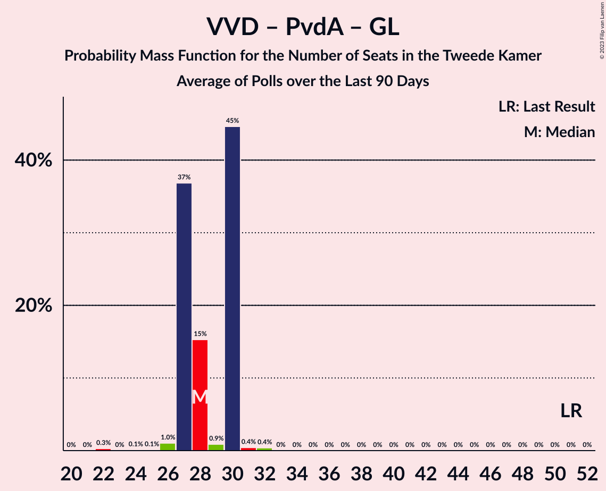

# Poll Average

<a href="#voting-intentions">Voting Intentions</a> | <a href="#seats">Seats</a> | <a href="#coalitions">Coalitions</a> | <a href="#technical-information">Technical Information</a>

## Summary

The table below lists the polls on which the average is based. They are the most recent polls (less than 90 days old) registered and analyzed so far.

| Period     | Polling firm/Commissioner(s) | VVD | D66 | PVV | CDA | SP | PvdA | GL | FvD | PvdD | CU | Volt | JA21 | SGP | DENK | 50+ | BBB | B1 | CO | Spl | PP | PvdT | BVNL | GL–PvdA | NSC |
|:----------:|:----------------------------:|:--:|:--:|:--:|:--:|:--:|:--:|:--:|:--:|:--:|:--:|:--:|:--:|:--:|:--:|:--:|:--:|:--:|:--:|:--:|:--:|:--:|:--:|:--:|:--:|
| 17 March 2021 | General Election | 21.9%   34 | 15.0%   24 | 10.8%   17 | 9.5%   15 | 6.0%   9 | 5.7%   9 | 5.2%   8 | 5.0%   8 | 3.8%   6 | 3.4%   5 | 2.4%   3 | 2.4%   3 | 2.1%   3 | 2.0%   3 | 1.0%   1 | 1.0%   1 | 0.8%   1 | 0.4%   0 | 0.3%   0 | 0.2%   0 | 0.0%   0 | 0.0%   0 | 10.9%   17 | 0.0%   0 |
| N/A | Poll Average | 15–19%   23–30 | 4–8%   5–11 | 8–12%   11–18 | 2–5%   3–8 | 2–4%   3–5 | N/A   N/A | N/A   N/A | 2–4%   2–6 | 4–7%   6–11 | 2–4%   2–5 | 2–4%   3–5 | 1–3%   1–5 | 1–3%   1–6 | 1–3%   1–3 | 0–1%   0–2 | 8–11%   12–16 | 0–1%   0–2 | N/A   N/A | N/A   N/A | N/A   N/A | N/A   N/A | 0–1%   0–1 | 11–19%   16–29 | 16–20%   25–31 |
| [22–23 September 2023](2023-09-23-Peilnl.html) | Peil.nl | 15–17%   24–26 | 4–5%   7 | 10–12%   16–18 | 3–5%   5–6 | 2–3%   4 | N/A   N/A | N/A   N/A | 3–4%   4–6 | 3–5%   6 | 2–3%   3 | 2–3%   4 | 1–2%   1 | 1–2%   1 | 1–2%   1–2 | 0–1%   0 | 8–10%   14–16 | 0%   0 | N/A   N/A | N/A   N/A | N/A   N/A | N/A   N/A | 0–1%   0–1 | 15–17%   24–27 | 17–19%   28–29 |
| [8–11 September 2023](2023-09-11-IOResearch.html) | I&O Research | 15–18%   22–27 | 3–5%   5–7 | 8–11%   12–17 | 2–4%   3–6 | 3–4%   4–5 | N/A   N/A | N/A   N/A | 2–4%   3–5 | 4–6%   5–8 | 2–4%   2–4 | 2–4%   3–6 | 1–2%   1–3 | 2–4%   3–5 | 1–2%   1–2 | 0–1%   0–1 | 8–10%   12–16 | 0–1%   0–1 | N/A   N/A | N/A   N/A | N/A   N/A | N/A   N/A | 0–1%   0–1 | 16–20%   24–32 | 16–20%   26–31 |
| [1–4 September 2023](2023-09-04-Ipsos.html) | Ipsos   EenVandaag | 15–20%   23–31 | 5–8%   8–11 | 8–12%   11–16 | 3–5%   3–8 | 1–3%   2–5 | N/A   N/A | N/A   N/A | 1–3%   2–4 | 5–8%   7–11 | 2–5%   3–6 | 1–3%   2–5 | 1–3%   2–5 | 2–4%   2–6 | 1–3%   2–4 | 0–1%   0–2 | 8–12%   11–16 | 0–1%   0–2 | N/A   N/A | N/A   N/A | N/A   N/A | N/A   N/A | N/A   N/A | 11–15%   16–23 | 15–20%   20–30 |
| 17 March 2021 | General Election | 21.9%   34 | 15.0%   24 | 10.8%   17 | 9.5%   15 | 6.0%   9 | 5.7%   9 | 5.2%   8 | 5.0%   8 | 3.8%   6 | 3.4%   5 | 2.4%   3 | 2.4%   3 | 2.1%   3 | 2.0%   3 | 1.0%   1 | 1.0%   1 | 0.8%   1 | 0.4%   0 | 0.3%   0 | 0.2%   0 | 0.0%   0 | 0.0%   0 | 10.9%   17 | 0.0%   0 |

Only polls for which at least the sample size has been published are included in the table above.

**Legend:**
+ **Top half of each row:** Voting intentions (95% confidence interval)
+ **Bottom half of each row:** Seat projections for the Tweede Kamer (95% confidence interval)
+ **VVD:** Volkspartij voor Vrijheid en Democratie
+ **D66:** Democraten 66
+ **PVV:** Partij voor de Vrijheid
+ **CDA:** Christen-Democratisch Appèl
+ **SP:** Socialistische Partij
+ **PvdA:** Partij van de Arbeid
+ **GL:** GroenLinks
+ **FvD:** Forum voor Democratie
+ **PvdD:** Partij voor de Dieren
+ **CU:** ChristenUnie
+ **Volt:** Volt Europa
+ **JA21:** Juiste Antwoord 2021
+ **SGP:** Staatkundig Gereformeerde Partij
+ **DENK:** DENK
+ **50+:** 50Plus
+ **BBB:** BoerBurgerBeweging
+ **B1:** Bij1
+ **CO:** Code Oranje
+ **Spl:** Splinter
+ **PP:** Piratenpartij
+ **PvdT:** Partij voor de Toekomst
+ **BVNL:** Belang van Nederland
+ **GL–PvdA:** GroenLinks–Partij van de Arbeid
+ **NSC:** Nieuw Sociaal Contract
+ **N/A (single party):** Party not included the published results
+ **N/A (entire row):** Calculation for this opinion poll not started yet

## Voting Intentions

### Confidence Intervals

| Party | Last Result | Median | 80% Confidence Interval | 90% Confidence Interval | 95% Confidence Interval | 99% Confidence Interval |
|:-----:|:-----------:|:------:|:-----------------------:|:-----------------------:|:-----------------------:|:-----------------------:|
| <a href="#volkspartij-voor-vrijheid-en-democratie">Volkspartij voor Vrijheid en Democratie</a> | 21.9% | 16.4% | 15.3–18.0% |15.0–18.5% | 14.7–19.0% | 14.2–19.9% |
| <a href="#democraten-66">Democraten 66</a> | 15.0% | 4.8% | 3.9–7.2% |3.7–7.6% | 3.5–8.0% | 3.2–8.7% |
| <a href="#groenlinks–partij-van-de-arbeid">GroenLinks–Partij van de Arbeid</a> | 10.9% | 15.9% | 12.2–18.1% |11.7–18.6% | 11.3–19.0% | 10.6–19.7% |
| <a href="#partij-voor-de-vrijheid">Partij voor de Vrijheid</a> | 10.8% | 9.9% | 8.5–11.7% |8.2–11.9% | 7.9–12.2% | 7.4–12.6% |
| <a href="#christen-democratisch-appèl">Christen-Democratisch Appèl</a> | 9.5% | 3.6% | 2.4–4.4% |2.2–4.6% | 2.1–4.8% | 1.9–5.3% |
| <a href="#socialistische-partij">Socialistische Partij</a> | 6.0% | 2.8% | 2.0–3.6% |1.8–3.8% | 1.7–4.0% | 1.4–4.4% |
| <a href="#partij-van-de-arbeid">Partij van de Arbeid</a> | 5.7% | N/A | N/A |N/A | N/A | N/A |
| <a href="#groenlinks">GroenLinks</a> | 5.2% | N/A | N/A |N/A | N/A | N/A |
| <a href="#forum-voor-democratie">Forum voor Democratie</a> | 5.0% | 2.8% | 1.9–3.6% |1.7–3.7% | 1.6–3.9% | 1.3–4.1% |
| <a href="#partij-voor-de-dieren">Partij voor de Dieren</a> | 3.8% | 4.9% | 3.8–6.7% |3.7–7.1% | 3.5–7.4% | 3.3–8.1% |
| <a href="#christenunie">ChristenUnie</a> | 3.4% | 2.8% | 2.3–3.7% |2.2–4.0% | 2.1–4.3% | 1.9–4.8% |
| <a href="#volt-europa">Volt Europa</a> | 2.4% | 2.6% | 2.0–3.2% |1.8–3.3% | 1.7–3.5% | 1.4–3.8% |
| <a href="#juiste-antwoord-2021">Juiste Antwoord 2021</a> | 2.4% | 1.5% | 1.1–2.4% |1.0–2.7% | 0.9–2.9% | 0.8–3.4% |
| <a href="#staatkundig-gereformeerde-partij">Staatkundig Gereformeerde Partij</a> | 2.1% | 2.2% | 1.2–3.0% |1.2–3.2% | 1.1–3.4% | 1.0–3.8% |
| <a href="#denk">DENK</a> | 2.0% | 1.5% | 1.1–2.3% |1.0–2.6% | 0.9–2.8% | 0.8–3.3% |
| <a href="#50plus">50Plus</a> | 1.0% | 0.6% | 0.3–1.0% |0.2–1.0% | 0.2–1.1% | 0.1–1.3% |
| <a href="#boerburgerbeweging">BoerBurgerBeweging</a> | 1.0% | 9.3% | 8.3–10.3% |8.1–10.6% | 7.8–11.0% | 7.4–11.7% |
| <a href="#bij1">Bij1</a> | 0.8% | 0.3% | 0.1–0.8% |0.1–0.9% | 0.1–1.0% | 0.1–1.3% |
| <a href="#code-oranje">Code Oranje</a> | 0.4% | N/A | N/A |N/A | N/A | N/A |
| <a href="#splinter">Splinter</a> | 0.3% | N/A | N/A |N/A | N/A | N/A |
| <a href="#piratenpartij">Piratenpartij</a> | 0.2% | N/A | N/A |N/A | N/A | N/A |
| <a href="#partij-voor-de-toekomst">Partij voor de Toekomst</a> | 0.0% | N/A | N/A |N/A | N/A | N/A |
| <a href="#belang-van-nederland">Belang van Nederland</a> | 0.0% | 0.6% | 0.4–0.9% |0.3–0.9% | 0.3–1.0% | 0.2–1.1% |
| <a href="#nieuw-sociaal-contract">Nieuw Sociaal Contract</a> | 0.0% | 17.8% | 16.5–19.0% |16.0–19.4% | 15.6–19.8% | 14.8–20.5% |

### Volkspartij voor Vrijheid en Democratie

*For a full overview of the results for this party, see the [Volkspartij voor Vrijheid en Democratie](party-volkspartijvoorvrijheidendemocratie.html) page.*

| Voting Intentions | Probability | Accumulated | Special Marks |
|:-----------------:|:-----------:|:-----------:|:-------------:|
| 12.5–13.5% | 0% | 100% |  |
| 13.5–14.5% | 1.4% | 100% |  |
| 14.5–15.5% | 15% | 98.6% |  |
| 15.5–16.5% | 38% | 83% | Median |
| 16.5–17.5% | 28% | 45% |  |
| 17.5–18.5% | 12% | 17% |  |
| 18.5–19.5% | 4% | 5% |  |
| 19.5–20.5% | 0.9% | 1.0% |  |
| 20.5–21.5% | 0.1% | 0.1% |  |
| 21.5–22.5% | 0% | 0% | Last Result |

### Democraten 66

*For a full overview of the results for this party, see the [Democraten 66](party-democraten66.html) page.*

| Voting Intentions | Probability | Accumulated | Special Marks |
|:-----------------:|:-----------:|:-----------:|:-------------:|
| 1.5–2.5% | 0% | 100% |  |
| 2.5–3.5% | 3% | 100% |  |
| 3.5–4.5% | 35% | 97% |  |
| 4.5–5.5% | 29% | 62% | Median |
| 5.5–6.5% | 12% | 32% |  |
| 6.5–7.5% | 14% | 20% |  |
| 7.5–8.5% | 5% | 6% |  |
| 8.5–9.5% | 0.7% | 0.7% |  |
| 9.5–10.5% | 0% | 0% |  |
| 10.5–11.5% | 0% | 0% |  |
| 11.5–12.5% | 0% | 0% |  |
| 12.5–13.5% | 0% | 0% |  |
| 13.5–14.5% | 0% | 0% |  |
| 14.5–15.5% | 0% | 0% | Last Result |

### GroenLinks–Partij van de Arbeid

*For a full overview of the results for this party, see the [GroenLinks–Partij van de Arbeid](party-groenlinks–partijvandearbeid.html) page.*

| Voting Intentions | Probability | Accumulated | Special Marks |
|:-----------------:|:-----------:|:-----------:|:-------------:|
| 8.5–9.5% | 0% | 100% |  |
| 9.5–10.5% | 0.5% | 100% |  |
| 10.5–11.5% | 3% | 99.5% | Last Result |
| 11.5–12.5% | 10% | 96% |  |
| 12.5–13.5% | 12% | 87% |  |
| 13.5–14.5% | 7% | 75% |  |
| 14.5–15.5% | 11% | 68% |  |
| 15.5–16.5% | 22% | 57% | Median |
| 16.5–17.5% | 17% | 35% |  |
| 17.5–18.5% | 13% | 18% |  |
| 18.5–19.5% | 5% | 5% |  |
| 19.5–20.5% | 0.7% | 0.7% |  |
| 20.5–21.5% | 0% | 0% |  |
| 21.5–22.5% | 0% | 0% |  |

### Partij voor de Vrijheid

*For a full overview of the results for this party, see the [Partij voor de Vrijheid](party-partijvoordevrijheid.html) page.*

| Voting Intentions | Probability | Accumulated | Special Marks |
|:-----------------:|:-----------:|:-----------:|:-------------:|
| 5.5–6.5% | 0% | 100% |  |
| 6.5–7.5% | 0.7% | 100% |  |
| 7.5–8.5% | 11% | 99.2% |  |
| 8.5–9.5% | 30% | 88% |  |
| 9.5–10.5% | 22% | 59% | Median |
| 10.5–11.5% | 24% | 36% | Last Result |
| 11.5–12.5% | 11% | 12% |  |
| 12.5–13.5% | 0.7% | 0.7% |  |
| 13.5–14.5% | 0% | 0% |  |

### Christen-Democratisch Appèl

*For a full overview of the results for this party, see the [Christen-Democratisch Appèl](party-christen-democratischappèl.html) page.*

| Voting Intentions | Probability | Accumulated | Special Marks |
|:-----------------:|:-----------:|:-----------:|:-------------:|
| 0.5–1.5% | 0% | 100% |  |
| 1.5–2.5% | 14% | 100% |  |
| 2.5–3.5% | 34% | 86% |  |
| 3.5–4.5% | 46% | 53% | Median |
| 4.5–5.5% | 6% | 7% |  |
| 5.5–6.5% | 0.2% | 0.2% |  |
| 6.5–7.5% | 0% | 0% |  |
| 7.5–8.5% | 0% | 0% |  |
| 8.5–9.5% | 0% | 0% |  |
| 9.5–10.5% | 0% | 0% | Last Result |

### Socialistische Partij

*For a full overview of the results for this party, see the [Socialistische Partij](party-socialistischepartij.html) page.*

| Voting Intentions | Probability | Accumulated | Special Marks |
|:-----------------:|:-----------:|:-----------:|:-------------:|
| 0.0–0.5% | 0% | 100% |  |
| 0.5–1.5% | 1.4% | 100% |  |
| 1.5–2.5% | 33% | 98.6% |  |
| 2.5–3.5% | 55% | 66% | Median |
| 3.5–4.5% | 10% | 10% |  |
| 4.5–5.5% | 0.2% | 0.2% |  |
| 5.5–6.5% | 0% | 0% | Last Result |

### Forum voor Democratie

*For a full overview of the results for this party, see the [Forum voor Democratie](party-forumvoordemocratie.html) page.*

| Voting Intentions | Probability | Accumulated | Special Marks |
|:-----------------:|:-----------:|:-----------:|:-------------:|
| 0.0–0.5% | 0% | 100% |  |
| 0.5–1.5% | 2% | 100% |  |
| 1.5–2.5% | 36% | 98% |  |
| 2.5–3.5% | 51% | 61% | Median |
| 3.5–4.5% | 10% | 10% |  |
| 4.5–5.5% | 0% | 0% | Last Result |

### Partij voor de Dieren

*For a full overview of the results for this party, see the [Partij voor de Dieren](party-partijvoordedieren.html) page.*

| Voting Intentions | Probability | Accumulated | Special Marks |
|:-----------------:|:-----------:|:-----------:|:-------------:|
| 1.5–2.5% | 0% | 100% |  |
| 2.5–3.5% | 3% | 100% |  |
| 3.5–4.5% | 36% | 97% | Last Result |
| 4.5–5.5% | 30% | 61% | Median |
| 5.5–6.5% | 20% | 32% |  |
| 6.5–7.5% | 10% | 11% |  |
| 7.5–8.5% | 2% | 2% |  |
| 8.5–9.5% | 0.1% | 0.1% |  |
| 9.5–10.5% | 0% | 0% |  |

### ChristenUnie

*For a full overview of the results for this party, see the [ChristenUnie](party-christenunie.html) page.*

| Voting Intentions | Probability | Accumulated | Special Marks |
|:-----------------:|:-----------:|:-----------:|:-------------:|
| 0.5–1.5% | 0% | 100% |  |
| 1.5–2.5% | 26% | 100% |  |
| 2.5–3.5% | 61% | 74% | Last Result, Median |
| 3.5–4.5% | 12% | 13% |  |
| 4.5–5.5% | 1.1% | 1.1% |  |
| 5.5–6.5% | 0% | 0% |  |

### Volt Europa

*For a full overview of the results for this party, see the [Volt Europa](party-volteuropa.html) page.*

| Voting Intentions | Probability | Accumulated | Special Marks |
|:-----------------:|:-----------:|:-----------:|:-------------:|
| 0.0–0.5% | 0% | 100% |  |
| 0.5–1.5% | 1.4% | 100% |  |
| 1.5–2.5% | 41% | 98.6% | Last Result |
| 2.5–3.5% | 55% | 57% | Median |
| 3.5–4.5% | 2% | 2% |  |
| 4.5–5.5% | 0% | 0% |  |

### Juiste Antwoord 2021

*For a full overview of the results for this party, see the [Juiste Antwoord 2021](party-juisteantwoord2021.html) page.*

| Voting Intentions | Probability | Accumulated | Special Marks |
|:-----------------:|:-----------:|:-----------:|:-------------:|
| 0.0–0.5% | 0% | 100% |  |
| 0.5–1.5% | 56% | 100% | Median |
| 1.5–2.5% | 36% | 44% | Last Result |
| 2.5–3.5% | 8% | 8% |  |
| 3.5–4.5% | 0.3% | 0.3% |  |
| 4.5–5.5% | 0% | 0% |  |

### Staatkundig Gereformeerde Partij

*For a full overview of the results for this party, see the [Staatkundig Gereformeerde Partij](party-staatkundiggereformeerdepartij.html) page.*

| Voting Intentions | Probability | Accumulated | Special Marks |
|:-----------------:|:-----------:|:-----------:|:-------------:|
| 0.0–0.5% | 0% | 100% |  |
| 0.5–1.5% | 28% | 100% |  |
| 1.5–2.5% | 39% | 72% | Last Result, Median |
| 2.5–3.5% | 32% | 33% |  |
| 3.5–4.5% | 1.3% | 1.4% |  |
| 4.5–5.5% | 0% | 0% |  |

### DENK

*For a full overview of the results for this party, see the [DENK](party-denk.html) page.*

| Voting Intentions | Probability | Accumulated | Special Marks |
|:-----------------:|:-----------:|:-----------:|:-------------:|
| 0.0–0.5% | 0% | 100% |  |
| 0.5–1.5% | 57% | 100% | Median |
| 1.5–2.5% | 37% | 43% | Last Result |
| 2.5–3.5% | 6% | 6% |  |
| 3.5–4.5% | 0.1% | 0.1% |  |
| 4.5–5.5% | 0% | 0% |  |

### 50Plus

*For a full overview of the results for this party, see the [50Plus](party-50plus.html) page.*

| Voting Intentions | Probability | Accumulated | Special Marks |
|:-----------------:|:-----------:|:-----------:|:-------------:|
| 0.0–0.5% | 35% | 100% |  |
| 0.5–1.5% | 65% | 65% | Last Result, Median |
| 1.5–2.5% | 0.1% | 0.1% |  |
| 2.5–3.5% | 0% | 0% |  |

### BoerBurgerBeweging

*For a full overview of the results for this party, see the [BoerBurgerBeweging](party-boerburgerbeweging.html) page.*

| Voting Intentions | Probability | Accumulated | Special Marks |
|:-----------------:|:-----------:|:-----------:|:-------------:|
| 0.5–1.5% | 0% | 100% | Last Result |
| 1.5–2.5% | 0% | 100% |  |
| 2.5–3.5% | 0% | 100% |  |
| 3.5–4.5% | 0% | 100% |  |
| 4.5–5.5% | 0% | 100% |  |
| 5.5–6.5% | 0% | 100% |  |
| 6.5–7.5% | 0.9% | 100% |  |
| 7.5–8.5% | 15% | 99.1% |  |
| 8.5–9.5% | 50% | 84% | Median |
| 9.5–10.5% | 28% | 34% |  |
| 10.5–11.5% | 5% | 6% |  |
| 11.5–12.5% | 0.7% | 0.8% |  |
| 12.5–13.5% | 0.1% | 0.1% |  |
| 13.5–14.5% | 0% | 0% |  |

### Bij1

*For a full overview of the results for this party, see the [Bij1](party-bij1.html) page.*

| Voting Intentions | Probability | Accumulated | Special Marks |
|:-----------------:|:-----------:|:-----------:|:-------------:|
| 0.0–0.5% | 77% | 100% | Median |
| 0.5–1.5% | 23% | 23% | Last Result |
| 1.5–2.5% | 0.1% | 0.1% |  |
| 2.5–3.5% | 0% | 0% |  |

### Belang van Nederland

*For a full overview of the results for this party, see the [Belang van Nederland](party-belangvannederland.html) page.*

| Voting Intentions | Probability | Accumulated | Special Marks |
|:-----------------:|:-----------:|:-----------:|:-------------:|
| 0.0–0.5% | 36% | 100% | Last Result |
| 0.5–1.5% | 64% | 64% | Median |
| 1.5–2.5% | 0% | 0% |  |

### Nieuw Sociaal Contract

*For a full overview of the results for this party, see the [Nieuw Sociaal Contract](party-nieuwsociaalcontract.html) page.*

| Voting Intentions | Probability | Accumulated | Special Marks |
|:-----------------:|:-----------:|:-----------:|:-------------:|
| 0.0–0.5% | 0% | 100% | Last Result |
| 0.5–1.5% | 0% | 100% |  |
| 1.5–2.5% | 0% | 100% |  |
| 2.5–3.5% | 0% | 100% |  |
| 3.5–4.5% | 0% | 100% |  |
| 4.5–5.5% | 0% | 100% |  |
| 5.5–6.5% | 0% | 100% |  |
| 6.5–7.5% | 0% | 100% |  |
| 7.5–8.5% | 0% | 100% |  |
| 8.5–9.5% | 0% | 100% |  |
| 9.5–10.5% | 0% | 100% |  |
| 10.5–11.5% | 0% | 100% |  |
| 11.5–12.5% | 0% | 100% |  |
| 12.5–13.5% | 0% | 100% |  |
| 13.5–14.5% | 0.3% | 100% |  |
| 14.5–15.5% | 2% | 99.7% |  |
| 15.5–16.5% | 9% | 98% |  |
| 16.5–17.5% | 27% | 89% |  |
| 17.5–18.5% | 40% | 62% | Median |
| 18.5–19.5% | 18% | 22% |  |
| 19.5–20.5% | 3% | 4% |  |
| 20.5–21.5% | 0.4% | 0.4% |  |
| 21.5–22.5% | 0% | 0% |  |

## Seats

### Confidence Intervals

| Party | Last Result | Median | 80% Confidence Interval | 90% Confidence Interval | 95% Confidence Interval | 99% Confidence Interval |
|:-----:|:-----------:|:------:|:-----------------------:|:-----------------------:|:-----------------------:|:-----------------------:|
| <a href="#volkspartij-voor-vrijheid-en-democratie">Volkspartij voor Vrijheid en Democratie</a> | 34 | 26 | 25–27 |24–27 | 23–30 | 22–31 |
| <a href="#democraten-66">Democraten 66</a> | 24 | 7 | 5–10 |5–11 | 5–11 | 5–11 |
| <a href="#groenlinks–partij-van-de-arbeid">GroenLinks–Partij van de Arbeid</a> | 17 | 25 | 16–25 |16–27 | 16–29 | 16–32 |
| <a href="#partij-voor-de-vrijheid">Partij voor de Vrijheid</a> | 17 | 15 | 12–18 |12–18 | 11–18 | 11–18 |
| <a href="#christen-democratisch-appèl">Christen-Democratisch Appèl</a> | 15 | 6 | 3–8 |3–8 | 3–8 | 2–8 |
| <a href="#socialistische-partij">Socialistische Partij</a> | 9 | 4 | 4–5 |4–5 | 3–5 | 1–6 |
| <a href="#partij-van-de-arbeid">Partij van de Arbeid</a> | 9 | N/A | N/A |N/A | N/A | N/A |
| <a href="#groenlinks">GroenLinks</a> | 8 | N/A | N/A |N/A | N/A | N/A |
| <a href="#forum-voor-democratie">Forum voor Democratie</a> | 8 | 4 | 3–4 |3–4 | 2–6 | 2–6 |
| <a href="#partij-voor-de-dieren">Partij voor de Dieren</a> | 6 | 7 | 6–9 |6–10 | 6–11 | 5–12 |
| <a href="#christenunie">ChristenUnie</a> | 5 | 3 | 2–4 |2–5 | 2–5 | 2–6 |
| <a href="#volt-europa">Volt Europa</a> | 3 | 4 | 3–4 |3–5 | 3–5 | 2–6 |
| <a href="#juiste-antwoord-2021">Juiste Antwoord 2021</a> | 3 | 1 | 1–5 |1–5 | 1–5 | 1–5 |
| <a href="#staatkundig-gereformeerde-partij">Staatkundig Gereformeerde Partij</a> | 3 | 3 | 1–6 |1–6 | 1–6 | 1–6 |
| <a href="#denk">DENK</a> | 3 | 2 | 2–3 |2–3 | 1–3 | 1–4 |
| <a href="#50plus">50Plus</a> | 1 | 0 | 0–1 |0–2 | 0–2 | 0–2 |
| <a href="#boerburgerbeweging">BoerBurgerBeweging</a> | 1 | 14 | 14–15 |13–16 | 12–16 | 11–17 |
| <a href="#bij1">Bij1</a> | 1 | 0 | 0–1 |0–1 | 0–2 | 0–2 |
| <a href="#code-oranje">Code Oranje</a> | 0 | N/A | N/A |N/A | N/A | N/A |
| <a href="#splinter">Splinter</a> | 0 | N/A | N/A |N/A | N/A | N/A |
| <a href="#piratenpartij">Piratenpartij</a> | 0 | N/A | N/A |N/A | N/A | N/A |
| <a href="#partij-voor-de-toekomst">Partij voor de Toekomst</a> | 0 | N/A | N/A |N/A | N/A | N/A |
| <a href="#belang-van-nederland">Belang van Nederland</a> | 0 | 1 | 0–1 |0–1 | 0–1 | 0–1 |
| <a href="#nieuw-sociaal-contract">Nieuw Sociaal Contract</a> | 0 | 28 | 25–28 |25–30 | 25–31 | 20–32 |

### Volkspartij voor Vrijheid en Democratie

*For a full overview of the results for this party, see the [Volkspartij voor Vrijheid en Democratie](party-volkspartijvoorvrijheidendemocratie.html) page.*

| Number of Seats | Probability | Accumulated | Special Marks |
|:---------------:|:-----------:|:-----------:|:-------------:|
| 20 | 0.1% | 100% |  |
| 21 | 0.1% | 99.9% |  |
| 22 | 2% | 99.8% |  |
| 23 | 2% | 98% |  |
| 24 | 4% | 95% |  |
| 25 | 26% | 91% |  |
| 26 | 40% | 64% | Median |
| 27 | 19% | 24% |  |
| 28 | 2% | 5% |  |
| 29 | 0.2% | 3% |  |
| 30 | 1.0% | 3% |  |
| 31 | 2% | 2% |  |
| 32 | 0.1% | 0.1% |  |
| 33 | 0% | 0% |  |
| 34 | 0% | 0% | Last Result |

### Democraten 66

*For a full overview of the results for this party, see the [Democraten 66](party-democraten66.html) page.*

| Number of Seats | Probability | Accumulated | Special Marks |
|:---------------:|:-----------:|:-----------:|:-------------:|
| 4 | 0.1% | 100% |  |
| 5 | 17% | 99.8% |  |
| 6 | 5% | 83% |  |
| 7 | 44% | 78% | Median |
| 8 | 2% | 34% |  |
| 9 | 20% | 32% |  |
| 10 | 2% | 12% |  |
| 11 | 9% | 10% |  |
| 12 | 0.1% | 0.4% |  |
| 13 | 0.1% | 0.3% |  |
| 14 | 0% | 0.2% |  |
| 15 | 0.2% | 0.2% |  |
| 16 | 0% | 0% |  |
| 17 | 0% | 0% |  |
| 18 | 0% | 0% |  |
| 19 | 0% | 0% |  |
| 20 | 0% | 0% |  |
| 21 | 0% | 0% |  |
| 22 | 0% | 0% |  |
| 23 | 0% | 0% |  |
| 24 | 0% | 0% | Last Result |

### GroenLinks–Partij van de Arbeid

*For a full overview of the results for this party, see the [GroenLinks–Partij van de Arbeid](party-groenlinks–partijvandearbeid.html) page.*

| Number of Seats | Probability | Accumulated | Special Marks |
|:---------------:|:-----------:|:-----------:|:-------------:|
| 14 | 0.3% | 100% |  |
| 15 | 0.1% | 99.6% |  |
| 16 | 16% | 99.6% |  |
| 17 | 0.4% | 84% | Last Result |
| 18 | 0.5% | 83% |  |
| 19 | 3% | 83% |  |
| 20 | 0.2% | 80% |  |
| 21 | 9% | 80% |  |
| 22 | 2% | 71% |  |
| 23 | 2% | 69% |  |
| 24 | 12% | 67% |  |
| 25 | 48% | 55% | Median |
| 26 | 0.4% | 7% |  |
| 27 | 3% | 7% |  |
| 28 | 0.5% | 4% |  |
| 29 | 2% | 4% |  |
| 30 | 0.2% | 2% |  |
| 31 | 0.3% | 2% |  |
| 32 | 1.4% | 1.4% |  |
| 33 | 0% | 0% |  |

### Partij voor de Vrijheid

*For a full overview of the results for this party, see the [Partij voor de Vrijheid](party-partijvoordevrijheid.html) page.*

| Number of Seats | Probability | Accumulated | Special Marks |
|:---------------:|:-----------:|:-----------:|:-------------:|
| 9 | 0.1% | 100% |  |
| 10 | 0% | 99.9% |  |
| 11 | 3% | 99.9% |  |
| 12 | 10% | 97% |  |
| 13 | 7% | 87% |  |
| 14 | 17% | 80% |  |
| 15 | 17% | 63% | Median |
| 16 | 5% | 46% |  |
| 17 | 11% | 42% | Last Result |
| 18 | 30% | 31% |  |
| 19 | 0.1% | 0.4% |  |
| 20 | 0.3% | 0.3% |  |
| 21 | 0% | 0% |  |

### Christen-Democratisch Appèl

*For a full overview of the results for this party, see the [Christen-Democratisch Appèl](party-christen-democratischappèl.html) page.*

| Number of Seats | Probability | Accumulated | Special Marks |
|:---------------:|:-----------:|:-----------:|:-------------:|
| 2 | 0.8% | 100% |  |
| 3 | 13% | 99.2% |  |
| 4 | 7% | 87% |  |
| 5 | 6% | 79% |  |
| 6 | 55% | 73% | Median |
| 7 | 0.8% | 18% |  |
| 8 | 18% | 18% |  |
| 9 | 0% | 0% |  |
| 10 | 0% | 0% |  |
| 11 | 0% | 0% |  |
| 12 | 0% | 0% |  |
| 13 | 0% | 0% |  |
| 14 | 0% | 0% |  |
| 15 | 0% | 0% | Last Result |

### Socialistische Partij

*For a full overview of the results for this party, see the [Socialistische Partij](party-socialistischepartij.html) page.*

| Number of Seats | Probability | Accumulated | Special Marks |
|:---------------:|:-----------:|:-----------:|:-------------:|
| 1 | 0.6% | 100% |  |
| 2 | 1.3% | 99.4% |  |
| 3 | 3% | 98% |  |
| 4 | 73% | 95% | Median |
| 5 | 22% | 23% |  |
| 6 | 0.5% | 0.6% |  |
| 7 | 0.2% | 0.2% |  |
| 8 | 0% | 0% |  |
| 9 | 0% | 0% | Last Result |

### Partij van de Arbeid

*For a full overview of the results for this party, see the [Partij van de Arbeid](party-partijvandearbeid.html) page.*

### GroenLinks

*For a full overview of the results for this party, see the [GroenLinks](party-groenlinks.html) page.*

### Forum voor Democratie

*For a full overview of the results for this party, see the [Forum voor Democratie](party-forumvoordemocratie.html) page.*

| Number of Seats | Probability | Accumulated | Special Marks |
|:---------------:|:-----------:|:-----------:|:-------------:|
| 1 | 0.2% | 100% |  |
| 2 | 2% | 99.8% |  |
| 3 | 34% | 97% |  |
| 4 | 59% | 64% | Median |
| 5 | 2% | 4% |  |
| 6 | 3% | 3% |  |
| 7 | 0% | 0% |  |
| 8 | 0% | 0% | Last Result |

### Partij voor de Dieren

*For a full overview of the results for this party, see the [Partij voor de Dieren](party-partijvoordedieren.html) page.*

| Number of Seats | Probability | Accumulated | Special Marks |
|:---------------:|:-----------:|:-----------:|:-------------:|
| 5 | 1.1% | 100% |  |
| 6 | 43% | 98.9% | Last Result |
| 7 | 6% | 56% | Median |
| 8 | 34% | 50% |  |
| 9 | 10% | 16% |  |
| 10 | 0.6% | 5% |  |
| 11 | 4% | 5% |  |
| 12 | 0.2% | 0.7% |  |
| 13 | 0.3% | 0.5% |  |
| 14 | 0.1% | 0.1% |  |
| 15 | 0% | 0% |  |

### ChristenUnie

*For a full overview of the results for this party, see the [ChristenUnie](party-christenunie.html) page.*

| Number of Seats | Probability | Accumulated | Special Marks |
|:---------------:|:-----------:|:-----------:|:-------------:|
| 2 | 17% | 100% |  |
| 3 | 54% | 83% | Median |
| 4 | 24% | 29% |  |
| 5 | 3% | 6% | Last Result |
| 6 | 2% | 2% |  |
| 7 | 0.3% | 0.4% |  |
| 8 | 0% | 0% |  |

### Volt Europa

*For a full overview of the results for this party, see the [Volt Europa](party-volteuropa.html) page.*

| Number of Seats | Probability | Accumulated | Special Marks |
|:---------------:|:-----------:|:-----------:|:-------------:|
| 2 | 2% | 100% |  |
| 3 | 30% | 98% | Last Result |
| 4 | 62% | 68% | Median |
| 5 | 4% | 6% |  |
| 6 | 2% | 2% |  |
| 7 | 0.1% | 0.1% |  |
| 8 | 0% | 0% |  |

### Juiste Antwoord 2021

*For a full overview of the results for this party, see the [Juiste Antwoord 2021](party-juisteantwoord2021.html) page.*

| Number of Seats | Probability | Accumulated | Special Marks |
|:---------------:|:-----------:|:-----------:|:-------------:|
| 0 | 0.1% | 100% |  |
| 1 | 51% | 99.9% | Median |
| 2 | 15% | 49% |  |
| 3 | 21% | 34% | Last Result |
| 4 | 2% | 12% |  |
| 5 | 10% | 10% |  |
| 6 | 0.1% | 0.1% |  |
| 7 | 0% | 0% |  |

### Staatkundig Gereformeerde Partij

*For a full overview of the results for this party, see the [Staatkundig Gereformeerde Partij](party-staatkundiggereformeerdepartij.html) page.*

| Number of Seats | Probability | Accumulated | Special Marks |
|:---------------:|:-----------:|:-----------:|:-------------:|
| 1 | 33% | 100% |  |
| 2 | 6% | 67% |  |
| 3 | 14% | 62% | Last Result, Median |
| 4 | 14% | 48% |  |
| 5 | 17% | 34% |  |
| 6 | 16% | 16% |  |
| 7 | 0% | 0% |  |

### DENK

*For a full overview of the results for this party, see the [DENK](party-denk.html) page.*

| Number of Seats | Probability | Accumulated | Special Marks |
|:---------------:|:-----------:|:-----------:|:-------------:|
| 0 | 0.3% | 100% |  |
| 1 | 4% | 99.7% |  |
| 2 | 67% | 95% | Median |
| 3 | 28% | 29% | Last Result |
| 4 | 0.7% | 0.9% |  |
| 5 | 0.2% | 0.2% |  |
| 6 | 0% | 0% |  |

### 50Plus

*For a full overview of the results for this party, see the [50Plus](party-50plus.html) page.*

| Number of Seats | Probability | Accumulated | Special Marks |
|:---------------:|:-----------:|:-----------:|:-------------:|
| 0 | 69% | 100% | Median |
| 1 | 23% | 31% | Last Result |
| 2 | 8% | 8% |  |
| 3 | 0.1% | 0.1% |  |
| 4 | 0% | 0% |  |

### BoerBurgerBeweging

*For a full overview of the results for this party, see the [BoerBurgerBeweging](party-boerburgerbeweging.html) page.*

| Number of Seats | Probability | Accumulated | Special Marks |
|:---------------:|:-----------:|:-----------:|:-------------:|
| 1 | 0% | 100% | Last Result |
| 2 | 0% | 100% |  |
| 3 | 0% | 100% |  |
| 4 | 0% | 100% |  |
| 5 | 0% | 100% |  |
| 6 | 0% | 100% |  |
| 7 | 0% | 100% |  |
| 8 | 0% | 100% |  |
| 9 | 0% | 100% |  |
| 10 | 0% | 100% |  |
| 11 | 2% | 100% |  |
| 12 | 2% | 98% |  |
| 13 | 6% | 96% |  |
| 14 | 55% | 90% | Median |
| 15 | 29% | 35% |  |
| 16 | 5% | 6% |  |
| 17 | 0.2% | 0.7% |  |
| 18 | 0.3% | 0.4% |  |
| 19 | 0.1% | 0.2% |  |
| 20 | 0% | 0.1% |  |
| 21 | 0.1% | 0.1% |  |
| 22 | 0% | 0% |  |

### Bij1

*For a full overview of the results for this party, see the [Bij1](party-bij1.html) page.*

| Number of Seats | Probability | Accumulated | Special Marks |
|:---------------:|:-----------:|:-----------:|:-------------:|
| 0 | 77% | 100% | Median |
| 1 | 20% | 23% | Last Result |
| 2 | 3% | 3% |  |
| 3 | 0.2% | 0.2% |  |
| 4 | 0% | 0% |  |

### Code Oranje

*For a full overview of the results for this party, see the [Code Oranje](party-codeoranje.html) page.*

### Splinter

*For a full overview of the results for this party, see the [Splinter](party-splinter.html) page.*

### Piratenpartij

*For a full overview of the results for this party, see the [Piratenpartij](party-piratenpartij.html) page.*

### Partij voor de Toekomst

*For a full overview of the results for this party, see the [Partij voor de Toekomst](party-partijvoordetoekomst.html) page.*

### Belang van Nederland

*For a full overview of the results for this party, see the [Belang van Nederland](party-belangvannederland.html) page.*

| Number of Seats | Probability | Accumulated | Special Marks |
|:---------------:|:-----------:|:-----------:|:-------------:|
| 0 | 49% | 100% | Last Result |
| 1 | 51% | 51% | Median |
| 2 | 0% | 0% |  |

### Nieuw Sociaal Contract

*For a full overview of the results for this party, see the [Nieuw Sociaal Contract](party-nieuwsociaalcontract.html) page.*

| Number of Seats | Probability | Accumulated | Special Marks |
|:---------------:|:-----------:|:-----------:|:-------------:|
| 0 | 0% | 100% | Last Result |
| 1 | 0% | 100% |  |
| 2 | 0% | 100% |  |
| 3 | 0% | 100% |  |
| 4 | 0% | 100% |  |
| 5 | 0% | 100% |  |
| 6 | 0% | 100% |  |
| 7 | 0% | 100% |  |
| 8 | 0% | 100% |  |
| 9 | 0% | 100% |  |
| 10 | 0% | 100% |  |
| 11 | 0% | 100% |  |
| 12 | 0% | 100% |  |
| 13 | 0% | 100% |  |
| 14 | 0% | 100% |  |
| 15 | 0% | 100% |  |
| 16 | 0% | 100% |  |
| 17 | 0% | 100% |  |
| 18 | 0% | 100% |  |
| 19 | 0% | 100% |  |
| 20 | 1.1% | 100% |  |
| 21 | 0% | 98.9% |  |
| 22 | 0.1% | 98.9% |  |
| 23 | 1.2% | 98.8% |  |
| 24 | 0.2% | 98% |  |
| 25 | 8% | 98% |  |
| 26 | 4% | 89% |  |
| 27 | 27% | 85% |  |
| 28 | 49% | 58% | Median |
| 29 | 4% | 10% |  |
| 30 | 3% | 6% |  |
| 31 | 2% | 3% |  |
| 32 | 0.3% | 0.8% |  |
| 33 | 0.5% | 0.5% |  |
| 34 | 0% | 0% |  |

## Coalitions

### Confidence Intervals

| Coalition | Last Result | Median | Majority? | 80% Confidence Interval | 90% Confidence Interval | 95% Confidence Interval | 99% Confidence Interval |
|:---------:|:-----------:|:------:|:---------:|:-----------------------:|:-----------------------:|:-----------------------:|:-----------------------:|
| Volkspartij voor Vrijheid en Democratie – GroenLinks–Partij van de Arbeid – Christen-Democratisch Appèl – BoerBurgerBeweging | 67 | 71 | 0% | 65–71 | 65–72 | 64–73 | 60–74 |
| Volkspartij voor Vrijheid en Democratie – GroenLinks–Partij van de Arbeid – BoerBurgerBeweging | 52 | 65 | 0% | 57–65 | 57–67 | 57–68 | 53–70 |
| Volkspartij voor Vrijheid en Democratie – Democraten 66 – GroenLinks–Partij van de Arbeid | 75 | 57 | 0% | 52–58 | 52–61 | 52–62 | 50–63 |
| Volkspartij voor Vrijheid en Democratie – GroenLinks–Partij van de Arbeid – Christen-Democratisch Appèl | 66 | 56 | 0% | 51–57 | 51–58 | 51–59 | 47–61 |
| Volkspartij voor Vrijheid en Democratie – Partij voor de Vrijheid – Christen-Democratisch Appèl – Forum voor Democratie – Staatkundig Gereformeerde Partij | 77 | 54 | 0% | 49–59 | 47–59 | 46–59 | 45–60 |
| Volkspartij voor Vrijheid en Democratie – GroenLinks–Partij van de Arbeid | 51 | 50 | 0% | 43–51 | 43–53 | 43–55 | 41–57 |
| Volkspartij voor Vrijheid en Democratie – Partij voor de Vrijheid – Christen-Democratisch Appèl – Forum voor Democratie | 74 | 51 | 0% | 46–54 | 43–54 | 43–54 | 43–55 |
| Volkspartij voor Vrijheid en Democratie – Partij voor de Vrijheid – Christen-Democratisch Appèl | 66 | 49 | 0% | 43–50 | 40–50 | 40–50 | 39–52 |
| Volkspartij voor Vrijheid en Democratie – Christen-Democratisch Appèl – Partij van de Arbeid – GroenLinks – BoerBurgerBeweging | 67 | 46 | 0% | 44–49 | 42–49 | 41–49 | 39–52 |
| Volkspartij voor Vrijheid en Democratie – Christen-Democratisch Appèl – BoerBurgerBeweging | 50 | 46 | 0% | 44–49 | 42–49 | 41–49 | 39–52 |
| Volkspartij voor Vrijheid en Democratie – Democraten 66 – Christen-Democratisch Appèl – ChristenUnie | 78 | 42 | 0% | 38–48 | 38–48 | 37–49 | 36–51 |
| Democraten 66 – GroenLinks–Partij van de Arbeid – Christen-Democratisch Appèl – Socialistische Partij – ChristenUnie | 70 | 44 | 0% | 41–45 | 41–46 | 41–48 | 39–51 |
| Democraten 66 – GroenLinks–Partij van de Arbeid – Christen-Democratisch Appèl – ChristenUnie | 61 | 40 | 0% | 37–41 | 37–42 | 37–45 | 34–46 |
| Volkspartij voor Vrijheid en Democratie – Democraten 66 – Christen-Democratisch Appèl | 73 | 39 | 0% | 36–44 | 34–44 | 33–45 | 32–47 |
| Volkspartij voor Vrijheid en Democratie – Partij van de Arbeid – GroenLinks – BoerBurgerBeweging | 52 | 40 | 0% | 39–41 | 38–42 | 37–44 | 35–44 |
| Volkspartij voor Vrijheid en Democratie – Christen-Democratisch Appèl – Forum voor Democratie – Staatkundig Gereformeerde Partij – 50Plus | 61 | 37 | 0% | 36–44 | 35–44 | 34–44 | 33–44 |
| Volkspartij voor Vrijheid en Democratie – Christen-Democratisch Appèl – Forum voor Democratie – Staatkundig Gereformeerde Partij | 60 | 37 | 0% | 36–44 | 34–44 | 34–44 | 33–44 |
| GroenLinks–Partij van de Arbeid – BoerBurgerBeweging | 18 | 39 | 0% | 30–40 | 30–42 | 30–43 | 29–47 |
| Democraten 66 – GroenLinks–Partij van de Arbeid – Christen-Democratisch Appèl | 56 | 36 | 0% | 33–38 | 33–39 | 33–41 | 29–42 |
| Volkspartij voor Vrijheid en Democratie – Christen-Democratisch Appèl – Forum voor Democratie – 50Plus | 58 | 36 | 0% | 33–38 | 32–38 | 31–39 | 30–40 |
| Volkspartij voor Vrijheid en Democratie – Christen-Democratisch Appèl – Forum voor Democratie | 57 | 36 | 0% | 33–38 | 31–38 | 30–38 | 30–39 |
| Volkspartij voor Vrijheid en Democratie – Democraten 66 – Partij van de Arbeid – GroenLinks | 75 | 33 | 0% | 30–36 | 30–36 | 29–38 | 28–42 |
| GroenLinks–Partij van de Arbeid – Christen-Democratisch Appèl – ChristenUnie | 37 | 33 | 0% | 28–34 | 28–35 | 28–36 | 25–40 |
| Volkspartij voor Vrijheid en Democratie – Christen-Democratisch Appèl – Partij van de Arbeid – GroenLinks | 66 | 32 | 0% | 29–35 | 28–35 | 27–36 | 26–36 |
| Volkspartij voor Vrijheid en Democratie – Christen-Democratisch Appèl | 49 | 32 | 0% | 29–35 | 28–35 | 27–36 | 26–36 |
| GroenLinks–Partij van de Arbeid – Christen-Democratisch Appèl | 32 | 31 | 0% | 24–31 | 24–32 | 24–34 | 20–36 |
| Volkspartij voor Vrijheid en Democratie – Partij van de Arbeid – GroenLinks | 51 | 26 | 0% | 25–27 | 24–27 | 23–30 | 22–31 |
| Democraten 66 – Christen-Democratisch Appèl – Socialistische Partij – Partij van de Arbeid – GroenLinks – ChristenUnie | 70 | 20 | 0% | 17–25 | 17–25 | 17–25 | 14–26 |
| Democraten 66 – Christen-Democratisch Appèl – Partij van de Arbeid – GroenLinks – ChristenUnie | 61 | 16 | 0% | 13–21 | 13–21 | 13–21 | 9–24 |
| Democraten 66 – Christen-Democratisch Appèl | 39 | 13 | 0% | 10–17 | 10–17 | 9–17 | 7–19 |
| Democraten 66 – Christen-Democratisch Appèl – Partij van de Arbeid – GroenLinks | 56 | 13 | 0% | 10–17 | 10–17 | 9–17 | 7–19 |
| Partij van de Arbeid – GroenLinks – BoerBurgerBeweging | 18 | 14 | 0% | 14–15 | 13–16 | 12–16 | 11–17 |
| Christen-Democratisch Appèl – Partij van de Arbeid – GroenLinks – ChristenUnie | 37 | 9 | 0% | 6–12 | 6–12 | 6–12 | 4–13 |
| Christen-Democratisch Appèl – Partij van de Arbeid – GroenLinks | 32 | 6 | 0% | 3–8 | 3–8 | 3–8 | 2–8 |

### Volkspartij voor Vrijheid en Democratie – GroenLinks–Partij van de Arbeid – Christen-Democratisch Appèl – BoerBurgerBeweging

| Number of Seats | Probability | Accumulated | Special Marks |
|:---------------:|:-----------:|:-----------:|:-------------:|
| 58 | 0.5% | 100% |  |
| 59 | 0% | 99.5% |  |
| 60 | 0.2% | 99.5% |  |
| 61 | 0.1% | 99.3% |  |
| 62 | 0.4% | 99.2% |  |
| 63 | 0.3% | 98.8% |  |
| 64 | 2% | 98% |  |
| 65 | 18% | 97% |  |
| 66 | 9% | 78% |  |
| 67 | 1.2% | 69% | Last Result |
| 68 | 11% | 68% |  |
| 69 | 2% | 57% |  |
| 70 | 1.5% | 55% |  |
| 71 | 47% | 53% | Median |
| 72 | 3% | 6% |  |
| 73 | 1.5% | 3% |  |
| 74 | 2% | 2% |  |
| 75 | 0.1% | 0.1% |  |
| 76 | 0% | 0% | Majority |

### Volkspartij voor Vrijheid en Democratie – GroenLinks–Partij van de Arbeid – BoerBurgerBeweging

| Number of Seats | Probability | Accumulated | Special Marks |
|:---------------:|:-----------:|:-----------:|:-------------:|
| 52 | 0.3% | 100% | Last Result |
| 53 | 0.2% | 99.7% |  |
| 54 | 0% | 99.5% |  |
| 55 | 0.4% | 99.4% |  |
| 56 | 0.2% | 99.1% |  |
| 57 | 16% | 98.8% |  |
| 58 | 0.3% | 83% |  |
| 59 | 0.5% | 82% |  |
| 60 | 10% | 82% |  |
| 61 | 3% | 72% |  |
| 62 | 0.5% | 70% |  |
| 63 | 3% | 69% |  |
| 64 | 3% | 67% |  |
| 65 | 56% | 64% | Median |
| 66 | 1.4% | 8% |  |
| 67 | 3% | 7% |  |
| 68 | 1.3% | 4% |  |
| 69 | 0.6% | 2% |  |
| 70 | 1.4% | 2% |  |
| 71 | 0.4% | 0.4% |  |
| 72 | 0% | 0% |  |

### Volkspartij voor Vrijheid en Democratie – Democraten 66 – GroenLinks–Partij van de Arbeid

| Number of Seats | Probability | Accumulated | Special Marks |
|:---------------:|:-----------:|:-----------:|:-------------:|
| 48 | 0.1% | 100% |  |
| 49 | 0.1% | 99.9% |  |
| 50 | 0.4% | 99.9% |  |
| 51 | 0.4% | 99.5% |  |
| 52 | 16% | 99.1% |  |
| 53 | 2% | 83% |  |
| 54 | 1.2% | 81% |  |
| 55 | 17% | 80% |  |
| 56 | 0.7% | 63% |  |
| 57 | 22% | 63% |  |
| 58 | 34% | 40% | Median |
| 59 | 0.6% | 6% |  |
| 60 | 0.7% | 6% |  |
| 61 | 2% | 5% |  |
| 62 | 1.3% | 3% |  |
| 63 | 1.4% | 1.5% |  |
| 64 | 0% | 0.1% |  |
| 65 | 0% | 0.1% |  |
| 66 | 0% | 0.1% |  |
| 67 | 0% | 0.1% |  |
| 68 | 0% | 0.1% |  |
| 69 | 0.1% | 0.1% |  |
| 70 | 0% | 0% |  |
| 71 | 0% | 0% |  |
| 72 | 0% | 0% |  |
| 73 | 0% | 0% |  |
| 74 | 0% | 0% |  |
| 75 | 0% | 0% | Last Result |

### Volkspartij voor Vrijheid en Democratie – GroenLinks–Partij van de Arbeid – Christen-Democratisch Appèl

| Number of Seats | Probability | Accumulated | Special Marks |
|:---------------:|:-----------:|:-----------:|:-------------:|
| 44 | 0% | 100% |  |
| 45 | 0.1% | 99.9% |  |
| 46 | 0.4% | 99.9% |  |
| 47 | 0.4% | 99.5% |  |
| 48 | 0.1% | 99.1% |  |
| 49 | 0.5% | 99.0% |  |
| 50 | 0.4% | 98% |  |
| 51 | 18% | 98% |  |
| 52 | 13% | 80% |  |
| 53 | 10% | 67% |  |
| 54 | 0.4% | 57% |  |
| 55 | 2% | 57% |  |
| 56 | 18% | 54% |  |
| 57 | 31% | 36% | Median |
| 58 | 2% | 6% |  |
| 59 | 2% | 3% |  |
| 60 | 0.1% | 1.4% |  |
| 61 | 1.3% | 1.3% |  |
| 62 | 0% | 0% |  |
| 63 | 0% | 0% |  |
| 64 | 0% | 0% |  |
| 65 | 0% | 0% |  |
| 66 | 0% | 0% | Last Result |

### Volkspartij voor Vrijheid en Democratie – Partij voor de Vrijheid – Christen-Democratisch Appèl – Forum voor Democratie – Staatkundig Gereformeerde Partij

| Number of Seats | Probability | Accumulated | Special Marks |
|:---------------:|:-----------:|:-----------:|:-------------:|
| 45 | 2% | 100% |  |
| 46 | 2% | 98% |  |
| 47 | 2% | 96% |  |
| 48 | 1.4% | 94% |  |
| 49 | 9% | 93% |  |
| 50 | 2% | 84% |  |
| 51 | 2% | 82% |  |
| 52 | 3% | 80% |  |
| 53 | 2% | 77% |  |
| 54 | 26% | 75% | Median |
| 55 | 30% | 49% |  |
| 56 | 0.4% | 18% |  |
| 57 | 0.5% | 18% |  |
| 58 | 0.3% | 18% |  |
| 59 | 16% | 17% |  |
| 60 | 1.2% | 1.3% |  |
| 61 | 0.1% | 0.1% |  |
| 62 | 0% | 0% |  |
| 63 | 0% | 0% |  |
| 64 | 0% | 0% |  |
| 65 | 0% | 0% |  |
| 66 | 0% | 0% |  |
| 67 | 0% | 0% |  |
| 68 | 0% | 0% |  |
| 69 | 0% | 0% |  |
| 70 | 0% | 0% |  |
| 71 | 0% | 0% |  |
| 72 | 0% | 0% |  |
| 73 | 0% | 0% |  |
| 74 | 0% | 0% |  |
| 75 | 0% | 0% |  |
| 76 | 0% | 0% | Majority |
| 77 | 0% | 0% | Last Result |

### Volkspartij voor Vrijheid en Democratie – GroenLinks–Partij van de Arbeid

| Number of Seats | Probability | Accumulated | Special Marks |
|:---------------:|:-----------:|:-----------:|:-------------:|
| 38 | 0.1% | 100% |  |
| 39 | 0% | 99.9% |  |
| 40 | 0.1% | 99.9% |  |
| 41 | 0.6% | 99.8% |  |
| 42 | 0.1% | 99.2% |  |
| 43 | 16% | 99.0% |  |
| 44 | 0.8% | 83% |  |
| 45 | 0.3% | 82% |  |
| 46 | 8% | 82% |  |
| 47 | 3% | 74% |  |
| 48 | 4% | 71% |  |
| 49 | 2% | 67% |  |
| 50 | 25% | 65% |  |
| 51 | 33% | 40% | Last Result, Median |
| 52 | 0.6% | 6% |  |
| 53 | 2% | 6% |  |
| 54 | 0.2% | 4% |  |
| 55 | 2% | 4% |  |
| 56 | 1.5% | 2% |  |
| 57 | 0.3% | 0.5% |  |
| 58 | 0.3% | 0.3% |  |
| 59 | 0% | 0% |  |

### Volkspartij voor Vrijheid en Democratie – Partij voor de Vrijheid – Christen-Democratisch Appèl – Forum voor Democratie

| Number of Seats | Probability | Accumulated | Special Marks |
|:---------------:|:-----------:|:-----------:|:-------------:|
| 41 | 0.1% | 100% |  |
| 42 | 0% | 99.9% |  |
| 43 | 6% | 99.9% |  |
| 44 | 1.0% | 94% |  |
| 45 | 0.5% | 93% |  |
| 46 | 9% | 93% |  |
| 47 | 2% | 84% |  |
| 48 | 1.2% | 82% |  |
| 49 | 16% | 81% |  |
| 50 | 11% | 64% |  |
| 51 | 4% | 53% | Median |
| 52 | 1.0% | 49% |  |
| 53 | 16% | 48% |  |
| 54 | 30% | 32% |  |
| 55 | 1.3% | 2% |  |
| 56 | 0.2% | 0.4% |  |
| 57 | 0.1% | 0.2% |  |
| 58 | 0% | 0.1% |  |
| 59 | 0.1% | 0.1% |  |
| 60 | 0% | 0% |  |
| 61 | 0% | 0% |  |
| 62 | 0% | 0% |  |
| 63 | 0% | 0% |  |
| 64 | 0% | 0% |  |
| 65 | 0% | 0% |  |
| 66 | 0% | 0% |  |
| 67 | 0% | 0% |  |
| 68 | 0% | 0% |  |
| 69 | 0% | 0% |  |
| 70 | 0% | 0% |  |
| 71 | 0% | 0% |  |
| 72 | 0% | 0% |  |
| 73 | 0% | 0% |  |
| 74 | 0% | 0% | Last Result |

### Volkspartij voor Vrijheid en Democratie – Partij voor de Vrijheid – Christen-Democratisch Appèl

| Number of Seats | Probability | Accumulated | Special Marks |
|:---------------:|:-----------:|:-----------:|:-------------:|
| 38 | 0.1% | 100% |  |
| 39 | 2% | 99.9% |  |
| 40 | 4% | 98% |  |
| 41 | 0.6% | 94% |  |
| 42 | 1.1% | 93% |  |
| 43 | 9% | 92% |  |
| 44 | 1.0% | 83% |  |
| 45 | 19% | 82% |  |
| 46 | 11% | 63% |  |
| 47 | 1.0% | 51% | Median |
| 48 | 0.2% | 50% |  |
| 49 | 2% | 50% |  |
| 50 | 46% | 48% |  |
| 51 | 0.2% | 2% |  |
| 52 | 1.1% | 1.4% |  |
| 53 | 0.1% | 0.2% |  |
| 54 | 0% | 0.1% |  |
| 55 | 0% | 0.1% |  |
| 56 | 0.1% | 0.1% |  |
| 57 | 0% | 0% |  |
| 58 | 0% | 0% |  |
| 59 | 0% | 0% |  |
| 60 | 0% | 0% |  |
| 61 | 0% | 0% |  |
| 62 | 0% | 0% |  |
| 63 | 0% | 0% |  |
| 64 | 0% | 0% |  |
| 65 | 0% | 0% |  |
| 66 | 0% | 0% | Last Result |

### Volkspartij voor Vrijheid en Democratie – Christen-Democratisch Appèl – Partij van de Arbeid – GroenLinks – BoerBurgerBeweging

| Number of Seats | Probability | Accumulated | Special Marks |
|:---------------:|:-----------:|:-----------:|:-------------:|
| 38 | 0.1% | 100% |  |
| 39 | 2% | 99.9% |  |
| 40 | 0.3% | 98% |  |
| 41 | 0.8% | 98% |  |
| 42 | 5% | 97% |  |
| 43 | 1.4% | 92% |  |
| 44 | 12% | 91% |  |
| 45 | 11% | 79% |  |
| 46 | 46% | 68% | Median |
| 47 | 3% | 21% |  |
| 48 | 0.4% | 19% |  |
| 49 | 17% | 18% |  |
| 50 | 0.3% | 2% |  |
| 51 | 0.1% | 1.3% |  |
| 52 | 1.1% | 1.1% |  |
| 53 | 0% | 0% |  |
| 54 | 0% | 0% |  |
| 55 | 0% | 0% |  |
| 56 | 0% | 0% |  |
| 57 | 0% | 0% |  |
| 58 | 0% | 0% |  |
| 59 | 0% | 0% |  |
| 60 | 0% | 0% |  |
| 61 | 0% | 0% |  |
| 62 | 0% | 0% |  |
| 63 | 0% | 0% |  |
| 64 | 0% | 0% |  |
| 65 | 0% | 0% |  |
| 66 | 0% | 0% |  |
| 67 | 0% | 0% | Last Result |

### Volkspartij voor Vrijheid en Democratie – Christen-Democratisch Appèl – BoerBurgerBeweging

| Number of Seats | Probability | Accumulated | Special Marks |
|:---------------:|:-----------:|:-----------:|:-------------:|
| 38 | 0.1% | 100% |  |
| 39 | 2% | 99.9% |  |
| 40 | 0.3% | 98% |  |
| 41 | 0.8% | 98% |  |
| 42 | 5% | 97% |  |
| 43 | 1.4% | 92% |  |
| 44 | 12% | 91% |  |
| 45 | 11% | 79% |  |
| 46 | 46% | 68% | Median |
| 47 | 3% | 21% |  |
| 48 | 0.4% | 19% |  |
| 49 | 17% | 18% |  |
| 50 | 0.3% | 2% | Last Result |
| 51 | 0.1% | 1.3% |  |
| 52 | 1.1% | 1.1% |  |
| 53 | 0% | 0% |  |

### Volkspartij voor Vrijheid en Democratie – Democraten 66 – Christen-Democratisch Appèl – ChristenUnie

| Number of Seats | Probability | Accumulated | Special Marks |
|:---------------:|:-----------:|:-----------:|:-------------:|
| 35 | 0.2% | 100% |  |
| 36 | 2% | 99.8% |  |
| 37 | 2% | 98% |  |
| 38 | 17% | 96% |  |
| 39 | 12% | 78% |  |
| 40 | 0.9% | 66% |  |
| 41 | 2% | 65% |  |
| 42 | 30% | 64% | Median |
| 43 | 3% | 33% |  |
| 44 | 0.3% | 31% |  |
| 45 | 9% | 30% |  |
| 46 | 0.1% | 21% |  |
| 47 | 2% | 21% |  |
| 48 | 16% | 19% |  |
| 49 | 2% | 3% |  |
| 50 | 0.1% | 2% |  |
| 51 | 2% | 2% |  |
| 52 | 0% | 0% |  |
| 53 | 0% | 0% |  |
| 54 | 0% | 0% |  |
| 55 | 0% | 0% |  |
| 56 | 0% | 0% |  |
| 57 | 0% | 0% |  |
| 58 | 0% | 0% |  |
| 59 | 0% | 0% |  |
| 60 | 0% | 0% |  |
| 61 | 0% | 0% |  |
| 62 | 0% | 0% |  |
| 63 | 0% | 0% |  |
| 64 | 0% | 0% |  |
| 65 | 0% | 0% |  |
| 66 | 0% | 0% |  |
| 67 | 0% | 0% |  |
| 68 | 0% | 0% |  |
| 69 | 0% | 0% |  |
| 70 | 0% | 0% |  |
| 71 | 0% | 0% |  |
| 72 | 0% | 0% |  |
| 73 | 0% | 0% |  |
| 74 | 0% | 0% |  |
| 75 | 0% | 0% |  |
| 76 | 0% | 0% | Majority |
| 77 | 0% | 0% |  |
| 78 | 0% | 0% | Last Result |

### Democraten 66 – GroenLinks–Partij van de Arbeid – Christen-Democratisch Appèl – Socialistische Partij – ChristenUnie

| Number of Seats | Probability | Accumulated | Special Marks |
|:---------------:|:-----------:|:-----------:|:-------------:|
| 35 | 0.1% | 100% |  |
| 36 | 0% | 99.9% |  |
| 37 | 0.1% | 99.9% |  |
| 38 | 0.1% | 99.8% |  |
| 39 | 2% | 99.6% |  |
| 40 | 0.4% | 98% |  |
| 41 | 26% | 98% |  |
| 42 | 1.4% | 72% |  |
| 43 | 20% | 71% |  |
| 44 | 0.6% | 50% |  |
| 45 | 41% | 50% | Median |
| 46 | 5% | 8% |  |
| 47 | 0.3% | 4% |  |
| 48 | 1.4% | 3% |  |
| 49 | 0% | 2% |  |
| 50 | 0.2% | 2% |  |
| 51 | 1.5% | 2% |  |
| 52 | 0% | 0% |  |
| 53 | 0% | 0% |  |
| 54 | 0% | 0% |  |
| 55 | 0% | 0% |  |
| 56 | 0% | 0% |  |
| 57 | 0% | 0% |  |
| 58 | 0% | 0% |  |
| 59 | 0% | 0% |  |
| 60 | 0% | 0% |  |
| 61 | 0% | 0% |  |
| 62 | 0% | 0% |  |
| 63 | 0% | 0% |  |
| 64 | 0% | 0% |  |
| 65 | 0% | 0% |  |
| 66 | 0% | 0% |  |
| 67 | 0% | 0% |  |
| 68 | 0% | 0% |  |
| 69 | 0% | 0% |  |
| 70 | 0% | 0% | Last Result |

### Democraten 66 – GroenLinks–Partij van de Arbeid – Christen-Democratisch Appèl – ChristenUnie

| Number of Seats | Probability | Accumulated | Special Marks |
|:---------------:|:-----------:|:-----------:|:-------------:|
| 33 | 0.1% | 100% |  |
| 34 | 1.4% | 99.9% |  |
| 35 | 0.3% | 98% |  |
| 36 | 0.4% | 98% |  |
| 37 | 26% | 98% |  |
| 38 | 17% | 71% |  |
| 39 | 3% | 54% |  |
| 40 | 2% | 52% |  |
| 41 | 41% | 50% | Median |
| 42 | 5% | 9% |  |
| 43 | 1.2% | 4% |  |
| 44 | 0.4% | 3% |  |
| 45 | 0.9% | 3% |  |
| 46 | 1.5% | 2% |  |
| 47 | 0% | 0.2% |  |
| 48 | 0.2% | 0.2% |  |
| 49 | 0% | 0% |  |
| 50 | 0% | 0% |  |
| 51 | 0% | 0% |  |
| 52 | 0% | 0% |  |
| 53 | 0% | 0% |  |
| 54 | 0% | 0% |  |
| 55 | 0% | 0% |  |
| 56 | 0% | 0% |  |
| 57 | 0% | 0% |  |
| 58 | 0% | 0% |  |
| 59 | 0% | 0% |  |
| 60 | 0% | 0% |  |
| 61 | 0% | 0% | Last Result |

### Volkspartij voor Vrijheid en Democratie – Democraten 66 – Christen-Democratisch Appèl

| Number of Seats | Probability | Accumulated | Special Marks |
|:---------------:|:-----------:|:-----------:|:-------------:|
| 31 | 0% | 100% |  |
| 32 | 2% | 99.9% |  |
| 33 | 2% | 98% |  |
| 34 | 3% | 97% |  |
| 35 | 0.6% | 94% |  |
| 36 | 28% | 93% |  |
| 37 | 0.2% | 65% |  |
| 38 | 3% | 65% |  |
| 39 | 31% | 62% | Median |
| 40 | 0.5% | 31% |  |
| 41 | 2% | 30% |  |
| 42 | 9% | 28% |  |
| 43 | 0.6% | 20% |  |
| 44 | 16% | 19% |  |
| 45 | 1.4% | 3% |  |
| 46 | 1.1% | 2% |  |
| 47 | 0.1% | 0.5% |  |
| 48 | 0.4% | 0.4% |  |
| 49 | 0% | 0% |  |
| 50 | 0% | 0% |  |
| 51 | 0% | 0% |  |
| 52 | 0% | 0% |  |
| 53 | 0% | 0% |  |
| 54 | 0% | 0% |  |
| 55 | 0% | 0% |  |
| 56 | 0% | 0% |  |
| 57 | 0% | 0% |  |
| 58 | 0% | 0% |  |
| 59 | 0% | 0% |  |
| 60 | 0% | 0% |  |
| 61 | 0% | 0% |  |
| 62 | 0% | 0% |  |
| 63 | 0% | 0% |  |
| 64 | 0% | 0% |  |
| 65 | 0% | 0% |  |
| 66 | 0% | 0% |  |
| 67 | 0% | 0% |  |
| 68 | 0% | 0% |  |
| 69 | 0% | 0% |  |
| 70 | 0% | 0% |  |
| 71 | 0% | 0% |  |
| 72 | 0% | 0% |  |
| 73 | 0% | 0% | Last Result |

### Volkspartij voor Vrijheid en Democratie – Partij van de Arbeid – GroenLinks – BoerBurgerBeweging

| Number of Seats | Probability | Accumulated | Special Marks |
|:---------------:|:-----------:|:-----------:|:-------------:|
| 33 | 0% | 100% |  |
| 34 | 0.3% | 99.9% |  |
| 35 | 2% | 99.6% |  |
| 36 | 0.2% | 98% |  |
| 37 | 0.4% | 98% |  |
| 38 | 5% | 97% |  |
| 39 | 9% | 92% |  |
| 40 | 50% | 82% | Median |
| 41 | 26% | 32% |  |
| 42 | 2% | 6% |  |
| 43 | 0.8% | 4% |  |
| 44 | 2% | 3% |  |
| 45 | 0.2% | 0.4% |  |
| 46 | 0.2% | 0.2% |  |
| 47 | 0% | 0% |  |
| 48 | 0% | 0% |  |
| 49 | 0% | 0% |  |
| 50 | 0% | 0% |  |
| 51 | 0% | 0% |  |
| 52 | 0% | 0% | Last Result |

### Volkspartij voor Vrijheid en Democratie – Christen-Democratisch Appèl – Forum voor Democratie – Staatkundig Gereformeerde Partij – 50Plus

| Number of Seats | Probability | Accumulated | Special Marks |
|:---------------:|:-----------:|:-----------:|:-------------:|
| 31 | 0% | 100% |  |
| 32 | 0% | 99.9% |  |
| 33 | 2% | 99.9% |  |
| 34 | 2% | 98% |  |
| 35 | 3% | 96% |  |
| 36 | 3% | 93% |  |
| 37 | 42% | 90% |  |
| 38 | 3% | 48% |  |
| 39 | 9% | 44% | Median |
| 40 | 0.5% | 35% |  |
| 41 | 17% | 35% |  |
| 42 | 0.4% | 18% |  |
| 43 | 0.4% | 18% |  |
| 44 | 17% | 17% |  |
| 45 | 0% | 0.3% |  |
| 46 | 0.3% | 0.3% |  |
| 47 | 0% | 0% |  |
| 48 | 0% | 0% |  |
| 49 | 0% | 0% |  |
| 50 | 0% | 0% |  |
| 51 | 0% | 0% |  |
| 52 | 0% | 0% |  |
| 53 | 0% | 0% |  |
| 54 | 0% | 0% |  |
| 55 | 0% | 0% |  |
| 56 | 0% | 0% |  |
| 57 | 0% | 0% |  |
| 58 | 0% | 0% |  |
| 59 | 0% | 0% |  |
| 60 | 0% | 0% |  |
| 61 | 0% | 0% | Last Result |

### Volkspartij voor Vrijheid en Democratie – Christen-Democratisch Appèl – Forum voor Democratie – Staatkundig Gereformeerde Partij

| Number of Seats | Probability | Accumulated | Special Marks |
|:---------------:|:-----------:|:-----------:|:-------------:|
| 31 | 0% | 100% |  |
| 32 | 0% | 99.9% |  |
| 33 | 2% | 99.9% |  |
| 34 | 5% | 98% |  |
| 35 | 0.9% | 93% |  |
| 36 | 4% | 93% |  |
| 37 | 49% | 88% |  |
| 38 | 3% | 39% |  |
| 39 | 1.1% | 36% | Median |
| 40 | 17% | 35% |  |
| 41 | 0.5% | 18% |  |
| 42 | 0.3% | 18% |  |
| 43 | 0.3% | 18% |  |
| 44 | 17% | 17% |  |
| 45 | 0.3% | 0.3% |  |
| 46 | 0% | 0% |  |
| 47 | 0% | 0% |  |
| 48 | 0% | 0% |  |
| 49 | 0% | 0% |  |
| 50 | 0% | 0% |  |
| 51 | 0% | 0% |  |
| 52 | 0% | 0% |  |
| 53 | 0% | 0% |  |
| 54 | 0% | 0% |  |
| 55 | 0% | 0% |  |
| 56 | 0% | 0% |  |
| 57 | 0% | 0% |  |
| 58 | 0% | 0% |  |
| 59 | 0% | 0% |  |
| 60 | 0% | 0% | Last Result |

### GroenLinks–Partij van de Arbeid – BoerBurgerBeweging

| Number of Seats | Probability | Accumulated | Special Marks |
|:---------------:|:-----------:|:-----------:|:-------------:|
| 18 | 0% | 100% | Last Result |
| 19 | 0% | 100% |  |
| 20 | 0% | 100% |  |
| 21 | 0% | 100% |  |
| 22 | 0% | 100% |  |
| 23 | 0% | 100% |  |
| 24 | 0% | 100% |  |
| 25 | 0.3% | 100% |  |
| 26 | 0% | 99.7% |  |
| 27 | 0% | 99.7% |  |
| 28 | 0% | 99.6% |  |
| 29 | 0.2% | 99.6% |  |
| 30 | 16% | 99.4% |  |
| 31 | 0.4% | 83% |  |
| 32 | 0.3% | 83% |  |
| 33 | 3% | 83% |  |
| 34 | 0.3% | 80% |  |
| 35 | 9% | 80% |  |
| 36 | 3% | 70% |  |
| 37 | 0.6% | 68% |  |
| 38 | 2% | 67% |  |
| 39 | 40% | 65% | Median |
| 40 | 17% | 24% |  |
| 41 | 2% | 7% |  |
| 42 | 1.0% | 5% |  |
| 43 | 3% | 4% |  |
| 44 | 0.3% | 2% |  |
| 45 | 0.1% | 2% |  |
| 46 | 0% | 1.4% |  |
| 47 | 1.4% | 1.4% |  |
| 48 | 0% | 0% |  |

### Democraten 66 – GroenLinks–Partij van de Arbeid – Christen-Democratisch Appèl

| Number of Seats | Probability | Accumulated | Special Marks |
|:---------------:|:-----------:|:-----------:|:-------------:|
| 29 | 0.5% | 100% |  |
| 30 | 1.2% | 99.5% |  |
| 31 | 0.1% | 98% |  |
| 32 | 0.1% | 98% |  |
| 33 | 17% | 98% |  |
| 34 | 12% | 81% |  |
| 35 | 2% | 70% |  |
| 36 | 20% | 67% |  |
| 37 | 2% | 48% |  |
| 38 | 38% | 45% | Median |
| 39 | 3% | 7% |  |
| 40 | 1.0% | 4% |  |
| 41 | 1.2% | 3% |  |
| 42 | 2% | 2% |  |
| 43 | 0% | 0% |  |
| 44 | 0% | 0% |  |
| 45 | 0% | 0% |  |
| 46 | 0% | 0% |  |
| 47 | 0% | 0% |  |
| 48 | 0% | 0% |  |
| 49 | 0% | 0% |  |
| 50 | 0% | 0% |  |
| 51 | 0% | 0% |  |
| 52 | 0% | 0% |  |
| 53 | 0% | 0% |  |
| 54 | 0% | 0% |  |
| 55 | 0% | 0% |  |
| 56 | 0% | 0% | Last Result |

### Volkspartij voor Vrijheid en Democratie – Christen-Democratisch Appèl – Forum voor Democratie – 50Plus

| Number of Seats | Probability | Accumulated | Special Marks |
|:---------------:|:-----------:|:-----------:|:-------------:|
| 27 | 0% | 100% |  |
| 28 | 0% | 99.9% |  |
| 29 | 0% | 99.9% |  |
| 30 | 2% | 99.9% |  |
| 31 | 2% | 98% |  |
| 32 | 4% | 96% |  |
| 33 | 11% | 92% |  |
| 34 | 2% | 81% |  |
| 35 | 4% | 79% |  |
| 36 | 55% | 75% | Median |
| 37 | 0.3% | 20% |  |
| 38 | 16% | 20% |  |
| 39 | 3% | 4% |  |
| 40 | 0.5% | 0.6% |  |
| 41 | 0.1% | 0.1% |  |
| 42 | 0% | 0% |  |
| 43 | 0% | 0% |  |
| 44 | 0% | 0% |  |
| 45 | 0% | 0% |  |
| 46 | 0% | 0% |  |
| 47 | 0% | 0% |  |
| 48 | 0% | 0% |  |
| 49 | 0% | 0% |  |
| 50 | 0% | 0% |  |
| 51 | 0% | 0% |  |
| 52 | 0% | 0% |  |
| 53 | 0% | 0% |  |
| 54 | 0% | 0% |  |
| 55 | 0% | 0% |  |
| 56 | 0% | 0% |  |
| 57 | 0% | 0% |  |
| 58 | 0% | 0% | Last Result |

### Volkspartij voor Vrijheid en Democratie – Christen-Democratisch Appèl – Forum voor Democratie

| Number of Seats | Probability | Accumulated | Special Marks |
|:---------------:|:-----------:|:-----------:|:-------------:|
| 27 | 0% | 100% |  |
| 28 | 0% | 99.9% |  |
| 29 | 0% | 99.9% |  |
| 30 | 3% | 99.9% |  |
| 31 | 2% | 97% |  |
| 32 | 3% | 95% |  |
| 33 | 11% | 91% |  |
| 34 | 9% | 80% |  |
| 35 | 20% | 71% |  |
| 36 | 32% | 52% | Median |
| 37 | 0.3% | 20% |  |
| 38 | 18% | 20% |  |
| 39 | 2% | 2% |  |
| 40 | 0% | 0.2% |  |
| 41 | 0.1% | 0.1% |  |
| 42 | 0% | 0% |  |
| 43 | 0% | 0% |  |
| 44 | 0% | 0% |  |
| 45 | 0% | 0% |  |
| 46 | 0% | 0% |  |
| 47 | 0% | 0% |  |
| 48 | 0% | 0% |  |
| 49 | 0% | 0% |  |
| 50 | 0% | 0% |  |
| 51 | 0% | 0% |  |
| 52 | 0% | 0% |  |
| 53 | 0% | 0% |  |
| 54 | 0% | 0% |  |
| 55 | 0% | 0% |  |
| 56 | 0% | 0% |  |
| 57 | 0% | 0% | Last Result |

### Volkspartij voor Vrijheid en Democratie – Democraten 66 – Partij van de Arbeid – GroenLinks

| Number of Seats | Probability | Accumulated | Special Marks |
|:---------------:|:-----------:|:-----------:|:-------------:|
| 28 | 2% | 100% |  |
| 29 | 2% | 98% |  |
| 30 | 17% | 97% |  |
| 31 | 3% | 80% |  |
| 32 | 1.2% | 76% |  |
| 33 | 41% | 75% | Median |
| 34 | 4% | 34% |  |
| 35 | 0.6% | 30% |  |
| 36 | 25% | 29% |  |
| 37 | 0.3% | 5% |  |
| 38 | 2% | 4% |  |
| 39 | 0.2% | 2% |  |
| 40 | 1.2% | 2% |  |
| 41 | 0.2% | 0.7% |  |
| 42 | 0.4% | 0.5% |  |
| 43 | 0% | 0.1% |  |
| 44 | 0.1% | 0.1% |  |
| 45 | 0% | 0% |  |
| 46 | 0% | 0% |  |
| 47 | 0% | 0% |  |
| 48 | 0% | 0% |  |
| 49 | 0% | 0% |  |
| 50 | 0% | 0% |  |
| 51 | 0% | 0% |  |
| 52 | 0% | 0% |  |
| 53 | 0% | 0% |  |
| 54 | 0% | 0% |  |
| 55 | 0% | 0% |  |
| 56 | 0% | 0% |  |
| 57 | 0% | 0% |  |
| 58 | 0% | 0% |  |
| 59 | 0% | 0% |  |
| 60 | 0% | 0% |  |
| 61 | 0% | 0% |  |
| 62 | 0% | 0% |  |
| 63 | 0% | 0% |  |
| 64 | 0% | 0% |  |
| 65 | 0% | 0% |  |
| 66 | 0% | 0% |  |
| 67 | 0% | 0% |  |
| 68 | 0% | 0% |  |
| 69 | 0% | 0% |  |
| 70 | 0% | 0% |  |
| 71 | 0% | 0% |  |
| 72 | 0% | 0% |  |
| 73 | 0% | 0% |  |
| 74 | 0% | 0% |  |
| 75 | 0% | 0% | Last Result |

### GroenLinks–Partij van de Arbeid – Christen-Democratisch Appèl – ChristenUnie

| Number of Seats | Probability | Accumulated | Special Marks |
|:---------------:|:-----------:|:-----------:|:-------------:|
| 23 | 0.1% | 100% |  |
| 24 | 0.1% | 99.9% |  |
| 25 | 0.4% | 99.8% |  |
| 26 | 1.3% | 99.5% |  |
| 27 | 0.3% | 98% |  |
| 28 | 16% | 98% |  |
| 29 | 0.3% | 81% |  |
| 30 | 19% | 81% |  |
| 31 | 0.7% | 62% |  |
| 32 | 4% | 61% |  |
| 33 | 19% | 57% |  |
| 34 | 31% | 38% | Median |
| 35 | 3% | 7% |  |
| 36 | 2% | 4% |  |
| 37 | 0.5% | 2% | Last Result |
| 38 | 0.2% | 2% |  |
| 39 | 0.1% | 2% |  |
| 40 | 1.4% | 1.4% |  |
| 41 | 0% | 0% |  |

### Volkspartij voor Vrijheid en Democratie – Christen-Democratisch Appèl – Partij van de Arbeid – GroenLinks

| Number of Seats | Probability | Accumulated | Special Marks |
|:---------------:|:-----------:|:-----------:|:-------------:|
| 24 | 0.1% | 100% |  |
| 25 | 0.1% | 99.9% |  |
| 26 | 2% | 99.9% |  |
| 27 | 2% | 98% |  |
| 28 | 2% | 96% |  |
| 29 | 16% | 94% |  |
| 30 | 2% | 78% |  |
| 31 | 24% | 77% |  |
| 32 | 31% | 53% | Median |
| 33 | 2% | 21% |  |
| 34 | 0.6% | 19% |  |
| 35 | 16% | 19% |  |
| 36 | 2% | 3% |  |
| 37 | 0.3% | 0.5% |  |
| 38 | 0.1% | 0.1% |  |
| 39 | 0% | 0% |  |
| 40 | 0% | 0% |  |
| 41 | 0% | 0% |  |
| 42 | 0% | 0% |  |
| 43 | 0% | 0% |  |
| 44 | 0% | 0% |  |
| 45 | 0% | 0% |  |
| 46 | 0% | 0% |  |
| 47 | 0% | 0% |  |
| 48 | 0% | 0% |  |
| 49 | 0% | 0% |  |
| 50 | 0% | 0% |  |
| 51 | 0% | 0% |  |
| 52 | 0% | 0% |  |
| 53 | 0% | 0% |  |
| 54 | 0% | 0% |  |
| 55 | 0% | 0% |  |
| 56 | 0% | 0% |  |
| 57 | 0% | 0% |  |
| 58 | 0% | 0% |  |
| 59 | 0% | 0% |  |
| 60 | 0% | 0% |  |
| 61 | 0% | 0% |  |
| 62 | 0% | 0% |  |
| 63 | 0% | 0% |  |
| 64 | 0% | 0% |  |
| 65 | 0% | 0% |  |
| 66 | 0% | 0% | Last Result |

### Volkspartij voor Vrijheid en Democratie – Christen-Democratisch Appèl

| Number of Seats | Probability | Accumulated | Special Marks |
|:---------------:|:-----------:|:-----------:|:-------------:|
| 24 | 0.1% | 100% |  |
| 25 | 0.1% | 99.9% |  |
| 26 | 2% | 99.9% |  |
| 27 | 2% | 98% |  |
| 28 | 2% | 96% |  |
| 29 | 16% | 94% |  |
| 30 | 2% | 78% |  |
| 31 | 24% | 77% |  |
| 32 | 31% | 53% | Median |
| 33 | 2% | 21% |  |
| 34 | 0.6% | 19% |  |
| 35 | 16% | 19% |  |
| 36 | 2% | 3% |  |
| 37 | 0.3% | 0.5% |  |
| 38 | 0.1% | 0.1% |  |
| 39 | 0% | 0% |  |
| 40 | 0% | 0% |  |
| 41 | 0% | 0% |  |
| 42 | 0% | 0% |  |
| 43 | 0% | 0% |  |
| 44 | 0% | 0% |  |
| 45 | 0% | 0% |  |
| 46 | 0% | 0% |  |
| 47 | 0% | 0% |  |
| 48 | 0% | 0% |  |
| 49 | 0% | 0% | Last Result |

### GroenLinks–Partij van de Arbeid – Christen-Democratisch Appèl

| Number of Seats | Probability | Accumulated | Special Marks |
|:---------------:|:-----------:|:-----------:|:-------------:|
| 19 | 0% | 100% |  |
| 20 | 0.5% | 99.9% |  |
| 21 | 0.1% | 99.5% |  |
| 22 | 1.3% | 99.4% |  |
| 23 | 0.5% | 98% |  |
| 24 | 16% | 98% |  |
| 25 | 0.7% | 81% |  |
| 26 | 0.3% | 81% |  |
| 27 | 23% | 81% |  |
| 28 | 2% | 58% |  |
| 29 | 2% | 56% |  |
| 30 | 1.1% | 54% |  |
| 31 | 46% | 53% | Median |
| 32 | 3% | 6% | Last Result |
| 33 | 0.1% | 3% |  |
| 34 | 1.3% | 3% |  |
| 35 | 0.1% | 2% |  |
| 36 | 1.4% | 1.4% |  |
| 37 | 0% | 0% |  |

### Volkspartij voor Vrijheid en Democratie – Partij van de Arbeid – GroenLinks

| Number of Seats | Probability | Accumulated | Special Marks |
|:---------------:|:-----------:|:-----------:|:-------------:|
| 20 | 0.1% | 100% |  |
| 21 | 0.1% | 99.9% |  |
| 22 | 2% | 99.8% |  |
| 23 | 2% | 98% |  |
| 24 | 4% | 95% |  |
| 25 | 26% | 91% |  |
| 26 | 40% | 64% | Median |
| 27 | 19% | 24% |  |
| 28 | 2% | 5% |  |
| 29 | 0.2% | 3% |  |
| 30 | 1.0% | 3% |  |
| 31 | 2% | 2% |  |
| 32 | 0.1% | 0.1% |  |
| 33 | 0% | 0% |  |
| 34 | 0% | 0% |  |
| 35 | 0% | 0% |  |
| 36 | 0% | 0% |  |
| 37 | 0% | 0% |  |
| 38 | 0% | 0% |  |
| 39 | 0% | 0% |  |
| 40 | 0% | 0% |  |
| 41 | 0% | 0% |  |
| 42 | 0% | 0% |  |
| 43 | 0% | 0% |  |
| 44 | 0% | 0% |  |
| 45 | 0% | 0% |  |
| 46 | 0% | 0% |  |
| 47 | 0% | 0% |  |
| 48 | 0% | 0% |  |
| 49 | 0% | 0% |  |
| 50 | 0% | 0% |  |
| 51 | 0% | 0% | Last Result |

### Democraten 66 – Christen-Democratisch Appèl – Socialistische Partij – Partij van de Arbeid – GroenLinks – ChristenUnie

| Number of Seats | Probability | Accumulated | Special Marks |
|:---------------:|:-----------:|:-----------:|:-------------:|
| 14 | 0.6% | 100% |  |
| 15 | 0.4% | 99.4% |  |
| 16 | 0.1% | 99.1% |  |
| 17 | 10% | 99.0% |  |
| 18 | 18% | 89% |  |
| 19 | 6% | 70% |  |
| 20 | 31% | 64% | Median |
| 21 | 0.7% | 33% |  |
| 22 | 3% | 32% |  |
| 23 | 0.8% | 29% |  |
| 24 | 10% | 28% |  |
| 25 | 17% | 18% |  |
| 26 | 0.3% | 0.6% |  |
| 27 | 0.2% | 0.3% |  |
| 28 | 0.1% | 0.1% |  |
| 29 | 0% | 0% |  |
| 30 | 0% | 0% |  |
| 31 | 0% | 0% |  |
| 32 | 0% | 0% |  |
| 33 | 0% | 0% |  |
| 34 | 0% | 0% |  |
| 35 | 0% | 0% |  |
| 36 | 0% | 0% |  |
| 37 | 0% | 0% |  |
| 38 | 0% | 0% |  |
| 39 | 0% | 0% |  |
| 40 | 0% | 0% |  |
| 41 | 0% | 0% |  |
| 42 | 0% | 0% |  |
| 43 | 0% | 0% |  |
| 44 | 0% | 0% |  |
| 45 | 0% | 0% |  |
| 46 | 0% | 0% |  |
| 47 | 0% | 0% |  |
| 48 | 0% | 0% |  |
| 49 | 0% | 0% |  |
| 50 | 0% | 0% |  |
| 51 | 0% | 0% |  |
| 52 | 0% | 0% |  |
| 53 | 0% | 0% |  |
| 54 | 0% | 0% |  |
| 55 | 0% | 0% |  |
| 56 | 0% | 0% |  |
| 57 | 0% | 0% |  |
| 58 | 0% | 0% |  |
| 59 | 0% | 0% |  |
| 60 | 0% | 0% |  |
| 61 | 0% | 0% |  |
| 62 | 0% | 0% |  |
| 63 | 0% | 0% |  |
| 64 | 0% | 0% |  |
| 65 | 0% | 0% |  |
| 66 | 0% | 0% |  |
| 67 | 0% | 0% |  |
| 68 | 0% | 0% |  |
| 69 | 0% | 0% |  |
| 70 | 0% | 0% | Last Result |

### Democraten 66 – Christen-Democratisch Appèl – Partij van de Arbeid – GroenLinks – ChristenUnie

| Number of Seats | Probability | Accumulated | Special Marks |
|:---------------:|:-----------:|:-----------:|:-------------:|
| 9 | 0.5% | 100% |  |
| 10 | 0% | 99.5% |  |
| 11 | 0.5% | 99.4% |  |
| 12 | 0.3% | 99.0% |  |
| 13 | 27% | 98.7% |  |
| 14 | 5% | 72% |  |
| 15 | 4% | 67% |  |
| 16 | 30% | 63% | Median |
| 17 | 0.3% | 33% |  |
| 18 | 3% | 32% |  |
| 19 | 0.4% | 30% |  |
| 20 | 11% | 29% |  |
| 21 | 17% | 19% |  |
| 22 | 0% | 1.2% |  |
| 23 | 0.4% | 1.1% |  |
| 24 | 0.7% | 0.8% |  |
| 25 | 0% | 0% |  |
| 26 | 0% | 0% |  |
| 27 | 0% | 0% |  |
| 28 | 0% | 0% |  |
| 29 | 0% | 0% |  |
| 30 | 0% | 0% |  |
| 31 | 0% | 0% |  |
| 32 | 0% | 0% |  |
| 33 | 0% | 0% |  |
| 34 | 0% | 0% |  |
| 35 | 0% | 0% |  |
| 36 | 0% | 0% |  |
| 37 | 0% | 0% |  |
| 38 | 0% | 0% |  |
| 39 | 0% | 0% |  |
| 40 | 0% | 0% |  |
| 41 | 0% | 0% |  |
| 42 | 0% | 0% |  |
| 43 | 0% | 0% |  |
| 44 | 0% | 0% |  |
| 45 | 0% | 0% |  |
| 46 | 0% | 0% |  |
| 47 | 0% | 0% |  |
| 48 | 0% | 0% |  |
| 49 | 0% | 0% |  |
| 50 | 0% | 0% |  |
| 51 | 0% | 0% |  |
| 52 | 0% | 0% |  |
| 53 | 0% | 0% |  |
| 54 | 0% | 0% |  |
| 55 | 0% | 0% |  |
| 56 | 0% | 0% |  |
| 57 | 0% | 0% |  |
| 58 | 0% | 0% |  |
| 59 | 0% | 0% |  |
| 60 | 0% | 0% |  |
| 61 | 0% | 0% | Last Result |

### Democraten 66 – Christen-Democratisch Appèl

| Number of Seats | Probability | Accumulated | Special Marks |
|:---------------:|:-----------:|:-----------:|:-------------:|
| 7 | 0.6% | 100% |  |
| 8 | 0.5% | 99.4% |  |
| 9 | 2% | 98.9% |  |
| 10 | 14% | 97% |  |
| 11 | 17% | 83% |  |
| 12 | 4% | 66% |  |
| 13 | 32% | 63% | Median |
| 14 | 2% | 30% |  |
| 15 | 0.7% | 28% |  |
| 16 | 1.1% | 28% |  |
| 17 | 24% | 26% |  |
| 18 | 1.4% | 2% |  |
| 19 | 0.7% | 0.7% |  |
| 20 | 0% | 0% |  |
| 21 | 0% | 0% |  |
| 22 | 0% | 0% |  |
| 23 | 0% | 0% |  |
| 24 | 0% | 0% |  |
| 25 | 0% | 0% |  |
| 26 | 0% | 0% |  |
| 27 | 0% | 0% |  |
| 28 | 0% | 0% |  |
| 29 | 0% | 0% |  |
| 30 | 0% | 0% |  |
| 31 | 0% | 0% |  |
| 32 | 0% | 0% |  |
| 33 | 0% | 0% |  |
| 34 | 0% | 0% |  |
| 35 | 0% | 0% |  |
| 36 | 0% | 0% |  |
| 37 | 0% | 0% |  |
| 38 | 0% | 0% |  |
| 39 | 0% | 0% | Last Result |

### Democraten 66 – Christen-Democratisch Appèl – Partij van de Arbeid – GroenLinks

| Number of Seats | Probability | Accumulated | Special Marks |
|:---------------:|:-----------:|:-----------:|:-------------:|
| 7 | 0.6% | 100% |  |
| 8 | 0.5% | 99.4% |  |
| 9 | 2% | 98.9% |  |
| 10 | 14% | 97% |  |
| 11 | 17% | 83% |  |
| 12 | 4% | 66% |  |
| 13 | 32% | 63% | Median |
| 14 | 2% | 30% |  |
| 15 | 0.7% | 28% |  |
| 16 | 1.1% | 28% |  |
| 17 | 24% | 26% |  |
| 18 | 1.4% | 2% |  |
| 19 | 0.7% | 0.7% |  |
| 20 | 0% | 0% |  |
| 21 | 0% | 0% |  |
| 22 | 0% | 0% |  |
| 23 | 0% | 0% |  |
| 24 | 0% | 0% |  |
| 25 | 0% | 0% |  |
| 26 | 0% | 0% |  |
| 27 | 0% | 0% |  |
| 28 | 0% | 0% |  |
| 29 | 0% | 0% |  |
| 30 | 0% | 0% |  |
| 31 | 0% | 0% |  |
| 32 | 0% | 0% |  |
| 33 | 0% | 0% |  |
| 34 | 0% | 0% |  |
| 35 | 0% | 0% |  |
| 36 | 0% | 0% |  |
| 37 | 0% | 0% |  |
| 38 | 0% | 0% |  |
| 39 | 0% | 0% |  |
| 40 | 0% | 0% |  |
| 41 | 0% | 0% |  |
| 42 | 0% | 0% |  |
| 43 | 0% | 0% |  |
| 44 | 0% | 0% |  |
| 45 | 0% | 0% |  |
| 46 | 0% | 0% |  |
| 47 | 0% | 0% |  |
| 48 | 0% | 0% |  |
| 49 | 0% | 0% |  |
| 50 | 0% | 0% |  |
| 51 | 0% | 0% |  |
| 52 | 0% | 0% |  |
| 53 | 0% | 0% |  |
| 54 | 0% | 0% |  |
| 55 | 0% | 0% |  |
| 56 | 0% | 0% | Last Result |

### Partij van de Arbeid – GroenLinks – BoerBurgerBeweging

| Number of Seats | Probability | Accumulated | Special Marks |
|:---------------:|:-----------:|:-----------:|:-------------:|
| 11 | 2% | 100% |  |
| 12 | 2% | 98% |  |
| 13 | 6% | 96% |  |
| 14 | 55% | 90% | Median |
| 15 | 29% | 35% |  |
| 16 | 5% | 6% |  |
| 17 | 0.2% | 0.7% |  |
| 18 | 0.3% | 0.4% | Last Result |
| 19 | 0.1% | 0.2% |  |
| 20 | 0% | 0.1% |  |
| 21 | 0.1% | 0.1% |  |
| 22 | 0% | 0% |  |

### Christen-Democratisch Appèl – Partij van de Arbeid – GroenLinks – ChristenUnie

| Number of Seats | Probability | Accumulated | Special Marks |
|:---------------:|:-----------:|:-----------:|:-------------:|
| 4 | 0.5% | 100% |  |
| 5 | 0.2% | 99.5% |  |
| 6 | 11% | 99.2% |  |
| 7 | 3% | 89% |  |
| 8 | 23% | 86% |  |
| 9 | 41% | 63% | Median |
| 10 | 1.2% | 22% |  |
| 11 | 3% | 20% |  |
| 12 | 16% | 17% |  |
| 13 | 0.6% | 0.7% |  |
| 14 | 0.1% | 0.1% |  |
| 15 | 0% | 0% |  |
| 16 | 0% | 0% |  |
| 17 | 0% | 0% |  |
| 18 | 0% | 0% |  |
| 19 | 0% | 0% |  |
| 20 | 0% | 0% |  |
| 21 | 0% | 0% |  |
| 22 | 0% | 0% |  |
| 23 | 0% | 0% |  |
| 24 | 0% | 0% |  |
| 25 | 0% | 0% |  |
| 26 | 0% | 0% |  |
| 27 | 0% | 0% |  |
| 28 | 0% | 0% |  |
| 29 | 0% | 0% |  |
| 30 | 0% | 0% |  |
| 31 | 0% | 0% |  |
| 32 | 0% | 0% |  |
| 33 | 0% | 0% |  |
| 34 | 0% | 0% |  |
| 35 | 0% | 0% |  |
| 36 | 0% | 0% |  |
| 37 | 0% | 0% | Last Result |

### Christen-Democratisch Appèl – Partij van de Arbeid – GroenLinks

| Number of Seats | Probability | Accumulated | Special Marks |
|:---------------:|:-----------:|:-----------:|:-------------:|
| 2 | 0.8% | 100% |  |
| 3 | 13% | 99.2% |  |
| 4 | 7% | 87% |  |
| 5 | 6% | 79% |  |
| 6 | 55% | 73% | Median |
| 7 | 0.8% | 18% |  |
| 8 | 18% | 18% |  |
| 9 | 0% | 0% |  |
| 10 | 0% | 0% |  |
| 11 | 0% | 0% |  |
| 12 | 0% | 0% |  |
| 13 | 0% | 0% |  |
| 14 | 0% | 0% |  |
| 15 | 0% | 0% |  |
| 16 | 0% | 0% |  |
| 17 | 0% | 0% |  |
| 18 | 0% | 0% |  |
| 19 | 0% | 0% |  |
| 20 | 0% | 0% |  |
| 21 | 0% | 0% |  |
| 22 | 0% | 0% |  |
| 23 | 0% | 0% |  |
| 24 | 0% | 0% |  |
| 25 | 0% | 0% |  |
| 26 | 0% | 0% |  |
| 27 | 0% | 0% |  |
| 28 | 0% | 0% |  |
| 29 | 0% | 0% |  |
| 30 | 0% | 0% |  |
| 31 | 0% | 0% |  |
| 32 | 0% | 0% | Last Result |

## Technical Information

+ **Number of polls included in this average:** 3
+ **Lowest number of simulations done in a poll included in this average:** 1,048,576
+ **Total number of simulations done in the polls included in this average:** 3,145,728
+ **Error estimate:** 3.31%
