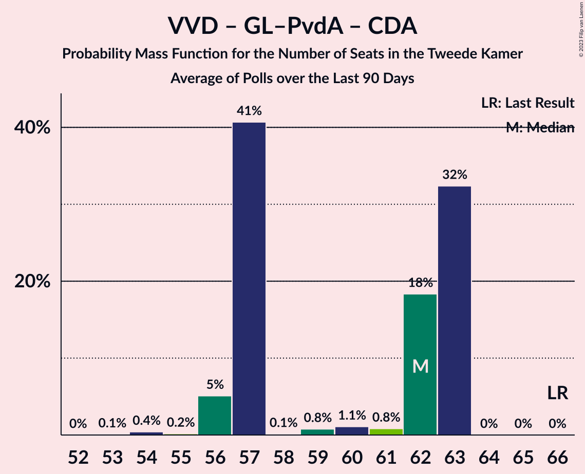

# Poll Average

<a href="#voting-intentions">Voting Intentions</a> | <a href="#seats">Seats</a> | <a href="#coalitions">Coalitions</a> | <a href="#technical-information">Technical Information</a>

## Summary

The table below lists the polls on which the average is based. They are the most recent polls (less than 90 days old) registered and analyzed so far.

| Period     | Polling firm/Commissioner(s) | VVD | D66 | PVV | CDA | SP | PvdA | GL | FvD | PvdD | CU | Volt | JA21 | SGP | DENK | 50+ | BBB | B1 | CO | Spl | PP | PvdT | BVNL | GL–PvdA | NSC |
|:----------:|:----------------------------:|:--:|:--:|:--:|:--:|:--:|:--:|:--:|:--:|:--:|:--:|:--:|:--:|:--:|:--:|:--:|:--:|:--:|:--:|:--:|:--:|:--:|:--:|:--:|:--:|
| 17 March 2021 | General Election | 21.9%   34 | 15.0%   24 | 10.8%   17 | 9.5%   15 | 6.0%   9 | 5.7%   9 | 5.2%   8 | 5.0%   8 | 3.8%   6 | 3.4%   5 | 2.4%   3 | 2.4%   3 | 2.1%   3 | 2.0%   3 | 1.0%   1 | 1.0%   1 | 0.8%   1 | 0.4%   0 | 0.3%   0 | 0.2%   0 | 0.0%   0 | 0.0%   0 | 10.9%   17 | 0.0%   0 |
| N/A | Poll Average | 13–20%   21–30 | 4–8%   6–10 | 8–14%   12–22 | 2–6%   3–9 | 3–6%   4–9 | N/A   N/A | N/A   N/A | 2–4%   2–5 | 4–7%   6–10 | 2–5%   3–6 | 2–4%   2–4 | 2–4%   1–5 | 2–3%   2–5 | 1–3%   1–3 | 0–1%   0–1 | 8–17%   11–24 | 0–1%   0 | N/A   N/A | N/A   N/A | N/A   N/A | N/A   N/A | 0–1%   0–1 | 15–19%   24–29 | 18–22%   27–34 |
| [23–24 August 2023](2023-08-24-IOResearch.html) | I&O Research | 12–16%   21–25 | 4–6%   6–9 | 7–10%   12–17 | 2–3%   3–6 | 3–4%   4–7 | N/A   N/A | N/A   N/A | 2–3%   2–5 | 4–6%   6–10 | 2–4%   3–5 | 1–3%   2–4 | 2–3%   1–4 | 2–3%   3–6 | 1–3%   2–3 | 0–1%   0–1 | 7–10%   10–15 | 0–1%   0 | N/A   N/A | N/A   N/A | N/A   N/A | N/A   N/A | 0–1%   0–1 | 16–20%   25–29 | 18–22%   27–34 |
| [18–19 August 2023](2023-08-19-Peilnl.html) | Peil.nl | 17–20%   27–33 | 5–6%   7–8 | 11–14%   18–22 | 5–6%   7–9 | 5–6%   6–9 | N/A   N/A | N/A   N/A | 3–4%   4–5 | 5–7%   7–10 | 2–3%   3–4 | 2–3%   4 | 2–3%   2–3 | 2–3%   2–4 | 1–2%   1–2 | 0–1%   0–1 | 13–15%   19–23 | 0%   0 | N/A   N/A | N/A   N/A | N/A   N/A | N/A   N/A | 0–1%   0–1 | 16–19%   25–27 | N/A   N/A |
| [21 August–24 July 2023](2023-07-24-Ipsos.html) | Ipsos   EenVandaag | 15–20%   24–30 | 5–8%   9–11 | 10–14%   17–19 | 3–5%   5–8 | 3–5%   6–8 | N/A   N/A | N/A   N/A | 2–4%   3–5 | 4–6%   6–8 | 3–5%   5–6 | 2–4%   3–4 | 2–4%   3–5 | 1–3%   2–3 | 2–4%   3 | 0–1%   0–1 | 13–18%   22–27 | 0–1%   0–1 | N/A   N/A | N/A   N/A | N/A   N/A | N/A   N/A | N/A   N/A | 14–19%   23–27 | N/A   N/A |
| 17 March 2021 | General Election | 21.9%   34 | 15.0%   24 | 10.8%   17 | 9.5%   15 | 6.0%   9 | 5.7%   9 | 5.2%   8 | 5.0%   8 | 3.8%   6 | 3.4%   5 | 2.4%   3 | 2.4%   3 | 2.1%   3 | 2.0%   3 | 1.0%   1 | 1.0%   1 | 0.8%   1 | 0.4%   0 | 0.3%   0 | 0.2%   0 | 0.0%   0 | 0.0%   0 | 10.9%   17 | 0.0%   0 |

Only polls for which at least the sample size has been published are included in the table above.

**Legend:**
+ **Top half of each row:** Voting intentions (95% confidence interval)
+ **Bottom half of each row:** Seat projections for the Tweede Kamer (95% confidence interval)
+ **VVD:** Volkspartij voor Vrijheid en Democratie
+ **D66:** Democraten 66
+ **PVV:** Partij voor de Vrijheid
+ **CDA:** Christen-Democratisch Appèl
+ **SP:** Socialistische Partij
+ **PvdA:** Partij van de Arbeid
+ **GL:** GroenLinks
+ **FvD:** Forum voor Democratie
+ **PvdD:** Partij voor de Dieren
+ **CU:** ChristenUnie
+ **Volt:** Volt Europa
+ **JA21:** Juiste Antwoord 2021
+ **SGP:** Staatkundig Gereformeerde Partij
+ **DENK:** DENK
+ **50+:** 50Plus
+ **BBB:** BoerBurgerBeweging
+ **B1:** Bij1
+ **CO:** Code Oranje
+ **Spl:** Splinter
+ **PP:** Piratenpartij
+ **PvdT:** Partij voor de Toekomst
+ **BVNL:** Belang van Nederland
+ **GL–PvdA:** GroenLinks–Partij van de Arbeid
+ **NSC:** Nieuw Sociaal Contract
+ **N/A (single party):** Party not included the published results
+ **N/A (entire row):** Calculation for this opinion poll not started yet

## Voting Intentions

### Confidence Intervals

| Party | Last Result | Median | 80% Confidence Interval | 90% Confidence Interval | 95% Confidence Interval | 99% Confidence Interval |
|:-----:|:-----------:|:------:|:-----------------------:|:-----------------------:|:-----------------------:|:-----------------------:|
| <a href="#volkspartij-voor-vrijheid-en-democratie">Volkspartij voor Vrijheid en Democratie</a> | 21.9% | 17.4% | 13.5–19.2% |13.1–19.5% | 12.8–19.9% | 12.2–20.5% |
| <a href="#democraten-66">Democraten 66</a> | 15.0% | 5.3% | 4.3–7.0% |4.0–7.4% | 3.9–7.8% | 3.5–8.4% |
| <a href="#groenlinks–partij-van-de-arbeid">GroenLinks–Partij van de Arbeid</a> | 10.9% | 17.4% | 15.9–18.7% |15.4–19.1% | 15.0–19.4% | 14.2–20.1% |
| <a href="#partij-voor-de-vrijheid">Partij voor de Vrijheid</a> | 10.8% | 11.9% | 8.3–13.3% |8.0–13.6% | 7.7–13.9% | 7.3–14.5% |
| <a href="#christen-democratisch-appèl">Christen-Democratisch Appèl</a> | 9.5% | 4.0% | 2.4–5.6% |2.2–5.8% | 2.0–5.9% | 1.8–6.3% |
| <a href="#socialistische-partij">Socialistische Partij</a> | 6.0% | 4.1% | 3.2–5.6% |3.0–5.8% | 2.8–5.9% | 2.6–6.3% |
| <a href="#partij-van-de-arbeid">Partij van de Arbeid</a> | 5.7% | N/A | N/A |N/A | N/A | N/A |
| <a href="#groenlinks">GroenLinks</a> | 5.2% | N/A | N/A |N/A | N/A | N/A |
| <a href="#forum-voor-democratie">Forum voor Democratie</a> | 5.0% | 2.7% | 2.0–3.6% |1.8–3.7% | 1.7–3.9% | 1.5–4.2% |
| <a href="#partij-voor-de-dieren">Partij voor de Dieren</a> | 3.8% | 5.4% | 4.5–6.3% |4.2–6.5% | 4.0–6.7% | 3.6–7.0% |
| <a href="#christenunie">ChristenUnie</a> | 3.4% | 3.0% | 2.4–4.0% |2.3–4.3% | 2.2–4.6% | 2.0–5.1% |
| <a href="#volt-europa">Volt Europa</a> | 2.4% | 2.5% | 1.8–3.2% |1.7–3.4% | 1.6–3.6% | 1.4–4.0% |
| <a href="#juiste-antwoord-2021">Juiste Antwoord 2021</a> | 2.4% | 2.2% | 1.8–3.3% |1.7–3.6% | 1.6–3.8% | 1.4–4.3% |
| <a href="#staatkundig-gereformeerde-partij">Staatkundig Gereformeerde Partij</a> | 2.1% | 2.2% | 1.7–2.9% |1.6–3.1% | 1.5–3.3% | 1.2–3.6% |
| <a href="#denk">DENK</a> | 2.0% | 1.9% | 1.2–2.8% |1.2–3.0% | 1.1–3.2% | 1.0–3.7% |
| <a href="#50plus">50Plus</a> | 1.0% | 0.6% | 0.4–0.9% |0.3–1.0% | 0.3–1.1% | 0.2–1.4% |
| <a href="#boerburgerbeweging">BoerBurgerBeweging</a> | 1.0% | 13.8% | 8.2–16.0% |7.9–16.5% | 7.6–17.0% | 7.2–17.9% |
| <a href="#bij1">Bij1</a> | 0.8% | 0.3% | 0.1–0.5% |0.1–0.6% | 0.1–0.7% | 0.1–1.0% |
| <a href="#code-oranje">Code Oranje</a> | 0.4% | N/A | N/A |N/A | N/A | N/A |
| <a href="#splinter">Splinter</a> | 0.3% | N/A | N/A |N/A | N/A | N/A |
| <a href="#piratenpartij">Piratenpartij</a> | 0.2% | N/A | N/A |N/A | N/A | N/A |
| <a href="#partij-voor-de-toekomst">Partij voor de Toekomst</a> | 0.0% | N/A | N/A |N/A | N/A | N/A |
| <a href="#belang-van-nederland">Belang van Nederland</a> | 0.0% | 0.6% | 0.3–0.8% |0.3–0.9% | 0.2–1.0% | 0.2–1.1% |
| <a href="#nieuw-sociaal-contract">Nieuw Sociaal Contract</a> | 0.0% | 20.2% | 19.0–21.5% |18.7–21.8% | 18.4–22.2% | 17.8–22.8% |

### Volkspartij voor Vrijheid en Democratie

*For a full overview of the results for this party, see the [Volkspartij voor Vrijheid en Democratie](party-volkspartijvoorvrijheidendemocratie.html) page.*

| Voting Intentions | Probability | Accumulated | Special Marks |
|:-----------------:|:-----------:|:-----------:|:-------------:|
| 10.5–11.5% | 0% | 100% |  |
| 11.5–12.5% | 1.3% | 100% |  |
| 12.5–13.5% | 9% | 98.7% |  |
| 13.5–14.5% | 15% | 90% |  |
| 14.5–15.5% | 8% | 74% |  |
| 15.5–16.5% | 6% | 66% |  |
| 16.5–17.5% | 12% | 60% | Median |
| 17.5–18.5% | 23% | 48% |  |
| 18.5–19.5% | 20% | 25% |  |
| 19.5–20.5% | 5% | 5% |  |
| 20.5–21.5% | 0.4% | 0.4% |  |
| 21.5–22.5% | 0% | 0% | Last Result |

### Democraten 66

*For a full overview of the results for this party, see the [Democraten 66](party-democraten66.html) page.*

| Voting Intentions | Probability | Accumulated | Special Marks |
|:-----------------:|:-----------:|:-----------:|:-------------:|
| 1.5–2.5% | 0% | 100% |  |
| 2.5–3.5% | 0.5% | 100% |  |
| 3.5–4.5% | 17% | 99.5% |  |
| 4.5–5.5% | 41% | 82% | Median |
| 5.5–6.5% | 24% | 41% |  |
| 6.5–7.5% | 13% | 17% |  |
| 7.5–8.5% | 3% | 4% |  |
| 8.5–9.5% | 0.3% | 0.3% |  |
| 9.5–10.5% | 0% | 0% |  |
| 10.5–11.5% | 0% | 0% |  |
| 11.5–12.5% | 0% | 0% |  |
| 12.5–13.5% | 0% | 0% |  |
| 13.5–14.5% | 0% | 0% |  |
| 14.5–15.5% | 0% | 0% | Last Result |

### GroenLinks–Partij van de Arbeid

*For a full overview of the results for this party, see the [GroenLinks–Partij van de Arbeid](party-groenlinks–partijvandearbeid.html) page.*

| Voting Intentions | Probability | Accumulated | Special Marks |
|:-----------------:|:-----------:|:-----------:|:-------------:|
| 10.5–11.5% | 0% | 100% | Last Result |
| 11.5–12.5% | 0% | 100% |  |
| 12.5–13.5% | 0.1% | 100% |  |
| 13.5–14.5% | 1.0% | 99.9% |  |
| 14.5–15.5% | 5% | 98.9% |  |
| 15.5–16.5% | 16% | 94% |  |
| 16.5–17.5% | 35% | 78% | Median |
| 17.5–18.5% | 30% | 42% |  |
| 18.5–19.5% | 10% | 12% |  |
| 19.5–20.5% | 2% | 2% |  |
| 20.5–21.5% | 0.1% | 0.2% |  |
| 21.5–22.5% | 0% | 0% |  |

### Partij voor de Vrijheid

*For a full overview of the results for this party, see the [Partij voor de Vrijheid](party-partijvoordevrijheid.html) page.*

| Voting Intentions | Probability | Accumulated | Special Marks |
|:-----------------:|:-----------:|:-----------:|:-------------:|
| 5.5–6.5% | 0% | 100% |  |
| 6.5–7.5% | 1.4% | 100% |  |
| 7.5–8.5% | 13% | 98.6% |  |
| 8.5–9.5% | 16% | 85% |  |
| 9.5–10.5% | 5% | 70% |  |
| 10.5–11.5% | 9% | 65% | Last Result |
| 11.5–12.5% | 26% | 56% | Median |
| 12.5–13.5% | 25% | 31% |  |
| 13.5–14.5% | 5% | 6% |  |
| 14.5–15.5% | 0.5% | 0.5% |  |
| 15.5–16.5% | 0% | 0% |  |

### Christen-Democratisch Appèl

*For a full overview of the results for this party, see the [Christen-Democratisch Appèl](party-christen-democratischappèl.html) page.*

| Voting Intentions | Probability | Accumulated | Special Marks |
|:-----------------:|:-----------:|:-----------:|:-------------:|
| 0.5–1.5% | 0% | 100% |  |
| 1.5–2.5% | 17% | 100% |  |
| 2.5–3.5% | 25% | 83% |  |
| 3.5–4.5% | 20% | 59% | Median |
| 4.5–5.5% | 28% | 38% |  |
| 5.5–6.5% | 10% | 10% |  |
| 6.5–7.5% | 0.1% | 0.1% |  |
| 7.5–8.5% | 0% | 0% |  |
| 8.5–9.5% | 0% | 0% |  |
| 9.5–10.5% | 0% | 0% | Last Result |

### Socialistische Partij

*For a full overview of the results for this party, see the [Socialistische Partij](party-socialistischepartij.html) page.*

| Voting Intentions | Probability | Accumulated | Special Marks |
|:-----------------:|:-----------:|:-----------:|:-------------:|
| 0.5–1.5% | 0% | 100% |  |
| 1.5–2.5% | 0.4% | 100% |  |
| 2.5–3.5% | 25% | 99.6% |  |
| 3.5–4.5% | 35% | 74% | Median |
| 4.5–5.5% | 29% | 39% |  |
| 5.5–6.5% | 10% | 10% | Last Result |
| 6.5–7.5% | 0.1% | 0.1% |  |
| 7.5–8.5% | 0% | 0% |  |

### Forum voor Democratie

*For a full overview of the results for this party, see the [Forum voor Democratie](party-forumvoordemocratie.html) page.*

| Voting Intentions | Probability | Accumulated | Special Marks |
|:-----------------:|:-----------:|:-----------:|:-------------:|
| 0.0–0.5% | 0% | 100% |  |
| 0.5–1.5% | 0.7% | 100% |  |
| 1.5–2.5% | 42% | 99.3% |  |
| 2.5–3.5% | 47% | 58% | Median |
| 3.5–4.5% | 11% | 11% |  |
| 4.5–5.5% | 0% | 0% | Last Result |

### Partij voor de Dieren

*For a full overview of the results for this party, see the [Partij voor de Dieren](party-partijvoordedieren.html) page.*

| Voting Intentions | Probability | Accumulated | Special Marks |
|:-----------------:|:-----------:|:-----------:|:-------------:|
| 1.5–2.5% | 0% | 100% |  |
| 2.5–3.5% | 0.4% | 100% |  |
| 3.5–4.5% | 12% | 99.6% | Last Result |
| 4.5–5.5% | 43% | 88% | Median |
| 5.5–6.5% | 40% | 44% |  |
| 6.5–7.5% | 4% | 4% |  |
| 7.5–8.5% | 0% | 0% |  |

### ChristenUnie

*For a full overview of the results for this party, see the [ChristenUnie](party-christenunie.html) page.*

| Voting Intentions | Probability | Accumulated | Special Marks |
|:-----------------:|:-----------:|:-----------:|:-------------:|
| 0.5–1.5% | 0% | 100% |  |
| 1.5–2.5% | 16% | 100% |  |
| 2.5–3.5% | 62% | 84% | Last Result, Median |
| 3.5–4.5% | 19% | 22% |  |
| 4.5–5.5% | 3% | 3% |  |
| 5.5–6.5% | 0.1% | 0.1% |  |
| 6.5–7.5% | 0% | 0% |  |

### Volt Europa

*For a full overview of the results for this party, see the [Volt Europa](party-volteuropa.html) page.*

| Voting Intentions | Probability | Accumulated | Special Marks |
|:-----------------:|:-----------:|:-----------:|:-------------:|
| 0.0–0.5% | 0% | 100% |  |
| 0.5–1.5% | 2% | 100% |  |
| 1.5–2.5% | 50% | 98% | Last Result |
| 2.5–3.5% | 45% | 48% | Median |
| 3.5–4.5% | 3% | 3% |  |
| 4.5–5.5% | 0.1% | 0.1% |  |
| 5.5–6.5% | 0% | 0% |  |

### Juiste Antwoord 2021

*For a full overview of the results for this party, see the [Juiste Antwoord 2021](party-juisteantwoord2021.html) page.*

| Voting Intentions | Probability | Accumulated | Special Marks |
|:-----------------:|:-----------:|:-----------:|:-------------:|
| 0.0–0.5% | 0% | 100% |  |
| 0.5–1.5% | 2% | 100% |  |
| 1.5–2.5% | 66% | 98% | Last Result, Median |
| 2.5–3.5% | 27% | 32% |  |
| 3.5–4.5% | 5% | 5% |  |
| 4.5–5.5% | 0.2% | 0.2% |  |
| 5.5–6.5% | 0% | 0% |  |

### Staatkundig Gereformeerde Partij

*For a full overview of the results for this party, see the [Staatkundig Gereformeerde Partij](party-staatkundiggereformeerdepartij.html) page.*

| Voting Intentions | Probability | Accumulated | Special Marks |
|:-----------------:|:-----------:|:-----------:|:-------------:|
| 0.0–0.5% | 0% | 100% |  |
| 0.5–1.5% | 4% | 100% |  |
| 1.5–2.5% | 69% | 96% | Last Result, Median |
| 2.5–3.5% | 26% | 27% |  |
| 3.5–4.5% | 0.7% | 0.7% |  |
| 4.5–5.5% | 0% | 0% |  |

### DENK

*For a full overview of the results for this party, see the [DENK](party-denk.html) page.*

| Voting Intentions | Probability | Accumulated | Special Marks |
|:-----------------:|:-----------:|:-----------:|:-------------:|
| 0.0–0.5% | 0% | 100% |  |
| 0.5–1.5% | 32% | 100% |  |
| 1.5–2.5% | 53% | 68% | Last Result, Median |
| 2.5–3.5% | 15% | 16% |  |
| 3.5–4.5% | 0.8% | 0.8% |  |
| 4.5–5.5% | 0% | 0% |  |

### 50Plus

*For a full overview of the results for this party, see the [50Plus](party-50plus.html) page.*

| Voting Intentions | Probability | Accumulated | Special Marks |
|:-----------------:|:-----------:|:-----------:|:-------------:|
| 0.0–0.5% | 32% | 100% |  |
| 0.5–1.5% | 68% | 68% | Last Result, Median |
| 1.5–2.5% | 0.2% | 0.2% |  |
| 2.5–3.5% | 0% | 0% |  |

### BoerBurgerBeweging

*For a full overview of the results for this party, see the [BoerBurgerBeweging](party-boerburgerbeweging.html) page.*

| Voting Intentions | Probability | Accumulated | Special Marks |
|:-----------------:|:-----------:|:-----------:|:-------------:|
| 0.5–1.5% | 0% | 100% | Last Result |
| 1.5–2.5% | 0% | 100% |  |
| 2.5–3.5% | 0% | 100% |  |
| 3.5–4.5% | 0% | 100% |  |
| 4.5–5.5% | 0% | 100% |  |
| 5.5–6.5% | 0% | 100% |  |
| 6.5–7.5% | 2% | 100% |  |
| 7.5–8.5% | 15% | 98% |  |
| 8.5–9.5% | 14% | 83% |  |
| 9.5–10.5% | 2% | 69% |  |
| 10.5–11.5% | 0.1% | 67% |  |
| 11.5–12.5% | 0.5% | 67% |  |
| 12.5–13.5% | 9% | 66% |  |
| 13.5–14.5% | 25% | 57% | Median |
| 14.5–15.5% | 17% | 31% |  |
| 15.5–16.5% | 10% | 15% |  |
| 16.5–17.5% | 4% | 5% |  |
| 17.5–18.5% | 0.9% | 1.0% |  |
| 18.5–19.5% | 0.1% | 0.1% |  |
| 19.5–20.5% | 0% | 0% |  |

### Bij1

*For a full overview of the results for this party, see the [Bij1](party-bij1.html) page.*

| Voting Intentions | Probability | Accumulated | Special Marks |
|:-----------------:|:-----------:|:-----------:|:-------------:|
| 0.0–0.5% | 91% | 100% | Median |
| 0.5–1.5% | 9% | 9% | Last Result |
| 1.5–2.5% | 0% | 0% |  |

### Belang van Nederland

*For a full overview of the results for this party, see the [Belang van Nederland](party-belangvannederland.html) page.*

| Voting Intentions | Probability | Accumulated | Special Marks |
|:-----------------:|:-----------:|:-----------:|:-------------:|
| 0.0–0.5% | 45% | 100% | Last Result |
| 0.5–1.5% | 55% | 55% | Median |
| 1.5–2.5% | 0% | 0% |  |

### Nieuw Sociaal Contract

*For a full overview of the results for this party, see the [Nieuw Sociaal Contract](party-nieuwsociaalcontract.html) page.*

| Voting Intentions | Probability | Accumulated | Special Marks |
|:-----------------:|:-----------:|:-----------:|:-------------:|
| 0.0–0.5% | 0% | 100% | Last Result |
| 0.5–1.5% | 0% | 100% |  |
| 1.5–2.5% | 0% | 100% |  |
| 2.5–3.5% | 0% | 100% |  |
| 3.5–4.5% | 0% | 100% |  |
| 4.5–5.5% | 0% | 100% |  |
| 5.5–6.5% | 0% | 100% |  |
| 6.5–7.5% | 0% | 100% |  |
| 7.5–8.5% | 0% | 100% |  |
| 8.5–9.5% | 0% | 100% |  |
| 9.5–10.5% | 0% | 100% |  |
| 10.5–11.5% | 0% | 100% |  |
| 11.5–12.5% | 0% | 100% |  |
| 12.5–13.5% | 0% | 100% |  |
| 13.5–14.5% | 0% | 100% |  |
| 14.5–15.5% | 0% | 100% |  |
| 15.5–16.5% | 0% | 100% |  |
| 16.5–17.5% | 0.2% | 100% |  |
| 17.5–18.5% | 3% | 99.8% |  |
| 18.5–19.5% | 20% | 96% |  |
| 19.5–20.5% | 39% | 76% | Median |
| 20.5–21.5% | 28% | 37% |  |
| 21.5–22.5% | 8% | 9% |  |
| 22.5–23.5% | 0.9% | 0.9% |  |
| 23.5–24.5% | 0% | 0% |  |
| 24.5–25.5% | 0% | 0% |  |

## Seats

### Confidence Intervals

| Party | Last Result | Median | 80% Confidence Interval | 90% Confidence Interval | 95% Confidence Interval | 99% Confidence Interval |
|:-----:|:-----------:|:------:|:-----------------------:|:-----------------------:|:-----------------------:|:-----------------------:|
| <a href="#volkspartij-voor-vrijheid-en-democratie">Volkspartij voor Vrijheid en Democratie</a> | 34 | 24 | 22–30 |22–30 | 21–30 | 19–33 |
| <a href="#democraten-66">Democraten 66</a> | 24 | 8 | 7–10 |6–10 | 6–10 | 6–11 |
| <a href="#groenlinks–partij-van-de-arbeid">GroenLinks–Partij van de Arbeid</a> | 17 | 26 | 25–27 |24–28 | 24–29 | 23–30 |
| <a href="#partij-voor-de-vrijheid">Partij voor de Vrijheid</a> | 17 | 19 | 14–22 |13–22 | 12–22 | 11–22 |
| <a href="#christen-democratisch-appèl">Christen-Democratisch Appèl</a> | 15 | 8 | 3–8 |3–9 | 3–9 | 2–9 |
| <a href="#socialistische-partij">Socialistische Partij</a> | 9 | 6 | 5–9 |4–9 | 4–9 | 4–11 |
| <a href="#partij-van-de-arbeid">Partij van de Arbeid</a> | 9 | N/A | N/A |N/A | N/A | N/A |
| <a href="#groenlinks">GroenLinks</a> | 8 | N/A | N/A |N/A | N/A | N/A |
| <a href="#forum-voor-democratie">Forum voor Democratie</a> | 8 | 4 | 3–5 |3–5 | 2–5 | 2–6 |
| <a href="#partij-voor-de-dieren">Partij voor de Dieren</a> | 6 | 7 | 6–8 |6–10 | 6–10 | 5–11 |
| <a href="#christenunie">ChristenUnie</a> | 5 | 4 | 4–6 |3–6 | 3–6 | 3–7 |
| <a href="#volt-europa">Volt Europa</a> | 3 | 3 | 2–4 |2–4 | 2–4 | 2–5 |
| <a href="#juiste-antwoord-2021">Juiste Antwoord 2021</a> | 3 | 3 | 2–5 |2–5 | 1–5 | 1–5 |
| <a href="#staatkundig-gereformeerde-partij">Staatkundig Gereformeerde Partij</a> | 3 | 3 | 2–4 |2–5 | 2–5 | 2–6 |
| <a href="#denk">DENK</a> | 3 | 2 | 1–3 |1–3 | 1–3 | 1–4 |
| <a href="#50plus">50Plus</a> | 1 | 0 | 0–1 |0–1 | 0–1 | 0–1 |
| <a href="#boerburgerbeweging">BoerBurgerBeweging</a> | 1 | 19 | 13–22 |12–24 | 11–24 | 10–27 |
| <a href="#bij1">Bij1</a> | 1 | 0 | 0 |0 | 0 | 0–1 |
| <a href="#code-oranje">Code Oranje</a> | 0 | N/A | N/A |N/A | N/A | N/A |
| <a href="#splinter">Splinter</a> | 0 | N/A | N/A |N/A | N/A | N/A |
| <a href="#piratenpartij">Piratenpartij</a> | 0 | N/A | N/A |N/A | N/A | N/A |
| <a href="#partij-voor-de-toekomst">Partij voor de Toekomst</a> | 0 | N/A | N/A |N/A | N/A | N/A |
| <a href="#belang-van-nederland">Belang van Nederland</a> | 0 | 1 | 0–1 |0–1 | 0–1 | 0–1 |
| <a href="#nieuw-sociaal-contract">Nieuw Sociaal Contract</a> | 0 | 34 | 28–34 |28–34 | 27–34 | 27–36 |

### Volkspartij voor Vrijheid en Democratie

*For a full overview of the results for this party, see the [Volkspartij voor Vrijheid en Democratie](party-volkspartijvoorvrijheidendemocratie.html) page.*

| Number of Seats | Probability | Accumulated | Special Marks |
|:---------------:|:-----------:|:-----------:|:-------------:|
| 18 | 0.3% | 100% |  |
| 19 | 0.3% | 99.7% |  |
| 20 | 0.2% | 99.4% |  |
| 21 | 3% | 99.2% |  |
| 22 | 18% | 96% |  |
| 23 | 6% | 78% |  |
| 24 | 27% | 72% | Median |
| 25 | 4% | 45% |  |
| 26 | 0.9% | 41% |  |
| 27 | 7% | 41% |  |
| 28 | 7% | 34% |  |
| 29 | 0.7% | 27% |  |
| 30 | 25% | 27% |  |
| 31 | 0.3% | 1.3% |  |
| 32 | 0% | 1.0% |  |
| 33 | 1.0% | 1.0% |  |
| 34 | 0% | 0% | Last Result |

### Democraten 66

*For a full overview of the results for this party, see the [Democraten 66](party-democraten66.html) page.*

| Number of Seats | Probability | Accumulated | Special Marks |
|:---------------:|:-----------:|:-----------:|:-------------:|
| 5 | 0.3% | 100% |  |
| 6 | 6% | 99.7% |  |
| 7 | 23% | 93% |  |
| 8 | 34% | 70% | Median |
| 9 | 4% | 37% |  |
| 10 | 31% | 33% |  |
| 11 | 2% | 2% |  |
| 12 | 0.2% | 0.2% |  |
| 13 | 0% | 0% |  |
| 14 | 0% | 0% |  |
| 15 | 0% | 0% |  |
| 16 | 0% | 0% |  |
| 17 | 0% | 0% |  |
| 18 | 0% | 0% |  |
| 19 | 0% | 0% |  |
| 20 | 0% | 0% |  |
| 21 | 0% | 0% |  |
| 22 | 0% | 0% |  |
| 23 | 0% | 0% |  |
| 24 | 0% | 0% | Last Result |

### GroenLinks–Partij van de Arbeid

*For a full overview of the results for this party, see the [GroenLinks–Partij van de Arbeid](party-groenlinks–partijvandearbeid.html) page.*

| Number of Seats | Probability | Accumulated | Special Marks |
|:---------------:|:-----------:|:-----------:|:-------------:|
| 17 | 0% | 100% | Last Result |
| 18 | 0% | 100% |  |
| 19 | 0% | 100% |  |
| 20 | 0% | 100% |  |
| 21 | 0% | 100% |  |
| 22 | 0.2% | 100% |  |
| 23 | 1.0% | 99.8% |  |
| 24 | 7% | 98.8% |  |
| 25 | 19% | 91% |  |
| 26 | 33% | 72% | Median |
| 27 | 32% | 39% |  |
| 28 | 4% | 8% |  |
| 29 | 3% | 3% |  |
| 30 | 0.3% | 0.6% |  |
| 31 | 0.3% | 0.3% |  |
| 32 | 0% | 0% |  |

### Partij voor de Vrijheid

*For a full overview of the results for this party, see the [Partij voor de Vrijheid](party-partijvoordevrijheid.html) page.*

| Number of Seats | Probability | Accumulated | Special Marks |
|:---------------:|:-----------:|:-----------:|:-------------:|
| 11 | 0.7% | 100% |  |
| 12 | 3% | 99.3% |  |
| 13 | 5% | 96% |  |
| 14 | 17% | 90% |  |
| 15 | 4% | 74% |  |
| 16 | 0.1% | 69% |  |
| 17 | 4% | 69% | Last Result |
| 18 | 12% | 66% |  |
| 19 | 27% | 54% | Median |
| 20 | 0.5% | 27% |  |
| 21 | 2% | 27% |  |
| 22 | 24% | 24% |  |
| 23 | 0% | 0.1% |  |
| 24 | 0% | 0% |  |

### Christen-Democratisch Appèl

*For a full overview of the results for this party, see the [Christen-Democratisch Appèl](party-christen-democratischappèl.html) page.*

| Number of Seats | Probability | Accumulated | Special Marks |
|:---------------:|:-----------:|:-----------:|:-------------:|
| 2 | 0.7% | 100% |  |
| 3 | 12% | 99.3% |  |
| 4 | 4% | 87% |  |
| 5 | 6% | 83% |  |
| 6 | 18% | 77% |  |
| 7 | 1.3% | 58% |  |
| 8 | 50% | 57% | Median |
| 9 | 7% | 7% |  |
| 10 | 0% | 0% |  |
| 11 | 0% | 0% |  |
| 12 | 0% | 0% |  |
| 13 | 0% | 0% |  |
| 14 | 0% | 0% |  |
| 15 | 0% | 0% | Last Result |

### Socialistische Partij

*For a full overview of the results for this party, see the [Socialistische Partij](party-socialistischepartij.html) page.*

| Number of Seats | Probability | Accumulated | Special Marks |
|:---------------:|:-----------:|:-----------:|:-------------:|
| 3 | 0.4% | 100% |  |
| 4 | 5% | 99.6% |  |
| 5 | 23% | 95% |  |
| 6 | 30% | 71% | Median |
| 7 | 10% | 42% |  |
| 8 | 7% | 32% |  |
| 9 | 24% | 25% | Last Result |
| 10 | 0.1% | 0.8% |  |
| 11 | 0.7% | 0.7% |  |
| 12 | 0% | 0% |  |

### Partij van de Arbeid

*For a full overview of the results for this party, see the [Partij van de Arbeid](party-partijvandearbeid.html) page.*

### GroenLinks

*For a full overview of the results for this party, see the [GroenLinks](party-groenlinks.html) page.*

### Forum voor Democratie

*For a full overview of the results for this party, see the [Forum voor Democratie](party-forumvoordemocratie.html) page.*

| Number of Seats | Probability | Accumulated | Special Marks |
|:---------------:|:-----------:|:-----------:|:-------------:|
| 2 | 4% | 100% |  |
| 3 | 12% | 96% |  |
| 4 | 44% | 84% | Median |
| 5 | 40% | 41% |  |
| 6 | 0.5% | 0.5% |  |
| 7 | 0% | 0% |  |
| 8 | 0% | 0% | Last Result |

### Partij voor de Dieren

*For a full overview of the results for this party, see the [Partij voor de Dieren](party-partijvoordedieren.html) page.*

| Number of Seats | Probability | Accumulated | Special Marks |
|:---------------:|:-----------:|:-----------:|:-------------:|
| 5 | 1.0% | 100% |  |
| 6 | 17% | 99.0% | Last Result |
| 7 | 62% | 82% | Median |
| 8 | 10% | 20% |  |
| 9 | 3% | 10% |  |
| 10 | 6% | 7% |  |
| 11 | 0.7% | 0.8% |  |
| 12 | 0.1% | 0.1% |  |
| 13 | 0% | 0% |  |

### ChristenUnie

*For a full overview of the results for this party, see the [ChristenUnie](party-christenunie.html) page.*

| Number of Seats | Probability | Accumulated | Special Marks |
|:---------------:|:-----------:|:-----------:|:-------------:|
| 3 | 9% | 100% |  |
| 4 | 55% | 91% | Median |
| 5 | 10% | 36% | Last Result |
| 6 | 26% | 26% |  |
| 7 | 0.6% | 0.6% |  |
| 8 | 0% | 0% |  |

### Volt Europa

*For a full overview of the results for this party, see the [Volt Europa](party-volteuropa.html) page.*

| Number of Seats | Probability | Accumulated | Special Marks |
|:---------------:|:-----------:|:-----------:|:-------------:|
| 2 | 24% | 100% |  |
| 3 | 34% | 76% | Last Result, Median |
| 4 | 42% | 42% |  |
| 5 | 0.7% | 0.8% |  |
| 6 | 0.1% | 0.1% |  |
| 7 | 0% | 0% |  |

### Juiste Antwoord 2021

*For a full overview of the results for this party, see the [Juiste Antwoord 2021](party-juisteantwoord2021.html) page.*

| Number of Seats | Probability | Accumulated | Special Marks |
|:---------------:|:-----------:|:-----------:|:-------------:|
| 1 | 4% | 100% |  |
| 2 | 13% | 96% |  |
| 3 | 53% | 83% | Last Result, Median |
| 4 | 4% | 31% |  |
| 5 | 26% | 26% |  |
| 6 | 0.5% | 0.5% |  |
| 7 | 0% | 0% |  |

### Staatkundig Gereformeerde Partij

*For a full overview of the results for this party, see the [Staatkundig Gereformeerde Partij](party-staatkundiggereformeerdepartij.html) page.*

| Number of Seats | Probability | Accumulated | Special Marks |
|:---------------:|:-----------:|:-----------:|:-------------:|
| 2 | 35% | 100% |  |
| 3 | 43% | 65% | Last Result, Median |
| 4 | 16% | 22% |  |
| 5 | 3% | 5% |  |
| 6 | 2% | 2% |  |
| 7 | 0.3% | 0.3% |  |
| 8 | 0% | 0% |  |

### DENK

*For a full overview of the results for this party, see the [DENK](party-denk.html) page.*

| Number of Seats | Probability | Accumulated | Special Marks |
|:---------------:|:-----------:|:-----------:|:-------------:|
| 1 | 26% | 100% |  |
| 2 | 34% | 74% | Median |
| 3 | 39% | 40% | Last Result |
| 4 | 0.9% | 1.1% |  |
| 5 | 0.2% | 0.2% |  |
| 6 | 0% | 0% |  |

### 50Plus

*For a full overview of the results for this party, see the [50Plus](party-50plus.html) page.*

| Number of Seats | Probability | Accumulated | Special Marks |
|:---------------:|:-----------:|:-----------:|:-------------:|
| 0 | 79% | 100% | Median |
| 1 | 21% | 21% | Last Result |
| 2 | 0.3% | 0.3% |  |
| 3 | 0% | 0% |  |

### BoerBurgerBeweging

*For a full overview of the results for this party, see the [BoerBurgerBeweging](party-boerburgerbeweging.html) page.*

| Number of Seats | Probability | Accumulated | Special Marks |
|:---------------:|:-----------:|:-----------:|:-------------:|
| 1 | 0% | 100% | Last Result |
| 2 | 0% | 100% |  |
| 3 | 0% | 100% |  |
| 4 | 0% | 100% |  |
| 5 | 0% | 100% |  |
| 6 | 0% | 100% |  |
| 7 | 0% | 100% |  |
| 8 | 0% | 100% |  |
| 9 | 0% | 100% |  |
| 10 | 2% | 100% |  |
| 11 | 3% | 98% |  |
| 12 | 4% | 95% |  |
| 13 | 17% | 91% |  |
| 14 | 6% | 75% |  |
| 15 | 2% | 68% |  |
| 16 | 0% | 67% |  |
| 17 | 0% | 67% |  |
| 18 | 0% | 67% |  |
| 19 | 24% | 67% | Median |
| 20 | 1.2% | 43% |  |
| 21 | 6% | 41% |  |
| 22 | 27% | 35% |  |
| 23 | 0.7% | 8% |  |
| 24 | 6% | 8% |  |
| 25 | 0.2% | 2% |  |
| 26 | 0.5% | 1.3% |  |
| 27 | 0.8% | 0.8% |  |
| 28 | 0.1% | 0.1% |  |
| 29 | 0% | 0% |  |

### Bij1

*For a full overview of the results for this party, see the [Bij1](party-bij1.html) page.*

| Number of Seats | Probability | Accumulated | Special Marks |
|:---------------:|:-----------:|:-----------:|:-------------:|
| 0 | 98.9% | 100% | Median |
| 1 | 1.1% | 1.1% | Last Result |
| 2 | 0% | 0% |  |

### Code Oranje

*For a full overview of the results for this party, see the [Code Oranje](party-codeoranje.html) page.*

### Splinter

*For a full overview of the results for this party, see the [Splinter](party-splinter.html) page.*

### Piratenpartij

*For a full overview of the results for this party, see the [Piratenpartij](party-piratenpartij.html) page.*

### Partij voor de Toekomst

*For a full overview of the results for this party, see the [Partij voor de Toekomst](party-partijvoordetoekomst.html) page.*

### Belang van Nederland

*For a full overview of the results for this party, see the [Belang van Nederland](party-belangvannederland.html) page.*

| Number of Seats | Probability | Accumulated | Special Marks |
|:---------------:|:-----------:|:-----------:|:-------------:|
| 0 | 42% | 100% | Last Result |
| 1 | 58% | 58% | Median |
| 2 | 0% | 0% |  |

### Nieuw Sociaal Contract

*For a full overview of the results for this party, see the [Nieuw Sociaal Contract](party-nieuwsociaalcontract.html) page.*

| Number of Seats | Probability | Accumulated | Special Marks |
|:---------------:|:-----------:|:-----------:|:-------------:|
| 0 | 0% | 100% | Last Result |
| 1 | 0% | 100% |  |
| 2 | 0% | 100% |  |
| 3 | 0% | 100% |  |
| 4 | 0% | 100% |  |
| 5 | 0% | 100% |  |
| 6 | 0% | 100% |  |
| 7 | 0% | 100% |  |
| 8 | 0% | 100% |  |
| 9 | 0% | 100% |  |
| 10 | 0% | 100% |  |
| 11 | 0% | 100% |  |
| 12 | 0% | 100% |  |
| 13 | 0% | 100% |  |
| 14 | 0% | 100% |  |
| 15 | 0% | 100% |  |
| 16 | 0% | 100% |  |
| 17 | 0% | 100% |  |
| 18 | 0% | 100% |  |
| 19 | 0% | 100% |  |
| 20 | 0% | 100% |  |
| 21 | 0% | 100% |  |
| 22 | 0% | 100% |  |
| 23 | 0% | 100% |  |
| 24 | 0% | 100% |  |
| 25 | 0% | 100% |  |
| 26 | 0.1% | 100% |  |
| 27 | 5% | 99.9% |  |
| 28 | 8% | 95% |  |
| 29 | 13% | 87% |  |
| 30 | 2% | 74% |  |
| 31 | 7% | 72% |  |
| 32 | 0.8% | 64% |  |
| 33 | 5% | 64% |  |
| 34 | 56% | 58% | Median |
| 35 | 0.2% | 2% |  |
| 36 | 1.4% | 2% |  |
| 37 | 0% | 0.5% |  |
| 38 | 0.5% | 0.5% |  |
| 39 | 0% | 0% |  |

## Coalitions

### Confidence Intervals

| Coalition | Last Result | Median | Majority? | 80% Confidence Interval | 90% Confidence Interval | 95% Confidence Interval | 99% Confidence Interval |
|:---------:|:-----------:|:------:|:---------:|:-----------------------:|:-----------------------:|:-----------------------:|:-----------------------:|
| Volkspartij voor Vrijheid en Democratie – GroenLinks–Partij van de Arbeid – Christen-Democratisch Appèl – BoerBurgerBeweging | 67 | 81 | 67% | 65–83 | 65–84 | 63–86 | 63–89 |
| Volkspartij voor Vrijheid en Democratie – GroenLinks–Partij van de Arbeid – BoerBurgerBeweging | 52 | 73 | 5% | 60–75 | 60–75 | 60–78 | 60–80 |
| Volkspartij voor Vrijheid en Democratie – Partij voor de Vrijheid – Christen-Democratisch Appèl – Forum voor Democratie – Staatkundig Gereformeerde Partij | 77 | 57 | 0% | 49–68 | 46–68 | 46–68 | 42–69 |
| Volkspartij voor Vrijheid en Democratie – Partij voor de Vrijheid – Christen-Democratisch Appèl – Forum voor Democratie | 74 | 55 | 0% | 46–65 | 41–65 | 40–65 | 38–67 |
| Volkspartij voor Vrijheid en Democratie – Democraten 66 – GroenLinks–Partij van de Arbeid | 75 | 61 | 0% | 54–64 | 54–64 | 53–64 | 52–67 |
| Volkspartij voor Vrijheid en Democratie – GroenLinks–Partij van de Arbeid – Christen-Democratisch Appèl | 66 | 59 | 0% | 53–64 | 52–64 | 51–64 | 49–69 |
| Volkspartij voor Vrijheid en Democratie – Christen-Democratisch Appèl – Partij van de Arbeid – GroenLinks – BoerBurgerBeweging | 67 | 54 | 0% | 39–57 | 38–58 | 37–60 | 35–63 |
| Volkspartij voor Vrijheid en Democratie – Christen-Democratisch Appèl – BoerBurgerBeweging | 50 | 54 | 0% | 39–57 | 38–58 | 37–60 | 35–63 |
| Volkspartij voor Vrijheid en Democratie – Partij voor de Vrijheid – Christen-Democratisch Appèl | 66 | 51 | 0% | 41–60 | 38–60 | 37–60 | 35–63 |
| Democraten 66 – GroenLinks–Partij van de Arbeid – Christen-Democratisch Appèl – Socialistische Partij – ChristenUnie | 70 | 55 | 0% | 47–57 | 45–57 | 44–57 | 43–57 |
| Volkspartij voor Vrijheid en Democratie – GroenLinks–Partij van de Arbeid | 51 | 51 | 0% | 47–56 | 47–56 | 47–56 | 46–60 |
| Volkspartij voor Vrijheid en Democratie – Partij van de Arbeid – GroenLinks – BoerBurgerBeweging | 52 | 46 | 0% | 35–50 | 34–51 | 34–53 | 32–57 |
| Democraten 66 – GroenLinks–Partij van de Arbeid – Christen-Democratisch Appèl – ChristenUnie | 61 | 46 | 0% | 42–51 | 41–51 | 40–51 | 38–51 |
| Volkspartij voor Vrijheid en Democratie – Democraten 66 – Christen-Democratisch Appèl – ChristenUnie | 78 | 48 | 0% | 38–50 | 36–50 | 35–51 | 33–52 |
| GroenLinks–Partij van de Arbeid – BoerBurgerBeweging | 18 | 45 | 0% | 38–49 | 38–49 | 37–49 | 37–52 |
| Volkspartij voor Vrijheid en Democratie – Christen-Democratisch Appèl – Forum voor Democratie – Staatkundig Gereformeerde Partij – 50Plus | 61 | 38 | 0% | 35–46 | 33–47 | 33–47 | 29–48 |
| Volkspartij voor Vrijheid en Democratie – Christen-Democratisch Appèl – Forum voor Democratie – Staatkundig Gereformeerde Partij | 60 | 38 | 0% | 34–46 | 33–46 | 32–46 | 29–48 |
| Volkspartij voor Vrijheid en Democratie – Democraten 66 – Christen-Democratisch Appèl | 73 | 42 | 0% | 34–46 | 32–46 | 31–46 | 27–49 |
| Democraten 66 – GroenLinks–Partij van de Arbeid – Christen-Democratisch Appèl | 56 | 42 | 0% | 38–45 | 37–45 | 36–45 | 35–45 |
| Volkspartij voor Vrijheid en Democratie – Christen-Democratisch Appèl – Forum voor Democratie – 50Plus | 58 | 36 | 0% | 30–43 | 29–43 | 28–43 | 25–46 |
| Volkspartij voor Vrijheid en Democratie – Christen-Democratisch Appèl – Forum voor Democratie | 57 | 36 | 0% | 30–43 | 28–43 | 28–43 | 25–46 |
| GroenLinks–Partij van de Arbeid – Christen-Democratisch Appèl – ChristenUnie | 37 | 38 | 0% | 34–41 | 34–41 | 33–41 | 32–41 |
| Volkspartij voor Vrijheid en Democratie – Democraten 66 – Partij van de Arbeid – GroenLinks | 75 | 34 | 0% | 29–38 | 29–38 | 27–39 | 24–41 |
| Volkspartij voor Vrijheid en Democratie – Christen-Democratisch Appèl – Partij van de Arbeid – GroenLinks | 66 | 32 | 0% | 26–38 | 25–38 | 25–38 | 22–42 |
| Volkspartij voor Vrijheid en Democratie – Christen-Democratisch Appèl | 49 | 32 | 0% | 26–38 | 25–38 | 25–38 | 22–42 |
| GroenLinks–Partij van de Arbeid – Christen-Democratisch Appèl | 32 | 34 | 0% | 29–35 | 29–35 | 29–35 | 28–36 |
| Volkspartij voor Vrijheid en Democratie – Partij van de Arbeid – GroenLinks | 51 | 24 | 0% | 22–30 | 22–30 | 21–30 | 19–33 |
| Democraten 66 – Christen-Democratisch Appèl – Socialistische Partij – Partij van de Arbeid – GroenLinks – ChristenUnie | 70 | 29 | 0% | 21–30 | 18–30 | 17–30 | 17–30 |
| Democraten 66 – Christen-Democratisch Appèl – Partij van de Arbeid – GroenLinks – ChristenUnie | 61 | 20 | 0% | 15–24 | 13–24 | 13–24 | 13–24 |
| Partij van de Arbeid – GroenLinks – BoerBurgerBeweging | 18 | 19 | 0% | 13–22 | 12–24 | 11–24 | 10–27 |
| Democraten 66 – Christen-Democratisch Appèl | 39 | 16 | 0% | 10–18 | 10–18 | 10–18 | 8–18 |
| Democraten 66 – Christen-Democratisch Appèl – Partij van de Arbeid – GroenLinks | 56 | 16 | 0% | 10–18 | 10–18 | 10–18 | 8–18 |
| Christen-Democratisch Appèl – Partij van de Arbeid – GroenLinks – ChristenUnie | 37 | 12 | 0% | 7–14 | 7–14 | 6–14 | 6–14 |
| Christen-Democratisch Appèl – Partij van de Arbeid – GroenLinks | 32 | 8 | 0% | 3–8 | 3–9 | 3–9 | 2–9 |

### Volkspartij voor Vrijheid en Democratie – GroenLinks–Partij van de Arbeid – Christen-Democratisch Appèl – BoerBurgerBeweging

| Number of Seats | Probability | Accumulated | Special Marks |
|:---------------:|:-----------:|:-----------:|:-------------:|
| 62 | 0.2% | 100% |  |
| 63 | 3% | 99.8% |  |
| 64 | 0.8% | 96% |  |
| 65 | 7% | 96% |  |
| 66 | 16% | 89% |  |
| 67 | 0.7% | 73% | Last Result |
| 68 | 2% | 72% |  |
| 69 | 0% | 71% |  |
| 70 | 4% | 71% |  |
| 71 | 0% | 67% |  |
| 72 | 0% | 67% |  |
| 73 | 0% | 67% |  |
| 74 | 0% | 67% |  |
| 75 | 0% | 67% |  |
| 76 | 0.1% | 67% | Majority |
| 77 | 0.5% | 67% | Median |
| 78 | 0.8% | 66% |  |
| 79 | 0.1% | 65% |  |
| 80 | 6% | 65% |  |
| 81 | 25% | 59% |  |
| 82 | 0.2% | 34% |  |
| 83 | 25% | 34% |  |
| 84 | 6% | 10% |  |
| 85 | 0.2% | 4% |  |
| 86 | 2% | 3% |  |
| 87 | 0.5% | 2% |  |
| 88 | 0% | 1.0% |  |
| 89 | 1.0% | 1.0% |  |
| 90 | 0% | 0% |  |

### Volkspartij voor Vrijheid en Democratie – GroenLinks–Partij van de Arbeid – BoerBurgerBeweging

| Number of Seats | Probability | Accumulated | Special Marks |
|:---------------:|:-----------:|:-----------:|:-------------:|
| 52 | 0% | 100% | Last Result |
| 53 | 0% | 100% |  |
| 54 | 0% | 100% |  |
| 55 | 0% | 100% |  |
| 56 | 0% | 100% |  |
| 57 | 0% | 100% |  |
| 58 | 0% | 100% |  |
| 59 | 0.3% | 100% |  |
| 60 | 20% | 99.7% |  |
| 61 | 4% | 80% |  |
| 62 | 4% | 76% |  |
| 63 | 0.1% | 73% |  |
| 64 | 0.3% | 73% |  |
| 65 | 2% | 72% |  |
| 66 | 0% | 71% |  |
| 67 | 4% | 71% |  |
| 68 | 0% | 67% |  |
| 69 | 0% | 67% | Median |
| 70 | 0% | 67% |  |
| 71 | 0.5% | 67% |  |
| 72 | 0.9% | 66% |  |
| 73 | 25% | 65% |  |
| 74 | 0.4% | 40% |  |
| 75 | 35% | 40% |  |
| 76 | 0.2% | 5% | Majority |
| 77 | 2% | 5% |  |
| 78 | 0.5% | 3% |  |
| 79 | 0.6% | 2% |  |
| 80 | 2% | 2% |  |
| 81 | 0% | 0% |  |

### Volkspartij voor Vrijheid en Democratie – Partij voor de Vrijheid – Christen-Democratisch Appèl – Forum voor Democratie – Staatkundig Gereformeerde Partij

| Number of Seats | Probability | Accumulated | Special Marks |
|:---------------:|:-----------:|:-----------:|:-------------:|
| 40 | 0.1% | 100% |  |
| 41 | 0.2% | 99.9% |  |
| 42 | 0.7% | 99.7% |  |
| 43 | 0.4% | 99.0% |  |
| 44 | 0.2% | 98.6% |  |
| 45 | 0.5% | 98% |  |
| 46 | 6% | 98% |  |
| 47 | 0.7% | 92% |  |
| 48 | 0% | 91% |  |
| 49 | 16% | 91% |  |
| 50 | 8% | 75% |  |
| 51 | 0% | 67% |  |
| 52 | 0% | 67% |  |
| 53 | 0% | 67% |  |
| 54 | 0.7% | 67% |  |
| 55 | 0.4% | 66% |  |
| 56 | 0.2% | 65% |  |
| 57 | 30% | 65% |  |
| 58 | 0.4% | 35% | Median |
| 59 | 0.1% | 35% |  |
| 60 | 0.9% | 34% |  |
| 61 | 0.6% | 34% |  |
| 62 | 0.9% | 33% |  |
| 63 | 0.5% | 32% |  |
| 64 | 5% | 32% |  |
| 65 | 1.1% | 26% |  |
| 66 | 0% | 25% |  |
| 67 | 0.1% | 25% |  |
| 68 | 24% | 25% |  |
| 69 | 1.0% | 1.0% |  |
| 70 | 0% | 0% |  |
| 71 | 0% | 0% |  |
| 72 | 0% | 0% |  |
| 73 | 0% | 0% |  |
| 74 | 0% | 0% |  |
| 75 | 0% | 0% |  |
| 76 | 0% | 0% | Majority |
| 77 | 0% | 0% | Last Result |

### Volkspartij voor Vrijheid en Democratie – Partij voor de Vrijheid – Christen-Democratisch Appèl – Forum voor Democratie

| Number of Seats | Probability | Accumulated | Special Marks |
|:---------------:|:-----------:|:-----------:|:-------------:|
| 36 | 0.2% | 100% |  |
| 37 | 0% | 99.7% |  |
| 38 | 0.6% | 99.7% |  |
| 39 | 0.6% | 99.1% |  |
| 40 | 2% | 98% |  |
| 41 | 3% | 97% |  |
| 42 | 2% | 94% |  |
| 43 | 0% | 92% |  |
| 44 | 0.5% | 92% |  |
| 45 | 0% | 91% |  |
| 46 | 24% | 91% |  |
| 47 | 0% | 67% |  |
| 48 | 0% | 67% |  |
| 49 | 0% | 67% |  |
| 50 | 0% | 67% |  |
| 51 | 0% | 67% |  |
| 52 | 1.1% | 67% |  |
| 53 | 0.1% | 65% |  |
| 54 | 0.2% | 65% |  |
| 55 | 30% | 65% | Median |
| 56 | 0.3% | 35% |  |
| 57 | 0.9% | 35% |  |
| 58 | 0.1% | 34% |  |
| 59 | 0.9% | 33% |  |
| 60 | 6% | 33% |  |
| 61 | 0.1% | 26% |  |
| 62 | 0.4% | 26% |  |
| 63 | 0.8% | 26% |  |
| 64 | 0.1% | 25% |  |
| 65 | 24% | 25% |  |
| 66 | 0% | 1.0% |  |
| 67 | 1.0% | 1.0% |  |
| 68 | 0% | 0% |  |
| 69 | 0% | 0% |  |
| 70 | 0% | 0% |  |
| 71 | 0% | 0% |  |
| 72 | 0% | 0% |  |
| 73 | 0% | 0% |  |
| 74 | 0% | 0% | Last Result |

### Volkspartij voor Vrijheid en Democratie – Democraten 66 – GroenLinks–Partij van de Arbeid

| Number of Seats | Probability | Accumulated | Special Marks |
|:---------------:|:-----------:|:-----------:|:-------------:|
| 50 | 0.3% | 100% |  |
| 51 | 0% | 99.7% |  |
| 52 | 2% | 99.7% |  |
| 53 | 0.9% | 98% |  |
| 54 | 16% | 97% |  |
| 55 | 0.3% | 81% |  |
| 56 | 1.0% | 81% |  |
| 57 | 4% | 80% |  |
| 58 | 2% | 75% | Median |
| 59 | 3% | 73% |  |
| 60 | 4% | 70% |  |
| 61 | 33% | 66% |  |
| 62 | 6% | 33% |  |
| 63 | 0.2% | 27% |  |
| 64 | 26% | 27% |  |
| 65 | 0.1% | 2% |  |
| 66 | 0.5% | 1.5% |  |
| 67 | 1.0% | 1.0% |  |
| 68 | 0% | 0% |  |
| 69 | 0% | 0% |  |
| 70 | 0% | 0% |  |
| 71 | 0% | 0% |  |
| 72 | 0% | 0% |  |
| 73 | 0% | 0% |  |
| 74 | 0% | 0% |  |
| 75 | 0% | 0% | Last Result |

### Volkspartij voor Vrijheid en Democratie – GroenLinks–Partij van de Arbeid – Christen-Democratisch Appèl

| Number of Seats | Probability | Accumulated | Special Marks |
|:---------------:|:-----------:|:-----------:|:-------------:|
| 48 | 0.2% | 100% |  |
| 49 | 0.4% | 99.8% |  |
| 50 | 2% | 99.4% |  |
| 51 | 1.2% | 98% |  |
| 52 | 2% | 96% |  |
| 53 | 19% | 94% |  |
| 54 | 2% | 75% |  |
| 55 | 3% | 73% |  |
| 56 | 10% | 70% |  |
| 57 | 0.1% | 60% |  |
| 58 | 0.2% | 60% | Median |
| 59 | 26% | 59% |  |
| 60 | 0% | 34% |  |
| 61 | 1.4% | 34% |  |
| 62 | 0.4% | 32% |  |
| 63 | 6% | 32% |  |
| 64 | 25% | 26% |  |
| 65 | 0.1% | 1.2% |  |
| 66 | 0.1% | 1.1% | Last Result |
| 67 | 0.1% | 1.0% |  |
| 68 | 0% | 1.0% |  |
| 69 | 1.0% | 1.0% |  |
| 70 | 0% | 0% |  |

### Volkspartij voor Vrijheid en Democratie – Christen-Democratisch Appèl – Partij van de Arbeid – GroenLinks – BoerBurgerBeweging

| Number of Seats | Probability | Accumulated | Special Marks |
|:---------------:|:-----------:|:-----------:|:-------------:|
| 32 | 0.2% | 100% |  |
| 33 | 0% | 99.8% |  |
| 34 | 0.1% | 99.7% |  |
| 35 | 0.3% | 99.6% |  |
| 36 | 0.9% | 99.4% |  |
| 37 | 2% | 98.5% |  |
| 38 | 6% | 96% |  |
| 39 | 2% | 90% |  |
| 40 | 2% | 89% |  |
| 41 | 16% | 87% |  |
| 42 | 4% | 71% |  |
| 43 | 0% | 67% |  |
| 44 | 0% | 67% |  |
| 45 | 0% | 67% |  |
| 46 | 0% | 67% |  |
| 47 | 0% | 67% |  |
| 48 | 0% | 67% |  |
| 49 | 0% | 67% |  |
| 50 | 0% | 67% |  |
| 51 | 0.1% | 67% | Median |
| 52 | 0.4% | 67% |  |
| 53 | 0.1% | 66% |  |
| 54 | 25% | 66% |  |
| 55 | 0.5% | 41% |  |
| 56 | 6% | 40% |  |
| 57 | 24% | 34% |  |
| 58 | 5% | 10% |  |
| 59 | 1.0% | 4% |  |
| 60 | 0.7% | 3% |  |
| 61 | 0.7% | 2% |  |
| 62 | 1.0% | 2% |  |
| 63 | 0.7% | 0.7% |  |
| 64 | 0% | 0% |  |
| 65 | 0% | 0% |  |
| 66 | 0% | 0% |  |
| 67 | 0% | 0% | Last Result |

### Volkspartij voor Vrijheid en Democratie – Christen-Democratisch Appèl – BoerBurgerBeweging

| Number of Seats | Probability | Accumulated | Special Marks |
|:---------------:|:-----------:|:-----------:|:-------------:|
| 32 | 0.2% | 100% |  |
| 33 | 0% | 99.8% |  |
| 34 | 0.1% | 99.7% |  |
| 35 | 0.3% | 99.6% |  |
| 36 | 0.9% | 99.4% |  |
| 37 | 2% | 98.5% |  |
| 38 | 6% | 96% |  |
| 39 | 2% | 90% |  |
| 40 | 2% | 89% |  |
| 41 | 16% | 87% |  |
| 42 | 4% | 71% |  |
| 43 | 0% | 67% |  |
| 44 | 0% | 67% |  |
| 45 | 0% | 67% |  |
| 46 | 0% | 67% |  |
| 47 | 0% | 67% |  |
| 48 | 0% | 67% |  |
| 49 | 0% | 67% |  |
| 50 | 0% | 67% | Last Result |
| 51 | 0.1% | 67% | Median |
| 52 | 0.4% | 67% |  |
| 53 | 0.1% | 66% |  |
| 54 | 25% | 66% |  |
| 55 | 0.5% | 41% |  |
| 56 | 6% | 40% |  |
| 57 | 24% | 34% |  |
| 58 | 5% | 10% |  |
| 59 | 1.0% | 4% |  |
| 60 | 0.7% | 3% |  |
| 61 | 0.7% | 2% |  |
| 62 | 1.0% | 2% |  |
| 63 | 0.7% | 0.7% |  |
| 64 | 0% | 0% |  |

### Volkspartij voor Vrijheid en Democratie – Partij voor de Vrijheid – Christen-Democratisch Appèl

| Number of Seats | Probability | Accumulated | Special Marks |
|:---------------:|:-----------:|:-----------:|:-------------:|
| 33 | 0.3% | 100% |  |
| 34 | 0% | 99.7% |  |
| 35 | 0.4% | 99.7% |  |
| 36 | 0.5% | 99.3% |  |
| 37 | 4% | 98.8% |  |
| 38 | 0.1% | 95% |  |
| 39 | 4% | 95% |  |
| 40 | 0% | 91% |  |
| 41 | 2% | 91% |  |
| 42 | 16% | 90% |  |
| 43 | 7% | 73% |  |
| 44 | 0% | 67% |  |
| 45 | 0% | 67% |  |
| 46 | 0% | 67% |  |
| 47 | 0.1% | 67% |  |
| 48 | 0% | 66% |  |
| 49 | 1.1% | 66% |  |
| 50 | 6% | 65% |  |
| 51 | 25% | 60% | Median |
| 52 | 0.4% | 35% |  |
| 53 | 0.2% | 34% |  |
| 54 | 0.6% | 34% |  |
| 55 | 7% | 34% |  |
| 56 | 0.9% | 27% |  |
| 57 | 0.4% | 26% |  |
| 58 | 0.6% | 26% |  |
| 59 | 0.2% | 25% |  |
| 60 | 24% | 25% |  |
| 61 | 0% | 1.0% |  |
| 62 | 0% | 1.0% |  |
| 63 | 1.0% | 1.0% |  |
| 64 | 0% | 0% |  |
| 65 | 0% | 0% |  |
| 66 | 0% | 0% | Last Result |

### Democraten 66 – GroenLinks–Partij van de Arbeid – Christen-Democratisch Appèl – Socialistische Partij – ChristenUnie

| Number of Seats | Probability | Accumulated | Special Marks |
|:---------------:|:-----------:|:-----------:|:-------------:|
| 43 | 2% | 100% |  |
| 44 | 0.9% | 98% |  |
| 45 | 4% | 97% |  |
| 46 | 0.4% | 93% |  |
| 47 | 16% | 93% |  |
| 48 | 9% | 76% |  |
| 49 | 1.0% | 68% |  |
| 50 | 0.1% | 67% |  |
| 51 | 1.2% | 67% |  |
| 52 | 8% | 65% | Median |
| 53 | 0.8% | 57% |  |
| 54 | 7% | 57% |  |
| 55 | 24% | 50% |  |
| 56 | 0.9% | 26% |  |
| 57 | 25% | 25% |  |
| 58 | 0.1% | 0.1% |  |
| 59 | 0% | 0% |  |
| 60 | 0% | 0% |  |
| 61 | 0% | 0% |  |
| 62 | 0% | 0% |  |
| 63 | 0% | 0% |  |
| 64 | 0% | 0% |  |
| 65 | 0% | 0% |  |
| 66 | 0% | 0% |  |
| 67 | 0% | 0% |  |
| 68 | 0% | 0% |  |
| 69 | 0% | 0% |  |
| 70 | 0% | 0% | Last Result |

### Volkspartij voor Vrijheid en Democratie – GroenLinks–Partij van de Arbeid

| Number of Seats | Probability | Accumulated | Special Marks |
|:---------------:|:-----------:|:-----------:|:-------------:|
| 44 | 0.1% | 100% |  |
| 45 | 0.2% | 99.9% |  |
| 46 | 2% | 99.7% |  |
| 47 | 17% | 98% |  |
| 48 | 0.6% | 81% |  |
| 49 | 3% | 80% |  |
| 50 | 4% | 77% | Median |
| 51 | 34% | 73% | Last Result |
| 52 | 1.0% | 40% |  |
| 53 | 6% | 39% |  |
| 54 | 6% | 33% |  |
| 55 | 0.8% | 27% |  |
| 56 | 24% | 26% |  |
| 57 | 0.4% | 2% |  |
| 58 | 0.2% | 1.2% |  |
| 59 | 0% | 1.0% |  |
| 60 | 1.0% | 1.0% |  |
| 61 | 0% | 0% |  |

### Volkspartij voor Vrijheid en Democratie – Partij van de Arbeid – GroenLinks – BoerBurgerBeweging

| Number of Seats | Probability | Accumulated | Special Marks |
|:---------------:|:-----------:|:-----------:|:-------------:|
| 30 | 0.3% | 100% |  |
| 31 | 0.1% | 99.7% |  |
| 32 | 0.3% | 99.6% |  |
| 33 | 1.1% | 99.4% |  |
| 34 | 5% | 98% |  |
| 35 | 19% | 94% |  |
| 36 | 4% | 74% |  |
| 37 | 0.1% | 71% |  |
| 38 | 0% | 71% |  |
| 39 | 4% | 71% |  |
| 40 | 0% | 67% |  |
| 41 | 0% | 67% |  |
| 42 | 0% | 67% |  |
| 43 | 0% | 67% | Median |
| 44 | 0% | 67% |  |
| 45 | 0.1% | 67% |  |
| 46 | 25% | 67% |  |
| 47 | 0.1% | 42% |  |
| 48 | 1.0% | 41% |  |
| 49 | 30% | 40% |  |
| 50 | 1.5% | 11% |  |
| 51 | 6% | 9% |  |
| 52 | 0.4% | 3% | Last Result |
| 53 | 2% | 3% |  |
| 54 | 0% | 0.9% |  |
| 55 | 0.1% | 0.9% |  |
| 56 | 0% | 0.7% |  |
| 57 | 0.7% | 0.7% |  |
| 58 | 0% | 0% |  |

### Democraten 66 – GroenLinks–Partij van de Arbeid – Christen-Democratisch Appèl – ChristenUnie

| Number of Seats | Probability | Accumulated | Special Marks |
|:---------------:|:-----------:|:-----------:|:-------------:|
| 38 | 2% | 100% |  |
| 39 | 0.1% | 98% |  |
| 40 | 2% | 98% |  |
| 41 | 6% | 97% |  |
| 42 | 18% | 90% |  |
| 43 | 5% | 72% |  |
| 44 | 6% | 67% |  |
| 45 | 3% | 61% |  |
| 46 | 26% | 58% | Median |
| 47 | 7% | 32% |  |
| 48 | 0.1% | 25% |  |
| 49 | 0.1% | 25% |  |
| 50 | 0.3% | 25% |  |
| 51 | 25% | 25% |  |
| 52 | 0% | 0% |  |
| 53 | 0% | 0% |  |
| 54 | 0% | 0% |  |
| 55 | 0% | 0% |  |
| 56 | 0% | 0% |  |
| 57 | 0% | 0% |  |
| 58 | 0% | 0% |  |
| 59 | 0% | 0% |  |
| 60 | 0% | 0% |  |
| 61 | 0% | 0% | Last Result |

### Volkspartij voor Vrijheid en Democratie – Democraten 66 – Christen-Democratisch Appèl – ChristenUnie

| Number of Seats | Probability | Accumulated | Special Marks |
|:---------------:|:-----------:|:-----------:|:-------------:|
| 31 | 0.3% | 100% |  |
| 32 | 0% | 99.7% |  |
| 33 | 0.2% | 99.7% |  |
| 34 | 2% | 99.5% |  |
| 35 | 0.9% | 98% |  |
| 36 | 2% | 97% |  |
| 37 | 0.8% | 95% |  |
| 38 | 6% | 94% |  |
| 39 | 21% | 87% |  |
| 40 | 0% | 67% |  |
| 41 | 0% | 67% |  |
| 42 | 0% | 67% |  |
| 43 | 0.1% | 67% |  |
| 44 | 0.4% | 67% | Median |
| 45 | 0% | 66% |  |
| 46 | 2% | 66% |  |
| 47 | 6% | 64% |  |
| 48 | 25% | 58% |  |
| 49 | 6% | 33% |  |
| 50 | 24% | 27% |  |
| 51 | 0.7% | 3% |  |
| 52 | 2% | 2% |  |
| 53 | 0% | 0.1% |  |
| 54 | 0.1% | 0.1% |  |
| 55 | 0% | 0% |  |
| 56 | 0% | 0% |  |
| 57 | 0% | 0% |  |
| 58 | 0% | 0% |  |
| 59 | 0% | 0% |  |
| 60 | 0% | 0% |  |
| 61 | 0% | 0% |  |
| 62 | 0% | 0% |  |
| 63 | 0% | 0% |  |
| 64 | 0% | 0% |  |
| 65 | 0% | 0% |  |
| 66 | 0% | 0% |  |
| 67 | 0% | 0% |  |
| 68 | 0% | 0% |  |
| 69 | 0% | 0% |  |
| 70 | 0% | 0% |  |
| 71 | 0% | 0% |  |
| 72 | 0% | 0% |  |
| 73 | 0% | 0% |  |
| 74 | 0% | 0% |  |
| 75 | 0% | 0% |  |
| 76 | 0% | 0% | Majority |
| 77 | 0% | 0% |  |
| 78 | 0% | 0% | Last Result |

### GroenLinks–Partij van de Arbeid – BoerBurgerBeweging

| Number of Seats | Probability | Accumulated | Special Marks |
|:---------------:|:-----------:|:-----------:|:-------------:|
| 18 | 0% | 100% | Last Result |
| 19 | 0% | 100% |  |
| 20 | 0% | 100% |  |
| 21 | 0% | 100% |  |
| 22 | 0% | 100% |  |
| 23 | 0% | 100% |  |
| 24 | 0% | 100% |  |
| 25 | 0% | 100% |  |
| 26 | 0% | 100% |  |
| 27 | 0% | 100% |  |
| 28 | 0% | 100% |  |
| 29 | 0% | 100% |  |
| 30 | 0% | 100% |  |
| 31 | 0% | 100% |  |
| 32 | 0% | 100% |  |
| 33 | 0% | 100% |  |
| 34 | 0% | 100% |  |
| 35 | 0% | 100% |  |
| 36 | 0% | 100% |  |
| 37 | 4% | 100% |  |
| 38 | 16% | 96% |  |
| 39 | 4% | 80% |  |
| 40 | 2% | 75% |  |
| 41 | 1.0% | 74% |  |
| 42 | 4% | 72% |  |
| 43 | 2% | 69% |  |
| 44 | 0.2% | 67% |  |
| 45 | 24% | 67% | Median |
| 46 | 1.4% | 42% |  |
| 47 | 7% | 41% |  |
| 48 | 6% | 34% |  |
| 49 | 26% | 28% |  |
| 50 | 1.0% | 2% |  |
| 51 | 0.1% | 0.7% |  |
| 52 | 0.5% | 0.6% |  |
| 53 | 0.1% | 0.1% |  |
| 54 | 0% | 0% |  |

### Volkspartij voor Vrijheid en Democratie – Christen-Democratisch Appèl – Forum voor Democratie – Staatkundig Gereformeerde Partij – 50Plus

| Number of Seats | Probability | Accumulated | Special Marks |
|:---------------:|:-----------:|:-----------:|:-------------:|
| 27 | 0.3% | 100% |  |
| 28 | 0% | 99.7% |  |
| 29 | 0.3% | 99.7% |  |
| 30 | 0.7% | 99.4% |  |
| 31 | 0.3% | 98.7% |  |
| 32 | 0.3% | 98% |  |
| 33 | 3% | 98% |  |
| 34 | 5% | 95% |  |
| 35 | 22% | 90% |  |
| 36 | 0.4% | 68% |  |
| 37 | 2% | 68% |  |
| 38 | 25% | 66% |  |
| 39 | 0% | 41% | Median |
| 40 | 6% | 41% |  |
| 41 | 1.1% | 35% |  |
| 42 | 0.3% | 34% |  |
| 43 | 0.8% | 33% |  |
| 44 | 0.9% | 33% |  |
| 45 | 1.1% | 32% |  |
| 46 | 24% | 31% |  |
| 47 | 5% | 6% |  |
| 48 | 1.0% | 1.0% |  |
| 49 | 0% | 0% |  |
| 50 | 0% | 0% |  |
| 51 | 0% | 0% |  |
| 52 | 0% | 0% |  |
| 53 | 0% | 0% |  |
| 54 | 0% | 0% |  |
| 55 | 0% | 0% |  |
| 56 | 0% | 0% |  |
| 57 | 0% | 0% |  |
| 58 | 0% | 0% |  |
| 59 | 0% | 0% |  |
| 60 | 0% | 0% |  |
| 61 | 0% | 0% | Last Result |

### Volkspartij voor Vrijheid en Democratie – Christen-Democratisch Appèl – Forum voor Democratie – Staatkundig Gereformeerde Partij

| Number of Seats | Probability | Accumulated | Special Marks |
|:---------------:|:-----------:|:-----------:|:-------------:|
| 27 | 0.3% | 100% |  |
| 28 | 0% | 99.7% |  |
| 29 | 0.3% | 99.7% |  |
| 30 | 0.6% | 99.3% |  |
| 31 | 0.3% | 98.7% |  |
| 32 | 1.1% | 98% |  |
| 33 | 5% | 97% |  |
| 34 | 4% | 92% |  |
| 35 | 20% | 88% |  |
| 36 | 0.4% | 68% |  |
| 37 | 2% | 68% |  |
| 38 | 25% | 65% |  |
| 39 | 6% | 41% | Median |
| 40 | 0.4% | 35% |  |
| 41 | 0.8% | 34% |  |
| 42 | 1.0% | 34% |  |
| 43 | 1.0% | 33% |  |
| 44 | 0.9% | 32% |  |
| 45 | 0.2% | 31% |  |
| 46 | 29% | 31% |  |
| 47 | 0.1% | 1.1% |  |
| 48 | 1.0% | 1.0% |  |
| 49 | 0% | 0% |  |
| 50 | 0% | 0% |  |
| 51 | 0% | 0% |  |
| 52 | 0% | 0% |  |
| 53 | 0% | 0% |  |
| 54 | 0% | 0% |  |
| 55 | 0% | 0% |  |
| 56 | 0% | 0% |  |
| 57 | 0% | 0% |  |
| 58 | 0% | 0% |  |
| 59 | 0% | 0% |  |
| 60 | 0% | 0% | Last Result |

### Volkspartij voor Vrijheid en Democratie – Democraten 66 – Christen-Democratisch Appèl

| Number of Seats | Probability | Accumulated | Special Marks |
|:---------------:|:-----------:|:-----------:|:-------------:|
| 26 | 0.2% | 100% |  |
| 27 | 0.3% | 99.7% |  |
| 28 | 0% | 99.5% |  |
| 29 | 0% | 99.5% |  |
| 30 | 0.2% | 99.5% |  |
| 31 | 2% | 99.3% |  |
| 32 | 3% | 97% |  |
| 33 | 0.3% | 94% |  |
| 34 | 4% | 94% |  |
| 35 | 23% | 89% |  |
| 36 | 0% | 67% |  |
| 37 | 0.4% | 67% |  |
| 38 | 0.1% | 66% |  |
| 39 | 0% | 66% |  |
| 40 | 0% | 66% | Median |
| 41 | 0.1% | 66% |  |
| 42 | 31% | 66% |  |
| 43 | 3% | 35% |  |
| 44 | 0.3% | 33% |  |
| 45 | 6% | 32% |  |
| 46 | 24% | 27% |  |
| 47 | 1.5% | 2% |  |
| 48 | 0% | 1.0% |  |
| 49 | 1.0% | 1.0% |  |
| 50 | 0% | 0% |  |
| 51 | 0% | 0% |  |
| 52 | 0% | 0% |  |
| 53 | 0% | 0% |  |
| 54 | 0% | 0% |  |
| 55 | 0% | 0% |  |
| 56 | 0% | 0% |  |
| 57 | 0% | 0% |  |
| 58 | 0% | 0% |  |
| 59 | 0% | 0% |  |
| 60 | 0% | 0% |  |
| 61 | 0% | 0% |  |
| 62 | 0% | 0% |  |
| 63 | 0% | 0% |  |
| 64 | 0% | 0% |  |
| 65 | 0% | 0% |  |
| 66 | 0% | 0% |  |
| 67 | 0% | 0% |  |
| 68 | 0% | 0% |  |
| 69 | 0% | 0% |  |
| 70 | 0% | 0% |  |
| 71 | 0% | 0% |  |
| 72 | 0% | 0% |  |
| 73 | 0% | 0% | Last Result |

### Democraten 66 – GroenLinks–Partij van de Arbeid – Christen-Democratisch Appèl

| Number of Seats | Probability | Accumulated | Special Marks |
|:---------------:|:-----------:|:-----------:|:-------------:|
| 34 | 0.4% | 100% |  |
| 35 | 2% | 99.6% |  |
| 36 | 0.8% | 98% |  |
| 37 | 5% | 97% |  |
| 38 | 21% | 92% |  |
| 39 | 10% | 72% |  |
| 40 | 2% | 61% |  |
| 41 | 2% | 59% |  |
| 42 | 26% | 58% | Median |
| 43 | 7% | 32% |  |
| 44 | 0.1% | 25% |  |
| 45 | 25% | 25% |  |
| 46 | 0% | 0.1% |  |
| 47 | 0% | 0% |  |
| 48 | 0% | 0% |  |
| 49 | 0% | 0% |  |
| 50 | 0% | 0% |  |
| 51 | 0% | 0% |  |
| 52 | 0% | 0% |  |
| 53 | 0% | 0% |  |
| 54 | 0% | 0% |  |
| 55 | 0% | 0% |  |
| 56 | 0% | 0% | Last Result |

### Volkspartij voor Vrijheid en Democratie – Christen-Democratisch Appèl – Forum voor Democratie – 50Plus

| Number of Seats | Probability | Accumulated | Special Marks |
|:---------------:|:-----------:|:-----------:|:-------------:|
| 23 | 0.3% | 100% |  |
| 24 | 0% | 99.7% |  |
| 25 | 0.3% | 99.7% |  |
| 26 | 0.6% | 99.4% |  |
| 27 | 0.4% | 98.8% |  |
| 28 | 3% | 98% |  |
| 29 | 2% | 96% |  |
| 30 | 5% | 93% |  |
| 31 | 4% | 89% |  |
| 32 | 16% | 84% |  |
| 33 | 2% | 68% |  |
| 34 | 0.1% | 66% |  |
| 35 | 0.1% | 66% |  |
| 36 | 25% | 66% | Median |
| 37 | 0.2% | 41% |  |
| 38 | 6% | 40% |  |
| 39 | 0.5% | 34% |  |
| 40 | 0.4% | 34% |  |
| 41 | 0.8% | 33% |  |
| 42 | 1.2% | 32% |  |
| 43 | 30% | 31% |  |
| 44 | 0.2% | 1.2% |  |
| 45 | 0% | 1.0% |  |
| 46 | 1.0% | 1.0% |  |
| 47 | 0% | 0% |  |
| 48 | 0% | 0% |  |
| 49 | 0% | 0% |  |
| 50 | 0% | 0% |  |
| 51 | 0% | 0% |  |
| 52 | 0% | 0% |  |
| 53 | 0% | 0% |  |
| 54 | 0% | 0% |  |
| 55 | 0% | 0% |  |
| 56 | 0% | 0% |  |
| 57 | 0% | 0% |  |
| 58 | 0% | 0% | Last Result |

### Volkspartij voor Vrijheid en Democratie – Christen-Democratisch Appèl – Forum voor Democratie

| Number of Seats | Probability | Accumulated | Special Marks |
|:---------------:|:-----------:|:-----------:|:-------------:|
| 23 | 0.3% | 100% |  |
| 24 | 0% | 99.7% |  |
| 25 | 0.3% | 99.7% |  |
| 26 | 0.7% | 99.4% |  |
| 27 | 0.8% | 98.8% |  |
| 28 | 4% | 98% |  |
| 29 | 4% | 94% |  |
| 30 | 2% | 90% |  |
| 31 | 5% | 89% |  |
| 32 | 16% | 84% |  |
| 33 | 2% | 68% |  |
| 34 | 0.1% | 66% |  |
| 35 | 0.8% | 66% |  |
| 36 | 25% | 65% | Median |
| 37 | 6% | 40% |  |
| 38 | 1.1% | 35% |  |
| 39 | 0.5% | 34% |  |
| 40 | 0.7% | 33% |  |
| 41 | 1.0% | 33% |  |
| 42 | 6% | 31% |  |
| 43 | 24% | 25% |  |
| 44 | 0.2% | 1.2% |  |
| 45 | 0% | 1.0% |  |
| 46 | 1.0% | 1.0% |  |
| 47 | 0% | 0% |  |
| 48 | 0% | 0% |  |
| 49 | 0% | 0% |  |
| 50 | 0% | 0% |  |
| 51 | 0% | 0% |  |
| 52 | 0% | 0% |  |
| 53 | 0% | 0% |  |
| 54 | 0% | 0% |  |
| 55 | 0% | 0% |  |
| 56 | 0% | 0% |  |
| 57 | 0% | 0% | Last Result |

### GroenLinks–Partij van de Arbeid – Christen-Democratisch Appèl – ChristenUnie

| Number of Seats | Probability | Accumulated | Special Marks |
|:---------------:|:-----------:|:-----------:|:-------------:|
| 31 | 0% | 100% |  |
| 32 | 2% | 99.9% |  |
| 33 | 3% | 98% |  |
| 34 | 14% | 95% |  |
| 35 | 17% | 81% |  |
| 36 | 4% | 64% |  |
| 37 | 2% | 59% | Last Result |
| 38 | 25% | 57% | Median |
| 39 | 8% | 33% |  |
| 40 | 0.2% | 25% |  |
| 41 | 25% | 25% |  |
| 42 | 0.2% | 0.2% |  |
| 43 | 0% | 0% |  |

### Volkspartij voor Vrijheid en Democratie – Democraten 66 – Partij van de Arbeid – GroenLinks

| Number of Seats | Probability | Accumulated | Special Marks |
|:---------------:|:-----------:|:-----------:|:-------------:|
| 24 | 0.5% | 100% |  |
| 25 | 0% | 99.5% |  |
| 26 | 0.1% | 99.5% |  |
| 27 | 2% | 99.4% |  |
| 28 | 0.5% | 97% |  |
| 29 | 19% | 96% |  |
| 30 | 2% | 78% |  |
| 31 | 3% | 76% |  |
| 32 | 7% | 73% | Median |
| 33 | 0.1% | 66% |  |
| 34 | 26% | 66% |  |
| 35 | 0.9% | 41% |  |
| 36 | 6% | 40% |  |
| 37 | 7% | 34% |  |
| 38 | 24% | 27% |  |
| 39 | 0.5% | 3% |  |
| 40 | 2% | 2% |  |
| 41 | 0.7% | 0.7% |  |
| 42 | 0% | 0% |  |
| 43 | 0% | 0% |  |
| 44 | 0% | 0% |  |
| 45 | 0% | 0% |  |
| 46 | 0% | 0% |  |
| 47 | 0% | 0% |  |
| 48 | 0% | 0% |  |
| 49 | 0% | 0% |  |
| 50 | 0% | 0% |  |
| 51 | 0% | 0% |  |
| 52 | 0% | 0% |  |
| 53 | 0% | 0% |  |
| 54 | 0% | 0% |  |
| 55 | 0% | 0% |  |
| 56 | 0% | 0% |  |
| 57 | 0% | 0% |  |
| 58 | 0% | 0% |  |
| 59 | 0% | 0% |  |
| 60 | 0% | 0% |  |
| 61 | 0% | 0% |  |
| 62 | 0% | 0% |  |
| 63 | 0% | 0% |  |
| 64 | 0% | 0% |  |
| 65 | 0% | 0% |  |
| 66 | 0% | 0% |  |
| 67 | 0% | 0% |  |
| 68 | 0% | 0% |  |
| 69 | 0% | 0% |  |
| 70 | 0% | 0% |  |
| 71 | 0% | 0% |  |
| 72 | 0% | 0% |  |
| 73 | 0% | 0% |  |
| 74 | 0% | 0% |  |
| 75 | 0% | 0% | Last Result |

### Volkspartij voor Vrijheid en Democratie – Christen-Democratisch Appèl – Partij van de Arbeid – GroenLinks

| Number of Seats | Probability | Accumulated | Special Marks |
|:---------------:|:-----------:|:-----------:|:-------------:|
| 20 | 0.2% | 100% |  |
| 21 | 0.1% | 99.8% |  |
| 22 | 0.3% | 99.7% |  |
| 23 | 0.1% | 99.4% |  |
| 24 | 1.0% | 99.3% |  |
| 25 | 4% | 98% |  |
| 26 | 6% | 95% |  |
| 27 | 0.1% | 89% |  |
| 28 | 22% | 88% |  |
| 29 | 0.1% | 66% |  |
| 30 | 0.1% | 66% |  |
| 31 | 0% | 66% |  |
| 32 | 31% | 66% | Median |
| 33 | 0.1% | 35% |  |
| 34 | 0.5% | 35% |  |
| 35 | 1.1% | 34% |  |
| 36 | 1.0% | 33% |  |
| 37 | 7% | 32% |  |
| 38 | 24% | 25% |  |
| 39 | 0.1% | 1.1% |  |
| 40 | 0% | 1.0% |  |
| 41 | 0% | 1.0% |  |
| 42 | 1.0% | 1.0% |  |
| 43 | 0% | 0% |  |
| 44 | 0% | 0% |  |
| 45 | 0% | 0% |  |
| 46 | 0% | 0% |  |
| 47 | 0% | 0% |  |
| 48 | 0% | 0% |  |
| 49 | 0% | 0% |  |
| 50 | 0% | 0% |  |
| 51 | 0% | 0% |  |
| 52 | 0% | 0% |  |
| 53 | 0% | 0% |  |
| 54 | 0% | 0% |  |
| 55 | 0% | 0% |  |
| 56 | 0% | 0% |  |
| 57 | 0% | 0% |  |
| 58 | 0% | 0% |  |
| 59 | 0% | 0% |  |
| 60 | 0% | 0% |  |
| 61 | 0% | 0% |  |
| 62 | 0% | 0% |  |
| 63 | 0% | 0% |  |
| 64 | 0% | 0% |  |
| 65 | 0% | 0% |  |
| 66 | 0% | 0% | Last Result |

### Volkspartij voor Vrijheid en Democratie – Christen-Democratisch Appèl

| Number of Seats | Probability | Accumulated | Special Marks |
|:---------------:|:-----------:|:-----------:|:-------------:|
| 20 | 0.2% | 100% |  |
| 21 | 0.1% | 99.8% |  |
| 22 | 0.3% | 99.7% |  |
| 23 | 0.1% | 99.4% |  |
| 24 | 1.0% | 99.3% |  |
| 25 | 4% | 98% |  |
| 26 | 6% | 95% |  |
| 27 | 0.1% | 89% |  |
| 28 | 22% | 88% |  |
| 29 | 0.1% | 66% |  |
| 30 | 0.1% | 66% |  |
| 31 | 0% | 66% |  |
| 32 | 31% | 66% | Median |
| 33 | 0.1% | 35% |  |
| 34 | 0.5% | 35% |  |
| 35 | 1.1% | 34% |  |
| 36 | 1.0% | 33% |  |
| 37 | 7% | 32% |  |
| 38 | 24% | 25% |  |
| 39 | 0.1% | 1.1% |  |
| 40 | 0% | 1.0% |  |
| 41 | 0% | 1.0% |  |
| 42 | 1.0% | 1.0% |  |
| 43 | 0% | 0% |  |
| 44 | 0% | 0% |  |
| 45 | 0% | 0% |  |
| 46 | 0% | 0% |  |
| 47 | 0% | 0% |  |
| 48 | 0% | 0% |  |
| 49 | 0% | 0% | Last Result |

### GroenLinks–Partij van de Arbeid – Christen-Democratisch Appèl

| Number of Seats | Probability | Accumulated | Special Marks |
|:---------------:|:-----------:|:-----------:|:-------------:|
| 26 | 0.1% | 100% |  |
| 27 | 0.1% | 99.9% |  |
| 28 | 0.5% | 99.8% |  |
| 29 | 11% | 99.3% |  |
| 30 | 5% | 89% |  |
| 31 | 24% | 84% |  |
| 32 | 2% | 61% | Last Result |
| 33 | 1.0% | 58% |  |
| 34 | 25% | 57% | Median |
| 35 | 30% | 32% |  |
| 36 | 2% | 2% |  |
| 37 | 0.2% | 0.2% |  |
| 38 | 0.1% | 0.1% |  |
| 39 | 0% | 0% |  |

### Volkspartij voor Vrijheid en Democratie – Partij van de Arbeid – GroenLinks

| Number of Seats | Probability | Accumulated | Special Marks |
|:---------------:|:-----------:|:-----------:|:-------------:|
| 18 | 0.3% | 100% |  |
| 19 | 0.3% | 99.7% |  |
| 20 | 0.2% | 99.4% |  |
| 21 | 3% | 99.2% |  |
| 22 | 18% | 96% |  |
| 23 | 6% | 78% |  |
| 24 | 27% | 72% | Median |
| 25 | 4% | 45% |  |
| 26 | 0.9% | 41% |  |
| 27 | 7% | 41% |  |
| 28 | 7% | 34% |  |
| 29 | 0.7% | 27% |  |
| 30 | 25% | 27% |  |
| 31 | 0.3% | 1.3% |  |
| 32 | 0% | 1.0% |  |
| 33 | 1.0% | 1.0% |  |
| 34 | 0% | 0% |  |
| 35 | 0% | 0% |  |
| 36 | 0% | 0% |  |
| 37 | 0% | 0% |  |
| 38 | 0% | 0% |  |
| 39 | 0% | 0% |  |
| 40 | 0% | 0% |  |
| 41 | 0% | 0% |  |
| 42 | 0% | 0% |  |
| 43 | 0% | 0% |  |
| 44 | 0% | 0% |  |
| 45 | 0% | 0% |  |
| 46 | 0% | 0% |  |
| 47 | 0% | 0% |  |
| 48 | 0% | 0% |  |
| 49 | 0% | 0% |  |
| 50 | 0% | 0% |  |
| 51 | 0% | 0% | Last Result |

### Democraten 66 – Christen-Democratisch Appèl – Socialistische Partij – Partij van de Arbeid – GroenLinks – ChristenUnie

| Number of Seats | Probability | Accumulated | Special Marks |
|:---------------:|:-----------:|:-----------:|:-------------:|
| 15 | 0.4% | 100% |  |
| 16 | 0% | 99.6% |  |
| 17 | 4% | 99.6% |  |
| 18 | 3% | 96% |  |
| 19 | 2% | 93% |  |
| 20 | 0.8% | 91% |  |
| 21 | 5% | 90% |  |
| 22 | 19% | 86% |  |
| 23 | 0.1% | 67% |  |
| 24 | 0.2% | 67% |  |
| 25 | 1.3% | 67% |  |
| 26 | 1.1% | 65% | Median |
| 27 | 0.9% | 64% |  |
| 28 | 12% | 63% |  |
| 29 | 26% | 51% |  |
| 30 | 25% | 26% |  |
| 31 | 0.1% | 0.2% |  |
| 32 | 0.1% | 0.2% |  |
| 33 | 0% | 0% |  |
| 34 | 0% | 0% |  |
| 35 | 0% | 0% |  |
| 36 | 0% | 0% |  |
| 37 | 0% | 0% |  |
| 38 | 0% | 0% |  |
| 39 | 0% | 0% |  |
| 40 | 0% | 0% |  |
| 41 | 0% | 0% |  |
| 42 | 0% | 0% |  |
| 43 | 0% | 0% |  |
| 44 | 0% | 0% |  |
| 45 | 0% | 0% |  |
| 46 | 0% | 0% |  |
| 47 | 0% | 0% |  |
| 48 | 0% | 0% |  |
| 49 | 0% | 0% |  |
| 50 | 0% | 0% |  |
| 51 | 0% | 0% |  |
| 52 | 0% | 0% |  |
| 53 | 0% | 0% |  |
| 54 | 0% | 0% |  |
| 55 | 0% | 0% |  |
| 56 | 0% | 0% |  |
| 57 | 0% | 0% |  |
| 58 | 0% | 0% |  |
| 59 | 0% | 0% |  |
| 60 | 0% | 0% |  |
| 61 | 0% | 0% |  |
| 62 | 0% | 0% |  |
| 63 | 0% | 0% |  |
| 64 | 0% | 0% |  |
| 65 | 0% | 0% |  |
| 66 | 0% | 0% |  |
| 67 | 0% | 0% |  |
| 68 | 0% | 0% |  |
| 69 | 0% | 0% |  |
| 70 | 0% | 0% | Last Result |

### Democraten 66 – Christen-Democratisch Appèl – Partij van de Arbeid – GroenLinks – ChristenUnie

| Number of Seats | Probability | Accumulated | Special Marks |
|:---------------:|:-----------:|:-----------:|:-------------:|
| 11 | 0.4% | 100% |  |
| 12 | 0% | 99.6% |  |
| 13 | 6% | 99.6% |  |
| 14 | 3% | 94% |  |
| 15 | 5% | 91% |  |
| 16 | 3% | 86% |  |
| 17 | 16% | 83% |  |
| 18 | 2% | 67% |  |
| 19 | 2% | 65% |  |
| 20 | 30% | 63% | Median |
| 21 | 6% | 33% |  |
| 22 | 1.2% | 27% |  |
| 23 | 0.8% | 26% |  |
| 24 | 25% | 25% |  |
| 25 | 0% | 0.1% |  |
| 26 | 0% | 0.1% |  |
| 27 | 0.1% | 0.1% |  |
| 28 | 0% | 0% |  |
| 29 | 0% | 0% |  |
| 30 | 0% | 0% |  |
| 31 | 0% | 0% |  |
| 32 | 0% | 0% |  |
| 33 | 0% | 0% |  |
| 34 | 0% | 0% |  |
| 35 | 0% | 0% |  |
| 36 | 0% | 0% |  |
| 37 | 0% | 0% |  |
| 38 | 0% | 0% |  |
| 39 | 0% | 0% |  |
| 40 | 0% | 0% |  |
| 41 | 0% | 0% |  |
| 42 | 0% | 0% |  |
| 43 | 0% | 0% |  |
| 44 | 0% | 0% |  |
| 45 | 0% | 0% |  |
| 46 | 0% | 0% |  |
| 47 | 0% | 0% |  |
| 48 | 0% | 0% |  |
| 49 | 0% | 0% |  |
| 50 | 0% | 0% |  |
| 51 | 0% | 0% |  |
| 52 | 0% | 0% |  |
| 53 | 0% | 0% |  |
| 54 | 0% | 0% |  |
| 55 | 0% | 0% |  |
| 56 | 0% | 0% |  |
| 57 | 0% | 0% |  |
| 58 | 0% | 0% |  |
| 59 | 0% | 0% |  |
| 60 | 0% | 0% |  |
| 61 | 0% | 0% | Last Result |

### Partij van de Arbeid – GroenLinks – BoerBurgerBeweging

| Number of Seats | Probability | Accumulated | Special Marks |
|:---------------:|:-----------:|:-----------:|:-------------:|
| 10 | 2% | 100% |  |
| 11 | 3% | 98% |  |
| 12 | 4% | 95% |  |
| 13 | 17% | 91% |  |
| 14 | 6% | 75% |  |
| 15 | 2% | 68% |  |
| 16 | 0% | 67% |  |
| 17 | 0% | 67% |  |
| 18 | 0% | 67% | Last Result |
| 19 | 24% | 67% | Median |
| 20 | 1.2% | 43% |  |
| 21 | 6% | 41% |  |
| 22 | 27% | 35% |  |
| 23 | 0.7% | 8% |  |
| 24 | 6% | 8% |  |
| 25 | 0.2% | 2% |  |
| 26 | 0.5% | 1.3% |  |
| 27 | 0.8% | 0.8% |  |
| 28 | 0.1% | 0.1% |  |
| 29 | 0% | 0% |  |

### Democraten 66 – Christen-Democratisch Appèl

| Number of Seats | Probability | Accumulated | Special Marks |
|:---------------:|:-----------:|:-----------:|:-------------:|
| 8 | 0.8% | 100% |  |
| 9 | 0.7% | 99.2% |  |
| 10 | 10% | 98% |  |
| 11 | 3% | 89% |  |
| 12 | 3% | 86% |  |
| 13 | 16% | 83% |  |
| 14 | 0.7% | 67% |  |
| 15 | 8% | 66% |  |
| 16 | 26% | 58% | Median |
| 17 | 8% | 33% |  |
| 18 | 25% | 25% |  |
| 19 | 0% | 0.1% |  |
| 20 | 0.1% | 0.1% |  |
| 21 | 0% | 0% |  |
| 22 | 0% | 0% |  |
| 23 | 0% | 0% |  |
| 24 | 0% | 0% |  |
| 25 | 0% | 0% |  |
| 26 | 0% | 0% |  |
| 27 | 0% | 0% |  |
| 28 | 0% | 0% |  |
| 29 | 0% | 0% |  |
| 30 | 0% | 0% |  |
| 31 | 0% | 0% |  |
| 32 | 0% | 0% |  |
| 33 | 0% | 0% |  |
| 34 | 0% | 0% |  |
| 35 | 0% | 0% |  |
| 36 | 0% | 0% |  |
| 37 | 0% | 0% |  |
| 38 | 0% | 0% |  |
| 39 | 0% | 0% | Last Result |

### Democraten 66 – Christen-Democratisch Appèl – Partij van de Arbeid – GroenLinks

| Number of Seats | Probability | Accumulated | Special Marks |
|:---------------:|:-----------:|:-----------:|:-------------:|
| 8 | 0.8% | 100% |  |
| 9 | 0.7% | 99.2% |  |
| 10 | 10% | 98% |  |
| 11 | 3% | 89% |  |
| 12 | 3% | 86% |  |
| 13 | 16% | 83% |  |
| 14 | 0.7% | 67% |  |
| 15 | 8% | 66% |  |
| 16 | 26% | 58% | Median |
| 17 | 8% | 33% |  |
| 18 | 25% | 25% |  |
| 19 | 0% | 0.1% |  |
| 20 | 0.1% | 0.1% |  |
| 21 | 0% | 0% |  |
| 22 | 0% | 0% |  |
| 23 | 0% | 0% |  |
| 24 | 0% | 0% |  |
| 25 | 0% | 0% |  |
| 26 | 0% | 0% |  |
| 27 | 0% | 0% |  |
| 28 | 0% | 0% |  |
| 29 | 0% | 0% |  |
| 30 | 0% | 0% |  |
| 31 | 0% | 0% |  |
| 32 | 0% | 0% |  |
| 33 | 0% | 0% |  |
| 34 | 0% | 0% |  |
| 35 | 0% | 0% |  |
| 36 | 0% | 0% |  |
| 37 | 0% | 0% |  |
| 38 | 0% | 0% |  |
| 39 | 0% | 0% |  |
| 40 | 0% | 0% |  |
| 41 | 0% | 0% |  |
| 42 | 0% | 0% |  |
| 43 | 0% | 0% |  |
| 44 | 0% | 0% |  |
| 45 | 0% | 0% |  |
| 46 | 0% | 0% |  |
| 47 | 0% | 0% |  |
| 48 | 0% | 0% |  |
| 49 | 0% | 0% |  |
| 50 | 0% | 0% |  |
| 51 | 0% | 0% |  |
| 52 | 0% | 0% |  |
| 53 | 0% | 0% |  |
| 54 | 0% | 0% |  |
| 55 | 0% | 0% |  |
| 56 | 0% | 0% | Last Result |

### Christen-Democratisch Appèl – Partij van de Arbeid – GroenLinks – ChristenUnie

| Number of Seats | Probability | Accumulated | Special Marks |
|:---------------:|:-----------:|:-----------:|:-------------:|
| 5 | 0.4% | 100% |  |
| 6 | 4% | 99.6% |  |
| 7 | 9% | 96% |  |
| 8 | 1.4% | 87% |  |
| 9 | 3% | 85% |  |
| 10 | 23% | 83% |  |
| 11 | 2% | 60% |  |
| 12 | 27% | 58% | Median |
| 13 | 6% | 31% |  |
| 14 | 25% | 25% |  |
| 15 | 0.1% | 0.1% |  |
| 16 | 0% | 0% |  |
| 17 | 0% | 0% |  |
| 18 | 0% | 0% |  |
| 19 | 0% | 0% |  |
| 20 | 0% | 0% |  |
| 21 | 0% | 0% |  |
| 22 | 0% | 0% |  |
| 23 | 0% | 0% |  |
| 24 | 0% | 0% |  |
| 25 | 0% | 0% |  |
| 26 | 0% | 0% |  |
| 27 | 0% | 0% |  |
| 28 | 0% | 0% |  |
| 29 | 0% | 0% |  |
| 30 | 0% | 0% |  |
| 31 | 0% | 0% |  |
| 32 | 0% | 0% |  |
| 33 | 0% | 0% |  |
| 34 | 0% | 0% |  |
| 35 | 0% | 0% |  |
| 36 | 0% | 0% |  |
| 37 | 0% | 0% | Last Result |

### Christen-Democratisch Appèl – Partij van de Arbeid – GroenLinks

| Number of Seats | Probability | Accumulated | Special Marks |
|:---------------:|:-----------:|:-----------:|:-------------:|
| 2 | 0.7% | 100% |  |
| 3 | 12% | 99.3% |  |
| 4 | 4% | 87% |  |
| 5 | 6% | 83% |  |
| 6 | 18% | 77% |  |
| 7 | 1.3% | 58% |  |
| 8 | 50% | 57% | Median |
| 9 | 7% | 7% |  |
| 10 | 0% | 0% |  |
| 11 | 0% | 0% |  |
| 12 | 0% | 0% |  |
| 13 | 0% | 0% |  |
| 14 | 0% | 0% |  |
| 15 | 0% | 0% |  |
| 16 | 0% | 0% |  |
| 17 | 0% | 0% |  |
| 18 | 0% | 0% |  |
| 19 | 0% | 0% |  |
| 20 | 0% | 0% |  |
| 21 | 0% | 0% |  |
| 22 | 0% | 0% |  |
| 23 | 0% | 0% |  |
| 24 | 0% | 0% |  |
| 25 | 0% | 0% |  |
| 26 | 0% | 0% |  |
| 27 | 0% | 0% |  |
| 28 | 0% | 0% |  |
| 29 | 0% | 0% |  |
| 30 | 0% | 0% |  |
| 31 | 0% | 0% |  |
| 32 | 0% | 0% | Last Result |

## Technical Information

+ **Number of polls included in this average:** 3
+ **Lowest number of simulations done in a poll included in this average:** 1,048,576
+ **Total number of simulations done in the polls included in this average:** 3,145,728
+ **Error estimate:** 4.36%
