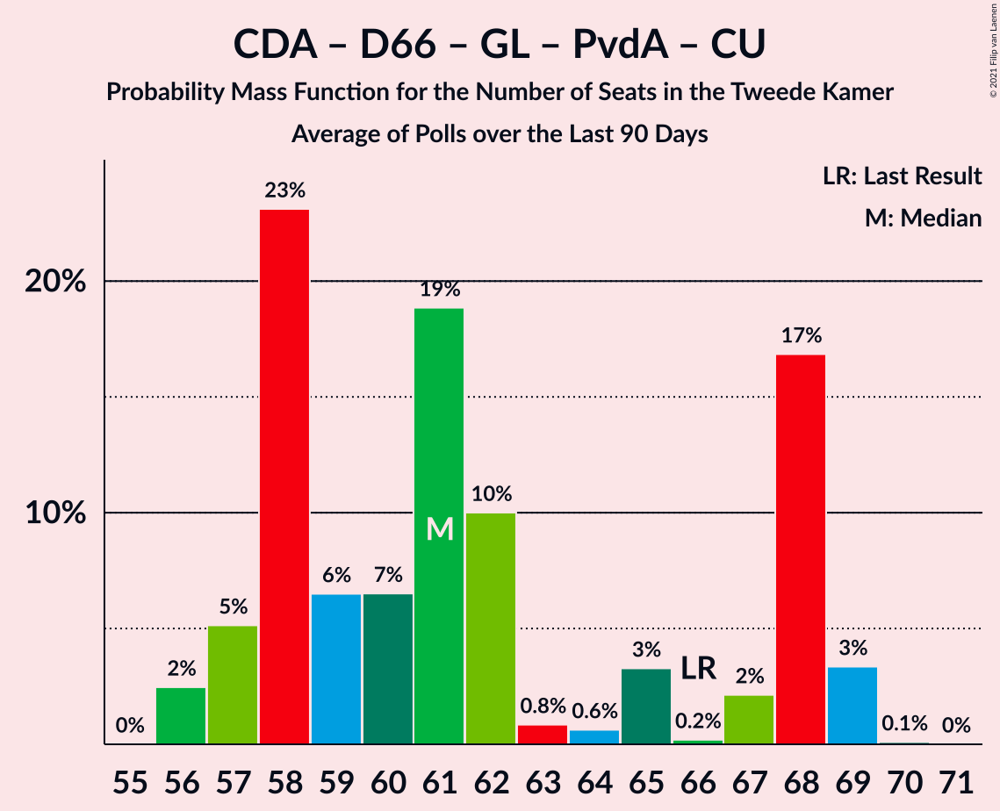

# Poll Average

<a href="#voting-intentions">Voting Intentions</a> | <a href="#seats">Seats</a> | <a href="#coalitions">Coalitions</a> | <a href="#technical-information">Technical Information</a>

## Summary

The table below lists the polls on which the average is based. They are the most recent polls (less than 90 days old) registered and analyzed so far.

| Period     | Polling firm/Commissioner(s) | VVD | PVV | CDA | D66 | GL | SP | PvdA | CU | PvdD | 50+ | SGP | DENK | FvD | PP | B1 | PvdT |
|:----------:|:----------------------------:|:--:|:--:|:--:|:--:|:--:|:--:|:--:|:--:|:--:|:--:|:--:|:--:|:--:|:--:|:--:|:--:|
| 15 March 2017 | General Election | 21.3%   33 | 13.1%   20 | 12.4%   19 | 12.2%   19 | 9.1%   14 | 9.1%   14 | 5.7%   9 | 3.4%   5 | 3.2%   5 | 3.1%   4 | 2.1%   3 | 2.1%   3 | 1.8%   2 | 0.3%   0 | 0.3%   0 | 0.0%   0 |
| N/A | Poll Average | 21–30%   33–47 | 11–18%   16–27 | 10–15%   14–22 | 7–11%   11–16 | 6–9%   8–14 | 5–8%   7–11 | 7–11%   11–16 | 3–8%   3–11 | 2–5%   3–8 | 0–2%   0–2 | 1–3%   2–4 | 0–2%   0–3 | 1–3%   1–5 | N/A   N/A | N/A   N/A | N/A   N/A |
| [1–2 January 2021](2021-01-02-Peilnl.html) | Peil.nl | 21–24%   33–37 | 15–18%   24–28 | 11–13%   17–20 | 8–10%   12–14 | 6–8%   9–12 | 5–7%   8–10 | 7–9%   11–13 | 5–6%   7–9 | 3–5%   5–7 | 0–1%   0–1 | 2–3%   3–5 | 2–3%   2–3 | 2–3%   3–4 | N/A   N/A | N/A   N/A | N/A   N/A |
| [18–21 December 2020](2020-12-21-KantarPublic.html) | Kantar Public | 25–30%   39–48 | 10–14%   16–21 | 9–13%   14–20 | 8–12%   13–17 | 6–8%   8–12 | 5–7%   7–11 | 8–11%   12–16 | 5–8%   8–13 | 3–5%   4–7 | 1–2%   0–3 | 1–3%   1–4 | 1–2%   1–3 | 1–2%   1–3 | N/A   N/A | N/A   N/A | N/A   N/A |
| [18–21 December 2020](2020-12-21-Ipsos.html) | Ipsos   EenVandaag | 24–30%   37–45 | 12–17%   19–25 | 11–16%   18–23 | 7–10%   11–15 | 6–9%   8–13 | 5–8%   7–12 | 7–10%   10–15 | 3–5%   3–7 | 3–5%   4–8 | 1–2%   0–2 | 1–3%   1–4 | 1–2%   1–3 | 2–3%   2–4 | N/A   N/A | N/A   N/A | N/A   N/A |
| [11–14 December 2020](2020-12-14-IOResearch.html) | I&O Research | 26–31%   39–49 | 13–17%   18–25 | 11–15%   16–22 | 7–10%   11–15 | 7–10%   9–15 | 5–7%   6–11 | 7–10%   11–15 | 3–5%   4–8 | 2–4%   3–5 | 0–1%   0–1 | 1–3%   2–4 | 0–1%   0–1 | 2–4%   3–5 | N/A   N/A | N/A   N/A | N/A   N/A |
| 15 March 2017 | General Election | 21.3%   33 | 13.1%   20 | 12.4%   19 | 12.2%   19 | 9.1%   14 | 9.1%   14 | 5.7%   9 | 3.4%   5 | 3.2%   5 | 3.1%   4 | 2.1%   3 | 2.1%   3 | 1.8%   2 | 0.3%   0 | 0.3%   0 | 0.0%   0 |

Only polls for which at least the sample size has been published are included in the table above.

**Legend:**
+ **Top half of each row:** Voting intentions (95% confidence interval)
+ **Bottom half of each row:** Seat projections for the Tweede Kamer (95% confidence interval)
+ **VVD:** Volkspartij voor Vrijheid en Democratie
+ **PVV:** Partij voor de Vrijheid
+ **CDA:** Christen-Democratisch Appèl
+ **D66:** Democraten 66
+ **GL:** GroenLinks
+ **SP:** Socialistische Partij
+ **PvdA:** Partij van de Arbeid
+ **CU:** ChristenUnie
+ **PvdD:** Partij voor de Dieren
+ **50+:** 50Plus
+ **SGP:** Staatkundig Gereformeerde Partij
+ **DENK:** DENK
+ **FvD:** Forum voor Democratie
+ **PP:** Piratenpartij
+ **B1:** Bij1
+ **PvdT:** Partij voor de Toekomst
+ **N/A (single party):** Party not included the published results
+ **N/A (entire row):** Calculation for this opinion poll not started yet

## Voting Intentions

### Confidence Intervals

| Party | Last Result | Median | 80% Confidence Interval | 90% Confidence Interval | 95% Confidence Interval | 99% Confidence Interval |
|:-----:|:-----------:|:------:|:-----------------------:|:-----------------------:|:-----------------------:|:-----------------------:|
| <a href="#volkspartij-voor-vrijheid-en-democratie">Volkspartij voor Vrijheid en Democratie</a> | 21.3% | 27.2% | 21.8–29.5% |21.4–30.0% | 21.1–30.5% | 20.5–31.4% |
| <a href="#partij-voor-de-vrijheid">Partij voor de Vrijheid</a> | 13.1% | 14.6% | 11.9–16.9% |11.4–17.3% | 11.0–17.6% | 10.3–18.1% |
| <a href="#christen-democratisch-appèl">Christen-Democratisch Appèl</a> | 12.4% | 12.2% | 10.7–14.0% |10.2–14.5% | 9.8–14.9% | 9.2–15.8% |
| <a href="#democraten-66">Democraten 66</a> | 12.2% | 8.8% | 7.8–10.2% |7.5–10.7% | 7.2–11.0% | 6.7–11.7% |
| <a href="#groenlinks">GroenLinks</a> | 9.1% | 7.1% | 6.2–8.4% |6.0–8.8% | 5.8–9.1% | 5.4–9.7% |
| <a href="#socialistische-partij">Socialistische Partij</a> | 9.1% | 6.1% | 5.3–7.0% |5.1–7.3% | 4.9–7.6% | 4.5–8.2% |
| <a href="#partij-van-de-arbeid">Partij van de Arbeid</a> | 5.7% | 8.5% | 7.5–9.9% |7.3–10.3% | 7.0–10.6% | 6.6–11.3% |
| <a href="#christenunie">ChristenUnie</a> | 3.4% | 4.9% | 3.3–6.9% |3.1–7.3% | 2.9–7.6% | 2.5–8.2% |
| <a href="#partij-voor-de-dieren">Partij voor de Dieren</a> | 3.2% | 3.8% | 2.6–4.5% |2.3–4.8% | 2.1–5.0% | 1.9–5.5% |
| <a href="#50plus">50Plus</a> | 3.1% | 0.8% | 0.5–1.3% |0.5–1.5% | 0.4–1.7% | 0.3–2.0% |
| <a href="#staatkundig-gereformeerde-partij">Staatkundig Gereformeerde Partij</a> | 2.1% | 2.1% | 1.5–2.8% |1.4–3.0% | 1.3–3.1% | 1.1–3.4% |
| <a href="#denk">DENK</a> | 2.1% | 1.5% | 0.6–2.2% |0.5–2.3% | 0.4–2.4% | 0.3–2.7% |
| <a href="#forum-voor-democratie">Forum voor Democratie</a> | 1.8% | 2.4% | 1.3–3.1% |1.2–3.2% | 1.0–3.4% | 0.8–3.8% |
| <a href="#piratenpartij">Piratenpartij</a> | 0.3% | N/A | N/A |N/A | N/A | N/A |
| <a href="#bij1">Bij1</a> | 0.3% | N/A | N/A |N/A | N/A | N/A |
| <a href="#partij-voor-de-toekomst">Partij voor de Toekomst</a> | 0.0% | N/A | N/A |N/A | N/A | N/A |

### Volkspartij voor Vrijheid en Democratie

*For a full overview of the results for this party, see the [Volkspartij voor Vrijheid en Democratie](party-volkspartijvoorvrijheidendemocratie.html) page.*

| Voting Intentions | Probability | Accumulated | Special Marks |
|:-----------------:|:-----------:|:-----------:|:-------------:|
| 18.5–19.5% | 0% | 100% |  |
| 19.5–20.5% | 0.6% | 100% |  |
| 20.5–21.5% | 6% | 99.4% | Last Result |
| 21.5–22.5% | 12% | 93% |  |
| 22.5–23.5% | 5% | 81% |  |
| 23.5–24.5% | 2% | 75% |  |
| 24.5–25.5% | 4% | 74% |  |
| 25.5–26.5% | 10% | 70% |  |
| 26.5–27.5% | 17% | 60% | Median |
| 27.5–28.5% | 19% | 43% |  |
| 28.5–29.5% | 15% | 24% |  |
| 29.5–30.5% | 7% | 9% |  |
| 30.5–31.5% | 2% | 2% |  |
| 31.5–32.5% | 0.4% | 0.4% |  |
| 32.5–33.5% | 0% | 0% |  |

### Partij voor de Vrijheid

*For a full overview of the results for this party, see the [Partij voor de Vrijheid](party-partijvoordevrijheid.html) page.*

| Voting Intentions | Probability | Accumulated | Special Marks |
|:-----------------:|:-----------:|:-----------:|:-------------:|
| 8.5–9.5% | 0% | 100% |  |
| 9.5–10.5% | 0.9% | 100% |  |
| 10.5–11.5% | 6% | 99.1% |  |
| 11.5–12.5% | 11% | 94% |  |
| 12.5–13.5% | 13% | 82% | Last Result |
| 13.5–14.5% | 18% | 69% |  |
| 14.5–15.5% | 18% | 51% | Median |
| 15.5–16.5% | 17% | 33% |  |
| 16.5–17.5% | 13% | 16% |  |
| 17.5–18.5% | 3% | 3% |  |
| 18.5–19.5% | 0.1% | 0.1% |  |
| 19.5–20.5% | 0% | 0% |  |

### Christen-Democratisch Appèl

*For a full overview of the results for this party, see the [Christen-Democratisch Appèl](party-christen-democratischappèl.html) page.*

| Voting Intentions | Probability | Accumulated | Special Marks |
|:-----------------:|:-----------:|:-----------:|:-------------:|
| 7.5–8.5% | 0% | 100% |  |
| 8.5–9.5% | 1.2% | 100% |  |
| 9.5–10.5% | 7% | 98.7% |  |
| 10.5–11.5% | 19% | 92% |  |
| 11.5–12.5% | 32% | 73% | Last Result, Median |
| 12.5–13.5% | 24% | 40% |  |
| 13.5–14.5% | 12% | 17% |  |
| 14.5–15.5% | 4% | 5% |  |
| 15.5–16.5% | 0.7% | 0.8% |  |
| 16.5–17.5% | 0.1% | 0.1% |  |
| 17.5–18.5% | 0% | 0% |  |

### Democraten 66

*For a full overview of the results for this party, see the [Democraten 66](party-democraten66.html) page.*

| Voting Intentions | Probability | Accumulated | Special Marks |
|:-----------------:|:-----------:|:-----------:|:-------------:|
| 4.5–5.5% | 0% | 100% |  |
| 5.5–6.5% | 0.3% | 100% |  |
| 6.5–7.5% | 6% | 99.7% |  |
| 7.5–8.5% | 30% | 94% |  |
| 8.5–9.5% | 40% | 64% | Median |
| 9.5–10.5% | 17% | 24% |  |
| 10.5–11.5% | 5% | 6% |  |
| 11.5–12.5% | 0.8% | 0.8% | Last Result |
| 12.5–13.5% | 0% | 0% |  |
| 13.5–14.5% | 0% | 0% |  |

### GroenLinks

*For a full overview of the results for this party, see the [GroenLinks](party-groenlinks.html) page.*

| Voting Intentions | Probability | Accumulated | Special Marks |
|:-----------------:|:-----------:|:-----------:|:-------------:|
| 3.5–4.5% | 0% | 100% |  |
| 4.5–5.5% | 1.1% | 100% |  |
| 5.5–6.5% | 23% | 98.9% |  |
| 6.5–7.5% | 44% | 76% | Median |
| 7.5–8.5% | 24% | 32% |  |
| 8.5–9.5% | 7% | 8% | Last Result |
| 9.5–10.5% | 0.7% | 0.8% |  |
| 10.5–11.5% | 0% | 0% |  |

### Socialistische Partij

*For a full overview of the results for this party, see the [Socialistische Partij](party-socialistischepartij.html) page.*

| Voting Intentions | Probability | Accumulated | Special Marks |
|:-----------------:|:-----------:|:-----------:|:-------------:|
| 2.5–3.5% | 0% | 100% |  |
| 3.5–4.5% | 0.7% | 100% |  |
| 4.5–5.5% | 19% | 99.3% |  |
| 5.5–6.5% | 57% | 80% | Median |
| 6.5–7.5% | 20% | 23% |  |
| 7.5–8.5% | 3% | 3% |  |
| 8.5–9.5% | 0.1% | 0.1% | Last Result |
| 9.5–10.5% | 0% | 0% |  |

### Partij van de Arbeid

*For a full overview of the results for this party, see the [Partij van de Arbeid](party-partijvandearbeid.html) page.*

| Voting Intentions | Probability | Accumulated | Special Marks |
|:-----------------:|:-----------:|:-----------:|:-------------:|
| 4.5–5.5% | 0% | 100% |  |
| 5.5–6.5% | 0.5% | 100% | Last Result |
| 6.5–7.5% | 10% | 99.5% |  |
| 7.5–8.5% | 40% | 89% |  |
| 8.5–9.5% | 32% | 49% | Median |
| 9.5–10.5% | 14% | 16% |  |
| 10.5–11.5% | 3% | 3% |  |
| 11.5–12.5% | 0.2% | 0.2% |  |
| 12.5–13.5% | 0% | 0% |  |

### ChristenUnie

*For a full overview of the results for this party, see the [ChristenUnie](party-christenunie.html) page.*

| Voting Intentions | Probability | Accumulated | Special Marks |
|:-----------------:|:-----------:|:-----------:|:-------------:|
| 0.5–1.5% | 0% | 100% |  |
| 1.5–2.5% | 0.6% | 100% |  |
| 2.5–3.5% | 16% | 99.4% | Last Result |
| 3.5–4.5% | 28% | 83% |  |
| 4.5–5.5% | 23% | 55% | Median |
| 5.5–6.5% | 18% | 32% |  |
| 6.5–7.5% | 11% | 14% |  |
| 7.5–8.5% | 3% | 3% |  |
| 8.5–9.5% | 0.2% | 0.2% |  |
| 9.5–10.5% | 0% | 0% |  |

### Partij voor de Dieren

*For a full overview of the results for this party, see the [Partij voor de Dieren](party-partijvoordedieren.html) page.*

| Voting Intentions | Probability | Accumulated | Special Marks |
|:-----------------:|:-----------:|:-----------:|:-------------:|
| 0.5–1.5% | 0% | 100% |  |
| 1.5–2.5% | 10% | 100% |  |
| 2.5–3.5% | 28% | 90% | Last Result |
| 3.5–4.5% | 52% | 62% | Median |
| 4.5–5.5% | 10% | 10% |  |
| 5.5–6.5% | 0.4% | 0.4% |  |
| 6.5–7.5% | 0% | 0% |  |

### 50Plus

*For a full overview of the results for this party, see the [50Plus](party-50plus.html) page.*

| Voting Intentions | Probability | Accumulated | Special Marks |
|:-----------------:|:-----------:|:-----------:|:-------------:|
| 0.0–0.5% | 11% | 100% |  |
| 0.5–1.5% | 85% | 89% | Median |
| 1.5–2.5% | 4% | 4% |  |
| 2.5–3.5% | 0% | 0% | Last Result |

### Staatkundig Gereformeerde Partij

*For a full overview of the results for this party, see the [Staatkundig Gereformeerde Partij](party-staatkundiggereformeerdepartij.html) page.*

| Voting Intentions | Probability | Accumulated | Special Marks |
|:-----------------:|:-----------:|:-----------:|:-------------:|
| 0.0–0.5% | 0% | 100% |  |
| 0.5–1.5% | 10% | 100% |  |
| 1.5–2.5% | 65% | 90% | Last Result, Median |
| 2.5–3.5% | 24% | 25% |  |
| 3.5–4.5% | 0.2% | 0.2% |  |
| 4.5–5.5% | 0% | 0% |  |

### DENK

*For a full overview of the results for this party, see the [DENK](party-denk.html) page.*

| Voting Intentions | Probability | Accumulated | Special Marks |
|:-----------------:|:-----------:|:-----------:|:-------------:|
| 0.0–0.5% | 6% | 100% |  |
| 0.5–1.5% | 47% | 94% |  |
| 1.5–2.5% | 45% | 47% | Last Result, Median |
| 2.5–3.5% | 1.2% | 1.2% |  |
| 3.5–4.5% | 0% | 0% |  |

### Forum voor Democratie

*For a full overview of the results for this party, see the [Forum voor Democratie](party-forumvoordemocratie.html) page.*

| Voting Intentions | Probability | Accumulated | Special Marks |
|:-----------------:|:-----------:|:-----------:|:-------------:|
| 0.0–0.5% | 0% | 100% |  |
| 0.5–1.5% | 17% | 100% |  |
| 1.5–2.5% | 42% | 83% | Last Result, Median |
| 2.5–3.5% | 40% | 41% |  |
| 3.5–4.5% | 1.4% | 1.4% |  |
| 4.5–5.5% | 0% | 0% |  |

## Seats

### Confidence Intervals

| Party | Last Result | Median | 80% Confidence Interval | 90% Confidence Interval | 95% Confidence Interval | 99% Confidence Interval |
|:-----:|:-----------:|:------:|:-----------------------:|:-----------------------:|:-----------------------:|:-----------------------:|
| <a href="#volkspartij-voor-vrijheid-en-democratie">Volkspartij voor Vrijheid en Democratie</a> | 33 | 43 | 34–45 |33–46 | 33–47 | 32–49 |
| <a href="#partij-voor-de-vrijheid">Partij voor de Vrijheid</a> | 20 | 21 | 17–26 |16–26 | 16–27 | 15–28 |
| <a href="#christen-democratisch-appèl">Christen-Democratisch Appèl</a> | 19 | 18 | 16–21 |15–22 | 14–22 | 14–24 |
| <a href="#democraten-66">Democraten 66</a> | 19 | 13 | 12–15 |11–15 | 11–16 | 10–17 |
| <a href="#groenlinks">GroenLinks</a> | 14 | 10 | 9–13 |9–13 | 8–14 | 8–15 |
| <a href="#socialistische-partij">Socialistische Partij</a> | 14 | 10 | 8–11 |7–11 | 7–11 | 6–12 |
| <a href="#partij-van-de-arbeid">Partij van de Arbeid</a> | 9 | 13 | 11–15 |11–15 | 11–16 | 10–16 |
| <a href="#christenunie">ChristenUnie</a> | 5 | 7 | 4–9 |4–10 | 3–11 | 3–13 |
| <a href="#partij-voor-de-dieren">Partij voor de Dieren</a> | 5 | 6 | 3–7 |3–8 | 3–8 | 3–8 |
| <a href="#50plus">50Plus</a> | 4 | 1 | 0–2 |0–2 | 0–2 | 0–3 |
| <a href="#staatkundig-gereformeerde-partij">Staatkundig Gereformeerde Partij</a> | 3 | 3 | 2–3 |2–4 | 2–4 | 1–5 |
| <a href="#denk">DENK</a> | 3 | 2 | 1–3 |0–3 | 0–3 | 0–3 |
| <a href="#forum-voor-democratie">Forum voor Democratie</a> | 2 | 3 | 2–4 |1–4 | 1–5 | 1–5 |
| <a href="#piratenpartij">Piratenpartij</a> | 0 | N/A | N/A |N/A | N/A | N/A |
| <a href="#bij1">Bij1</a> | 0 | N/A | N/A |N/A | N/A | N/A |
| <a href="#partij-voor-de-toekomst">Partij voor de Toekomst</a> | 0 | N/A | N/A |N/A | N/A | N/A |

### Volkspartij voor Vrijheid en Democratie

*For a full overview of the results for this party, see the [Volkspartij voor Vrijheid en Democratie](party-volkspartijvoorvrijheidendemocratie.html) page.*

| Number of Seats | Probability | Accumulated | Special Marks |
|:---------------:|:-----------:|:-----------:|:-------------:|
| 31 | 0.3% | 100% |  |
| 32 | 0.3% | 99.7% |  |
| 33 | 5% | 99.5% | Last Result |
| 34 | 16% | 95% |  |
| 35 | 3% | 79% |  |
| 36 | 0.4% | 76% |  |
| 37 | 1.3% | 75% |  |
| 38 | 3% | 74% |  |
| 39 | 6% | 71% |  |
| 40 | 2% | 65% |  |
| 41 | 5% | 63% |  |
| 42 | 7% | 57% |  |
| 43 | 15% | 50% | Median |
| 44 | 11% | 35% |  |
| 45 | 17% | 24% |  |
| 46 | 2% | 7% |  |
| 47 | 2% | 4% |  |
| 48 | 0.7% | 2% |  |
| 49 | 1.1% | 1.2% |  |
| 50 | 0% | 0% |  |

### Partij voor de Vrijheid

*For a full overview of the results for this party, see the [Partij voor de Vrijheid](party-partijvoordevrijheid.html) page.*

| Number of Seats | Probability | Accumulated | Special Marks |
|:---------------:|:-----------:|:-----------:|:-------------:|
| 14 | 0.1% | 100% |  |
| 15 | 0.4% | 99.9% |  |
| 16 | 8% | 99.5% |  |
| 17 | 3% | 92% |  |
| 18 | 3% | 89% |  |
| 19 | 12% | 86% |  |
| 20 | 8% | 74% | Last Result |
| 21 | 18% | 66% | Median |
| 22 | 9% | 48% |  |
| 23 | 11% | 39% |  |
| 24 | 3% | 28% |  |
| 25 | 5% | 25% |  |
| 26 | 17% | 20% |  |
| 27 | 2% | 3% |  |
| 28 | 2% | 2% |  |
| 29 | 0% | 0% |  |

### Christen-Democratisch Appèl

*For a full overview of the results for this party, see the [Christen-Democratisch Appèl](party-christen-democratischappèl.html) page.*

| Number of Seats | Probability | Accumulated | Special Marks |
|:---------------:|:-----------:|:-----------:|:-------------:|
| 12 | 0.1% | 100% |  |
| 13 | 0.1% | 99.9% |  |
| 14 | 2% | 99.8% |  |
| 15 | 3% | 97% |  |
| 16 | 5% | 95% |  |
| 17 | 19% | 90% |  |
| 18 | 29% | 71% | Median |
| 19 | 11% | 42% | Last Result |
| 20 | 18% | 31% |  |
| 21 | 6% | 13% |  |
| 22 | 5% | 7% |  |
| 23 | 1.4% | 2% |  |
| 24 | 0.5% | 0.7% |  |
| 25 | 0.2% | 0.2% |  |
| 26 | 0% | 0% |  |

### Democraten 66

*For a full overview of the results for this party, see the [Democraten 66](party-democraten66.html) page.*

| Number of Seats | Probability | Accumulated | Special Marks |
|:---------------:|:-----------:|:-----------:|:-------------:|
| 9 | 0.2% | 100% |  |
| 10 | 0.4% | 99.8% |  |
| 11 | 7% | 99.3% |  |
| 12 | 7% | 93% |  |
| 13 | 36% | 86% | Median |
| 14 | 29% | 50% |  |
| 15 | 16% | 21% |  |
| 16 | 3% | 5% |  |
| 17 | 1.2% | 2% |  |
| 18 | 0.1% | 0.4% |  |
| 19 | 0.1% | 0.2% | Last Result |
| 20 | 0.1% | 0.1% |  |
| 21 | 0% | 0% |  |

### GroenLinks

*For a full overview of the results for this party, see the [GroenLinks](party-groenlinks.html) page.*

| Number of Seats | Probability | Accumulated | Special Marks |
|:---------------:|:-----------:|:-----------:|:-------------:|
| 7 | 0.2% | 100% |  |
| 8 | 4% | 99.8% |  |
| 9 | 24% | 96% |  |
| 10 | 27% | 72% | Median |
| 11 | 9% | 45% |  |
| 12 | 19% | 36% |  |
| 13 | 14% | 17% |  |
| 14 | 2% | 3% | Last Result |
| 15 | 1.2% | 1.2% |  |
| 16 | 0% | 0% |  |

### Socialistische Partij

*For a full overview of the results for this party, see the [Socialistische Partij](party-socialistischepartij.html) page.*

| Number of Seats | Probability | Accumulated | Special Marks |
|:---------------:|:-----------:|:-----------:|:-------------:|
| 6 | 2% | 100% |  |
| 7 | 6% | 98% |  |
| 8 | 14% | 92% |  |
| 9 | 27% | 78% |  |
| 10 | 35% | 51% | Median |
| 11 | 14% | 15% |  |
| 12 | 1.5% | 2% |  |
| 13 | 0.2% | 0.2% |  |
| 14 | 0% | 0% | Last Result |

### Partij van de Arbeid

*For a full overview of the results for this party, see the [Partij van de Arbeid](party-partijvandearbeid.html) page.*

| Number of Seats | Probability | Accumulated | Special Marks |
|:---------------:|:-----------:|:-----------:|:-------------:|
| 9 | 0.3% | 100% | Last Result |
| 10 | 1.2% | 99.7% |  |
| 11 | 15% | 98% |  |
| 12 | 30% | 84% |  |
| 13 | 28% | 54% | Median |
| 14 | 15% | 26% |  |
| 15 | 8% | 11% |  |
| 16 | 3% | 3% |  |
| 17 | 0.2% | 0.5% |  |
| 18 | 0.2% | 0.3% |  |
| 19 | 0% | 0% |  |

### ChristenUnie

*For a full overview of the results for this party, see the [ChristenUnie](party-christenunie.html) page.*

| Number of Seats | Probability | Accumulated | Special Marks |
|:---------------:|:-----------:|:-----------:|:-------------:|
| 3 | 3% | 100% |  |
| 4 | 12% | 97% |  |
| 5 | 10% | 85% | Last Result |
| 6 | 15% | 75% |  |
| 7 | 25% | 60% | Median |
| 8 | 12% | 35% |  |
| 9 | 14% | 23% |  |
| 10 | 5% | 9% |  |
| 11 | 2% | 3% |  |
| 12 | 0.7% | 1.3% |  |
| 13 | 0.6% | 0.6% |  |
| 14 | 0% | 0% |  |

### Partij voor de Dieren

*For a full overview of the results for this party, see the [Partij voor de Dieren](party-partijvoordedieren.html) page.*

| Number of Seats | Probability | Accumulated | Special Marks |
|:---------------:|:-----------:|:-----------:|:-------------:|
| 2 | 0.4% | 100% |  |
| 3 | 13% | 99.6% |  |
| 4 | 11% | 87% |  |
| 5 | 21% | 76% | Last Result |
| 6 | 41% | 55% | Median |
| 7 | 8% | 14% |  |
| 8 | 5% | 5% |  |
| 9 | 0.2% | 0.2% |  |
| 10 | 0% | 0% |  |

### 50Plus

*For a full overview of the results for this party, see the [50Plus](party-50plus.html) page.*

| Number of Seats | Probability | Accumulated | Special Marks |
|:---------------:|:-----------:|:-----------:|:-------------:|
| 0 | 16% | 100% |  |
| 1 | 68% | 84% | Median |
| 2 | 14% | 15% |  |
| 3 | 1.2% | 1.2% |  |
| 4 | 0% | 0% | Last Result |

### Staatkundig Gereformeerde Partij

*For a full overview of the results for this party, see the [Staatkundig Gereformeerde Partij](party-staatkundiggereformeerdepartij.html) page.*

| Number of Seats | Probability | Accumulated | Special Marks |
|:---------------:|:-----------:|:-----------:|:-------------:|
| 1 | 2% | 100% |  |
| 2 | 44% | 98% |  |
| 3 | 45% | 54% | Last Result, Median |
| 4 | 7% | 9% |  |
| 5 | 2% | 2% |  |
| 6 | 0% | 0% |  |

### DENK

*For a full overview of the results for this party, see the [DENK](party-denk.html) page.*

| Number of Seats | Probability | Accumulated | Special Marks |
|:---------------:|:-----------:|:-----------:|:-------------:|
| 0 | 7% | 100% |  |
| 1 | 37% | 93% |  |
| 2 | 26% | 56% | Median |
| 3 | 29% | 30% | Last Result |
| 4 | 0.4% | 0.4% |  |
| 5 | 0% | 0% |  |

### Forum voor Democratie

*For a full overview of the results for this party, see the [Forum voor Democratie](party-forumvoordemocratie.html) page.*

| Number of Seats | Probability | Accumulated | Special Marks |
|:---------------:|:-----------:|:-----------:|:-------------:|
| 1 | 6% | 100% |  |
| 2 | 16% | 94% | Last Result |
| 3 | 48% | 77% | Median |
| 4 | 25% | 29% |  |
| 5 | 3% | 3% |  |
| 6 | 0.1% | 0.1% |  |
| 7 | 0% | 0% |  |

### Piratenpartij

*For a full overview of the results for this party, see the [Piratenpartij](party-piratenpartij.html) page.*

### Bij1

*For a full overview of the results for this party, see the [Bij1](party-bij1.html) page.*

### Partij voor de Toekomst

*For a full overview of the results for this party, see the [Partij voor de Toekomst](party-partijvoordetoekomst.html) page.*

## Coalitions

### Confidence Intervals

| Coalition | Last Result | Median | Majority? | 80% Confidence Interval | 90% Confidence Interval | 95% Confidence Interval | 99% Confidence Interval |
|:---------:|:-----------:|:------:|:---------:|:-----------------------:|:-----------------------:|:-----------------------:|:-----------------------:|
| Volkspartij voor Vrijheid en Democratie – Christen-Democratisch Appèl – Democraten 66 – Partij van de Arbeid – ChristenUnie | 85 | 93 | 100% | 84–99 | 84–99 | 84–100 | 83–103 |
| Volkspartij voor Vrijheid en Democratie – Christen-Democratisch Appèl – Democraten 66 – GroenLinks – ChristenUnie | 90 | 92 | 100% | 81–96 | 81–98 | 81–100 | 81–100 |
| Volkspartij voor Vrijheid en Democratie – Partij voor de Vrijheid – Christen-Democratisch Appèl – Staatkundig Gereformeerde Partij – Forum voor Democratie | 77 | 86 | 100% | 82–91 | 81–93 | 80–94 | 78–96 |
| Volkspartij voor Vrijheid en Democratie – Partij voor de Vrijheid – Christen-Democratisch Appèl – Forum voor Democratie | 74 | 84 | 99.3% | 80–89 | 79–90 | 78–92 | 75–94 |
| Volkspartij voor Vrijheid en Democratie – Partij voor de Vrijheid – Christen-Democratisch Appèl | 72 | 81 | 97% | 77–85 | 76–87 | 75–87 | 74–90 |
| Volkspartij voor Vrijheid en Democratie – Christen-Democratisch Appèl – Democraten 66 – ChristenUnie | 76 | 80 | 75% | 72–86 | 72–87 | 72–87 | 71–89 |
| Volkspartij voor Vrijheid en Democratie – Christen-Democratisch Appèl – Democraten 66 | 71 | 74 | 42% | 65–78 | 64–79 | 64–80 | 63–81 |
| Volkspartij voor Vrijheid en Democratie – Christen-Democratisch Appèl – Partij van de Arbeid | 61 | 74 | 28% | 63–78 | 63–79 | 63–79 | 62–81 |
| Christen-Democratisch Appèl – Democraten 66 – GroenLinks – Socialistische Partij – Partij van de Arbeid – ChristenUnie | 80 | 72 | 16% | 69–76 | 68–76 | 67–77 | 66–79 |
| Volkspartij voor Vrijheid en Democratie – Democraten 66 – Partij van de Arbeid | 61 | 69 | 1.3% | 60–72 | 59–73 | 58–75 | 57–77 |
| Volkspartij voor Vrijheid en Democratie – Christen-Democratisch Appèl – 50Plus – Staatkundig Gereformeerde Partij – Forum voor Democratie | 61 | 67 | 0.2% | 58–72 | 58–73 | 58–73 | 58–75 |
| Volkspartij voor Vrijheid en Democratie – Christen-Democratisch Appèl – Staatkundig Gereformeerde Partij – Forum voor Democratie | 57 | 66 | 0.1% | 57–72 | 57–72 | 57–72 | 57–74 |
| Volkspartij voor Vrijheid en Democratie – Christen-Democratisch Appèl – 50Plus – Forum voor Democratie | 58 | 65 | 0% | 55–70 | 55–70 | 55–70 | 54–72 |
| Volkspartij voor Vrijheid en Democratie – Christen-Democratisch Appèl – Forum voor Democratie | 54 | 64 | 0% | 54–69 | 54–69 | 54–70 | 53–71 |
| Christen-Democratisch Appèl – Democraten 66 – GroenLinks – Partij van de Arbeid – ChristenUnie | 66 | 62 | 0% | 59–66 | 59–67 | 59–68 | 57–70 |
| Volkspartij voor Vrijheid en Democratie – Christen-Democratisch Appèl | 52 | 61 | 0% | 51–65 | 51–65 | 51–66 | 50–68 |
| Volkspartij voor Vrijheid en Democratie – Partij van de Arbeid | 42 | 55 | 0% | 46–58 | 46–60 | 45–61 | 44–63 |
| Christen-Democratisch Appèl – Democraten 66 – Partij van de Arbeid | 47 | 44 | 0% | 42–48 | 42–49 | 42–50 | 40–51 |
| Christen-Democratisch Appèl – Partij van de Arbeid – ChristenUnie | 33 | 39 | 0% | 35–41 | 33–42 | 33–43 | 33–44 |
| Christen-Democratisch Appèl – Democraten 66 | 38 | 32 | 0% | 30–34 | 30–36 | 29–37 | 28–37 |
| Christen-Democratisch Appèl – Partij van de Arbeid | 28 | 31 | 0% | 29–34 | 28–35 | 27–36 | 27–38 |

### Volkspartij voor Vrijheid en Democratie – Christen-Democratisch Appèl – Democraten 66 – Partij van de Arbeid – ChristenUnie

| Number of Seats | Probability | Accumulated | Special Marks |
|:---------------:|:-----------:|:-----------:|:-------------:|
| 81 | 0.2% | 100% |  |
| 82 | 0.3% | 99.8% |  |
| 83 | 2% | 99.5% |  |
| 84 | 15% | 98% |  |
| 85 | 2% | 83% | Last Result |
| 86 | 3% | 81% |  |
| 87 | 0.5% | 78% |  |
| 88 | 3% | 78% |  |
| 89 | 0.5% | 74% |  |
| 90 | 4% | 74% |  |
| 91 | 13% | 69% |  |
| 92 | 0.9% | 56% |  |
| 93 | 7% | 55% |  |
| 94 | 3% | 48% | Median |
| 95 | 8% | 46% |  |
| 96 | 8% | 38% |  |
| 97 | 10% | 30% |  |
| 98 | 6% | 20% |  |
| 99 | 10% | 14% |  |
| 100 | 2% | 4% |  |
| 101 | 1.0% | 2% |  |
| 102 | 0.2% | 0.8% |  |
| 103 | 0.4% | 0.6% |  |
| 104 | 0.1% | 0.2% |  |
| 105 | 0% | 0.1% |  |
| 106 | 0% | 0% |  |

### Volkspartij voor Vrijheid en Democratie – Christen-Democratisch Appèl – Democraten 66 – GroenLinks – ChristenUnie

| Number of Seats | Probability | Accumulated | Special Marks |
|:---------------:|:-----------:|:-----------:|:-------------:|
| 80 | 0.5% | 100% |  |
| 81 | 17% | 99.5% |  |
| 82 | 2% | 83% |  |
| 83 | 0.5% | 81% |  |
| 84 | 0.6% | 80% |  |
| 85 | 5% | 80% |  |
| 86 | 1.1% | 74% |  |
| 87 | 1.0% | 73% |  |
| 88 | 2% | 72% |  |
| 89 | 10% | 70% |  |
| 90 | 0.9% | 61% | Last Result |
| 91 | 5% | 60% | Median |
| 92 | 8% | 55% |  |
| 93 | 15% | 47% |  |
| 94 | 4% | 32% |  |
| 95 | 4% | 28% |  |
| 96 | 16% | 24% |  |
| 97 | 2% | 8% |  |
| 98 | 2% | 6% |  |
| 99 | 0.6% | 4% |  |
| 100 | 3% | 3% |  |
| 101 | 0.1% | 0.1% |  |
| 102 | 0% | 0% |  |

### Volkspartij voor Vrijheid en Democratie – Partij voor de Vrijheid – Christen-Democratisch Appèl – Staatkundig Gereformeerde Partij – Forum voor Democratie

| Number of Seats | Probability | Accumulated | Special Marks |
|:---------------:|:-----------:|:-----------:|:-------------:|
| 76 | 0.1% | 100% | Majority |
| 77 | 0.2% | 99.8% | Last Result |
| 78 | 0.3% | 99.6% |  |
| 79 | 1.3% | 99.3% |  |
| 80 | 0.7% | 98% |  |
| 81 | 4% | 97% |  |
| 82 | 11% | 93% |  |
| 83 | 17% | 82% |  |
| 84 | 4% | 65% |  |
| 85 | 5% | 61% |  |
| 86 | 6% | 56% |  |
| 87 | 3% | 50% |  |
| 88 | 3% | 47% | Median |
| 89 | 13% | 44% |  |
| 90 | 11% | 31% |  |
| 91 | 11% | 21% |  |
| 92 | 3% | 9% |  |
| 93 | 3% | 6% |  |
| 94 | 2% | 3% |  |
| 95 | 0.7% | 2% |  |
| 96 | 0.5% | 0.9% |  |
| 97 | 0.3% | 0.4% |  |
| 98 | 0% | 0.1% |  |
| 99 | 0% | 0% |  |

### Volkspartij voor Vrijheid en Democratie – Partij voor de Vrijheid – Christen-Democratisch Appèl – Forum voor Democratie

| Number of Seats | Probability | Accumulated | Special Marks |
|:---------------:|:-----------:|:-----------:|:-------------:|
| 73 | 0.1% | 100% |  |
| 74 | 0.2% | 99.9% | Last Result |
| 75 | 0.4% | 99.7% |  |
| 76 | 0.3% | 99.3% | Majority |
| 77 | 1.1% | 99.0% |  |
| 78 | 3% | 98% |  |
| 79 | 5% | 95% |  |
| 80 | 24% | 90% |  |
| 81 | 6% | 66% |  |
| 82 | 7% | 60% |  |
| 83 | 3% | 54% |  |
| 84 | 3% | 51% |  |
| 85 | 2% | 48% | Median |
| 86 | 8% | 46% |  |
| 87 | 9% | 38% |  |
| 88 | 15% | 29% |  |
| 89 | 8% | 14% |  |
| 90 | 2% | 6% |  |
| 91 | 1.5% | 4% |  |
| 92 | 1.4% | 3% |  |
| 93 | 0.5% | 1.2% |  |
| 94 | 0.5% | 0.7% |  |
| 95 | 0.1% | 0.1% |  |
| 96 | 0% | 0% |  |

### Volkspartij voor Vrijheid en Democratie – Partij voor de Vrijheid – Christen-Democratisch Appèl

| Number of Seats | Probability | Accumulated | Special Marks |
|:---------------:|:-----------:|:-----------:|:-------------:|
| 71 | 0% | 100% |  |
| 72 | 0.1% | 99.9% | Last Result |
| 73 | 0.2% | 99.8% |  |
| 74 | 0.8% | 99.6% |  |
| 75 | 1.3% | 98.8% |  |
| 76 | 4% | 97% | Majority |
| 77 | 19% | 94% |  |
| 78 | 15% | 75% |  |
| 79 | 4% | 60% |  |
| 80 | 4% | 55% |  |
| 81 | 4% | 51% |  |
| 82 | 1.5% | 47% | Median |
| 83 | 7% | 46% |  |
| 84 | 19% | 39% |  |
| 85 | 11% | 20% |  |
| 86 | 2% | 8% |  |
| 87 | 4% | 6% |  |
| 88 | 0.6% | 2% |  |
| 89 | 0.5% | 1.1% |  |
| 90 | 0.3% | 0.6% |  |
| 91 | 0.3% | 0.3% |  |
| 92 | 0.1% | 0.1% |  |
| 93 | 0% | 0% |  |

### Volkspartij voor Vrijheid en Democratie – Christen-Democratisch Appèl – Democraten 66 – ChristenUnie

| Number of Seats | Probability | Accumulated | Special Marks |
|:---------------:|:-----------:|:-----------:|:-------------:|
| 70 | 0.4% | 100% |  |
| 71 | 2% | 99.6% |  |
| 72 | 15% | 98% |  |
| 73 | 3% | 82% |  |
| 74 | 0.7% | 80% |  |
| 75 | 4% | 79% |  |
| 76 | 4% | 75% | Last Result, Majority |
| 77 | 4% | 71% |  |
| 78 | 4% | 67% |  |
| 79 | 3% | 63% |  |
| 80 | 10% | 60% |  |
| 81 | 6% | 50% | Median |
| 82 | 8% | 44% |  |
| 83 | 10% | 37% |  |
| 84 | 10% | 27% |  |
| 85 | 4% | 17% |  |
| 86 | 8% | 13% |  |
| 87 | 3% | 5% |  |
| 88 | 2% | 2% |  |
| 89 | 0.3% | 0.5% |  |
| 90 | 0.2% | 0.2% |  |
| 91 | 0% | 0% |  |

### Volkspartij voor Vrijheid en Democratie – Christen-Democratisch Appèl – Democraten 66

| Number of Seats | Probability | Accumulated | Special Marks |
|:---------------:|:-----------:|:-----------:|:-------------:|
| 62 | 0.4% | 100% |  |
| 63 | 0.5% | 99.6% |  |
| 64 | 4% | 99.1% |  |
| 65 | 15% | 95% |  |
| 66 | 0.3% | 80% |  |
| 67 | 3% | 79% |  |
| 68 | 0.9% | 76% |  |
| 69 | 0.9% | 75% |  |
| 70 | 1.0% | 74% |  |
| 71 | 4% | 73% | Last Result |
| 72 | 5% | 69% |  |
| 73 | 9% | 64% |  |
| 74 | 8% | 55% | Median |
| 75 | 5% | 47% |  |
| 76 | 14% | 42% | Majority |
| 77 | 11% | 28% |  |
| 78 | 10% | 17% |  |
| 79 | 3% | 6% |  |
| 80 | 2% | 3% |  |
| 81 | 0.6% | 0.8% |  |
| 82 | 0.1% | 0.2% |  |
| 83 | 0.1% | 0.1% |  |
| 84 | 0% | 0% |  |

### Volkspartij voor Vrijheid en Democratie – Christen-Democratisch Appèl – Partij van de Arbeid

| Number of Seats | Probability | Accumulated | Special Marks |
|:---------------:|:-----------:|:-----------:|:-------------:|
| 59 | 0.2% | 100% |  |
| 60 | 0% | 99.8% |  |
| 61 | 0.2% | 99.8% | Last Result |
| 62 | 0.2% | 99.6% |  |
| 63 | 16% | 99.4% |  |
| 64 | 3% | 83% |  |
| 65 | 1.0% | 80% |  |
| 66 | 4% | 79% |  |
| 67 | 0.2% | 75% |  |
| 68 | 0.7% | 75% |  |
| 69 | 0.6% | 74% |  |
| 70 | 3% | 74% |  |
| 71 | 2% | 71% |  |
| 72 | 8% | 68% |  |
| 73 | 7% | 61% |  |
| 74 | 14% | 53% | Median |
| 75 | 11% | 39% |  |
| 76 | 8% | 28% | Majority |
| 77 | 5% | 20% |  |
| 78 | 10% | 15% |  |
| 79 | 4% | 5% |  |
| 80 | 0.4% | 1.3% |  |
| 81 | 0.7% | 0.9% |  |
| 82 | 0.1% | 0.2% |  |
| 83 | 0.1% | 0.1% |  |
| 84 | 0% | 0% |  |

### Christen-Democratisch Appèl – Democraten 66 – GroenLinks – Socialistische Partij – Partij van de Arbeid – ChristenUnie

| Number of Seats | Probability | Accumulated | Special Marks |
|:---------------:|:-----------:|:-----------:|:-------------:|
| 64 | 0.1% | 100% |  |
| 65 | 0.3% | 99.9% |  |
| 66 | 0.4% | 99.6% |  |
| 67 | 2% | 99.2% |  |
| 68 | 6% | 97% |  |
| 69 | 26% | 91% |  |
| 70 | 3% | 65% |  |
| 71 | 10% | 61% | Median |
| 72 | 13% | 51% |  |
| 73 | 11% | 39% |  |
| 74 | 7% | 28% |  |
| 75 | 5% | 21% |  |
| 76 | 12% | 16% | Majority |
| 77 | 3% | 4% |  |
| 78 | 0.6% | 1.3% |  |
| 79 | 0.4% | 0.7% |  |
| 80 | 0.1% | 0.3% | Last Result |
| 81 | 0% | 0.1% |  |
| 82 | 0.1% | 0.1% |  |
| 83 | 0% | 0% |  |

### Volkspartij voor Vrijheid en Democratie – Democraten 66 – Partij van de Arbeid

| Number of Seats | Probability | Accumulated | Special Marks |
|:---------------:|:-----------:|:-----------:|:-------------:|
| 55 | 0.1% | 100% |  |
| 56 | 0.1% | 99.9% |  |
| 57 | 0.9% | 99.8% |  |
| 58 | 3% | 98.9% |  |
| 59 | 2% | 95% |  |
| 60 | 15% | 93% |  |
| 61 | 1.1% | 78% | Last Result |
| 62 | 3% | 77% |  |
| 63 | 0.3% | 74% |  |
| 64 | 2% | 74% |  |
| 65 | 3% | 72% |  |
| 66 | 3% | 69% |  |
| 67 | 9% | 66% |  |
| 68 | 8% | 58% |  |
| 69 | 16% | 50% | Median |
| 70 | 4% | 34% |  |
| 71 | 11% | 31% |  |
| 72 | 12% | 20% |  |
| 73 | 3% | 8% |  |
| 74 | 2% | 5% |  |
| 75 | 1.2% | 3% |  |
| 76 | 0.5% | 1.3% | Majority |
| 77 | 0.3% | 0.8% |  |
| 78 | 0.5% | 0.5% |  |
| 79 | 0% | 0% |  |

### Volkspartij voor Vrijheid en Democratie – Christen-Democratisch Appèl – 50Plus – Staatkundig Gereformeerde Partij – Forum voor Democratie

| Number of Seats | Probability | Accumulated | Special Marks |
|:---------------:|:-----------:|:-----------:|:-------------:|
| 57 | 0.4% | 100% |  |
| 58 | 15% | 99.5% |  |
| 59 | 4% | 85% |  |
| 60 | 6% | 81% |  |
| 61 | 0.9% | 75% | Last Result |
| 62 | 4% | 74% |  |
| 63 | 3% | 71% |  |
| 64 | 2% | 68% |  |
| 65 | 7% | 66% |  |
| 66 | 2% | 59% |  |
| 67 | 10% | 57% |  |
| 68 | 6% | 47% | Median |
| 69 | 17% | 41% |  |
| 70 | 5% | 24% |  |
| 71 | 6% | 20% |  |
| 72 | 5% | 13% |  |
| 73 | 8% | 9% |  |
| 74 | 0.6% | 1.2% |  |
| 75 | 0.5% | 0.7% |  |
| 76 | 0% | 0.2% | Majority |
| 77 | 0.1% | 0.1% |  |
| 78 | 0.1% | 0.1% |  |
| 79 | 0% | 0% |  |

### Volkspartij voor Vrijheid en Democratie – Christen-Democratisch Appèl – Staatkundig Gereformeerde Partij – Forum voor Democratie

| Number of Seats | Probability | Accumulated | Special Marks |
|:---------------:|:-----------:|:-----------:|:-------------:|
| 56 | 0% | 100% |  |
| 57 | 15% | 99.9% | Last Result |
| 58 | 4% | 85% |  |
| 59 | 1.0% | 81% |  |
| 60 | 7% | 80% |  |
| 61 | 3% | 74% |  |
| 62 | 2% | 71% |  |
| 63 | 7% | 69% |  |
| 64 | 3% | 62% |  |
| 65 | 3% | 58% |  |
| 66 | 8% | 55% |  |
| 67 | 7% | 47% | Median |
| 68 | 16% | 40% |  |
| 69 | 5% | 24% |  |
| 70 | 5% | 18% |  |
| 71 | 2% | 13% |  |
| 72 | 10% | 12% |  |
| 73 | 0.3% | 1.2% |  |
| 74 | 0.5% | 0.9% |  |
| 75 | 0.2% | 0.4% |  |
| 76 | 0% | 0.1% | Majority |
| 77 | 0.1% | 0.1% |  |
| 78 | 0% | 0% |  |

### Volkspartij voor Vrijheid en Democratie – Christen-Democratisch Appèl – 50Plus – Forum voor Democratie

| Number of Seats | Probability | Accumulated | Special Marks |
|:---------------:|:-----------:|:-----------:|:-------------:|
| 52 | 0.2% | 100% |  |
| 53 | 0.1% | 99.8% |  |
| 54 | 0.5% | 99.7% |  |
| 55 | 17% | 99.2% |  |
| 56 | 3% | 82% |  |
| 57 | 4% | 80% |  |
| 58 | 2% | 76% | Last Result |
| 59 | 1.3% | 74% |  |
| 60 | 3% | 72% |  |
| 61 | 3% | 70% |  |
| 62 | 3% | 66% |  |
| 63 | 6% | 64% |  |
| 64 | 3% | 58% |  |
| 65 | 12% | 55% | Median |
| 66 | 4% | 43% |  |
| 67 | 18% | 39% |  |
| 68 | 5% | 21% |  |
| 69 | 5% | 16% |  |
| 70 | 9% | 11% |  |
| 71 | 0.7% | 2% |  |
| 72 | 0.4% | 0.9% |  |
| 73 | 0.3% | 0.4% |  |
| 74 | 0% | 0.1% |  |
| 75 | 0.1% | 0.1% |  |
| 76 | 0% | 0% | Majority |

### Volkspartij voor Vrijheid en Democratie – Christen-Democratisch Appèl – Forum voor Democratie

| Number of Seats | Probability | Accumulated | Special Marks |
|:---------------:|:-----------:|:-----------:|:-------------:|
| 52 | 0.2% | 100% |  |
| 53 | 0.3% | 99.8% |  |
| 54 | 16% | 99.5% | Last Result |
| 55 | 3% | 84% |  |
| 56 | 2% | 80% |  |
| 57 | 4% | 79% |  |
| 58 | 2% | 74% |  |
| 59 | 2% | 72% |  |
| 60 | 5% | 70% |  |
| 61 | 6% | 66% |  |
| 62 | 4% | 60% |  |
| 63 | 3% | 56% |  |
| 64 | 11% | 54% | Median |
| 65 | 5% | 43% |  |
| 66 | 18% | 38% |  |
| 67 | 4% | 20% |  |
| 68 | 5% | 16% |  |
| 69 | 7% | 11% |  |
| 70 | 3% | 4% |  |
| 71 | 0.6% | 1.1% |  |
| 72 | 0.1% | 0.4% |  |
| 73 | 0.2% | 0.3% |  |
| 74 | 0.1% | 0.1% |  |
| 75 | 0% | 0% |  |

### Christen-Democratisch Appèl – Democraten 66 – GroenLinks – Partij van de Arbeid – ChristenUnie

| Number of Seats | Probability | Accumulated | Special Marks |
|:---------------:|:-----------:|:-----------:|:-------------:|
| 55 | 0.2% | 100% |  |
| 56 | 0.2% | 99.8% |  |
| 57 | 0.2% | 99.6% |  |
| 58 | 1.4% | 99.3% |  |
| 59 | 25% | 98% |  |
| 60 | 10% | 73% |  |
| 61 | 5% | 63% | Median |
| 62 | 10% | 59% |  |
| 63 | 7% | 49% |  |
| 64 | 14% | 42% |  |
| 65 | 14% | 28% |  |
| 66 | 6% | 14% | Last Result |
| 67 | 4% | 8% |  |
| 68 | 2% | 4% |  |
| 69 | 2% | 2% |  |
| 70 | 0.3% | 0.7% |  |
| 71 | 0.2% | 0.4% |  |
| 72 | 0.2% | 0.2% |  |
| 73 | 0% | 0% |  |

### Volkspartij voor Vrijheid en Democratie – Christen-Democratisch Appèl

| Number of Seats | Probability | Accumulated | Special Marks |
|:---------------:|:-----------:|:-----------:|:-------------:|
| 48 | 0.2% | 100% |  |
| 49 | 0.2% | 99.8% |  |
| 50 | 0.2% | 99.6% |  |
| 51 | 17% | 99.4% |  |
| 52 | 2% | 82% | Last Result |
| 53 | 4% | 80% |  |
| 54 | 1.1% | 76% |  |
| 55 | 1.4% | 75% |  |
| 56 | 1.3% | 74% |  |
| 57 | 4% | 73% |  |
| 58 | 6% | 69% |  |
| 59 | 4% | 63% |  |
| 60 | 2% | 58% |  |
| 61 | 9% | 56% | Median |
| 62 | 11% | 47% |  |
| 63 | 16% | 36% |  |
| 64 | 5% | 19% |  |
| 65 | 10% | 14% |  |
| 66 | 3% | 4% |  |
| 67 | 0.5% | 1.0% |  |
| 68 | 0.4% | 0.5% |  |
| 69 | 0% | 0.2% |  |
| 70 | 0% | 0.1% |  |
| 71 | 0.1% | 0.1% |  |
| 72 | 0% | 0% |  |

### Volkspartij voor Vrijheid en Democratie – Partij van de Arbeid

| Number of Seats | Probability | Accumulated | Special Marks |
|:---------------:|:-----------:|:-----------:|:-------------:|
| 42 | 0.1% | 100% | Last Result |
| 43 | 0.3% | 99.9% |  |
| 44 | 0.4% | 99.6% |  |
| 45 | 3% | 99.2% |  |
| 46 | 17% | 96% |  |
| 47 | 0.8% | 79% |  |
| 48 | 4% | 78% |  |
| 49 | 0.4% | 75% |  |
| 50 | 1.2% | 75% |  |
| 51 | 0.9% | 73% |  |
| 52 | 5% | 72% |  |
| 53 | 2% | 67% |  |
| 54 | 6% | 65% |  |
| 55 | 12% | 59% |  |
| 56 | 16% | 47% | Median |
| 57 | 13% | 31% |  |
| 58 | 11% | 18% |  |
| 59 | 1.4% | 7% |  |
| 60 | 3% | 6% |  |
| 61 | 2% | 3% |  |
| 62 | 0.2% | 0.9% |  |
| 63 | 0.2% | 0.6% |  |
| 64 | 0.4% | 0.4% |  |
| 65 | 0% | 0% |  |

### Christen-Democratisch Appèl – Democraten 66 – Partij van de Arbeid

| Number of Seats | Probability | Accumulated | Special Marks |
|:---------------:|:-----------:|:-----------:|:-------------:|
| 39 | 0.2% | 100% |  |
| 40 | 0.4% | 99.8% |  |
| 41 | 2% | 99.4% |  |
| 42 | 12% | 98% |  |
| 43 | 22% | 86% |  |
| 44 | 14% | 64% | Median |
| 45 | 10% | 50% |  |
| 46 | 20% | 39% |  |
| 47 | 6% | 19% | Last Result |
| 48 | 6% | 13% |  |
| 49 | 4% | 7% |  |
| 50 | 2% | 3% |  |
| 51 | 1.0% | 1.2% |  |
| 52 | 0.1% | 0.2% |  |
| 53 | 0.1% | 0.1% |  |
| 54 | 0% | 0% |  |

### Christen-Democratisch Appèl – Partij van de Arbeid – ChristenUnie

| Number of Seats | Probability | Accumulated | Special Marks |
|:---------------:|:-----------:|:-----------:|:-------------:|
| 32 | 0% | 100% |  |
| 33 | 7% | 99.9% | Last Result |
| 34 | 1.2% | 93% |  |
| 35 | 3% | 92% |  |
| 36 | 17% | 89% |  |
| 37 | 13% | 72% |  |
| 38 | 8% | 59% | Median |
| 39 | 21% | 50% |  |
| 40 | 15% | 30% |  |
| 41 | 4% | 14% |  |
| 42 | 6% | 10% |  |
| 43 | 3% | 4% |  |
| 44 | 0.9% | 1.3% |  |
| 45 | 0.1% | 0.4% |  |
| 46 | 0.1% | 0.2% |  |
| 47 | 0.1% | 0.1% |  |
| 48 | 0% | 0% |  |

### Christen-Democratisch Appèl – Democraten 66

| Number of Seats | Probability | Accumulated | Special Marks |
|:---------------:|:-----------:|:-----------:|:-------------:|
| 26 | 0.1% | 100% |  |
| 27 | 0.1% | 99.9% |  |
| 28 | 1.3% | 99.8% |  |
| 29 | 3% | 98.5% |  |
| 30 | 9% | 96% |  |
| 31 | 36% | 87% | Median |
| 32 | 10% | 51% |  |
| 33 | 28% | 41% |  |
| 34 | 4% | 13% |  |
| 35 | 3% | 9% |  |
| 36 | 3% | 6% |  |
| 37 | 2% | 3% |  |
| 38 | 0.2% | 0.4% | Last Result |
| 39 | 0.2% | 0.2% |  |
| 40 | 0% | 0% |  |

### Christen-Democratisch Appèl – Partij van de Arbeid

| Number of Seats | Probability | Accumulated | Special Marks |
|:---------------:|:-----------:|:-----------:|:-------------:|
| 24 | 0.1% | 100% |  |
| 25 | 0% | 99.9% |  |
| 26 | 0.1% | 99.9% |  |
| 27 | 3% | 99.8% |  |
| 28 | 3% | 97% | Last Result |
| 29 | 24% | 94% |  |
| 30 | 10% | 70% |  |
| 31 | 21% | 60% | Median |
| 32 | 7% | 40% |  |
| 33 | 17% | 33% |  |
| 34 | 8% | 16% |  |
| 35 | 4% | 8% |  |
| 36 | 4% | 5% |  |
| 37 | 0.3% | 1.1% |  |
| 38 | 0.8% | 0.9% |  |
| 39 | 0% | 0.1% |  |
| 40 | 0% | 0% |  |

## Technical Information

+ **Number of polls included in this average:** 4
+ **Lowest number of simulations done in a poll included in this average:** 1,048,576
+ **Total number of simulations done in the polls included in this average:** 4,194,304
+ **Error estimate:** 2.26%
