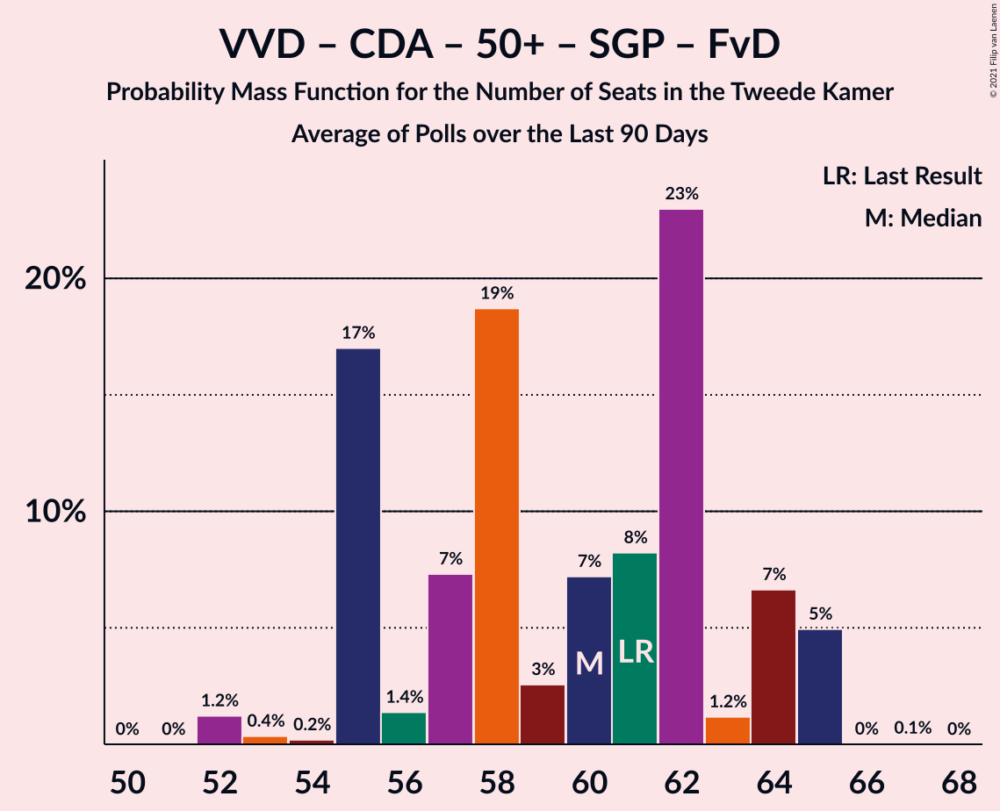

# Poll Average

<a href="#voting-intentions">Voting Intentions</a> | <a href="#seats">Seats</a> | <a href="#coalitions">Coalitions</a> | <a href="#technical-information">Technical Information</a>

## Summary

The table below lists the polls on which the average is based. They are the most recent polls (less than 90 days old) registered and analyzed so far.

| Period     | Polling firm/Commissioner(s) | VVD | PVV | CDA | D66 | GL | SP | PvdA | CU | PvdD | 50+ | SGP | DENK | FvD | PP | B1 | PvdT | JA21 | CO |
|:----------:|:----------------------------:|:--:|:--:|:--:|:--:|:--:|:--:|:--:|:--:|:--:|:--:|:--:|:--:|:--:|:--:|:--:|:--:|:--:|:--:|
| 15 March 2017 | General Election | 21.3%   33 | 13.1%   20 | 12.4%   19 | 12.2%   19 | 9.1%   14 | 9.1%   14 | 5.7%   9 | 3.4%   5 | 3.2%   5 | 3.1%   4 | 2.1%   3 | 2.1%   3 | 1.8%   2 | 0.3%   0 | 0.3%   0 | 0.0%   0 | 0.0%   0 | 0.0%   0 |
| N/A | Poll Average | 22–31%   36–49 | 11–17%   17–25 | 10–15%   17–22 | 7–12%   12–17 | 6–10%   9–15 | 5–8%   8–12 | 6–9%   8–13 | 3–6%   5–8 | 2–6%   3–9 | 0–2%   0–3 | 1–3%   2–4 | 0–2%   0–3 | 2–4%   2–5 | N/A   N/A | 0–1%   0 | N/A   N/A | 1–2%   1–3 | N/A   N/A |
| [22–25 January 2021](2021-01-25-Ipsos.html) | Ipsos   EenVandaag | 23–29%   36–46 | 11–15%   17–24 | 11–15%   17–22 | 8–12%   12–18 | 6–10%   10–15 | 5–8%   7–11 | 6–9%   9–15 | 3–5%   4–8 | 3–6%   5–9 | 1–2%   0–2 | 1–2%   1–3 | 1–2%   1–3 | 1–3%   1–4 | N/A   N/A | N/A   N/A | N/A   N/A | 1–2%   1–3 | N/A   N/A |
| [22–23 January 2021](2021-01-23-Peilnl.html) | Peil.nl | 22–25%   36–37 | 15–17%   24–25 | 11–14%   19–21 | 7–9%   12–13 | 5–7%   8–10 | 6–8%   8–11 | 6–8%   9–12 | 4–5%   6–7 | 5–6%   8 | 0–1%   0–1 | 2–3%   2–3 | 2–3%   2–3 | 2–3%   4–5 | N/A   N/A | 0–1%   0 | N/A   N/A | 2–3%   2–3 | N/A   N/A |
| [8–12 January 2021](2021-01-12-KantarPublic.html) | Kantar Public | 26–32%   41–46 | 12–16%   18–23 | 9–14%   15–20 | 7–11%   12–15 | 6–10%   10–13 | 6–9%   8–12 | 5–8%   8–12 | 3–6%   5–9 | 2–4%   3–5 | 1–2%   1–3 | 1–3%   1–4 | 1–2%   1–3 | 2–4%   2–4 | N/A   N/A | N/A   N/A | N/A   N/A | 1–2%   1–3 | N/A   N/A |
| [8–11 January 2021](2021-01-11-IOResearch.html) | I&O Research | 27–31%   42–49 | 12–15%   18–22 | 11–13%   17–21 | 8–10%   12–14 | 8–10%   12–15 | 6–8%   9–11 | 6–8%   9–13 | 4–6%   5–9 | 2–3%   3–5 | 0–1%   0–1 | 2–3%   2–4 | 0–1%   0–1 | 2–3%   3–4 | N/A   N/A | N/A   N/A | N/A   N/A | 1–2%   1–2 | N/A   N/A |
| 15 March 2017 | General Election | 21.3%   33 | 13.1%   20 | 12.4%   19 | 12.2%   19 | 9.1%   14 | 9.1%   14 | 5.7%   9 | 3.4%   5 | 3.2%   5 | 3.1%   4 | 2.1%   3 | 2.1%   3 | 1.8%   2 | 0.3%   0 | 0.3%   0 | 0.0%   0 | 0.0%   0 | 0.0%   0 |

Only polls for which at least the sample size has been published are included in the table above.

**Legend:**
+ **Top half of each row:** Voting intentions (95% confidence interval)
+ **Bottom half of each row:** Seat projections for the Tweede Kamer (95% confidence interval)
+ **VVD:** Volkspartij voor Vrijheid en Democratie
+ **PVV:** Partij voor de Vrijheid
+ **CDA:** Christen-Democratisch Appèl
+ **D66:** Democraten 66
+ **GL:** GroenLinks
+ **SP:** Socialistische Partij
+ **PvdA:** Partij van de Arbeid
+ **CU:** ChristenUnie
+ **PvdD:** Partij voor de Dieren
+ **50+:** 50Plus
+ **SGP:** Staatkundig Gereformeerde Partij
+ **DENK:** DENK
+ **FvD:** Forum voor Democratie
+ **PP:** Piratenpartij
+ **B1:** Bij1
+ **PvdT:** Partij voor de Toekomst
+ **JA21:** Juiste Antwoord 2021
+ **CO:** Code Oranje
+ **N/A (single party):** Party not included the published results
+ **N/A (entire row):** Calculation for this opinion poll not started yet

## Voting Intentions

### Confidence Intervals

| Party | Last Result | Median | 80% Confidence Interval | 90% Confidence Interval | 95% Confidence Interval | 99% Confidence Interval |
|:-----:|:-----------:|:------:|:-----------------------:|:-----------------------:|:-----------------------:|:-----------------------:|
| <a href="#volkspartij-voor-vrijheid-en-democratie">Volkspartij voor Vrijheid en Democratie</a> | 21.3% | 27.2% | 23.1–29.6% |22.7–30.2% | 22.3–30.7% | 21.7–31.8% |
| <a href="#partij-voor-de-vrijheid">Partij voor de Vrijheid</a> | 13.1% | 13.8% | 12.2–16.2% |11.8–16.6% | 11.4–16.9% | 10.7–17.4% |
| <a href="#christen-democratisch-appèl">Christen-Democratisch Appèl</a> | 12.4% | 12.3% | 10.9–13.6% |10.5–14.1% | 10.1–14.6% | 9.3–15.4% |
| <a href="#democraten-66">Democraten 66</a> | 12.2% | 8.7% | 7.7–10.5% |7.4–11.0% | 7.2–11.5% | 6.8–12.2% |
| <a href="#groenlinks">GroenLinks</a> | 9.1% | 7.9% | 5.9–9.1% |5.7–9.4% | 5.5–9.7% | 5.2–10.2% |
| <a href="#socialistische-partij">Socialistische Partij</a> | 9.1% | 6.7% | 5.9–7.7% |5.6–8.1% | 5.3–8.5% | 4.8–9.2% |
| <a href="#partij-van-de-arbeid">Partij van de Arbeid</a> | 5.7% | 7.3% | 6.3–8.2% |6.0–8.6% | 5.7–8.9% | 5.1–9.5% |
| <a href="#christenunie">ChristenUnie</a> | 3.4% | 4.4% | 3.5–5.1% |3.3–5.3% | 3.1–5.5% | 2.7–5.9% |
| <a href="#partij-voor-de-dieren">Partij voor de Dieren</a> | 3.2% | 3.6% | 2.3–5.5% |2.2–5.8% | 2.0–5.9% | 1.7–6.3% |
| <a href="#50plus">50Plus</a> | 3.1% | 0.9% | 0.6–1.6% |0.5–1.8% | 0.5–2.0% | 0.4–2.3% |
| <a href="#staatkundig-gereformeerde-partij">Staatkundig Gereformeerde Partij</a> | 2.1% | 1.9% | 1.4–2.4% |1.3–2.6% | 1.1–2.8% | 0.9–3.1% |
| <a href="#denk">DENK</a> | 2.1% | 1.5% | 0.7–2.2% |0.6–2.3% | 0.5–2.4% | 0.4–2.7% |
| <a href="#forum-voor-democratie">Forum voor Democratie</a> | 1.8% | 2.6% | 2.0–3.1% |1.8–3.3% | 1.6–3.5% | 1.4–3.9% |
| <a href="#piratenpartij">Piratenpartij</a> | 0.3% | N/A | N/A |N/A | N/A | N/A |
| <a href="#bij1">Bij1</a> | 0.3% | 0.7% | 0.5–0.9% |0.5–1.0% | 0.4–1.0% | 0.4–1.2% |
| <a href="#partij-voor-de-toekomst">Partij voor de Toekomst</a> | 0.0% | N/A | N/A |N/A | N/A | N/A |
| <a href="#juiste-antwoord-2021">Juiste Antwoord 2021</a> | 0.0% | 1.5% | 1.0–2.1% |0.9–2.3% | 0.8–2.4% | 0.7–2.6% |
| <a href="#code-oranje">Code Oranje</a> | 0.0% | N/A | N/A |N/A | N/A | N/A |

### Volkspartij voor Vrijheid en Democratie

*For a full overview of the results for this party, see the [Volkspartij voor Vrijheid en Democratie](party-volkspartijvoorvrijheidendemocratie.html) page.*

| Voting Intentions | Probability | Accumulated | Special Marks |
|:-----------------:|:-----------:|:-----------:|:-------------:|
| 19.5–20.5% | 0% | 100% |  |
| 20.5–21.5% | 0.3% | 100% | Last Result |
| 21.5–22.5% | 4% | 99.7% |  |
| 22.5–23.5% | 12% | 96% |  |
| 23.5–24.5% | 11% | 84% |  |
| 24.5–25.5% | 7% | 73% |  |
| 25.5–26.5% | 9% | 66% |  |
| 26.5–27.5% | 12% | 57% | Median |
| 27.5–28.5% | 17% | 45% |  |
| 28.5–29.5% | 16% | 27% |  |
| 29.5–30.5% | 8% | 11% |  |
| 30.5–31.5% | 2% | 3% |  |
| 31.5–32.5% | 0.6% | 0.7% |  |
| 32.5–33.5% | 0.1% | 0.1% |  |
| 33.5–34.5% | 0% | 0% |  |

### Partij voor de Vrijheid

*For a full overview of the results for this party, see the [Partij voor de Vrijheid](party-partijvoordevrijheid.html) page.*

| Voting Intentions | Probability | Accumulated | Special Marks |
|:-----------------:|:-----------:|:-----------:|:-------------:|
| 8.5–9.5% | 0% | 100% |  |
| 9.5–10.5% | 0.3% | 100% |  |
| 10.5–11.5% | 3% | 99.7% |  |
| 11.5–12.5% | 12% | 97% |  |
| 12.5–13.5% | 27% | 84% | Last Result |
| 13.5–14.5% | 22% | 57% | Median |
| 14.5–15.5% | 14% | 35% |  |
| 15.5–16.5% | 16% | 21% |  |
| 16.5–17.5% | 5% | 5% |  |
| 17.5–18.5% | 0.3% | 0.3% |  |
| 18.5–19.5% | 0% | 0% |  |

### Christen-Democratisch Appèl

*For a full overview of the results for this party, see the [Christen-Democratisch Appèl](party-christen-democratischappèl.html) page.*

| Voting Intentions | Probability | Accumulated | Special Marks |
|:-----------------:|:-----------:|:-----------:|:-------------:|
| 7.5–8.5% | 0% | 100% |  |
| 8.5–9.5% | 0.8% | 100% |  |
| 9.5–10.5% | 5% | 99.1% |  |
| 10.5–11.5% | 17% | 94% |  |
| 11.5–12.5% | 36% | 77% | Last Result, Median |
| 12.5–13.5% | 30% | 41% |  |
| 13.5–14.5% | 9% | 12% |  |
| 14.5–15.5% | 2% | 3% |  |
| 15.5–16.5% | 0.3% | 0.4% |  |
| 16.5–17.5% | 0% | 0% |  |

### Democraten 66

*For a full overview of the results for this party, see the [Democraten 66](party-democraten66.html) page.*

| Voting Intentions | Probability | Accumulated | Special Marks |
|:-----------------:|:-----------:|:-----------:|:-------------:|
| 4.5–5.5% | 0% | 100% |  |
| 5.5–6.5% | 0.1% | 100% |  |
| 6.5–7.5% | 7% | 99.9% |  |
| 7.5–8.5% | 36% | 93% |  |
| 8.5–9.5% | 31% | 57% | Median |
| 9.5–10.5% | 16% | 26% |  |
| 10.5–11.5% | 8% | 10% |  |
| 11.5–12.5% | 2% | 2% | Last Result |
| 12.5–13.5% | 0.2% | 0.2% |  |
| 13.5–14.5% | 0% | 0% |  |

### GroenLinks

*For a full overview of the results for this party, see the [GroenLinks](party-groenlinks.html) page.*

| Voting Intentions | Probability | Accumulated | Special Marks |
|:-----------------:|:-----------:|:-----------:|:-------------:|
| 3.5–4.5% | 0% | 100% |  |
| 4.5–5.5% | 3% | 100% |  |
| 5.5–6.5% | 21% | 97% |  |
| 6.5–7.5% | 17% | 76% |  |
| 7.5–8.5% | 32% | 59% | Median |
| 8.5–9.5% | 23% | 27% | Last Result |
| 9.5–10.5% | 4% | 4% |  |
| 10.5–11.5% | 0.2% | 0.2% |  |
| 11.5–12.5% | 0% | 0% |  |

### Socialistische Partij

*For a full overview of the results for this party, see the [Socialistische Partij](party-socialistischepartij.html) page.*

| Voting Intentions | Probability | Accumulated | Special Marks |
|:-----------------:|:-----------:|:-----------:|:-------------:|
| 2.5–3.5% | 0% | 100% |  |
| 3.5–4.5% | 0.1% | 100% |  |
| 4.5–5.5% | 4% | 99.9% |  |
| 5.5–6.5% | 36% | 95% |  |
| 6.5–7.5% | 46% | 60% | Median |
| 7.5–8.5% | 11% | 14% |  |
| 8.5–9.5% | 2% | 2% | Last Result |
| 9.5–10.5% | 0.2% | 0.2% |  |
| 10.5–11.5% | 0% | 0% |  |

### Partij van de Arbeid

*For a full overview of the results for this party, see the [Partij van de Arbeid](party-partijvandearbeid.html) page.*

| Voting Intentions | Probability | Accumulated | Special Marks |
|:-----------------:|:-----------:|:-----------:|:-------------:|
| 3.5–4.5% | 0% | 100% |  |
| 4.5–5.5% | 2% | 100% |  |
| 5.5–6.5% | 13% | 98% | Last Result |
| 6.5–7.5% | 49% | 85% | Median |
| 7.5–8.5% | 31% | 36% |  |
| 8.5–9.5% | 5% | 5% |  |
| 9.5–10.5% | 0.5% | 0.5% |  |
| 10.5–11.5% | 0% | 0% |  |

### ChristenUnie

*For a full overview of the results for this party, see the [ChristenUnie](party-christenunie.html) page.*

| Voting Intentions | Probability | Accumulated | Special Marks |
|:-----------------:|:-----------:|:-----------:|:-------------:|
| 0.5–1.5% | 0% | 100% |  |
| 1.5–2.5% | 0.2% | 100% |  |
| 2.5–3.5% | 11% | 99.8% | Last Result |
| 3.5–4.5% | 47% | 89% | Median |
| 4.5–5.5% | 40% | 42% |  |
| 5.5–6.5% | 2% | 2% |  |
| 6.5–7.5% | 0% | 0% |  |

### Partij voor de Dieren

*For a full overview of the results for this party, see the [Partij voor de Dieren](party-partijvoordedieren.html) page.*

| Voting Intentions | Probability | Accumulated | Special Marks |
|:-----------------:|:-----------:|:-----------:|:-------------:|
| 0.0–0.5% | 0% | 100% |  |
| 0.5–1.5% | 0.2% | 100% |  |
| 1.5–2.5% | 18% | 99.8% |  |
| 2.5–3.5% | 31% | 81% | Last Result |
| 3.5–4.5% | 15% | 50% | Median |
| 4.5–5.5% | 26% | 36% |  |
| 5.5–6.5% | 9% | 9% |  |
| 6.5–7.5% | 0.1% | 0.1% |  |
| 7.5–8.5% | 0% | 0% |  |

### 50Plus

*For a full overview of the results for this party, see the [50Plus](party-50plus.html) page.*

| Voting Intentions | Probability | Accumulated | Special Marks |
|:-----------------:|:-----------:|:-----------:|:-------------:|
| 0.0–0.5% | 8% | 100% |  |
| 0.5–1.5% | 81% | 92% | Median |
| 1.5–2.5% | 11% | 11% |  |
| 2.5–3.5% | 0.2% | 0.2% | Last Result |
| 3.5–4.5% | 0% | 0% |  |

### Staatkundig Gereformeerde Partij

*For a full overview of the results for this party, see the [Staatkundig Gereformeerde Partij](party-staatkundiggereformeerdepartij.html) page.*

| Voting Intentions | Probability | Accumulated | Special Marks |
|:-----------------:|:-----------:|:-----------:|:-------------:|
| 0.0–0.5% | 0% | 100% |  |
| 0.5–1.5% | 16% | 100% |  |
| 1.5–2.5% | 77% | 84% | Last Result, Median |
| 2.5–3.5% | 6% | 6% |  |
| 3.5–4.5% | 0.1% | 0.1% |  |
| 4.5–5.5% | 0% | 0% |  |

### DENK

*For a full overview of the results for this party, see the [DENK](party-denk.html) page.*

| Voting Intentions | Probability | Accumulated | Special Marks |
|:-----------------:|:-----------:|:-----------:|:-------------:|
| 0.0–0.5% | 4% | 100% |  |
| 0.5–1.5% | 50% | 96% | Median |
| 1.5–2.5% | 45% | 46% | Last Result |
| 2.5–3.5% | 1.3% | 1.3% |  |
| 3.5–4.5% | 0% | 0% |  |

### Forum voor Democratie

*For a full overview of the results for this party, see the [Forum voor Democratie](party-forumvoordemocratie.html) page.*

| Voting Intentions | Probability | Accumulated | Special Marks |
|:-----------------:|:-----------:|:-----------:|:-------------:|
| 0.0–0.5% | 0% | 100% |  |
| 0.5–1.5% | 2% | 100% |  |
| 1.5–2.5% | 44% | 98% | Last Result |
| 2.5–3.5% | 52% | 54% | Median |
| 3.5–4.5% | 2% | 2% |  |
| 4.5–5.5% | 0% | 0% |  |
| 5.5–6.5% | 0% | 0% |  |

### Bij1

*For a full overview of the results for this party, see the [Bij1](party-bij1.html) page.*

| Voting Intentions | Probability | Accumulated | Special Marks |
|:-----------------:|:-----------:|:-----------:|:-------------:|
| 0.0–0.5% | 16% | 100% | Last Result |
| 0.5–1.5% | 84% | 84% | Median |
| 1.5–2.5% | 0% | 0% |  |

### Juiste Antwoord 2021

*For a full overview of the results for this party, see the [Juiste Antwoord 2021](party-juisteantwoord2021.html) page.*

| Voting Intentions | Probability | Accumulated | Special Marks |
|:-----------------:|:-----------:|:-----------:|:-------------:|
| 0.0–0.5% | 0.1% | 100% | Last Result |
| 0.5–1.5% | 54% | 99.9% |  |
| 1.5–2.5% | 45% | 46% | Median |
| 2.5–3.5% | 1.0% | 1.0% |  |
| 3.5–4.5% | 0% | 0% |  |

## Seats

### Confidence Intervals

| Party | Last Result | Median | 80% Confidence Interval | 90% Confidence Interval | 95% Confidence Interval | 99% Confidence Interval |
|:-----:|:-----------:|:------:|:-----------------------:|:-----------------------:|:-----------------------:|:-----------------------:|
| <a href="#volkspartij-voor-vrijheid-en-democratie">Volkspartij voor Vrijheid en Democratie</a> | 33 | 43 | 36–47 |36–49 | 36–49 | 36–49 |
| <a href="#partij-voor-de-vrijheid">Partij voor de Vrijheid</a> | 20 | 21 | 18–25 |18–25 | 17–25 | 17–26 |
| <a href="#christen-democratisch-appèl">Christen-Democratisch Appèl</a> | 19 | 20 | 17–21 |17–22 | 17–22 | 14–22 |
| <a href="#democraten-66">Democraten 66</a> | 19 | 13 | 12–15 |12–15 | 12–17 | 11–18 |
| <a href="#groenlinks">GroenLinks</a> | 14 | 11 | 10–14 |10–15 | 9–15 | 8–15 |
| <a href="#socialistische-partij">Socialistische Partij</a> | 14 | 9 | 9–10 |8–11 | 8–12 | 7–13 |
| <a href="#partij-van-de-arbeid">Partij van de Arbeid</a> | 9 | 10 | 8–12 |8–13 | 8–13 | 8–15 |
| <a href="#christenunie">ChristenUnie</a> | 5 | 6 | 5–8 |5–8 | 5–8 | 4–9 |
| <a href="#partij-voor-de-dieren">Partij voor de Dieren</a> | 5 | 5 | 4–8 |4–8 | 3–9 | 3–9 |
| <a href="#50plus">50Plus</a> | 4 | 1 | 0–3 |0–3 | 0–3 | 0–3 |
| <a href="#staatkundig-gereformeerde-partij">Staatkundig Gereformeerde Partij</a> | 3 | 3 | 2–3 |2–4 | 2–4 | 1–4 |
| <a href="#denk">DENK</a> | 3 | 2 | 0–3 |0–3 | 0–3 | 0–3 |
| <a href="#forum-voor-democratie">Forum voor Democratie</a> | 2 | 4 | 2–4 |2–4 | 2–5 | 1–5 |
| <a href="#piratenpartij">Piratenpartij</a> | 0 | N/A | N/A |N/A | N/A | N/A |
| <a href="#bij1">Bij1</a> | 0 | 0 | 0 |0 | 0 | 0–1 |
| <a href="#partij-voor-de-toekomst">Partij voor de Toekomst</a> | 0 | N/A | N/A |N/A | N/A | N/A |
| <a href="#juiste-antwoord-2021">Juiste Antwoord 2021</a> | 0 | 2 | 1–3 |1–3 | 1–3 | 0–3 |
| <a href="#code-oranje">Code Oranje</a> | 0 | N/A | N/A |N/A | N/A | N/A |

### Volkspartij voor Vrijheid en Democratie

*For a full overview of the results for this party, see the [Volkspartij voor Vrijheid en Democratie](party-volkspartijvoorvrijheidendemocratie.html) page.*

| Number of Seats | Probability | Accumulated | Special Marks |
|:---------------:|:-----------:|:-----------:|:-------------:|
| 33 | 0.1% | 100% | Last Result |
| 34 | 0.1% | 99.9% |  |
| 35 | 0.1% | 99.8% |  |
| 36 | 24% | 99.7% |  |
| 37 | 7% | 76% |  |
| 38 | 5% | 69% |  |
| 39 | 1.4% | 64% |  |
| 40 | 7% | 63% |  |
| 41 | 1.3% | 55% |  |
| 42 | 2% | 54% |  |
| 43 | 10% | 52% | Median |
| 44 | 18% | 42% |  |
| 45 | 7% | 25% |  |
| 46 | 4% | 18% |  |
| 47 | 5% | 14% |  |
| 48 | 0.1% | 9% |  |
| 49 | 9% | 9% |  |
| 50 | 0% | 0% |  |

### Partij voor de Vrijheid

*For a full overview of the results for this party, see the [Partij voor de Vrijheid](party-partijvoordevrijheid.html) page.*

| Number of Seats | Probability | Accumulated | Special Marks |
|:---------------:|:-----------:|:-----------:|:-------------:|
| 16 | 0% | 100% |  |
| 17 | 4% | 99.9% |  |
| 18 | 9% | 96% |  |
| 19 | 21% | 87% |  |
| 20 | 8% | 66% | Last Result |
| 21 | 18% | 59% | Median |
| 22 | 3% | 41% |  |
| 23 | 10% | 37% |  |
| 24 | 3% | 27% |  |
| 25 | 24% | 24% |  |
| 26 | 0.6% | 0.6% |  |
| 27 | 0.1% | 0.1% |  |
| 28 | 0% | 0% |  |

### Christen-Democratisch Appèl

*For a full overview of the results for this party, see the [Christen-Democratisch Appèl](party-christen-democratischappèl.html) page.*

| Number of Seats | Probability | Accumulated | Special Marks |
|:---------------:|:-----------:|:-----------:|:-------------:|
| 13 | 0.1% | 100% |  |
| 14 | 0.4% | 99.9% |  |
| 15 | 0.4% | 99.4% |  |
| 16 | 0.4% | 99.0% |  |
| 17 | 16% | 98.6% |  |
| 18 | 15% | 83% |  |
| 19 | 6% | 68% | Last Result |
| 20 | 24% | 63% | Median |
| 21 | 33% | 38% |  |
| 22 | 5% | 5% |  |
| 23 | 0.4% | 0.5% |  |
| 24 | 0% | 0.1% |  |
| 25 | 0% | 0% |  |

### Democraten 66

*For a full overview of the results for this party, see the [Democraten 66](party-democraten66.html) page.*

| Number of Seats | Probability | Accumulated | Special Marks |
|:---------------:|:-----------:|:-----------:|:-------------:|
| 10 | 0.2% | 100% |  |
| 11 | 0.8% | 99.8% |  |
| 12 | 44% | 99.0% |  |
| 13 | 23% | 55% | Median |
| 14 | 11% | 33% |  |
| 15 | 17% | 22% |  |
| 16 | 2% | 5% |  |
| 17 | 2% | 3% |  |
| 18 | 0.6% | 0.9% |  |
| 19 | 0.1% | 0.3% | Last Result |
| 20 | 0.3% | 0.3% |  |
| 21 | 0% | 0% |  |

### GroenLinks

*For a full overview of the results for this party, see the [GroenLinks](party-groenlinks.html) page.*

| Number of Seats | Probability | Accumulated | Special Marks |
|:---------------:|:-----------:|:-----------:|:-------------:|
| 8 | 2% | 100% |  |
| 9 | 1.3% | 98% |  |
| 10 | 38% | 96% |  |
| 11 | 17% | 58% | Median |
| 12 | 11% | 41% |  |
| 13 | 16% | 30% |  |
| 14 | 7% | 13% | Last Result |
| 15 | 6% | 7% |  |
| 16 | 0.3% | 0.3% |  |
| 17 | 0% | 0% |  |

### Socialistische Partij

*For a full overview of the results for this party, see the [Socialistische Partij](party-socialistischepartij.html) page.*

| Number of Seats | Probability | Accumulated | Special Marks |
|:---------------:|:-----------:|:-----------:|:-------------:|
| 6 | 0.1% | 100% |  |
| 7 | 1.4% | 99.9% |  |
| 8 | 8% | 98% |  |
| 9 | 48% | 90% | Median |
| 10 | 36% | 42% |  |
| 11 | 4% | 7% |  |
| 12 | 2% | 3% |  |
| 13 | 0.4% | 0.6% |  |
| 14 | 0.2% | 0.2% | Last Result |
| 15 | 0% | 0% |  |

### Partij van de Arbeid

*For a full overview of the results for this party, see the [Partij van de Arbeid](party-partijvandearbeid.html) page.*

| Number of Seats | Probability | Accumulated | Special Marks |
|:---------------:|:-----------:|:-----------:|:-------------:|
| 7 | 0.3% | 100% |  |
| 8 | 12% | 99.6% |  |
| 9 | 25% | 87% | Last Result |
| 10 | 17% | 63% | Median |
| 11 | 12% | 46% |  |
| 12 | 26% | 34% |  |
| 13 | 5% | 7% |  |
| 14 | 1.4% | 2% |  |
| 15 | 0.8% | 0.9% |  |
| 16 | 0% | 0% |  |

### ChristenUnie

*For a full overview of the results for this party, see the [ChristenUnie](party-christenunie.html) page.*

| Number of Seats | Probability | Accumulated | Special Marks |
|:---------------:|:-----------:|:-----------:|:-------------:|
| 3 | 0.1% | 100% |  |
| 4 | 2% | 99.9% |  |
| 5 | 26% | 98% | Last Result |
| 6 | 27% | 72% | Median |
| 7 | 35% | 45% |  |
| 8 | 8% | 11% |  |
| 9 | 2% | 2% |  |
| 10 | 0.1% | 0.1% |  |
| 11 | 0% | 0% |  |

### Partij voor de Dieren

*For a full overview of the results for this party, see the [Partij voor de Dieren](party-partijvoordedieren.html) page.*

| Number of Seats | Probability | Accumulated | Special Marks |
|:---------------:|:-----------:|:-----------:|:-------------:|
| 2 | 0.3% | 100% |  |
| 3 | 3% | 99.7% |  |
| 4 | 41% | 97% |  |
| 5 | 16% | 56% | Last Result, Median |
| 6 | 3% | 40% |  |
| 7 | 6% | 37% |  |
| 8 | 26% | 30% |  |
| 9 | 4% | 4% |  |
| 10 | 0% | 0% |  |

### 50Plus

*For a full overview of the results for this party, see the [50Plus](party-50plus.html) page.*

| Number of Seats | Probability | Accumulated | Special Marks |
|:---------------:|:-----------:|:-----------:|:-------------:|
| 0 | 25% | 100% |  |
| 1 | 46% | 75% | Median |
| 2 | 18% | 29% |  |
| 3 | 11% | 11% |  |
| 4 | 0% | 0% | Last Result |

### Staatkundig Gereformeerde Partij

*For a full overview of the results for this party, see the [Staatkundig Gereformeerde Partij](party-staatkundiggereformeerdepartij.html) page.*

| Number of Seats | Probability | Accumulated | Special Marks |
|:---------------:|:-----------:|:-----------:|:-------------:|
| 1 | 2% | 100% |  |
| 2 | 39% | 98% |  |
| 3 | 53% | 59% | Last Result, Median |
| 4 | 5% | 6% |  |
| 5 | 0.1% | 0.1% |  |
| 6 | 0% | 0% |  |

### DENK

*For a full overview of the results for this party, see the [DENK](party-denk.html) page.*

| Number of Seats | Probability | Accumulated | Special Marks |
|:---------------:|:-----------:|:-----------:|:-------------:|
| 0 | 22% | 100% |  |
| 1 | 8% | 78% |  |
| 2 | 37% | 70% | Median |
| 3 | 33% | 33% | Last Result |
| 4 | 0.1% | 0.1% |  |
| 5 | 0% | 0% |  |

### Forum voor Democratie

*For a full overview of the results for this party, see the [Forum voor Democratie](party-forumvoordemocratie.html) page.*

| Number of Seats | Probability | Accumulated | Special Marks |
|:---------------:|:-----------:|:-----------:|:-------------:|
| 1 | 1.3% | 100% |  |
| 2 | 10% | 98.7% | Last Result |
| 3 | 24% | 88% |  |
| 4 | 60% | 64% | Median |
| 5 | 4% | 4% |  |
| 6 | 0.1% | 0.1% |  |
| 7 | 0% | 0% |  |

### Piratenpartij

*For a full overview of the results for this party, see the [Piratenpartij](party-piratenpartij.html) page.*

### Bij1

*For a full overview of the results for this party, see the [Bij1](party-bij1.html) page.*

| Number of Seats | Probability | Accumulated | Special Marks |
|:---------------:|:-----------:|:-----------:|:-------------:|
| 0 | 98% | 100% | Last Result, Median |
| 1 | 2% | 2% |  |
| 2 | 0% | 0% |  |

### Partij voor de Toekomst

*For a full overview of the results for this party, see the [Partij voor de Toekomst](party-partijvoordetoekomst.html) page.*

### Juiste Antwoord 2021

*For a full overview of the results for this party, see the [Juiste Antwoord 2021](party-juisteantwoord2021.html) page.*

| Number of Seats | Probability | Accumulated | Special Marks |
|:---------------:|:-----------:|:-----------:|:-------------:|
| 0 | 0.6% | 100% | Last Result |
| 1 | 27% | 99.4% |  |
| 2 | 45% | 72% | Median |
| 3 | 27% | 27% |  |
| 4 | 0.1% | 0.2% |  |
| 5 | 0% | 0% |  |

### Code Oranje

*For a full overview of the results for this party, see the [Code Oranje](party-codeoranje.html) page.*

## Coalitions

### Confidence Intervals

| Coalition | Last Result | Median | Majority? | 80% Confidence Interval | 90% Confidence Interval | 95% Confidence Interval | 99% Confidence Interval |
|:---------:|:-----------:|:------:|:---------:|:-----------------------:|:-----------------------:|:-----------------------:|:-----------------------:|
| Volkspartij voor Vrijheid en Democratie – Christen-Democratisch Appèl – Democraten 66 – GroenLinks – ChristenUnie | 90 | 93 | 100% | 86–98 | 86–98 | 84–98 | 84–99 |
| Volkspartij voor Vrijheid en Democratie – Christen-Democratisch Appèl – Democraten 66 – Partij van de Arbeid – ChristenUnie | 85 | 91 | 100% | 85–97 | 85–97 | 85–97 | 85–98 |
| Volkspartij voor Vrijheid en Democratie – Partij voor de Vrijheid – Christen-Democratisch Appèl – Staatkundig Gereformeerde Partij – Forum voor Democratie | 77 | 89 | 100% | 84–92 | 83–93 | 83–93 | 81–93 |
| Volkspartij voor Vrijheid en Democratie – Partij voor de Vrijheid – Christen-Democratisch Appèl – Forum voor Democratie | 74 | 86 | 99.9% | 82–89 | 80–90 | 80–90 | 78–90 |
| Volkspartij voor Vrijheid en Democratie – Partij voor de Vrijheid – Christen-Democratisch Appèl | 72 | 82 | 99.5% | 78–86 | 78–87 | 78–87 | 76–87 |
| Volkspartij voor Vrijheid en Democratie – Christen-Democratisch Appèl – Democraten 66 – ChristenUnie | 76 | 82 | 98% | 76–85 | 76–85 | 76–86 | 74–87 |
| Volkspartij voor Vrijheid en Democratie – Christen-Democratisch Appèl – Democraten 66 | 71 | 75 | 49% | 69–79 | 69–79 | 69–80 | 68–82 |
| Volkspartij voor Vrijheid en Democratie – Christen-Democratisch Appèl – Partij van de Arbeid | 61 | 72 | 20% | 66–78 | 66–79 | 66–79 | 66–79 |
| Christen-Democratisch Appèl – Democraten 66 – GroenLinks – Socialistische Partij – Partij van de Arbeid – ChristenUnie | 80 | 70 | 3% | 67–74 | 67–75 | 66–76 | 64–78 |
| Volkspartij voor Vrijheid en Democratie – Christen-Democratisch Appèl – 50Plus – Staatkundig Gereformeerde Partij – Forum voor Democratie | 61 | 69 | 0.1% | 64–73 | 64–73 | 63–73 | 62–73 |
| Volkspartij voor Vrijheid en Democratie – Democraten 66 – Partij van de Arbeid | 61 | 66 | 0% | 57–72 | 57–73 | 57–73 | 57–73 |
| Volkspartij voor Vrijheid en Democratie – Christen-Democratisch Appèl – Staatkundig Gereformeerde Partij – Forum voor Democratie | 57 | 68 | 0% | 63–72 | 63–72 | 63–72 | 60–72 |
| Volkspartij voor Vrijheid en Democratie – Christen-Democratisch Appèl – 50Plus – Forum voor Democratie | 58 | 67 | 0% | 61–70 | 61–71 | 61–71 | 60–71 |
| Volkspartij voor Vrijheid en Democratie – Christen-Democratisch Appèl – Forum voor Democratie | 54 | 64 | 0% | 61–69 | 60–70 | 60–70 | 58–70 |
| Volkspartij voor Vrijheid en Democratie – Christen-Democratisch Appèl | 52 | 61 | 0% | 57–67 | 57–67 | 57–67 | 56–67 |
| Christen-Democratisch Appèl – Democraten 66 – GroenLinks – Partij van de Arbeid – ChristenUnie | 66 | 60 | 0% | 57–65 | 57–66 | 56–66 | 54–68 |
| Volkspartij voor Vrijheid en Democratie – Partij van de Arbeid | 42 | 52 | 0% | 45–58 | 45–61 | 45–61 | 45–61 |
| Christen-Democratisch Appèl – Democraten 66 – Partij van de Arbeid | 47 | 42 | 0% | 41–47 | 40–48 | 39–49 | 37–51 |
| Christen-Democratisch Appèl – Partij van de Arbeid – ChristenUnie | 33 | 37 | 0% | 33–40 | 33–41 | 31–41 | 31–42 |
| Christen-Democratisch Appèl – Democraten 66 | 38 | 33 | 0% | 30–35 | 30–37 | 29–37 | 28–39 |
| Christen-Democratisch Appèl – Partij van de Arbeid | 28 | 30 | 0% | 27–33 | 27–33 | 26–34 | 25–35 |

### Volkspartij voor Vrijheid en Democratie – Christen-Democratisch Appèl – Democraten 66 – GroenLinks – ChristenUnie

| Number of Seats | Probability | Accumulated | Special Marks |
|:---------------:|:-----------:|:-----------:|:-------------:|
| 81 | 0.1% | 100% |  |
| 82 | 0.3% | 99.9% |  |
| 83 | 0.1% | 99.6% |  |
| 84 | 3% | 99.6% |  |
| 85 | 0.1% | 97% |  |
| 86 | 22% | 97% |  |
| 87 | 0.1% | 75% |  |
| 88 | 0.4% | 75% |  |
| 89 | 4% | 74% |  |
| 90 | 5% | 70% | Last Result |
| 91 | 4% | 64% |  |
| 92 | 7% | 61% |  |
| 93 | 14% | 54% | Median |
| 94 | 11% | 40% |  |
| 95 | 3% | 29% |  |
| 96 | 7% | 26% |  |
| 97 | 3% | 19% |  |
| 98 | 15% | 16% |  |
| 99 | 0.5% | 0.8% |  |
| 100 | 0.2% | 0.3% |  |
| 101 | 0.1% | 0.1% |  |
| 102 | 0% | 0% |  |

### Volkspartij voor Vrijheid en Democratie – Christen-Democratisch Appèl – Democraten 66 – Partij van de Arbeid – ChristenUnie

| Number of Seats | Probability | Accumulated | Special Marks |
|:---------------:|:-----------:|:-----------:|:-------------:|
| 83 | 0.1% | 100% |  |
| 84 | 0.4% | 99.9% |  |
| 85 | 22% | 99.5% | Last Result |
| 86 | 0.3% | 78% |  |
| 87 | 8% | 77% |  |
| 88 | 2% | 70% |  |
| 89 | 6% | 68% |  |
| 90 | 11% | 62% |  |
| 91 | 5% | 51% |  |
| 92 | 2% | 46% | Median |
| 93 | 7% | 44% |  |
| 94 | 15% | 37% |  |
| 95 | 2% | 22% |  |
| 96 | 9% | 21% |  |
| 97 | 10% | 12% |  |
| 98 | 2% | 2% |  |
| 99 | 0% | 0.1% |  |
| 100 | 0% | 0% |  |

### Volkspartij voor Vrijheid en Democratie – Partij voor de Vrijheid – Christen-Democratisch Appèl – Staatkundig Gereformeerde Partij – Forum voor Democratie

| Number of Seats | Probability | Accumulated | Special Marks |
|:---------------:|:-----------:|:-----------:|:-------------:|
| 77 | 0.1% | 100% | Last Result |
| 78 | 0% | 99.9% |  |
| 79 | 0.2% | 99.9% |  |
| 80 | 0.1% | 99.6% |  |
| 81 | 1.0% | 99.5% |  |
| 82 | 0.4% | 98% |  |
| 83 | 6% | 98% |  |
| 84 | 6% | 92% |  |
| 85 | 6% | 86% |  |
| 86 | 2% | 80% |  |
| 87 | 5% | 79% |  |
| 88 | 4% | 73% |  |
| 89 | 31% | 69% |  |
| 90 | 11% | 38% |  |
| 91 | 17% | 28% | Median |
| 92 | 0.7% | 10% |  |
| 93 | 9% | 10% |  |
| 94 | 0.2% | 0.3% |  |
| 95 | 0% | 0% |  |

### Volkspartij voor Vrijheid en Democratie – Partij voor de Vrijheid – Christen-Democratisch Appèl – Forum voor Democratie

| Number of Seats | Probability | Accumulated | Special Marks |
|:---------------:|:-----------:|:-----------:|:-------------:|
| 74 | 0.1% | 100% | Last Result |
| 75 | 0% | 99.9% |  |
| 76 | 0.1% | 99.9% | Majority |
| 77 | 0.1% | 99.8% |  |
| 78 | 0.3% | 99.6% |  |
| 79 | 0.8% | 99.3% |  |
| 80 | 4% | 98% |  |
| 81 | 1.5% | 95% |  |
| 82 | 8% | 93% |  |
| 83 | 6% | 85% |  |
| 84 | 2% | 79% |  |
| 85 | 6% | 78% |  |
| 86 | 33% | 71% |  |
| 87 | 10% | 39% |  |
| 88 | 3% | 29% | Median |
| 89 | 16% | 26% |  |
| 90 | 9% | 9% |  |
| 91 | 0.1% | 0.1% |  |
| 92 | 0% | 0% |  |

### Volkspartij voor Vrijheid en Democratie – Partij voor de Vrijheid – Christen-Democratisch Appèl

| Number of Seats | Probability | Accumulated | Special Marks |
|:---------------:|:-----------:|:-----------:|:-------------:|
| 72 | 0.1% | 100% | Last Result |
| 73 | 0.1% | 99.9% |  |
| 74 | 0.1% | 99.8% |  |
| 75 | 0.2% | 99.7% |  |
| 76 | 0.4% | 99.5% | Majority |
| 77 | 0.9% | 99.2% |  |
| 78 | 11% | 98% |  |
| 79 | 7% | 87% |  |
| 80 | 3% | 80% |  |
| 81 | 3% | 77% |  |
| 82 | 32% | 73% |  |
| 83 | 9% | 42% |  |
| 84 | 6% | 33% | Median |
| 85 | 9% | 27% |  |
| 86 | 9% | 18% |  |
| 87 | 9% | 9% |  |
| 88 | 0.1% | 0.1% |  |
| 89 | 0% | 0% |  |

### Volkspartij voor Vrijheid en Democratie – Christen-Democratisch Appèl – Democraten 66 – ChristenUnie

| Number of Seats | Probability | Accumulated | Special Marks |
|:---------------:|:-----------:|:-----------:|:-------------:|
| 73 | 0.3% | 100% |  |
| 74 | 0.3% | 99.7% |  |
| 75 | 1.3% | 99.4% |  |
| 76 | 28% | 98% | Last Result, Majority |
| 77 | 6% | 70% |  |
| 78 | 2% | 65% |  |
| 79 | 3% | 63% |  |
| 80 | 6% | 60% |  |
| 81 | 1.4% | 54% |  |
| 82 | 14% | 52% | Median |
| 83 | 5% | 38% |  |
| 84 | 21% | 34% |  |
| 85 | 10% | 13% |  |
| 86 | 0.9% | 3% |  |
| 87 | 2% | 2% |  |
| 88 | 0% | 0.1% |  |
| 89 | 0% | 0% |  |

### Volkspartij voor Vrijheid en Democratie – Christen-Democratisch Appèl – Democraten 66

| Number of Seats | Probability | Accumulated | Special Marks |
|:---------------:|:-----------:|:-----------:|:-------------:|
| 66 | 0% | 100% |  |
| 67 | 0.3% | 99.9% |  |
| 68 | 0.3% | 99.6% |  |
| 69 | 25% | 99.3% |  |
| 70 | 0.2% | 75% |  |
| 71 | 10% | 74% | Last Result |
| 72 | 0.5% | 64% |  |
| 73 | 6% | 64% |  |
| 74 | 6% | 58% |  |
| 75 | 3% | 52% |  |
| 76 | 10% | 49% | Median, Majority |
| 77 | 18% | 39% |  |
| 78 | 2% | 22% |  |
| 79 | 17% | 20% |  |
| 80 | 0.7% | 3% |  |
| 81 | 0.2% | 2% |  |
| 82 | 2% | 2% |  |
| 83 | 0% | 0% |  |

### Volkspartij voor Vrijheid en Democratie – Christen-Democratisch Appèl – Partij van de Arbeid

| Number of Seats | Probability | Accumulated | Special Marks |
|:---------------:|:-----------:|:-----------:|:-------------:|
| 61 | 0% | 100% | Last Result |
| 62 | 0% | 100% |  |
| 63 | 0% | 100% |  |
| 64 | 0% | 100% |  |
| 65 | 0.2% | 99.9% |  |
| 66 | 22% | 99.7% |  |
| 67 | 0.9% | 78% |  |
| 68 | 3% | 77% |  |
| 69 | 12% | 73% |  |
| 70 | 6% | 62% |  |
| 71 | 4% | 55% |  |
| 72 | 11% | 51% |  |
| 73 | 5% | 40% | Median |
| 74 | 13% | 35% |  |
| 75 | 2% | 21% |  |
| 76 | 7% | 20% | Majority |
| 77 | 0.5% | 13% |  |
| 78 | 2% | 12% |  |
| 79 | 10% | 10% |  |
| 80 | 0% | 0.1% |  |
| 81 | 0% | 0% |  |

### Christen-Democratisch Appèl – Democraten 66 – GroenLinks – Socialistische Partij – Partij van de Arbeid – ChristenUnie

| Number of Seats | Probability | Accumulated | Special Marks |
|:---------------:|:-----------:|:-----------:|:-------------:|
| 63 | 0.1% | 100% |  |
| 64 | 2% | 99.9% |  |
| 65 | 0.1% | 98% |  |
| 66 | 3% | 98% |  |
| 67 | 12% | 95% |  |
| 68 | 22% | 83% |  |
| 69 | 0.7% | 61% | Median |
| 70 | 19% | 60% |  |
| 71 | 13% | 42% |  |
| 72 | 2% | 29% |  |
| 73 | 3% | 27% |  |
| 74 | 18% | 23% |  |
| 75 | 3% | 5% |  |
| 76 | 2% | 3% | Majority |
| 77 | 0.2% | 0.8% |  |
| 78 | 0.3% | 0.6% |  |
| 79 | 0.1% | 0.3% |  |
| 80 | 0% | 0.2% | Last Result |
| 81 | 0.1% | 0.2% |  |
| 82 | 0% | 0% |  |

### Volkspartij voor Vrijheid en Democratie – Christen-Democratisch Appèl – 50Plus – Staatkundig Gereformeerde Partij – Forum voor Democratie

| Number of Seats | Probability | Accumulated | Special Marks |
|:---------------:|:-----------:|:-----------:|:-------------:|
| 60 | 0.1% | 100% |  |
| 61 | 0.2% | 99.9% | Last Result |
| 62 | 0.6% | 99.6% |  |
| 63 | 2% | 99.0% |  |
| 64 | 30% | 97% |  |
| 65 | 11% | 68% |  |
| 66 | 2% | 57% |  |
| 67 | 2% | 55% |  |
| 68 | 1.1% | 53% |  |
| 69 | 4% | 52% |  |
| 70 | 2% | 48% |  |
| 71 | 9% | 45% | Median |
| 72 | 8% | 36% |  |
| 73 | 28% | 28% |  |
| 74 | 0.1% | 0.4% |  |
| 75 | 0.2% | 0.2% |  |
| 76 | 0% | 0.1% | Majority |
| 77 | 0% | 0% |  |

### Volkspartij voor Vrijheid en Democratie – Democraten 66 – Partij van de Arbeid

| Number of Seats | Probability | Accumulated | Special Marks |
|:---------------:|:-----------:|:-----------:|:-------------:|
| 57 | 22% | 100% |  |
| 58 | 0.1% | 78% |  |
| 59 | 0.3% | 78% |  |
| 60 | 2% | 78% |  |
| 61 | 4% | 76% | Last Result |
| 62 | 1.4% | 71% |  |
| 63 | 2% | 70% |  |
| 64 | 2% | 68% |  |
| 65 | 11% | 66% |  |
| 66 | 10% | 54% | Median |
| 67 | 10% | 45% |  |
| 68 | 3% | 35% |  |
| 69 | 9% | 32% |  |
| 70 | 10% | 23% |  |
| 71 | 4% | 14% |  |
| 72 | 1.0% | 10% |  |
| 73 | 9% | 9% |  |
| 74 | 0.1% | 0.2% |  |
| 75 | 0.2% | 0.2% |  |
| 76 | 0% | 0% | Majority |

### Volkspartij voor Vrijheid en Democratie – Christen-Democratisch Appèl – Staatkundig Gereformeerde Partij – Forum voor Democratie

| Number of Seats | Probability | Accumulated | Special Marks |
|:---------------:|:-----------:|:-----------:|:-------------:|
| 57 | 0% | 100% | Last Result |
| 58 | 0% | 100% |  |
| 59 | 0.1% | 100% |  |
| 60 | 0.4% | 99.9% |  |
| 61 | 0.4% | 99.4% |  |
| 62 | 0.8% | 99.0% |  |
| 63 | 13% | 98% |  |
| 64 | 29% | 85% |  |
| 65 | 1.1% | 56% |  |
| 66 | 2% | 55% |  |
| 67 | 2% | 53% |  |
| 68 | 6% | 51% |  |
| 69 | 1.3% | 45% |  |
| 70 | 17% | 44% | Median |
| 71 | 17% | 27% |  |
| 72 | 10% | 10% |  |
| 73 | 0.1% | 0.3% |  |
| 74 | 0% | 0.2% |  |
| 75 | 0.2% | 0.2% |  |
| 76 | 0% | 0% | Majority |

### Volkspartij voor Vrijheid en Democratie – Christen-Democratisch Appèl – 50Plus – Forum voor Democratie

| Number of Seats | Probability | Accumulated | Special Marks |
|:---------------:|:-----------:|:-----------:|:-------------:|
| 57 | 0.1% | 100% |  |
| 58 | 0.1% | 99.9% | Last Result |
| 59 | 0.2% | 99.8% |  |
| 60 | 0.6% | 99.6% |  |
| 61 | 23% | 99.0% |  |
| 62 | 12% | 76% |  |
| 63 | 8% | 64% |  |
| 64 | 2% | 57% |  |
| 65 | 1.3% | 54% |  |
| 66 | 3% | 53% |  |
| 67 | 6% | 50% |  |
| 68 | 2% | 45% | Median |
| 69 | 14% | 43% |  |
| 70 | 19% | 28% |  |
| 71 | 9% | 9% |  |
| 72 | 0.1% | 0.2% |  |
| 73 | 0.1% | 0.1% |  |
| 74 | 0% | 0% |  |

### Volkspartij voor Vrijheid en Democratie – Christen-Democratisch Appèl – Forum voor Democratie

| Number of Seats | Probability | Accumulated | Special Marks |
|:---------------:|:-----------:|:-----------:|:-------------:|
| 54 | 0% | 100% | Last Result |
| 55 | 0% | 100% |  |
| 56 | 0.1% | 100% |  |
| 57 | 0.2% | 99.9% |  |
| 58 | 0.2% | 99.7% |  |
| 59 | 0.4% | 99.4% |  |
| 60 | 5% | 99.0% |  |
| 61 | 30% | 94% |  |
| 62 | 7% | 64% |  |
| 63 | 3% | 57% |  |
| 64 | 4% | 54% |  |
| 65 | 3% | 50% |  |
| 66 | 2% | 47% |  |
| 67 | 13% | 44% | Median |
| 68 | 20% | 32% |  |
| 69 | 3% | 12% |  |
| 70 | 9% | 9% |  |
| 71 | 0.2% | 0.3% |  |
| 72 | 0% | 0% |  |

### Volkspartij voor Vrijheid en Democratie – Christen-Democratisch Appèl

| Number of Seats | Probability | Accumulated | Special Marks |
|:---------------:|:-----------:|:-----------:|:-------------:|
| 52 | 0% | 100% | Last Result |
| 53 | 0% | 100% |  |
| 54 | 0.2% | 99.9% |  |
| 55 | 0.2% | 99.7% |  |
| 56 | 2% | 99.5% |  |
| 57 | 29% | 98% |  |
| 58 | 10% | 69% |  |
| 59 | 2% | 58% |  |
| 60 | 3% | 56% |  |
| 61 | 4% | 53% |  |
| 62 | 3% | 49% |  |
| 63 | 4% | 46% | Median |
| 64 | 29% | 42% |  |
| 65 | 1.2% | 13% |  |
| 66 | 0.5% | 12% |  |
| 67 | 11% | 11% |  |
| 68 | 0.1% | 0.1% |  |
| 69 | 0% | 0% |  |

### Christen-Democratisch Appèl – Democraten 66 – GroenLinks – Partij van de Arbeid – ChristenUnie

| Number of Seats | Probability | Accumulated | Special Marks |
|:---------------:|:-----------:|:-----------:|:-------------:|
| 53 | 0.1% | 100% |  |
| 54 | 2% | 99.8% |  |
| 55 | 0.4% | 98% |  |
| 56 | 0.2% | 98% |  |
| 57 | 11% | 97% |  |
| 58 | 3% | 86% |  |
| 59 | 25% | 84% |  |
| 60 | 9% | 58% | Median |
| 61 | 16% | 50% |  |
| 62 | 2% | 34% |  |
| 63 | 8% | 32% |  |
| 64 | 6% | 23% |  |
| 65 | 11% | 17% |  |
| 66 | 3% | 6% | Last Result |
| 67 | 1.1% | 2% |  |
| 68 | 0.7% | 1.0% |  |
| 69 | 0.1% | 0.4% |  |
| 70 | 0.2% | 0.3% |  |
| 71 | 0% | 0.1% |  |
| 72 | 0% | 0% |  |

### Volkspartij voor Vrijheid en Democratie – Partij van de Arbeid

| Number of Seats | Probability | Accumulated | Special Marks |
|:---------------:|:-----------:|:-----------:|:-------------:|
| 42 | 0% | 100% | Last Result |
| 43 | 0% | 100% |  |
| 44 | 0.1% | 100% |  |
| 45 | 22% | 99.9% |  |
| 46 | 0.2% | 78% |  |
| 47 | 1.1% | 78% |  |
| 48 | 8% | 77% |  |
| 49 | 2% | 69% |  |
| 50 | 0.7% | 67% |  |
| 51 | 6% | 66% |  |
| 52 | 16% | 61% |  |
| 53 | 3% | 44% | Median |
| 54 | 11% | 41% |  |
| 55 | 9% | 31% |  |
| 56 | 5% | 22% |  |
| 57 | 6% | 16% |  |
| 58 | 0.4% | 10% |  |
| 59 | 0.3% | 10% |  |
| 60 | 1.0% | 10% |  |
| 61 | 9% | 9% |  |
| 62 | 0% | 0% |  |

### Christen-Democratisch Appèl – Democraten 66 – Partij van de Arbeid

| Number of Seats | Probability | Accumulated | Special Marks |
|:---------------:|:-----------:|:-----------:|:-------------:|
| 33 | 0.1% | 100% |  |
| 34 | 0% | 99.9% |  |
| 35 | 0.1% | 99.9% |  |
| 36 | 0.1% | 99.8% |  |
| 37 | 2% | 99.7% |  |
| 38 | 0.2% | 98% |  |
| 39 | 1.3% | 98% |  |
| 40 | 6% | 96% |  |
| 41 | 13% | 90% |  |
| 42 | 32% | 78% |  |
| 43 | 10% | 45% | Median |
| 44 | 3% | 35% |  |
| 45 | 20% | 32% |  |
| 46 | 0.8% | 13% |  |
| 47 | 2% | 12% | Last Result |
| 48 | 6% | 10% |  |
| 49 | 2% | 4% |  |
| 50 | 0.6% | 2% |  |
| 51 | 0.9% | 1.0% |  |
| 52 | 0.1% | 0.1% |  |
| 53 | 0% | 0% |  |

### Christen-Democratisch Appèl – Partij van de Arbeid – ChristenUnie

| Number of Seats | Probability | Accumulated | Special Marks |
|:---------------:|:-----------:|:-----------:|:-------------:|
| 27 | 0.1% | 100% |  |
| 28 | 0.1% | 99.9% |  |
| 29 | 0.1% | 99.8% |  |
| 30 | 0.2% | 99.7% |  |
| 31 | 2% | 99.5% |  |
| 32 | 1.1% | 97% |  |
| 33 | 13% | 96% | Last Result |
| 34 | 7% | 84% |  |
| 35 | 16% | 77% |  |
| 36 | 11% | 61% | Median |
| 37 | 28% | 50% |  |
| 38 | 8% | 22% |  |
| 39 | 0.6% | 14% |  |
| 40 | 6% | 14% |  |
| 41 | 7% | 8% |  |
| 42 | 0.8% | 0.8% |  |
| 43 | 0% | 0% |  |

### Christen-Democratisch Appèl – Democraten 66

| Number of Seats | Probability | Accumulated | Special Marks |
|:---------------:|:-----------:|:-----------:|:-------------:|
| 25 | 0.2% | 100% |  |
| 26 | 0.2% | 99.8% |  |
| 27 | 0.1% | 99.7% |  |
| 28 | 0.3% | 99.6% |  |
| 29 | 3% | 99.3% |  |
| 30 | 15% | 97% |  |
| 31 | 11% | 82% |  |
| 32 | 6% | 71% |  |
| 33 | 39% | 65% | Median |
| 34 | 6% | 26% |  |
| 35 | 13% | 20% |  |
| 36 | 2% | 7% |  |
| 37 | 4% | 6% |  |
| 38 | 0.8% | 1.4% | Last Result |
| 39 | 0.3% | 0.6% |  |
| 40 | 0.3% | 0.3% |  |
| 41 | 0% | 0% |  |

### Christen-Democratisch Appèl – Partij van de Arbeid

| Number of Seats | Probability | Accumulated | Special Marks |
|:---------------:|:-----------:|:-----------:|:-------------:|
| 21 | 0.1% | 100% |  |
| 22 | 0% | 99.9% |  |
| 23 | 0% | 99.8% |  |
| 24 | 0.1% | 99.8% |  |
| 25 | 2% | 99.7% |  |
| 26 | 3% | 98% |  |
| 27 | 8% | 95% |  |
| 28 | 12% | 87% | Last Result |
| 29 | 7% | 75% |  |
| 30 | 40% | 68% | Median |
| 31 | 5% | 28% |  |
| 32 | 6% | 23% |  |
| 33 | 14% | 17% |  |
| 34 | 2% | 3% |  |
| 35 | 0.6% | 0.9% |  |
| 36 | 0% | 0.3% |  |
| 37 | 0.3% | 0.3% |  |
| 38 | 0% | 0% |  |

## Technical Information

+ **Number of polls included in this average:** 4
+ **Lowest number of simulations done in a poll included in this average:** 1,048,576
+ **Total number of simulations done in the polls included in this average:** 4,194,304
+ **Error estimate:** 3.31%
