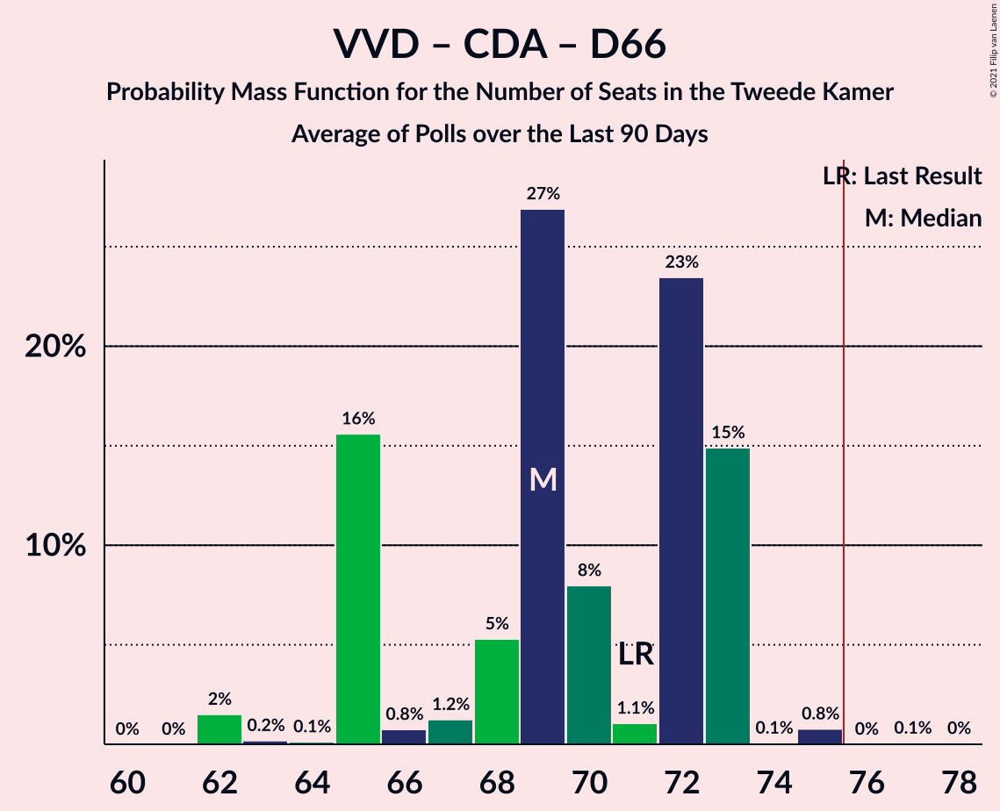

# Poll Average

<a href="#voting-intentions">Voting Intentions</a> | <a href="#seats">Seats</a> | <a href="#coalitions">Coalitions</a> | <a href="#technical-information">Technical Information</a>

## Summary

The table below lists the polls on which the average is based. They are the most recent polls (less than 90 days old) registered and analyzed so far.

| Period     | Polling firm/Commissioner(s) | VVD | PVV | CDA | D66 | GL | SP | PvdA | CU | PvdD | 50+ | SGP | DENK | FvD | PP | B1 | PvdT | JA21 | CO | Volt |
|:----------:|:----------------------------:|:--:|:--:|:--:|:--:|:--:|:--:|:--:|:--:|:--:|:--:|:--:|:--:|:--:|:--:|:--:|:--:|:--:|:--:|:--:|
| 15 March 2017 | General Election | 21.3%   33 | 13.1%   20 | 12.4%   19 | 12.2%   19 | 9.1%   14 | 9.1%   14 | 5.7%   9 | 3.4%   5 | 3.2%   5 | 3.1%   4 | 2.1%   3 | 2.1%   3 | 1.8%   2 | 0.3%   0 | 0.3%   0 | 0.0%   0 | 0.0%   0 | 0.0%   0 | 0.0%   0 |
| N/A | Poll Average | 21–28%   33–41 | 10–17%   14–25 | 10–14%   15–21 | 8–11%   12–17 | 6–10%   8–14 | 5–8%   8–11 | 7–10%   11–14 | 3–6%   4–9 | 3–5%   4–8 | 1–3%   1–6 | 1–3%   1–5 | 1–2%   1–3 | 2–4%   2–6 | N/A   N/A | 0–1%   1 | N/A   N/A | 0–2%   0–3 | 0–1%   1 | 0–2%   0–3 |
| [1–2 March 2021](2021-03-02-Ipsos.html) | Ipsos   EenVandaag | 22–26%   37–39 | 12–15%   19–20 | 10–13%   16–18 | 8–11%   13–15 | 7–10%   13–14 | 6–8%   8–11 | 7–9%   11–12 | 3–4%   5 | 3–5%   6–7 | 1–2%   1–2 | 1–3%   2–3 | 1–3%   3 | 2–4%   5 | N/A   N/A | N/A   N/A | N/A   N/A | 1–2%   1–2 | N/A   N/A | 1–2%   1–2 |
| [1–2 March 2021](2021-03-02-IOResearch.html) | I&O Research | 22–25%   33–39 | 11–13%   17–21 | 10–13%   15–20 | 8–11%   12–16 | 7–9%   9–13 | 5–7%   7–11 | 7–9%   10–14 | 3–5%   4–7 | 3–5%   4–7 | 1–2%   1–3 | 2–3%   3–5 | 1–2%   1–3 | 3–4%   4–6 | N/A   N/A | N/A   N/A | N/A   N/A | 1–2%   1–3 | N/A   N/A | 1–2%   1–3 |
| [26–27 February 2021](2021-02-27-Peilnl.html) | Peil.nl | 21–23%   34 | 15–17%   25–27 | 11–14%   19–20 | 8–10%   11–12 | 5–7%   8 | 5–7%   9 | 7–9%   12–14 | 4–5%   6–8 | 4–5%   7 | 1–2%   2 | 2–3%   2 | 1–2%   1–2 | 2–3%   5 | N/A   N/A | 0–1%   1 | N/A   N/A | 2–3%   2–3 | 0–1%   1 | 0–1%   0 |
| [22–24 February 2021](2021-02-24-KantarPublic.html) | Kantar Public | 24–29%   38–43 | 10–13%   14–20 | 10–13%   14–21 | 8–12%   12–17 | 7–10%   10–13 | 5–8%   9–11 | 7–10%   12–15 | 4–6%   6–9 | 3–5%   4–8 | 2–4%   3–6 | 1–2%   1–2 | 1–2%   1–3 | 1–3%   1–3 | N/A   N/A | N/A   N/A | N/A   N/A | 0–1%   0–1 | N/A   N/A | 0–1%   0–2 |
| 15 March 2017 | General Election | 21.3%   33 | 13.1%   20 | 12.4%   19 | 12.2%   19 | 9.1%   14 | 9.1%   14 | 5.7%   9 | 3.4%   5 | 3.2%   5 | 3.1%   4 | 2.1%   3 | 2.1%   3 | 1.8%   2 | 0.3%   0 | 0.3%   0 | 0.0%   0 | 0.0%   0 | 0.0%   0 | 0.0%   0 |

Only polls for which at least the sample size has been published are included in the table above.

**Legend:**
+ **Top half of each row:** Voting intentions (95% confidence interval)
+ **Bottom half of each row:** Seat projections for the Tweede Kamer (95% confidence interval)
+ **VVD:** Volkspartij voor Vrijheid en Democratie
+ **PVV:** Partij voor de Vrijheid
+ **CDA:** Christen-Democratisch Appèl
+ **D66:** Democraten 66
+ **GL:** GroenLinks
+ **SP:** Socialistische Partij
+ **PvdA:** Partij van de Arbeid
+ **CU:** ChristenUnie
+ **PvdD:** Partij voor de Dieren
+ **50+:** 50Plus
+ **SGP:** Staatkundig Gereformeerde Partij
+ **DENK:** DENK
+ **FvD:** Forum voor Democratie
+ **PP:** Piratenpartij
+ **B1:** Bij1
+ **PvdT:** Partij voor de Toekomst
+ **JA21:** Juiste Antwoord 2021
+ **CO:** Code Oranje
+ **Volt:** Volt Europa
+ **N/A (single party):** Party not included the published results
+ **N/A (entire row):** Calculation for this opinion poll not started yet

## Voting Intentions

### Confidence Intervals

| Party | Last Result | Median | 80% Confidence Interval | 90% Confidence Interval | 95% Confidence Interval | 99% Confidence Interval |
|:-----:|:-----------:|:------:|:-----------------------:|:-----------------------:|:-----------------------:|:-----------------------:|
| <a href="#volkspartij-voor-vrijheid-en-democratie">Volkspartij voor Vrijheid en Democratie</a> | 21.3% | 23.8% | 21.7–27.0% |21.3–27.8% | 21.0–28.3% | 20.4–29.4% |
| <a href="#partij-voor-de-vrijheid">Partij voor de Vrijheid</a> | 13.1% | 12.6% | 11.0–16.1% |10.5–16.5% | 10.2–16.8% | 9.5–17.4% |
| <a href="#christen-democratisch-appèl">Christen-Democratisch Appèl</a> | 12.4% | 11.6% | 10.5–12.9% |10.2–13.2% | 9.9–13.5% | 9.4–14.0% |
| <a href="#democraten-66">Democraten 66</a> | 12.2% | 9.3% | 8.4–10.5% |8.2–10.9% | 8.0–11.2% | 7.6–12.0% |
| <a href="#groenlinks">GroenLinks</a> | 9.1% | 7.7% | 5.9–9.0% |5.7–9.3% | 5.5–9.6% | 5.2–10.1% |
| <a href="#socialistische-partij">Socialistische Partij</a> | 9.1% | 6.4% | 5.7–7.3% |5.5–7.6% | 5.3–7.8% | 5.0–8.4% |
| <a href="#partij-van-de-arbeid">Partij van de Arbeid</a> | 5.7% | 8.1% | 7.3–9.1% |7.1–9.5% | 6.9–9.8% | 6.5–10.5% |
| <a href="#christenunie">ChristenUnie</a> | 3.4% | 4.1% | 3.3–5.1% |3.1–5.4% | 3.0–5.6% | 2.8–6.1% |
| <a href="#partij-voor-de-dieren">Partij voor de Dieren</a> | 3.2% | 4.3% | 3.6–5.0% |3.4–5.2% | 3.2–5.3% | 2.9–5.6% |
| <a href="#50plus">50Plus</a> | 3.1% | 1.5% | 1.1–2.8% |1.0–3.1% | 0.9–3.4% | 0.8–3.8% |
| <a href="#staatkundig-gereformeerde-partij">Staatkundig Gereformeerde Partij</a> | 2.1% | 2.0% | 1.3–2.7% |1.1–2.9% | 1.0–3.0% | 0.8–3.3% |
| <a href="#denk">DENK</a> | 2.1% | 1.6% | 1.2–2.2% |1.0–2.4% | 1.0–2.5% | 0.8–2.8% |
| <a href="#forum-voor-democratie">Forum voor Democratie</a> | 1.8% | 2.8% | 2.0–3.5% |1.7–3.7% | 1.6–3.8% | 1.3–4.1% |
| <a href="#piratenpartij">Piratenpartij</a> | 0.3% | N/A | N/A |N/A | N/A | N/A |
| <a href="#bij1">Bij1</a> | 0.3% | 0.7% | 0.5–0.9% |0.5–1.0% | 0.4–1.0% | 0.4–1.2% |
| <a href="#partij-voor-de-toekomst">Partij voor de Toekomst</a> | 0.0% | N/A | N/A |N/A | N/A | N/A |
| <a href="#juiste-antwoord-2021">Juiste Antwoord 2021</a> | 0.0% | 1.4% | 0.7–2.1% |0.6–2.3% | 0.5–2.4% | 0.3–2.6% |
| <a href="#code-oranje">Code Oranje</a> | 0.0% | 0.7% | 0.5–0.9% |0.5–1.0% | 0.4–1.0% | 0.4–1.2% |
| <a href="#volt-europa">Volt Europa</a> | 0.0% | 0.9% | 0.6–1.7% |0.5–1.8% | 0.4–2.0% | 0.3–2.2% |

### Volkspartij voor Vrijheid en Democratie

*For a full overview of the results for this party, see the [Volkspartij voor Vrijheid en Democratie](party-volkspartijvoorvrijheidendemocratie.html) page.*

| Voting Intentions | Probability | Accumulated | Special Marks |
|:-----------------:|:-----------:|:-----------:|:-------------:|
| 18.5–19.5% | 0% | 100% |  |
| 19.5–20.5% | 0.7% | 100% |  |
| 20.5–21.5% | 7% | 99.3% | Last Result |
| 21.5–22.5% | 16% | 93% |  |
| 22.5–23.5% | 21% | 76% |  |
| 23.5–24.5% | 21% | 56% | Median |
| 24.5–25.5% | 13% | 35% |  |
| 25.5–26.5% | 9% | 22% |  |
| 26.5–27.5% | 7% | 13% |  |
| 27.5–28.5% | 4% | 6% |  |
| 28.5–29.5% | 2% | 2% |  |
| 29.5–30.5% | 0.3% | 0.4% |  |
| 30.5–31.5% | 0% | 0% |  |
| 31.5–32.5% | 0% | 0% |  |

### Partij voor de Vrijheid

*For a full overview of the results for this party, see the [Partij voor de Vrijheid](party-partijvoordevrijheid.html) page.*

| Voting Intentions | Probability | Accumulated | Special Marks |
|:-----------------:|:-----------:|:-----------:|:-------------:|
| 7.5–8.5% | 0% | 100% |  |
| 8.5–9.5% | 0.5% | 100% |  |
| 9.5–10.5% | 5% | 99.4% |  |
| 10.5–11.5% | 18% | 95% |  |
| 11.5–12.5% | 27% | 77% |  |
| 12.5–13.5% | 18% | 51% | Last Result, Median |
| 13.5–14.5% | 7% | 32% |  |
| 14.5–15.5% | 7% | 25% |  |
| 15.5–16.5% | 14% | 19% |  |
| 16.5–17.5% | 5% | 5% |  |
| 17.5–18.5% | 0.3% | 0.3% |  |
| 18.5–19.5% | 0% | 0% |  |

### Christen-Democratisch Appèl

*For a full overview of the results for this party, see the [Christen-Democratisch Appèl](party-christen-democratischappèl.html) page.*

| Voting Intentions | Probability | Accumulated | Special Marks |
|:-----------------:|:-----------:|:-----------:|:-------------:|
| 7.5–8.5% | 0% | 100% |  |
| 8.5–9.5% | 0.7% | 100% |  |
| 9.5–10.5% | 11% | 99.2% |  |
| 10.5–11.5% | 38% | 88% |  |
| 11.5–12.5% | 32% | 50% | Last Result, Median |
| 12.5–13.5% | 16% | 18% |  |
| 13.5–14.5% | 2% | 2% |  |
| 14.5–15.5% | 0.1% | 0.1% |  |
| 15.5–16.5% | 0% | 0% |  |

### Democraten 66

*For a full overview of the results for this party, see the [Democraten 66](party-democraten66.html) page.*

| Voting Intentions | Probability | Accumulated | Special Marks |
|:-----------------:|:-----------:|:-----------:|:-------------:|
| 5.5–6.5% | 0% | 100% |  |
| 6.5–7.5% | 0.3% | 100% |  |
| 7.5–8.5% | 15% | 99.7% |  |
| 8.5–9.5% | 47% | 85% | Median |
| 9.5–10.5% | 29% | 38% |  |
| 10.5–11.5% | 7% | 9% |  |
| 11.5–12.5% | 1.2% | 1.3% | Last Result |
| 12.5–13.5% | 0.1% | 0.1% |  |
| 13.5–14.5% | 0% | 0% |  |

### GroenLinks

*For a full overview of the results for this party, see the [GroenLinks](party-groenlinks.html) page.*

| Voting Intentions | Probability | Accumulated | Special Marks |
|:-----------------:|:-----------:|:-----------:|:-------------:|
| 3.5–4.5% | 0% | 100% |  |
| 4.5–5.5% | 3% | 100% |  |
| 5.5–6.5% | 20% | 97% |  |
| 6.5–7.5% | 22% | 77% |  |
| 7.5–8.5% | 34% | 55% | Median |
| 8.5–9.5% | 18% | 21% | Last Result |
| 9.5–10.5% | 3% | 3% |  |
| 10.5–11.5% | 0.1% | 0.1% |  |
| 11.5–12.5% | 0% | 0% |  |

### Socialistische Partij

*For a full overview of the results for this party, see the [Socialistische Partij](party-socialistischepartij.html) page.*

| Voting Intentions | Probability | Accumulated | Special Marks |
|:-----------------:|:-----------:|:-----------:|:-------------:|
| 3.5–4.5% | 0% | 100% |  |
| 4.5–5.5% | 6% | 100% |  |
| 5.5–6.5% | 55% | 94% | Median |
| 6.5–7.5% | 34% | 39% |  |
| 7.5–8.5% | 5% | 5% |  |
| 8.5–9.5% | 0.3% | 0.3% | Last Result |
| 9.5–10.5% | 0% | 0% |  |

### Partij van de Arbeid

*For a full overview of the results for this party, see the [Partij van de Arbeid](party-partijvandearbeid.html) page.*

| Voting Intentions | Probability | Accumulated | Special Marks |
|:-----------------:|:-----------:|:-----------:|:-------------:|
| 4.5–5.5% | 0% | 100% |  |
| 5.5–6.5% | 0.5% | 100% | Last Result |
| 6.5–7.5% | 18% | 99.5% |  |
| 7.5–8.5% | 56% | 82% | Median |
| 8.5–9.5% | 22% | 26% |  |
| 9.5–10.5% | 4% | 4% |  |
| 10.5–11.5% | 0.5% | 0.5% |  |
| 11.5–12.5% | 0% | 0% |  |

### ChristenUnie

*For a full overview of the results for this party, see the [ChristenUnie](party-christenunie.html) page.*

| Voting Intentions | Probability | Accumulated | Special Marks |
|:-----------------:|:-----------:|:-----------:|:-------------:|
| 1.5–2.5% | 0.1% | 100% |  |
| 2.5–3.5% | 20% | 99.9% | Last Result |
| 3.5–4.5% | 48% | 79% | Median |
| 4.5–5.5% | 29% | 32% |  |
| 5.5–6.5% | 3% | 3% |  |
| 6.5–7.5% | 0.1% | 0.1% |  |
| 7.5–8.5% | 0% | 0% |  |

### Partij voor de Dieren

*For a full overview of the results for this party, see the [Partij voor de Dieren](party-partijvoordedieren.html) page.*

| Voting Intentions | Probability | Accumulated | Special Marks |
|:-----------------:|:-----------:|:-----------:|:-------------:|
| 1.5–2.5% | 0% | 100% |  |
| 2.5–3.5% | 9% | 100% | Last Result |
| 3.5–4.5% | 61% | 91% | Median |
| 4.5–5.5% | 29% | 30% |  |
| 5.5–6.5% | 0.8% | 0.8% |  |
| 6.5–7.5% | 0% | 0% |  |

### 50Plus

*For a full overview of the results for this party, see the [50Plus](party-50plus.html) page.*

| Voting Intentions | Probability | Accumulated | Special Marks |
|:-----------------:|:-----------:|:-----------:|:-------------:|
| 0.0–0.5% | 0% | 100% |  |
| 0.5–1.5% | 52% | 100% |  |
| 1.5–2.5% | 32% | 48% | Median |
| 2.5–3.5% | 15% | 16% | Last Result |
| 3.5–4.5% | 1.4% | 1.4% |  |
| 4.5–5.5% | 0% | 0% |  |

### Staatkundig Gereformeerde Partij

*For a full overview of the results for this party, see the [Staatkundig Gereformeerde Partij](party-staatkundiggereformeerdepartij.html) page.*

| Voting Intentions | Probability | Accumulated | Special Marks |
|:-----------------:|:-----------:|:-----------:|:-------------:|
| 0.0–0.5% | 0% | 100% |  |
| 0.5–1.5% | 20% | 100% |  |
| 1.5–2.5% | 63% | 80% | Last Result, Median |
| 2.5–3.5% | 17% | 17% |  |
| 3.5–4.5% | 0.1% | 0.1% |  |
| 4.5–5.5% | 0% | 0% |  |

### DENK

*For a full overview of the results for this party, see the [DENK](party-denk.html) page.*

| Voting Intentions | Probability | Accumulated | Special Marks |
|:-----------------:|:-----------:|:-----------:|:-------------:|
| 0.0–0.5% | 0% | 100% |  |
| 0.5–1.5% | 42% | 100% |  |
| 1.5–2.5% | 56% | 58% | Last Result, Median |
| 2.5–3.5% | 2% | 2% |  |
| 3.5–4.5% | 0% | 0% |  |

### Forum voor Democratie

*For a full overview of the results for this party, see the [Forum voor Democratie](party-forumvoordemocratie.html) page.*

| Voting Intentions | Probability | Accumulated | Special Marks |
|:-----------------:|:-----------:|:-----------:|:-------------:|
| 0.0–0.5% | 0% | 100% |  |
| 0.5–1.5% | 2% | 100% |  |
| 1.5–2.5% | 29% | 98% | Last Result |
| 2.5–3.5% | 61% | 69% | Median |
| 3.5–4.5% | 8% | 8% |  |
| 4.5–5.5% | 0% | 0% |  |

### Bij1

*For a full overview of the results for this party, see the [Bij1](party-bij1.html) page.*

| Voting Intentions | Probability | Accumulated | Special Marks |
|:-----------------:|:-----------:|:-----------:|:-------------:|
| 0.0–0.5% | 16% | 100% | Last Result |
| 0.5–1.5% | 84% | 84% | Median |
| 1.5–2.5% | 0% | 0% |  |

### Juiste Antwoord 2021

*For a full overview of the results for this party, see the [Juiste Antwoord 2021](party-juisteantwoord2021.html) page.*

| Voting Intentions | Probability | Accumulated | Special Marks |
|:-----------------:|:-----------:|:-----------:|:-------------:|
| 0.0–0.5% | 5% | 100% | Last Result |
| 0.5–1.5% | 51% | 95% | Median |
| 1.5–2.5% | 44% | 44% |  |
| 2.5–3.5% | 0.8% | 0.8% |  |
| 3.5–4.5% | 0% | 0% |  |

### Volt Europa

*For a full overview of the results for this party, see the [Volt Europa](party-volteuropa.html) page.*

| Voting Intentions | Probability | Accumulated | Special Marks |
|:-----------------:|:-----------:|:-----------:|:-------------:|
| 0.0–0.5% | 8% | 100% | Last Result |
| 0.5–1.5% | 76% | 92% | Median |
| 1.5–2.5% | 16% | 16% |  |
| 2.5–3.5% | 0% | 0% |  |

### Code Oranje

*For a full overview of the results for this party, see the [Code Oranje](party-codeoranje.html) page.*

| Voting Intentions | Probability | Accumulated | Special Marks |
|:-----------------:|:-----------:|:-----------:|:-------------:|
| 0.0–0.5% | 16% | 100% | Last Result |
| 0.5–1.5% | 84% | 84% | Median |
| 1.5–2.5% | 0% | 0% |  |

## Seats

### Confidence Intervals

| Party | Last Result | Median | 80% Confidence Interval | 90% Confidence Interval | 95% Confidence Interval | 99% Confidence Interval |
|:-----:|:-----------:|:------:|:-----------------------:|:-----------------------:|:-----------------------:|:-----------------------:|
| <a href="#volkspartij-voor-vrijheid-en-democratie">Volkspartij voor Vrijheid en Democratie</a> | 33 | 37 | 34–41 |34–41 | 33–41 | 33–43 |
| <a href="#partij-voor-de-vrijheid">Partij voor de Vrijheid</a> | 20 | 19 | 17–25 |16–25 | 14–25 | 14–27 |
| <a href="#christen-democratisch-appèl">Christen-Democratisch Appèl</a> | 19 | 18 | 16–19 |15–20 | 15–21 | 14–21 |
| <a href="#democraten-66">Democraten 66</a> | 19 | 14 | 12–16 |12–16 | 12–17 | 11–17 |
| <a href="#groenlinks">GroenLinks</a> | 14 | 12 | 8–13 |8–14 | 8–14 | 8–14 |
| <a href="#socialistische-partij">Socialistische Partij</a> | 14 | 9 | 8–10 |8–11 | 8–11 | 7–12 |
| <a href="#partij-van-de-arbeid">Partij van de Arbeid</a> | 9 | 12 | 11–13 |11–14 | 11–14 | 10–16 |
| <a href="#christenunie">ChristenUnie</a> | 5 | 6 | 5–8 |5–9 | 4–9 | 4–9 |
| <a href="#partij-voor-de-dieren">Partij voor de Dieren</a> | 5 | 6 | 5–7 |5–8 | 4–8 | 4–8 |
| <a href="#50plus">50Plus</a> | 4 | 2 | 1–5 |1–6 | 1–6 | 1–6 |
| <a href="#staatkundig-gereformeerde-partij">Staatkundig Gereformeerde Partij</a> | 3 | 2 | 2–4 |1–4 | 1–5 | 1–5 |
| <a href="#denk">DENK</a> | 3 | 2 | 1–3 |1–3 | 1–3 | 1–4 |
| <a href="#forum-voor-democratie">Forum voor Democratie</a> | 2 | 5 | 3–5 |2–5 | 2–6 | 1–6 |
| <a href="#piratenpartij">Piratenpartij</a> | 0 | N/A | N/A |N/A | N/A | N/A |
| <a href="#bij1">Bij1</a> | 0 | 1 | 1 |1 | 1 | 1 |
| <a href="#partij-voor-de-toekomst">Partij voor de Toekomst</a> | 0 | N/A | N/A |N/A | N/A | N/A |
| <a href="#juiste-antwoord-2021">Juiste Antwoord 2021</a> | 0 | 2 | 1–3 |1–3 | 0–3 | 0–3 |
| <a href="#code-oranje">Code Oranje</a> | 0 | 1 | 1 |1 | 1 | 0–1 |
| <a href="#volt-europa">Volt Europa</a> | 0 | 1 | 0–2 |0–2 | 0–3 | 0–3 |

### Volkspartij voor Vrijheid en Democratie

*For a full overview of the results for this party, see the [Volkspartij voor Vrijheid en Democratie](party-volkspartijvoorvrijheidendemocratie.html) page.*

| Number of Seats | Probability | Accumulated | Special Marks |
|:---------------:|:-----------:|:-----------:|:-------------:|
| 32 | 0.2% | 100% |  |
| 33 | 3% | 99.8% | Last Result |
| 34 | 28% | 97% |  |
| 35 | 5% | 70% |  |
| 36 | 2% | 64% |  |
| 37 | 22% | 62% | Median |
| 38 | 17% | 41% |  |
| 39 | 11% | 24% |  |
| 40 | 1.0% | 13% |  |
| 41 | 10% | 12% |  |
| 42 | 0.1% | 2% |  |
| 43 | 1.1% | 1.5% |  |
| 44 | 0% | 0.4% |  |
| 45 | 0.3% | 0.4% |  |
| 46 | 0% | 0.1% |  |
| 47 | 0% | 0% |  |

### Partij voor de Vrijheid

*For a full overview of the results for this party, see the [Partij voor de Vrijheid](party-partijvoordevrijheid.html) page.*

| Number of Seats | Probability | Accumulated | Special Marks |
|:---------------:|:-----------:|:-----------:|:-------------:|
| 14 | 5% | 100% |  |
| 15 | 0.2% | 95% |  |
| 16 | 2% | 95% |  |
| 17 | 21% | 93% |  |
| 18 | 6% | 72% |  |
| 19 | 17% | 66% | Median |
| 20 | 21% | 49% | Last Result |
| 21 | 3% | 28% |  |
| 22 | 0.4% | 25% |  |
| 23 | 0% | 25% |  |
| 24 | 0.4% | 25% |  |
| 25 | 23% | 25% |  |
| 26 | 0% | 1.4% |  |
| 27 | 1.4% | 1.4% |  |
| 28 | 0% | 0% |  |

### Christen-Democratisch Appèl

*For a full overview of the results for this party, see the [Christen-Democratisch Appèl](party-christen-democratischappèl.html) page.*

| Number of Seats | Probability | Accumulated | Special Marks |
|:---------------:|:-----------:|:-----------:|:-------------:|
| 14 | 1.5% | 100% |  |
| 15 | 4% | 98% |  |
| 16 | 16% | 95% |  |
| 17 | 13% | 79% |  |
| 18 | 30% | 66% | Median |
| 19 | 29% | 36% | Last Result |
| 20 | 4% | 7% |  |
| 21 | 3% | 3% |  |
| 22 | 0% | 0.1% |  |
| 23 | 0% | 0% |  |

### Democraten 66

*For a full overview of the results for this party, see the [Democraten 66](party-democraten66.html) page.*

| Number of Seats | Probability | Accumulated | Special Marks |
|:---------------:|:-----------:|:-----------:|:-------------:|
| 11 | 2% | 100% |  |
| 12 | 30% | 98% |  |
| 13 | 18% | 68% |  |
| 14 | 14% | 50% | Median |
| 15 | 17% | 36% |  |
| 16 | 16% | 19% |  |
| 17 | 3% | 3% |  |
| 18 | 0.1% | 0.2% |  |
| 19 | 0.1% | 0.1% | Last Result |
| 20 | 0% | 0% |  |

### GroenLinks

*For a full overview of the results for this party, see the [GroenLinks](party-groenlinks.html) page.*

| Number of Seats | Probability | Accumulated | Special Marks |
|:---------------:|:-----------:|:-----------:|:-------------:|
| 8 | 25% | 100% |  |
| 9 | 1.1% | 75% |  |
| 10 | 4% | 74% |  |
| 11 | 20% | 70% |  |
| 12 | 19% | 50% | Median |
| 13 | 22% | 32% |  |
| 14 | 9% | 10% | Last Result |
| 15 | 0.1% | 0.2% |  |
| 16 | 0% | 0.1% |  |
| 17 | 0% | 0% |  |

### Socialistische Partij

*For a full overview of the results for this party, see the [Socialistische Partij](party-socialistischepartij.html) page.*

| Number of Seats | Probability | Accumulated | Special Marks |
|:---------------:|:-----------:|:-----------:|:-------------:|
| 7 | 2% | 100% |  |
| 8 | 26% | 98% |  |
| 9 | 44% | 73% | Median |
| 10 | 19% | 29% |  |
| 11 | 9% | 10% |  |
| 12 | 0.3% | 0.8% |  |
| 13 | 0.4% | 0.4% |  |
| 14 | 0% | 0% | Last Result |

### Partij van de Arbeid

*For a full overview of the results for this party, see the [Partij van de Arbeid](party-partijvandearbeid.html) page.*

| Number of Seats | Probability | Accumulated | Special Marks |
|:---------------:|:-----------:|:-----------:|:-------------:|
| 9 | 0% | 100% | Last Result |
| 10 | 2% | 100% |  |
| 11 | 18% | 98% |  |
| 12 | 53% | 80% | Median |
| 13 | 18% | 27% |  |
| 14 | 8% | 9% |  |
| 15 | 0.3% | 1.0% |  |
| 16 | 0.6% | 0.7% |  |
| 17 | 0% | 0% |  |

### ChristenUnie

*For a full overview of the results for this party, see the [ChristenUnie](party-christenunie.html) page.*

| Number of Seats | Probability | Accumulated | Special Marks |
|:---------------:|:-----------:|:-----------:|:-------------:|
| 3 | 0.4% | 100% |  |
| 4 | 4% | 99.6% |  |
| 5 | 34% | 95% | Last Result |
| 6 | 15% | 61% | Median |
| 7 | 12% | 46% |  |
| 8 | 28% | 34% |  |
| 9 | 6% | 6% |  |
| 10 | 0.3% | 0.3% |  |
| 11 | 0% | 0% |  |

### Partij voor de Dieren

*For a full overview of the results for this party, see the [Partij voor de Dieren](party-partijvoordedieren.html) page.*

| Number of Seats | Probability | Accumulated | Special Marks |
|:---------------:|:-----------:|:-----------:|:-------------:|
| 4 | 5% | 100% |  |
| 5 | 12% | 95% | Last Result |
| 6 | 46% | 83% | Median |
| 7 | 31% | 37% |  |
| 8 | 5% | 6% |  |
| 9 | 0.4% | 0.4% |  |
| 10 | 0% | 0% |  |

### 50Plus

*For a full overview of the results for this party, see the [50Plus](party-50plus.html) page.*

| Number of Seats | Probability | Accumulated | Special Marks |
|:---------------:|:-----------:|:-----------:|:-------------:|
| 1 | 15% | 100% |  |
| 2 | 51% | 85% | Median |
| 3 | 10% | 34% |  |
| 4 | 11% | 24% | Last Result |
| 5 | 5% | 14% |  |
| 6 | 9% | 9% |  |
| 7 | 0% | 0% |  |

### Staatkundig Gereformeerde Partij

*For a full overview of the results for this party, see the [Staatkundig Gereformeerde Partij](party-staatkundiggereformeerdepartij.html) page.*

| Number of Seats | Probability | Accumulated | Special Marks |
|:---------------:|:-----------:|:-----------:|:-------------:|
| 0 | 0.1% | 100% |  |
| 1 | 5% | 99.9% |  |
| 2 | 49% | 94% | Median |
| 3 | 28% | 46% | Last Result |
| 4 | 16% | 18% |  |
| 5 | 3% | 3% |  |
| 6 | 0% | 0% |  |

### DENK

*For a full overview of the results for this party, see the [DENK](party-denk.html) page.*

| Number of Seats | Probability | Accumulated | Special Marks |
|:---------------:|:-----------:|:-----------:|:-------------:|
| 1 | 11% | 100% |  |
| 2 | 50% | 89% | Median |
| 3 | 38% | 39% | Last Result |
| 4 | 0.7% | 0.7% |  |
| 5 | 0% | 0% |  |

### Forum voor Democratie

*For a full overview of the results for this party, see the [Forum voor Democratie](party-forumvoordemocratie.html) page.*

| Number of Seats | Probability | Accumulated | Special Marks |
|:---------------:|:-----------:|:-----------:|:-------------:|
| 1 | 0.8% | 100% |  |
| 2 | 7% | 99.2% | Last Result |
| 3 | 18% | 93% |  |
| 4 | 9% | 75% |  |
| 5 | 61% | 65% | Median |
| 6 | 4% | 4% |  |
| 7 | 0% | 0% |  |

### Piratenpartij

*For a full overview of the results for this party, see the [Piratenpartij](party-piratenpartij.html) page.*

### Bij1

*For a full overview of the results for this party, see the [Bij1](party-bij1.html) page.*

| Number of Seats | Probability | Accumulated | Special Marks |
|:---------------:|:-----------:|:-----------:|:-------------:|
| 0 | 0.3% | 100% | Last Result |
| 1 | 99.7% | 99.7% | Median |
| 2 | 0% | 0% |  |

### Partij voor de Toekomst

*For a full overview of the results for this party, see the [Partij voor de Toekomst](party-partijvoordetoekomst.html) page.*

### Juiste Antwoord 2021

*For a full overview of the results for this party, see the [Juiste Antwoord 2021](party-juisteantwoord2021.html) page.*

| Number of Seats | Probability | Accumulated | Special Marks |
|:---------------:|:-----------:|:-----------:|:-------------:|
| 0 | 3% | 100% | Last Result |
| 1 | 40% | 97% |  |
| 2 | 30% | 57% | Median |
| 3 | 27% | 28% |  |
| 4 | 0.3% | 0.3% |  |
| 5 | 0% | 0% |  |

### Code Oranje

*For a full overview of the results for this party, see the [Code Oranje](party-codeoranje.html) page.*

| Number of Seats | Probability | Accumulated | Special Marks |
|:---------------:|:-----------:|:-----------:|:-------------:|
| 0 | 2% | 100% | Last Result |
| 1 | 98% | 98% | Median |
| 2 | 0% | 0% |  |

### Volt Europa

*For a full overview of the results for this party, see the [Volt Europa](party-volteuropa.html) page.*

| Number of Seats | Probability | Accumulated | Special Marks |
|:---------------:|:-----------:|:-----------:|:-------------:|
| 0 | 26% | 100% | Last Result |
| 1 | 36% | 74% | Median |
| 2 | 34% | 38% |  |
| 3 | 4% | 4% |  |
| 4 | 0.1% | 0.1% |  |
| 5 | 0% | 0% |  |

## Coalitions

### Confidence Intervals

| Coalition | Last Result | Median | Majority? | 80% Confidence Interval | 90% Confidence Interval | 95% Confidence Interval | 99% Confidence Interval |
|:---------:|:-----------:|:------:|:---------:|:-----------------------:|:-----------------------:|:-----------------------:|:-----------------------:|
| Volkspartij voor Vrijheid en Democratie – Christen-Democratisch Appèl – Democraten 66 – Partij van de Arbeid – ChristenUnie | 85 | 86 | 100% | 84–93 | 83–93 | 82–95 | 82–96 |
| Volkspartij voor Vrijheid en Democratie – Christen-Democratisch Appèl – Democraten 66 – GroenLinks – ChristenUnie | 90 | 87 | 100% | 81–92 | 81–93 | 81–93 | 79–95 |
| Volkspartij voor Vrijheid en Democratie – Partij voor de Vrijheid – Christen-Democratisch Appèl – Staatkundig Gereformeerde Partij – Forum voor Democratie | 77 | 82 | 95% | 77–85 | 76–85 | 75–85 | 75–88 |
| Volkspartij voor Vrijheid en Democratie – Partij voor de Vrijheid – Christen-Democratisch Appèl – Forum voor Democratie | 74 | 79 | 87% | 75–83 | 73–83 | 73–83 | 72–86 |
| Volkspartij voor Vrijheid en Democratie – Christen-Democratisch Appèl – Democraten 66 – ChristenUnie | 76 | 74 | 29% | 71–79 | 71–81 | 70–82 | 70–83 |
| Volkspartij voor Vrijheid en Democratie – Partij voor de Vrijheid – Christen-Democratisch Appèl | 72 | 75 | 39% | 70–78 | 70–78 | 70–78 | 68–81 |
| Christen-Democratisch Appèl – Democraten 66 – GroenLinks – Socialistische Partij – Partij van de Arbeid – ChristenUnie | 80 | 69 | 13% | 68–76 | 68–78 | 68–78 | 66–78 |
| Volkspartij voor Vrijheid en Democratie – Christen-Democratisch Appèl – Democraten 66 | 71 | 69 | 0.4% | 65–72 | 65–73 | 65–74 | 65–75 |
| Volkspartij voor Vrijheid en Democratie – Christen-Democratisch Appèl – Partij van de Arbeid | 61 | 66 | 0.2% | 64–72 | 62–72 | 62–73 | 62–74 |
| Volkspartij voor Vrijheid en Democratie – Christen-Democratisch Appèl – 50Plus – Staatkundig Gereformeerde Partij – Forum voor Democratie | 61 | 64 | 0% | 62–69 | 62–70 | 61–70 | 60–70 |
| Volkspartij voor Vrijheid en Democratie – Democraten 66 – Partij van de Arbeid | 61 | 63 | 0% | 58–67 | 58–67 | 58–70 | 58–73 |
| Volkspartij voor Vrijheid en Democratie – Christen-Democratisch Appèl – 50Plus – Forum voor Democratie | 58 | 61 | 0% | 59–66 | 58–68 | 57–68 | 57–68 |
| Christen-Democratisch Appèl – Democraten 66 – GroenLinks – Partij van de Arbeid – ChristenUnie | 66 | 61 | 0% | 59–66 | 58–67 | 58–67 | 57–68 |
| Volkspartij voor Vrijheid en Democratie – Christen-Democratisch Appèl – Staatkundig Gereformeerde Partij – Forum voor Democratie | 57 | 62 | 0% | 60–64 | 59–65 | 58–65 | 57–66 |
| Volkspartij voor Vrijheid en Democratie – Christen-Democratisch Appèl – Forum voor Democratie | 54 | 59 | 0% | 57–62 | 56–62 | 54–62 | 54–63 |
| Volkspartij voor Vrijheid en Democratie – Christen-Democratisch Appèl | 52 | 55 | 0% | 53–59 | 51–59 | 50–59 | 50–61 |
| Volkspartij voor Vrijheid en Democratie – Partij van de Arbeid | 42 | 49 | 0% | 46–54 | 45–54 | 45–54 | 45–56 |
| Christen-Democratisch Appèl – Democraten 66 – Partij van de Arbeid | 47 | 44 | 0% | 42–47 | 41–47 | 41–47 | 40–49 |
| Christen-Democratisch Appèl – Partij van de Arbeid – ChristenUnie | 33 | 37 | 0% | 33–39 | 33–39 | 32–43 | 32–43 |
| Christen-Democratisch Appèl – Democraten 66 | 38 | 31 | 0% | 30–34 | 29–35 | 28–35 | 28–36 |
| Christen-Democratisch Appèl – Partij van de Arbeid | 28 | 30 | 0% | 28–31 | 28–32 | 27–35 | 26–35 |

### Volkspartij voor Vrijheid en Democratie – Christen-Democratisch Appèl – Democraten 66 – Partij van de Arbeid – ChristenUnie

| Number of Seats | Probability | Accumulated | Special Marks |
|:---------------:|:-----------:|:-----------:|:-------------:|
| 80 | 0.1% | 100% |  |
| 81 | 0.1% | 99.9% |  |
| 82 | 3% | 99.8% |  |
| 83 | 4% | 97% |  |
| 84 | 10% | 93% |  |
| 85 | 27% | 84% | Last Result |
| 86 | 24% | 57% |  |
| 87 | 5% | 33% | Median |
| 88 | 3% | 28% |  |
| 89 | 0.6% | 25% |  |
| 90 | 0.5% | 25% |  |
| 91 | 4% | 24% |  |
| 92 | 10% | 20% |  |
| 93 | 8% | 11% |  |
| 94 | 0.1% | 3% |  |
| 95 | 2% | 3% |  |
| 96 | 1.1% | 1.3% |  |
| 97 | 0.1% | 0.2% |  |
| 98 | 0% | 0.1% |  |
| 99 | 0% | 0.1% |  |
| 100 | 0% | 0.1% |  |
| 101 | 0% | 0% |  |

### Volkspartij voor Vrijheid en Democratie – Christen-Democratisch Appèl – Democraten 66 – GroenLinks – ChristenUnie

| Number of Seats | Probability | Accumulated | Special Marks |
|:---------------:|:-----------:|:-----------:|:-------------:|
| 79 | 1.1% | 100% |  |
| 80 | 0.2% | 98.8% |  |
| 81 | 23% | 98.6% |  |
| 82 | 4% | 75% |  |
| 83 | 9% | 71% |  |
| 84 | 3% | 63% |  |
| 85 | 2% | 60% |  |
| 86 | 7% | 58% |  |
| 87 | 5% | 50% | Median |
| 88 | 21% | 45% |  |
| 89 | 0.1% | 24% |  |
| 90 | 12% | 24% | Last Result |
| 91 | 0.6% | 12% |  |
| 92 | 5% | 12% |  |
| 93 | 6% | 7% |  |
| 94 | 0.2% | 1.5% |  |
| 95 | 1.2% | 1.3% |  |
| 96 | 0% | 0.1% |  |
| 97 | 0% | 0% |  |

### Volkspartij voor Vrijheid en Democratie – Partij voor de Vrijheid – Christen-Democratisch Appèl – Staatkundig Gereformeerde Partij – Forum voor Democratie

| Number of Seats | Probability | Accumulated | Special Marks |
|:---------------:|:-----------:|:-----------:|:-------------:|
| 72 | 0.1% | 100% |  |
| 73 | 0% | 99.9% |  |
| 74 | 0% | 99.9% |  |
| 75 | 5% | 99.9% |  |
| 76 | 0.3% | 95% | Majority |
| 77 | 5% | 95% | Last Result |
| 78 | 4% | 90% |  |
| 79 | 4% | 85% |  |
| 80 | 10% | 81% |  |
| 81 | 11% | 71% | Median |
| 82 | 20% | 60% |  |
| 83 | 15% | 40% |  |
| 84 | 0.4% | 25% |  |
| 85 | 24% | 25% |  |
| 86 | 0.2% | 1.5% |  |
| 87 | 0% | 1.2% |  |
| 88 | 1.2% | 1.2% |  |
| 89 | 0% | 0% |  |

### Volkspartij voor Vrijheid en Democratie – Partij voor de Vrijheid – Christen-Democratisch Appèl – Forum voor Democratie

| Number of Seats | Probability | Accumulated | Special Marks |
|:---------------:|:-----------:|:-----------:|:-------------:|
| 71 | 0.1% | 100% |  |
| 72 | 0.4% | 99.8% |  |
| 73 | 5% | 99.5% |  |
| 74 | 3% | 95% | Last Result |
| 75 | 4% | 91% |  |
| 76 | 11% | 87% | Majority |
| 77 | 6% | 76% |  |
| 78 | 3% | 70% |  |
| 79 | 24% | 66% | Median |
| 80 | 14% | 42% |  |
| 81 | 3% | 28% |  |
| 82 | 0.3% | 25% |  |
| 83 | 23% | 25% |  |
| 84 | 0.3% | 2% |  |
| 85 | 0.1% | 1.3% |  |
| 86 | 1.1% | 1.1% |  |
| 87 | 0% | 0% |  |

### Volkspartij voor Vrijheid en Democratie – Christen-Democratisch Appèl – Democraten 66 – ChristenUnie

| Number of Seats | Probability | Accumulated | Special Marks |
|:---------------:|:-----------:|:-----------:|:-------------:|
| 68 | 0.1% | 100% |  |
| 69 | 0.1% | 99.9% |  |
| 70 | 4% | 99.8% |  |
| 71 | 7% | 96% |  |
| 72 | 4% | 89% |  |
| 73 | 29% | 85% |  |
| 74 | 15% | 56% |  |
| 75 | 12% | 41% | Median |
| 76 | 4% | 29% | Last Result, Majority |
| 77 | 0.7% | 25% |  |
| 78 | 0.3% | 24% |  |
| 79 | 16% | 24% |  |
| 80 | 0.2% | 8% |  |
| 81 | 5% | 8% |  |
| 82 | 0.5% | 3% |  |
| 83 | 2% | 2% |  |
| 84 | 0% | 0.1% |  |
| 85 | 0% | 0% |  |

### Volkspartij voor Vrijheid en Democratie – Partij voor de Vrijheid – Christen-Democratisch Appèl

| Number of Seats | Probability | Accumulated | Special Marks |
|:---------------:|:-----------:|:-----------:|:-------------:|
| 66 | 0.1% | 100% |  |
| 67 | 0.1% | 99.9% |  |
| 68 | 0.5% | 99.8% |  |
| 69 | 0.3% | 99.3% |  |
| 70 | 13% | 98.9% |  |
| 71 | 3% | 86% |  |
| 72 | 7% | 83% | Last Result |
| 73 | 2% | 76% |  |
| 74 | 21% | 74% | Median |
| 75 | 14% | 53% |  |
| 76 | 10% | 39% | Majority |
| 77 | 1.3% | 30% |  |
| 78 | 26% | 28% |  |
| 79 | 0.6% | 2% |  |
| 80 | 0.3% | 2% |  |
| 81 | 1.2% | 1.3% |  |
| 82 | 0.1% | 0.1% |  |
| 83 | 0% | 0% |  |

### Christen-Democratisch Appèl – Democraten 66 – GroenLinks – Socialistische Partij – Partij van de Arbeid – ChristenUnie

| Number of Seats | Probability | Accumulated | Special Marks |
|:---------------:|:-----------:|:-----------:|:-------------:|
| 63 | 0.1% | 100% |  |
| 64 | 0% | 99.9% |  |
| 65 | 0.1% | 99.9% |  |
| 66 | 1.1% | 99.8% |  |
| 67 | 0.4% | 98.6% |  |
| 68 | 28% | 98% |  |
| 69 | 20% | 70% |  |
| 70 | 14% | 50% |  |
| 71 | 15% | 35% | Median |
| 72 | 6% | 21% |  |
| 73 | 0.4% | 14% |  |
| 74 | 0.1% | 14% |  |
| 75 | 1.1% | 14% |  |
| 76 | 5% | 13% | Majority |
| 77 | 3% | 8% |  |
| 78 | 5% | 5% |  |
| 79 | 0.1% | 0.1% |  |
| 80 | 0.1% | 0.1% | Last Result |
| 81 | 0% | 0% |  |

### Volkspartij voor Vrijheid en Democratie – Christen-Democratisch Appèl – Democraten 66

| Number of Seats | Probability | Accumulated | Special Marks |
|:---------------:|:-----------:|:-----------:|:-------------:|
| 63 | 0.2% | 100% |  |
| 64 | 0.1% | 99.8% |  |
| 65 | 28% | 99.7% |  |
| 66 | 6% | 72% |  |
| 67 | 7% | 65% |  |
| 68 | 6% | 59% |  |
| 69 | 11% | 53% | Median |
| 70 | 17% | 41% |  |
| 71 | 4% | 24% | Last Result |
| 72 | 14% | 21% |  |
| 73 | 4% | 7% |  |
| 74 | 1.3% | 3% |  |
| 75 | 2% | 2% |  |
| 76 | 0.2% | 0.4% | Majority |
| 77 | 0.1% | 0.2% |  |
| 78 | 0% | 0.1% |  |
| 79 | 0% | 0% |  |

### Volkspartij voor Vrijheid en Democratie – Christen-Democratisch Appèl – Partij van de Arbeid

| Number of Seats | Probability | Accumulated | Special Marks |
|:---------------:|:-----------:|:-----------:|:-------------:|
| 60 | 0.1% | 100% |  |
| 61 | 0% | 99.9% | Last Result |
| 62 | 5% | 99.9% |  |
| 63 | 0.8% | 95% |  |
| 64 | 4% | 94% |  |
| 65 | 25% | 90% |  |
| 66 | 19% | 64% |  |
| 67 | 17% | 46% | Median |
| 68 | 6% | 29% |  |
| 69 | 5% | 22% |  |
| 70 | 4% | 17% |  |
| 71 | 0.3% | 13% |  |
| 72 | 9% | 13% |  |
| 73 | 3% | 3% |  |
| 74 | 0.3% | 0.6% |  |
| 75 | 0% | 0.2% |  |
| 76 | 0.1% | 0.2% | Majority |
| 77 | 0% | 0.1% |  |
| 78 | 0% | 0.1% |  |
| 79 | 0.1% | 0.1% |  |
| 80 | 0% | 0% |  |

### Volkspartij voor Vrijheid en Democratie – Christen-Democratisch Appèl – 50Plus – Staatkundig Gereformeerde Partij – Forum voor Democratie

| Number of Seats | Probability | Accumulated | Special Marks |
|:---------------:|:-----------:|:-----------:|:-------------:|
| 58 | 0.2% | 100% |  |
| 59 | 0.1% | 99.8% |  |
| 60 | 0.5% | 99.7% |  |
| 61 | 4% | 99.2% | Last Result |
| 62 | 26% | 95% |  |
| 63 | 7% | 69% |  |
| 64 | 21% | 62% | Median |
| 65 | 21% | 41% |  |
| 66 | 5% | 20% |  |
| 67 | 0.9% | 15% |  |
| 68 | 4% | 14% |  |
| 69 | 1.4% | 10% |  |
| 70 | 9% | 9% |  |
| 71 | 0% | 0.1% |  |
| 72 | 0.1% | 0.1% |  |
| 73 | 0% | 0% |  |

### Volkspartij voor Vrijheid en Democratie – Democraten 66 – Partij van de Arbeid

| Number of Seats | Probability | Accumulated | Special Marks |
|:---------------:|:-----------:|:-----------:|:-------------:|
| 56 | 0.1% | 100% |  |
| 57 | 0.1% | 99.9% |  |
| 58 | 23% | 99.8% |  |
| 59 | 2% | 77% |  |
| 60 | 0.7% | 75% |  |
| 61 | 6% | 74% | Last Result |
| 62 | 10% | 69% |  |
| 63 | 19% | 58% | Median |
| 64 | 5% | 39% |  |
| 65 | 11% | 34% |  |
| 66 | 10% | 23% |  |
| 67 | 9% | 13% |  |
| 68 | 0.8% | 4% |  |
| 69 | 0.6% | 3% |  |
| 70 | 1.2% | 3% |  |
| 71 | 0.2% | 1.5% |  |
| 72 | 0.2% | 1.2% |  |
| 73 | 1.0% | 1.0% |  |
| 74 | 0% | 0.1% |  |
| 75 | 0% | 0% |  |

### Volkspartij voor Vrijheid en Democratie – Christen-Democratisch Appèl – 50Plus – Forum voor Democratie

| Number of Seats | Probability | Accumulated | Special Marks |
|:---------------:|:-----------:|:-----------:|:-------------:|
| 55 | 0.1% | 100% |  |
| 56 | 0.3% | 99.9% |  |
| 57 | 3% | 99.6% |  |
| 58 | 1.5% | 96% | Last Result |
| 59 | 6% | 95% |  |
| 60 | 30% | 89% |  |
| 61 | 15% | 59% |  |
| 62 | 18% | 44% | Median |
| 63 | 6% | 26% |  |
| 64 | 6% | 20% |  |
| 65 | 2% | 14% |  |
| 66 | 3% | 12% |  |
| 67 | 0.1% | 9% |  |
| 68 | 9% | 9% |  |
| 69 | 0.1% | 0.2% |  |
| 70 | 0% | 0.1% |  |
| 71 | 0% | 0.1% |  |
| 72 | 0% | 0% |  |

### Christen-Democratisch Appèl – Democraten 66 – GroenLinks – Partij van de Arbeid – ChristenUnie

| Number of Seats | Probability | Accumulated | Special Marks |
|:---------------:|:-----------:|:-----------:|:-------------:|
| 55 | 0.1% | 100% |  |
| 56 | 0.2% | 99.9% |  |
| 57 | 0.4% | 99.7% |  |
| 58 | 4% | 99.3% |  |
| 59 | 33% | 95% |  |
| 60 | 4% | 62% |  |
| 61 | 12% | 58% |  |
| 62 | 26% | 46% | Median |
| 63 | 4% | 20% |  |
| 64 | 3% | 16% |  |
| 65 | 0.9% | 14% |  |
| 66 | 8% | 13% | Last Result |
| 67 | 5% | 5% |  |
| 68 | 0.3% | 0.5% |  |
| 69 | 0.1% | 0.2% |  |
| 70 | 0.1% | 0.1% |  |
| 71 | 0% | 0.1% |  |
| 72 | 0% | 0% |  |

### Volkspartij voor Vrijheid en Democratie – Christen-Democratisch Appèl – Staatkundig Gereformeerde Partij – Forum voor Democratie

| Number of Seats | Probability | Accumulated | Special Marks |
|:---------------:|:-----------:|:-----------:|:-------------:|
| 56 | 0.1% | 100% |  |
| 57 | 0.7% | 99.9% | Last Result |
| 58 | 3% | 99.2% |  |
| 59 | 3% | 96% |  |
| 60 | 29% | 93% |  |
| 61 | 10% | 64% |  |
| 62 | 13% | 54% | Median |
| 63 | 23% | 40% |  |
| 64 | 12% | 17% |  |
| 65 | 4% | 5% |  |
| 66 | 1.1% | 1.3% |  |
| 67 | 0.1% | 0.1% |  |
| 68 | 0% | 0.1% |  |
| 69 | 0% | 0% |  |

### Volkspartij voor Vrijheid en Democratie – Christen-Democratisch Appèl – Forum voor Democratie

| Number of Seats | Probability | Accumulated | Special Marks |
|:---------------:|:-----------:|:-----------:|:-------------:|
| 53 | 0.1% | 100% |  |
| 54 | 3% | 99.9% | Last Result |
| 55 | 1.1% | 97% |  |
| 56 | 3% | 96% |  |
| 57 | 4% | 93% |  |
| 58 | 31% | 89% |  |
| 59 | 13% | 58% |  |
| 60 | 29% | 44% | Median |
| 61 | 1.1% | 15% |  |
| 62 | 13% | 14% |  |
| 63 | 0.4% | 0.7% |  |
| 64 | 0.2% | 0.3% |  |
| 65 | 0% | 0.1% |  |
| 66 | 0% | 0.1% |  |
| 67 | 0% | 0% |  |

### Volkspartij voor Vrijheid en Democratie – Christen-Democratisch Appèl

| Number of Seats | Probability | Accumulated | Special Marks |
|:---------------:|:-----------:|:-----------:|:-------------:|
| 48 | 0.1% | 100% |  |
| 49 | 0.1% | 99.9% |  |
| 50 | 3% | 99.9% |  |
| 51 | 3% | 97% |  |
| 52 | 4% | 94% | Last Result |
| 53 | 30% | 90% |  |
| 54 | 6% | 60% |  |
| 55 | 27% | 54% | Median |
| 56 | 6% | 27% |  |
| 57 | 6% | 21% |  |
| 58 | 2% | 14% |  |
| 59 | 12% | 13% |  |
| 60 | 0.2% | 0.7% |  |
| 61 | 0.2% | 0.5% |  |
| 62 | 0.2% | 0.3% |  |
| 63 | 0% | 0.1% |  |
| 64 | 0% | 0.1% |  |
| 65 | 0% | 0% |  |

### Volkspartij voor Vrijheid en Democratie – Partij van de Arbeid

| Number of Seats | Probability | Accumulated | Special Marks |
|:---------------:|:-----------:|:-----------:|:-------------:|
| 42 | 0% | 100% | Last Result |
| 43 | 0% | 100% |  |
| 44 | 0.2% | 100% |  |
| 45 | 5% | 99.8% |  |
| 46 | 25% | 95% |  |
| 47 | 5% | 70% |  |
| 48 | 13% | 65% |  |
| 49 | 8% | 52% | Median |
| 50 | 13% | 44% |  |
| 51 | 13% | 31% |  |
| 52 | 5% | 18% |  |
| 53 | 2% | 13% |  |
| 54 | 9% | 11% |  |
| 55 | 0.7% | 2% |  |
| 56 | 1.0% | 1.4% |  |
| 57 | 0.1% | 0.4% |  |
| 58 | 0.2% | 0.3% |  |
| 59 | 0% | 0.1% |  |
| 60 | 0% | 0% |  |

### Christen-Democratisch Appèl – Democraten 66 – Partij van de Arbeid

| Number of Seats | Probability | Accumulated | Special Marks |
|:---------------:|:-----------:|:-----------:|:-------------:|
| 39 | 0.1% | 100% |  |
| 40 | 0.4% | 99.8% |  |
| 41 | 7% | 99.5% |  |
| 42 | 14% | 92% |  |
| 43 | 27% | 79% |  |
| 44 | 27% | 52% | Median |
| 45 | 7% | 24% |  |
| 46 | 7% | 17% |  |
| 47 | 9% | 10% | Last Result |
| 48 | 0.5% | 1.0% |  |
| 49 | 0.4% | 0.6% |  |
| 50 | 0.1% | 0.2% |  |
| 51 | 0.1% | 0.1% |  |
| 52 | 0.1% | 0.1% |  |
| 53 | 0% | 0% |  |

### Christen-Democratisch Appèl – Partij van de Arbeid – ChristenUnie

| Number of Seats | Probability | Accumulated | Special Marks |
|:---------------:|:-----------:|:-----------:|:-------------:|
| 30 | 0.1% | 100% |  |
| 31 | 0.4% | 99.9% |  |
| 32 | 3% | 99.6% |  |
| 33 | 17% | 97% | Last Result |
| 34 | 17% | 80% |  |
| 35 | 6% | 63% |  |
| 36 | 4% | 57% | Median |
| 37 | 7% | 53% |  |
| 38 | 12% | 46% |  |
| 39 | 30% | 34% |  |
| 40 | 2% | 5% |  |
| 41 | 0.1% | 3% |  |
| 42 | 0% | 3% |  |
| 43 | 3% | 3% |  |
| 44 | 0% | 0.1% |  |
| 45 | 0.1% | 0.1% |  |
| 46 | 0% | 0% |  |

### Christen-Democratisch Appèl – Democraten 66

| Number of Seats | Probability | Accumulated | Special Marks |
|:---------------:|:-----------:|:-----------:|:-------------:|
| 27 | 0.1% | 100% |  |
| 28 | 4% | 99.9% |  |
| 29 | 4% | 96% |  |
| 30 | 16% | 92% |  |
| 31 | 37% | 76% |  |
| 32 | 3% | 39% | Median |
| 33 | 21% | 36% |  |
| 34 | 8% | 14% |  |
| 35 | 6% | 7% |  |
| 36 | 0.4% | 0.5% |  |
| 37 | 0% | 0.1% |  |
| 38 | 0% | 0% | Last Result |

### Christen-Democratisch Appèl – Partij van de Arbeid

| Number of Seats | Probability | Accumulated | Special Marks |
|:---------------:|:-----------:|:-----------:|:-------------:|
| 25 | 0.3% | 100% |  |
| 26 | 0.4% | 99.7% |  |
| 27 | 4% | 99.3% |  |
| 28 | 17% | 95% | Last Result |
| 29 | 19% | 78% |  |
| 30 | 11% | 59% | Median |
| 31 | 39% | 48% |  |
| 32 | 4% | 9% |  |
| 33 | 0.7% | 5% |  |
| 34 | 1.2% | 4% |  |
| 35 | 3% | 3% |  |
| 36 | 0% | 0.1% |  |
| 37 | 0% | 0.1% |  |
| 38 | 0% | 0.1% |  |
| 39 | 0% | 0% |  |

## Technical Information

+ **Number of polls included in this average:** 4
+ **Lowest number of simulations done in a poll included in this average:** 1,048,576
+ **Total number of simulations done in the polls included in this average:** 4,194,304
+ **Error estimate:** 2.82%
