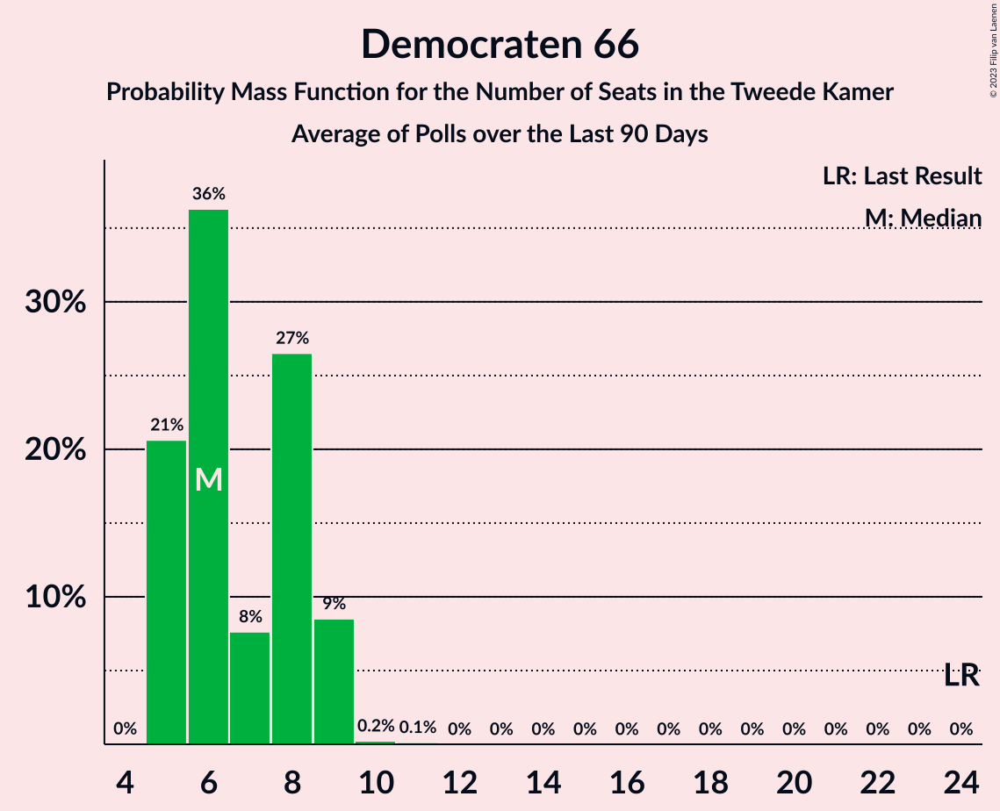

# Democraten 66

<a href="#voting-intentions">Voting Intentions</a> | <a href="#seats">Seats</a>

## Voting Intentions

Last result: **15.0%** (General Election of 17 March 2021)

### Confidence Intervals

| Period     | Polling firm/Commissioner(s) | Median | 80% Confidence Interval | 90% Confidence Interval | 95% Confidence Interval | 99% Confidence Interval |
|:----------:|:----------------:|:-----------:|:-----------------------:|:-----------------------:|:-----------------------:|:-----------------------:|
| N/A | [Poll Average](average.html) | 4.7% | 3.8–5.6% | 3.6–5.8% | 3.4–6.0% | 3.1–6.5% |
| [27–30 October 2023](2023-10-30-Ipsos.html) | Ipsos   EenVandaag | 5.2% | 4.6–6.0% | 4.5–6.2% | 4.3–6.3% | 4.1–6.7% |
| [27–28 October 2023](2023-10-28-Peilnl.html) | Peil.nl | 4.6% | 4.2–5.2% | 4.0–5.3% | 3.9–5.5% | 3.7–5.7% |
| [22–24 October 2023](2023-10-24-IOResearch.html) | I&O Research | 4.0% | 3.4–4.7% | 3.3–5.0% | 3.1–5.1% | 2.9–5.5% |
| [20–21 October 2023](2023-10-21-Peilnl.html) | Peil.nl | 4.6% | N/A | N/A | N/A | N/A |
| [13–16 October 2023](2023-10-16-Ipsos.html) | Ipsos   EenVandaag | 4.8% | 4.1–5.8% | 3.9–6.1% | 3.7–6.3% | 3.3–6.8% |
| [13–14 October 2023](2023-10-14-Peilnl.html) | Peil.nl | 4.6% | 4.2–5.2% | 4.0–5.3% | 3.9–5.5% | 3.7–5.7% |
| [6–9 October 2023](2023-10-09-IOResearch.html) | I&O Research | 3.9% | 3.4–4.5% | 3.3–4.6% | 3.2–4.8% | 2.9–5.0% |
| [6–7 October 2023](2023-10-07-Peilnl.html) | Peil.nl | 4.6% | N/A | N/A | N/A | N/A |
| [22–25 September 2023](2023-09-25-IOResearch.html) | I&O Research | 3.7% | 3.1–4.4% | 2.9–4.6% | 2.8–4.8% | 2.6–5.2% |
| [22–24 September 2023](2023-09-24-Ipsos.html) | Ipsos   EenVandaag | 6.1% | 5.2–7.1% | 5.0–7.5% | 4.8–7.7% | 4.4–8.3% |
| [22–23 September 2023](2023-09-23-Peilnl.html) | Peil.nl | 4.7% | 4.2–5.2% | 4.1–5.3% | 4.0–5.5% | 3.7–5.8% |
| [8–11 September 2023](2023-09-11-IOResearch.html) | I&O Research | 4.1% | 3.6–4.8% | 3.4–5.0% | 3.3–5.2% | 3.0–5.6% |
| [8–9 September 2023](2023-09-09-Peilnl.html) | Peil.nl | 4.6% | 4.2–5.2% | 4.0–5.3% | 3.9–5.5% | 3.7–5.7% |
| [1–4 September 2023](2023-09-04-Ipsos.html) | Ipsos   EenVandaag | 6.7% | 5.7–7.9% | 5.5–8.2% | 5.3–8.5% | 4.8–9.1% |
| [1–2 September 2023](2023-09-02-Peilnl.html) | Peil.nl | 4.6% | 4.2–5.2% | 4.0–5.3% | 3.9–5.5% | 3.7–5.7% |
| [25–26 August 2023](2023-08-26-Peilnl.html) | Peil.nl | 4.6% | 4.2–5.2% | 4.0–5.3% | 3.9–5.5% | 3.7–5.7% |
| [23–24 August 2023](2023-08-24-IOResearch.html) | I&O Research | 4.5% | 3.9–5.2% | 3.8–5.4% | 3.6–5.6% | 3.4–5.9% |
| [18–19 August 2023](2023-08-19-Peilnl.html) | Peil.nl | 5.3% | 4.8–5.9% | 4.7–6.0% | 4.5–6.2% | 4.3–6.4% |
| [21 August–24 July 2023](2023-07-24-Ipsos.html) | Ipsos   EenVandaag | 6.5% | 5.6–7.6% | 5.3–7.9% | 5.1–8.2% | 4.7–8.8% |
| [14–17 July 2023](2023-07-17-IOResearch.html) | I&O Research | 5.6% | 4.9–6.4% | 4.7–6.6% | 4.6–6.8% | 4.3–7.2% |
| [14–15 July 2023](2023-07-15-Peilnl.html) | Peil.nl | 6.0% | 5.4–6.6% | 5.3–6.7% | 5.2–6.9% | 4.9–7.2% |
| [30 June–1 July 2023](2023-07-01-Peilnl.html) | Peil.nl | 6.7% | 6.1–7.3% | 6.0–7.5% | 5.8–7.6% | 5.6–7.9% |
| [23–25 June 2023](2023-06-25-Ipsos.html) | Ipsos   EenVandaag | 7.7% | 6.8–8.9% | 6.5–9.3% | 6.2–9.5% | 5.8–10.1% |
| [16–17 June 2023](2023-06-17-Peilnl.html) | Peil.nl | 6.6% | 6.1–7.3% | 6.0–7.5% | 5.8–7.6% | 5.6–7.9% |
| [9–12 June 2023](2023-06-12-IOResearch.html) | I&O Research | 6.6% | 6.0–7.3% | 5.8–7.5% | 5.7–7.7% | 5.4–8.0% |
| [26–29 May 2023](2023-05-29-Ipsos.html) | Ipsos   EenVandaag | 7.3% | 6.3–8.4% | 6.1–8.7% | 5.8–9.0% | 5.4–9.6% |
| [19–20 May 2023](2023-05-20-Peilnl.html) | Peil.nl | 6.7% | 6.1–7.3% | 6.0–7.5% | 5.8–7.6% | 5.6–7.9% |
| [12–15 May 2023](2023-05-15-IOResearch.html) | I&O Research | 5.9% | 5.2–6.6% | 5.0–6.9% | 4.9–7.0% | 4.6–7.4% |
| [5–6 May 2023](2023-05-06-Peilnl.html) | Peil.nl | 6.7% | N/A | N/A | N/A | N/A |
| [24 April 2023](2023-04-24-Ipsos.html) | Ipsos   EenVandaag | 6.6% | 5.7–7.7% | 5.4–8.0% | 5.2–8.3% | 4.8–8.9% |
| [21–22 April 2023](2023-04-22-Peilnl.html) | Peil.nl | 6.7% | 6.1–7.3% | 6.0–7.5% | 5.8–7.6% | 5.6–7.9% |
| [14–17 April 2023](2023-04-17-IOResearch.html) | I&O Research | 6.2% | 5.6–6.9% | 5.4–7.1% | 5.3–7.3% | 5.0–7.6% |
| [31 March–1 April 2023](2023-04-01-Peilnl.html) | Peil.nl | 6.7% | 6.1–7.3% | 6.0–7.5% | 5.8–7.6% | 5.6–7.9% |
| [24–27 March 2023](2023-03-27-Ipsos.html) | Ipsos   EenVandaag | 7.7% | 6.7–8.9% | 6.4–9.2% | 6.2–9.5% | 5.7–10.1% |
| [23–24 March 2023](2023-03-24-Peilnl.html) | Peil.nl | 6.0% | 5.5–6.5% | 5.4–6.7% | 5.3–6.8% | 5.1–7.0% |
| [17–27 February 2023](2023-02-27-Ipsos.html) | Ipsos   EenVandaag | 9.4% | 8.9–9.9% | 8.7–10.1% | 8.6–10.2% | 8.4–10.5% |
| [24–25 February 2023](2023-02-25-Peilnl.html) | Peil.nl | 8.7% | 8.0–9.4% | 7.8–9.6% | 7.7–9.7% | 7.4–10.1% |
| [17–18 February 2023](2023-02-18-Peilnl.html) | Peil.nl | 8.0% | 7.4–8.7% | 7.2–8.9% | 7.1–9.0% | 6.8–9.4% |
| [13 February 2023](2023-02-13-IOResearch.html) | I&O Research | 7.6% | 7.0–8.4% | 6.8–8.6% | 6.6–8.7% | 6.4–9.1% |
| [10–11 February 2023](2023-02-11-Peilnl.html) | Peil.nl | 8.0% | N/A | N/A | N/A | N/A |
| [27–30 January 2023](2023-01-30-Ipsos.html) | Ipsos   EenVandaag | 9.8% | 8.7–11.1% | 8.4–11.5% | 8.1–11.8% | 7.6–12.4% |
| [13–16 January 2023](2023-01-16-IOResearch.html) | I&O Research | 8.1% | 7.4–8.8% | 7.2–9.0% | 7.1–9.2% | 6.8–9.6% |
| [13–14 January 2023](2023-01-14-Peilnl.html) | Peil.nl | 8.0% | 7.4–8.7% | 7.2–8.9% | 7.1–9.0% | 6.8–9.4% |
| [16–19 December 2022](2022-12-19-Ipsos.html) | Ipsos   EenVandaag | 8.6% | 7.6–9.8% | 7.3–10.2% | 7.0–10.5% | 6.6–11.1% |
| [16–17 December 2022](2022-12-17-Peilnl.html) | Peil.nl | 8.0% | 7.4–8.7% | 7.2–8.9% | 7.1–9.0% | 6.8–9.4% |
| [9–12 December 2022](2022-12-12-IOResearch.html) | I&O Research | 7.3% | 6.6–8.1% | 6.4–8.3% | 6.2–8.5% | 5.9–8.9% |
| [2–3 December 2022](2022-12-03-Peilnl.html) | Peil.nl | 7.3% | 6.8–8.0% | 6.6–8.2% | 6.4–8.3% | 6.2–8.6% |
| [25–28 November 2022](2022-11-28-Ipsos.html) | Ipsos   EenVandaag | 10.9% | 9.7–12.2% | 9.4–12.6% | 9.1–12.9% | 8.6–13.6% |
| [25–26 November 2022](2022-11-26-Peilnl.html) | Peil.nl | 8.0% | 7.4–8.7% | 7.2–8.9% | 7.1–9.0% | 6.8–9.4% |
| [11–14 November 2022](2022-11-14-IOResearch.html) | I&O Research | 7.8% | 7.1–8.6% | 6.9–8.8% | 6.7–9.0% | 6.4–9.4% |
| [11–12 November 2022](2022-11-12-Peilnl.html) | Peil.nl | 8.0% | 7.4–8.7% | 7.2–8.9% | 7.1–9.0% | 6.8–9.4% |
| [21–24 October 2022](2022-10-24-Ipsos.html) | Ipsos   EenVandaag | 10.3% | 9.1–11.6% | 8.8–12.0% | 8.6–12.3% | 8.0–13.0% |
| [22–23 October 2022](2022-10-23-Peilnl.html) | Peil.nl | 8.0% | 7.4–8.7% | 7.2–8.9% | 7.1–9.0% | 6.8–9.4% |
| [14–17 October 2022](2022-10-17-IOResearch.html) | I&O Research | 8.0% | 7.3–8.8% | 7.1–9.1% | 7.0–9.2% | 6.6–9.6% |
| [14–15 October 2022](2022-10-15-Peilnl.html) | Peil.nl | 8.0% | 7.4–8.7% | 7.2–8.9% | 7.1–9.0% | 6.8–9.4% |
| [23–26 September 2022](2022-09-26-Ipsos.html) | Ipsos   EenVandaag | 10.0% | 8.8–11.3% | 8.5–11.7% | 8.3–12.0% | 7.8–12.7% |
| [23–24 September 2022](2022-09-24-Peilnl.html) | Peil.nl | 7.3% | 6.8–8.0% | 6.6–8.2% | 6.4–8.3% | 6.2–8.6% |
| [9–12 September 2022](2022-09-12-IOResearch.html) | I&O Research | 9.6% | 8.8–10.6% | 8.5–10.8% | 8.3–11.1% | 7.9–11.6% |
| [26–29 August 2022](2022-08-29-Ipsos.html) | Ipsos   EenVandaag | 11.3% | 10.1–12.7% | 9.8–13.1% | 9.5–13.4% | 9.0–14.1% |
| [26–27 August 2022](2022-08-27-Peilnl.html) | Peil.nl | 8.0% | 7.4–8.7% | 7.3–8.9% | 7.1–9.1% | 6.8–9.4% |
| [5–6 August 2022](2022-08-06-Peilnl.html) | Peil.nl | 8.7% | 8.0–9.4% | 7.8–9.6% | 7.7–9.7% | 7.4–10.1% |
| [22–25 July 2022](2022-07-25-Ipsos.html) | Ipsos   EenVandaag | 11.0% | 9.8–12.4% | 9.5–12.8% | 9.2–13.1% | 8.7–13.8% |
| [15–18 July 2022](2022-07-18-IOResearch.html) | I&O Research | 8.7% | 7.9–9.6% | 7.7–9.8% | 7.5–10.0% | 7.2–10.5% |
| [8–9 July 2022](2022-07-09-Peilnl.html) | Peil.nl | 8.7% | 8.0–9.4% | 7.8–9.6% | 7.7–9.7% | 7.4–10.1% |
| [24–27 June 2022](2022-06-27-Ipsos.html) | Ipsos   EenVandaag | 10.0% | 8.9–11.3% | 8.6–11.7% | 8.3–12.0% | 7.8–12.7% |
| [24–25 June 2022](2022-06-25-Peilnl.html) | Peil.nl | 8.0% | 7.4–8.7% | 7.2–8.9% | 7.1–9.0% | 6.8–9.4% |
| [17–18 June 2022](2022-06-18-Peilnl.html) | Peil.nl | 7.3% | 6.8–8.0% | 6.6–8.2% | 6.4–8.3% | 6.2–8.6% |
| [10–13 June 2022](2022-06-13-IOResearch.html) | I&O Research | 8.7% | 7.9–9.6% | 7.7–9.8% | 7.5–10.1% | 7.2–10.5% |
| [10–11 June 2022](2022-06-11-Peilnl.html) | Peil.nl | 8.0% | 7.4–8.7% | 7.2–8.9% | 7.1–9.0% | 6.8–9.4% |
| [27–30 May 2022](2022-05-30-Ipsos.html) | Ipsos   EenVandaag | 9.2% | N/A | N/A | N/A | N/A |
| [27–28 May 2022](2022-05-28-Peilnl.html) | Peil.nl | 8.7% | N/A | N/A | N/A | N/A |
| [25–27 May 2022](2022-05-27-Kantar.html) | Kantar | 8.0% | 7.0–9.1% | 6.7–9.5% | 6.5–9.8% | 6.1–10.3% |
| [13–16 May 2022](2022-05-16-IOResearch.html) | I&O Research | 8.3% | 7.5–9.3% | 7.3–9.5% | 7.1–9.8% | 6.7–10.2% |
| [13–14 May 2022](2022-05-14-Peilnl.html) | Peil.nl | 8.7% | 8.0–9.4% | 7.8–9.6% | 7.7–9.7% | 7.4–10.1% |
| [22–25 April 2022](2022-04-25-Ipsos.html) | Ipsos   EenVandaag | 9.1% | 8.0–10.3% | 7.7–10.7% | 7.5–11.0% | 7.0–11.6% |
| [22–23 April 2022](2022-04-23-Peilnl.html) | Peil.nl | 9.3% | 8.7–10.1% | 8.5–10.3% | 8.3–10.4% | 8.0–10.8% |
| [8–11 April 2022](2022-04-11-IOResearch.html) | I&O Research | 11.0% | 10.2–11.9% | 9.9–12.1% | 9.7–12.4% | 9.4–12.8% |
| [8–9 April 2022](2022-04-09-Peilnl.html) | Peil.nl | 12.0% | 11.2–12.8% | 11.0–13.0% | 10.9–13.2% | 10.5–13.6% |
| [1–2 April 2022](2022-04-02-Peilnl.html) | Peil.nl | 12.0% | N/A | N/A | N/A | N/A |
| [25–27 March 2022](2022-03-27-Ipsos.html) | Ipsos   EenVandaag | 12.2% | 11.0–13.6% | 10.7–14.0% | 10.4–14.3% | 9.8–15.0% |
| [25–26 March 2022](2022-03-26-Peilnl.html) | Peil.nl | 12.0% | 11.2–12.8% | 11.0–13.0% | 10.9–13.2% | 10.5–13.6% |
| [18–19 March 2022](2022-03-19-Peilnl.html) | Peil.nl | 12.0% | 11.2–12.8% | 11.0–13.0% | 10.9–13.2% | 10.5–13.6% |
| [11–12 March 2022](2022-03-12-Peilnl.html) | Peil.nl | 13.3% | N/A | N/A | N/A | N/A |
| [9–11 March 2022](2022-03-11-Kantar.html) | Kantar | 13.0% | N/A | N/A | N/A | N/A |
| [4–5 March 2022](2022-03-05-Peilnl.html) | Peil.nl | 13.3% | 12.5–14.1% | 12.3–14.4% | 12.1–14.6% | 11.8–15.0% |
| [25–28 February 2022](2022-02-28-Ipsos.html) | Ipsos   EenVandaag | 12.8% | 11.5–14.2% | 11.2–14.6% | 10.9–15.0% | 10.3–15.7% |
| [26–27 February 2022](2022-02-27-Peilnl.html) | Peil.nl | 13.3% | 12.5–14.1% | 12.3–14.4% | 12.1–14.6% | 11.8–15.0% |
| [18–19 February 2022](2022-02-19-Peilnl.html) | Peil.nl | 13.3% | 12.5–14.1% | 12.3–14.4% | 12.1–14.6% | 11.8–15.0% |
| [11–14 February 2022](2022-02-14-IOResearch.html) | I&O Research | 11.9% | 11.1–12.8% | 10.9–13.1% | 10.7–13.3% | 10.3–13.8% |
| [11–12 February 2022](2022-02-12-Peilnl.html) | Peil.nl | 12.6% | 11.9–13.4% | 11.7–13.7% | 11.5–13.9% | 11.1–14.3% |
| [4–5 February 2022](2022-02-05-Peilnl.html) | Peil.nl | 12.6% | N/A | N/A | N/A | N/A |
| [27–31 January 2022](2022-01-31-Kantar.html) | Kantar | 12.6% | 11.4–14.1% | 11.0–14.5% | 10.7–14.9% | 10.2–15.6% |
| [28–29 January 2022](2022-01-29-Peilnl.html) | Peil.nl | 12.6% | 11.9–13.4% | 11.7–13.7% | 11.5–13.9% | 11.1–14.3% |
| [21–24 January 2022](2022-01-24-Ipsos.html) | Ipsos   EenVandaag | 11.8% | 10.6–13.2% | 10.3–13.6% | 10.0–13.9% | 9.4–14.6% |
| [21–22 January 2022](2022-01-22-Peilnl.html) | Peil.nl | 12.0% | 11.2–12.8% | 11.0–13.0% | 10.9–13.2% | 10.5–13.6% |
| [14–17 January 2022](2022-01-17-IOResearch.html) | I&O Research | 11.3% | 10.5–12.3% | 10.3–12.5% | 10.1–12.7% | 9.7–13.2% |
| [14–15 January 2022](2022-01-15-Peilnl.html) | Peil.nl | 12.6% | N/A | N/A | N/A | N/A |
| [24–25 December 2021](2021-12-25-Peilnl.html) | Peil.nl | 12.0% | 11.2–12.8% | 11.0–13.0% | 10.9–13.2% | 10.5–13.6% |
| [15–20 December 2021](2021-12-20-Kantar.html) | Kantar | 9.8% | 8.6–11.1% | 8.3–11.4% | 8.1–11.8% | 7.6–12.4% |
| [17–20 December 2021](2021-12-20-Ipsos.html) | Ipsos   EenVandaag | 13.1% | 11.8–14.6% | 11.5–15.0% | 11.2–15.3% | 10.6–16.1% |
| [17–18 December 2021](2021-12-18-Peilnl.html) | Peil.nl | 12.0% | 11.2–12.8% | 11.0–13.0% | 10.9–13.2% | 10.5–13.6% |
| [12 December 2021](2021-12-12-Peilnl.html) | Peil.nl | 11.3% | 10.6–12.1% | 10.4–12.3% | 10.2–12.5% | 9.9–12.9% |
| [3–6 December 2021](2021-12-06-IOResearch.html) | I&O Research | 11.3% | 10.4–12.3% | 10.2–12.5% | 10.0–12.8% | 9.6–13.2% |
| [3–5 December 2021](2021-12-05-Peilnl.html) | Peil.nl | 10.6% | 9.9–11.4% | 9.7–11.6% | 9.6–11.8% | 9.3–12.2% |
| [26–29 November 2021](2021-11-29-Ipsos.html) | Ipsos   EenVandaag | 12.8% | 11.5–14.3% | 11.2–14.6% | 10.9–15.0% | 10.3–15.7% |
| [26–27 November 2021](2021-11-27-Peilnl.html) | Peil.nl | 10.6% | 9.9–11.4% | 9.7–11.6% | 9.6–11.8% | 9.3–12.2% |
| [19–20 November 2021](2021-11-20-Peilnl.html) | Peil.nl | 10.6% | 9.9–11.4% | 9.7–11.6% | 9.6–11.8% | 9.3–12.2% |
| [12–15 November 2021](2021-11-15-IOResearch.html) | I&O Research | 9.3% | 8.5–10.2% | 8.3–10.4% | 8.1–10.7% | 7.7–11.1% |
| [5–9 November 2021](2021-11-09-Kantar.html) | Kantar | 13.0% | 11.8–14.6% | 11.4–15.0% | 11.1–15.3% | 10.5–16.1% |
| [7 November 2021](2021-11-07-Peilnl.html) | Peil.nl | 12.0% | N/A | N/A | N/A | N/A |
| [29–30 October 2021](2021-10-30-Peilnl.html) | Peil.nl | 12.0% | N/A | N/A | N/A | N/A |
| [22–25 October 2021](2021-10-25-Ipsos.html) | Ipsos   EenVandaag | 12.0% | 10.8–13.4% | 10.4–13.8% | 10.1–14.1% | 9.6–14.8% |
| [15–16 October 2021](2021-10-16-Peilnl.html) | Peil.nl | 11.3% | N/A | N/A | N/A | N/A |
| [8–11 October 2021](2021-10-11-IOResearch.html) | I&O Research | 9.3% | N/A | N/A | N/A | N/A |
| [8–9 October 2021](2021-10-09-Peilnl.html) | Peil.nl | 11.3% | N/A | N/A | N/A | N/A |
| [1–2 October 2021](2021-10-02-Peilnl.html) | Peil.nl | 11.3% | N/A | N/A | N/A | N/A |
| [24–27 September 2021](2021-09-27-Ipsos.html) | Ipsos | 12.1% | N/A | N/A | N/A | N/A |
| [24–25 September 2021](2021-09-25-Peilnl.html) | Peil.nl | 12.6% | N/A | N/A | N/A | N/A |
| [17–20 September 2021](2021-09-20-Kantar.html) | Kantar | 13.3% | N/A | N/A | N/A | N/A |
| [17–18 September 2021](2021-09-18-Peilnl.html) | Peil.nl | 13.3% | N/A | N/A | N/A | N/A |
| [10–13 September 2021](2021-09-13-IOResearch.html) | I&O Research | 11.8% | N/A | N/A | N/A | N/A |
| [10–11 September 2021](2021-09-11-Peilnl.html) | Peil.nl | 12.6% | N/A | N/A | N/A | N/A |
| [3–4 September 2021](2021-09-04-Peilnl.html) | Peil.nl | 12.0% | N/A | N/A | N/A | N/A |
| [27–30 August 2021](2021-08-30-Ipsos.html) | Ipsos   EenVandaag | 13.5% | N/A | N/A | N/A | N/A |
| [20–21 August 2021](2021-08-21-Peilnl.html) | Peil.nl | 12.6% | N/A | N/A | N/A | N/A |
| [23–26 July 2021](2021-07-26-Ipsos.html) | Ipsos   EenVandaag | 13.7% | 12.4–15.2% | 12.1–15.7% | 11.8–16.0% | 11.1–16.8% |
| [23–24 July 2021](2021-07-24-Peilnl.html) | Peil.nl | 14.6% | 13.8–15.5% | 13.6–15.7% | 13.4–16.0% | 13.0–16.4% |
| [9–12 July 2021](2021-07-12-IOResearch.html) | I&O Research | 13.7% | 12.8–14.7% | 12.5–15.0% | 12.3–15.3% | 11.9–15.7% |
| [25–28 June 2021](2021-06-28-Ipsos.html) | Ipsos   EenVandaag | 14.2% | 12.9–15.7% | 12.5–16.2% | 12.2–16.5% | 11.6–17.3% |
| [27 June 2021](2021-06-27-Peilnl.html) | Peil.nl | 14.6% | 13.8–15.5% | 13.6–15.7% | 13.4–16.0% | 13.0–16.4% |
| [20 June 2021](2021-06-20-Peilnl.html) | Peil.nl | 14.6% | 13.8–15.5% | 13.6–15.7% | 13.4–16.0% | 13.0–16.4% |
| [12 June 2021](2021-06-12-Peilnl.html) | Peil.nl | 14.6% | 13.8–15.5% | 13.6–15.7% | 13.4–16.0% | 13.0–16.4% |
| [4–7 June 2021](2021-06-07-IOResearch.html) | I&O Research | 13.5% | 12.5–14.6% | 12.2–14.9% | 12.0–15.1% | 11.5–15.7% |
| [4–5 June 2021](2021-06-05-Peilnl.html) | Peil.nl | 14.6% | 13.8–15.5% | 13.6–15.7% | 13.4–16.0% | 13.0–16.4% |
| [28–29 May 2021](2021-05-29-Peilnl.html) | Peil.nl | 15.3% | 14.4–16.1% | 14.2–16.4% | 14.0–16.6% | 13.6–17.0% |
| [21–23 May 2021](2021-05-23-Ipsos.html) | Ipsos   EenVandaag | 15.9% | 14.5–17.5% | 14.1–18.0% | 13.8–18.3% | 13.2–19.1% |
| [21–22 May 2021](2021-05-22-Peilnl.html) | Peil.nl | 15.3% | 14.4–16.1% | 14.2–16.4% | 14.0–16.6% | 13.6–17.0% |
| [14–15 May 2021](2021-05-15-Peilnl.html) | Peil.nl | 15.3% | 14.4–16.1% | 14.2–16.4% | 14.0–16.6% | 13.6–17.0% |
| [7–9 May 2021](2021-05-09-Peilnl.html) | Peil.nl | 15.3% | 14.4–16.1% | 14.2–16.4% | 14.0–16.6% | 13.6–17.0% |
| [30 April–3 May 2021](2021-05-03-IOResearch.html) | I&O Research | 14.3% | 13.4–15.5% | 13.1–15.8% | 12.9–16.0% | 12.4–16.6% |
| [30 April–1 May 2021](2021-05-01-Peilnl.html) | Peil.nl | 14.6% | 13.8–15.5% | 13.6–15.7% | 13.4–16.0% | 13.0–16.4% |
| [23–24 April 2021](2021-04-24-Peilnl.html) | Peil.nl | 14.6% | 13.8–15.5% | 13.6–15.7% | 13.4–16.0% | 13.0–16.4% |
| [16–19 April 2021](2021-04-19-Ipsos.html) | Ipsos | 16.7% | 15.2–18.3% | 14.8–18.7% | 14.5–19.1% | 13.8–19.9% |
| [16–17 April 2021](2021-04-17-Peilnl.html) | Peil.nl | 15.9% | 15.1–16.8% | 14.9–17.1% | 14.7–17.3% | 14.3–17.7% |
| [9–12 April 2021](2021-04-12-IOResearch.html) | I&O Research | 16.5% | 15.5–17.6% | 15.2–17.9% | 15.0–18.2% | 14.5–18.7% |
| [9–10 April 2021](2021-04-10-Peilnl.html) | Peil.nl | 16.0% | 15.1–16.9% | 14.9–17.1% | 14.7–17.3% | 14.3–17.8% |
| [3–4 April 2021](2021-04-04-Peilnl.html) | Peil.nl | 16.6% | 15.8–17.5% | 15.5–17.8% | 15.3–18.0% | 14.9–18.5% |
| [26–27 March 2021](2021-03-27-Peilnl.html) | Peil.nl | 16.0% | 15.1–16.9% | 14.9–17.1% | 14.7–17.3% | 14.3–17.8% |

### Probability Mass Function

The following table shows the probability mass function per percentage block of voting intentions for the [poll average](average.html) for Democraten 66.

| Voting Intentions | Probability | Accumulated | Special Marks |
|:-----------------:|:-----------:|:-----------:|:-------------:|
| 1.5–2.5% | 0% | 100% |  |
| 2.5–3.5% | 5% | 100% |  |
| 3.5–4.5% | 38% | 95% |  |
| 4.5–5.5% | 46% | 57% | Median |
| 5.5–6.5% | 10% | 11% |  |
| 6.5–7.5% | 0.3% | 0.3% |  |
| 7.5–8.5% | 0% | 0% |  |
| 8.5–9.5% | 0% | 0% |  |
| 9.5–10.5% | 0% | 0% |  |
| 10.5–11.5% | 0% | 0% |  |
| 11.5–12.5% | 0% | 0% |  |
| 12.5–13.5% | 0% | 0% |  |
| 13.5–14.5% | 0% | 0% |  |
| 14.5–15.5% | 0% | 0% | Last Result |

## Seats

Last result: **24** seats (General Election of 17 March 2021)

### Confidence Intervals

| Period     | Polling firm/Commissioner(s) | Median | 80% Confidence Interval | 90% Confidence Interval | 95% Confidence Interval | 99% Confidence Interval |
|:----------:|:----------------:|:------:|:-----------------------:|:-----------------------:|:-----------------------:|:-----------------------:|
| N/A | [Poll Average](average.html) | 7 | 6–8 | 6–8 | 5–9 | 5–9 |
| [27–30 October 2023](2023-10-30-Ipsos.html) | Ipsos   EenVandaag | 8 | 6–9 | 6–9 | 5–9 | 5–10 |
| [27–28 October 2023](2023-10-28-Peilnl.html) | Peil.nl | 7 | 7 | 7–8 | 6–9 | 5–9 |
| [22–24 October 2023](2023-10-24-IOResearch.html) | I&O Research | 6 | 6 | 6 | 5–7 | 5–7 |
| [20–21 October 2023](2023-10-21-Peilnl.html) | Peil.nl |  |  |  |  |  |
| [13–16 October 2023](2023-10-16-Ipsos.html) | Ipsos   EenVandaag | 8 | 8 | 8 | 8 | 8 |
| [13–14 October 2023](2023-10-14-Peilnl.html) | Peil.nl | 8 | 8 | 8 | 8 | 7–8 |
| [6–9 October 2023](2023-10-09-IOResearch.html) | I&O Research | 6 | 5–7 | 5–7 | 5–7 | 4–7 |
| [6–7 October 2023](2023-10-07-Peilnl.html) | Peil.nl |  |  |  |  |  |
| [22–25 September 2023](2023-09-25-IOResearch.html) | I&O Research | 5 | 4–5 | 4–5 | 3–6 | 3–7 |
| [22–24 September 2023](2023-09-24-Ipsos.html) | Ipsos   EenVandaag | 10 | 10 | 9–11 | 8–11 | 7–13 |
| [22–23 September 2023](2023-09-23-Peilnl.html) | Peil.nl | 7 | 7 | 7 | 7 | 6–8 |
| [8–11 September 2023](2023-09-11-IOResearch.html) | I&O Research | 5 | 5–7 | 5–7 | 5–7 | 5–7 |
| [8–9 September 2023](2023-09-09-Peilnl.html) | Peil.nl | 7 | 6–8 | 6–8 | 6–9 | 5–9 |
| [1–4 September 2023](2023-09-04-Ipsos.html) | Ipsos   EenVandaag | 9 | 9–11 | 9–11 | 8–11 | 7–15 |
| [1–2 September 2023](2023-09-02-Peilnl.html) | Peil.nl | 8 | 7–8 | 7–8 | 6–8 | 5–9 |
| [25–26 August 2023](2023-08-26-Peilnl.html) | Peil.nl | 7 | 7–9 | 7–9 | 6–9 | 6–9 |
| [23–24 August 2023](2023-08-24-IOResearch.html) | I&O Research | 7 | 6–8 | 6–9 | 6–9 | 5–10 |
| [18–19 August 2023](2023-08-19-Peilnl.html) | Peil.nl | 8 | 8 | 7–8 | 7–8 | 6–10 |
| [21 August–24 July 2023](2023-07-24-Ipsos.html) | Ipsos   EenVandaag | 10 | 10 | 10–11 | 9–11 | 8–12 |
| [14–17 July 2023](2023-07-17-IOResearch.html) | I&O Research | 7 | 7–8 | 7–8 | 7–11 | 7–11 |
| [14–15 July 2023](2023-07-15-Peilnl.html) | Peil.nl | 10 | 10 | 9–10 | 8–10 | 8–11 |
| [30 June–1 July 2023](2023-07-01-Peilnl.html) | Peil.nl | 9 | 9–11 | 9–11 | 8–11 | 8–11 |
| [23–25 June 2023](2023-06-25-Ipsos.html) | Ipsos   EenVandaag | 12 | 11–12 | 10–13 | 9–14 | 9–16 |
| [16–17 June 2023](2023-06-17-Peilnl.html) | Peil.nl | 8 | 8–10 | 8–10 | 8–11 | 8–12 |
| [9–12 June 2023](2023-06-12-IOResearch.html) | I&O Research | 11 | 10–11 | 10–11 | 9–11 | 8–12 |
| [26–29 May 2023](2023-05-29-Ipsos.html) | Ipsos   EenVandaag | 11 | 9–14 | 9–14 | 9–14 | 7–15 |
| [19–20 May 2023](2023-05-20-Peilnl.html) | Peil.nl | 11 | 9–11 | 9–11 | 9–11 | 9–12 |
| [12–15 May 2023](2023-05-15-IOResearch.html) | I&O Research | 9 | 8–10 | 8–10 | 8–10 | 6–11 |
| [5–6 May 2023](2023-05-06-Peilnl.html) | Peil.nl |  |  |  |  |  |
| [24 April 2023](2023-04-24-Ipsos.html) | Ipsos   EenVandaag | 11 | 8–11 | 8–11 | 8–11 | 8–11 |
| [21–22 April 2023](2023-04-22-Peilnl.html) | Peil.nl | 10 | 9–10 | 9–10 | 9–10 | 9–12 |
| [14–17 April 2023](2023-04-17-IOResearch.html) | I&O Research | 9 | 8–11 | 8–12 | 7–12 | 7–12 |
| [31 March–1 April 2023](2023-04-01-Peilnl.html) | Peil.nl | 10 | 10 | 10 | 10 | 10 |
| [24–27 March 2023](2023-03-27-Ipsos.html) | Ipsos   EenVandaag | 9 | 9–13 | 9–13 | 9–13 | 9–13 |
| [23–24 March 2023](2023-03-24-Peilnl.html) | Peil.nl | 9 | 9–10 | 9–10 | 8–10 | 8–10 |
| [17–27 February 2023](2023-02-27-Ipsos.html) | Ipsos   EenVandaag | 14 | 13–15 | 13–15 | 13–16 | 13–16 |
| [24–25 February 2023](2023-02-25-Peilnl.html) | Peil.nl | 11 | 11–13 | 11–14 | 11–14 | 11–15 |
| [17–18 February 2023](2023-02-18-Peilnl.html) | Peil.nl | 11 | 11–14 | 10–14 | 10–14 | 10–14 |
| [13 February 2023](2023-02-13-IOResearch.html) | I&O Research | 13 | 10–13 | 10–13 | 10–13 | 9–14 |
| [10–11 February 2023](2023-02-11-Peilnl.html) | Peil.nl |  |  |  |  |  |
| [27–30 January 2023](2023-01-30-Ipsos.html) | Ipsos   EenVandaag | 15 | 13–15 | 13–15 | 12–15 | 12–17 |
| [13–16 January 2023](2023-01-16-IOResearch.html) | I&O Research | 13 | 11–13 | 11–13 | 11–14 | 11–14 |
| [13–14 January 2023](2023-01-14-Peilnl.html) | Peil.nl | 10 | 10 | 10–12 | 10–13 | 10–14 |
| [16–19 December 2022](2022-12-19-Ipsos.html) | Ipsos   EenVandaag | 14 | 14 | 14 | 14 | 13–14 |
| [16–17 December 2022](2022-12-17-Peilnl.html) | Peil.nl | 12 | 12 | 12 | 12 | 12 |
| [9–12 December 2022](2022-12-12-IOResearch.html) | I&O Research | 11 | 11 | 11 | 11 | 11 |
| [2–3 December 2022](2022-12-03-Peilnl.html) | Peil.nl | 11 | 11–12 | 11–13 | 11–13 | 11–13 |
| [25–28 November 2022](2022-11-28-Ipsos.html) | Ipsos   EenVandaag | 17 | 14–18 | 14–18 | 14–19 | 13–21 |
| [25–26 November 2022](2022-11-26-Peilnl.html) | Peil.nl | 12 | 12 | 12 | 12–13 | 12–13 |
| [11–14 November 2022](2022-11-14-IOResearch.html) | I&O Research | 12 | 11–12 | 11–12 | 10–13 | 10–14 |
| [11–12 November 2022](2022-11-12-Peilnl.html) | Peil.nl | 12 | 12 | 12 | 12–13 | 12–13 |
| [21–24 October 2022](2022-10-24-Ipsos.html) | Ipsos   EenVandaag | 16 | 15–17 | 14–17 | 13–18 | 13–22 |
| [22–23 October 2022](2022-10-23-Peilnl.html) | Peil.nl | 11 | 11 | 11–12 | 11–12 | 11–12 |
| [14–17 October 2022](2022-10-17-IOResearch.html) | I&O Research | 11 | 11–12 | 11–12 | 11–12 | 11–14 |
| [14–15 October 2022](2022-10-15-Peilnl.html) | Peil.nl | 14 | 11–14 | 11–14 | 11–14 | 11–14 |
| [23–26 September 2022](2022-09-26-Ipsos.html) | Ipsos   EenVandaag | 15 | 12–16 | 12–17 | 12–17 | 11–18 |
| [23–24 September 2022](2022-09-24-Peilnl.html) | Peil.nl | 11 | 11–13 | 11–13 | 11–13 | 9–13 |
| [9–12 September 2022](2022-09-12-IOResearch.html) | I&O Research | 14 | 14–15 | 13–16 | 12–17 | 12–18 |
| [26–29 August 2022](2022-08-29-Ipsos.html) | Ipsos   EenVandaag | 19 | 15–20 | 15–21 | 14–23 | 14–25 |
| [26–27 August 2022](2022-08-27-Peilnl.html) | Peil.nl | 12 | 11–14 | 11–14 | 10–14 | 10–14 |
| [5–6 August 2022](2022-08-06-Peilnl.html) | Peil.nl | 13 | 13–14 | 12–15 | 12–16 | 11–16 |
| [22–25 July 2022](2022-07-25-Ipsos.html) | Ipsos   EenVandaag | 17 | 16–17 | 16–18 | 14–20 | 14–20 |
| [15–18 July 2022](2022-07-18-IOResearch.html) | I&O Research | 15 | 13–15 | 11–15 | 11–15 | 10–16 |
| [8–9 July 2022](2022-07-09-Peilnl.html) | Peil.nl | 15 | 11–15 | 11–15 | 11–15 | 11–15 |
| [24–27 June 2022](2022-06-27-Ipsos.html) | Ipsos   EenVandaag | 15 | 13–19 | 13–19 | 13–19 | 13–19 |
| [24–25 June 2022](2022-06-25-Peilnl.html) | Peil.nl | 13 | 13 | 12–13 | 12–13 | 12–14 |
| [17–18 June 2022](2022-06-18-Peilnl.html) | Peil.nl | 11 | 11 | 11 | 11 | 11 |
| [10–13 June 2022](2022-06-13-IOResearch.html) | I&O Research | 14 | 12–15 | 12–15 | 11–17 | 11–17 |
| [10–11 June 2022](2022-06-11-Peilnl.html) | Peil.nl | 13 | 13 | 13 | 13 | 13 |
| [27–30 May 2022](2022-05-30-Ipsos.html) | Ipsos   EenVandaag |  |  |  |  |  |
| [27–28 May 2022](2022-05-28-Peilnl.html) | Peil.nl |  |  |  |  |  |
| [25–27 May 2022](2022-05-27-Kantar.html) | Kantar | 9 | 9–14 | 9–14 | 9–15 | 9–15 |
| [13–16 May 2022](2022-05-16-IOResearch.html) | I&O Research | 11 | 11–16 | 11–16 | 11–16 | 10–16 |
| [13–14 May 2022](2022-05-14-Peilnl.html) | Peil.nl | 14 | 13–16 | 12–16 | 12–16 | 11–16 |
| [22–25 April 2022](2022-04-25-Ipsos.html) | Ipsos   EenVandaag | 15 | 13–16 | 12–18 | 12–18 | 11–18 |
| [22–23 April 2022](2022-04-23-Peilnl.html) | Peil.nl | 11 | 11–15 | 11–15 | 11–15 | 11–15 |
| [8–11 April 2022](2022-04-11-IOResearch.html) | I&O Research | 17 | 15–20 | 15–20 | 15–20 | 14–20 |
| [8–9 April 2022](2022-04-09-Peilnl.html) | Peil.nl | 19 | 19 | 17–19 | 16–21 | 16–21 |
| [1–2 April 2022](2022-04-02-Peilnl.html) | Peil.nl |  |  |  |  |  |
| [25–27 March 2022](2022-03-27-Ipsos.html) | Ipsos   EenVandaag | 16 | 16–21 | 16–24 | 16–24 | 15–24 |
| [25–26 March 2022](2022-03-26-Peilnl.html) | Peil.nl | 18 | 17–19 | 17–19 | 17–19 | 17–20 |
| [18–19 March 2022](2022-03-19-Peilnl.html) | Peil.nl | 18 | 17–19 | 17–19 | 17–19 | 17–20 |
| [11–12 March 2022](2022-03-12-Peilnl.html) | Peil.nl |  |  |  |  |  |
| [9–11 March 2022](2022-03-11-Kantar.html) | Kantar |  |  |  |  |  |
| [4–5 March 2022](2022-03-05-Peilnl.html) | Peil.nl | 21 | 20–22 | 19–22 | 19–22 | 18–23 |
| [25–28 February 2022](2022-02-28-Ipsos.html) | Ipsos   EenVandaag | 18 | 18–21 | 16–22 | 16–22 | 15–24 |
| [26–27 February 2022](2022-02-27-Peilnl.html) | Peil.nl | 20 | 20 | 20 | 20 | 19–21 |
| [18–19 February 2022](2022-02-19-Peilnl.html) | Peil.nl | 21 | 19–21 | 19–21 | 19–21 | 17–22 |
| [11–14 February 2022](2022-02-14-IOResearch.html) | I&O Research | 19 | 19 | 19 | 19 | 15–20 |
| [11–12 February 2022](2022-02-12-Peilnl.html) | Peil.nl | 19 | 19 | 19 | 19 | 19 |
| [4–5 February 2022](2022-02-05-Peilnl.html) | Peil.nl |  |  |  |  |  |
| [27–31 January 2022](2022-01-31-Kantar.html) | Kantar | 20 | 18–22 | 16–23 | 16–23 | 14–24 |
| [28–29 January 2022](2022-01-29-Peilnl.html) | Peil.nl | 19 | 19 | 19 | 19 | 19 |
| [21–24 January 2022](2022-01-24-Ipsos.html) | Ipsos   EenVandaag | 17 | 17–20 | 16–20 | 15–20 | 14–21 |
| [21–22 January 2022](2022-01-22-Peilnl.html) | Peil.nl | 18 | 18 | 18–19 | 18–19 | 18–20 |
| [14–17 January 2022](2022-01-17-IOResearch.html) | I&O Research | 18 | 15–18 | 15–18 | 15–18 | 15–18 |
| [14–15 January 2022](2022-01-15-Peilnl.html) | Peil.nl |  |  |  |  |  |
| [24–25 December 2021](2021-12-25-Peilnl.html) | Peil.nl | 20 | 19–20 | 19–20 | 19–20 | 18–20 |
| [15–20 December 2021](2021-12-20-Kantar.html) | Kantar | 17 | 14–17 | 14–19 | 14–19 | 12–19 |
| [17–20 December 2021](2021-12-20-Ipsos.html) | Ipsos   EenVandaag | 18 | 17–22 | 17–22 | 17–22 | 17–23 |
| [17–18 December 2021](2021-12-18-Peilnl.html) | Peil.nl | 20 | 19–20 | 19–20 | 19–20 | 18–20 |
| [12 December 2021](2021-12-12-Peilnl.html) | Peil.nl | 19 | 17–19 | 17–19 | 16–19 | 16–19 |
| [3–6 December 2021](2021-12-06-IOResearch.html) | I&O Research | 16 | 16–18 | 16–20 | 15–20 | 14–21 |
| [3–5 December 2021](2021-12-05-Peilnl.html) | Peil.nl | 18 | 15–18 | 14–18 | 14–19 | 14–19 |
| [26–29 November 2021](2021-11-29-Ipsos.html) | Ipsos   EenVandaag | 19 | 19–20 | 16–21 | 16–21 | 16–22 |
| [26–27 November 2021](2021-11-27-Peilnl.html) | Peil.nl | 18 | 15–18 | 14–18 | 14–19 | 14–19 |
| [19–20 November 2021](2021-11-20-Peilnl.html) | Peil.nl | 18 | 15–18 | 14–18 | 14–19 | 14–19 |
| [12–15 November 2021](2021-11-15-IOResearch.html) | I&O Research | 15 | 12–16 | 12–16 | 12–16 | 12–16 |
| [5–9 November 2021](2021-11-09-Kantar.html) | Kantar | 20 | 17–23 | 17–23 | 17–23 | 17–25 |
| [7 November 2021](2021-11-07-Peilnl.html) | Peil.nl |  |  |  |  |  |
| [29–30 October 2021](2021-10-30-Peilnl.html) | Peil.nl |  |  |  |  |  |
| [22–25 October 2021](2021-10-25-Ipsos.html) | Ipsos   EenVandaag | 16 | 16–19 | 16–19 | 15–20 | 14–22 |
| [15–16 October 2021](2021-10-16-Peilnl.html) | Peil.nl |  |  |  |  |  |
| [8–11 October 2021](2021-10-11-IOResearch.html) | I&O Research |  |  |  |  |  |
| [8–9 October 2021](2021-10-09-Peilnl.html) | Peil.nl |  |  |  |  |  |
| [1–2 October 2021](2021-10-02-Peilnl.html) | Peil.nl |  |  |  |  |  |
| [24–27 September 2021](2021-09-27-Ipsos.html) | Ipsos |  |  |  |  |  |
| [24–25 September 2021](2021-09-25-Peilnl.html) | Peil.nl |  |  |  |  |  |
| [17–20 September 2021](2021-09-20-Kantar.html) | Kantar |  |  |  |  |  |
| [17–18 September 2021](2021-09-18-Peilnl.html) | Peil.nl |  |  |  |  |  |
| [10–13 September 2021](2021-09-13-IOResearch.html) | I&O Research |  |  |  |  |  |
| [10–11 September 2021](2021-09-11-Peilnl.html) | Peil.nl |  |  |  |  |  |
| [3–4 September 2021](2021-09-04-Peilnl.html) | Peil.nl |  |  |  |  |  |
| [27–30 August 2021](2021-08-30-Ipsos.html) | Ipsos   EenVandaag |  |  |  |  |  |
| [20–21 August 2021](2021-08-21-Peilnl.html) | Peil.nl |  |  |  |  |  |
| [23–26 July 2021](2021-07-26-Ipsos.html) | Ipsos   EenVandaag | 19 | 19 | 19–23 | 18–26 | 18–26 |
| [23–24 July 2021](2021-07-24-Peilnl.html) | Peil.nl | 23 | 22–23 | 22–23 | 22–23 | 21–23 |
| [9–12 July 2021](2021-07-12-IOResearch.html) | I&O Research | 20 | 20–24 | 19–24 | 19–24 | 19–24 |
| [25–28 June 2021](2021-06-28-Ipsos.html) | Ipsos   EenVandaag | 26 | 22–26 | 21–26 | 21–26 | 20–26 |
| [27 June 2021](2021-06-27-Peilnl.html) | Peil.nl | 20 | 20–24 | 20–24 | 20–24 | 20–24 |
| [20 June 2021](2021-06-20-Peilnl.html) | Peil.nl | 20 | 20–24 | 20–24 | 20–24 | 20–24 |
| [12 June 2021](2021-06-12-Peilnl.html) | Peil.nl | 22 | 22 | 22 | 22–24 | 21–25 |
| [4–7 June 2021](2021-06-07-IOResearch.html) | I&O Research | 21 | 21 | 21 | 19–22 | 18–22 |
| [4–5 June 2021](2021-06-05-Peilnl.html) | Peil.nl | 24 | 22–24 | 21–24 | 21–24 | 21–24 |
| [28–29 May 2021](2021-05-29-Peilnl.html) | Peil.nl | 23 | 23–24 | 21–24 | 21–25 | 21–27 |
| [21–23 May 2021](2021-05-23-Ipsos.html) | Ipsos   EenVandaag | 23 | 19–27 | 19–29 | 19–31 | 19–31 |
| [21–22 May 2021](2021-05-22-Peilnl.html) | Peil.nl | 23 | 23–24 | 21–24 | 21–25 | 21–27 |
| [14–15 May 2021](2021-05-15-Peilnl.html) | Peil.nl | 23 | 23–24 | 21–24 | 21–25 | 21–27 |
| [7–9 May 2021](2021-05-09-Peilnl.html) | Peil.nl | 22 | 20–24 | 20–25 | 20–26 | 20–27 |
| [30 April–3 May 2021](2021-05-03-IOResearch.html) | I&O Research | 22 | 22 | 21–23 | 21–25 | 20–25 |
| [30 April–1 May 2021](2021-05-01-Peilnl.html) | Peil.nl | 23 | 23 | 22–23 | 22–23 | 20–23 |
| [23–24 April 2021](2021-04-24-Peilnl.html) | Peil.nl | 23 | 23 | 22–23 | 22–23 | 20–23 |
| [16–19 April 2021](2021-04-19-Ipsos.html) | Ipsos | 25 | 24–27 | 24–29 | 24–31 | 21–32 |
| [16–17 April 2021](2021-04-17-Peilnl.html) | Peil.nl | 23 | 22–26 | 22–26 | 22–27 | 21–28 |
| [9–12 April 2021](2021-04-12-IOResearch.html) | I&O Research | 25 | 24–27 | 24–27 | 24–27 | 22–27 |
| [9–10 April 2021](2021-04-10-Peilnl.html) | Peil.nl | 26 | 24–26 | 24–26 | 23–26 | 22–27 |
| [3–4 April 2021](2021-04-04-Peilnl.html) | Peil.nl | 26 | 26 | 26 | 26 | 26 |
| [26–27 March 2021](2021-03-27-Peilnl.html) | Peil.nl | 24 | 24 | 24 | 24 | 23–24 |

### Probability Mass Function

The following table shows the probability mass function per seat for the [poll average](average.html) for Democraten 66.

| Number of Seats | Probability | Accumulated | Special Marks |
|:---------------:|:-----------:|:-----------:|:-------------:|
| 5 | 3% | 100% |  |
| 6 | 35% | 97% |  |
| 7 | 32% | 62% | Median |
| 8 | 25% | 30% |  |
| 9 | 5% | 5% |  |
| 10 | 0.2% | 0.4% |  |
| 11 | 0.1% | 0.1% |  |
| 12 | 0% | 0% |  |
| 13 | 0% | 0% |  |
| 14 | 0% | 0% |  |
| 15 | 0% | 0% |  |
| 16 | 0% | 0% |  |
| 17 | 0% | 0% |  |
| 18 | 0% | 0% |  |
| 19 | 0% | 0% |  |
| 20 | 0% | 0% |  |
| 21 | 0% | 0% |  |
| 22 | 0% | 0% |  |
| 23 | 0% | 0% |  |
| 24 | 0% | 0% | Last Result |

