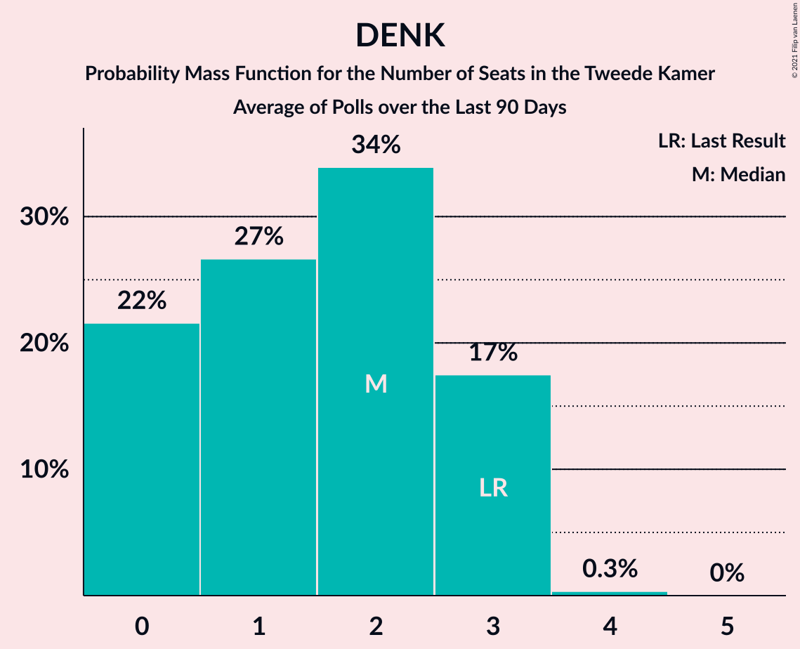

# DENK

<a href="#voting-intentions">Voting Intentions</a> | <a href="#seats">Seats</a>

## Voting Intentions

Last result: **2.1%** (General Election of 15 March 2017)

### Confidence Intervals

| Period     | Polling firm/Commissioner(s) | Median | 80% Confidence Interval | 90% Confidence Interval | 95% Confidence Interval | 99% Confidence Interval |
|:----------:|:----------------:|:-----------:|:-----------------------:|:-----------------------:|:-----------------------:|:-----------------------:|
| N/A | [Poll Average](average.html) | 1.6% | 0.6–2.2% | 0.5–2.4% | 0.5–2.5% | 0.4–2.7% |
| [8–11 January 2021](2021-01-11-IOResearch.html) | I&O Research | 0.7% | 0.5–1.0% | 0.5–1.1% | 0.4–1.1% | 0.4–1.3% |
| [10 January 2021](2021-01-10-Peilnl.html) | Peil.nl | 2.0% | 1.7–2.4% | 1.6–2.5% | 1.6–2.6% | 1.4–2.8% |
| [1–2 January 2021](2021-01-02-Peilnl.html) | Peil.nl | 2.0% | 1.7–2.4% | 1.6–2.5% | 1.6–2.6% | 1.4–2.8% |
| [18–21 December 2020](2020-12-21-KantarPublic.html) | Kantar Public | 1.4% | N/A | N/A | N/A | N/A |
| [18–21 December 2020](2020-12-21-Ipsos.html) | Ipsos   EenVandaag | 1.5% | 1.1–2.1% | 1.0–2.3% | 0.9–2.5% | 0.8–2.8% |
| [18–19 December 2020](2020-12-19-Peilnl.html) | Peil.nl | 2.0% | N/A | N/A | N/A | N/A |
| [11–14 December 2020](2020-12-14-IOResearch.html) | I&O Research | 0.6% | 0.4–1.0% | 0.4–1.2% | 0.3–1.2% | 0.2–1.5% |
| [11–12 December 2020](2020-12-12-Peilnl.html) | Peil.nl | 2.0% | N/A | N/A | N/A | N/A |
| [4–5 December 2020](2020-12-05-Peilnl.html) | Peil.nl | 2.0% | N/A | N/A | N/A | N/A |
| [26–27 November 2020](2020-11-27-Peilnl.html) | Peil.nl | 2.0% | 1.7–2.4% | 1.6–2.5% | 1.6–2.6% | 1.4–2.8% |
| [20–23 November 2020](2020-11-23-Ipsos.html) | Ipsos   EenVandaag | 1.1% | 0.8–1.7% | 0.7–1.9% | 0.7–2.0% | 0.5–2.3% |
| [20–21 November 2020](2020-11-21-Peilnl.html) | Peil.nl | 2.0% | 1.7–2.4% | 1.6–2.5% | 1.6–2.6% | 1.4–2.8% |
| [9–16 November 2020](2020-11-16-IOResearch.html) | I&O Research | 1.3% | 1.1–1.7% | 1.0–1.8% | 0.9–1.9% | 0.8–2.1% |
| [15 November 2020](2020-11-15-Peilnl.html) | Peil.nl | 2.0% | 1.7–2.4% | 1.6–2.5% | 1.6–2.6% | 1.4–2.8% |
| [7–15 November 2020](2020-11-15-KantarPublic.html) | Kantar Public | 1.4% | 1.2–1.6% | 1.1–1.7% | 1.1–1.8% | 1.0–1.9% |
| [8 November 2020](2020-11-08-Peilnl.html) | Peil.nl | 2.0% | 1.7–2.4% | 1.6–2.5% | 1.6–2.6% | 1.4–2.8% |
| [1 November 2020](2020-11-01-Peilnl.html) | Peil.nl | 2.0% | 1.7–2.4% | 1.6–2.5% | 1.6–2.6% | 1.4–2.8% |
| [23–26 October 2020](2020-10-26-Ipsos.html) | Ipsos   EenVandaag | 1.1% | 0.8–1.7% | 0.7–1.8% | 0.7–2.0% | 0.5–2.3% |
| [16–17 October 2020](2020-10-17-Peilnl.html) | Peil.nl | 2.0% | 1.7–2.4% | 1.6–2.5% | 1.6–2.6% | 1.4–2.8% |
| [9–12 October 2020](2020-10-12-IOResearch.html) | I&O Research | 1.3% | 1.0–1.7% | 0.9–1.8% | 0.9–1.9% | 0.7–2.1% |
| [11 October 2020](2020-10-11-Peilnl.html) | Peil.nl | 1.3% | 1.1–1.6% | 1.0–1.7% | 1.0–1.8% | 0.9–2.0% |
| [4 October 2020](2020-10-04-Peilnl.html) | Peil.nl | 1.3% | 1.1–1.6% | 1.0–1.7% | 1.0–1.8% | 0.9–2.0% |
| [25–29 September 2020](2020-09-29-KantarPublic.html) | Kantar Public | 1.8% | 1.4–2.4% | 1.3–2.6% | 1.2–2.7% | 1.0–3.0% |
| [27 September 2020](2020-09-27-Peilnl.html) | Peil.nl | 1.3% | 1.1–1.6% | 1.0–1.7% | 1.0–1.8% | 0.9–2.0% |
| [25–27 September 2020](2020-09-27-Ipsos.html) | Ipsos   EenVandaag | 1.0% | 0.7–1.6% | 0.7–1.7% | 0.6–1.9% | 0.5–2.1% |
| [18–19 September 2020](2020-09-19-Peilnl.html) | Peil.nl | 1.3% | 1.1–1.6% | 1.0–1.7% | 1.0–1.8% | 0.9–2.0% |
| [3–7 September 2020](2020-09-07-IOResearch.html) | I&O Research | 0.7% | 0.5–1.0% | 0.4–1.1% | 0.4–1.1% | 0.3–1.3% |
| [4–5 September 2020](2020-09-05-Peilnl.html) | Peil.nl | 1.3% | 1.1–1.6% | 1.0–1.7% | 1.0–1.8% | 0.9–2.0% |
| [28–29 August 2020](2020-08-29-Peilnl.html) | Peil.nl | 1.3% | 1.1–1.6% | 1.0–1.7% | 1.0–1.8% | 0.9–2.0% |
| [21–27 August 2020](2020-08-27-Ipsos.html) | Ipsos   EenVandaag | 0.8% | 0.5–1.2% | 0.4–1.4% | 0.4–1.5% | 0.3–1.8% |
| [23 August 2020](2020-08-23-Peilnl.html) | Peil.nl | 1.3% | 1.1–1.6% | 1.0–1.7% | 1.0–1.8% | 0.9–2.0% |
| [14–15 August 2020](2020-08-15-Peilnl.html) | Peil.nl | 0.7% | 0.5–0.9% | 0.5–1.0% | 0.4–1.0% | 0.4–1.2% |
| [9 August 2020](2020-08-09-IOResearch.html) | I&O Research | 0.6% | 0.4–1.0% | 0.4–1.1% | 0.3–1.2% | 0.2–1.4% |
| [26 July 2020](2020-07-26-Peilnl.html) | Peil.nl | 0.7% | 0.5–0.9% | 0.5–1.0% | 0.4–1.0% | 0.4–1.2% |
| [24–26 July 2020](2020-07-26-Ipsos.html) | Ipsos   EenVandaag | 1.2% | 0.9–1.8% | 0.8–2.0% | 0.7–2.1% | 0.6–2.4% |
| [19 July 2020](2020-07-19-Peilnl.html) | Peil.nl | 0.7% | 0.5–0.9% | 0.5–1.0% | 0.4–1.0% | 0.4–1.2% |
| [3–6 July 2020](2020-07-06-IOResearch.html) | I&O Research | 0.5% | 0.4–0.8% | 0.3–0.9% | 0.3–0.9% | 0.2–1.1% |
| [5 July 2020](2020-07-05-Peilnl.html) | Peil.nl | 0.7% | 0.5–0.9% | 0.5–1.0% | 0.4–1.0% | 0.4–1.2% |
| [27–30 June 2020](2020-06-30-Ipsos.html) | Ipsos   EenVandaag | 1.3% | 1.0–1.9% | 0.9–2.1% | 0.8–2.2% | 0.6–2.5% |
| [28 June 2020](2020-06-28-Peilnl.html) | Peil.nl | 0.7% | 0.5–0.9% | 0.5–1.0% | 0.4–1.0% | 0.4–1.2% |
| [23–26 June 2020](2020-06-26-KantarPublic.html) | Kantar Public | 1.3% | 1.0–2.0% | 0.9–2.1% | 0.8–2.3% | 0.6–2.7% |
| [21 June 2020](2020-06-21-Peilnl.html) | Peil.nl | 0.7% | 0.5–0.9% | 0.5–1.0% | 0.4–1.0% | 0.4–1.2% |
| [5–9 June 2020](2020-06-09-IOResearch.html) | I&O Research | 0.4% | 0.3–0.6% | 0.2–0.6% | 0.2–0.7% | 0.2–0.8% |
| [31 May 2020](2020-05-31-Peilnl.html) | Peil.nl | 0.7% | 0.5–0.9% | 0.5–1.0% | 0.4–1.0% | 0.4–1.2% |
| [22–24 May 2020](2020-05-24-Ipsos.html) | Ipsos   EenVandaag | 1.6% | 1.2–2.3% | 1.1–2.4% | 1.0–2.6% | 0.9–2.9% |
| [15–16 May 2020](2020-05-16-Peilnl.html) | Peil.nl | 0.7% | 0.5–0.9% | 0.5–1.0% | 0.4–1.0% | 0.4–1.2% |
| [7–12 May 2020](2020-05-12-IOResearch.html) | I&O Research | 0.7% | 0.5–1.0% | 0.5–1.1% | 0.4–1.2% | 0.4–1.4% |
| [8–9 May 2020](2020-05-09-Peilnl.html) | Peil.nl | 0.7% | 0.5–0.9% | 0.5–1.0% | 0.4–1.0% | 0.4–1.2% |
| [1–2 May 2020](2020-05-02-Peilnl.html) | Peil.nl | 1.3% | 1.1–1.6% | 1.0–1.7% | 1.0–1.8% | 0.9–2.0% |
| [26 April 2020](2020-04-26-Peilnl.html) | Peil.nl | 1.3% | 1.1–1.6% | 1.0–1.7% | 1.0–1.8% | 0.9–2.0% |
| [24–26 April 2020](2020-04-26-Ipsos.html) | Ipsos   EenVandaag | 1.7% | 1.2–2.3% | 1.1–2.5% | 1.0–2.7% | 0.9–3.0% |
| [27–30 March 2020](2020-03-30-Ipsos.html) | Ipsos   EenVandaag | 1.9% | 1.4–2.6% | 1.3–2.7% | 1.2–2.9% | 1.0–3.3% |
| [26–30 March 2020](2020-03-30-IOResearch.html) | I&O Research | 0.7% | 0.5–1.0% | 0.5–1.0% | 0.4–1.1% | 0.4–1.3% |
| [5–10 March 2020](2020-03-10-IOResearch.html) | I&O Research | 0.9% | 0.7–1.2% | 0.6–1.3% | 0.6–1.4% | 0.5–1.6% |
| [1–6 March 2020](2020-03-06-Peilnl.html) | Peil.nl | 2.0% | 1.7–2.4% | 1.6–2.5% | 1.6–2.6% | 1.4–2.8% |
| [23 February–1 March 2020](2020-03-01-Peilnl.html) | Peil.nl | 2.0% | 1.7–2.4% | 1.6–2.5% | 1.6–2.6% | 1.4–2.8% |
| [21–24 February 2020](2020-02-24-Ipsos.html) | Ipsos   EenVandaag | 1.6% | 1.2–2.2% | 1.1–2.3% | 1.0–2.5% | 0.8–2.9% |
| [18–23 February 2020](2020-02-23-Peilnl.html) | Peil.nl | 2.0% | 1.7–2.4% | 1.6–2.5% | 1.6–2.6% | 1.4–2.8% |
| [17–22 February 2020](2020-02-22-Peilnl.html) | Peil.nl | 2.0% | 1.7–2.4% | 1.6–2.5% | 1.6–2.6% | 1.4–2.8% |
| [9–14 February 2020](2020-02-14-Peilnl.html) | Peil.nl | 2.0% | 1.7–2.4% | 1.6–2.5% | 1.6–2.6% | 1.4–2.8% |
| [2–9 February 2020](2020-02-09-Peilnl.html) | Peil.nl | 2.0% | 1.7–2.4% | 1.6–2.5% | 1.6–2.6% | 1.4–2.8% |
| [27 January–1 February 2020](2020-02-01-Peilnl.html) | Peil.nl | 2.0% | 1.7–2.4% | 1.6–2.5% | 1.6–2.6% | 1.4–2.8% |
| [24–27 January 2020](2020-01-27-Ipsos.html) | Ipsos | 1.3% | 1.0–1.9% | 0.9–2.1% | 0.8–2.2% | 0.7–2.5% |
| [21–26 January 2020](2020-01-26-Peilnl.html) | Peil.nl | 2.0% | 1.7–2.4% | 1.6–2.5% | 1.6–2.6% | 1.4–2.8% |
| [10–18 January 2020](2020-01-18-Peilnl.html) | Peil.nl | 2.0% | 1.7–2.4% | 1.6–2.5% | 1.6–2.6% | 1.4–2.8% |
| [10–14 January 2020](2020-01-14-IOResearch.html) | I&O Research | 0.9% | 0.7–1.2% | 0.6–1.3% | 0.6–1.4% | 0.5–1.6% |
| [6–11 January 2020](2020-01-11-Peilnl.html) | Peil.nl | 2.0% | 1.7–2.4% | 1.6–2.5% | 1.6–2.6% | 1.4–2.8% |
| [16–21 December 2019](2019-12-21-Peilnl.html) | Peil.nl | 2.0% | 1.7–2.4% | 1.6–2.5% | 1.6–2.6% | 1.4–2.8% |
| [19–21 December 2019](2019-12-21-Ipsos.html) | Ipsos   EenVandaag | 1.4% | 1.1–2.0% | 0.9–2.2% | 0.9–2.3% | 0.7–2.7% |
| [9–14 December 2019](2019-12-14-Peilnl.html) | Peil.nl | 2.0% | 1.7–2.4% | 1.6–2.5% | 1.6–2.6% | 1.4–2.8% |
| [2–7 December 2019](2019-12-07-Peilnl.html) | Peil.nl | 2.0% | 1.7–2.4% | 1.6–2.5% | 1.6–2.6% | 1.4–2.8% |
| [25–30 November 2019](2019-11-30-Peilnl.html) | Peil.nl | 2.0% | 1.7–2.4% | 1.6–2.5% | 1.6–2.6% | 1.4–2.8% |
| [22–25 November 2019](2019-11-25-Ipsos.html) | Ipsos   EenVandaag | 1.6% | 1.2–2.2% | 1.1–2.4% | 1.0–2.5% | 0.8–2.9% |
| [18–23 November 2019](2019-11-23-Peilnl.html) | Peil.nl | 2.0% | 1.7–2.4% | 1.6–2.5% | 1.6–2.6% | 1.4–2.8% |
| [11–16 November 2019](2019-11-16-Peilnl.html) | Peil.nl | 2.0% | 1.7–2.4% | 1.6–2.5% | 1.6–2.6% | 1.4–2.8% |
| [15 November 2019](2019-11-15-KantarPublic.html) | Kantar Public | 0.6% | 0.4–1.1% | 0.3–1.2% | 0.3–1.4% | 0.2–1.6% |
| [7–13 November 2019](2019-11-13-IOResearch.html) | I&O Research | 0.9% | 0.6–1.3% | 0.6–1.4% | 0.5–1.6% | 0.4–1.8% |
| [4–9 November 2019](2019-11-09-Peilnl.html) | Peil.nl | 2.0% | 1.7–2.4% | 1.6–2.5% | 1.6–2.6% | 1.4–2.8% |
| [28 October–2 November 2019](2019-11-02-Peilnl.html) | Peil.nl | 2.0% | 1.7–2.4% | 1.6–2.5% | 1.6–2.6% | 1.4–2.8% |
| [25–28 October 2019](2019-10-28-Ipsos.html) | Ipsos   EenVandaag | 1.5% | 1.1–2.1% | 1.0–2.3% | 0.9–2.4% | 0.7–2.7% |
| [21–26 October 2019](2019-10-26-Peilnl.html) | Peil.nl | 2.0% | 1.7–2.4% | 1.6–2.5% | 1.6–2.6% | 1.4–2.8% |
| [14–19 October 2019](2019-10-19-Peilnl.html) | Peil.nl | 2.0% | 1.7–2.4% | 1.6–2.5% | 1.6–2.6% | 1.4–2.8% |
| [15 October 2019](2019-10-15-KantarPublic.html) | Kantar Public | 2.0% | 1.5–2.7% | 1.4–2.9% | 1.3–3.1% | 1.1–3.5% |
| [10–15 October 2019](2019-10-15-IOResearch.html) | I&O Research | 1.9% | 1.5–2.4% | 1.4–2.5% | 1.3–2.6% | 1.2–2.9% |
| [7–12 October 2019](2019-10-12-Peilnl.html) | Peil.nl | 2.0% | 1.7–2.4% | 1.6–2.5% | 1.6–2.6% | 1.4–2.8% |
| [30 September–5 October 2019](2019-10-05-Peilnl.html) | Peil.nl | 2.0% | 1.7–2.4% | 1.6–2.5% | 1.6–2.6% | 1.4–2.8% |
| [23–28 September 2019](2019-09-28-Peilnl.html) | Peil.nl | 2.0% | 1.7–2.4% | 1.6–2.5% | 1.6–2.6% | 1.4–2.8% |
| [20–23 September 2019](2019-09-23-Ipsos.html) | Ipsos   EenVandaag | 1.3% | 0.9–1.9% | 0.8–2.1% | 0.8–2.2% | 0.6–2.5% |
| [16–21 September 2019](2019-09-21-Peilnl.html) | Peil.nl | 2.0% | 1.7–2.4% | 1.6–2.5% | 1.6–2.6% | 1.4–2.8% |
| [15 September 2019](2019-09-15-KantarPublic.html) | Kantar Public | 0.6% | 0.4–1.1% | 0.3–1.2% | 0.3–1.4% | 0.2–1.6% |
| [9–14 September 2019](2019-09-14-Peilnl.html) | Peil.nl | 2.0% | 1.7–2.4% | 1.6–2.5% | 1.6–2.6% | 1.4–2.8% |
| [2–7 September 2019](2019-09-07-Peilnl.html) | Peil.nl | 2.0% | 1.7–2.4% | 1.6–2.5% | 1.6–2.6% | 1.4–2.8% |
| [29 August–3 September 2019](2019-09-03-IOResearch.html) | I&O Research | 1.2% | 0.9–1.7% | 0.9–1.8% | 0.8–1.9% | 0.7–2.1% |
| [30 August–2 September 2019](2019-09-02-Ipsos.html) | Ipsos   EenVandaag | 1.8% | 1.4–2.5% | 1.2–2.7% | 1.1–2.8% | 1.0–3.2% |
| [26–31 August 2019](2019-08-31-Peilnl.html) | Peil.nl | 2.0% | 1.7–2.4% | 1.6–2.5% | 1.6–2.6% | 1.4–2.8% |
| [19–24 August 2019](2019-08-24-Peilnl.html) | Peil.nl | 2.0% | 1.7–2.4% | 1.6–2.5% | 1.6–2.6% | 1.4–2.8% |
| [29 July–4 August 2019](2019-08-04-Peilnl.html) | Peil.nl | 2.0% | 1.7–2.4% | 1.6–2.5% | 1.6–2.6% | 1.4–2.8% |
| [29 July 2019](2019-07-29-Peilnl.html) | Peil.nl | 2.0% | 1.7–2.4% | 1.6–2.5% | 1.6–2.6% | 1.4–2.8% |
| [26–29 July 2019](2019-07-29-Ipsos.html) | Ipsos   EenVandaag | 1.2% | 0.8–1.7% | 0.7–1.9% | 0.7–2.0% | 0.5–2.3% |
| [5–9 July 2019](2019-07-09-IOResearch.html) | I&O Research | 1.3% | 1.1–1.7% | 1.0–1.8% | 0.9–1.9% | 0.8–2.1% |
| [1–7 July 2019](2019-07-07-Peilnl.html) | Peil.nl | 2.7% | 2.3–3.1% | 2.2–3.2% | 2.1–3.3% | 2.0–3.5% |
| [24–30 June 2019](2019-06-30-Peilnl.html) | Peil.nl | 2.7% | 2.3–3.1% | 2.2–3.2% | 2.1–3.3% | 2.0–3.5% |
| [21–24 June 2019](2019-06-24-Ipsos.html) | Ipsos   EenVandaag | 1.8% | 1.4–2.5% | 1.3–2.7% | 1.2–2.9% | 1.0–3.2% |
| [17–23 June 2019](2019-06-23-Peilnl.html) | Peil.nl | 2.7% | 2.3–3.1% | 2.2–3.2% | 2.1–3.3% | 2.0–3.5% |
| [10–16 June 2019](2019-06-16-Peilnl.html) | Peil.nl | 2.7% | 2.3–3.1% | 2.2–3.2% | 2.1–3.3% | 2.0–3.5% |
| [3–9 June 2019](2019-06-09-Peilnl.html) | Peil.nl | 2.7% | 2.3–3.1% | 2.2–3.2% | 2.1–3.3% | 2.0–3.5% |
| [27 May–2 June 2019](2019-06-02-Peilnl.html) | Peil.nl | 2.7% | 2.3–3.1% | 2.2–3.2% | 2.1–3.3% | 2.0–3.5% |
| [20–26 May 2019](2019-05-26-Peilnl.html) | Peil.nl | 2.7% | 2.3–3.1% | 2.3–3.2% | 2.2–3.4% | 2.0–3.6% |
| [21 May 2019](2019-05-21-Ipsos.html) | Ipsos | 2.0% | 1.5–2.7% | 1.4–2.9% | 1.3–3.1% | 1.1–3.4% |
| [13–19 May 2019](2019-05-19-Peilnl.html) | Peil.nl | 2.7% | 2.3–3.1% | 2.2–3.2% | 2.1–3.3% | 2.0–3.5% |
| [9–14 May 2019](2019-05-14-IOResearch.html) | I&O Research | 2.0% | 1.6–2.5% | 1.5–2.7% | 1.4–2.8% | 1.2–3.1% |
| [6–12 May 2019](2019-05-12-Peilnl.html) | Peil.nl | 2.7% | 2.3–3.1% | 2.2–3.2% | 2.1–3.3% | 2.0–3.5% |
| [29 April–5 May 2019](2019-05-05-Peilnl.html) | Peil.nl | 2.7% | 2.3–3.1% | 2.2–3.2% | 2.1–3.3% | 2.0–3.5% |
| [26–29 April 2019](2019-04-29-Ipsos.html) | Ipsos   EenVandaag | 2.4% | 1.9–3.1% | 1.7–3.3% | 1.6–3.5% | 1.4–3.9% |
| [22–28 April 2019](2019-04-28-Peilnl.html) | Peil.nl | 2.7% | 2.3–3.1% | 2.2–3.2% | 2.1–3.3% | 2.0–3.5% |
| [17–25 April 2019](2019-04-25-KantarPublic.html) | Kantar Public | 1.3% | 1.0–2.0% | 0.9–2.1% | 0.8–2.3% | 0.6–2.6% |
| [19–24 April 2019](2019-04-24-IOResearch.html) | I&O Research | 1.7% | 1.3–2.2% | 1.2–2.3% | 1.2–2.4% | 1.0–2.7% |
| [15–21 April 2019](2019-04-21-Peilnl.html) | Peil.nl | 2.7% | 2.3–3.1% | 2.2–3.2% | 2.1–3.3% | 2.0–3.5% |
| [8–14 April 2019](2019-04-14-Peilnl.html) | Peil.nl | 2.7% | 2.3–3.1% | 2.2–3.2% | 2.1–3.3% | 2.0–3.5% |
| [1–7 April 2019](2019-04-07-Peilnl.html) | Peil.nl | 2.7% | 2.3–3.1% | 2.2–3.2% | 2.1–3.3% | 2.0–3.5% |
| [25–31 March 2019](2019-03-31-Peilnl.html) | Peil.nl | 2.7% | 2.3–3.1% | 2.2–3.2% | 2.1–3.3% | 2.0–3.5% |
| [18–24 March 2019](2019-03-24-Peilnl.html) | Peil.nl | 2.7% | 2.3–3.1% | 2.2–3.2% | 2.1–3.3% | 2.0–3.5% |
| [21 March 2019](2019-03-21-Ipsos.html) | Ipsos | 2.2% | 1.7–2.9% | 1.6–3.1% | 1.4–3.3% | 1.2–3.7% |
| [18 March 2019](2019-03-18-IOResearch.html) | I&O Research | 2.0% | 1.6–2.6% | 1.5–2.8% | 1.4–2.9% | 1.2–3.2% |
| [11–16 March 2019](2019-03-16-Peilnl.html) | Peil.nl | 4.7% | 4.2–5.2% | 4.1–5.3% | 4.0–5.5% | 3.7–5.8% |
| [8–12 March 2019](2019-03-12-IOResearch.html) | I&O Research | 2.3% | 1.9–2.8% | 1.8–2.9% | 1.7–3.0% | 1.6–3.3% |
| [4–10 March 2019](2019-03-10-Peilnl.html) | Peil.nl | 4.7% | 4.2–5.2% | 4.1–5.3% | 4.0–5.5% | 3.7–5.8% |
| [25 February–3 March 2019](2019-03-03-Peilnl.html) | Peil.nl | 4.7% | 4.2–5.2% | 4.1–5.3% | 4.0–5.5% | 3.7–5.8% |
| [22–26 February 2019](2019-02-26-IOResearch.html) | I&O Research | 2.2% | 1.8–2.7% | 1.7–2.9% | 1.6–3.0% | 1.5–3.2% |
| [18–24 February 2019](2019-02-24-Peilnl.html) | Peil.nl | 4.7% | 4.2–5.2% | 4.1–5.3% | 4.0–5.5% | 3.7–5.8% |
| [22–24 February 2019](2019-02-24-Ipsos.html) | Ipsos   EenVandaag | 2.1% | 1.7–2.9% | 1.5–3.0% | 1.4–3.2% | 1.2–3.6% |
| [11–17 February 2019](2019-02-17-Peilnl.html) | Peil.nl | 4.7% | 4.2–5.2% | 4.1–5.3% | 4.0–5.5% | 3.7–5.8% |
| [12 February 2019](2019-02-12-KantarPublic.html) | Kantar Public | 1.4% | 1.0–2.0% | 0.9–2.2% | 0.8–2.3% | 0.7–2.7% |
| [4–10 February 2019](2019-02-10-Peilnl.html) | Peil.nl | 4.7% | 4.2–5.2% | 4.1–5.3% | 4.0–5.5% | 3.7–5.8% |
| [28 January–3 February 2019](2019-02-03-Peilnl.html) | Peil.nl | 4.7% | 4.2–5.2% | 4.1–5.3% | 4.0–5.5% | 3.7–5.8% |
| [25–28 January 2019](2019-01-28-Ipsos.html) | Ipsos   EenVandaag | 2.2% | 1.7–2.9% | 1.6–3.1% | 1.4–3.3% | 1.2–3.7% |
| [21–27 January 2019](2019-01-27-Peilnl.html) | Peil.nl | 4.7% | 4.2–5.2% | 4.1–5.3% | 4.0–5.5% | 3.7–5.8% |
| [18–22 January 2019](2019-01-22-IOResearch.html) | I&O Research | 1.4% | 1.2–1.7% | 1.1–1.8% | 1.1–1.8% | 1.0–2.0% |
| [14–20 January 2019](2019-01-20-Peilnl.html) | Peil.nl | 4.7% | 4.2–5.2% | 4.1–5.3% | 4.0–5.5% | 3.7–5.8% |
| [7–13 January 2019](2019-01-13-Peilnl.html) | Peil.nl | 4.7% | 4.2–5.2% | 4.1–5.3% | 4.0–5.5% | 3.7–5.8% |
| [12 January 2019](2019-01-12-KantarPublic.html) | Kantar Public | 2.0% | 1.5–2.7% | 1.4–2.9% | 1.3–3.1% | 1.1–3.5% |
| [14–17 December 2018](2018-12-17-Ipsos.html) | Ipsos   EenVandaag | 1.9% | 1.4–2.6% | 1.3–2.7% | 1.2–2.9% | 1.0–3.3% |
| [10–16 December 2018](2018-12-16-Peilnl.html) | Peil.nl | 4.7% | 4.2–5.2% | 4.1–5.3% | 4.0–5.5% | 3.7–5.8% |
| [7–11 December 2018](2018-12-11-KantarPublic.html) | Kantar Public | 1.4% | 1.0–2.0% | 0.9–2.1% | 0.8–2.3% | 0.7–2.6% |
| [3–9 December 2018](2018-12-09-Peilnl.html) | Peil.nl | 4.7% | 4.2–5.2% | 4.1–5.3% | 4.0–5.5% | 3.7–5.8% |
| [26 November–2 December 2018](2018-12-02-Peilnl.html) | Peil.nl | 4.7% | 4.2–5.2% | 4.1–5.3% | 4.0–5.5% | 3.7–5.8% |
| [22–27 November 2018](2018-11-27-IOResearch.html) | I&O Research | 2.4% | 2.1–2.8% | 2.0–2.9% | 1.9–3.0% | 1.8–3.2% |
| [23–26 November 2018](2018-11-26-Ipsos.html) | Ipsos   EenVandaag | 2.1% | 1.7–2.9% | 1.5–3.0% | 1.4–3.2% | 1.2–3.6% |
| [19–25 November 2018](2018-11-25-Peilnl.html) | Peil.nl | 4.7% | 4.2–5.2% | 4.1–5.3% | 4.0–5.5% | 3.7–5.8% |
| [12–18 November 2018](2018-11-18-Peilnl.html) | Peil.nl | 4.7% | 4.2–5.2% | 4.1–5.3% | 4.0–5.5% | 3.7–5.8% |
| [5–11 November 2018](2018-11-11-Peilnl.html) | Peil.nl | 4.7% | 4.2–5.2% | 4.1–5.3% | 4.0–5.5% | 3.7–5.8% |
| [29 October–4 November 2018](2018-11-04-Peilnl.html) | Peil.nl | 4.7% | 4.2–5.2% | 4.1–5.3% | 4.0–5.5% | 3.7–5.8% |
| [26–29 October 2018](2018-10-29-Ipsos.html) | Ipsos   EenVandaag | 1.7% | 1.3–2.3% | 1.1–2.5% | 1.1–2.7% | 0.9–3.0% |
| [22–28 October 2018](2018-10-28-Peilnl.html) | Peil.nl | 4.7% | 4.2–5.2% | 4.1–5.3% | 4.0–5.5% | 3.7–5.8% |
| [15–21 October 2018](2018-10-21-Peilnl.html) | Peil.nl | 4.7% | 4.2–5.2% | 4.1–5.3% | 4.0–5.5% | 3.7–5.8% |
| [8–14 October 2018](2018-10-14-Peilnl.html) | Peil.nl | 4.7% | 4.2–5.2% | 4.1–5.3% | 4.0–5.5% | 3.7–5.8% |
| [1–7 October 2018](2018-10-07-Peilnl.html) | Peil.nl | 4.7% | 4.2–5.2% | 4.1–5.3% | 4.0–5.5% | 3.7–5.8% |
| [24–30 September 2018](2018-09-30-Peilnl.html) | Peil.nl | 4.7% | 4.2–5.2% | 4.1–5.3% | 4.0–5.5% | 3.7–5.8% |
| [17–23 September 2018](2018-09-23-Peilnl.html) | Peil.nl | 4.7% | 4.2–5.2% | 4.1–5.3% | 4.0–5.5% | 3.7–5.8% |
| [21–23 September 2018](2018-09-23-Ipsos.html) | Ipsos   EenVandaag | 1.8% | 1.4–2.5% | 1.3–2.7% | 1.2–2.8% | 1.0–3.2% |
| [10–16 September 2018](2018-09-16-Peilnl.html) | Peil.nl | 4.7% | 4.2–5.2% | 4.1–5.3% | 4.0–5.5% | 3.7–5.8% |
| [13–16 September 2018](2018-09-16-KantarPublic.html) | Kantar Public | 1.3% | 1.0–1.9% | 0.9–2.1% | 0.8–2.3% | 0.7–2.6% |
| [7–11 September 2018](2018-09-11-IOResearch.html) | I&O Research | 2.2% | 1.8–2.7% | 1.7–2.9% | 1.6–3.0% | 1.5–3.2% |
| [3–9 September 2018](2018-09-09-Peilnl.html) | Peil.nl | 4.0% | 3.6–4.5% | 3.4–4.6% | 3.4–4.8% | 3.2–5.0% |
| [31 August–3 September 2018](2018-09-03-Ipsos.html) | Ipsos   EenVandaag | 1.8% | 1.4–2.5% | 1.3–2.7% | 1.2–2.8% | 1.0–3.2% |
| [27 August–2 September 2018](2018-09-02-Peilnl.html) | Peil.nl | 4.0% | 3.6–4.5% | 3.4–4.6% | 3.4–4.8% | 3.2–5.0% |
| [20–26 August 2018](2018-08-26-Peilnl.html) | Peil.nl | 4.0% | 3.6–4.5% | 3.4–4.6% | 3.4–4.8% | 3.2–5.0% |
| [13–19 August 2018](2018-08-19-Peilnl.html) | Peil.nl | 4.0% | 3.6–4.5% | 3.4–4.6% | 3.4–4.8% | 3.2–5.0% |
| [27–30 July 2018](2018-07-30-Ipsos.html) | Ipsos   EenVandaag | 2.3% | 1.9–2.9% | 1.7–3.1% | 1.6–3.2% | 1.4–3.5% |
| [2–8 July 2018](2018-07-08-Peilnl.html) | Peil.nl | 4.0% | 3.6–4.5% | 3.4–4.6% | 3.4–4.8% | 3.2–5.0% |
| [25 June–1 July 2018](2018-07-01-Peilnl.html) | Peil.nl | 4.0% | 3.6–4.5% | 3.4–4.6% | 3.4–4.8% | 3.2–5.0% |
| [13–29 June 2018](2018-06-29-IOResearch.html) | I&O Research | 2.3% | 2.0–2.8% | 1.8–2.9% | 1.8–3.0% | 1.6–3.3% |
| [22–25 June 2018](2018-06-25-Ipsos.html) | Ipsos   EenVandaag | 3.1% | 2.5–3.8% | 2.3–4.1% | 2.2–4.3% | 2.0–4.6% |
| [18–24 June 2018](2018-06-24-Peilnl.html) | Peil.nl | 4.0% | 3.6–4.5% | 3.4–4.6% | 3.4–4.8% | 3.2–5.0% |
| [11–17 June 2018](2018-06-17-Peilnl.html) | Peil.nl | 4.0% | 3.6–4.5% | 3.4–4.6% | 3.4–4.8% | 3.2–5.0% |
| [13 June 2018](2018-06-13-KantarPublic.html) | Kantar Public | 1.4% | 1.0–2.0% | 0.9–2.2% | 0.8–2.3% | 0.7–2.7% |
| [4–10 June 2018](2018-06-10-Peilnl.html) | Peil.nl | 4.0% | 3.6–4.5% | 3.4–4.6% | 3.4–4.8% | 3.2–5.0% |
| [28 May–3 June 2018](2018-06-03-Peilnl.html) | Peil.nl | 4.0% | 3.6–4.5% | 3.4–4.6% | 3.4–4.8% | 3.2–5.0% |
| [25–28 May 2018](2018-05-28-Ipsos.html) | Ipsos   EenVandaag | 2.3% | 1.8–3.0% | 1.7–3.2% | 1.5–3.4% | 1.3–3.8% |
| [21–27 May 2018](2018-05-27-Peilnl.html) | Peil.nl | 3.3% | 2.9–3.8% | 2.8–3.9% | 2.7–4.0% | 2.6–4.3% |
| [14–20 May 2018](2018-05-20-Peilnl.html) | Peil.nl | 3.3% | 2.9–3.8% | 2.8–3.9% | 2.7–4.0% | 2.6–4.3% |
| [7–13 May 2018](2018-05-13-Peilnl.html) | Peil.nl | 3.3% | 2.9–3.8% | 2.8–3.9% | 2.7–4.0% | 2.6–4.3% |
| [30 April–6 May 2018](2018-05-06-Peilnl.html) | Peil.nl | 3.3% | 2.9–3.8% | 2.8–3.9% | 2.7–4.0% | 2.6–4.3% |
| [23–29 April 2018](2018-04-29-Peilnl.html) | Peil.nl | 3.3% | 2.9–3.8% | 2.8–3.9% | 2.7–4.0% | 2.6–4.3% |
| [20–23 April 2018](2018-04-23-Ipsos.html) | Ipsos   EenVandaag | 2.5% | 2.0–3.2% | 1.8–3.4% | 1.7–3.6% | 1.5–3.9% |
| [16–22 April 2018](2018-04-22-Peilnl.html) | Peil.nl | 3.3% | 2.9–3.8% | 2.8–3.9% | 2.7–4.0% | 2.6–4.3% |
| [9–15 April 2018](2018-04-15-Peilnl.html) | Peil.nl | 3.3% | 2.9–3.8% | 2.8–3.9% | 2.7–4.0% | 2.6–4.3% |
| [2–8 April 2018](2018-04-08-Peilnl.html) | Peil.nl | 3.3% | 2.9–3.8% | 2.8–3.9% | 2.7–4.0% | 2.6–4.3% |
| [26 March–1 April 2018](2018-04-01-Peilnl.html) | Peil.nl | 3.3% | 2.9–3.8% | 2.8–3.9% | 2.7–4.0% | 2.6–4.3% |
| [19–25 March 2018](2018-03-25-Peilnl.html) | Peil.nl | 3.3% | 2.9–3.8% | 2.8–3.9% | 2.7–4.0% | 2.6–4.3% |
| [19 March 2018](2018-03-19-Ipsos.html) | Ipsos   EenVandaag | 2.5% | 2.0–3.2% | 1.9–3.4% | 1.7–3.6% | 1.5–3.9% |
| [12–18 March 2018](2018-03-18-Peilnl.html) | Peil.nl | 2.7% | 2.3–3.1% | 2.2–3.2% | 2.1–3.3% | 2.0–3.5% |
| [8–12 March 2018](2018-03-12-IOResearch.html) | I&O Research | 2.0% | 1.7–2.4% | 1.6–2.5% | 1.6–2.6% | 1.5–2.7% |
| [5–11 March 2018](2018-03-11-Peilnl.html) | Peil.nl | 2.0% | 1.7–2.4% | 1.6–2.5% | 1.6–2.6% | 1.4–2.8% |
| [26 February–4 March 2018](2018-03-04-Peilnl.html) | Peil.nl | 2.0% | 1.7–2.4% | 1.6–2.5% | 1.6–2.6% | 1.4–2.8% |
| [27 February–4 March 2018](2018-03-04-KantarPublic.html) | Kantar Public | 2.0% | 1.6–2.7% | 1.4–2.9% | 1.3–3.1% | 1.1–3.4% |
| [23–26 February 2018](2018-02-26-Ipsos.html) | Ipsos   EenVandaag | 3.1% | 2.5–3.9% | 2.3–4.2% | 2.2–4.4% | 2.0–4.8% |
| [19–25 February 2018](2018-02-25-Peilnl.html) | Peil.nl | 2.0% | 1.7–2.4% | 1.6–2.5% | 1.6–2.6% | 1.4–2.8% |
| [12–18 February 2018](2018-02-18-Peilnl.html) | Peil.nl | 2.0% | 1.7–2.4% | 1.6–2.5% | 1.6–2.6% | 1.4–2.8% |
| [5–11 February 2018](2018-02-11-Peilnl.html) | Peil.nl | 2.0% | 1.7–2.4% | 1.6–2.5% | 1.6–2.6% | 1.4–2.8% |
| [2–6 February 2018](2018-02-06-IOResearch.html) | I&O Research | 1.6% | 1.4–1.9% | 1.3–2.0% | 1.2–2.1% | 1.1–2.2% |
| [29 January–4 February 2018](2018-02-04-Peilnl.html) | Peil.nl | 2.0% | 1.7–2.4% | 1.6–2.5% | 1.6–2.6% | 1.4–2.8% |
| [26–29 January 2018](2018-01-29-Ipsos.html) | Ipsos   EenVandaag | 2.7% | 2.1–3.5% | 2.0–3.7% | 1.9–3.9% | 1.6–4.3% |
| [22–28 January 2018](2018-01-28-Peilnl.html) | Peil.nl | 2.0% | 1.7–2.4% | 1.6–2.5% | 1.6–2.6% | 1.4–2.8% |
| [25–28 January 2018](2018-01-28-KantarPublic.html) | Kantar Public | 1.3% | 1.0–1.8% | 0.9–2.0% | 0.8–2.1% | 0.7–2.4% |
| [15–21 January 2018](2018-01-21-Peilnl.html) | Peil.nl | 2.0% | 1.7–2.4% | 1.6–2.5% | 1.6–2.6% | 1.4–2.8% |
| [8–14 January 2018](2018-01-14-Peilnl.html) | Peil.nl | 2.0% | 1.7–2.4% | 1.6–2.5% | 1.6–2.6% | 1.4–2.8% |
| [18–24 December 2017](2017-12-24-Peilnl.html) | Peil.nl | 2.0% | 1.7–2.4% | 1.6–2.5% | 1.6–2.6% | 1.4–2.8% |
| [18 December 2017](2017-12-18-Ipsos.html) | Ipsos | 2.6% | 2.1–3.4% | 1.9–3.6% | 1.8–3.8% | 1.6–4.2% |
| [15–18 December 2017](2017-12-18-GfK.html) | GfK   EenVandaag | 1.3% | 1.0–1.7% | 0.9–1.8% | 0.9–1.9% | 0.8–2.1% |
| [17 December 2017](2017-12-17-Peilnl.html) | Peil.nl | 2.0% | 1.7–2.4% | 1.6–2.5% | 1.6–2.6% | 1.4–2.8% |
| [10 December 2017](2017-12-10-Peilnl.html) | Peil.nl | 2.0% | 1.7–2.4% | 1.6–2.5% | 1.6–2.6% | 1.4–2.8% |
| [3 December 2017](2017-12-03-Peilnl.html) | Peil.nl | 2.0% | 1.7–2.4% | 1.6–2.5% | 1.6–2.6% | 1.4–2.8% |
| [30 November 2017](2017-11-30-Ipsos.html) | Ipsos | 2.0% | 1.5–2.7% | 1.4–2.9% | 1.3–3.1% | 1.1–3.4% |
| [27 November 2017](2017-11-27-GfK.html) | GfK   EenVandaag | 0.7% | 0.5–1.0% | 0.4–1.1% | 0.4–1.1% | 0.3–1.3% |
| [26 November 2017](2017-11-26-Peilnl.html) | Peil.nl | 2.0% | 1.7–2.4% | 1.6–2.5% | 1.6–2.6% | 1.4–2.8% |
| [19 November 2017](2017-11-19-Peilnl.html) | Peil.nl | 2.0% | 1.7–2.4% | 1.6–2.5% | 1.6–2.6% | 1.4–2.8% |
| [12 November 2017](2017-11-12-Peilnl.html) | Peil.nl | 2.0% | 1.7–2.4% | 1.6–2.5% | 1.6–2.6% | 1.4–2.8% |
| [5 November 2017](2017-11-05-Peilnl.html) | Peil.nl | 2.0% | 1.7–2.4% | 1.6–2.5% | 1.6–2.6% | 1.4–2.8% |
| [2 November 2017](2017-11-02-Ipsos.html) | Ipsos | 3.1% | 2.5–3.9% | 2.3–4.2% | 2.2–4.4% | 1.9–4.8% |
| [30 October 2017](2017-10-30-IOResearch.html) | I&O Research | 1.6% | 1.2–2.1% | 1.1–2.3% | 1.0–2.4% | 0.9–2.7% |
| [27–30 October 2017](2017-10-30-GfK.html) | GfK   EenVandaag | 1.3% | 1.1–1.7% | 1.0–1.8% | 0.9–2.0% | 0.8–2.1% |
| [29 October 2017](2017-10-29-Peilnl.html) | Peil.nl | 2.0% | 1.7–2.4% | 1.6–2.5% | 1.6–2.6% | 1.4–2.8% |
| [15 October 2017](2017-10-15-Peilnl.html) | Peil.nl | 2.0% | 1.7–2.4% | 1.6–2.5% | 1.6–2.6% | 1.4–2.8% |
| [11–15 October 2017](2017-10-15-KantarPublic.html) | Kantar Public | 1.3% | 1.0–1.9% | 0.9–2.1% | 0.8–2.3% | 0.6–2.6% |
| [11 October 2017](2017-10-11-IOResearch.html) | I&O Research | 1.6% | 1.2–2.1% | 1.1–2.3% | 1.0–2.4% | 0.9–2.7% |
| [5 October 2017](2017-10-05-Ipsos.html) | Ipsos | 3.1% | 2.5–3.9% | 2.3–4.2% | 2.2–4.4% | 1.9–4.8% |
| [1 October 2017](2017-10-01-Peilnl.html) | Peil.nl | 2.0% | 1.7–2.4% | 1.6–2.5% | 1.6–2.6% | 1.4–2.8% |
| [22–25 September 2017](2017-09-25-GfK.html) | GfK   EenVandaag | 0.7% | 0.5–1.0% | 0.4–1.1% | 0.4–1.1% | 0.3–1.3% |
| [24 September 2017](2017-09-24-Peilnl.html) | Peil.nl | 2.0% | 1.7–2.4% | 1.6–2.5% | 1.6–2.6% | 1.4–2.8% |
| [17 September 2017](2017-09-17-Peilnl.html) | Peil.nl | 2.0% | 1.7–2.4% | 1.6–2.5% | 1.6–2.6% | 1.4–2.8% |
| [14 September 2017](2017-09-14-Ipsos.html) | Ipsos | 2.4% | 1.9–3.2% | 1.7–3.4% | 1.6–3.6% | 1.4–3.9% |
| [11 September 2017](2017-09-11-IOResearch.html) | I&O Research | 1.8% | 1.4–2.4% | 1.3–2.5% | 1.2–2.7% | 1.0–3.0% |
| [10 September 2017](2017-09-10-Peilnl.html) | Peil.nl | 2.0% | 1.7–2.4% | 1.6–2.5% | 1.6–2.6% | 1.4–2.8% |
| [1–4 September 2017](2017-09-04-GfK.html) | GfK   EenVandaag | 1.3% | 1.1–1.8% | 1.0–1.9% | 0.9–2.0% | 0.8–2.2% |
| [3 September 2017](2017-09-03-Peilnl.html) | Peil.nl | 2.0% | 1.7–2.4% | 1.6–2.5% | 1.6–2.6% | 1.4–2.8% |
| [31 August 2017](2017-08-31-KantarPublic.html) | Kantar Public | 1.4% | 1.0–2.0% | 0.9–2.2% | 0.8–2.3% | 0.6–2.7% |
| [27 August 2017](2017-08-27-Peilnl.html) | Peil.nl | 2.0% | 1.7–2.4% | 1.6–2.5% | 1.6–2.6% | 1.4–2.8% |
| [20 August 2017](2017-08-20-Peilnl.html) | Peil.nl | 2.0% | 1.7–2.4% | 1.6–2.5% | 1.6–2.6% | 1.4–2.8% |
| [10 August 2017](2017-08-10-Ipsos.html) | Ipsos | 3.1% | 2.5–3.9% | 2.3–4.2% | 2.2–4.4% | 1.9–4.8% |
| [30 July 2017](2017-07-30-Peilnl.html) | Peil.nl | 2.0% | 1.7–2.4% | 1.6–2.5% | 1.6–2.6% | 1.4–2.8% |
| [21–24 July 2017](2017-07-24-GfK.html) | GfK   EenVandaag | 1.3% | 1.0–1.7% | 1.0–1.9% | 0.9–2.0% | 0.8–2.2% |
| [16 July 2017](2017-07-16-Peilnl.html) | Peil.nl | 2.0% | 1.7–2.4% | 1.6–2.5% | 1.6–2.6% | 1.4–2.8% |
| [13 July 2017](2017-07-13-Ipsos.html) | Ipsos | 3.1% | 2.5–3.9% | 2.3–4.2% | 2.2–4.4% | 1.9–4.8% |
| [12 July 2017](2017-07-12-KantarPublic.html) | Kantar Public | 1.4% | 1.0–2.0% | 0.9–2.2% | 0.8–2.3% | 0.6–2.7% |
| [2 July 2017](2017-07-02-Peilnl.html) | Peil.nl | 2.0% | 1.7–2.4% | 1.6–2.5% | 1.6–2.6% | 1.4–2.8% |
| [29 June 2017](2017-06-29-Ipsos.html) | Ipsos | 2.8% | 2.2–3.6% | 2.1–3.8% | 1.9–4.0% | 1.7–4.4% |
| [23–26 June 2017](2017-06-26-GfK.html) | GfK   EenVandaag | 1.3% | 1.0–1.7% | 0.9–1.8% | 0.9–2.0% | 0.8–2.2% |
| [18 June 2017](2017-06-18-Peilnl.html) | Peil.nl | 2.0% | 1.7–2.4% | 1.6–2.5% | 1.6–2.6% | 1.4–2.8% |
| [18 June 2017](2017-06-18-IOResearch.html) | I&O Research | 1.7% | 1.3–2.3% | 1.2–2.4% | 1.1–2.6% | 1.0–2.9% |
| [15 June 2017](2017-06-15-Ipsos.html) | Ipsos | 2.2% | 1.7–2.9% | 1.6–3.1% | 1.4–3.3% | 1.2–3.7% |
| [4 June 2017](2017-06-04-Peilnl.html) | Peil.nl | 2.0% | 1.7–2.4% | 1.6–2.5% | 1.6–2.6% | 1.4–2.8% |
| [1 June 2017](2017-06-01-Ipsos.html) | Ipsos | 2.5% | 2.0–3.3% | 1.8–3.5% | 1.7–3.7% | 1.5–4.1% |
| [29 May 2017](2017-05-29-GfK.html) | GfK   EenVandaag | 1.3% | 1.0–1.7% | 1.0–1.8% | 0.9–1.9% | 0.8–2.1% |
| [21 May 2017](2017-05-21-Peilnl.html) | Peil.nl | 2.0% | 1.7–2.4% | 1.6–2.5% | 1.6–2.6% | 1.4–2.8% |
| [19 May 2017](2017-05-19-Ipsos.html) | Ipsos | 3.0% | 2.4–3.8% | 2.2–4.1% | 2.1–4.3% | 1.9–4.7% |
| [14 May 2017](2017-05-14-Peilnl.html) | Peil.nl | 2.0% | 1.7–2.4% | 1.6–2.5% | 1.6–2.6% | 1.4–2.8% |
| [7 May 2017](2017-05-07-Peilnl.html) | Peil.nl | 2.0% | 1.7–2.4% | 1.6–2.5% | 1.6–2.6% | 1.4–2.8% |
| [4 May 2017](2017-05-04-Ipsos.html) | Ipsos | 1.9% | 1.4–2.6% | 1.3–2.8% | 1.2–3.0% | 1.0–3.3% |
| [24 April 2017](2017-04-24-GfK.html) | GfK   EenVandaag | 1.3% | 1.0–1.7% | 0.9–1.8% | 0.9–2.0% | 0.8–2.2% |
| [23 April 2017](2017-04-23-Peilnl.html) | Peil.nl | 2.0% | 1.7–2.4% | 1.6–2.5% | 1.6–2.6% | 1.4–2.8% |
| [20 April 2017](2017-04-20-Ipsos.html) | Ipsos | 2.2% | 1.7–2.9% | 1.6–3.1% | 1.4–3.3% | 1.2–3.7% |
| [16 April 2017](2017-04-16-Peilnl.html) | Peil.nl | 2.0% | 1.7–2.4% | 1.6–2.5% | 1.6–2.6% | 1.4–2.8% |
| [9 April 2017](2017-04-09-Peilnl.html) | Peil.nl | 2.0% | 1.7–2.4% | 1.6–2.5% | 1.6–2.6% | 1.4–2.8% |
| [6 April 2017](2017-04-06-Ipsos.html) | Ipsos | 2.2% | 1.7–2.9% | 1.6–3.1% | 1.4–3.3% | 1.2–3.7% |
| [2 April 2017](2017-04-02-Peilnl.html) | Peil.nl | 2.0% | 1.7–2.4% | 1.6–2.5% | 1.6–2.6% | 1.4–2.8% |
| [26 March 2017](2017-03-26-Peilnl.html) | Peil.nl | 2.0% | 1.7–2.4% | 1.6–2.5% | 1.6–2.6% | 1.4–2.8% |

### Probability Mass Function

The following table shows the probability mass function per percentage block of voting intentions for the [poll average](average.html) for DENK.

| Voting Intentions | Probability | Accumulated | Special Marks |
|:-----------------:|:-----------:|:-----------:|:-------------:|
| 0.0–0.5% | 5% | 100% |  |
| 0.5–1.5% | 45% | 95% |  |
| 1.5–2.5% | 49% | 50% | Last Result, Median |
| 2.5–3.5% | 2% | 2% |  |
| 3.5–4.5% | 0% | 0% |  |

## Seats

Last result: **3** seats (General Election of 15 March 2017)

### Confidence Intervals

| Period     | Polling firm/Commissioner(s) | Median | 80% Confidence Interval | 90% Confidence Interval | 95% Confidence Interval | 99% Confidence Interval |
|:----------:|:----------------:|:------:|:-----------------------:|:-----------------------:|:-----------------------:|:-----------------------:|
| N/A | [Poll Average](average.html) | 2 | 1–3 | 0–3 | 0–3 | 0–3 |
| [8–11 January 2021](2021-01-11-IOResearch.html) | I&O Research | 1 | 0–1 | 0–1 | 0–1 | 0–2 |
| [10 January 2021](2021-01-10-Peilnl.html) | Peil.nl | 2 | 2–3 | 2–3 | 2–3 | 2–4 |
| [1–2 January 2021](2021-01-02-Peilnl.html) | Peil.nl | 2 | 2–3 | 2–4 | 2–4 | 2–4 |
| [18–21 December 2020](2020-12-21-KantarPublic.html) | Kantar Public |  |  |  |  |  |
| [18–21 December 2020](2020-12-21-Ipsos.html) | Ipsos   EenVandaag | 2 | 1–3 | 1–3 | 1–3 | 1–4 |
| [18–19 December 2020](2020-12-19-Peilnl.html) | Peil.nl |  |  |  |  |  |
| [11–14 December 2020](2020-12-14-IOResearch.html) | I&O Research | 1 | 0–1 | 0–1 | 0–1 | 0–2 |
| [11–12 December 2020](2020-12-12-Peilnl.html) | Peil.nl |  |  |  |  |  |
| [4–5 December 2020](2020-12-05-Peilnl.html) | Peil.nl |  |  |  |  |  |
| [26–27 November 2020](2020-11-27-Peilnl.html) | Peil.nl | 3 | 2–3 | 2–3 | 2–3 | 2–4 |
| [20–23 November 2020](2020-11-23-Ipsos.html) | Ipsos   EenVandaag | 2 | 1–2 | 1–2 | 1–2 | 0–3 |
| [20–21 November 2020](2020-11-21-Peilnl.html) | Peil.nl | 2 | 2–3 | 2–3 | 2–3 | 2–4 |
| [9–16 November 2020](2020-11-16-IOResearch.html) | I&O Research | 2 | 1–2 | 1–2 | 1–2 | 1–2 |
| [15 November 2020](2020-11-15-Peilnl.html) | Peil.nl | 3 | 2–4 | 2–4 | 2–4 | 2–4 |
| [7–15 November 2020](2020-11-15-KantarPublic.html) | Kantar Public | 2 | 1–2 | 1–2 | 1–2 | 1–3 |
| [8 November 2020](2020-11-08-Peilnl.html) | Peil.nl | 3 | 2–4 | 2–4 | 2–4 | 2–4 |
| [1 November 2020](2020-11-01-Peilnl.html) | Peil.nl | 3 | 2–4 | 2–4 | 2–4 | 2–4 |
| [23–26 October 2020](2020-10-26-Ipsos.html) | Ipsos   EenVandaag | 1 | 1–2 | 1–2 | 1–2 | 0–3 |
| [16–17 October 2020](2020-10-17-Peilnl.html) | Peil.nl | 3 | 2–3 | 2–4 | 2–4 | 2–4 |
| [9–12 October 2020](2020-10-12-IOResearch.html) | I&O Research | 1 | 1 | 1 | 1–2 | 1–3 |
| [11 October 2020](2020-10-11-Peilnl.html) | Peil.nl | 2 | 1–2 | 1–2 | 1–2 | 1–2 |
| [4 October 2020](2020-10-04-Peilnl.html) | Peil.nl | 2 | 1–2 | 1–2 | 1–2 | 1–2 |
| [25–29 September 2020](2020-09-29-KantarPublic.html) | Kantar Public | 2 | 2 | 2 | 2–3 | 1–3 |
| [27 September 2020](2020-09-27-Peilnl.html) | Peil.nl | 2 | 1–2 | 1–2 | 1–2 | 1–2 |
| [25–27 September 2020](2020-09-27-Ipsos.html) | Ipsos   EenVandaag | 1 | 1–2 | 1–2 | 0–2 | 0–3 |
| [18–19 September 2020](2020-09-19-Peilnl.html) | Peil.nl | 2 | 1–2 | 1–2 | 1–2 | 1–2 |
| [3–7 September 2020](2020-09-07-IOResearch.html) | I&O Research | 1 | 0–1 | 0–1 | 0–1 | 0–1 |
| [4–5 September 2020](2020-09-05-Peilnl.html) | Peil.nl | 2 | 1–2 | 1–3 | 1–3 | 1–3 |
| [28–29 August 2020](2020-08-29-Peilnl.html) | Peil.nl | 1 | 1–2 | 1–2 | 1–3 | 1–3 |
| [21–27 August 2020](2020-08-27-Ipsos.html) | Ipsos   EenVandaag | 0 | 0–1 | 0–1 | 0–1 | 0–2 |
| [23 August 2020](2020-08-23-Peilnl.html) | Peil.nl | 2 | 1–2 | 1–2 | 1–2 | 1–2 |
| [14–15 August 2020](2020-08-15-Peilnl.html) | Peil.nl | 1 | 0–1 | 0–1 | 0–1 | 0–1 |
| [9 August 2020](2020-08-09-IOResearch.html) | I&O Research | 0 | 0 | 0 | 0–1 | 0–1 |
| [26 July 2020](2020-07-26-Peilnl.html) | Peil.nl | 0 | 0–1 | 0–1 | 0–1 | 0–1 |
| [24–26 July 2020](2020-07-26-Ipsos.html) | Ipsos   EenVandaag | 1 | 1–2 | 1–2 | 1–3 | 1–3 |
| [19 July 2020](2020-07-19-Peilnl.html) | Peil.nl | 0 | 0–1 | 0–1 | 0–1 | 0–1 |
| [3–6 July 2020](2020-07-06-IOResearch.html) | I&O Research | 0 | 0–1 | 0–1 | 0–1 | 0–1 |
| [5 July 2020](2020-07-05-Peilnl.html) | Peil.nl | 1 | 0–1 | 0–1 | 0–2 | 0–2 |
| [27–30 June 2020](2020-06-30-Ipsos.html) | Ipsos   EenVandaag | 1 | 1–2 | 1–3 | 1–3 | 0–4 |
| [28 June 2020](2020-06-28-Peilnl.html) | Peil.nl | 1 | 0–1 | 0–1 | 0–2 | 0–2 |
| [23–26 June 2020](2020-06-26-KantarPublic.html) | Kantar Public | 1 | 1–2 | 1–2 | 1–3 | 0–4 |
| [21 June 2020](2020-06-21-Peilnl.html) | Peil.nl | 1 | 0–1 | 0–1 | 0–1 | 0–1 |
| [5–9 June 2020](2020-06-09-IOResearch.html) | I&O Research | 0 | 0 | 0 | 0 | 0 |
| [31 May 2020](2020-05-31-Peilnl.html) | Peil.nl | 1 | 1 | 0–1 | 0–1 | 0–1 |
| [22–24 May 2020](2020-05-24-Ipsos.html) | Ipsos   EenVandaag | 2 | 2–3 | 2–3 | 1–3 | 1–4 |
| [15–16 May 2020](2020-05-16-Peilnl.html) | Peil.nl | 1 | 0–1 | 0–1 | 0–1 | 0–1 |
| [7–12 May 2020](2020-05-12-IOResearch.html) | I&O Research | 1 | 1 | 1 | 1 | 0–1 |
| [8–9 May 2020](2020-05-09-Peilnl.html) | Peil.nl | 1 | 0–1 | 0–1 | 0–1 | 0–1 |
| [1–2 May 2020](2020-05-02-Peilnl.html) | Peil.nl | 1 | 1–2 | 1–3 | 1–3 | 1–3 |
| [26 April 2020](2020-04-26-Peilnl.html) | Peil.nl | 1 | 1–2 | 1–2 | 1–2 | 1–2 |
| [24–26 April 2020](2020-04-26-Ipsos.html) | Ipsos   EenVandaag | 3 | 2–3 | 2–3 | 1–4 | 1–4 |
| [27–30 March 2020](2020-03-30-Ipsos.html) | Ipsos   EenVandaag | 2 | 2–3 | 1–4 | 1–4 | 1–5 |
| [26–30 March 2020](2020-03-30-IOResearch.html) | I&O Research | 1 | 0–1 | 0–1 | 0–1 | 0–1 |
| [5–10 March 2020](2020-03-10-IOResearch.html) | I&O Research | 1 | 1 | 1 | 1 | 0–2 |
| [1–6 March 2020](2020-03-06-Peilnl.html) | Peil.nl | 3 | 3 | 3–4 | 2–4 | 2–4 |
| [23 February–1 March 2020](2020-03-01-Peilnl.html) | Peil.nl | 3 | 3 | 2–3 | 2–4 | 2–4 |
| [21–24 February 2020](2020-02-24-Ipsos.html) | Ipsos   EenVandaag | 3 | 2–3 | 2–3 | 1–3 | 1–3 |
| [18–23 February 2020](2020-02-23-Peilnl.html) | Peil.nl | 3 | 3 | 2–3 | 2–4 | 2–4 |
| [17–22 February 2020](2020-02-22-Peilnl.html) | Peil.nl | 3 | 3 | 3–4 | 2–4 | 2–4 |
| [9–14 February 2020](2020-02-14-Peilnl.html) | Peil.nl | 3 | 2–3 | 2–3 | 2–3 | 2–4 |
| [2–9 February 2020](2020-02-09-Peilnl.html) | Peil.nl | 3 | 2–3 | 2–3 | 2–3 | 2–4 |
| [27 January–1 February 2020](2020-02-01-Peilnl.html) | Peil.nl | 3 | 2–3 | 2–3 | 2–3 | 2–4 |
| [24–27 January 2020](2020-01-27-Ipsos.html) | Ipsos | 1 | 1–2 | 1–2 | 1–3 | 1–3 |
| [21–26 January 2020](2020-01-26-Peilnl.html) | Peil.nl | 3 | 2–3 | 2–3 | 2–3 | 2–4 |
| [10–18 January 2020](2020-01-18-Peilnl.html) | Peil.nl | 3 | 2–3 | 2–3 | 2–3 | 2–4 |
| [10–14 January 2020](2020-01-14-IOResearch.html) | I&O Research | 0 | 0–1 | 0–1 | 0–2 | 0–2 |
| [6–11 January 2020](2020-01-11-Peilnl.html) | Peil.nl | 3 | 2–3 | 2–3 | 2–3 | 2–4 |
| [16–21 December 2019](2019-12-21-Peilnl.html) | Peil.nl | 3 | 2–3 | 2–3 | 2–3 | 2–4 |
| [19–21 December 2019](2019-12-21-Ipsos.html) | Ipsos   EenVandaag | 2 | 2 | 1–3 | 1–3 | 0–3 |
| [9–14 December 2019](2019-12-14-Peilnl.html) | Peil.nl | 3 | 2–3 | 2–3 | 2–3 | 2–4 |
| [2–7 December 2019](2019-12-07-Peilnl.html) | Peil.nl | 3 | 2–3 | 2–4 | 2–4 | 2–4 |
| [25–30 November 2019](2019-11-30-Peilnl.html) | Peil.nl | 3 | 2–3 | 2–4 | 2–4 | 2–4 |
| [22–25 November 2019](2019-11-25-Ipsos.html) | Ipsos   EenVandaag | 1 | 1–3 | 1–3 | 1–4 | 1–4 |
| [18–23 November 2019](2019-11-23-Peilnl.html) | Peil.nl | 2 | 2–3 | 2–3 | 2–3 | 2–4 |
| [11–16 November 2019](2019-11-16-Peilnl.html) | Peil.nl | 2 | 2–3 | 2–3 | 2–3 | 2–4 |
| [15 November 2019](2019-11-15-KantarPublic.html) | Kantar Public | 0 | 0–1 | 0–1 | 0–1 | 0–2 |
| [7–13 November 2019](2019-11-13-IOResearch.html) | I&O Research | 1 | 0–2 | 0–2 | 0–2 | 0–2 |
| [4–9 November 2019](2019-11-09-Peilnl.html) | Peil.nl | 3 | 2–3 | 2–3 | 2–4 | 2–4 |
| [28 October–2 November 2019](2019-11-02-Peilnl.html) | Peil.nl | 2 | 2–3 | 2–3 | 2–3 | 2–4 |
| [25–28 October 2019](2019-10-28-Ipsos.html) | Ipsos   EenVandaag | 2 | 1–3 | 1–3 | 1–3 | 1–4 |
| [21–26 October 2019](2019-10-26-Peilnl.html) | Peil.nl | 2 | 2–3 | 2–3 | 2–3 | 2–4 |
| [14–19 October 2019](2019-10-19-Peilnl.html) | Peil.nl | 2 | 2–3 | 2–3 | 2–3 | 2–4 |
| [15 October 2019](2019-10-15-KantarPublic.html) | Kantar Public | 3 | 2–4 | 2–4 | 2–5 | 1–5 |
| [10–15 October 2019](2019-10-15-IOResearch.html) | I&O Research | 2 | 2–3 | 2–4 | 1–4 | 1–4 |
| [7–12 October 2019](2019-10-12-Peilnl.html) | Peil.nl | 3 | 2–4 | 2–4 | 2–4 | 2–4 |
| [30 September–5 October 2019](2019-10-05-Peilnl.html) | Peil.nl | 3 | 2–4 | 2–4 | 2–4 | 2–4 |
| [23–28 September 2019](2019-09-28-Peilnl.html) | Peil.nl | 2 | 2–3 | 2–3 | 2–3 | 2–3 |
| [20–23 September 2019](2019-09-23-Ipsos.html) | Ipsos   EenVandaag | 2 | 1–2 | 1–3 | 1–3 | 0–3 |
| [16–21 September 2019](2019-09-21-Peilnl.html) | Peil.nl | 2 | 2–3 | 2–3 | 2–3 | 2–3 |
| [15 September 2019](2019-09-15-KantarPublic.html) | Kantar Public | 1 | 0–2 | 0–2 | 0–2 | 0–3 |
| [9–14 September 2019](2019-09-14-Peilnl.html) | Peil.nl | 3 | 2–3 | 2–3 | 2–4 | 2–4 |
| [2–7 September 2019](2019-09-07-Peilnl.html) | Peil.nl | 3 | 2–3 | 2–3 | 2–4 | 2–4 |
| [29 August–3 September 2019](2019-09-03-IOResearch.html) | I&O Research | 2 | 1–2 | 1–2 | 1–2 | 1–3 |
| [30 August–2 September 2019](2019-09-02-Ipsos.html) | Ipsos   EenVandaag | 3 | 2–4 | 2–4 | 1–4 | 1–4 |
| [26–31 August 2019](2019-08-31-Peilnl.html) | Peil.nl | 3 | 2–3 | 2–3 | 2–3 | 1–4 |
| [19–24 August 2019](2019-08-24-Peilnl.html) | Peil.nl | 3 | 2–3 | 2–3 | 2–3 | 1–4 |
| [29 July–4 August 2019](2019-08-04-Peilnl.html) | Peil.nl | 3 | 2–3 | 2–3 | 2–4 | 2–4 |
| [29 July 2019](2019-07-29-Peilnl.html) | Peil.nl | 3 | 2–3 | 2–3 | 2–4 | 2–4 |
| [26–29 July 2019](2019-07-29-Ipsos.html) | Ipsos   EenVandaag | 2 | 1–2 | 0–2 | 0–2 | 0–3 |
| [5–9 July 2019](2019-07-09-IOResearch.html) | I&O Research | 1 | 1–2 | 1–2 | 1–2 | 1–2 |
| [1–7 July 2019](2019-07-07-Peilnl.html) | Peil.nl | 4 | 3–4 | 3–4 | 3–5 | 3–5 |
| [24–30 June 2019](2019-06-30-Peilnl.html) | Peil.nl | 4 | 3–4 | 3–4 | 3–5 | 3–5 |
| [21–24 June 2019](2019-06-24-Ipsos.html) | Ipsos   EenVandaag | 3 | 2–3 | 2–4 | 1–4 | 1–4 |
| [17–23 June 2019](2019-06-23-Peilnl.html) | Peil.nl | 3 | 3–4 | 3–5 | 3–5 | 3–5 |
| [10–16 June 2019](2019-06-16-Peilnl.html) | Peil.nl | 3 | 3–4 | 3–5 | 3–5 | 3–5 |
| [3–9 June 2019](2019-06-09-Peilnl.html) | Peil.nl | 4 | 3–4 | 3–5 | 3–5 | 3–5 |
| [27 May–2 June 2019](2019-06-02-Peilnl.html) | Peil.nl | 4 | 3–4 | 3–5 | 3–5 | 3–5 |
| [20–26 May 2019](2019-05-26-Peilnl.html) | Peil.nl | 3 | 3–4 | 3–4 | 3–5 | 3–5 |
| [21 May 2019](2019-05-21-Ipsos.html) | Ipsos | 2 | 2–3 | 2–4 | 2–4 | 1–5 |
| [13–19 May 2019](2019-05-19-Peilnl.html) | Peil.nl | 4 | 3–5 | 3–5 | 3–5 | 3–5 |
| [9–14 May 2019](2019-05-14-IOResearch.html) | I&O Research | 2 | 2–3 | 2–3 | 2–4 | 1–4 |
| [6–12 May 2019](2019-05-12-Peilnl.html) | Peil.nl | 4 | 4–5 | 4–5 | 3–5 | 3–5 |
| [29 April–5 May 2019](2019-05-05-Peilnl.html) | Peil.nl | 4 | 3–4 | 3–4 | 3–5 | 3–5 |
| [26–29 April 2019](2019-04-29-Ipsos.html) | Ipsos   EenVandaag | 4 | 3–4 | 2–4 | 2–4 | 2–5 |
| [22–28 April 2019](2019-04-28-Peilnl.html) | Peil.nl | 4 | 4 | 3–4 | 3–5 | 3–5 |
| [17–25 April 2019](2019-04-25-KantarPublic.html) | Kantar Public | 2 | 1–3 | 1–3 | 1–3 | 1–4 |
| [19–24 April 2019](2019-04-24-IOResearch.html) | I&O Research | 3 | 2–3 | 1–3 | 1–4 | 1–4 |
| [15–21 April 2019](2019-04-21-Peilnl.html) | Peil.nl | 4 | 3–4 | 3–4 | 3–4 | 3–5 |
| [8–14 April 2019](2019-04-14-Peilnl.html) | Peil.nl | 4 | 3–4 | 3–4 | 3–4 | 3–5 |
| [1–7 April 2019](2019-04-07-Peilnl.html) | Peil.nl | 4 | 3–4 | 3–4 | 3–4 | 3–5 |
| [25–31 March 2019](2019-03-31-Peilnl.html) | Peil.nl | 4 | 3–4 | 3–4 | 3–4 | 3–5 |
| [18–24 March 2019](2019-03-24-Peilnl.html) | Peil.nl | 4 | 3–4 | 3–4 | 3–5 | 3–5 |
| [21 March 2019](2019-03-21-Ipsos.html) | Ipsos | 3 | 2–4 | 2–4 | 2–5 | 2–5 |
| [18 March 2019](2019-03-18-IOResearch.html) | I&O Research | 3 | 2–4 | 2–4 | 2–4 | 2–4 |
| [11–16 March 2019](2019-03-16-Peilnl.html) | Peil.nl | 6 | 6–8 | 6–8 | 6–8 | 5–8 |
| [8–12 March 2019](2019-03-12-IOResearch.html) | I&O Research | 3 | 3–4 | 2–4 | 2–4 | 2–5 |
| [4–10 March 2019](2019-03-10-Peilnl.html) | Peil.nl | 7 | 6–8 | 6–8 | 6–8 | 6–8 |
| [25 February–3 March 2019](2019-03-03-Peilnl.html) | Peil.nl | 7 | 6–8 | 6–8 | 6–9 | 5–9 |
| [22–26 February 2019](2019-02-26-IOResearch.html) | I&O Research | 3 | 2–4 | 2–4 | 2–4 | 2–4 |
| [18–24 February 2019](2019-02-24-Peilnl.html) | Peil.nl | 7 | 6–8 | 6–8 | 6–8 | 5–9 |
| [22–24 February 2019](2019-02-24-Ipsos.html) | Ipsos   EenVandaag | 3 | 2–4 | 2–4 | 2–4 | 1–5 |
| [11–17 February 2019](2019-02-17-Peilnl.html) | Peil.nl | 7 | 6–8 | 6–9 | 6–9 | 5–9 |
| [12 February 2019](2019-02-12-KantarPublic.html) | Kantar Public | 1 | 1–2 | 1–3 | 1–3 | 1–4 |
| [4–10 February 2019](2019-02-10-Peilnl.html) | Peil.nl | 7 | 6–8 | 6–9 | 6–9 | 5–9 |
| [28 January–3 February 2019](2019-02-03-Peilnl.html) | Peil.nl | 7 | 6–8 | 6–8 | 6–8 | 6–9 |
| [25–28 January 2019](2019-01-28-Ipsos.html) | Ipsos   EenVandaag | 4 | 2–4 | 2–5 | 2–5 | 2–6 |
| [21–27 January 2019](2019-01-27-Peilnl.html) | Peil.nl | 7 | 6–8 | 6–8 | 6–8 | 6–9 |
| [18–22 January 2019](2019-01-22-IOResearch.html) | I&O Research | 1 | 1–2 | 1–2 | 1–2 | 1–2 |
| [14–20 January 2019](2019-01-20-Peilnl.html) | Peil.nl | 7 | 6–8 | 6–8 | 6–8 | 6–9 |
| [7–13 January 2019](2019-01-13-Peilnl.html) | Peil.nl | 7 | 6–7 | 6–8 | 6–8 | 6–8 |
| [12 January 2019](2019-01-12-KantarPublic.html) | Kantar Public | 3 | 2–3 | 2–5 | 2–5 | 1–6 |
| [14–17 December 2018](2018-12-17-Ipsos.html) | Ipsos   EenVandaag | 2 | 2–3 | 2–4 | 2–4 | 1–4 |
| [10–16 December 2018](2018-12-16-Peilnl.html) | Peil.nl | 7 | 6–7 | 6–8 | 6–8 | 6–8 |
| [7–11 December 2018](2018-12-11-KantarPublic.html) | Kantar Public | 2 | 2 | 1–2 | 1–2 | 1–3 |
| [3–9 December 2018](2018-12-09-Peilnl.html) | Peil.nl | 7 | 6–7 | 6–8 | 6–8 | 6–8 |
| [26 November–2 December 2018](2018-12-02-Peilnl.html) | Peil.nl | 7 | 7–8 | 6–8 | 6–8 | 6–9 |
| [22–27 November 2018](2018-11-27-IOResearch.html) | I&O Research | 3 | 3–4 | 3–5 | 3–5 | 2–5 |
| [23–26 November 2018](2018-11-26-Ipsos.html) | Ipsos   EenVandaag | 3 | 2–4 | 2–4 | 2–4 | 1–5 |
| [19–25 November 2018](2018-11-25-Peilnl.html) | Peil.nl | 7 | 6–8 | 5–8 | 5–8 | 5–8 |
| [12–18 November 2018](2018-11-18-Peilnl.html) | Peil.nl | 6 | 6–8 | 6–8 | 6–8 | 5–8 |
| [5–11 November 2018](2018-11-11-Peilnl.html) | Peil.nl | 6 | 6–8 | 6–8 | 6–8 | 5–8 |
| [29 October–4 November 2018](2018-11-04-Peilnl.html) | Peil.nl | 6 | 6–8 | 6–8 | 6–8 | 5–8 |
| [26–29 October 2018](2018-10-29-Ipsos.html) | Ipsos   EenVandaag | 2 | 2–3 | 1–4 | 1–5 | 1–5 |
| [22–28 October 2018](2018-10-28-Peilnl.html) | Peil.nl | 6 | 6–7 | 6–8 | 6–8 | 6–8 |
| [15–21 October 2018](2018-10-21-Peilnl.html) | Peil.nl | 6 | 6–7 | 6–8 | 6–8 | 6–8 |
| [8–14 October 2018](2018-10-14-Peilnl.html) | Peil.nl | 6 | 6–7 | 6–8 | 6–8 | 6–8 |
| [1–7 October 2018](2018-10-07-Peilnl.html) | Peil.nl | 6 | 6–7 | 6–8 | 6–8 | 6–8 |
| [24–30 September 2018](2018-09-30-Peilnl.html) | Peil.nl | 6 | 6–7 | 6–7 | 6–8 | 6–8 |
| [17–23 September 2018](2018-09-23-Peilnl.html) | Peil.nl | 7 | 6–7 | 6–7 | 6–7 | 5–8 |
| [21–23 September 2018](2018-09-23-Ipsos.html) | Ipsos   EenVandaag | 3 | 2–3 | 1–3 | 1–4 | 1–5 |
| [10–16 September 2018](2018-09-16-Peilnl.html) | Peil.nl | 6 | 6–7 | 6–7 | 6–9 | 6–9 |
| [13–16 September 2018](2018-09-16-KantarPublic.html) | Kantar Public | 2 | 2 | 2 | 2 | 1–2 |
| [7–11 September 2018](2018-09-11-IOResearch.html) | I&O Research | 3 | 2–4 | 2–4 | 2–4 | 2–4 |
| [3–9 September 2018](2018-09-09-Peilnl.html) | Peil.nl | 6 | 5–6 | 5–7 | 4–7 | 4–8 |
| [31 August–3 September 2018](2018-09-03-Ipsos.html) | Ipsos   EenVandaag | 2 | 1–3 | 1–3 | 1–4 | 1–4 |
| [27 August–2 September 2018](2018-09-02-Peilnl.html) | Peil.nl | 6 | 6 | 6 | 6 | 4–6 |
| [20–26 August 2018](2018-08-26-Peilnl.html) | Peil.nl | 6 | 6 | 6 | 6 | 4–6 |
| [13–19 August 2018](2018-08-19-Peilnl.html) | Peil.nl | 6 | 5–7 | 5–8 | 5–8 | 4–8 |
| [27–30 July 2018](2018-07-30-Ipsos.html) | Ipsos   EenVandaag | 3 | 3–4 | 3–4 | 2–4 | 2–5 |
| [2–8 July 2018](2018-07-08-Peilnl.html) | Peil.nl | 7 | 6–7 | 6–7 | 5–7 | 5–7 |
| [25 June–1 July 2018](2018-07-01-Peilnl.html) | Peil.nl | 5 | 5–6 | 5–6 | 5–6 | 5–7 |
| [13–29 June 2018](2018-06-29-IOResearch.html) | I&O Research | 3 | 3 | 3–4 | 2–4 | 2–5 |
| [22–25 June 2018](2018-06-25-Ipsos.html) | Ipsos   EenVandaag | 5 | 3–6 | 3–6 | 3–6 | 3–6 |
| [18–24 June 2018](2018-06-24-Peilnl.html) | Peil.nl | 7 | 5–7 | 5–7 | 5–7 | 5–7 |
| [11–17 June 2018](2018-06-17-Peilnl.html) | Peil.nl | 6 | 5–6 | 5–6 | 5–6 | 4–6 |
| [13 June 2018](2018-06-13-KantarPublic.html) | Kantar Public | 2 | 1–4 | 1–4 | 1–4 | 0–4 |
| [4–10 June 2018](2018-06-10-Peilnl.html) | Peil.nl | 6 | 5–6 | 5–6 | 5–6 | 4–6 |
| [28 May–3 June 2018](2018-06-03-Peilnl.html) | Peil.nl | 5 | 5 | 5–6 | 5–6 | 5–7 |
| [25–28 May 2018](2018-05-28-Ipsos.html) | Ipsos   EenVandaag | 3 | 2–3 | 2–4 | 2–4 | 2–5 |
| [21–27 May 2018](2018-05-27-Peilnl.html) | Peil.nl | 5 | 4–5 | 4–6 | 4–6 | 4–6 |
| [14–20 May 2018](2018-05-20-Peilnl.html) | Peil.nl | 4 | 4–5 | 4–6 | 4–6 | 4–6 |
| [7–13 May 2018](2018-05-13-Peilnl.html) | Peil.nl | 4 | 4–5 | 4–6 | 4–6 | 4–6 |
| [30 April–6 May 2018](2018-05-06-Peilnl.html) | Peil.nl | 5 | 5 | 5 | 4–5 | 4–6 |
| [23–29 April 2018](2018-04-29-Peilnl.html) | Peil.nl | 5 | 5 | 5 | 4–5 | 4–6 |
| [20–23 April 2018](2018-04-23-Ipsos.html) | Ipsos   EenVandaag | 3 | 2–4 | 2–4 | 2–5 | 2–5 |
| [16–22 April 2018](2018-04-22-Peilnl.html) | Peil.nl | 5 | 4–5 | 4–5 | 4–5 | 4–6 |
| [9–15 April 2018](2018-04-15-Peilnl.html) | Peil.nl | 5 | 4–5 | 4–5 | 4–5 | 4–6 |
| [2–8 April 2018](2018-04-08-Peilnl.html) | Peil.nl | 5 | 4–5 | 4–5 | 4–5 | 4–6 |
| [26 March–1 April 2018](2018-04-01-Peilnl.html) | Peil.nl | 5 | 5–6 | 4–6 | 4–6 | 4–6 |
| [19–25 March 2018](2018-03-25-Peilnl.html) | Peil.nl | 5 | 5–6 | 4–6 | 4–6 | 4–6 |
| [19 March 2018](2018-03-19-Ipsos.html) | Ipsos   EenVandaag | 3 | 3–4 | 2–5 | 2–5 | 2–5 |
| [12–18 March 2018](2018-03-18-Peilnl.html) | Peil.nl | 4 | 4 | 4 | 4 | 3–4 |
| [8–12 March 2018](2018-03-12-IOResearch.html) | I&O Research | 2 | 2–3 | 2–3 | 2–3 | 2–4 |
| [5–11 March 2018](2018-03-11-Peilnl.html) | Peil.nl | 3 | 2–3 | 2–3 | 2–3 | 2–4 |
| [26 February–4 March 2018](2018-03-04-Peilnl.html) | Peil.nl | 2 | 2–3 | 2–3 | 2–3 | 2–4 |
| [27 February–4 March 2018](2018-03-04-KantarPublic.html) | Kantar Public | 2 | 2–3 | 2–3 | 2–4 | 2–5 |
| [23–26 February 2018](2018-02-26-Ipsos.html) | Ipsos   EenVandaag | 4 | 3–6 | 3–6 | 2–6 | 2–7 |
| [19–25 February 2018](2018-02-25-Peilnl.html) | Peil.nl | 2 | 2–3 | 2–3 | 2–3 | 2–4 |
| [12–18 February 2018](2018-02-18-Peilnl.html) | Peil.nl | 2 | 2 | 2 | 2–3 | 2–3 |
| [5–11 February 2018](2018-02-11-Peilnl.html) | Peil.nl | 3 | 2–3 | 2–3 | 2–3 | 2–4 |
| [2–6 February 2018](2018-02-06-IOResearch.html) | I&O Research | 2 | 2 | 2–3 | 1–3 | 1–3 |
| [29 January–4 February 2018](2018-02-04-Peilnl.html) | Peil.nl | 2 | 2–3 | 2–3 | 2–3 | 2–3 |
| [26–29 January 2018](2018-01-29-Ipsos.html) | Ipsos   EenVandaag | 3 | 3–5 | 3–5 | 3–6 | 2–6 |
| [22–28 January 2018](2018-01-28-Peilnl.html) | Peil.nl | 2 | 2–3 | 2–3 | 2–3 | 2–3 |
| [25–28 January 2018](2018-01-28-KantarPublic.html) | Kantar Public | 1 | 1–3 | 1–3 | 0–3 | 0–3 |
| [15–21 January 2018](2018-01-21-Peilnl.html) | Peil.nl | 2 | 2–3 | 2–3 | 2–3 | 2–3 |
| [8–14 January 2018](2018-01-14-Peilnl.html) | Peil.nl | 3 | 2–3 | 2–3 | 2–3 | 2–4 |
| [18–24 December 2017](2017-12-24-Peilnl.html) | Peil.nl | 3 | 2–3 | 2–3 | 2–3 | 2–4 |
| [18 December 2017](2017-12-18-Ipsos.html) | Ipsos | 3 | 3–5 | 3–5 | 2–5 | 2–6 |
| [15–18 December 2017](2017-12-18-GfK.html) | GfK   EenVandaag | 1 | 1 | 1 | 1–2 | 1–2 |
| [17 December 2017](2017-12-17-Peilnl.html) | Peil.nl | 2 | 2–3 | 2–3 | 2–3 | 2–4 |
| [10 December 2017](2017-12-10-Peilnl.html) | Peil.nl | 2 | 2–3 | 2–3 | 2–3 | 2–3 |
| [3 December 2017](2017-12-03-Peilnl.html) | Peil.nl | 2 | 2–3 | 2–3 | 2–3 | 2–3 |
| [30 November 2017](2017-11-30-Ipsos.html) | Ipsos | 3 | 2–4 | 2–4 | 1–5 | 1–5 |
| [27 November 2017](2017-11-27-GfK.html) | GfK   EenVandaag | 1 | 0–1 | 0–1 | 0–1 | 0–2 |
| [26 November 2017](2017-11-26-Peilnl.html) | Peil.nl | 3 | 2–3 | 2–3 | 2–4 | 2–4 |
| [19 November 2017](2017-11-19-Peilnl.html) | Peil.nl | 3 | 3 | 3 | 2–3 | 2–3 |
| [12 November 2017](2017-11-12-Peilnl.html) | Peil.nl | 3 | 3 | 3 | 2–3 | 2–3 |
| [5 November 2017](2017-11-05-Peilnl.html) | Peil.nl | 3 | 2–3 | 2–3 | 2–4 | 1–4 |
| [2 November 2017](2017-11-02-Ipsos.html) | Ipsos | 4 | 4–6 | 4–6 | 3–6 | 3–7 |
| [30 October 2017](2017-10-30-IOResearch.html) | I&O Research | 2 | 2–3 | 2–3 | 1–3 | 1–4 |
| [27–30 October 2017](2017-10-30-GfK.html) | GfK   EenVandaag | 2 | 1–2 | 1–2 | 1–2 | 1–3 |
| [29 October 2017](2017-10-29-Peilnl.html) | Peil.nl | 3 | 3 | 3–4 | 2–4 | 2–4 |
| [15 October 2017](2017-10-15-Peilnl.html) | Peil.nl | 3 | 2–3 | 2–3 | 2–3 | 2–4 |
| [11–15 October 2017](2017-10-15-KantarPublic.html) | Kantar Public | 1 | 1–2 | 1–2 | 1–3 | 1–3 |
| [11 October 2017](2017-10-11-IOResearch.html) | I&O Research | 2 | 1–3 | 1–4 | 1–4 | 1–4 |
| [5 October 2017](2017-10-05-Ipsos.html) | Ipsos | 4 | 3–6 | 3–7 | 3–7 | 3–7 |
| [1 October 2017](2017-10-01-Peilnl.html) | Peil.nl | 2 | 2–3 | 2–3 | 2–3 | 2–3 |
| [22–25 September 2017](2017-09-25-GfK.html) | GfK   EenVandaag | 1 | 0–1 | 0–1 | 0–1 | 0–1 |
| [24 September 2017](2017-09-24-Peilnl.html) | Peil.nl | 3 | 2–3 | 2–4 | 1–4 | 1–4 |
| [17 September 2017](2017-09-17-Peilnl.html) | Peil.nl | 3 | 2–3 | 2–4 | 1–4 | 1–4 |
| [14 September 2017](2017-09-14-Ipsos.html) | Ipsos | 3 | 3–4 | 3–4 | 2–5 | 1–6 |
| [11 September 2017](2017-09-11-IOResearch.html) | I&O Research | 2 | 2–3 | 2–3 | 1–3 | 1–4 |
| [10 September 2017](2017-09-10-Peilnl.html) | Peil.nl | 3 | 2–3 | 2–4 | 1–4 | 1–4 |
| [1–4 September 2017](2017-09-04-GfK.html) | GfK   EenVandaag | 2 | 1–2 | 1–2 | 1–2 | 1–3 |
| [3 September 2017](2017-09-03-Peilnl.html) | Peil.nl | 3 | 2–3 | 2–4 | 2–4 | 2–4 |
| [31 August 2017](2017-08-31-KantarPublic.html) | Kantar Public | 2 | 1–3 | 1–3 | 1–3 | 0–4 |
| [27 August 2017](2017-08-27-Peilnl.html) | Peil.nl | 3 | 3 | 2–3 | 2–4 | 2–4 |
| [20 August 2017](2017-08-20-Peilnl.html) | Peil.nl | 3 | 3 | 2–3 | 2–4 | 2–4 |
| [10 August 2017](2017-08-10-Ipsos.html) | Ipsos | 4 | 3–5 | 3–5 | 3–6 | 3–7 |
| [30 July 2017](2017-07-30-Peilnl.html) | Peil.nl | 3 | 2–3 | 2–3 | 2–3 | 2–4 |
| [21–24 July 2017](2017-07-24-GfK.html) | GfK   EenVandaag | 2 | 1–2 | 1–2 | 1–2 | 1–3 |
| [16 July 2017](2017-07-16-Peilnl.html) | Peil.nl | 3 | 2–3 | 2–3 | 2–3 | 2–4 |
| [13 July 2017](2017-07-13-Ipsos.html) | Ipsos | 4 | 4–6 | 3–6 | 3–6 | 2–7 |
| [12 July 2017](2017-07-12-KantarPublic.html) | Kantar Public | 2 | 1–3 | 1–3 | 1–3 | 1–3 |
| [2 July 2017](2017-07-02-Peilnl.html) | Peil.nl | 3 | 2–3 | 2–3 | 2–3 | 2–4 |
| [29 June 2017](2017-06-29-Ipsos.html) | Ipsos | 4 | 3–4 | 3–5 | 3–6 | 2–6 |
| [23–26 June 2017](2017-06-26-GfK.html) | GfK   EenVandaag | 2 | 1–2 | 1–2 | 1–2 | 1–2 |
| [18 June 2017](2017-06-18-Peilnl.html) | Peil.nl | 3 | 2–3 | 2–3 | 2–4 | 2–4 |
| [18 June 2017](2017-06-18-IOResearch.html) | I&O Research | 3 | 2–3 | 2–3 | 2–3 | 1–3 |
| [15 June 2017](2017-06-15-Ipsos.html) | Ipsos | 3 | 2–4 | 2–4 | 2–4 | 2–5 |
| [4 June 2017](2017-06-04-Peilnl.html) | Peil.nl | 2 | 2–3 | 2–3 | 2–3 | 2–4 |
| [1 June 2017](2017-06-01-Ipsos.html) | Ipsos | 3 | 3–4 | 2–5 | 2–5 | 2–6 |
| [29 May 2017](2017-05-29-GfK.html) | GfK   EenVandaag | 1 | 1–2 | 1–2 | 1–2 | 1–3 |
| [21 May 2017](2017-05-21-Peilnl.html) | Peil.nl | 3 | 2–3 | 2–3 | 2–3 | 2–4 |
| [19 May 2017](2017-05-19-Ipsos.html) | Ipsos | 4 | 4 | 4–5 | 3–6 | 3–6 |
| [14 May 2017](2017-05-14-Peilnl.html) | Peil.nl | 3 | 2–3 | 2–3 | 2–3 | 2–4 |
| [7 May 2017](2017-05-07-Peilnl.html) | Peil.nl | 3 | 2–3 | 2–3 | 2–3 | 2–4 |
| [4 May 2017](2017-05-04-Ipsos.html) | Ipsos | 3 | 2–3 | 2–4 | 1–4 | 1–4 |
| [24 April 2017](2017-04-24-GfK.html) | GfK   EenVandaag | 2 | 1–2 | 1–2 | 1–3 | 1–3 |
| [23 April 2017](2017-04-23-Peilnl.html) | Peil.nl | 3 | 2–3 | 2–3 | 2–3 | 2–4 |
| [20 April 2017](2017-04-20-Ipsos.html) | Ipsos | 2 | 2–4 | 2–4 | 2–5 | 2–5 |
| [16 April 2017](2017-04-16-Peilnl.html) | Peil.nl | 3 | 2–3 | 2–3 | 2–3 | 2–4 |
| [9 April 2017](2017-04-09-Peilnl.html) | Peil.nl | 4 | 2–4 | 2–4 | 2–4 | 2–4 |
| [6 April 2017](2017-04-06-Ipsos.html) | Ipsos | 3 | 2–4 | 2–4 | 1–5 | 1–5 |
| [2 April 2017](2017-04-02-Peilnl.html) | Peil.nl | 4 | 2–4 | 2–4 | 2–4 | 2–4 |
| [26 March 2017](2017-03-26-Peilnl.html) | Peil.nl | 4 | 2–4 | 2–4 | 2–4 | 2–4 |

### Probability Mass Function

The following table shows the probability mass function per seat for the [poll average](average.html) for DENK.

| Number of Seats | Probability | Accumulated | Special Marks |
|:---------------:|:-----------:|:-----------:|:-------------:|
| 0 | 6% | 100% |  |
| 1 | 37% | 94% |  |
| 2 | 34% | 57% | Median |
| 3 | 22% | 23% | Last Result |
| 4 | 0.4% | 0.5% |  |
| 5 | 0% | 0% |  |

