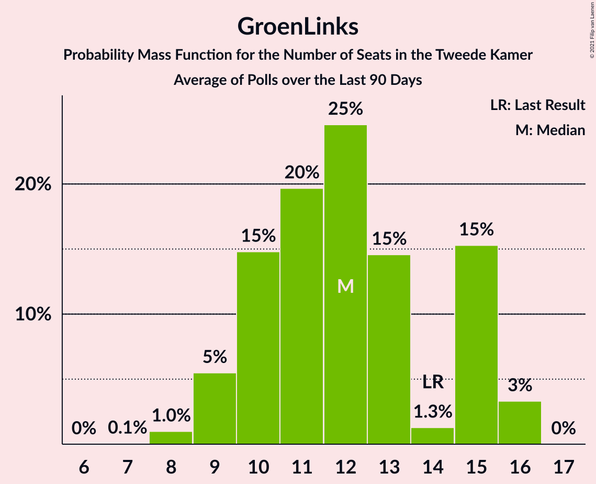

# GroenLinks

<a href="#voting-intentions">Voting Intentions</a> | <a href="#seats">Seats</a>

## Voting Intentions

Last result: **5.2%** (General Election of 17 March 2021)

### Confidence Intervals

| Period     | Polling firm/Commissioner(s) | Median | 80% Confidence Interval | 90% Confidence Interval | 95% Confidence Interval | 99% Confidence Interval |
|:----------:|:----------------:|:-----------:|:-----------------------:|:-----------------------:|:-----------------------:|:-----------------------:|
| N/A | [Poll Average](average.html) | 6.2% | 5.3–7.8% | 5.0–8.3% | 4.8–8.6% | 4.3–9.3% |
| [15–16 October 2021](2021-10-16-Peilnl.html) | Peil.nl | 6.0% | 5.4–6.6% | 5.3–6.7% | 5.2–6.9% | 4.9–7.2% |
| [8–11 October 2021](2021-10-11-IOResearch.html) | I&O Research | 7.3% | N/A | N/A | N/A | N/A |
| [8–9 October 2021](2021-10-09-Peilnl.html) | Peil.nl | 6.0% | N/A | N/A | N/A | N/A |
| [1–2 October 2021](2021-10-02-Peilnl.html) | Peil.nl | 6.0% | 5.4–6.6% | 5.3–6.7% | 5.2–6.9% | 4.9–7.2% |
| [24–27 September 2021](2021-09-27-Ipsos.html) | Ipsos | 5.7% | 4.9–6.8% | 4.6–7.1% | 4.5–7.4% | 4.1–7.9% |
| [24–25 September 2021](2021-09-25-Peilnl.html) | Peil.nl | 6.0% | 5.4–6.6% | 5.3–6.7% | 5.2–6.9% | 4.9–7.2% |
| [17–20 September 2021](2021-09-20-Kantar.html) | Kantar | 7.3% | 6.4–8.5% | 6.1–8.8% | 5.9–9.1% | 5.5–9.7% |
| [17–18 September 2021](2021-09-18-Peilnl.html) | Peil.nl | 6.0% | 5.4–6.6% | 5.3–6.7% | 5.2–6.9% | 4.9–7.2% |
| [10–13 September 2021](2021-09-13-IOResearch.html) | I&O Research | 6.8% | N/A | N/A | N/A | N/A |
| [10–11 September 2021](2021-09-11-Peilnl.html) | Peil.nl | 5.3% | 4.8–5.9% | 4.7–6.0% | 4.5–6.2% | 4.3–6.4% |
| [3–4 September 2021](2021-09-04-Peilnl.html) | Peil.nl | 5.3% | 4.8–5.9% | 4.7–6.0% | 4.5–6.2% | 4.3–6.4% |
| [27–30 August 2021](2021-08-30-Ipsos.html) | Ipsos   EenVandaag | 5.8% | 4.9–6.8% | 4.7–7.1% | 4.5–7.4% | 4.1–7.9% |
| [20–21 August 2021](2021-08-21-Peilnl.html) | Peil.nl | 4.7% | 4.2–5.2% | 4.1–5.3% | 4.0–5.5% | 3.7–5.8% |
| [23–26 July 2021](2021-07-26-Ipsos.html) | Ipsos   EenVandaag | 5.0% | 4.2–6.0% | 4.0–6.3% | 3.8–6.5% | 3.4–7.0% |
| [23–24 July 2021](2021-07-24-Peilnl.html) | Peil.nl | 4.7% | 4.2–5.2% | 4.1–5.3% | 4.0–5.5% | 3.7–5.8% |
| [9–12 July 2021](2021-07-12-IOResearch.html) | I&O Research | 5.9% | 5.3–6.6% | 5.1–6.8% | 5.0–7.0% | 4.7–7.4% |
| [25–28 June 2021](2021-06-28-Ipsos.html) | Ipsos   EenVandaag | 4.9% | 4.2–5.9% | 3.9–6.2% | 3.8–6.5% | 3.4–7.0% |
| [27 June 2021](2021-06-27-Peilnl.html) | Peil.nl | 4.7% | 4.2–5.2% | 4.1–5.3% | 4.0–5.5% | 3.7–5.8% |
| [20 June 2021](2021-06-20-Peilnl.html) | Peil.nl | 4.7% | 4.2–5.2% | 4.1–5.3% | 4.0–5.5% | 3.7–5.8% |
| [12 June 2021](2021-06-12-Peilnl.html) | Peil.nl | 4.7% | 4.2–5.2% | 4.1–5.3% | 4.0–5.5% | 3.7–5.8% |
| [4–7 June 2021](2021-06-07-IOResearch.html) | I&O Research | 5.7% | 5.1–6.5% | 4.9–6.7% | 4.7–6.9% | 4.4–7.3% |
| [4–5 June 2021](2021-06-05-Peilnl.html) | Peil.nl | 4.7% | 4.2–5.2% | 4.1–5.3% | 4.0–5.5% | 3.7–5.8% |
| [28–29 May 2021](2021-05-29-Peilnl.html) | Peil.nl | 4.7% | 4.2–5.2% | 4.1–5.3% | 4.0–5.5% | 3.7–5.8% |
| [21–23 May 2021](2021-05-23-Ipsos.html) | Ipsos   EenVandaag | 4.3% | 3.5–5.2% | 3.3–5.5% | 3.2–5.7% | 2.9–6.2% |
| [21–22 May 2021](2021-05-22-Peilnl.html) | Peil.nl | 4.7% | 4.2–5.2% | 4.1–5.3% | 4.0–5.5% | 3.7–5.8% |
| [14–15 May 2021](2021-05-15-Peilnl.html) | Peil.nl | 4.7% | 4.2–5.2% | 4.1–5.3% | 4.0–5.5% | 3.7–5.8% |
| [7–9 May 2021](2021-05-09-Peilnl.html) | Peil.nl | 4.7% | 4.2–5.2% | 4.1–5.3% | 4.0–5.5% | 3.7–5.8% |
| [30 April–3 May 2021](2021-05-03-IOResearch.html) | I&O Research | 5.0% | 4.4–5.7% | 4.3–5.9% | 4.1–6.1% | 3.9–6.4% |
| [30 April–1 May 2021](2021-05-01-Peilnl.html) | Peil.nl | 4.7% | 4.2–5.2% | 4.1–5.3% | 4.0–5.5% | 3.7–5.8% |
| [23–24 April 2021](2021-04-24-Peilnl.html) | Peil.nl | 4.7% | 4.2–5.2% | 4.1–5.3% | 4.0–5.5% | 3.7–5.8% |
| [16–19 April 2021](2021-04-19-Ipsos.html) | Ipsos | 4.7% | 4.0–5.7% | 3.8–6.0% | 3.6–6.2% | 3.2–6.7% |
| [16–17 April 2021](2021-04-17-Peilnl.html) | Peil.nl | 4.7% | 4.2–5.2% | 4.1–5.3% | 4.0–5.5% | 3.7–5.8% |
| [9–12 April 2021](2021-04-12-IOResearch.html) | I&O Research | 4.2% | 3.7–4.8% | 3.5–5.0% | 3.4–5.2% | 3.2–5.5% |
| [9–10 April 2021](2021-04-10-Peilnl.html) | Peil.nl | 4.7% | 4.2–5.2% | 4.1–5.3% | 4.0–5.5% | 3.7–5.8% |
| [3–4 April 2021](2021-04-04-Peilnl.html) | Peil.nl | 5.3% | 4.8–5.9% | 4.7–6.1% | 4.6–6.2% | 4.4–6.5% |
| [26–27 March 2021](2021-03-27-Peilnl.html) | Peil.nl | 4.7% | 4.2–5.2% | 4.1–5.3% | 4.0–5.5% | 3.7–5.8% |

### Probability Mass Function

The following table shows the probability mass function per percentage block of voting intentions for the [poll average](average.html) for GroenLinks.

| Voting Intentions | Probability | Accumulated | Special Marks |
|:-----------------:|:-----------:|:-----------:|:-------------:|
| 2.5–3.5% | 0% | 100% |  |
| 3.5–4.5% | 1.2% | 100% |  |
| 4.5–5.5% | 16% | 98.8% | Last Result |
| 5.5–6.5% | 45% | 83% | Median |
| 6.5–7.5% | 23% | 37% |  |
| 7.5–8.5% | 12% | 15% |  |
| 8.5–9.5% | 3% | 3% |  |
| 9.5–10.5% | 0.2% | 0.2% |  |
| 10.5–11.5% | 0% | 0% |  |

## Seats

Last result: **8** seats (General Election of 17 March 2021)

### Confidence Intervals

| Period     | Polling firm/Commissioner(s) | Median | 80% Confidence Interval | 90% Confidence Interval | 95% Confidence Interval | 99% Confidence Interval |
|:----------:|:----------------:|:------:|:-----------------------:|:-----------------------:|:-----------------------:|:-----------------------:|
| N/A | [Poll Average](average.html) | 10 | 8–13 | 7–13 | 6–13 | 6–13 |
| [15–16 October 2021](2021-10-16-Peilnl.html) | Peil.nl | 8 | 8–10 | 8–10 | 8–10 | 8–10 |
| [8–11 October 2021](2021-10-11-IOResearch.html) | I&O Research |  |  |  |  |  |
| [8–9 October 2021](2021-10-09-Peilnl.html) | Peil.nl |  |  |  |  |  |
| [1–2 October 2021](2021-10-02-Peilnl.html) | Peil.nl | 9 | 9–10 | 9–10 | 9–10 | 9–10 |
| [24–27 September 2021](2021-09-27-Ipsos.html) | Ipsos | 9 | 7–10 | 6–10 | 6–11 | 6–12 |
| [24–25 September 2021](2021-09-25-Peilnl.html) | Peil.nl | 9 | 9–11 | 8–11 | 8–11 | 8–12 |
| [17–20 September 2021](2021-09-20-Kantar.html) | Kantar | 13 | 12–13 | 12–13 | 11–13 | 9–13 |
| [17–18 September 2021](2021-09-18-Peilnl.html) | Peil.nl | 10 | 8–10 | 7–11 | 7–11 | 7–11 |
| [10–13 September 2021](2021-09-13-IOResearch.html) | I&O Research |  |  |  |  |  |
| [10–11 September 2021](2021-09-11-Peilnl.html) | Peil.nl | 9 | 8–9 | 8–9 | 6–9 | 6–9 |
| [3–4 September 2021](2021-09-04-Peilnl.html) | Peil.nl | 8 | 8–10 | 8–10 | 6–10 | 6–10 |
| [27–30 August 2021](2021-08-30-Ipsos.html) | Ipsos   EenVandaag | 8 | 7–9 | 7–9 | 7–10 | 6–11 |
| [20–21 August 2021](2021-08-21-Peilnl.html) | Peil.nl | 5 | 5–8 | 5–8 | 5–8 | 5–8 |
| [23–26 July 2021](2021-07-26-Ipsos.html) | Ipsos   EenVandaag | 9 | 7–9 | 6–9 | 6–9 | 5–9 |
| [23–24 July 2021](2021-07-24-Peilnl.html) | Peil.nl | 6 | 5–7 | 5–7 | 5–7 | 5–7 |
| [9–12 July 2021](2021-07-12-IOResearch.html) | I&O Research | 9 | 7–11 | 7–11 | 7–11 | 7–11 |
| [25–28 June 2021](2021-06-28-Ipsos.html) | Ipsos   EenVandaag | 7 | 7 | 7–8 | 7–8 | 6–9 |
| [27 June 2021](2021-06-27-Peilnl.html) | Peil.nl | 8 | 7–8 | 7–8 | 7–8 | 7–9 |
| [20 June 2021](2021-06-20-Peilnl.html) | Peil.nl | 8 | 7–8 | 7–8 | 7–8 | 7–9 |
| [12 June 2021](2021-06-12-Peilnl.html) | Peil.nl | 8 | 8 | 8 | 7–8 | 6–8 |
| [4–7 June 2021](2021-06-07-IOResearch.html) | I&O Research | 9 | 9 | 9 | 9 | 9–10 |
| [4–5 June 2021](2021-06-05-Peilnl.html) | Peil.nl | 8 | 7–8 | 6–8 | 6–9 | 6–9 |
| [28–29 May 2021](2021-05-29-Peilnl.html) | Peil.nl | 6 | 6–7 | 6–8 | 6–8 | 5–9 |
| [21–23 May 2021](2021-05-23-Ipsos.html) | Ipsos   EenVandaag | 7 | 6–8 | 5–8 | 4–8 | 4–10 |
| [21–22 May 2021](2021-05-22-Peilnl.html) | Peil.nl | 6 | 6–7 | 6–8 | 6–8 | 5–9 |
| [14–15 May 2021](2021-05-15-Peilnl.html) | Peil.nl | 6 | 6–7 | 6–8 | 6–8 | 5–9 |
| [7–9 May 2021](2021-05-09-Peilnl.html) | Peil.nl | 7 | 6–8 | 6–8 | 5–9 | 5–9 |
| [30 April–3 May 2021](2021-05-03-IOResearch.html) | I&O Research | 7 | 7–8 | 7–8 | 6–8 | 6–8 |
| [30 April–1 May 2021](2021-05-01-Peilnl.html) | Peil.nl | 7 | 7 | 6–7 | 6–7 | 5–7 |
| [23–24 April 2021](2021-04-24-Peilnl.html) | Peil.nl | 7 | 7 | 6–7 | 6–7 | 5–7 |
| [16–19 April 2021](2021-04-19-Ipsos.html) | Ipsos | 7 | 5–9 | 5–10 | 5–10 | 5–10 |
| [16–17 April 2021](2021-04-17-Peilnl.html) | Peil.nl | 7 | 6–7 | 6–8 | 5–9 | 5–9 |
| [9–12 April 2021](2021-04-12-IOResearch.html) | I&O Research | 6 | 5–7 | 5–7 | 5–7 | 5–8 |
| [9–10 April 2021](2021-04-10-Peilnl.html) | Peil.nl | 7 | 6–7 | 6–7 | 6–7 | 6–8 |
| [3–4 April 2021](2021-04-04-Peilnl.html) | Peil.nl | 7 | 7 | 7 | 7 | 7 |
| [26–27 March 2021](2021-03-27-Peilnl.html) | Peil.nl | 8 | 8 | 8 | 8 | 7–8 |

### Probability Mass Function

The following table shows the probability mass function per seat for the [poll average](average.html) for GroenLinks.

| Number of Seats | Probability | Accumulated | Special Marks |
|:---------------:|:-----------:|:-----------:|:-------------:|
| 6 | 3% | 100% |  |
| 7 | 5% | 97% |  |
| 8 | 23% | 92% | Last Result |
| 9 | 19% | 69% |  |
| 10 | 16% | 50% | Median |
| 11 | 1.0% | 34% |  |
| 12 | 5% | 33% |  |
| 13 | 28% | 28% |  |
| 14 | 0% | 0.1% |  |
| 15 | 0% | 0% |  |

