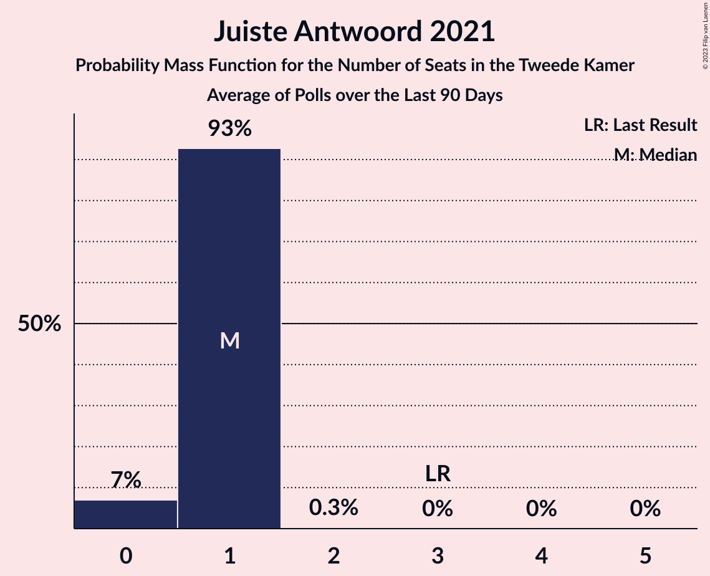

# Juiste Antwoord 2021

<a href="#voting-intentions">Voting Intentions</a> | <a href="#seats">Seats</a>

## Voting Intentions

Last result: **2.4%** (General Election of 17 March 2021)

### Confidence Intervals

| Period     | Polling firm/Commissioner(s) | Median | 80% Confidence Interval | 90% Confidence Interval | 95% Confidence Interval | 99% Confidence Interval |
|:----------:|:----------------:|:-----------:|:-----------------------:|:-----------------------:|:-----------------------:|:-----------------------:|
| N/A | [Poll Average](average.html) | 3.5% | 2.9–4.3% | 2.7–4.5% | 2.5–4.7% | 2.2–5.1% |
| [9–12 July 2021](2021-07-12-IOResearch.html) | I&O Research | 4.0% | 3.5–4.6% | 3.4–4.8% | 3.2–4.9% | 3.0–5.2% |
| [25–28 June 2021](2021-06-28-Ipsos.html) | Ipsos   EenVandaag | 3.2% | 2.6–4.0% | 2.4–4.2% | 2.2–4.4% | 2.0–4.9% |
| [27 June 2021](2021-06-27-Peilnl.html) | Peil.nl | 3.3% | 2.9–3.8% | 2.8–3.9% | 2.7–4.0% | 2.6–4.3% |
| [20 June 2021](2021-06-20-Peilnl.html) | Peil.nl | 3.3% | N/A | N/A | N/A | N/A |
| [12 June 2021](2021-06-12-Peilnl.html) | Peil.nl | 4.0% | N/A | N/A | N/A | N/A |
| [4–7 June 2021](2021-06-07-IOResearch.html) | I&O Research | 3.9% | 3.4–4.5% | 3.2–4.7% | 3.1–4.9% | 2.9–5.2% |
| [4–5 June 2021](2021-06-05-Peilnl.html) | Peil.nl | 4.0% | 3.6–4.5% | 3.4–4.6% | 3.4–4.8% | 3.2–5.0% |
| [28–29 May 2021](2021-05-29-Peilnl.html) | Peil.nl | 4.0% | 3.6–4.5% | 3.4–4.6% | 3.4–4.8% | 3.2–5.0% |
| [21–23 May 2021](2021-05-23-Ipsos.html) | Ipsos   EenVandaag | 4.0% | 3.3–4.9% | 3.1–5.1% | 2.9–5.3% | 2.6–5.8% |
| [21–22 May 2021](2021-05-22-Peilnl.html) | Peil.nl | 4.0% | 3.6–4.5% | 3.4–4.6% | 3.4–4.8% | 3.2–5.0% |
| [14–15 May 2021](2021-05-15-Peilnl.html) | Peil.nl | 4.0% | 3.6–4.5% | 3.4–4.6% | 3.4–4.8% | 3.2–5.0% |
| [7–9 May 2021](2021-05-09-Peilnl.html) | Peil.nl | 4.0% | 3.6–4.5% | 3.4–4.6% | 3.4–4.8% | 3.2–5.0% |
| [30 April–3 May 2021](2021-05-03-IOResearch.html) | I&O Research | 3.8% | 3.3–4.5% | 3.2–4.6% | 3.0–4.8% | 2.8–5.1% |
| [30 April–1 May 2021](2021-05-01-Peilnl.html) | Peil.nl | 4.0% | 3.6–4.5% | 3.4–4.6% | 3.4–4.8% | 3.2–5.0% |
| [23–24 April 2021](2021-04-24-Peilnl.html) | Peil.nl | 4.0% | 3.6–4.5% | 3.4–4.6% | 3.4–4.8% | 3.2–5.0% |
| [16–19 April 2021](2021-04-19-Ipsos.html) | Ipsos | 2.9% | 2.3–3.7% | 2.1–3.9% | 2.0–4.1% | 1.8–4.5% |
| [16–17 April 2021](2021-04-17-Peilnl.html) | Peil.nl | 3.3% | 2.9–3.8% | 2.8–3.9% | 2.7–4.0% | 2.6–4.3% |
| [9–12 April 2021](2021-04-12-IOResearch.html) | I&O Research | 3.8% | 3.3–4.4% | 3.2–4.6% | 3.0–4.7% | 2.8–5.0% |
| [9–10 April 2021](2021-04-10-Peilnl.html) | Peil.nl | 3.3% | 2.9–3.8% | 2.8–3.9% | 2.7–4.0% | 2.6–4.3% |
| [3–4 April 2021](2021-04-04-Peilnl.html) | Peil.nl | 3.3% | 2.9–3.8% | 2.8–3.9% | 2.7–4.0% | 2.6–4.3% |
| [26–27 March 2021](2021-03-27-Peilnl.html) | Peil.nl | 3.3% | 2.9–3.8% | 2.8–3.9% | 2.7–4.0% | 2.6–4.3% |

### Probability Mass Function

The following table shows the probability mass function per percentage block of voting intentions for the [poll average](average.html) for Juiste Antwoord 2021.

| Voting Intentions | Probability | Accumulated | Special Marks |
|:-----------------:|:-----------:|:-----------:|:-------------:|
| 0.5–1.5% | 0% | 100% |  |
| 1.5–2.5% | 3% | 100% | Last Result |
| 2.5–3.5% | 49% | 97% |  |
| 3.5–4.5% | 44% | 48% | Median |
| 4.5–5.5% | 4% | 4% |  |
| 5.5–6.5% | 0% | 0% |  |

## Seats

Last result: **3** seats (General Election of 17 March 2021)

### Confidence Intervals

| Period     | Polling firm/Commissioner(s) | Median | 80% Confidence Interval | 90% Confidence Interval | 95% Confidence Interval | 99% Confidence Interval |
|:----------:|:----------------:|:------:|:-----------------------:|:-----------------------:|:-----------------------:|:-----------------------:|
| N/A | [Poll Average](average.html) | 6 | 3–6 | 3–6 | 3–7 | 3–7 |
| [9–12 July 2021](2021-07-12-IOResearch.html) | I&O Research | 6 | 6 | 6–7 | 6–7 | 5–9 |
| [25–28 June 2021](2021-06-28-Ipsos.html) | Ipsos   EenVandaag | 3 | 3–4 | 3–6 | 3–6 | 3–6 |
| [27 June 2021](2021-06-27-Peilnl.html) | Peil.nl | 6 | 4–6 | 4–6 | 4–6 | 4–6 |
| [20 June 2021](2021-06-20-Peilnl.html) | Peil.nl |  |  |  |  |  |
| [12 June 2021](2021-06-12-Peilnl.html) | Peil.nl |  |  |  |  |  |
| [4–7 June 2021](2021-06-07-IOResearch.html) | I&O Research | 6 | 6 | 5–6 | 4–6 | 4–7 |
| [4–5 June 2021](2021-06-05-Peilnl.html) | Peil.nl | 6 | 6–8 | 6–8 | 5–8 | 5–8 |
| [28–29 May 2021](2021-05-29-Peilnl.html) | Peil.nl | 6 | 5–6 | 5–6 | 5–6 | 5–7 |
| [21–23 May 2021](2021-05-23-Ipsos.html) | Ipsos   EenVandaag | 5 | 4–7 | 4–7 | 4–8 | 3–10 |
| [21–22 May 2021](2021-05-22-Peilnl.html) | Peil.nl | 6 | 5–6 | 5–6 | 5–6 | 5–7 |
| [14–15 May 2021](2021-05-15-Peilnl.html) | Peil.nl | 6 | 5–6 | 5–6 | 5–6 | 5–7 |
| [7–9 May 2021](2021-05-09-Peilnl.html) | Peil.nl | 6 | 5–7 | 5–7 | 4–7 | 4–8 |
| [30 April–3 May 2021](2021-05-03-IOResearch.html) | I&O Research | 6 | 6 | 6 | 5–6 | 4–7 |
| [30 April–1 May 2021](2021-05-01-Peilnl.html) | Peil.nl | 5 | 5 | 5–6 | 5–6 | 5–6 |
| [23–24 April 2021](2021-04-24-Peilnl.html) | Peil.nl | 5 | 5 | 5–6 | 5–6 | 5–6 |
| [16–19 April 2021](2021-04-19-Ipsos.html) | Ipsos | 4 | 3–4 | 3–5 | 3–5 | 3–6 |
| [16–17 April 2021](2021-04-17-Peilnl.html) | Peil.nl | 5 | 4–5 | 3–5 | 3–6 | 3–6 |
| [9–12 April 2021](2021-04-12-IOResearch.html) | I&O Research | 5 | 4–6 | 4–6 | 4–6 | 4–7 |
| [9–10 April 2021](2021-04-10-Peilnl.html) | Peil.nl | 4 | 4 | 4 | 4–5 | 4–6 |
| [3–4 April 2021](2021-04-04-Peilnl.html) | Peil.nl | 5 | 5 | 5 | 5 | 5 |
| [26–27 March 2021](2021-03-27-Peilnl.html) | Peil.nl | 5 | 5 | 5 | 5 | 4–6 |

### Probability Mass Function

The following table shows the probability mass function per seat for the [poll average](average.html) for Juiste Antwoord 2021.

| Number of Seats | Probability | Accumulated | Special Marks |
|:---------------:|:-----------:|:-----------:|:-------------:|
| 3 | 30% | 100% | Last Result |
| 4 | 12% | 70% |  |
| 5 | 1.2% | 58% |  |
| 6 | 55% | 57% | Median |
| 7 | 2% | 3% |  |
| 8 | 0.1% | 0.3% |  |
| 9 | 0.2% | 0.2% |  |
| 10 | 0% | 0% |  |

