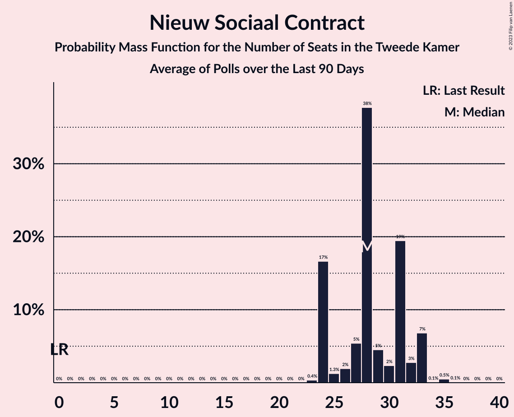

# Nieuw Sociaal Contract

<a href="#voting-intentions">Voting Intentions</a> | <a href="#seats">Seats</a>

## Voting Intentions

Last result: **0.0%** (General Election of 17 March 2021)

### Confidence Intervals

| Period     | Polling firm/Commissioner(s) | Median | 80% Confidence Interval | 90% Confidence Interval | 95% Confidence Interval | 99% Confidence Interval |
|:----------:|:----------------:|:-----------:|:-----------------------:|:-----------------------:|:-----------------------:|:-----------------------:|
| N/A | [Poll Average](average.html) | 15.9% | 14.7–17.7% | 14.4–18.1% | 14.2–18.5% | 13.8–19.1% |
| [17–18 November 2023](2023-11-18-Peilnl.html) | Peil.nl | 15.3% | 14.4–16.1% | 14.2–16.4% | 14.0–16.6% | 13.6–17.0% |
| [12–14 November 2023](2023-11-14-IOResearch.html) | I&O Research | 15.6% | 14.7–16.6% | 14.4–16.9% | 14.2–17.2% | 13.8–17.7% |
| [10–13 November 2023](2023-11-13-Ipsos.html) | Ipsos   EenVandaag | 16.7% | 16.2–18.4% | 15.9–18.7% | 15.7–19.0% | 15.2–19.5% |
| [10–11 November 2023](2023-11-11-Peilnl.html) | Peil.nl | 18.6% | 17.7–19.5% | 17.5–19.8% | 17.2–20.0% | 16.8–20.5% |
| [6–7 November 2023](2023-11-07-IOResearch.html) | I&O Research | 18.5% | 17.5–19.6% | 17.2–19.9% | 16.9–20.2% | 16.4–20.7% |
| [3–4 November 2023](2023-11-04-Peilnl.html) | Peil.nl | 19.8% | 18.9–20.8% | 18.6–21.0% | 18.4–21.3% | 18.0–21.7% |
| [27–30 October 2023](2023-10-30-Ipsos.html) | Ipsos   EenVandaag | 16.8% | 16.1–18.3% | 15.8–18.6% | 15.5–18.9% | 15.0–19.5% |
| [27–28 October 2023](2023-10-28-Peilnl.html) | Peil.nl | 20.6% | 19.6–21.5% | 19.4–21.8% | 19.2–22.1% | 18.7–22.5% |
| [22–24 October 2023](2023-10-24-IOResearch.html) | I&O Research | 17.4% | 16.2–18.7% | 15.9–19.1% | 15.6–19.4% | 15.0–20.0% |
| [20–21 October 2023](2023-10-21-Peilnl.html) | Peil.nl | 18.6% | N/A | N/A | N/A | N/A |
| [13–16 October 2023](2023-10-16-Ipsos.html) | Ipsos   EenVandaag | 17.4% | 15.9–19.0% | 15.5–19.4% | 15.2–19.8% | 14.5–20.6% |
| [13–14 October 2023](2023-10-14-Peilnl.html) | Peil.nl | 18.6% | 17.7–19.5% | 17.4–19.8% | 17.2–20.0% | 16.8–20.5% |
| [6–9 October 2023](2023-10-09-IOResearch.html) | I&O Research | 16.5% | 15.5–17.5% | 15.2–17.8% | 15.0–18.1% | 14.6–18.6% |
| [6–7 October 2023](2023-10-07-Peilnl.html) | Peil.nl | 18.6% | N/A | N/A | N/A | N/A |
| [22–25 September 2023](2023-09-25-IOResearch.html) | I&O Research | 16.0% | 14.8–17.3% | 14.4–17.7% | 14.2–18.0% | 13.6–18.6% |
| [22–24 September 2023](2023-09-24-Ipsos.html) | Ipsos   EenVandaag | 15.8% | 14.4–17.3% | 14.0–17.8% | 13.7–18.2% | 13.0–18.9% |
| [22–23 September 2023](2023-09-23-Peilnl.html) | Peil.nl | 17.9% | 17.1–18.9% | 16.8–19.1% | 16.6–19.4% | 16.2–19.8% |
| [8–11 September 2023](2023-09-11-IOResearch.html) | I&O Research | 18.0% | 16.8–19.3% | 16.5–19.6% | 16.2–20.0% | 15.7–20.6% |
| [8–9 September 2023](2023-09-09-Peilnl.html) | Peil.nl | 18.6% | 17.7–19.5% | 17.4–19.8% | 17.2–20.0% | 16.8–20.5% |
| [1–4 September 2023](2023-09-04-Ipsos.html) | Ipsos   EenVandaag | 17.3% | 15.8–19.0% | 15.4–19.5% | 15.0–19.9% | 14.3–20.7% |
| [1–2 September 2023](2023-09-02-Peilnl.html) | Peil.nl | 18.6% | 17.7–19.5% | 17.4–19.8% | 17.2–20.0% | 16.8–20.5% |
| [25–26 August 2023](2023-08-26-Peilnl.html) | Peil.nl | 19.2% | 18.3–20.2% | 18.1–20.5% | 17.9–20.7% | 17.4–21.2% |
| [23–24 August 2023](2023-08-24-IOResearch.html) | I&O Research | 20.2% | 19.0–21.5% | 18.7–21.8% | 18.4–22.2% | 17.8–22.8% |
| [18–19 August 2023](2023-08-19-Peilnl.html) | Peil.nl | 0.0% | N/A | N/A | N/A | N/A |
| [21 August–24 July 2023](2023-07-24-Ipsos.html) | Ipsos   EenVandaag | 0.0% | N/A | N/A | N/A | N/A |
| [14–17 July 2023](2023-07-17-IOResearch.html) | I&O Research | 0.0% | N/A | N/A | N/A | N/A |
| [14–15 July 2023](2023-07-15-Peilnl.html) | Peil.nl | 0.0% | N/A | N/A | N/A | N/A |
| [30 June–1 July 2023](2023-07-01-Peilnl.html) | Peil.nl | 0.0% | N/A | N/A | N/A | N/A |
| [23–25 June 2023](2023-06-25-Ipsos.html) | Ipsos   EenVandaag | 0.0% | N/A | N/A | N/A | N/A |
| [16–17 June 2023](2023-06-17-Peilnl.html) | Peil.nl | 0.0% | N/A | N/A | N/A | N/A |
| [9–12 June 2023](2023-06-12-IOResearch.html) | I&O Research | 0.0% | N/A | N/A | N/A | N/A |
| [26–29 May 2023](2023-05-29-Ipsos.html) | Ipsos   EenVandaag | 0.0% | N/A | N/A | N/A | N/A |
| [19–20 May 2023](2023-05-20-Peilnl.html) | Peil.nl | 0.0% | N/A | N/A | N/A | N/A |
| [12–15 May 2023](2023-05-15-IOResearch.html) | I&O Research | 0.0% | N/A | N/A | N/A | N/A |
| [5–6 May 2023](2023-05-06-Peilnl.html) | Peil.nl | 0.0% | N/A | N/A | N/A | N/A |
| [24 April 2023](2023-04-24-Ipsos.html) | Ipsos   EenVandaag | 0.0% | N/A | N/A | N/A | N/A |
| [21–22 April 2023](2023-04-22-Peilnl.html) | Peil.nl | 0.0% | N/A | N/A | N/A | N/A |
| [14–17 April 2023](2023-04-17-IOResearch.html) | I&O Research | 0.0% | N/A | N/A | N/A | N/A |
| [31 March–1 April 2023](2023-04-01-Peilnl.html) | Peil.nl | 0.0% | N/A | N/A | N/A | N/A |
| [24–27 March 2023](2023-03-27-Ipsos.html) | Ipsos   EenVandaag | 0.0% | N/A | N/A | N/A | N/A |
| [23–24 March 2023](2023-03-24-Peilnl.html) | Peil.nl | 0.0% | N/A | N/A | N/A | N/A |
| [17–27 February 2023](2023-02-27-Ipsos.html) | Ipsos   EenVandaag | 0.0% | N/A | N/A | N/A | N/A |
| [24–25 February 2023](2023-02-25-Peilnl.html) | Peil.nl | 0.0% | N/A | N/A | N/A | N/A |
| [17–18 February 2023](2023-02-18-Peilnl.html) | Peil.nl | 0.0% | N/A | N/A | N/A | N/A |
| [13 February 2023](2023-02-13-IOResearch.html) | I&O Research | 0.0% | N/A | N/A | N/A | N/A |
| [10–11 February 2023](2023-02-11-Peilnl.html) | Peil.nl | 0.0% | N/A | N/A | N/A | N/A |
| [27–30 January 2023](2023-01-30-Ipsos.html) | Ipsos   EenVandaag | 0.0% | N/A | N/A | N/A | N/A |
| [13–16 January 2023](2023-01-16-IOResearch.html) | I&O Research | 0.0% | N/A | N/A | N/A | N/A |
| [13–14 January 2023](2023-01-14-Peilnl.html) | Peil.nl | 0.0% | N/A | N/A | N/A | N/A |
| [16–19 December 2022](2022-12-19-Ipsos.html) | Ipsos   EenVandaag | 0.0% | N/A | N/A | N/A | N/A |
| [16–17 December 2022](2022-12-17-Peilnl.html) | Peil.nl | 0.0% | N/A | N/A | N/A | N/A |
| [9–12 December 2022](2022-12-12-IOResearch.html) | I&O Research | 0.0% | N/A | N/A | N/A | N/A |
| [2–3 December 2022](2022-12-03-Peilnl.html) | Peil.nl | 0.0% | N/A | N/A | N/A | N/A |
| [25–28 November 2022](2022-11-28-Ipsos.html) | Ipsos   EenVandaag | 0.0% | N/A | N/A | N/A | N/A |
| [25–26 November 2022](2022-11-26-Peilnl.html) | Peil.nl | 0.0% | N/A | N/A | N/A | N/A |
| [11–14 November 2022](2022-11-14-IOResearch.html) | I&O Research | 0.0% | N/A | N/A | N/A | N/A |
| [11–12 November 2022](2022-11-12-Peilnl.html) | Peil.nl | 0.0% | N/A | N/A | N/A | N/A |
| [21–24 October 2022](2022-10-24-Ipsos.html) | Ipsos   EenVandaag | 0.0% | N/A | N/A | N/A | N/A |
| [22–23 October 2022](2022-10-23-Peilnl.html) | Peil.nl | 0.0% | N/A | N/A | N/A | N/A |
| [14–17 October 2022](2022-10-17-IOResearch.html) | I&O Research | 0.0% | N/A | N/A | N/A | N/A |
| [14–15 October 2022](2022-10-15-Peilnl.html) | Peil.nl | 0.0% | N/A | N/A | N/A | N/A |
| [23–26 September 2022](2022-09-26-Ipsos.html) | Ipsos   EenVandaag | 0.0% | N/A | N/A | N/A | N/A |
| [23–24 September 2022](2022-09-24-Peilnl.html) | Peil.nl | 0.0% | N/A | N/A | N/A | N/A |
| [9–12 September 2022](2022-09-12-IOResearch.html) | I&O Research | 0.0% | N/A | N/A | N/A | N/A |
| [26–29 August 2022](2022-08-29-Ipsos.html) | Ipsos   EenVandaag | 0.0% | N/A | N/A | N/A | N/A |
| [26–27 August 2022](2022-08-27-Peilnl.html) | Peil.nl | 0.0% | N/A | N/A | N/A | N/A |
| [5–6 August 2022](2022-08-06-Peilnl.html) | Peil.nl | 0.0% | N/A | N/A | N/A | N/A |
| [22–25 July 2022](2022-07-25-Ipsos.html) | Ipsos   EenVandaag | 0.0% | N/A | N/A | N/A | N/A |
| [15–18 July 2022](2022-07-18-IOResearch.html) | I&O Research | 0.0% | N/A | N/A | N/A | N/A |
| [8–9 July 2022](2022-07-09-Peilnl.html) | Peil.nl | 0.0% | N/A | N/A | N/A | N/A |
| [24–27 June 2022](2022-06-27-Ipsos.html) | Ipsos   EenVandaag | 0.0% | N/A | N/A | N/A | N/A |
| [24–25 June 2022](2022-06-25-Peilnl.html) | Peil.nl | 0.0% | N/A | N/A | N/A | N/A |
| [17–18 June 2022](2022-06-18-Peilnl.html) | Peil.nl | 0.0% | N/A | N/A | N/A | N/A |
| [10–13 June 2022](2022-06-13-IOResearch.html) | I&O Research | 0.0% | N/A | N/A | N/A | N/A |
| [10–11 June 2022](2022-06-11-Peilnl.html) | Peil.nl | 0.0% | N/A | N/A | N/A | N/A |
| [27–30 May 2022](2022-05-30-Ipsos.html) | Ipsos   EenVandaag | 0.0% | N/A | N/A | N/A | N/A |
| [27–28 May 2022](2022-05-28-Peilnl.html) | Peil.nl | 0.0% | N/A | N/A | N/A | N/A |
| [25–27 May 2022](2022-05-27-Kantar.html) | Kantar | 0.0% | N/A | N/A | N/A | N/A |
| [13–16 May 2022](2022-05-16-IOResearch.html) | I&O Research | 0.0% | N/A | N/A | N/A | N/A |
| [13–14 May 2022](2022-05-14-Peilnl.html) | Peil.nl | 0.0% | N/A | N/A | N/A | N/A |
| [22–25 April 2022](2022-04-25-Ipsos.html) | Ipsos   EenVandaag | 0.0% | N/A | N/A | N/A | N/A |
| [22–23 April 2022](2022-04-23-Peilnl.html) | Peil.nl | 0.0% | N/A | N/A | N/A | N/A |
| [8–11 April 2022](2022-04-11-IOResearch.html) | I&O Research | 0.0% | N/A | N/A | N/A | N/A |
| [8–9 April 2022](2022-04-09-Peilnl.html) | Peil.nl | 0.0% | N/A | N/A | N/A | N/A |
| [1–2 April 2022](2022-04-02-Peilnl.html) | Peil.nl | 0.0% | N/A | N/A | N/A | N/A |
| [25–27 March 2022](2022-03-27-Ipsos.html) | Ipsos   EenVandaag | 0.0% | N/A | N/A | N/A | N/A |
| [25–26 March 2022](2022-03-26-Peilnl.html) | Peil.nl | 0.0% | N/A | N/A | N/A | N/A |
| [18–19 March 2022](2022-03-19-Peilnl.html) | Peil.nl | 0.0% | N/A | N/A | N/A | N/A |
| [11–12 March 2022](2022-03-12-Peilnl.html) | Peil.nl | 0.0% | N/A | N/A | N/A | N/A |
| [9–11 March 2022](2022-03-11-Kantar.html) | Kantar | 0.0% | N/A | N/A | N/A | N/A |
| [4–5 March 2022](2022-03-05-Peilnl.html) | Peil.nl | 0.0% | N/A | N/A | N/A | N/A |
| [25–28 February 2022](2022-02-28-Ipsos.html) | Ipsos   EenVandaag | 0.0% | N/A | N/A | N/A | N/A |
| [26–27 February 2022](2022-02-27-Peilnl.html) | Peil.nl | 0.0% | N/A | N/A | N/A | N/A |
| [18–19 February 2022](2022-02-19-Peilnl.html) | Peil.nl | 0.0% | N/A | N/A | N/A | N/A |
| [11–14 February 2022](2022-02-14-IOResearch.html) | I&O Research | 0.0% | N/A | N/A | N/A | N/A |
| [11–12 February 2022](2022-02-12-Peilnl.html) | Peil.nl | 0.0% | N/A | N/A | N/A | N/A |
| [4–5 February 2022](2022-02-05-Peilnl.html) | Peil.nl | 0.0% | N/A | N/A | N/A | N/A |
| [27–31 January 2022](2022-01-31-Kantar.html) | Kantar | 0.0% | N/A | N/A | N/A | N/A |
| [28–29 January 2022](2022-01-29-Peilnl.html) | Peil.nl | 0.0% | N/A | N/A | N/A | N/A |
| [21–24 January 2022](2022-01-24-Ipsos.html) | Ipsos   EenVandaag | 0.0% | N/A | N/A | N/A | N/A |
| [21–22 January 2022](2022-01-22-Peilnl.html) | Peil.nl | 0.0% | N/A | N/A | N/A | N/A |
| [14–17 January 2022](2022-01-17-IOResearch.html) | I&O Research | 0.0% | N/A | N/A | N/A | N/A |
| [14–15 January 2022](2022-01-15-Peilnl.html) | Peil.nl | 0.0% | N/A | N/A | N/A | N/A |
| [24–25 December 2021](2021-12-25-Peilnl.html) | Peil.nl | 0.0% | N/A | N/A | N/A | N/A |
| [15–20 December 2021](2021-12-20-Kantar.html) | Kantar | 0.0% | N/A | N/A | N/A | N/A |
| [17–20 December 2021](2021-12-20-Ipsos.html) | Ipsos   EenVandaag | 0.0% | N/A | N/A | N/A | N/A |
| [17–18 December 2021](2021-12-18-Peilnl.html) | Peil.nl | 0.0% | N/A | N/A | N/A | N/A |
| [12 December 2021](2021-12-12-Peilnl.html) | Peil.nl | 0.0% | N/A | N/A | N/A | N/A |
| [3–6 December 2021](2021-12-06-IOResearch.html) | I&O Research | 0.0% | N/A | N/A | N/A | N/A |
| [3–5 December 2021](2021-12-05-Peilnl.html) | Peil.nl | 0.0% | N/A | N/A | N/A | N/A |
| [26–29 November 2021](2021-11-29-Ipsos.html) | Ipsos   EenVandaag | 0.0% | N/A | N/A | N/A | N/A |
| [26–27 November 2021](2021-11-27-Peilnl.html) | Peil.nl | 0.0% | N/A | N/A | N/A | N/A |
| [19–20 November 2021](2021-11-20-Peilnl.html) | Peil.nl | 0.0% | N/A | N/A | N/A | N/A |
| [12–15 November 2021](2021-11-15-IOResearch.html) | I&O Research | 0.0% | N/A | N/A | N/A | N/A |
| [5–9 November 2021](2021-11-09-Kantar.html) | Kantar | 0.0% | N/A | N/A | N/A | N/A |
| [7 November 2021](2021-11-07-Peilnl.html) | Peil.nl | 0.0% | N/A | N/A | N/A | N/A |
| [29–30 October 2021](2021-10-30-Peilnl.html) | Peil.nl | 0.0% | N/A | N/A | N/A | N/A |
| [22–25 October 2021](2021-10-25-Ipsos.html) | Ipsos   EenVandaag | 0.0% | N/A | N/A | N/A | N/A |
| [15–16 October 2021](2021-10-16-Peilnl.html) | Peil.nl | 0.0% | N/A | N/A | N/A | N/A |
| [8–11 October 2021](2021-10-11-IOResearch.html) | I&O Research | 0.0% | N/A | N/A | N/A | N/A |
| [8–9 October 2021](2021-10-09-Peilnl.html) | Peil.nl | 0.0% | N/A | N/A | N/A | N/A |
| [1–2 October 2021](2021-10-02-Peilnl.html) | Peil.nl | 0.0% | N/A | N/A | N/A | N/A |
| [24–27 September 2021](2021-09-27-Ipsos.html) | Ipsos | 0.0% | N/A | N/A | N/A | N/A |
| [24–25 September 2021](2021-09-25-Peilnl.html) | Peil.nl | 0.0% | N/A | N/A | N/A | N/A |
| [17–20 September 2021](2021-09-20-Kantar.html) | Kantar | 0.0% | N/A | N/A | N/A | N/A |
| [17–18 September 2021](2021-09-18-Peilnl.html) | Peil.nl | 0.0% | N/A | N/A | N/A | N/A |
| [10–13 September 2021](2021-09-13-IOResearch.html) | I&O Research | 0.0% | N/A | N/A | N/A | N/A |
| [10–11 September 2021](2021-09-11-Peilnl.html) | Peil.nl | 0.0% | N/A | N/A | N/A | N/A |
| [3–4 September 2021](2021-09-04-Peilnl.html) | Peil.nl | 0.0% | N/A | N/A | N/A | N/A |
| [27–30 August 2021](2021-08-30-Ipsos.html) | Ipsos   EenVandaag | 0.0% | N/A | N/A | N/A | N/A |
| [20–21 August 2021](2021-08-21-Peilnl.html) | Peil.nl | 0.0% | N/A | N/A | N/A | N/A |
| [23–26 July 2021](2021-07-26-Ipsos.html) | Ipsos   EenVandaag | 0.0% | N/A | N/A | N/A | N/A |
| [23–24 July 2021](2021-07-24-Peilnl.html) | Peil.nl | 0.0% | N/A | N/A | N/A | N/A |
| [9–12 July 2021](2021-07-12-IOResearch.html) | I&O Research | 0.0% | N/A | N/A | N/A | N/A |
| [25–28 June 2021](2021-06-28-Ipsos.html) | Ipsos   EenVandaag | 0.0% | N/A | N/A | N/A | N/A |
| [27 June 2021](2021-06-27-Peilnl.html) | Peil.nl | 0.0% | N/A | N/A | N/A | N/A |
| [20 June 2021](2021-06-20-Peilnl.html) | Peil.nl | 0.0% | N/A | N/A | N/A | N/A |
| [12 June 2021](2021-06-12-Peilnl.html) | Peil.nl | 0.0% | N/A | N/A | N/A | N/A |
| [4–7 June 2021](2021-06-07-IOResearch.html) | I&O Research | 0.0% | N/A | N/A | N/A | N/A |
| [4–5 June 2021](2021-06-05-Peilnl.html) | Peil.nl | 0.0% | N/A | N/A | N/A | N/A |
| [28–29 May 2021](2021-05-29-Peilnl.html) | Peil.nl | 0.0% | N/A | N/A | N/A | N/A |
| [21–23 May 2021](2021-05-23-Ipsos.html) | Ipsos   EenVandaag | 0.0% | N/A | N/A | N/A | N/A |
| [21–22 May 2021](2021-05-22-Peilnl.html) | Peil.nl | 0.0% | N/A | N/A | N/A | N/A |
| [14–15 May 2021](2021-05-15-Peilnl.html) | Peil.nl | 0.0% | N/A | N/A | N/A | N/A |
| [7–9 May 2021](2021-05-09-Peilnl.html) | Peil.nl | 0.0% | N/A | N/A | N/A | N/A |
| [30 April–3 May 2021](2021-05-03-IOResearch.html) | I&O Research | 0.0% | N/A | N/A | N/A | N/A |
| [30 April–1 May 2021](2021-05-01-Peilnl.html) | Peil.nl | 0.0% | N/A | N/A | N/A | N/A |
| [23–24 April 2021](2021-04-24-Peilnl.html) | Peil.nl | 0.0% | N/A | N/A | N/A | N/A |
| [16–19 April 2021](2021-04-19-Ipsos.html) | Ipsos | 0.0% | N/A | N/A | N/A | N/A |
| [16–17 April 2021](2021-04-17-Peilnl.html) | Peil.nl | 0.0% | N/A | N/A | N/A | N/A |
| [9–12 April 2021](2021-04-12-IOResearch.html) | I&O Research | 0.0% | N/A | N/A | N/A | N/A |
| [9–10 April 2021](2021-04-10-Peilnl.html) | Peil.nl | 0.0% | N/A | N/A | N/A | N/A |
| [3–4 April 2021](2021-04-04-Peilnl.html) | Peil.nl | 0.0% | N/A | N/A | N/A | N/A |
| [26–27 March 2021](2021-03-27-Peilnl.html) | Peil.nl | 0.0% | N/A | N/A | N/A | N/A |

### Probability Mass Function

The following table shows the probability mass function per percentage block of voting intentions for the [poll average](average.html) for Nieuw Sociaal Contract.

| Voting Intentions | Probability | Accumulated | Special Marks |
|:-----------------:|:-----------:|:-----------:|:-------------:|
| 0.0–0.5% | 0% | 100% | Last Result |
| 0.5–1.5% | 0% | 100% |  |
| 1.5–2.5% | 0% | 100% |  |
| 2.5–3.5% | 0% | 100% |  |
| 3.5–4.5% | 0% | 100% |  |
| 4.5–5.5% | 0% | 100% |  |
| 5.5–6.5% | 0% | 100% |  |
| 6.5–7.5% | 0% | 100% |  |
| 7.5–8.5% | 0% | 100% |  |
| 8.5–9.5% | 0% | 100% |  |
| 9.5–10.5% | 0% | 100% |  |
| 10.5–11.5% | 0% | 100% |  |
| 11.5–12.5% | 0% | 100% |  |
| 12.5–13.5% | 0.2% | 100% |  |
| 13.5–14.5% | 7% | 99.8% |  |
| 14.5–15.5% | 31% | 93% |  |
| 15.5–16.5% | 31% | 63% | Median |
| 16.5–17.5% | 19% | 32% |  |
| 17.5–18.5% | 10% | 13% |  |
| 18.5–19.5% | 2% | 2% |  |
| 19.5–20.5% | 0.1% | 0.1% |  |
| 20.5–21.5% | 0% | 0% |  |

## Seats

Last result: **0** seats (General Election of 17 March 2021)

### Confidence Intervals

| Period     | Polling firm/Commissioner(s) | Median | 80% Confidence Interval | 90% Confidence Interval | 95% Confidence Interval | 99% Confidence Interval |
|:----------:|:----------------:|:------:|:-----------------------:|:-----------------------:|:-----------------------:|:-----------------------:|
| N/A | [Poll Average](average.html) | 26 | 23–27 | 23–27 | 22–27 | 22–27 |
| [17–18 November 2023](2023-11-18-Peilnl.html) | Peil.nl | 23 | 22–26 | 22–26 | 22–26 | 22–26 |
| [12–14 November 2023](2023-11-14-IOResearch.html) | I&O Research | 27 | 24–27 | 24–27 | 23–27 | 21–28 |
| [10–13 November 2023](2023-11-13-Ipsos.html) | Ipsos   EenVandaag | 26 | 26 | 26 | 26 | 26 |
| [10–11 November 2023](2023-11-11-Peilnl.html) | Peil.nl | 27 | 27–29 | 27–30 | 27–31 | 27–32 |
| [6–7 November 2023](2023-11-07-IOResearch.html) | I&O Research | 30 | 26–30 | 26–30 | 26–30 | 26–30 |
| [3–4 November 2023](2023-11-04-Peilnl.html) | Peil.nl | 30 | 29–32 | 29–32 | 29–32 | 29–32 |
| [27–30 October 2023](2023-10-30-Ipsos.html) | Ipsos   EenVandaag | 24 | 24–28 | 24–29 | 24–30 | 23–31 |
| [27–28 October 2023](2023-10-28-Peilnl.html) | Peil.nl | 31 | 30–33 | 29–33 | 29–33 | 28–35 |
| [22–24 October 2023](2023-10-24-IOResearch.html) | I&O Research | 28 | 28 | 28 | 28–29 | 25–30 |
| [20–21 October 2023](2023-10-21-Peilnl.html) | Peil.nl |  |  |  |  |  |
| [13–16 October 2023](2023-10-16-Ipsos.html) | Ipsos   EenVandaag | 26 | 26 | 26 | 26 | 25–26 |
| [13–14 October 2023](2023-10-14-Peilnl.html) | Peil.nl | 32 | 29–32 | 29–32 | 29–32 | 28–32 |
| [6–9 October 2023](2023-10-09-IOResearch.html) | I&O Research | 24 | 22–27 | 22–27 | 22–28 | 22–29 |
| [6–7 October 2023](2023-10-07-Peilnl.html) | Peil.nl |  |  |  |  |  |
| [22–25 September 2023](2023-09-25-IOResearch.html) | I&O Research | 22 | 22–27 | 22–27 | 22–27 | 22–27 |
| [22–24 September 2023](2023-09-24-Ipsos.html) | Ipsos   EenVandaag | 23 | 23–29 | 22–29 | 22–29 | 21–30 |
| [22–23 September 2023](2023-09-23-Peilnl.html) | Peil.nl | 28 | 28 | 28–29 | 28–29 | 26–29 |
| [8–11 September 2023](2023-09-11-IOResearch.html) | I&O Research | 28 | 27–30 | 26–31 | 26–31 | 26–33 |
| [8–9 September 2023](2023-09-09-Peilnl.html) | Peil.nl | 29 | 28–31 | 27–31 | 27–31 | 27–31 |
| [1–4 September 2023](2023-09-04-Ipsos.html) | Ipsos   EenVandaag | 27 | 25–28 | 23–29 | 20–30 | 20–31 |
| [1–2 September 2023](2023-09-02-Peilnl.html) | Peil.nl | 30 | 29–31 | 29–31 | 27–31 | 27–31 |
| [25–26 August 2023](2023-08-26-Peilnl.html) | Peil.nl | 31 | 28–34 | 28–34 | 28–34 | 27–34 |
| [23–24 August 2023](2023-08-24-IOResearch.html) | I&O Research | 34 | 28–34 | 28–34 | 27–34 | 27–36 |
| [18–19 August 2023](2023-08-19-Peilnl.html) | Peil.nl |  |  |  |  |  |
| [21 August–24 July 2023](2023-07-24-Ipsos.html) | Ipsos   EenVandaag |  |  |  |  |  |
| [14–17 July 2023](2023-07-17-IOResearch.html) | I&O Research |  |  |  |  |  |
| [14–15 July 2023](2023-07-15-Peilnl.html) | Peil.nl |  |  |  |  |  |
| [30 June–1 July 2023](2023-07-01-Peilnl.html) | Peil.nl |  |  |  |  |  |
| [23–25 June 2023](2023-06-25-Ipsos.html) | Ipsos   EenVandaag |  |  |  |  |  |
| [16–17 June 2023](2023-06-17-Peilnl.html) | Peil.nl |  |  |  |  |  |
| [9–12 June 2023](2023-06-12-IOResearch.html) | I&O Research |  |  |  |  |  |
| [26–29 May 2023](2023-05-29-Ipsos.html) | Ipsos   EenVandaag |  |  |  |  |  |
| [19–20 May 2023](2023-05-20-Peilnl.html) | Peil.nl |  |  |  |  |  |
| [12–15 May 2023](2023-05-15-IOResearch.html) | I&O Research |  |  |  |  |  |
| [5–6 May 2023](2023-05-06-Peilnl.html) | Peil.nl |  |  |  |  |  |
| [24 April 2023](2023-04-24-Ipsos.html) | Ipsos   EenVandaag |  |  |  |  |  |
| [21–22 April 2023](2023-04-22-Peilnl.html) | Peil.nl |  |  |  |  |  |
| [14–17 April 2023](2023-04-17-IOResearch.html) | I&O Research |  |  |  |  |  |
| [31 March–1 April 2023](2023-04-01-Peilnl.html) | Peil.nl |  |  |  |  |  |
| [24–27 March 2023](2023-03-27-Ipsos.html) | Ipsos   EenVandaag |  |  |  |  |  |
| [23–24 March 2023](2023-03-24-Peilnl.html) | Peil.nl |  |  |  |  |  |
| [17–27 February 2023](2023-02-27-Ipsos.html) | Ipsos   EenVandaag |  |  |  |  |  |
| [24–25 February 2023](2023-02-25-Peilnl.html) | Peil.nl |  |  |  |  |  |
| [17–18 February 2023](2023-02-18-Peilnl.html) | Peil.nl |  |  |  |  |  |
| [13 February 2023](2023-02-13-IOResearch.html) | I&O Research |  |  |  |  |  |
| [10–11 February 2023](2023-02-11-Peilnl.html) | Peil.nl |  |  |  |  |  |
| [27–30 January 2023](2023-01-30-Ipsos.html) | Ipsos   EenVandaag |  |  |  |  |  |
| [13–16 January 2023](2023-01-16-IOResearch.html) | I&O Research |  |  |  |  |  |
| [13–14 January 2023](2023-01-14-Peilnl.html) | Peil.nl |  |  |  |  |  |
| [16–19 December 2022](2022-12-19-Ipsos.html) | Ipsos   EenVandaag |  |  |  |  |  |
| [16–17 December 2022](2022-12-17-Peilnl.html) | Peil.nl |  |  |  |  |  |
| [9–12 December 2022](2022-12-12-IOResearch.html) | I&O Research |  |  |  |  |  |
| [2–3 December 2022](2022-12-03-Peilnl.html) | Peil.nl |  |  |  |  |  |
| [25–28 November 2022](2022-11-28-Ipsos.html) | Ipsos   EenVandaag |  |  |  |  |  |
| [25–26 November 2022](2022-11-26-Peilnl.html) | Peil.nl |  |  |  |  |  |
| [11–14 November 2022](2022-11-14-IOResearch.html) | I&O Research |  |  |  |  |  |
| [11–12 November 2022](2022-11-12-Peilnl.html) | Peil.nl |  |  |  |  |  |
| [21–24 October 2022](2022-10-24-Ipsos.html) | Ipsos   EenVandaag |  |  |  |  |  |
| [22–23 October 2022](2022-10-23-Peilnl.html) | Peil.nl |  |  |  |  |  |
| [14–17 October 2022](2022-10-17-IOResearch.html) | I&O Research |  |  |  |  |  |
| [14–15 October 2022](2022-10-15-Peilnl.html) | Peil.nl |  |  |  |  |  |
| [23–26 September 2022](2022-09-26-Ipsos.html) | Ipsos   EenVandaag |  |  |  |  |  |
| [23–24 September 2022](2022-09-24-Peilnl.html) | Peil.nl |  |  |  |  |  |
| [9–12 September 2022](2022-09-12-IOResearch.html) | I&O Research |  |  |  |  |  |
| [26–29 August 2022](2022-08-29-Ipsos.html) | Ipsos   EenVandaag |  |  |  |  |  |
| [26–27 August 2022](2022-08-27-Peilnl.html) | Peil.nl |  |  |  |  |  |
| [5–6 August 2022](2022-08-06-Peilnl.html) | Peil.nl |  |  |  |  |  |
| [22–25 July 2022](2022-07-25-Ipsos.html) | Ipsos   EenVandaag |  |  |  |  |  |
| [15–18 July 2022](2022-07-18-IOResearch.html) | I&O Research |  |  |  |  |  |
| [8–9 July 2022](2022-07-09-Peilnl.html) | Peil.nl |  |  |  |  |  |
| [24–27 June 2022](2022-06-27-Ipsos.html) | Ipsos   EenVandaag |  |  |  |  |  |
| [24–25 June 2022](2022-06-25-Peilnl.html) | Peil.nl |  |  |  |  |  |
| [17–18 June 2022](2022-06-18-Peilnl.html) | Peil.nl |  |  |  |  |  |
| [10–13 June 2022](2022-06-13-IOResearch.html) | I&O Research |  |  |  |  |  |
| [10–11 June 2022](2022-06-11-Peilnl.html) | Peil.nl |  |  |  |  |  |
| [27–30 May 2022](2022-05-30-Ipsos.html) | Ipsos   EenVandaag |  |  |  |  |  |
| [27–28 May 2022](2022-05-28-Peilnl.html) | Peil.nl |  |  |  |  |  |
| [25–27 May 2022](2022-05-27-Kantar.html) | Kantar |  |  |  |  |  |
| [13–16 May 2022](2022-05-16-IOResearch.html) | I&O Research |  |  |  |  |  |
| [13–14 May 2022](2022-05-14-Peilnl.html) | Peil.nl |  |  |  |  |  |
| [22–25 April 2022](2022-04-25-Ipsos.html) | Ipsos   EenVandaag |  |  |  |  |  |
| [22–23 April 2022](2022-04-23-Peilnl.html) | Peil.nl |  |  |  |  |  |
| [8–11 April 2022](2022-04-11-IOResearch.html) | I&O Research |  |  |  |  |  |
| [8–9 April 2022](2022-04-09-Peilnl.html) | Peil.nl |  |  |  |  |  |
| [1–2 April 2022](2022-04-02-Peilnl.html) | Peil.nl |  |  |  |  |  |
| [25–27 March 2022](2022-03-27-Ipsos.html) | Ipsos   EenVandaag |  |  |  |  |  |
| [25–26 March 2022](2022-03-26-Peilnl.html) | Peil.nl |  |  |  |  |  |
| [18–19 March 2022](2022-03-19-Peilnl.html) | Peil.nl |  |  |  |  |  |
| [11–12 March 2022](2022-03-12-Peilnl.html) | Peil.nl |  |  |  |  |  |
| [9–11 March 2022](2022-03-11-Kantar.html) | Kantar |  |  |  |  |  |
| [4–5 March 2022](2022-03-05-Peilnl.html) | Peil.nl |  |  |  |  |  |
| [25–28 February 2022](2022-02-28-Ipsos.html) | Ipsos   EenVandaag |  |  |  |  |  |
| [26–27 February 2022](2022-02-27-Peilnl.html) | Peil.nl |  |  |  |  |  |
| [18–19 February 2022](2022-02-19-Peilnl.html) | Peil.nl |  |  |  |  |  |
| [11–14 February 2022](2022-02-14-IOResearch.html) | I&O Research |  |  |  |  |  |
| [11–12 February 2022](2022-02-12-Peilnl.html) | Peil.nl |  |  |  |  |  |
| [4–5 February 2022](2022-02-05-Peilnl.html) | Peil.nl |  |  |  |  |  |
| [27–31 January 2022](2022-01-31-Kantar.html) | Kantar |  |  |  |  |  |
| [28–29 January 2022](2022-01-29-Peilnl.html) | Peil.nl |  |  |  |  |  |
| [21–24 January 2022](2022-01-24-Ipsos.html) | Ipsos   EenVandaag |  |  |  |  |  |
| [21–22 January 2022](2022-01-22-Peilnl.html) | Peil.nl |  |  |  |  |  |
| [14–17 January 2022](2022-01-17-IOResearch.html) | I&O Research |  |  |  |  |  |
| [14–15 January 2022](2022-01-15-Peilnl.html) | Peil.nl |  |  |  |  |  |
| [24–25 December 2021](2021-12-25-Peilnl.html) | Peil.nl |  |  |  |  |  |
| [15–20 December 2021](2021-12-20-Kantar.html) | Kantar |  |  |  |  |  |
| [17–20 December 2021](2021-12-20-Ipsos.html) | Ipsos   EenVandaag |  |  |  |  |  |
| [17–18 December 2021](2021-12-18-Peilnl.html) | Peil.nl |  |  |  |  |  |
| [12 December 2021](2021-12-12-Peilnl.html) | Peil.nl |  |  |  |  |  |
| [3–6 December 2021](2021-12-06-IOResearch.html) | I&O Research |  |  |  |  |  |
| [3–5 December 2021](2021-12-05-Peilnl.html) | Peil.nl |  |  |  |  |  |
| [26–29 November 2021](2021-11-29-Ipsos.html) | Ipsos   EenVandaag |  |  |  |  |  |
| [26–27 November 2021](2021-11-27-Peilnl.html) | Peil.nl |  |  |  |  |  |
| [19–20 November 2021](2021-11-20-Peilnl.html) | Peil.nl |  |  |  |  |  |
| [12–15 November 2021](2021-11-15-IOResearch.html) | I&O Research |  |  |  |  |  |
| [5–9 November 2021](2021-11-09-Kantar.html) | Kantar |  |  |  |  |  |
| [7 November 2021](2021-11-07-Peilnl.html) | Peil.nl |  |  |  |  |  |
| [29–30 October 2021](2021-10-30-Peilnl.html) | Peil.nl |  |  |  |  |  |
| [22–25 October 2021](2021-10-25-Ipsos.html) | Ipsos   EenVandaag |  |  |  |  |  |
| [15–16 October 2021](2021-10-16-Peilnl.html) | Peil.nl |  |  |  |  |  |
| [8–11 October 2021](2021-10-11-IOResearch.html) | I&O Research |  |  |  |  |  |
| [8–9 October 2021](2021-10-09-Peilnl.html) | Peil.nl |  |  |  |  |  |
| [1–2 October 2021](2021-10-02-Peilnl.html) | Peil.nl |  |  |  |  |  |
| [24–27 September 2021](2021-09-27-Ipsos.html) | Ipsos |  |  |  |  |  |
| [24–25 September 2021](2021-09-25-Peilnl.html) | Peil.nl |  |  |  |  |  |
| [17–20 September 2021](2021-09-20-Kantar.html) | Kantar |  |  |  |  |  |
| [17–18 September 2021](2021-09-18-Peilnl.html) | Peil.nl |  |  |  |  |  |
| [10–13 September 2021](2021-09-13-IOResearch.html) | I&O Research |  |  |  |  |  |
| [10–11 September 2021](2021-09-11-Peilnl.html) | Peil.nl |  |  |  |  |  |
| [3–4 September 2021](2021-09-04-Peilnl.html) | Peil.nl |  |  |  |  |  |
| [27–30 August 2021](2021-08-30-Ipsos.html) | Ipsos   EenVandaag |  |  |  |  |  |
| [20–21 August 2021](2021-08-21-Peilnl.html) | Peil.nl |  |  |  |  |  |
| [23–26 July 2021](2021-07-26-Ipsos.html) | Ipsos   EenVandaag |  |  |  |  |  |
| [23–24 July 2021](2021-07-24-Peilnl.html) | Peil.nl |  |  |  |  |  |
| [9–12 July 2021](2021-07-12-IOResearch.html) | I&O Research |  |  |  |  |  |
| [25–28 June 2021](2021-06-28-Ipsos.html) | Ipsos   EenVandaag |  |  |  |  |  |
| [27 June 2021](2021-06-27-Peilnl.html) | Peil.nl |  |  |  |  |  |
| [20 June 2021](2021-06-20-Peilnl.html) | Peil.nl |  |  |  |  |  |
| [12 June 2021](2021-06-12-Peilnl.html) | Peil.nl |  |  |  |  |  |
| [4–7 June 2021](2021-06-07-IOResearch.html) | I&O Research |  |  |  |  |  |
| [4–5 June 2021](2021-06-05-Peilnl.html) | Peil.nl |  |  |  |  |  |
| [28–29 May 2021](2021-05-29-Peilnl.html) | Peil.nl |  |  |  |  |  |
| [21–23 May 2021](2021-05-23-Ipsos.html) | Ipsos   EenVandaag |  |  |  |  |  |
| [21–22 May 2021](2021-05-22-Peilnl.html) | Peil.nl |  |  |  |  |  |
| [14–15 May 2021](2021-05-15-Peilnl.html) | Peil.nl |  |  |  |  |  |
| [7–9 May 2021](2021-05-09-Peilnl.html) | Peil.nl |  |  |  |  |  |
| [30 April–3 May 2021](2021-05-03-IOResearch.html) | I&O Research |  |  |  |  |  |
| [30 April–1 May 2021](2021-05-01-Peilnl.html) | Peil.nl |  |  |  |  |  |
| [23–24 April 2021](2021-04-24-Peilnl.html) | Peil.nl |  |  |  |  |  |
| [16–19 April 2021](2021-04-19-Ipsos.html) | Ipsos |  |  |  |  |  |
| [16–17 April 2021](2021-04-17-Peilnl.html) | Peil.nl |  |  |  |  |  |
| [9–12 April 2021](2021-04-12-IOResearch.html) | I&O Research |  |  |  |  |  |
| [9–10 April 2021](2021-04-10-Peilnl.html) | Peil.nl |  |  |  |  |  |
| [3–4 April 2021](2021-04-04-Peilnl.html) | Peil.nl |  |  |  |  |  |
| [26–27 March 2021](2021-03-27-Peilnl.html) | Peil.nl |  |  |  |  |  |

### Probability Mass Function

The following table shows the probability mass function per seat for the [poll average](average.html) for Nieuw Sociaal Contract.

| Number of Seats | Probability | Accumulated | Special Marks |
|:---------------:|:-----------:|:-----------:|:-------------:|
| 0 | 0% | 100% | Last Result |
| 1 | 0% | 100% |  |
| 2 | 0% | 100% |  |
| 3 | 0% | 100% |  |
| 4 | 0% | 100% |  |
| 5 | 0% | 100% |  |
| 6 | 0% | 100% |  |
| 7 | 0% | 100% |  |
| 8 | 0% | 100% |  |
| 9 | 0% | 100% |  |
| 10 | 0% | 100% |  |
| 11 | 0% | 100% |  |
| 12 | 0% | 100% |  |
| 13 | 0% | 100% |  |
| 14 | 0% | 100% |  |
| 15 | 0% | 100% |  |
| 16 | 0% | 100% |  |
| 17 | 0% | 100% |  |
| 18 | 0% | 100% |  |
| 19 | 0% | 100% |  |
| 20 | 0% | 100% |  |
| 21 | 0.2% | 100% |  |
| 22 | 4% | 99.7% |  |
| 23 | 22% | 96% |  |
| 24 | 7% | 74% |  |
| 25 | 2% | 68% |  |
| 26 | 40% | 66% | Median |
| 27 | 26% | 26% |  |
| 28 | 0.1% | 0.3% |  |
| 29 | 0.1% | 0.2% |  |
| 30 | 0% | 0.1% |  |
| 31 | 0.1% | 0.1% |  |
| 32 | 0% | 0% |  |

