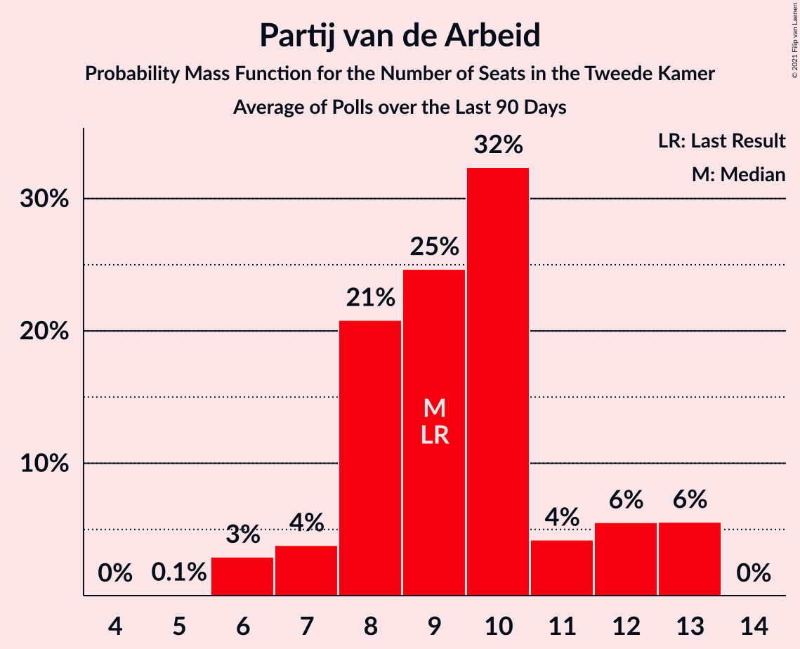

# Partij van de Arbeid

<a href="#voting-intentions">Voting Intentions</a> | <a href="#seats">Seats</a>

## Voting Intentions

Last result: **5.7%** (General Election of 15 March 2017)

### Confidence Intervals

| Period     | Polling firm/Commissioner(s) | Median | 80% Confidence Interval | 90% Confidence Interval | 95% Confidence Interval | 99% Confidence Interval |
|:----------:|:----------------:|:-----------:|:-----------------------:|:-----------------------:|:-----------------------:|:-----------------------:|
| N/A | [Poll Average](average.html) | 8.4% | 7.0–9.4% | 6.7–9.7% | 6.4–10.0% | 5.9–10.6% |
| [20 December 2020](2020-12-20-Peilnl.html) | Peil.nl | 8.7% | 8.0–9.4% | 7.8–9.6% | 7.7–9.7% | 7.4–10.1% |
| [11–14 December 2020](2020-12-14-IOResearch.html) | I&O Research | 8.7% | 7.7–9.8% | 7.5–10.1% | 7.2–10.4% | 6.8–10.9% |
| [13 December 2020](2020-12-13-Peilnl.html) | Peil.nl | 9.3% | 8.7–10.1% | 8.5–10.3% | 8.3–10.4% | 8.0–10.8% |
| [5 December 2020](2020-12-05-Peilnl.html) | Peil.nl | 8.7% | 8.0–9.4% | 7.8–9.6% | 7.7–9.7% | 7.4–10.1% |
| [27 November 2020](2020-11-27-Peilnl.html) | Peil.nl | 8.7% | 8.0–9.4% | 7.8–9.6% | 7.7–9.7% | 7.4–10.1% |
| [20–23 November 2020](2020-11-23-Ipsos.html) | Ipsos   EenVandaag | 8.3% | 7.3–9.5% | 7.0–9.8% | 6.8–10.1% | 6.3–10.7% |
| [20–21 November 2020](2020-11-21-Peilnl.html) | Peil.nl | 8.7% | 8.0–9.4% | 7.8–9.6% | 7.7–9.7% | 7.4–10.1% |
| [9–16 November 2020](2020-11-16-IOResearch.html) | I&O Research | 8.6% | 7.9–9.4% | 7.7–9.7% | 7.6–9.9% | 7.2–10.3% |
| [15 November 2020](2020-11-15-Peilnl.html) | Peil.nl | 8.7% | 8.0–9.4% | 7.8–9.6% | 7.7–9.7% | 7.4–10.1% |
| [8 November 2020](2020-11-08-Peilnl.html) | Peil.nl | 8.7% | 8.0–9.4% | 7.8–9.6% | 7.7–9.7% | 7.4–10.1% |
| [1 November 2020](2020-11-01-Peilnl.html) | Peil.nl | 8.7% | 8.0–9.4% | 7.8–9.6% | 7.7–9.7% | 7.4–10.1% |
| [23–26 October 2020](2020-10-26-Ipsos.html) | Ipsos   EenVandaag | 8.5% | 7.5–9.7% | 7.2–10.0% | 6.9–10.3% | 6.5–10.9% |
| [16–17 October 2020](2020-10-17-Peilnl.html) | Peil.nl | 9.3% | 8.7–10.1% | 8.5–10.3% | 8.3–10.4% | 8.0–10.8% |
| [9–12 October 2020](2020-10-12-IOResearch.html) | I&O Research | 8.7% | 7.9–9.6% | 7.7–9.9% | 7.5–10.1% | 7.1–10.5% |
| [11 October 2020](2020-10-11-Peilnl.html) | Peil.nl | 10.6% | 9.9–11.4% | 9.7–11.6% | 9.6–11.8% | 9.3–12.2% |
| [4 October 2020](2020-10-04-Peilnl.html) | Peil.nl | 10.6% | 9.9–11.4% | 9.7–11.6% | 9.6–11.8% | 9.3–12.2% |
| [25–29 September 2020](2020-09-29-KantarPublic.html) | Kantar Public | 7.3% | 6.4–8.4% | 6.2–8.7% | 6.0–8.9% | 5.5–9.5% |
| [27 September 2020](2020-09-27-Peilnl.html) | Peil.nl | 10.6% | 9.9–11.4% | 9.7–11.6% | 9.6–11.8% | 9.3–12.2% |
| [25–27 September 2020](2020-09-27-Ipsos.html) | Ipsos   EenVandaag | 8.8% | 7.8–10.0% | 7.5–10.4% | 7.2–10.7% | 6.8–11.3% |
| [18–19 September 2020](2020-09-19-Peilnl.html) | Peil.nl | 10.6% | 9.9–11.4% | 9.7–11.6% | 9.6–11.8% | 9.3–12.2% |
| [3–7 September 2020](2020-09-07-IOResearch.html) | I&O Research | 8.4% | 7.6–9.2% | 7.4–9.4% | 7.3–9.7% | 6.9–10.1% |
| [4–5 September 2020](2020-09-05-Peilnl.html) | Peil.nl | 9.3% | 8.6–10.0% | 8.5–10.2% | 8.3–10.4% | 8.0–10.7% |
| [28–29 August 2020](2020-08-29-Peilnl.html) | Peil.nl | 10.0% | 9.3–10.7% | 9.1–10.9% | 8.9–11.1% | 8.6–11.5% |
| [21–27 August 2020](2020-08-27-Ipsos.html) | Ipsos   EenVandaag | 8.9% | 7.8–10.1% | 7.6–10.5% | 7.3–10.8% | 6.8–11.4% |
| [23 August 2020](2020-08-23-Peilnl.html) | Peil.nl | 10.6% | 9.9–11.4% | 9.7–11.6% | 9.6–11.8% | 9.3–12.2% |
| [14–15 August 2020](2020-08-15-Peilnl.html) | Peil.nl | 10.6% | 9.9–11.4% | 9.7–11.6% | 9.6–11.8% | 9.3–12.2% |
| [9 August 2020](2020-08-09-IOResearch.html) | I&O Research | 8.6% | 7.7–9.6% | 7.4–10.0% | 7.2–10.2% | 6.8–10.7% |
| [26 July 2020](2020-07-26-Peilnl.html) | Peil.nl | 10.0% | 9.3–10.7% | 9.1–10.9% | 9.0–11.1% | 8.7–11.5% |
| [24–26 July 2020](2020-07-26-Ipsos.html) | Ipsos   EenVandaag | 8.7% | 7.7–10.0% | 7.4–10.3% | 7.2–10.6% | 6.7–11.2% |
| [19 July 2020](2020-07-19-Peilnl.html) | Peil.nl | 10.0% | 9.3–10.7% | 9.1–10.9% | 9.0–11.1% | 8.7–11.5% |
| [3–6 July 2020](2020-07-06-IOResearch.html) | I&O Research | 8.0% | 7.3–8.8% | 7.1–9.0% | 6.9–9.3% | 6.6–9.6% |
| [5 July 2020](2020-07-05-Peilnl.html) | Peil.nl | 10.6% | 9.9–11.4% | 9.7–11.6% | 9.6–11.8% | 9.3–12.2% |
| [27–30 June 2020](2020-06-30-Ipsos.html) | Ipsos   EenVandaag | 7.9% | 6.9–9.0% | 6.6–9.4% | 6.4–9.7% | 5.9–10.2% |
| [28 June 2020](2020-06-28-Peilnl.html) | Peil.nl | 10.6% | 9.9–11.4% | 9.7–11.6% | 9.6–11.8% | 9.3–12.2% |
| [23–26 June 2020](2020-06-26-KantarPublic.html) | Kantar Public | 8.0% | 6.9–9.3% | 6.6–9.6% | 6.4–10.0% | 5.9–10.6% |
| [21 June 2020](2020-06-21-Peilnl.html) | Peil.nl | 12.0% | 11.2–12.8% | 11.0–13.0% | 10.9–13.2% | 10.5–13.6% |
| [5–9 June 2020](2020-06-09-IOResearch.html) | I&O Research | 8.7% | 8.1–9.3% | 7.9–9.5% | 7.8–9.7% | 7.5–10.0% |
| [31 May 2020](2020-05-31-Peilnl.html) | Peil.nl | 12.6% | 11.9–13.4% | 11.7–13.7% | 11.5–13.9% | 11.1–14.3% |
| [22–24 May 2020](2020-05-24-Ipsos.html) | Ipsos   EenVandaag | 8.6% | 7.6–9.8% | 7.3–10.2% | 7.0–10.4% | 6.6–11.1% |
| [15–16 May 2020](2020-05-16-Peilnl.html) | Peil.nl | 12.6% | 11.9–13.4% | 11.7–13.7% | 11.5–13.9% | 11.1–14.3% |
| [7–12 May 2020](2020-05-12-IOResearch.html) | I&O Research | 9.7% | 8.9–10.6% | 8.7–10.8% | 8.5–11.0% | 8.1–11.5% |
| [8–9 May 2020](2020-05-09-Peilnl.html) | Peil.nl | 12.6% | 11.9–13.4% | 11.7–13.7% | 11.5–13.9% | 11.1–14.3% |
| [1–2 May 2020](2020-05-02-Peilnl.html) | Peil.nl | 12.0% | 11.2–12.8% | 11.0–13.0% | 10.9–13.2% | 10.5–13.6% |
| [26 April 2020](2020-04-26-Peilnl.html) | Peil.nl | 12.0% | 11.2–12.8% | 11.0–13.0% | 10.9–13.2% | 10.5–13.6% |
| [24–26 April 2020](2020-04-26-Ipsos.html) | Ipsos   EenVandaag | 9.7% | 8.6–11.0% | 8.3–11.4% | 8.1–11.7% | 7.6–12.4% |
| [27–30 March 2020](2020-03-30-Ipsos.html) | Ipsos   EenVandaag | 9.5% | 8.4–10.8% | 8.1–11.1% | 7.8–11.4% | 7.3–12.1% |
| [26–30 March 2020](2020-03-30-IOResearch.html) | I&O Research | 9.5% | 8.8–10.3% | 8.6–10.6% | 8.4–10.8% | 8.0–11.2% |
| [5–10 March 2020](2020-03-10-IOResearch.html) | I&O Research | 9.5% | 8.7–10.3% | 8.5–10.6% | 8.3–10.8% | 8.0–11.2% |
| [1–6 March 2020](2020-03-06-Peilnl.html) | Peil.nl | 11.3% | 10.6–12.1% | 10.4–12.3% | 10.2–12.5% | 9.9–12.9% |
| [23 February–1 March 2020](2020-03-01-Peilnl.html) | Peil.nl | 11.3% | 10.6–12.1% | 10.4–12.3% | 10.2–12.5% | 9.9–12.9% |
| [21–24 February 2020](2020-02-24-Ipsos.html) | Ipsos   EenVandaag | 9.2% | 8.1–10.5% | 7.8–10.8% | 7.6–11.1% | 7.1–11.8% |
| [18–23 February 2020](2020-02-23-Peilnl.html) | Peil.nl | 11.3% | 10.6–12.1% | 10.4–12.3% | 10.2–12.5% | 9.9–12.9% |
| [17–22 February 2020](2020-02-22-Peilnl.html) | Peil.nl | 11.3% | 10.6–12.1% | 10.4–12.3% | 10.2–12.5% | 9.9–12.9% |
| [9–14 February 2020](2020-02-14-Peilnl.html) | Peil.nl | 12.0% | 11.3–12.8% | 11.1–13.0% | 10.9–13.2% | 10.5–13.6% |
| [2–9 February 2020](2020-02-09-Peilnl.html) | Peil.nl | 12.0% | 11.3–12.8% | 11.1–13.0% | 10.9–13.2% | 10.5–13.6% |
| [27 January–1 February 2020](2020-02-01-Peilnl.html) | Peil.nl | 12.0% | 11.3–12.8% | 11.1–13.0% | 10.9–13.2% | 10.5–13.6% |
| [24–27 January 2020](2020-01-27-Ipsos.html) | Ipsos | 9.4% | 8.3–10.7% | 8.0–11.0% | 7.8–11.3% | 7.3–12.0% |
| [21–26 January 2020](2020-01-26-Peilnl.html) | Peil.nl | 12.0% | 11.3–12.8% | 11.1–13.0% | 10.9–13.2% | 10.5–13.6% |
| [10–18 January 2020](2020-01-18-Peilnl.html) | Peil.nl | 12.0% | 11.3–12.8% | 11.1–13.0% | 10.9–13.2% | 10.5–13.6% |
| [10–14 January 2020](2020-01-14-IOResearch.html) | I&O Research | 8.8% | 8.0–9.6% | 7.8–9.8% | 7.7–10.0% | 7.3–10.4% |
| [6–11 January 2020](2020-01-11-Peilnl.html) | Peil.nl | 12.0% | 11.3–12.8% | 11.1–13.0% | 10.9–13.2% | 10.5–13.6% |
| [16–21 December 2019](2019-12-21-Peilnl.html) | Peil.nl | 12.7% | 11.9–13.5% | 11.7–13.7% | 11.5–13.9% | 11.2–14.3% |
| [19–21 December 2019](2019-12-21-Ipsos.html) | Ipsos   EenVandaag | 9.7% | 8.6–10.9% | 8.3–11.3% | 8.0–11.6% | 7.5–12.3% |
| [9–14 December 2019](2019-12-14-Peilnl.html) | Peil.nl | 12.7% | 11.9–13.5% | 11.7–13.7% | 11.5–13.9% | 11.2–14.3% |
| [2–7 December 2019](2019-12-07-Peilnl.html) | Peil.nl | 12.7% | 11.9–13.5% | 11.7–13.7% | 11.5–13.9% | 11.2–14.3% |
| [25–30 November 2019](2019-11-30-Peilnl.html) | Peil.nl | 12.7% | 11.9–13.5% | 11.7–13.7% | 11.5–13.9% | 11.2–14.3% |
| [22–25 November 2019](2019-11-25-Ipsos.html) | Ipsos   EenVandaag | 8.8% | 7.8–10.1% | 7.5–10.4% | 7.2–10.7% | 6.8–11.4% |
| [18–23 November 2019](2019-11-23-Peilnl.html) | Peil.nl | 13.3% | 12.6–14.2% | 12.3–14.4% | 12.2–14.6% | 11.8–15.0% |
| [11–16 November 2019](2019-11-16-Peilnl.html) | Peil.nl | 13.3% | 12.6–14.2% | 12.3–14.4% | 12.2–14.6% | 11.8–15.0% |
| [15 November 2019](2019-11-15-KantarPublic.html) | Kantar Public | 10.7% | 9.5–12.1% | 9.2–12.5% | 8.9–12.8% | 8.4–13.5% |
| [7–13 November 2019](2019-11-13-IOResearch.html) | I&O Research | 9.9% | 8.9–11.1% | 8.7–11.4% | 8.4–11.7% | 8.0–12.2% |
| [4–9 November 2019](2019-11-09-Peilnl.html) | Peil.nl | 13.3% | 12.6–14.2% | 12.3–14.4% | 12.2–14.6% | 11.8–15.0% |
| [28 October–2 November 2019](2019-11-02-Peilnl.html) | Peil.nl | 13.3% | 12.6–14.2% | 12.3–14.4% | 12.2–14.6% | 11.8–15.0% |
| [25–28 October 2019](2019-10-28-Ipsos.html) | Ipsos   EenVandaag | 9.6% | 8.5–10.9% | 8.2–11.3% | 8.0–11.6% | 7.5–12.2% |
| [21–26 October 2019](2019-10-26-Peilnl.html) | Peil.nl | 13.1% | 12.4–14.0% | 12.1–14.2% | 12.0–14.4% | 11.6–14.8% |
| [14–19 October 2019](2019-10-19-Peilnl.html) | Peil.nl | 13.3% | 12.6–14.2% | 12.3–14.4% | 12.2–14.6% | 11.8–15.0% |
| [15 October 2019](2019-10-15-KantarPublic.html) | Kantar Public | 10.7% | 9.5–12.1% | 9.2–12.5% | 8.9–12.8% | 8.4–13.5% |
| [10–15 October 2019](2019-10-15-IOResearch.html) | I&O Research | 10.6% | 9.7–11.6% | 9.4–11.9% | 9.2–12.1% | 8.8–12.6% |
| [7–12 October 2019](2019-10-12-Peilnl.html) | Peil.nl | 13.3% | 12.6–14.2% | 12.3–14.4% | 12.2–14.6% | 11.8–15.0% |
| [30 September–5 October 2019](2019-10-05-Peilnl.html) | Peil.nl | 13.3% | 12.6–14.2% | 12.3–14.4% | 12.2–14.6% | 11.8–15.0% |
| [23–28 September 2019](2019-09-28-Peilnl.html) | Peil.nl | 13.3% | 12.6–14.2% | 12.3–14.4% | 12.2–14.6% | 11.8–15.0% |
| [20–23 September 2019](2019-09-23-Ipsos.html) | Ipsos   EenVandaag | 8.4% | 7.4–9.6% | 7.1–10.0% | 6.8–10.3% | 6.4–10.9% |
| [16–21 September 2019](2019-09-21-Peilnl.html) | Peil.nl | 13.3% | 12.6–14.2% | 12.3–14.4% | 12.2–14.6% | 11.8–15.0% |
| [15 September 2019](2019-09-15-KantarPublic.html) | Kantar Public | 8.7% | 7.6–10.0% | 7.3–10.4% | 7.1–10.7% | 6.6–11.3% |
| [9–14 September 2019](2019-09-14-Peilnl.html) | Peil.nl | 12.7% | 11.9–13.5% | 11.7–13.7% | 11.5–13.9% | 11.2–14.3% |
| [2–7 September 2019](2019-09-07-Peilnl.html) | Peil.nl | 12.7% | 11.9–13.5% | 11.7–13.7% | 11.5–13.9% | 11.2–14.3% |
| [29 August–3 September 2019](2019-09-03-IOResearch.html) | I&O Research | 10.2% | 9.3–11.2% | 9.1–11.5% | 8.8–11.8% | 8.4–12.3% |
| [30 August–2 September 2019](2019-09-02-Ipsos.html) | Ipsos   EenVandaag | 9.1% | 8.0–10.4% | 7.7–10.7% | 7.5–11.0% | 7.0–11.7% |
| [26–31 August 2019](2019-08-31-Peilnl.html) | Peil.nl | 12.7% | 11.9–13.5% | 11.7–13.7% | 11.5–13.9% | 11.2–14.3% |
| [19–24 August 2019](2019-08-24-Peilnl.html) | Peil.nl | 12.7% | 11.9–13.5% | 11.7–13.7% | 11.5–13.9% | 11.2–14.3% |
| [29 July–4 August 2019](2019-08-04-Peilnl.html) | Peil.nl | 12.7% | 11.9–13.5% | 11.7–13.7% | 11.5–13.9% | 11.2–14.3% |
| [29 July 2019](2019-07-29-Peilnl.html) | Peil.nl | 12.7% | 11.9–13.5% | 11.7–13.7% | 11.5–13.9% | 11.2–14.3% |
| [26–29 July 2019](2019-07-29-Ipsos.html) | Ipsos   EenVandaag | 8.9% | 7.8–10.1% | 7.5–10.4% | 7.3–10.8% | 6.8–11.4% |
| [5–9 July 2019](2019-07-09-IOResearch.html) | I&O Research | 10.0% | 9.2–10.9% | 9.0–11.1% | 8.8–11.3% | 8.5–11.7% |
| [1–7 July 2019](2019-07-07-Peilnl.html) | Peil.nl | 12.7% | 11.9–13.5% | 11.7–13.7% | 11.5–13.9% | 11.2–14.3% |
| [24–30 June 2019](2019-06-30-Peilnl.html) | Peil.nl | 12.7% | 11.9–13.5% | 11.7–13.7% | 11.5–13.9% | 11.2–14.3% |
| [21–24 June 2019](2019-06-24-Ipsos.html) | Ipsos   EenVandaag | 9.0% | 8.0–10.3% | 7.7–10.7% | 7.4–11.0% | 7.0–11.6% |
| [17–23 June 2019](2019-06-23-Peilnl.html) | Peil.nl | 12.7% | 11.9–13.5% | 11.7–13.7% | 11.5–13.9% | 11.2–14.3% |
| [10–16 June 2019](2019-06-16-Peilnl.html) | Peil.nl | 12.7% | 11.9–13.5% | 11.7–13.7% | 11.5–13.9% | 11.2–14.3% |
| [3–9 June 2019](2019-06-09-Peilnl.html) | Peil.nl | 12.0% | 11.3–12.8% | 11.1–13.0% | 10.9–13.2% | 10.5–13.6% |
| [27 May–2 June 2019](2019-06-02-Peilnl.html) | Peil.nl | 12.0% | 11.3–12.8% | 11.1–13.0% | 10.9–13.2% | 10.5–13.6% |
| [20–26 May 2019](2019-05-26-Peilnl.html) | Peil.nl | 10.7% | 10.0–11.5% | 9.8–11.7% | 9.7–11.9% | 9.3–12.3% |
| [21 May 2019](2019-05-21-Ipsos.html) | Ipsos | 7.0% | 6.1–8.2% | 5.8–8.5% | 5.6–8.8% | 5.2–9.3% |
| [13–19 May 2019](2019-05-19-Peilnl.html) | Peil.nl | 10.0% | 9.3–10.7% | 9.1–10.9% | 9.0–11.1% | 8.7–11.5% |
| [9–14 May 2019](2019-05-14-IOResearch.html) | I&O Research | 8.0% | 7.2–8.9% | 6.9–9.1% | 6.7–9.4% | 6.4–9.8% |
| [6–12 May 2019](2019-05-12-Peilnl.html) | Peil.nl | 10.0% | 9.3–10.7% | 9.1–10.9% | 9.0–11.1% | 8.7–11.5% |
| [29 April–5 May 2019](2019-05-05-Peilnl.html) | Peil.nl | 9.3% | 8.7–10.1% | 8.5–10.3% | 8.3–10.4% | 8.0–10.8% |
| [26–29 April 2019](2019-04-29-Ipsos.html) | Ipsos   EenVandaag | 6.7% | 5.8–7.8% | 5.5–8.1% | 5.3–8.4% | 4.9–8.9% |
| [22–28 April 2019](2019-04-28-Peilnl.html) | Peil.nl | 9.3% | 8.7–10.1% | 8.5–10.3% | 8.3–10.4% | 8.0–10.8% |
| [17–25 April 2019](2019-04-25-KantarPublic.html) | Kantar Public | 8.0% | 7.0–9.3% | 6.7–9.6% | 6.5–9.9% | 6.0–10.5% |
| [19–24 April 2019](2019-04-24-IOResearch.html) | I&O Research | 7.6% | 6.8–8.5% | 6.6–8.7% | 6.4–9.0% | 6.1–9.4% |
| [15–21 April 2019](2019-04-21-Peilnl.html) | Peil.nl | 8.7% | 8.0–9.4% | 7.8–9.6% | 7.7–9.7% | 7.4–10.1% |
| [8–14 April 2019](2019-04-14-Peilnl.html) | Peil.nl | 8.7% | 8.0–9.4% | 7.8–9.6% | 7.7–9.7% | 7.4–10.1% |
| [1–7 April 2019](2019-04-07-Peilnl.html) | Peil.nl | 8.7% | 8.0–9.4% | 7.8–9.6% | 7.7–9.7% | 7.4–10.1% |
| [25–31 March 2019](2019-03-31-Peilnl.html) | Peil.nl | 8.7% | 8.0–9.4% | 7.8–9.6% | 7.7–9.7% | 7.4–10.1% |
| [18–24 March 2019](2019-03-24-Peilnl.html) | Peil.nl | 8.7% | 8.0–9.4% | 7.8–9.6% | 7.7–9.7% | 7.4–10.1% |
| [21 March 2019](2019-03-21-Ipsos.html) | Ipsos | 6.0% | 5.1–7.1% | 4.9–7.4% | 4.7–7.7% | 4.3–8.2% |
| [18 March 2019](2019-03-18-IOResearch.html) | I&O Research | 7.6% | 6.8–8.6% | 6.5–8.9% | 6.3–9.2% | 5.9–9.7% |
| [11–16 March 2019](2019-03-16-Peilnl.html) | Peil.nl | 8.0% | 7.4–8.7% | 7.2–8.9% | 7.1–9.0% | 6.8–9.4% |
| [8–12 March 2019](2019-03-12-IOResearch.html) | I&O Research | 6.8% | 6.1–7.6% | 6.0–7.8% | 5.8–8.0% | 5.5–8.4% |
| [4–10 March 2019](2019-03-10-Peilnl.html) | Peil.nl | 8.7% | 8.0–9.4% | 7.8–9.6% | 7.7–9.7% | 7.4–10.1% |
| [25 February–3 March 2019](2019-03-03-Peilnl.html) | Peil.nl | 9.3% | 8.7–10.1% | 8.5–10.3% | 8.3–10.4% | 8.0–10.8% |
| [22–26 February 2019](2019-02-26-IOResearch.html) | I&O Research | 6.5% | 5.8–7.3% | 5.6–7.5% | 5.5–7.7% | 5.2–8.1% |
| [18–24 February 2019](2019-02-24-Peilnl.html) | Peil.nl | 9.3% | 8.7–10.1% | 8.5–10.3% | 8.3–10.4% | 8.0–10.8% |
| [22–24 February 2019](2019-02-24-Ipsos.html) | Ipsos   EenVandaag | 6.1% | 5.3–7.2% | 5.0–7.5% | 4.8–7.8% | 4.4–8.3% |
| [11–17 February 2019](2019-02-17-Peilnl.html) | Peil.nl | 9.3% | 8.7–10.1% | 8.5–10.3% | 8.3–10.4% | 8.0–10.8% |
| [12 February 2019](2019-02-12-KantarPublic.html) | Kantar Public | 6.0% | 5.1–7.1% | 4.8–7.4% | 4.6–7.7% | 4.3–8.2% |
| [4–10 February 2019](2019-02-10-Peilnl.html) | Peil.nl | 9.3% | 8.7–10.1% | 8.5–10.3% | 8.3–10.4% | 8.0–10.8% |
| [28 January–3 February 2019](2019-02-03-Peilnl.html) | Peil.nl | 10.0% | 9.3–10.7% | 9.1–10.9% | 9.0–11.1% | 8.7–11.5% |
| [25–28 January 2019](2019-01-28-Ipsos.html) | Ipsos   EenVandaag | 5.7% | 4.8–6.8% | 4.6–7.0% | 4.4–7.3% | 4.0–7.8% |
| [21–27 January 2019](2019-01-27-Peilnl.html) | Peil.nl | 10.0% | 9.3–10.7% | 9.1–10.9% | 9.0–11.1% | 8.7–11.5% |
| [18–22 January 2019](2019-01-22-IOResearch.html) | I&O Research | 7.5% | 7.0–8.1% | 6.8–8.2% | 6.7–8.4% | 6.4–8.7% |
| [14–20 January 2019](2019-01-20-Peilnl.html) | Peil.nl | 10.0% | 9.3–10.7% | 9.1–10.9% | 9.0–11.1% | 8.7–11.5% |
| [7–13 January 2019](2019-01-13-Peilnl.html) | Peil.nl | 10.0% | 9.3–10.7% | 9.1–10.9% | 9.0–11.1% | 8.7–11.5% |
| [12 January 2019](2019-01-12-KantarPublic.html) | Kantar Public | 6.7% | 5.7–7.8% | 5.5–8.2% | 5.3–8.4% | 4.8–9.0% |
| [14–17 December 2018](2018-12-17-Ipsos.html) | Ipsos   EenVandaag | 5.8% | 5.0–6.9% | 4.7–7.2% | 4.5–7.5% | 4.2–8.0% |
| [10–16 December 2018](2018-12-16-Peilnl.html) | Peil.nl | 10.0% | 9.3–10.7% | 9.1–10.9% | 9.0–11.1% | 8.7–11.5% |
| [7–11 December 2018](2018-12-11-KantarPublic.html) | Kantar Public | 6.0% | 5.2–7.1% | 4.9–7.4% | 4.7–7.7% | 4.3–8.2% |
| [3–9 December 2018](2018-12-09-Peilnl.html) | Peil.nl | 10.0% | 9.3–10.7% | 9.1–10.9% | 9.0–11.1% | 8.7–11.5% |
| [26 November–2 December 2018](2018-12-02-Peilnl.html) | Peil.nl | 10.0% | 9.3–10.7% | 9.1–10.9% | 9.0–11.1% | 8.7–11.5% |
| [22–27 November 2018](2018-11-27-IOResearch.html) | I&O Research | 6.4% | 5.9–7.0% | 5.7–7.2% | 5.6–7.3% | 5.4–7.6% |
| [23–26 November 2018](2018-11-26-Ipsos.html) | Ipsos   EenVandaag | 6.4% | 5.5–7.5% | 5.3–7.8% | 5.1–8.1% | 4.7–8.6% |
| [19–25 November 2018](2018-11-25-Peilnl.html) | Peil.nl | 10.0% | 9.3–10.7% | 9.1–10.9% | 9.0–11.1% | 8.7–11.5% |
| [12–18 November 2018](2018-11-18-Peilnl.html) | Peil.nl | 10.0% | 9.3–10.7% | 9.1–10.9% | 9.0–11.1% | 8.7–11.5% |
| [5–11 November 2018](2018-11-11-Peilnl.html) | Peil.nl | 10.0% | 9.3–10.7% | 9.1–10.9% | 9.0–11.1% | 8.7–11.5% |
| [29 October–4 November 2018](2018-11-04-Peilnl.html) | Peil.nl | 10.0% | 9.3–10.7% | 9.1–10.9% | 9.0–11.1% | 8.7–11.5% |
| [26–29 October 2018](2018-10-29-Ipsos.html) | Ipsos   EenVandaag | 6.8% | 5.9–7.9% | 5.6–8.3% | 5.4–8.5% | 5.0–9.1% |
| [22–28 October 2018](2018-10-28-Peilnl.html) | Peil.nl | 9.3% | 8.7–10.1% | 8.5–10.3% | 8.3–10.4% | 8.0–10.8% |
| [15–21 October 2018](2018-10-21-Peilnl.html) | Peil.nl | 9.3% | 8.7–10.1% | 8.5–10.3% | 8.3–10.4% | 8.0–10.8% |
| [8–14 October 2018](2018-10-14-Peilnl.html) | Peil.nl | 9.3% | 8.7–10.1% | 8.5–10.3% | 8.3–10.4% | 8.0–10.8% |
| [1–7 October 2018](2018-10-07-Peilnl.html) | Peil.nl | 9.3% | 8.7–10.1% | 8.5–10.3% | 8.3–10.4% | 8.0–10.8% |
| [24–30 September 2018](2018-09-30-Peilnl.html) | Peil.nl | 8.7% | 8.0–9.4% | 7.8–9.6% | 7.7–9.7% | 7.4–10.1% |
| [17–23 September 2018](2018-09-23-Peilnl.html) | Peil.nl | 8.7% | 8.0–9.4% | 7.8–9.6% | 7.7–9.7% | 7.4–10.1% |
| [21–23 September 2018](2018-09-23-Ipsos.html) | Ipsos   EenVandaag | 5.4% | 4.6–6.4% | 4.4–6.7% | 4.2–7.0% | 3.9–7.5% |
| [10–16 September 2018](2018-09-16-Peilnl.html) | Peil.nl | 8.0% | 7.4–8.7% | 7.2–8.9% | 7.1–9.0% | 6.8–9.4% |
| [13–16 September 2018](2018-09-16-KantarPublic.html) | Kantar Public | 6.6% | 5.7–7.7% | 5.5–8.0% | 5.3–8.3% | 4.9–8.9% |
| [7–11 September 2018](2018-09-11-IOResearch.html) | I&O Research | 7.4% | 6.7–8.2% | 6.5–8.4% | 6.3–8.6% | 6.0–9.0% |
| [3–9 September 2018](2018-09-09-Peilnl.html) | Peil.nl | 8.0% | 7.4–8.7% | 7.2–8.9% | 7.1–9.0% | 6.8–9.4% |
| [31 August–3 September 2018](2018-09-03-Ipsos.html) | Ipsos   EenVandaag | 5.4% | 4.6–6.4% | 4.3–6.6% | 4.1–6.9% | 3.8–7.4% |
| [27 August–2 September 2018](2018-09-02-Peilnl.html) | Peil.nl | 7.3% | 6.8–8.0% | 6.6–8.2% | 6.4–8.3% | 6.2–8.6% |
| [20–26 August 2018](2018-08-26-Peilnl.html) | Peil.nl | 7.3% | 6.8–8.0% | 6.6–8.2% | 6.4–8.3% | 6.2–8.6% |
| [13–19 August 2018](2018-08-19-Peilnl.html) | Peil.nl | 7.3% | 6.8–8.0% | 6.6–8.2% | 6.4–8.3% | 6.2–8.6% |
| [27–30 July 2018](2018-07-30-Ipsos.html) | Ipsos   EenVandaag | 4.9% | 4.3–5.7% | 4.1–6.0% | 3.9–6.2% | 3.6–6.6% |
| [2–8 July 2018](2018-07-08-Peilnl.html) | Peil.nl | 6.7% | 6.1–7.3% | 6.0–7.5% | 5.8–7.6% | 5.6–7.9% |
| [25 June–1 July 2018](2018-07-01-Peilnl.html) | Peil.nl | 7.3% | 6.8–8.0% | 6.6–8.2% | 6.4–8.3% | 6.2–8.6% |
| [13–29 June 2018](2018-06-29-IOResearch.html) | I&O Research | 7.0% | 6.4–7.8% | 6.2–8.0% | 6.0–8.2% | 5.7–8.5% |
| [22–25 June 2018](2018-06-25-Ipsos.html) | Ipsos   EenVandaag | 5.1% | 4.3–6.0% | 4.1–6.3% | 3.9–6.5% | 3.6–7.0% |
| [18–24 June 2018](2018-06-24-Peilnl.html) | Peil.nl | 7.3% | 6.8–8.0% | 6.6–8.2% | 6.4–8.3% | 6.2–8.6% |
| [11–17 June 2018](2018-06-17-Peilnl.html) | Peil.nl | 7.3% | 6.8–8.0% | 6.6–8.2% | 6.4–8.3% | 6.2–8.6% |
| [13 June 2018](2018-06-13-KantarPublic.html) | Kantar Public | 6.7% | 5.8–7.9% | 5.5–8.2% | 5.3–8.5% | 4.9–9.1% |
| [4–10 June 2018](2018-06-10-Peilnl.html) | Peil.nl | 7.3% | 6.8–8.0% | 6.6–8.2% | 6.4–8.3% | 6.2–8.6% |
| [28 May–3 June 2018](2018-06-03-Peilnl.html) | Peil.nl | 7.3% | 6.8–8.0% | 6.6–8.2% | 6.4–8.3% | 6.2–8.6% |
| [25–28 May 2018](2018-05-28-Ipsos.html) | Ipsos   EenVandaag | 5.3% | 4.5–6.3% | 4.3–6.5% | 4.1–6.8% | 3.7–7.3% |
| [21–27 May 2018](2018-05-27-Peilnl.html) | Peil.nl | 8.0% | 7.4–8.7% | 7.2–8.9% | 7.1–9.0% | 6.8–9.4% |
| [14–20 May 2018](2018-05-20-Peilnl.html) | Peil.nl | 8.0% | 7.4–8.7% | 7.2–8.9% | 7.1–9.0% | 6.8–9.4% |
| [7–13 May 2018](2018-05-13-Peilnl.html) | Peil.nl | 8.0% | 7.4–8.7% | 7.2–8.9% | 7.1–9.0% | 6.8–9.4% |
| [30 April–6 May 2018](2018-05-06-Peilnl.html) | Peil.nl | 8.0% | 7.4–8.7% | 7.2–8.9% | 7.1–9.0% | 6.8–9.4% |
| [23–29 April 2018](2018-04-29-Peilnl.html) | Peil.nl | 8.0% | 7.4–8.7% | 7.2–8.9% | 7.1–9.0% | 6.8–9.4% |
| [20–23 April 2018](2018-04-23-Ipsos.html) | Ipsos   EenVandaag | 5.2% | 4.5–6.2% | 4.3–6.4% | 4.1–6.7% | 3.7–7.1% |
| [16–22 April 2018](2018-04-22-Peilnl.html) | Peil.nl | 7.3% | 6.8–8.0% | 6.6–8.2% | 6.4–8.3% | 6.2–8.6% |
| [9–15 April 2018](2018-04-15-Peilnl.html) | Peil.nl | 7.3% | 6.8–8.0% | 6.6–8.2% | 6.4–8.3% | 6.2–8.6% |
| [2–8 April 2018](2018-04-08-Peilnl.html) | Peil.nl | 7.3% | 6.8–8.0% | 6.6–8.2% | 6.4–8.3% | 6.2–8.6% |
| [26 March–1 April 2018](2018-04-01-Peilnl.html) | Peil.nl | 8.0% | 7.4–8.7% | 7.2–8.9% | 7.1–9.0% | 6.8–9.4% |
| [19–25 March 2018](2018-03-25-Peilnl.html) | Peil.nl | 8.0% | 7.4–8.7% | 7.2–8.9% | 7.1–9.0% | 6.8–9.4% |
| [19 March 2018](2018-03-19-Ipsos.html) | Ipsos   EenVandaag | 5.1% | 4.3–6.0% | 4.1–6.3% | 3.9–6.5% | 3.6–7.0% |
| [12–18 March 2018](2018-03-18-Peilnl.html) | Peil.nl | 8.0% | 7.4–8.7% | 7.2–8.9% | 7.1–9.0% | 6.8–9.4% |
| [8–12 March 2018](2018-03-12-IOResearch.html) | I&O Research | 7.6% | 7.1–8.2% | 6.9–8.4% | 6.8–8.6% | 6.5–8.9% |
| [5–11 March 2018](2018-03-11-Peilnl.html) | Peil.nl | 8.0% | 7.4–8.7% | 7.2–8.9% | 7.1–9.0% | 6.8–9.4% |
| [26 February–4 March 2018](2018-03-04-Peilnl.html) | Peil.nl | 8.0% | 7.4–8.7% | 7.2–8.9% | 7.1–9.0% | 6.8–9.4% |
| [27 February–4 March 2018](2018-03-04-KantarPublic.html) | Kantar Public | 6.0% | 5.2–7.1% | 4.9–7.4% | 4.7–7.6% | 4.4–8.2% |
| [23–26 February 2018](2018-02-26-Ipsos.html) | Ipsos   EenVandaag | 5.1% | 4.3–6.1% | 4.1–6.3% | 3.9–6.6% | 3.5–7.1% |
| [19–25 February 2018](2018-02-25-Peilnl.html) | Peil.nl | 8.0% | 7.4–8.7% | 7.2–8.9% | 7.1–9.0% | 6.8–9.4% |
| [12–18 February 2018](2018-02-18-Peilnl.html) | Peil.nl | 8.0% | 7.4–8.7% | 7.2–8.9% | 7.1–9.0% | 6.8–9.4% |
| [5–11 February 2018](2018-02-11-Peilnl.html) | Peil.nl | 8.0% | 7.4–8.7% | 7.2–8.9% | 7.1–9.0% | 6.8–9.4% |
| [2–6 February 2018](2018-02-06-IOResearch.html) | I&O Research | 6.7% | 6.2–7.3% | 6.0–7.4% | 5.9–7.6% | 5.7–7.8% |
| [29 January–4 February 2018](2018-02-04-Peilnl.html) | Peil.nl | 8.7% | 8.0–9.4% | 7.8–9.6% | 7.7–9.7% | 7.4–10.1% |
| [26–29 January 2018](2018-01-29-Ipsos.html) | Ipsos   EenVandaag | 6.0% | 5.1–7.0% | 4.9–7.3% | 4.7–7.6% | 4.3–8.1% |
| [22–28 January 2018](2018-01-28-Peilnl.html) | Peil.nl | 8.7% | 8.0–9.4% | 7.8–9.6% | 7.7–9.7% | 7.4–10.1% |
| [25–28 January 2018](2018-01-28-KantarPublic.html) | Kantar Public | 7.4% | 6.4–8.4% | 6.2–8.7% | 6.0–9.0% | 5.6–9.6% |
| [15–21 January 2018](2018-01-21-Peilnl.html) | Peil.nl | 8.7% | 8.0–9.4% | 7.8–9.6% | 7.7–9.7% | 7.4–10.1% |
| [8–14 January 2018](2018-01-14-Peilnl.html) | Peil.nl | 9.3% | 8.7–10.1% | 8.5–10.3% | 8.3–10.4% | 8.0–10.8% |
| [18–24 December 2017](2017-12-24-Peilnl.html) | Peil.nl | 9.3% | 8.7–10.1% | 8.5–10.3% | 8.3–10.4% | 8.0–10.8% |
| [18 December 2017](2017-12-18-Ipsos.html) | Ipsos | 6.6% | 5.7–7.7% | 5.4–8.0% | 5.2–8.3% | 4.8–8.9% |
| [15–18 December 2017](2017-12-18-GfK.html) | GfK   EenVandaag | 7.3% | 6.6–8.2% | 6.4–8.4% | 6.2–8.6% | 5.9–9.0% |
| [17 December 2017](2017-12-17-Peilnl.html) | Peil.nl | 10.0% | 9.3–10.7% | 9.1–10.9% | 9.0–11.1% | 8.7–11.5% |
| [10 December 2017](2017-12-10-Peilnl.html) | Peil.nl | 10.0% | 9.3–10.7% | 9.1–10.9% | 9.0–11.1% | 8.7–11.5% |
| [3 December 2017](2017-12-03-Peilnl.html) | Peil.nl | 10.0% | 9.3–10.7% | 9.1–10.9% | 9.0–11.1% | 8.7–11.5% |
| [30 November 2017](2017-11-30-Ipsos.html) | Ipsos | 6.8% | 5.9–7.9% | 5.6–8.3% | 5.4–8.5% | 5.0–9.1% |
| [27 November 2017](2017-11-27-GfK.html) | GfK   EenVandaag | 7.3% | 6.6–8.2% | 6.4–8.4% | 6.3–8.6% | 5.9–9.0% |
| [26 November 2017](2017-11-26-Peilnl.html) | Peil.nl | 9.3% | 8.7–10.1% | 8.5–10.3% | 8.3–10.4% | 8.0–10.8% |
| [19 November 2017](2017-11-19-Peilnl.html) | Peil.nl | 8.7% | 8.0–9.4% | 7.8–9.6% | 7.7–9.7% | 7.4–10.1% |
| [12 November 2017](2017-11-12-Peilnl.html) | Peil.nl | 8.7% | 8.0–9.4% | 7.8–9.6% | 7.7–9.7% | 7.4–10.1% |
| [5 November 2017](2017-11-05-Peilnl.html) | Peil.nl | 8.7% | 8.0–9.4% | 7.8–9.6% | 7.7–9.7% | 7.4–10.1% |
| [2 November 2017](2017-11-02-Ipsos.html) | Ipsos | 5.6% | 4.8–6.6% | 4.5–7.0% | 4.3–7.2% | 4.0–7.7% |
| [30 October 2017](2017-10-30-IOResearch.html) | I&O Research | 6.9% | 6.1–7.8% | 5.8–8.1% | 5.6–8.4% | 5.3–8.9% |
| [27–30 October 2017](2017-10-30-GfK.html) | GfK   EenVandaag | 8.0% | 7.3–8.8% | 7.1–9.1% | 6.9–9.3% | 6.6–9.7% |
| [29 October 2017](2017-10-29-Peilnl.html) | Peil.nl | 8.0% | 7.4–8.7% | 7.2–8.9% | 7.1–9.0% | 6.8–9.4% |
| [15 October 2017](2017-10-15-Peilnl.html) | Peil.nl | 8.0% | 7.4–8.7% | 7.2–8.9% | 7.1–9.0% | 6.8–9.4% |
| [11–15 October 2017](2017-10-15-KantarPublic.html) | Kantar Public | 6.7% | 5.8–7.8% | 5.5–8.2% | 5.3–8.4% | 4.9–9.0% |
| [11 October 2017](2017-10-11-IOResearch.html) | I&O Research | 6.4% | 5.6–7.4% | 5.4–7.6% | 5.2–7.9% | 4.9–8.4% |
| [5 October 2017](2017-10-05-Ipsos.html) | Ipsos | 4.9% | 4.1–5.9% | 3.9–6.2% | 3.7–6.4% | 3.4–6.9% |
| [1 October 2017](2017-10-01-Peilnl.html) | Peil.nl | 8.0% | 7.4–8.7% | 7.2–8.9% | 7.1–9.0% | 6.8–9.4% |
| [22–25 September 2017](2017-09-25-GfK.html) | GfK   EenVandaag | 6.6% | 5.9–7.5% | 5.7–7.7% | 5.6–7.9% | 5.3–8.3% |
| [24 September 2017](2017-09-24-Peilnl.html) | Peil.nl | 8.0% | 7.4–8.7% | 7.2–8.9% | 7.1–9.0% | 6.8–9.4% |
| [17 September 2017](2017-09-17-Peilnl.html) | Peil.nl | 8.0% | 7.4–8.7% | 7.2–8.9% | 7.1–9.0% | 6.8–9.4% |
| [14 September 2017](2017-09-14-Ipsos.html) | Ipsos | 5.1% | 4.3–6.1% | 4.1–6.4% | 3.9–6.6% | 3.6–7.2% |
| [11 September 2017](2017-09-11-IOResearch.html) | I&O Research | 6.0% | 5.2–6.9% | 5.0–7.1% | 4.8–7.4% | 4.5–7.8% |
| [10 September 2017](2017-09-10-Peilnl.html) | Peil.nl | 8.0% | 7.4–8.7% | 7.2–8.9% | 7.1–9.0% | 6.8–9.4% |
| [1–4 September 2017](2017-09-04-GfK.html) | GfK   EenVandaag | 6.0% | 5.3–6.8% | 5.2–7.0% | 5.0–7.2% | 4.7–7.6% |
| [3 September 2017](2017-09-03-Peilnl.html) | Peil.nl | 8.0% | 7.4–8.7% | 7.2–8.9% | 7.1–9.0% | 6.8–9.4% |
| [31 August 2017](2017-08-31-KantarPublic.html) | Kantar Public | 6.0% | 5.1–7.1% | 4.8–7.4% | 4.6–7.7% | 4.3–8.2% |
| [27 August 2017](2017-08-27-Peilnl.html) | Peil.nl | 7.3% | 6.8–8.0% | 6.6–8.2% | 6.4–8.3% | 6.2–8.6% |
| [20 August 2017](2017-08-20-Peilnl.html) | Peil.nl | 7.3% | 6.8–8.0% | 6.6–8.2% | 6.4–8.3% | 6.2–8.6% |
| [10 August 2017](2017-08-10-Ipsos.html) | Ipsos | 4.9% | 4.1–5.9% | 3.9–6.2% | 3.7–6.4% | 3.4–6.9% |
| [30 July 2017](2017-07-30-Peilnl.html) | Peil.nl | 7.3% | 6.8–8.0% | 6.6–8.2% | 6.4–8.3% | 6.2–8.6% |
| [21–24 July 2017](2017-07-24-GfK.html) | GfK   EenVandaag | 6.7% | 6.0–7.5% | 5.8–7.7% | 5.6–7.9% | 5.3–8.3% |
| [16 July 2017](2017-07-16-Peilnl.html) | Peil.nl | 7.3% | 6.8–8.0% | 6.6–8.2% | 6.4–8.3% | 6.2–8.6% |
| [13 July 2017](2017-07-13-Ipsos.html) | Ipsos | 5.5% | 4.7–6.5% | 4.4–6.8% | 4.3–7.1% | 3.9–7.6% |
| [12 July 2017](2017-07-12-KantarPublic.html) | Kantar Public | 6.0% | 5.1–7.1% | 4.8–7.4% | 4.6–7.7% | 4.3–8.2% |
| [2 July 2017](2017-07-02-Peilnl.html) | Peil.nl | 8.0% | 7.4–8.7% | 7.2–8.9% | 7.1–9.0% | 6.8–9.4% |
| [29 June 2017](2017-06-29-Ipsos.html) | Ipsos | 5.1% | 4.3–6.1% | 4.1–6.4% | 3.9–6.6% | 3.6–7.2% |
| [23–26 June 2017](2017-06-26-GfK.html) | GfK   EenVandaag | 6.7% | 6.0–7.5% | 5.8–7.7% | 5.6–7.9% | 5.3–8.3% |
| [18 June 2017](2017-06-18-Peilnl.html) | Peil.nl | 6.7% | 6.1–7.3% | 6.0–7.5% | 5.8–7.6% | 5.6–7.9% |
| [18 June 2017](2017-06-18-IOResearch.html) | I&O Research | 6.5% | 5.7–7.5% | 5.5–7.7% | 5.3–8.0% | 4.9–8.4% |
| [15 June 2017](2017-06-15-Ipsos.html) | Ipsos | 6.0% | 5.1–7.1% | 4.9–7.4% | 4.7–7.7% | 4.3–8.2% |
| [4 June 2017](2017-06-04-Peilnl.html) | Peil.nl | 6.7% | 6.1–7.3% | 6.0–7.5% | 5.8–7.6% | 5.6–7.9% |
| [1 June 2017](2017-06-01-Ipsos.html) | Ipsos | 4.5% | 3.8–5.5% | 3.6–5.7% | 3.4–6.0% | 3.0–6.5% |
| [29 May 2017](2017-05-29-GfK.html) | GfK   EenVandaag | 6.6% | 6.0–7.4% | 5.8–7.6% | 5.6–7.8% | 5.3–8.2% |
| [21 May 2017](2017-05-21-Peilnl.html) | Peil.nl | 6.0% | 5.5–6.6% | 5.3–6.8% | 5.2–6.9% | 5.0–7.2% |
| [19 May 2017](2017-05-19-Ipsos.html) | Ipsos | 4.9% | 4.1–5.9% | 3.9–6.2% | 3.7–6.4% | 3.4–6.9% |
| [14 May 2017](2017-05-14-Peilnl.html) | Peil.nl | 6.0% | 5.5–6.6% | 5.3–6.8% | 5.2–6.9% | 5.0–7.2% |
| [7 May 2017](2017-05-07-Peilnl.html) | Peil.nl | 6.0% | 5.5–6.6% | 5.3–6.8% | 5.2–6.9% | 5.0–7.2% |
| [4 May 2017](2017-05-04-Ipsos.html) | Ipsos | 4.7% | 3.9–5.7% | 3.7–6.0% | 3.6–6.2% | 3.2–6.7% |
| [24 April 2017](2017-04-24-GfK.html) | GfK   EenVandaag | 5.3% | 4.7–6.1% | 4.5–6.3% | 4.4–6.5% | 4.1–6.8% |
| [23 April 2017](2017-04-23-Peilnl.html) | Peil.nl | 6.0% | 5.5–6.6% | 5.3–6.8% | 5.2–6.9% | 5.0–7.2% |
| [20 April 2017](2017-04-20-Ipsos.html) | Ipsos | 4.1% | 3.4–5.0% | 3.2–5.3% | 3.0–5.5% | 2.7–6.0% |
| [16 April 2017](2017-04-16-Peilnl.html) | Peil.nl | 6.0% | 5.5–6.6% | 5.3–6.8% | 5.2–6.9% | 5.0–7.2% |
| [9 April 2017](2017-04-09-Peilnl.html) | Peil.nl | 6.0% | 5.5–6.6% | 5.3–6.8% | 5.2–6.9% | 5.0–7.2% |
| [6 April 2017](2017-04-06-Ipsos.html) | Ipsos | 5.1% | 4.3–6.1% | 4.1–6.4% | 3.9–6.6% | 3.6–7.2% |
| [2 April 2017](2017-04-02-Peilnl.html) | Peil.nl | 6.0% | 5.5–6.6% | 5.3–6.8% | 5.2–6.9% | 5.0–7.2% |
| [26 March 2017](2017-03-26-Peilnl.html) | Peil.nl | 6.0% | 5.5–6.6% | 5.3–6.8% | 5.2–6.9% | 5.0–7.2% |

### Probability Mass Function

The following table shows the probability mass function per percentage block of voting intentions for the [poll average](average.html) for Partij van de Arbeid.

| Voting Intentions | Probability | Accumulated | Special Marks |
|:-----------------:|:-----------:|:-----------:|:-------------:|
| 3.5–4.5% | 0% | 100% |  |
| 4.5–5.5% | 0.1% | 100% |  |
| 5.5–6.5% | 4% | 99.9% | Last Result |
| 6.5–7.5% | 17% | 96% |  |
| 7.5–8.5% | 38% | 79% | Median |
| 8.5–9.5% | 34% | 42% |  |
| 9.5–10.5% | 7% | 7% |  |
| 10.5–11.5% | 0.6% | 0.6% |  |
| 11.5–12.5% | 0% | 0% |  |

## Seats

Last result: **9** seats (General Election of 15 March 2017)

### Confidence Intervals

| Period     | Polling firm/Commissioner(s) | Median | 80% Confidence Interval | 90% Confidence Interval | 95% Confidence Interval | 99% Confidence Interval |
|:----------:|:----------------:|:------:|:-----------------------:|:-----------------------:|:-----------------------:|:-----------------------:|
| N/A | [Poll Average](average.html) | 13 | 11–15 | 10–15 | 9–15 | 8–15 |
| [20 December 2020](2020-12-20-Peilnl.html) | Peil.nl | 13 | 12–13 | 12–14 | 12–15 | 11–15 |
| [11–14 December 2020](2020-12-14-IOResearch.html) | I&O Research | 13 | 12–14 | 11–15 | 11–15 | 10–16 |
| [13 December 2020](2020-12-13-Peilnl.html) | Peil.nl | 14 | 13–15 | 13–15 | 13–16 | 12–16 |
| [5 December 2020](2020-12-05-Peilnl.html) | Peil.nl | 12 | 11–15 | 11–15 | 11–15 | 11–16 |
| [27 November 2020](2020-11-27-Peilnl.html) | Peil.nl | 13 | 12–14 | 12–15 | 11–15 | 11–15 |
| [20–23 November 2020](2020-11-23-Ipsos.html) | Ipsos   EenVandaag | 15 | 11–15 | 10–15 | 10–15 | 9–16 |
| [20–21 November 2020](2020-11-21-Peilnl.html) | Peil.nl | 14 | 13–14 | 13–14 | 13–15 | 11–15 |
| [9–16 November 2020](2020-11-16-IOResearch.html) | I&O Research | 13 | 13–14 | 11–14 | 11–15 | 11–16 |
| [15 November 2020](2020-11-15-Peilnl.html) | Peil.nl | 13 | 12–14 | 11–15 | 11–15 | 11–15 |
| [8 November 2020](2020-11-08-Peilnl.html) | Peil.nl | 13 | 12–14 | 11–15 | 11–15 | 11–15 |
| [1 November 2020](2020-11-01-Peilnl.html) | Peil.nl | 13 | 12–14 | 11–15 | 11–15 | 11–15 |
| [23–26 October 2020](2020-10-26-Ipsos.html) | Ipsos   EenVandaag | 15 | 11–15 | 11–15 | 11–16 | 10–17 |
| [16–17 October 2020](2020-10-17-Peilnl.html) | Peil.nl | 14 | 13–15 | 13–15 | 12–16 | 12–16 |
| [9–12 October 2020](2020-10-12-IOResearch.html) | I&O Research | 14 | 14 | 13–14 | 13–14 | 12–14 |
| [11 October 2020](2020-10-11-Peilnl.html) | Peil.nl | 17 | 15–18 | 14–18 | 14–18 | 14–18 |
| [4 October 2020](2020-10-04-Peilnl.html) | Peil.nl | 17 | 15–18 | 14–18 | 14–18 | 14–18 |
| [25–29 September 2020](2020-09-29-KantarPublic.html) | Kantar Public | 11 | 9–13 | 9–13 | 9–13 | 8–15 |
| [27 September 2020](2020-09-27-Peilnl.html) | Peil.nl | 17 | 15–18 | 14–18 | 14–18 | 14–18 |
| [25–27 September 2020](2020-09-27-Ipsos.html) | Ipsos   EenVandaag | 13 | 12–15 | 11–16 | 11–16 | 11–17 |
| [18–19 September 2020](2020-09-19-Peilnl.html) | Peil.nl | 17 | 15–18 | 14–18 | 14–18 | 14–18 |
| [3–7 September 2020](2020-09-07-IOResearch.html) | I&O Research | 13 | 12–14 | 11–14 | 10–15 | 10–15 |
| [4–5 September 2020](2020-09-05-Peilnl.html) | Peil.nl | 14 | 12–14 | 12–15 | 12–16 | 12–17 |
| [28–29 August 2020](2020-08-29-Peilnl.html) | Peil.nl | 16 | 13–16 | 13–17 | 13–17 | 13–18 |
| [21–27 August 2020](2020-08-27-Ipsos.html) | Ipsos   EenVandaag | 14 | 12–14 | 12–15 | 12–15 | 11–16 |
| [23 August 2020](2020-08-23-Peilnl.html) | Peil.nl | 16 | 14–18 | 13–18 | 13–18 | 13–18 |
| [14–15 August 2020](2020-08-15-Peilnl.html) | Peil.nl | 15 | 14–17 | 14–17 | 14–18 | 14–18 |
| [9 August 2020](2020-08-09-IOResearch.html) | I&O Research | 13 | 13 | 13 | 12–14 | 11–16 |
| [26 July 2020](2020-07-26-Peilnl.html) | Peil.nl | 15 | 15–16 | 15–16 | 15–16 | 14–17 |
| [24–26 July 2020](2020-07-26-Ipsos.html) | Ipsos   EenVandaag | 14 | 12–15 | 11–15 | 11–15 | 10–17 |
| [19 July 2020](2020-07-19-Peilnl.html) | Peil.nl | 15 | 15–16 | 15–16 | 15–16 | 14–17 |
| [3–6 July 2020](2020-07-06-IOResearch.html) | I&O Research | 12 | 11–13 | 11–13 | 10–14 | 10–14 |
| [5 July 2020](2020-07-05-Peilnl.html) | Peil.nl | 16 | 16–17 | 15–18 | 15–19 | 14–19 |
| [27–30 June 2020](2020-06-30-Ipsos.html) | Ipsos   EenVandaag | 11 | 10–13 | 10–14 | 10–15 | 9–15 |
| [28 June 2020](2020-06-28-Peilnl.html) | Peil.nl | 16 | 16–17 | 15–18 | 15–19 | 14–19 |
| [23–26 June 2020](2020-06-26-KantarPublic.html) | Kantar Public | 12 | 11–13 | 10–13 | 8–14 | 8–16 |
| [21 June 2020](2020-06-21-Peilnl.html) | Peil.nl | 18 | 18–19 | 18–20 | 17–20 | 17–20 |
| [5–9 June 2020](2020-06-09-IOResearch.html) | I&O Research | 13 | 12–14 | 12–14 | 12–14 | 11–15 |
| [31 May 2020](2020-05-31-Peilnl.html) | Peil.nl | 18 | 18–20 | 17–21 | 17–21 | 17–21 |
| [22–24 May 2020](2020-05-24-Ipsos.html) | Ipsos   EenVandaag | 14 | 11–15 | 11–15 | 11–16 | 10–16 |
| [15–16 May 2020](2020-05-16-Peilnl.html) | Peil.nl | 20 | 17–21 | 17–21 | 17–23 | 17–23 |
| [7–12 May 2020](2020-05-12-IOResearch.html) | I&O Research | 14 | 14–15 | 14–15 | 14–15 | 14–15 |
| [8–9 May 2020](2020-05-09-Peilnl.html) | Peil.nl | 20 | 17–21 | 17–21 | 17–23 | 17–23 |
| [1–2 May 2020](2020-05-02-Peilnl.html) | Peil.nl | 20 | 17–20 | 17–20 | 17–20 | 16–22 |
| [26 April 2020](2020-04-26-Peilnl.html) | Peil.nl | 19 | 18–20 | 17–21 | 17–21 | 16–21 |
| [24–26 April 2020](2020-04-26-Ipsos.html) | Ipsos   EenVandaag | 16 | 12–18 | 12–18 | 12–18 | 11–18 |
| [27–30 March 2020](2020-03-30-Ipsos.html) | Ipsos   EenVandaag | 16 | 13–16 | 13–16 | 12–16 | 11–17 |
| [26–30 March 2020](2020-03-30-IOResearch.html) | I&O Research | 14 | 13–15 | 13–16 | 13–16 | 12–16 |
| [5–10 March 2020](2020-03-10-IOResearch.html) | I&O Research | 16 | 13–16 | 12–16 | 12–16 | 12–17 |
| [1–6 March 2020](2020-03-06-Peilnl.html) | Peil.nl | 16 | 16–18 | 16–18 | 16–18 | 16–19 |
| [23 February–1 March 2020](2020-03-01-Peilnl.html) | Peil.nl | 18 | 16–18 | 15–18 | 15–18 | 15–19 |
| [21–24 February 2020](2020-02-24-Ipsos.html) | Ipsos   EenVandaag | 14 | 13–16 | 12–16 | 12–16 | 10–18 |
| [18–23 February 2020](2020-02-23-Peilnl.html) | Peil.nl | 18 | 16–18 | 15–18 | 15–18 | 15–19 |
| [17–22 February 2020](2020-02-22-Peilnl.html) | Peil.nl | 17 | 16–19 | 16–19 | 16–19 | 14–19 |
| [9–14 February 2020](2020-02-14-Peilnl.html) | Peil.nl | 19 | 16–20 | 16–20 | 16–21 | 16–21 |
| [2–9 February 2020](2020-02-09-Peilnl.html) | Peil.nl | 17 | 17–19 | 16–20 | 16–20 | 16–21 |
| [27 January–1 February 2020](2020-02-01-Peilnl.html) | Peil.nl | 17 | 17–19 | 16–20 | 16–21 | 16–21 |
| [24–27 January 2020](2020-01-27-Ipsos.html) | Ipsos | 15 | 13–15 | 12–16 | 12–17 | 11–18 |
| [21–26 January 2020](2020-01-26-Peilnl.html) | Peil.nl | 17 | 17–19 | 16–20 | 16–21 | 16–21 |
| [10–18 January 2020](2020-01-18-Peilnl.html) | Peil.nl | 19 | 18–20 | 17–20 | 17–20 | 16–21 |
| [10–14 January 2020](2020-01-14-IOResearch.html) | I&O Research | 14 | 14 | 13–14 | 13–14 | 12–15 |
| [6–11 January 2020](2020-01-11-Peilnl.html) | Peil.nl | 17 | 17–19 | 16–20 | 16–21 | 16–21 |
| [16–21 December 2019](2019-12-21-Peilnl.html) | Peil.nl | 20 | 19–20 | 18–21 | 17–21 | 17–22 |
| [19–21 December 2019](2019-12-21-Ipsos.html) | Ipsos   EenVandaag | 17 | 13–17 | 13–17 | 13–18 | 12–18 |
| [9–14 December 2019](2019-12-14-Peilnl.html) | Peil.nl | 20 | 19–20 | 18–21 | 17–21 | 17–22 |
| [2–7 December 2019](2019-12-07-Peilnl.html) | Peil.nl | 19 | 18–21 | 18–21 | 18–21 | 18–21 |
| [25–30 November 2019](2019-11-30-Peilnl.html) | Peil.nl | 19 | 17–20 | 17–21 | 17–21 | 17–22 |
| [22–25 November 2019](2019-11-25-Ipsos.html) | Ipsos   EenVandaag | 14 | 11–14 | 11–15 | 11–16 | 10–17 |
| [18–23 November 2019](2019-11-23-Peilnl.html) | Peil.nl | 19 | 18–22 | 18–22 | 18–22 | 18–23 |
| [11–16 November 2019](2019-11-16-Peilnl.html) | Peil.nl | 19 | 18–22 | 18–22 | 18–22 | 18–23 |
| [15 November 2019](2019-11-15-KantarPublic.html) | Kantar Public | 16 | 16–17 | 16–17 | 16–17 | 13–18 |
| [7–13 November 2019](2019-11-13-IOResearch.html) | I&O Research | 15 | 14–16 | 13–18 | 13–18 | 13–18 |
| [4–9 November 2019](2019-11-09-Peilnl.html) | Peil.nl | 21 | 20–21 | 20–22 | 19–24 | 18–24 |
| [28 October–2 November 2019](2019-11-02-Peilnl.html) | Peil.nl | 20 | 19–22 | 19–22 | 19–22 | 18–23 |
| [25–28 October 2019](2019-10-28-Ipsos.html) | Ipsos   EenVandaag | 14 | 13–15 | 12–16 | 12–17 | 11–18 |
| [21–26 October 2019](2019-10-26-Peilnl.html) | Peil.nl | 20 | 19–21 | 19–21 | 19–22 | 18–23 |
| [14–19 October 2019](2019-10-19-Peilnl.html) | Peil.nl | 20 | 19–22 | 19–22 | 19–22 | 18–23 |
| [15 October 2019](2019-10-15-KantarPublic.html) | Kantar Public | 16 | 13–18 | 13–19 | 13–19 | 11–20 |
| [10–15 October 2019](2019-10-15-IOResearch.html) | I&O Research | 15 | 14–17 | 14–17 | 13–17 | 13–19 |
| [7–12 October 2019](2019-10-12-Peilnl.html) | Peil.nl | 21 | 19–21 | 18–22 | 18–22 | 18–22 |
| [30 September–5 October 2019](2019-10-05-Peilnl.html) | Peil.nl | 21 | 19–21 | 18–22 | 18–22 | 18–22 |
| [23–28 September 2019](2019-09-28-Peilnl.html) | Peil.nl | 21 | 20–21 | 20–21 | 19–21 | 18–24 |
| [20–23 September 2019](2019-09-23-Ipsos.html) | Ipsos   EenVandaag | 14 | 11–15 | 10–16 | 10–17 | 9–17 |
| [16–21 September 2019](2019-09-21-Peilnl.html) | Peil.nl | 21 | 20–21 | 20–21 | 19–21 | 18–24 |
| [15 September 2019](2019-09-15-KantarPublic.html) | Kantar Public | 15 | 12–17 | 12–17 | 11–17 | 10–17 |
| [9–14 September 2019](2019-09-14-Peilnl.html) | Peil.nl | 20 | 18–21 | 18–21 | 18–21 | 17–22 |
| [2–7 September 2019](2019-09-07-Peilnl.html) | Peil.nl | 20 | 18–21 | 18–21 | 18–21 | 17–22 |
| [29 August–3 September 2019](2019-09-03-IOResearch.html) | I&O Research | 15 | 15–16 | 14–17 | 13–18 | 13–18 |
| [30 August–2 September 2019](2019-09-02-Ipsos.html) | Ipsos   EenVandaag | 13 | 12–16 | 12–16 | 11–17 | 10–18 |
| [26–31 August 2019](2019-08-31-Peilnl.html) | Peil.nl | 20 | 19–21 | 19–21 | 18–21 | 17–22 |
| [19–24 August 2019](2019-08-24-Peilnl.html) | Peil.nl | 20 | 19–21 | 19–21 | 18–21 | 17–22 |
| [29 July–4 August 2019](2019-08-04-Peilnl.html) | Peil.nl | 19 | 18–21 | 17–21 | 17–22 | 16–22 |
| [29 July 2019](2019-07-29-Peilnl.html) | Peil.nl | 19 | 18–21 | 18–21 | 17–22 | 17–22 |
| [26–29 July 2019](2019-07-29-Ipsos.html) | Ipsos   EenVandaag | 14 | 12–16 | 11–16 | 11–16 | 11–16 |
| [5–9 July 2019](2019-07-09-IOResearch.html) | I&O Research | 15 | 13–16 | 13–17 | 12–17 | 12–18 |
| [1–7 July 2019](2019-07-07-Peilnl.html) | Peil.nl | 20 | 17–21 | 17–21 | 17–21 | 16–22 |
| [24–30 June 2019](2019-06-30-Peilnl.html) | Peil.nl | 19 | 18–20 | 18–21 | 18–22 | 17–22 |
| [21–24 June 2019](2019-06-24-Ipsos.html) | Ipsos   EenVandaag | 13 | 12–16 | 12–17 | 11–17 | 10–17 |
| [17–23 June 2019](2019-06-23-Peilnl.html) | Peil.nl | 18 | 18–21 | 18–21 | 18–21 | 17–22 |
| [10–16 June 2019](2019-06-16-Peilnl.html) | Peil.nl | 18 | 18–21 | 18–21 | 18–21 | 17–22 |
| [3–9 June 2019](2019-06-09-Peilnl.html) | Peil.nl | 21 | 18–21 | 17–21 | 16–21 | 16–21 |
| [27 May–2 June 2019](2019-06-02-Peilnl.html) | Peil.nl | 18 | 17–21 | 17–21 | 17–21 | 16–21 |
| [20–26 May 2019](2019-05-26-Peilnl.html) | Peil.nl | 15 | 15–17 | 15–17 | 15–18 | 14–18 |
| [21 May 2019](2019-05-21-Ipsos.html) | Ipsos | 11 | 10–12 | 9–13 | 9–13 | 8–14 |
| [13–19 May 2019](2019-05-19-Peilnl.html) | Peil.nl | 15 | 14–16 | 14–16 | 13–17 | 12–17 |
| [9–14 May 2019](2019-05-14-IOResearch.html) | I&O Research | 12 | 11–14 | 10–14 | 10–14 | 10–15 |
| [6–12 May 2019](2019-05-12-Peilnl.html) | Peil.nl | 16 | 14–16 | 14–16 | 14–16 | 14–17 |
| [29 April–5 May 2019](2019-05-05-Peilnl.html) | Peil.nl | 13 | 13–15 | 13–15 | 13–15 | 12–17 |
| [26–29 April 2019](2019-04-29-Ipsos.html) | Ipsos   EenVandaag | 9 | 9–11 | 9–12 | 8–12 | 8–12 |
| [22–28 April 2019](2019-04-28-Peilnl.html) | Peil.nl | 14 | 14 | 13–15 | 13–16 | 13–17 |
| [17–25 April 2019](2019-04-25-KantarPublic.html) | Kantar Public | 12 | 10–15 | 9–15 | 9–15 | 9–16 |
| [19–24 April 2019](2019-04-24-IOResearch.html) | I&O Research | 12 | 10–13 | 9–13 | 9–14 | 9–15 |
| [15–21 April 2019](2019-04-21-Peilnl.html) | Peil.nl | 14 | 12–14 | 12–15 | 12–15 | 11–15 |
| [8–14 April 2019](2019-04-14-Peilnl.html) | Peil.nl | 14 | 12–14 | 12–15 | 12–15 | 11–15 |
| [1–7 April 2019](2019-04-07-Peilnl.html) | Peil.nl | 13 | 12–15 | 11–15 | 11–15 | 11–15 |
| [25–31 March 2019](2019-03-31-Peilnl.html) | Peil.nl | 13 | 12–14 | 12–14 | 12–15 | 11–15 |
| [18–24 March 2019](2019-03-24-Peilnl.html) | Peil.nl | 13 | 12–14 | 12–14 | 12–15 | 11–15 |
| [21 March 2019](2019-03-21-Ipsos.html) | Ipsos | 10 | 7–11 | 7–12 | 7–12 | 6–12 |
| [18 March 2019](2019-03-18-IOResearch.html) | I&O Research | 13 | 10–13 | 10–13 | 10–13 | 9–14 |
| [11–16 March 2019](2019-03-16-Peilnl.html) | Peil.nl | 12 | 11–13 | 11–14 | 11–14 | 10–14 |
| [8–12 March 2019](2019-03-12-IOResearch.html) | I&O Research | 10 | 9–12 | 9–12 | 8–12 | 8–12 |
| [4–10 March 2019](2019-03-10-Peilnl.html) | Peil.nl | 13 | 12–14 | 12–14 | 12–15 | 11–15 |
| [25 February–3 March 2019](2019-03-03-Peilnl.html) | Peil.nl | 14 | 12–15 | 12–16 | 12–16 | 12–16 |
| [22–26 February 2019](2019-02-26-IOResearch.html) | I&O Research | 10 | 9–11 | 9–11 | 8–11 | 8–12 |
| [18–24 February 2019](2019-02-24-Peilnl.html) | Peil.nl | 14 | 13–15 | 13–15 | 12–15 | 12–16 |
| [22–24 February 2019](2019-02-24-Ipsos.html) | Ipsos   EenVandaag | 10 | 8–11 | 7–11 | 7–12 | 7–12 |
| [11–17 February 2019](2019-02-17-Peilnl.html) | Peil.nl | 14 | 12–16 | 12–16 | 12–16 | 12–16 |
| [12 February 2019](2019-02-12-KantarPublic.html) | Kantar Public | 8 | 7–9 | 7–10 | 7–11 | 6–11 |
| [4–10 February 2019](2019-02-10-Peilnl.html) | Peil.nl | 14 | 12–16 | 12–16 | 12–16 | 12–16 |
| [28 January–3 February 2019](2019-02-03-Peilnl.html) | Peil.nl | 14 | 14–16 | 14–17 | 14–17 | 12–17 |
| [25–28 January 2019](2019-01-28-Ipsos.html) | Ipsos   EenVandaag | 8 | 7–10 | 7–10 | 6–11 | 6–11 |
| [21–27 January 2019](2019-01-27-Peilnl.html) | Peil.nl | 14 | 14–16 | 14–17 | 14–17 | 12–17 |
| [18–22 January 2019](2019-01-22-IOResearch.html) | I&O Research | 10 | 10–12 | 10–13 | 10–13 | 10–13 |
| [14–20 January 2019](2019-01-20-Peilnl.html) | Peil.nl | 14 | 14–16 | 14–17 | 14–17 | 12–17 |
| [7–13 January 2019](2019-01-13-Peilnl.html) | Peil.nl | 17 | 15–17 | 14–18 | 14–18 | 13–18 |
| [12 January 2019](2019-01-12-KantarPublic.html) | Kantar Public | 10 | 10 | 9–10 | 9–10 | 8–12 |
| [14–17 December 2018](2018-12-17-Ipsos.html) | Ipsos   EenVandaag | 9 | 7–9 | 7–10 | 7–10 | 6–11 |
| [10–16 December 2018](2018-12-16-Peilnl.html) | Peil.nl | 17 | 15–17 | 14–18 | 14–18 | 13–18 |
| [7–11 December 2018](2018-12-11-KantarPublic.html) | Kantar Public | 8 | 8–9 | 8–10 | 8–10 | 6–10 |
| [3–9 December 2018](2018-12-09-Peilnl.html) | Peil.nl | 17 | 15–17 | 14–18 | 14–18 | 13–18 |
| [26 November–2 December 2018](2018-12-02-Peilnl.html) | Peil.nl | 15 | 13–17 | 13–17 | 13–17 | 13–17 |
| [22–27 November 2018](2018-11-27-IOResearch.html) | I&O Research | 10 | 9–11 | 9–11 | 8–11 | 8–11 |
| [23–26 November 2018](2018-11-26-Ipsos.html) | Ipsos   EenVandaag | 9 | 8–11 | 8–12 | 8–12 | 7–13 |
| [19–25 November 2018](2018-11-25-Peilnl.html) | Peil.nl | 16 | 15–16 | 14–18 | 14–18 | 13–18 |
| [12–18 November 2018](2018-11-18-Peilnl.html) | Peil.nl | 17 | 14–17 | 14–17 | 14–17 | 13–17 |
| [5–11 November 2018](2018-11-11-Peilnl.html) | Peil.nl | 17 | 14–17 | 14–17 | 14–17 | 13–17 |
| [29 October–4 November 2018](2018-11-04-Peilnl.html) | Peil.nl | 17 | 14–17 | 14–17 | 14–17 | 13–17 |
| [26–29 October 2018](2018-10-29-Ipsos.html) | Ipsos   EenVandaag | 11 | 9–13 | 9–13 | 8–13 | 7–14 |
| [22–28 October 2018](2018-10-28-Peilnl.html) | Peil.nl | 14 | 14 | 14 | 14–15 | 13–16 |
| [15–21 October 2018](2018-10-21-Peilnl.html) | Peil.nl | 14 | 14 | 14 | 14–15 | 13–16 |
| [8–14 October 2018](2018-10-14-Peilnl.html) | Peil.nl | 14 | 14 | 14 | 14–15 | 13–16 |
| [1–7 October 2018](2018-10-07-Peilnl.html) | Peil.nl | 14 | 14 | 14 | 14–15 | 13–16 |
| [24–30 September 2018](2018-09-30-Peilnl.html) | Peil.nl | 13 | 13 | 13 | 12–14 | 12–15 |
| [17–23 September 2018](2018-09-23-Peilnl.html) | Peil.nl | 14 | 13–14 | 13–14 | 13–14 | 11–16 |
| [21–23 September 2018](2018-09-23-Ipsos.html) | Ipsos   EenVandaag | 7 | 6–9 | 6–10 | 6–11 | 5–12 |
| [10–16 September 2018](2018-09-16-Peilnl.html) | Peil.nl | 12 | 11–12 | 11–14 | 11–14 | 10–14 |
| [13–16 September 2018](2018-09-16-KantarPublic.html) | Kantar Public | 11 | 10–11 | 9–11 | 9–11 | 8–12 |
| [7–11 September 2018](2018-09-11-IOResearch.html) | I&O Research | 11 | 10–13 | 10–13 | 10–13 | 8–14 |
| [3–9 September 2018](2018-09-09-Peilnl.html) | Peil.nl | 12 | 12 | 12 | 11–13 | 10–14 |
| [31 August–3 September 2018](2018-09-03-Ipsos.html) | Ipsos   EenVandaag | 8 | 6–9 | 6–9 | 6–10 | 5–10 |
| [27 August–2 September 2018](2018-09-02-Peilnl.html) | Peil.nl | 11 | 11 | 11 | 11 | 11–12 |
| [20–26 August 2018](2018-08-26-Peilnl.html) | Peil.nl | 11 | 11 | 11 | 11 | 11–12 |
| [13–19 August 2018](2018-08-19-Peilnl.html) | Peil.nl | 12 | 11–12 | 10–12 | 10–12 | 9–13 |
| [27–30 July 2018](2018-07-30-Ipsos.html) | Ipsos   EenVandaag | 8 | 6–9 | 6–9 | 6–9 | 5–10 |
| [2–8 July 2018](2018-07-08-Peilnl.html) | Peil.nl | 11 | 10–11 | 10–11 | 10–11 | 8–12 |
| [25 June–1 July 2018](2018-07-01-Peilnl.html) | Peil.nl | 12 | 9–12 | 9–12 | 9–12 | 9–12 |
| [13–29 June 2018](2018-06-29-IOResearch.html) | I&O Research | 10 | 10–12 | 10–12 | 10–12 | 9–14 |
| [22–25 June 2018](2018-06-25-Ipsos.html) | Ipsos   EenVandaag | 8 | 7–8 | 7–8 | 6–9 | 6–9 |
| [18–24 June 2018](2018-06-24-Peilnl.html) | Peil.nl | 10 | 9–11 | 9–12 | 9–12 | 9–12 |
| [11–17 June 2018](2018-06-17-Peilnl.html) | Peil.nl | 11 | 10–12 | 10–13 | 10–13 | 9–13 |
| [13 June 2018](2018-06-13-KantarPublic.html) | Kantar Public | 10 | 8–13 | 8–13 | 7–13 | 7–13 |
| [4–10 June 2018](2018-06-10-Peilnl.html) | Peil.nl | 11 | 10–12 | 10–13 | 10–13 | 9–13 |
| [28 May–3 June 2018](2018-06-03-Peilnl.html) | Peil.nl | 11 | 11 | 11 | 11–12 | 9–12 |
| [25–28 May 2018](2018-05-28-Ipsos.html) | Ipsos   EenVandaag | 7 | 7–9 | 6–10 | 6–10 | 5–10 |
| [21–27 May 2018](2018-05-27-Peilnl.html) | Peil.nl | 12 | 11–13 | 10–13 | 10–14 | 10–14 |
| [14–20 May 2018](2018-05-20-Peilnl.html) | Peil.nl | 12 | 11–14 | 10–14 | 10–14 | 10–14 |
| [7–13 May 2018](2018-05-13-Peilnl.html) | Peil.nl | 12 | 11–14 | 10–14 | 10–14 | 10–14 |
| [30 April–6 May 2018](2018-05-06-Peilnl.html) | Peil.nl | 11 | 11 | 11 | 11–12 | 10–13 |
| [23–29 April 2018](2018-04-29-Peilnl.html) | Peil.nl | 11 | 11 | 11 | 11 | 11–12 |
| [20–23 April 2018](2018-04-23-Ipsos.html) | Ipsos   EenVandaag | 9 | 6–10 | 6–10 | 6–10 | 5–10 |
| [16–22 April 2018](2018-04-22-Peilnl.html) | Peil.nl | 10 | 10–12 | 10–12 | 10–12 | 9–14 |
| [9–15 April 2018](2018-04-15-Peilnl.html) | Peil.nl | 10 | 10–12 | 10–12 | 10–12 | 9–14 |
| [2–8 April 2018](2018-04-08-Peilnl.html) | Peil.nl | 10 | 10–12 | 10–12 | 10–12 | 9–14 |
| [26 March–1 April 2018](2018-04-01-Peilnl.html) | Peil.nl | 12 | 11–12 | 11–12 | 11–13 | 10–14 |
| [19–25 March 2018](2018-03-25-Peilnl.html) | Peil.nl | 12 | 11–12 | 11–12 | 11–13 | 10–14 |
| [19 March 2018](2018-03-19-Ipsos.html) | Ipsos   EenVandaag | 7 | 6–9 | 6–9 | 6–9 | 6–10 |
| [12–18 March 2018](2018-03-18-Peilnl.html) | Peil.nl | 12 | 12 | 12 | 12 | 10–13 |
| [8–12 March 2018](2018-03-12-IOResearch.html) | I&O Research | 12 | 12 | 11–12 | 11–12 | 10–12 |
| [5–11 March 2018](2018-03-11-Peilnl.html) | Peil.nl | 12 | 12–13 | 11–13 | 11–13 | 11–14 |
| [26 February–4 March 2018](2018-03-04-Peilnl.html) | Peil.nl | 12 | 11–12 | 11–13 | 11–13 | 10–14 |
| [27 February–4 March 2018](2018-03-04-KantarPublic.html) | Kantar Public | 7 | 7–9 | 7–10 | 7–11 | 7–12 |
| [23–26 February 2018](2018-02-26-Ipsos.html) | Ipsos   EenVandaag | 8 | 6–8 | 6–9 | 6–10 | 5–10 |
| [19–25 February 2018](2018-02-25-Peilnl.html) | Peil.nl | 12 | 11–12 | 11–13 | 11–13 | 10–14 |
| [12–18 February 2018](2018-02-18-Peilnl.html) | Peil.nl | 13 | 12–13 | 12–13 | 11–13 | 11–13 |
| [5–11 February 2018](2018-02-11-Peilnl.html) | Peil.nl | 12 | 11–13 | 11–13 | 11–13 | 10–13 |
| [2–6 February 2018](2018-02-06-IOResearch.html) | I&O Research | 11 | 9–11 | 9–11 | 9–11 | 8–12 |
| [29 January–4 February 2018](2018-02-04-Peilnl.html) | Peil.nl | 14 | 12–14 | 11–14 | 11–16 | 11–16 |
| [26–29 January 2018](2018-01-29-Ipsos.html) | Ipsos   EenVandaag | 10 | 8–11 | 7–12 | 7–12 | 6–13 |
| [22–28 January 2018](2018-01-28-Peilnl.html) | Peil.nl | 13 | 11–16 | 11–16 | 11–16 | 11–16 |
| [25–28 January 2018](2018-01-28-KantarPublic.html) | Kantar Public | 10 | 9–13 | 9–14 | 9–14 | 8–14 |
| [15–21 January 2018](2018-01-21-Peilnl.html) | Peil.nl | 14 | 12–14 | 11–14 | 11–16 | 11–16 |
| [8–14 January 2018](2018-01-14-Peilnl.html) | Peil.nl | 14 | 13–16 | 13–16 | 12–16 | 12–16 |
| [18–24 December 2017](2017-12-24-Peilnl.html) | Peil.nl | 14 | 13–15 | 13–15 | 12–16 | 12–16 |
| [18 December 2017](2017-12-18-Ipsos.html) | Ipsos | 10 | 7–12 | 7–14 | 7–14 | 6–14 |
| [15–18 December 2017](2017-12-18-GfK.html) | GfK   EenVandaag | 9 | 9–11 | 9–11 | 9–12 | 8–13 |
| [17 December 2017](2017-12-17-Peilnl.html) | Peil.nl | 17 | 14–17 | 14–17 | 14–17 | 13–17 |
| [10 December 2017](2017-12-10-Peilnl.html) | Peil.nl | 15 | 15 | 15–16 | 13–16 | 13–18 |
| [3 December 2017](2017-12-03-Peilnl.html) | Peil.nl | 16 | 13–16 | 13–16 | 13–16 | 13–18 |
| [30 November 2017](2017-11-30-Ipsos.html) | Ipsos | 9 | 8–11 | 8–12 | 8–13 | 7–14 |
| [27 November 2017](2017-11-27-GfK.html) | GfK   EenVandaag | 10 | 10–13 | 10–13 | 10–13 | 9–14 |
| [26 November 2017](2017-11-26-Peilnl.html) | Peil.nl | 15 | 14–15 | 13–16 | 13–16 | 13–16 |
| [19 November 2017](2017-11-19-Peilnl.html) | Peil.nl | 14 | 13–14 | 13–14 | 13–14 | 12–14 |
| [12 November 2017](2017-11-12-Peilnl.html) | Peil.nl | 14 | 13–14 | 13–14 | 13–14 | 12–14 |
| [5 November 2017](2017-11-05-Peilnl.html) | Peil.nl | 13 | 11–14 | 11–14 | 11–14 | 11–14 |
| [2 November 2017](2017-11-02-Ipsos.html) | Ipsos | 10 | 8–10 | 8–10 | 6–10 | 6–11 |
| [30 October 2017](2017-10-30-IOResearch.html) | I&O Research | 10 | 9–12 | 8–12 | 8–12 | 7–13 |
| [27–30 October 2017](2017-10-30-GfK.html) | GfK   EenVandaag | 12 | 11–13 | 10–13 | 10–14 | 10–14 |
| [29 October 2017](2017-10-29-Peilnl.html) | Peil.nl | 12 | 11–13 | 11–13 | 11–13 | 10–14 |
| [15 October 2017](2017-10-15-Peilnl.html) | Peil.nl | 13 | 11–13 | 11–13 | 11–13 | 10–14 |
| [11–15 October 2017](2017-10-15-KantarPublic.html) | Kantar Public | 9 | 8–10 | 8–10 | 8–12 | 8–13 |
| [11 October 2017](2017-10-11-IOResearch.html) | I&O Research | 10 | 8–12 | 8–12 | 8–12 | 7–12 |
| [5 October 2017](2017-10-05-Ipsos.html) | Ipsos | 7 | 6–9 | 6–9 | 5–10 | 5–10 |
| [1 October 2017](2017-10-01-Peilnl.html) | Peil.nl | 13 | 12–13 | 12–13 | 11–13 | 11–14 |
| [22–25 September 2017](2017-09-25-GfK.html) | GfK   EenVandaag | 10 | 9–12 | 9–12 | 9–12 | 8–13 |
| [24 September 2017](2017-09-24-Peilnl.html) | Peil.nl | 11 | 10–14 | 10–14 | 10–14 | 10–15 |
| [17 September 2017](2017-09-17-Peilnl.html) | Peil.nl | 12 | 10–13 | 10–14 | 10–14 | 10–14 |
| [14 September 2017](2017-09-14-Ipsos.html) | Ipsos | 7 | 6–10 | 6–10 | 5–10 | 5–11 |
| [11 September 2017](2017-09-11-IOResearch.html) | I&O Research | 10 | 8–10 | 7–11 | 7–11 | 6–11 |
| [10 September 2017](2017-09-10-Peilnl.html) | Peil.nl | 11 | 10–14 | 10–14 | 10–14 | 10–15 |
| [1–4 September 2017](2017-09-04-GfK.html) | GfK   EenVandaag | 9 | 8–10 | 8–12 | 8–12 | 7–12 |
| [3 September 2017](2017-09-03-Peilnl.html) | Peil.nl | 12 | 11–13 | 10–14 | 10–14 | 10–14 |
| [31 August 2017](2017-08-31-KantarPublic.html) | Kantar Public | 9 | 7–11 | 7–11 | 7–11 | 6–12 |
| [27 August 2017](2017-08-27-Peilnl.html) | Peil.nl | 11 | 10–12 | 10–12 | 9–12 | 9–13 |
| [20 August 2017](2017-08-20-Peilnl.html) | Peil.nl | 10 | 10–12 | 10–12 | 10–12 | 9–13 |
| [10 August 2017](2017-08-10-Ipsos.html) | Ipsos | 7 | 7–8 | 6–8 | 6–9 | 5–10 |
| [30 July 2017](2017-07-30-Peilnl.html) | Peil.nl | 10 | 10–12 | 10–12 | 9–13 | 9–13 |
| [21–24 July 2017](2017-07-24-GfK.html) | GfK   EenVandaag | 12 | 8–12 | 8–12 | 8–12 | 8–12 |
| [16 July 2017](2017-07-16-Peilnl.html) | Peil.nl | 11 | 11–13 | 11–13 | 11–13 | 10–13 |
| [13 July 2017](2017-07-13-Ipsos.html) | Ipsos | 8 | 7–10 | 7–10 | 6–10 | 6–11 |
| [12 July 2017](2017-07-12-KantarPublic.html) | Kantar Public | 9 | 8–11 | 8–11 | 7–11 | 6–12 |
| [2 July 2017](2017-07-02-Peilnl.html) | Peil.nl | 12 | 12 | 12–13 | 10–14 | 10–14 |
| [29 June 2017](2017-06-29-Ipsos.html) | Ipsos | 8 | 7–10 | 6–10 | 6–10 | 5–11 |
| [23–26 June 2017](2017-06-26-GfK.html) | GfK   EenVandaag | 11 | 8–12 | 8–12 | 8–12 | 8–13 |
| [18 June 2017](2017-06-18-Peilnl.html) | Peil.nl | 11 | 10–12 | 9–12 | 9–12 | 8–12 |
| [18 June 2017](2017-06-18-IOResearch.html) | I&O Research | 8 | 8–10 | 8–12 | 7–12 | 7–14 |
| [15 June 2017](2017-06-15-Ipsos.html) | Ipsos | 9 | 8–10 | 7–10 | 7–11 | 6–11 |
| [4 June 2017](2017-06-04-Peilnl.html) | Peil.nl | 10 | 9–10 | 8–11 | 8–11 | 8–11 |
| [1 June 2017](2017-06-01-Ipsos.html) | Ipsos | 6 | 5–10 | 5–10 | 4–10 | 4–11 |
| [29 May 2017](2017-05-29-GfK.html) | GfK   EenVandaag | 11 | 9–11 | 8–11 | 8–12 | 8–12 |
| [21 May 2017](2017-05-21-Peilnl.html) | Peil.nl | 9 | 9–10 | 8–10 | 8–11 | 7–11 |
| [19 May 2017](2017-05-19-Ipsos.html) | Ipsos | 7 | 6–9 | 5–9 | 5–10 | 5–10 |
| [14 May 2017](2017-05-14-Peilnl.html) | Peil.nl | 9 | 8–11 | 7–11 | 7–11 | 7–11 |
| [7 May 2017](2017-05-07-Peilnl.html) | Peil.nl | 9 | 9–10 | 8–10 | 8–11 | 7–11 |
| [4 May 2017](2017-05-04-Ipsos.html) | Ipsos | 6 | 5–8 | 5–9 | 5–9 | 5–10 |
| [24 April 2017](2017-04-24-GfK.html) | GfK   EenVandaag | 8 | 7–9 | 7–9 | 6–9 | 6–10 |
| [23 April 2017](2017-04-23-Peilnl.html) | Peil.nl | 9 | 9–10 | 8–10 | 8–11 | 7–11 |
| [20 April 2017](2017-04-20-Ipsos.html) | Ipsos | 6 | 5–7 | 4–7 | 4–8 | 4–9 |
| [16 April 2017](2017-04-16-Peilnl.html) | Peil.nl | 9 | 9–10 | 8–10 | 8–11 | 7–11 |
| [9 April 2017](2017-04-09-Peilnl.html) | Peil.nl | 9 | 8–9 | 8–10 | 8–10 | 8–10 |
| [6 April 2017](2017-04-06-Ipsos.html) | Ipsos | 7 | 6–8 | 6–9 | 6–9 | 5–10 |
| [2 April 2017](2017-04-02-Peilnl.html) | Peil.nl | 9 | 8–9 | 8–10 | 8–10 | 8–10 |
| [26 March 2017](2017-03-26-Peilnl.html) | Peil.nl | 9 | 8–9 | 8–10 | 8–10 | 8–10 |

### Probability Mass Function

The following table shows the probability mass function per seat for the [poll average](average.html) for Partij van de Arbeid.

| Number of Seats | Probability | Accumulated | Special Marks |
|:---------------:|:-----------:|:-----------:|:-------------:|
| 8 | 0.6% | 100% |  |
| 9 | 3% | 99.4% | Last Result |
| 10 | 5% | 97% |  |
| 11 | 15% | 92% |  |
| 12 | 17% | 77% |  |
| 13 | 36% | 60% | Median |
| 14 | 7% | 24% |  |
| 15 | 17% | 17% |  |
| 16 | 0.3% | 0.4% |  |
| 17 | 0.1% | 0.1% |  |
| 18 | 0% | 0% |  |

