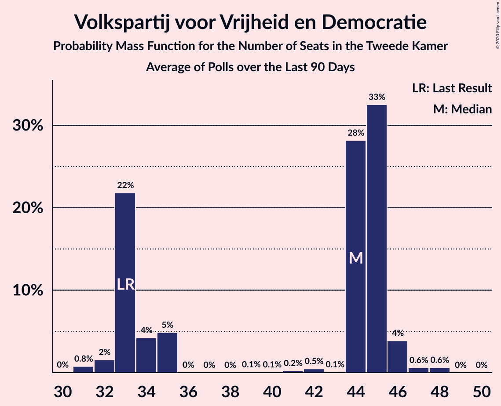

# Volkspartij voor Vrijheid en Democratie

<a href="#voting-intentions">Voting Intentions</a> | <a href="#seats">Seats</a>

## Voting Intentions

Last result: **21.9%** (General Election of 17 March 2021)

### Confidence Intervals

| Period     | Polling firm/Commissioner(s) | Median | 80% Confidence Interval | 90% Confidence Interval | 95% Confidence Interval | 99% Confidence Interval |
|:----------:|:----------------:|:-----------:|:-----------------------:|:-----------------------:|:-----------------------:|:-----------------------:|
| N/A | [Poll Average](average.html) | 22.6% | 20.1–24.6% | 19.6–25.0% | 19.3–25.4% | 18.7–26.3% |
| [1–2 October 2021](2021-10-02-Peilnl.html) | Peil.nl | 23.9% | 23.0–25.0% | 22.7–25.3% | 22.4–25.5% | 22.0–26.0% |
| [24–27 September 2021](2021-09-27-Ipsos.html) | Ipsos | 23.3% | 21.7–25.1% | 21.2–25.6% | 20.8–26.1% | 20.0–26.9% |
| [24–25 September 2021](2021-09-25-Peilnl.html) | Peil.nl | 23.3% | N/A | N/A | N/A | N/A |
| [17–20 September 2021](2021-09-20-Kantar.html) | Kantar | 22.0% | 20.4–23.7% | 20.0–24.2% | 19.6–24.6% | 18.8–25.5% |
| [17–18 September 2021](2021-09-18-Peilnl.html) | Peil.nl | 23.3% | 22.3–24.3% | 22.0–24.6% | 21.8–24.8% | 21.3–25.3% |
| [10–13 September 2021](2021-09-13-IOResearch.html) | I&O Research | 20.4% | 19.4–21.6% | 19.1–21.9% | 18.8–22.2% | 18.3–22.7% |
| [10–11 September 2021](2021-09-11-Peilnl.html) | Peil.nl | 24.6% | 23.6–25.6% | 23.3–25.9% | 23.1–26.2% | 22.6–26.7% |
| [3–4 September 2021](2021-09-04-Peilnl.html) | Peil.nl | 24.6% | 23.6–25.6% | 23.3–25.9% | 23.1–26.2% | 22.6–26.7% |
| [27–30 August 2021](2021-08-30-Ipsos.html) | Ipsos   EenVandaag | 24.6% | 22.9–26.4% | 22.5–26.9% | 22.0–27.4% | 21.2–28.2% |
| [20–21 August 2021](2021-08-21-Peilnl.html) | Peil.nl | 23.9% | 23.0–25.0% | 22.7–25.3% | 22.4–25.5% | 22.0–26.0% |
| [23–26 July 2021](2021-07-26-Ipsos.html) | Ipsos   EenVandaag | 23.3% | 21.7–25.1% | 21.2–25.6% | 20.8–26.0% | 20.0–26.9% |
| [23–24 July 2021](2021-07-24-Peilnl.html) | Peil.nl | 23.3% | 22.3–24.3% | 22.0–24.6% | 21.8–24.8% | 21.3–25.3% |
| [9–12 July 2021](2021-07-12-IOResearch.html) | I&O Research | 21.5% | 20.4–22.7% | 20.1–23.0% | 19.8–23.3% | 19.3–23.9% |
| [25–28 June 2021](2021-06-28-Ipsos.html) | Ipsos   EenVandaag | 24.6% | 23.0–26.4% | 22.5–26.9% | 22.1–27.4% | 21.3–28.3% |
| [27 June 2021](2021-06-27-Peilnl.html) | Peil.nl | 23.3% | 22.3–24.3% | 22.0–24.6% | 21.8–24.8% | 21.3–25.3% |
| [20 June 2021](2021-06-20-Peilnl.html) | Peil.nl | 23.3% | 22.3–24.3% | 22.0–24.6% | 21.8–24.8% | 21.3–25.3% |
| [12 June 2021](2021-06-12-Peilnl.html) | Peil.nl | 23.3% | 22.3–24.3% | 22.0–24.6% | 21.8–24.8% | 21.3–25.3% |
| [4–7 June 2021](2021-06-07-IOResearch.html) | I&O Research | 22.8% | 21.5–24.1% | 21.2–24.4% | 20.9–24.7% | 20.3–25.4% |
| [4–5 June 2021](2021-06-05-Peilnl.html) | Peil.nl | 23.3% | 22.3–24.3% | 22.0–24.6% | 21.8–24.8% | 21.3–25.3% |
| [28–29 May 2021](2021-05-29-Peilnl.html) | Peil.nl | 22.6% | 21.6–23.6% | 21.4–23.9% | 21.1–24.1% | 20.7–24.6% |
| [21–23 May 2021](2021-05-23-Ipsos.html) | Ipsos   EenVandaag | 22.9% | 21.2–24.6% | 20.8–25.1% | 20.4–25.6% | 19.6–26.4% |
| [21–22 May 2021](2021-05-22-Peilnl.html) | Peil.nl | 22.6% | 21.6–23.6% | 21.4–23.9% | 21.1–24.1% | 20.7–24.6% |
| [14–15 May 2021](2021-05-15-Peilnl.html) | Peil.nl | 22.6% | 21.6–23.6% | 21.4–23.9% | 21.1–24.1% | 20.7–24.6% |
| [7–9 May 2021](2021-05-09-Peilnl.html) | Peil.nl | 22.6% | 21.6–23.6% | 21.4–23.9% | 21.1–24.1% | 20.7–24.6% |
| [30 April–3 May 2021](2021-05-03-IOResearch.html) | I&O Research | 21.6% | 20.4–22.8% | 20.1–23.2% | 19.8–23.5% | 19.2–24.1% |
| [30 April–1 May 2021](2021-05-01-Peilnl.html) | Peil.nl | 21.3% | 20.3–22.3% | 20.1–22.5% | 19.8–22.8% | 19.4–23.3% |
| [23–24 April 2021](2021-04-24-Peilnl.html) | Peil.nl | 21.3% | 20.3–22.3% | 20.1–22.5% | 19.8–22.8% | 19.4–23.3% |
| [16–19 April 2021](2021-04-19-Ipsos.html) | Ipsos | 22.5% | 20.9–24.2% | 20.4–24.7% | 20.0–25.2% | 19.3–26.0% |
| [16–17 April 2021](2021-04-17-Peilnl.html) | Peil.nl | 21.3% | 20.3–22.3% | 20.1–22.5% | 19.8–22.8% | 19.4–23.3% |
| [9–12 April 2021](2021-04-12-IOResearch.html) | I&O Research | 21.6% | 20.5–22.8% | 20.1–23.2% | 19.9–23.5% | 19.3–24.1% |
| [9–10 April 2021](2021-04-10-Peilnl.html) | Peil.nl | 20.6% | 19.7–21.6% | 19.4–21.9% | 19.2–22.1% | 18.8–22.6% |
| [3–4 April 2021](2021-04-04-Peilnl.html) | Peil.nl | 18.6% | 17.7–19.6% | 17.5–19.8% | 17.3–20.1% | 16.9–20.5% |
| [26–27 March 2021](2021-03-27-Peilnl.html) | Peil.nl | 22.0% | 21.0–23.0% | 20.7–23.2% | 20.5–23.5% | 20.1–24.0% |

### Probability Mass Function

The following table shows the probability mass function per percentage block of voting intentions for the [poll average](average.html) for Volkspartij voor Vrijheid en Democratie.

| Voting Intentions | Probability | Accumulated | Special Marks |
|:-----------------:|:-----------:|:-----------:|:-------------:|
| 16.5–17.5% | 0% | 100% |  |
| 17.5–18.5% | 0.3% | 100% |  |
| 18.5–19.5% | 4% | 99.6% |  |
| 19.5–20.5% | 13% | 96% |  |
| 20.5–21.5% | 16% | 83% |  |
| 21.5–22.5% | 15% | 67% | Last Result |
| 22.5–23.5% | 19% | 51% | Median |
| 23.5–24.5% | 21% | 32% |  |
| 24.5–25.5% | 9% | 11% |  |
| 25.5–26.5% | 2% | 2% |  |
| 26.5–27.5% | 0.3% | 0.3% |  |
| 27.5–28.5% | 0% | 0% |  |

## Seats

Last result: **34** seats (General Election of 17 March 2021)

### Confidence Intervals

| Period     | Polling firm/Commissioner(s) | Median | 80% Confidence Interval | 90% Confidence Interval | 95% Confidence Interval | 99% Confidence Interval |
|:----------:|:----------------:|:------:|:-----------------------:|:-----------------------:|:-----------------------:|:-----------------------:|
| N/A | [Poll Average](average.html) | 32 | 31–37 | 31–37 | 31–37 | 29–38 |
| [1–2 October 2021](2021-10-02-Peilnl.html) | Peil.nl | 37 | 37 | 37 | 37 | 37 |
| [24–27 September 2021](2021-09-27-Ipsos.html) | Ipsos | 35 | 31–37 | 31–38 | 31–38 | 31–42 |
| [24–25 September 2021](2021-09-25-Peilnl.html) | Peil.nl |  |  |  |  |  |
| [17–20 September 2021](2021-09-20-Kantar.html) | Kantar | 31 | 31–33 | 31–34 | 31–34 | 30–35 |
| [17–18 September 2021](2021-09-18-Peilnl.html) | Peil.nl | 36 | 33–38 | 33–38 | 32–38 | 32–38 |
| [10–13 September 2021](2021-09-13-IOResearch.html) | I&O Research | 31 | 31–34 | 31–35 | 30–35 | 29–36 |
| [10–11 September 2021](2021-09-11-Peilnl.html) | Peil.nl | 39 | 38–42 | 38–42 | 38–42 | 37–42 |
| [3–4 September 2021](2021-09-04-Peilnl.html) | Peil.nl | 39 | 36–39 | 36–40 | 36–40 | 36–41 |
| [27–30 August 2021](2021-08-30-Ipsos.html) | Ipsos   EenVandaag | 35 | 35–40 | 35–42 | 33–42 | 32–43 |
| [20–21 August 2021](2021-08-21-Peilnl.html) | Peil.nl | 41 | 36–41 | 36–41 | 35–41 | 35–41 |
| [23–26 July 2021](2021-07-26-Ipsos.html) | Ipsos   EenVandaag | 39 | 39 | 34–39 | 31–41 | 31–41 |
| [23–24 July 2021](2021-07-24-Peilnl.html) | Peil.nl | 37 | 35–40 | 35–40 | 35–40 | 35–40 |
| [9–12 July 2021](2021-07-12-IOResearch.html) | I&O Research | 33 | 31–36 | 31–36 | 31–36 | 30–37 |
| [25–28 June 2021](2021-06-28-Ipsos.html) | Ipsos   EenVandaag | 40 | 40 | 40–42 | 38–42 | 36–42 |
| [27 June 2021](2021-06-27-Peilnl.html) | Peil.nl | 36 | 34–36 | 34–36 | 34–36 | 34–37 |
| [20 June 2021](2021-06-20-Peilnl.html) | Peil.nl | 36 | 34–36 | 34–36 | 34–36 | 34–37 |
| [12 June 2021](2021-06-12-Peilnl.html) | Peil.nl | 36 | 36 | 36 | 36 | 35–38 |
| [4–7 June 2021](2021-06-07-IOResearch.html) | I&O Research | 34 | 34 | 34–36 | 34–36 | 34–39 |
| [4–5 June 2021](2021-06-05-Peilnl.html) | Peil.nl | 33 | 33–39 | 33–39 | 33–39 | 33–39 |
| [28–29 May 2021](2021-05-29-Peilnl.html) | Peil.nl | 37 | 35–37 | 33–37 | 33–37 | 31–38 |
| [21–23 May 2021](2021-05-23-Ipsos.html) | Ipsos   EenVandaag | 35 | 31–39 | 31–39 | 31–39 | 30–39 |
| [21–22 May 2021](2021-05-22-Peilnl.html) | Peil.nl | 37 | 35–37 | 33–37 | 33–37 | 31–38 |
| [14–15 May 2021](2021-05-15-Peilnl.html) | Peil.nl | 37 | 35–37 | 33–37 | 33–37 | 31–38 |
| [7–9 May 2021](2021-05-09-Peilnl.html) | Peil.nl | 35 | 33–37 | 33–38 | 33–38 | 31–38 |
| [30 April–3 May 2021](2021-05-03-IOResearch.html) | I&O Research | 36 | 33–36 | 33–36 | 33–36 | 32–38 |
| [30 April–1 May 2021](2021-05-01-Peilnl.html) | Peil.nl | 34 | 34 | 32–34 | 32–34 | 32–34 |
| [23–24 April 2021](2021-04-24-Peilnl.html) | Peil.nl | 34 | 34 | 32–34 | 32–34 | 32–34 |
| [16–19 April 2021](2021-04-19-Ipsos.html) | Ipsos | 35 | 30–38 | 30–38 | 29–38 | 29–38 |
| [16–17 April 2021](2021-04-17-Peilnl.html) | Peil.nl | 35 | 33–35 | 32–36 | 31–36 | 30–36 |
| [9–12 April 2021](2021-04-12-IOResearch.html) | I&O Research | 33 | 33–35 | 32–35 | 31–35 | 30–35 |
| [9–10 April 2021](2021-04-10-Peilnl.html) | Peil.nl | 32 | 32 | 32–33 | 32–33 | 28–34 |
| [3–4 April 2021](2021-04-04-Peilnl.html) | Peil.nl | 29 | 29 | 29 | 29 | 29 |
| [26–27 March 2021](2021-03-27-Peilnl.html) | Peil.nl | 34 | 34 | 34 | 34 | 34–37 |

### Probability Mass Function

The following table shows the probability mass function per seat for the [poll average](average.html) for Volkspartij voor Vrijheid en Democratie.

| Number of Seats | Probability | Accumulated | Special Marks |
|:---------------:|:-----------:|:-----------:|:-------------:|
| 28 | 0.1% | 100% |  |
| 29 | 0.4% | 99.9% |  |
| 30 | 0.8% | 99.5% |  |
| 31 | 41% | 98.7% |  |
| 32 | 9% | 57% | Median |
| 33 | 2% | 48% |  |
| 34 | 3% | 47% | Last Result |
| 35 | 11% | 44% |  |
| 36 | 3% | 33% |  |
| 37 | 28% | 30% |  |
| 38 | 1.2% | 2% |  |
| 39 | 0.1% | 0.4% |  |
| 40 | 0.1% | 0.3% |  |
| 41 | 0% | 0.2% |  |
| 42 | 0.2% | 0.2% |  |
| 43 | 0% | 0% |  |

